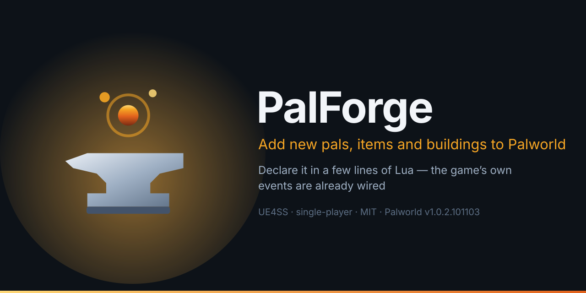

<p align="center">
  
</p>

# PalForge

A content framework for **single-player Palworld**, written in Lua and running on
[UE4SS](https://github.com/UE4SS-RE/RE-UE4SS). You describe a piece of content in a short file —
a building, an item, a pal, a skill, a status effect, a sound, a model, a menu — and PalForge
registers it, wires it to the game's own events, and gives it somewhere to keep its state.

```lua
require("palforge.api")

Building{
    id = "CampFire",                        -- the game's own build id
    events = {
        onRightClick = function(self, ctx)  -- fires on the real campfire, in a real save
            Item.get("Wood"):give(5)
        end,
    },
}
```

Licence: MIT (`LICENSE`). One piece of third-party code ships inside it — RxLua, MIT, © 2015 Bjorn Swenson — and its notice is in `THIRD-PARTY-NOTICES.md`.

Full documentation: **https://dr-mikan.github.io/PalForge/** ·
Source: **https://github.com/dr-mikan/PalForge** · MIT · measured against Palworld **v1.0.2.101103**

Found a defect, or want to know what is already known to be broken?
**[Issues](https://github.com/dr-mikan/PalForge/issues)** is where characterised work lives;
`plan/TODO.md` is the engineering record behind it, including what was measured and what was
deliberately not built.

---

## Single-player only

> PalForge targets SINGLE-PLAYER Palworld. Dedicated servers and co-op guests are not
> supported and are not tested: there is no replication layer, and the item, spawn and event
> routes are all client-authoritative. A pack may appear to work for the host and do nothing
> for anyone else.

That is a deliberate scope decision, not an oversight, and the reasons are structural rather
than incidental. `core/spawn.lua` builds a `PalCheatManager` off the **local** player
controller. Spending an item goes through a locally spawned `APalWeaponBase::RequestConsumeItem`.
Every event source in `core/event.lua` is a local `RegisterHook`. None of it has ever been run
against a dedicated server or a co-op guest, and none of it would be expected to behave. If
server support is ever in scope it is a new subsystem — authority checks on every write, an RPC
seam, a decision about who owns pack state — not a fix to any one of the items below.

The same sentence is printed in the log at every startup, so nobody has to find it here first.

## Which Palworld this was measured against

Every capability PalForge reports as working was measured — watched in a real save, or read off
the installed binary's own declarations — against **Palworld v1.0.2.101103**. That number is
in `Scripts/palforge/env.lua` as `gameBuild`, and it is in the startup line, because a framework
that does not say which build it was measured on gives its users no way to tell *"PalForge is
broken"* from *"the game moved"*. This tree has already been bitten by exactly that gap: `AddItem`
turned out to declare five parameters where the header dump had four, because the dump predated
the installed binary by a single patch.

At startup PalForge also asks the running game what build it is (`UKismetSystemLibrary`) and
records the answer in `env.gameBuildLive`. When the two disagree it says so once, in one line. If
the game cannot answer, the line reads `unknown` rather than a guess.

## Requirements

| | |
| --- | --- |
| Palworld | measured against v1.0.2.101103 (Steam, Win64) |
| UE4SS | with the Lua mod loader — if you already run other Palworld Lua mods, you have it |
| `CheatManagerEnablerMod` | **ships with UE4SS** — it is one of the mods in UE4SS's own `Mods/` folder and is listed in the `mods.txt` UE4SS installs, so having UE4SS means having it. It is not a separate download. `core/spawn.lua` builds a cheat manager itself off the local player controller (`StaticConstructObject(pc.CheatClass, pc)`), so `Pal.Handle:spawn` does not need it — what that needs is a player controller, i.e. a loaded save. The enabler still helps `utils/items` (`give` / `take` / `unlockTech`), which finds a cheat manager but does not construct one; without one those log `no PalCheatManager` and return false |

## Install

Copy the tree below into `Pal/Binaries/Win64/ue4ss/Mods/`. **`palforge/` has to sit next to
`main.lua`** — `main.lua` puts its own `Scripts/` directory on `package.path` and looks for
everything else there, so a different layout breaks every part of it.

```text
ue4ss/
└── Mods/
    └── PalForge/
        ├── enabled.txt          <- empty file; UE4SS starts a mod only when this exists
        └── Scripts/
            ├── main.lua
            └── palforge/
                ├── env.lua      <- the dev/release switches and the declared game build
                ├── types.lua    <- editor annotations only; nothing loads it at runtime
                ├── autorun.txt  <- the keyless dev queue (core/autorun.lua reads it here)
                ├── api/         <- the public surface a pack writes against
                ├── core/        <- the engine: kernel, event system, Palworld bridges, and
                │                   the keyboard/, mesh/, sound/, unittests/ subsystems
                ├── native/      <- Palworld's own content as data catalogs
                ├── utils/       <- log, json, file, items
                └── test/        <- DEV ONLY. A release install does not have this directory
                    ├── init.lua      the one entry point — install() does all of it
                    ├── units/        the headless bundle, run at boot under dev
                    ├── cases/        the in-game API suite, the thing F1 runs
                    ├── hooks/        measurements that need a running game; declared,
                    │                 never auto-run, each asked for by name
                    ├── probes/       discovery dumps — not tests; they pass and fail nothing
                    └── tools/        dev instruments: catalog.lua, the body of `ps_catalog`
```

**There is one test directory and it is `test/`, singular.** There used to be two, `test/` and
`tests/`, one character apart, and production code reached into both — the kernel ran the headless
bundle out of `palforge.tests`, the `ps_catalog` handler named `palforge.tests.catalog`,
`core/registry` required `palforge.test` for its side effects, and `core/autorun.lua` pulled
`require("palforge.test").ACTIONS` on every world load. `palforge/tests/` no longer exists and
those module paths resolve to nothing. The kernel's whole knowledge of the tests is now one name
and one call in `core/registry.lua`:

```lua
local testState = requireState("palforge.test")
if testState == "loaded" then require("palforge.test").install(record) end
```

`install()` runs the boot bundle, loads the cases, binds F1 and the probe keys, registers the
console commands including `ps_catalog`, and hands `core/autorun` its action table. `core/autorun.lua`
names nothing under `test/` any more.

**A release install has no test tree at all**, and that is now a fact about the files rather than
about a runtime switch. `tools/deploy.sh --release` deletes `palforge/test/` from the staged copy
before the swap. Deploy both modes into a throwaway target and the script counts them for you: a
dev deploy lands **130 files**, a release deploy **71**. So `requireState("palforge.test")`
answering `absent` is the *correct* state for a player's copy, not an incomplete one — there is no
F1 suite to arm because the files are not there. A dev deploy keeps it, and there it is the whole point.

Two entries are easy to leave out and each has a consequence that looks like something else:

* **`palforge/test/`, in a DEV copy.** `core/registry.lua` calls the line above, and
  `install()` is what binds **F1**, the probe keys and every `pf_*` console command. A dev install
  missing this directory has no test suite and no F1 key, with nothing in the log to explain it
  beyond the kernel naming it in its "dev tooling NOT loaded" line. In a release copy that same
  line is expected and means nothing is wrong.
* **`palforge/autorun.txt`.** `core/autorun.lua` reads it from beside `palforge/` and runs named
  actions on world load. It is how anything gets run on a machine where no key and no console
  works — three input routes have failed in turn on this project.

`palforge/deprecated/` and `palforge/tmp/` are reference-only, are not needed at runtime, and are
dropped from **both** deploy modes. `palforge/build.lua` is generated by `tools/deploy.sh` and is
not in the repository.

Then switch the mod on, with either an empty `enabled.txt` in the mod folder or a line in
`ue4ss/Mods/mods.txt`:

```text title="ue4ss/Mods/mods.txt"
CheatManagerEnablerMod : 1
PalForge : 1
```

### Confirming it loaded

`Pal/Binaries/Win64/ue4ss/UE4SS.log` gets one line per startup, and it carries everything needed
to answer "is this thing even running":

```text
[PalForge.main][info] PalForge v0.3.0 starting | game build: declared v1.0.2.101103, live unknown (UKismetSystemLibrary CDO did not resolve) | dev=false debug=false | dev overlay: absent (release copy)
[PalForge.main][info] PalForge targets SINGLE-PLAYER Palworld. Dedicated servers and co-op guests are not supported and are not tested: ...
[PalForge.registry][info] dev tooling NOT loaded (env.dev = false, the shipped default): no dev keybinds — including F4, unlock all technologies — ...
[PalForge.registry][info] initialized (dev=false, debug=false, <n> class(es) registered)
[PalForge.main][info] ready
```

`live` is whatever the running game answers when asked for its build string. UE4SS starts a Lua
mod early, so `unknown` at that moment is ordinary rather than a failure — the read is retried
once at the first world load and the answer logged there. PalForge would rather print `unknown`
than a guess.

## What PalForge writes, and what removing it does

This is the question a base mod owes its users a straight answer to, and it splits in two. One
half is settled; the other is real, bounded, and named here rather than left to be discovered.

**PalForge's own saved state is a sidecar, and it is not in your Palworld save.** Everything the
framework persists is a JSON document under its own mod folder:

```text
Pal/Binaries/Win64/ue4ss/Mods/PalForge/
└── state/
    ├── README.txt                                  the same statement, next to the files
    └── w_1DF0E44B4FDDD6196E30819A899C9009/         one directory per Palworld save
        ├── _save.json                              which save this is, which mods it holds
        ├── _unowned.json                           records no pack can be attributed to yet
        ├── mypack.json                             ONE FILE PER MOD ID
        ├── mypack.json.bak                         the previous good copy, never deleted
        └── _quarantine/                            files that would not parse, moved aside
```

Nothing in `Scripts/palforge` calls `SaveGame`, `RequestSave` or `WriteSave`, and nothing there
opens a `.sav` — grep the tree for those four spellings and every hit is a comment asserting the
negative. Grep instead for a file opened for writing and there are three answers, all inside the
mod folder: `utils/file/json_file.lua` writing into `state/`, the DataTable dump `ps_catalog`
writes into `Scripts/catalog/`, and two `test/hooks` that a developer has to arm and name. The last
two are dev-only twice over — `env.dev` has to be on, and `tools/deploy.sh --release` does not
copy `palforge/test/` at all, so a player's install does not contain those files. `state/` is
resolved from the module's own path rather than a configured one, so "everything is inside
`Mods/PalForge/`" stays structurally true instead of currently true.

So: **delete the PalForge folder and your world still loads.** What is lost is the state mods kept
for your structures, not the save. Removing one mod is one file — `state/<save>/<mod id>.json` —
and a mod that is merely absent is never read, so it can cost nothing and be evicted by nothing.

That layout is not a design sketch. It was exercised against a real save on 2026-08-02: a pack's
state went out through the public surface, 370 bytes landed on disk, and every field read back
identically off the real path — after the run found a genuine defect that a Linux-only test suite
could never have caught (`ensureDir` asked `io.open` whether a *directory* existed, and Windows
says no even for one `mkdir` has just made, so 553 headless checks passed while the game wrote
nothing). A second hook then planted a torn write and an unreadable file on NTFS and confirmed all
four rows of the crash-recovery table — `<pack>.json` beside `<pack>.json.bak` with no `.tmp` left
over. Loading a real base with seven structures and no registered definitions cost **0 bytes and
0.00 ms**, because a pack that declares nothing is never read.

**What does reach Palworld's own save is what PalForge asks the GAME to do.** Three calls make the
game record a name, and they are the three the ledger records:

| Call | What the game writes into its own save |
| --- | --- |
| `Item.get("mypack:Potion"):give(1)` | the row name `mypack_Potion` into an inventory container |
| `Building.get("mypack:Bench"):unlock()` | that name into the player's unlocked-technology list |
| `Skill.get("mypack:Legend"):teach(pal)` | that name onto a character's passive-skill list |

Those rows exist only because a pack's PalSchema JSON injected them. Remove the pack and the save
holds a name with no row behind it. `Item.get("Wood"):give(1)` is not in that category at all — a
vanilla row cannot stop existing — which is why PalForge records only namespaced ids, and only
when the call succeeded, in that pack's `ledger` section. That log is per save and per pack, it
survives the pack's uninstall, and it is the only thing in this tree that can name — id by id —
what an uninstall would leave dangling:

```lua
PalForge.pack("mypack").store.reclaim()   -- a report; .text is one English paragraph
```

The recording happens at the **engine boundary** rather than on the `Handle` — `utils/items.give`,
`utils/items.unlockTech` and `core/character.addSkill` are the three lines that call it — so a pack
that goes the direct route, `PalForge.utils.items.give(...)`, is recorded on the same terms. A
fourth kind, `pal`, is declared in `core/ledger.lua` because the file format carries it and is
written by nothing today: `Pal.Handle:spawn` does put a character into the world, but whether a
spawned pal survives into the save has not been measured, and a ledger row asserting it would be a
guess. Active skills are deliberately never recorded — `EPalWazaID` is a fixed vanilla enum and Lua
cannot mint a value, so nothing written through it can stop being valid.

An item can be taken back from the local player's own bag; one already in a chest cannot be
reached. A passive can be removed from a character you can hold. **A technology unlock cannot be
reversed at all** — `UPalCheatManager` declares four unlock entries and no lock, and no lock,
remove, reset or forget entry appears anywhere in the header dump — so `unlock()` is one-way and
the report says so in those words.

**And the part nobody has measured yet.** What Palworld does when it loads a save holding a name
whose DataTable row is gone has not been watched happen. Everything readable off the binary says
the shape is a *missing lookup* rather than a broken file: the save stores plain `FName`s, rows
are resolved through accessors built to fail (`TryGetStaticItemData` returns a bool, as does the
whole `BP_FindRow(row, bool&)` family), and `EPalSaveError { Success, NotFound, Unknown, Broken,
OutOfMemory }` has no "unknown content" member. That is well-founded, not proven — the load path
is unreflected C++, so there is nothing to interrogate and only an experiment can settle it
(`test/hooks/save-survives-pack-removal`). Until it is run, tell your players that, in those
words.

Full detail, including the store your pack gets and how the layout is migrated from the older
single file, is in the docs under **Concepts → Saved state**.

## What actually works

PalForge is at **v0.3.0**, and here is the honest summary in one paragraph. Everything in the
*Works* column below was measured against Palworld v1.0.2.101103 — either watched happening in a
real save, or read off the installed binary's own function declarations, and the source comment
next to each one says which and on what date. **One capability item is still open**
(`audio-setvolume-audible`: `setVolume` returns true at every volume, and a hedged human report
that 0.00 was *not silent* is all anyone has), and **seven more are implemented but have never
been exercised by a running Palworld** — they are shipped code with a declared hook pointing at
them and no session that ran it. Both lists, with the single action that settles each, are in
`plan/TODO.md`. Everything that is refused is refused *loudly*: it returns nil, or does not fire,
or raises at define time and names the measurement. Nothing below silently does the wrong thing.

| Domain | Works | Does not |
| --- | --- | --- |
| **Item** | `:give`, `:take`, `:count` — all three observed in a real save, each verified by reading the inventory back. `onObtain` / `onUse` / `onCraft` / `onDiscard` all fire. `:iconOf` reads the game's own artwork. `:recipeOf` reads the game's own recipe row — confirmed running in a game on 2026-08-02: `Arrow -> Arrow x10, work=1000.0, from { Stone x2, Wood x2 }`. **`restores = { satiety = 20, hpRate = 0.25 }` feeds and heals**, wired onto `item.use` and measured on a live character | `restores = { hp = 50 }` — an *absolute* HP amount — is refused at define time: it takes `FFixedPoint64`, a struct UE4SS cannot marshal from Lua. Declare `hpRate` instead |
| **Pal** | `:spawn` and placement, both observed end to end. `onCaptured` / `onDamaged` / `onDeath` / `onSpawned` fire — and `onSpawned` is now measured firing for a genuinely new pal: 27 firings, 17 of them nowhere near a world load. Reading a pal's skills works. `:iconOf` reads 674/674 rows | whether a spawned pal survives into the save has never been watched (`pal-spawn-persisted`), so nothing records one |
| **Building** | the most complete domain: placement, per-structure instances, per-world save/load, `onPlace` / `onLoad` / `onRightClick` / `onRemove` / `onTick` / `onBuild` / `onWorldReady` / `onWorldLeft` | `onLeftClick` and `onBreak` are settled **negatively** — the game exposes no such hook. Disappearance surfaces as `onRemove(reason = "missing")` |
| **Effect** | `nativeStatus` turns the game's real ailments on and off, observed in a save. The duration / interval / stacking runtime is PalForge's own and works without the game | the ailment runs on the game's rules; PalForge does not control its strength |
| **Skill** | `onActivate` and `onEquip` / `onUnequip` observed firing in real combat. `:skillsOn` reads a pal's real loadout. **`:teach` / `:forget` land on a live pal** — 8 pass / 0 fail on a real save, read back off the character, and the game stayed up. Manual `:activate` / `:hit` with the cooldown enforced in Lua | `onHit` never fires, settled structurally: not one field in the three damage structs this build declares names a waza (`skill-hit-source`). An active skill's `element` and `power` are framework-side metadata that reach nothing, and a handler has no call available to it that puts an object in the world — six routes walked, every one takes a struct, so `:spawnProjectile` is a callable refusal (`skill-projectile-spawn`) |
| **Audio** | the vanilla route: a 1957-entry AkAudioEvent catalog, `Audio.get(id):play()`, `:stop`, `:setVolume` | custom sound files. `Audio.Spec.soundFile` is **refused at define time** and names the reason (`audio-custom-file-loader`) — it used to outrank `soundId`, so setting it silenced audio that had been playing. `:setVolume` returns true for ISSUED, and says so: nobody has confirmed anything got quieter (`audio-setvolume-audible`, the one open item) |
| **Mesh** | vanilla `/Game/...` static and skeletal meshes, class-checked before they are handed to the engine; `.obj` geometry from disk; a PNG of your own, imported and cached — `ImportFileAsTexture2D` returned a real `Texture2D` in a loaded save and the second call for the same path came back identical. **A colour change was watched happening**: a chest went red → green → blue | an imported texture is one `UTexture2D` per path per session that nothing in this process can destroy, which is what the cache is for. See the asset table below |
| **UI** | building widgets out of Palworld's own UMG kit and mounting them into the game's own UI root — confirmed live, through the game's own CommonUI layer. **There is a native rebuild signal and `:autoRefresh(ms)` rides it**: `CommonActivatableWidget::ActivateWidget`, `PalHUDService::Push` and `PalHUDService::Close` all fire when Palworld builds or tears down a screen | the heartbeat poll stays underneath as the floor and is not removable — the signal is armed only after `world.ready`, and 18 of the 21 candidates armed stayed silent, which is an absence of *input* rather than proof they never fire |
| **Player** | `Player.character()`, `Player.coordinate()`, `Player.coordinateOffset(dx, dy, dz)` | — |

## What a pack can ship

This is the part most likely to be assumed rather than read.

| Asset | From your pack | Vanilla `/Game/...` |
| --- | --- | --- |
| Static / skeletal mesh | **No** — the loader refuses a path that does not start with `/` | Yes, working, class-checked |
| Procedural geometry | **Yes** — `.obj` off disk | n/a |
| Texture | **Yes** — a PNG off disk. `ImportFileAsTexture2D` was called in a loaded save on 2026-08-02 and handed back a real `Texture2D`, cached by path | Yes |
| Sound | **No** — refused at define time | Yes, 1957-entry catalog |
| Material | **No** — only "parent a dynamic instance to an already-loaded material" | Yes |

So today **PalForge is a reference-vanilla-assets framework, with a working OBJ side door and a
working custom-PNG one.** If your content is built out of Palworld's own assets plus your own
behaviour, you are on the road that is measured. If it needs your own art, two of the five rows
above are open to you and the other three are not.

A file your pack ships can be resolved against **your own directory** rather than the game's
working directory, which is what makes a pack portable between machines instead of correct on
exactly one:

```lua
local file = require("palforge.utils.file")
Mesh{ id = "example:marker", kind = "obj", model = file.resolvePackPath("marker.obj") }
```

`file.packDir()` gives the directory of the file that called it, and `resolvePackPath` returns an
absolute path unchanged — so it is safe to run over any path, including a `/Game/...` object
path. When no pack directory can be found the path comes back untouched, which fails later with
the string you actually wrote instead of one PalForge guessed.

## Dev mode

**PalForge ships with every dev tool off**, and this is worth saying plainly because it used to
be the other way round. `env.dev` and `env.debug` both default to `false` in
`Scripts/palforge/env.lua`, and nothing in the framework turns them on.

What `dev` arms: nine keybinds — including **F4, which unlocks every technology in the loaded
save** — the F1 API suite (`test/cases/`; it spawns pals and hands out items), F9
reload-without-restarting, the `ps_catalog` DataTable dumper (`test/tools/catalog.lua`), and the
headless unit bundle at boot (`test/units/`). All of it comes out of one `install()` call, so
either every piece is there or none is. What `debug` additionally arms: the 25 game-required test
hooks under `test/hooks/`, which are declared rather than run — `pf_hooks` lists them with the
reason each one would skip right now, `pf_hook <id>` runs one by name, and the nine that write
into a save need `env.debugHooks[id] = true` on top of that.

None of that reaches a player's copy twice over. `env.dev` is `false`, *and* a release deploy does
not contain `palforge/test/` at all — the kernel's one `requireState("palforge.test")` answers
`absent`, which is the correct answer for a release rather than a broken install.

The switch is one optional file, `Scripts/palforge_dev.lua`, which `main.lua` requires
immediately before the kernel starts and ignores when it is absent:

```lua
-- Scripts/palforge_dev.lua
local env = require("palforge.env")
env.dev   = true
env.debug = true
```

It is gitignored, so it cannot reach a player through this repository, and `tools/deploy.sh`
writes it for you:

```bash
tools/deploy.sh                        # dev deploy into the default install; writes the overlay
tools/deploy.sh "/path/to/Palworld"    # dev deploy somewhere else
tools/deploy.sh --writes               # dev deploy with ALL NINE write opt-ins on. Throwaway save only
tools/deploy.sh --release              # no overlay, no test tree, stale copies deleted by name
```

The overlay `tools/deploy.sh` writes lists the nine `env.debugHooks` opt-ins **commented out**, one
per line, because each is a separate decision. `--writes` uncomments all nine at once and prints a
warning while it does it. That is for the one session deliberately sweeping them with `pf_hooks_all`
on a save you do not care about: **three of the nine cannot be undone** — a spawned pal has no
per-individual removal, an unlocked technology has no lock, and a taught active move is the one
write in this tree that has ever correlated with the game closing.

The script replaces the deployed `Scripts/` wholesale (staging first, then two renames, so the
game never sees a half-populated tree), stamps the copy with a build timestamp so a stale in-game
run is visible in the log, and prints which mode it ran in and how many files it wrote — **130 in
dev, 71 with `--release`**, the difference being `palforge/test/` and the one-file overlay.
`deprecated/` and `tmp/` are dropped from both. **It never edits `env.lua`**: a
release toggle that a tool flips on is a release toggle that eventually ships on, which is how
`dev = true` came to be the shipped default in the first place.

## Repository layout

```text
Scripts/          the mod itself — this is what gets installed
docs/             the documentation site (Next.js + Fumadocs), published to GitHub Pages
dumps/            measured reflection data recovered from real sessions: class listings,
                  DataTable rows. The evidence behind the closed items
plan/TODO.md      what does not work yet, why, and the exact measurement each item needs
skills/           agent skill definitions for working on this repo
tools/            deploy.sh, and the generators for types.lua and the skill reference
e2e/              Playwright checks for the docs site
```

## Checking a change

One command runs the whole gate, and it is what CI runs:

```bash
npm run check      # lint:lua -> lint:sh -> test -> types:check -> lint:docs
```

`npm test` is the headless Lua suite on its own. It needs no game and no engine — a plain `lua5.4`
process, in about a second:

```text
tests: 576 passed, 0 failed, 36 skipped (612 total)
tests: 36 skipped (31 need a world, 1 need a declared test/hooks run, 3 could not be answered by
this session, 1 did not say which)
```

**`0 failed` is the only number that has to hold.** A skip carries a direction rather than being
an unexplained gap: 31 of them are checks that need a loaded save and can only run in the game
(press **F1** there), one is measured by a declared hook instead, and the rest are questions a
process with no engine cannot ask. `npm run package` builds `dist/PalForge.zip` through
`tools/deploy.sh --package`, which is the same copy and the same drops as a release deploy, so the
archive is not a second file list that can drift from the first.

## Licence

MIT — see [LICENSE](LICENSE). Copyright (c) 2026 YUYA556223.

Source: **https://github.com/dr-mikan/PalForge** · Documentation:
**https://dr-mikan.github.io/PalForge/**
