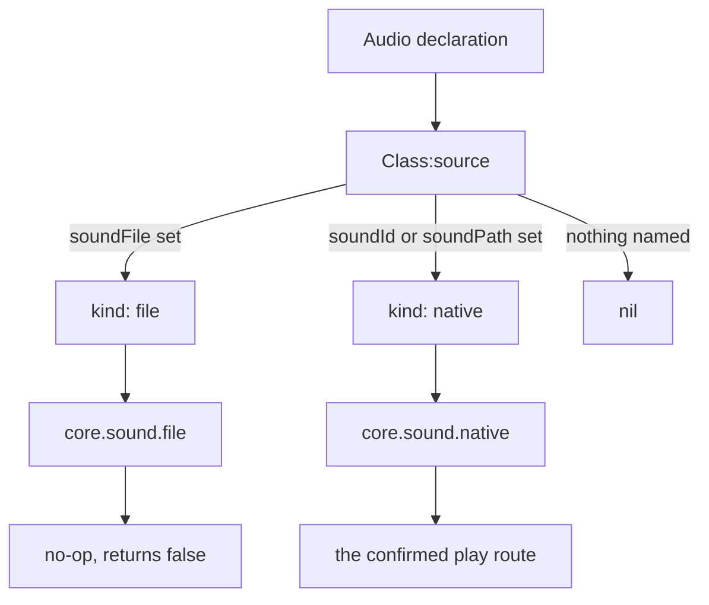
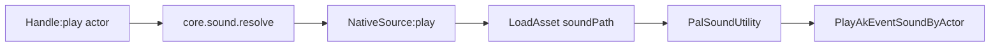
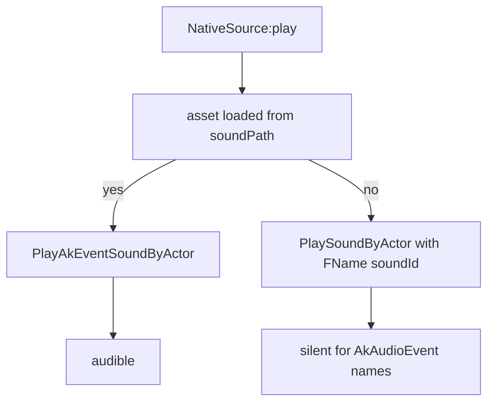

`Audio` は再生可能なサウンド 1 つを表します。BGM でも単発の効果音でもかまいません。形は他の
API モジュールとまったく同じで、呼び出して定義し、`get` / `get_all` があり、そのドメインの
アクションを持つ Handle が返ります。

Audio には**ライフサイクルイベントがありません**。`Audio.Spec` に `events` フィールドはなく、
バス上に audio 用のチャンネルもなく、購読する対象も存在しません。サウンドは反応するものでは
なく再生するものなので、Handle が持つのはアクションとクエリだけです。

```lua
local Theme = Audio.bgm{
    id        = "AKE_BGM_Title",
    soundId   = "AKE_BGM_Title",
    soundPath = "/Game/Pal/Sound/Events/SE/UI/BGM_Title/AKE_BGM_Title.AKE_BGM_Title",
}

Theme:play()          -- on the local player pawn
Theme:stop()
```

## Define a sound

モジュールを呼び出すことが定義です。呼び出しごとに spec が検証され、定義は `core/object_manager`
の `("audio", id)` に登録され、`Audio.Handle` が返ります。

<Tabs items={['Audio', 'Audio.bgm', 'Audio.se']}>
<Tab value="Audio">

```lua title="content/sounds.lua"
local Explosion = Audio{
    id          = "example:Blast",
    name        = "Blast",
    description = "Played when the reactor overloads.",
    kind        = "se",
    soundId     = "AKE_General_Explosion",
    soundPath   = "/Game/Pal/Sound/Events/SE/Common/Explosion/AKE_General_Explosion.AKE_General_Explosion",
}
```

</Tab>
<Tab value="Audio.bgm">

```lua title="content/sounds.lua"
-- identical to Audio{ ... } with kind = "bgm" written out
local BossTheme = Audio.bgm{
    id        = "example:BossTheme",
    soundId   = "AKE_LegendDeer_State_Strong_Strong",
    soundPath = "/Game/Pal/Sound/Events/BGM/LegendDeer/AKE_LegendDeer_State_Strong_Strong.AKE_LegendDeer_State_Strong_Strong",
}
```

</Tab>
<Tab value="Audio.se">

```lua title="content/sounds.lua"
local Pickup = Audio.se{
    id        = "example:Pickup",
    soundId   = "AKE_GrabItem",
    soundPath = "/Game/Pal/Sound/Events/SE/UI/Item/AKE_GrabItem.AKE_GrabItem",
}
```

</Tab>
</Tabs>

`Audio.bgm` と `Audio.se` は `kind` を固定するだけで、それ以外は `Audio{ ... }` と同じ処理を
行います。渡したテーブルは変更されずコピーされ、そのテーブル内の `kind` がコンストラクタと
矛盾する場合は、黙って上書きするのではなくハードエラーになります。

```lua
Audio.bgm{ id = "example:Theme", kind = "se" }
-- PalForge: Audio.bgm: kind is fixed to "bgm" here, but got "se" - use Audio{ ... } to set it
```

## The spec

`Audio.Spec` は `core/schema` で宣言され、モジュール内の local のままです。実行時にはレジストリ
経由で読み出します。

```lua
local schema = require("palforge.core.schema")
print(schema.help("Audio.Spec"))          -- every field, type, default and meaning
schema.get("Audio.Spec").fields           -- the same as a table, for tooling
```

<TypeTable
  type={{
    id: {
      description: 'サウンド id。AkAudioEvent 名、または "pack:name" 形式。空でない文字列である必要があります。',
      type: 'string',
      required: true,
    },
    name: {
      description: '表示用のラベル。既定値は id。',
      type: 'string',
    },
    description: {
      description: 'UI やツール向けの 1 行説明。',
      type: 'string',
    },
    kind: {
      description: '説明用のみ。ネイティブの再生経路は両者で同一です。"se" または "bgm"。',
      type: 'string',
      default: 'se',
    },
    soundId: {
      description: 'ネイティブの AkAudioEvent 名。SoundID フォールバック経路であり、同時に core.sound がソースを解決するために必須の値でもあります。',
      type: 'string',
    },
    soundPath: {
      description: 'ネイティブの AkAudioEvent アセットパス。実際に音を鳴らすのはこちらの経路です。',
      type: 'string',
    },
    soundFile: {
      description: 'カスタム音声ファイルのパス。未接続部分で、解決はされますが何もしません。後述の Seams を参照。',
      type: 'string',
    },
    source: {
      description: '既定の変換処理を置き換え、core.sound に渡すソース spec を自分で返すオーバーライド。',
      type: 'function',
    },
    data: {
      description: '自由形式の任意ペイロード。定義にそのまま保持されます。',
      type: 'table',
    },
  }}
/>

検証は厳密です。宣言されていないフィールドは定義時点でエラーになり、候補の提示が付くため、
タイプミスが黙って無視されることはありません。

## How a sound actually plays

宣言は `core/sound` が解決するソース spec へと*降ろされ*ます。`soundFile` はネイティブの各
フィールドより優先され、サウンドを何も指定していない定義は `nil` に降ります。ただし宣言が
この分岐に到達することはほとんどありません。`Audio{ ... }` が先に `id` から `soundId` を
埋めるためで、その挙動は後述の The id fallback で扱います。



ネイティブ経路はゲーム内で確認済みです。カタログの 1 エントリは Wwise の **AkAudioEvent 名**と
既知の**アセットパス**の組であり、動作する呼び出し経路は `LoadAsset(path)` に続けて
`PalSoundUtility:PlayAkEventSoundByActor(actor, asset)` を呼ぶものです。



`LoadAsset` の結果はパスをキーにキャッシュされるため、ロードのコストを払うのは初回再生だけで、
以降は再利用されます。`LoadAsset` が利用できない、または有効な値を返さない場合、ローダーは
`StaticFindObject(path)` で再試行します。

### Why you pass both soundId and soundPath

この 2 つのフィールドは択一ではありません。それぞれ別の段階で使われます。



- 音を鳴らすのは `soundPath` です。ロード可能なアセットがないと処理は
  `PlaySoundByActor(actor, { Key = FName(id) }, ...)` に落ちますが、これは SoundID の DataTable 行を
  参照するもので、AkAudioEvent 名とは別の名前空間です。AkAudioEvent 名に対しては無音になります。
- ソースを**解決**させるのは `soundId` です。`core.sound.resolve` は spec が空でない `id` を
  持つときにだけ `NativeSource` を構築します。`soundPath` だけで `soundId` がない定義は `nil`
  に解決され、`core.sound.play` は `nil` のソースを「再生するものがない」として扱い、`true` を
  返したまま無音になります。

<Callout type="warn">
`soundPath` だけを渡す組み合わせは、正しそうに見えて何も起きない唯一のパターンです。解決先が
ないソースはエラーではなくフェイルソフト扱いなので、`:play()` は `true` すら返します。必ず
`soundId` も渡してください。`native/audio.lua` のカタログは全エントリで両方を渡しています。
</Callout>

```lua
-- silent, and :play() still returns true
Audio.se{ id = "example:Quiet", soundPath = "/Game/Pal/Sound/Events/SE/UI/Item/AKE_GrabItem.AKE_GrabItem" }

-- correct
Audio.se{
    id        = "example:Loud",
    soundId   = "AKE_GrabItem",
    soundPath = "/Game/Pal/Sound/Events/SE/UI/Item/AKE_GrabItem.AKE_GrabItem",
}
```

## The id fallback

サウンドを**まったく**指定していない定義、つまり `soundId`、`soundPath`、`soundFile`、`source`
のいずれもない定義は、自身の `id` を AkAudioEvent 名として使います。短縮形が動くのはこの仕組みの
おかげです。

```lua
local Theme = Audio.bgm{ id = "AKE_BGM_Title" }
Theme:source()   --> { kind = "native", id = "AKE_BGM_Title", path = nil }
```

このフォールバックは解決可能なソースを与えるので、`:play()` はネイティブ層まで到達します。
ただしアセットパスは得られないため、実際に走るのは `PlaySoundByActor` のフォールバック、つまり
AkAudioEvent 名に対しては無音になる方の経路です。短縮形は名前を*登録*する手段であって、音を
鳴らすための手段ではないと考えてください。

<Callout type="info">
フォールバックが働くのは、サウンド指定用の 4 フィールドがすべて無い場合だけです。`source` を
含めどれか 1 つでも設定すると無効になります。
</Callout>

## kind is descriptive only

`kind` は `"se"` か `"bgm"` で、既定値は `"se"`、再生挙動には一切影響しません。BGM も効果音も
同じ `PlayAkEventSoundByActor` 呼び出しを通ります。存在意義は、自分のコードやツールが両者を
区別できるようにすることです。

```lua
for _, sound in ipairs(Audio.get_all()) do
    if sound:kind() == "bgm" then
        sound:stop()
    end
end
```

`kind` はルーティングではなくメタデータなので、同じ id を BGM としても効果音としても定義すると、
後に実行された方だけが残ります。`native/audio.lua` は自身の `bgm(name)` / `se(name)` ヘルパーに
ついてこの点を明示しています。

## The Handle

`Audio{ ... }`、`Audio.bgm`、`Audio.se`、`Audio.get` はいずれも `Audio.Handle` を返します。

### Actions

```lua
Handle:play(actor)        --> boolean
Handle:stop(actor)        --> boolean
Handle:setVolume(volume)  --> false, always
```

`actor` は省略可能です。省略した場合、`play` も `stop` も `FindFirstOf("PalPlayerCharacter")`
で取得したローカルプレイヤーのポーンにフォールバックします。ワールドが読み込まれていなければ
ポーンは存在せず、どちらもネイティブのサウンド呼び出しに到達しないまま `false` を返します。

```lua
local Blast = Audio.get("AKE_General_Explosion")

Blast:play()                       -- on the player pawn
Blast:play(somePalActor)           -- on any actor you already hold
Blast:stop(somePalActor)           -- stops EVERYTHING on that actor
```

<Callout type="warn">
`:stop` はサウンド単位ではありません。呼び出しているのは
`PalSoundUtility:StopSoundByActor(actor)` で、そのアクター上で再生中のすべてのサウンドを止めます。
プレイヤーのポーンで BGM を止めると、足音やボイスも一緒に止まります。
</Callout>

<Callout type="warn">
`:setVolume` は**未実装**です。中身は TODO 付きの `return false` で、AkAudio の RTPC や
コンポーネントゲインの経路はまだ確認されていません。呼び出し側が「何もしなかった」と判別できる
よう、`true` ではなく `false` を返します。現時点の PalForge にサウンド単位の音量調整はありません。
</Callout>

### Queries

```lua
Handle:source()       --> { kind = "native"|"file", ... } | nil
Handle:kind()         --> "bgm" | "se"
Handle:name()         --> the declared name, or the id
Handle:description()  --> string | nil
Handle.id             --> the sound's id
```

定義がネイティブ層まで到達するかを確認する最短手段が `:source()` です。`core.sound` が受け取る
テーブルそのものを返します。

```lua
local s = Audio.get("AKE_BGM_Title"):source()
print(s.kind, s.id, s.path)
```

## Look up an existing sound

```lua
Audio.get(id)     --> Audio.Handle, never nil
Audio.get_all()   --> Audio.Handle[]
```

`Audio.get` は、すでに定義済みのサウンドがあればそれを返します。無い場合は、その id をキーに
した薄いネイティブ定義 `{ id = id, soundId = id }` をその場で作るので、どの AkAudioEvent 名でも
少なくとも指し示すことはできます。ただしその定義には**アセットパスがない**ため、上記の id
フォールバックとまったく同じく無音のフォールバック経路に乗ります。

起動時に `core/registry` が `palforge.native.audio` をロードし、6 つのキュレート済みサウンドが
定義されます。`Audio.get` がパス付きで見つけられるのはこれらの id です。

| ヘルパー | ID |
| --- | --- |
| `MainTheme` | `AKE_BGM_Title` |
| `BattleTheme` | `AKE_LegendDeer_State_Strong_Strong` |
| `VictoryTheme` | `AKE_Arena_Victory_01` |
| `Explosion` | `AKE_General_Explosion` |
| `Laser` | `AKE_Weapon_ChargeLaserRifle_Fire` |
| `Footstep` | `AKE_Pal_Footstep` |

```lua
local audio = require("palforge.native.audio")

audio.MainTheme:play()
audio.Explosion:play()
```

### Any name in the catalog

`native/audio.lua` は `M.CATALOG` も持っています。これは UE の AssetRegistry から列挙した
AkAudioEvent の全集合を `name -> asset path` の形で保持したものです。`bgm(name)` / `se(name)` は
カタログのエントリを初回使用時に実際の定義へ実体化し、名前とパスの両方を持たせてキャッシュします。
`get(name)` は `se(name)` と同じです。カタログに無い名前に対しては 3 つとも `nil` を返します。

```lua
local audio = require("palforge.native.audio")

local levelUp = audio.se("AKE_CampLevelUp")
if levelUp then levelUp:play() end

audio.CATALOG["AKE_CampLevelUp"]
--> "/Game/Pal/Sound/Events/SE/UI/CampLevelUp/AKE_CampLevelUp.AKE_CampLevelUp"
```

<Callout type="info">
自分で定義していないバニラのサウンドを扱うときは、`Audio.get(name)` より
`native.audio.se(name)` / `native.audio.bgm(name)` を使ってください。`Audio.get` はアセットパスを
知りようがありませんが、`native.audio` はカタログから引いてきます。
</Callout>

## Define once, play many

`Audio{ ... }` は宣言です。`Audio.get(id)` と保持しておいた handle は参照です。ハンドラーは
イベントのたびに実行されるので、定義はロード時に置き、ハンドラーには再生だけを置きます。

```lua title="content/sounds.lua"
-- module scope: runs once when the pack loads
local Pickup = Audio.se{
    id        = "example:Pickup",
    soundId   = "AKE_GrabItem",
    soundPath = "/Game/Pal/Sound/Events/SE/UI/Item/AKE_GrabItem.AKE_GrabItem",
}

return { Pickup = Pickup }
```

```lua title="content/items.lua"
local sounds = require("content.sounds")

Item{
    id = "Wood",
    events = {
        onObtain = function(item, ctx)
            sounds.Pickup:play()          -- a play, not a declaration
        end,
    },
}
```

<Callout type="warn">
ハンドラーの中で `Audio.bgm{ ... }` や `Audio.se{ ... }` を呼んではいけません。呼び出しのたびに
spec を再検証し、新しい定義クラスを作り、同じ `("audio", id)` キーのレジストリエントリを上書き
します。それがイベントごとに毎回起きます。handle は上位値として保持するか、ハンドラー内では
`Audio.get(id)` を呼んでください。
</Callout>

```lua
-- wrong: re-declares and re-registers the sound on every pickup
onObtain = function(item, ctx)
    Audio.se{ id = "AKE_GrabItem" }:play()
end

-- fine: a lookup
onObtain = function(item, ctx)
    Audio.get("AKE_GrabItem"):play()
end
```

## Seams

このドメインには未完成の部分が 3 つあります。いずれもフェイルソフトなので、踏んでも派手に
落ちるのではなく静かに何も起きません。

<Callout type="warn">
**カスタム音声ファイルは再生されません。** `soundFile` の宣言は
`{ kind = "file", path = ... }` に降り、`core.sound` はそれを `FileSource` に解決しますが、
`FileSource:play` は何もせずに `false` を返します。Palworld 側で確認できた `USoundWave` /
`USoundBase` のローダーが存在しないため、実装したふりをするのではなく、意図的な no-op として
残されています。自前の音声アセットを PalForge 経由で再生することは現時点ではできません。
代わりにカタログの AkAudioEvent を使ってください。
</Callout>

<Callout type="warn">
**`:stop` はそのアクター上のすべてを止めます。** `StopSoundByActor` はアクターだけを受け取り、
SoundID 単位ではありません。`core.sound.stop` はどのサウンドから呼ばれたかすら見ておらず、
ファサードはすべての停止を 1 つの共有ソースインスタンス経由でルーティングします。1 つだけ止めて
他を鳴らし続ける手段はありません。
</Callout>

3 つ目の欠落は `:setVolume` で、上で述べたとおり `false` を返して何もしません。

## Recipes

### A jingle when an item is picked up

`item.obtain` は LIVE です。`ctx` は `ctx.itemId` と `ctx.count` を運び、ハンドラーの第 1 引数は
そのアイテム自身の Handle です。

```lua title="content/pickup_jingle.lua"
local api = require("palforge.api")
local audio = require("palforge.native.audio")

local Jingle = audio.se("AKE_CampLevelUp")   -- catalog entry, name + path

api.Item{
    id          = "Berries",
    name        = "Berries",
    description = "Plays a jingle when you pick some up.",
    events = {
        onObtain = function(item, ctx)
            if (ctx.count or 0) >= 10 then
                Jingle:play()
            end
        end,
    },
}
```

`ctx.count` はネイティブのペイロードからベストエフォートで読み取るため `nil` になり得ます。
必ずガードしてください。

### BGM when the world is ready

audio 用のチャンネルは存在しないので、音楽はライフサイクルバスから駆動します。`world.ready` は
プレイヤーのポーンが複数回のポーリングで安定した時点で 1 度発火し、それは `:play()` の既定値と
なるポーンが存在するタイミングでもあります。

```lua title="content/theme.lua"
local event = require("palforge.core.event")
local audio = require("palforge.native.audio")

event.on("world.ready", function(ctx)
    audio.MainTheme:play()
end)
```

キュレート済みヘルパーを使わず自分で定義する場合は、両方のフィールドを渡します。

```lua title="content/theme.lua"
local event = require("palforge.core.event")

local Theme = Audio.bgm{
    id          = "example:WorldTheme",
    name        = "World Theme",
    description = "Plays once the world finishes loading.",
    soundId     = "AKE_BGM_Title",
    soundPath   = "/Game/Pal/Sound/Events/SE/UI/BGM_Title/AKE_BGM_Title.AKE_BGM_Title",
}

event.on("world.ready", function(ctx)
    Theme:play()
end)

event.on("world.left", function(ctx)
    Theme:stop()      -- stops every sound on the pawn, not just this one
end)
```

### A sound from a building interaction

建築物では `onRightClick` が LIVE です。第 1 引数は**ライブインスタンス**なので、`self.actor` は
設置された構造物そのものです。そこで再生すれば、音はプレイヤーではなく建築物から出ます。

```lua title="content/palbox_sound.lua"
local api = require("palforge.api")
local audio = require("palforge.native.audio")

local Chime = audio.se("AKE_Build_PalBox")

api.Building{
    id          = "PalBoxV2",
    name        = "Pal Box",
    description = "Chimes when you interact with it.",
    gridCm      = 100,
    state       = { uses = 0 },
    events = {
        onRightClick = function(self, ctx)
            self.state.uses = self.state.uses + 1
            self:save()
            Chime:play(self.actor)        -- ctx.actor is the same building actor
        end,
    },
}
```

`building.interact` の `ctx` は `ctx.actor`（建築物）、`ctx.player`（操作したキャラクター）、
`ctx.buildId` を運びます。`ctx.player` で再生すれば、音はキーを押した本人に付きます。

### A source override

`source` は既定の変換処理を丸ごと置き換えます。この関数は定義に対するメソッドとして呼ばれる
ので、`self` は宣言したフィールドを保持しており、返すのは `core.sound` が解決するソース spec、
または無音にしたい場合は `nil` です。

```lua title="content/dynamic_sound.lua"
local audio = require("palforge.native.audio")

local Footstep = Audio.se{
    id   = "example:Footstep",
    data = { wet = false },
    source = function(self)
        local name = self.data.wet and "AKE_Pal_Footstep_Water" or "AKE_Pal_Footstep"
        return { kind = "native", id = name, path = audio.CATALOG[name] }
    end,
}

Footstep:play()
```

spec の形は守ってください。`{ kind = "native", id = <AkAudioEvent name>, path = <asset path> }`
か `{ kind = "file", path = ... }` です。それ以外に対して `core.sound.resolve` は `nil` を返し、
`nil` のソースは何も再生しません。

## Errors

検証の失敗はすべて `PalForge: ` で始まるハードエラーで、呼び出しが中途半端に成功することは
ありません。

```text
PalForge: Audio: field "id" is required (audio id: the AkAudioEvent name, or "pack:name")
PalForge: Audio: field "id" is invalid: must be a non-empty string
PalForge: Audio: unknown field "path" (did you mean "soundPath"?). Valid fields: id, name, description, kind, soundId, soundPath, soundFile, source, data
PalForge: Audio: field "kind" must be one of { "se", "bgm" }, got "music"
PalForge: Audio.bgm: kind is fixed to "bgm" here, but got "se" - use Audio{ ... } to set it
```

`Audio.get` は素の文字列を受け取るため、assert になります。

```text
Audio.get: id (string) is required
```

登録自体はベストエフォートです。`om.register` は `pcall` で包まれているため、レジストリ側の
問題があっても定義の生成と返却は止まりません。

## See also

<Cards>
  <Card title="Item" href="/docs/api/item">ピックアップのレシピで使う `item.obtain` と `item.use` のフック。</Card>
  <Card title="Building" href="/docs/api/building">ライブインスタンス、`onRightClick`、そして `self.actor`。</Card>
  <Card title="ライフサイクル" href="/docs/concepts/lifecycle">チャンネル、`world.ready`、そして実際に発火するフック。</Card>
  <Card title="スキーマ" href="/docs/concepts/schema">spec の宣言・検証・読み出しの仕組み。</Card>
</Cards>
