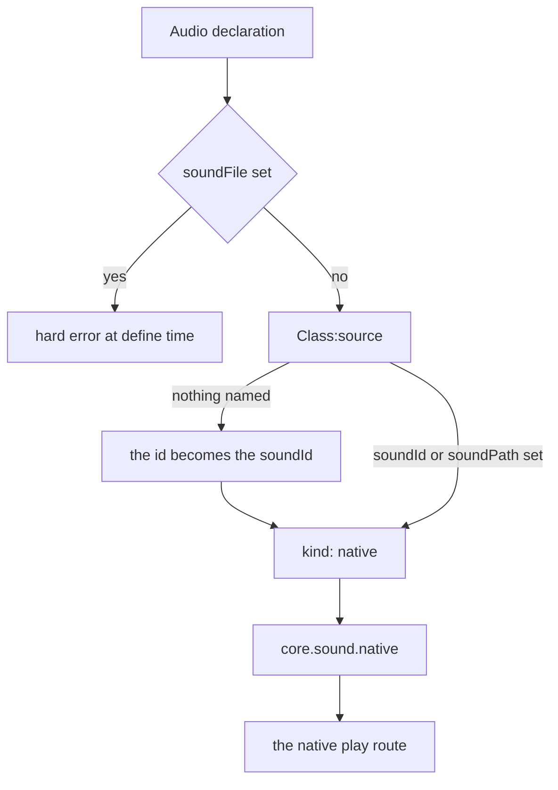
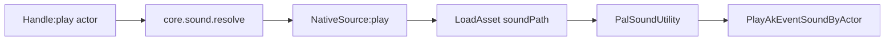
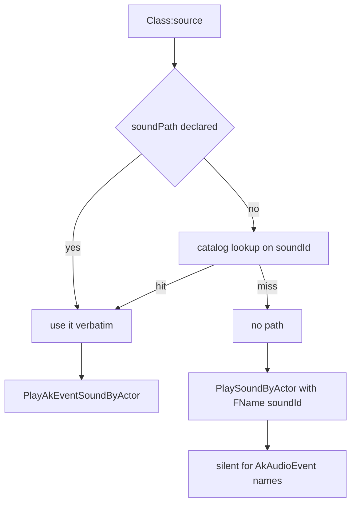

## このページでできるようになること

- ゲームに入っている BGM や効果音を、好きなタイミングで鳴らす
- アイテムを拾ったときにジングルを鳴らす
- 設置した建物を調べたときに音を鳴らす
- ワールドの読み込みが終わった瞬間にテーマ曲を流す
- サウンドに名前を付けて、パックのあちこちから使い回す

## サウンドを鳴らす

Palworld には最初から 2000 近いサウンドが入っています。足音、爆発、メニューのクリック音、
ボス戦の曲などです。`Audio` は、その 1 つに名前を付けて自分の Lua コードから鳴らすための
仕組みです。

```lua
local Theme = Audio.bgm{
    id        = "AKE_BGM_Title",
    soundId   = "AKE_BGM_Title",
    soundPath = "/Game/Pal/Sound/Events/SE/UI/BGM_Title/AKE_BGM_Title.AKE_BGM_Title",
}

Theme:play()          -- on the local player pawn
Theme:stop()
```

サウンドは必ずワールドにある何かの*上*で鳴ります。キャラクター、パル、設置した建物などです。
この「ワールドにある何か」を**アクター**と呼びます。アクターを渡さなかった場合は、プレイヤーが
操作しているキャラクターの上で鳴ります。

「サウンドが鳴った」とゲーム側が教えてくれることはないので、鳴らす瞬間は自分で決めます。
アイテムのハンドラー、建物のハンドラー、ワールドのイベントなどから `:play()` を呼びます。
このページの残りは、サウンドに名前を付ける方法と、再生がうまくいかないときの原因の話です。

## サウンドを定義する

`Audio{ ... }` と書くとサウンドを定義できます。渡したテーブルはフィールドごとに検証され、
サウンドは `id` をキーに登録され、`Audio.Handle` が返ります。これは `:play()` と `:stop()` を
持つ小さなオブジェクトです。

<Tabs items={['Audio', 'Audio.bgm', 'Audio.se']}>
<Tab value="Audio">

```lua title="content/sounds.lua"
local Explosion = Audio{
    id          = "example:Blast",
    name        = "Blast",
    description = "Played when the reactor overloads.",
    kind        = "se",
    soundId     = "AKE_General_Explosion",
    soundPath   = "/Game/Pal/Sound/Events/SE/Common/Explosion/AKE_General_Explosion.AKE_General_Explosion",
}
```

</Tab>
<Tab value="Audio.bgm">

```lua title="content/sounds.lua"
-- identical to Audio{ ... } with kind = "bgm" written out
local BossTheme = Audio.bgm{
    id        = "example:BossTheme",
    soundId   = "AKE_LegendDeer_State_Strong_Strong",
    soundPath = "/Game/Pal/Sound/Events/BGM/LegendDeer/AKE_LegendDeer_State_Strong_Strong.AKE_LegendDeer_State_Strong_Strong",
}
```

</Tab>
<Tab value="Audio.se">

```lua title="content/sounds.lua"
local Pickup = Audio.se{
    id        = "example:Pickup",
    soundId   = "AKE_GrabItem",
    soundPath = "/Game/Pal/Sound/Events/SE/UI/Item/AKE_GrabItem.AKE_GrabItem",
}
```

</Tab>
</Tabs>

`Audio.bgm` と `Audio.se` がやることは `Audio{ ... }` と同じで、`kind` だけが先に入っています。
渡したテーブルは書き換えずコピーされ、そのテーブルの `kind` が指定と食い違う場合は、黙って
上書きせずエラーで止まります。

```lua
Audio.bgm{ id = "example:Theme", kind = "se" }
-- PalForge: Audio.bgm: kind is fixed to "bgm" here, but got "se" - use Audio{ ... } to set it
```

## 指定できるフィールド

ほとんどのサウンドで必要なのは `id` 1 つだけです。ゲーム側のイベント名を指定するなら
`soundId` を足し、`soundPath` はその名前がカタログに無いときや、カタログを上書きしたいときだけ
足します。同じ一覧はゲーム内からいつでも表示できます。

```lua
local schema = require("palforge.core.schema")
print(schema.help("Audio.Spec"))          -- every field, type, default and meaning
schema.get("Audio.Spec").fields           -- the same as a table, for tooling
```

<TypeTable
  type={{
    id: {
      description: 'サウンド id。AkAudioEvent 名、または "pack:name" 形式。空でない文字列である必要があります。',
      type: 'string',
      required: true,
    },
    name: {
      description: '表示用のラベル。既定値は id。',
      type: 'string',
    },
    description: {
      description: 'UI やツール向けの 1 行説明。',
      type: 'string',
    },
    kind: {
      description: '説明用のみ。ネイティブの再生経路は両者で同一です。"se" または "bgm"。',
      type: 'string',
      default: 'se',
    },
    soundId: {
      description: 'ネイティブの AkAudioEvent 名。soundPath を渡していない場合、native/audio.lua のカタログからアセットパスが補完されるので、カタログにある名前ならこれだけで鳴ります。',
      type: 'string',
    },
    soundPath: {
      description: 'ネイティブの AkAudioEvent アセットパス。package.object 形式で書きます。カタログ参照より優先され、package だけのパスは自動で補完されます。',
      type: 'string',
    },
    soundFile: {
      description: '定義時に拒否されます（ハードエラー）。このビルドではカスタム音声ファイルは再生できません（未解決項目 audio-custom-file-loader）。soundId か soundPath を使ってください。',
      type: 'string',
    },
    source: {
      description: '上のフィールドの代わりに、再生時にサウンドを選ぶ関数。',
      type: 'function',
    },
    data: {
      description: '自由形式の任意ペイロード。定義にそのまま保持されます。',
      type: 'table',
    },
  }}
/>

宣言していないフィールドを書くと、定義した時点でエラーになります。メッセージには「もしかして
このフィールドでは」という候補が付くので、タイプミスが黙って無視されることはありません。

## サウンドがゲームに届くまで

`AkAudioEvent` は、Palworld で再生できるサウンド 1 つを指す名前です。それぞれに**名前**
（`AKE_GrabItem` など）と**アセットパス**（その名前が入っているファイル）があります。宣言は
どちらを指定したかを表す小さなテーブルに変換され、そのテーブルが経路を決めます。



`soundFile` はこの図に到達しません。指定した時点で定義呼び出しが止まり、メッセージには実際に
鳴る 2 つのフィールド名が入ります。サウンドを何も指定していない定義も行き止まりにはなりません。
`Audio{ ... }` が先に `id` から `soundId` を埋めるためです。後述の「サウンド指定を省いた場合」を
参照してください。

名前だけ、パスだけ、両方のいずれでも、アセットをロードしてからアクター上で再生するよう依頼します。



`PlayAkEventSoundByActor` は推測ではありません。`UPalSoundUtility` にリフレクトされている関数の
1 つであり、インストール済みバイナリの CXX ダンプは
`bool PlayAkEventSoundByActor(AActor*, UAkAudioEvent*)` と宣言しており、記録されたセッションでは
ゲーム自身がまさにこの 2 引数・この順序で 6 回呼んでいるところが捕らえられています。このツリーの
実行ログに無いのは*こちら側の*呼び出しが聞こえたかどうかの記録で、`:play()` が報告するのが
「呼び出しを発行したかどうか」だけなのはそのためです。

アセットをロードする前に、パスが補完されます。UE のオブジェクトパスは `<package>.<object>` なので、
package 側だけを書いた `soundPath`（`/Game/.../AKE_BGM_Title`）は `core/assetpath` によって
`/Game/.../AKE_BGM_Title.AKE_BGM_Title` に補完され、すでに object 側を持つパスはそのまま通ります。
ロード済みのアセットはその補完後のパスごとに保持されるので、ロードのコストを払うのは初回だけです。
`LoadAsset` で取得できなかった場合は `StaticFindObject(path)` でもう一度試し、返ってきたものは
渡す前にクラス検査されます。`AkAudioEvent` でないオブジェクトは、`UAkAudioEvent*` の引数に
マーシャリングされる代わりに、実際のクラス名を書いたログとともに拒否されます。

### soundId と soundPath はそれぞれ何をするか

この 2 つは択一ではありません。同じ呼び出しの別々の段階で使われ、**どちらか一方だけでも
完全な定義になります**。空でない `soundId` か、空でない `soundPath` があれば解決されます。



- 音を鳴らすのは `soundPath` です。再生処理はこちらを優先し、アセットをロードしてサウンドを
  送出したらそこで終わります。`soundPath` だけの定義はこの分岐に入ります。
- `soundId` は AkAudioEvent 名で、こちらは変換時に引かれます。`Class:source()` はまず名前空間付き
  の id を解決し（`"pack:Theme"` → `"pack_Theme"`）、`soundPath` が渡されていなければ、その名前を
  `native/audio.lua` のカタログ — 1957 個の AkAudioEvent 名とアセットパスの対 — から引いて実際の
  パスを付けます。つまりカタログにある名前は、それだけで鳴る分岐に入ります。
- カタログに無い名前にはパスが付かず、呼び出しは
  `PlaySoundByActor(actor, { Key = FName(id) }, ...)` に落ちます。これは SoundID 表を引くもので、
  別の名前空間であり、AkAudioEvent 名に対しては無音です。
- 自分で書いた `soundPath` がカタログに上書きされることはありません。

<Callout type="warn">
`:play()` が返す `true` は、ネイティブ呼び出しを**発行した**という意味であって、音が聞こえたと
いう意味ではありません。いまも `true` を返しながら何も鳴らないのは、カタログに無い `soundId` の
場合です。パスが付かないので、無音の `PlaySoundByActor` 分岐に落ちます。無音のときは
`:source().path` を表示してください。そこが `nil` なら、それが診断のすべてです。
</Callout>

```lua
-- plays: the asset path is a complete definition on its own
Audio.se{ id = "example:Quiet", soundPath = "/Game/Pal/Sound/Events/SE/UI/Item/AKE_GrabItem.AKE_GrabItem" }

-- plays too: AKE_GrabItem is in the catalog, so lowering attaches its path
Audio.se{ id = "example:NameOnly", soundId = "AKE_GrabItem" }

-- silent: no AkAudioEvent of that name, so there is no path to attach
Audio.se{ id = "example:Missing", soundId = "AKE_NotAnEvent" }
```

## サウンド指定を省いた場合

サウンドを**まったく**指定していない定義、つまり `soundId`、`soundPath`、`source` のいずれも
ない定義は、自分の `id` を AkAudioEvent 名として使います。1 行の書き方が動くのはこのためです。

```lua
local Theme = Audio.bgm{ id = "AKE_BGM_Title" }
Theme:source()
--> { kind = "native", id = "AKE_BGM_Title",
-->   path = "/Game/Pal/Sound/Events/SE/UI/BGM_Title/AKE_BGM_Title.AKE_BGM_Title" }
```

この宣言のどこにもパスは書かれていません。付けたのはカタログ参照です。つまり 1 行の書き方でも、
1957 個のイベント名のどれに対しても鳴る分岐に入り、カタログが知らない id のときだけ無音の
`PlaySoundByActor` 分岐に落ちます。

<Callout type="info">
id がサウンド名として使われるのは、サウンド指定用の 3 フィールドがすべて無いときだけです。
`source` を含めどれか 1 つでも設定すると無効になります。`soundFile` はこの判定に関与しません。
判定に届く前に拒否されるためです。
</Callout>

## bgm と se

`kind` は `"se"` か `"bgm"` で、既定値は `"se"`、再生の挙動には一切影響しません。BGM も効果音も
同じ `PlayAkEventSoundByActor` 呼び出しを通ります。これは自分のコードやツールが両者を区別
できるようにするためのものです。

```lua
for _, sound in ipairs(Audio.get_all()) do
    if sound:kind() == "bgm" then
        sound:stop()
    end
end
```

`kind` は経路ではなくラベルなので、同じ id を BGM としても効果音としても定義すると、後に実行
された方だけが残ります。`native/audio.lua` の `bgm(name)` / `se(name)` ヘルパーでも同じです。

## ハンドル

`Audio{ ... }`、`Audio.bgm`、`Audio.se`、`Audio.get` はいずれも `Audio.Handle` を返します。

### アクション

```lua
Handle:play(actor)        --> boolean
Handle:stop(actor)        --> boolean
Handle:setVolume(volume, actor)  --> boolean
```

`actor` は省略できます。省略した場合、`play` も `stop` も、`FindFirstOf("PalPlayerCharacter")`
で取得したプレイヤー操作中のキャラクターを使います。ワールドが読み込まれていなければその
キャラクターは存在せず、どちらもサウンド呼び出しに到達しないまま `false` を返します。

```lua
local Blast = Audio.get("AKE_General_Explosion")

Blast:play()                       -- on the player pawn
Blast:play(somePalActor)           -- on any actor you already hold
Blast:stop(somePalActor)           -- stops EVERYTHING on that actor
```

戻り値の真偽値が示すのは*呼び出し*についてであって、音そのものではありません。`play` と `stop`
が `true` を返すのは、ネイティブ呼び出しを実際に発行できたときだけです。無効なアクター、
`PalSoundUtility` が見つからない場合、呼び出し内で例外が飛んだ場合、そして解決先のない定義は、
いずれも `false` になります。`false` は「そもそも何も試みられなかった」という意味なので、
対処する価値のある情報です。

```lua title="content/boot_sound.lua"
local log = require("palforge.utils.log").scope("audio")

-- a path-only definition: core.sound.resolve accepts it, so this reaches the engine
local Theme = Audio.bgm{
    id        = "example:BootTheme",
    soundPath = "/Game/Pal/Sound/Events/SE/UI/BGM_Title/AKE_BGM_Title.AKE_BGM_Title",
}

if not Theme:play() then
    log.warn("no player pawn yet, or the definition resolved to nothing")
end
```

<Callout type="warn">
`:stop` はサウンド単位ではありません。呼び出しているのは
`PalSoundUtility:StopSoundByActor(actor)` で、そのアクター上で再生中のすべてのサウンドを止めます。
プレイヤーのキャラクターで BGM を止めると、そのキャラクターの足音やボイスも一緒に止まります。
1 つだけ止めて他を鳴らし続けるには、サウンド側が保持していない Wwise の `PlayingID` が必要です。
</Callout>

<Callout type="warn">
`:setVolume` は `:stop` と同じく**アクター単位**です。呼び出したサウンド 1 つではなく、その
アクターが出しているものすべて — こちらのサウンドもゲームのサウンドも — の音量を変えるので、
どのハンドルから呼んでも結果は同じです。`actor` は省略でき、省略時は `:play` や `:stop` と同様に
プレイヤーのキャラクターが使われます。

`volume` はただの倍率です。`1.0` はそのまま、`0.5` は半分、`0.0` は無音です。戻り値は呼び出しが
発行されたときに `true` で、意味はそこまでです。これで音量が変わったのを耳で聞いた人はまだ
いません。その計測にはワールドの読み込みと聞く人が必要なので、宣言済みのフックとして残されて
います。`pf_hook audio-setvolume-audible` は、カタログのイベントを鳴らし、`0.2` を設定し、
もう一度鳴らすところまでをやってくれます。

同じアクター上で**特定の 1 つ**だけを静かにしたいときは、カタログから静かなイベントを選んでください。
別々のアクターで鳴らせば、音量をどちらか一方にだけ効かせられます。
</Callout>

### クエリ

```lua
Handle:source()       --> { kind = "native"|"file", ... } | nil
Handle:kind()         --> "bgm" | "se"
Handle:name()         --> the declared name, or the id
Handle:description()  --> string | nil
Handle.id             --> the sound's id
```

定義がそもそもゲームまで届くかを確認する一番早い方法が `:source()` です。再生処理が受け取る
テーブルそのものを返します。

```lua
local s = Audio.get("AKE_BGM_Title"):source()
print(s.kind, s.id, s.path)
```

## 自分で定義していないサウンドを取得する

```lua
Audio.get(id)     --> Audio.Handle, never nil
Audio.get_all()   --> Audio.Handle[]
```

`Audio.get` は、すでに定義したサウンドがあればそれを返します。無い場合はその場で薄い定義
`{ id = id, soundId = id }` を作るので、どのサウンド名でも少なくとも掴むことはできます。その定義
自体はアセットパスを持ちませんが、変換時に同じカタログ参照が走るので、
`Audio.get("AKE_General_Explosion"):play()` は、一度も定義していないカタログ上のイベント名でも
鳴る分岐に入ります。

起動時に PalForge は `palforge.native.audio` を読み込み、6 つの既製サウンドをフレームワーク自身の
パックとして登録します。`Audio.get` が薄い定義ではなく本物の定義で答えるのはこれらの id です。

| ヘルパー | ID |
| --- | --- |
| `MainTheme` | `AKE_BGM_Title` |
| `BattleTheme` | `AKE_LegendDeer_State_Strong_Strong` |
| `VictoryTheme` | `AKE_Arena_Victory_01` |
| `Explosion` | `AKE_General_Explosion` |
| `Laser` | `AKE_Weapon_ChargeLaserRifle_Fire` |
| `Footstep` | `AKE_Pal_Footstep` |

```lua
local audio = require("palforge.native.audio")

audio.MainTheme:play()
audio.Explosion:play()
```

### カタログにある任意の名前

`native/audio.lua` は `M.CATALOG` も持っています。ゲーム内のサウンド名とアセットパスをすべて
対にしたものです。`bgm(name)` / `se(name)` は、初めて要求されたときにカタログのエントリを実際の
定義へ変換し、名前とパスの両方を持たせたうえで次回のために保持します。`get(name)` は
`se(name)` と同じです。カタログに無い名前に対しては 3 つとも `nil` を返します。

```lua
local audio = require("palforge.native.audio")

local levelUp = audio.se("AKE_CampLevelUp")
if levelUp then levelUp:play() end

audio.CATALOG["AKE_CampLevelUp"]
--> "/Game/Pal/Sound/Events/SE/UI/CampLevelUp/AKE_CampLevelUp.AKE_CampLevelUp"
```

<Callout type="info">
`native.audio.se(name)` / `native.audio.bgm(name)` も `Audio.get(name)` も、どちらもカタログに
届くので、ゲーム標準のサウンドはどちらでも鳴ります。それでも `native.audio` 側にしか言えないことが
あります。こちらはこのビルドに AkAudioEvent として存在しない名前に対して `nil` を返しますが、
`Audio.get` は決して `nil` を返さず、`:play()` が無音になるハンドルを返します。また `native.audio`
側は作ったものを登録しません。登録したい場合は `native.audio.publish(name)` を明示的に呼びます。
</Callout>

## 定義は 1 回、再生は何度でも

`Audio{ ... }` はサウンドを作ります。`Audio.get(id)` や変数に持っておいたハンドルは、それを
引くだけです。ハンドラーはイベントのたびに実行されるので、定義はロード時に置き、ハンドラーには
再生だけを置きます。

```lua title="content/sounds.lua"
-- module scope: runs once when the pack loads
local Pickup = Audio.se{
    id        = "example:Pickup",
    soundId   = "AKE_GrabItem",
    soundPath = "/Game/Pal/Sound/Events/SE/UI/Item/AKE_GrabItem.AKE_GrabItem",
}

return { Pickup = Pickup }
```

```lua title="content/items.lua"
local sounds = require("content.sounds")

Item{
    id = "Wood",
    events = {
        onObtain = function(item, ctx)
            sounds.Pickup:play()          -- a play, not a declaration
        end,
    },
}
```

<Callout type="warn">
ハンドラーの中で `Audio.bgm{ ... }` や `Audio.se{ ... }` を呼んではいけません。呼び出しのたびに
テーブルを検証し直し、新しい定義を作り、同じ id で登録されている内容を置き換えます。それが
イベントごとに毎回起きます。ハンドルはハンドラーの外の local に持つか、ハンドラー内では
`Audio.get(id)` を呼んでください。
</Callout>

```lua
-- wrong: re-declares and re-registers the sound on every pickup
onObtain = function(item, ctx)
    Audio.se{ id = "AKE_GrabItem" }:play()
end

-- fine: a lookup
onObtain = function(item, ctx)
    Audio.get("AKE_GrabItem"):play()
end
```

## まだ動かないこと

ここには期待どおりには働かないものが 3 つあります。1 つは明確に拒否され、2 つは頼んだ以上の
範囲に届きます。

<Callout type="warn">
**カスタム音声ファイルは再生されず、`soundFile` はハードエラーです。** 指定すると定義呼び出しが
止まり、メッセージには未解決項目 `audio-custom-file-loader` と、実際に鳴る 2 つのフィールド名が
入ります。無視ではなくエラーにしているのが要点です。`soundFile` は `soundId` / `soundPath` より
先に変換されるため、動いている `soundId` の横にこれを足したパックは、鳴っていたサウンドを
黙らせていました。しかもこのツリーが計測したどのビルドでも再生できたことはありません。

**Wwise 側は決着しています。** 2026-08-02、ロード済みのセーブで実際に見た結果として、
`AkExternalMediaAsset` と `AkMediaAsset` はどちらもクラスデフォルトとして解決したうえで宣言関数が
**ゼロ**、ロード済みインスタンスもゼロでした。このビルドに外部メディア / `SetMedia` の経路は
存在しないので、`AkAudio` をこの目的で洗い直す必要はもうありません。

**エンジン側は「閉じている」ではなく「狭まった」です。** `USoundWave` はインポーターを宣言して
いないので、ディスク上の `.wav` をそれ自体で読むものはありません。ただし `UGameplayStatics` は
137 個の関数とともにオーディオ面を製品ビルドに残しており（`PlaySound2D`、`CreateSound2D`、
`SpawnSoundAttached` など）、`SoundWave` と `SoundBase` の実インスタンスもロードされていて、
UE4SS は `StaticConstructObject` を提供しています。分かっていないのは、その方法で `USoundWave` を
構築し、サンプルバッファを Lua から埋められるかどうかだけです。それが確かめられるまでは、
カタログの中から近いサウンドを選んでください。
</Callout>

<Callout type="warn">
**`:stop` はそのアクター上のすべてを止めます。** `StopSoundByActor` はアクターだけを受け取る
ので、どのサウンドから呼んでも、そのアクターは完全に無音になります。片方を鳴らし続けたい
場合は、別のアクターで鳴らしてください。たとえば BGM は設置した建物で、効果音はプレイヤーで
鳴らす、といった具合です。
</Callout>

3 つ目は上で触れた `:setVolume` で、`:stop` と同じアクター単位の範囲を持ちます。しかもそれは
選択の結果ではなく**構造上そうなっている**ものです。呼んでいるネイティブ関数は
`UAkGameplayStatics::SetOutputBusVolume(float BusVolume, AActor* Actor)` で、そこにバス名は
一切入っていません。第 2 引数はアクター、つまり Wwise のゲームオブジェクトなので、変わるのは
「1 つのエミッターが出力バスへ送る量」です。これは `:play` が送出し `:stop` が止めるのと同じ
範囲です。

このビルドにはこれより細かい制御が存在せず、それは試していないのではなく決着済みです。サウンド
単位になり得たのは RTPC 経路ですが、数で閉じています。ビルド全体が宣言している `AkRtpc` アセットは
**3 つ**（`Supply_Altitude`、`OverHeatRifle`、`ChargeLaserRifle_01`）で、`AkAuxBus` は **0 個**、
`AkAudioBank` も **0 個**です。3 つのどれも音量ではないので、そもそも指定できる RTPC の音量
パラメーターは存在せず、バス名を取るオーバーロードに渡す名前もありません。サウンドごとの音量
スライダーが必要なら、アクターを分けるかイベントを分けてください。

## レシピ

### アイテムを拾ったときにジングルを鳴らす

`item.obtain` は実際に発火します。`ctx` は `ctx.itemId` と `ctx.count` を運び、ハンドラーの
第 1 引数はそのアイテム自身のハンドルです。

```lua title="content/pickup_jingle.lua"
local api = require("palforge.api")
local audio = require("palforge.native.audio")

local Jingle = audio.se("AKE_CampLevelUp")   -- catalog entry, name + path

api.Item{
    id          = "Berries",
    name        = "Berries",
    description = "Plays a jingle when you pick some up.",
    events = {
        onObtain = function(item, ctx)
            if (ctx.count or 0) >= 10 then
                Jingle:play()
            end
        end,
    },
}
```

`ctx.count` はゲーム側のメッセージから読める範囲で読み取るため `nil` になり得ます。必ず
ガードしてください。

### ワールドの準備ができたら音楽を流す

音楽を始めるタイミングは自分で決めます。`world.ready` は、プレイヤーのキャラクターが数回続けて
確認できた時点で発火します。これは `:play()` が既定で使うキャラクターが存在する最初の瞬間でも
あります。

```lua title="content/theme.lua"
local event = require("palforge.core.event")
local audio = require("palforge.native.audio")

event.on("world.ready", function(ctx)
    audio.MainTheme:play()
end)
```

既製のヘルパーを使わず自分で定義する場合は、両方のフィールドを渡します。

```lua title="content/theme.lua"
local event = require("palforge.core.event")

local Theme = Audio.bgm{
    id          = "example:WorldTheme",
    name        = "World Theme",
    description = "Plays once the world finishes loading.",
    soundId     = "AKE_BGM_Title",
    soundPath   = "/Game/Pal/Sound/Events/SE/UI/BGM_Title/AKE_BGM_Title.AKE_BGM_Title",
}

event.on("world.ready", function(ctx)
    Theme:play()
end)

event.on("world.left", function(ctx)
    Theme:stop()      -- stops every sound on the pawn, not just this one
end)
```

### 建物を調べたときに音を鳴らす

建物では `onRightClick` が実際に発火します。第 1 引数は設置された建物そのものなので、
`self.actor` はワールドに立っている構造物です。そこで鳴らせば、音はプレイヤーではなく建物から
出ます。

```lua title="content/palbox_sound.lua"
local api = require("palforge.api")
local audio = require("palforge.native.audio")

local Chime = audio.se("AKE_Build_PalBox")

api.Building{
    id          = "PalBoxV2",
    name        = "Pal Box",
    description = "Chimes when you interact with it.",
    gridCm      = 100,
    state       = { uses = 0 },
    events = {
        onRightClick = function(self, ctx)
            self.state.uses = self.state.uses + 1
            self:save()
            Chime:play(self.actor)        -- ctx.actor is the same building actor
        end,
    },
}
```

`building.interact` の `ctx` は `ctx.actor`（建物）、`ctx.player`（操作したキャラクター）、
`ctx.buildId` を運びます。`ctx.player` で鳴らせば、音はキーを押した本人に付きます。

### 再生時にサウンドを選ぶ

`source` を使うと、フィールドで固定する代わりに、鳴らす瞬間にサウンドを決められます。この関数は
定義に対して呼ばれるので、`self` は宣言したフィールドを持っており、返すのは再生処理が使う
テーブル、または無音にしたい場合は `nil` です。

```lua title="content/dynamic_sound.lua"
local audio = require("palforge.native.audio")

local Footstep = Audio.se{
    id   = "example:Footstep",
    data = { wet = false },
    source = function(self)
        local name = self.data.wet and "AKE_Pal_Footstep_Water" or "AKE_Pal_Footstep"
        return { kind = "native", id = name, path = audio.CATALOG[name] }
    end,
}

Footstep:play()
```

形は守ってください。`{ kind = "native", id = <AkAudioEvent name>, path = <asset path> }`
（片方が空でない文字列であれば、もう片方は省略できます）か `{ kind = "file", path = ... }` です。
それ以外は `nil` に解決され、`nil` のソースは何も鳴らさず、`:play()` は `false` を返します。

## エラー

検証に失敗すると、`PalForge: ` で始まるエラーで呼び出しが止まります。中途半端に成功することは
ないので、半分だけできたサウンドが残ることもありません。

```text
PalForge: Audio: field "id" is required (audio id: the AkAudioEvent name, or "pack:name")
PalForge: Audio: field "id" is invalid: must be a non-empty string
PalForge: Audio: unknown field "path" (did you mean "soundPath"?). Valid fields: id, name, description, kind, soundId, soundPath, soundFile, source, data
PalForge: Audio: field "kind" must be one of { "se", "bgm" }, got "music"
PalForge: Audio.bgm: kind is fixed to "bgm" here, but got "se" - use Audio{ ... } to set it
```

`soundFile` には専用のメッセージがあります。宣言済みのフィールドを拒否する理由まで書くので、この
モジュールで最も長いメッセージです。以下は抜粋です。

```text
PalForge: Audio: soundFile is not accepted (id "example:Blast", soundFile "C:/mods/example/blast.wav").
Custom audio files do not play on this build: [...] This is the open item audio-custom-file-loader.
It is an ERROR rather than a no-op because soundFile used to OUTRANK soundId/soundPath, so setting it
beside a working soundId silenced a sound that was playing. Name a game sound instead:
soundId = "AKE_UI_Common_Menu_Close", or soundPath = the asset path from PalForge.native.audio.CATALOG.
```

`Audio.get` は素の文字列を受け取るため、出るメッセージが少し違います。

```text
Audio.get: id (string) is required
```

サウンドの登録はベストエフォートです。その処理が失敗しても、使えるハンドルは返ってきます。

## 関連ページ

<Cards>
  <Card title="Item" href="/docs/api/item">ピックアップのレシピで使う `item.obtain` と `item.use` のフック。</Card>
  <Card title="Building" href="/docs/api/building">ライブインスタンス、`onRightClick`、そして `self.actor`。</Card>
  <Card title="ライフサイクル" href="/docs/concepts/lifecycle">チャンネル、`world.ready`、そして実際に発火するフック。</Card>
  <Card title="スキーマ" href="/docs/concepts/schema">spec の宣言・検証・読み出しの仕組み。</Card>
</Cards>

## まとめ

- サウンドは `Audio{ ... }`、`Audio.bgm{ ... }`、`Audio.se{ ... }` で定義します。必須は `id` だけです。
- カタログにある `soundId` はそれだけで十分です。変換時に `native/audio.lua` からアセットパスが
  補完されます。`soundPath` は、カタログに無い名前のときや上書きしたいときに渡します。
- `soundFile` は定義時のハードエラーです。このビルドではカスタム音声ファイルは再生できません。
- 再生は `handle:play(actor)` です。`actor` を省くとプレイヤーのキャラクターで鳴ります。
- `:play()` の `true` は呼び出しが出たという意味で、聞こえた保証ではありません。無音のときは
  `:source().path` を確認します。
- `:stop(actor)` はそのアクター上のすべてを止め、`:setVolume(volume, actor)` はそのアクター上の
  すべての音量を変えます。どちらもアクター単位で、サウンド単位ではありません。
- サウンドの定義はパックのロード時に 1 回だけ行い、ハンドラーでは `:play()` だけを呼びます。

次は [Item](/docs/api/item) を読むと、プレイヤーが拾ったり使ったりしたものに音を付けられます。
