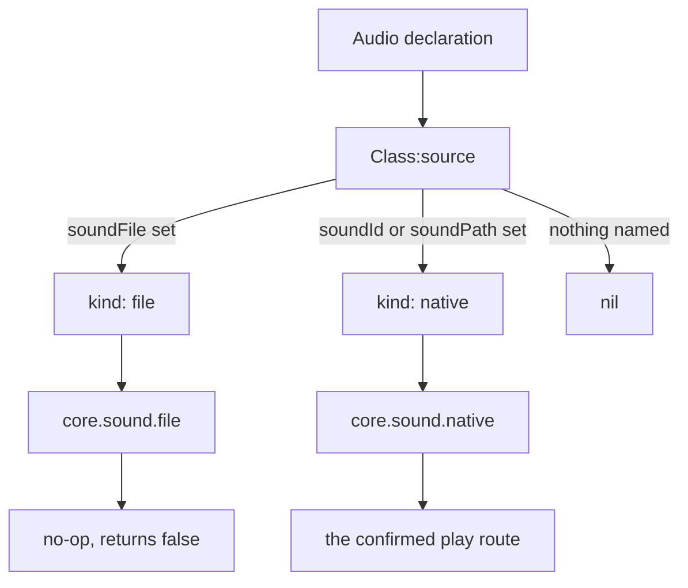
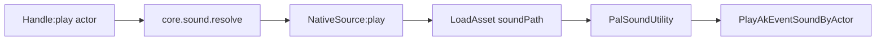
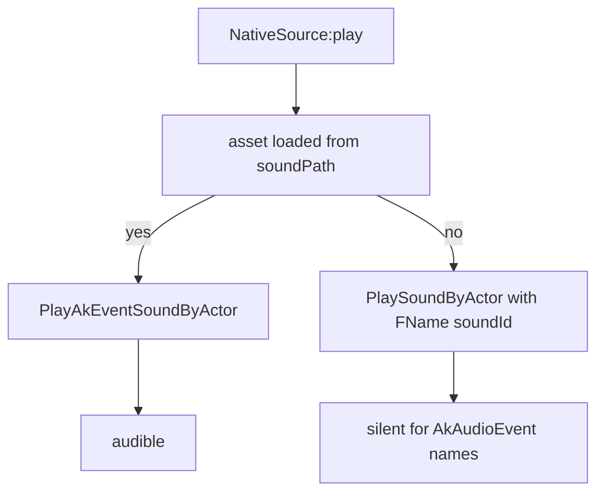

`Audio` is one playable sound: background music or a one-shot effect. It has the same shape
as every other API module — call it to define, plus `get` / `get_all`, plus a Handle carrying
that domain's actions.

Audio has **no lifecycle events**. There is no `events` field on `Audio.Spec`, no audio
channel on the bus, and nothing to subscribe to. You do not react to a sound, you play it,
so the Handle is all actions and queries.

```lua
local Theme = Audio.bgm{
    id        = "AKE_BGM_Title",
    soundId   = "AKE_BGM_Title",
    soundPath = "/Game/Pal/Sound/Events/SE/UI/BGM_Title/AKE_BGM_Title.AKE_BGM_Title",
}

Theme:play()          -- on the local player pawn
Theme:stop()
```

## Define a sound

Calling the module is defining. The spec is validated on every call, the definition is
registered in `core/object_manager` under `("audio", id)`, and you get an `Audio.Handle`
back.

<Tabs items={['Audio', 'Audio.bgm', 'Audio.se']}>
<Tab value="Audio">

```lua title="content/sounds.lua"
local Explosion = Audio{
    id          = "example:Blast",
    name        = "Blast",
    description = "Played when the reactor overloads.",
    kind        = "se",
    soundId     = "AKE_General_Explosion",
    soundPath   = "/Game/Pal/Sound/Events/SE/Common/Explosion/AKE_General_Explosion.AKE_General_Explosion",
}
```

</Tab>
<Tab value="Audio.bgm">

```lua title="content/sounds.lua"
-- identical to Audio{ ... } with kind = "bgm" written out
local BossTheme = Audio.bgm{
    id        = "example:BossTheme",
    soundId   = "AKE_LegendDeer_State_Strong_Strong",
    soundPath = "/Game/Pal/Sound/Events/BGM/LegendDeer/AKE_LegendDeer_State_Strong_Strong.AKE_LegendDeer_State_Strong_Strong",
}
```

</Tab>
<Tab value="Audio.se">

```lua title="content/sounds.lua"
local Pickup = Audio.se{
    id        = "example:Pickup",
    soundId   = "AKE_GrabItem",
    soundPath = "/Game/Pal/Sound/Events/SE/UI/Item/AKE_GrabItem.AKE_GrabItem",
}
```

</Tab>
</Tabs>

`Audio.bgm` and `Audio.se` pin `kind` and otherwise do exactly what `Audio{ ... }` does. They
copy your table rather than mutating it, and a `kind` in that table that contradicts the
constructor is a hard error instead of a silent overwrite.

```lua
Audio.bgm{ id = "example:Theme", kind = "se" }
-- PalForge: Audio.bgm: kind is fixed to "bgm" here, but got "se" - use Audio{ ... } to set it
```

## The spec

`Audio.Spec` is declared with `core/schema` and stays private to the module. Read it at
runtime through the registry:

```lua
local schema = require("palforge.core.schema")
print(schema.help("Audio.Spec"))          -- every field, type, default and meaning
schema.get("Audio.Spec").fields           -- the same as a table, for tooling
```

<TypeTable
  type={{
    id: {
      description: 'Audio id: the AkAudioEvent name, or "pack:name". Must be a non-empty string.',
      type: 'string',
      required: true,
    },
    name: {
      description: 'Human label. Defaults to id.',
      type: 'string',
    },
    description: {
      description: 'One-line description, for UI and tooling.',
      type: 'string',
    },
    kind: {
      description: 'Descriptive only - the native play route is the same for both. One of "se" or "bgm".',
      type: 'string',
      default: 'se',
    },
    soundId: {
      description: 'Native AkAudioEvent name. This is the SoundID fallback route, and it is also what core.sound requires in order to resolve the source at all.',
      type: 'string',
    },
    soundPath: {
      description: 'Native AkAudioEvent asset path. This is the route that actually produces sound.',
      type: 'string',
    },
    soundFile: {
      description: 'Custom audio file path. Seam - resolves and then no-ops, see Seams below.',
      type: 'string',
    },
    source: {
      description: 'Override that returns the core.sound source spec yourself, replacing the default lowering.',
      type: 'function',
    },
    data: {
      description: 'Free-form payload of your own, carried onto the definition.',
      type: 'table',
    },
  }}
/>

Validation is strict. An undeclared field is an error at define time with a did-you-mean, so
a typo can never be silently ignored.

## How a sound actually plays

A declaration is *lowered* into a source spec that `core/sound` resolves. `soundFile` wins
over the native fields, and a definition that names no sound at all lowers to `nil` — though
a declaration rarely reaches that branch, because `Audio{ ... }` fills `soundId` from the id
first. The id fallback below covers that.



The native route is confirmed in-game. A catalog entry is a Wwise **AkAudioEvent name** with
a known **asset path**, and the working call chain is `LoadAsset(path)` followed by
`PalSoundUtility:PlayAkEventSoundByActor(actor, asset)`.



`LoadAsset` results are cached by path, so the first play of a sound pays the load and every
later one reuses it. If `LoadAsset` is unavailable or returns nothing valid, the loader
retries with `StaticFindObject(path)`.

### Why you pass both soundId and soundPath

The two fields are not alternatives — they feed two different stages.



- `soundPath` is what makes noise. Without a loadable asset the code falls through to
  `PlaySoundByActor(actor, { Key = FName(id) }, ...)`, which reads a SoundID DataTable row — a
  different namespace from AkAudioEvent names, and silent for them.
- `soundId` is what makes the source **resolve**. `core.sound.resolve` only builds a
  `NativeSource` when the spec carries a non-empty `id`. A definition with `soundPath` and no
  `soundId` resolves to `nil`, and `core.sound.play` treats a `nil` source as "nothing to
  play" — it returns `true` and stays silent.

<Callout type="warn">
`soundPath` alone is the one combination that looks correct and does nothing. `:play()` even
returns `true`, because a source that resolves to nothing is fail-soft rather than an error.
Always pass `soundId` as well — the catalog in `native/audio.lua` passes both for every
entry.
</Callout>

```lua
-- silent, and :play() still returns true
Audio.se{ id = "example:Quiet", soundPath = "/Game/Pal/Sound/Events/SE/UI/Item/AKE_GrabItem.AKE_GrabItem" }

-- correct
Audio.se{
    id        = "example:Loud",
    soundId   = "AKE_GrabItem",
    soundPath = "/Game/Pal/Sound/Events/SE/UI/Item/AKE_GrabItem.AKE_GrabItem",
}
```

## The id fallback

A definition that names **no** sound at all — no `soundId`, no `soundPath`, no `soundFile`,
no `source` — uses its own `id` as the AkAudioEvent name. That is the whole reason the short
form works:

```lua
local Theme = Audio.bgm{ id = "AKE_BGM_Title" }
Theme:source()   --> { kind = "native", id = "AKE_BGM_Title", path = nil }
```

The fallback gives you a resolvable source, so `:play()` reaches the native layer. It cannot
give you an asset path, so what runs is the `PlaySoundByActor` fallback — the silent one for
AkAudioEvent names. Treat the short form as a way to *register* a name, not as the way to
make it audible.

<Callout type="info">
The fallback only applies when all four sound-naming fields are absent. Setting any one of
them, including `source`, turns it off.
</Callout>

## kind is descriptive only

`kind` is `"se"` or `"bgm"`, defaults to `"se"`, and changes nothing about playback — music
and effects go through the same `PlayAkEventSoundByActor` call. It exists so your own code
and tooling can tell the two apart:

```lua
for _, sound in ipairs(Audio.get_all()) do
    if sound:kind() == "bgm" then
        sound:stop()
    end
end
```

Because `kind` is metadata rather than routing, defining the same id as both music and an
effect just keeps whichever ran last — `native/audio.lua` says so explicitly for its own
`bgm(name)` / `se(name)` helpers.

## The Handle

`Audio{ ... }`, `Audio.bgm`, `Audio.se` and `Audio.get` all return an `Audio.Handle`.

### Actions

```lua
Handle:play(actor)        --> boolean
Handle:stop(actor)        --> boolean
Handle:setVolume(volume)  --> false, always
```

`actor` is optional. When omitted, both `play` and `stop` fall back to the local player pawn,
found with `FindFirstOf("PalPlayerCharacter")`. With no world loaded there is no pawn, and
both return `false` without reaching the native sound call.

```lua
local Blast = Audio.get("AKE_General_Explosion")

Blast:play()                       -- on the player pawn
Blast:play(somePalActor)           -- on any actor you already hold
Blast:stop(somePalActor)           -- stops EVERYTHING on that actor
```

<Callout type="warn">
`:stop` is not per-sound. It calls `PalSoundUtility:StopSoundByActor(actor)`, which silences
every sound currently playing on that actor, not just this one. Stopping your BGM on the
player pawn stops the player's footsteps and voice lines with it.
</Callout>

<Callout type="warn">
`:setVolume` is **not implemented**. The body is a `return false` with a TODO — no AkAudio
RTPC or component-gain route has been observed yet. It returns `false` rather than `true` so
a caller can tell it did nothing. There is no per-sound volume in PalForge today.
</Callout>

### Queries

```lua
Handle:source()       --> { kind = "native"|"file", ... } | nil
Handle:kind()         --> "bgm" | "se"
Handle:name()         --> the declared name, or the id
Handle:description()  --> string | nil
Handle.id             --> the sound's id
```

`:source()` is the fastest way to check whether a definition will actually reach the native
layer — it returns the exact table `core.sound` receives.

```lua
local s = Audio.get("AKE_BGM_Title"):source()
print(s.kind, s.id, s.path)
```

## Look up an existing sound

```lua
Audio.get(id)     --> Audio.Handle, never nil
Audio.get_all()   --> Audio.Handle[]
```

`Audio.get` returns a previously-defined sound when there is one. When there is not, it
fabricates a thin native definition keyed on that id — `{ id = id, soundId = id }` — so any
AkAudioEvent name is at least addressable. That fabricated definition has **no asset path**,
which puts it on the silent fallback route, exactly like the id fallback above.

At startup `core/registry` loads `palforge.native.audio`, which defines six curated sounds.
Those are the ids `Audio.get` finds with a path attached:

| Helper | Id |
| --- | --- |
| `MainTheme` | `AKE_BGM_Title` |
| `BattleTheme` | `AKE_LegendDeer_State_Strong_Strong` |
| `VictoryTheme` | `AKE_Arena_Victory_01` |
| `Explosion` | `AKE_General_Explosion` |
| `Laser` | `AKE_Weapon_ChargeLaserRifle_Fire` |
| `Footstep` | `AKE_Pal_Footstep` |

```lua
local audio = require("palforge.native.audio")

audio.MainTheme:play()
audio.Explosion:play()
```

### Any name in the catalog

`native/audio.lua` also carries `M.CATALOG`, the full AkAudioEvent set enumerated from the UE
AssetRegistry as `name -> asset path`. `bgm(name)` / `se(name)` materialize a catalog entry
into a real definition on first use — with both the name and the path — and cache it.
`get(name)` is `se(name)`. All three return `nil` for a name that is not in the catalog.

```lua
local audio = require("palforge.native.audio")

local levelUp = audio.se("AKE_CampLevelUp")
if levelUp then levelUp:play() end

audio.CATALOG["AKE_CampLevelUp"]
--> "/Game/Pal/Sound/Events/SE/UI/CampLevelUp/AKE_CampLevelUp.AKE_CampLevelUp"
```

<Callout type="info">
Prefer `native.audio.se(name)` / `native.audio.bgm(name)` over `Audio.get(name)` for a
vanilla sound you have not defined yourself. `Audio.get` cannot know the asset path;
`native.audio` looks it up in the catalog.
</Callout>

## Define once, play many

`Audio{ ... }` is a declaration. `Audio.get(id)` and a stored handle are lookups. A handler
runs on every event, so the definition belongs at load time and only the play belongs in the
handler.

```lua title="content/sounds.lua"
-- module scope: runs once when the pack loads
local Pickup = Audio.se{
    id        = "example:Pickup",
    soundId   = "AKE_GrabItem",
    soundPath = "/Game/Pal/Sound/Events/SE/UI/Item/AKE_GrabItem.AKE_GrabItem",
}

return { Pickup = Pickup }
```

```lua title="content/items.lua"
local sounds = require("content.sounds")

Item{
    id = "Wood",
    events = {
        onObtain = function(item, ctx)
            sounds.Pickup:play()          -- a play, not a declaration
        end,
    },
}
```

<Callout type="warn">
Never call `Audio.bgm{ ... }` or `Audio.se{ ... }` inside a handler. Each call re-validates
the spec, builds a new definition class and overwrites the registry entry under the same
`("audio", id)` key — on every single event. Hold the handle in an upvalue, or call
`Audio.get(id)` inside the handler.
</Callout>

```lua
-- wrong: re-declares and re-registers the sound on every pickup
onObtain = function(item, ctx)
    Audio.se{ id = "AKE_GrabItem" }:play()
end

-- fine: a lookup
onObtain = function(item, ctx)
    Audio.get("AKE_GrabItem"):play()
end
```

## Seams

Three parts of this domain are unfinished. All three fail soft, which means they are quiet
rather than loud when you hit them.

<Callout type="warn">
**Custom audio files do not play.** A `soundFile` declaration lowers to
`{ kind = "file", path = ... }`, `core.sound` resolves it to a `FileSource`, and
`FileSource:play` returns `false` without doing anything. Palworld exposes no `USoundWave` /
`USoundBase` loader that has been confirmed, so the backend is a documented no-op rather than
a pretend implementation. Your own audio assets are not playable through PalForge today —
use an AkAudioEvent from the catalog instead.
</Callout>

<Callout type="warn">
**`:stop` stops everything on the actor.** `StopSoundByActor` takes an actor and nothing
else; it is not SoundID-specific. `core.sound.stop` does not even look at which sound you
called it from — the facade routes every stop through one shared source instance. There is no
way to stop one sound and leave the others running.
</Callout>

`:setVolume` is the third gap and is covered above: it returns `false` and does nothing.

## Recipes

### A jingle when an item is picked up

`item.obtain` is LIVE. Its `ctx` carries `ctx.itemId` and `ctx.count`, and the handler's first
argument is the item's own Handle.

```lua title="content/pickup_jingle.lua"
local api = require("palforge.api")
local audio = require("palforge.native.audio")

local Jingle = audio.se("AKE_CampLevelUp")   -- catalog entry, name + path

api.Item{
    id          = "Berries",
    name        = "Berries",
    description = "Plays a jingle when you pick some up.",
    events = {
        onObtain = function(item, ctx)
            if (ctx.count or 0) >= 10 then
                Jingle:play()
            end
        end,
    },
}
```

`ctx.count` is read best-effort from the native payload and can be `nil`, so guard it.

### BGM when the world is ready

There is no audio channel, so drive music off the lifecycle bus. `world.ready` fires once the
player pawn has been stable for several polls, which is also when there is a pawn for `:play()`
to default to.

```lua title="content/theme.lua"
local event = require("palforge.core.event")
local audio = require("palforge.native.audio")

event.on("world.ready", function(ctx)
    audio.MainTheme:play()
end)
```

To hand-roll the definition instead of using the curated helper, pass both fields:

```lua title="content/theme.lua"
local event = require("palforge.core.event")

local Theme = Audio.bgm{
    id          = "example:WorldTheme",
    name        = "World Theme",
    description = "Plays once the world finishes loading.",
    soundId     = "AKE_BGM_Title",
    soundPath   = "/Game/Pal/Sound/Events/SE/UI/BGM_Title/AKE_BGM_Title.AKE_BGM_Title",
}

event.on("world.ready", function(ctx)
    Theme:play()
end)

event.on("world.left", function(ctx)
    Theme:stop()      -- stops every sound on the pawn, not just this one
end)
```

### A sound from a building interaction

`onRightClick` is LIVE for buildings. Its first argument is the **live instance**, so
`self.actor` is the placed structure — play the sound there and it comes from the building
rather than from the player.

```lua title="content/palbox_sound.lua"
local api = require("palforge.api")
local audio = require("palforge.native.audio")

local Chime = audio.se("AKE_Build_PalBox")

api.Building{
    id          = "PalBoxV2",
    name        = "Pal Box",
    description = "Chimes when you interact with it.",
    gridCm      = 100,
    state       = { uses = 0 },
    events = {
        onRightClick = function(self, ctx)
            self.state.uses = self.state.uses + 1
            self:save()
            Chime:play(self.actor)        -- ctx.actor is the same building actor
        end,
    },
}
```

`ctx` for `building.interact` carries `ctx.actor` (the building), `ctx.player` (the
interacting character) and `ctx.buildId`. Playing on `ctx.player` instead puts the sound on
whoever pressed the key.

### A source override

`source` replaces the default lowering entirely. The function is called as a method on the
definition, so `self` carries the fields you declared, and it returns the source spec
`core.sound` will resolve — or `nil` for silence.

```lua title="content/dynamic_sound.lua"
local audio = require("palforge.native.audio")

local Footstep = Audio.se{
    id   = "example:Footstep",
    data = { wet = false },
    source = function(self)
        local name = self.data.wet and "AKE_Pal_Footstep_Water" or "AKE_Pal_Footstep"
        return { kind = "native", id = name, path = audio.CATALOG[name] }
    end,
}

Footstep:play()
```

Keep the spec shape: `{ kind = "native", id = <AkAudioEvent name>, path = <asset path> }`, or
`{ kind = "file", path = ... }`. `core.sound.resolve` returns `nil` for anything else, and a
`nil` source plays nothing.

## Errors

Every validation failure is a hard error prefixed `PalForge: `, and the call never
half-succeeds.

```text
PalForge: Audio: field "id" is required (audio id: the AkAudioEvent name, or "pack:name")
PalForge: Audio: field "id" is invalid: must be a non-empty string
PalForge: Audio: unknown field "path" (did you mean "soundPath"?). Valid fields: id, name, description, kind, soundId, soundPath, soundFile, source, data
PalForge: Audio: field "kind" must be one of { "se", "bgm" }, got "music"
PalForge: Audio.bgm: kind is fixed to "bgm" here, but got "se" - use Audio{ ... } to set it
```

`Audio.get` asserts instead, since it takes a bare string:

```text
Audio.get: id (string) is required
```

Registration itself is best-effort — `om.register` is wrapped in a `pcall`, so a registry
problem cannot stop a definition from being created and returned.

## See also

<Cards>
  <Card title="Item" href="/docs/api/item">The `item.obtain` and `item.use` hooks the pickup recipe uses.</Card>
  <Card title="Building" href="/docs/api/building">Live instances, `onRightClick`, and `self.actor`.</Card>
  <Card title="Lifecycle" href="/docs/concepts/lifecycle">Channels, `world.ready`, and which hooks actually fire.</Card>
  <Card title="Schema" href="/docs/concepts/schema">How specs are declared, validated and read back.</Card>
</Cards>
