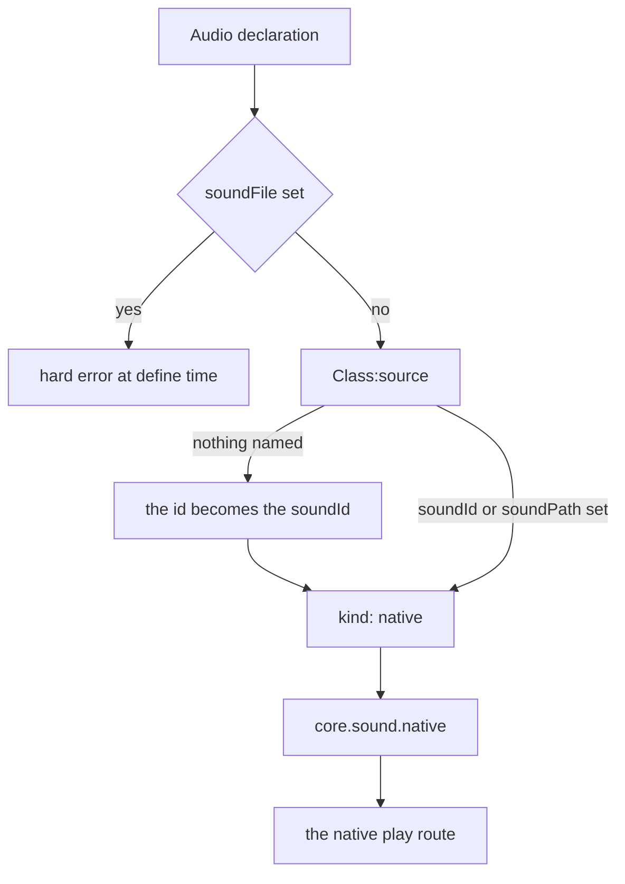
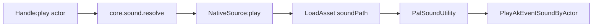
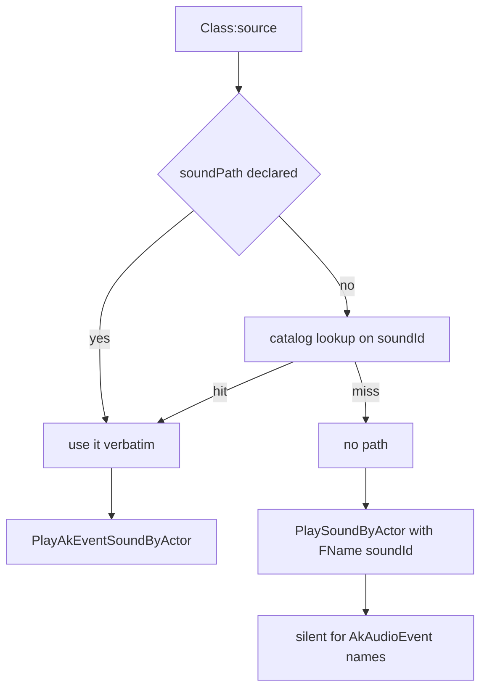

## What you can do after this page

- Play any of the game's own music tracks and sound effects whenever you want
- Make a jingle play when the player picks up an item
- Make a placed building chime when someone interacts with it
- Start a theme the moment the world finishes loading
- Name a sound once and reuse it all over your pack

## Play a sound

Palworld already ships with nearly two thousand sounds: footsteps, explosions, menu clicks,
boss music. `Audio` lets you name one and play it from your own Lua code.

```lua
local Theme = Audio.bgm{
    id        = "AKE_BGM_Title",
    soundId   = "AKE_BGM_Title",
    soundPath = "/Game/Pal/Sound/Events/SE/UI/BGM_Title/AKE_BGM_Title.AKE_BGM_Title",
}

Theme:play()          -- on the local player pawn
Theme:stop()
```

A sound always plays *on* something in the world — a character, a pal, a placed building.
That something is called an **actor**. When you do not pass one, the sound plays on the
character the player is controlling.

Nothing in the game announces "a sound happened", so you pick the moment yourself: call
`:play()` from an item's handler, from a building's handler, or from a world event. The rest
of this page is about naming the sound and about where the play call can go wrong.

## Define a sound

Write `Audio{ ... }` to define a sound. Your table is checked field by field, the sound is
filed under its `id`, and you get back an `Audio.Handle` — the small object with `:play()`
and `:stop()` on it.

<Tabs items={['Audio', 'Audio.bgm', 'Audio.se']}>
<Tab value="Audio">

```lua title="content/sounds.lua"
local Explosion = Audio{
    id          = "example:Blast",
    name        = "Blast",
    description = "Played when the reactor overloads.",
    kind        = "se",
    soundId     = "AKE_General_Explosion",
    soundPath   = "/Game/Pal/Sound/Events/SE/Common/Explosion/AKE_General_Explosion.AKE_General_Explosion",
}
```

</Tab>
<Tab value="Audio.bgm">

```lua title="content/sounds.lua"
-- identical to Audio{ ... } with kind = "bgm" written out
local BossTheme = Audio.bgm{
    id        = "example:BossTheme",
    soundId   = "AKE_LegendDeer_State_Strong_Strong",
    soundPath = "/Game/Pal/Sound/Events/BGM/LegendDeer/AKE_LegendDeer_State_Strong_Strong.AKE_LegendDeer_State_Strong_Strong",
}
```

</Tab>
<Tab value="Audio.se">

```lua title="content/sounds.lua"
local Pickup = Audio.se{
    id        = "example:Pickup",
    soundId   = "AKE_GrabItem",
    soundPath = "/Game/Pal/Sound/Events/SE/UI/Item/AKE_GrabItem.AKE_GrabItem",
}
```

</Tab>
</Tabs>

`Audio.bgm` and `Audio.se` do exactly what `Audio{ ... }` does, with `kind` filled in for you.
They copy your table instead of changing it, and a `kind` in that table that disagrees with
the one they set stops the call with an error rather than being quietly overwritten.

```lua
Audio.bgm{ id = "example:Theme", kind = "se" }
-- PalForge: Audio.bgm: kind is fixed to "bgm" here, but got "se" - use Audio{ ... } to set it
```

## Fields you can set

Most sounds need one field: `id`. Add `soundId` to name a game event, and `soundPath` only when
that name is not in the catalog or you want to override it. You can print the same list from the
game at any time:

```lua
local schema = require("palforge.core.schema")
print(schema.help("Audio.Spec"))          -- every field, type, default and meaning
schema.get("Audio.Spec").fields           -- the same as a table, for tooling
```

<TypeTable
  type={{
    id: {
      description: 'Audio id: the AkAudioEvent name, or "pack:name". Must be a non-empty string.',
      type: 'string',
      required: true,
    },
    name: {
      description: 'Human label. Defaults to id.',
      type: 'string',
    },
    description: {
      description: 'One-line description, for UI and tooling.',
      type: 'string',
    },
    kind: {
      description: 'Descriptive only - the native play route is the same for both. One of "se" or "bgm".',
      type: 'string',
      default: 'se',
    },
    soundId: {
      description: 'Native AkAudioEvent name. When you pass no soundPath, its asset path is filled in from the catalog in native/audio.lua, so a catalogued name on its own plays.',
      type: 'string',
    },
    soundPath: {
      description: 'Native AkAudioEvent asset path, written package.object. Overrides the catalog lookup; a package-only path is completed for you.',
      type: 'string',
    },
    soundFile: {
      description: 'REFUSED at define time - setting it is a hard error. Custom audio files do not play on this build (open item audio-custom-file-loader). Use soundId or soundPath.',
      type: 'string',
    },
    source: {
      description: 'Function that picks the sound at play time, instead of the fields above.',
      type: 'function',
    },
    data: {
      description: 'Free-form payload of your own, carried onto the definition.',
      type: 'table',
    },
  }}
/>

A field you did not declare is an error the moment you define the sound, and the message
offers the field you probably meant, so a typo can never be silently ignored.

## How a sound reaches the game

`AkAudioEvent` is Palworld's name for one playable sound. Each one has a **name** (like
`AKE_GrabItem`) and an **asset path** (the file that name lives in). Your declaration is
turned into a small table that says which of those you gave, and that table decides the route.



`soundFile` never reaches that chart: setting it stops the define call, and the message names the
two fields that do play. A definition that names no sound at all does not end at nothing either,
because `Audio{ ... }` fills `soundId` in from the id first — see "Leaving the sound fields out"
below.

For a name, a path, or both, the game is asked to load the asset and then play it on your actor:



`PlayAkEventSoundByActor` is not a guess. It is one of the reflected functions on
`UPalSoundUtility`, the CXX dump of the installed binary declares it as
`bool PlayAkEventSoundByActor(AActor*, UAkAudioEvent*)`, and a recorded session caught the game
itself calling it six times with exactly those two arguments in that order. What no run log in
this tree records is the audibility of *your* call, which is why `:play()` reports whether a call
was issued and nothing more.

The path is completed before the asset is loaded. A UE object path is `<package>.<object>`, so a
`soundPath` written with only the package half — `/Game/.../AKE_BGM_Title` — is turned into
`/Game/.../AKE_BGM_Title.AKE_BGM_Title` by `core/assetpath`, and a path that already carries an
object half is passed through untouched. Loaded assets are then kept by that completed path, so
the first play pays the load and every later one reuses it. If `LoadAsset` cannot get the asset,
the loader tries once more with `StaticFindObject(path)`, and whatever comes back is class-checked
before it is passed: an object that is not an `AkAudioEvent` is refused with a log line naming what
it really was, rather than marshalled into a `UAkAudioEvent*` parameter.

### What soundId and soundPath each do

The two fields are not alternatives. They feed two stages of the same call, and **either one
on its own is a complete definition**: a sound resolves when it has a non-empty `soundId` or a
non-empty `soundPath`.



- `soundPath` is what makes noise. Playing prefers it: it loads the asset, posts the sound, and
  stops there. A definition carrying only `soundPath` takes this branch.
- `soundId` is an AkAudioEvent name, and lowering looks it up for you. `Class:source()` resolves a
  namespaced id first (`"pack:Theme"` becomes `"pack_Theme"`), then — when you passed no
  `soundPath` — reads that name out of `native/audio.lua`'s catalog, 1957 AkAudioEvent names paired
  with their asset paths, and attaches the real path. So a catalogued name on its own takes the
  branch that plays.
- A name the catalog does not carry gets no path, and the call falls through to
  `PlaySoundByActor(actor, { Key = FName(id) }, ...)`, which looks the name up in the SoundID
  table — a different namespace, and silent for AkAudioEvent names.
- A `soundPath` you wrote yourself is never overwritten by the catalog.

<Callout type="warn">
A `true` from `:play()` means a native call was **issued**, never that you heard something. The
case that still returns `true` and plays nothing is a `soundId` the catalog does not carry: no
path is attached, so the call lands on the silent `PlaySoundByActor` branch. When a sound is
silent, print `:source().path` — a `nil` there is the whole diagnosis.
</Callout>

```lua
-- plays: the asset path is a complete definition on its own
Audio.se{ id = "example:Quiet", soundPath = "/Game/Pal/Sound/Events/SE/UI/Item/AKE_GrabItem.AKE_GrabItem" }

-- plays too: AKE_GrabItem is in the catalog, so lowering attaches its path
Audio.se{ id = "example:NameOnly", soundId = "AKE_GrabItem" }

-- silent: no AkAudioEvent of that name, so there is no path to attach
Audio.se{ id = "example:Missing", soundId = "AKE_NotAnEvent" }
```

## Leaving the sound fields out

A definition that names **no** sound at all — no `soundId`, no `soundPath`, no `source` — uses
its own `id` as the AkAudioEvent name. That is what makes the one-line form work:

```lua
local Theme = Audio.bgm{ id = "AKE_BGM_Title" }
Theme:source()
--> { kind = "native", id = "AKE_BGM_Title",
-->   path = "/Game/Pal/Sound/Events/SE/UI/BGM_Title/AKE_BGM_Title.AKE_BGM_Title" }
```

Nothing in that declaration carries a path; the catalog lookup put it there. So the one-line form
takes the branch that plays for any of the 1957 event names, and only falls back to the silent
`PlaySoundByActor` branch for an id the catalog has never heard of.

<Callout type="info">
The id is used as the sound name only when all three sound-naming fields are absent. Setting any
one of them, including `source`, turns that off. `soundFile` takes no part in the test — it is
refused before the test is reached.
</Callout>

## bgm and se

`kind` is `"se"` or `"bgm"`, defaults to `"se"`, and changes nothing about playback — music and
effects go through the same `PlayAkEventSoundByActor` call. It is there so your own code and
tooling can tell the two apart:

```lua
for _, sound in ipairs(Audio.get_all()) do
    if sound:kind() == "bgm" then
        sound:stop()
    end
end
```

Because `kind` is a label rather than a route, defining the same id as both music and an effect
just keeps whichever call ran last. The same applies to the `bgm(name)` / `se(name)` helpers in
`native/audio.lua`.

## The handle

`Audio{ ... }`, `Audio.bgm`, `Audio.se` and `Audio.get` all return an `Audio.Handle`.

### Actions

```lua
Handle:play(actor)        --> boolean
Handle:stop(actor)        --> boolean
Handle:setVolume(volume, actor)  --> boolean
```

`actor` is optional. When you leave it out, both `play` and `stop` use the character the player
is controlling, found with `FindFirstOf("PalPlayerCharacter")`. With no world loaded there is no
such character, and both return `false` without reaching the sound call.

```lua
local Blast = Audio.get("AKE_General_Explosion")

Blast:play()                       -- on the player pawn
Blast:play(somePalActor)           -- on any actor you already hold
Blast:stop(somePalActor)           -- stops EVERYTHING on that actor
```

The boolean tells you about the *call*, not about the sound. `play` and `stop` return `true`
only when a native call was actually issued. An invalid actor, a missing `PalSoundUtility`, a
throw inside the call and a definition that resolves to nothing are all `false`. A `false` is
worth acting on: it means nothing was even attempted.

```lua title="content/boot_sound.lua"
local log = require("palforge.utils.log").scope("audio")

-- a path-only definition: core.sound.resolve accepts it, so this reaches the engine
local Theme = Audio.bgm{
    id        = "example:BootTheme",
    soundPath = "/Game/Pal/Sound/Events/SE/UI/BGM_Title/AKE_BGM_Title.AKE_BGM_Title",
}

if not Theme:play() then
    log.warn("no player pawn yet, or the definition resolved to nothing")
end
```

<Callout type="warn">
`:stop` is not per-sound. It calls `PalSoundUtility:StopSoundByActor(actor)`, which silences
every sound currently playing on that actor, not just this one. Stopping your BGM on the
player character stops that character's footsteps and voice lines with it. Stopping one sound
and leaving the others running would need a Wwise `PlayingID` that the sound does not keep.
</Callout>

<Callout type="warn">
`:setVolume` is **actor-wide**, exactly like `:stop`. It scales everything one actor is
emitting — your sounds and the game's alike — rather than the one sound you called it on, so
which handle you use makes no difference. `actor` is optional and defaults to the player's own
character, the same as `:play` and `:stop`.

`volume` is a plain multiplier: `1.0` leaves things as they are, `0.5` is half, `0.0` is
silence. It returns `true` when the call was issued, and issued is all it means: nobody has heard
this change a volume. That measurement needs a loaded world and a person listening, so it is owed
as a declared hook — `pf_hook audio-setvolume-audible` plays a catalog event, sets `0.2`, and
plays it again for you to judge.

To make **one** sound quieter than another on the same actor, pick a quieter event from the
catalog. Playing them on separate actors is the other way round: then a volume applies to one
of them.
</Callout>

### Queries

```lua
Handle:source()       --> { kind = "native"|"file", ... } | nil
Handle:kind()         --> "bgm" | "se"
Handle:name()         --> the declared name, or the id
Handle:description()  --> string | nil
Handle.id             --> the sound's id
```

`:source()` is the quickest way to check whether a definition will reach the game at all — it
returns the exact table the play call receives.

```lua
local s = Audio.get("AKE_BGM_Title"):source()
print(s.kind, s.id, s.path)
```

## Look up a sound you did not define

```lua
Audio.get(id)     --> Audio.Handle, never nil
Audio.get_all()   --> Audio.Handle[]
```

`Audio.get` returns a sound you defined earlier when there is one. When there is not, it builds
a thin definition on the spot — `{ id = id, soundId = id }` — so any sound name is at least
something you can hold. That definition carries no asset path of its own, but lowering runs the
same catalog lookup, so `Audio.get("AKE_General_Explosion"):play()` takes the branch that plays
for any catalogued event name without the sound ever having been defined.

At startup PalForge loads `palforge.native.audio`, which registers six ready-made sounds under
the framework's own pack. Those are the ids `Audio.get` answers with a real definition rather
than a thin one:

| Helper | Id |
| --- | --- |
| `MainTheme` | `AKE_BGM_Title` |
| `BattleTheme` | `AKE_LegendDeer_State_Strong_Strong` |
| `VictoryTheme` | `AKE_Arena_Victory_01` |
| `Explosion` | `AKE_General_Explosion` |
| `Laser` | `AKE_Weapon_ChargeLaserRifle_Fire` |
| `Footstep` | `AKE_Pal_Footstep` |

```lua
local audio = require("palforge.native.audio")

audio.MainTheme:play()
audio.Explosion:play()
```

### Any name in the catalog

`native/audio.lua` also carries `M.CATALOG`, every sound name in the game paired with its asset
path. `bgm(name)` / `se(name)` turn a catalog entry into a real definition the first time you
ask for it — with both the name and the path — and keep it for next time. `get(name)` is the
same as `se(name)`. All three return `nil` for a name that is not in the catalog.

```lua
local audio = require("palforge.native.audio")

local levelUp = audio.se("AKE_CampLevelUp")
if levelUp then levelUp:play() end

audio.CATALOG["AKE_CampLevelUp"]
--> "/Game/Pal/Sound/Events/SE/UI/CampLevelUp/AKE_CampLevelUp.AKE_CampLevelUp"
```

<Callout type="info">
`native.audio.se(name)` / `native.audio.bgm(name)` and `Audio.get(name)` both reach the catalog,
so either one plays a stock game sound. The `native.audio` pair still tells you something
`Audio.get` cannot: they return `nil` for a name that is not an AkAudioEvent in this build, while
`Audio.get` never returns `nil` and hands you a handle whose `:play()` is silent. They also do not
register what they build — `native.audio.publish(name)` is the opt-in for that.
</Callout>

## Define once, play many

`Audio{ ... }` builds a sound. `Audio.get(id)` and a handle you kept in a variable just look one
up. A handler runs on every event, so put the definition at load time and only the play inside
the handler.

```lua title="content/sounds.lua"
-- module scope: runs once when the pack loads
local Pickup = Audio.se{
    id        = "example:Pickup",
    soundId   = "AKE_GrabItem",
    soundPath = "/Game/Pal/Sound/Events/SE/UI/Item/AKE_GrabItem.AKE_GrabItem",
}

return { Pickup = Pickup }
```

```lua title="content/items.lua"
local sounds = require("content.sounds")

Item{
    id = "Wood",
    events = {
        onObtain = function(item, ctx)
            sounds.Pickup:play()          -- a play, not a declaration
        end,
    },
}
```

<Callout type="warn">
Never call `Audio.bgm{ ... }` or `Audio.se{ ... }` inside a handler. Each call checks the table
again, builds a new definition and replaces the entry stored under the same id — on every single
event. Keep the handle in a local variable outside the handler, or call `Audio.get(id)` inside it.
</Callout>

```lua
-- wrong: re-declares and re-registers the sound on every pickup
onObtain = function(item, ctx)
    Audio.se{ id = "AKE_GrabItem" }:play()
end

-- fine: a lookup
onObtain = function(item, ctx)
    Audio.get("AKE_GrabItem"):play()
end
```

## What does not work yet

Three things here do less than you would expect: one is refused outright, and two reach further
than you asked for.

<Callout type="warn">
**Custom audio files do not play, and `soundFile` is a hard error.** Setting it stops the define
call, and the message names the open item `audio-custom-file-loader` plus the two fields that do
play. Erroring rather than ignoring is the point: `soundFile` is lowered ahead of
`soundId`/`soundPath`, so a pack that added one beside a working `soundId` silenced a sound that
was playing, and it has never been playable on any build this tree has measured.

**The Wwise half of that is settled**, and it was settled by looking: on 2026-08-02, in a loaded
save, `AkExternalMediaAsset` and `AkMediaAsset` both resolved as class defaults, both declared
**zero** functions, and the game held no loaded instance of either. There is no external-media or
`SetMedia` route on this build to be found by anyone, however hard they look, so nobody needs to
sweep `AkAudio` for one again.

**The engine-native half is narrower than closed.** `USoundWave` declares no importer, so nothing
reads a `.wav` off disk by itself — but `UGameplayStatics` keeps its whole audio surface in
shipping (`PlaySound2D`, `CreateSound2D`, `SpawnSoundAttached` among 137 functions), the game has
real `SoundWave` and `SoundBase` instances loaded, and UE4SS offers `StaticConstructObject`. What
nobody has established is whether a `USoundWave` can be built that way and its sample buffer
filled from Lua. Until somebody has, pick the closest sound from the catalog instead.
</Callout>

<Callout type="warn">
**`:stop` stops everything on the actor.** `StopSoundByActor` takes an actor and nothing else,
so every stop silences that actor completely, whichever sound you called it on. If you need one
sound to keep going, play it on a different actor — music on a placed building, for example,
and effects on the player.
</Callout>

`:setVolume` shares `:stop`'s actor-wide scope, and it is actor-wide **by construction** rather
than by choice. The native call is
`UAkGameplayStatics::SetOutputBusVolume(float BusVolume, AActor* Actor)`, which has no bus name in
it at all — the second parameter is the actor, that is, the Wwise game object — so what it scales
is what one emitter sends to its output bus. That is exactly the scope `:play` posts at and
`:stop` clears.

Nothing narrower exists on this build, and that is settled rather than untried. The RTPC route is
the one that would have been per sound, and it is closed by a count: the whole build declares
**three** `AkRtpc` assets — `Supply_Altitude`, `OverHeatRifle` and `ChargeLaserRifle_01` — and
**no** `AkAuxBus` and **no** `AkAudioBank`. None of the three is a volume, so there was never an
RTPC volume parameter to address, and no bus name to give the named-bus overload. A per-sound
volume slider still has to be separate actors, or separate events.

## Recipes

### A jingle when an item is picked up

`item.obtain` fires for real. Its `ctx` carries `ctx.itemId` and `ctx.count`, and the handler's
first argument is the item's own handle.

```lua title="content/pickup_jingle.lua"
local api = require("palforge.api")
local audio = require("palforge.native.audio")

local Jingle = audio.se("AKE_CampLevelUp")   -- catalog entry, name + path

api.Item{
    id          = "Berries",
    name        = "Berries",
    description = "Plays a jingle when you pick some up.",
    events = {
        onObtain = function(item, ctx)
            if (ctx.count or 0) >= 10 then
                Jingle:play()
            end
        end,
    },
}
```

`ctx.count` is read as best it can be from the game's own message and can be `nil`, so guard it.

### Music when the world is ready

You choose when music starts. `world.ready` fires once the player's character has been there for
several checks in a row, which is also the first moment `:play()` has a character to default to.

```lua title="content/theme.lua"
local event = require("palforge.core.event")
local audio = require("palforge.native.audio")

event.on("world.ready", function(ctx)
    audio.MainTheme:play()
end)
```

To write the definition yourself instead of using the ready-made helper, pass both fields:

```lua title="content/theme.lua"
local event = require("palforge.core.event")

local Theme = Audio.bgm{
    id          = "example:WorldTheme",
    name        = "World Theme",
    description = "Plays once the world finishes loading.",
    soundId     = "AKE_BGM_Title",
    soundPath   = "/Game/Pal/Sound/Events/SE/UI/BGM_Title/AKE_BGM_Title.AKE_BGM_Title",
}

event.on("world.ready", function(ctx)
    Theme:play()
end)

event.on("world.left", function(ctx)
    Theme:stop()      -- stops every sound on the pawn, not just this one
end)
```

### A sound from a building interaction

`onRightClick` fires for real on buildings. Its first argument is the placed building itself, so
`self.actor` is the structure standing in the world — play the sound there and it comes from the
building rather than from the player.

```lua title="content/palbox_sound.lua"
local api = require("palforge.api")
local audio = require("palforge.native.audio")

local Chime = audio.se("AKE_Build_PalBox")

api.Building{
    id          = "PalBoxV2",
    name        = "Pal Box",
    description = "Chimes when you interact with it.",
    gridCm      = 100,
    state       = { uses = 0 },
    events = {
        onRightClick = function(self, ctx)
            self.state.uses = self.state.uses + 1
            self:save()
            Chime:play(self.actor)        -- ctx.actor is the same building actor
        end,
    },
}
```

`ctx` for `building.interact` carries `ctx.actor` (the building), `ctx.player` (the character
that interacted) and `ctx.buildId`. Playing on `ctx.player` instead puts the sound on whoever
pressed the key.

### Choosing the sound at play time

`source` lets you decide the sound at the moment it plays instead of fixing it in the fields.
The function is called on the definition, so `self` carries the fields you declared, and it
returns the table the play call will use — or `nil` for silence.

```lua title="content/dynamic_sound.lua"
local audio = require("palforge.native.audio")

local Footstep = Audio.se{
    id   = "example:Footstep",
    data = { wet = false },
    source = function(self)
        local name = self.data.wet and "AKE_Pal_Footstep_Water" or "AKE_Pal_Footstep"
        return { kind = "native", id = name, path = audio.CATALOG[name] }
    end,
}

Footstep:play()
```

Keep to the shape: `{ kind = "native", id = <AkAudioEvent name>, path = <asset path> }` — either
field may be left out as long as the other is a non-empty string — or
`{ kind = "file", path = ... }`. Anything else resolves to `nil`, and a `nil` source plays
nothing and makes `:play()` return `false`.

## Errors

Every check that fails stops the call with an error prefixed `PalForge: `. The call never
half-succeeds, so you never end up with a partly built sound.

```text
PalForge: Audio: field "id" is required (audio id: the AkAudioEvent name, or "pack:name")
PalForge: Audio: field "id" is invalid: must be a non-empty string
PalForge: Audio: unknown field "path" (did you mean "soundPath"?). Valid fields: id, name, description, kind, soundId, soundPath, soundFile, source, data
PalForge: Audio: field "kind" must be one of { "se", "bgm" }, got "music"
PalForge: Audio.bgm: kind is fixed to "bgm" here, but got "se" - use Audio{ ... } to set it
```

`soundFile` has its own, and it is the longest message in the module because it has to say why a
declared field is refused. Abridged:

```text
PalForge: Audio: soundFile is not accepted (id "example:Blast", soundFile "C:/mods/example/blast.wav").
Custom audio files do not play on this build: [...] This is the open item audio-custom-file-loader.
It is an ERROR rather than a no-op because soundFile used to OUTRANK soundId/soundPath, so setting it
beside a working soundId silenced a sound that was playing. Name a game sound instead:
soundId = "AKE_UI_Common_Menu_Close", or soundPath = the asset path from PalForge.native.audio.CATALOG.
```

`Audio.get` takes a bare string, so it complains differently:

```text
Audio.get: id (string) is required
```

Filing the sound away is best-effort: if that step fails, you still get a working handle back.

## See also

<Cards>
  <Card title="Item" href="/docs/api/item">The `item.obtain` and `item.use` hooks the pickup recipe uses.</Card>
  <Card title="Building" href="/docs/api/building">Live instances, `onRightClick`, and `self.actor`.</Card>
  <Card title="Lifecycle" href="/docs/concepts/lifecycle">Channels, `world.ready`, and which hooks actually fire.</Card>
  <Card title="Schema" href="/docs/concepts/schema">How specs are declared, validated and read back.</Card>
</Cards>

## Summary

- Define a sound with `Audio{ ... }`, `Audio.bgm{ ... }` or `Audio.se{ ... }`. Only `id` is required.
- A catalogued `soundId` is enough on its own: lowering fills the asset path in from
  `native/audio.lua`. Pass `soundPath` for a name the catalog does not carry, or to override it.
- `soundFile` is a hard error at define time. Custom audio files do not play on this build.
- Play it with `handle:play(actor)`. Leave `actor` out and it plays on the player's character.
- `true` from `:play()` means the call went out, not that you heard it. Check `:source().path`
  when a sound is silent.
- `:stop(actor)` silences everything on that actor, and `:setVolume(volume, actor)` scales
  everything on it. Both are actor-wide, never per sound.
- Define your sounds once when the pack loads, and only call `:play()` inside handlers.

Next, read [Item](/docs/api/item) to hook a sound onto something the player picks up or uses.
