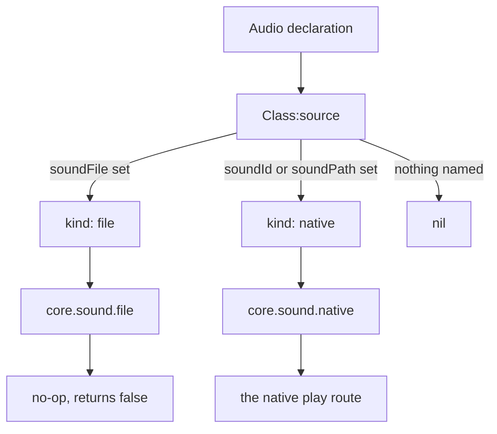
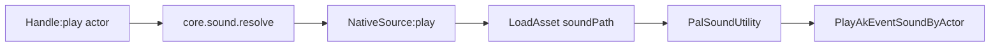
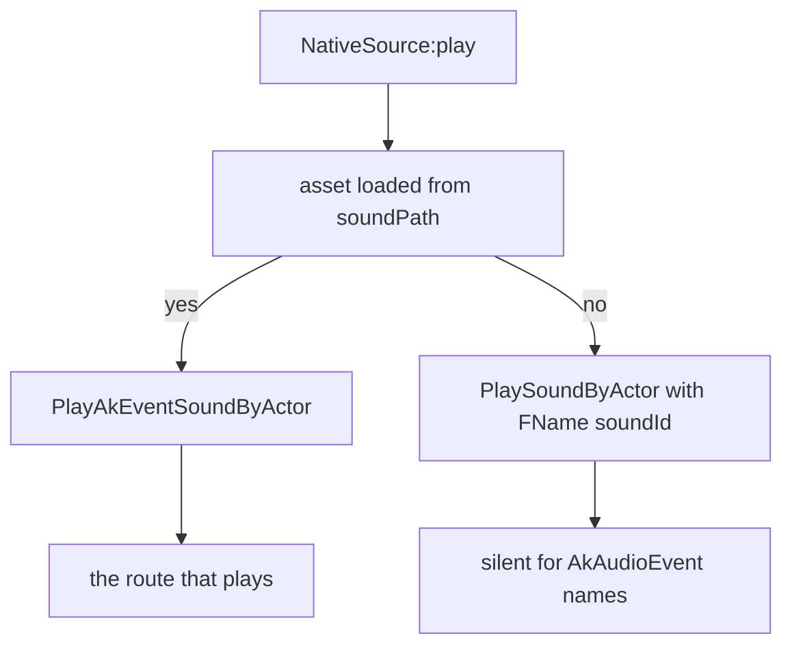

## 读完本页你可以做到

- 随时播放游戏自带的音乐和音效
- 让玩家捡起道具时响一段提示音
- 让放置好的建筑物在被交互时发出声音
- 在世界加载完成的那一刻开始播放主题曲
- 给一个声音起一次名字，在整个内容包里反复使用

## 播放声音

Palworld 自带将近两千种声音：脚步声、爆炸声、菜单点击声、Boss 战音乐。`Audio` 让你给其中
一个起名字，然后在自己的 Lua 代码里播放它。

```lua
local Theme = Audio.bgm{
    id        = "AKE_BGM_Title",
    soundId   = "AKE_BGM_Title",
    soundPath = "/Game/Pal/Sound/Events/SE/UI/BGM_Title/AKE_BGM_Title.AKE_BGM_Title",
}

Theme:play()          -- on the local player pawn
Theme:stop()
```

声音总是在世界里的某个东西*上*播放——一个角色、一只帕鲁、一个放置好的建筑物。这个东西
叫做 **actor**。不传 actor 时，声音在玩家正在操控的角色上播放。

游戏不会告诉你“有声音响了”，所以播放的时机由你自己决定：在道具的处理函数里、在建筑物的
处理函数里，或者在世界事件里调用 `:play()`。本页剩下的部分讲怎么给声音起名字，以及播放
调用可能在哪里出问题。

## 定义声音

写 `Audio{ ... }` 就能定义一个声音。你传的表会被逐个字段检查，声音以 `id` 为键登记下来，
返回值是一个 `Audio.Handle`——带有 `:play()` 和 `:stop()` 的小对象。

<Tabs items={['Audio', 'Audio.bgm', 'Audio.se']}>
<Tab value="Audio">

```lua title="content/sounds.lua"
local Explosion = Audio{
    id          = "example:Blast",
    name        = "Blast",
    description = "Played when the reactor overloads.",
    kind        = "se",
    soundId     = "AKE_General_Explosion",
    soundPath   = "/Game/Pal/Sound/Events/SE/Common/Explosion/AKE_General_Explosion.AKE_General_Explosion",
}
```

</Tab>
<Tab value="Audio.bgm">

```lua title="content/sounds.lua"
-- identical to Audio{ ... } with kind = "bgm" written out
local BossTheme = Audio.bgm{
    id        = "example:BossTheme",
    soundId   = "AKE_LegendDeer_State_Strong_Strong",
    soundPath = "/Game/Pal/Sound/Events/BGM/LegendDeer/AKE_LegendDeer_State_Strong_Strong.AKE_LegendDeer_State_Strong_Strong",
}
```

</Tab>
<Tab value="Audio.se">

```lua title="content/sounds.lua"
local Pickup = Audio.se{
    id        = "example:Pickup",
    soundId   = "AKE_GrabItem",
    soundPath = "/Game/Pal/Sound/Events/SE/UI/Item/AKE_GrabItem.AKE_GrabItem",
}
```

</Tab>
</Tabs>

`Audio.bgm` 和 `Audio.se` 做的事情和 `Audio{ ... }` 完全一样，只是 `kind` 已经替你填好了。
它们会复制你的表而不是改写它；表里的 `kind` 如果和它们设定的值不一致，调用会直接报错，而
不是被悄悄覆盖。

```lua
Audio.bgm{ id = "example:Theme", kind = "se" }
-- PalForge: Audio.bgm: kind is fixed to "bgm" here, but got "se" - use Audio{ ... } to set it
```

## 可以设置的字段

大多数声音只需要两个字段：用来起名字的 `id`，和指向音频资源的 `soundPath`。其余都是可选的。
同一份列表随时可以在游戏里打印出来：

```lua
local schema = require("palforge.core.schema")
print(schema.help("Audio.Spec"))          -- every field, type, default and meaning
schema.get("Audio.Spec").fields           -- the same as a table, for tooling
```

<TypeTable
  type={{
    id: {
      description: '声音 id：AkAudioEvent 名称，或者 "pack:name" 形式。必须是非空字符串。',
      type: 'string',
      required: true,
    },
    name: {
      description: '显示用的标签。默认取 id。',
      type: 'string',
    },
    description: {
      description: '一行说明，给界面和工具用。',
      type: 'string',
    },
    kind: {
      description: '仅用于描述 - 两种取值走的原生播放路径完全相同。取 "se" 或 "bgm"。',
      type: 'string',
      default: 'se',
    },
    soundId: {
      description: '原生 AkAudioEvent 名称。这是 SoundID 回退路径，只有在没有资源路径能加载时才会走。只带这个字段的定义也能解析成功。',
      type: 'string',
    },
    soundPath: {
      description: '原生 AkAudioEvent 资源路径。真正发出声音的就是这条路径，只带这个字段的定义能解析成功并且能播放。',
      type: 'string',
    },
    soundFile: {
      description: '自定义音频文件路径。可以接受，但不会有声音 - 见下面的“还不能用的功能”。',
      type: 'string',
    },
    source: {
      description: '在播放时挑选声音的函数，用来代替上面那些字段。',
      type: 'function',
    },
    data: {
      description: '你自己的任意数据，会原样带在定义上。',
      type: 'table',
    },
  }}
/>

写了没有声明过的字段，在定义声音的那一刻就会报错，而且消息里会给出你可能想写的字段名，
所以拼写错误不会被悄悄忽略。

## 声音是怎么传到游戏里的

`AkAudioEvent` 是 Palworld 给“一个可播放的声音”起的名字。每一个都有一个**名称**（比如
`AKE_GrabItem`）和一个**资源路径**（这个名称所在的文件）。你的声明会被转换成一张小表，
记录你给出了其中的哪些，这张表决定走哪条路径。



`soundFile` 的优先级高于另外两个。完全没有指定声音的定义会停在 `nil`，不过很少有声明能走到
那里，因为 `Audio{ ... }` 会先用 id 把 `soundId` 填上——见下面的“省略声音字段”。

名称和路径都有时，游戏会被要求先加载资源，再在你的 actor 上播放：



`PlayAkEventSoundByActor` 是正式版游戏里真实存在的函数，所以调用确实到得了引擎。但这棵代码
树里没有任何运行日志记录到它真的发出了声音，所以把这条路径当作可信，把结果当作未验证。
`:play()` 只报告有没有发出调用、别的什么都不报告，原因就在这里。

已加载的资源按路径保存下来，所以第一次播放要付加载的代价，之后每次都复用。如果加载器拿不到
资源，会用 `StaticFindObject(path)` 再试一次。

### 为什么要同时传 soundId 和 soundPath

这两个字段不是二选一。它们服务于同一次调用的两个阶段，而且**任何一个单独存在都是完整的
定义**：只要有非空的 `soundId` 或非空的 `soundPath`，声音就能解析成功。



- 发出声音的是 `soundPath`。播放时优先用它：加载资源，送出声音，到此为止。只带 `soundPath`
  的定义走的就是这个分支。
- `soundId` 是回退方案。没有能加载的资源时，代码会落到
  `PlaySoundByActor(actor, { Key = FName(id) }, ...)`，它在另一张声音表里查这个名称——那张表
  里没有 AkAudioEvent 名称，所以对这类名称来说是无声的。只带 `soundId` 的定义能用，但它落到
  的就是这个分支。
- 两个都传，你就同时拿到了会发声的路径，和资源加载不了时可以回退的名称。`native/audio.lua`
  里的目录对每一条都同时传了两个。

<Callout type="warn">
`:play()` 返回 `true` 只表示**发出了**一次原生调用，绝不表示你听到了什么。到现在还会骗到人
的组合是：有名称、没有路径。它能解析成功，能走到 `PlaySoundByActor`，返回 `true`，却什么都
没播。声音不响的时候，先检查 `:source().path`。
</Callout>

```lua
-- plays: the asset path is a complete definition on its own
Audio.se{ id = "example:Quiet", soundPath = "/Game/Pal/Sound/Events/SE/UI/Item/AKE_GrabItem.AKE_GrabItem" }

-- resolves, reaches the engine, stays silent -- a name with no path
Audio.se{ id = "example:NameOnly", soundId = "AKE_GrabItem" }

-- preferred: the path plays, the id is there if the asset cannot be loaded
Audio.se{
    id        = "example:Loud",
    soundId   = "AKE_GrabItem",
    soundPath = "/Game/Pal/Sound/Events/SE/UI/Item/AKE_GrabItem.AKE_GrabItem",
}
```

## 省略声音字段

**完全**没有指定声音的定义——没有 `soundId`、没有 `soundPath`、没有 `soundFile`、也没有
`source`——会拿自己的 `id` 当作声音名称。一行写法能用，就是因为这个：

```lua
local Theme = Audio.bgm{ id = "AKE_BGM_Title" }
Theme:source()   --> { kind = "native", id = "AKE_BGM_Title", path = nil }
```

这样得到的定义能解析成功，所以 `:play()` 到得了游戏，只要有有效的 actor 就返回 `true`。但它
给不了你资源路径，于是调用走的是 `PlaySoundByActor` 回退分支——对这类名称来说无声的那一支，
那个 `true` 只说明调用发出去了。一行写法用来*登记*一个名称；想真的听到声音，就加上
`soundPath`。

<Callout type="info">
只有在四个指定声音的字段全都不存在时，id 才会被当作声音名称。其中任何一个（包括 `source`）
只要设置了，这个行为就关掉。
</Callout>

## bgm 和 se

`kind` 取 `"se"` 或 `"bgm"`，默认是 `"se"`，对播放没有任何影响——音乐和音效走的是同一个
`PlayAkEventSoundByActor` 调用。它存在是为了让你自己的代码和工具能区分两者：

```lua
for _, sound in ipairs(Audio.get_all()) do
    if sound:kind() == "bgm" then
        sound:stop()
    end
end
```

因为 `kind` 是标签而不是路径，把同一个 id 既定义成音乐又定义成音效，只会保留最后一次调用的
结果。`native/audio.lua` 里的 `bgm(name)` / `se(name)` 辅助函数也是一样。

## 句柄

`Audio{ ... }`、`Audio.bgm`、`Audio.se` 和 `Audio.get` 都返回 `Audio.Handle`。

### 动作

```lua
Handle:play(actor)        --> boolean
Handle:stop(actor)        --> boolean
Handle:setVolume(volume)  --> false, always
```

`actor` 可以省略。省略时，`play` 和 `stop` 都会用 `FindFirstOf("PalPlayerCharacter")` 找到
玩家正在操控的角色。没有加载世界时就没有这个角色，两者都会在到达声音调用之前返回 `false`。

```lua
local Blast = Audio.get("AKE_General_Explosion")

Blast:play()                       -- on the player pawn
Blast:play(somePalActor)           -- on any actor you already hold
Blast:stop(somePalActor)           -- stops EVERYTHING on that actor
```

这个布尔值说的是*调用*，不是声音。只有真的发出了原生调用，`play` 和 `stop` 才返回 `true`。
无效的 actor、找不到 `PalSoundUtility`、调用内部抛出异常，以及解析不出任何东西的定义，全都
是 `false`。`false` 值得你处理：它意味着连尝试都没有发生。

```lua title="content/boot_sound.lua"
local log = require("palforge.utils.log").scope("audio")

-- a path-only definition: core.sound.resolve accepts it, so this reaches the engine
local Theme = Audio.bgm{
    id        = "example:BootTheme",
    soundPath = "/Game/Pal/Sound/Events/SE/UI/BGM_Title/AKE_BGM_Title.AKE_BGM_Title",
}

if not Theme:play() then
    log.warn("no player pawn yet, or the definition resolved to nothing")
end
```

<Callout type="warn">
`:stop` 不是按声音来的。它调用的是 `PalSoundUtility:StopSoundByActor(actor)`，会让那个 actor
上正在播放的所有声音全部停下，不只是这一个。在玩家角色上停掉你的 BGM，会把那个角色的脚步声
和语音一起停掉。想停一个、让其他继续响，需要 Wwise 的 `PlayingID`，而声音本身没有保存它。
</Callout>

<Callout type="warn">
`:setVolume` **没有实现**。它返回 `false`，好让你知道它什么都没做。今天的 PalForge 里没有按
声音调节音量的手段——挑更安静的事件来配平，或者把音量交给玩家自己的设置。正式版游戏里确实
有相关路径：`UPalSoundUtility::SetRTPCValueByActor`、`UAkGameplayStatics::SetRTPCValue`，
以及 actor 发声器上的 `UAkComponent::SetOutputBusVolume`。但它们都不是按声音来的，参数列表
也还没有导出，而且 Palworld 声明的 RTPC 只有 `Field_Time` 和 `Sliding_Speed`，没有已知的音量
名称。真要接上，多半会把这个签名改成 `setVolume(volume, actor)`，或者改成总线级别的调用。
</Callout>

### 查询

```lua
Handle:source()       --> { kind = "native"|"file", ... } | nil
Handle:kind()         --> "bgm" | "se"
Handle:name()         --> the declared name, or the id
Handle:description()  --> string | nil
Handle.id             --> the sound's id
```

要确认一个定义到底能不能到达游戏，最快的办法就是 `:source()`——它返回的正是播放调用会拿到
的那张表。

```lua
local s = Audio.get("AKE_BGM_Title"):source()
print(s.kind, s.id, s.path)
```

## 取用自己没有定义过的声音

```lua
Audio.get(id)     --> Audio.Handle, never nil
Audio.get_all()   --> Audio.Handle[]
```

`Audio.get` 会返回你之前定义过的声音，前提是有。没有的话，它会当场造一个很薄的定义——
`{ id = id, soundId = id }`——这样任何声音名称至少都能拿到手。这个临时定义**没有资源路径**，
于是它走的是无声的回退路径，和上面那种一行写法完全一样。

启动时 PalForge 会加载 `palforge.native.audio`，它定义了六个现成的声音。`Audio.get` 能连
路径一起找到的，就是这些 id：

| 辅助函数 | Id |
| --- | --- |
| `MainTheme` | `AKE_BGM_Title` |
| `BattleTheme` | `AKE_LegendDeer_State_Strong_Strong` |
| `VictoryTheme` | `AKE_Arena_Victory_01` |
| `Explosion` | `AKE_General_Explosion` |
| `Laser` | `AKE_Weapon_ChargeLaserRifle_Fire` |
| `Footstep` | `AKE_Pal_Footstep` |

```lua
local audio = require("palforge.native.audio")

audio.MainTheme:play()
audio.Explosion:play()
```

### 目录里的任意名称

`native/audio.lua` 还带着 `M.CATALOG`，里面是游戏里每一个声音名称和它配对的资源路径。
`bgm(name)` / `se(name)` 会在你第一次索取时，把目录里的一条变成真正的定义——名称和路径都
带上——并保留下来供下次使用。`get(name)` 和 `se(name)` 相同。不在目录里的名称，三者都返回
`nil`。

```lua
local audio = require("palforge.native.audio")

local levelUp = audio.se("AKE_CampLevelUp")
if levelUp then levelUp:play() end

audio.CATALOG["AKE_CampLevelUp"]
--> "/Game/Pal/Sound/Events/SE/UI/CampLevelUp/AKE_CampLevelUp.AKE_CampLevelUp"
```

<Callout type="info">
对于自己没有定义过的游戏原有声音，优先用 `native.audio.se(name)` /
`native.audio.bgm(name)`，而不是 `Audio.get(name)`。`Audio.get` 不可能知道资源路径；
`native.audio` 会去目录里查。
</Callout>

## 定义一次，播放多次

`Audio{ ... }` 会创建一个声音。`Audio.get(id)` 和你存在变量里的句柄只是把它查出来。处理函数
每次事件都会运行，所以把定义放在加载时执行，处理函数里只放播放。

```lua title="content/sounds.lua"
-- module scope: runs once when the pack loads
local Pickup = Audio.se{
    id        = "example:Pickup",
    soundId   = "AKE_GrabItem",
    soundPath = "/Game/Pal/Sound/Events/SE/UI/Item/AKE_GrabItem.AKE_GrabItem",
}

return { Pickup = Pickup }
```

```lua title="content/items.lua"
local sounds = require("content.sounds")

Item{
    id = "Wood",
    events = {
        onObtain = function(item, ctx)
            sounds.Pickup:play()          -- a play, not a declaration
        end,
    },
}
```

<Callout type="warn">
绝对不要在处理函数里调用 `Audio.bgm{ ... }` 或 `Audio.se{ ... }`。每次调用都会重新检查这张
表，造一个新的定义，并替换掉同一个 id 下已经登记的内容——每一次事件都会这样。把句柄放在
处理函数外面的局部变量里，或者在处理函数里调用 `Audio.get(id)`。
</Callout>

```lua
-- wrong: re-declares and re-registers the sound on every pickup
onObtain = function(item, ctx)
    Audio.se{ id = "AKE_GrabItem" }:play()
end

-- fine: a lookup
onObtain = function(item, ctx)
    Audio.get("AKE_GrabItem"):play()
end
```

## 还不能用的功能

这里有三样东西做的事比你预期的少：两样没做完，一样停掉的东西比你要求的多。三样都不会报错，
只是安静地过去，所以在为一个不出声的声音耗掉一晚上之前，先读这一节。

<Callout type="warn">
**自定义音频文件不会播放。** `soundFile` 声明可以被接受，会解析成一个文件源，然后这个源什么
都不做就返回 `false`——`:play()` 把这个 `false` 原样交给你。Palworld 没有暴露出可以确认的
自定义音频加载器，所以这里是写明的空实现，而不是假装实现。今天你自己的音频资源没办法通过
PalForge 播放：请从目录里挑一个最接近的声音。
</Callout>

<Callout type="warn">
**`:stop` 会停掉那个 actor 上的一切。** `StopSoundByActor` 只接受一个 actor，别的什么都不
接受，所以不管你是从哪个声音上调用的，那个 actor 都会彻底安静下来。如果需要某个声音继续
响，就把它放到另一个 actor 上播——比如音乐放在放置好的建筑物上，音效放在玩家身上。
</Callout>

第三处欠缺是上面说过的 `:setVolume`：它返回 `false` 并且什么都不做，所以现在还不要在它上面
搭音量滑块。

## 实用示例

### 捡起道具时响一段提示音

`item.obtain` 是真的会触发的。它的 `ctx` 带着 `ctx.itemId` 和 `ctx.count`，处理函数的第一个
参数是道具自己的句柄。

```lua title="content/pickup_jingle.lua"
local api = require("palforge.api")
local audio = require("palforge.native.audio")

local Jingle = audio.se("AKE_CampLevelUp")   -- catalog entry, name + path

api.Item{
    id          = "Berries",
    name        = "Berries",
    description = "Plays a jingle when you pick some up.",
    events = {
        onObtain = function(item, ctx)
            if (ctx.count or 0) >= 10 then
                Jingle:play()
            end
        end,
    },
}
```

`ctx.count` 是从游戏自己的消息里尽力读出来的，可能是 `nil`，所以要做判断。

### 世界准备好时播放音乐

音乐什么时候开始由你决定。`world.ready` 会在玩家角色连续几次检查都在场之后触发一次，那也
正是 `:play()` 第一次有默认角色可用的时刻。

```lua title="content/theme.lua"
local event = require("palforge.core.event")
local audio = require("palforge.native.audio")

event.on("world.ready", function(ctx)
    audio.MainTheme:play()
end)
```

想自己写定义、不用现成的辅助函数，就把两个字段都传上：

```lua title="content/theme.lua"
local event = require("palforge.core.event")

local Theme = Audio.bgm{
    id          = "example:WorldTheme",
    name        = "World Theme",
    description = "Plays once the world finishes loading.",
    soundId     = "AKE_BGM_Title",
    soundPath   = "/Game/Pal/Sound/Events/SE/UI/BGM_Title/AKE_BGM_Title.AKE_BGM_Title",
}

event.on("world.ready", function(ctx)
    Theme:play()
end)

event.on("world.left", function(ctx)
    Theme:stop()      -- stops every sound on the pawn, not just this one
end)
```

### 与建筑物交互时发出声音

建筑物上的 `onRightClick` 是真的会触发的。它的第一个参数就是放置好的建筑物本身，所以
`self.actor` 就是立在世界里的那个结构——在它上面播放，声音就从建筑物发出，而不是从玩家
身上发出。

```lua title="content/palbox_sound.lua"
local api = require("palforge.api")
local audio = require("palforge.native.audio")

local Chime = audio.se("AKE_Build_PalBox")

api.Building{
    id          = "PalBoxV2",
    name        = "Pal Box",
    description = "Chimes when you interact with it.",
    gridCm      = 100,
    state       = { uses = 0 },
    events = {
        onRightClick = function(self, ctx)
            self.state.uses = self.state.uses + 1
            self:save()
            Chime:play(self.actor)        -- ctx.actor is the same building actor
        end,
    },
}
```

`building.interact` 的 `ctx` 带着 `ctx.actor`（建筑物）、`ctx.player`（交互的那个角色）和
`ctx.buildId`。改成在 `ctx.player` 上播放，声音就跟着按下按键的人。

### 在播放时挑选声音

`source` 让你在播放的那一刻决定声音，而不是在字段里写死。这个函数是在定义上调用的，所以
`self` 带着你声明的那些字段；它返回播放调用要用的表——想要无声就返回 `nil`。

```lua title="content/dynamic_sound.lua"
local audio = require("palforge.native.audio")

local Footstep = Audio.se{
    id   = "example:Footstep",
    data = { wet = false },
    source = function(self)
        local name = self.data.wet and "AKE_Pal_Footstep_Water" or "AKE_Pal_Footstep"
        return { kind = "native", id = name, path = audio.CATALOG[name] }
    end,
}

Footstep:play()
```

形状要守住：`{ kind = "native", id = <AkAudioEvent name>, path = <asset path> }`（只要其中
一个是非空字符串，另一个就可以省略），或者 `{ kind = "file", path = ... }`。除此之外的东西
都会解析成 `nil`，而 `nil` 源什么都不播，并让 `:play()` 返回 `false`。

## 错误

每一项检查失败，都会以 `PalForge: ` 开头的错误中止调用。调用不会只成功一半，所以你不会拿到
一个造了一半的声音。

```text
PalForge: Audio: field "id" is required (audio id: the AkAudioEvent name, or "pack:name")
PalForge: Audio: field "id" is invalid: must be a non-empty string
PalForge: Audio: unknown field "path" (did you mean "soundPath"?). Valid fields: id, name, description, kind, soundId, soundPath, soundFile, source, data
PalForge: Audio: field "kind" must be one of { "se", "bgm" }, got "music"
PalForge: Audio.bgm: kind is fixed to "bgm" here, but got "se" - use Audio{ ... } to set it
```

`Audio.get` 接受的是一个裸字符串，所以它报的消息不一样：

```text
Audio.get: id (string) is required
```

把声音登记下来是尽力而为的：即使这一步失败，你仍然会拿到一个能用的句柄。

## 相关页面

<Cards>
  <Card title="Item" href="/docs/api/item">捡取示例用到的 `item.obtain` 和 `item.use` 钩子。</Card>
  <Card title="Building" href="/docs/api/building">运行中的实例、`onRightClick`，以及 `self.actor`。</Card>
  <Card title="生命周期" href="/docs/concepts/lifecycle">通道、`world.ready`，以及哪些钩子真的会触发。</Card>
  <Card title="Schema" href="/docs/concepts/schema">spec 是怎么声明、校验和读回来的。</Card>
</Cards>

## 小结

- 用 `Audio{ ... }`、`Audio.bgm{ ... }` 或 `Audio.se{ ... }` 定义声音。只有 `id` 是必填的。
- 除了 `soundId`，也要传 `soundPath`。听得到的是路径；只有名称是无声的。
- 用 `handle:play(actor)` 播放。省略 `actor` 就在玩家角色上播放。
- `:play()` 返回 `true` 表示调用发出去了，不表示你听到了。声音不响时检查 `:source().path`。
- `:stop(actor)` 会停掉那个 actor 上的一切，`:setVolume` 目前还什么都不做。
- 声音在内容包加载时定义一次，处理函数里只调用 `:play()`。

接下来读 [Item](/docs/api/item)，给玩家捡起或使用的东西加上声音。
