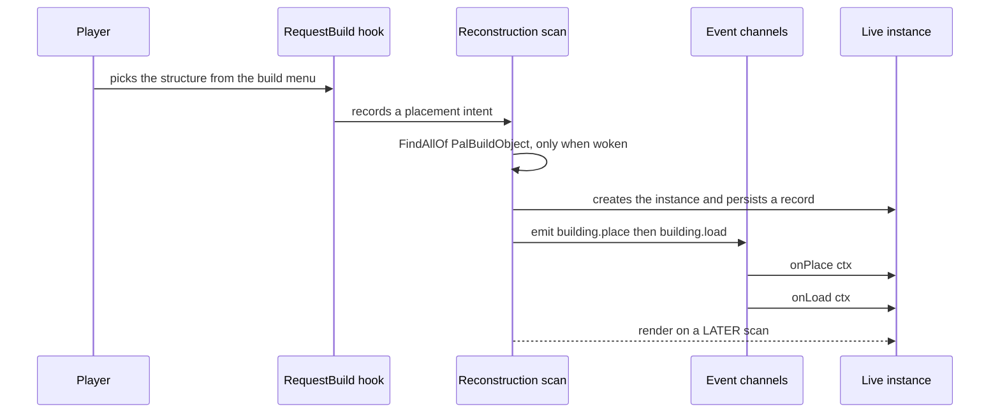
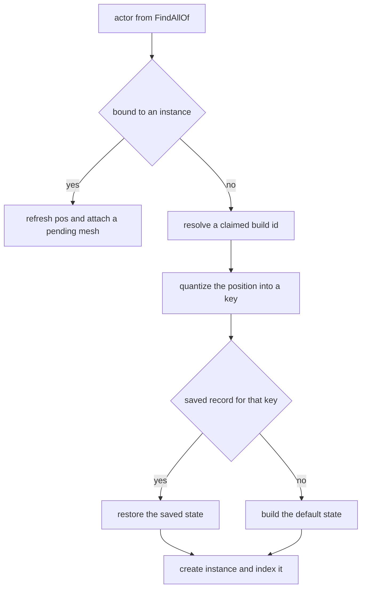
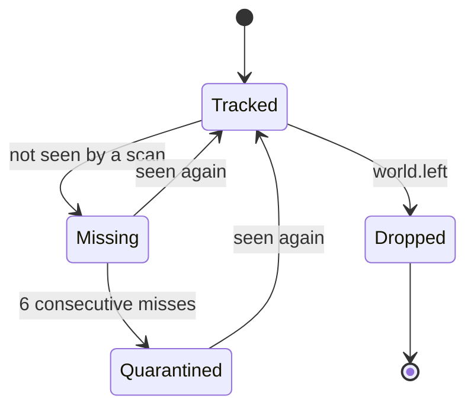

## このページでできるようになること

- 作業台やコンテナ、機械に自分の振る舞いを持たせる
- 設置したとき、使ったとき、壊れたときに自分のコードを走らせる
- 設置物ごとに数値を保存して、次に遊ぶときも残す
- 置いた設置物に自分の 3D モデルと色を付ける
- 遊んでいる間、設置物にタイマーで仕事をさせる

## building を定義する

building とは、ビルドメニューから選んでワールドに置くもの全部です。作業台、コンテナ、機械、
装飾などが当てはまります。ワールドに置かれると、PalForge はそれ 1 つずつに専用のオブジェクトを
用意します。自分の座標、自分の保存データ、そしてあなたが書いたハンドラを持ちます。

```lua
local api      = require("palforge.api")   -- also installs the bare globals
local Building = api.Building
```

`Building` でやることは 3 つです。

```lua
local bench = Building{ id = "example:Bench", name = "Modded Bench" }   -- define
local box   = Building.get("PalBoxV2")                                 -- look one up
local all   = Building.get_all()                                       -- every registered one
```

必須フィールドは `id` だけです。

```lua
Building{ id = "WorkBench" }
```

この 1 回の呼び出しで、その id が PalForge の監視対象に入ります。ワールドの設置物を探すスキャンは
定義をレジストリからのみ取るので、追跡されるのは定義呼び出しが**登録した** build id だけです。誰も
定義していない id に `Building.get(id)` を使ってもメソッドを呼べる handle は返りますが、何も登録
されないため、その `:instances()` は空のままです。

完全な定義は 1 つのテーブルとして読めます。

```lua title="content/buildings/bench.lua"
local bench = Building{
    id           = "example:Bench",
    name         = "Modded Bench",
    description  = "A bench that counts how often it is used.",
    gridCm       = 100,
    tickInterval = 4,
    mesh = {
        kind  = "static",
        model = "/Game/Pal/Model/Prop/Architecture/WorkBenchPrimitive/SM_WorkBenchPrimitive.SM_WorkBenchPrimitive",
    },
    color  = { r = 0.8, g = 0.3, b = 0.1, a = 1.0 },
    state  = function() return { uses = 0 } end,
    events = {
        onPlace      = function(self, ctx) self:save() end,
        onRightClick = function(self, ctx)
            self.state.uses = self.state.uses + 1
            self:save()
        end,
    },
    data = { tier = 2 },
}
```

mesh とは、置かれた設置物が身に着ける 3D モデルのことです。インラインで書いても、名前付きの
`Mesh{ ... }` 定義を再利用しても構いません。どちらも同じ検査を通ります。

<Tabs items={['Inline', 'Named']}>
<Tab value="Inline">

```lua
Building{
    id = "example:Bench",
    mesh = {
        kind  = "static",
        model = "/Game/Pal/Model/Prop/Architecture/WorkBenchPrimitive/SM_WorkBenchPrimitive.SM_WorkBenchPrimitive",
    },
}
```

`kind` を書かないインラインテーブルには、`Building.Spec.Mesh` の既定値である `"static"` が入ります。

</Tab>
<Tab value="Named">

```lua
local benchMesh = Mesh{
    id    = "example:bench_body",
    kind  = "static",   -- declare it: Mesh.Spec defaults kind to "skeletal"
    model = "/Game/Pal/Model/Prop/Architecture/WorkBenchPrimitive/SM_WorkBenchPrimitive.SM_WorkBenchPrimitive",
}

Building{ id = "example:Bench", mesh = benchMesh }
Building{ id = "example:Bench2", mesh = Mesh.get("example:bench_body") }
```

名前付き mesh は先に `Mesh.Spec` で検査され、その時点で `kind` に `"skeletal"` が入ります。
building 側の既定値はもう効かないので、名前付き mesh を building に入れるときは `kind` を自分で
書いてください。

</Tab>
</Tabs>

### id について

コロンを含まない id は、そのままゲームの `BuildObjectId` です。`"WorkBench"`、`"PalBoxV2"`、
`"ItemChest"` などが該当します。`"pack:name"` の形の id は、ゲームのデータテーブルの行名
`pack_name` になります。この解決後の名前が `:unlock()` の対象であり、置かれた設置物を照合する
ときに使われる値でもあります。

<Callout type="warn">
定義してもビルドメニューに新しい項目は増えません。Lua だけでゲームのデータテーブルに行を追加する
ことはできず、それは PalSchema の役目です。定義がするのは、すでに存在する id に振る舞い、保存
データ、モデル、メタデータを与えることです。
</Callout>

id の**形**は、定義した時点で検査されます。あとで設置物を探しに行った時点ではありません。
コロンが 1 つでもあれば名前空間付きの形を意図したとみなされるので、前後どちらの半分も英数字と
アンダースコアだけである必要があります。

```lua
Building{ id = "my-pack:Bench" }
-- PalForge: Building: field "id" is invalid: invalid pack id 'my-pack' in 'my-pack:Bench' (letters/digits/_ only)
```

ハイフンが入ると id は解決できなくなり、解決できない id には行き先がありません。DataTable の行名を
組み立てられないので、アイコン参照もテクノロジー解放も build id の照合もすべて外れる一方、定義は
レジストリの中で健全そうに座っています。それを目にできる場所は定義呼び出しだけなので、そこで
止めます。

`buildIds` には、同じ問いがもう一段あとのエンジン境界で、もう少し寛容にかかります。解決できない
エントリは**リテラル**として使われ、警告が id と resolve の理由を挙げます。実在する
`BuildObjectId` に当たらないリテラルはアクターに一致しないだけで、それは追いかけられる静かな
ミスです。逆に id を捨てていたら、登録に成功しあらゆる読み取りに答えながら死んでいる定義に
なります。

同じ id を 2 回定義すると、後のほうが前を置き換えます。`native.buildings` は何も登録しないので、
`WorkBench` を定義するパックがその唯一の定義になります。ただし別のパックが同じ id を定義すれば
あなたの定義が置き換えられ、レジストリが双方の所有者を挙げて衝突をログに出します。

### native カタログ

`native/buildings.lua` は `DT_BuildObjectDataTable_Common` の行 id 498 件をすべて素のデータとして
持ち、加えて mesh と表示名を足した手書きの定義を 2 つ持ちます。

```lua
local buildings = require("palforge.native.buildings")

buildings.WorkBench             -- curated handle for "WorkBench" (BP_BuildObject_WorkBench_C)
buildings.PalBox                -- curated handle for "PalBoxV2"
buildings.get("ItemChest")      -- a handle, built on first read and cached; nil for an unknown id
buildings.publish("WorkBench")  -- opt IN to tracking, and with it to persistence
buildings.CATALOG               -- the 498 ids, as data
```

このモジュールは何も登録せず、フィールドを読んでも何も登録されません。これはほかのどのドメイン
よりもここで重要です。building の登録は**無害ではない**からです。スキャンは登録済みの定義を拾い、
すでにワールドに立っている一致アクターはすべて追跡インスタンスになり、追跡インスタンスはセーブの
エンティティファイルに書き込まれます。そうでなければ、ツールチップで
`buildings.Stone_Foundation` を読んだだけで拠点中の石の土台すべてに記録が書かれ始め、`CATALOG` を
なめるピッカーは拠点全体を永続化してしまいます。

なので `get(id)` や名前付きフィールドから得たハンドルは、`:unlock()` と `:iconOf()` には本当に
答えます（どちらも id 起点のテーブル読み取りです）。一方 `:instances()` は空のままで、何も書かれ
ません。`buildings.publish(id)` を呼ぶか、自分で `Building{ id = <同じ id> }` を宣言するまでは。

## Spec のフィールド

`Building{ ... }` に渡せるものの一覧です。たいていの building は `id` だけで足り、動きを付けたく
なったら `state` と `events` を足します。

<TypeTable
  type={{
    id: { description: 'ゲームの BuildObjectId (PalBoxV2 など) または pack:name', type: 'string', required: true },
    name: { description: 'UI に表示される名前', type: 'string', default: 'id と同じ' },
    description: { description: 'UI とツール用の 1 行説明', type: 'string' },
    gridCm: { description: '設置グリッドの量子化幅 (cm)', type: 'number', default: 'core.spatial.GRID_CM の 100' },
    buildIds: { description: 'この定義が担当するゲーム build id の一覧。既定値を置き換えます', type: 'string[]', default: '{ id }' },
    tickInterval: { description: 'N 回のハートビートごとに onTick を実行', type: 'number', default: '1' },
    mesh: { description: '設置された actor に取り付ける mesh。インラインまたは Mesh handle', type: 'Building.Spec.Mesh' },
    material: { description: 'その mesh に適用するマテリアル上書き', type: 'Building.Spec.Material' },
    color: { description: '基本の色味 r, g, b, a を 0..1 で。material.color の短縮形', type: 'table' },
    texture: { description: 'mesh に適用する png の絶対パス。material.texture の短縮形', type: 'string' },
    icon: { description: 'DataTable 検索が外れたときのフォールバックアイコン', type: 'any' },
    state: { description: '新しい設置物が最初に持つ保存データ。テーブル、またはテーブルを返すファクトリ', type: 'table | fun(): table' },
    events: { description: 'ライフサイクルハンドラ (グループ)', type: 'Building.Spec.Events' },
    data: { description: '定義に載せて運ぶ自由形式のペイロード', type: 'table' },
  }}
/>

問題はすべてハードエラーになるので、呼び出しが中途半端に成功することはありません。フィールド名を
間違えると、期待していた名前を教えてくれます。

```lua
Building{ id = "example:Bench", grid = 100 }
```

```text
PalForge: Building: unknown field "grid" (did you mean "gridCm"?). Valid fields: id, name, description, gridCm, buildIds, tickInterval, mesh, material, color, texture, icon, state, events, data
```

```text
PalForge: Building: field "id" is required (build id: a game BuildObjectId ("PalBoxV2") or "pack:name")
PalForge: Building: field "mesh" (Building.Spec.Mesh): field "model" is required (UStaticMesh asset path, or an OBJ path for the procedural backend)
```

一覧を覚える代わりに、ゲームを動かしながら表示できます。

```lua
local schema = require("palforge.core.schema")

print(schema.help("Building.Spec"))
print(schema.help("Building.Spec.Events"))
schema.get("Building.Spec").fields   -- the same, as a table, for tooling
```

### 第 2 引数

`Building(spec, opts)` は省略可能な第 2 テーブルを取ります。制御するのは登録だけで、それ以外は
何も変わりません。作られる定義はどちらでも同じものです。

```lua
Building(spec)                          -- define and register
Building(spec, { register = false })    -- build the handle, register nothing
Building(spec, { pack = "mypack" })     -- register with that pack recorded as the owner
```

`register = false` は、上で述べた理由により、このドメインでは読み取りと書き込みの分かれ目です。
登録された定義は追跡され、追跡された設置物は永続化されます。ハンドルはそのまま使え、`core/event`
はその定義を一切見ず、セーブには何も入りません。

`pack` は衝突に「誰が」を与えます。所有者は登録に記録され、2 つのパックが 1 つの id を主張したと
きの警告に名前が出て、永続化されるレコードすべてに書き込まれます。
`PalForge.pack("mypack").Building` が代わりに入れてくれます。

### state — テーブルかファクトリか

`state` は **新しい** 設置物が最初に持つデータです。PalForge が代わりにディスクへ書き、次に遊ぶ
ときに返してくれます。読まれるのは 1 度だけで、保存レコードのない設置物をスキャンが初めて作る
ときです。

```lua
state = { uses = 0 }                       -- a table
state = function() return { uses = 0 } end -- a factory, called per new instance
```

ファクトリには定義クラスが引数として渡されるため、`state = function(cls) ... end` とも書けます。
例外を投げた場合やテーブル以外を返した場合、その設置物は空のテーブルで始まります。

<Callout type="warn">
ファクトリを推奨します。素のテーブルは定義側に置かれ、新しい設置物へ参照のまま渡されます。同じ
定義から 2 つ置くと 1 つの state テーブルを共有し、両方の保存レコードがそれを指してしまいます。
ファクトリなら設置物ごとに新しいテーブルが作られます。
</Callout>

state は JSON として保存されるので、文字列、数値、true/false、そしてそれらのネストしたテーブルに
とどめてください。復元された設置物には保存されたレコードがそのまま入り、既定の state が
マージされることはありません。あとのバージョンで増やしたフィールドにはガードが必要です。

```lua
onLoad = function(self, ctx)
    self.state.uses  = self.state.uses  or 0
    self.state.tier  = self.state.tier  or 1   -- added in a later version of the pack
end,
```

### gridCm — 設置物を再び見つける仕組み

置かれた設置物は自分専用の安定した id を持ちません。そこで PalForge は、ワールド座標をグリッドの
セルに丸めて 1 つ 1 つを識別します。`core/spatial` が各軸を `math.floor(v / gridCm + 0.5)` で丸め、
結果を `buildId@qx,qy,qz` の形で書きます。

```text
WorkBench@1234,-56,78
```

`gridCm` の既定値は `core.spatial.GRID_CM` の `100`、つまり 1 メートルです。このキーが保存レコード
の名前になるので、次のセッションで見つけ直した設置物に保存データを結び直すのもこのキーです。セルを
小さくすると近くに並ぶ設置物を区別しやすくなり、大きくするとセッション間の座標のずれに強く
なります。同じセルに落ちた 2 つの設置物はキーが衝突し、スキャンは最初の有効な actor に紐づいた
ほうを保持して 2 つ目を無視します。

遊んでいる間、設置物はこのキーではなく actor、つまりゲームがワールドに置いたオブジェクトで
追跡されます。置かれた設置物の報告座標はスキャンのたびに 1 セル以上ぶれるため、actor で追う
ことで 1 つの設置物が次々に別物として増えるのを防いでいます。

### buildIds — 複数のゲーム id を担当する

`buildIds` はこの定義が担当するゲーム build id の一覧です。既定値の `{ id }` を **置き換える** ため、
id 自身も照合したい場合は一覧に含めてください。

```lua
Building{
    id       = "example:Chests",
    name     = "Instrumented Chests",
    buildIds = { "ItemChest", "ItemChest_02", "ItemChest_03" },
    events   = {
        onRightClick = function(self, ctx)
            log.info("opened " .. self.buildId)   -- the id this instance matched
        end,
    },
}
```

各エントリは `object_manager.resolve` を通り (`"pack:name"` は `pack_name` になります)、この定義に
索引されます。置かれた設置物は一致した id を `self.buildId` に記録し、`self.id` は定義 id のまま
です。

照合は 3 通りを順に試します。actor のクラス名 `BP_BuildObject_<Id>_C`、次に
`MapObjectModel.BuildObjectId`、最後に保存レコードとの座標一致です。1 番目で当たるのは
ブループリント側の綴りと一致する id だけで、データテーブルの行が `Workbench` である一方で
用意済み定義が `"WorkBench"` を使っているのはそのためです。

### mesh と material

`Building.Spec.Mesh` は [Mesh](/docs/api/mesh) で説明している形と同じで、違いは 1 つだけ、`kind` の
既定値が `"skeletal"` ではなく `"static"` になっている点です。`material`、`color`、`texture` は
mesh の宣言に重ねられます。`Class:material()` は宣言された `material` テーブルを返すか、短縮形を
使った場合は `color` と `texture` から組み立て、`Class:render()` がフィールド単位で material 側を
優先します。

`kind` の 3 つのバックエンドのうち、置かれた設置物に実際に取り付けられるのは 2 つです。ここでの
既定値である `static` は `UStaticMeshComponent` を追加し、`model` を `LoadAsset` で探して (失敗時は
`StaticFindObject`)、アセットを設定し、そのうえでコンポーネントから読み戻して確認できたときだけ
成功を返します。setter が存在しないゲームビルドでは正直に `false` が返り、中途半端なコンポーネント
も残りません。`procedural` (`obj` とも書けます) は `model` のパスからディスク上の Wavefront OBJ
ファイルを読み、ProceduralMeshComponent を追加します。どちらもコリジョンは無効にします。装飾用の
コライダはゲームが設置に使うレイキャストを遮ってしまうためです。またどちらもワールドスケールを
明示的に設定します。`AddComponentByClass` に渡す空のトランスフォームはスケールが 0 から始まる
ためです。

```lua
-- a UE-authored asset, the Building.Spec.Mesh default kind
mesh = {
    kind  = "static",
    model = "/Game/Pal/Model/Other/PalBox/SM_PalBox.SM_PalBox",
    scale = 1.0,
    offset = { x = 0, y = 0, z = 50 },
},

-- an OBJ file, parsed from disk when the mesh attaches
mesh = {
    kind  = "procedural",
    model = "C:/mods/example/models/bench.obj",
    scale = 1.0,
    offset = { x = 0, y = 0, z = 50 },
},
```

<Callout type="info">
この絶対 OBJ パスが正しいのは 1 台のマシンの上だけです。`Mesh.Spec` は相対的な `model` や
`texture` を呼び出し元パック自身のディレクトリに対して解決しますが、その解決は
`Mesh.Spec:validate` にあり、`Building.Spec.Mesh` は独自の validate を持つ派生 spec です。
つまり**インラインの building mesh に書いた相対パスは相対のまま**で、書いたとおりの文字列で
`io.open` に失敗します。OBJ は名前付きの `Mesh{ ... }` として宣言し、そのハンドルを入れ子に
してください。解決済みのパスを運ぶのはそちらの経路です。
</Callout>

用意済みの `WorkBench` と `PalBoxV2` は `static` の mesh を宣言しています。ただし置かれた actor に
届くのは、`buildings.publish(id)` か自分の定義かで登録されてからで、そのあと actor を最初に見つけた
次のスキャンで取り付けられます。

<Callout type="warn">
`skeletal` はポーン自身の `Mesh` コンポーネント（`ACharacter::Mesh`）上でアセットを差し替えます。
build object はそれを持たないため、`kind = "skeletal"` を宣言した設置物には何も取り付けられず、
「この actor はおそらく `APalCharacter` ではない」というログが出て `render()` は `false` を返します。
このバックエンド自体もゲーム内では未確認です。実機のシグネチャ検査を通し、設定後にアセットを読み
返して比較するので、走ったのに無視された setter は成功のふりではなく `false` になります。ただし、
何かが実際に見た目を変えるところを見届けた人はまだいません。
</Callout>

## ライブインスタンス

定義しただけでは何も動きません。実際の設置物がワールドに立って初めて動き出します。設置したときに
起きることは次のとおりです。



モデルが出るのは、設置物が現れたその瞬間ではなく 1 スキャンあとです。まだ初期化中の actor、つまり
置かれたそのフレームにコンポーネントを追加すると、無効なゲームオブジェクトに触れてゲームが落ちる
ことがあるためです。そこで設置物は保留マークを付けられ、同じ actor をもう一度見つけた次の
スキャンでモデルが付きます。

スキャンが対象を判別する流れは次のとおりです。



`building.place` が emit されるのは、新しい設置物が同じ build id の設置要求に 300 cm 以内で一致した
ときだけです。スキャンが新しく追跡した設置物は、直前に `building.place` を emit したものも含めて
すべて `building.load` を emit し、保存レコード由来かどうかは `ctx.reconstructed` が示します。
設置物が作られるのはキーごとに 1 度だけなので、`onPlace` は 1 回の設置につきちょうど 1 回発火します。

### インスタンスのフィールド

<TypeTable
  type={{
    id: { description: 'クラス経由で解決される定義 id', type: 'string' },
    buildId: { description: 'このインスタンスが一致したゲーム build id', type: 'string' },
    key: { description: 'レジストリと永続化のキー buildId@qx,qy,qz', type: 'string' },
    actor: { description: '設置された APalBuildObject', type: 'any' },
    pos: { description: 'ワールド座標 x, y, z を cm で。スキャンごとに更新', type: 'table' },
    cell: { description: 'キーの元になった量子化セル qx, qy, qz', type: 'table' },
    state: { description: '保存されるテーブル。その場で書き換えて save', type: 'table' },
    def: { description: '内部の def。解決済み buildIds, gridCm, tickInterval, hooks', type: 'table' },
  }}
/>

定義で宣言した内容はクラス経由で参照できるため、`self.name`、`self.data`、`self.gridCm` なども
置かれた設置物の上で解決されます。

### インスタンスのメソッド

```lua
self:save()             -- stage state and write the json file now
self:setDirty()         -- stage only; written by the next save or on world.left
self:isValid()          -- is self.actor still a valid engine object
self:render()           -- attach mesh + material once; false without a valid actor or a model
self:update()           -- re-tint the live material from self:currentColor()
self:neighbors(cm)      -- every OTHER tracked structure within cm of this one
self:mesh()             -- the declared mesh table
self:material()         -- the declared material, or one built from color / texture
self:currentColor()     -- the tint update() will write; override for a state-driven look
self:iconOf()           -- DT_BuildObjectIconDataTable lookup, falling back to the declared icon
```

`currentColor()` は `self.color` を返し、既定では定義側の色味になります。見た目を state に
追随させたいときは、設置物側にフィールドを立ててから反映するか、色が state の関数になるなら
定義クラス側でこのメソッドを上書きします。

```lua
onTick = function(self, ctx)
    self.color = self.state.running
        and { r = 0.2, g = 0.9, b = 0.3, a = 1.0 }
        or  { r = 0.4, g = 0.4, b = 0.4, a = 1.0 }
    self:update()
end,
```

<Callout type="info">
`update()` は `core/mesh` を経由します。`core/mesh` は各 actor をどのバックエンドが着せたかを —
UE4SS のハンドルは参照のたびに作り直されるため、actor の `GetFullName()` をキーにして — 覚えて
いて、塗り直しも同じバックエンドへ送ります。`static`、`procedural`、`skeletal` のいずれも応答
します。色なしで取り付けられた mesh に対しては、共有のマテリアル層がその場で動的マテリアル
インスタンスを作るためです。`true` は実在のマテリアルインスタンスに書き込みが**実行された**という
意味です。見た目が変わった証拠ではありません。Palworld のマテリアルが持っていないパラメーター名
への書き込みは黙って何もしないうえ、ゲーム内で色が乗るところを見届けた記録はまだありません。
`false` は書き込む先が無かったという意味です（この actor に PalForge の mesh が無い、または色が
無い）。
</Callout>

### neighbors

`self:neighbors(radiusCm)` は、その半径内にいる**他の**追跡中の設置物を — 自分の定義のものだけで
なく、どの定義のものでも — ライブインスタンスとして返します。実体は `core/spatial` のハッシュ
グリッドで、この呼び出しは先に追跡中インスタンスをバケットに入れ直すので、移動した設置物も
見つかります。

```lua
onTick = function(self, ctx)
    for _, n in ipairs(self:neighbors(350)) do    -- everything within 3.5 m
        log.info(self.key .. " is next to " .. n.key)
    end
end,
```

インスタンスではなく定義の上で呼んだ場合（`self.pos` が無いため）と、半径が正の数でない場合は空の
リストを返します。索引に入っているのは PalForge が追跡している設置物だけなので、未登録の
バニラ id だらけの拠点では空が返ります。

### state を保存する

レコードは **mod** ごとに 1 つの JSON ファイルへ、セーブごとに 1 つのディレクトリの中に
書き出されます。

```text
<UE4SS Mods>/PalForge/state/w_1DF0E44B4FDDD6196E30819A899C9009/mypack.json
```

ディレクトリ名は `core/spatial` が決めます。生きている `PalGameInstance` から選択中のセーブを読み、
まず `GetSelectedWorldSaveDirectoryName` を、次に `GetSelectedWorldName` を試します。それぞれ
バッキングプロパティ（`SelectedWorldSaveDirectoryName`、`SelectedWorldName`）が第 2 の手段です。
得られた名前の英数字とアンダースコア以外を `_` に置き換え、先頭に `w_` を付けたものがその名前で、
何も読めなければ単に `world` になります。ファイル名は `PalForge.pack` に渡したパック id なので、
あなたの設置物が他の mod も書くファイルに入ることはありません。

<Callout type="info">
`WorldGuid`、`WorldSaveName`、`SaveName` はこのクラスにありません。`PalGameInstance` の
111 プロパティの完全な一覧にどれも載っていないので、この 3 つの名前に基づくプローブは `world`
フォールバックにしか行き着けませんでした。初期のセッションが残した唯一の成果物が
`entities_world.json` という名前なのはそのためです。表示名よりディレクトリ名を優先するのは、
2 つのセーブがセーブフォルダを共有することはできない一方、プレイヤーが入力したラベルは重複し得る
からです。
</Callout>

ファイルには設置物のキーごとのレコードと、隔離用のセクションが入ります。

```json
{
  "palforge": { "format": 3, "mod": "mypack", "save": "w_1DF0E44B4FDDD6196E30819A899C9009",
                "forge": "0.3.0", "wrote": 1785646408, "buildings": 1 },
  "buildings": {
    "WorkBench@1234,-56,78": {
      "buildId": "WorkBench",
      "def": "mypack:Bench",
      "pos": [123400, -5600, 7800],
      "state": { "uses": 3 }
    }
  },
  "orphans": {}
}
```

キーは解決済みの **build** id とセルなので、所有者をまったく名乗りません。所有者はファイル名であり、
レコードの形はヘッダの `format` なので、どちらもレコードごとに繰り返されません。`def` はそれを
主張した定義 id で、1 つの狭いリネームケースが自力で移行できるのはこれのおかげです。位置は整数
センチメートルです。配置、その上にパックが得るストア、そして mod をアンインストールしたときに
これらがどうなるかは [保存される状態](/docs/concepts/saved-state) にあります。

レコードの `state` は `inst.state` と同じテーブルなので、その場で書き換えるだけで書き出される内容が
変わります。ただし自動では何も書きません。

- `self:setDirty()` はこの設置物が属する mod に dirty を立てるだけです。軽い操作です。
- `self:save()` は dirty を立てたうえで、その mod のファイルをすぐに書き、`true` か、`false` と
  理由を返します。
- ワールドを離れるときに dirty なものをすべて書き、そのあとライブな設置物を破棄してレコードは
  残します。

大事な変更では `save()`、毎 tick のような高頻度の場所では `setDirty()` を使ってください。tick ごとの
`save()` はハートビートのたびにファイルを書きます。書き込みが及ぶのは変更があった mod だけで、
あなたの側の変更で他の mod のファイルが書き直されることはありません。

**「いない」ことを理由に削除されるレコードはありません。** **列挙を行ったスキャン**が 6 回連続で
見つけられなかった設置物は `reason = "missing"` で
`building.remove` を emit しますが、レコードは破棄されず **隔離** されます。`why = "missing"` として
`orphans` へ移り、そのアクターを再び見つけた次のスキャンが `state` ごと取り出します。このスキャンは
メモリ上のオブジェクトしか列挙せず、出荷バイナリ自身の宣言は Palworld がマップオブジェクトを距離に
応じて生成・破棄していると言っているので、「今回のスキャンにいない」を「もういない」と読むことは
できません。

そのセッションで**どの定義も主張しなかった** build id のレコードも同じように、`why = "unclaimed"`
として隔離されます。中身をそのまま `orphans` へ移し、件数と所属していたパックをログに出し、その
build id をどれかの定義が再び主張した瞬間に戻します。このパスはワールドが開いてからおよそ 30 秒
待ってから走るので、`world.ready` や遅延で building を定義するパックにも間に合います。ランタイムで
レコードを本当に破棄するのは隔離上限の 4096 件だけで、しかも **mod のファイルごと** です。それを
超えるとその mod の古いものから順に落とし、何件をどの mod でなぜ落としたかをログに書きます。



`Quarantined` も `Dropped` も保存レコードを残すので、設置物か定義が戻ってきたときにデータごと
戻ってきます。この図の中にレコードを削除する遷移はありません。

### インスタンスへ到達する

```lua
local event = require("palforge.core.event")

Building.get("example:Kiln"):instances()   -- every live instance of one definition
event.instances()                          -- every live instance, any definition
event.instances("example:Kiln")            -- filtered by definition id or matched build id
event.instanceOfActor(ctx.actor)           -- the instance bound to an actor, or nil
event.isWorldReady()                       -- has the world finished loading
```

`:instances()` はスキャンが走るまで空で、スキャンにはロード済みのワールドが必要です。監視が
1 秒ごとに有効な `PalPlayerCharacter` を探し、5 回連続で成功して初めてゲートが開きます。

これらはホットリロードを越えて生き残ります。building ランタイムは定義の索引、ライブインスタンス、
actor 索引を `_G` 上の 1 つのテーブルに置き、ストアは統合済みのレコードビューを別のテーブルに置いて
います。そして `core/reload` はワイプの際に `object_manager` を残します。そのため F9 を押しても `:instances()` は答え続け、すでに持っていた
定義に対して building のフックも発火し続けます。この 2 つは必ずセットです。レジストリを落とす
リロードは、隔離パスから見れば全パックが一斉にアンロードされたのと同じに見えてしまいます。
押してからおよそ 30 秒後に、です。

## ライフサイクルイベント

ハンドラは `events` の下に書きます。第 1 引数はイベントが起きた設置物そのものなので、
`self.state`、`self.pos`、`self.actor` がそのまま使えます。例外は `onBuild` の 1 つだけで、これは
まだワールドに何も立っていない時点で発火します。

```lua
events = {
    onRightClick = function(self, ctx)   -- self is a Building.Instance
        log.info(self.key .. " at " .. tostring(self.pos.x))
    end,
}
```

| イベント | チャンネル | 発火 | ctx |
| --- | --- | --- | --- |
| `onPlace` | `building.place` | LIVE | `key`, `actor`, `pos`, `buildId`, `player`, `firstSeen` |
| `onLoad` | `building.load` | LIVE | `key`, `actor`, `pos`, `buildId`, `reconstructed` |
| `onRightClick` | `building.interact` | LIVE | `actor`, `player`, `buildId` |
| `onRemove` | `building.remove` | LIVE | `key`, `buildId`, `actor`, `reason` |
| `onTick` | `tick` | LIVE | `count`, `now` |
| `onBuild` | `building.build` | LIVE (ワールドのロード後) | `buildId`, `model` |
| `onWorldReady` | `world.ready` | LIVE | 空テーブル |
| `onWorldLeft` | `world.left` | LIVE | 空テーブル |
| `onLeftClick` | — | 発火しません | — |
| `onBreak` | — | 発火しません | — |

<Callout type="warn">
`onLeftClick` と `onBreak` は書けますが、emit するものがないため実行されません。これは「まだ
見つかっていない」ではなく否定として決着済みです。下の **存在しないもの** を参照してください。
インタラクトには `onRightClick`、設置物が消えたときには `onRemove` を使ってください。
</Callout>

### 存在しないもの、そしてそれをどう確かめたか

欠けている 2 つのフックは、それを持ち得るすべてのクラスの完全な関数一覧を読むことで探されました。
つまりこれは未着手の穴ではなく計測結果です。

**`PalBuildObject` にクリック・ヒット・打撃のエントリは存在しません。** リフレクトされた 22 個の
関数はすべてディスク上にあります。入力らしきエントリはインタラクト系
（`OnBeginInteractBuilding`、`OnTriggerInteractBuilding`、`OnStartTriggerInteractBuilding`、
`OnEndTriggerInteractBuilding`）だけで、これは右クリックであり、すでに `onRightClick` です。
ダメージらしき唯一のエントリ `OnDamage` が最有力候補でしたが、打撃ではありません。記録された
セッションで、**構造物あたり 12〜13 秒の厳密な周期で 196 回**発火しており、その間プレイヤーは
どこにもいません。t=306.412 に置かれたワークベンチは t=306.933 に最初の 1 回を受け、その後
2250 秒で 180 回受けても壊れませんでした。これは劣化タイマーであり、`onLeftClick` をこれに繋いだら、
拠点中のすべての設置物で 12 秒ごとに永遠にハンドラが呼ばれることになります。

**破壊はデリゲート「フィールド」としてしか存在しません。** `PalBuildObject`（22 関数）、
`PalMapObjectModel`（18）、`PalMapObjectConcreteModelBase`（25）、`PalNetworkPlayerComponent`（77）
のいずれにも Destroy / Dismantle / Demolish / Deconstruct / Break の関数はありません。あるのは
`PalMapObjectModel:OnDestroyDelegate` と `:OnDisposeDelegateInServer` で、`RegisterHook` は
デリゲートフィールドをパスで指定できません。`PalBuildObject.OnChangeVisualForDismantle` は解体の
*プレビュー*表示であって完了ではありません。

したがって設置物の消失が表に出る経路は 1 つだけ、スキャンの取りこぼし掃除による
`ctx.reason = "missing"` の `onRemove` です。これは解体とストリーミングアウトを区別できず、しかも
6 スキャン遅れて届きます。2 つのフックが宣言可能なまま残っているのは、パック自身の `emit` が動く
ようにするためと、将来ソースが見つかったときの着地点を用意しておくためです。今日それらを emit する
ものはありません。ダンプが届いていない唯一の場所は `BP_BuildObject_<Id>_C` サブクラスのグラフ
イベントで、ダンプは `/Script/Pal.*` しか対象にしていません。

### onPlace

新しい actor を見つけたスキャンが、`RequestBuild_ToServer` フックの記録した設置要求と一致させた
ときに 1 度だけ発火します。`ctx.player` は設置要求を記録した時点でフックが見つけた
`PalPlayerCharacter`、`ctx.firstSeen` は常に `true`、`ctx.pos` は要求座標ではなく actor の実座標です。

```lua
onPlace = function(self, ctx)
    self.state.owner = tostring(ctx.player)
    self:save()
end,
```

### onLoad

スキャンが追跡を始めたすべての設置物で発火します。直前に `onPlace` を発火させたものも含みます。
`ctx.reconstructed` は、state が保存レコード由来なら `true`、新しい設置物なら `false` です。
設置物ごとの初期化はここに書きます。

```lua
onLoad = function(self, ctx)
    if ctx.reconstructed then
        log.info(self.key .. " restored with " .. tostring(self.state.uses) .. " use(s)")
    end
    self:render()   -- normally unnecessary; the scan renders on its next pass
end,
```

### onRightClick

`PalBuildObject:OnBeginInteractBuilding` が駆動します。操作した側として数えるのは `PalCharacter` の
サブクラスだけなので building 同士のインタラクトは届かず、同じ actor への連続操作は 1 秒のあいだ
無視されます。設置物は `ctx.actor` から特定されます。

```lua
onRightClick = function(self, ctx)
    Item.get("Wood"):give(1)
    log.info(tostring(ctx.player) .. " used " .. self.buildId)
end,
```

### onRemove

`ctx.reason` は `"missing"` で、いまランタイムが出す唯一の理由です。ハンドラの実行中はまだ設置物が
追跡されているので `self.state` や `self.pos` を読めます。レコードはその直後に削除されます。

```lua
onRemove = function(self, ctx)
    log.info(string.format("%s gone after %d use(s)", self.key, self.state.uses or 0))
end,
```

### onTick

ハートビートは `LoopAsync(500)` で、`tick` チャンネルに流れます。`ctx.count` はハートビートの
通し番号です。tick の対象になるのは `onTick` を実際に書いている定義の設置物だけなので、書かなければ
コストはかかりません。

`tickInterval` はそのカウントの除数です。`ctx.count % tickInterval == 0` のときにハンドラが走ります。

```lua
Building{
    id           = "example:Kiln",
    tickInterval = 20,   -- 20 heartbeats -> about 10 seconds
    events = {
        onTick = function(self, ctx)
            if not self:isValid() then return end
            log.info("tick " .. tostring(ctx.count))
        end,
    },
}
```

整数でない `tickInterval` や 1 未満の値は `1` に戻されます。

<Callout type="warn">
`onTick` にはサーキットブレーカがあります。失敗はすべてログに残り、回数が数えられます。5 回失敗
するとその設置物は壊れた扱いになり、以後 tick しなくなります。撤去されて見つけ直されない限り、
そのセッションの残りはずっと止まったままです。1 回成功すればカウンタはリセットされます。
`self.actor` に触れる前に `self:isValid()` を確認するなど、ハンドラは防御的に書いてください。
</Callout>

### onBuild

この定義が担当する build id の設置物を、ゲームが建て終えたときに発火します。実際の設置物ができる
最大 1 スキャン前に届き、ゲームが渡してくるのは actor ではなく `UPalMapObjectModel` です。そのため
ここでの `self` は置かれた設置物ではなく **定義** です。`self.id`、`self.name`、`self.data`、
`self:iconOf()` は使えますが、`self.actor`、`self.pos`、`self.state`、`self:save()` はありません。

```lua
Building{
    id = "example:Bench",
    events = {
        onBuild = function(self, ctx)
            log.info(self.id .. " completed as " .. tostring(ctx.buildId))
        end,
    },
}
```

<Callout type="warn">
`onBuild` が待ち受けを始めるのは、ワールドのロードが終わったあとです。ネイティブフックの
`PalPlayerRecordData:OnCompleteBuild_ServerInternal` はワールドロード中に既存の設置物すべてに対しても
発火し、そこで作りかけの `UPalMapObjectModel` を読むと Lua では捕捉できない形で落ちるためです。
ここから 2 つのことが言えます。ワールドのロードが最後まで終わらないセッションでは `onBuild` は
一度も走りません。そして同じセッション中の 2 回目のワールドロードではすでに待ち受けているので、
その集中処理のなかでも呼ばれます。設置の検知には `onPlace` が安全です。`onBuild` はまず捨ててよい
ワールドで試してください。
</Callout>

### onWorldReady と onWorldLeft

どちらもすべてのライブな設置物へ届き、どちらも設置物ごとではなくワールドロード単位の出来事です。

`world.ready` が届くのは、ワールドが開いた瞬間ではなく、actor をライブな設置物に変えるスキャンから
です。そのためハンドラが走る時点でプレイヤー周辺の設置物はすでに追跡済みで、同じパスのなかで
`onLoad` も済んでいます。待ち時間はワールドが開いてから最大でもスキャン 1 回分、500 ms です。

```lua title="content/buildings/sessions.lua"
Building{
    id     = "WorkBench",
    name   = "Workbench",
    state  = function() return { uses = 0, sessions = 0 } end,
    events = {
        onLoad = function(self, ctx)
            self.state.uses = self.state.uses or 0        -- per-instance startup
        end,
        onWorldReady = function(self, ctx)
            self.state.sessions = (self.state.sessions or 0) + 1
            self:save()
            log.info(string.format("%s present at load %d, %d use(s)",
                self.key, self.state.sessions, self.state.uses))
        end,
    },
}
```

<Callout type="warn">
`onWorldReady` はワールドロードにつき 1 度だけ、最初のスキャンが見つけた設置物に対して発火します。
あとのスキャンで流れ込んできた設置物には届かず、セッション中に置いたものにも届きません。設置物
ごとの初期化は、スキャンが追跡したすべての設置物で発火する `onLoad` の担当です。最初のスキャンが
終わる前にワールドを離れると通知は取り消されるので、通り過ぎただけのワールドが ready を知らせる
ことはありません。
</Callout>

`onWorldLeft` は設置物がまだ生きている、破棄される前の時点で走ります。state に触れる最後の機会
ですが、直後にワールドキャッシュは自動で書き出されます。

### チャンネルを直接購読する

PalForge はこれらのチャンネルを購読してあなたのハンドラを呼んでいます。同じように自分で購読も
できます。複数の building をまたぐ処理に向いています。

```lua
local event = require("palforge.core.event")

event.on("building.place", function(ctx)
    log.info("placed " .. tostring(ctx.buildId) .. " -> " .. tostring(ctx.key))
end)

event.observable("building.interact")
    :filter(function(ctx) return ctx.buildId == "PalBoxV2" end)
    :subscribe(function(ctx) log.info("pal box opened") end)

local sub = event.every(5000, function() log.info("five seconds") end)
sub:unsubscribe()
```

`event.every(ms, fn)` はスキャンと同じく 500 ms のハートビートに丸められます。

## Handle のアクションとクエリ

`Building{ ... }`、`Building.get`、`Building.get_all` はいずれも `Building.Handle` を返します。これは
定義を表すもので、宣言した内容を読んだり、その定義から置かれた設置物へ到達したりするのに使います。

```lua
local box = Building.get("PalBoxV2")

box:name()          --> "Pal Box" for the curated definition, else the id
box:description()   --> the declared description, or nil
box:gridCm()        --> the declared quantum, or nil when the runtime default applies
box:mesh()          --> the declared mesh table, or nil
box:iconOf()        --> a texture ref from DT_BuildObjectIconDataTable, else the declared icon
```

### unlock

```lua
Building.get("example:Bench"):unlock()
```

解決後の id (`example_Bench`) の名前を持つテクノロジ行を
`PalCheatManager:UnlockOneTechnology(FName)` 経由で解放します。PalSchema が注入した building の
テクノロジをビルドメニューに出すのがこの呼び出しです。

<Callout type="warn">
**これが動いているところは一度も観測されておらず、構造上検証できません。** `true` はテクノロジが
解放されたという意味ではありません。読み取れる 2 つのことを意味します。チート呼び出しが例外を出さ
ずに走ったこと、そしてその解決後の名前を持つテクノロジ行が生きている
`DT_TechnologyRecipeUnlock` に実在すること。後者は、解放するものが無い building でチートが
「成功」してしまうのを止めるチェックであり、`Building.get("PalBoxV2"):unlock()` が `false` になる
理由でもあります（バニラの 501 個の build id のうち、その行を持つのは 115 個だけです）。

読み取れないのは結果です。`UnlockOneTechnology` は何も返さず、「このテクノロジは解放済みか」を
問える accessor はこのビルドのどこにも存在しません。チートマネージャの表面にも、ヘッダーダンプ
にも、アイテムのブリッジにもです。しかもこれは、呼び出しを受け付けて黙って何もしないと計測された
のと同じチートマネージャ経路に乗っており、この呼び出しはまさにその失敗と自分を区別できません。

決着させる唯一の方法は、セーブの中で押してビルドメニューを見ることです。それが宣言済みフック
`pf_hook building-unlock` で、ワールドとプレイヤーが必要で、プレイヤーのテクノロジ状態を変える
ため書き込み扱いです。
</Callout>

`false` はほかに、テクノロジテーブルをそもそも読めなかったときと、呼ぶべきチートマネージャが
無かったときにも返り、それぞれ別のログ行が出ます。この経路はすでに存在するチートマネージャを
使うだけで、自分では作りません。

### instances と render と update

```lua
local kiln = Building.get("example:Kiln")

#kiln:instances()   --> how many are placed in this world
kiln:render()       --> attach the mesh to every live instance; returns how many attached
kiln:update()       --> re-tint every live instance; returns how many were re-tinted
```

どちらの件数も、呼び出しが例外なく終わったかどうかではなく、設置物ごとのメソッドの戻り値そのもの
です。バックエンドが処理を見送った設置物は数えられません。mesh に `model` がない、アセットが
解決できない、build object を着せられない `kind` である、塗る色がない、書き込む先のマテリアル
インスタンスがない、といった場合です。したがって `:instances()` が空でないのに `render()` が `0` を
返したときは、例外が出なかったのではなく何も取り付けられなかったという意味です。

`render()` は通常は不要です。スキャンが actor を最初に見つけた次のパスで mesh を取り付けます。
ゲームを動かしながら `mesh()` の返す内容を変えたときに使ってください。

### イベントのフォワーダ

handle は `:onPlace(ctx)`、`:onLoad(ctx)`、`:onRightClick(ctx)`、`:onLeftClick(ctx)`、
`:onBuild(ctx)`、`:onBreak(ctx)`、`:onRemove(ctx)`、`:onTick(ctx)` も持っていて、ハンドラを自分で
実行できます。

<Callout type="warn">
フォワーダは置かれた設置物ではなく定義 **クラス** を `self` としてハンドラを呼びます。そこには
`self.state`、`self.actor`、`self.key`、`self:save()` はありません。これが本物のイベントと一致する
のは `onBuild` だけなので、フォワーダはハンドラ単体の動作確認に使い、それ以外では実際のイベントか
`:instances()` から取った設置物を使ってください。
</Callout>

## レシピ

### セッションをまたいで保持されるカウンタ

作業台を置いて何度か使い、ゲームを終了して戻ってきても、カウントは残ります。

```lua title="content/buildings/counter.lua"
local api = require("palforge.api")
local log = require("palforge.utils.log").scope("counter")

local Building = api.Building

return Building{
    id     = "WorkBench",
    name   = "Workbench",
    gridCm = 100,
    state  = function() return { uses = 0 } end,
    events = {
        onLoad = function(self, ctx)
            self.state.uses = self.state.uses or 0   -- records saved before the field existed
            log.info(string.format("%s reconstructed=%s uses=%d",
                self.key, tostring(ctx.reconstructed), self.state.uses))
        end,
        onRightClick = function(self, ctx)
            self.state.uses = self.state.uses + 1
            self:save()
            log.info(self.key .. " used " .. self.state.uses .. " time(s)")
        end,
        onRemove = function(self, ctx)
            log.info(string.format("%s removed after %d use(s), reason %s",
                self.key, self.state.uses or 0, tostring(ctx.reason)))
        end,
    },
}
```

カウントが残るのは `onRightClick` が `save()` を呼んでいるからです。呼ばなければ変更はメモリ上には
反映され、次に何かがワールドファイルを書き出したときに保存されますが、それは頼れる保証ではありません。

### タイマーでアイテムを消費する機械

右クリックで運転を切り替えます。運転中は 10 秒ごとに Wood を 1 つ消費し、Wood 3 つごとに
Charcoal を 1 つ産出します。

```lua title="content/buildings/kiln.lua"
local api = require("palforge.api")
local log = require("palforge.utils.log").scope("kiln")

local Building, Item = api.Building, api.Item

local WOOD_PER_CHARCOAL = 3

return Building{
    id           = "example:Kiln",
    name         = "Slow Kiln",
    description  = "Burns wood into charcoal on its own.",
    gridCm       = 100,
    tickInterval = 20,                 -- 20 heartbeats -> about 10 seconds
    state        = function() return { wood = 0, charcoal = 0, running = true } end,
    events = {
        onPlace = function(self, ctx)
            log.info("kiln built at " .. self.key)
            self:save()
        end,
        onRightClick = function(self, ctx)
            self.state.running = not self.state.running
            self.color = self.state.running
                and { r = 0.9, g = 0.4, b = 0.1, a = 1.0 }
                or  { r = 0.3, g = 0.3, b = 0.3, a = 1.0 }
            self:update()
            self:save()
            log.info(self.key .. " running=" .. tostring(self.state.running))
        end,
        onTick = function(self, ctx)
            if not (self.state.running and self:isValid()) then return end
            if not Item.get("Wood"):take(1) then return end

            self.state.wood = self.state.wood + 1
            if self.state.wood >= WOOD_PER_CHARCOAL then
                self.state.wood     = self.state.wood - WOOD_PER_CHARCOAL
                self.state.charcoal = self.state.charcoal + 1
                Item.get("Charcoal"):give(1)
                log.info(string.format("%s produced charcoal #%d", self.key, self.state.charcoal))
            end
            self:setDirty()   -- staged; the next save or the world unload writes it
        end,
    },
}
```

<Callout type="info">
`:take` はゲーム自身のサーバ経路で数量を動かし、呼び出しが実行できたかどうかを返します。
プレイヤーが実際にその数を持っていたかどうかではありません。実在庫が必要な機械では、消費量を
`state` 側で管理してください。
</Callout>

### インタラクトで pal を出す設置物

```lua title="content/buildings/summon_post.lua"
local api = require("palforge.api")
local log = require("palforge.utils.log").scope("summon")

local Building, Pal = api.Building, api.Pal

local COOLDOWN_TICKS = 60   -- heartbeats -> about 30 seconds

return Building{
    id     = "PalBoxV2",
    name   = "Pal Box",
    gridCm = 100,
    mesh   = {
        kind  = "static",
        model = "/Game/Pal/Model/Other/PalBox/SM_PalBox.SM_PalBox",
    },
    state = function() return { summons = 0, cooldown = 0 } end,
    events = {
        onTick = function(self, ctx)
            if (self.state.cooldown or 0) > 0 then
                self.state.cooldown = self.state.cooldown - 1
            end
        end,
        onRightClick = function(self, ctx)
            if (self.state.cooldown or 0) > 0 then
                log.info("on cooldown for " .. self.state.cooldown .. " more tick(s)")
                return
            end
            local at = { x = self.pos.x, y = self.pos.y + 300, z = self.pos.z + 100 }
            if Pal.get("ChickenPal"):spawn(at) then   -- issued; the pal arrives seconds later
                self.state.summons  = self.state.summons + 1
                self.state.cooldown = COOLDOWN_TICKS
                self:save()
                log.info(string.format("summon #%d from %s", self.state.summons, self.key))
            end
        end,
    },
}
```

`if` の中身はスポーン呼び出しが発行された時点で走ります。パルが現れるのはその数秒後なので、先に
カウンターとクールダウンが動き、あとからクリーチャーが出てきます。この台はすでに召喚を確定させて
いるので、この順序で正しいのです。`native/buildings.lua` は何も登録しないので、これが `PalBoxV2` の
唯一の定義です。定義は宣言した内容しか持たないため、mesh はここで書き直しています。バニラの
パルボックス UI はそのまま開きます。インタラクトフックは呼び出しを見ているだけで、飲み込みは
しません。

## まとめ

- building は `Building{ ... }` で定義します。必須は `id` だけで、ゲームにすでにある id を指定します。
- 残したいデータは `state` に入れ、その場で書き換えてから `self:save()` を呼びます。
- 処理は `events` に書きます。第 1 引数は置かれた設置物なので、`self.state`、`self.pos`、
  `self.actor` がそのまま使えます。
- `onPlace`、`onLoad`、`onRightClick`、`onRemove`、`onTick`、`onBuild`、`onWorldReady`、
  `onWorldLeft` は動きます。`onLeftClick` と `onBreak` は動きません。これは保留ではなく計測結果です。
- 設置物は丸めたワールド座標で見つけ直されるので、`gridCm` が「どれだけ近くに並べられるか」を
  決めます。そのキーが指すレコードには所有する定義が書かれ、書き込まれるファイル自体が所有 mod
  です。
- building の登録は書き込みです。登録された定義だけが追跡され、追跡された設置物だけが永続化され
  ます。`native/buildings.lua` は `publish` するまで何も登録しません。
- `Building.get(id):instances()` で、いまワールドに立っているその定義の設置物をすべて取得でき、
  `self:neighbors(cm)` で 1 つの設置物から周囲の設置物を取得できます。

次は [Item](/docs/api/item) を読むと、`:give` と `:take` で building からプレイヤーに物を渡せる
ようになります。
