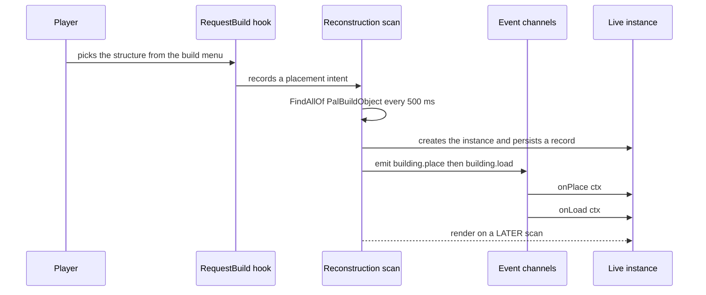
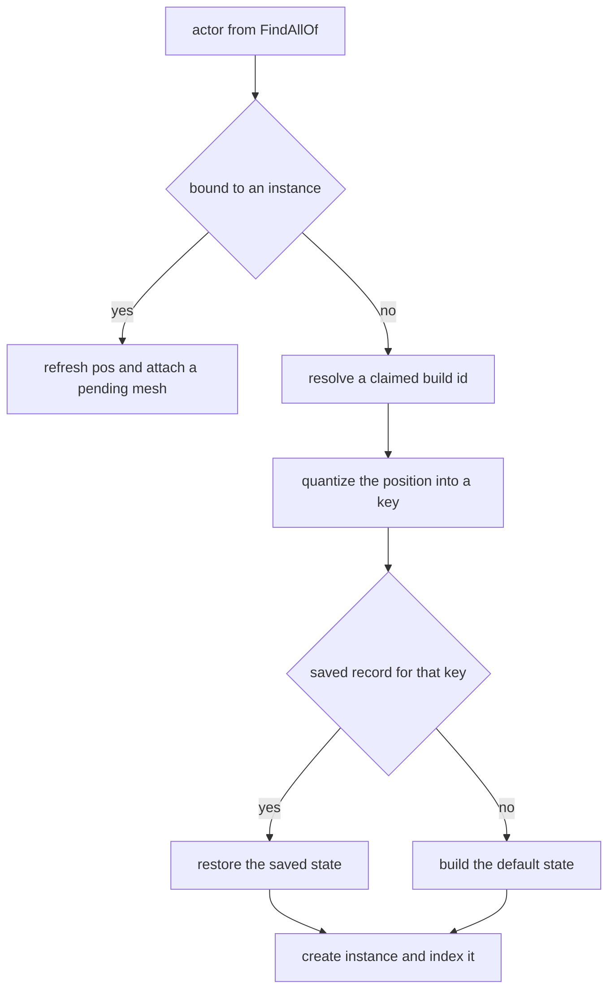
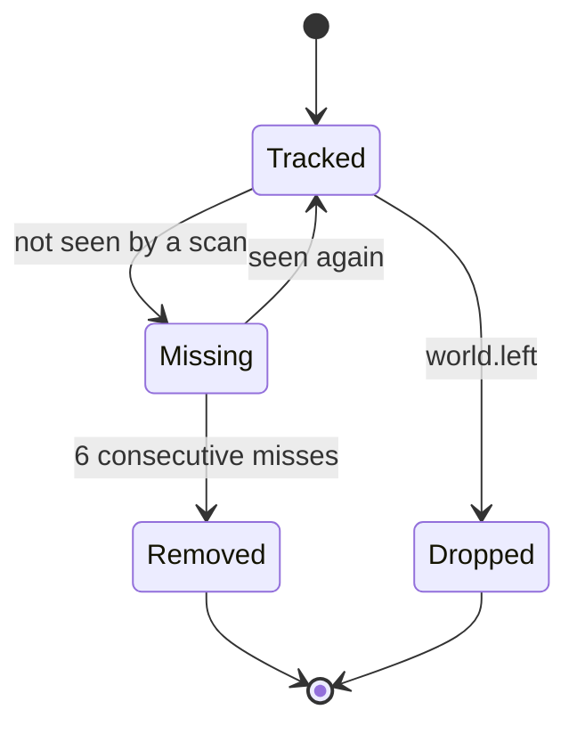

building は設置可能な構造物です。作業台、コンテナ、機械、装飾など、ビルドメニューから選んで
ワールドに置くものすべてが対象になります。PalForge のなかで唯一、インスタンス単位のランタイムを
持つドメインでもあります。設置された構造物はそれぞれ **インスタンス** になり、自分自身の actor、
ワールド座標、そして永続化される state を持ちます。宣言したライフサイクルハンドラは、その
インスタンス上で実行されます。

```lua
local api      = require("palforge.api")   -- also installs the bare globals
local Building = api.Building
```

エントリポイントは他のモジュールと同じ 3 つです。

```lua
local bench = Building{ id = "example:Bench", name = "Modded Bench" }   -- define
local box   = Building.get("PalBoxV2")                                 -- look one up
local all   = Building.get_all()                                       -- every registered one
```

## building を定義する

必須フィールドは `id` だけです。

```lua
Building{ id = "WorkBench" }
```

この 1 回の呼び出しが、ランタイムにその id を認識させます。`Building{ ... }` は定義クラスを
`core/object_manager` の `("building", id)` に登録し、再構築スキャンは登録済み定義に解決できる
build id だけを追跡します。誰も定義していない id に対する `Building.get(id)` は使える handle を
返しますが、登録は行わないため、その handle の `:instances()` は常に空のままです。

完全な定義は 1 つのデータとして読めます。

```lua title="content/buildings/bench.lua"
local bench = Building{
    id           = "example:Bench",
    name         = "Modded Bench",
    description  = "A bench that counts how often it is used.",
    gridCm       = 100,
    tickInterval = 4,
    mesh = {
        kind  = "static",
        model = "/Game/Pal/Model/Prop/Architecture/WorkBenchPrimitive/SM_WorkBenchPrimitive.SM_WorkBenchPrimitive",
    },
    color  = { r = 0.8, g = 0.3, b = 0.1, a = 1.0 },
    state  = function() return { uses = 0 } end,
    events = {
        onPlace      = function(self, ctx) self:save() end,
        onRightClick = function(self, ctx)
            self.state.uses = self.state.uses + 1
            self:save()
        end,
    },
    data = { tier = 2 },
}
```

mesh はインラインで書くことも、名前付きの `Mesh{ ... }` 定義を再利用することもできます。handle の
メタテーブルが `__spec` を持ち、バリデータがそれを展開するため、どちらも同じ検証を通ります。

<Tabs items={['Inline', 'Named']}>
<Tab value="Inline">

```lua
Building{
    id = "example:Bench",
    mesh = {
        kind  = "static",
        model = "/Game/Pal/Model/Prop/Architecture/WorkBenchPrimitive/SM_WorkBenchPrimitive.SM_WorkBenchPrimitive",
    },
}
```

`kind` を省略したインラインテーブルには、`Building.Spec.Mesh` の既定値である `"static"` が入ります。

</Tab>
<Tab value="Named">

```lua
local benchMesh = Mesh{
    id    = "example:bench_body",
    kind  = "static",   -- declare it: Mesh.Spec defaults kind to "skeletal"
    model = "/Game/Pal/Model/Prop/Architecture/WorkBenchPrimitive/SM_WorkBenchPrimitive.SM_WorkBenchPrimitive",
}

Building{ id = "example:Bench", mesh = benchMesh }
Building{ id = "example:Bench2", mesh = Mesh.get("example:bench_body") }
```

名前付き mesh は先に `Mesh.Spec` で検証され、その時点で `kind` に `"skeletal"` が埋められます。
building 側の既定値はもう適用されないため、名前付き mesh を building に入れる場合は `kind` を
自分で書いてください。

</Tab>
</Tabs>

### id について

コロンを含まない id は、そのままゲームの `BuildObjectId` です。`"WorkBench"`、`"PalBoxV2"`、
`"ItemChest"` などが該当します。`"pack:name"` 形式の id は DataTable の行 FName である
`pack_name` に解決され、これが `:unlock()` の対象であり、ランタイムが照合する値でもあります。

<Callout type="warn">
定義してもビルドメニューに新しい項目は増えません。Lua だけで DataTable の行を追加することは
できず、それは PalSchema の役目です。定義がするのは、すでに存在する id に振る舞い、state、
mesh、メタデータを与えることです。
</Callout>

同じ id を 2 回定義すると、後の登録が前の登録を置き換えます。native カタログはパックのコードより
先に読み込まれるため、`WorkBench` を定義するパックは mesh を含めて
`native.buildings.WorkBench` を置き換えます。必要なものは書き直してください。

### native カタログ

`native/buildings.lua` は `DT_BuildObjectDataTable_Common` の行 id をすべて素のデータとして持ち、
加えて 2 つのキュレーション済み定義を持ちます。

```lua
local buildings = require("palforge.native.buildings")

buildings.WorkBench          -- curated handle for "WorkBench" (BP_BuildObject_WorkBench_C)
buildings.PalBox             -- curated handle for "PalBoxV2"
buildings.get("ItemChest")   -- defines + registers on first use, then cached; nil for an unknown id
buildings.CATALOG            -- the id list, as data
```

モジュールを require しただけで登録されるのは、キュレーション済みの 2 つだけです。カタログ id を
実体化するのは `get(id)` なので、起動時に数百件が登録されることはありません。

## Spec のフィールド

<TypeTable
  type={{
    id: { description: 'ゲームの BuildObjectId (PalBoxV2 など) または pack:name', type: 'string', required: true },
    name: { description: 'UI に表示される名前', type: 'string', default: 'id と同じ' },
    description: { description: 'UI とツール用の 1 行説明', type: 'string' },
    gridCm: { description: '設置グリッドの量子化幅 (cm)', type: 'number', default: 'core.spatial.GRID_CM の 100' },
    buildIds: { description: 'この定義が担当するゲーム build id の一覧。既定値を置き換えます', type: 'string[]', default: '{ id }' },
    tickInterval: { description: 'N 回のハートビートごとに onTick を実行', type: 'number', default: '1' },
    mesh: { description: '設置された actor に取り付ける mesh。インラインまたは Mesh handle', type: 'Building.Spec.Mesh' },
    material: { description: 'その mesh に適用するマテリアル上書き', type: 'Building.Spec.Material' },
    color: { description: '基本の色味 r, g, b, a を 0..1 で。material.color の短縮形', type: 'table' },
    texture: { description: 'mesh に適用する png の絶対パス。material.texture の短縮形', type: 'string' },
    icon: { description: 'DataTable 検索が外れたときのフォールバックアイコン', type: 'any' },
    state: { description: '新規インスタンスの既定 state。テーブル、またはテーブルを返すファクトリ', type: 'table | fun(): table' },
    events: { description: 'ライフサイクルハンドラ (グループ)', type: 'Building.Spec.Events' },
    data: { description: '定義に載せて運ぶ自由形式のペイロード', type: 'table' },
  }}
/>

検証は厳格で、問題はすべてハードエラーになります。呼び出しが中途半端に成功することはありません。

```lua
Building{ id = "example:Bench", grid = 100 }
```

```text
PalForge: Building: unknown field "grid" (did you mean "gridCm"?). Valid fields: id, name, description, gridCm, buildIds, tickInterval, mesh, material, color, texture, icon, state, events, data
```

```text
PalForge: Building: field "id" is required (build id: a game BuildObjectId ("PalBoxV2") or "pack:name")
PalForge: Building: field "mesh" (Building.Spec.Mesh): field "model" is required (UStaticMesh asset path, or an OBJ path for the procedural backend)
```

フィールドを覚える代わりに、実行時に読み出せます。

```lua
local schema = require("palforge.core.schema")

print(schema.help("Building.Spec"))
print(schema.help("Building.Spec.Events"))
schema.get("Building.Spec").fields   -- the same, as a table, for tooling
```

### state — テーブルかファクトリか

`state` は **新規** インスタンスが最初に持つ既定 state です。保存レコードが存在しないインスタンスを
スキャンが初めて作るときに、1 度だけ読まれます。

```lua
state = { uses = 0 }                       -- a table
state = function() return { uses = 0 } end -- a factory, called per new instance
```

ファクトリには定義クラスが引数として渡されるため、`state = function(cls) ... end` とも書けます。
例外を投げた場合やテーブル以外を返した場合、インスタンスは空のテーブルで始まります。

<Callout type="warn">
ファクトリを推奨します。素のテーブルは定義側に保持され、新規インスタンスへ参照のまま渡されます。
同じ定義から 2 つ設置すると 1 つの state テーブルを共有し、両方の永続化レコードがそれを指します。
ファクトリならインスタンスごとに新しいテーブルが作られます。
</Callout>

state は JSON として永続化されるため、文字列、数値、真偽値、そしてそれらのネストしたテーブルに
とどめてください。復元されたインスタンスには保存されたレコードがそのまま入り、既定 state が
マージされることはありません。あとから増やしたフィールドにはガードが必要です。

```lua
onLoad = function(self, ctx)
    self.state.uses  = self.state.uses  or 0
    self.state.tier  = self.state.tier  or 1   -- added in a later version of the pack
end,
```

### gridCm — 設置座標の量子化

設置された構造物には制御可能な安定した個体 id がないため、ランタイムは量子化したワールド座標で
インスタンスを識別します。`core/spatial` は各軸を `math.floor(v / gridCm + 0.5)` で最も近いセルに
丸め、キーを `buildId@qx,qy,qz` の形式にします。

```text
WorkBench@1234,-56,78
```

`gridCm` の既定値は `core.spatial.GRID_CM` の `100`、つまり 1 メートルです。このキーは永続化
レコードの識別子そのものなので、次回のセッションで再発見された構造物に保存済み state を
結び付けるのもこのキーです。量子化幅を小さくすると近接して並ぶ構造物を区別しやすくなり、
大きくするとセッション間の座標のずれに強くなります。同じセルに落ちた 2 つの構造物はキーが
衝突し、スキャンは最初の有効な actor に紐づいたインスタンスを保持して 2 つ目を無視します。

セッション中の同一性はキーではなく actor そのものです。設置済み building の報告座標はスキャンの
たびに 1 セル以上ぶれるため、そこを基準にすると同じ actor から無限にインスタンスが作られてしまいます。

### buildIds — 複数のゲーム id を担当する

`buildIds` はこの定義が照合するゲーム build id の一覧です。既定値の `{ id }` を **置き換える** ため、
id 自身も照合したい場合は一覧に含めてください。

```lua
Building{
    id       = "example:Chests",
    name     = "Instrumented Chests",
    buildIds = { "ItemChest", "ItemChest_02", "ItemChest_03" },
    events   = {
        onRightClick = function(self, ctx)
            log.info("opened " .. self.buildId)   -- the id this instance matched
        end,
    },
}
```

各エントリは `object_manager.resolve` を通り (`"pack:name"` は `pack_name` になります)、この定義に
索引されます。インスタンスは一致した id を `self.buildId` に記録し、`self.id` は定義 id のままです。

照合は 3 段階です。actor のクラス名 `BP_BuildObject_<Id>_C`、次に
`MapObjectModel.BuildObjectId`、最後に保存レコードとの座標一致です。第 1 段階で当たるのは
ブループリント側の綴りと一致するエントリだけで、DataTable の行が `Workbench` である一方で
キュレーション済み定義が `"WorkBench"` を使っているのはそのためです。

### mesh と material

`Building.Spec.Mesh` は `Mesh.Spec` から派生したもので、`kind` の既定値だけが `"skeletal"` から
`"static"` に変わります。そのため `Mesh.Spec` に追加されたフィールドは自動的に building にも届きます。
`material`、`color`、`texture` は mesh の宣言に重ねられます。`Class:material()` は宣言された
`material` テーブルを返すか、短縮形を使った場合は `color` と `texture` から組み立て、
`Class:render()` がフィールド単位で material 側を優先します。

<Callout type="warn">
`kind` の 3 つのバックエンドのうち、設置物に対して実装されているのは `procedural` (別名 `obj`) だけ
です。これは `model` のパスからディスク上の OBJ ファイルを解析し、コリジョンを無効にした
ProceduralMeshComponent を追加します。`static` は `false` を返すスタブで、`skeletal` はキャラクタの
`Mesh` コンポーネントを操作しますが build object はそれを持ちません。したがってキュレーション済みの
`WorkBench` と `PalBoxV2` が宣言している mesh は、現時点では何も取り付けません。
</Callout>

```lua
mesh = {
    kind  = "procedural",
    model = "C:/mods/example/models/bench.obj",   -- parsed from disk when the mesh attaches
    scale = 1.0,
    offset = { x = 0, y = 0, z = 50 },
},
```

## ライブインスタンス

定義しただけでは何も生きていません。実際の actor がランタイムに見つかって初めて動き出します。
この経路は `core/event` がすべて持っています。



mesh の取り付けは意図的に遅延されています。初期化中の actor つまり設置されたそのフレームに
コンポーネントを追加すると、無効なネイティブオブジェクトに触れてゲームがクラッシュしうるため、
インスタンスは保留マークを付けられ、同じ actor をもう一度見つけた次のスキャンで描画されます。

スキャンが対象を判別する流れは次のとおりです。



`building.place` が emit されるのは、新しいインスタンスが同じ build id の設置意図に 300 cm 以内で
一致したときだけです。スキャンが新しく追跡したインスタンスは、直前に `building.place` を emit した
ものも含めてすべて `building.load` を emit し、保存レコード由来かどうかは `ctx.reconstructed` が
示します。インスタンス生成の分岐はキーごとに 1 度しか走らないため、`onPlace` は 1 回の設置につき
ちょうど 1 回発火します。

### インスタンスのフィールド

<TypeTable
  type={{
    id: { description: 'クラス経由で解決される定義 id', type: 'string' },
    buildId: { description: 'このインスタンスが一致したゲーム build id', type: 'string' },
    key: { description: 'レジストリと永続化のキー buildId@qx,qy,qz', type: 'string' },
    actor: { description: '設置された APalBuildObject', type: 'any' },
    pos: { description: 'ワールド座標 x, y, z を cm で。スキャンごとに更新', type: 'table' },
    cell: { description: 'キーの元になった量子化セル qx, qy, qz', type: 'table' },
    state: { description: '永続化されるテーブル。その場で書き換えて save', type: 'table' },
    def: { description: '内部の def。解決済み buildIds, gridCm, tickInterval, hooks', type: 'table' },
  }}
/>

定義で宣言した内容はクラスのメタテーブル経由で参照できるため、`self.name`、`self.data`、
`self.gridCm` などもインスタンス上で解決されます。

### インスタンスのメソッド

```lua
self:save()        -- stage state and write the json file now
self:setDirty()    -- stage only; written by the next save or on world.left
self:isValid()     -- is self.actor still a valid engine object
self:render()      -- attach mesh + material once; false without a valid actor or a model
self:update()      -- re-tint the live material from self:currentColor()
self:mesh()        -- the declared mesh table
self:material()    -- the declared material, or one built from color / texture
self:iconOf()      -- DT_BuildObjectIconDataTable lookup, falling back to the declared icon
```

`currentColor()` は `self.color` を返し、既定では定義側の色味に解決されます。見た目を state に
追随させたいときは、インスタンス側にフィールドを立ててから反映します。

```lua
onTick = function(self, ctx)
    self.color = self.state.running
        and { r = 0.2, g = 0.9, b = 0.3, a = 1.0 }
        or  { r = 0.4, g = 0.4, b = 0.4, a = 1.0 }
    self:update()
end,
```

<Callout type="info">
`update()` は、procedural バックエンドが mesh 取り付け時に作ったマテリアルインスタンスを塗り直します。
procedural で取り付けられた mesh がなければ塗る対象がないため `false` を返します。
</Callout>

### 永続化

state はワールドごとに 1 つの JSON ファイルへ、`utils/file` がモッドの `state` ディレクトリに
書き出します。

```text
<UE4SS Mods>/PalForge/state/entities_<saveId>.json
```

`saveId` は `core/spatial` が決めます。ゲームインスタンスの `WorldGuid`、`WorldSaveName`、
`SaveName` のいずれかを英数字以外を `_` に置換したうえで `w_` を前置し、どれも読めなければ
単に `world` になります。ファイルにはインスタンスキーごとのレコードが入ります。

```json
{
  "version": 1,
  "entities": {
    "WorkBench@1234,-56,78": {
      "buildId": "WorkBench",
      "pos": { "x": 123400.0, "y": -5600.0, "z": 7800.0 },
      "state": { "uses": 3 },
      "altKeys": {}
    }
  }
}
```

レコードの `state` は `inst.state` と同一のテーブルなので、その場で書き換えるだけで書き出される
内容が変わります。ただし何も自動では書きません。

- `self:setDirty()` はワールドキャッシュに dirty を立てるだけです。軽い操作です。
- `self:save()` は dirty を立てたうえで即座にファイルへ flush します。
- ワールド離脱時に 1 度 flush し、そのあとライブインスタンスを破棄してレコードは残します。

重要な変更では `save()`、毎 tick のような高頻度な場所では `setDirty()` を使ってください。tick ごとの
`save()` はハートビートのたびにファイルを書きます。

レコードが削除されるのは本当に撤去されたときだけです。スキャンが 6 回連続で見つけられなかった
インスタンス、つまり 500 ms 間隔でおよそ 3 秒間見えなかったインスタンスは `building.remove` を
emit し、レコードごと破棄されます。



`Removed` は永続化レコードを削除します。`Dropped` は残すため、次回のロードで state ごと復帰します。

### インスタンスへ到達する

```lua
local event = require("palforge.core.event")

Building.get("example:Kiln"):instances()   -- every live instance of one definition
event.instances()                          -- every live instance, any definition
event.instances("example:Kiln")            -- filtered by definition id or matched build id
event.instanceOfActor(ctx.actor)           -- the instance bound to an actor, or nil
event.isWorldReady()                       -- has the world finished loading
```

`:instances()` はスキャンが走るまで空で、スキャンにはロード済みのワールドが必要です。ready 監視は
1 秒ごとに有効な `PalPlayerCharacter` を探し、5 回連続で成功して初めてゲートを開きます。

## ライフサイクルイベント

ハンドラは `events` の下に宣言し、そのまま定義クラスへ取り付けられます。第 1 引数は
イベントが起きた **ライブインスタンス** です。

```lua
events = {
    onRightClick = function(self, ctx)   -- self is a Building.Instance
        log.info(self.key .. " at " .. tostring(self.pos.x))
    end,
}
```

| イベント | チャンネル | 発火 | ctx |
| --- | --- | --- | --- |
| `onPlace` | `building.place` | LIVE | `key`, `actor`, `pos`, `buildId`, `player`, `firstSeen` |
| `onLoad` | `building.load` | LIVE | `key`, `actor`, `pos`, `buildId`, `reconstructed` |
| `onRightClick` | `building.interact` | LIVE | `actor`, `player`, `buildId` |
| `onRemove` | `building.remove` | LIVE | `key`, `buildId`, `actor`, `reason` |
| `onTick` | `tick` | LIVE | `count`, `now` |
| `onWorldReady` | `world.ready` | dispatch はされます。下記参照 | 空テーブル |
| `onWorldLeft` | `world.left` | LIVE | 空テーブル |
| `onBuild` | — | 発火しません | — |
| `onLeftClick` | — | 発火しません | — |
| `onBreak` | — | 発火しません | — |

<Callout type="warn">
`onBuild`、`onLeftClick`、`onBreak` はパックのコードを将来に備えて書けるよう宣言可能ですが、
これらを emit するチャンネルもネイティブソースもまだありません。実行されることはありません。
設置には `onPlace`、消失には `onRemove` を使ってください。
</Callout>

### onPlace

新しい actor を発見したスキャンが、`RequestBuild_ToServer` フックの記録した設置意図と一致させた
ときに 1 度だけ発火します。`ctx.player` は設置意図を記録した時点でフックが見つけた
`PalPlayerCharacter`、`ctx.firstSeen` は常に `true`、`ctx.pos` は要求座標ではなく actor の実座標です。

```lua
onPlace = function(self, ctx)
    self.state.owner = tostring(ctx.player)
    self:save()
end,
```

### onLoad

スキャンが追跡を開始したすべてのインスタンスで発火します。直前に `onPlace` を発火させた
インスタンスも含みます。`ctx.reconstructed` は、state が保存レコード由来なら `true`、新規
インスタンスなら `false` です。

```lua
onLoad = function(self, ctx)
    if ctx.reconstructed then
        log.info(self.key .. " restored with " .. tostring(self.state.uses) .. " use(s)")
    end
    self:render()   -- normally unnecessary; the scan renders on its next pass
end,
```

### onRightClick

`PalBuildObject:OnBeginInteractBuilding` が駆動します。操作者は `PalCharacter` のサブクラスに
絞られるため building 同士のインタラクトは届かず、同じ actor への連続操作は 1 秒デバウンス
されます。dispatch は `ctx.actor` からインスタンスを解決します。

```lua
onRightClick = function(self, ctx)
    Item.get("Wood"):give(1)
    log.info(tostring(ctx.player) .. " used " .. self.buildId)
end,
```

### onRemove

`ctx.reason` は `"missing"` で、現在ランタイムが emit する唯一の理由です。ハンドラの実行中は
まだインスタンスが追跡されているので `self.state` や `self.pos` を読めます。レコードはその直後に
削除されます。

```lua
onRemove = function(self, ctx)
    log.info(string.format("%s gone after %d use(s)", self.key, self.state.uses or 0))
end,
```

### onTick

ハートビートは `LoopAsync(500)` で、`tick` チャンネルに流れます。`ctx.count` はハートビートの
通し番号です。tick リストに載るのは `onTick` を実際に上書きしている定義のインスタンスだけなので、
宣言しなければコストはかかりません。

`tickInterval` はそのカウントに対する除数です。`ctx.count % tickInterval == 0` のときに
ハンドラが走ります。

```lua
Building{
    id           = "example:Kiln",
    tickInterval = 20,   -- 20 heartbeats -> about 10 seconds
    events = {
        onTick = function(self, ctx)
            if not self:isValid() then return end
            log.info("tick " .. tostring(ctx.count))
        end,
    },
}
```

整数でない `tickInterval` や 1 未満の値は、定義を展開する時点で `1` に丸められます。

<Callout type="warn">
`onTick` にはサーキットブレーカがあります。失敗はすべてログに残り、カウントされます。5 回失敗すると
そのインスタンスは壊れた扱いになり、以後 tick しなくなります。撤去されて再発見されない限り、
そのセッションの残りずっと止まったままです。1 回成功すればカウンタはリセットされます。
`self.actor` に触れる前に `self:isValid()` を確認するなど、ハンドラは防御的に書いてください。
</Callout>

### onWorldReady と onWorldLeft

どちらもワールドのゲートが切り替わったときに、すべてのライブインスタンスへ dispatch されます。

`onWorldLeft` はインスタンスがまだ生きている、破棄される前の時点で走ります。state に触れる最後の
機会ですが、直後にワールドキャッシュは自動で flush されます。

<Callout type="warn">
`onWorldReady` は配線されていますが、インスタンスを作るスキャンも同じ `worldReady` フラグで
ゲートされており、`world.ready` が emit される時点ではまだ走っていません。そのためインスタンス
レジストリは空で、実際にはどのインスタンスにも届きません。スキャンが追跡したすべての
インスタンスで発火する `onLoad` を使うか、`event.on("world.ready", fn)` でチャンネルを直接
購読してください。
</Callout>

### チャンネルを直接購読する

dispatch は各チャンネルの購読者の 1 つにすぎません。横断的な処理は自分で購読してください。

```lua
local event = require("palforge.core.event")

event.on("building.place", function(ctx)
    log.info("placed " .. tostring(ctx.buildId) .. " -> " .. tostring(ctx.key))
end)

event.observable("building.interact")
    :filter(function(ctx) return ctx.buildId == "PalBoxV2" end)
    :subscribe(function(ctx) log.info("pal box opened") end)

local sub = event.every(5000, function() log.info("five seconds") end)
sub:unsubscribe()
```

`event.every(ms, fn)` はスキャンと同じく 500 ms のハートビートに量子化されます。

## Handle のアクションとクエリ

`Building{ ... }`、`Building.get`、`Building.get_all` はいずれも `Building.Handle` を返します。これは
定義レベルのビューです。構造物ごとのビューはインスタンスであり、そこへ到達する手段が handle です。

```lua
local box = Building.get("PalBoxV2")

box:name()          --> "Pal Box" for the curated definition, else the id
box:description()   --> the declared description, or nil
box:gridCm()        --> the declared quantum, or nil when the runtime default applies
box:mesh()          --> the declared mesh table, or nil
box:iconOf()        --> a texture ref from DT_BuildObjectIconDataTable, else the declared icon
```

### unlock

```lua
Building.get("example:Bench"):unlock()
```

解決済み id (`example_Bench`) の名前を持つテクノロジ行を `PalCheatManager:UnlockOneTechnology`
経由で解放します。PalSchema が注入した building のテクノロジをビルドメニューに出すのがこの
呼び出しです。チートマネージャが使えない場合は `false` を返してログに残します。

### instances と render と update

```lua
local kiln = Building.get("example:Kiln")

#kiln:instances()   --> how many are placed in this world
kiln:render()       --> attach the mesh to every live instance; returns how many calls came back clean
kiln:update()       --> re-tint every live instance from its currentColor
```

`render()` は通常は不要です。スキャンが actor を最初に見つけた次のパスで mesh を取り付けます。
実行時に `mesh()` の返す内容を変えたときに使ってください。

### イベントのフォワーダ

handle は手動呼び出し用に `:onPlace(ctx)`、`:onLoad(ctx)`、`:onRightClick(ctx)`、
`:onLeftClick(ctx)`、`:onBuild(ctx)`、`:onBreak(ctx)`、`:onRemove(ctx)`、`:onTick(ctx)` も持っています。

<Callout type="warn">
フォワーダはライブインスタンスではなく定義 **クラス** を `self` としてハンドラを呼びます。そこには
`self.state`、`self.actor`、`self.key`、`self:save()` はありません。ハンドラ単体の動作確認には
使えますが、それ以外では実際のイベント、あるいは `:instances()` から取ったインスタンスを
使ってください。
</Callout>

## レシピ

### セッションをまたいで保持されるカウンタ

作業台を設置して何度か使い、ゲームを終了して戻ってきても、カウントは残ります。

```lua title="content/buildings/counter.lua"
local api = require("palforge.api")
local log = require("palforge.utils.log").scope("counter")

local Building = api.Building

return Building{
    id     = "WorkBench",
    name   = "Workbench",
    gridCm = 100,
    state  = function() return { uses = 0 } end,
    events = {
        onLoad = function(self, ctx)
            self.state.uses = self.state.uses or 0   -- records saved before the field existed
            log.info(string.format("%s reconstructed=%s uses=%d",
                self.key, tostring(ctx.reconstructed), self.state.uses))
        end,
        onRightClick = function(self, ctx)
            self.state.uses = self.state.uses + 1
            self:save()
            log.info(self.key .. " used " .. self.state.uses .. " time(s)")
        end,
        onRemove = function(self, ctx)
            log.info(string.format("%s removed after %d use(s), reason %s",
                self.key, self.state.uses or 0, tostring(ctx.reason)))
        end,
    },
}
```

カウントが残るのは `onRightClick` が `save()` を呼んでいるからです。呼ばなければ変更はメモリ上には
反映され、次に何かがワールドファイルを flush したときに書かれますが、それは頼れる保証ではありません。

### タイマーでアイテムを消費する機械

右クリックで運転を切り替えます。運転中は 10 秒ごとに Wood を 1 つ消費し、Wood 3 つごとに
Charcoal を 1 つ産出します。

```lua title="content/buildings/kiln.lua"
local api = require("palforge.api")
local log = require("palforge.utils.log").scope("kiln")

local Building, Item = api.Building, api.Item

local WOOD_PER_CHARCOAL = 3

return Building{
    id           = "example:Kiln",
    name         = "Slow Kiln",
    description  = "Burns wood into charcoal on its own.",
    gridCm       = 100,
    tickInterval = 20,                 -- 20 heartbeats -> about 10 seconds
    state        = function() return { wood = 0, charcoal = 0, running = true } end,
    events = {
        onPlace = function(self, ctx)
            log.info("kiln built at " .. self.key)
            self:save()
        end,
        onRightClick = function(self, ctx)
            self.state.running = not self.state.running
            self.color = self.state.running
                and { r = 0.9, g = 0.4, b = 0.1, a = 1.0 }
                or  { r = 0.3, g = 0.3, b = 0.3, a = 1.0 }
            self:update()
            self:save()
            log.info(self.key .. " running=" .. tostring(self.state.running))
        end,
        onTick = function(self, ctx)
            if not (self.state.running and self:isValid()) then return end
            if not Item.get("Wood"):take(1) then return end

            self.state.wood = self.state.wood + 1
            if self.state.wood >= WOOD_PER_CHARCOAL then
                self.state.wood     = self.state.wood - WOOD_PER_CHARCOAL
                self.state.charcoal = self.state.charcoal + 1
                Item.get("Charcoal"):give(1)
                log.info(string.format("%s produced charcoal #%d", self.key, self.state.charcoal))
            end
            self:setDirty()   -- staged; the next save or the world unload writes it
        end,
    },
}
```

<Callout type="info">
`:take` はゲーム自身のサーバ経路で数量を動かし、呼び出しが実行できたかどうかを返します。
プレイヤーが実際にその数を持っていたかどうかではありません。実在庫が必要な機械では、消費量を
`state` 側で管理してください。
</Callout>

### インタラクトで pal を出す構造物

```lua title="content/buildings/summon_post.lua"
local api = require("palforge.api")
local log = require("palforge.utils.log").scope("summon")

local Building, Pal = api.Building, api.Pal

local COOLDOWN_TICKS = 60   -- heartbeats -> about 30 seconds

return Building{
    id     = "PalBoxV2",
    name   = "Pal Box",
    gridCm = 100,
    mesh   = {
        kind  = "static",
        model = "/Game/Pal/Model/Other/PalBox/SM_PalBox.SM_PalBox",
    },
    state = function() return { summons = 0, cooldown = 0 } end,
    events = {
        onTick = function(self, ctx)
            if (self.state.cooldown or 0) > 0 then
                self.state.cooldown = self.state.cooldown - 1
            end
        end,
        onRightClick = function(self, ctx)
            if (self.state.cooldown or 0) > 0 then
                log.info("on cooldown for " .. self.state.cooldown .. " more tick(s)")
                return
            end
            local at = { x = self.pos.x, y = self.pos.y + 300, z = self.pos.z + 100 }
            if Pal.get("ChickenPal"):spawn(at) then
                self.state.summons  = self.state.summons + 1
                self.state.cooldown = COOLDOWN_TICKS
                self:save()
                log.info(string.format("summon #%d from %s", self.state.summons, self.key))
            end
        end,
    },
}
```

`PalBoxV2` を定義し直すと `native/buildings.lua` のキュレーション済み定義を置き換えるため、
mesh をここで書き直しています。バニラのパルボックス UI はそのまま開きます。インタラクトフックは
呼び出しを観測するだけで、消費はしません。`:spawn` が受け取れる引数は [Pal](/docs/api/pal)、
`:give` と `:take` は [Item](/docs/api/item) を参照してください。
