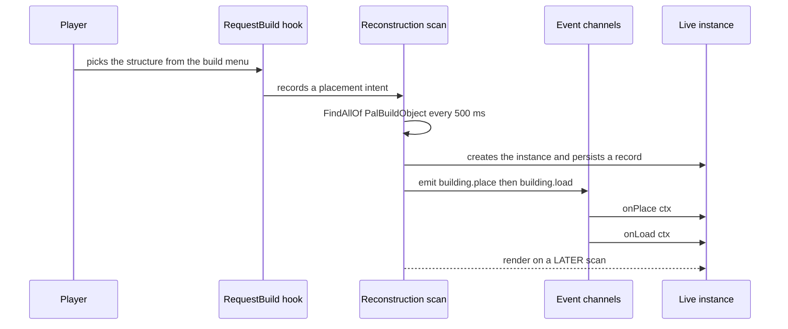
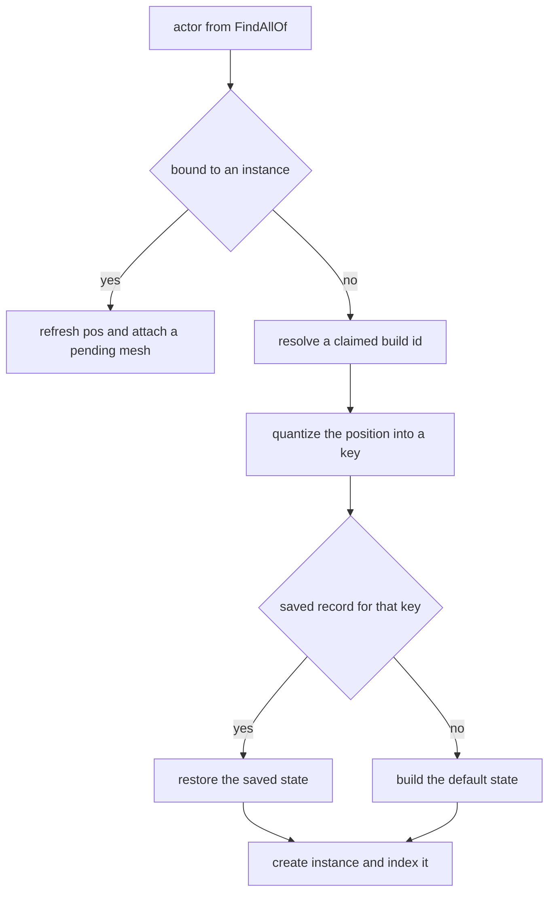
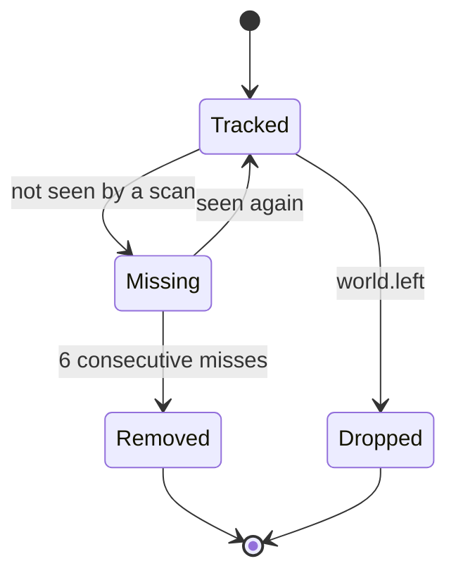

A building is a placeable structure: workbenches, chests, machines, decorations — anything
picked from the build menu and set into the world. It is the only PalForge domain with a
per-instance runtime. A placed structure becomes an **instance** with its own actor, world
position and persisted state, and every lifecycle handler you declare runs on that instance.

```lua
local api      = require("palforge.api")   -- also installs the bare globals
local Building = api.Building
```

Three entry points, the same as every other module:

```lua
local bench = Building{ id = "example:Bench", name = "Modded Bench" }   -- define
local box   = Building.get("PalBoxV2")                                 -- look one up
local all   = Building.get_all()                                       -- every registered one
```

## Defining a building

The only required field is `id`.

```lua
Building{ id = "WorkBench" }
```

That single call is what makes the runtime care about the id: `Building{ ... }` registers the
definition class in `core/object_manager` under `("building", id)`, and the reconstruction
scan only tracks build ids that resolve to a registered definition. `Building.get(id)` on an
id nobody defined returns a usable handle, but it does **not** register anything, so
`:instances()` on it stays empty.

A full definition reads as one piece of data:

```lua title="content/buildings/bench.lua"
local bench = Building{
    id           = "example:Bench",
    name         = "Modded Bench",
    description  = "A bench that counts how often it is used.",
    gridCm       = 100,
    tickInterval = 4,
    mesh = {
        kind  = "static",
        model = "/Game/Pal/Model/Prop/Architecture/WorkBenchPrimitive/SM_WorkBenchPrimitive.SM_WorkBenchPrimitive",
    },
    color  = { r = 0.8, g = 0.3, b = 0.1, a = 1.0 },
    state  = function() return { uses = 0 } end,
    events = {
        onPlace      = function(self, ctx) self:save() end,
        onRightClick = function(self, ctx)
            self.state.uses = self.state.uses + 1
            self:save()
        end,
    },
    data = { tier = 2 },
}
```

The mesh can be written inline or reused from a named `Mesh{ ... }` definition. Both reach
the same validator, because a handle's metatable carries `__spec` and the validator unwraps
it.

<Tabs items={['Inline', 'Named']}>
<Tab value="Inline">

```lua
Building{
    id = "example:Bench",
    mesh = {
        kind  = "static",
        model = "/Game/Pal/Model/Prop/Architecture/WorkBenchPrimitive/SM_WorkBenchPrimitive.SM_WorkBenchPrimitive",
    },
}
```

An inline table that omits `kind` gets `"static"`, the `Building.Spec.Mesh` default.

</Tab>
<Tab value="Named">

```lua
local benchMesh = Mesh{
    id    = "example:bench_body",
    kind  = "static",   -- declare it: Mesh.Spec defaults kind to "skeletal"
    model = "/Game/Pal/Model/Prop/Architecture/WorkBenchPrimitive/SM_WorkBenchPrimitive.SM_WorkBenchPrimitive",
}

Building{ id = "example:Bench", mesh = benchMesh }
Building{ id = "example:Bench2", mesh = Mesh.get("example:bench_body") }
```

A named mesh is validated against `Mesh.Spec` first, which fills `kind` with `"skeletal"`
before the building ever sees the table. The building default cannot apply any more, so
write `kind` yourself when you nest a named mesh into a building.

</Tab>
</Tabs>

### Ids

An id without a colon is a literal game `BuildObjectId` — `"WorkBench"`, `"PalBoxV2"`,
`"ItemChest"`. An id of the form `"pack:name"` resolves to the DataTable row FName
`pack_name`, which is also what `:unlock()` unlocks and what the runtime matches against.

<Callout type="warn">
Defining does not create a new entry in the build menu. Lua alone cannot publish a DataTable
row — that is PalSchema's job. What a definition does is give an id that already exists
behaviour, state, a mesh and metadata.
</Callout>

Defining the same id twice replaces the earlier registration. The native catalogs load
before pack code, so a pack that defines `WorkBench` takes over from
`native.buildings.WorkBench`, including its mesh — restate anything you still want.

### The native catalog

`native/buildings.lua` carries every `DT_BuildObjectDataTable_Common` row id as plain data,
plus two curated definitions.

```lua
local buildings = require("palforge.native.buildings")

buildings.WorkBench          -- curated handle for "WorkBench" (BP_BuildObject_WorkBench_C)
buildings.PalBox             -- curated handle for "PalBoxV2"
buildings.get("ItemChest")   -- defines + registers on first use, then cached; nil for an unknown id
buildings.CATALOG            -- the id list, as data
```

Requiring the module registers only the two curated definitions. `get(id)` is what
materializes a catalog id, so startup never registers the hundreds of rows.

## Spec fields

<TypeTable
  type={{
    id: { description: 'A game BuildObjectId such as PalBoxV2, or pack:name', type: 'string', required: true },
    name: { description: 'Shown in UI', type: 'string', default: 'the id' },
    description: { description: 'One-line description, for UI and tooling', type: 'string' },
    gridCm: { description: 'Placement grid quantum in cm', type: 'number', default: '100 from core.spatial.GRID_CM' },
    buildIds: { description: 'The game build ids this definition claims; replaces the default list', type: 'string[]', default: '{ id }' },
    tickInterval: { description: 'Run onTick every N heartbeats', type: 'number', default: '1' },
    mesh: { description: 'The mesh attached to the placed actor, inline or a Mesh handle', type: 'Building.Spec.Mesh' },
    material: { description: 'Material override applied to that mesh', type: 'Building.Spec.Material' },
    color: { description: 'Base tint r, g, b, a in 0..1; shorthand for material.color', type: 'table' },
    texture: { description: 'Absolute png path applied to the mesh; shorthand for material.texture', type: 'string' },
    icon: { description: 'Fallback icon used when the DataTable lookup misses', type: 'any' },
    state: { description: 'Default persisted state for a new instance: a table, or a factory returning one', type: 'table | fun(): table' },
    events: { description: 'Lifecycle handlers, grouped', type: 'Building.Spec.Events' },
    data: { description: 'Free-form payload of your own, carried onto the definition', type: 'table' },
  }}
/>

Validation is strict and every problem is a hard error, so a call never half-succeeds.

```lua
Building{ id = "example:Bench", grid = 100 }
```

```text
PalForge: Building: unknown field "grid" (did you mean "gridCm"?). Valid fields: id, name, description, gridCm, buildIds, tickInterval, mesh, material, color, texture, icon, state, events, data
```

```text
PalForge: Building: field "id" is required (build id: a game BuildObjectId ("PalBoxV2") or "pack:name")
PalForge: Building: field "mesh" (Building.Spec.Mesh): field "model" is required (UStaticMesh asset path, or an OBJ path for the procedural backend)
```

Read the shape at runtime instead of memorizing it:

```lua
local schema = require("palforge.core.schema")

print(schema.help("Building.Spec"))
print(schema.help("Building.Spec.Events"))
schema.get("Building.Spec").fields   -- the same, as a table, for tooling
```

### state — a table or a factory

`state` is the default persisted state a **new** instance starts with. It is read once, when
the scan first creates an instance for which no saved record exists.

```lua
state = { uses = 0 }                       -- a table
state = function() return { uses = 0 } end -- a factory, called per new instance
```

The factory is called with the definition class as its argument, so
`state = function(cls) ... end` works too. If it throws or returns a non-table, the instance
starts with an empty table.

<Callout type="warn">
Prefer the factory. A plain table is stored on the definition and handed to every new
instance by reference — two structures placed from the same definition then share one state
table, and both persisted records point at it. The factory builds a fresh table per instance.
</Callout>

State is persisted as JSON, so keep it to strings, numbers, booleans and nested tables of
those. A restored instance gets exactly the record that was saved — the default state is not
merged in — so a field added after the fact needs a guard:

```lua
onLoad = function(self, ctx)
    self.state.uses  = self.state.uses  or 0
    self.state.tier  = self.state.tier  or 1   -- added in a later version of the pack
end,
```

### gridCm — how a placement is quantized

A placed structure has no stable per-instance id, so the runtime keys an instance by its
quantized world position. `core/spatial` rounds each axis to the nearest cell,
`math.floor(v / gridCm + 0.5)`, and formats the key as `buildId@qx,qy,qz`:

```text
WorkBench@1234,-56,78
```

`gridCm` defaults to `core.spatial.GRID_CM`, which is `100` — one metre. That key is the
identity of the persisted record, so it is what re-attaches saved state to a rediscovered
structure on the next session. A smaller quantum separates structures that stand close
together; a larger one tolerates more position drift between sessions. Two structures whose
positions land in the same cell collide on the key: the scan keeps the instance bound to the
first valid actor and skips the second.

Within one session identity is the actor itself, not the key — a placed building's reported
location jitters by more than a cell between scans, and keying live instances off that would
churn one actor into endless instances.

### buildIds — claiming more than one game id

`buildIds` is the list of game build ids the definition matches. It **replaces** the default
`{ id }`, so include the id itself if you still want it matched:

```lua
Building{
    id       = "example:Chests",
    name     = "Instrumented Chests",
    buildIds = { "ItemChest", "ItemChest_02", "ItemChest_03" },
    events   = {
        onRightClick = function(self, ctx)
            log.info("opened " .. self.buildId)   -- the id this instance matched
        end,
    },
}
```

Each entry is resolved through `object_manager.resolve` (so `"pack:name"` becomes
`pack_name`) and indexed to this definition. An instance records which one it matched in
`self.buildId`, while `self.id` stays the definition id.

Matching runs in three tiers: the actor's class name `BP_BuildObject_<Id>_C`, then
`MapObjectModel.BuildObjectId`, then a position match against a saved record. An entry only
works through the first tier if it is spelled as the blueprint spells it — that is why the
curated definition uses `"WorkBench"` while the DataTable row is spelled `Workbench`.

### mesh and material

`Building.Spec.Mesh` is `Mesh.Spec` with `kind` defaulting to `"static"` instead of
`"skeletal"`, so a field added to `Mesh.Spec` reaches buildings automatically. `material`,
`color` and `texture` layer over whatever the mesh declares: `Class:material()` returns the
declared `material` table, or builds one from `color` / `texture` when you used the
shorthands, and `Class:render()` lets the material win field by field.

<Callout type="warn">
Of the three backends behind `kind`, only `procedural` (aliased as `obj`) is implemented for
a placed structure. It parses an OBJ file from disk at `model` and adds a
ProceduralMeshComponent with collision disabled. `static` is a stub that returns `false`, and
`skeletal` drives a character's `Mesh` component, which a build object does not have. The
curated `WorkBench` and `PalBoxV2` therefore declare a mesh that currently attaches nothing.
</Callout>

```lua
mesh = {
    kind  = "procedural",
    model = "C:/mods/example/models/bench.obj",   -- parsed from disk when the mesh attaches
    scale = 1.0,
    offset = { x = 0, y = 0, z = 50 },
},
```

## The live instance

Nothing you define is alive until the runtime finds a real actor for it. `core/event` owns
the whole path.



The mesh attach is deliberately deferred. Adding a component to an actor still mid-init — the
frame it is placed — can touch an invalid native object and crash the game, so the instance is
marked pending and rendered on the next scan that sees the same actor again.

How the scan decides what it is looking at:



`building.place` is only emitted when a fresh instance is matched to a recorded placement
intent for the same build id within 300 cm. Every instance the scan newly tracks then emits
`building.load` — including the one that just emitted `building.place` — with
`ctx.reconstructed` telling you whether it came from a saved record. The instance-creation
branch runs once per key, so `onPlace` fires exactly once per placement.

### Instance fields

<TypeTable
  type={{
    id: { description: 'The definition id, resolved through the class', type: 'string' },
    buildId: { description: 'The game build id this instance matched', type: 'string' },
    key: { description: 'The registry and persistence key, buildId@qx,qy,qz', type: 'string' },
    actor: { description: 'The placed APalBuildObject', type: 'any' },
    pos: { description: 'World position x, y, z in cm, refreshed every scan', type: 'table' },
    cell: { description: 'The quantized cell qx, qy, qz the key was built from', type: 'table' },
    state: { description: 'Your persisted table; mutate in place, then save', type: 'table' },
    def: { description: 'The internal def: resolved buildIds, gridCm, tickInterval, hooks', type: 'table' },
  }}
/>

Anything the definition declared is reachable through the class metatable, so `self.name`,
`self.data`, `self.gridCm` and the rest resolve on the instance too.

### Instance methods

```lua
self:save()        -- stage state and write the json file now
self:setDirty()    -- stage only; written by the next save or on world.left
self:isValid()     -- is self.actor still a valid engine object
self:render()      -- attach mesh + material once; false without a valid actor or a model
self:update()      -- re-tint the live material from self:currentColor()
self:mesh()        -- the declared mesh table
self:material()    -- the declared material, or one built from color / texture
self:iconOf()      -- DT_BuildObjectIconDataTable lookup, falling back to the declared icon
```

`currentColor()` returns `self.color`, which resolves to the definition's tint by default.
Set the field on the instance to make the look follow the state, then push it:

```lua
onTick = function(self, ctx)
    self.color = self.state.running
        and { r = 0.2, g = 0.9, b = 0.3, a = 1.0 }
        or  { r = 0.4, g = 0.4, b = 0.4, a = 1.0 }
    self:update()
end,
```

<Callout type="info">
`update()` re-tints through the material instance the procedural backend created when it
attached the mesh. With no procedurally attached mesh there is nothing to tint and it returns
`false`.
</Callout>

### Persistence

State lives in one JSON file per world, written by `utils/file` into the mod's `state`
directory:

```text
<UE4SS Mods>/PalForge/state/entities_<saveId>.json
```

`saveId` comes from `core/spatial`: `w_` plus the game instance's `WorldGuid`,
`WorldSaveName` or `SaveName` with non-alphanumerics replaced by `_`, and plain `world` when
none of them can be read. The file holds one record per instance key:

```json
{
  "version": 1,
  "entities": {
    "WorkBench@1234,-56,78": {
      "buildId": "WorkBench",
      "pos": { "x": 123400.0, "y": -5600.0, "z": 7800.0 },
      "state": { "uses": 3 },
      "altKeys": {}
    }
  }
}
```

A record's `state` is the same table as `inst.state`, so mutating in place is enough to
change what will be written. Nothing writes on its own:

- `self:setDirty()` marks the world cache dirty. Cheap.
- `self:save()` marks it dirty and flushes the file immediately.
- world unload flushes once, then drops the live instances and keeps every record.

Call `save()` when the change matters and `setDirty()` in a hot loop, otherwise a per-tick
`save()` writes the file on every heartbeat.

Records are deleted only on genuine removal. An instance the scan fails to see for six
consecutive passes — about three seconds at the 500 ms cadence — emits `building.remove` and
is dropped along with its record.



`Removed` deletes the persisted record. `Dropped` keeps it, so the structure comes back with
its state on the next load.

### Reaching the instances

```lua
local event = require("palforge.core.event")

Building.get("example:Kiln"):instances()   -- every live instance of one definition
event.instances()                          -- every live instance, any definition
event.instances("example:Kiln")            -- filtered by definition id or matched build id
event.instanceOfActor(ctx.actor)           -- the instance bound to an actor, or nil
event.isWorldReady()                       -- has the world finished loading
```

`:instances()` is empty until the scan has run, which needs a loaded world: the ready watch
polls for a valid `PalPlayerCharacter` once a second and only opens the gate after five
consecutive successful polls.

## Lifecycle events

Handlers are declared under `events` and installed on the definition class as-is, so the
first argument is the **live instance** the event happened to.

```lua
events = {
    onRightClick = function(self, ctx)   -- self is a Building.Instance
        log.info(self.key .. " at " .. tostring(self.pos.x))
    end,
}
```

| Event | Channel | Fires | ctx |
| --- | --- | --- | --- |
| `onPlace` | `building.place` | LIVE | `key`, `actor`, `pos`, `buildId`, `player`, `firstSeen` |
| `onLoad` | `building.load` | LIVE | `key`, `actor`, `pos`, `buildId`, `reconstructed` |
| `onRightClick` | `building.interact` | LIVE | `actor`, `player`, `buildId` |
| `onRemove` | `building.remove` | LIVE | `key`, `buildId`, `actor`, `reason` |
| `onTick` | `tick` | LIVE | `count`, `now` |
| `onWorldReady` | `world.ready` | dispatched, see below | empty table |
| `onWorldLeft` | `world.left` | LIVE | empty table |
| `onBuild` | — | never | — |
| `onLeftClick` | — | never | — |
| `onBreak` | — | never | — |

<Callout type="warn">
`onBuild`, `onLeftClick` and `onBreak` are declarable so a pack's code is future-proof, but no
channel emits them and no native source exists yet. They never run. Use `onPlace` for
placement and `onRemove` for disappearance.
</Callout>

### onPlace

Fires once, on the scan that discovers the new actor and matches it to a placement intent
recorded by the `RequestBuild_ToServer` hook. `ctx.player` is the `PalPlayerCharacter` the
hook found when it recorded the intent, `ctx.firstSeen` is always `true`, and `ctx.pos` is
the actor's real location, not the requested one.

```lua
onPlace = function(self, ctx)
    self.state.owner = tostring(ctx.player)
    self:save()
end,
```

### onLoad

Fires for every instance the scan starts tracking, including the one it just emitted
`onPlace` for. `ctx.reconstructed` is `true` when the state came from a saved record and
`false` for a brand-new instance.

```lua
onLoad = function(self, ctx)
    if ctx.reconstructed then
        log.info(self.key .. " restored with " .. tostring(self.state.uses) .. " use(s)")
    end
    self:render()   -- normally unnecessary; the scan renders on its next pass
end,
```

### onRightClick

Driven by `PalBuildObject:OnBeginInteractBuilding`. The interactor is filtered to
`PalCharacter` subclasses, so building-to-building interactions do not reach you, and repeat
interactions on the same actor are debounced for one second. Dispatch resolves the instance
from `ctx.actor`.

```lua
onRightClick = function(self, ctx)
    Item.get("Wood"):give(1)
    log.info(tostring(ctx.player) .. " used " .. self.buildId)
end,
```

### onRemove

`ctx.reason` is `"missing"` — the only reason the runtime emits today. The instance is still
tracked while the handler runs, so `self.state` and `self.pos` are readable; the record is
deleted immediately afterwards.

```lua
onRemove = function(self, ctx)
    log.info(string.format("%s gone after %d use(s)", self.key, self.state.uses or 0))
end,
```

### onTick

The heartbeat is `LoopAsync(500)`, published on the `tick` channel, and `ctx.count` is the
heartbeat number. Only instances whose definition actually overrides `onTick` are put on the
tick list, so declaring nothing costs nothing.

`tickInterval` is a divisor on that count: the handler runs when
`ctx.count % tickInterval == 0`.

```lua
Building{
    id           = "example:Kiln",
    tickInterval = 20,   -- 20 heartbeats -> about 10 seconds
    events = {
        onTick = function(self, ctx)
            if not self:isValid() then return end
            log.info("tick " .. tostring(ctx.count))
        end,
    },
}
```

A non-integer or sub-1 `tickInterval` is coerced back to `1` when the definition is lowered.

<Callout type="warn">
`onTick` is guarded by a circuit breaker. Every failure is logged and counted; after five
failures the instance is marked broken and stops ticking for the rest of its life, which
includes the rest of the session unless it is removed and rediscovered. One success resets
the counter. Keep the handler defensive — check `self:isValid()` before touching `self.actor`.
</Callout>

### onWorldReady and onWorldLeft

Both are dispatched to every live instance when the world gate flips.

`onWorldLeft` runs while the instances are still live and before they are dropped, so it is
the last chance to touch state — though the world cache is flushed for you right afterwards.

<Callout type="warn">
`onWorldReady` is wired, but the scan that creates instances is gated on the same
`worldReady` flag and has not run yet at the moment `world.ready` is emitted. The instance
registry is empty then, so in practice no instance receives it. Use `onLoad`, which fires for
every instance the scan tracks, or subscribe to the channel directly with
`event.on("world.ready", fn)`.
</Callout>

### Subscribing to the channels directly

Dispatch is only one subscriber on each channel. For cross-cutting logic, subscribe yourself:

```lua
local event = require("palforge.core.event")

event.on("building.place", function(ctx)
    log.info("placed " .. tostring(ctx.buildId) .. " -> " .. tostring(ctx.key))
end)

event.observable("building.interact")
    :filter(function(ctx) return ctx.buildId == "PalBoxV2" end)
    :subscribe(function(ctx) log.info("pal box opened") end)

local sub = event.every(5000, function() log.info("five seconds") end)
sub:unsubscribe()
```

`event.every(ms, fn)` is quantized to the 500 ms heartbeat, like the scan itself.

## Handle actions and queries

`Building{ ... }`, `Building.get` and `Building.get_all` all return a `Building.Handle` — the
definition-level view. Instances are the per-structure view; the handle is how you reach them.

```lua
local box = Building.get("PalBoxV2")

box:name()          --> "Pal Box" for the curated definition, else the id
box:description()   --> the declared description, or nil
box:gridCm()        --> the declared quantum, or nil when the runtime default applies
box:mesh()          --> the declared mesh table, or nil
box:iconOf()        --> a texture ref from DT_BuildObjectIconDataTable, else the declared icon
```

### unlock

```lua
Building.get("example:Bench"):unlock()
```

Unlocks the technology row named after the resolved id (`example_Bench`) through
`PalCheatManager:UnlockOneTechnology`, which is how a PalSchema-injected building tech gets
into the build menu. Returns `false` and logs when no cheat manager is available.

### instances, render, update

```lua
local kiln = Building.get("example:Kiln")

#kiln:instances()   --> how many are placed in this world
kiln:render()       --> attach the mesh to every live instance; returns how many calls came back clean
kiln:update()       --> re-tint every live instance from its currentColor
```

`render()` is normally unnecessary — the scan attaches the mesh one pass after it first sees
the actor. Reach for it after changing what `mesh()` returns at runtime.

### The event forwarders

The handle also carries `:onPlace(ctx)`, `:onLoad(ctx)`, `:onRightClick(ctx)`,
`:onLeftClick(ctx)`, `:onBuild(ctx)`, `:onBreak(ctx)`, `:onRemove(ctx)` and `:onTick(ctx)` for
manual invocation.

<Callout type="warn">
A forwarder calls the handler with the definition **class** as `self`, not a live instance.
`self.state`, `self.actor`, `self.key` and `self:save()` are absent there. Use them for
testing a handler in isolation; use the real event, or an instance from `:instances()`, for
anything else.
</Callout>

## Recipes

### A counter that persists across sessions

Place a workbench, use it a few times, quit, come back — the count is still there.

```lua title="content/buildings/counter.lua"
local api = require("palforge.api")
local log = require("palforge.utils.log").scope("counter")

local Building = api.Building

return Building{
    id     = "WorkBench",
    name   = "Workbench",
    gridCm = 100,
    state  = function() return { uses = 0 } end,
    events = {
        onLoad = function(self, ctx)
            self.state.uses = self.state.uses or 0   -- records saved before the field existed
            log.info(string.format("%s reconstructed=%s uses=%d",
                self.key, tostring(ctx.reconstructed), self.state.uses))
        end,
        onRightClick = function(self, ctx)
            self.state.uses = self.state.uses + 1
            self:save()
            log.info(self.key .. " used " .. self.state.uses .. " time(s)")
        end,
        onRemove = function(self, ctx)
            log.info(string.format("%s removed after %d use(s), reason %s",
                self.key, self.state.uses or 0, tostring(ctx.reason)))
        end,
    },
}
```

The count survives because `onRightClick` calls `save()`. Without it the mutation would still
be visible in memory and would still be written the next time anything flushes the world
file, which is not a guarantee worth relying on.

### A machine that consumes an item on a timer

Right-click toggles it. While running it eats one Wood every ten seconds and yields one
Charcoal per three Wood.

```lua title="content/buildings/kiln.lua"
local api = require("palforge.api")
local log = require("palforge.utils.log").scope("kiln")

local Building, Item = api.Building, api.Item

local WOOD_PER_CHARCOAL = 3

return Building{
    id           = "example:Kiln",
    name         = "Slow Kiln",
    description  = "Burns wood into charcoal on its own.",
    gridCm       = 100,
    tickInterval = 20,                 -- 20 heartbeats -> about 10 seconds
    state        = function() return { wood = 0, charcoal = 0, running = true } end,
    events = {
        onPlace = function(self, ctx)
            log.info("kiln built at " .. self.key)
            self:save()
        end,
        onRightClick = function(self, ctx)
            self.state.running = not self.state.running
            self.color = self.state.running
                and { r = 0.9, g = 0.4, b = 0.1, a = 1.0 }
                or  { r = 0.3, g = 0.3, b = 0.3, a = 1.0 }
            self:update()
            self:save()
            log.info(self.key .. " running=" .. tostring(self.state.running))
        end,
        onTick = function(self, ctx)
            if not (self.state.running and self:isValid()) then return end
            if not Item.get("Wood"):take(1) then return end

            self.state.wood = self.state.wood + 1
            if self.state.wood >= WOOD_PER_CHARCOAL then
                self.state.wood     = self.state.wood - WOOD_PER_CHARCOAL
                self.state.charcoal = self.state.charcoal + 1
                Item.get("Charcoal"):give(1)
                log.info(string.format("%s produced charcoal #%d", self.key, self.state.charcoal))
            end
            self:setDirty()   -- staged; the next save or the world unload writes it
        end,
    },
}
```

<Callout type="info">
`:take` moves the count through the game's own server path and returns whether the call
executed, not whether the player actually had that much. Track what you consumed in `state`
if the machine needs a real balance.
</Callout>

### A structure that spawns a pal when interacted with

```lua title="content/buildings/summon_post.lua"
local api = require("palforge.api")
local log = require("palforge.utils.log").scope("summon")

local Building, Pal = api.Building, api.Pal

local COOLDOWN_TICKS = 60   -- heartbeats -> about 30 seconds

return Building{
    id     = "PalBoxV2",
    name   = "Pal Box",
    gridCm = 100,
    mesh   = {
        kind  = "static",
        model = "/Game/Pal/Model/Other/PalBox/SM_PalBox.SM_PalBox",
    },
    state = function() return { summons = 0, cooldown = 0 } end,
    events = {
        onTick = function(self, ctx)
            if (self.state.cooldown or 0) > 0 then
                self.state.cooldown = self.state.cooldown - 1
            end
        end,
        onRightClick = function(self, ctx)
            if (self.state.cooldown or 0) > 0 then
                log.info("on cooldown for " .. self.state.cooldown .. " more tick(s)")
                return
            end
            local at = { x = self.pos.x, y = self.pos.y + 300, z = self.pos.z + 100 }
            if Pal.get("ChickenPal"):spawn(at) then
                self.state.summons  = self.state.summons + 1
                self.state.cooldown = COOLDOWN_TICKS
                self:save()
                log.info(string.format("summon #%d from %s", self.state.summons, self.key))
            end
        end,
    },
}
```

Redefining `PalBoxV2` replaces the curated definition from `native/buildings.lua`, so the
mesh is restated here. The vanilla pal box UI still opens — the interact hook observes the
call, it does not consume it. See [Pal](/docs/api/pal) for what `:spawn` accepts and
[Item](/docs/api/item) for `:give` and `:take`.
