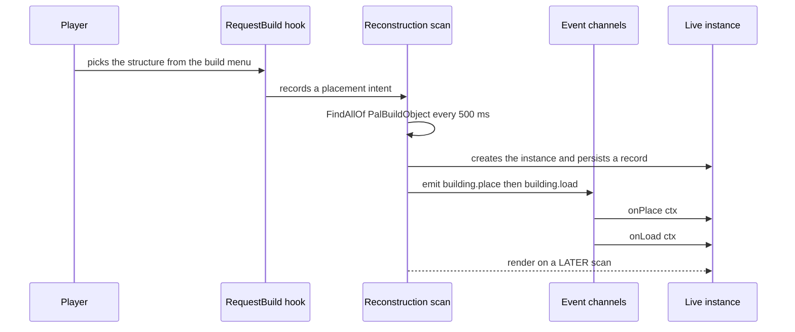
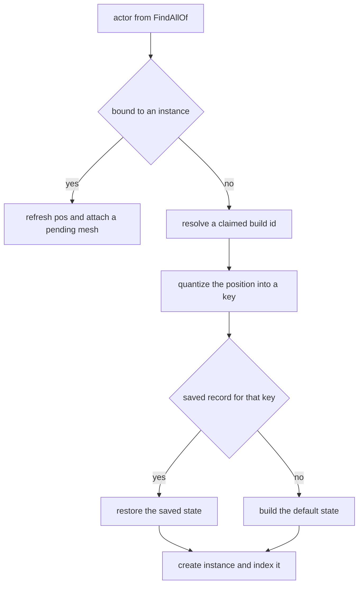
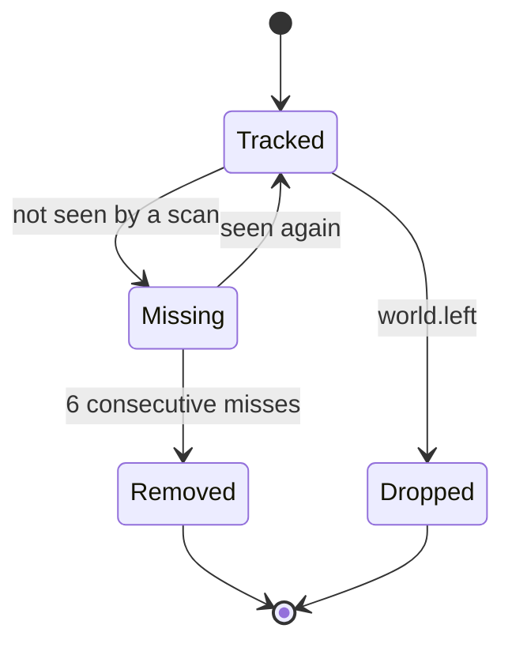

## What you can do after this page

- Give a workbench, chest or machine in your game behaviour of your own
- Run your code the moment a structure is placed, used or destroyed
- Store numbers on each structure and find them again the next time you play
- Put your own 3D model and colour on a structure standing in the world
- Make a structure do work on a timer while you play

## Defining a building

A building is anything you pick from the build menu and set down in the world: workbenches,
chests, machines, decorations. Once one is standing there, PalForge gives it a live object of
its own — its own position, its own saved data, and the handlers you wrote.

```lua
local api      = require("palforge.api")   -- also installs the bare globals
local Building = api.Building
```

There are three things you do with `Building`:

```lua
local bench = Building{ id = "example:Bench", name = "Modded Bench" }   -- define
local box   = Building.get("PalBoxV2")                                 -- look one up
local all   = Building.get_all()                                       -- every registered one
```

The only required field is `id`.

```lua
Building{ id = "WorkBench" }
```

That one call is what puts the id on PalForge's watch list. The scan that finds placed
structures in the world only tracks build ids you have defined. `Building.get(id)` on an id
nobody defined still hands back a handle you can call methods on, but it does not add the id
to the list, so `:instances()` on it stays empty.

A full definition reads as one table:

```lua title="content/buildings/bench.lua"
local bench = Building{
    id           = "example:Bench",
    name         = "Modded Bench",
    description  = "A bench that counts how often it is used.",
    gridCm       = 100,
    tickInterval = 4,
    mesh = {
        kind  = "static",
        model = "/Game/Pal/Model/Prop/Architecture/WorkBenchPrimitive/SM_WorkBenchPrimitive.SM_WorkBenchPrimitive",
    },
    color  = { r = 0.8, g = 0.3, b = 0.1, a = 1.0 },
    state  = function() return { uses = 0 } end,
    events = {
        onPlace      = function(self, ctx) self:save() end,
        onRightClick = function(self, ctx)
            self.state.uses = self.state.uses + 1
            self:save()
        end,
    },
    data = { tier = 2 },
}
```

The mesh — the 3D model the placed structure wears — can be written inline, or reused from a
named `Mesh{ ... }` definition. Both go through the same checks.

<Tabs items={['Inline', 'Named']}>
<Tab value="Inline">

```lua
Building{
    id = "example:Bench",
    mesh = {
        kind  = "static",
        model = "/Game/Pal/Model/Prop/Architecture/WorkBenchPrimitive/SM_WorkBenchPrimitive.SM_WorkBenchPrimitive",
    },
}
```

An inline table that leaves out `kind` gets `"static"`, the `Building.Spec.Mesh` default.

</Tab>
<Tab value="Named">

```lua
local benchMesh = Mesh{
    id    = "example:bench_body",
    kind  = "static",   -- declare it: Mesh.Spec defaults kind to "skeletal"
    model = "/Game/Pal/Model/Prop/Architecture/WorkBenchPrimitive/SM_WorkBenchPrimitive.SM_WorkBenchPrimitive",
}

Building{ id = "example:Bench", mesh = benchMesh }
Building{ id = "example:Bench2", mesh = Mesh.get("example:bench_body") }
```

A named mesh is checked against `Mesh.Spec` first, and that fills `kind` with `"skeletal"`
before the building ever sees the table. The building default cannot apply any more, so write
`kind` yourself when you nest a named mesh into a building.

</Tab>
</Tabs>

### Ids

An id without a colon is a literal game `BuildObjectId` — `"WorkBench"`, `"PalBoxV2"`,
`"ItemChest"`. An id written as `"pack:name"` becomes the row name `pack_name` in the game's
own data tables. That resolved name is what `:unlock()` unlocks, and what the runtime matches
a placed structure against.

<Callout type="warn">
Defining does not add a new entry to the build menu. Lua alone cannot add a row to the game's
data tables — that is PalSchema's job. What a definition does is give an id that already
exists behaviour, saved data, a model and metadata.
</Callout>

Defining the same id twice replaces the earlier one. Palworld's own catalog loads before your
pack code, so a pack that defines `WorkBench` takes over from `native.buildings.WorkBench`,
mesh included — restate anything you still want.

### The native catalog

`native/buildings.lua` carries every `DT_BuildObjectDataTable_Common` row id as plain data,
plus two ready-made definitions.

```lua
local buildings = require("palforge.native.buildings")

buildings.WorkBench          -- curated handle for "WorkBench" (BP_BuildObject_WorkBench_C)
buildings.PalBox             -- curated handle for "PalBoxV2"
buildings.get("ItemChest")   -- defines + registers on first use, then cached; nil for an unknown id
buildings.CATALOG            -- the id list, as data
```

Requiring the module registers only those two. `get(id)` is what turns a catalog id into a
real definition, so startup never registers the hundreds of rows.

## Spec fields

Everything you can pass to `Building{ ... }`. Most buildings need only `id`, then `state` and
`events` once you want them to do something.

<TypeTable
  type={{
    id: { description: 'A game BuildObjectId such as PalBoxV2, or pack:name', type: 'string', required: true },
    name: { description: 'Shown in UI', type: 'string', default: 'the id' },
    description: { description: 'One-line description, for UI and tooling', type: 'string' },
    gridCm: { description: 'Placement grid quantum in cm', type: 'number', default: '100 from core.spatial.GRID_CM' },
    buildIds: { description: 'The game build ids this definition claims; replaces the default list', type: 'string[]', default: '{ id }' },
    tickInterval: { description: 'Run onTick every N heartbeats', type: 'number', default: '1' },
    mesh: { description: 'The mesh attached to the placed actor, inline or a Mesh handle', type: 'Building.Spec.Mesh' },
    material: { description: 'Material override applied to that mesh', type: 'Building.Spec.Material' },
    color: { description: 'Base tint r, g, b, a in 0..1; shorthand for material.color', type: 'table' },
    texture: { description: 'Absolute png path applied to the mesh; shorthand for material.texture', type: 'string' },
    icon: { description: 'Fallback icon used when the DataTable lookup misses', type: 'any' },
    state: { description: 'Default saved state for a new structure: a table, or a factory returning one', type: 'table | fun(): table' },
    events: { description: 'Lifecycle handlers, grouped', type: 'Building.Spec.Events' },
    data: { description: 'Free-form payload of your own, carried onto the definition', type: 'table' },
  }}
/>

Every problem is a hard error, so a call never half-succeeds. A misspelled field tells you the
name it expected:

```lua
Building{ id = "example:Bench", grid = 100 }
```

```text
PalForge: Building: unknown field "grid" (did you mean "gridCm"?). Valid fields: id, name, description, gridCm, buildIds, tickInterval, mesh, material, color, texture, icon, state, events, data
```

```text
PalForge: Building: field "id" is required (build id: a game BuildObjectId ("PalBoxV2") or "pack:name")
PalForge: Building: field "mesh" (Building.Spec.Mesh): field "model" is required (UStaticMesh asset path, or an OBJ path for the procedural backend)
```

Rather than memorise the list, print it while the game runs:

```lua
local schema = require("palforge.core.schema")

print(schema.help("Building.Spec"))
print(schema.help("Building.Spec.Events"))
schema.get("Building.Spec").fields   -- the same, as a table, for tooling
```

### state — a table or a factory

`state` is the data a **new** structure starts with. PalForge writes it to disk for you and
hands it back the next time you play. It is read once: when the scan first creates a structure
for which no saved record exists.

```lua
state = { uses = 0 }                       -- a table
state = function() return { uses = 0 } end -- a factory, called per new instance
```

The factory is called with the definition class as its argument, so
`state = function(cls) ... end` works too. If it throws, or returns something that is not a
table, the structure starts with an empty table.

<Callout type="warn">
Prefer the factory. A plain table is stored on the definition and handed to every new
structure by reference — two structures placed from the same definition then share one state
table, and both saved records point at it. The factory builds a fresh table per structure.
</Callout>

State is saved as JSON, so keep it to strings, numbers, true/false and nested tables of those.
A restored structure gets exactly the record that was saved — the default state is not merged
in — so a field you add in a later version needs a guard:

```lua
onLoad = function(self, ctx)
    self.state.uses  = self.state.uses  or 0
    self.state.tier  = self.state.tier  or 1   -- added in a later version of the pack
end,
```

### gridCm — how a structure is recognised again

A placed structure carries no stable id of its own, so PalForge identifies one by rounding its
world position to a grid cell. `core/spatial` rounds each axis with
`math.floor(v / gridCm + 0.5)` and writes the result as `buildId@qx,qy,qz`:

```text
WorkBench@1234,-56,78
```

`gridCm` defaults to `core.spatial.GRID_CM`, which is `100` — one metre. That key names the
saved record, so it is what reattaches saved data to a structure found again in your next
session. A smaller cell separates structures that stand close together; a larger one tolerates
more drift in the reported position between sessions. Two structures whose positions land in
the same cell collide on the key: the scan keeps the structure bound to the first valid actor
and skips the second.

While you are playing, a structure is tracked by its actor — the object the game put in the
world — not by that key. A placed structure's reported location moves by more than a cell
between scans, so tracking by actor is what stops one structure turning into an endless stream
of new ones.

### buildIds — claiming more than one game id

`buildIds` is the list of game build ids this definition answers for. It **replaces** the
default `{ id }`, so include the id itself if you still want it matched:

```lua
Building{
    id       = "example:Chests",
    name     = "Instrumented Chests",
    buildIds = { "ItemChest", "ItemChest_02", "ItemChest_03" },
    events   = {
        onRightClick = function(self, ctx)
            log.info("opened " .. self.buildId)   -- the id this instance matched
        end,
    },
}
```

Each entry goes through `object_manager.resolve` (so `"pack:name"` becomes `pack_name`) and is
indexed to this definition. A placed structure records the one it matched in `self.buildId`,
while `self.id` stays the definition id.

Matching is tried three ways, in order: the actor's class name `BP_BuildObject_<Id>_C`, then
`MapObjectModel.BuildObjectId`, then a position match against a saved record. The first way
works only if the id is spelled the way the blueprint spells it — that is why the ready-made
definition uses `"WorkBench"` while the data table row is spelled `Workbench`.

### mesh and material

`Building.Spec.Mesh` is the shape described on [Mesh](/docs/api/mesh), with one change: `kind`
defaults to `"static"` rather than `"skeletal"`. `material`, `color` and `texture` layer over
whatever the mesh declares: `Class:material()` returns the declared `material` table, or builds
one from `color` / `texture` when you used the shorthands, and `Class:render()` lets the
material win field by field.

Two of the three backends behind `kind` attach for real on a placed structure. `static` — the
default here — adds a `UStaticMeshComponent`, finds `model` through `LoadAsset` with a
`StaticFindObject` fallback, sets the asset, and then reads it back off the component before
reporting success, so a game build where the setter is missing gets an honest `false` and no
orphaned component left behind. `procedural` (also spelled `obj`) reads a Wavefront OBJ file
from disk at `model` and adds a ProceduralMeshComponent. Both turn collision off — a decorative
collider would block the raycast the game uses to place the structure — and both set the world
scale explicitly, because the empty transform handed to `AddComponentByClass` starts it at
zero.

```lua
-- a UE-authored asset, the Building.Spec.Mesh default kind
mesh = {
    kind  = "static",
    model = "/Game/Pal/Model/Other/PalBox/SM_PalBox.SM_PalBox",
    scale = 1.0,
    offset = { x = 0, y = 0, z = 50 },
},

-- an OBJ file, parsed from disk when the mesh attaches
mesh = {
    kind  = "procedural",
    model = "C:/mods/example/models/bench.obj",
    scale = 1.0,
    offset = { x = 0, y = 0, z = 50 },
},
```

The ready-made `WorkBench` and `PalBoxV2` declare `static` meshes, so they attach on the scan
after the one that first sees the actor.

<Callout type="warn">
`skeletal` swaps the asset on the pawn's own `Mesh` component. A build object does not carry
one, so a structure declaring `kind = "skeletal"` attaches nothing and its `render()` returns
`false`. That backend is also unconfirmed in-game — it reports which setter executed, not that
anything rendered.
</Callout>

## The live instance

Nothing you define is alive until a real structure stands in the world. Here is what happens
when you place one.



The model appears one scan after the structure does, not the instant it is placed. Adding a
component to an actor that is still setting itself up — the frame it is placed — can touch an
invalid game object and crash the game, so the structure is marked pending and gets its model
on the next scan that sees the same actor again.

How a scan decides what it is looking at:



`building.place` is emitted only when a fresh structure is matched to a recorded placement
request for the same build id within 300 cm. Every structure the scan newly tracks then emits
`building.load` — including the one that just emitted `building.place` — with
`ctx.reconstructed` telling you whether it came from a saved record. A structure is created
once per key, so `onPlace` fires exactly once per placement.

### Instance fields

<TypeTable
  type={{
    id: { description: 'The definition id, resolved through the class', type: 'string' },
    buildId: { description: 'The game build id this instance matched', type: 'string' },
    key: { description: 'The registry and persistence key, buildId@qx,qy,qz', type: 'string' },
    actor: { description: 'The placed APalBuildObject', type: 'any' },
    pos: { description: 'World position x, y, z in cm, refreshed every scan', type: 'table' },
    cell: { description: 'The quantized cell qx, qy, qz the key was built from', type: 'table' },
    state: { description: 'Your saved table; change it in place, then save', type: 'table' },
    def: { description: 'The internal def: resolved buildIds, gridCm, tickInterval, hooks', type: 'table' },
  }}
/>

Anything the definition declared is reachable through the class, so `self.name`, `self.data`,
`self.gridCm` and the rest resolve on the placed structure too.

### Instance methods

```lua
self:save()        -- stage state and write the json file now
self:setDirty()    -- stage only; written by the next save or on world.left
self:isValid()     -- is self.actor still a valid engine object
self:render()      -- attach mesh + material once; false without a valid actor or a model
self:update()      -- re-tint the live material from self:currentColor()
self:mesh()        -- the declared mesh table
self:material()    -- the declared material, or one built from color / texture
self:iconOf()      -- DT_BuildObjectIconDataTable lookup, falling back to the declared icon
```

`currentColor()` returns `self.color`, which is the definition's tint by default. Set the field
on the structure itself to make the look follow the state, then push it:

```lua
onTick = function(self, ctx)
    self.color = self.state.running
        and { r = 0.2, g = 0.9, b = 0.3, a = 1.0 }
        or  { r = 0.4, g = 0.4, b = 0.4, a = 1.0 }
    self:update()
end,
```

<Callout type="info">
`update()` goes through `core/mesh`, which remembers which backend dressed each actor and sends
the re-tint back to that same backend. Only `procedural` implements one, writing to the
material instance it created on attach. A `static` mesh attaches but has no re-tint, so
`update()` returns `false` there.
</Callout>

### Saving state

State lives in one JSON file per world, written by `utils/file` into the mod's `state`
directory:

```text
<UE4SS Mods>/PalForge/state/entities_<saveId>.json
```

`saveId` comes from `core/spatial`: `w_` plus the game instance's `WorldGuid`,
`WorldSaveName` or `SaveName` with anything that is not a letter, digit or underscore replaced
by `_`, and plain `world` when none of them can be read. The file holds one record per
structure key:

```json
{
  "version": 1,
  "entities": {
    "WorkBench@1234,-56,78": {
      "buildId": "WorkBench",
      "pos": { "x": 123400.0, "y": -5600.0, "z": 7800.0 },
      "state": { "uses": 3 },
      "altKeys": {}
    }
  }
}
```

A record's `state` is the same table as `inst.state`, so changing it in place is enough to
change what will be written. Nothing writes on its own:

- `self:setDirty()` marks the world cache dirty. Cheap.
- `self:save()` marks it dirty and writes the file straight away.
- Leaving the world writes once, then drops the live structures and keeps every record.

Call `save()` when the change matters and `setDirty()` in a hot loop, otherwise a `save()` on
every tick writes the file on every heartbeat.

Records are deleted only on real removal. A structure the scan fails to see for six scans in a
row — about three seconds at the 500 ms cadence — emits `building.remove` and is dropped along
with its record.



`Removed` deletes the saved record. `Dropped` keeps it, so the structure comes back with its
data on the next load.

### Reaching the instances

```lua
local event = require("palforge.core.event")

Building.get("example:Kiln"):instances()   -- every live instance of one definition
event.instances()                          -- every live instance, any definition
event.instances("example:Kiln")            -- filtered by definition id or matched build id
event.instanceOfActor(ctx.actor)           -- the instance bound to an actor, or nil
event.isWorldReady()                       -- has the world finished loading
```

`:instances()` is empty until the scan has run, and the scan needs a loaded world: a watch
polls for a valid `PalPlayerCharacter` once a second and only opens the gate after five
successful polls in a row.

## Lifecycle events

Handlers go under `events`. The first argument is the placed structure the event happened to,
so `self.state`, `self.pos` and `self.actor` are right there. `onBuild` is the one exception,
because it fires before anything is standing in the world.

```lua
events = {
    onRightClick = function(self, ctx)   -- self is a Building.Instance
        log.info(self.key .. " at " .. tostring(self.pos.x))
    end,
}
```

| Event | Channel | Fires | ctx |
| --- | --- | --- | --- |
| `onPlace` | `building.place` | LIVE | `key`, `actor`, `pos`, `buildId`, `player`, `firstSeen` |
| `onLoad` | `building.load` | LIVE | `key`, `actor`, `pos`, `buildId`, `reconstructed` |
| `onRightClick` | `building.interact` | LIVE | `actor`, `player`, `buildId` |
| `onRemove` | `building.remove` | LIVE | `key`, `buildId`, `actor`, `reason` |
| `onTick` | `tick` | LIVE | `count`, `now` |
| `onBuild` | `building.build` | LIVE, once the world has loaded | `buildId`, `model` |
| `onWorldReady` | `world.ready` | LIVE | empty table |
| `onWorldLeft` | `world.left` | LIVE | empty table |
| `onLeftClick` | — | never | — |
| `onBreak` | — | never | — |

<Callout type="warn">
`onLeftClick` and `onBreak` can be declared, but nothing in the game emits them, so they never
run. Use `onRightClick` for interaction and `onRemove` for a structure that disappears.
</Callout>

### onPlace

Fires once, on the scan that discovers the new actor and matches it to a placement request
recorded by the `RequestBuild_ToServer` hook. `ctx.player` is the `PalPlayerCharacter` the hook
saw when it recorded the request, `ctx.firstSeen` is always `true`, and `ctx.pos` is the
actor's real location, not the requested one.

```lua
onPlace = function(self, ctx)
    self.state.owner = tostring(ctx.player)
    self:save()
end,
```

### onLoad

Fires for every structure the scan starts tracking, including the one it just fired `onPlace`
for. `ctx.reconstructed` is `true` when the state came from a saved record and `false` for a
brand-new structure. This is the place for per-structure startup work.

```lua
onLoad = function(self, ctx)
    if ctx.reconstructed then
        log.info(self.key .. " restored with " .. tostring(self.state.uses) .. " use(s)")
    end
    self:render()   -- normally unnecessary; the scan renders on its next pass
end,
```

### onRightClick

Driven by `PalBuildObject:OnBeginInteractBuilding`. Only `PalCharacter` subclasses count as the
one interacting, so building-to-building interactions never reach you, and repeat interactions
on the same actor are ignored for one second. The structure is found from `ctx.actor`.

```lua
onRightClick = function(self, ctx)
    Item.get("Wood"):give(1)
    log.info(tostring(ctx.player) .. " used " .. self.buildId)
end,
```

### onRemove

`ctx.reason` is `"missing"`, the only reason the runtime gives today. The structure is still
tracked while your handler runs, so `self.state` and `self.pos` are readable; the record is
deleted immediately afterwards.

```lua
onRemove = function(self, ctx)
    log.info(string.format("%s gone after %d use(s)", self.key, self.state.uses or 0))
end,
```

### onTick

The heartbeat is `LoopAsync(500)`, published on the `tick` channel, and `ctx.count` is the
heartbeat number. Only structures whose definition actually writes an `onTick` are put on the
tick list, so declaring nothing costs nothing.

`tickInterval` divides that count: the handler runs when `ctx.count % tickInterval == 0`.

```lua
Building{
    id           = "example:Kiln",
    tickInterval = 20,   -- 20 heartbeats -> about 10 seconds
    events = {
        onTick = function(self, ctx)
            if not self:isValid() then return end
            log.info("tick " .. tostring(ctx.count))
        end,
    },
}
```

A `tickInterval` that is not a whole number, or is below 1, is rounded back up to `1`.

<Callout type="warn">
`onTick` has a circuit breaker. Every failure is logged and counted; after five failures the
structure is marked broken and stops ticking for the rest of its life, which means the rest of
the session unless it is removed and found again. One success resets the counter. Keep the
handler defensive — check `self:isValid()` before touching `self.actor`.
</Callout>

### onBuild

Fires when the game finishes building a structure whose build id this definition claims. It
arrives up to one scan before the placed structure exists, and the game hands over a
`UPalMapObjectModel` rather than the actor, so `self` here is the **definition**, not a placed
structure: `self.id`, `self.name`, `self.data` and `self:iconOf()` are there, while
`self.actor`, `self.pos`, `self.state` and `self:save()` are not.

```lua
Building{
    id = "example:Bench",
    events = {
        onBuild = function(self, ctx)
            log.info(self.id .. " completed as " .. tostring(ctx.buildId))
        end,
    },
}
```

<Callout type="warn">
`onBuild` only starts listening once the world has finished loading. Its native hook,
`PalPlayerRecordData:OnCompleteBuild_ServerInternal`, also fires for every structure that
already exists during the world-load rush, and reading a half-built `UPalMapObjectModel` there
faults in a way Lua cannot catch. Two things follow. In a session where the world never
finishes loading, `onBuild` never runs at all. And on a second world load in the same session
it is already listening, so it will be called during that rush. `onPlace` stays the safe
placement hook; try `onBuild` in a throwaway world first.
</Callout>

### onWorldReady and onWorldLeft

Both go to every live structure, and both are world-load moments rather than per-structure
ones.

`world.ready` arrives from the scan that turns actors into live structures, not the instant the
world opens. So the structures around the player are already tracked when your handler runs,
and they have already had their `onLoad` in that same pass. The wait is at most one scan —
500 ms — after the world opened.

```lua title="content/buildings/sessions.lua"
Building{
    id     = "WorkBench",
    name   = "Workbench",
    state  = function() return { uses = 0, sessions = 0 } end,
    events = {
        onLoad = function(self, ctx)
            self.state.uses = self.state.uses or 0        -- per-instance startup
        end,
        onWorldReady = function(self, ctx)
            self.state.sessions = (self.state.sessions or 0) + 1
            self:save()
            log.info(string.format("%s present at load %d, %d use(s)",
                self.key, self.state.sessions, self.state.uses))
        end,
    },
}
```

<Callout type="warn">
`onWorldReady` fires once per world load, on the structures that first scan found. A structure
that streams in on a later scan misses it, and so does anything you place during the session.
Per-structure startup work belongs in `onLoad`, which fires for every structure the scan
tracks. Leaving the world before that first scan completes cancels the announcement, so a world
you passed through never announces itself.
</Callout>

`onWorldLeft` runs while the structures are still live and before they are dropped, so it is
the last chance to touch state — though the world cache is written for you right afterwards.

### Subscribing to the channels directly

PalForge listens on these channels to call your handlers, and you can listen too. Use it for
logic that spans many buildings at once:

```lua
local event = require("palforge.core.event")

event.on("building.place", function(ctx)
    log.info("placed " .. tostring(ctx.buildId) .. " -> " .. tostring(ctx.key))
end)

event.observable("building.interact")
    :filter(function(ctx) return ctx.buildId == "PalBoxV2" end)
    :subscribe(function(ctx) log.info("pal box opened") end)

local sub = event.every(5000, function() log.info("five seconds") end)
sub:unsubscribe()
```

`event.every(ms, fn)` is rounded to the 500 ms heartbeat, like the scan itself.

## Handle actions and queries

`Building{ ... }`, `Building.get` and `Building.get_all` all hand you a `Building.Handle`. It
stands for the definition: use it to read what you declared, and to reach the structures placed
from it.

```lua
local box = Building.get("PalBoxV2")

box:name()          --> "Pal Box" for the curated definition, else the id
box:description()   --> the declared description, or nil
box:gridCm()        --> the declared quantum, or nil when the runtime default applies
box:mesh()          --> the declared mesh table, or nil
box:iconOf()        --> a texture ref from DT_BuildObjectIconDataTable, else the declared icon
```

### unlock

```lua
Building.get("example:Bench"):unlock()
```

Unlocks the technology row named after the resolved id (`example_Bench`) through
`PalCheatManager:UnlockOneTechnology`. That is how a building tech injected by PalSchema gets
into the build menu. Returns `false` and logs when no cheat manager is available.

### instances, render, update

```lua
local kiln = Building.get("example:Kiln")

#kiln:instances()   --> how many are placed in this world
kiln:render()       --> attach the mesh to every live instance; returns how many attached
kiln:update()       --> re-tint every live instance; returns how many were re-tinted
```

Both counts come from the per-structure method's own return value, not from whether the call
survived. A structure whose backend declined is not counted: no `model` in the mesh, an asset
that will not resolve, a `kind` that cannot dress a build object, no colour to apply, no live
material instance to write to. So `render()` returning `0` over a non-empty `:instances()`
means nothing attached, not that nothing threw.

`render()` is normally unnecessary — the scan attaches the mesh one pass after it first sees
the actor. Reach for it after changing what `mesh()` returns while the game runs.

### The event forwarders

The handle also carries `:onPlace(ctx)`, `:onLoad(ctx)`, `:onRightClick(ctx)`,
`:onLeftClick(ctx)`, `:onBuild(ctx)`, `:onBreak(ctx)`, `:onRemove(ctx)` and `:onTick(ctx)`, so
you can run a handler yourself.

<Callout type="warn">
A forwarder calls the handler with the definition **class** as `self`, not a placed structure.
`self.state`, `self.actor`, `self.key` and `self:save()` are absent there. That matches the
real event for `onBuild` and for nothing else, so use the forwarders to test a handler on its
own, and the real event — or an instance from `:instances()` — for anything else.
</Callout>

## Recipes

### A counter that persists across sessions

Place a workbench, use it a few times, quit, come back — the count is still there.

```lua title="content/buildings/counter.lua"
local api = require("palforge.api")
local log = require("palforge.utils.log").scope("counter")

local Building = api.Building

return Building{
    id     = "WorkBench",
    name   = "Workbench",
    gridCm = 100,
    state  = function() return { uses = 0 } end,
    events = {
        onLoad = function(self, ctx)
            self.state.uses = self.state.uses or 0   -- records saved before the field existed
            log.info(string.format("%s reconstructed=%s uses=%d",
                self.key, tostring(ctx.reconstructed), self.state.uses))
        end,
        onRightClick = function(self, ctx)
            self.state.uses = self.state.uses + 1
            self:save()
            log.info(self.key .. " used " .. self.state.uses .. " time(s)")
        end,
        onRemove = function(self, ctx)
            log.info(string.format("%s removed after %d use(s), reason %s",
                self.key, self.state.uses or 0, tostring(ctx.reason)))
        end,
    },
}
```

The count survives because `onRightClick` calls `save()`. Without it the change would still be
visible in memory and would still be written the next time anything flushes the world file,
which is not a guarantee worth relying on.

### A machine that consumes an item on a timer

Right-click toggles it. While running it eats one Wood every ten seconds and yields one
Charcoal per three Wood.

```lua title="content/buildings/kiln.lua"
local api = require("palforge.api")
local log = require("palforge.utils.log").scope("kiln")

local Building, Item = api.Building, api.Item

local WOOD_PER_CHARCOAL = 3

return Building{
    id           = "example:Kiln",
    name         = "Slow Kiln",
    description  = "Burns wood into charcoal on its own.",
    gridCm       = 100,
    tickInterval = 20,                 -- 20 heartbeats -> about 10 seconds
    state        = function() return { wood = 0, charcoal = 0, running = true } end,
    events = {
        onPlace = function(self, ctx)
            log.info("kiln built at " .. self.key)
            self:save()
        end,
        onRightClick = function(self, ctx)
            self.state.running = not self.state.running
            self.color = self.state.running
                and { r = 0.9, g = 0.4, b = 0.1, a = 1.0 }
                or  { r = 0.3, g = 0.3, b = 0.3, a = 1.0 }
            self:update()
            self:save()
            log.info(self.key .. " running=" .. tostring(self.state.running))
        end,
        onTick = function(self, ctx)
            if not (self.state.running and self:isValid()) then return end
            if not Item.get("Wood"):take(1) then return end

            self.state.wood = self.state.wood + 1
            if self.state.wood >= WOOD_PER_CHARCOAL then
                self.state.wood     = self.state.wood - WOOD_PER_CHARCOAL
                self.state.charcoal = self.state.charcoal + 1
                Item.get("Charcoal"):give(1)
                log.info(string.format("%s produced charcoal #%d", self.key, self.state.charcoal))
            end
            self:setDirty()   -- staged; the next save or the world unload writes it
        end,
    },
}
```

<Callout type="info">
`:take` moves the count through the game's own server path and returns whether the call
executed, not whether the player actually had that much. Track what you consumed in `state` if
the machine needs a real balance.
</Callout>

### A structure that spawns a pal when interacted with

```lua title="content/buildings/summon_post.lua"
local api = require("palforge.api")
local log = require("palforge.utils.log").scope("summon")

local Building, Pal = api.Building, api.Pal

local COOLDOWN_TICKS = 60   -- heartbeats -> about 30 seconds

return Building{
    id     = "PalBoxV2",
    name   = "Pal Box",
    gridCm = 100,
    mesh   = {
        kind  = "static",
        model = "/Game/Pal/Model/Other/PalBox/SM_PalBox.SM_PalBox",
    },
    state = function() return { summons = 0, cooldown = 0 } end,
    events = {
        onTick = function(self, ctx)
            if (self.state.cooldown or 0) > 0 then
                self.state.cooldown = self.state.cooldown - 1
            end
        end,
        onRightClick = function(self, ctx)
            if (self.state.cooldown or 0) > 0 then
                log.info("on cooldown for " .. self.state.cooldown .. " more tick(s)")
                return
            end
            local at = { x = self.pos.x, y = self.pos.y + 300, z = self.pos.z + 100 }
            if Pal.get("ChickenPal"):spawn(at) then   -- issued; the pal arrives seconds later
                self.state.summons  = self.state.summons + 1
                self.state.cooldown = COOLDOWN_TICKS
                self:save()
                log.info(string.format("summon #%d from %s", self.state.summons, self.key))
            end
        end,
    },
}
```

The `if` runs its body as soon as the spawn call is issued, which is several seconds before the
pal turns up — so the counter and the cooldown move first and the creature follows. That is the
right order here: the post has committed to the summon. Defining `PalBoxV2` again replaces the
ready-made definition from `native/buildings.lua`, so the mesh is restated here. The vanilla pal box UI still opens — the interact hook watches the
call, it does not swallow it.

## Summary

- Write `Building{ ... }` to define one. Only `id` is required, and it has to be an id the game
  already has.
- Put anything you want remembered in `state`, change it in place, then call `self:save()`.
- Handlers go in `events`, and the first argument is the placed structure, so `self.state`,
  `self.pos` and `self.actor` are right there.
- `onPlace`, `onLoad`, `onRightClick`, `onRemove`, `onTick`, `onBuild`, `onWorldReady` and
  `onWorldLeft` all run. `onLeftClick` and `onBreak` never do.
- A structure is found again by its rounded world position, so `gridCm` decides how close two
  of them can stand.
- `Building.get(id):instances()` gives you every structure of that definition standing in the
  world right now.

Next, read [Item](/docs/api/item) for `:give` and `:take`, which is how a building hands things
to the player.
