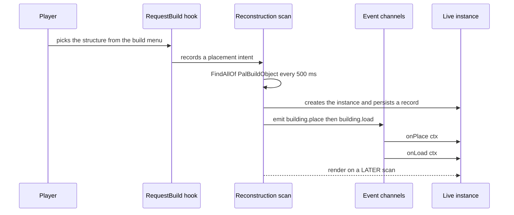
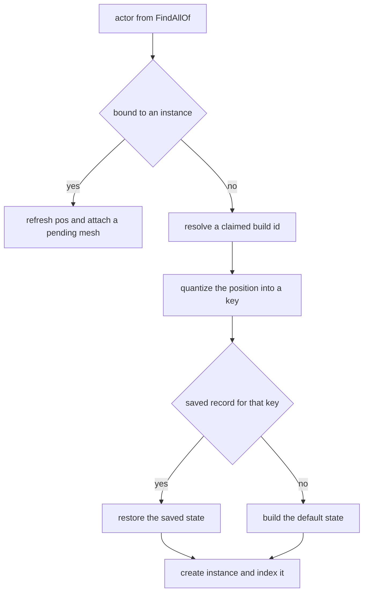
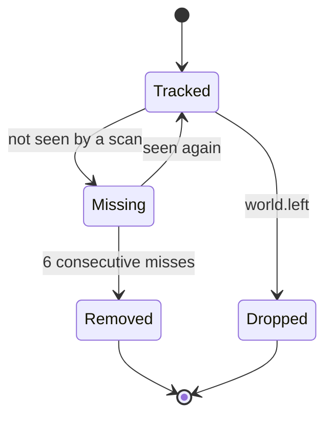

## 读完本页你可以做到

- 让游戏里的工作台、宝箱或机器带上你自己的行为
- 在建筑物被放下、被使用、被拆掉的那一刻运行你自己的代码
- 在每个建筑物上存数字，下次游玩时再找回来
- 给立在世界里的建筑物换上你自己的 3D 模型和颜色
- 让建筑物在你游玩期间按定时器干活

## 定义一个建筑物

建筑物就是你从建造菜单里选出来、放到世界里的东西：工作台、宝箱、机器、装饰。只要它立在那里，PalForge 就会给它一个专属的运行时对象：自己的坐标、自己的存档数据，还有你写的处理函数。

```lua
local api      = require("palforge.api")   -- also installs the bare globals
local Building = api.Building
```

用 `Building` 做三件事：

```lua
local bench = Building{ id = "example:Bench", name = "Modded Bench" }   -- define
local box   = Building.get("PalBoxV2")                                 -- look one up
local all   = Building.get_all()                                       -- every registered one
```

必须填的字段只有 `id`。

```lua
Building{ id = "WorkBench" }
```

这一次调用，就把这个 id 放进了 PalForge 的监视名单。在世界里寻找建筑物的那次扫描，只跟踪你定义过的 build id。对没人定义过的 id 调用 `Building.get(id)`，一样会给你一个能调方法的句柄，但不会把这个 id 加进名单，所以它的 `:instances()` 一直是空的。

完整的定义就是一张表：

```lua title="content/buildings/bench.lua"
local bench = Building{
    id           = "example:Bench",
    name         = "Modded Bench",
    description  = "A bench that counts how often it is used.",
    gridCm       = 100,
    tickInterval = 4,
    mesh = {
        kind  = "static",
        model = "/Game/Pal/Model/Prop/Architecture/WorkBenchPrimitive/SM_WorkBenchPrimitive.SM_WorkBenchPrimitive",
    },
    color  = { r = 0.8, g = 0.3, b = 0.1, a = 1.0 },
    state  = function() return { uses = 0 } end,
    events = {
        onPlace      = function(self, ctx) self:save() end,
        onRightClick = function(self, ctx)
            self.state.uses = self.state.uses + 1
            self:save()
        end,
    },
    data = { tier = 2 },
}
```

mesh 就是建好的建筑物身上穿的那个 3D 模型。它可以直接写在定义里，也可以复用一个具名的 `Mesh{ ... }` 定义。两种写法走同一套检查。

<Tabs items={['Inline', 'Named']}>
<Tab value="Inline">

```lua
Building{
    id = "example:Bench",
    mesh = {
        kind  = "static",
        model = "/Game/Pal/Model/Prop/Architecture/WorkBenchPrimitive/SM_WorkBenchPrimitive.SM_WorkBenchPrimitive",
    },
}
```

内联的表里不写 `kind` 时，会填上 `Building.Spec.Mesh` 的默认值 `"static"`。

</Tab>
<Tab value="Named">

```lua
local benchMesh = Mesh{
    id    = "example:bench_body",
    kind  = "static",   -- declare it: Mesh.Spec defaults kind to "skeletal"
    model = "/Game/Pal/Model/Prop/Architecture/WorkBenchPrimitive/SM_WorkBenchPrimitive.SM_WorkBenchPrimitive",
}

Building{ id = "example:Bench", mesh = benchMesh }
Building{ id = "example:Bench2", mesh = Mesh.get("example:bench_body") }
```

具名 mesh 会先按 `Mesh.Spec` 检查，那一步就把 `kind` 填成了 `"skeletal"`，之后建筑物才看到这张表。建筑物这边的默认值已经用不上了，所以把具名 mesh 放进建筑物时，请自己写上 `kind`。

</Tab>
</Tabs>

### id 的写法

不带冒号的 id 就是游戏里的 `BuildObjectId` 本身，比如 `"WorkBench"`、`"PalBoxV2"`、`"ItemChest"`。写成 `"pack:name"` 的 id，会变成游戏数据表里的行名 `pack_name`。解析出来的这个名字，既是 `:unlock()` 解锁的对象，也是运行时用来匹配建筑物的名字。

<Callout type="warn">
定义不会往建造菜单里加新条目。只靠 Lua 没法往游戏的数据表里加一行，那是 PalSchema 的活。定义做的事，是给一个已经存在的 id 加上行为、存档数据、模型和信息。
</Callout>

同一个 id 定义两次，后一次会替换前一次。Palworld 自带的目录比你的内容包代码先加载，所以定义了 `WorkBench` 的内容包会接管 `native.buildings.WorkBench`，连 mesh 一起换掉 —— 还想保留的东西请重新写一遍。

### 自带的目录

`native/buildings.lua` 把 `DT_BuildObjectDataTable_Common` 的每一个行 id 都当作纯数据带着，另外还有两个现成的定义。

```lua
local buildings = require("palforge.native.buildings")

buildings.WorkBench          -- curated handle for "WorkBench" (BP_BuildObject_WorkBench_C)
buildings.PalBox             -- curated handle for "PalBoxV2"
buildings.get("ItemChest")   -- defines + registers on first use, then cached; nil for an unknown id
buildings.CATALOG            -- the id list, as data
```

require 这个模块只会注册那两个。把目录里的 id 变成真正定义的是 `get(id)`，所以启动时不会一口气注册几百行。

## Spec 字段

下面是能传给 `Building{ ... }` 的全部内容。大多数建筑物只要 `id`；想让它做点什么的时候，再加上 `state` 和 `events`。

<TypeTable
  type={{
    id: { description: '游戏的 BuildObjectId，比如 PalBoxV2，或者 pack:name', type: 'string', required: true },
    name: { description: '显示在界面上', type: 'string', default: '与 id 相同' },
    description: { description: '一行说明，给界面和工具用', type: 'string' },
    gridCm: { description: '放置网格的量化单位，单位 cm', type: 'number', default: 'core.spatial.GRID_CM 的 100' },
    buildIds: { description: '这个定义认领的游戏 build id；会替换掉默认列表', type: 'string[]', default: '{ id }' },
    tickInterval: { description: '每 N 次心跳运行一次 onTick', type: 'number', default: '1' },
    mesh: { description: '挂到放好的 actor 上的 mesh，内联写法或 Mesh 句柄', type: 'Building.Spec.Mesh' },
    material: { description: '覆盖到这个 mesh 上的材质', type: 'Building.Spec.Material' },
    color: { description: '基础染色 r, g, b, a，取值 0..1；material.color 的简写', type: 'table' },
    texture: { description: '应用到 mesh 上的 png 绝对路径；material.texture 的简写', type: 'string' },
    icon: { description: 'DataTable 查不到时使用的备用图标', type: 'any' },
    state: { description: '新建筑物的初始存档状态：一张表，或者一个返回表的工厂函数', type: 'table | fun(): table' },
    events: { description: '生命周期处理函数，集中放在这里', type: 'Building.Spec.Events' },
    data: { description: '你自己的任意数据，会带到定义上', type: 'table' },
  }}
/>

任何问题都是硬错误，所以一次调用不会只成功一半。字段名写错时，它会告诉你它期待的名字：

```lua
Building{ id = "example:Bench", grid = 100 }
```

```text
PalForge: Building: unknown field "grid" (did you mean "gridCm"?). Valid fields: id, name, description, gridCm, buildIds, tickInterval, mesh, material, color, texture, icon, state, events, data
```

```text
PalForge: Building: field "id" is required (build id: a game BuildObjectId ("PalBoxV2") or "pack:name")
PalForge: Building: field "mesh" (Building.Spec.Mesh): field "model" is required (UStaticMesh asset path, or an OBJ path for the procedural backend)
```

与其背下这张表，不如在游戏运行时把它打印出来：

```lua
local schema = require("palforge.core.schema")

print(schema.help("Building.Spec"))
print(schema.help("Building.Spec.Events"))
schema.get("Building.Spec").fields   -- the same, as a table, for tooling
```

### state —— 一张表，或者一个工厂函数

`state` 是**新**建筑物一开始带的数据。PalForge 会替你写到磁盘上，下次游玩时再交回给你。它只被读一次：扫描第一次为一个还没有保存记录的建筑物建对象的时候。

```lua
state = { uses = 0 }                       -- a table
state = function() return { uses = 0 } end -- a factory, called per new instance
```

工厂函数被调用时会收到定义类作为参数，所以 `state = function(cls) ... end` 也能写。如果它抛错，或者返回的不是表，这个建筑物就从一张空表开始。

<Callout type="warn">
推荐用工厂函数。写成普通的表时，这张表存在定义上，并按引用交给每一个新建筑物 —— 同一个定义放下的两个建筑物就会共用同一张 state 表，两条保存记录也都指向它。工厂函数则给每个建筑物新建一张表。
</Callout>

状态按 JSON 保存，所以只放字符串、数字、true/false，以及由这些东西嵌套出来的表。恢复出来的建筑物拿到的正是当初保存下来的那条记录，默认的 state 不会被合并进去，所以你在后续版本里新加的字段需要自己兜底：

```lua
onLoad = function(self, ctx)
    self.state.uses  = self.state.uses  or 0
    self.state.tier  = self.state.tier  or 1   -- added in a later version of the pack
end,
```

### gridCm —— 怎么再次认出同一个建筑物

放好的建筑物自己没有一个稳定的 id，所以 PalForge 把它的世界坐标取整到一个网格单元来识别它。`core/spatial` 用 `math.floor(v / gridCm + 0.5)` 对每个轴取整，把结果写成 `buildId@qx,qy,qz`：

```text
WorkBench@1234,-56,78
```

`gridCm` 的默认值是 `core.spatial.GRID_CM`，也就是 `100`，一米。这个键就是保存记录的名字，所以下次游玩重新找到某个建筑物时，也是靠它把存档数据接回去。单元格小，挨得近的建筑物更容易被区分开；单元格大，则更能容忍两次游玩之间坐标的漂移。坐标落进同一个单元格的两个建筑物会撞键：扫描保留绑定到第一个有效 actor 的那个，跳过第二个。

你在游玩期间，建筑物是靠它的 actor 跟踪的，也就是游戏放进世界里的那个对象，而不是靠那个键。放好的建筑物在两次扫描之间报出的坐标会飘出一个单元格，所以按 actor 跟踪，才不会让一个建筑物变成源源不断的新建筑物。

### buildIds —— 认领多个游戏 id

`buildIds` 是这个定义负责的游戏 build id 列表。它会**替换**掉默认的 `{ id }`，所以还想让 id 本身被匹配到的话，请把它也写进列表：

```lua
Building{
    id       = "example:Chests",
    name     = "Instrumented Chests",
    buildIds = { "ItemChest", "ItemChest_02", "ItemChest_03" },
    events   = {
        onRightClick = function(self, ctx)
            log.info("opened " .. self.buildId)   -- the id this instance matched
        end,
    },
}
```

每一项都会经过 `object_manager.resolve`，所以 `"pack:name"` 会变成 `pack_name`，然后被索引到这个定义上。放好的建筑物会把匹配到的那个 id 记在 `self.buildId` 里，`self.id` 仍然是定义 id。

匹配按顺序试三种方式：actor 的类名 `BP_BuildObject_<Id>_C`，然后是 `MapObjectModel.BuildObjectId`，最后是拿保存记录做坐标匹配。第一种只有在 id 的拼写和蓝图里的拼写一致时才管用 —— 这就是数据表的行写作 `Workbench`，而现成的定义用 `"WorkBench"` 的原因。

### mesh 和 material

`Building.Spec.Mesh` 就是 [Mesh](/docs/api/mesh) 里讲的那个形状，只有一处不同：`kind` 的默认值是 `"static"`，不是 `"skeletal"`。`material`、`color` 和 `texture` 会叠在 mesh 声明的内容之上：`Class:material()` 返回声明的 `material` 表，你用了简写时它就用 `color` / `texture` 拼一张出来；而 `Class:render()` 会让 material 这边逐个字段胜出。

`kind` 背后的三个后端里，只有两个能真的挂到放好的建筑物上。这里的默认值 `static` 会加一个 `UStaticMeshComponent`，用 `LoadAsset` 找 `model`，失败时退回 `StaticFindObject`，设置好资源，再从组件上读回来确认之后才报告成功；所以在缺少这个 setter 的游戏版本上，你会诚实地拿到 `false`，也不会留下一个没人管的组件。`procedural`（也可以写成 `obj`）会从 `model` 指的磁盘路径读一个 Wavefront OBJ 文件，加一个 ProceduralMeshComponent。两个后端都会关掉碰撞，因为装饰用的碰撞体会挡住游戏放置建筑物时用的射线检测；两个也都会显式设置世界缩放，因为交给 `AddComponentByClass` 的空变换的缩放是从零开始的。

```lua
-- a UE-authored asset, the Building.Spec.Mesh default kind
mesh = {
    kind  = "static",
    model = "/Game/Pal/Model/Other/PalBox/SM_PalBox.SM_PalBox",
    scale = 1.0,
    offset = { x = 0, y = 0, z = 50 },
},

-- an OBJ file, parsed from disk when the mesh attaches
mesh = {
    kind  = "procedural",
    model = "C:/mods/example/models/bench.obj",
    scale = 1.0,
    offset = { x = 0, y = 0, z = 50 },
},
```

现成的 `WorkBench` 和 `PalBoxV2` 声明的都是 `static` mesh，所以它们会在第一次看到 actor 的那次扫描之后，下一次扫描时挂上。

<Callout type="warn">
`skeletal` 换的是 pawn 自己那个 `Mesh` 组件上的资源。build object 没有这个组件，所以声明了 `kind = "skeletal"` 的建筑物什么都挂不上，它的 `render()` 返回 `false`。这个后端本身在游戏里也还没被确认过 —— 它报告的是哪个 setter 执行了，不是真的画出来了。
</Callout>

## 运行中的实例

在真正的建筑物立到世界里之前，你定义的东西都还没活起来。放下一个的时候，发生的事情是这样的。



模型是在建筑物出现之后的下一次扫描里才出来的，不是放下的那一刻。给一个还在自我初始化的 actor 加组件，也就是它被放下的那一帧，可能碰到无效的游戏对象，把游戏搞崩；所以建筑物会被标成待处理，等下一次扫描再看到同一个 actor 时才挂上模型。

一次扫描是这样判断自己看到的是什么的：



只有当一个新建筑物在 300 cm 以内匹配上一条同 build id 的放置请求记录时，才会发出 `building.place`。扫描新跟踪到的每一个建筑物随后都会发出 `building.load`，包括刚刚发过 `building.place` 的那个，`ctx.reconstructed` 会告诉你它是不是来自保存记录。每个键只会建一次建筑物，所以 `onPlace` 每次放置刚好触发一次。

### 实例的字段

<TypeTable
  type={{
    id: { description: '定义 id，通过类解析出来', type: 'string' },
    buildId: { description: '这个实例匹配上的游戏 build id', type: 'string' },
    key: { description: '注册表和持久化用的键，buildId@qx,qy,qz', type: 'string' },
    actor: { description: '放好的 APalBuildObject', type: 'any' },
    pos: { description: '世界坐标 x, y, z，单位 cm，每次扫描刷新', type: 'table' },
    cell: { description: '生成这个键用的量化单元格 qx, qy, qz', type: 'table' },
    state: { description: '你的存档表；就地改，然后 save', type: 'table' },
    def: { description: '内部的 def：解析后的 buildIds、gridCm、tickInterval、钩子', type: 'table' },
  }}
/>

定义里声明的东西都能通过类拿到，所以 `self.name`、`self.data`、`self.gridCm` 这些，在放好的建筑物上也解析得出来。

### 实例的方法

```lua
self:save()        -- stage state and write the json file now
self:setDirty()    -- stage only; written by the next save or on world.left
self:isValid()     -- is self.actor still a valid engine object
self:render()      -- attach mesh + material once; false without a valid actor or a model
self:update()      -- re-tint the live material from self:currentColor()
self:mesh()        -- the declared mesh table
self:material()    -- the declared material, or one built from color / texture
self:iconOf()      -- DT_BuildObjectIconDataTable lookup, falling back to the declared icon
```

`currentColor()` 返回 `self.color`，默认就是定义里的染色。想让外观跟着状态走，就在建筑物自己身上设这个字段，然后推上去：

```lua
onTick = function(self, ctx)
    self.color = self.state.running
        and { r = 0.2, g = 0.9, b = 0.3, a = 1.0 }
        or  { r = 0.4, g = 0.4, b = 0.4, a = 1.0 }
    self:update()
end,
```

<Callout type="info">
`update()` 走的是 `core/mesh`。`core/mesh` 记得每个 actor 是被哪个后端穿上的，会把重新染色发回同一个后端。只有 `procedural` 实现了这一步，它写的是挂上去时创建的那个材质实例。`static` 的 mesh 挂得上，但没有重新染色，所以在它上面 `update()` 返回 `false`。
</Callout>

### 保存状态

状态存在每个世界一个的 JSON 文件里，由 `utils/file` 写进模组的 `state` 目录：

```text
<UE4SS Mods>/PalForge/state/entities_<saveId>.json
```

`saveId` 由 `core/spatial` 决定：取游戏实例的 `WorldGuid`、`WorldSaveName` 或 `SaveName`，把不是字母、数字、下划线的字符换成 `_`，再在前面加上 `w_`；三个都读不到时就是 `world`。文件里每个建筑物的键对应一条记录：

```json
{
  "version": 1,
  "entities": {
    "WorkBench@1234,-56,78": {
      "buildId": "WorkBench",
      "pos": { "x": 123400.0, "y": -5600.0, "z": 7800.0 },
      "state": { "uses": 3 },
      "altKeys": {}
    }
  }
}
```

记录里的 `state` 和 `inst.state` 是同一张表，所以就地改它，就足以改变将要写出的内容。但没有东西会自己去写：

- `self:setDirty()` 只把世界缓存标脏。开销很小。
- `self:save()` 标脏之后马上写文件。
- 离开世界时会写一次，然后丢掉运行中的建筑物，保留全部记录。

重要的改动用 `save()`，高频循环里用 `setDirty()`；不然每个 tick 都 `save()`，就会每次心跳都写一遍文件。

记录只在真的被拆除时才删。扫描连续六次没看到的建筑物 —— 按 500 ms 的节奏大约三秒 —— 会发出 `building.remove`，并连同它的记录一起被丢掉。



`Removed` 会删掉保存记录。`Dropped` 会留着，所以下次加载时，建筑物会连数据一起回来。

### 拿到这些实例

```lua
local event = require("palforge.core.event")

Building.get("example:Kiln"):instances()   -- every live instance of one definition
event.instances()                          -- every live instance, any definition
event.instances("example:Kiln")            -- filtered by definition id or matched build id
event.instanceOfActor(ctx.actor)           -- the instance bound to an actor, or nil
event.isWorldReady()                       -- has the world finished loading
```

扫描跑起来之前 `:instances()` 都是空的，而扫描需要一个加载完的世界：一个监视每秒查一次有没有有效的 `PalPlayerCharacter`，连续成功五次之后才放行。

## 生命周期事件

处理函数写在 `events` 下面。第一个参数就是事件发生在其上的那个建筑物，所以 `self.state`、`self.pos` 和 `self.actor` 直接就能用。唯一的例外是 `onBuild`，因为它触发时世界里还没有东西立着。

```lua
events = {
    onRightClick = function(self, ctx)   -- self is a Building.Instance
        log.info(self.key .. " at " .. tostring(self.pos.x))
    end,
}
```

| 事件 | 频道 | 触发 | ctx |
| --- | --- | --- | --- |
| `onPlace` | `building.place` | LIVE | `key`, `actor`, `pos`, `buildId`, `player`, `firstSeen` |
| `onLoad` | `building.load` | LIVE | `key`, `actor`, `pos`, `buildId`, `reconstructed` |
| `onRightClick` | `building.interact` | LIVE | `actor`, `player`, `buildId` |
| `onRemove` | `building.remove` | LIVE | `key`, `buildId`, `actor`, `reason` |
| `onTick` | `tick` | LIVE | `count`, `now` |
| `onBuild` | `building.build` | LIVE，世界加载完之后 | `buildId`, `model` |
| `onWorldReady` | `world.ready` | LIVE | 空表 |
| `onWorldLeft` | `world.left` | LIVE | 空表 |
| `onLeftClick` | — | 从不触发 | — |
| `onBreak` | — | 从不触发 | — |

<Callout type="warn">
`onLeftClick` 和 `onBreak` 可以写，但游戏里没有任何地方发出它们，所以它们永远不会运行。交互用 `onRightClick`，建筑物消失用 `onRemove`。
</Callout>

### onPlace

在发现新 actor、并把它和 `RequestBuild_ToServer` 钩子记下的放置请求匹配上的那次扫描里，触发一次。`ctx.player` 是钩子记录请求时看到的 `PalPlayerCharacter`，`ctx.firstSeen` 恒为 `true`，`ctx.pos` 是 actor 的真实坐标，不是请求里的那个。

```lua
onPlace = function(self, ctx)
    self.state.owner = tostring(ctx.player)
    self:save()
end,
```

### onLoad

扫描开始跟踪的每一个建筑物都会触发，包括刚刚触发过 `onPlace` 的那个。状态来自保存记录时 `ctx.reconstructed` 是 `true`，全新的建筑物则是 `false`。每个建筑物各自的初始化写在这里。

```lua
onLoad = function(self, ctx)
    if ctx.reconstructed then
        log.info(self.key .. " restored with " .. tostring(self.state.uses) .. " use(s)")
    end
    self:render()   -- normally unnecessary; the scan renders on its next pass
end,
```

### onRightClick

由 `PalBuildObject:OnBeginInteractBuilding` 驱动。只有 `PalCharacter` 的子类算作发起交互的一方，所以建筑物之间的交互传不到你这里；对同一个 actor 的重复交互，一秒之内会被忽略。建筑物是从 `ctx.actor` 找出来的。

```lua
onRightClick = function(self, ctx)
    Item.get("Wood"):give(1)
    log.info(tostring(ctx.player) .. " used " .. self.buildId)
end,
```

### onRemove

`ctx.reason` 是 `"missing"`，也是运行时目前给出的唯一原因。你的处理函数运行时，建筑物还在被跟踪，所以 `self.state` 和 `self.pos` 都读得到；记录紧接着就会被删掉。

```lua
onRemove = function(self, ctx)
    log.info(string.format("%s gone after %d use(s)", self.key, self.state.uses or 0))
end,
```

### onTick

心跳是 `LoopAsync(500)`，发布在 `tick` 频道上，`ctx.count` 是心跳的编号。只有定义里真的写了 `onTick` 的建筑物才会进 tick 名单，所以不写就不花任何开销。

`tickInterval` 是这个计数的除数：`ctx.count % tickInterval == 0` 时处理函数才运行。

```lua
Building{
    id           = "example:Kiln",
    tickInterval = 20,   -- 20 heartbeats -> about 10 seconds
    events = {
        onTick = function(self, ctx)
            if not self:isValid() then return end
            log.info("tick " .. tostring(ctx.count))
        end,
    },
}
```

不是整数、或者小于 1 的 `tickInterval`，会被抬回 `1`。

<Callout type="warn">
`onTick` 有熔断。每次失败都会记日志并计数；失败五次之后，这个建筑物会被标成坏掉，余下的生命里不再 tick —— 也就是本次游玩剩下的时间，除非它被拆掉又被重新找到。成功一次，计数就清零。处理函数请写得防御一点 —— 碰 `self.actor` 之前先查 `self:isValid()`。
</Callout>

### onBuild

游戏建完一个 build id 归这个定义认领的建筑物时触发。它最多比放好的建筑物早到一次扫描，而且游戏交过来的是 `UPalMapObjectModel` 而不是 actor，所以这里的 `self` 是**定义**，不是放好的建筑物：`self.id`、`self.name`、`self.data` 和 `self:iconOf()` 都在，`self.actor`、`self.pos`、`self.state` 和 `self:save()` 不在。

```lua
Building{
    id = "example:Bench",
    events = {
        onBuild = function(self, ctx)
            log.info(self.id .. " completed as " .. tostring(ctx.buildId))
        end,
    },
}
```

<Callout type="warn">
`onBuild` 要等世界加载完之后才开始监听。它的原生钩子 `PalPlayerRecordData:OnCompleteBuild_ServerInternal` 在世界加载那一波里，对已经存在的每一个建筑物也会触发，而在那里读一个只建了一半的 `UPalMapObjectModel`，会以 Lua 抓不住的方式崩掉。由此有两件事。世界始终没加载完的那次游玩里，`onBuild` 一次都不会运行。而在同一次游玩里第二次加载世界时，它已经在监听了，所以那一波里它会被调用。放置检测还是 `onPlace` 更安全；`onBuild` 请先在一个可以丢掉的世界里试。
</Callout>

### onWorldReady 和 onWorldLeft

两个都会送到每一个运行中的建筑物上，而且都是世界加载这一层的事件，不是每个建筑物各自的事件。

`world.ready` 来自把 actor 变成运行中建筑物的那次扫描，不是世界打开的那一刻。所以你的处理函数运行时，玩家周围的建筑物已经被跟踪了，它们的 `onLoad` 也在同一趟里跑完了。世界打开之后最多等一次扫描，也就是 500 ms。

```lua title="content/buildings/sessions.lua"
Building{
    id     = "WorkBench",
    name   = "Workbench",
    state  = function() return { uses = 0, sessions = 0 } end,
    events = {
        onLoad = function(self, ctx)
            self.state.uses = self.state.uses or 0        -- per-instance startup
        end,
        onWorldReady = function(self, ctx)
            self.state.sessions = (self.state.sessions or 0) + 1
            self:save()
            log.info(string.format("%s present at load %d, %d use(s)",
                self.key, self.state.sessions, self.state.uses))
        end,
    },
}
```

<Callout type="warn">
`onWorldReady` 每次加载世界只触发一次，对象是第一次扫描找到的那些建筑物。后面的扫描才流进来的建筑物收不到，你在本次游玩中放下的也收不到。每个建筑物各自的初始化归 `onLoad` 管，它对扫描跟踪到的每一个建筑物都会触发。第一次扫描完成之前就离开世界，这次通知会被取消，所以只是路过一下的世界不会宣告自己准备好了。
</Callout>

`onWorldLeft` 在建筑物还活着、还没被丢掉的时候运行，所以那是碰状态的最后机会 —— 不过紧接着世界缓存就会被自动写出去。

### 直接订阅这些频道

PalForge 就是靠监听这些频道来调用你的处理函数的，你也可以自己监听。适合写横跨很多建筑物的逻辑：

```lua
local event = require("palforge.core.event")

event.on("building.place", function(ctx)
    log.info("placed " .. tostring(ctx.buildId) .. " -> " .. tostring(ctx.key))
end)

event.observable("building.interact")
    :filter(function(ctx) return ctx.buildId == "PalBoxV2" end)
    :subscribe(function(ctx) log.info("pal box opened") end)

local sub = event.every(5000, function() log.info("five seconds") end)
sub:unsubscribe()
```

`event.every(ms, fn)` 和扫描本身一样，会被对齐到 500 ms 的心跳上。

## 句柄的操作与查询

`Building{ ... }`、`Building.get` 和 `Building.get_all` 都会给你一个 `Building.Handle`。它代表这个定义：用它读回你声明的内容，也用它拿到从这个定义放下的建筑物。

```lua
local box = Building.get("PalBoxV2")

box:name()          --> "Pal Box" for the curated definition, else the id
box:description()   --> the declared description, or nil
box:gridCm()        --> the declared quantum, or nil when the runtime default applies
box:mesh()          --> the declared mesh table, or nil
box:iconOf()        --> a texture ref from DT_BuildObjectIconDataTable, else the declared icon
```

### unlock

```lua
Building.get("example:Bench"):unlock()
```

通过 `PalCheatManager:UnlockOneTechnology`，解锁以解析后的 id（`example_Bench`）命名的科技行。由 PalSchema 注入的建筑物科技，就是这样进到建造菜单里的。拿不到作弊管理器时返回 `false` 并记日志。

### instances、render、update

```lua
local kiln = Building.get("example:Kiln")

#kiln:instances()   --> how many are placed in this world
kiln:render()       --> attach the mesh to every live instance; returns how many attached
kiln:update()       --> re-tint every live instance; returns how many were re-tinted
```

这两个数都来自每个建筑物那个方法自己的返回值，不是看调用有没有活着回来。后端拒绝处理的建筑物不算数：mesh 里没有 `model`、资源解析不出来、`kind` 没法给 build object 穿衣服、没有颜色可涂、没有可写入的运行中材质实例。所以 `:instances()` 非空而 `render()` 返回 `0`，意思是什么都没挂上，不是没抛异常。

`render()` 平时用不上 —— 扫描会在第一次看到 actor 之后的下一趟里把 mesh 挂上。只有在游戏运行时改了 `mesh()` 的返回内容之后，才需要它。

### 事件转发器

句柄上还有 `:onPlace(ctx)`、`:onLoad(ctx)`、`:onRightClick(ctx)`、`:onLeftClick(ctx)`、`:onBuild(ctx)`、`:onBreak(ctx)`、`:onRemove(ctx)` 和 `:onTick(ctx)`，你可以自己运行某个处理函数。

<Callout type="warn">
转发器调用处理函数时，`self` 是定义**类**，不是放好的建筑物。那里没有 `self.state`、`self.actor`、`self.key`，也没有 `self:save()`。这一点只有 `onBuild` 和真实事件一致，别的都不一致，所以转发器只用来单独测试一个处理函数；其他场合请用真实事件，或者用 `:instances()` 拿到的实例。
</Callout>

## 实用示例

### 关掉游戏也还在的计数器

放一个工作台，用几次，退出游戏，再回来 —— 计数还在。

```lua title="content/buildings/counter.lua"
local api = require("palforge.api")
local log = require("palforge.utils.log").scope("counter")

local Building = api.Building

return Building{
    id     = "WorkBench",
    name   = "Workbench",
    gridCm = 100,
    state  = function() return { uses = 0 } end,
    events = {
        onLoad = function(self, ctx)
            self.state.uses = self.state.uses or 0   -- records saved before the field existed
            log.info(string.format("%s reconstructed=%s uses=%d",
                self.key, tostring(ctx.reconstructed), self.state.uses))
        end,
        onRightClick = function(self, ctx)
            self.state.uses = self.state.uses + 1
            self:save()
            log.info(self.key .. " used " .. self.state.uses .. " time(s)")
        end,
        onRemove = function(self, ctx)
            log.info(string.format("%s removed after %d use(s), reason %s",
                self.key, self.state.uses or 0, tostring(ctx.reason)))
        end,
    },
}
```

计数能留下来，是因为 `onRightClick` 调了 `save()`。不调的话，改动在内存里照样看得见，也会在下一次有什么东西刷写世界文件时被写出去，但这不是值得依赖的保证。

### 按定时器消耗道具的机器

右键切换开关。运转时每十秒吃掉一个 Wood，每三个 Wood 产出一个 Charcoal。

```lua title="content/buildings/kiln.lua"
local api = require("palforge.api")
local log = require("palforge.utils.log").scope("kiln")

local Building, Item = api.Building, api.Item

local WOOD_PER_CHARCOAL = 3

return Building{
    id           = "example:Kiln",
    name         = "Slow Kiln",
    description  = "Burns wood into charcoal on its own.",
    gridCm       = 100,
    tickInterval = 20,                 -- 20 heartbeats -> about 10 seconds
    state        = function() return { wood = 0, charcoal = 0, running = true } end,
    events = {
        onPlace = function(self, ctx)
            log.info("kiln built at " .. self.key)
            self:save()
        end,
        onRightClick = function(self, ctx)
            self.state.running = not self.state.running
            self.color = self.state.running
                and { r = 0.9, g = 0.4, b = 0.1, a = 1.0 }
                or  { r = 0.3, g = 0.3, b = 0.3, a = 1.0 }
            self:update()
            self:save()
            log.info(self.key .. " running=" .. tostring(self.state.running))
        end,
        onTick = function(self, ctx)
            if not (self.state.running and self:isValid()) then return end
            if not Item.get("Wood"):take(1) then return end

            self.state.wood = self.state.wood + 1
            if self.state.wood >= WOOD_PER_CHARCOAL then
                self.state.wood     = self.state.wood - WOOD_PER_CHARCOAL
                self.state.charcoal = self.state.charcoal + 1
                Item.get("Charcoal"):give(1)
                log.info(string.format("%s produced charcoal #%d", self.key, self.state.charcoal))
            end
            self:setDirty()   -- staged; the next save or the world unload writes it
        end,
    },
}
```

<Callout type="info">
`:take` 走游戏自己的服务器路径来挪动数量，返回的是这次调用有没有执行，不是玩家是不是真有那么多。机器需要真实的收支时，请在 `state` 里自己记下消耗了多少。
</Callout>

### 交互时生成一只帕鲁的建筑物

```lua title="content/buildings/summon_post.lua"
local api = require("palforge.api")
local log = require("palforge.utils.log").scope("summon")

local Building, Pal = api.Building, api.Pal

local COOLDOWN_TICKS = 60   -- heartbeats -> about 30 seconds

return Building{
    id     = "PalBoxV2",
    name   = "Pal Box",
    gridCm = 100,
    mesh   = {
        kind  = "static",
        model = "/Game/Pal/Model/Other/PalBox/SM_PalBox.SM_PalBox",
    },
    state = function() return { summons = 0, cooldown = 0 } end,
    events = {
        onTick = function(self, ctx)
            if (self.state.cooldown or 0) > 0 then
                self.state.cooldown = self.state.cooldown - 1
            end
        end,
        onRightClick = function(self, ctx)
            if (self.state.cooldown or 0) > 0 then
                log.info("on cooldown for " .. self.state.cooldown .. " more tick(s)")
                return
            end
            local at = { x = self.pos.x, y = self.pos.y + 300, z = self.pos.z + 100 }
            if Pal.get("ChickenPal"):spawn(at) then
                self.state.summons  = self.state.summons + 1
                self.state.cooldown = COOLDOWN_TICKS
                self:save()
                log.info(string.format("summon #%d from %s", self.state.summons, self.key))
            end
        end,
    },
}
```

再定义一次 `PalBoxV2`，会替换掉 `native/buildings.lua` 里现成的定义，所以这里把 mesh 重新写了一遍。原版的帕鲁盒子界面照常打开 —— 交互钩子只是看着这次调用，并不会把它吞掉。

## 小结

- 写 `Building{ ... }` 定义一个建筑物。只有 `id` 是必填的，而且它得是游戏里已经有的 id。
- 想被记住的数据放进 `state`，就地改，然后调 `self:save()`。
- 处理函数写在 `events` 里，第一个参数是放好的建筑物，所以 `self.state`、`self.pos` 和 `self.actor` 直接就能用。
- `onPlace`、`onLoad`、`onRightClick`、`onRemove`、`onTick`、`onBuild`、`onWorldReady` 和 `onWorldLeft` 都会运行。`onLeftClick` 和 `onBreak` 永远不会。
- 建筑物是靠取整后的世界坐标重新找到的，所以 `gridCm` 决定了两个建筑物能挨多近。
- `Building.get(id):instances()` 会给你这个定义此刻立在世界里的全部建筑物。

接下来读 [Item](/docs/api/item)，了解 `:give` 和 `:take` —— 建筑物就是靠它们把东西交给玩家的。
