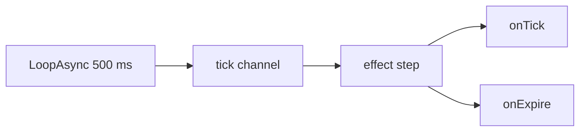
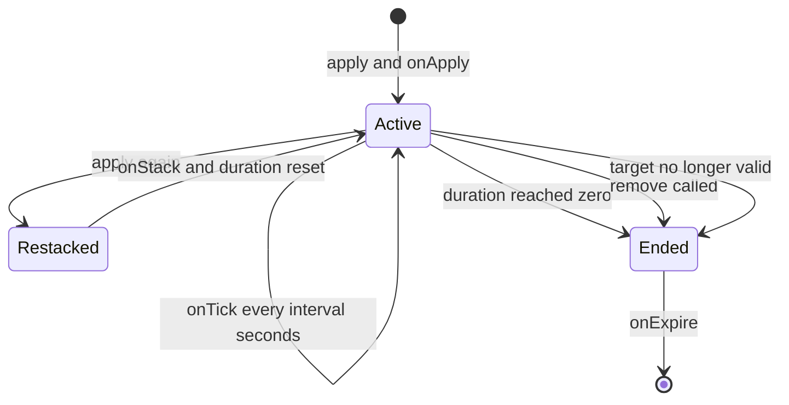

エフェクトは、対象に付与するステータスです。バフ、デバフ、継続ダメージ、シールドなどが
これにあたります。エフェクトを駆動するネイティブのゲームイベントはなく、タイミング処理は
`api/effect` 自身が持っています。`tick` チャンネルを購読し、生きているアプリケーションを
ハートビートで進めるため、`duration`、`interval`、スタック、失効はいずれも実際に動く挙動で
あり、ネイティブフックを待っている宣言ではありません。

```lua title="content/regen.lua"
local Regen = Effect{
    id       = "example:Regen",
    name     = "Regeneration",
    duration = 10.0,   -- seconds
    interval = 1.0,    -- seconds between onTick calls
    events = {
        onApply  = function(effect, target, ctx) end,
        onTick   = function(effect, target, ctx) end,
        onExpire = function(effect, target, ctx) end,
    },
}

Regen:apply(Player.character())
```

10 秒後、`onTick` を 10 回発火したうえでアプリケーションは消えます。

<Callout type="warn">
PalForge のエフェクトは、ゲーム本体のステータスアイコンを**切り替えません**。Palworld の
状態異常はネイティブの `EPalStatusEffectType` 列挙型であり、それを適用するネイティブ呼び出しは
未確認のため、このモジュールはその仕組みに一切到達しません。`nativeStatus` フィールドは定義に
保持されるだけで、誰も読みません。エフェクトが実際に*何をするか*はハンドラの中に書く必要が
あります。回復・ダメージ・バフ・ログ出力は、手持ちの呼び出しを使って `onApply` / `onTick` /
`onExpire` で行ってください。その周囲のスケジュールは動きますが、状態異常の切り替えは存在しません。
</Callout>

## エフェクトを定義する

モジュールそのものがコンストラクタです。`Effect{ ... }` を呼ぶとテーブルが検証され、定義が
`core/object_manager` に `("effect", id)` として登録され、`Effect.Handle` が返ります。

```lua
local Effect = require("palforge.api.effect")   -- or the installed global

local Chill = Effect{ id = "example:Chill" }    -- id is the only required field
```

`id` は任意の名前で構いません。`Pal` や `Item` と違い、エフェクト id の背後にゲームの
DataTable はないため、`"example:Chill"` と `"Chill"` はどちらも有効です。名前空間付きの形式は、
他のパックとの衝突を避けるためだけのものです。

検証は厳格で、問題はすべて呼び出しを中断するハードエラーになります。

```lua
Effect{ id = "example:Chill", durationSec = 10 }
Effect{ name = "no id" }
Effect{ id = "example:Chill", events = { onRemove = function() end } }
Effect{ id = "example:Chill", stackable = "yes" }
```

```text
PalForge: Effect: unknown field "durationSec" (did you mean "duration"?). Valid fields: id, name, description, duration, interval, stackable, maxStacks, icon, nativeStatus, events, data
PalForge: Effect: field "id" is required (effect id: a name or "pack:name")
PalForge: Effect: field "events" (Effect.Spec.Events): unknown field "onRemove". Valid fields: onApply, onTick, onStack, onExpire
PalForge: Effect: field "stackable" expects boolean, got string
```

シェイプはデータとして宣言されているため、実行時に読み出せます。

```lua
local schema = require("palforge.core.schema")

print(schema.help("Effect.Spec"))
print(schema.help("Effect.Spec.Events"))
schema.get("Effect.Spec").fields   -- the same, as a table, for tooling
```

## Spec のフィールド

<TypeTable
  type={{
    id: { description: 'エフェクト id。名前、または pack:name 形式。唯一の必須フィールドです', type: 'string', required: true },
    name: { description: 'ステータスバーに表示される名前。省略時は id', type: 'string' },
    description: { description: 'UI とツール向けの 1 行説明', type: 'string' },
    duration: { description: '総寿命 (秒)。省略すると :remove を呼ぶまで続きます', type: 'number' },
    interval: { description: 'onTick の間隔 (秒)。省略すると周期 tick は起きません', type: 'number' },
    stackable: { description: '1 つの対象に複数を重ねられるかどうか', type: 'boolean', default: 'false' },
    maxStacks: { description: 'stackable が true のときのスタック上限', type: 'number', default: '1' },
    icon: { description: 'ステータスバー用アイコン。定義に保持され :iconOf が返します', type: 'any' },
    nativeStatus: { description: '対応する EPalStatusEffectType。保持されるだけで、何も適用しません', type: 'string' },
    events: { description: 'ライフサイクルハンドラをまとめたもの: Effect.Spec.Events', type: 'table' },
    data: { description: '自由に使えるペイロード。定義に載ります', type: 'table' },
  }}
/>

`duration` と `interval` の単位は**秒**で、浮動小数点数です。`data` はアプリケーションではなく
定義に載ります。[アプリケーションごとの状態](#アプリケーションごとの状態)を参照してください。

## タイミングランタイム

エフェクトを駆動するネイティブの仕組みはありません。`api/effect` が生きているアプリケーションの
テーブルを保持し、`core/event` の `tick` チャンネルから自分で進めます。



購読はプロセス全体で**最初**の `:apply` のときに遅延インストールされます。モジュールを require
するだけではコストはかからず、tick の購読者も増えません。その時点で `core/event` の require が
失敗した場合、`:apply` は `false` を返し、アプリケーションは作られません。それ以外の呼び出しは
`true` を返します。

1 回のハートビートは、生きているアプリケーションそれぞれに対して次の順で処理を行います。

1. 対象がすでに有効でなければ、`reason = "target_gone"` で `onExpire` を発火して破棄する
2. そうでなければ `elapsed` に `0.5` を加算する
3. interval のアキュムレータに `0.5` を加算し、`interval` に達している間 `onTick` を発火する
4. 残り時間から `0.5` を引き、0 に達したら `reason = "duration"` で `onExpire` を発火する

`event.TICK_MS` は `500` なので、ランタイムは 1 ステップあたり正確に **0.5 秒**進みます。
つまり指定した秒数はこのグリッドに量子化されます。

| 宣言 | 実際に起きること |
| --- | --- |
| `duration = 10.0` | 20 回目のハートビートで終了 |
| `duration = 0.2` | 1 回目のハートビート、`:apply` の 0.5 秒後に終了 |
| `interval = 1.0` | 2 回に 1 回のハートビートで `onTick`。`elapsed` は 1.0, 2.0, 3.0 |
| `interval = 0.75` | `elapsed` 1.0, 1.5, 2.5, 3.0, 4.0 で `onTick` |
| `interval = 0.1` | 1 回のハートビートの中で `onTick` が連続 5 回 |

アキュムレータは余りを持ち越すため、0.5 の倍数でない interval でも長期的な発火レートは正しく
保たれます。グリッドに丸められるのは、各 tick が着地する瞬間だけです。0.5 未満の interval は
遅くなるのではなく、同じフレーム内でまとめて複数回発火します。

`onTick` は残り時間のチェックより先に処理されるため、`duration` が `interval` の倍数である
エフェクトでは、最後の tick が `onExpire` と同じハートビートに着地します。

```lua
Effect{ id = "example:Two", duration = 2.0, interval = 1.0, events = {
    onTick   = function(e, target, ctx) print("tick", ctx.elapsed) end,
    onExpire = function(e, target, ctx) print("expire", ctx.reason, ctx.elapsed) end,
} }:apply(Player.character())
```

```text
tick    1.0
tick    2.0
expire  duration  2.0
```

1 つのアプリケーションの一生は次のとおりです。



`onApply` は次のハートビートではなく、`:apply` の呼び出しの中で**同期的に**発火します。
それ以降はすべてグリッド上で進みます。

### 対象と、生存しているかの判定

アプリケーションは対象とエフェクト id の組をキーにして保持されます。対象テーブルは
**弱参照キー**です。アプリケーションがポーンを生かし続けることはなく、ガベージコレクトされた
対象は自分のアプリケーションも一緒に連れていきます。

対象が生存しているとみなされるのは、素の Lua テーブルである場合か、エンジンの userdata で
`IsValid()` がまだ true を返す場合です。ポーンが無効になると、次のハートビートで
`reason = "target_gone"` として失効します。

対象なしの `:apply()` も正当です。対象が `nil` のアプリケーションは 1 つのワールド全体用の
バケットに入り、ハンドラは `target = nil` を受け取ります。

```lua
local Curse = Effect{ id = "example:Curse", duration = 60.0 }

Curse:apply()                       -- global application, no target
Curse:isActive()                    -- true
Effect.activeOn()                   -- { "example:Curse" }
```

<Callout type="warn">
このバケットは、対象が*欠けている*ときの行き先でもあります。`Player.character()` はワールドを
読み込む前は `nil` を返すため、タイトル画面で `MyEffect:apply(Player.character())` を呼ぶと、
エフェクトは黙ってグローバルに適用され、成功が報告されます。渡す前に対象をチェックしてください。
</Callout>

<Callout type="info">
このランタイムは永続化されず、ワールドの切り替えでもリセットされません。`api/effect` が購読して
いるのは `tick` だけで、`world.left` でアプリケーションを片付ける処理はありません。ポーンに
付いたアプリケーションはそのポーンが無効になった時点で自然に終わりますが、グローバルな
アプリケーションや素のテーブルをキーにしたものは、`:remove` を呼ぶまでワールドの再読み込みを
またいで生き残ります。
</Callout>

## イベント

4 つのハンドラはすべて LIVE です。いずれも `handler(effect, target, ctx)` の形で呼ばれます。

- `effect` — この定義の**ハンドル**。`:remove`、`:stacksOn`、`:timeLeft` がそのまま使えます
- `target` — `:apply` に渡した値。グローバルなアプリケーションでは `nil`
- `ctx` — 素のテーブル。中身はイベントごとに異なります

<TypeTable
  type={{
    onApply: { description: 'LIVE。対象にこのエフェクトのアプリケーションがまだ無いとき、:apply の中で同期的に発火します', type: 'fun(self, target, ctx)' },
    onTick: { description: 'LIVE。アプリケーションが生きている間、interval 秒ごとに発火します。interval を省略すると発火しません', type: 'fun(self, target, ctx)' },
    onStack: { description: 'LIVE。すでにこのエフェクトを持つ対象へ :apply したとき、onApply の代わりに発火します', type: 'fun(self, target, ctx)' },
    onExpire: { description: 'LIVE。duration の経過、:remove の呼び出し、対象の無効化のいずれかで 1 度だけ発火します', type: 'fun(self, target, ctx)' },
  }}
/>

`ctx` に載るキーは次のとおりです。

| イベント | `ctx.effect` | `ctx.stacks` | `ctx.elapsed` | `ctx.reason` | `:apply` に渡した ctx |
| --- | --- | --- | --- | --- | --- |
| `onApply` | エフェクト id | `1` | — | — | 見える |
| `onTick` | エフェクト id | 現在のスタック数 | apply からの秒数 | — | 見えない |
| `onStack` | エフェクト id | 加算後のスタック数 | — | — | 見える |
| `onExpire` | エフェクト id | 終了時点のスタック数 | apply からの秒数 | 下記参照 | 見えない |

`onExpire` の `ctx.reason` は次の 3 つの文字列のいずれかです。

| `reason` | 原因 |
| --- | --- |
| `"duration"` | 宣言した `duration` が尽きた |
| `"removed"` | `:remove(target)` が呼ばれた |
| `"target_gone"` | 対象が有効でなくなった |

以下のスニペットでの `log` は `require("palforge.utils.log").scope("example")` です。

```lua
local Shield = Effect{
    id       = "example:Shield",
    name     = "Shield",
    duration = 12.0,
    interval = 3.0,
    events = {
        onApply = function(effect, target, ctx)
            log.info(string.format("%s up on %s", ctx.effect, tostring(target)))
        end,
        onTick = function(effect, target, ctx)
            log.info(string.format("%.1fs elapsed, %.1fs left",
                ctx.elapsed, effect:timeLeft(target) or -1))
        end,
        onExpire = function(effect, target, ctx)
            if ctx.reason == "target_gone" then return end
            log.info("shield down: " .. ctx.reason)
        end,
    },
}
```

### 独自のコンテキストを渡す

`:apply` の第 2 引数は `onApply` と `onStack` に渡されます。コピーはされません。これらの
ハンドラが受け取る `ctx` は、`effect` と `stacks` を持つ小さなテーブルであり、渡したテーブルは
その `__index` メタテーブルの先にあります。

```lua
local Mark = Effect{
    id       = "example:Mark",
    duration = 20.0,
    events = {
        onApply = function(effect, target, ctx)
            log.info("marked by " .. tostring(ctx.source))   -- reads through __index
            for k in pairs(ctx) do print(k) end              -- prints only: effect, stacks
        end,
    },
}

Mark:apply(pawn, { source = "trap", power = 3 })
```

したがって、キーは名前で引いてください。`pairs` による走査では見えませんし、`onTick` と
`onExpire` からも見えません。この 2 つは独自のコンテキストを組み立てるため、渡したテーブルを
一切参照しません。

### ハンドラのエラーは握りつぶされます

ランタイムが行うハンドラ呼び出しはすべて `pcall` で包まれています。例外を投げるハンドラが
あってもハートビートは止まらず、他のアプリケーションにも影響せず、そのハンドラが無効化される
こともありません。ただしエラーはログにも出さずに捨てられます。中身を見たい場合は自分で包んで
ください。

```lua
onTick = function(effect, target, ctx)
    local ok, err = pcall(function() target:SomethingNative() end)
    if not ok then log.err("tick failed: " .. tostring(err)) end
end,
```

## スタック

すでにその対象で生きているエフェクトを再度 `:apply` しても、2 つ目のアプリケーションは決して
作られません。必ず次の 2 つが起き、`stackable` が効くのは 1 つ目だけです。

1. `stackable` が true で**かつ**現在のスタック数が `maxStacks` 未満なら、スタックを 1 増やす
2. 残り時間を、宣言した `duration` の満量にリセットする

そのうえで、`onApply` の代わりに `onStack` が発火します。

```lua
local Rage = Effect{
    id        = "example:Rage",
    name      = "Rage",
    duration  = 8.0,
    stackable = true,
    maxStacks = 5,
    events = {
        onApply = function(effect, target, ctx) log.info("rage 1") end,
        onStack = function(effect, target, ctx) log.info("rage " .. ctx.stacks) end,
    },
}

Rage:apply(pawn)          -- onApply, stacks = 1, 8.0s left
Rage:apply(pawn)          -- onStack, stacks = 2, back to 8.0s
Rage:apply(pawn)          -- onStack, stacks = 3
Rage:stacksOn(pawn)       --> 3
```

上限に達したあとも、`:apply` は `onStack` を発火し、残り時間もリセットします。止まるのは
カウントだけです。

```lua
for _ = 1, 20 do Rage:apply(pawn) end
Rage:stacksOn(pawn)       --> 5, and onStack fired 19 times
```

<Callout type="warn">
`maxStacks` の既定値は `1` です。`maxStacks` を指定せずに `stackable = true` だけを書くと、
`onStack` が発火して残り時間もリセットされるのに、カウントは `1` から動かないエフェクトになります。
両方を指定してください。
</Callout>

スタックしないエフェクトも、カウンタがないだけで挙動は同じです。再 `:apply` は残り時間を
リセットする手段になります。

```lua
local Wet = Effect{
    id       = "example:Wet",
    duration = 6.0,          -- stackable defaults to false
    events = {
        onStack = function(effect, target, ctx)
            log.info("still wet, timer back to 6s, stacks = " .. ctx.stacks)  -- always 1
        end,
    },
}
```

カウントは対象とエフェクト id の組につき 1 つで、自然減衰はしません。`onExpire` は 1 回で、
保持しているスタック数に関係なくアプリケーション全体を終わらせます。1 スタックずつ落としたい
場合は[下のレシピ](#スタックするバフ)を参照してください。

## ハンドル

`Effect{ ... }`、`Effect.get(id)`、`Effect.get_all()` はいずれも `Effect.Handle` を返します。
生きているアプリケーションを操作するメソッドは対象を引数に取り、`nil` はグローバルバケットを
意味します。宣言を読むだけのメソッドは引数を取りません。

| メソッド | 戻り値 | 備考 |
| --- | --- | --- |
| `:apply(target, ctx)` | `boolean` | アプリケーションの開始または再スタック。`false` になるのは tick ドライバを設置できなかったときだけ |
| `:remove(target)` | `boolean` | 終了させたら `true`、対象に無ければ `false` |
| `:isActive(target)` | `boolean` | いまアプリケーションが生きているか |
| `:stacksOn(target)` | `integer` | 現在のスタック数。非アクティブなら `0` |
| `:timeLeft(target)` | `number?` | 残り秒数。`duration` が無ければ `nil`、非アクティブなら `0` |
| `:name()` | `string` | 宣言した `name`、無ければ id |
| `:description()` | `string?` | 宣言した `description` |
| `:duration()` | `number?` | 宣言した `duration` |
| `:interval()` | `number?` | 宣言した `interval` |
| `:iconOf()` | `any?` | 宣言した `icon`。エフェクトに DataTable 検索はありません |

```lua
local Poisoned = Effect.get("Poison")

if not Poisoned:isActive(pawn) then
    Poisoned:apply(pawn)
end

print(Poisoned:stacksOn(pawn))   --> 1
print(Poisoned:timeLeft(pawn))   --> 10.0, then 9.5, 9.0, ...
Poisoned:remove(pawn)            --> true, and onExpire fires with reason "removed"
Poisoned:remove(pawn)            --> false, nothing left to remove
```

<Callout type="info">
`:timeLeft` の `nil` と `0` は別の状況を表します。`nil` は*終わりの無いアクティブ状態*、つまり
`duration` を宣言していないエフェクトです。`0` は*非アクティブ*です。区別が必要なときは
`:isActive` で判定してください。
</Callout>

4 つの `on*` メソッドもハンドルにあります。呼び出すと宣言したハンドラが即座に実行されますが、
アプリケーションの状態には一切触れません。タイマーは始まらず、スタックも数えられず、失効も
しません。エフェクトを駆動するためではなく、ハンドラの中身を再利用するために使ってください。

```lua
Regen:onTick(pawn, { effect = Regen.id, elapsed = 0, stacks = 1 })  -- just calls the body
Regen:apply(pawn)                                                    -- this is what starts it
```

## エフェクトを引く

```lua
Effect.get("Poison")        -- an existing definition, else a thin one over that id. Never nil
Effect.get_all()            -- every registered effect, as handles
Effect.activeOn(target)     -- the ids currently live on target, sorted
Effect.Class                -- the base definition class, for subclassing
```

`Effect.get` が `nil` を返すことはありません。誰も定義していない id に対しては、クエリが空の
ハンドルが返ります。`:duration()` は `nil`、`:name()` は id です。その `:apply` は、ハンドラを
持たず永久に続くアプリケーションを開始します。これは `:isActive` で確認するマーカーとしてしか
役に立ちません。

同じ id を 2 回定義すると登録が置き換わります。最後の呼び出しが勝ち、`Effect.get` は最新の定義を
返します。先に取得したハンドルは、それが作られたときの定義を指し続けるため、そのハンドル経由で
開始したアプリケーションでは古いタイミングと古いハンドラがそのまま生きます。

対象に付いているステータスを列挙する方法は `Effect.activeOn(target)` だけです。ソート済みの id
配列が返るので、それを `Effect.get` で開き直します。

```lua
for _, id in ipairs(Effect.activeOn(pawn)) do
    local e = Effect.get(id)
    print(string.format("%-16s %d stack(s), %s",
        e:name(), e:stacksOn(pawn), tostring(e:timeLeft(pawn))))
end
```

```text
Burn             1 stack(s), 3.5
Rage             4 stack(s), 6.0
```

対象からすべて取り除くのは、このループに `:remove` を足すだけです。

```lua
local function cleanse(target)
    for _, id in ipairs(Effect.activeOn(target)) do
        Effect.get(id):remove(target)
    end
end
```

## ネイティブの状態異常

`native/effects.lua` は 3 つのキュレート済み定義を持ち、`registry.initialize` の読み込み時に
登録されます。モジュール経由でも `Effect.get` 経由でも到達でき、どちらも同じ定義を返します。

```lua
local effects = require("palforge.native.effects")

effects.CATALOG            --> { "Poison", "Burn", "Freeze" }
effects.Poison             -- the curated handle
effects.get("Burn")        -- the same handle, by id
effects.get("Sleep")       --> nil, not a known ailment name
Effect.get("Freeze")       -- also the same definition
```

| id | `duration` | `interval` | `nativeStatus` |
| --- | --- | --- | --- |
| `Poison` | `10.0` | `1.0` | `"Poison"` |
| `Burn` | `5.0` | `1.0` | `"Burn"` |
| `Freeze` | `3.0` | なし | `"Freeze"` |

```lua
effects.Burn:apply(pawn)
effects.Burn:timeLeft(pawn)   --> 5.0
```

この 3 つが動かすスケジュールは本物です。`Poison` を適用すれば、ハートビートに量子化された
10 秒間アプリケーションが生き、1 秒ごとに発火します。欠けているのは中身のほうです。
`native/effects.lua` の `onApply` と `onExpire` の本体は、ネイティブのステータス呼び出しが入る
はずの `-- TODO:` マーカーであり、`onTick` はありません。現状 `Burn` を適用してもゲーム内では
何も変わりません。適切なタイミングが宣言済みの 3 つの id だと考えて、ゲームプレイは自分の定義に
書くか、自分のハンドラからこれらを駆動する形で足してください。

<Callout type="warn">
読み取れる状態異常の DataTable はありません。Palworld の状態異常は列挙型
(`EPalStatusEffectType`) であり、その完全な列挙はリフレクションダンプに含まれていなかったため、
`CATALOG` は抽出された行リストではなく手で保守している 3 つの名前です。`effects.get` はそれ以外に
対して `nil` を返します。`Effect.get("Sleep")` は動きますが、返るのはネイティブの状態異常では
なく、まっさらな空の定義です。
</Callout>

## アプリケーションごとの状態

アプリケーションが保持しているのは、ランタイムが必要とするものだけです。経過時間、残り時間、
スタック数の 3 つです。アプリケーションごとの作業用テーブルはありません。ハンドラに渡される状態は
`ctx.elapsed` と `ctx.stacks` がすべてで、それ以外は自分で用意することになります。

`data` はその置き場所ではありません。これは**定義**に保持されるため、そのエフェクトを適用した
すべての対象で 1 つのテーブルが共有されます。しかも `Effect.Handle` にアクセサはないので、
ハンドラの中から公開 API で読み返す手段はありません。

対象をキーにした弱参照テーブルを自分で持ち、`onExpire` でエントリを消してください。

```lua
local state = setmetatable({}, { __mode = "k" })   -- target -> your table

local Bleed = Effect{
    id       = "example:Bleed",
    duration = 6.0,
    interval = 1.0,
    events = {
        onApply = function(effect, target, ctx)
            state[target] = { total = 0, source = ctx.source }
        end,
        onTick = function(effect, target, ctx)
            local s = state[target]
            if not s then return end
            s.total = s.total + 5 * ctx.stacks
        end,
        onExpire = function(effect, target, ctx)
            local s = state[target]
            state[target] = nil
            if s then log.info(string.format("bleed dealt %d from %s", s.total, tostring(s.source))) end
        end,
    },
}
```

ここで弱参照キーが重要なのは、ランタイムがそうしているのと同じ理由です。自分のテーブルからの
強参照は、デスポーンしたポーンを生かし続けてしまいます。グローバルなアプリケーションは `nil` を
キーにしますが、Lua のテーブルは `nil` をキーにできないため、その場合の状態が必要なら独自の
番兵オブジェクトを使ってください。

## レシピ

### リジェネレーション

プレイヤーへの継続回復で、切れるたびに掛け直します。回復処理そのものは自分で用意するものです。
PalForge に HP API はありません。そのため以下では 1 秒ごとに `Berries` を 1 つ渡し、直接回復を
書く位置をコメントで示しています。

```lua title="content/regen.lua"
local event = require("palforge.core.event")
local log   = require("palforge.utils.log").scope("regen")

local Regen = Effect{
    id          = "example:Regen",
    name        = "Regeneration",
    description = "Restores a little every second for ten seconds.",
    duration    = 10.0,
    interval    = 1.0,
    events = {
        onApply = function(effect, target, ctx)
            log.info("regen up for " .. tostring(effect:duration()) .. "s")
        end,
        onTick = function(effect, target, ctx)
            -- Your heal goes here; this is the part PalForge does not provide.
            -- :give always adds to the LOCAL PLAYER's inventory, whatever `target` is.
            Item.get("Berries"):give(1)
        end,
        onExpire = function(effect, target, ctx)
            log.info("regen over after " .. tostring(ctx.elapsed) .. "s: " .. ctx.reason)
        end,
    },
}

-- Re-arm it every 15 seconds, but only while there is a player to arm it on.
event.every(15000, function()
    local me = Player.character()
    if me and not Regen:isActive(me) then
        Regen:apply(me, { source = "campfire" })
    end
end)

return Regen
```

`event.every` はエフェクトランタイムと同じ 500 ms のハートビートに量子化されているため、両者が
ずれることはありません。

### 継続ダメージ

`Poison` はタイミング（10 秒・1 秒間隔）をすでに宣言していますが、`onTick` を持っていません。
その隣に自分のエフェクトを定義して tick に中身を与え、両方を適用しておけば、後日ネイティブの
状態異常が埋まったときにもパックはそのまま動きます。

```lua title="content/poison_bite.lua"
local effects = require("palforge.native.effects")
local log     = require("palforge.utils.log").scope("poison")

local damage = setmetatable({}, { __mode = "k" })   -- target -> accumulated damage

local Venom = Effect{
    id          = "example:Venom",
    name        = "Venom",
    description = "Ticks damage while it lasts, harder with every stack.",
    duration    = 10.0,
    interval    = 1.0,
    stackable   = true,
    maxStacks   = 3,
    events = {
        onApply = function(effect, target, ctx)
            damage[target] = 0
        end,
        onStack = function(effect, target, ctx)
            log.info("venom deepens to " .. ctx.stacks)
        end,
        onTick = function(effect, target, ctx)
            local perTick = 4 * ctx.stacks
            damage[target] = (damage[target] or 0) + perTick
            -- deal `perTick` to `target` here through whatever call you have
        end,
        onExpire = function(effect, target, ctx)
            local total = damage[target] or 0
            damage[target] = nil
            log.info(string.format("venom ended (%s) after %.1fs, %d total",
                ctx.reason, ctx.elapsed, total))
        end,
    },
}

---Poison a pawn: the native ailment id plus the effect that carries the damage.
local function poison(pawn)
    if not pawn then return false end
    effects.Poison:apply(pawn)
    return Venom:apply(pawn, { source = "bite" })
end

-- A bitten pal keeps poisoning itself while the venom lasts. Defining "ChickenPal" here
-- REPLACES the curated demo definition in native/pals.lua - one id, one definition.
Pal{
    id   = "ChickenPal",
    name = "Chicken Pal",
    events = {
        onDamaged = function(pal, ctx)
            poison(ctx.actor)
        end,
    },
}

return { effect = Venom, poison = poison }
```

`onDamaged` のたびに再適用されるため、毒は 10 秒にリセットされ、最大 3 スタックまで深くなります。
チキンが最終的にデスポーンすると、次のハートビートで両方のアプリケーションが
`reason = "target_gone"` で失効し、蓄積値もクリアされます。

### スタックするバフ

被弾のたびに積み上がって残り時間がリセットされ、上限に達したら何かを起動するバフです。

```lua title="content/rage.lua"
local effects = require("palforge.native.effects")
local event   = require("palforge.core.event")
local log     = require("palforge.utils.log").scope("rage")

local MAX = 5

local Rage = Effect{
    id          = "example:Rage",
    name        = "Rage",
    description = "Builds with every hit taken and ignites at full stacks.",
    duration    = 8.0,
    interval    = 2.0,
    stackable   = true,
    maxStacks   = MAX,
    events = {
        onApply = function(effect, target, ctx)
            log.info("rage 1/" .. MAX)
        end,
        onStack = function(effect, target, ctx)
            log.info(string.format("rage %d/%d", ctx.stacks, MAX))
            if ctx.stacks == MAX then
                effects.Burn:apply(target)      -- 5s of the native Burn id
            end
        end,
        onTick = function(effect, target, ctx)
            -- apply the per-stack bonus here; ctx.stacks is the current count
        end,
        onExpire = function(effect, target, ctx)
            log.info(string.format("rage fell off at %d stacks (%s)", ctx.stacks, ctx.reason))
        end,
    },
}

-- Any damaged pal builds rage. The duration resets on every hit, so a pal that keeps
-- taking damage keeps the stacks; eight quiet seconds and the whole thing drops at once.
event.on("pal.damaged", function(ctx)
    if ctx.actor then Rage:apply(ctx.actor, { source = "damage" }) end
end)

return Rage
```

`onExpire` が*しない*ことに注意してください。スタックは 1 つずつ落ちません。アプリケーションは
そのとき保持していたカウントのまま、まるごと終了します。

<Callout type="warn">
`onTick` や `onExpire` の中から*新しい*アプリケーションを開始しないでください。これらのハンドラは、
ランタイムがアプリケーションのテーブルを `pairs` で走査している最中に実行されます。走査中の
テーブルにキーを追加する `:apply` は、Lua では挙動が未定義です。まだアプリケーションを持たない
対象への適用、同じ対象への別エフェクトの適用、そして直前にランタイムがキーを消している
`onExpire` からの同じエフェクトの再適用がこれにあたります。同じエフェクトを自分の `onTick` から
再適用する場合は、すでにあるアプリケーションのフィールドを書き換えるだけであり、`:remove` も
フィールドを消すだけなので、どちらも安全です。
</Callout>

減衰は別の `tick` 購読者から駆動してください。自前の購読者はランタイムのステップの外で実行される
ため、その間はどのアプリケーションテーブルも走査中ではありません。

```lua
local event = require("palforge.core.event")

---Bleed one stack of `effect` off `target` every two seconds.
---Returns the subscription, so call :unsubscribe() on it when you are done.
local function decay(effect, target)
    return event.every(2000, function()
        local n = effect:stacksOn(target)
        if n > 1 then
            effect:remove(target)                                -- fires onExpire
            for _ = 1, n - 1 do effect:apply(target) end          -- rebuild one lower
        end
    end)
end
```

### 対象が死んだら終わるエフェクト

ランタイムは対象が有効でなくなった時点でアプリケーションを失効させますが、これは死亡フックでは
なくフォールバックです。死んだポーンがしばらく有効なままのこともありますし、判定は次のハート
ビートまで走りません。死亡の瞬間にエフェクトを消したい場合は、`pal.death` チャンネルに繋いで
ください。

```lua title="content/frostbite.lua"
local effects = require("palforge.native.effects")
local event   = require("palforge.core.event")
local log     = require("palforge.utils.log").scope("frostbite")

local killed = setmetatable({}, { __mode = "k" })   -- pawns whose effects we cleared on death

local Frostbite = Effect{
    id          = "example:Frostbite",
    name        = "Frostbite",
    description = "Slows a captured pal until it thaws.",
    duration    = 30.0,
    interval    = 5.0,
    events = {
        onApply = function(effect, target, ctx)
            log.info("frostbite on " .. tostring(target))
        end,
        onTick = function(effect, target, ctx)
            log.info(string.format("still frozen at %.1fs", ctx.elapsed))
        end,
        onExpire = function(effect, target, ctx)
            local why = killed[target] and "the target died" or ctx.reason
            killed[target] = nil
            log.info("frostbite cleared: " .. why)
        end,
    },
}

-- Freeze plus the long frostbite when a sheepball is caught.
Pal{
    id   = "SheepBall",
    name = "Sheepball",
    events = {
        onCaptured = function(pal, ctx)
            effects.Freeze:apply(ctx.actor)      -- 3s, the native ailment id
            Frostbite:apply(ctx.actor, { source = "sphere" })
        end,
    },
}

-- Death clears every PalForge effect on the pawn, right away.
event.on("pal.death", function(ctx)
    local pawn = ctx.actor
    if not pawn then return end
    killed[pawn] = true
    for _, id in ipairs(Effect.activeOn(pawn)) do
        Effect.get(id):remove(pawn)
    end
end)

return Frostbite
```

<Callout type="info">
`:remove` は常に `reason = "removed"` を報告するため、`onExpire` だけでは死亡と手動の解除を
区別できません。ランタイムが生成する reason は `"duration"`、`"removed"`、`"target_gone"` の
3 つだけで、この一覧に追加することはできません。だからこそ上の死亡フックは、先にポーンを弱参照
テーブルへ記録し、`onExpire` でそれを読み返しています。
</Callout>

短いエフェクトなら、死亡フックを付けないという選択も妥当です。デスポーンでポーンが無効になり、
1 ハートビート以内に `reason = "target_gone"` で自然に終わります。

<Cards>
  <Card title="Pal" href="/docs/api/pal">`onDamaged`、`onDeath`、`onCaptured` の出どころ</Card>
  <Card title="Skill" href="/docs/api/skill">手動での発動、アビリティのもう半分</Card>
  <Card title="Player" href="/docs/api/player">エフェクトを適用する対象の取得</Card>
  <Card title="Lifecycle" href="/docs/concepts/lifecycle">これらすべてを駆動する `tick` チャンネル</Card>
</Cards>
