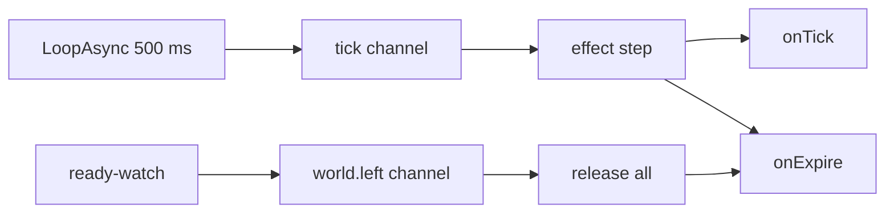
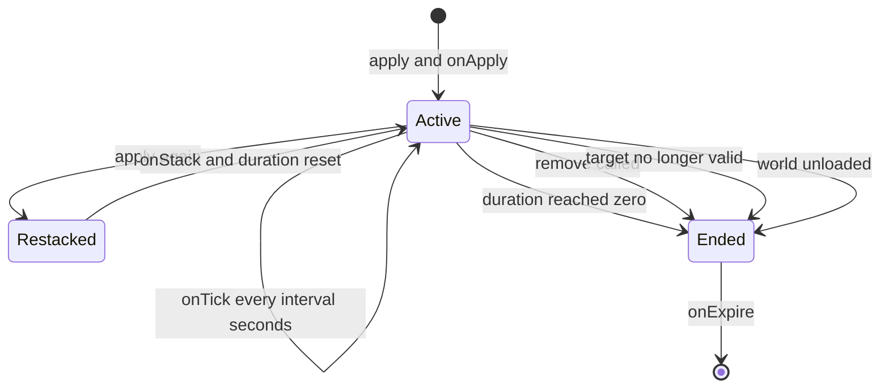

## What you can do after this page

- Heal a character a little at a time, for as long as you choose
- Poison or burn something so it takes damage every second
- Give a temporary buff that wears off on its own
- Let a status pile up in stacks and refresh every time it lands again
- Clear a status early, or check how much time is left on it
- Switch on one of the game's own ailments — the real poison or burn icon — while yours runs

An effect is a status you put on a character — the player, or a pal. A buff, a debuff,
damage over time, a shield. You say how long it lasts and how often it should do
something, and PalForge runs the clock.

```lua title="content/regen.lua"
local Regen = Effect{
    id       = "example:Regen",
    name     = "Regeneration",
    duration = 10.0,   -- seconds
    interval = 1.0,    -- seconds between onTick calls
    events = {
        onApply  = function(effect, target, ctx) end,
        onTick   = function(effect, target, ctx) end,
        onExpire = function(effect, target, ctx) end,
    },
}

Regen:apply(Player.character())
```

Ten seconds later it is off the player again, having run `onTick` ten times.

<Callout type="info">
An effect can also switch on one of **the game's own ailments** — the poison, burn or freeze
symbol Palworld puts on a health bar. Name one in `nativeStatus` and it goes on when the effect
is applied and comes off when the effect ends. Everything the effect is meant to *do* beyond
that still belongs in your handlers: heal, damage, buff or log inside `onApply`, `onTick` and
`onExpire`. The section **The game's own ailments** below has the names and the rules.
</Callout>

## Defining an effect

Write `Effect{ ... }` to make one. You get back a handle — an object with `:apply`,
`:remove` and every query on it.

```lua
local Effect = require("palforge.api.effect")   -- or the installed global

local Chill = Effect{ id = "example:Chill" }    -- id is the only required field
```

`id` can be any name you like. An effect id is not tied to anything in the game's own
data, so `"example:Chill"` and `"Chill"` both work. The `pack:name` form is there so your
ids do not clash with another pack's.

Get something wrong and the call stops with an error, so a typo never half-registers:

```lua
Effect{ id = "example:Chill", durationSec = 10 }
Effect{ name = "no id" }
Effect{ id = "example:Chill", events = { onRemove = function() end } }
Effect{ id = "example:Chill", stackable = "yes" }
```

```text
PalForge: Effect: unknown field "durationSec" (did you mean "duration"?). Valid fields: id, name, description, duration, interval, stackable, maxStacks, icon, nativeStatus, events, data
PalForge: Effect: field "id" is required (effect id: a name or "pack:name")
PalForge: Effect: field "events" (Effect.Spec.Events): unknown field "onRemove". Valid fields: onApply, onTick, onStack, onExpire
PalForge: Effect: field "stackable" expects boolean, got string
```

You can print every field, its type and its meaning while the game is running:

```lua
local schema = require("palforge.core.schema")

print(schema.help("Effect.Spec"))
print(schema.help("Effect.Spec.Events"))
schema.get("Effect.Spec").fields   -- the same, as a table, for tooling
```

## Spec fields

Most effects need three things: an `id`, a `duration`, and an `interval` if something
should happen repeatedly. Everything you may pass is below.

<TypeTable
  type={{
    id: { description: 'effect id: a name or pack:name. The only required field', type: 'string', required: true },
    name: { description: 'shown on the status bar; defaults to id', type: 'string' },
    description: { description: 'one-line description, for UI and tooling', type: 'string' },
    duration: { description: 'how long it lasts, in seconds. Omit it and the effect runs until you call :remove', type: 'number' },
    interval: { description: 'seconds between onTick calls. Omit it and onTick never runs', type: 'number' },
    stackable: { description: 'may several copies pile up on one target', type: 'boolean', default: 'false' },
    maxStacks: { description: 'stack ceiling when stackable is true', type: 'number', default: '1' },
    icon: { description: 'status-bar icon. Stored on the definition and returned by :iconOf', type: 'any' },
    nativeStatus: { description: "the game's own ailment this mirrors, such as \"Poison\". Switched on while the effect runs. Checked against the game's list the moment you define it", type: 'string' },
    events: { description: 'lifecycle handlers, grouped: Effect.Spec.Events', type: 'table' },
    data: { description: 'free-form payload of your own, carried onto the definition', type: 'table' },
  }}
/>

`duration` and `interval` are **seconds**, and they can have a decimal point. `data` is
stored once on the definition, so every target shares the same table — for anything you
want to remember per target, see
[Keeping your own data per target](#keeping-your-own-data-per-target).

## The game's own ailments

`nativeStatus` names one of Palworld's own status effects. Declare one and PalForge switches the
real ailment on when your effect is applied, and off again when it is removed or when it
expires — the same symbol on the health bar the game puts there itself, behaving the way the
game makes it behave.

```lua title="content/venom.lua"
local Venom = Effect{
    id           = "example:Venom",
    name         = "Venom",
    nativeStatus = "Poison",   -- the game's real poison, on for as long as this effect lasts
    duration     = 8.0,
    interval     = 1.0,
    events = {
        onTick = function(effect, target, ctx)
            -- your own gameplay, on top of the ailment
        end,
    },
}

Venom:apply(Player.character())
```

It is a **mirror, not a replacement**. The ailment runs on the game's rules and PalForge does not
set how strong it is. What PalForge decides is *when*: your `duration` is what takes it off
again.

<Callout type="info">
**This was observed working**, in a loaded save, and it is worth saying what "working" covered.
The route is `PalCharacter.StatusComponent` — a property every character carries — to
`UPalStatusComponent:AddStatus(EPalStatusID)`, one integer argument, no struct and no `FName`.
`status.add` put `AttackUp` (`EPalStatusID` 26) on a character, the game read the ailment back as
present through `GetExecutionStatus`, `status.remove` took it off, and the game read it back as
gone. The signatures came from a dump generated one game patch before the installed binary, and
the live class agreed with all three; every call still goes through `core/signature`, which
refuses one unless the live class declares it. A `false` therefore means *the call did not fire*,
never *the target is immune*.
</Callout>

The names are the game's own spelling. The ones a pack usually reaches for are `Poison`, `Stun`,
`Sleep`, `Burn`, `Freeze`, `Electrical`, `Darkness`, `Wetness`, `AttackUp` and `DefenseUp`. There
are 38 in all, and `require("palforge.core.status").names()` hands back the whole list, sorted.

### Case, and which layer you are on

`nativeStatus` is **case-insensitive**: `"poison"` finds `EPalStatusID` 5 exactly as `"Poison"`
does, because `core/status` keeps a lowered map beside the real one. That is safe here for a
reason that does not generalise — the vocabulary is fixed, closed and shipped in full, so folding
case costs one table and spares you the game's own capitalisation.

The other layer is **case-sensitive** and nothing can soften it. An id naming a DataTable row or
an `object_manager` registry key — `"pack_Potion"`, `Item.get`, the icon row lookup — has to be
spelled exactly, because that name set belongs to the game and PalForge holds no map of it to fold
against.

| What the name is | Example | Case |
| --- | --- | --- |
| an engine enum | `nativeStatus = "poison"`, a skill's `EPalWazaID` | insensitive |
| a DataTable row or a registry id | `Item.get("Wood")`, `"mypack:Potion"` | sensitive |

No status name is ever a row id, so nothing inside `Effect` crosses that boundary — but your pack
will, the moment it puts an `Item` id next to a `nativeStatus`.

A name the game does not have is refused **the moment you write the definition**, rather than
quietly at some later point, and the message carries every name you could have meant:

```text
PalForge: Effect: field "nativeStatus" not an ailment this build has; the names are AttackUp, Burn, CollectItem, Coma, ControlSP, Darkness, DefenseUp, Drown, DrownCheck, Dying, ...
```

<Callout type="info">
If the ailment cannot be switched on — the target is not a character, or the game will not take
the call — **the effect still applies normally** and your handlers still run, with the reason in
the log. PalForge's own timing, stacking and handlers are what a pack programmes against, and
none of it depends on the icon.
</Callout>

## How the timing works

PalForge has one heartbeat that fires every 500 ms, and every running effect moves forward
on it.

One effect running on one target is called an **application**. It holds the time elapsed,
the time remaining and the stack count. `:apply` starts one, and it ends when the duration
runs out, when you remove it, when the target disappears, or when the world unloads.



The heartbeat is hooked up the first time anything calls `:apply`. Requiring the module on
its own costs nothing and adds no listener. Two go in together: `tick` to move every
application along, and `world.left` to release them when the world goes away. If that
wiring cannot be set up at that moment, `:apply` returns `false` and no application starts;
every other call returns `true`.

One heartbeat does this to every live application, in order:

1. if the target is no longer valid, fire `onExpire` with `reason = "target_gone"` and drop it
2. otherwise add `0.5` to `elapsed`
3. add `0.5` to the interval accumulator and fire `onTick` while the accumulator has reached `interval`
4. subtract `0.5` from the remaining duration, and fire `onExpire` with `reason = "duration"` once it reaches zero

`event.TICK_MS` is `500`, so each step advances things by exactly **0.5 s**. Your seconds
are rounded onto that grid:

| Declared | What actually happens |
| --- | --- |
| `duration = 10.0` | ends on the 20th heartbeat |
| `duration = 0.2` | ends on the 1st heartbeat, 0.5 s after `:apply` |
| `interval = 1.0` | `onTick` on every 2nd heartbeat, at `elapsed` 1.0, 2.0, 3.0 |
| `interval = 0.75` | `onTick` at `elapsed` 1.0, 1.5, 2.5, 3.0, 4.0 |
| `interval = 0.1` | five `onTick` calls back to back inside a single heartbeat |

The accumulator keeps its remainder, so an interval that is not a multiple of 0.5 still
runs at the right rate over time — only the moment each tick lands is snapped to the grid.
An interval under 0.5 does not slow down; it fires several times in the same frame.

`onTick` is handled before the duration check, so an effect whose `duration` is a multiple
of its `interval` gets its last tick on the same heartbeat as `onExpire`:

```lua
Effect{ id = "example:Two", duration = 2.0, interval = 1.0, events = {
    onTick   = function(e, target, ctx) print("tick", ctx.elapsed) end,
    onExpire = function(e, target, ctx) print("expire", ctx.reason, ctx.elapsed) end,
} }:apply(Player.character())
```

```text
tick    1.0
tick    2.0
expire  duration  2.0
```

The life of one application:



`onApply` runs inside the `:apply` call itself, right away, not on the next heartbeat.
Everything after that is on the grid.

### Targets, and what counts as alive

One target can carry one application of each effect id, and the table holding them is keyed on
the target's `GetFullName()` — not on the handle you passed. UE4SS mints a fresh userdata wrapper
per lookup, so two references to one pawn are not the same Lua value, and a table indexed by
handle would file your application under whichever wrapper the caller happened to hold. A plain
Lua table target is identity-stable and keys on itself; an object that will not answer its own
name falls back to the handle.

A target counts as alive when it is a plain Lua table, or when it is engine data whose
`IsValid()` still returns true. Every heartbeat checks every live application, so once a pawn goes
invalid the next beat ends its applications with `reason = "target_gone"` and drops the emptied
bucket. That sweep is what keeps the table bounded now that its keys are strings: a string key is
not collectable, so there is no garbage collector to lean on — and the sweep is the stronger
guarantee anyway, because it fires on the beat the pawn despawns rather than whenever Lua next
collects.

`:apply()` with no target is allowed. Applications with a `nil` target go into a single
world-wide bucket, and their handlers get `target = nil`.

```lua
local Curse = Effect{ id = "example:Curse", duration = 60.0 }

Curse:apply()                       -- global application, no target
Curse:isActive()                    -- true
Effect.activeOn()                   -- { "example:Curse" }
```

<Callout type="warn">
That bucket is also where a *missing* target ends up. `Player.character()` returns `nil`
before a world is loaded, so `MyEffect:apply(Player.character())` on the title screen
quietly applies the effect world-wide and reports success. Check the target before you
pass it.
</Callout>

<Callout type="info">
Applications are held in memory and never saved. Inside one world, an application on a
pawn ends by itself once that pawn goes invalid, while a world-wide one or one keyed on a
plain table stays until its `duration` runs out or you call `:remove`. A world unload ends
all of them at once — see [When the world unloads](#when-the-world-unloads).
</Callout>

### When the world unloads

`core/event` watches the player pawn and emits `world.left` the moment it stops being
valid. Every application on every target, plus the world-wide bucket, fires `onExpire`
with `reason = "world_left"` and is dropped. `Effect.activeOn` comes back empty afterwards,
and later heartbeats have nothing left to move.

`"world_left"` is its own reason, so a handler can tell a world unload apart from a
duration expiry, a `:remove` or a despawned target. Use it to clean up your own notes for
that target without running the gameplay a normal expiry would run.

```lua title="content/hunger.lua"
local event = require("palforge.core.event")
local log   = require("palforge.utils.log").scope("hunger")

local drained = setmetatable({}, { __mode = "k" })   -- target -> your own bookkeeping

local Hunger = Effect{
    id          = "example:Hunger",
    name        = "Hunger",
    description = "Drains while the player is out in the world.",
    duration    = 120.0,
    interval    = 10.0,
    events = {
        onApply = function(effect, target, ctx)
            drained[target] = 0
        end,
        onTick = function(effect, target, ctx)
            drained[target] = (drained[target] or 0) + 1
        end,
        onExpire = function(effect, target, ctx)
            local total = drained[target] or 0
            drained[target] = nil
            if ctx.reason == "world_left" then
                log.info("world unloaded, hunger released at " .. total)
                return                       -- no payout: the world is going away
            end
            log.info(string.format("hunger ended (%s) after %d ticks", ctx.reason, total))
        end,
    },
}

-- Nothing is restored for you. The next world starts empty, so apply again on world.ready.
event.on("world.ready", function()
    local me = Player.character()
    if me then Hunger:apply(me, { source = "world.ready" }) end
end)

return Hunger
```

Applications live in memory only: nothing is written to disk and nothing is queued for the
next world. To get an effect back after a world change, apply it again from a trigger of
your own, as above.

## Events

All four handlers really fire. Each is called as `handler(effect, target, ctx)`:

- `effect` — this definition's **handle**, so `:remove`, `:stacksOn` and `:timeLeft` are right there
- `target` — whatever was passed to `:apply`, or `nil` for a world-wide application
- `ctx` — a plain table, contents per event

<TypeTable
  type={{
    onApply: { description: 'Runs inside :apply, when the target does not have this effect yet', type: 'fun(self, target, ctx)' },
    onTick: { description: 'Runs every interval seconds while the effect is on the target. Never runs when interval is omitted', type: 'fun(self, target, ctx)' },
    onStack: { description: 'Runs instead of onApply when :apply hits a target that already has this effect', type: 'fun(self, target, ctx)' },
    onExpire: { description: 'Runs once when the duration elapses, :remove is called, the target goes invalid, or the world unloads', type: 'fun(self, target, ctx)' },
  }}
/>

The keys on `ctx`:

| Event | `ctx.effect` | `ctx.stacks` | `ctx.elapsed` | `ctx.reason` | Your `:apply` ctx |
| --- | --- | --- | --- | --- | --- |
| `onApply` | the effect id | `1` | — | — | yes |
| `onTick` | the effect id | current stacks | seconds since apply | — | no |
| `onStack` | the effect id | stacks after the increment | — | — | yes |
| `onExpire` | the effect id | stacks at the end | seconds since apply | see below | no |

`ctx.reason` on `onExpire` is one of four strings:

| `reason` | Cause |
| --- | --- |
| `"duration"` | the declared `duration` ran out |
| `"removed"` | `:remove(target)` was called |
| `"target_gone"` | the target stopped being valid |
| `"world_left"` | the world unloaded and every running application was released |

In the snippets below, `log` is `require("palforge.utils.log").scope("example")`.

```lua
local Shield = Effect{
    id       = "example:Shield",
    name     = "Shield",
    duration = 12.0,
    interval = 3.0,
    events = {
        onApply = function(effect, target, ctx)
            log.info(string.format("%s up on %s", ctx.effect, tostring(target)))
        end,
        onTick = function(effect, target, ctx)
            log.info(string.format("%.1fs elapsed, %.1fs left",
                ctx.elapsed, effect:timeLeft(target) or -1))
        end,
        onExpire = function(effect, target, ctx)
            if ctx.reason == "target_gone" then return end
            log.info("shield down: " .. ctx.reason)
        end,
    },
}
```

### Passing your own context

The second argument to `:apply` reaches `onApply` and `onStack`. It is not copied. The
`ctx` those handlers get is a small table holding `effect` and `stacks`, with your table
sitting behind it, so `ctx.source` reads through to yours.

```lua
local Mark = Effect{
    id       = "example:Mark",
    duration = 20.0,
    events = {
        onApply = function(effect, target, ctx)
            log.info("marked by " .. tostring(ctx.source))   -- reads through __index
            for k in pairs(ctx) do print(k) end              -- prints only: effect, stacks
        end,
    },
}

Mark:apply(pawn, { source = "trap", power = 3 })
```

So look your keys up by name. Walking `ctx` with `pairs` will not see them. Neither will
`onTick` or `onExpire` — those two build their own context and never see the table you
passed.

### Errors inside a handler

Every handler call is wrapped in `pcall`. A handler that raises an error does not stop the
heartbeat, does not affect other effects, and does not switch itself off — but the error is
thrown away without being logged. Wrap risky work yourself if you want to see it:

```lua
onTick = function(effect, target, ctx)
    local ok, err = pcall(function() target:SomethingNative() end)
    if not ok then log.err("tick failed: " .. tostring(err)) end
end,
```

## Stacking

Applying an effect to a target that already has it never creates a second application. It
always does two things, and `stackable` only controls the first:

1. if `stackable` is true **and** the current count is below `maxStacks`, add one stack
2. reset the remaining time to the full declared `duration`

Then `onStack` runs instead of `onApply`.

```lua
local Rage = Effect{
    id        = "example:Rage",
    name      = "Rage",
    duration  = 8.0,
    stackable = true,
    maxStacks = 5,
    events = {
        onApply = function(effect, target, ctx) log.info("rage 1") end,
        onStack = function(effect, target, ctx) log.info("rage " .. ctx.stacks) end,
    },
}

Rage:apply(pawn)          -- onApply, stacks = 1, 8.0s left
Rage:apply(pawn)          -- onStack, stacks = 2, back to 8.0s
Rage:apply(pawn)          -- onStack, stacks = 3
Rage:stacksOn(pawn)       --> 3
```

Once the ceiling is reached, `:apply` still runs `onStack` and still refreshes the
duration — only the count stops moving:

```lua
for _ = 1, 20 do Rage:apply(pawn) end
Rage:stacksOn(pawn)       --> 5, and onStack fired 19 times
```

<Callout type="warn">
`maxStacks` defaults to `1`. `stackable = true` on its own gives you an effect that runs
`onStack` and refreshes its duration but whose count never leaves `1`. Set both.
</Callout>

An effect that does not stack behaves the same minus the counter — applying it again is
how you refresh a duration:

```lua
local Wet = Effect{
    id       = "example:Wet",
    duration = 6.0,          -- stackable defaults to false
    events = {
        onStack = function(effect, target, ctx)
            log.info("still wet, timer back to 6s, stacks = " .. ctx.stacks)  -- always 1
        end,
    },
}
```

There is one count per target and effect id, and it never drops on its own. A single
`onExpire` ends the whole thing however many stacks it holds. To make stacks fall off one
at a time, see [the recipe below](#a-stacking-buff).

## The handle

`Effect{ ... }`, `Effect.get(id)` and `Effect.get_all()` all hand you an `Effect.Handle`.
Methods that touch a running effect take the target as their argument, and `nil` means the
world-wide bucket; the ones that only read the declaration take nothing.

| Method | Returns | Notes |
| --- | --- | --- |
| `:apply(target, ctx)` | `boolean` | starts or re-stacks an application; `false` only when the heartbeat could not be hooked up |
| `:remove(target)` | `boolean` | `true` when an application was ended, `false` when there was none |
| `:isActive(target)` | `boolean` | is it running right now |
| `:stacksOn(target)` | `integer` | current stack count, `0` when inactive |
| `:timeLeft(target)` | `number?` | seconds remaining; `nil` when the effect has no `duration`, `0` when inactive |
| `:name()` | `string` | the declared `name`, else the id |
| `:description()` | `string?` | the declared `description` |
| `:duration()` | `number?` | the declared `duration` |
| `:interval()` | `number?` | the declared `interval` |
| `:iconOf()` | `any?` | the declared `icon`; effects are not looked up in a game data table |

```lua
local Poisoned = Effect.get("Poison")

if not Poisoned:isActive(pawn) then
    Poisoned:apply(pawn)
end

print(Poisoned:stacksOn(pawn))   --> 1
print(Poisoned:timeLeft(pawn))   --> 10.0, then 9.5, 9.0, ...
Poisoned:remove(pawn)            --> true, and onExpire fires with reason "removed"
Poisoned:remove(pawn)            --> false, nothing left to remove
```

<Callout type="info">
`:timeLeft` returns `nil` and `0` for two different situations. `nil` means *running with
no end* — an effect declared without `duration`. `0` means *not running*. Use `:isActive`
when you need to tell them apart.
</Callout>

The four `on*` methods are on the handle too. Calling one runs the declared handler
straight away and touches nothing else: no timer starts, no stack is counted, nothing
expires. Use them to reuse a handler's body, not to drive an effect.

```lua
Regen:onTick(pawn, { effect = Regen.id, elapsed = 0, stacks = 1 })  -- just calls the body
Regen:apply(pawn)                                                    -- this is what starts it
```

## Looking effects up

```lua
Effect.get("Poison")        -- an existing definition, else a thin one over that id. Never nil
Effect.get_all()            -- every registered effect, as handles
Effect.activeOn(target)     -- the ids currently live on target, sorted
Effect.Class                -- the base definition class, for subclassing
```

`Effect.get` never returns `nil`. For an id nobody defined you get a working handle whose
queries are empty — `:duration()` is `nil`, `:name()` is the id — and whose `:apply` starts
something that runs forever with no handlers. That is only useful as a marker you check
with `:isActive`.

Defining the same id twice replaces the registration: the last call wins and `Effect.get`
returns the newest definition. A handle you took earlier keeps pointing at the definition
it was built from, so the old timings and the old handlers stay in use for anything started
through it.

`Effect.activeOn(target)` is how you list what a target is currently carrying. It returns a
sorted array of ids, which you then re-open with `Effect.get`:

```lua
for _, id in ipairs(Effect.activeOn(pawn)) do
    local e = Effect.get(id)
    print(string.format("%-16s %d stack(s), %s",
        e:name(), e:stacksOn(pawn), tostring(e:timeLeft(pawn))))
end
```

```text
Burn             1 stack(s), 3.5
Rage             4 stack(s), 6.0
```

Clearing everything on a target is that loop plus `:remove`:

```lua
local function cleanse(target)
    for _, id in ipairs(Effect.activeOn(target)) do
        Effect.get(id):remove(target)
    end
end
```

## The ready-made ailments

`native/effects.lua` turns every ailment the game declares into an effect you can apply. There
is no separate list to keep up to date: the catalog is the same 38 names `nativeStatus` accepts.

```lua
local effects = require("palforge.native.effects")

effects.CATALOG            --> all 38 names, sorted: { "AttackUp", "Burn", "CollectItem", ... }
effects.get("Sleep")       -- an Effect handle for any of them, built the first time you ask
effects.get("Sleep"):apply(pawn)
effects.get("Nonsense")    --> nil, not a name this build declares
```

A handle from `effects.get` carries a `nativeStatus` and **no `duration`**, and that is the one
surprising thing about it: applying it switches the ailment on and leaves it on. Nothing takes
it off for you, so take it off yourself.

```lua
local sleep = effects.get("Sleep")

sleep:apply(pawn)      -- the game's sleep, on, and staying on
sleep:remove(pawn)     -- off again
```

Three of them are different, and it is worth knowing which: `Poison`, `Burn` and `Freeze` have
hand-written timings, so they come off on their own.

| Id | `duration` | `interval` | `nativeStatus` |
| --- | --- | --- | --- |
| `Poison` | `10.0` | `1.0` | `"Poison"` |
| `Burn` | `5.0` | `1.0` | `"Burn"` |
| `Freeze` | `3.0` | none | `"Freeze"` |

```lua
effects.Burn:apply(pawn)
effects.Burn:timeLeft(pawn)   --> 5.0
```

`effects.get("Burn")` hands you that timed handle, not a second durationless one — the three are
registered under their own ids, so there is one `Burn` and it is the one with the five seconds
on it. `Effect.get("Burn")` finds the same definition again.

None of the three declares a handler. It does not need one: the ailment already does whatever
the game says it does, and an empty handler would only cost a little work on every tick. When
you want something of your own on top — damage, a message, a counter — declare your own effect
with the same `nativeStatus` and an `onTick`, as
[Damage over time](#damage-over-time) does below.

<Callout type="info">
Not every name in `CATALOG` is an ailment a pack would want. The list is the game's own, so it
includes its internal timers and bookkeeping — `ControlSP`, `DrownCheck`, `UNKOTimer`,
`Moratorium`, the `PalEnhancement` series. They are all offered rather than quietly dropped,
because leaving one out would make it look unsupported when it is only strange. The ones a pack
usually reaches for are the ten named in **The game's own ailments** above.
</Callout>

## Keeping your own data per target

An application holds exactly what the timing needs: elapsed time, remaining time and a
stack count. `ctx.elapsed` and `ctx.stacks` are all the state a handler is handed, so
anything else has to be yours.

`data` is not the place for it. It is stored on the **definition**, so one table is shared
by every target the effect touches, and `Effect.Handle` has no method that reads it back.

Keep your own table instead, keyed by target, and clear the entry in `onExpire`:

```lua
local state = setmetatable({}, { __mode = "k" })   -- target -> your table

local Bleed = Effect{
    id       = "example:Bleed",
    duration = 6.0,
    interval = 1.0,
    events = {
        onApply = function(effect, target, ctx)
            state[target] = { total = 0, source = ctx.source }
        end,
        onTick = function(effect, target, ctx)
            local s = state[target]
            if not s then return end
            s.total = s.total + 5 * ctx.stacks
        end,
        onExpire = function(effect, target, ctx)
            local s = state[target]
            state[target] = nil
            if s then log.info(string.format("bleed dealt %d from %s", s.total, tostring(s.source))) end
        end,
    },
}
```

Weak keys keep that table from holding a despawned pawn alive. What they do not give you is a
stable key: a table indexed by a UE4SS handle is indexed by userdata identity, and the handle in
`onApply` need not be the same Lua value as the one in a later `onTick` — `:apply` refreshes the
application's stored handle from the caller's every time it is re-applied. If your bookkeeping has
to survive a re-apply, key it on the name instead, which is what the runtime does:

```lua
local uo = require("palforge.core.uobject")

local key = uo.key(target) or target   -- GetFullName, or the value itself for a plain table
state[key] = { total = 0 }
```

A world-wide application is keyed on `nil`, which a Lua table cannot hold, so use a marker object
of your own if you need state for that case.

## Recipes

### Regeneration

A heal over time on the player, restarted whenever it lapses. The healing call itself is
yours — PalForge has no HP API — so this version hands the player one `Berries` per second
and marks where a direct heal would go.

```lua title="content/regen.lua"
local event = require("palforge.core.event")
local log   = require("palforge.utils.log").scope("regen")

local Regen = Effect{
    id          = "example:Regen",
    name        = "Regeneration",
    description = "Restores a little every second for ten seconds.",
    duration    = 10.0,
    interval    = 1.0,
    events = {
        onApply = function(effect, target, ctx)
            log.info("regen up for " .. tostring(effect:duration()) .. "s")
        end,
        onTick = function(effect, target, ctx)
            -- Your heal goes here; this is the part PalForge does not provide.
            -- :give always adds to the LOCAL PLAYER's inventory, whatever `target` is.
            Item.get("Berries"):give(1)
        end,
        onExpire = function(effect, target, ctx)
            log.info("regen over after " .. tostring(ctx.elapsed) .. "s: " .. ctx.reason)
        end,
    },
}

-- Re-arm it every 15 seconds, but only while there is a player to arm it on.
event.every(15000, function()
    local me = Player.character()
    if me and not Regen:isActive(me) then
        Regen:apply(me, { source = "campfire" })
    end
end)

return Regen
```

`event.every` is rounded onto the same 500 ms heartbeat as the effect timing, so the two
never drift apart.

### Damage over time

`Poison` already declares the timing — 10 s at 1 s intervals — and switches the game's own
poison on, but it has no `onTick`, so it deals no damage of its own. Give the tick a body by
defining your own effect next to it and applying both: the game shows its ailment, and your
effect does the damage.

```lua title="content/poison_bite.lua"
local effects = require("palforge.native.effects")
local log     = require("palforge.utils.log").scope("poison")

local damage = setmetatable({}, { __mode = "k" })   -- target -> accumulated damage

local Venom = Effect{
    id          = "example:Venom",
    name        = "Venom",
    description = "Ticks damage while it lasts, harder with every stack.",
    duration    = 10.0,
    interval    = 1.0,
    stackable   = true,
    maxStacks   = 3,
    events = {
        onApply = function(effect, target, ctx)
            damage[target] = 0
        end,
        onStack = function(effect, target, ctx)
            log.info("venom deepens to " .. ctx.stacks)
        end,
        onTick = function(effect, target, ctx)
            local perTick = 4 * ctx.stacks
            damage[target] = (damage[target] or 0) + perTick
            -- deal `perTick` to `target` here through whatever call you have
        end,
        onExpire = function(effect, target, ctx)
            local total = damage[target] or 0
            damage[target] = nil
            log.info(string.format("venom ended (%s) after %.1fs, %d total",
                ctx.reason, ctx.elapsed, total))
        end,
    },
}

---Poison a pawn: the game's own ailment plus the effect that carries the damage.
local function poison(pawn)
    if not pawn then return false end
    effects.Poison:apply(pawn)
    return Venom:apply(pawn, { source = "bite" })
end

-- A bitten pal keeps poisoning itself while the venom lasts. Defining "ChickenPal" here
-- REPLACES the curated demo definition in native/pals.lua - one id, one definition.
Pal{
    id   = "ChickenPal",
    name = "Chicken Pal",
    events = {
        onDamaged = function(pal, ctx)
            poison(ctx.actor)
        end,
    },
}

return { effect = Venom, poison = poison }
```

Every `onDamaged` applies it again, so the venom goes back to 10 s and deepens to at most
three stacks. When the chicken finally despawns, the next heartbeat ends both applications
with `reason = "target_gone"` and the running total is cleared.

### A stacking buff

Stacks that build up, refresh on every hit, and set something off at the ceiling.

```lua title="content/rage.lua"
local effects = require("palforge.native.effects")
local event   = require("palforge.core.event")
local log     = require("palforge.utils.log").scope("rage")

local MAX = 5

local Rage = Effect{
    id          = "example:Rage",
    name        = "Rage",
    description = "Builds with every hit taken and ignites at full stacks.",
    duration    = 8.0,
    interval    = 2.0,
    stackable   = true,
    maxStacks   = MAX,
    events = {
        onApply = function(effect, target, ctx)
            log.info("rage 1/" .. MAX)
        end,
        onStack = function(effect, target, ctx)
            log.info(string.format("rage %d/%d", ctx.stacks, MAX))
            if ctx.stacks == MAX then
                effects.Burn:apply(target)      -- 5s of the native Burn id
            end
        end,
        onTick = function(effect, target, ctx)
            -- apply the per-stack bonus here; ctx.stacks is the current count
        end,
        onExpire = function(effect, target, ctx)
            log.info(string.format("rage fell off at %d stacks (%s)", ctx.stacks, ctx.reason))
        end,
    },
}

-- Any damaged pal builds rage. The duration resets on every hit, so a pal that keeps
-- taking damage keeps the stacks; eight quiet seconds and the whole thing drops at once.
event.on("pal.damaged", function(ctx)
    if ctx.actor then Rage:apply(ctx.actor, { source = "damage" }) end
end)

return Rage
```

Note what `onExpire` does *not* do: stacks do not fall off one at a time. The whole thing
ends at once, at whatever count it was holding.

<Callout type="warn">
Do not start a *new* application from inside `onTick` or `onExpire`. Those handlers run
while the runtime is walking its tables of applications with `pairs`, and an `:apply` that
adds a key to a table being walked is undefined in Lua: a target that had no application
yet, another effect on the same target, or the same effect from its own `onExpire`, whose
key was cleared just before you were called. Applying the same effect again from its own
`onTick` only rewrites fields on the application that is already there, and `:remove` only
clears one, so both of those are safe. The world-unload release walks those same tables, so
an `onExpire` that fires with `reason = "world_left"` is under the same rule.
</Callout>

Drive a decay from a separate `tick` subscriber instead. A subscriber of your own runs
outside that walk, so no table of applications is being iterated while it runs:

```lua
local event = require("palforge.core.event")

---Bleed one stack of `effect` off `target` every two seconds.
---Returns the subscription, so call :unsubscribe() on it when you are done.
local function decay(effect, target)
    return event.every(2000, function()
        local n = effect:stacksOn(target)
        if n > 1 then
            effect:remove(target)                                -- fires onExpire
            for _ = 1, n - 1 do effect:apply(target) end          -- rebuild one lower
        end
    end)
end
```

### An effect that ends when the target dies

An application already ends once its target stops being valid, but that is a fallback, not
a death hook: a dead pawn can stay valid for a while, and the check only runs on the next
heartbeat. When you want the effect gone at the moment of death, hang it off the
`pal.death` channel.

```lua title="content/frostbite.lua"
local effects = require("palforge.native.effects")
local event   = require("palforge.core.event")
local log     = require("palforge.utils.log").scope("frostbite")

local killed = setmetatable({}, { __mode = "k" })   -- pawns whose effects we cleared on death

local Frostbite = Effect{
    id          = "example:Frostbite",
    name        = "Frostbite",
    description = "Slows a captured pal until it thaws.",
    duration    = 30.0,
    interval    = 5.0,
    events = {
        onApply = function(effect, target, ctx)
            log.info("frostbite on " .. tostring(target))
        end,
        onTick = function(effect, target, ctx)
            log.info(string.format("still frozen at %.1fs", ctx.elapsed))
        end,
        onExpire = function(effect, target, ctx)
            local why = killed[target] and "the target died" or ctx.reason
            killed[target] = nil
            log.info("frostbite cleared: " .. why)
        end,
    },
}

-- Freeze plus the long frostbite when a sheepball is caught.
Pal{
    id   = "SheepBall",
    name = "Sheepball",
    events = {
        onCaptured = function(pal, ctx)
            effects.Freeze:apply(ctx.actor)      -- 3s of the game's own freeze
            Frostbite:apply(ctx.actor, { source = "sphere" })
        end,
    },
}

-- Death clears every PalForge effect on the pawn, right away.
event.on("pal.death", function(ctx)
    local pawn = ctx.actor
    if not pawn then return end
    killed[pawn] = true
    for _, id in ipairs(Effect.activeOn(pawn)) do
        Effect.get(id):remove(pawn)
    end
end)

return Frostbite
```

<Callout type="info">
`:remove` always reports `reason = "removed"`, so `onExpire` on its own cannot tell a death
from a manual cleanse. The four reasons you can get are `"duration"`, `"removed"`,
`"target_gone"` and `"world_left"`, and you cannot add a fifth — which is why the death
hook above notes the pawn in a weak-keyed table first and `onExpire` reads it back.
</Callout>

Leaving the death hook out is a fine choice for a short effect: the pawn goes invalid on
despawn and the effect ends on its own within a heartbeat, with `reason = "target_gone"`.

## Summary

- Write `Effect{ ... }` to make a status. `id` is the only field you must give.
- `duration` is how long it lasts, `interval` is how often `onTick` runs. Both in seconds, both rounded to the 0.5 s heartbeat.
- `:apply(target)` starts it and `:remove(target)` ends it early. `:isActive`, `:timeLeft` and `:stacksOn` tell you where it is.
- Applying it again refreshes the timer, and adds a stack when you set both `stackable` and `maxStacks`.
- `nativeStatus` switches one of the game's own ailments on while your effect runs — observed
  working through `PalCharacter.StatusComponent` — and its 38 names ignore case, unlike an item id
  or a registry key. What the effect *does* beyond that is your code, inside `onApply`, `onTick`
  and `onExpire`.
- Anything you want to remember per target goes in your own table, cleared in `onExpire`. Key it
  on `uo.key(target)` if it has to survive a re-apply.

Next, read [Skill](/docs/api/skill) to trigger an ability yourself and put an effect on
whatever it hits.

<Cards>
  <Card title="Pal" href="/docs/api/pal">Where `onDamaged`, `onDeath` and `onCaptured` come from</Card>
  <Card title="Skill" href="/docs/api/skill">Manual activation, the other half of an ability</Card>
  <Card title="Player" href="/docs/api/player">Getting a target to apply an effect to</Card>
  <Card title="Lifecycle" href="/docs/concepts/lifecycle">The `tick` and `world.left` channels that drive all of this</Card>
</Cards>
