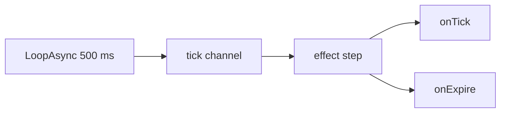
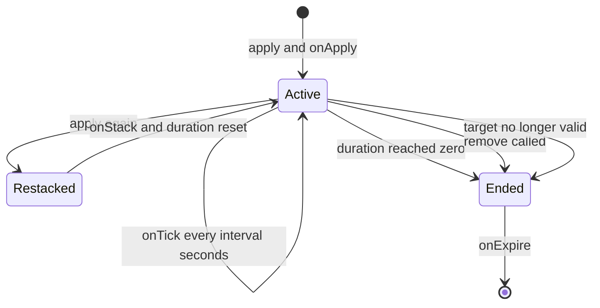

An effect is a status you apply to a target: a buff, a debuff, damage over time, a
shield. No native game event drives an effect — `api/effect` owns the timing itself. It
subscribes to the `tick` channel and advances every live application on the heartbeat, so
`duration`, `interval`, stacking and expiry are real behaviour, not a declaration waiting
for a native hook.

```lua title="content/regen.lua"
local Regen = Effect{
    id       = "example:Regen",
    name     = "Regeneration",
    duration = 10.0,   -- seconds
    interval = 1.0,    -- seconds between onTick calls
    events = {
        onApply  = function(effect, target, ctx) end,
        onTick   = function(effect, target, ctx) end,
        onExpire = function(effect, target, ctx) end,
    },
}

Regen:apply(Player.character())
```

Ten seconds later the application is gone, having fired `onTick` ten times.

<Callout type="warn">
A PalForge effect does **not** toggle the game's own status icon. Palworld's ailments are
the native `EPalStatusEffectType` enum, and no native call to apply one has been
confirmed, so nothing in this module reaches that system — the `nativeStatus` field is
carried onto the definition and read by nobody. Whatever the effect is supposed to *do*
must live in your handlers: `onApply`, `onTick` and `onExpire` are where you heal, damage,
buff or log through whatever call you have. The schedule around them works; the ailment
toggle does not exist.
</Callout>

## Defining an effect

The module is the constructor. Calling `Effect{ ... }` validates the table, registers the
definition in `core/object_manager` under `("effect", id)`, and returns an
`Effect.Handle`.

```lua
local Effect = require("palforge.api.effect")   -- or the installed global

local Chill = Effect{ id = "example:Chill" }    -- id is the only required field
```

`id` may be any name. Unlike `Pal` or `Item` there is no game DataTable behind an effect
id, so `"example:Chill"` and `"Chill"` are equally valid; the namespaced form only keeps
you from colliding with another pack.

Validation is strict, and every problem is a hard error that aborts the call:

```lua
Effect{ id = "example:Chill", durationSec = 10 }
Effect{ name = "no id" }
Effect{ id = "example:Chill", events = { onRemove = function() end } }
Effect{ id = "example:Chill", stackable = "yes" }
```

```text
PalForge: Effect: unknown field "durationSec" (did you mean "duration"?). Valid fields: id, name, description, duration, interval, stackable, maxStacks, icon, nativeStatus, events, data
PalForge: Effect: field "id" is required (effect id: a name or "pack:name")
PalForge: Effect: field "events" (Effect.Spec.Events): unknown field "onRemove". Valid fields: onApply, onTick, onStack, onExpire
PalForge: Effect: field "stackable" expects boolean, got string
```

The shape is declared as data, so it is readable at runtime:

```lua
local schema = require("palforge.core.schema")

print(schema.help("Effect.Spec"))
print(schema.help("Effect.Spec.Events"))
schema.get("Effect.Spec").fields   -- the same, as a table, for tooling
```

## Spec fields

<TypeTable
  type={{
    id: { description: 'effect id: a name or pack:name. The only required field', type: 'string', required: true },
    name: { description: 'shown on the status bar; defaults to id', type: 'string' },
    description: { description: 'one-line description, for UI and tooling', type: 'string' },
    duration: { description: 'total lifetime in seconds. Omit for an application that runs until :remove', type: 'number' },
    interval: { description: 'seconds between onTick calls. Omit for no periodic tick', type: 'number' },
    stackable: { description: 'may several copies coexist on one target', type: 'boolean', default: 'false' },
    maxStacks: { description: 'stack ceiling when stackable is true', type: 'number', default: '1' },
    icon: { description: 'status-bar icon. Stored on the definition and returned by :iconOf', type: 'any' },
    nativeStatus: { description: 'the EPalStatusEffectType this mirrors. Stored only; nothing applies it', type: 'string' },
    events: { description: 'lifecycle handlers, grouped: Effect.Spec.Events', type: 'table' },
    data: { description: 'free-form payload of your own, carried onto the definition', type: 'table' },
  }}
/>

`duration` and `interval` are **seconds**, as floats. `data` lives on the definition, not
on an application — see [Per-application state](#per-application-state).

## The timing runtime

Nothing native drives an effect. `api/effect` keeps a table of live applications and
advances them from `core/event`'s `tick` channel.



The subscription is installed lazily, on the **first** `:apply` anywhere in the process —
requiring the module costs nothing and adds no tick subscriber. If requiring
`core/event` fails at that moment, `:apply` returns `false` and no application is
created; every other call returns `true`.

One heartbeat does this to every live application, in order:

1. if the target is no longer valid, fire `onExpire` with `reason = "target_gone"` and drop it
2. otherwise add `0.5` to `elapsed`
3. add `0.5` to the interval accumulator and fire `onTick` while the accumulator has reached `interval`
4. subtract `0.5` from the remaining duration, and fire `onExpire` with `reason = "duration"` once it reaches zero

`event.TICK_MS` is `500`, so the runtime advances by exactly **0.5 s per step**. Your
seconds are therefore quantized to that grid:

| Declared | What actually happens |
| --- | --- |
| `duration = 10.0` | ends on the 20th heartbeat |
| `duration = 0.2` | ends on the 1st heartbeat, 0.5 s after `:apply` |
| `interval = 1.0` | `onTick` on every 2nd heartbeat, at `elapsed` 1.0, 2.0, 3.0 |
| `interval = 0.75` | `onTick` at `elapsed` 1.0, 1.5, 2.5, 3.0, 4.0 |
| `interval = 0.1` | five `onTick` calls back to back inside a single heartbeat |

The accumulator carries its remainder, so an interval that is not a multiple of 0.5 keeps
the right long-run rate — only the moment each tick lands is snapped to the grid. An
interval below 0.5 does not slow down; it batches, firing several times in the same frame.

Because `onTick` is processed before the duration check, the last tick of an effect whose
`duration` is a multiple of its `interval` lands on the same heartbeat as `onExpire`:

```lua
Effect{ id = "example:Two", duration = 2.0, interval = 1.0, events = {
    onTick   = function(e, target, ctx) print("tick", ctx.elapsed) end,
    onExpire = function(e, target, ctx) print("expire", ctx.reason, ctx.elapsed) end,
} }:apply(Player.character())
```

```text
tick    1.0
tick    2.0
expire  duration  2.0
```

The life of one application:



`onApply` fires **synchronously**, inside the `:apply` call itself — not on the next
heartbeat. Everything after that is on the grid.

### Targets, and what counts as alive

An application is keyed by `(target, effect id)`. The target table is **weak-keyed**: an
application never keeps a pawn alive, and a garbage-collected target takes its
applications with it.

A target is considered alive when it is a plain Lua table, or when it is engine userdata
whose `IsValid()` still returns true. Once a pawn goes invalid the next heartbeat expires
its applications with `reason = "target_gone"`.

`:apply()` with no target is legal: applications with a `nil` target go into a single
world-global bucket, and their handlers receive `target = nil`.

```lua
local Curse = Effect{ id = "example:Curse", duration = 60.0 }

Curse:apply()                       -- global application, no target
Curse:isActive()                    -- true
Effect.activeOn()                   -- { "example:Curse" }
```

<Callout type="warn">
That bucket is also where a *missing* target ends up. `Player.character()` returns `nil`
before a world is loaded, so `MyEffect:apply(Player.character())` on the title screen
silently applies the effect globally and reports success. Guard the target before you
pass it.
</Callout>

<Callout type="info">
The runtime is not persisted and not reset on world change: `api/effect` subscribes to
`tick` and to nothing else, so nothing clears applications on `world.left`. Applications
on a pawn end by themselves once that pawn goes invalid, but a global application or one
keyed on a plain table survives a world reload until you call `:remove`.
</Callout>

## Events

All four handlers are LIVE. Each is called as `handler(effect, target, ctx)`:

- `effect` — this definition's **handle**, so `:remove`, `:stacksOn` and `:timeLeft` are right there
- `target` — whatever was passed to `:apply`, or `nil` for a global application
- `ctx` — a plain table, contents per event

<TypeTable
  type={{
    onApply: { description: 'LIVE. Fires synchronously inside :apply, when no application of this effect exists on the target yet', type: 'fun(self, target, ctx)' },
    onTick: { description: 'LIVE. Fires every interval seconds while the application is live. Never fires when interval is omitted', type: 'fun(self, target, ctx)' },
    onStack: { description: 'LIVE. Fires instead of onApply when :apply hits a target that already has this effect', type: 'fun(self, target, ctx)' },
    onExpire: { description: 'LIVE. Fires once when the duration elapses, :remove is called, or the target goes invalid', type: 'fun(self, target, ctx)' },
  }}
/>

The keys on `ctx`:

| Event | `ctx.effect` | `ctx.stacks` | `ctx.elapsed` | `ctx.reason` | Your `:apply` ctx |
| --- | --- | --- | --- | --- | --- |
| `onApply` | the effect id | `1` | — | — | yes |
| `onTick` | the effect id | current stacks | seconds since apply | — | no |
| `onStack` | the effect id | stacks after the increment | — | — | yes |
| `onExpire` | the effect id | stacks at the end | seconds since apply | see below | no |

`ctx.reason` on `onExpire` is one of three strings:

| `reason` | Cause |
| --- | --- |
| `"duration"` | the declared `duration` ran out |
| `"removed"` | `:remove(target)` was called |
| `"target_gone"` | the target stopped being valid |

In the snippets below, `log` is `require("palforge.utils.log").scope("example")`.

```lua
local Shield = Effect{
    id       = "example:Shield",
    name     = "Shield",
    duration = 12.0,
    interval = 3.0,
    events = {
        onApply = function(effect, target, ctx)
            log.info(string.format("%s up on %s", ctx.effect, tostring(target)))
        end,
        onTick = function(effect, target, ctx)
            log.info(string.format("%.1fs elapsed, %.1fs left",
                ctx.elapsed, effect:timeLeft(target) or -1))
        end,
        onExpire = function(effect, target, ctx)
            if ctx.reason == "target_gone" then return end
            log.info("shield down: " .. ctx.reason)
        end,
    },
}
```

### Passing your own context

The second argument to `:apply` is handed to `onApply` and `onStack`. It is not copied —
the `ctx` those handlers receive is a small table with `effect` and `stacks` on it and
your table behind an `__index` metatable.

```lua
local Mark = Effect{
    id       = "example:Mark",
    duration = 20.0,
    events = {
        onApply = function(effect, target, ctx)
            log.info("marked by " .. tostring(ctx.source))   -- reads through __index
            for k in pairs(ctx) do print(k) end              -- prints only: effect, stacks
        end,
    },
}

Mark:apply(pawn, { source = "trap", power = 3 })
```

So look your keys up by name. Iterating `ctx` with `pairs` will not see them, and neither
will `onTick` or `onExpire` — those two build their own context and never see the table
you passed.

### Handler errors are swallowed

Every handler call the runtime makes is wrapped in `pcall`. A handler that raises does not
stop the heartbeat, does not affect other applications, and does not disable itself — but
the error is discarded without being logged. Wrap risky work yourself if you want to see it:

```lua
onTick = function(effect, target, ctx)
    local ok, err = pcall(function() target:SomethingNative() end)
    if not ok then log.err("tick failed: " .. tostring(err)) end
end,
```

## Stacking

Re-applying an effect that is already live on a target never creates a second
application. It always does two things, and `stackable` only controls the first:

1. if `stackable` is true **and** the current count is below `maxStacks`, add one stack
2. reset the remaining duration to the full declared `duration`

Then `onStack` fires instead of `onApply`.

```lua
local Rage = Effect{
    id        = "example:Rage",
    name      = "Rage",
    duration  = 8.0,
    stackable = true,
    maxStacks = 5,
    events = {
        onApply = function(effect, target, ctx) log.info("rage 1") end,
        onStack = function(effect, target, ctx) log.info("rage " .. ctx.stacks) end,
    },
}

Rage:apply(pawn)          -- onApply, stacks = 1, 8.0s left
Rage:apply(pawn)          -- onStack, stacks = 2, back to 8.0s
Rage:apply(pawn)          -- onStack, stacks = 3
Rage:stacksOn(pawn)       --> 3
```

Once the ceiling is reached, `:apply` still fires `onStack` and still refreshes the
duration — only the count stops moving:

```lua
for _ = 1, 20 do Rage:apply(pawn) end
Rage:stacksOn(pawn)       --> 5, and onStack fired 19 times
```

<Callout type="warn">
`maxStacks` defaults to `1`. `stackable = true` without `maxStacks` gives you an effect
that fires `onStack` and refreshes its duration but whose count never leaves `1`. Set both.
</Callout>

A non-stackable effect behaves the same minus the counter — re-applying is how you
refresh a duration:

```lua
local Wet = Effect{
    id       = "example:Wet",
    duration = 6.0,          -- stackable defaults to false
    events = {
        onStack = function(effect, target, ctx)
            log.info("still wet, timer back to 6s, stacks = " .. ctx.stacks)  -- always 1
        end,
    },
}
```

There is one shared count per target and effect id, and it never decays on its own. A
single `onExpire` ends the whole application regardless of how many stacks it holds. See
[the recipe below](#a-stacking-buff) for making stacks fall off one at a time.

## The handle

`Effect{ ... }`, `Effect.get(id)` and `Effect.get_all()` all hand you an `Effect.Handle`.
The methods that touch a live application take the target as their argument, and `nil`
means the global bucket; the ones that only read the declaration take nothing.

| Method | Returns | Notes |
| --- | --- | --- |
| `:apply(target, ctx)` | `boolean` | starts or re-stacks an application; `false` only when the tick driver could not be installed |
| `:remove(target)` | `boolean` | `true` when an application was ended, `false` when there was none |
| `:isActive(target)` | `boolean` | is an application live right now |
| `:stacksOn(target)` | `integer` | current stack count, `0` when inactive |
| `:timeLeft(target)` | `number?` | seconds remaining; `nil` when the effect has no `duration`, `0` when inactive |
| `:name()` | `string` | the declared `name`, else the id |
| `:description()` | `string?` | the declared `description` |
| `:duration()` | `number?` | the declared `duration` |
| `:interval()` | `number?` | the declared `interval` |
| `:iconOf()` | `any?` | the declared `icon`; there is no DataTable lookup for effects |

```lua
local Poisoned = Effect.get("Poison")

if not Poisoned:isActive(pawn) then
    Poisoned:apply(pawn)
end

print(Poisoned:stacksOn(pawn))   --> 1
print(Poisoned:timeLeft(pawn))   --> 10.0, then 9.5, 9.0, ...
Poisoned:remove(pawn)            --> true, and onExpire fires with reason "removed"
Poisoned:remove(pawn)            --> false, nothing left to remove
```

<Callout type="info">
`:timeLeft` returns `nil` and `0` for two different situations. `nil` means *active with
no end* — an effect declared without `duration`. `0` means *not active*. Test with
`:isActive` when you need to tell them apart.
</Callout>

The four `on*` methods are also on the handle. Calling one invokes the declared handler
immediately and touches no application state: no timer starts, no stack is counted,
nothing expires. Use them to reuse a handler's body, not to drive an effect.

```lua
Regen:onTick(pawn, { effect = Regen.id, elapsed = 0, stacks = 1 })  -- just calls the body
Regen:apply(pawn)                                                    -- this is what starts it
```

## Looking effects up

```lua
Effect.get("Poison")        -- an existing definition, else a thin one over that id. Never nil
Effect.get_all()            -- every registered effect, as handles
Effect.activeOn(target)     -- the ids currently live on target, sorted
Effect.Class                -- the base definition class, for subclassing
```

`Effect.get` never returns `nil`. For an id nobody defined you get a working handle whose
queries are empty — `:duration()` is `nil`, `:name()` is the id — and whose `:apply`
starts an application that runs forever with no handlers. That is only useful as a marker
you check with `:isActive`.

Defining the same id twice replaces the registration: the last call wins and `Effect.get`
returns the newest definition. A handle you took earlier keeps pointing at the definition
it was built from, so the old timings and the old handlers stay live on any application
started through it.

`Effect.activeOn(target)` is the only way to enumerate a target's statuses. It returns a
sorted array of ids, which you then re-open with `Effect.get`:

```lua
for _, id in ipairs(Effect.activeOn(pawn)) do
    local e = Effect.get(id)
    print(string.format("%-16s %d stack(s), %s",
        e:name(), e:stacksOn(pawn), tostring(e:timeLeft(pawn))))
end
```

```text
Burn             1 stack(s), 3.5
Rage             4 stack(s), 6.0
```

Clearing everything on a target is that loop plus `:remove`:

```lua
local function cleanse(target)
    for _, id in ipairs(Effect.activeOn(target)) do
        Effect.get(id):remove(target)
    end
end
```

## Native ailments

`native/effects.lua` carries three curated definitions, registered at load by
`registry.initialize`. They are reachable through the module or through `Effect.get` —
both give you the same definition.

```lua
local effects = require("palforge.native.effects")

effects.CATALOG            --> { "Poison", "Burn", "Freeze" }
effects.Poison             -- the curated handle
effects.get("Burn")        -- the same handle, by id
effects.get("Sleep")       --> nil, not a known ailment name
Effect.get("Freeze")       -- also the same definition
```

| Id | `duration` | `interval` | `nativeStatus` |
| --- | --- | --- | --- |
| `Poison` | `10.0` | `1.0` | `"Poison"` |
| `Burn` | `5.0` | `1.0` | `"Burn"` |
| `Freeze` | `3.0` | none | `"Freeze"` |

```lua
effects.Burn:apply(pawn)
effects.Burn:timeLeft(pawn)   --> 5.0
```

The schedule these three run is real: apply `Poison` and its application lives for ten
heartbeat-quantized seconds, firing every second. What is missing is the payload — the
`onApply` and `onExpire` bodies in `native/effects.lua` are `-- TODO:` markers where the
native status call would go, and there is no `onTick`. Applying `Burn` today changes
nothing in the game. Treat them as three pre-declared ids with sensible timings, and add
the gameplay in your own definition or by driving them from your own handlers.

<Callout type="warn">
There is no bad-status DataTable to read: Palworld's ailments are an enum
(`EPalStatusEffectType`), and the full enum was not present in the reflection dump, so
`CATALOG` is a hand-maintained list of three names rather than an extracted row list.
`effects.get` returns `nil` for anything else. `Effect.get("Sleep")` still works — it just
gives you a fresh, empty definition rather than a native ailment.
</Callout>

## Per-application state

An application holds exactly what the runtime needs: elapsed time, remaining duration and
a stack count. There is no per-application scratch table. `ctx.elapsed` and `ctx.stacks`
are all the state a handler is handed, and everything else has to be yours.

`data` is not that place. It is stored on the **definition**, so one table is shared by
every target the effect is applied to, and `Effect.Handle` has no accessor for it — from
inside a handler there is no public way to read it back.

Keep your own weak-keyed table, keyed by target, and clear the entry in `onExpire`:

```lua
local state = setmetatable({}, { __mode = "k" })   -- target -> your table

local Bleed = Effect{
    id       = "example:Bleed",
    duration = 6.0,
    interval = 1.0,
    events = {
        onApply = function(effect, target, ctx)
            state[target] = { total = 0, source = ctx.source }
        end,
        onTick = function(effect, target, ctx)
            local s = state[target]
            if not s then return end
            s.total = s.total + 5 * ctx.stacks
        end,
        onExpire = function(effect, target, ctx)
            local s = state[target]
            state[target] = nil
            if s then log.info(string.format("bleed dealt %d from %s", s.total, tostring(s.source))) end
        end,
    },
}
```

Weak keys matter here for the same reason the runtime uses them: a strong reference from
your table would keep a despawned pawn alive. A global application keys on `nil`, which a
Lua table cannot hold, so use a sentinel of your own if you need state for that case.

## Recipes

### Regeneration

A heal over time on the player, restarted whenever it lapses. The healing call itself is
yours — PalForge has no HP API — so this version hands the player one `Berries` per second
and marks where a direct heal would go.

```lua title="content/regen.lua"
local event = require("palforge.core.event")
local log   = require("palforge.utils.log").scope("regen")

local Regen = Effect{
    id          = "example:Regen",
    name        = "Regeneration",
    description = "Restores a little every second for ten seconds.",
    duration    = 10.0,
    interval    = 1.0,
    events = {
        onApply = function(effect, target, ctx)
            log.info("regen up for " .. tostring(effect:duration()) .. "s")
        end,
        onTick = function(effect, target, ctx)
            -- Your heal goes here; this is the part PalForge does not provide.
            -- :give always adds to the LOCAL PLAYER's inventory, whatever `target` is.
            Item.get("Berries"):give(1)
        end,
        onExpire = function(effect, target, ctx)
            log.info("regen over after " .. tostring(ctx.elapsed) .. "s: " .. ctx.reason)
        end,
    },
}

-- Re-arm it every 15 seconds, but only while there is a player to arm it on.
event.every(15000, function()
    local me = Player.character()
    if me and not Regen:isActive(me) then
        Regen:apply(me, { source = "campfire" })
    end
end)

return Regen
```

`event.every` is quantized to the same 500 ms heartbeat as the effect runtime, so the two
never drift apart.

### Damage over time

`Poison` already declares the timing — 10 s at 1 s intervals — but has no `onTick`. Give
the tick a body by defining your own effect next to it, and apply both so the pack stays
compatible with whatever fills in the native ailment later.

```lua title="content/poison_bite.lua"
local effects = require("palforge.native.effects")
local log     = require("palforge.utils.log").scope("poison")

local damage = setmetatable({}, { __mode = "k" })   -- target -> accumulated damage

local Venom = Effect{
    id          = "example:Venom",
    name        = "Venom",
    description = "Ticks damage while it lasts, harder with every stack.",
    duration    = 10.0,
    interval    = 1.0,
    stackable   = true,
    maxStacks   = 3,
    events = {
        onApply = function(effect, target, ctx)
            damage[target] = 0
        end,
        onStack = function(effect, target, ctx)
            log.info("venom deepens to " .. ctx.stacks)
        end,
        onTick = function(effect, target, ctx)
            local perTick = 4 * ctx.stacks
            damage[target] = (damage[target] or 0) + perTick
            -- deal `perTick` to `target` here through whatever call you have
        end,
        onExpire = function(effect, target, ctx)
            local total = damage[target] or 0
            damage[target] = nil
            log.info(string.format("venom ended (%s) after %.1fs, %d total",
                ctx.reason, ctx.elapsed, total))
        end,
    },
}

---Poison a pawn: the native ailment id plus the effect that carries the damage.
local function poison(pawn)
    if not pawn then return false end
    effects.Poison:apply(pawn)
    return Venom:apply(pawn, { source = "bite" })
end

-- A bitten pal keeps poisoning itself while the venom lasts. Defining "ChickenPal" here
-- REPLACES the curated demo definition in native/pals.lua - one id, one definition.
Pal{
    id   = "ChickenPal",
    name = "Chicken Pal",
    events = {
        onDamaged = function(pal, ctx)
            poison(ctx.actor)
        end,
    },
}

return { effect = Venom, poison = poison }
```

Every `onDamaged` re-applies, so the venom refreshes to 10 s and deepens to at most three
stacks. When the chicken finally despawns, the next heartbeat expires both applications
with `reason = "target_gone"` and the accumulator is cleared.

### A stacking buff

Stacks that build up, refresh on every hit, and set something off at the ceiling.

```lua title="content/rage.lua"
local effects = require("palforge.native.effects")
local event   = require("palforge.core.event")
local log     = require("palforge.utils.log").scope("rage")

local MAX = 5

local Rage = Effect{
    id          = "example:Rage",
    name        = "Rage",
    description = "Builds with every hit taken and ignites at full stacks.",
    duration    = 8.0,
    interval    = 2.0,
    stackable   = true,
    maxStacks   = MAX,
    events = {
        onApply = function(effect, target, ctx)
            log.info("rage 1/" .. MAX)
        end,
        onStack = function(effect, target, ctx)
            log.info(string.format("rage %d/%d", ctx.stacks, MAX))
            if ctx.stacks == MAX then
                effects.Burn:apply(target)      -- 5s of the native Burn id
            end
        end,
        onTick = function(effect, target, ctx)
            -- apply the per-stack bonus here; ctx.stacks is the current count
        end,
        onExpire = function(effect, target, ctx)
            log.info(string.format("rage fell off at %d stacks (%s)", ctx.stacks, ctx.reason))
        end,
    },
}

-- Any damaged pal builds rage. The duration resets on every hit, so a pal that keeps
-- taking damage keeps the stacks; eight quiet seconds and the whole thing drops at once.
event.on("pal.damaged", function(ctx)
    if ctx.actor then Rage:apply(ctx.actor, { source = "damage" }) end
end)

return Rage
```

Note what `onExpire` does *not* do: stacks do not fall off one at a time. The application
ends whole, at whatever count it held.

<Callout type="warn">
Do not start a *new* application from inside `onTick` or `onExpire`. Those handlers run
while the runtime is walking the application tables with `pairs`, and an `:apply` that
adds a key to a table being walked is undefined in Lua: a target that had no application
yet, another effect on the same target, or the same effect from its own `onExpire`, whose
key the runtime cleared just before calling you. Re-applying the same effect from its own
`onTick` only rewrites fields on the application that is already there, and `:remove` only
clears one, so both of those are safe.
</Callout>

Drive a decay from a separate `tick` subscriber instead. A subscriber of your own runs
outside the runtime's step, so no application table is being iterated while it runs:

```lua
local event = require("palforge.core.event")

---Bleed one stack of `effect` off `target` every two seconds.
---Returns the subscription, so call :unsubscribe() on it when you are done.
local function decay(effect, target)
    return event.every(2000, function()
        local n = effect:stacksOn(target)
        if n > 1 then
            effect:remove(target)                                -- fires onExpire
            for _ = 1, n - 1 do effect:apply(target) end          -- rebuild one lower
        end
    end)
end
```

### An effect that ends when the target dies

The runtime already expires an application once its target stops being valid, but that is
a fallback, not a death hook: a dead pawn can stay valid for a while, and the check only
runs on the next heartbeat. When you want the effect gone at the moment of death, hang it
off the `pal.death` channel.

```lua title="content/frostbite.lua"
local effects = require("palforge.native.effects")
local event   = require("palforge.core.event")
local log     = require("palforge.utils.log").scope("frostbite")

local killed = setmetatable({}, { __mode = "k" })   -- pawns whose effects we cleared on death

local Frostbite = Effect{
    id          = "example:Frostbite",
    name        = "Frostbite",
    description = "Slows a captured pal until it thaws.",
    duration    = 30.0,
    interval    = 5.0,
    events = {
        onApply = function(effect, target, ctx)
            log.info("frostbite on " .. tostring(target))
        end,
        onTick = function(effect, target, ctx)
            log.info(string.format("still frozen at %.1fs", ctx.elapsed))
        end,
        onExpire = function(effect, target, ctx)
            local why = killed[target] and "the target died" or ctx.reason
            killed[target] = nil
            log.info("frostbite cleared: " .. why)
        end,
    },
}

-- Freeze plus the long frostbite when a sheepball is caught.
Pal{
    id   = "SheepBall",
    name = "Sheepball",
    events = {
        onCaptured = function(pal, ctx)
            effects.Freeze:apply(ctx.actor)      -- 3s, the native ailment id
            Frostbite:apply(ctx.actor, { source = "sphere" })
        end,
    },
}

-- Death clears every PalForge effect on the pawn, right away.
event.on("pal.death", function(ctx)
    local pawn = ctx.actor
    if not pawn then return end
    killed[pawn] = true
    for _, id in ipairs(Effect.activeOn(pawn)) do
        Effect.get(id):remove(pawn)
    end
end)

return Frostbite
```

<Callout type="info">
`:remove` always reports `reason = "removed"`, so `onExpire` on its own cannot tell a
death from a manual cleanse. The three reasons the runtime produces are `"duration"`,
`"removed"` and `"target_gone"`, and nothing can be added to that list — which is why the
death hook above records the pawn in a weak-keyed table first and `onExpire` reads it back.
</Callout>

Dropping the death hook entirely is a valid choice for a short effect: the pawn goes
invalid on despawn and the application ends on its own within a heartbeat, with
`reason = "target_gone"`.

<Cards>
  <Card title="Pal" href="/docs/api/pal">Where `onDamaged`, `onDeath` and `onCaptured` come from</Card>
  <Card title="Skill" href="/docs/api/skill">Manual activation, the other half of an ability</Card>
  <Card title="Player" href="/docs/api/player">Getting a target to apply an effect to</Card>
  <Card title="Lifecycle" href="/docs/concepts/lifecycle">The `tick` channel that drives all of this</Card>
</Cards>
