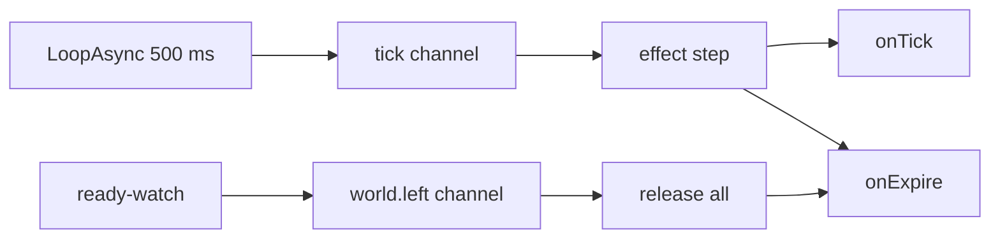
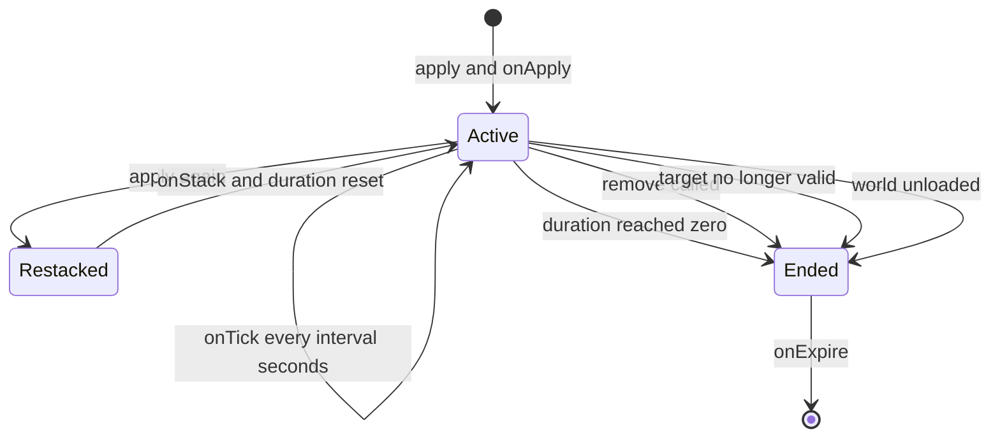

## 读完本页你可以做到

- 一点一点地回复角色，持续多久由你决定
- 让目标中毒或燃烧，每秒掉一次血
- 给出一个临时增益，时间到了自己消失
- 让同一个状态叠成多层，每次重新命中都刷新时间
- 提前清掉一个状态，或者查它还剩多少时间

效果是你给角色附加的状态，对象是玩家或者帕鲁。增益、减益、持续伤害、护盾都算。
你只要写清楚它持续多久、每隔多久做一次事，计时交给 PalForge。

```lua title="content/regen.lua"
local Regen = Effect{
    id       = "example:Regen",
    name     = "Regeneration",
    duration = 10.0,   -- seconds
    interval = 1.0,    -- seconds between onTick calls
    events = {
        onApply  = function(effect, target, ctx) end,
        onTick   = function(effect, target, ctx) end,
        onExpire = function(effect, target, ctx) end,
    },
}

Regen:apply(Player.character())
```

十秒后它从玩家身上消失，期间 `onTick` 执行了十次。

<Callout type="warn">
你自己写的效果**不会**点亮游戏本体的状态图标，也就是 Palworld 在血条上显示的中毒、燃烧
那些小符号。它们属于游戏自己的列表（`EPalStatusEffectType`），目前还没有确认可以从 Lua
点亮它们的办法。`nativeStatus` 字段会存在你的定义上，但没有任何地方读回它。所以，效果实际
要*做*的事请写进处理函数：回复、伤害、增益或者打日志，都放进 `onApply`、`onTick` 和
`onExpire`。围绕它们的计时今天就能用。
</Callout>

## 定义一个效果

写 `Effect{ ... }` 就能做出一个。返回的是一个句柄，`:apply`、`:remove` 和各种查询方法都直接
长在上面。

```lua
local Effect = require("palforge.api.effect")   -- or the installed global

local Chill = Effect{ id = "example:Chill" }    -- id is the only required field
```

`id` 可以是你喜欢的任何名字。效果的 id 不和游戏自身的数据绑定，所以 `"example:Chill"` 和
`"Chill"` 都能用。`pack:name` 这种写法是为了让你的 id 不和别的内容包撞车。

写错了，调用会直接报错停下，所以打错一个字不会留下注册了一半的东西：

```lua
Effect{ id = "example:Chill", durationSec = 10 }
Effect{ name = "no id" }
Effect{ id = "example:Chill", events = { onRemove = function() end } }
Effect{ id = "example:Chill", stackable = "yes" }
```

```text
PalForge: Effect: unknown field "durationSec" (did you mean "duration"?). Valid fields: id, name, description, duration, interval, stackable, maxStacks, icon, nativeStatus, events, data
PalForge: Effect: field "id" is required (effect id: a name or "pack:name")
PalForge: Effect: field "events" (Effect.Spec.Events): unknown field "onRemove". Valid fields: onApply, onTick, onStack, onExpire
PalForge: Effect: field "stackable" expects boolean, got string
```

游戏运行时，你可以把每个字段、它的类型和含义都打印出来：

```lua
local schema = require("palforge.core.schema")

print(schema.help("Effect.Spec"))
print(schema.help("Effect.Spec.Events"))
schema.get("Effect.Spec").fields   -- the same, as a table, for tooling
```

## Spec 的字段

大多数效果只需要三样东西：`id`、`duration`，如果要反复做点什么就再加一个 `interval`。
可以传的全部字段在下面。

<TypeTable
  type={{
    id: { description: '效果 id。一个名字，或者 pack:name 形式。唯一必填的字段', type: 'string', required: true },
    name: { description: '显示在状态栏上的名字。省略时用 id', type: 'string' },
    description: { description: '一行说明，给界面和工具用', type: 'string' },
    duration: { description: '持续多久，单位秒。省略的话效果一直跑到你调用 :remove', type: 'number' },
    interval: { description: 'onTick 之间隔多少秒。省略的话 onTick 永远不会跑', type: 'number' },
    stackable: { description: '同一个目标上能不能叠好几层', type: 'boolean', default: 'false' },
    maxStacks: { description: 'stackable 为 true 时的层数上限', type: 'number', default: '1' },
    icon: { description: '状态栏图标。存在定义上，由 :iconOf 返回', type: 'any' },
    nativeStatus: { description: '它对应的 EPalStatusEffectType。只是存着，没有任何东西会应用它', type: 'string' },
    events: { description: '生命周期处理函数，归在一起: Effect.Spec.Events', type: 'table' },
    data: { description: '你自己的任意数据，跟着定义走', type: 'table' },
  }}
/>

`duration` 和 `interval` 的单位都是**秒**，可以带小数。`data` 只在定义上存一份，所以每个
目标共用同一张表；想为每个目标单独记点什么，见
[为每个目标保存自己的数据](#为每个目标保存自己的数据)。

## 计时是怎么走的

PalForge 有一个每 500 毫秒跳一次的心跳，所有正在运行的效果都跟着它往前走。

一个效果作用在一个目标上，叫做一次**施加**。它记着已过去的时间、剩余时间和层数。
`:apply` 开始一次施加；持续时间用完、你把它移除、目标消失、或者世界卸载时，它就结束。



心跳是在第一次有人调用 `:apply` 时接上的。只是 require 这个模块不花任何代价，也不会加
监听。接的时候一次接两个：`tick` 用来推进每一次施加，`world.left` 用来在世界消失时释放
它们。如果那一刻接不上，`:apply` 返回 `false`，不会开始任何施加；其他情况都返回 `true`。

一次心跳会对每一次活着的施加按顺序做这些事：

1. 如果目标已经无效，用 `reason = "target_gone"` 触发 `onExpire`，然后丢掉它
2. 否则给 `elapsed` 加上 `0.5`
3. 给 interval 的累加器加上 `0.5`，只要累加器达到了 `interval` 就触发 `onTick`
4. 从剩余时间里减去 `0.5`，减到零时用 `reason = "duration"` 触发 `onExpire`

`event.TICK_MS` 是 `500`，所以每一步正好推进 **0.5 秒**。你写的秒数会被对齐到这个刻度上：

| 你声明的 | 实际发生的 |
| --- | --- |
| `duration = 10.0` | 第 20 次心跳时结束 |
| `duration = 0.2` | 第 1 次心跳，也就是 `:apply` 之后 0.5 秒结束 |
| `interval = 1.0` | 每 2 次心跳触发一次 `onTick`，`elapsed` 是 1.0、2.0、3.0 |
| `interval = 0.75` | 在 `elapsed` 1.0、1.5、2.5、3.0、4.0 触发 `onTick` |
| `interval = 0.1` | 一次心跳里连着调用五次 `onTick` |

累加器会留着余数，所以就算 interval 不是 0.5 的倍数，长期看频率仍然是对的，被对齐到刻度上
的只是每次 tick 落下的那一刻。小于 0.5 的 interval 不会变慢，而是在同一帧里触发好几次。

`onTick` 在检查剩余时间之前处理，所以当 `duration` 是 `interval` 的整数倍时，最后一次 tick
会和 `onExpire` 落在同一次心跳上：

```lua
Effect{ id = "example:Two", duration = 2.0, interval = 1.0, events = {
    onTick   = function(e, target, ctx) print("tick", ctx.elapsed) end,
    onExpire = function(e, target, ctx) print("expire", ctx.reason, ctx.elapsed) end,
} }:apply(Player.character())
```

```text
tick    1.0
tick    2.0
expire  duration  2.0
```

一次施加的一生：



`onApply` 就在 `:apply` 这次调用里立刻跑，不等下一次心跳。之后的一切都走刻度。

### 目标，以及怎样算还活着

一个目标上，每个效果 id 只能带一次施加。存放它们的表用的是**弱引用键**：一次施加不会让
pawn（游戏里的角色实体）继续留在内存里，被 Lua 回收掉的目标会把自己身上的施加一起带走。

目标算活着，有两种情况：它是一张普通的 Lua 表，或者它是引擎数据而 `IsValid()` 仍然返回
true。pawn 一旦变成无效，下一次心跳就用 `reason = "target_gone"` 结束它身上的施加。

不带目标调用 `:apply()` 也可以。目标为 `nil` 的施加会进到一个全局的桶里，它们的处理函数
拿到的 `target` 是 `nil`。

```lua
local Curse = Effect{ id = "example:Curse", duration = 60.0 }

Curse:apply()                       -- global application, no target
Curse:isActive()                    -- true
Effect.activeOn()                   -- { "example:Curse" }
```

<Callout type="warn">
这个桶也是目标*丢失*时的去处。世界加载之前 `Player.character()` 返回 `nil`，所以在标题
画面调用 `MyEffect:apply(Player.character())`，效果会悄悄地施加到全局，还会报告成功。
传之前先检查目标。
</Callout>

<Callout type="info">
施加只放在内存里，从不写进存档。在同一个世界里，pawn 身上的施加会在这个 pawn 失效时自己
结束；全局的那一个，或者以普通 Lua 表为键的那些，会一直留到 `duration` 用完，或者你调用
`:remove`。世界卸载会把它们一次全部结束，见[世界卸载的时候](#世界卸载的时候)。
</Callout>

### 世界卸载的时候

`core/event` 盯着玩家 pawn，它一失效就发出 `world.left`。所有目标上的所有施加，加上全局
桶里的那些，都会用 `reason = "world_left"` 触发 `onExpire` 然后被丢掉。之后
`Effect.activeOn` 返回空，后面的心跳也没有东西可推进了。

`"world_left"` 是一个单独的 reason，所以处理函数能把世界卸载和持续时间到期、`:remove`、
目标消失区分开。用它来清理你自己为那个目标记下的东西，而不去跑正常到期时才该跑的玩法。

```lua title="content/hunger.lua"
local event = require("palforge.core.event")
local log   = require("palforge.utils.log").scope("hunger")

local drained = setmetatable({}, { __mode = "k" })   -- target -> your own bookkeeping

local Hunger = Effect{
    id          = "example:Hunger",
    name        = "Hunger",
    description = "Drains while the player is out in the world.",
    duration    = 120.0,
    interval    = 10.0,
    events = {
        onApply = function(effect, target, ctx)
            drained[target] = 0
        end,
        onTick = function(effect, target, ctx)
            drained[target] = (drained[target] or 0) + 1
        end,
        onExpire = function(effect, target, ctx)
            local total = drained[target] or 0
            drained[target] = nil
            if ctx.reason == "world_left" then
                log.info("world unloaded, hunger released at " .. total)
                return                       -- no payout: the world is going away
            end
            log.info(string.format("hunger ended (%s) after %d ticks", ctx.reason, total))
        end,
    },
}

-- Nothing is restored for you. The next world starts empty, so apply again on world.ready.
event.on("world.ready", function()
    local me = Player.character()
    if me then Hunger:apply(me, { source = "world.ready" }) end
end)

return Hunger
```

施加只活在内存里：不写磁盘，也不会排队等下一个世界。想在换了世界之后把效果找回来，就像
上面那样，从你自己的触发点重新施加一次。

## 事件

四个处理函数都会真的触发。每个都以 `handler(effect, target, ctx)` 的形式调用：

- `effect` — 这份定义的**句柄**，所以 `:remove`、`:stacksOn` 和 `:timeLeft` 随手就能用
- `target` — 传给 `:apply` 的东西；全局施加时是 `nil`
- `ctx` — 一张普通的表，内容按事件不同

<TypeTable
  type={{
    onApply: { description: '在 :apply 里面跑，条件是目标还没有这个效果', type: 'fun(self, target, ctx)' },
    onTick: { description: '效果挂在目标身上期间，每隔 interval 秒跑一次。省略 interval 就永远不跑', type: 'fun(self, target, ctx)' },
    onStack: { description: '对已经有这个效果的目标 :apply 时，代替 onApply 执行', type: 'fun(self, target, ctx)' },
    onExpire: { description: 'duration 走完、调用 :remove、目标失效、世界卸载，这四种情况各跑一次', type: 'fun(self, target, ctx)' },
  }}
/>

`ctx` 上的键：

| 事件 | `ctx.effect` | `ctx.stacks` | `ctx.elapsed` | `ctx.reason` | 你传给 `:apply` 的 ctx |
| --- | --- | --- | --- | --- | --- |
| `onApply` | 效果 id | `1` | — | — | 看得到 |
| `onTick` | 效果 id | 当前层数 | 距 apply 的秒数 | — | 看不到 |
| `onStack` | 效果 id | 加一之后的层数 | — | — | 看得到 |
| `onExpire` | 效果 id | 结束时的层数 | 距 apply 的秒数 | 见下 | 看不到 |

`onExpire` 上的 `ctx.reason` 是这四个字符串之一：

| `reason` | 原因 |
| --- | --- |
| `"duration"` | 声明的 `duration` 用完了 |
| `"removed"` | 调用了 `:remove(target)` |
| `"target_gone"` | 目标不再有效 |
| `"world_left"` | 世界卸载，所有正在运行的施加都被释放 |

下面的片段里，`log` 是 `require("palforge.utils.log").scope("example")`。

```lua
local Shield = Effect{
    id       = "example:Shield",
    name     = "Shield",
    duration = 12.0,
    interval = 3.0,
    events = {
        onApply = function(effect, target, ctx)
            log.info(string.format("%s up on %s", ctx.effect, tostring(target)))
        end,
        onTick = function(effect, target, ctx)
            log.info(string.format("%.1fs elapsed, %.1fs left",
                ctx.elapsed, effect:timeLeft(target) or -1))
        end,
        onExpire = function(effect, target, ctx)
            if ctx.reason == "target_gone" then return end
            log.info("shield down: " .. ctx.reason)
        end,
    },
}
```

### 传入你自己的上下文

`:apply` 的第二个参数会送到 `onApply` 和 `onStack`。它不会被复制。这两个处理函数拿到的
`ctx` 是一张只装着 `effect` 和 `stacks` 的小表，你的表垫在它后面，所以 `ctx.source` 会一路
读到你的表里。

```lua
local Mark = Effect{
    id       = "example:Mark",
    duration = 20.0,
    events = {
        onApply = function(effect, target, ctx)
            log.info("marked by " .. tostring(ctx.source))   -- reads through __index
            for k in pairs(ctx) do print(k) end              -- prints only: effect, stacks
        end,
    },
}

Mark:apply(pawn, { source = "trap", power = 3 })
```

所以要按名字取键。用 `pairs` 遍历 `ctx` 是看不到它们的。`onTick` 和 `onExpire` 也看不到，
这两个自己另建上下文，从不碰你传进去的表。

### 处理函数里出错的时候

每一次处理函数调用都包在 `pcall` 里。抛出错误的处理函数不会让心跳停下，不会影响别的效果，
也不会把它自己关掉，但这个错误会被直接丢掉，连日志都不记。想看到它，就自己把有风险的部分
包起来：

```lua
onTick = function(effect, target, ctx)
    local ok, err = pcall(function() target:SomethingNative() end)
    if not ok then log.err("tick failed: " .. tostring(err)) end
end,
```

## 叠层

对一个已经带着这个效果的目标再次施加，永远不会创建第二次施加。它一定会做两件事，而
`stackable` 只管第一件：

1. 如果 `stackable` 是 true **并且**当前层数还没到 `maxStacks`，就加一层
2. 把剩余时间重置回声明的完整 `duration`

然后执行 `onStack`，而不是 `onApply`。

```lua
local Rage = Effect{
    id        = "example:Rage",
    name      = "Rage",
    duration  = 8.0,
    stackable = true,
    maxStacks = 5,
    events = {
        onApply = function(effect, target, ctx) log.info("rage 1") end,
        onStack = function(effect, target, ctx) log.info("rage " .. ctx.stacks) end,
    },
}

Rage:apply(pawn)          -- onApply, stacks = 1, 8.0s left
Rage:apply(pawn)          -- onStack, stacks = 2, back to 8.0s
Rage:apply(pawn)          -- onStack, stacks = 3
Rage:stacksOn(pawn)       --> 3
```

到了上限之后，`:apply` 仍然执行 `onStack`，仍然刷新持续时间，只有层数不再动：

```lua
for _ = 1, 20 do Rage:apply(pawn) end
Rage:stacksOn(pawn)       --> 5, and onStack fired 19 times
```

<Callout type="warn">
`maxStacks` 的默认值是 `1`。只写 `stackable = true`，你得到的效果会执行 `onStack`、会刷新
持续时间，但层数永远停在 `1`。两个都要写。
</Callout>

不叠层的效果行为一样，只是少了计数器，再施加一次就是刷新持续时间的办法：

```lua
local Wet = Effect{
    id       = "example:Wet",
    duration = 6.0,          -- stackable defaults to false
    events = {
        onStack = function(effect, target, ctx)
            log.info("still wet, timer back to 6s, stacks = " .. ctx.stacks)  -- always 1
        end,
    },
}
```

每个目标、每个效果 id 只有一个层数，而且它不会自己往下掉。不管手上有多少层，一次
`onExpire` 就把整件事结束。想让层数一层一层地掉，见[下面的做法](#叠层的增益)。

## 句柄

`Effect{ ... }`、`Effect.get(id)` 和 `Effect.get_all()` 给你的都是一个 `Effect.Handle`。
操作运行中效果的方法要把目标当参数传进去，`nil` 表示全局的那个桶；只读取声明内容的方法
不接参数。

| 方法 | 返回 | 说明 |
| --- | --- | --- |
| `:apply(target, ctx)` | `boolean` | 开始一次施加，或者重新叠一层；只有接不上心跳时才是 `false` |
| `:remove(target)` | `boolean` | 结束了一次施加就是 `true`，本来就没有就是 `false` |
| `:isActive(target)` | `boolean` | 现在是不是正在运行 |
| `:stacksOn(target)` | `integer` | 当前层数，没在运行时是 `0` |
| `:timeLeft(target)` | `number?` | 剩余秒数；效果没有 `duration` 时是 `nil`，没在运行时是 `0` |
| `:name()` | `string` | 声明的 `name`，没有就是 id |
| `:description()` | `string?` | 声明的 `description` |
| `:duration()` | `number?` | 声明的 `duration` |
| `:interval()` | `number?` | 声明的 `interval` |
| `:iconOf()` | `any?` | 声明的 `icon`；效果不会去游戏的数据表里查 |

```lua
local Poisoned = Effect.get("Poison")

if not Poisoned:isActive(pawn) then
    Poisoned:apply(pawn)
end

print(Poisoned:stacksOn(pawn))   --> 1
print(Poisoned:timeLeft(pawn))   --> 10.0, then 9.5, 9.0, ...
Poisoned:remove(pawn)            --> true, and onExpire fires with reason "removed"
Poisoned:remove(pawn)            --> false, nothing left to remove
```

<Callout type="info">
`:timeLeft` 的 `nil` 和 `0` 表示两种不同的情况。`nil` 表示*正在跑，而且没有终点*，也就是
声明时没写 `duration` 的效果。`0` 表示*没在跑*。需要分清楚的时候用 `:isActive`。
</Callout>

四个 `on*` 方法在句柄上也有。调用其中一个，会当场执行声明的处理函数，除此之外什么都不碰：
不启动计时器，不计层数，也不会到期。用它们来复用处理函数的内容，而不是用来驱动效果。

```lua
Regen:onTick(pawn, { effect = Regen.id, elapsed = 0, stacks = 1 })  -- just calls the body
Regen:apply(pawn)                                                    -- this is what starts it
```

## 查找效果

```lua
Effect.get("Poison")        -- an existing definition, else a thin one over that id. Never nil
Effect.get_all()            -- every registered effect, as handles
Effect.activeOn(target)     -- the ids currently live on target, sorted
Effect.Class                -- the base definition class, for subclassing
```

`Effect.get` 从不返回 `nil`。对于没人定义过的 id，你会拿到一个能用的句柄，只是查询结果都是
空的：`:duration()` 是 `nil`，`:name()` 就是那个 id，它的 `:apply` 会开始一个没有处理函数、
永远不结束的东西。这只有当成一个标记、再用 `:isActive` 去查的时候才有用。

同一个 id 定义两次会替换掉注册：最后一次调用胜出，`Effect.get` 返回最新的定义。你之前拿到
的句柄仍然指着它被创建时的那份定义，所以通过它启动的东西，用的还是旧的计时和旧的处理函数。

想列出一个目标现在带着什么，用 `Effect.activeOn(target)`。它返回排好序的 id 数组，你再用
`Effect.get` 把它们打开：

```lua
for _, id in ipairs(Effect.activeOn(pawn)) do
    local e = Effect.get(id)
    print(string.format("%-16s %d stack(s), %s",
        e:name(), e:stacksOn(pawn), tostring(e:timeLeft(pawn))))
end
```

```text
Burn             1 stack(s), 3.5
Rage             4 stack(s), 6.0
```

清空一个目标身上的全部效果，就是这个循环加上 `:remove`：

```lua
local function cleanse(target)
    for _, id in ipairs(Effect.activeOn(target)) do
        Effect.get(id):remove(target)
    end
end
```

## 三个现成的状态异常

`native/effects.lua` 里带了三份定义，加载时由 `registry.initialize` 帮你注册好。走模块或者
走 `Effect.get` 都能拿到，两边给你的是同一份定义。

```lua
local effects = require("palforge.native.effects")

effects.CATALOG            --> { "Poison", "Burn", "Freeze" }
effects.Poison             -- the curated handle
effects.get("Burn")        -- the same handle, by id
effects.get("Sleep")       --> nil, not a known ailment name
Effect.get("Freeze")       -- also the same definition
```

| id | `duration` | `interval` | `nativeStatus` |
| --- | --- | --- | --- |
| `Poison` | `10.0` | `1.0` | `"Poison"` |
| `Burn` | `5.0` | `1.0` | `"Burn"` |
| `Freeze` | `3.0` | 无 | `"Freeze"` |

```lua
effects.Burn:apply(pawn)
effects.Burn:timeLeft(pawn)   --> 5.0
```

这三个跑的时间表是真的：施加 `Poison`，它会存活按心跳对齐的十秒，每秒触发一次。缺的是内容
本身。`native/effects.lua` 里 `onApply` 和 `onExpire` 的函数体只是 `-- TODO:` 标记，本该在
那里调用原生状态，而且根本没有 `onTick`。今天施加 `Burn`，游戏里什么都不会变。把它们当成
三个已经声明好合理计时的 id，玩法要么写进你自己的定义，要么从你自己的处理函数里驱动它们。

<Callout type="warn">
`effects.get` 只认识 `Poison`、`Burn` 和 `Freeze`，别的名字一律返回 `nil`。
`Effect.get("Sleep")` 还是能用，但你拿到的是一份全新的空定义，不是游戏里的状态异常。这三个
名字之外的东西，请自己定义效果。
</Callout>

## 为每个目标保存自己的数据

一次施加只保存计时需要的东西：已过去的时间、剩余时间和层数。处理函数拿到的状态就只有
`ctx.elapsed` 和 `ctx.stacks`，别的都得你自己来。

`data` 不是放它的地方。它存在**定义**上，所以这个效果碰到的每个目标共用同一张表，而且
`Effect.Handle` 没有任何方法能把它读回来。

改成自己维护一张表，用目标做键，用弱引用键，并在 `onExpire` 里把这一条清掉：

```lua
local state = setmetatable({}, { __mode = "k" })   -- target -> your table

local Bleed = Effect{
    id       = "example:Bleed",
    duration = 6.0,
    interval = 1.0,
    events = {
        onApply = function(effect, target, ctx)
            state[target] = { total = 0, source = ctx.source }
        end,
        onTick = function(effect, target, ctx)
            local s = state[target]
            if not s then return end
            s.total = s.total + 5 * ctx.stacks
        end,
        onExpire = function(effect, target, ctx)
            local s = state[target]
            state[target] = nil
            if s then log.info(string.format("bleed dealt %d from %s", s.total, tostring(s.source))) end
        end,
    },
}
```

这里弱引用键之所以重要，和运行时用它的理由一样：从你的表里普通地引用一下，就会让已经消失的
pawn 一直留在内存里。全局的施加以 `nil` 为键，而 Lua 的表不能用 `nil` 当键，所以那种情况下
如果需要状态，请自己用一个标记对象。

## 做法示例

### 持续回复

给玩家的持续回复，断了就重新挂上。回复本身要你自己写，PalForge 没有血量相关的 API，所以
这一版每秒给玩家一个 `Berries`，并用注释标出直接回复该写在哪。

```lua title="content/regen.lua"
local event = require("palforge.core.event")
local log   = require("palforge.utils.log").scope("regen")

local Regen = Effect{
    id          = "example:Regen",
    name        = "Regeneration",
    description = "Restores a little every second for ten seconds.",
    duration    = 10.0,
    interval    = 1.0,
    events = {
        onApply = function(effect, target, ctx)
            log.info("regen up for " .. tostring(effect:duration()) .. "s")
        end,
        onTick = function(effect, target, ctx)
            -- Your heal goes here; this is the part PalForge does not provide.
            -- :give always adds to the LOCAL PLAYER's inventory, whatever `target` is.
            Item.get("Berries"):give(1)
        end,
        onExpire = function(effect, target, ctx)
            log.info("regen over after " .. tostring(ctx.elapsed) .. "s: " .. ctx.reason)
        end,
    },
}

-- Re-arm it every 15 seconds, but only while there is a player to arm it on.
event.every(15000, function()
    local me = Player.character()
    if me and not Regen:isActive(me) then
        Regen:apply(me, { source = "campfire" })
    end
end)

return Regen
```

`event.every` 也被对齐到和效果计时相同的 500 毫秒心跳上，所以两者不会走偏。

### 持续伤害

`Poison` 已经声明了计时，10 秒、每 1 秒一次，但它没有 `onTick`。在它旁边定义一个你自己的
效果，给 tick 补上内容，然后两个一起施加，这样等以后游戏自己的状态异常接通了，你的内容包
照样能用。

```lua title="content/poison_bite.lua"
local effects = require("palforge.native.effects")
local log     = require("palforge.utils.log").scope("poison")

local damage = setmetatable({}, { __mode = "k" })   -- target -> accumulated damage

local Venom = Effect{
    id          = "example:Venom",
    name        = "Venom",
    description = "Ticks damage while it lasts, harder with every stack.",
    duration    = 10.0,
    interval    = 1.0,
    stackable   = true,
    maxStacks   = 3,
    events = {
        onApply = function(effect, target, ctx)
            damage[target] = 0
        end,
        onStack = function(effect, target, ctx)
            log.info("venom deepens to " .. ctx.stacks)
        end,
        onTick = function(effect, target, ctx)
            local perTick = 4 * ctx.stacks
            damage[target] = (damage[target] or 0) + perTick
            -- deal `perTick` to `target` here through whatever call you have
        end,
        onExpire = function(effect, target, ctx)
            local total = damage[target] or 0
            damage[target] = nil
            log.info(string.format("venom ended (%s) after %.1fs, %d total",
                ctx.reason, ctx.elapsed, total))
        end,
    },
}

---Poison a pawn: the native ailment id plus the effect that carries the damage.
local function poison(pawn)
    if not pawn then return false end
    effects.Poison:apply(pawn)
    return Venom:apply(pawn, { source = "bite" })
end

-- A bitten pal keeps poisoning itself while the venom lasts. Defining "ChickenPal" here
-- REPLACES the curated demo definition in native/pals.lua - one id, one definition.
Pal{
    id   = "ChickenPal",
    name = "Chicken Pal",
    events = {
        onDamaged = function(pal, ctx)
            poison(ctx.actor)
        end,
    },
}

return { effect = Venom, poison = poison }
```

每次 `onDamaged` 都重新施加一次，所以毒回到 10 秒，最深叠到三层。等这只鸡最后消失，下一次
心跳会用 `reason = "target_gone"` 结束这两次施加，累计值也被清掉。

### 叠层的增益

层数不断累积，每次挨打都刷新，叠到上限时再触发点什么。

```lua title="content/rage.lua"
local effects = require("palforge.native.effects")
local event   = require("palforge.core.event")
local log     = require("palforge.utils.log").scope("rage")

local MAX = 5

local Rage = Effect{
    id          = "example:Rage",
    name        = "Rage",
    description = "Builds with every hit taken and ignites at full stacks.",
    duration    = 8.0,
    interval    = 2.0,
    stackable   = true,
    maxStacks   = MAX,
    events = {
        onApply = function(effect, target, ctx)
            log.info("rage 1/" .. MAX)
        end,
        onStack = function(effect, target, ctx)
            log.info(string.format("rage %d/%d", ctx.stacks, MAX))
            if ctx.stacks == MAX then
                effects.Burn:apply(target)      -- 5s of the native Burn id
            end
        end,
        onTick = function(effect, target, ctx)
            -- apply the per-stack bonus here; ctx.stacks is the current count
        end,
        onExpire = function(effect, target, ctx)
            log.info(string.format("rage fell off at %d stacks (%s)", ctx.stacks, ctx.reason))
        end,
    },
}

-- Any damaged pal builds rage. The duration resets on every hit, so a pal that keeps
-- taking damage keeps the stacks; eight quiet seconds and the whole thing drops at once.
event.on("pal.damaged", function(ctx)
    if ctx.actor then Rage:apply(ctx.actor, { source = "damage" }) end
end)

return Rage
```

注意 `onExpire` *不做*的事：层数不会一层一层掉。整件事一次结束，当时是几层就是几层。

<Callout type="warn">
不要在 `onTick` 或 `onExpire` 里开始一次*新的*施加。这些处理函数运行的时候，运行时正在用
`pairs` 遍历它存放施加的表，而往正在被遍历的表里加键，在 Lua 里是未定义行为：比如给一个
还没有施加的目标施加、给同一个目标施加另一个效果，或者在某个效果自己的 `onExpire` 里再施加
它自己，而它的键刚在调用你之前被清掉。在自己的 `onTick` 里重新施加同一个效果，只是改写已经
存在的那次施加上的字段，`:remove` 也只是清掉一条，所以这两种都是安全的。世界卸载时的释放
遍历的是同样的表，所以以 `reason = "world_left"` 触发的 `onExpire` 也受同一条规则约束。
</Callout>

衰减请交给另一个 `tick` 订阅者去做。你自己的订阅者跑在那次遍历之外，它运行的时候没有任何
存放施加的表正在被遍历：

```lua
local event = require("palforge.core.event")

---Bleed one stack of `effect` off `target` every two seconds.
---Returns the subscription, so call :unsubscribe() on it when you are done.
local function decay(effect, target)
    return event.every(2000, function()
        local n = effect:stacksOn(target)
        if n > 1 then
            effect:remove(target)                                -- fires onExpire
            for _ = 1, n - 1 do effect:apply(target) end          -- rebuild one lower
        end
    end)
end
```

### 目标死亡时结束的效果

目标一旦不再有效，那次施加就会结束，但这是兜底，不是死亡钩子：死掉的 pawn 可能还会有效
一阵子，而且这个检查要等到下一次心跳才跑。想让效果在死亡那一刻就消失，把它挂到 `pal.death`
频道上。

```lua title="content/frostbite.lua"
local effects = require("palforge.native.effects")
local event   = require("palforge.core.event")
local log     = require("palforge.utils.log").scope("frostbite")

local killed = setmetatable({}, { __mode = "k" })   -- pawns whose effects we cleared on death

local Frostbite = Effect{
    id          = "example:Frostbite",
    name        = "Frostbite",
    description = "Slows a captured pal until it thaws.",
    duration    = 30.0,
    interval    = 5.0,
    events = {
        onApply = function(effect, target, ctx)
            log.info("frostbite on " .. tostring(target))
        end,
        onTick = function(effect, target, ctx)
            log.info(string.format("still frozen at %.1fs", ctx.elapsed))
        end,
        onExpire = function(effect, target, ctx)
            local why = killed[target] and "the target died" or ctx.reason
            killed[target] = nil
            log.info("frostbite cleared: " .. why)
        end,
    },
}

-- Freeze plus the long frostbite when a sheepball is caught.
Pal{
    id   = "SheepBall",
    name = "Sheepball",
    events = {
        onCaptured = function(pal, ctx)
            effects.Freeze:apply(ctx.actor)      -- 3s, the native ailment id
            Frostbite:apply(ctx.actor, { source = "sphere" })
        end,
    },
}

-- Death clears every PalForge effect on the pawn, right away.
event.on("pal.death", function(ctx)
    local pawn = ctx.actor
    if not pawn then return end
    killed[pawn] = true
    for _, id in ipairs(Effect.activeOn(pawn)) do
        Effect.get(id):remove(pawn)
    end
end)

return Frostbite
```

<Callout type="info">
`:remove` 报告的 reason 永远是 `"removed"`，所以光看 `onExpire` 分不出死亡和手动清除。你能
拿到的 reason 只有 `"duration"`、`"removed"`、`"target_gone"` 和 `"world_left"` 这四种，也
加不了第五种，所以上面的死亡钩子先把 pawn 记进一张弱引用键的表，再由 `onExpire` 读回来。
</Callout>

效果很短的话，不挂死亡钩子也是个不错的选择：pawn 消失时变成无效，效果会在一次心跳之内用
`reason = "target_gone"` 自己结束。

## 小结

- 用 `Effect{ ... }` 做一个状态。必须写的字段只有 `id`。
- `duration` 是持续多久，`interval` 是 `onTick` 多久跑一次。都是秒，都会被对齐到 0.5 秒的心跳上。
- `:apply(target)` 开始，`:remove(target)` 提前结束。`:isActive`、`:timeLeft` 和 `:stacksOn` 告诉你它现在到哪一步了。
- 再施加一次会刷新计时；`stackable` 和 `maxStacks` 都写了的话，还会加一层。
- 效果对角色做了什么，是你写在 `onApply`、`onTick` 和 `onExpire` 里的代码。
- 想为每个目标记住的东西，放进你自己的弱引用键表，在 `onExpire` 里清掉。

接下来读 [Skill](/docs/api/skill)，你就能自己发动一个技能，并给它命中的对象附上效果。

<Cards>
  <Card title="Pal" href="/docs/api/pal">`onDamaged`、`onDeath` 和 `onCaptured` 的来源</Card>
  <Card title="Skill" href="/docs/api/skill">手动发动，技能的另一半</Card>
  <Card title="Player" href="/docs/api/player">拿到一个可以施加效果的目标</Card>
  <Card title="Lifecycle" href="/docs/concepts/lifecycle">驱动这一切的 `tick` 和 `world.left` 频道</Card>
</Cards>
