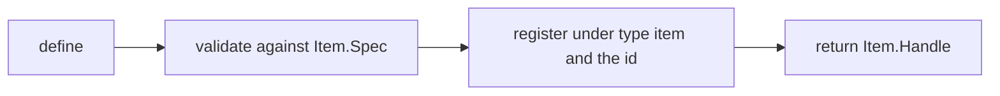
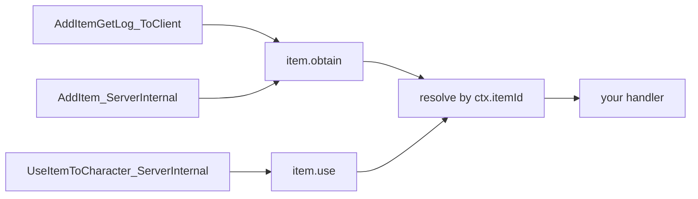
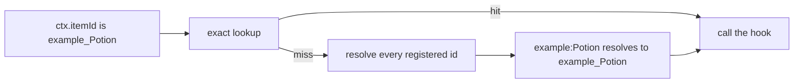
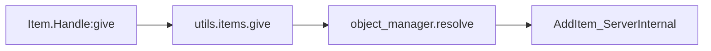
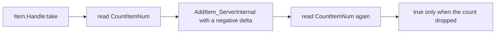

## このページでできるようになること

- 自分のコードからプレイヤーの所持品にアイテムを追加し、また減らす
- プレイヤーが何かを拾った瞬間に処理を走らせる
- プレイヤーが何かを食べたり使ったりした瞬間に処理を走らせる
- 素材を一定数集めたらごほうびを配る
- ゲームにあるアイテムに、自分の名前・説明・レシピの数値を付ける

アイテムは所持品に入るもの全般です。素材、食べ物、装備、弾薬などが該当します。`Item{ ... }` と書くとアイテムを 1 つ記述できます。返ってくるのは**ハンドル**、つまり `:give` などそのアイテムの操作を持った小さなオブジェクトです。

```lua
local berries = Item{ id = "Berries", name = "Red Berries", category = "consumable" }

Item.get("Wood")          -- a handle for any item id, defined or not
Item.get_all()            -- every PalForge-registered item, as handles
```

`Item.get(id)` は、自分で記述したかどうかに関係なくそのアイテムのハンドルを返します。`Item.get_all()` は PalForge が今知っているアイテムをすべて並べます。

アイテムを記述すると、テーブルが検査され、ID の下に控えられ、ハンドルが返ります。



`Item{ ... }` と書いてもゲームに新しいアイテムが増えるわけではありません。ゲームに既にある ID へ、自分の挙動と情報を結び付けるものです。コロンを含まない ID はゲームの ID（`"Wood"`、`"Berries"`、`"Arrow"`）です。コロンを含む ID は自分のパックのコンテンツ（`"example:Potion"`）で、対応するゲームデータの行名は `example_Potion` になります。その行そのものを作るには PalSchema が必要です。Lua だけで `DT_ItemDataTable_Common` に行を追加することはできません。

`Item` はパックが PalForge を読み込んだ時点でグローバルになります。名前空間付きの書き方でも動きます。

```lua
local api = require("palforge.api")
api.Item{ id = "Arrow" }
Item{ id = "Arrow" }        -- same module; the globals are mod-local under UE4SS
```

Palworld 自身のアイテム ID は `palforge.native.items` に並んでいます。何かを自作する前に目を通してください。欲しい ID はたいてい既にあります。

```lua
local items = require("palforge.native.items")

items.CATALOG            -- every DT_ItemDataTable_Common row id, as a list of strings
items.get("Arrow_Fire")  -- a lazily built, cached handle for any catalog id; nil if unknown
items.Wood               -- curated handles, defined at load; Wood and Berries carry hooks
items.Berries
items.Arrow
```

最初から記述されているアイテムは `Wood`、`Berries`、`Arrow` の 3 つです。それ以外のカタログ ID は `items.get(id)` で初めて聞かれたときにハンドルが作られ、次からは同じものが返ります。

## フィールド

必ず渡すフィールドは `id` だけです。他は情報を足すか、挙動を結び付けるためのものです。この表にないフィールドを渡すと呼び出しはその場で止まり、いちばん近い正しいフィールド名を教えてくれます。

<TypeTable
  type={{
    id: {
      description: 'アイテム ID。"Wood" のようなゲームの ItemId か、パックのコンテンツなら "pack:name"。空文字列は不可です。',
      type: 'string',
      required: true,
    },
    name: {
      description: 'UI に表示される名前。Handle:name が返します。',
      type: 'string',
      default: 'id と同じ',
    },
    description: {
      description: 'UI とツール向けの 1 行説明。Handle:description が返します。',
      type: 'string',
    },
    category: {
      description: 'どの種類の所持品か。PalForge 側のメモです。',
      type: '"material" | "consumable" | "equipment" | "ammo" | "ingredient" | "other"',
      default: 'material',
    },
    maxStack: {
      description: 'スタック上限。PalForge 側のメモです。',
      type: 'number',
      default: '1',
    },
    icon: {
      description: 'アイコン DataTable の検索が外れたときに使う予備。任意の値で、そのまま返されます。',
      type: 'any',
    },
    recipe: {
      description: 'このアイテムを生産するレシピ。形は Item.Spec.Recipe です。',
      type: 'table',
    },
    events: {
      description: '自分のハンドラをまとめたテーブル。形は Item.Spec.Events です。',
      type: 'table',
    },
    data: {
      description: '自由に使えるデータ。定義クラスへコピーされます。',
      type: 'table',
    },
  }}
/>

たいていのアイテムは `id`、`name`、`category`、`maxStack` があれば足ります。PalForge に最初から入っている 3 つを、ハンドラを外した形で示します。

```lua title="content/items.lua"
Item{
    id          = "Wood",
    name        = "Wood",
    category    = "material",
    maxStack    = 9999,
}

Item{
    id          = "Berries",
    name        = "Red Berries",
    category    = "consumable",
    maxStack    = 100,
}

Item{
    id          = "Arrow",
    name        = "Arrow",
    category    = "ammo",
    maxStack    = 999,
}
```

### レシピの形

`recipe` は、このアイテムを生産するクラフトを記録します。何を消費して、いくつ手に入るかです。

<TypeTable
  type={{
    materials: {
      description: '1 回のクラフトで消費される、アイテム ID から個数へのマップ。値はすべて number である必要があります。',
      type: 'table',
      required: true,
    },
    count: {
      description: '1 回のクラフトで得られるこのアイテムの個数。',
      type: 'number',
      default: '1',
    },
    work: {
      description: '設備が投入すべきワーク量。',
      type: 'number',
    },
    station: {
      description: 'クラフトできる作業台や設備の ID。',
      type: 'string',
    },
  }}
/>

```lua
local arrow = Item{
    id       = "Arrow",
    name     = "Arrow",
    category = "ammo",
    maxStack = 999,
    recipe = {
        materials = { Wood = 2, Stone = 1 },
        count     = 5,
        work      = 20,
        station   = "WorkBench",
    },
}

local r = arrow:recipeOf()
print(r.count)                -- 5
print(r.materials.Wood)       -- 2
```

<Callout type="warn">
レシピはメモであって、クラフトそのものではありません。PalForge はこれをゲームのクラフトシステムに登録しませんし、読み戻すのは `Handle:recipeOf()` だけです。レシピを書いてもゲーム内でクラフトできるようにはなりません。自分のコードが数値を置いておく場所になります。
</Callout>

### 検証

テーブルに問題があれば必ずエラーになるので、呼び出しが中途半端に成功することはありません。メッセージは `PalForge: ` で始まり、止まったフィールド名を含みます。

```text
PalForge: Item: unknown field "maxStackSize" (did you mean "maxStack"?). Valid fields: id, name, description, category, maxStack, icon, recipe, events, data
PalForge: Item: field "id" is required (item id: a game ItemId ("Wood") or "pack:name")
PalForge: Item: field "category" must be one of { "material", "consumable", "equipment", "ammo", "ingredient", "other" }, got "food"
PalForge: Item: field "maxStack" expects number, got string
PalForge: Item: field "recipe" (Item.Spec.Recipe): field "materials" is required ({ <itemId> = <count> } consumed by one craft)
PalForge: Item: field "recipe" (Item.Spec.Recipe): field "materials.Wood" expects number, got string
PalForge: Item: field "events" (Item.Spec.Events): unknown field "onEquip". Valid fields: onObtain, onUse, onCraft, onDiscard
```

同じ一覧はゲームの実行中にも読めます。エディタ用の注釈 `Scripts/palforge/types.lua` もここから作られています。

```lua
local schema = require("palforge.core.schema")
print(schema.help("Item.Spec"))            -- every field, type, default and meaning
print(schema.help("Item.Spec.Recipe"))
schema.get("Item.Spec").fields             -- the same as a table, for tooling
```

## イベント

自分のコードは `events` テーブルに置きます。ハンドラは第 1 引数に**そのアイテムのハンドル**、第 2 引数に情報をまとめたテーブル `ctx` を受け取ります。

<TypeTable
  type={{
    onObtain: {
      description: 'LIVE。アイテムが所持品に入りました。ctx.itemId、ctx.count、ctx.via が入ります。',
      type: 'fun(self: Item.Handle, ctx: table)',
    },
    onUse: {
      description: 'LIVE。アイテムが使用または消費されました。ctx.itemId がアイテム、ctx.actor がローカルプレイヤーのポーン、ctx.targetId が生の対象 ID、ctx.itemData がアイテムデータ、ctx.processor が使用処理です。',
      type: 'fun(self: Item.Handle, ctx: table)',
    },
    onCraft: {
      description: '宣言はできますが、item.craft を emit するものがまだ無いため動きません。',
      type: 'fun(self: Item.Handle, ctx: table)',
    },
    onDiscard: {
      description: '宣言はできますが、item.discard を emit するものがまだ無いため動きません。',
      type: 'fun(self: Item.Handle, ctx: table)',
    },
  }}
/>

ハンドラにはゲーム自身の呼び出しが 3 つ流れ込みます。2 つは入手を、1 つは使用を知らせます。



PalForge はワールド上のアイテム 1 個 1 個を追跡しません。イベントからゲーム内アイテム ID を取り出し、その ID で控えてある定義を探します。そこに何も無ければ、記述済みのアイテムを順に見て、解決後の名前が一致するものを使います。自分で記述していないバニラアイテムはどれにも一致せず、ハンドラは動きません。

### 名前空間付きの ID

`"example:Potion"` と記述したアイテムはその綴りのまま控えられますが、ゲームが知らせてくるのはデータ行名 `example_Potion` です。このずれは PalForge が埋めます。厳密な検索が外れたら、登録済みの ID を 1 つずつ解決して一致するものを返します。パックのコンテンツもちゃんとイベントを受け取れます。



```lua title="content/items/potion.lua"
local log = require("palforge.utils.log").scope("potion")

Item{
    id       = "example:Potion",        -- the DataTable row is example_Potion
    name     = "Potion",
    category = "consumable",
    events = {
        onUse = function(item, ctx)
            -- ctx.itemId is "example_Potion": the row name the game carries
            log.info("potion used: " .. tostring(ctx.itemId))
        end,
    },
}
```

ハンドル側はコロンの綴りのままなので、自分のコードは書いた ID で呼べます。

```lua
Item.get("example:Potion"):give(1)   -- resolves to example_Potion for the engine
```

この検索は登録済みアイテムのスナップショットを順不同でたどり、最初に一致したものを返します。したがって解決後の行名が同じになる ID が 2 つあると、どちらが選ばれるかは決まりません。パックの ID は一意に保ってください。Pal もブループリントのクラス名で同じように照合されます。

### onObtain

`onObtain` はアイテムが所持品に入ったときに動きます。拾得、採取、戦利品、報酬などです。これを知らせるゲームの呼び出しは 2 つあり、PalForge は両方を見ています。ゲーム自身の「アイテムを入手した」ログである `AddItemGetLog_ToClient` と、実際に個数を動かす `PalPlayerInventoryData:AddItem_ServerInternal` です。

| ctx のキー | 型 | 備考 |
| --- | --- | --- |
| `ctx.itemId` | string | 入手されたゲーム内アイテム ID。常に入ります。 |
| `ctx.count` | number \| nil | 個数。読めなかった場合は `nil` です。 |
| `ctx.via` | string | どちらの呼び出しが知らせたか。`"getlog"` か `"additem"`。 |

```lua
Item{
    id = "Wood",
    events = {
        onObtain = function(item, ctx)
            local log = require("palforge.utils.log").scope("woodpack")
            log.info("obtained " .. tostring(ctx.count) .. " of " .. tostring(ctx.itemId))
        end,
    },
}
```

<Callout type="info">
2 つの呼び出しは 1 回の入手を別々の角度から見たものなので、同じアイテム ID が 0.5 秒以内に繰り返されたときは捨てられ、ハンドラは 1 回だけ動きます。その代償は本物です。同じアイテムを 0.5 秒以内にもう一度拾った場合、その 2 回目は失われます。個数が負の場合は入手ではなく除去なので、`:take` は入手として報告されず読み飛ばされます。
</Callout>

### onUse

`onUse` はプレイヤーがアイテムを食べたり飲んだり使ったりしたときに動きます。ソースは `PalItemUseProcessor:UseItemToCharacter_ServerInternal` です。

| ctx のキー | 型 | 備考 |
| --- | --- | --- |
| `ctx.itemId` | string | 使用されたゲーム内アイテム ID。常に入ります。 |
| `ctx.actor` | any \| nil | ローカルプレイヤーのポーン。アイテムを使ったキャラクターです。見つからなければ `nil`。 |
| `ctx.player` | any \| nil | `ctx.actor` と同じ値です。 |
| `ctx.targetId` | any \| nil | 使われた対象。ゲームが渡してきた生の `FPalInstanceID` で、キャラクターには変換されません。 |
| `ctx.itemData` | any \| nil | 使われたアイテムのゲーム側データオブジェクト。 |
| `ctx.processor` | any | 使用処理を実行した `PalItemUseProcessor`。 |

<Callout type="warn">
`ctx.actor` はアイテムを「使った」キャラクターです。食べ物やポーションのように自分に使うものなら、それが「使われた対象」と同じになります。パルに与えた場合、そのパルは `ctx.targetId` に入りますが、これは生のインスタンス ID で、アクターに変換する処理はありません。専用サーバーでは `ctx.actor` は最初に見つかったプレイヤーポーンなので、実際に行動した本人とは限りません。「作用させられるプレイヤーポーン」として扱い、行動者の証拠としては扱わないでください。
</Callout>

```lua
Item{
    id       = "Berries",
    name     = "Red Berries",
    category = "consumable",
    maxStack = 100,
    events = {
        onUse = function(item, ctx)
            local log = require("palforge.utils.log").scope("berries")
            log.info("used " .. tostring(ctx.itemId) .. " on " .. tostring(ctx.actor))
        end,
    },
}
```

アイテム ID を取り出すとき、PalForge はまず第 1 引数の `ID` フィールドを読みます。ゲーム内で観測された唯一の形がこれです。続いて `Id`、`StaticId`、そして後続 3 つの引数へ順に試すので、シグネチャがずれても解決できます。ID が見つからなければ何も知らせず、ハンドラも動きません。

### onCraft と onDiscard

<Callout type="warn">
`onCraft` と `onDiscard` は動きません。`item.craft` と `item.discard` のチャンネルはあり、ハンドラの配線も済んでいますが、ゲーム側からどちらの出来事も知らされません。クラフトの完了は入手ログではなくワークプロセスを通り、破棄の呼び出しはまだ見つかっていないからです。宣言してもエラーにはならないので残しておいても構いませんが、今日必要な処理は `onObtain` か `onUse`、あるいは自分のコードに置いてください。
</Callout>

### ハンドラについて知っておくこと

- ハンドラはワールドが読み込まれてからだけ動きます。それ以前はどのソースもすぐ戻ります。
- ハンドラは `pcall` の中で動きます。例外が出ると、失敗したチャンネル名とフック名を添えてログに出て、イベント自体は他の購読者に届き続けます。例外は投げ直されないので、ハンドラからイベントを止めることはできません。
- 第 1 引数は定義ではなくハンドルです。`:give`、`:take`、各クエリをそのまま呼べます。
- 同じ ID でもう一度アイテムを記述すると前のものが置き換わり、イベントは新しい方にだけ届きます。

例外を投げたハンドラはログにこう出ます。

```text
[PalForge.event][err] item.use -> onUse handler failed: content/items.lua:12: attempt to index a nil value
```

1 つのアイテムにハンドラを書く代わりに、生のチャンネルを購読することもできます。すべてのアイテムをまとめて監視したいときはこちらです。

```lua
local event = require("palforge.core.event")

local sub = event.on("item.obtain", function(ctx)
    print(ctx.itemId, ctx.count)
end)

sub:unsubscribe()
```

ハンドルから自分のハンドラを直接呼ぶこともできます。`ctx` は自分で組み立てます。ゲームをプレイせずに動作を確かめる方法です。

```lua
Item.get("Berries"):onUse({ itemId = "Berries" })
```

## ハンドル

`Item{ ... }`、`Item.get(id)`、`Item.get_all()` はいずれも `Item.Handle` を返します。`Item.get` が `nil` を返すことはありません。自分で記述していない ID にはその場で薄いものを作るので、バニラアイテムでも記述なしに配る・減らす・調べることができます。

| メンバー | 戻り値 | 動作 |
| --- | --- | --- |
| `.id` | string | このアイテムのゲーム内アイテム ID。ただのフィールドです。 |
| `:give(count)` | boolean | ローカルプレイヤーの所持品に `count` 個（既定 1）追加します。 |
| `:take(count)` | boolean | `count` 個（既定 1）の除去を試みます。`count` は絶対値として扱われます。所持数が実際に減ったときだけ `true` です。 |
| `:recipeOf()` | table \| nil | 宣言されたレシピ。無ければ `nil`。 |
| `:iconOf()` | any \| nil | アイコン DataTable のテクスチャ参照。外れたら宣言済みの `icon`。 |
| `:name()` | string | 宣言された名前。無ければ id。 |
| `:description()` | string \| nil | 宣言された説明。 |
| `:category()` | string | 宣言されたカテゴリ。無ければ `"material"`。 |
| `:maxStack()` | number | 宣言されたスタック上限。無ければ `1`。 |
| `:onObtain(ctx)` | any | このアイテムの `onObtain` ハンドラをその場で実行します。 |
| `:onUse(ctx)` | any | このアイテムの `onUse` ハンドラをその場で実行します。 |
| `:onCraft(ctx)` | any | このアイテムの `onCraft` ハンドラをその場で実行します。 |
| `:onDiscard(ctx)` | any | このアイテムの `onDiscard` ハンドラをその場で実行します。 |

### give

`:give` はゲーム自身のサーバー呼び出しを通してプレイヤーの所持品にアイテムを入れます。PalForge が ID を解決し、ローカルプレイヤーの所持品を辿り、`AddItem_ServerInternal` を呼びます。



```lua
Item.get("Wood"):give(10)        -- 10 Wood into the local player inventory
Item.get("Arrow"):give()         -- count defaults to 1

if not Item.get("Berries"):give(5) then
    -- false means a step failed: no world yet, no player state, no inventory
end
```

エンジン呼び出しはすべて保護されているので、ヘルパーは真偽値を返すだけで例外を投げません。`false` の理由はログに出ます。名前空間付きの ID は先に解決されるため、`Item.get("example:Potion"):give(1)` はエンジンに `example_Potion` を渡します。対応するデータ行が存在するかどうかを PalForge は確認しません。`true` はネイティブ呼び出しが例外を出さずに走ったという意味で、ゲームが Lua に見せてくれるのはそこまでです。所持品が今どうなっているかの報告ではありません。

<Callout type="info">
`AddItem_ServerInternal` は入手を知らせる呼び出しでもあるので、普通のコードから呼んだ `:give` は `onObtain` にも届きます。`onObtain` ハンドラの中から呼んだときだけは届きません。ハンドラが自分自身を呼び直さないようガードが入っています。
</Callout>

### take

`:take` は `:give` ほど確実ではありません。このビルドでは除去用の呼び出しが一度も確認されていないため、`:take` は同じ `AddItem_ServerInternal` に負の値を渡し、ゲームが受け付けてくれることを期待しています。期待でしかない以上、結果は決めつけずに実測します。書き込みの前後で所持数を読み、本当に減ったかどうかを返します。



```lua
if Item.get("Wood"):take(3) then
    -- the inventory count really fell
else
    -- nothing was observed to leave: the negative delta did nothing on this build,
    -- or the count could not be read at all
end
```

結果はすべてログに残るので、真偽値では区別できないケースもログで切り分けられます。

```text
[PalForge.items][info] take Wood x3 (12 -> 9)
[PalForge.items][warn] take Wood x3: only 2 removed (12 -> 10)
[PalForge.items][warn] take Wood x3: count unchanged at 12 (the negative delta removed nothing)
[PalForge.items][warn] take Wood x3: CountItemNum unreadable, removal unconfirmed
```

<Callout type="warn">
一部だけ減った場合も `true` になります。上の 2 行目は 3 個のうち 2 個が減った状態で `true` を返します。`true` の意味は「何かが出ていったのが観測できた」であって「ちょうど `count` 個減った」ではありません。個数を正確に扱いたいときは、自分で前後の所持数を読んでください。
</Callout>

### クエリ

ハンドルは、定義を手元に持っていなくてもアイテムのことを答えてくれます。

```lua
local wood = Item.get("Wood")

print(wood:name())        -- "Wood" for the curated definition
print(wood:category())    -- "material"
print(wood:maxStack())    -- 9999 for the curated definition, 1 for a bare handle

local icon = wood:iconOf()   -- reads DT_ItemIconDataTable at runtime
```

`iconOf` は `/Game/Pal/DataTable/Item/DT_ItemIconDataTable` から ID を引き、行のテクスチャを読みます。各段階は fail-soft で、テーブル・行・カラムのいずれが欠けても宣言済みの `icon` を返します。`icon` を設定していなければ `nil` です。

### 列挙

```lua
for _, item in ipairs(Item.get_all()) do
    print(item.id, item:category(), item:maxStack())
end
```

`get_all` は PalForge が登録済みのアイテムのハンドルを返します。最初から入っている 3 つと、パックが記述したもの、そして誰かが `native.items.get(id)` で触れたカタログ ID です。ゲームのアイテムテーブル全体ではありません。

## 実例

### 使ったときに Effect が付く消耗品

`onUse` は `ctx.actor` でプレイヤーを教えてくれます。それを `Effect` に渡してください。`Effect` は期限が来るまで自前のスケジュールで動きます。

```lua title="content/items/berry_regen.lua"
local log = require("palforge.utils.log").scope("berryregen")

local Regen = Effect{
    id          = "example:BerryRegen",
    name        = "Berry Regeneration",
    description = "Ticks for a while after eating berries.",
    duration    = 10.0,   -- seconds; omit for "until :remove()"
    interval    = 1.0,    -- seconds between onTick calls
    events = {
        onApply = function(effect, target, ctx)
            log.info("regen started on " .. tostring(target))
        end,
        onTick = function(effect, target, ctx)
            -- ctx.elapsed = seconds since apply, ctx.stacks = current stack count
            log.info("regen tick at " .. tostring(ctx.elapsed))
        end,
        onExpire = function(effect, target, ctx)
            -- ctx.reason is "duration", "removed", "target_gone" or "world_left"
            log.info("regen ended: " .. tostring(ctx.reason))
        end,
    },
}

Item{
    id          = "Berries",
    name        = "Red Berries",
    description = "Applies a short regeneration effect when eaten.",
    category    = "consumable",
    maxStack    = 100,
    events = {
        onUse = function(item, ctx)
            Regen:apply(ctx.actor or Player.character())
        end,
    },
}
```

エフェクトはロード時に一度だけ記述し、ハンドラからは `:apply` を呼びます。ハンドラの中で記述すると、使うたびに登録し直すことになります。

<Callout type="warn">
PalForge のエフェクトはゲーム自身のステータスシステムに触れません。`EPalStatusEffectType` はネイティブの enum で、それを適用する呼び出しは未確認です。ステータスバーには何も出ませんし、HP も自動では動きません。エフェクトが実際に何をするかは `onTick` に書いてください。
</Callout>

動いているエフェクトはどこからでも確認できます。

```lua
local who = Player.character()

Regen:isActive(who)     -- true while it runs
Regen:timeLeft(who)     -- seconds left, nil when the effect has no duration
Regen:stacksOn(who)     -- 0 when inactive
Effect.activeOn(who)    -- ids of every effect currently on that target
Regen:remove(who)       -- ends it early, firing onExpire with reason "removed"
```

### 入手数を数える

`onObtain` は個数を運んできます。アイテム自身は何も保存できないので、累計は Lua の変数か、定義へコピーされる `data` テーブルに持たせます。

```lua title="content/items/wood_counter.lua"
local log = require("palforge.utils.log").scope("woodcount")

local obtained = 0

Item{
    id       = "Wood",
    name     = "Wood",
    category = "material",
    maxStack = 9999,
    data     = { milestone = 100, reward = "Arrow", rewardCount = 10 },
    events = {
        onObtain = function(item, ctx)
            local cfg = item._cls.data          -- `data` lives on the definition class
            obtained = obtained + (ctx.count or 0)
            log.info("wood so far: " .. obtained)

            if obtained >= cfg.milestone then
                obtained = obtained - cfg.milestone
                Item.get(cfg.reward):give(cfg.rewardCount)
                log.info("milestone reached, handed out " .. cfg.reward)
            end
        end,
    },
}
```

<Callout type="info">
`data` は定義クラスへコピーされ、`Item.Handle` には取得用のメソッドがありません。`item._cls.data` として参照してください。カウンタの置き場としては、上の `obtained` のような素朴なローカル変数の方が、ファイル単位・セッション単位であることが明白なぶん分かりやすいことが多いです。
</Callout>

どちらもリロードは越えません。保存される `state` と `:save()` を持つのは建築物だけで、アイテムのカウンタは mod が片付けられた時点でリセットされます。残したいなら `palforge.utils.file` で自分で書き出し、ワールドが読み込まれたときに読み戻してください。

```lua
local event = require("palforge.core.event")

event.on("world.ready", function(ctx)
    obtained = 0     -- or load your own record here
end)
```

### 建築物からアイテムを配る

建築物のハンドラは、ハンドルではなく**ライブな建築物**を受け取ります。`self.actor`、`self.pos`、`self.state`、`self:save()` が使えます。そのため `onRightClick` は `:give` を実行する自然な場所になります。

```lua title="content/buildings/supply_bench.lua"
local log = require("palforge.utils.log").scope("supply")

Building{
    id     = "WorkBench",
    name   = "Workbench",
    gridCm = 100,
    mesh = {
        kind  = "static",
        model = "/Game/Pal/Model/Prop/Architecture/WorkBenchPrimitive/SM_WorkBenchPrimitive.SM_WorkBenchPrimitive",
    },
    state = { handouts = 0 },
    events = {
        onRightClick = function(self, ctx)
            -- ctx.actor = the build object, ctx.player = who interacted, ctx.buildId
            local ok = Item.get("Wood"):take(5)
            if not ok then
                log.warn("could not take the wood")
                return
            end

            Item.get("Arrow"):give(10)

            self.state.handouts = self.state.handouts + 1
            self:save()
            log.info("handouts so far: " .. self.state.handouts)
        end,
        onLoad = function(self, ctx)
            log.info("bench restored with " .. tostring(self.state.handouts) .. " handouts")
        end,
    },
}
```

<Callout type="warn">
この例は PalForge が既に記述している ID `"WorkBench"` を占有します。後から記述した方が勝つので、バニラの見た目を保つようにメッシュのブロックをここでも書いています。自作のコンテンツには名前空間付きの ID を使ってください。
</Callout>

`take` は結果を実測するので、上の `false` の分岐は「木材が出ていったのを観測できなかった」という意味になり、矢は配られません。`true` が保証しないのは「5 個ちょうど減ったこと」で、一部だけ減った場合も `true` になります。過不足なく成立させたい取引には、やはり自前の所持数チェックが必要です。

## 注意すること

その上に何かを積む前に、粗い部分を知っておいてください。

**新しいアイテムは作れません。** Lua から `DT_ItemDataTable_Common` に行を追加することはできません。`Item{ ... }` は ID に挙動と情報を結び付けるもので、行を作るのは PalSchema です。誰も作っていない ID は、ゲームが表示しない ID のままです。

**`onCraft` と `onDiscard` は動きません。** チャンネルも配線もありますが、ゲーム側からどちらの出来事も知らされません。

**名前空間付きの ID は予備の検索で照合されます。** イベントが運ぶのはゲームのデータ行名なので、`"example:Potion"` として登録したアイテムは厳密な検索では見つからず、登録済み ID の走査が拾います。走査はスナップショットを順不同でたどり、最初に一致した ID を返すため、解決後の行名が同じになるパック ID が 2 つあるとどちらになるかは決まりません。

**除去は未確認です。** このビルドで除去用の呼び出しは知られていません。`:take` は追加用の呼び出しに負の値を渡し、所持数がどうなったかを報告します。したがって `true` の意味は「何かが出ていったのが観測できた」であり、「ちょうど `count` 個減った」ではありません。

**`onUse` は対象を直接は教えてくれません。** `ctx.actor` はアイテムを使ったローカルプレイヤーのポーンです。使われた対象は `ctx.targetId` に生のインスタンス ID として入っており、それをアクターに変換する処理はありません。食べ物やポーションなら両者は同じですが、パルに与えた場合は違います。

**`category`、`maxStack`、`icon`、`recipe` は PalForge 側のメモです。** ハンドル経由と自分のコードから読み戻せるだけで、ゲーム自身のアイテムテーブルに書き込まれることはありません。`maxStack = 9999` と書いても、ゲーム側のスタックの仕方は変わりません。

**アイテムはデータを保存できません。** 保存される `state` と `:save()` は建築物のものなので、ハンドラが数えたものはそのセッション限りです。残したいなら自分でファイルに書いてください。

**ハンドラのエラーはログに出ます。投げ直されません。** 失敗はチャンネル名とフック名を添えて `utils.log` に報告されます（例: `item.use -> onUse handler failed: ...`）。ハンドラ側からイベントを止めることはできません。

**`give` と `take` はローカルプレイヤー専用です。** `PalPlayerCharacter` を探し、その所持品に作用します。どちらも失敗時は `false` を返して理由をログに出します。`:take` は各段階が成功しても所持数が減らなかった場合に `false` を返します。

**`:give` は普通 `onObtain` も動かします。** ゲームが入手に使うのと同じ呼び出しを通るからです。`onObtain` ハンドラの中ではガードが働くのでハンドラが自分を呼び直すことはありませんが、それ以外の場所では自分の give が戻ってくると考えてください。

**0.5 秒以内の重複入手は捨てられます。** 1 回の入手をゲームの 2 つの呼び出しが知らせるため、PalForge は同じアイテム ID の重複をその時間内で捨て、ハンドラが 1 回だけ動くようにしています。同じアイテムをそれより速く本当にもう一度拾った場合、その回は失われます。

## まとめ

- アイテムは `Item{ ... }` で記述します。必須は `id` だけで、ID はゲームに既にあるものを使います。
- `Item.get("Wood")` はどのアイテムでもハンドルを返します。`:give` は所持品に追加し、`:take` は除去を試みて本当に減ったかどうかを返します。
- 自分のコードは `events` に書きます。`onObtain` は拾ったとき、`onUse` は使ったときに動きます。`onCraft` と `onDiscard` はまだ動きません。
- `onUse` の `ctx.actor` はアイテムを使ったプレイヤーです。食べ物やポーションの対象はこれで合っています。
- `category`、`maxStack`、`icon`、`recipe` は自分のコード向けのメモです。ゲームは読みません。
- アイテムはデータを保存できません。累計は Lua の変数に持つか、`palforge.utils.file` で自分で書き出してください。

次は [Effect](/docs/api/effect) を読むと、使ったときに続く効果を作れます。イベント全体の流れは [Lifecycle](/docs/concepts/lifecycle)、上で使ったドメインは [Pal](/docs/api/pal) と [Building](/docs/api/building) にあります。
