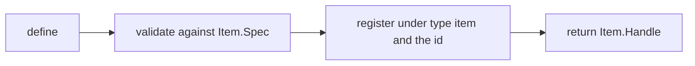
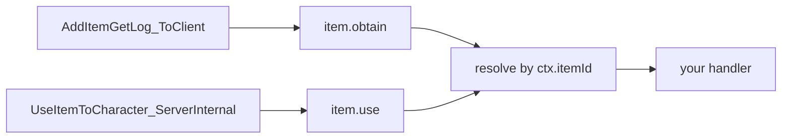
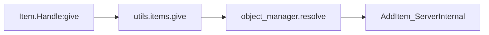

アイテムはインベントリに入るコンテンツです。素材、消耗品、装備、弾薬などが該当します。他のドメインモジュールと同じく `Item` は呼び出し可能なモジュールで、呼び出すと定義になり、2 つの名前付き関数で既存のものを引きます。

```lua
local berries = Item{ id = "Berries", name = "Red Berries", category = "consumable" }

Item.get("Wood")          -- a handle for any item id, defined or not
Item.get_all()            -- every PalForge-registered item, as handles
```

定義すると、テーブルは `Item.Spec` に対して検証され、定義クラスが作られ、`core/object_manager` に `("item", id)` として登録され、`Item.Handle` が返ります。



定義は**既存の**ゲーム内アイテム ID に対して、挙動とメタデータを与えるものです。Lua だけで `DT_ItemDataTable_Common` に新しい行を発行することはできません。それは PalSchema の担当です。コロンを含まない ID はゲームのリテラル ID（`"Wood"`、`"Berries"`、`"Arrow"`）、コロンを含む ID はパックのコンテンツ（`"example:Potion"`）で、対応する DataTable の行 FName は `example_Potion` になります。

グローバルは `palforge.api` を require した時点でインストールされるため、次のどちらの書き方でも動きます。

```lua
local api = require("palforge.api")
api.Item{ id = "Arrow" }
Item{ id = "Arrow" }        -- same module; the globals are mod-local under UE4SS
```

Palworld 自身のアイテム ID は `palforge.native.items` にあります。何かを自作する前に一度目を通しておく価値があります。

```lua
local items = require("palforge.native.items")

items.CATALOG            -- every DT_ItemDataTable_Common row id, as a list of strings
items.get("Arrow_Fire")  -- a lazily built, cached handle for any catalog id; nil if unknown
items.Wood               -- curated handles, defined at load; Wood and Berries carry hooks
items.Berries
items.Arrow
```

ゲーム開始時に登録されるのは 3 つのキュレート済み定義だけです。残りは `items.get(id)` が必要になった時点で構築するため、カタログ全体を走査する処理はどこにもありません。

## Fields

必須フィールドは `id` だけです。ここに宣言されていないフィールドを渡すと、定義時にハードエラーになります。

<TypeTable
  type={{
    id: {
      description: 'アイテム ID。"Wood" のようなゲームの ItemId か、パックのコンテンツなら "pack:name"。空文字列は不可です。',
      type: 'string',
      required: true,
    },
    name: {
      description: 'UI に表示される名前。Handle:name が返します。',
      type: 'string',
      default: 'id と同じ',
    },
    description: {
      description: 'UI とツール向けの 1 行説明。Handle:description が返します。',
      type: 'string',
    },
    category: {
      description: 'どの種類のインベントリコンテンツか。PalForge 側のメタデータです。',
      type: '"material" | "consumable" | "equipment" | "ammo" | "ingredient" | "other"',
      default: 'material',
    },
    maxStack: {
      description: 'スタック上限。PalForge 側のメタデータです。',
      type: 'number',
      default: '1',
    },
    icon: {
      description: 'アイコン DataTable の検索が外れたときに使うフォールバック。任意の値で、そのまま返されます。',
      type: 'any',
    },
    recipe: {
      description: 'このアイテムを生産するレシピ。形は Item.Spec.Recipe です。',
      type: 'table',
    },
    events: {
      description: 'ライフサイクルハンドラをまとめたテーブル。形は Item.Spec.Events です。',
      type: 'table',
    },
    data: {
      description: '自由に使えるペイロード。定義クラスへコピーされます。',
      type: 'table',
    },
  }}
/>

`native/items.lua` のキュレート済み定義 3 つを、イベントハンドラを外した形で示します。

```lua title="content/items.lua"
Item{
    id          = "Wood",
    name        = "Wood",
    category    = "material",
    maxStack    = 9999,
}

Item{
    id          = "Berries",
    name        = "Red Berries",
    category    = "consumable",
    maxStack    = 100,
}

Item{
    id          = "Arrow",
    name        = "Arrow",
    category    = "ammo",
    maxStack    = 999,
}
```

### レシピの形

`recipe` は、このアイテムを生産するクラフトを表します。`Item.Spec.Recipe` として検証されます。

<TypeTable
  type={{
    materials: {
      description: '1 回のクラフトで消費される、アイテム ID から個数へのマップ。値はすべて number である必要があります。',
      type: 'table',
      required: true,
    },
    count: {
      description: '1 回のクラフトで得られるこのアイテムの個数。',
      type: 'number',
      default: '1',
    },
    work: {
      description: '設備が投入すべきワーク量。',
      type: 'number',
    },
    station: {
      description: 'クラフトできる作業台や設備の ID。',
      type: 'string',
    },
  }}
/>

```lua
local arrow = Item{
    id       = "Arrow",
    name     = "Arrow",
    category = "ammo",
    maxStack = 999,
    recipe = {
        materials = { Wood = 2, Stone = 1 },
        count     = 5,
        work      = 20,
        station   = "WorkBench",
    },
}

local r = arrow:recipeOf()
print(r.count)                -- 5
print(r.materials.Wood)       -- 2
```

<Callout type="warn">
レシピはメタデータです。PalForge はこれをゲームのクラフトシステムに登録せず、`Handle:recipeOf()` 以外に読む場所もありません。レシピを宣言してもゲーム内でクラフト可能にはならず、自分のコードやツールが数値を読む置き場になるだけです。
</Callout>

### 検証

検証は厳格で、問題はすべてハードエラーになります。呼び出しが中途半端に成功することはありません。メッセージは `PalForge: ` で始まり、ドメイン名とフィールド名を含みます。

```text
PalForge: Item: unknown field "maxStackSize" (did you mean "maxStack"?). Valid fields: id, name, description, category, maxStack, icon, recipe, events, data
PalForge: Item: field "id" is required (item id: a game ItemId ("Wood") or "pack:name")
PalForge: Item: field "category" must be one of { "material", "consumable", "equipment", "ammo", "ingredient", "other" }, got "food"
PalForge: Item: field "maxStack" expects number, got string
PalForge: Item: field "recipe" (Item.Spec.Recipe): field "materials" is required ({ <itemId> = <count> } consumed by one craft)
PalForge: Item: field "recipe" (Item.Spec.Recipe): field "materials.Wood" expects number, got string
PalForge: Item: field "events" (Item.Spec.Events): unknown field "onEquip". Valid fields: onObtain, onUse, onCraft, onDiscard
```

同じ情報は実行時にも読めます。エディタ用の注釈 `Scripts/palforge/types.lua` もここから生成されています。

```lua
local schema = require("palforge.core.schema")
print(schema.help("Item.Spec"))            -- every field, type, default and meaning
print(schema.help("Item.Spec.Recipe"))
schema.get("Item.Spec").fields             -- the same as a table, for tooling
```

## Events

ハンドラは `events` テーブルにまとめて渡します。第 1 引数は**そのアイテムのハンドル**、第 2 引数はイベントコンテキスト `ctx` です。

<TypeTable
  type={{
    onObtain: {
      description: 'LIVE。アイテムがインベントリに入りました。ctx.itemId と ctx.count が入ります。',
      type: 'fun(self: Item.Handle, ctx: table)',
    },
    onUse: {
      description: 'LIVE。アイテムが使用または消費されました。ctx.itemId、ctx.actor、ctx.processor が入ります。',
      type: 'fun(self: Item.Handle, ctx: table)',
    },
    onCraft: {
      description: '宣言はできますが、item.craft を emit するネイティブソースがまだ無いため発火しません。',
      type: 'fun(self: Item.Handle, ctx: table)',
    },
    onDiscard: {
      description: '宣言はできますが、item.discard を emit するネイティブソースがまだ無いため発火しません。',
      type: 'fun(self: Item.Handle, ctx: table)',
    },
  }}
/>

アイテムのチャンネルには 2 つのネイティブフックが流れ込みます。どちらもゲーム内のイベントプローブで確認済みです。



アイテムにはインスタンス単位の追跡がありません。ディスパッチはコンテキストからゲーム内アイテム ID を取り出し、その ID で登録されているクラスを `object_manager` に問い合わせます。定義していないバニラアイテムは解決に失敗し、ディスパッチは何もしません。

### onObtain

ソースは `PalPlayerState:AddItemGetLog_ToClient`、ゲーム自身の「アイテムを入手した」ログです。拾得、戦利品、報酬で発火します。

| ctx のキー | 型 | 備考 |
| --- | --- | --- |
| `ctx.itemId` | string | 入手されたゲーム内アイテム ID。常に入ります。 |
| `ctx.count` | number \| nil | 個数。ログの構造体から読み取ります。読めなかった場合は `nil` です。 |

```lua
Item{
    id = "Wood",
    events = {
        onObtain = function(item, ctx)
            local log = require("palforge.utils.log").scope("woodpack")
            log.info("obtained " .. tostring(ctx.count) .. " of " .. tostring(ctx.itemId))
        end,
    },
}
```

<Callout type="info">
入手ログに現れない追加はカバーされません。ソースが意図的にログ RPC をフックしているのは、「プレイヤーがアイテムを入手した」という意味に一致する呼び出しがそれだからです。
</Callout>

### onUse

ソースは `PalItemUseProcessor:UseItemToCharacter_ServerInternal` です。

| ctx のキー | 型 | 備考 |
| --- | --- | --- |
| `ctx.itemId` | string | 使用されたゲーム内アイテム ID。常に入ります。 |
| `ctx.actor` | any \| nil | アイテムが使われた対象のキャラクター。引数を読めなかった場合は `nil` です。 |
| `ctx.processor` | any | 使用処理を実行した `PalItemUseProcessor`。 |

```lua
Item{
    id       = "Berries",
    name     = "Red Berries",
    category = "consumable",
    maxStack = 100,
    events = {
        onUse = function(item, ctx)
            local log = require("palforge.utils.log").scope("berries")
            log.info("used on " .. tostring(ctx.actor))
        end,
    },
}
```

アイテム ID の取得はフック引数を走査して ID を持つ構造体を探すため、シグネチャがずれても解決できます。ID が見つからない場合は何も emit されません。

### onCraft と onDiscard

<Callout type="warn">
`onCraft` と `onDiscard` は発火しません。`item.craft` と `item.discard` のチャンネルは存在し、ディスパッチも配線済みですが、emit するネイティブソースがありません。クラフトの完了は入手ログではなくワークプロセス経由であり、破棄のフックもまだプローブされていないためです。将来ソースが追加された日にパックがそのまま動くよう宣言だけは可能ですが、それまでは死んだコードとして扱ってください。
</Callout>

### ハンドラについて知っておくこと

- ハンドラはワールドの準備が整ってからのみ動きます。すべてのソースフックはそれ以前なら即座に return します。
- ディスパッチはハンドラを `pcall` の中で呼び、失敗をログに出しません。ハンドラ内のエラーは黙って握り潰されるので、確認したいならハンドラ内でログを出してください。
- 第 1 引数は定義クラスではなくハンドルです。`:give`、`:take`、各クエリをそのまま呼べます。
- 同じ ID で 2 つ目の定義を登録すると、レジストリは後から登録した方だけを保持し、ディスパッチも新しい方にしか届きません。

ハンドラを宣言する代わりに、生のチャンネルを購読することもできます。1 つのアイテムではなくすべてのアイテムを監視したいときはこちらです。

```lua
local event = require("palforge.core.event")

local sub = event.on("item.obtain", function(ctx)
    print(ctx.itemId, ctx.count)
end)

sub:unsubscribe()
```

ハンドル側のフォワーダを呼ぶと、自分で組み立てた `ctx` で定義のハンドラを手動実行できます。ゲームをプレイせずに動作を確認する方法です。

```lua
Item.get("Berries"):onUse({ itemId = "Berries", actor = Player.character() })
```

## Handle

`Item{ ... }`、`Item.get(id)`、`Item.get_all()` はいずれも `Item.Handle` を返します。`Item.get` が `nil` を返すことはありません。未登録の ID にはその ID をまとった薄い定義を作るため、定義していないバニラアイテムでも操作できます。

| メンバー | 戻り値 | 動作 |
| --- | --- | --- |
| `.id` | string | このアイテムのゲーム内アイテム ID。ただのフィールドです。 |
| `:give(count)` | boolean | ローカルプレイヤーのインベントリに `count` 個（既定 1）追加します。 |
| `:take(count)` | boolean | `count` 個（既定 1）取り除きます。`count` は絶対値として扱われます。 |
| `:recipeOf()` | table \| nil | 宣言されたレシピ。無ければ `nil`。 |
| `:iconOf()` | any \| nil | アイコン DataTable のテクスチャ参照。外れたら宣言済みの `icon`。 |
| `:name()` | string | 宣言された名前。無ければ id。 |
| `:description()` | string \| nil | 宣言された説明。 |
| `:category()` | string | 宣言されたカテゴリ。無ければ `"material"`。 |
| `:maxStack()` | number | 宣言されたスタック上限。無ければ `1`。 |
| `:onObtain(ctx)` | any | 定義の `onObtain` ハンドラをその場で実行します。 |
| `:onUse(ctx)` | any | 定義の `onUse` ハンドラをその場で実行します。 |
| `:onCraft(ctx)` | any | 定義の `onCraft` ハンドラをその場で実行します。 |
| `:onDiscard(ctx)` | any | 定義の `onDiscard` ハンドラをその場で実行します。 |

### give と take

どちらもゲーム自身のサーバー経路を通ります。`utils.items` が ID を解決し、`PalUtility` の CDO からローカルプレイヤーのインベントリを辿り、`AddItem_ServerInternal` を呼びます。



```lua
Item.get("Wood"):give(10)        -- 10 Wood into the local player inventory
Item.get("Arrow"):give()         -- count defaults to 1
Item.get("Wood"):take(3)         -- the same call with a delta of -3

if not Item.get("Berries"):give(5) then
    -- false means a step failed: no world yet, no player state, no inventory
end
```

エンジン呼び出しはすべて `pcall` で包まれ、`utils.log` に報告されます。ヘルパーは成功で `true`、失敗で `false` を返し、例外を投げることはありません。名前空間付きの ID は先に解決されるため、`Item.get("example:Potion"):give(1)` は FName `example_Potion` をエンジンに渡します。対応する DataTable の行が存在するかどうかを PalForge は確認しません。

### クエリ

```lua
local wood = Item.get("Wood")

print(wood:name())        -- "Wood" for the curated definition
print(wood:category())    -- "material"
print(wood:maxStack())    -- 9999 for the curated definition, 1 for a bare handle

local icon = wood:iconOf()   -- reads DT_ItemIconDataTable at runtime
```

`iconOf` は `/Game/Pal/DataTable/Item/DT_ItemIconDataTable` から ID を引き、行のテクスチャ参照を読みます。各段階は fail-soft で、テーブル・行・カラムのいずれが欠けても宣言済みの `icon` を返します。`icon` を設定していなければ `nil` です。

### 列挙

```lua
for _, item in ipairs(Item.get_all()) do
    print(item.id, item:category(), item:maxStack())
end
```

`get_all` は PalForge が登録済みのアイテムのハンドルを返します。ゲーム開始時点ではキュレート済みのものと、パックが定義したもの、そして誰かが `native.items.get(id)` で触れたカタログ ID だけです。ゲームのアイテムテーブル全体ではありません。

## Recipes

### 使用時に Effect を適用する消耗品

`onUse` はアイテムが使われた対象のキャラクターを渡してくれます。それを `Effect` に渡してください。`Effect` はハートビートに乗って自前でタイミングを管理します。

```lua title="content/items/berry_regen.lua"
local log = require("palforge.utils.log").scope("berryregen")

local Regen = Effect{
    id          = "example:BerryRegen",
    name        = "Berry Regeneration",
    description = "Ticks for a while after eating berries.",
    duration    = 10.0,   -- seconds; omit for "until :remove()"
    interval    = 1.0,    -- seconds between onTick calls
    events = {
        onApply = function(effect, target, ctx)
            log.info("regen started on " .. tostring(target))
        end,
        onTick = function(effect, target, ctx)
            -- ctx.elapsed = seconds since apply, ctx.stacks = current stack count
            log.info("regen tick at " .. tostring(ctx.elapsed))
        end,
        onExpire = function(effect, target, ctx)
            -- ctx.reason is "duration", "removed" or "target_gone"
            log.info("regen ended: " .. tostring(ctx.reason))
        end,
    },
}

Item{
    id          = "Berries",
    name        = "Red Berries",
    description = "Applies a short regeneration effect when eaten.",
    category    = "consumable",
    maxStack    = 100,
    events = {
        onUse = function(item, ctx)
            Regen:apply(ctx.actor or Player.character())
        end,
    },
}
```

`Effect{ ... }` はロード時に一度だけ宣言し、ハンドラからは `:apply` を呼びます。ハンドラの中で定義すると、使用のたびにエフェクトを再宣言・再登録することになります。

<Callout type="warn">
PalForge のエフェクトはゲーム自身のステータスシステムに触れません。`EPalStatusEffectType` はネイティブの enum で、それを適用する呼び出しは未確認です。ステータスバーには何も出ませんし、HP も自動では動きません。エフェクトが実際に何をするかは `onTick` に書いてください。
</Callout>

適用中の状態はどこからでも確認できます。

```lua
local who = Player.character()

Regen:isActive(who)     -- true while it runs
Regen:timeLeft(who)     -- seconds left, nil when the effect has no duration
Regen:stacksOn(who)     -- 0 when inactive
Effect.activeOn(who)    -- ids of every effect currently on that target
Regen:remove(who)       -- ends it early, firing onExpire with reason "removed"
```

### 入手数を数える

`onObtain` は個数を運んできます。アイテム自身には永続状態がないので、累計は Lua のアップバリューか、定義クラスへコピーされる `data` テーブルに持たせます。

```lua title="content/items/wood_counter.lua"
local log = require("palforge.utils.log").scope("woodcount")

local obtained = 0

Item{
    id       = "Wood",
    name     = "Wood",
    category = "material",
    maxStack = 9999,
    data     = { milestone = 100, reward = "Arrow", rewardCount = 10 },
    events = {
        onObtain = function(item, ctx)
            local cfg = item._cls.data          -- `data` lives on the definition class
            obtained = obtained + (ctx.count or 0)
            log.info("wood so far: " .. obtained)

            if obtained >= cfg.milestone then
                obtained = obtained - cfg.milestone
                Item.get(cfg.reward):give(cfg.rewardCount)
                log.info("milestone reached, handed out " .. cfg.reward)
            end
        end,
    },
}
```

<Callout type="info">
`data` は定義クラスへコピーされ、`Item.Handle` には取得用のメソッドがありません。`item._cls.data` として参照してください。上の `obtained` のような素朴なアップバリューの方が、ファイル単位・セッション単位であることが明白なぶん、カウンタの置き場としては分かりやすいことが多いです。
</Callout>

どちらもリロードは越えません。永続的な `state` と `:save()` を持つのは Building だけで、アイテムのカウンタは mod の状態が破棄された時点でリセットされます。残したいなら `palforge.utils.file` で自分で書き出し、`world.ready` で読み戻してください。

```lua
local event = require("palforge.core.event")

event.on("world.ready", function(ctx)
    obtained = 0     -- or load your own record here
end)
```

### 建築物の onRightClick からアイテムを配る

Building のハンドラはハンドルではなく**ライブインスタンス**を受け取ります。`self.actor`、`self.pos`、`self.state`、`self:save()` が使えます。そのため `onRightClick` は `:give` を実行する自然な場所になります。

```lua title="content/buildings/supply_bench.lua"
local log = require("palforge.utils.log").scope("supply")

Building{
    id     = "WorkBench",
    name   = "Workbench",
    gridCm = 100,
    mesh = {
        kind  = "static",
        model = "/Game/Pal/Model/Prop/Architecture/WorkBenchPrimitive/SM_WorkBenchPrimitive.SM_WorkBenchPrimitive",
    },
    state = { handouts = 0 },
    events = {
        onRightClick = function(self, ctx)
            -- ctx.actor = the build object, ctx.player = who interacted, ctx.buildId
            local ok = Item.get("Wood"):take(5)
            if not ok then
                log.warn("could not take the wood")
                return
            end

            Item.get("Arrow"):give(10)

            self.state.handouts = self.state.handouts + 1
            self:save()
            log.info("handouts so far: " .. self.state.handouts)
        end,
        onLoad = function(self, ctx)
            log.info("bench restored with " .. tostring(self.state.handouts) .. " handouts")
        end,
    },
}
```

<Callout type="warn">
この定義は `native/buildings.lua` が既に定義している ID `"WorkBench"` を占有します。レジストリは後から登録した方を保持するため、バニラの見た目を保つようにメッシュのブロックをここでも書いています。自作のコンテンツには名前空間付きの ID を使ってください。
</Callout>

`take` は負の差分を渡す `give` なので、エンジン呼び出しが成功する限り成功します。PalForge は事前にインベントリを確認しません。全部成立するか全部やめるかにしたいなら、呼ぶ前に自分の経路で所持数を数えてください。

## Limits

その上に何かを積む前に、継ぎ目をはっきりさせておきます。

**新しいアイテムは作れません。** Lua から `DT_ItemDataTable_Common` に行を発行することはできません。`Item{ ... }` は ID に挙動とメタデータを付けるもので、行を作るのは PalSchema です。誰も作っていない ID は、ゲームが表示しない ID のままです。

**`onCraft` と `onDiscard` は発火しません。** チャンネルとディスパッチはありますが、emit するソースがありません。

**名前空間付きの ID はイベントを受け取れません。** ディスパッチはコンテキストが運ぶ ID、つまりゲームの DataTable FName でクラスを引きます。`"example:Potion"` として登録したアイテムのキーは `example:Potion` である一方、イベントが運ぶのは `example_Potion` なので検索が外れ、ハンドラは動きません。Pal にはこのためのフォールバックがありますが、Item にはありません。パックのコンテンツでイベントが必要なら、解決後のリテラル ID で登録してください。

```lua
Item{ id = "example_Potion", events = { onUse = function(item, ctx) end } }
```

**`category`、`maxStack`、`icon`、`recipe` は PalForge 側のメタデータです。** ハンドル経由と自分のコードから読み戻せるだけで、ゲーム自身のアイテムテーブルに書き込まれることはありません。`maxStack = 9999` と宣言しても、ゲーム側のスタックの仕方は変わりません。

**アイテムには永続状態がありません。** `state` フィールドも `:save()` もありません。ハンドラが積み上げたものはセッション中しか残りません。

**ハンドラのエラーは無言です。** ディスパッチは呼び出しを `pcall` で包み、エラーを捨てます。

**`give` と `take` はローカルプレイヤー専用です。** `FindFirstOf` で `PalPlayerCharacter` を解決し、そのインベントリに作用します。どちらも失敗時は `false` を返し、理由を `utils.log` に出します。`:give` による追加が入手ログに現れるか、つまり `item.obtain` を再度 emit して自分の `onObtain` に戻ってくるかは未確認です。同じアイテムを配り返すハンドラにはフラグでガードを入れてください。

**onObtain は入手ログのみを対象とします。** ログ行に現れない内部的な追加は `onObtain` に届きません。

イベント全体の流れは [Lifecycle](/docs/concepts/lifecycle) を参照してください。上で使った各ドメインについては [Pal](/docs/api/pal)、[Building](/docs/api/building)、[Effect](/docs/api/effect) を参照してください。
