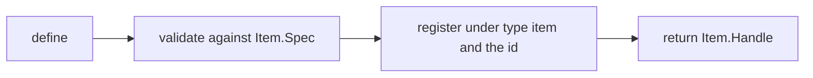
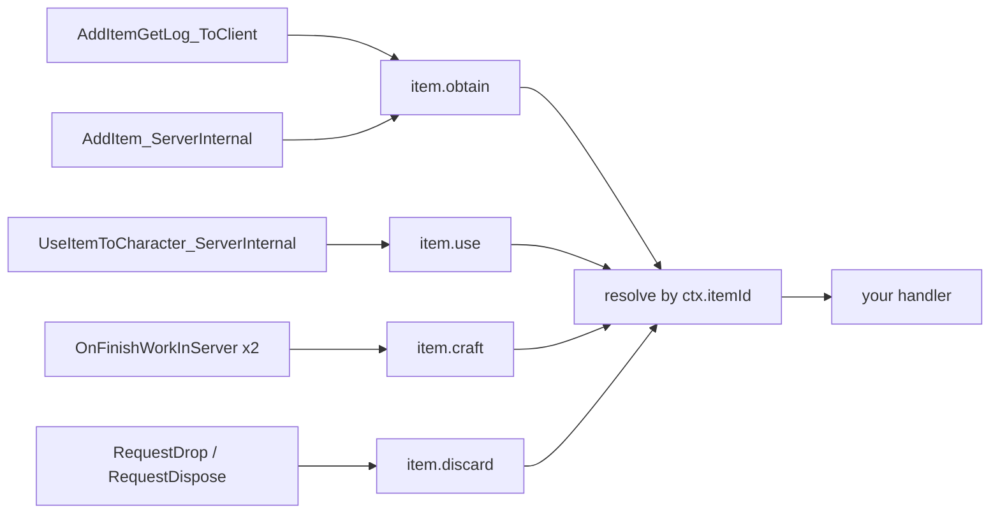
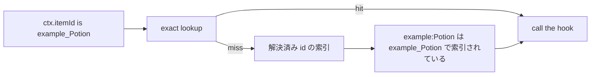
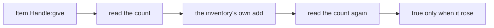
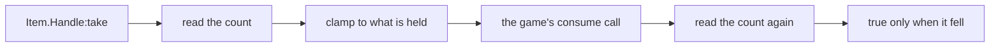

## このページでできるようになること

- プレイヤーがそのアイテムを今いくつ持っているかを読む
- 自分のコードからプレイヤーの所持品にアイテムを追加し、また取り出す
- プレイヤーが何かを拾った瞬間に処理を走らせる
- プレイヤーが何かを食べたり使ったりした瞬間に処理を走らせる
- 設備がそのアイテムを作り終えたとき、プレイヤーが捨てたときに処理を走らせる
- ゲームにあるアイテムに、自分の名前・説明・レシピの数値を付ける

アイテムは所持品に入るもの全般です。素材、食べ物、装備、弾薬などが該当します。`Item{ ... }` と書くとアイテムを 1 つ記述できます。返ってくるのは**ハンドル**、つまり `:give` などそのアイテムの操作を持った小さなオブジェクトです。

```lua
local berries = Item{ id = "Berries", name = "Red Berries", category = "consumable" }

Item.get("Wood")          -- a handle for any item id, defined or not
Item.get_all()            -- every PalForge-registered item, as handles
```

`Item.get(id)` は、自分で記述したかどうかに関係なくそのアイテムのハンドルを返します。`Item.get_all()` は PalForge が今知っているアイテムをすべて並べます。

アイテムを記述すると、テーブルが検査され、ID の下に控えられ、ハンドルが返ります。



`Item{ ... }` と書いてもゲームに新しいアイテムが増えるわけではありません。ゲームに既にある ID へ、自分の挙動と情報を結び付けるものです。コロンを含まない ID はゲームの ID（`"Wood"`、`"Berries"`、`"Arrow"`）です。コロンを含む ID は自分のパックのコンテンツ（`"example:Potion"`）で、対応するゲームデータの行名は `example_Potion` になります。その行そのものを作るには PalSchema が必要です。Lua だけで `DT_ItemDataTable_Common` に行を追加することはできません。

`Item` はパックが PalForge を読み込んだ時点でグローバルになります。名前空間付きの書き方でも動きます。

```lua
local api = require("palforge.api")
api.Item{ id = "Arrow" }
Item{ id = "Arrow" }        -- same module; the globals are mod-local under UE4SS
```

Palworld 自身のアイテム ID は `palforge.native.items` に並んでいます。何かを自作する前に目を通してください。欲しい ID はたいてい既にあります。

```lua
local items = require("palforge.native.items")

items.CATALOG            -- every DT_ItemDataTable_Common row id, as a list of strings
items.get("Arrow_Fire")  -- a lazily built, cached handle for any catalog id; nil if unknown
items.publish("Arrow_Fire")  -- 任意: そのハンドルを登録して、イベントが届くようにする
items.Wood               -- curated handles, defined at load; Wood and Berries carry hooks
items.Berries
items.Arrow
```

最初から記述されているアイテムは `Wood`、`Berries`、`Arrow` の 3 つです。この 3 つはハンドラを宣言しているので読み込み時に登録されます。登録されていない定義にはイベントが届かないからです。それ以外のカタログ ID は `items.get(id)` で初めて聞かれたときにハンドルが作られますが、そのハンドルは何も登録しません。カタログの読み取りは読み取りだからです。レジストリに載せるのは任意操作の `items.publish(id)` です。

## フィールド

必ず渡すフィールドは `id` だけです。他は情報を足すか、挙動を結び付けるためのものです。この表にないフィールドを渡すと呼び出しはその場で止まり、いちばん近い正しいフィールド名を教えてくれます。

<TypeTable
  type={{
    id: {
      description: 'アイテム ID。"Wood" のようなゲームの ItemId か、パックのコンテンツなら "pack:name"。名前空間付き ID の前後どちらの半分も英数字と _ のみで、解決できない ID は定義時に拒否されます。',
      type: 'string',
      required: true,
    },
    name: {
      description: 'UI に表示される名前。Handle:name が返します。',
      type: 'string',
      default: 'id と同じ',
    },
    description: {
      description: 'UI とツール向けの 1 行説明。Handle:description が返します。',
      type: 'string',
    },
    category: {
      description: 'どの種類の所持品か。PalForge 側のメモです。',
      type: '"material" | "consumable" | "equipment" | "ammo" | "ingredient" | "other"',
      default: 'material',
    },
    maxStack: {
      description: 'スタック上限。PalForge 側のメモです。',
      type: 'number',
      default: '1',
    },
    icon: {
      description: 'アイコン DataTable にこの id の行が無いときに使う /Game/... のテクスチャパス。文字列なのは、実際の検索が返せる値がそれしかないからです。',
      type: 'string',
    },
    recipe: {
      description: 'このアイテムを生産するレシピ。形は Item.Spec.Recipe です。',
      type: 'table',
    },
    events: {
      description: '自分のハンドラをまとめたテーブル。形は Item.Spec.Events です。',
      type: 'table',
    },
    data: {
      description: '自由に使えるデータ。定義クラスへコピーされます。',
      type: 'table',
    },
  }}
/>

たいていのアイテムは `id`、`name`、`category`、`maxStack` があれば足ります。PalForge に最初から入っている 3 つを、ハンドラを外した形で示します。

```lua title="content/items.lua"
Item{
    id          = "Wood",
    name        = "Wood",
    category    = "material",
    maxStack    = 9999,
}

Item{
    id          = "Berries",
    name        = "Red Berries",
    category    = "consumable",
    maxStack    = 100,
}

Item{
    id          = "Arrow",
    name        = "Arrow",
    category    = "ammo",
    maxStack    = 999,
}
```

### レシピの形

`recipe` は、このアイテムを生産するクラフトを記録します。何を消費して、いくつ手に入るかです。

<TypeTable
  type={{
    materials: {
      description: '1 回のクラフトで消費される、アイテム ID から個数へのマップ。値はすべて number である必要があります。',
      type: 'table',
      required: true,
    },
    count: {
      description: '1 回のクラフトで得られるこのアイテムの個数。',
      type: 'number',
      default: '1',
    },
    work: {
      description: '設備が投入すべきワーク量。',
      type: 'number',
    },
    station: {
      description: 'クラフトできる作業台や設備の ID。',
      type: 'string',
    },
  }}
/>

```lua
local arrow = Item{
    id       = "Arrow",
    name     = "Arrow",
    category = "ammo",
    maxStack = 999,
    recipe = {
        materials = { Wood = 2, Stone = 1 },
        count     = 5,
        work      = 20,
        station   = "WorkBench",
    },
}

local r = arrow:recipeOf()
print(r.count)                -- 5
print(r.materials.Wood)       -- 2
```

<Callout type="warn">
レシピはメモであって、クラフトそのものではありません。PalForge はこれをゲームのクラフトシステムに登録しませんし、読み戻すのは `Handle:recipeOf()` だけです。レシピを書いてもゲーム内でクラフトできるようにはなりません。自分のコードが数値を置いておく場所になります。ゲームが実際に回すレシピは `DT_ItemRecipeDataTable` の行で、Lua はその行を書けません。実物は PalSchema の JSON で宣言し、こちらは同じ内容を自分のコードとツールに伝えるために使ってください。
</Callout>

`recipeOf()` が読み戻すのは宣言した内容だけです。**ゲーム側のテーブルは読みません**。ですからバニラの id は、実物のレシピがあっても `nil` を返します。`DT_ItemRecipeDataTable_Common` は `/Game/Pal/DataTable/Item/` に 1414 行で読み込まれており、キーはアイテム id、列は `Product_Count`、`Material1_Id` から `Material5_Id`、`WorkAmount` ほか 9 つです。分かっていないのは、`FindRow` が返す構造体からスカラーや FName の列を直接引けるかどうかです。ここで読めた行の値は `TSoftObjectPtr` だけで、それは Lua から開けず、アイコン検索が列を文字列としてまとめて読む回り道をしているのはそのためです。列ごとに読む方式なら今日でも動き、1 テーブルあたり 13 回の呼び出しを 1 度だけ行ってキャッシュすれば済みます。この問いを計測するのは `pf_hook item-datatable-row-read` で、`env.debug` と読み込み済みのワールドが必要です。

### 2 つめの引数

`Item{ ... }` は spec のあとに省略可能なオプションテーブルを取ります。省略したときの動きはこれまでとまったく同じです。

```lua
-- ハンドルだけ作って登録はしない: レジストリに書いてはいけない「読み取り」用
local probe = Item({ id = "Wood" }, { register = false })

-- パックに帰属させて登録する。衝突に「誰が」を与えるのがこれ
Item({ id = "example:Potion" }, { pack = "mypack" })

-- 呼び出しごとに渡さずに同じ帰属を付ける書き方
local api = PalForge.pack("mypack")
api.Item{ id = "example:Potion" }
```

受け付けるのは `register` と `pack` だけで、綴りを間違えたオプションは黙って無視されずエラーになります。2 つのパックが同じ id を登録したときは両方のパック名つきでログに出ますし、解決後の行が同じになる 2 つの id も同様です。

### 検証

テーブルに問題があれば必ずエラーになるので、呼び出しが中途半端に成功することはありません。メッセージは `PalForge: ` で始まり、止まったフィールド名を含みます。id そのものも対象です。名前空間付き id の前後どちらの半分も英数字と `_` しか使えません。`"pack:Potion"` に対して PalSchema が書く行は `pack_Potion` だからです。解決できない id は、登録されて何にも一致しないまま残るのではなく、ここで拒否されます。

```text
PalForge: Item: unknown field "maxStackSize" (did you mean "maxStack"?). Valid fields: id, name, description, category, maxStack, icon, recipe, events, data
PalForge: Item: field "id" is required (item id: a game ItemId ("Wood") or "pack:name")
PalForge: Item: field "id" is invalid: invalid pack id 'my-pack' in 'my-pack:Potion' (letters/digits/_ only)
PalForge: Item: field "category" must be one of { "material", "consumable", "equipment", "ammo", "ingredient", "other" }, got "food"
PalForge: Item: field "maxStack" expects number, got string
PalForge: Item: field "recipe" (Item.Spec.Recipe): field "materials" is required ({ <itemId> = <count> } consumed by one craft)
PalForge: Item: field "recipe" (Item.Spec.Recipe): field "materials.Wood" expects number, got string
PalForge: Item: field "events" (Item.Spec.Events): unknown field "onEquip". Valid fields: onObtain, onUse, onCraft, onDiscard
```

同じ一覧はゲームの実行中にも読めます。エディタ用の注釈 `Scripts/palforge/types.lua` もここから作られています。

```lua
local schema = require("palforge.core.schema")
print(schema.help("Item.Spec"))            -- every field, type, default and meaning
print(schema.help("Item.Spec.Recipe"))
schema.get("Item.Spec").fields             -- the same as a table, for tooling
```

## イベント

自分のコードは `events` テーブルに置きます。ハンドラは第 1 引数に**そのアイテムのハンドル**、第 2 引数に情報をまとめたテーブル `ctx` を受け取ります。

<TypeTable
  type={{
    onObtain: {
      description: 'LIVE。アイテムが所持品に入りました。ctx.itemId、ctx.count、ctx.via が入ります。',
      type: 'fun(self: Item.Handle, ctx: table)',
    },
    onUse: {
      description: 'LIVE。アイテムが使用または消費されました。ctx.itemId がアイテム、ctx.actor がローカルプレイヤーのポーン、ctx.targetId が生の対象 ID、ctx.itemData がアイテムデータ、ctx.processor が使用処理です。',
      type: 'fun(self: Item.Handle, ctx: table)',
    },
    onCraft: {
      description: 'LIVE。クラフト設備がこのアイテムを作り終えました。ctx.recipeId と ctx.via が入り、ctx.count は nil です。',
      type: 'fun(self: Item.Handle, ctx: table)',
    },
    onDiscard: {
      description: 'LIVE。アイテムが投棄または破棄されました。ctx.count と、"drop" か "dispose" の ctx.reason が入ります。',
      type: 'fun(self: Item.Handle, ctx: table)',
    },
  }}
/>

この 4 つのハンドラにはゲーム自身の呼び出しが 7 つ流れ込み、4 つのチャンネルすべてが実際のセーブでイベントを運んだことが確認されています。



PalForge はワールド上のアイテム 1 個 1 個を追跡しません。イベントからゲーム内アイテム ID を取り出し、その ID で控えてある定義を探し、次に「解決するとその ID になる」名前空間付き ID の定義を探します。自分で記述していないバニラアイテムはどれにも一致せず、ハンドラは動きません。

### 名前空間付きの ID

`"example:Potion"` と記述したアイテムはその綴りのまま控えられますが、ゲームが知らせてくるのはデータ行名 `example_Potion` です。このずれは PalForge が埋めます。すべての登録は解決後の形でも索引されているので、外れたときの追加コストはテーブル参照 1 回だけで、パックのコンテンツもちゃんとイベントを受け取れます。



```lua title="content/items/potion.lua"
local log = require("palforge.utils.log").scope("potion")

Item{
    id       = "example:Potion",        -- the DataTable row is example_Potion
    name     = "Potion",
    category = "consumable",
    events = {
        onUse = function(item, ctx)
            -- ctx.itemId is "example_Potion": the row name the game carries
            log.info("potion used: " .. tostring(ctx.itemId))
        end,
    },
}
```

ハンドル側はコロンの綴りのままなので、自分のコードは書いた ID で呼べます。

```lua
Item.get("example:Potion"):give(1)   -- resolves to example_Potion for the engine
```

解決後の行名が同じになる ID が 2 つあると、いまでも衝突します。索引は解決後の形 1 つにつき 1 件しか持たず、後から登録したほうがその枠を取ります。ただしそれはディスパッチ時の運任せではなく、定義時に両方の ID を挙げた警告になりました。パックの ID は一意に保ってください。Pal もブループリントのクラス名で同じように照合されます。

### onObtain

`onObtain` はアイテムが所持品に入ったときに動きます。拾得、採取、戦利品、報酬などです。これを知らせるゲームの呼び出しは 2 つあり、PalForge は両方を見ています。ゲーム自身の「アイテムを入手した」ログである `AddItemGetLog_ToClient` と、実際に個数を動かす `PalPlayerInventoryData:AddItem_ServerInternal` です。

| ctx のキー | 型 | 備考 |
| --- | --- | --- |
| `ctx.itemId` | string | 入手されたゲーム内アイテム ID。常に入ります。 |
| `ctx.count` | number \| nil | 個数。読めなかった場合は `nil` です。 |
| `ctx.via` | string | どちらの呼び出しが知らせたか。`"getlog"` か `"additem"`。 |

```lua
Item{
    id = "Wood",
    events = {
        onObtain = function(item, ctx)
            local log = require("palforge.utils.log").scope("woodpack")
            log.info("obtained " .. tostring(ctx.count) .. " of " .. tostring(ctx.itemId))
        end,
    },
}
```

<Callout type="info">
2 つの呼び出しは 1 回の入手を別々の角度から見たものなので、同じアイテム ID が 0.5 秒以内に繰り返されたときは捨てられ、ハンドラは 1 回だけ動きます。その代償は本物です。同じアイテムを 0.5 秒以内にもう一度拾った場合、その 2 回目は失われます。個数が負の場合は入手ではなく除去なので、入手として報告されずに読み飛ばされます。
</Callout>

### onUse

`onUse` はプレイヤーがアイテムを食べたり飲んだり使ったりしたときに動きます。ソースは `PalItemUseProcessor:UseItemToCharacter_ServerInternal` です。

| ctx のキー | 型 | 備考 |
| --- | --- | --- |
| `ctx.itemId` | string | 使用されたゲーム内アイテム ID。常に入ります。 |
| `ctx.actor` | any \| nil | ローカルプレイヤーのポーン。アイテムを使ったキャラクターです。見つからなければ `nil`。 |
| `ctx.player` | any \| nil | `ctx.actor` と同じ値です。 |
| `ctx.targetId` | any \| nil | 使われた対象。ゲームが渡してきた生の `FPalInstanceID` で、キャラクターには変換されません。 |
| `ctx.itemData` | any \| nil | 使われたアイテムのゲーム側データオブジェクト。 |
| `ctx.processor` | any | 使用処理を実行した `PalItemUseProcessor`。 |

<Callout type="warn">
`ctx.actor` はアイテムを「使った」キャラクターです。食べ物やポーションのように自分に使うものなら、それが「使われた対象」と同じになります。パルに与えた場合、そのパルは `ctx.targetId` に入りますが、これは生のインスタンス ID で、アクターに変換する処理はありません。この値はローカルプレイヤーのポーンを探して得たものなので、最初に見つかったポーンであって「誰が行動したか」の証拠ではありません。「作用させられるプレイヤーポーン」として扱ってください。PalForge が対象にしているのはシングルプレイヤーの Palworld で、レプリケーション層はありません。プレイヤーが 2 人以上いる場所では、これは答えられない問いです。
</Callout>

```lua
Item{
    id       = "Berries",
    name     = "Red Berries",
    category = "consumable",
    maxStack = 100,
    events = {
        onUse = function(item, ctx)
            local log = require("palforge.utils.log").scope("berries")
            log.info("used " .. tostring(ctx.itemId) .. " on " .. tostring(ctx.actor))
        end,
    },
}
```

アイテム ID を取り出すとき、PalForge はまず第 1 引数の `ID` フィールドを読みます。ゲーム内で観測された唯一の形がこれです。続いて `Id`、`StaticId`、そして後続 3 つの引数へ順に試すので、シグネチャがずれても解決できます。ID が見つからなければ何も知らせず、ハンドラも動きません。

### onCraft

`onCraft` は設備がそのアイテムを作り終えたときに動きます。アイテム ID を持つワークモデルが 2 つあり、どちらも `OnFinishWorkInServer` でフックしています。レシピ台や炉である `PalMapObjectConvertItemModel` と、産出物が固定の生産機である `PalMapObjectProductItemModel` です。実際の設備でクラフトしたときに、このチャンネルが最初のイベントを運んだことが確認されています。

| ctx のキー | 型 | 備考 |
| --- | --- | --- |
| `ctx.itemId` | string | 設備が生産したアイテム。 |
| `ctx.recipeId` | string | 同じ値を、convert 側の呼び名で入れたもの。Palworld のレシピテーブルは生産物のアイテム ID をキーにしているので、バニラのレシピではこの 2 つは本当に同じ文字列です。 |
| `ctx.count` | nil | 設計上つねに `nil` です。 |
| `ctx.via` | string | `"convert"` か `"product"`。 |
| `ctx.model`、`ctx.work` | any | ワークモデルとワークオブジェクト。もっと踏み込みたいハンドラ向けです。 |

<Callout type="info">
`ctx.count` は `nil` で、これからも `nil` のままです。1 回あたりの生産数はレシピ行の `Product_Count` にあり、フックの中は DataTable を読む場所ではありません。誰も計測していない `1` を入れるより、正直な `nil` のほうがましです。個数が必要なら前後で `:count()` を読んでください。
</Callout>

### onDiscard

`onDiscard` はプレイヤーがそのアイテムを捨てたときに動きます。ソースはどちらも `UPalNetworkItemComponent` の RPC で、地面に投棄する `RequestDrop_ToServer` と、所持品画面からスタックを破棄する `RequestDispose_ToServer` です。投棄は個数を負にした `AddItem_ServerInternal` を**通りません**。そのフックは仕掛けたうえで 2 セッションのあいだ一度も発火しませんでした。除去は 1 つ隣のネットワークコンポーネントにあるからです。

| ctx のキー | 型 | 備考 |
| --- | --- | --- |
| `ctx.itemId` | string | リクエストが指しているスロットに今入っているアイテム ID。 |
| `ctx.count` | number \| nil | 所持品から出ていく数。スロットのスタック全体ではなく、その項目自身の数です。 |
| `ctx.reason` | string | `"drop"` か `"dispose"`。 |

<Callout type="warn">
この RPC が運ぶのはアイテム ID ではなく**スロット ID** なので、サーバーがスロットを空にする前に ID を読み取る必要があります。そのためにはコンテナを見つけなければなりません。プレイヤー自身の所持品ヘルパーだけでは足りず、最初の実測では「プレイヤーの 6 つのコンテナのどれとも一致しなかった」と報告されました。そこでコンテナの集合はワールド全体の走査から取り、GUID の完全一致で照合します。スロットを解決できなかったときは、推測した ID でイベントを出す代わりに何も出さず、どの段階で失敗したかを理由ごとに 1 回だけログに残します。その形の投棄だけが無音で、チャンネル自体は動いています。
</Callout>

### ハンドラについて知っておくこと

- ハンドラはワールドが読み込まれてからだけ動きます。それ以前はどのソースもすぐ戻ります。
- ハンドラは `pcall` の中で動きます。例外が出ると、失敗したチャンネル名とフック名を添えてログに出て、イベント自体は他の購読者に届き続けます。例外は投げ直されないので、ハンドラからイベントを止めることはできません。
- 第 1 引数は定義ではなくハンドルです。`:give`、`:take`、`:count`、各クエリをそのまま呼べます。
- 同じ ID でもう一度アイテムを記述すると前のものが置き換わり、イベントは新しい方にだけ届きます。

例外を投げたハンドラはログにこう出ます。

```text
[PalForge.event][err] item.use -> onUse handler failed: content/items.lua:12: attempt to index a nil value
```

1 つのアイテムにハンドラを書く代わりに、生のチャンネルを購読することもできます。すべてのアイテムをまとめて監視したいときはこちらです。

```lua
local event = require("palforge.core.event")

local sub = event.on("item.obtain", function(ctx)
    print(ctx.itemId, ctx.count)
end)

sub:unsubscribe()
```

ハンドルから自分のハンドラを直接呼ぶこともできます。`ctx` は自分で組み立てます。ゲームをプレイせずに動作を確かめる方法です。

```lua
Item.get("Berries"):onUse({ itemId = "Berries" })
```

## ハンドル

`Item{ ... }`、`Item.get(id)`、`Item.get_all()` はいずれも `Item.Handle` を返します。`Item.get` が `nil` を返すことはありません。自分で記述していない ID にはその場で薄いものを作るので、バニラアイテムでも記述なしに配る・取り出す・調べることができます。

| メンバー | 戻り値 | 動作 |
| --- | --- | --- |
| `.id` | string | このアイテムのゲーム内アイテム ID。ただのフィールドです。 |
| `:count()` | number \| nil | ローカルプレイヤーが今このアイテムをいくつ持っているか。`nil` は「読めなかった」であって「0 個」ではありません。 |
| `:give(count)` | boolean | ローカルプレイヤーの所持品に `count` 個（既定 1）追加します。所持数が増えたのを観測できたときだけ `true` です。 |
| `:take(count)` | boolean | ローカルプレイヤーの所持品から `count` 個（既定 1）を消費します。`count` は絶対値として扱われます。所持数が減ったのを観測できたときだけ `true` です。 |
| `:recipeOf()` | table \| nil | 自分が宣言したレシピ。無ければ `nil`。ゲーム側のレシピテーブルは読みません。 |
| `:iconOf()` | string \| nil | アイコン DataTable から得た `/Game/...` のパス。外れたら宣言済みの `icon`。 |
| `:name()` | string | 宣言された名前。無ければ id。 |
| `:description()` | string \| nil | 宣言された説明。 |
| `:category()` | string | 宣言されたカテゴリ。無ければ `"material"`。 |
| `:maxStack()` | number | 宣言されたスタック上限。無ければ `1`。 |
| `:onObtain(ctx)` | any | このアイテムの `onObtain` ハンドラをその場で実行します。 |
| `:onUse(ctx)` | any | このアイテムの `onUse` ハンドラをその場で実行します。 |
| `:onCraft(ctx)` | any | このアイテムの `onCraft` ハンドラをその場で実行します。 |
| `:onDiscard(ctx)` | any | このアイテムの `onDiscard` ハンドラをその場で実行します。 |

### give

`:give` は所持品自身の書き込みを通してプレイヤーの所持品にアイテムを入れ、そのうえで本当に届いたかを確かめます。呼び出しの前と後に所持数を読み、`true` は所持数が**増えたのを観測できた**という意味です。



```lua
Item.get("Wood"):give(10)        -- 10 Wood into the local player inventory
Item.get("Arrow"):give()         -- count defaults to 1

if not Item.get("Berries"):give(5) then
    -- nothing was measured to arrive; the log line says which step stopped
end
```

戻り値は呼び出しの成否ではなく実測の結果です。`false` は「届いたものが観測できなかった」という意味で、原因はいくつかあります。所持品がその場で拒否した、空きが無かった、あとから所持数を読めなかった、などです。所持品自身が理由を答え、ログがそれを運ぶので、真偽値では区別できないケースもログで切り分けられます。

```text
[PalForge.items][info] give Wood x3: 140 -> 143 [evidence declared]
[PalForge.items][warn] give Wood x10: AddItem_ServerInternal answered Success but the count did not rise (135 -> 135). Weight is now 300.0 of 300.0
[PalForge.items][err] give Wood x10 failed: the player's inventory could not be reached
```

このうち 1 行目は実際のセーブから取った本物の行です。`give Wood x3: 140 -> 143` の隣で、ゲーム自身の入手イベントも発火しています。

行末の `[evidence ...]` は、呼び出す前に PalForge が実行中のゲームと突き合わせて確認した方法の記録です。これに合わせて何かをする必要はありません。予想外の `false` を読み解くためのものです。

名前空間付きの ID は先に解決されるため、`Item.get("example:Potion"):give(1)` はゲームに `example_Potion` を渡します。対応するデータ行が存在するかどうかを PalForge は確認しません。ゲームが知らない ID では何も増えず、`false` として返ってきます。

<Callout type="info">
`:give` はゲームが入手に使うのと同じ書き込みを通るので、普通は `onObtain` にも届きます。`onObtain` ハンドラの中ではガードが働くのでハンドラが自分を呼び直すことはありませんが、それ以外の場所では自分の give が戻ってくると考えてください。
</Callout>

### take

`:take` は同じ実測を逆向きに行います。前後で所持数を読み、`true` は所持数が**減ったのを観測できた**という意味です。アイテムは消費されます。プレイヤーの足元に落ちて拾い直されることはないので、パックが本当の対価を取れます。

<Callout type="warn" title="take にはプレイヤーが何かを装備している必要があります">
経路はゲーム自身の消費処理 `APalWeaponBase:RequestConsumeItem` で、プレイヤーのロードアウトコンポーネントから辿ります。そしてこれは**武器アクターのメソッド**なので、何も持っていないプレイヤーには経路そのものが無く、`:take` はその旨を述べて `false` を返します。何かを装備していれば十分です。武器はスポーンしていればよく、手に持っている必要はありません。また、自分の弾ではなく渡された ID を消費します。設計時に考慮すべきはこの一点です。建築物が対価を取る場合、素手で立っているプレイヤーは支払えません。なお所持品側には除去の手段が一切ありません。クラス階層のどこにも減算する宣言は無く、追加処理に負の個数を渡す案も、受け付けられたうえで何も起きないと計測されました。
</Callout>



```lua
if Item.get("Wood"):take(3) then
    -- three Wood are gone from the inventory
else
    -- nothing was measured to leave
end
```

プレイヤーの所持数より多く要求してもエラーにはなりません。要求は所持している分に丸められます。1 つも持っていないときは呼び出し自体を行わず `false` を返します。どちらもログに残るので、真偽値では区別できないケースもログで切り分けられます。

```text
[PalForge.items][info] take Wood x3: 164 -> 161 [evidence declared]
[PalForge.items][warn] take Wood x5: the inventory holds only 2, removing that many
[PalForge.items][warn] take Wood x3: the inventory holds none, so nothing is removed
```

1 行目もまた本物で、`:give` を証明したのと同じ 1 回の操作から取ったものです。

<Callout type="warn">
丸められた除去でも `true` になります。上の 2 行目は 5 個の要求のうち 2 個を取って `true` を返します。`true` の意味は「所持数が減ったのを観測できた」であって「ちょうど `count` 個減った」ではありません。個数を正確に扱いたいときは、自分で前後に `:count()` を読んでください。
</Callout>

### クエリ

ハンドルは、定義を手元に持っていなくてもアイテムのことを答えてくれます。

```lua
local wood = Item.get("Wood")

print(wood:count())       -- how many the player is carrying right now, or nil
print(wood:name())        -- "Wood" for the curated definition
print(wood:category())    -- "material"
print(wood:maxStack())    -- 9999 for the curated definition, 1 for a bare handle

local icon = wood:iconOf()   -- reads DT_ItemIconDataTable at runtime
```

`count` はゲーム自身の `CountItemNum` を通して、その ID をローカルプレイヤーがいくつ持っているかを尋ね、ただの数値を返します。読み込み済みのセーブで Wood に 135 と答えたのが実測値です。`nil` は「まったく読めなかった」（ワールド未読み込み、プレイヤーが見つからない）という意味で、「0 個」ではありません。比較する前に `nil` かどうかを確かめてください。`:give` と `:take` の判定もこの読み取りを 2 回行ったものです。

`iconOf` は `/Game/Pal/DataTable/Item/DT_ItemIconDataTable` から ID を引き、行のテクスチャを `/Game/...` のパス文字列として返します。バニラの ID なら、ゲーム本体がそのアイテムに使っている絵がそのまま返ります。この読み取りは動きます。実際のセーブで 1207 行のうち 1183 行がパスを返し、残る 24 行はもともとアイコンを持たない行でした。各段階は fail-soft で、外れたときは宣言済みの `icon` を返します（設定していなければ `nil`）。名前空間付きの ID は先に解決されるので、`Item{ id = "example:Potion" }:iconOf()` は PalSchema が書く行の綴り `example_Potion` で問い合わせ、パックがその行を作っていれば実際の行に届きます。

### 列挙

```lua
for _, item in ipairs(Item.get_all()) do
    print(item.id, item:category(), item:maxStack())
end
```

`get_all` は PalForge が登録済みのアイテムのハンドルを返します。最初から入っている 3 つと、パックが記述したもの、そして誰かが `native.items.get(id)` で触れたカタログ ID です。ゲームのアイテムテーブル全体ではありません。

## 実例

### 使ったときに Effect が付く消耗品

`onUse` は `ctx.actor` でプレイヤーを教えてくれます。それを `Effect` に渡してください。`Effect` は期限が来るまで自前のスケジュールで動きます。

```lua title="content/items/berry_regen.lua"
local log = require("palforge.utils.log").scope("berryregen")

local Regen = Effect{
    id          = "example:BerryRegen",
    name        = "Berry Regeneration",
    description = "Ticks for a while after eating berries.",
    duration    = 10.0,   -- seconds; omit for "until :remove()"
    interval    = 1.0,    -- seconds between onTick calls
    events = {
        onApply = function(effect, target, ctx)
            log.info("regen started on " .. tostring(target))
        end,
        onTick = function(effect, target, ctx)
            -- ctx.elapsed = seconds since apply, ctx.stacks = current stack count
            log.info("regen tick at " .. tostring(ctx.elapsed))
        end,
        onExpire = function(effect, target, ctx)
            -- ctx.reason is "duration", "removed", "target_gone" or "world_left"
            log.info("regen ended: " .. tostring(ctx.reason))
        end,
    },
}

Item{
    id          = "Berries",
    name        = "Red Berries",
    description = "Applies a short regeneration effect when eaten.",
    category    = "consumable",
    maxStack    = 100,
    events = {
        onUse = function(item, ctx)
            Regen:apply(ctx.actor or Player.character())
        end,
    },
}
```

エフェクトはロード時に一度だけ記述し、ハンドラからは `:apply` を呼びます。ハンドラの中で記述すると、使うたびに登録し直すことになります。

<Callout type="warn">
PalForge のエフェクトは自前の時計で動き、HP が自動で動くことはありません。実際に何をするかは `onTick` に書いてください。定義に `nativeStatus` を書けば、エフェクトが動いているあいだゲーム本体の状態異常が点灯するので、ステータスバーは変わります。その裏でダメージや回復を起こすのは、やはり自分のコードです。
</Callout>

動いているエフェクトはどこからでも確認できます。

```lua
local who = Player.character()

Regen:isActive(who)     -- true while it runs
Regen:timeLeft(who)     -- seconds left, nil when the effect has no duration
Regen:stacksOn(who)     -- 0 when inactive
Effect.activeOn(who)    -- ids of every effect currently on that target
Regen:remove(who)       -- ends it early, firing onExpire with reason "removed"
```

### 入手数を数える

`onObtain` は個数を運んできます。アイテム自身は何も保存できないので、累計は Lua の変数か、定義へコピーされる `data` テーブルに持たせます。

```lua title="content/items/wood_counter.lua"
local log = require("palforge.utils.log").scope("woodcount")

local obtained = 0

Item{
    id       = "Wood",
    name     = "Wood",
    category = "material",
    maxStack = 9999,
    data     = { milestone = 100, reward = "Arrow", rewardCount = 10 },
    events = {
        onObtain = function(item, ctx)
            local cfg = item._cls.data          -- `data` lives on the definition class
            obtained = obtained + (ctx.count or 0)
            log.info("wood so far: " .. obtained)

            if obtained >= cfg.milestone then
                obtained = obtained - cfg.milestone
                Item.get(cfg.reward):give(cfg.rewardCount)
                log.info("milestone reached, handed out " .. cfg.reward)
            end
        end,
    },
}
```

<Callout type="info">
`data` は定義クラスへコピーされ、`Item.Handle` には取得用のメソッドがありません。`item._cls.data` として参照してください。カウンタの置き場としては、上の `obtained` のような素朴なローカル変数の方が、ファイル単位・セッション単位であることが明白なぶん分かりやすいことが多いです。
</Callout>

どちらもリロードは越えません。保存される `state` と `:save()` を持つのは建築物だけで、アイテムのカウンタは mod が片付けられた時点でリセットされます。残したいなら `palforge.utils.file` で自分で書き出し、ワールドが読み込まれたときに読み戻してください。

```lua
local event = require("palforge.core.event")

event.on("world.ready", function(ctx)
    obtained = 0     -- or load your own record here
end)
```

### 建築物からアイテムを配る

建築物のハンドラは、ハンドルではなく**ライブな建築物**を受け取ります。`self.actor`、`self.pos`、`self.state`、`self:save()` が使えます。そのため `onRightClick` は `:give` を実行する自然な場所になります。

```lua title="content/buildings/supply_bench.lua"
local log = require("palforge.utils.log").scope("supply")

Building{
    id     = "WorkBench",
    name   = "Workbench",
    gridCm = 100,
    mesh = {
        kind  = "static",
        model = "/Game/Pal/Model/Prop/Architecture/WorkBenchPrimitive/SM_WorkBenchPrimitive.SM_WorkBenchPrimitive",
    },
    state = { handouts = 0 },
    events = {
        onRightClick = function(self, ctx)
            -- ctx.actor = the build object, ctx.player = who interacted, ctx.buildId
            local ok = Item.get("Wood"):take(5)   -- the 5 Wood are consumed
            if not ok then
                log.warn("could not take the wood")
                return
            end

            Item.get("Arrow"):give(10)

            self.state.handouts = self.state.handouts + 1
            self:save()
            log.info("handouts so far: " .. self.state.handouts)
        end,
        onLoad = function(self, ctx)
            log.info("bench restored with " .. tostring(self.state.handouts) .. " handouts")
        end,
    },
}
```

<Callout type="warn">
この例は PalForge が既に記述している ID `"WorkBench"` を占有します。後から記述した方が勝つので、バニラの見た目を保つようにメッシュのブロックをここでも書いています。自作のコンテンツには名前空間付きの ID を使ってください。
</Callout>

先に取り、成功したときだけ渡す。この順序が、台がただ働きで払い出すのを防ぎます。`:take` は何も出ていったのを観測できなければ `false` を返すからです。木材は落ちるのではなく消費されるので、これは本当にプレイヤーが支払った対価です。`true` が意味しないのは「5 個すべてが出ていったこと」だけです。要求は所持している分に丸められるので、正確な取引には自分で `:count()` を確かめる処理が必要です。また何も装備していないプレイヤーはそもそも支払えず、それは `false` の分岐がすでに拾っています。

## 注意すること

その上に何かを積む前に、粗い部分を知っておいてください。

**新しいアイテムは作れません。** Lua から `DT_ItemDataTable_Common` に行を追加することはできません。`Item{ ... }` は ID に挙動と情報を結び付けるもので、行を作るのは PalSchema です。誰も作っていない ID は、ゲームが表示しない ID のままです。

**`onCraft` は個数を運びません。** そして `onDiscard` は、スロットをアイテム ID に解決できなかった投棄に対して無音です。どちらのチャンネルも生きていて発火も確認されています。この 2 つは機能停止ではなく、正直に述べておくべき縁です。

**`recipeOf` はゲームのレシピテーブルを読みません。** 返すのは自分が宣言したレシピで、ゲームに本物の行があってもバニラの ID には `nil` を返します。

**名前空間付きの ID は解決済み id の索引で照合されます。** イベントが運ぶのはゲームのデータ行名なので、`"example:Potion"` として登録したアイテムは厳密な検索では見つからず、解決後の形を引く 2 回目の参照が拾います。解決後の形 1 つにつき登録は 1 件なので、同じ行名に解決するパック ID が 2 つあるとやはり衝突しますが、2 つめを登録した時点で両方の ID を挙げた警告が出ます。

**取り出しにはプレイヤーが何かを装備している必要があります。** 消費はプレイヤーが持っている武器アクターのメソッドを経由するので、何も持っていないプレイヤーには経路が無く、`:take` は `false` を返します。アイテム自体は落ちるのではなく消費されます。

**`onUse` は対象を直接は教えてくれません。** `ctx.actor` はアイテムを使ったローカルプレイヤーのポーンです。使われた対象は `ctx.targetId` に生のインスタンス ID として入っており、それをアクターに変換する処理はありません。食べ物やポーションなら両者は同じですが、パルに与えた場合は違います。

**`category`、`maxStack`、`recipe` は PalForge 側のメモです。** ハンドル経由と自分のコードから読み戻せるだけで、ゲーム自身のアイテムテーブルに書き込まれることはありません。`maxStack = 9999` と書いても、ゲーム側のスタックの仕方は変わりません。`icon` だけは片方向で例外です。先に実物のテーブルを読み、宣言したパスはその予備になります。

**アイテムはデータを保存できません。** 保存される `state` と `:save()` は建築物のものなので、ハンドラが数えたものはそのセッション限りです。残したいなら自分でファイルに書いてください。

**ハンドラのエラーはログに出ます。投げ直されません。** 失敗はチャンネル名とフック名を添えて `utils.log` に報告されます（例: `item.use -> onUse handler failed: ...`）。ハンドラ側からイベントを止めることはできません。

**`give`・`take`・`count` はローカルプレイヤー専用です。** `PalPlayerCharacter` を探してその所持品に作用し、背後にレプリケーションを持たないクライアント権限の処理です。PalForge が対象にしているのはシングルプレイヤーの Palworld です。`count` の `nil` は読み取りに失敗したという意味で、鞄が空という意味ではありません。

**`give` は所持品自身の書き込みを通ります。** 所持数の変化だけでなく、所持品が何と答えたかも報告するので、`false` の理由がログから分かります。

**`:give` は普通 `onObtain` も動かします。** ゲームが入手に使うのと同じ書き込みを通るからです。`onObtain` ハンドラの中ではガードが働きますが、それ以外の場所では自分の give が戻ってくると考えてください。

**0.5 秒以内の重複入手は捨てられます。** 1 回の入手をゲームの 2 つの呼び出しが知らせるため、PalForge は同じアイテム ID の重複をその時間内で捨て、ハンドラが 1 回だけ動くようにしています。同じアイテムをそれより速く本当にもう一度拾った場合、その回は失われます。

## まとめ

- アイテムは `Item{ ... }` で記述します。必須は `id` だけで、ID はゲームに既にあるものを使い、行の綴りに解決できない ID はその場で拒否されます。
- `Item.get("Wood")` はどのアイテムでもハンドルを返します。`:count()` は今いくつ持っているかを読み、`:give` は追加し、`:take` は消費します。3 つとも「試みたこと」ではなく「実測できたこと」を返します。`:take` にはプレイヤーが何かを装備している必要があります。
- 自分のコードは `events` に書きます。4 つとも動きます。`onObtain` は拾ったとき、`onUse` は使ったとき、`onCraft` は設備が作り終えたとき、`onDiscard` は投棄・破棄のときです。
- `onUse` の `ctx.actor` はアイテムを使ったプレイヤーです。食べ物やポーションの対象はこれで合っています。
- `category`、`maxStack`、`recipe` は自分のコード向けのメモで、ゲームは読みませんし、`recipeOf` もゲームのレシピテーブルを読みません。`icon` は、実際にゲームのアイコン行へ届く検索の予備にすぎません。
- アイテムはデータを保存できません。累計は Lua の変数に持つか、`palforge.utils.file` で自分で書き出してください。

次は [Effect](/docs/api/effect) を読むと、使ったときに続く効果を作れます。イベント全体の流れは [Lifecycle](/docs/concepts/lifecycle)、上で使ったドメインは [Pal](/docs/api/pal) と [Building](/docs/api/building) にあります。
