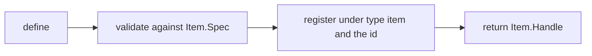
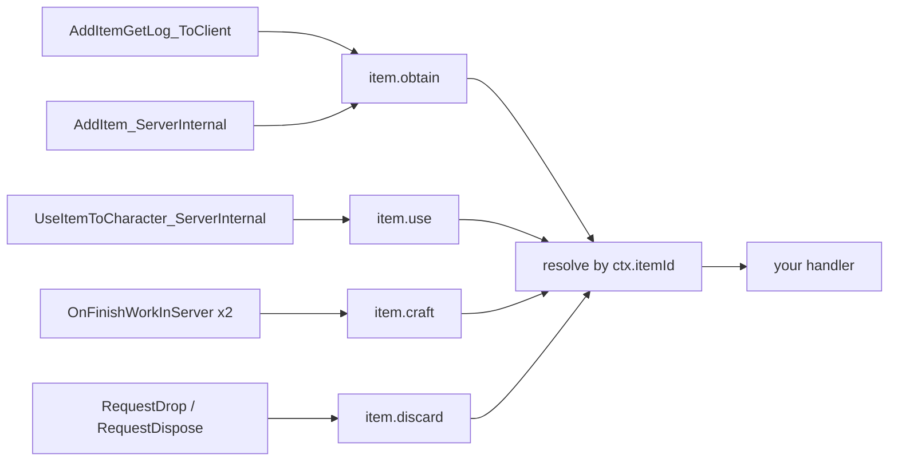
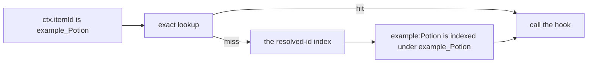
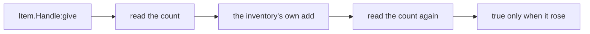
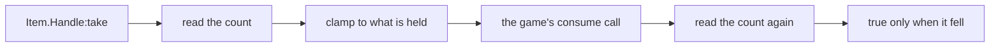

## What you can do after this page

- Read how many of an item the player is carrying right now
- Put items into the player inventory from your own code, and take them back out
- Run your own code the moment the player picks something up
- Run your own code the moment the player eats or uses something
- Run your own code when a machine finishes crafting it, or the player throws it away
- Give a game item your own name, description and recipe numbers

An item is anything that sits in the inventory: materials, food, equipment, ammo. Write
`Item{ ... }` to describe one. You get back a **handle** — a small object with the item's
actions on it, such as `:give`.

```lua
local berries = Item{ id = "Berries", name = "Red Berries", category = "consumable" }

Item.get("Wood")          -- a handle for any item id, defined or not
Item.get_all()            -- every PalForge-registered item, as handles
```

`Item.get(id)` hands you a handle for an item, whether or not you described it yourself.
`Item.get_all()` lists every item PalForge currently knows about.

Describing an item checks your table, files it away under the id, and returns the handle:



Writing `Item{ ... }` does not create a new item in the game. It attaches your behaviour and
your details to an id the game already has. An id without a colon is a game id (`"Wood"`,
`"Berries"`, `"Arrow"`). An id with one is your own pack content (`"example:Potion"`), and
the game data row that goes with it is spelled `example_Potion`. Creating that row needs
PalSchema — Lua cannot add a row to `DT_ItemDataTable_Common` on its own.

`Item` is a global as soon as your pack loads PalForge, and the namespaced spelling works
too:

```lua
local api = require("palforge.api")
api.Item{ id = "Arrow" }
Item{ id = "Arrow" }        -- same module; the globals are mod-local under UE4SS
```

Palworld's own item ids are listed in `palforge.native.items`. Read it before you invent
anything — the id you want probably exists already:

```lua
local items = require("palforge.native.items")

items.CATALOG            -- every DT_ItemDataTable_Common row id, as a list of strings
items.get("Arrow_Fire")  -- a lazily built, cached handle for any catalog id; nil if unknown
items.publish("Arrow_Fire")  -- opt in: register that handle so events can reach it
items.Wood               -- curated handles, defined at load; Wood and Berries carry hooks
items.Berries
items.Arrow
```

Three items are described up front: `Wood`, `Berries` and `Arrow`. Those three are registered at
load, because they declare handlers and an unregistered definition is never dispatched to. Every
other catalog id becomes a handle the first time you ask `items.get(id)` for it, and that handle
registers nothing — a catalog read is a read. `items.publish(id)` is the opt-in that files one in
the registry.

## Fields

`id` is the only field you have to pass. Everything else fills in a detail or attaches
behaviour. A field that is not in this table stops the call with an error that names the
closest valid field.

<TypeTable
  type={{
    id: {
      description: 'Item id. A literal game ItemId such as "Wood", or "pack:name" for pack content. Both halves of a namespaced id may hold letters, digits and _ only, and an id that cannot be resolved is refused at define time.',
      type: 'string',
      required: true,
    },
    name: {
      description: 'Shown in UI and returned by Handle:name.',
      type: 'string',
      default: 'the id',
    },
    description: {
      description: 'One-line description, for UI and tooling. Returned by Handle:description.',
      type: 'string',
    },
    category: {
      description: 'What kind of inventory content this is. PalForge metadata only.',
      type: '"material" | "consumable" | "equipment" | "ammo" | "ingredient" | "other"',
      default: 'material',
    },
    maxStack: {
      description: 'Inventory stack ceiling. PalForge metadata only.',
      type: 'number',
      default: '1',
    },
    icon: {
      description: '/Game/... texture path, used when the icon DataTable has no row for this id. A string, because that is the one kind of value the live lookup can produce.',
      type: 'string',
    },
    recipe: {
      description: 'The recipe that produces THIS item. Shape: Item.Spec.Recipe.',
      type: 'table',
    },
    restores: {
      description: 'What USING this item restores, ADDED to whatever the game already does: { satiety = 20, hpRate = 0.25 }. The one field on this spec that writes to a character. hp (an absolute amount) is refused at define time.',
      type: 'table',
    },
    events: {
      description: 'Your handlers, grouped. Shape: Item.Spec.Events.',
      type: 'table',
    },
    data: {
      description: 'Free-form payload of your own, copied onto the definition class.',
      type: 'table',
    },
  }}
/>

Most items only need `id`, `name`, `category` and `maxStack`. Here are the three that ship
with PalForge, with their handlers left out:

```lua title="content/items.lua"
Item{
    id          = "Wood",
    name        = "Wood",
    category    = "material",
    maxStack    = 9999,
}

Item{
    id          = "Berries",
    name        = "Red Berries",
    category    = "consumable",
    maxStack    = 100,
}

Item{
    id          = "Arrow",
    name        = "Arrow",
    category    = "ammo",
    maxStack    = 999,
}
```

### The recipe shape

`recipe` records the craft that produces this item: what it costs, and how many you get.

<TypeTable
  type={{
    materials: {
      description: 'Map of item id to the count consumed by one craft. Every value must be a number.',
      type: 'table',
      required: true,
    },
    count: {
      description: 'How many of this item one craft yields.',
      type: 'number',
      default: '1',
    },
    work: {
      description: 'Work amount the station must put in.',
      type: 'number',
    },
    station: {
      description: 'Workbench or station id that can craft it.',
      type: 'string',
    },
  }}
/>

```lua
local arrow = Item{
    id       = "Arrow",
    name     = "Arrow",
    category = "ammo",
    maxStack = 999,
    recipe = {
        materials = { Wood = 2, Stone = 1 },
        count     = 5,
        work      = 20,
        station   = "WorkBench",
    },
}

local r = arrow:recipeOf()
print(r.count)                -- 5
print(r.materials.Wood)       -- 2
```

<Callout type="warn">
A recipe is a note, not a craft. PalForge does not register it with the game's crafting
system, and `Handle:recipeOf()` is the only thing that reads it back. Writing a recipe does
not make the item craftable in game; it gives your own code somewhere to keep the numbers. A
recipe the game will actually run is a `DT_ItemRecipeDataTable` row, and Lua cannot write one —
declare it as PalSchema JSON and use this to describe the same thing to your own code.
</Callout>

`recipeOf()` answers your declared recipe when there is one, and otherwise reads the game's own
row: `DT_ItemRecipeDataTable_Common` is loaded under `/Game/Pal/DataTable/Item/` with 1414 rows,
keyed by item id, carrying `Product_Count`, `Material1_Id` through `Material5_Id`, `WorkAmount` and
nine more columns. That read is one `FindRow` call with the columns indexed off the row struct by
name — measured working in a loaded save on 2026-08-02 by `pf_hook item-datatable-row-read`, which
is also why there is no column-by-column fallback in the code. **What it hands back is declared
beside the function in `api/item.lua`**, and the table below says the same thing in one line.

The declared recipe wins on purpose, and it is the one place on this handle where a declaration
beats the live table. `icon` documents itself as a fallback for an id the icon table has no row
for, so there the game wins; a recipe is what you said about your own item, and a pack describing
its own crafting for a vanilla id must get its own numbers back. Everything is fail-soft: no world,
no table, no row, or a row that answers nothing, all come back `nil` rather than raising.

`recipeOf()` has been watched answering out of the game, not only measured as a route: in a save on
2026-08-02 it reported `Arrow -> Arrow x10, work = 1000.0, from { Stone x2, Wood x2 }`.

### Food and medicine: the restores shape

`restores` is the one field on this spec that **writes to a character**. Declare it and using the
item feeds or heals whoever used it, on top of whatever the game already does for that id.

<TypeTable
  type={{
    satiety: {
      description: 'Satiety POINTS added on use, clamped to the bar (100.0 wide on the measured build). Added to the game\'s own effect, never instead of it.',
      type: 'number',
    },
    hpRate: {
      description: 'A FRACTION of maximum HP: 0.25 is a quarter. Negative drains rather than restores, and that is measured too.',
      type: 'number',
    },
    hp: {
      description: 'REFUSED at define time, always. An absolute HP amount takes FFixedPoint64, a struct UE4SS cannot marshal from Lua. Declare hpRate instead.',
      type: 'number',
    },
  }}
/>

```lua
Item{
    id       = "Berries",
    category = "consumable",
    restores = { satiety = 20 },              -- 20 points of the satiety bar
}

Item{
    id       = "pack:Bandage",
    category = "consumable",
    restores = { hpRate = 0.25 },             -- a quarter of maximum HP
}

Item{
    id       = "pack:Feast",
    restores = { satiety = 40, hpRate = 0.5 },  -- both; each is measured separately
}
```

This is measured, on a live character, by `pf_hook item-satiety-write` on 2026-08-02: satiety went
`31.648 -> 21.648` and was put back, `SetFullStomach` takes **one** argument on this build, and
`AddHPByRate` lands. It was then confirmed running in a game the same evening —
`item: satiety 68.247 of 100.0, restored -5 and put back`.

<Callout type="warn">
`restores = { hp = 50 }` — an **absolute** HP amount — raises at define time and names why: that
call takes `FFixedPoint64`, a struct UE4SS cannot marshal from Lua, and a bad argument there faults
inside UE4SS's own marshalling where `pcall` cannot see it. Declare `hpRate` instead.

`restores` is **added to** the game's own effect, not substituted for it. Declaring
`restores = { satiety = 20 }` on `Berries` means "and 20 more", not "20 instead" — a vanilla
consumable still restores whatever the game restores. An empty `restores = {}` is refused as well:
a restore that names no vital would subscribe to `item.use` and then do nothing.
</Callout>

`Handle:restoreOn(actor)` writes the same declared table onto a character right now, without
waiting for anyone to use the item — for a campfire that feeds you, a quest reward, an effect that
ticks. Its verdict is the read-back rather than the call: `true` only when every declared vital was
seen to move, and otherwise `false` plus an English reason that names the state (no live character,
satiety already full, the game accepted the call and nothing moved).

### The second argument

`Item{ ... }` takes an optional options table after the spec. Leaving it out behaves exactly as it
always has.

```lua
-- build the handle, register nothing: a read that must not write to the registry
local probe = Item({ id = "Wood" }, { register = false })

-- register attributed to a pack, which is what gives a collision a "who"
Item({ id = "example:Potion" }, { pack = "mypack" })

-- the same attribution without passing it per call
local api = PalForge.pack("mypack")
api.Item{ id = "example:Potion" }
```

Only `register` and `pack` are accepted; a misspelled option is an error rather than an option
that was quietly ignored. When two packs register the same id, the replacement is logged with
both pack names, and so are two different ids that resolve to one game row.

### Validation

Every problem with your table is an error, so a call never half-succeeds. The message starts
with `PalForge: ` and names the field it stopped on. That includes the id itself: both halves of
a namespaced id may hold letters, digits and `_` only, because the row PalSchema writes for
`"pack:Potion"` is `pack_Potion` — an id that cannot be resolved is refused here instead of
registering and never matching anything.

```text
PalForge: Item: unknown field "maxStackSize" (did you mean "maxStack"?). Valid fields: id, name, description, category, maxStack, icon, recipe, events, data
PalForge: Item: field "id" is required (item id: a game ItemId ("Wood") or "pack:name")
PalForge: Item: field "id" is invalid: invalid pack id 'my-pack' in 'my-pack:Potion' (letters/digits/_ only)
PalForge: Item: field "category" must be one of { "material", "consumable", "equipment", "ammo", "ingredient", "other" }, got "food"
PalForge: Item: field "maxStack" expects number, got string
PalForge: Item: field "recipe" (Item.Spec.Recipe): field "materials" is required ({ <itemId> = <count> } consumed by one craft)
PalForge: Item: field "recipe" (Item.Spec.Recipe): field "materials.Wood" expects number, got string
PalForge: Item: field "events" (Item.Spec.Events): unknown field "onEquip". Valid fields: onObtain, onUse, onCraft, onDiscard
```

The same list is readable while the game runs, and it is what the editor annotations in
`Scripts/palforge/types.lua` are built from:

```lua
local schema = require("palforge.core.schema")
print(schema.help("Item.Spec"))            -- every field, type, default and meaning
print(schema.help("Item.Spec.Recipe"))
schema.get("Item.Spec").fields             -- the same as a table, for tooling
```

## Events

Put your code in the `events` table. Each handler is called with **this item's handle**
first, and a table of details called `ctx` second.

<TypeTable
  type={{
    onObtain: {
      description: 'LIVE. The item entered the inventory. ctx.itemId, ctx.count and ctx.via.',
      type: 'fun(self: Item.Handle, ctx: table)',
    },
    onUse: {
      description: 'LIVE. The item was used or consumed. ctx.itemId names the item, ctx.actor is the local player pawn, ctx.targetId is the raw target id, ctx.itemData is the item data object and ctx.processor is the use processor.',
      type: 'fun(self: Item.Handle, ctx: table)',
    },
    onCraft: {
      description: 'LIVE. A crafting machine finished this item. ctx.recipeId and ctx.via; ctx.count is nil.',
      type: 'fun(self: Item.Handle, ctx: table)',
    },
    onDiscard: {
      description: 'LIVE. The item was dropped or trashed. ctx.count and ctx.reason, which is "drop" or "dispose".',
      type: 'fun(self: Item.Handle, ctx: table)',
    },
  }}
/>

Seven of the game's own calls feed these four handlers, and all four channels have been seen
carrying events in a real save:



PalForge does not track each copy of an item in the world. It takes the game item id off the
event and looks up the definition filed under that id, then the one filed under a namespaced id
that resolves to it. A vanilla item you never described matches nothing, and no handler runs.

### Namespaced ids

An item you describe as `"example:Potion"` is filed under that exact spelling, while the game
reports the data row name `example_Potion`. PalForge closes the gap for you: every registration
is also indexed under its resolved form, so the miss costs one more table lookup and your pack
content still gets its events.



```lua title="content/items/potion.lua"
local log = require("palforge.utils.log").scope("potion")

Item{
    id       = "example:Potion",        -- the DataTable row is example_Potion
    name     = "Potion",
    category = "consumable",
    events = {
        onUse = function(item, ctx)
            -- ctx.itemId is "example_Potion": the row name the game carries
            log.info("potion used: " .. tostring(ctx.itemId))
        end,
    },
}
```

The handle keeps the colon spelling, so your own calls stay in the id you wrote:

```lua
Item.get("example:Potion"):give(1)   -- resolves to example_Potion for the engine
```

Two ids that resolve to the same row name still collide — the index holds one entry per resolved
form and the newest registration owns it — but that is now a warning at define time naming both
ids rather than a coin toss at dispatch time. Keep your pack ids unique. Pals are matched the
same way, by their blueprint class name.

### onObtain

`onObtain` runs when the item lands in the inventory: a pickup, a harvest, loot, a reward.
Two of the game's calls report this, and PalForge listens to both — `AddItemGetLog_ToClient`,
the game's own "obtained items" log, and `PalPlayerInventoryData:AddItem_ServerInternal`, the
call that actually moves the count.

| ctx key | Type | Notes |
| --- | --- | --- |
| `ctx.itemId` | string | The game item id that was obtained. Always present. |
| `ctx.count` | number \| nil | How many. `nil` when the number could not be read. |
| `ctx.via` | string | Which call reported it: `"getlog"` or `"additem"`. |

```lua
Item{
    id = "Wood",
    events = {
        onObtain = function(item, ctx)
            local log = require("palforge.utils.log").scope("woodpack")
            log.info("obtained " .. tostring(ctx.count) .. " of " .. tostring(ctx.itemId))
        end,
    },
}
```

<Callout type="info">
The two calls are two views of one pickup, so a repeat of the same item id within half a
second is dropped and your handler runs once. The cost is real: a genuine second pickup of
the same item inside that window is lost. A negative count is a removal rather than a pickup,
so it is skipped instead of being reported as an obtain.
</Callout>

### onUse

`onUse` runs when the player eats, drinks or otherwise uses the item. The source is
`PalItemUseProcessor:UseItemToCharacter_ServerInternal`.

| ctx key | Type | Notes |
| --- | --- | --- |
| `ctx.itemId` | string | The game item id that was used. Always present. |
| `ctx.actor` | any \| nil | The local player pawn — the character who used the item. `nil` when it could not be found. |
| `ctx.player` | any \| nil | The same value as `ctx.actor`. |
| `ctx.targetId` | any \| nil | Who it was used on, as the raw `FPalInstanceID` the game passed. Not turned into a character. |
| `ctx.itemData` | any \| nil | The game's item data object for the item used. |
| `ctx.processor` | any | The `PalItemUseProcessor` that ran the use. |

<Callout type="warn">
`ctx.actor` is the character who USED the item, which is the same as the character it was
used ON only for food, potions and anything else the player uses on themselves. Feed a pal
and the pal is in `ctx.targetId`, as a raw instance id that nothing here turns into an actor.
It is found by looking for the local player pawn, so it is whichever pawn is found first rather
than proof of who acted. Treat it as a player pawn to act on. PalForge targets single-player
Palworld and there is no replication layer, so anywhere more than one player exists this is not
a question it can answer.
</Callout>

```lua
Item{
    id       = "Berries",
    name     = "Red Berries",
    category = "consumable",
    maxStack = 100,
    events = {
        onUse = function(item, ctx)
            local log = require("palforge.utils.log").scope("berries")
            log.info("used " .. tostring(ctx.itemId) .. " on " .. tostring(ctx.actor))
        end,
    },
}
```

To find the item id, PalForge reads the `ID` field off the first parameter — the only shape
ever seen in game — and falls back to `Id`, `StaticId` and the three later parameters, so a
shifted signature still resolves. If no id is found, nothing is reported and no handler runs.

### onCraft

`onCraft` runs when a machine finishes producing the item. Two of the game's work models carry an
item id and both are hooked at `OnFinishWorkInServer`: `PalMapObjectConvertItemModel`, which is
the recipe benches and furnaces, and `PalMapObjectProductItemModel`, the fixed-output producers.
Crafting at a real machine was seen carrying this channel's first event.

| ctx key | Type | Notes |
| --- | --- | --- |
| `ctx.itemId` | string | The item the machine produced. |
| `ctx.recipeId` | string | The same value under the name the convert route uses. Palworld's recipe table is keyed by product item id, so for a vanilla recipe the two really are one string. |
| `ctx.count` | nil | Always `nil`, by design. |
| `ctx.via` | string | `"convert"` or `"product"`. |
| `ctx.model`, `ctx.work` | any | The work model and the work object, for a handler that wants more. |

<Callout type="info">
`ctx.count` is `nil` and stays `nil`. The per-craft count lives in the recipe row's
`Product_Count`, and a hook is no place for a DataTable read — a `1` nobody measured would be
worse than an honest `nil`. Read `:count()` before and after if you need the number.
</Callout>

### onDiscard

`onDiscard` runs when the player throws the item away. Both sources are RPCs on
`UPalNetworkItemComponent`: `RequestDrop_ToServer` for dropping on the ground and
`RequestDispose_ToServer` for trashing a stack from the inventory menu. Dropping does **not** go
through `AddItem_ServerInternal` with a negative count — that hook was armed and fired zero times
across two sessions, because removal lives on the network component, one class over.

| ctx key | Type | Notes |
| --- | --- | --- |
| `ctx.itemId` | string | The item id sitting in the slot the request points at. |
| `ctx.count` | number \| nil | How many are leaving the bag — the entry's own number, not the slot's whole stack. |
| `ctx.reason` | string | `"drop"` or `"dispose"`. |

<Callout type="warn">
The RPCs carry **slot ids**, not item ids, so the id has to be read off the slot before the
server empties it. That means finding the container: the player's own inventory helper is not
enough — the first live drop reported "no container of the player's 6 matched" — so the container
set is a world sweep matched on an exact GUID. When a slot cannot be resolved, nothing is emitted
rather than an event with a guessed id, and the log says which step failed, once per distinct
reason. A drop of that shape is silent; the channel is otherwise live.
</Callout>

### What else to know about handlers

- Handlers only run once the world is loaded. Before that, every source returns early.
- Your handler runs inside a `pcall`. If it raises, the error is logged with the channel and
  the hook that failed, and the event keeps going for everyone else. The error is not
  re-thrown, so your handler cannot stop the event.
- The first argument is the handle, not the definition. `:give`, `:take`, `:count` and the
  queries are right there on it.
- Describing a second item under an id you already used replaces the first, and only the
  newest one gets events.

A handler that raises shows up in the log like this:

```text
[PalForge.event][err] item.use -> onUse handler failed: content/items.lua:12: attempt to index a nil value
```

Instead of declaring a handler on one item, you can listen to the raw channel. That is how
you watch every item at once:

```lua
local event = require("palforge.core.event")

local sub = event.on("item.obtain", function(ctx)
    print(ctx.itemId, ctx.count)
end)

sub:unsubscribe()
```

The handle can also call your handler directly, with a `ctx` you build yourself. That is how
you test one without playing the game:

```lua
Item.get("Berries"):onUse({ itemId = "Berries" })
```

## Handle

`Item{ ... }`, `Item.get(id)` and `Item.get_all()` all hand you an `Item.Handle`. `Item.get`
never returns `nil`: for an id you never described it builds a thin one on the spot, so any
vanilla item can be given, taken and queried without being described first.

| Member | Returns | What it does |
| --- | --- | --- |
| `.id` | string | The item's game item id. A plain field. |
| `:count()` | number \| nil | How many of this item the local player is carrying right now. `nil` means the count could not be read, never that the player has none. |
| `:give(count)` | boolean | Adds `count` (default 1) to the local player's inventory. `true` only when the inventory count was seen to rise. |
| `:take(count)` | boolean | Consumes `count` (default 1) out of the local player's inventory. `count` is treated as a magnitude. `true` only when the count was seen to fall. |
| `:recipeOf()` | table \| nil | The recipe you declared; failing that, the game's own row for this id, read live. `nil` when there is neither. |
| `:restores()` | table \| nil | What this item declares it restores — `{ satiety = 20, hpRate = 0.25 }` — or `nil` when it declares none. The game's own effect is not readable from here and is never reported as ours. |
| `:restoreOn(actor)` | boolean, string \| nil | Writes the declared `restores` onto a live character now. `true` only when every declared vital was seen to move; otherwise `false` and the reason. |
| `:iconOf()` | string \| nil | A `/Game/...` path from the item icon DataTable, else the declared `icon`. |
| `:name()` | string | The declared name, else the id. |
| `:description()` | string \| nil | The declared description. |
| `:category()` | string | The declared category, else `"material"`. |
| `:maxStack()` | number | The declared stack ceiling, else `1`. |
| `:onObtain(ctx)` | any | Runs this item's `onObtain` handler now. |
| `:onUse(ctx)` | any | Runs this item's `onUse` handler now. |
| `:onCraft(ctx)` | any | Runs this item's `onCraft` handler now. |
| `:onDiscard(ctx)` | any | Runs this item's `onDiscard` handler now. |

### give

`:give` puts items in the player's inventory through the inventory's own write, and then checks
that they arrived. The count is read before the call and again after it, and `true` means it was
seen to **rise**.



```lua
Item.get("Wood"):give(10)        -- 10 Wood into the local player inventory
Item.get("Arrow"):give()         -- count defaults to 1

if not Item.get("Berries"):give(5) then
    -- nothing was measured to arrive; the log line says which step stopped
end
```

The boolean is the measurement, never the call. A `false` means nothing was seen to arrive, and
that has several causes — the inventory refusing outright, an inventory with no room, or a count
that could not be read afterwards. The inventory answers with a reason of its own, and the log
carries it, so the log separates the cases the boolean cannot:

```text
[PalForge.items][info] give Wood x3: 140 -> 143 [evidence declared]
[PalForge.items][warn] give Wood x10: AddItem_ServerInternal answered Success but the count did not rise (135 -> 135). Weight is now 300.0 of 300.0
[PalForge.items][err] give Wood x10 failed: the player's inventory could not be reached
```

The first of those three is a real line out of a real save: `give Wood x3: 140 -> 143`, with the
game's own pickup event firing beside it.

The `[evidence ...]` tag at the end records how PalForge checked the call against the running
game before making it. You do not have to act on it; it is there to make a surprising `false`
readable.

A namespaced id is resolved first, so `Item.get("example:Potion"):give(1)` hands the name
`example_Potion` to the game. PalForge does not check that a matching data row exists — an id
the game does not know moves nothing, and comes back as a `false`.

<Callout type="info">
A `:give` goes through the same write the game uses for a pickup, so it normally reaches
`onObtain` as well. Inside an `onObtain` handler a guard stops that, so a handler cannot set
itself off; anywhere else, expect your own give to come back around.
</Callout>

### take

`:take` is the same measurement in the other direction: the count is read before and after, and
`true` means it was seen to **fall**. The items are consumed — nothing lands at the player's
feet to be picked back up — so a pack can charge a real price for something.

<Callout type="warn" title="Taking needs the player to have something equipped">
The route is the game's own consume, `APalWeaponBase:RequestConsumeItem`, reached through the
player's loadout component — and it is a method **on a weapon actor**, so a player carrying
nothing has no route at all and `:take` answers `false` saying exactly that. Equipping anything
is enough: the weapon only has to be spawned, not in hand, and it spends the id it is handed
rather than its own ammunition. It is the one thing to design around: if your building charges a
price, a player standing there bare-handed cannot pay it. The inventory itself has no removal —
its whole class chain declares nothing that subtracts, and a negative count through the add was
measured accepted and inert.
</Callout>



```lua
if Item.get("Wood"):take(3) then
    -- three Wood are gone from the inventory
else
    -- nothing was measured to leave
end
```

Asking for more than the player is carrying is not an error: the request is clamped to what the
inventory holds. Asking when they hold none skips the call altogether and answers `false`. Both
outcomes are logged, so the log separates the cases the boolean cannot:

```text
[PalForge.items][info] take Wood x3: 164 -> 161 [evidence declared]
[PalForge.items][warn] take Wood x5: the inventory holds only 2, removing that many
[PalForge.items][warn] take Wood x3: the inventory holds none, so nothing is removed
```

The first line is a real one too, out of the same press that proved `:give`.

<Callout type="warn">
A clamped removal still returns `true` — the second line above takes 2 of the 5 asked for and
answers `true`. `true` means "the count was seen to fall", not "exactly `count` left". When the
amount has to be exact, read `:count()` yourself before and after.
</Callout>

### Queries

The handle answers questions about the item without you keeping the definition around:

```lua
local wood = Item.get("Wood")

print(wood:count())       -- how many the player is carrying right now, or nil
print(wood:name())        -- "Wood" for the curated definition
print(wood:category())    -- "material"
print(wood:maxStack())    -- 9999 for the curated definition, 1 for a bare handle

local icon = wood:iconOf()   -- reads DT_ItemIconDataTable at runtime
```

`count` asks the game how many of that id the local player is carrying, through the game's own
`CountItemNum`, and hands back a plain number — observed in a loaded save answering 135 for Wood.
`nil` means the count could not be read at all — no world loaded, no player found — and never
that the player has none, so test for `nil` before you compare. It is also what `:give` and
`:take` rest on: their verdicts are this read, taken twice.

`iconOf` looks the id up in `/Game/Pal/DataTable/Item/DT_ItemIconDataTable` and hands back the
row's texture as a `/Game/...` path string, so a vanilla id gives you the game's own artwork for
that item. That read works: 1183 of the table's 1207 rows answered with a path in a live save,
and the other 24 are rows that genuinely carry none. Every step is fail-soft, and any miss gives
you the `icon` you declared, which is `nil` unless you set one. A namespaced id is resolved
first, so `Item{ id = "example:Potion" }:iconOf()` asks the table for `example_Potion` — the row
spelling PalSchema writes — and reaches a real row when your pack created one.

### Enumerating

```lua
for _, item in ipairs(Item.get_all()) do
    print(item.id, item:category(), item:maxStack())
end
```

`get_all` returns handles for the items PalForge has registered: the three that ship with it,
whatever your pack described, and any catalog id someone reached through
`native.items.get(id)`. It is not the game's full item table.

## Examples

### A consumable that applies an effect when used

`onUse` gives you the player in `ctx.actor`. Hand that to an `Effect`, which runs on its own
schedule until it expires.

```lua title="content/items/berry_regen.lua"
local log = require("palforge.utils.log").scope("berryregen")

local Regen = Effect{
    id          = "example:BerryRegen",
    name        = "Berry Regeneration",
    description = "Ticks for a while after eating berries.",
    duration    = 10.0,   -- seconds; omit for "until :remove()"
    interval    = 1.0,    -- seconds between onTick calls
    events = {
        onApply = function(effect, target, ctx)
            log.info("regen started on " .. tostring(target))
        end,
        onTick = function(effect, target, ctx)
            -- ctx.elapsed = seconds since apply, ctx.stacks = current stack count
            log.info("regen tick at " .. tostring(ctx.elapsed))
        end,
        onExpire = function(effect, target, ctx)
            -- ctx.reason is "duration", "removed", "target_gone" or "world_left"
            log.info("regen ended: " .. tostring(ctx.reason))
        end,
    },
}

Item{
    id          = "Berries",
    name        = "Red Berries",
    description = "Applies a short regeneration effect when eaten.",
    category    = "consumable",
    maxStack    = 100,
    events = {
        onUse = function(item, ctx)
            Regen:apply(ctx.actor or Player.character())
        end,
    },
}
```

Describe the effect once, at load, and call `:apply` from the handler. Describing it inside
the handler would register it again on every single use.

<Callout type="warn">
A PalForge effect keeps its own clock, and no HP moves on its own — whatever the effect is meant
to do belongs in `onTick`. Naming a `nativeStatus` on the definition does switch one of the
game's own ailments on for as long as the effect runs, so the status bar can change; the damage
or healing behind it is still yours to write.
</Callout>

Check a running effect from anywhere:

```lua
local who = Player.character()

Regen:isActive(who)     -- true while it runs
Regen:timeLeft(who)     -- seconds left, nil when the effect has no duration
Regen:stacksOn(who)     -- 0 when inactive
Effect.activeOn(who)    -- ids of every effect currently on that target
Regen:remove(who)       -- ends it early, firing onExpire with reason "removed"
```

### Counting what the player has obtained

`onObtain` carries the count. An item cannot save anything by itself, so keep the running
total in a Lua variable, or in the `data` table that is copied onto the definition.

```lua title="content/items/wood_counter.lua"
local log = require("palforge.utils.log").scope("woodcount")

local obtained = 0

Item{
    id       = "Wood",
    name     = "Wood",
    category = "material",
    maxStack = 9999,
    data     = { milestone = 100, reward = "Arrow", rewardCount = 10 },
    events = {
        onObtain = function(item, ctx)
            local cfg = item._cls.data          -- `data` lives on the definition class
            obtained = obtained + (ctx.count or 0)
            log.info("wood so far: " .. obtained)

            if obtained >= cfg.milestone then
                obtained = obtained - cfg.milestone
                Item.get(cfg.reward):give(cfg.rewardCount)
                log.info("milestone reached, handed out " .. cfg.reward)
            end
        end,
    },
}
```

<Callout type="info">
`data` is copied onto the definition class, and `Item.Handle` has no getter for it — reach it
as `item._cls.data`. A plain local like `obtained` above is usually the clearer place for a
counter, because it is obviously per file and per session.
</Callout>

Neither of those survives a reload. Buildings are the only thing with saved `state` and
`:save()`; an item counter resets when the mod is torn down. To keep it, write it yourself
with `palforge.utils.file` and read it back when the world loads:

```lua
local event = require("palforge.core.event")

event.on("world.ready", function(ctx)
    obtained = 0     -- or load your own record here
end)
```

### Handing out items from a building

A building handler is called with the **live building** rather than a handle: `self.actor`,
`self.pos`, `self.state` and `self:save()`. That makes `onRightClick` a natural place to run
`:give`.

```lua title="content/buildings/supply_bench.lua"
local log = require("palforge.utils.log").scope("supply")

Building{
    id     = "WorkBench",
    name   = "Workbench",
    gridCm = 100,
    mesh = {
        kind  = "static",
        model = "/Game/Pal/Model/Prop/Architecture/WorkBenchPrimitive/SM_WorkBenchPrimitive.SM_WorkBenchPrimitive",
    },
    state = { handouts = 0 },
    events = {
        onRightClick = function(self, ctx)
            -- ctx.actor = the build object, ctx.player = who interacted, ctx.buildId
            local ok = Item.get("Wood"):take(5)   -- the 5 Wood are consumed
            if not ok then
                log.warn("could not take the wood")
                return
            end

            Item.get("Arrow"):give(10)

            self.state.handouts = self.state.handouts + 1
            self:save()
            log.info("handouts so far: " .. self.state.handouts)
        end,
        onLoad = function(self, ctx)
            log.info("bench restored with " .. tostring(self.state.handouts) .. " handouts")
        end,
    },
}
```

<Callout type="warn">
This example takes over the id `"WorkBench"`, which PalForge already describes. The newest
description wins, so the mesh block is repeated here to keep the vanilla look. Use a
namespaced id for content of your own.
</Callout>

Take first and hand over only when the take succeeded: that order is what stops the bench paying
out for free, because `:take` returns `false` when nothing was seen to leave. The wood is
consumed rather than dropped, so this really is a price the player paid. One thing `true` does
not promise is that all 5 left — a request is clamped to what the player is carrying — so an
exact trade still needs its own `:count()` check. And a player with nothing equipped cannot pay
at all, which the `false` branch already covers.

## What to watch out for

Know the rough edges before you build on them.

**You cannot create a new item.** Lua cannot add a row to `DT_ItemDataTable_Common`.
`Item{ ... }` attaches behaviour and details to an id; PalSchema creates the row. An id
nobody has created is an id the game will not show.

**`onCraft` never carries a count**, and `onDiscard` is silent for a drop whose slot it cannot
resolve to an item id. Both channels are live and both were seen firing; those two gaps are the
honest edges rather than an outage.

**A recipe read has been made in a running game, and it answered.** `Arrow` came back as
`Arrow x10, work = 1000.0, from { Stone x2, Wood x2 }` in a save on 2026-08-02. A `nil` from a
vanilla id is therefore a question about whether the recipe DataTable was loaded in that session,
which `[PalForge.recipes]` says once in the log — not a question about the route.

**A namespaced id is matched through the resolved-id index.** The event carries the game's data
row name, so an item registered as `"example:Potion"` is not found by the exact lookup and the
second lookup, on the resolved form, is what finds it. One resolved form holds one entry, so two
pack ids that resolve to the same row name still collide — but registering the second one warns
and names both.

**Taking an item needs something equipped.** The consume runs through a weapon the player is
carrying, so a player holding nothing at all has no route for it and `:take` answers `false`.
The items themselves are consumed, not dropped.

**`onUse` does not name the target directly.** `ctx.actor` is the local player pawn, the one
who used the item. The character it was used on is in `ctx.targetId` as a raw instance id,
and nothing here turns that into an actor. For food and potions the two are the same; for
feeding a pal they are not.

**`category`, `maxStack` and `recipe` are PalForge's own notes.** You read them back through the
handle and from your own code. Nothing writes them into the game's item table, so
`maxStack = 9999` does not change how the game stacks that item. There are two exceptions, in
opposite directions: `icon` reads the live table first and falls back to your declared path, and
`restores` is not a note at all — it is the one field here that writes to a character.

**An item cannot save data.** Saved `state` and `:save()` belong to buildings, so whatever a
handler counts up lives for this session only. Write it to a file yourself if you want it
back.

**Handler errors are logged, not raised.** A failure is reported through `utils.log` with the
channel and the hook, for example `item.use -> onUse handler failed: ...`. Your handler still
cannot stop the event.

**`give`, `take` and `count` work on the local player only.** They find `PalPlayerCharacter` and
act on that inventory, and they are client-authoritative with no replication behind them —
PalForge targets single-player Palworld. `count` answering `nil` means the read failed, not that
the bag is empty.

**`give` goes through the inventory's own write.** It reports what the inventory answered as
well as what the count did, so the log names the reason behind a `false`.

**A `:give` normally fires `onObtain` too.** It goes through the same write the game uses for a
pickup. Inside an `onObtain` handler a guard prevents that, so a handler cannot set itself off;
anywhere else, expect your own give to come back around.

**Repeat pickups inside half a second are dropped.** Two of the game's calls report one
pickup, and PalForge drops a repeat of the same item id within that window so your handler
runs once. A genuine second pickup of the same item that fast is lost.

## Summary

- Write `Item{ ... }` to describe an item. Only `id` is required, the id must be one the game
  already has, and an id that cannot be resolved to a row spelling is refused right there.
- `Item.get("Wood")` gives you a handle for any item. `:count()` reads how many the player is
  carrying, `:give` adds and `:take` consumes — and each of the three tells you what it measured,
  not what it attempted. `:take` needs the player to have something equipped.
- Put your code in `events`. All four handlers run: `onObtain` on pickup, `onUse` on use,
  `onCraft` when a machine finishes one, `onDiscard` on a drop or a trash.
- In `onUse`, `ctx.actor` is the player who used the item — the right target for food and
  potions.
- `category` and `maxStack` are notes for your own code and the game does not read them; a
  declared `recipe` is a note too, but `recipeOf` falls through to the game's own row when you
  declared none. `icon` is the fallback for a lookup that really does reach the game's icon rows.
- An item cannot save data. Keep totals in a Lua variable, or write them yourself with
  `palforge.utils.file`.

Next, read [Effect](/docs/api/effect) to make an item that does something lasting when it is
used — or [Lifecycle](/docs/concepts/lifecycle) for the whole event story, and
[Pal](/docs/api/pal) and [Building](/docs/api/building) for the domains used above.
