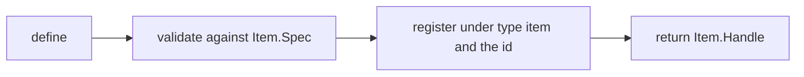
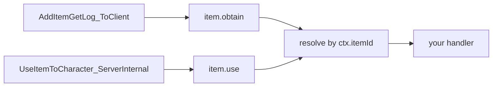
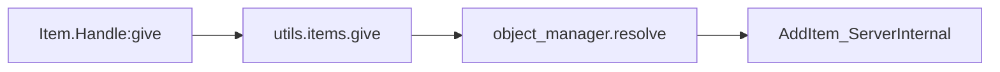

An item is a piece of inventory content: materials, consumables, equipment, ammo. `Item` is
a callable module, like every other domain module. Call it to define, and use the two named
functions to look existing ones up.

```lua
local berries = Item{ id = "Berries", name = "Red Berries", category = "consumable" }

Item.get("Wood")          -- a handle for any item id, defined or not
Item.get_all()            -- every PalForge-registered item, as handles
```

Defining validates the table against `Item.Spec`, builds a definition class, registers it in
`core/object_manager` under `("item", id)`, and returns an `Item.Handle`.



Defining gives an **existing** game item id behaviour and metadata. Lua alone cannot publish
a brand-new row into `DT_ItemDataTable_Common` — that is PalSchema's job. An id without a
colon is a literal game id (`"Wood"`, `"Berries"`, `"Arrow"`); an id with one is pack content
(`"example:Potion"`), and the matching DataTable row FName is `example_Potion`.

The globals are installed by requiring `palforge.api`, so both spellings work:

```lua
local api = require("palforge.api")
api.Item{ id = "Arrow" }
Item{ id = "Arrow" }        -- same module; the globals are mod-local under UE4SS
```

Palworld's own item ids live in `palforge.native.items`, which is worth reading before you
invent anything:

```lua
local items = require("palforge.native.items")

items.CATALOG            -- every DT_ItemDataTable_Common row id, as a list of strings
items.get("Arrow_Fire")  -- a lazily built, cached handle for any catalog id; nil if unknown
items.Wood               -- curated handles, defined at load; Wood and Berries carry hooks
items.Berries
items.Arrow
```

Only the three curated definitions are registered at game start. `items.get(id)` builds the
rest on demand, so nothing walks the whole catalog.

## Fields

`id` is the only required field. Anything not declared here is a hard error at define time.

<TypeTable
  type={{
    id: {
      description: 'Item id. A literal game ItemId such as "Wood", or "pack:name" for pack content. Must be a non-empty string.',
      type: 'string',
      required: true,
    },
    name: {
      description: 'Shown in UI and returned by Handle:name.',
      type: 'string',
      default: 'the id',
    },
    description: {
      description: 'One-line description, for UI and tooling. Returned by Handle:description.',
      type: 'string',
    },
    category: {
      description: 'What kind of inventory content this is. PalForge metadata only.',
      type: '"material" | "consumable" | "equipment" | "ammo" | "ingredient" | "other"',
      default: 'material',
    },
    maxStack: {
      description: 'Inventory stack ceiling. PalForge metadata only.',
      type: 'number',
      default: '1',
    },
    icon: {
      description: 'Fallback icon, used when the icon DataTable lookup misses. Any value; it is handed back as-is.',
      type: 'any',
    },
    recipe: {
      description: 'The recipe that produces THIS item. Shape: Item.Spec.Recipe.',
      type: 'table',
    },
    events: {
      description: 'Lifecycle handlers, grouped. Shape: Item.Spec.Events.',
      type: 'table',
    },
    data: {
      description: 'Free-form payload of your own, copied onto the definition class.',
      type: 'table',
    },
  }}
/>

The three curated definitions from `native/items.lua`, with their event handlers left out:

```lua title="content/items.lua"
Item{
    id          = "Wood",
    name        = "Wood",
    category    = "material",
    maxStack    = 9999,
}

Item{
    id          = "Berries",
    name        = "Red Berries",
    category    = "consumable",
    maxStack    = 100,
}

Item{
    id          = "Arrow",
    name        = "Arrow",
    category    = "ammo",
    maxStack    = 999,
}
```

### The recipe shape

`recipe` describes the craft that produces this item. It is validated as `Item.Spec.Recipe`.

<TypeTable
  type={{
    materials: {
      description: 'Map of item id to the count consumed by one craft. Every value must be a number.',
      type: 'table',
      required: true,
    },
    count: {
      description: 'How many of this item one craft yields.',
      type: 'number',
      default: '1',
    },
    work: {
      description: 'Work amount the station must put in.',
      type: 'number',
    },
    station: {
      description: 'Workbench or station id that can craft it.',
      type: 'string',
    },
  }}
/>

```lua
local arrow = Item{
    id       = "Arrow",
    name     = "Arrow",
    category = "ammo",
    maxStack = 999,
    recipe = {
        materials = { Wood = 2, Stone = 1 },
        count     = 5,
        work      = 20,
        station   = "WorkBench",
    },
}

local r = arrow:recipeOf()
print(r.count)                -- 5
print(r.materials.Wood)       -- 2
```

<Callout type="warn">
The recipe is metadata. PalForge does not register it with the game's crafting system and
nothing consumes it apart from `Handle:recipeOf()`. Declaring a recipe does not make the item
craftable in-game; it gives your own code and tooling a place to read the numbers from.
</Callout>

### Validation

Validation is strict and every problem is a hard error, so a call never half-succeeds. The
message is prefixed `PalForge: ` and names the domain and the field.

```text
PalForge: Item: unknown field "maxStackSize" (did you mean "maxStack"?). Valid fields: id, name, description, category, maxStack, icon, recipe, events, data
PalForge: Item: field "id" is required (item id: a game ItemId ("Wood") or "pack:name")
PalForge: Item: field "category" must be one of { "material", "consumable", "equipment", "ammo", "ingredient", "other" }, got "food"
PalForge: Item: field "maxStack" expects number, got string
PalForge: Item: field "recipe" (Item.Spec.Recipe): field "materials" is required ({ <itemId> = <count> } consumed by one craft)
PalForge: Item: field "recipe" (Item.Spec.Recipe): field "materials.Wood" expects number, got string
PalForge: Item: field "events" (Item.Spec.Events): unknown field "onEquip". Valid fields: onObtain, onUse, onCraft, onDiscard
```

The same information is readable at runtime, and the editor annotations in
`Scripts/palforge/types.lua` are generated from it:

```lua
local schema = require("palforge.core.schema")
print(schema.help("Item.Spec"))            -- every field, type, default and meaning
print(schema.help("Item.Spec.Recipe"))
schema.get("Item.Spec").fields             -- the same as a table, for tooling
```

## Events

Handlers go in the grouped `events` table. Each one receives **this item's handle** as its
first argument and the event context `ctx` as its second.

<TypeTable
  type={{
    onObtain: {
      description: 'LIVE. The item entered the inventory. ctx.itemId and ctx.count.',
      type: 'fun(self: Item.Handle, ctx: table)',
    },
    onUse: {
      description: 'LIVE. The item was used or consumed. ctx.itemId, ctx.actor and ctx.processor.',
      type: 'fun(self: Item.Handle, ctx: table)',
    },
    onCraft: {
      description: 'Declarable, but no native source emits item.craft yet, so it never fires.',
      type: 'fun(self: Item.Handle, ctx: table)',
    },
    onDiscard: {
      description: 'Declarable, but no native source emits item.discard yet, so it never fires.',
      type: 'fun(self: Item.Handle, ctx: table)',
    },
  }}
/>

Two native hooks feed the item channels. Both were confirmed by the in-game event probe.



Items have no per-instance tracking. Dispatch takes the game item id off the context and asks
`object_manager` for the class registered under it. A vanilla item you never defined resolves
to nothing and the dispatch no-ops.

### onObtain

Source: `PalPlayerState:AddItemGetLog_ToClient`, the game's own "obtained items" log. It fires
on pickup, loot and reward.

| ctx key | Type | Notes |
| --- | --- | --- |
| `ctx.itemId` | string | The game item id that was obtained. Always present. |
| `ctx.count` | number \| nil | How many. Read off the log struct; `nil` when the field could not be read. |

```lua
Item{
    id = "Wood",
    events = {
        onObtain = function(item, ctx)
            local log = require("palforge.utils.log").scope("woodpack")
            log.info("obtained " .. tostring(ctx.count) .. " of " .. tostring(ctx.itemId))
        end,
    },
}
```

<Callout type="info">
Adds that never surface a get-log are not covered. The source deliberately hooks the log RPC,
because that is the call whose semantics match "the player obtained an item".
</Callout>

### onUse

Source: `PalItemUseProcessor:UseItemToCharacter_ServerInternal`.

| ctx key | Type | Notes |
| --- | --- | --- |
| `ctx.itemId` | string | The game item id that was used. Always present. |
| `ctx.actor` | any \| nil | The character the item was used on. `nil` when the parameter could not be read. |
| `ctx.processor` | any | The `PalItemUseProcessor` that ran the use. |

```lua
Item{
    id       = "Berries",
    name     = "Red Berries",
    category = "consumable",
    maxStack = 100,
    events = {
        onUse = function(item, ctx)
            local log = require("palforge.utils.log").scope("berries")
            log.info("used on " .. tostring(ctx.actor))
        end,
    },
}
```

The item id lookup scans the hook parameters for the struct that carries the id, so a shifted
signature still resolves. If no id is found, nothing is emitted.

### onCraft and onDiscard

<Callout type="warn">
`onCraft` and `onDiscard` never fire. The `item.craft` and `item.discard` channels exist and
the dispatch is wired, but no native source emits them — crafting completes through a work
process rather than the get-log, and no discard hook has been probed. They stay declarable so
your pack keeps compiling the day a source lands; treat them as dead code until then.
</Callout>

### What else to know about handlers

- Handlers only run once the world is ready. Every source hook returns early before that.
- Dispatch calls your handler inside a `pcall` and does not log the failure. An error in a
  handler is swallowed silently, so log inside the handler if you need to see it.
- The first argument is the handle, not the definition class. `:give`, `:take` and the queries
  are available on it directly.
- Registering a second definition under the same id replaces the first in the registry, and
  dispatch then reaches only the newest one.

You can also subscribe to the raw channel instead of declaring a handler, which is the way to
watch every item rather than one:

```lua
local event = require("palforge.core.event")

local sub = event.on("item.obtain", function(ctx)
    print(ctx.itemId, ctx.count)
end)

sub:unsubscribe()
```

Calling a forwarder on the handle runs the definition's handler by hand, with a `ctx` you
build yourself. That is how you test one without playing the game:

```lua
Item.get("Berries"):onUse({ itemId = "Berries", actor = Player.character() })
```

## Handle

`Item{ ... }`, `Item.get(id)` and `Item.get_all()` all hand you an `Item.Handle`. `Item.get`
never returns `nil`: for an unregistered id it builds a thin definition over that id, so any
vanilla item is actionable without being defined first.

| Member | Returns | What it does |
| --- | --- | --- |
| `.id` | string | The item's game item id. A plain field. |
| `:give(count)` | boolean | Adds `count` (default 1) to the local player's inventory. |
| `:take(count)` | boolean | Removes `count` (default 1). `count` is treated as a magnitude. |
| `:recipeOf()` | table \| nil | The declared recipe, or `nil` when the item has none. |
| `:iconOf()` | any \| nil | Texture ref from the item icon DataTable, else the declared `icon`. |
| `:name()` | string | The declared name, else the id. |
| `:description()` | string \| nil | The declared description. |
| `:category()` | string | The declared category, else `"material"`. |
| `:maxStack()` | number | The declared stack ceiling, else `1`. |
| `:onObtain(ctx)` | any | Runs the definition's `onObtain` handler now. |
| `:onUse(ctx)` | any | Runs the definition's `onUse` handler now. |
| `:onCraft(ctx)` | any | Runs the definition's `onCraft` handler now. |
| `:onDiscard(ctx)` | any | Runs the definition's `onDiscard` handler now. |

### give and take

Both go through the game's own server path. `utils.items` resolves the id, finds the local
player's inventory through the `PalUtility` CDO, and calls `AddItem_ServerInternal`.



```lua
Item.get("Wood"):give(10)        -- 10 Wood into the local player inventory
Item.get("Arrow"):give()         -- count defaults to 1
Item.get("Wood"):take(3)         -- the same call with a delta of -3

if not Item.get("Berries"):give(5) then
    -- false means a step failed: no world yet, no player state, no inventory
end
```

Every engine call is wrapped in `pcall` and reported through `utils.log`. The helpers return
`true` on success and `false` on failure, and never throw. A namespaced id resolves first, so
`Item.get("example:Potion"):give(1)` hands the FName `example_Potion` to the engine; PalForge
does not check that a matching DataTable row exists.

### Queries

```lua
local wood = Item.get("Wood")

print(wood:name())        -- "Wood" for the curated definition
print(wood:category())    -- "material"
print(wood:maxStack())    -- 9999 for the curated definition, 1 for a bare handle

local icon = wood:iconOf()   -- reads DT_ItemIconDataTable at runtime
```

`iconOf` looks the id up in `/Game/Pal/DataTable/Item/DT_ItemIconDataTable` and reads the
texture ref off the row. Every step is fail-soft: a missing table, row or column returns the
declared `icon` instead, which is `nil` unless you set one.

### Enumerating

```lua
for _, item in ipairs(Item.get_all()) do
    print(item.id, item:category(), item:maxStack())
end
```

`get_all` returns handles for the items PalForge has registered, which at game start is the
curated set plus whatever your pack defined, plus any catalog id someone reached through
`native.items.get(id)`. It is not the game's full item table.

## Recipes

### A consumable that applies an effect when used

`onUse` gives you the character the item was used on. Hand it to an `Effect`, which owns its
own timing off the heartbeat.

```lua title="content/items/berry_regen.lua"
local log = require("palforge.utils.log").scope("berryregen")

local Regen = Effect{
    id          = "example:BerryRegen",
    name        = "Berry Regeneration",
    description = "Ticks for a while after eating berries.",
    duration    = 10.0,   -- seconds; omit for "until :remove()"
    interval    = 1.0,    -- seconds between onTick calls
    events = {
        onApply = function(effect, target, ctx)
            log.info("regen started on " .. tostring(target))
        end,
        onTick = function(effect, target, ctx)
            -- ctx.elapsed = seconds since apply, ctx.stacks = current stack count
            log.info("regen tick at " .. tostring(ctx.elapsed))
        end,
        onExpire = function(effect, target, ctx)
            -- ctx.reason is "duration", "removed" or "target_gone"
            log.info("regen ended: " .. tostring(ctx.reason))
        end,
    },
}

Item{
    id          = "Berries",
    name        = "Red Berries",
    description = "Applies a short regeneration effect when eaten.",
    category    = "consumable",
    maxStack    = 100,
    events = {
        onUse = function(item, ctx)
            Regen:apply(ctx.actor or Player.character())
        end,
    },
}
```

`Effect{ ... }` is declared once, at load, and `:apply` is called from the handler. Defining
inside a handler would re-declare and re-register the effect on every single use.

<Callout type="warn">
A PalForge effect does not touch the game's own status system. `EPalStatusEffectType` is a
native enum and no call to apply one was confirmed, so nothing appears on the status bar and
no HP moves on its own. Whatever the effect is supposed to do belongs in `onTick`.
</Callout>

Check the state of a live application from anywhere:

```lua
local who = Player.character()

Regen:isActive(who)     -- true while it runs
Regen:timeLeft(who)     -- seconds left, nil when the effect has no duration
Regen:stacksOn(who)     -- 0 when inactive
Effect.activeOn(who)    -- ids of every effect currently on that target
Regen:remove(who)       -- ends it early, firing onExpire with reason "removed"
```

### Counting what the player has obtained

`onObtain` carries the count. Items have no persisted state of their own, so keep the running
total in a Lua upvalue, or in the `data` table that is copied onto the definition class.

```lua title="content/items/wood_counter.lua"
local log = require("palforge.utils.log").scope("woodcount")

local obtained = 0

Item{
    id       = "Wood",
    name     = "Wood",
    category = "material",
    maxStack = 9999,
    data     = { milestone = 100, reward = "Arrow", rewardCount = 10 },
    events = {
        onObtain = function(item, ctx)
            local cfg = item._cls.data          -- `data` lives on the definition class
            obtained = obtained + (ctx.count or 0)
            log.info("wood so far: " .. obtained)

            if obtained >= cfg.milestone then
                obtained = obtained - cfg.milestone
                Item.get(cfg.reward):give(cfg.rewardCount)
                log.info("milestone reached, handed out " .. cfg.reward)
            end
        end,
    },
}
```

<Callout type="info">
`data` is copied onto the definition class, and `Item.Handle` has no accessor for it — reach
it as `item._cls.data`. A plain upvalue like `obtained` above is usually the clearer place for
a counter, because it is obviously per-file and per-session.
</Callout>

Neither of those survives a reload. Only buildings have a persisted `state` with `:save()`;
an item counter resets when the mod state is torn down. If you want it to survive, write it
yourself with `palforge.utils.file` and read it back on `world.ready`:

```lua
local event = require("palforge.core.event")

event.on("world.ready", function(ctx)
    obtained = 0     -- or load your own record here
end)
```

### Handing out items from a building

A building handler receives the **live instance**, not a handle: `self.actor`, `self.pos`,
`self.state` and `self:save()`. That makes `onRightClick` the natural place to run `:give`.

```lua title="content/buildings/supply_bench.lua"
local log = require("palforge.utils.log").scope("supply")

Building{
    id     = "WorkBench",
    name   = "Workbench",
    gridCm = 100,
    mesh = {
        kind  = "static",
        model = "/Game/Pal/Model/Prop/Architecture/WorkBenchPrimitive/SM_WorkBenchPrimitive.SM_WorkBenchPrimitive",
    },
    state = { handouts = 0 },
    events = {
        onRightClick = function(self, ctx)
            -- ctx.actor = the build object, ctx.player = who interacted, ctx.buildId
            local ok = Item.get("Wood"):take(5)
            if not ok then
                log.warn("could not take the wood")
                return
            end

            Item.get("Arrow"):give(10)

            self.state.handouts = self.state.handouts + 1
            self:save()
            log.info("handouts so far: " .. self.state.handouts)
        end,
        onLoad = function(self, ctx)
            log.info("bench restored with " .. tostring(self.state.handouts) .. " handouts")
        end,
    },
}
```

<Callout type="warn">
This definition claims the id `"WorkBench"`, which `native/buildings.lua` already defines. The
registry keeps the last registration, so the mesh block is repeated here to keep the vanilla
look. Use a namespaced id for content of your own.
</Callout>

`take` is `give` with a negative delta, so it succeeds as far as the engine call succeeds.
PalForge does not check the inventory first — if the exchange has to be all-or-nothing, count
what the player holds through your own path before calling it.

## Limits

Be clear about the seams before you build on them.

**No new items.** Lua cannot publish a row into `DT_ItemDataTable_Common`. `Item{ ... }`
attaches behaviour and metadata to an id; PalSchema creates rows. An id nobody has created is
an id the game will not show.

**`onCraft` and `onDiscard` never fire.** The channels and the dispatch exist, no source emits
them.

**Namespaced ids do not receive events.** Dispatch looks the class up by the id carried on the
context, which is the game's DataTable FName. An item registered as `"example:Potion"` is keyed
under `example:Potion`, while the event carries `example_Potion`, so the lookup misses and no
handler runs. Pals have a fallback for this; items do not. If you need events on pack content,
register it under the resolved literal id:

```lua
Item{ id = "example_Potion", events = { onUse = function(item, ctx) end } }
```

**`category`, `maxStack`, `icon` and `recipe` are PalForge metadata.** They are read back
through the handle and by your own code. Nothing writes them into the game's own item table,
so declaring `maxStack = 9999` does not change how the game stacks that item.

**Items have no persisted state.** There is no `state` field and no `:save()`. Whatever a
handler accumulates lives for the session only.

**Handler errors are silent.** Dispatch wraps the call in `pcall` and discards the error.

**`give` and `take` are local-player only.** They resolve `PalPlayerCharacter` through
`FindFirstOf` and act on that inventory. Both return `false` when any step fails, and log the
reason through `utils.log`. Whether an add made through `:give` surfaces a get-log — and so
re-emits `item.obtain` into your own `onObtain` — has not been confirmed; guard the handler
with a flag if it gives the same item back.

**Obtain covers the get-log only.** Silent internal adds that never surface a log line do not
reach `onObtain`.

For the rest of the event story, see [Lifecycle](/docs/concepts/lifecycle). For the domains
used above, see [Pal](/docs/api/pal), [Building](/docs/api/building) and
[Effect](/docs/api/effect).
