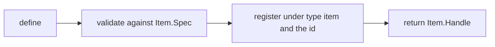
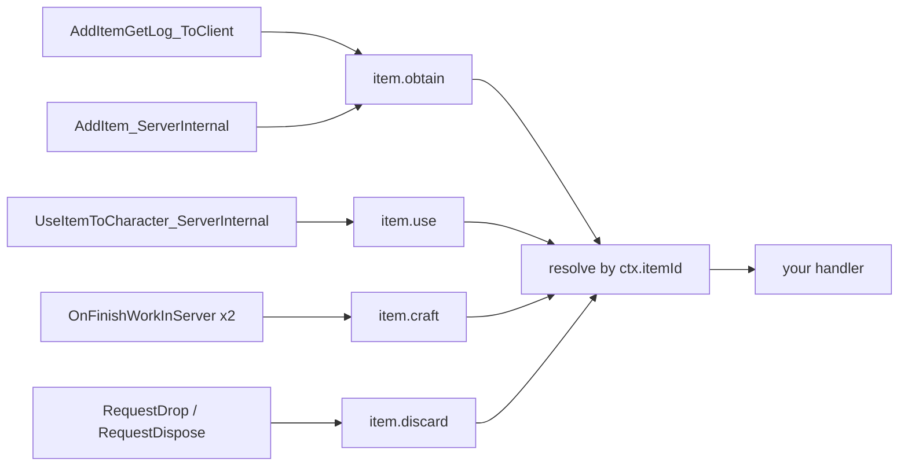
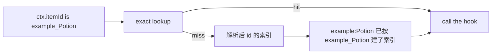
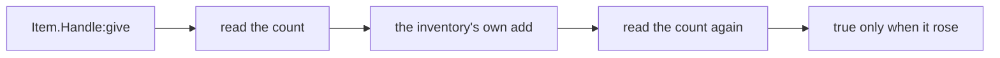
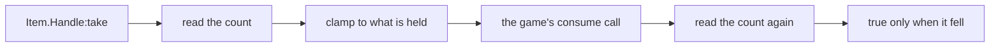

## 读完本页你可以做到

- 读出玩家现在身上带着多少个这种道具
- 从自己的代码往玩家背包里加道具，也能再取出来
- 在玩家捡到东西的那一刻运行你自己的代码
- 在玩家吃下或用掉东西的那一刻运行你自己的代码
- 在机器合成出它、或者玩家把它丢掉的那一刻运行你自己的代码
- 给游戏里的道具写上自己的名字、说明和配方数值

道具就是待在背包里的东西：材料、食物、装备、弹药。写 `Item{ ... }` 描述一个道具。你会拿回一个**句柄** —— 一个带着这个道具各种操作的小对象，比如 `:give`。

```lua
local berries = Item{ id = "Berries", name = "Red Berries", category = "consumable" }

Item.get("Wood")          -- a handle for any item id, defined or not
Item.get_all()            -- every PalForge-registered item, as handles
```

`Item.get(id)` 会给你一个道具的句柄，不管这个道具是不是你自己描述的。`Item.get_all()` 列出 PalForge 目前知道的所有道具。

描述一个道具时，PalForge 会检查你的表，把它按 ID 归档，然后返回句柄：



写 `Item{ ... }` 并不会在游戏里造出一个新道具。它是把你的行为和你的信息挂到游戏里已经有的 ID 上。不带冒号的 ID 是游戏自带的 ID（`"Wood"`、`"Berries"`、`"Arrow"`）。带冒号的 ID 是你自己内容包里的东西（`"example:Potion"`），它对应的游戏数据行写作 `example_Potion`。要创建那一行需要 PalSchema —— 只靠 Lua 没法往 `DT_ItemDataTable_Common` 里加一行。

只要你的内容包加载了 PalForge，`Item` 就是一个全局变量；带命名空间的写法也一样能用：

```lua
local api = require("palforge.api")
api.Item{ id = "Arrow" }
Item{ id = "Arrow" }        -- same module; the globals are mod-local under UE4SS
```

Palworld 自带的道具 ID 都列在 `palforge.native.items` 里。自己造新东西之前先翻一翻 —— 你想要的 ID 多半已经有了：

```lua
local items = require("palforge.native.items")

items.CATALOG            -- every DT_ItemDataTable_Common row id, as a list of strings
items.get("Arrow_Fire")  -- a lazily built, cached handle for any catalog id; nil if unknown
items.publish("Arrow_Fire")  -- 可选：把这个句柄注册进去，好让事件能找到它
items.Wood               -- curated handles, defined at load; Wood and Berries carry hooks
items.Berries
items.Arrow
```

一开始就描述好的道具有三个：`Wood`、`Berries` 和 `Arrow`。这三个在加载时就注册了，因为它们声明了处理函数，而没有注册的定义永远收不到分发。其他所有目录 ID 会在你第一次用 `items.get(id)` 询问时变成句柄，而那个句柄不会注册任何东西 —— 读目录就只是读。把它放进注册表的是需要你主动调用的 `items.publish(id)`。

## 字段

必须传的字段只有 `id`。其余的要么补一条信息，要么挂上行为。传入不在这张表里的字段，调用会直接停下报错，并告诉你最接近的合法字段名。

<TypeTable
  type={{
    id: {
      description: '道具 ID。可以是游戏里的 ItemId，比如 "Wood"；内容包的内容则写成 "pack:name"。必须是非空字符串。',
      type: 'string',
      required: true,
    },
    name: {
      description: '显示在界面上，也是 Handle:name 的返回值。',
      type: 'string',
      default: '与 id 相同',
    },
    description: {
      description: '一行说明，给界面和工具用。由 Handle:description 返回。',
      type: 'string',
    },
    category: {
      description: '这是哪一类背包内容。只是 PalForge 自己的记录。',
      type: '"material" | "consumable" | "equipment" | "ammo" | "ingredient" | "other"',
      default: 'material',
    },
    maxStack: {
      description: '背包里的堆叠上限。只是 PalForge 自己的记录。',
      type: 'number',
      default: '1',
    },
    icon: {
      description: '图标 DataTable 里没有这个 id 的行时使用的 /Game/... 贴图路径。是字符串，因为真正的查找也只能给出这一种值。',
      type: 'string',
    },
    recipe: {
      description: '生产这个道具的配方。形状见 Item.Spec.Recipe。',
      type: 'table',
    },
    events: {
      description: '你的处理函数，集中放在这里。形状见 Item.Spec.Events。',
      type: 'table',
    },
    data: {
      description: '你自己的任意数据，会被复制到定义类上。',
      type: 'table',
    },
  }}
/>

大多数道具只需要 `id`、`name`、`category` 和 `maxStack`。下面是 PalForge 自带的三个，处理函数已经去掉：

```lua title="content/items.lua"
Item{
    id          = "Wood",
    name        = "Wood",
    category    = "material",
    maxStack    = 9999,
}

Item{
    id          = "Berries",
    name        = "Red Berries",
    category    = "consumable",
    maxStack    = 100,
}

Item{
    id          = "Arrow",
    name        = "Arrow",
    category    = "ammo",
    maxStack    = 999,
}
```

### 配方的形状

`recipe` 记录生产这个道具的合成：要花什么，能得到多少。

<TypeTable
  type={{
    materials: {
      description: '一张映射表，从道具 ID 到一次合成消耗的数量。每个值都必须是 number。',
      type: 'table',
      required: true,
    },
    count: {
      description: '一次合成产出多少个这个道具。',
      type: 'number',
      default: '1',
    },
    work: {
      description: '设备需要投入的工作量。',
      type: 'number',
    },
    station: {
      description: '能合成它的工作台或设备 ID。',
      type: 'string',
    },
  }}
/>

```lua
local arrow = Item{
    id       = "Arrow",
    name     = "Arrow",
    category = "ammo",
    maxStack = 999,
    recipe = {
        materials = { Wood = 2, Stone = 1 },
        count     = 5,
        work      = 20,
        station   = "WorkBench",
    },
}

local r = arrow:recipeOf()
print(r.count)                -- 5
print(r.materials.Wood)       -- 2
```

<Callout type="warn">
配方只是一条记录，不是真的合成。PalForge 不会把它注册进游戏的合成系统，能把它读回来的只有 `Handle:recipeOf()`。写了配方并不会让这个道具在游戏里可以合成，它只是给你自己的代码一个存放数值的地方。游戏真正会跑的配方是 `DT_ItemRecipeDataTable` 里的一行，而 Lua 写不了那一行 —— 真正的配方用 PalSchema 的 JSON 声明，这里的字段是把同一件事讲给你自己的代码和工具听。
</Callout>

`recipeOf()` 读回来的只有你声明过的东西，它**不读游戏那张表**。所以即使游戏里确实有这一行，原版 ID 得到的也是 `nil`：`DT_ItemRecipeDataTable_Common` 加载在 `/Game/Pal/DataTable/Item/` 下，共 1414 行，按道具 ID 做键，列有 `Product_Count`、`Material1_Id` 到 `Material5_Id`、`WorkAmount` 以及另外九个。还不清楚的是：能不能直接从 `FindRow` 返回的结构体上按名字取出一个标量或 FName 列。这里唯一读到过的行值是一个 `TSoftObjectPtr`，它没法从 Lua 打开，图标查找绕道去整列读文本正是因为这个。按列去读今天就能用，一张表十三次调用、只做一次、缓存起来。这个问题由 `pf_hook item-datatable-row-read` 来测，它需要 `env.debug` 和一个已加载的世界。

### 第二个参数

`Item{ ... }` 在 spec 之后还接受一个可选的选项表。不写它时的行为和以前完全一样。

```lua
-- 只构造句柄，不做任何注册：给那种不该写进注册表的“读取”用
local probe = Item({ id = "Wood" }, { register = false })

-- 归属到某个内容包再注册，这就是让冲突有“谁”的那一步
Item({ id = "example:Potion" }, { pack = "mypack" })

-- 不用每次调用都传，也能得到同样的归属
local api = PalForge.pack("mypack")
api.Item{ id = "example:Potion" }
```

只接受 `register` 和 `pack`，写错的选项会报错而不是被悄悄忽略。两个内容包注册同一个 id 时，这次替换会连同两个包名一起写进日志；两个解析到同一行的 id 也一样。

### 校验

你的表里每一个问题都会报错，所以调用不会做到一半就算成功。消息以 `PalForge: ` 开头，并指出它停在哪个字段。id 本身也在其中：带命名空间的 id 冒号两边都只能是字母、数字和 `_`，因为 PalSchema 为 `"pack:Potion"` 写入的行是 `pack_Potion`。解析不出来的 id 会在这里被拒绝，而不是先注册下来、再永远匹配不到任何东西。

```text
PalForge: Item: unknown field "maxStackSize" (did you mean "maxStack"?). Valid fields: id, name, description, category, maxStack, icon, recipe, events, data
PalForge: Item: field "id" is required (item id: a game ItemId ("Wood") or "pack:name")
PalForge: Item: field "id" is invalid: invalid pack id 'my-pack' in 'my-pack:Potion' (letters/digits/_ only)
PalForge: Item: field "category" must be one of { "material", "consumable", "equipment", "ammo", "ingredient", "other" }, got "food"
PalForge: Item: field "maxStack" expects number, got string
PalForge: Item: field "recipe" (Item.Spec.Recipe): field "materials" is required ({ <itemId> = <count> } consumed by one craft)
PalForge: Item: field "recipe" (Item.Spec.Recipe): field "materials.Wood" expects number, got string
PalForge: Item: field "events" (Item.Spec.Events): unknown field "onEquip". Valid fields: onObtain, onUse, onCraft, onDiscard
```

同一份清单在游戏运行时也能读出来，编辑器用的注解 `Scripts/palforge/types.lua` 也是从它生成的：

```lua
local schema = require("palforge.core.schema")
print(schema.help("Item.Spec"))            -- every field, type, default and meaning
print(schema.help("Item.Spec.Recipe"))
schema.get("Item.Spec").fields             -- the same as a table, for tooling
```

## 事件

把你的代码放进 `events` 表。每个处理函数的第一个参数是**这个道具的句柄**，第二个参数是一张装着细节的表，叫 `ctx`。

<TypeTable
  type={{
    onObtain: {
      description: 'LIVE。道具进入了背包。带 ctx.itemId、ctx.count 和 ctx.via。',
      type: 'fun(self: Item.Handle, ctx: table)',
    },
    onUse: {
      description: 'LIVE。道具被使用或消耗了。ctx.itemId 是道具，ctx.actor 是本地玩家的 pawn，ctx.targetId 是原始的目标 ID，ctx.itemData 是道具数据对象，ctx.processor 是使用处理器。',
      type: 'fun(self: Item.Handle, ctx: table)',
    },
    onCraft: {
      description: 'LIVE。某台合成机器做完了这个道具。带 ctx.recipeId 和 ctx.via；ctx.count 是 nil。',
      type: 'fun(self: Item.Handle, ctx: table)',
    },
    onDiscard: {
      description: 'LIVE。道具被丢在地上或被销毁。带 ctx.count 和 ctx.reason（"drop" 或 "dispose"）。',
      type: 'fun(self: Item.Handle, ctx: table)',
    },
  }}
/>

游戏自身的七个调用会汇进这四个处理函数，而且四个频道都已在真实存档里被看到运送过事件：



PalForge 不会追踪世界里每一份道具。它从事件里取出游戏的道具 ID，先找归档在这个 ID 下的定义，再找那个“解析之后正好是它”的带命名空间 ID。你从没描述过的原版道具对不上任何东西，处理函数也就不会运行。

### 带命名空间的 ID

你写成 `"example:Potion"` 的道具会按这个写法原样归档，而游戏报告的是数据行名 `example_Potion`。这个差距由 PalForge 替你补上：每一次注册也会按解析后的形式建索引，所以落空时只多一次表查找，你的内容包照样能收到事件。



```lua title="content/items/potion.lua"
local log = require("palforge.utils.log").scope("potion")

Item{
    id       = "example:Potion",        -- the DataTable row is example_Potion
    name     = "Potion",
    category = "consumable",
    events = {
        onUse = function(item, ctx)
            -- ctx.itemId is "example_Potion": the row name the game carries
            log.info("potion used: " .. tostring(ctx.itemId))
        end,
    },
}
```

句柄保留了带冒号的写法，所以你自己的调用还是用你写的那个 ID：

```lua
Item.get("example:Potion"):give(1)   -- resolves to example_Potion for the engine
```

两个解析后行名相同的 ID 仍然会冲突：索引对每个解析形式只留一条，后注册的那个占住它。但这已经不是分发时的碰运气，而是定义时一条指名两个 ID 的警告。请让内容包里的 ID 保持唯一。帕鲁也是用同样的方式匹配的，按蓝图类名。

### onObtain

`onObtain` 在道具落进背包时运行：拾取、采集、战利品、奖励。游戏有两个调用会报告这件事，PalForge 两个都听 —— `AddItemGetLog_ToClient`，也就是游戏自己的“获得道具”日志，以及真正改动数量的 `PalPlayerInventoryData:AddItem_ServerInternal`。

| ctx 的键 | 类型 | 说明 |
| --- | --- | --- |
| `ctx.itemId` | string | 获得的游戏道具 ID。一定有。 |
| `ctx.count` | number \| nil | 数量。读不出来时为 `nil`。 |
| `ctx.via` | string | 由哪个调用报告：`"getlog"` 或 `"additem"`。 |

```lua
Item{
    id = "Wood",
    events = {
        onObtain = function(item, ctx)
            local log = require("palforge.utils.log").scope("woodpack")
            log.info("obtained " .. tostring(ctx.count) .. " of " .. tostring(ctx.itemId))
        end,
    },
}
```

<Callout type="info">
这两个调用是同一次拾取的两个视角，所以同一个道具 ID 在半秒内重复出现时会被丢掉，你的处理函数只运行一次。代价是实打实的：同一个道具在这半秒内真的被第二次拾取，那一次就丢了。数量为负是移除而不是拾取，会被跳过，不会当成获得来报告。
</Callout>

### onUse

`onUse` 在玩家吃下、喝下或以别的方式用掉道具时运行。来源是 `PalItemUseProcessor:UseItemToCharacter_ServerInternal`。

| ctx 的键 | 类型 | 说明 |
| --- | --- | --- |
| `ctx.itemId` | string | 被使用的游戏道具 ID。一定有。 |
| `ctx.actor` | any \| nil | 本地玩家的 pawn —— 使用道具的那个角色。找不到时为 `nil`。 |
| `ctx.player` | any \| nil | 和 `ctx.actor` 是同一个值。 |
| `ctx.targetId` | any \| nil | 道具用在了谁身上，是游戏传来的原始 `FPalInstanceID`。不会转成角色。 |
| `ctx.itemData` | any \| nil | 游戏里这个被使用道具的数据对象。 |
| `ctx.processor` | any | 执行这次使用的 `PalItemUseProcessor`。 |

<Callout type="warn">
`ctx.actor` 是“使用”道具的角色。只有食物、药水这类玩家用在自己身上的东西，它才等于“被用上”的那个角色。喂帕鲁时，帕鲁在 `ctx.targetId` 里，是一个原始实例 ID，这里没有任何东西会把它变成 actor。这个值是靠寻找本地玩家 pawn 得到的，所以它是第一个被找到的 pawn，而不是谁动手的证据。把它当成一个可以作用的玩家 pawn。PalForge 面向的是单人 Palworld，背后没有复制层；只要场上不止一个玩家，这个问题它就回答不了。
</Callout>

```lua
Item{
    id       = "Berries",
    name     = "Red Berries",
    category = "consumable",
    maxStack = 100,
    events = {
        onUse = function(item, ctx)
            local log = require("palforge.utils.log").scope("berries")
            log.info("used " .. tostring(ctx.itemId) .. " on " .. tostring(ctx.actor))
        end,
    },
}
```

为了找出道具 ID，PalForge 会读第一个参数上的 `ID` 字段 —— 游戏里只见过这一种形状 —— 读不到就依次退到 `Id`、`StaticId` 和后面三个参数，所以签名偏移了也还能解析出来。如果找不到 ID，就什么都不报告，处理函数也不运行。

### onCraft

`onCraft` 在一台机器做完这个道具时运行。带道具 ID 的工作模型有两个，都钩在 `OnFinishWorkInServer` 上：配方工作台和熔炉那一类的 `PalMapObjectConvertItemModel`，以及产出固定的生产机 `PalMapObjectProductItemModel`。在真实机器上合成时，这个频道被看到运送了它的第一个事件。

| ctx 键 | 类型 | 说明 |
| --- | --- | --- |
| `ctx.itemId` | string | 机器产出的道具。 |
| `ctx.recipeId` | string | 同一个值，只是用 convert 那条路径的叫法。Palworld 的配方表是按产物道具 ID 做键的，所以对原版配方来说这两者确实是同一个字符串。 |
| `ctx.count` | nil | 按设计永远是 `nil`。 |
| `ctx.via` | string | `"convert"` 或 `"product"`。 |
| `ctx.model`、`ctx.work` | any | 工作模型和工作对象，留给想再往里看的处理函数。 |

<Callout type="info">
`ctx.count` 是 `nil`，而且会一直是 `nil`。每次合成的产出数量写在配方行的 `Product_Count` 里，而钩子里不是读 DataTable 的地方 —— 一个没人测过的 `1` 比一个诚实的 `nil` 更糟。需要数量就在前后自己读 `:count()`。
</Callout>

### onDiscard

`onDiscard` 在玩家把这个道具丢掉时运行。两个来源都是 `UPalNetworkItemComponent` 上的 RPC：丢到地上的 `RequestDrop_ToServer`，以及从背包界面销毁一叠的 `RequestDispose_ToServer`。丢弃**不会**走成负数的 `AddItem_ServerInternal` —— 那个钩子挂上之后，两个会话里一次都没触发过，因为移除住在隔壁那个网络组件上。

| ctx 键 | 类型 | 说明 |
| --- | --- | --- |
| `ctx.itemId` | string | 请求所指的那个格子里此刻装着的道具 ID。 |
| `ctx.count` | number \| nil | 离开背包的数量 —— 是这一条自己的数字，不是整格的堆叠数。 |
| `ctx.reason` | string | `"drop"` 或 `"dispose"`。 |

<Callout type="warn">
这些 RPC 带的是**格子 ID**，不是道具 ID，所以必须赶在服务器清空之前从格子里把 ID 读出来。那就得先找到容器：玩家自己的背包助手还不够 —— 第一次真实丢弃报告的是“玩家的 6 个容器没有一个对得上” —— 所以容器集合来自一次全世界扫描，并按 GUID 精确匹配。当某个格子解析不出来时，这里什么都不发，而不是发一个猜出来的 ID，并按不同原因各写一次日志说明卡在哪一步。只有那种形状的丢弃是无声的，频道本身是活的。
</Callout>

### 关于处理函数还要知道的

- 处理函数只在世界加载之后才运行。在那之前，每个来源都会直接返回。
- 你的处理函数跑在 `pcall` 里。如果它抛错，错误会连同频道名和出问题的钩子一起写进日志，事件继续发给其他人。错误不会被重新抛出，所以你的处理函数拦不住事件。
- 第一个参数是句柄，不是定义。`:give`、`:take`、`:count` 和各种查询就在它上面。
- 用一个已经用过的 ID 再描述一个道具，会替换掉前一个，只有最新的那个能收到事件。

抛错的处理函数在日志里长这样：

```text
[PalForge.event][err] item.use -> onUse handler failed: content/items.lua:12: attempt to index a nil value
```

除了在单个道具上声明处理函数，你也可以直接监听原始频道。想一次盯住所有道具就用这个：

```lua
local event = require("palforge.core.event")

local sub = event.on("item.obtain", function(ctx)
    print(ctx.itemId, ctx.count)
end)

sub:unsubscribe()
```

句柄也可以直接调用你的处理函数，`ctx` 由你自己拼。想不进游戏就试一下处理函数，就这么做：

```lua
Item.get("Berries"):onUse({ itemId = "Berries" })
```

## 句柄

`Item{ ... }`、`Item.get(id)` 和 `Item.get_all()` 都会给你一个 `Item.Handle`。`Item.get` 永远不返回 `nil`：对于你从没描述过的 ID，它当场造一个薄薄的句柄，所以任何原版道具不用先描述就能给、能拿、能查。

| 成员 | 返回 | 作用 |
| --- | --- | --- |
| `.id` | string | 这个道具的游戏道具 ID。就是一个普通字段。 |
| `:count()` | number \| nil | 本地玩家现在身上带着多少个。`nil` 的意思是读不出来，绝不是“一个都没有”。 |
| `:give(count)` | boolean | 往本地玩家的背包里加 `count` 个（默认 1）。只有观察到背包数量确实上升时才是 `true`。 |
| `:take(count)` | boolean | 从本地玩家的背包里消耗 `count` 个（默认 1）；`count` 按绝对值处理。只有观察到数量确实下降时才是 `true`。 |
| `:recipeOf()` | table \| nil | 你声明过的配方；没有就是 `nil`。它不读游戏的配方表。 |
| `:iconOf()` | string \| nil | 从道具图标 DataTable 得到的 `/Game/...` 路径，查不到就用声明的 `icon`。 |
| `:name()` | string | 声明的名字，没有就用 ID。 |
| `:description()` | string \| nil | 声明的说明。 |
| `:category()` | string | 声明的分类，没有就是 `"material"`。 |
| `:maxStack()` | number | 声明的堆叠上限，没有就是 `1`。 |
| `:onObtain(ctx)` | any | 立刻运行这个道具的 `onObtain` 处理函数。 |
| `:onUse(ctx)` | any | 立刻运行这个道具的 `onUse` 处理函数。 |
| `:onCraft(ctx)` | any | 立刻运行这个道具的 `onCraft` 处理函数。 |
| `:onDiscard(ctx)` | any | 立刻运行这个道具的 `onDiscard` 处理函数。 |

### give

`:give` 通过背包自己的写入把道具放进玩家背包，然后核对它们是不是真的到了：调用之前读一次数量，调用之后再读一次，`true` 表示看到数量**上升**了。



```lua
Item.get("Wood"):give(10)        -- 10 Wood into the local player inventory
Item.get("Arrow"):give()         -- count defaults to 1

if not Item.get("Berries"):give(5) then
    -- nothing was measured to arrive; the log line says which step stopped
end
```

这个布尔值是实测结果，不是“调用成功了没有”。`false` 表示没有观察到东西到位，原因可能有好几个：背包当场拒绝、背包放不下、事后读不出数量。背包自己会给出一个理由，日志会把它带上，所以布尔值分不出来的情况，日志能分出来：

```text
[PalForge.items][info] give Wood x3: 140 -> 143 [evidence declared]
[PalForge.items][warn] give Wood x10: AddItem_ServerInternal answered Success but the count did not rise (135 -> 135). Weight is now 300.0 of 300.0
[PalForge.items][err] give Wood x10 failed: the player's inventory could not be reached
```

上面第一行是从真实存档里抄下来的真日志：`give Wood x3: 140 -> 143`，旁边游戏自己的拾取事件也一起触发了。

行尾的 `[evidence ...]` 记的是 PalForge 在发出调用之前，是怎么拿正在运行的游戏核对过的。你不需要为它做什么；它只是让一个出乎意料的 `false` 变得看得懂。

带命名空间的 ID 会先被解析，所以 `Item.get("example:Potion"):give(1)` 交给游戏的名字是 `example_Potion`。PalForge 不会检查对应的数据行是否存在 —— 游戏不认识的 ID 什么都不会加，然后以 `false` 的形式回来。

<Callout type="info">
`:give` 走的是游戏拾取时用的同一个写入，所以它通常也会走到 `onObtain`。在 `onObtain` 处理函数里面有一道保护拦着，处理函数不会把自己再触发一遍；在别的地方，就要预料到自己的 give 会绕回来。
</Callout>

### take

`:take` 是同一套实测，方向相反：前后各读一次数量，`true` 表示看到数量**下降**了。道具是被消耗掉的 —— 不会掉在玩家脚边让人捡回去 —— 所以整合包可以真正收取一份代价。

<Callout type="warn" title="take 需要玩家身上装备着东西">
走的是游戏自己的消耗调用 `APalWeaponBase:RequestConsumeItem`，通过玩家的装备组件找到它 —— 而它是**武器 actor 上的方法**，所以身上什么都没装备的玩家根本没有这条路，`:take` 会返回 `false` 并把这件事说清楚。装备任何一样东西就够了：武器只要被生成出来即可，不必拿在手上；而且它消耗的是交给它的那个 ID，不是它自己的弹药。这是设计时要绕开的唯一一点：如果你的建筑物要收代价，一个空着手站在那里的玩家是付不了的。背包本身完全没有移除手段：它整条类链上没有任何做减法的声明，而“给添加接口传负数”这个设想也已被实测为会被接受但什么都不做。
</Callout>



```lua
if Item.get("Wood"):take(3) then
    -- three Wood are gone from the inventory
else
    -- nothing was measured to leave
end
```

要的比玩家带着的多，不算错误：请求会被夹到背包实际持有的数量。一个都没有时，这个调用干脆就不发出去，并返回 `false`。两种情况都会写进日志，所以布尔值分不出来的情况，日志能分出来：

```text
[PalForge.items][info] take Wood x3: 164 -> 161 [evidence declared]
[PalForge.items][warn] take Wood x5: the inventory holds only 2, removing that many
[PalForge.items][warn] take Wood x3: the inventory holds none, so nothing is removed
```

第一行同样是真日志，来自证明 `:give` 的那同一次操作。

<Callout type="warn">
被夹过的移除照样返回 `true` —— 上面第二行要 5 个、只拿走了 2 个，返回的仍是 `true`。`true` 的意思是“看到数量下降了”，不是“正好走了 `count` 个”。数量必须精确时，自己在前后各读一次 `:count()`。
</Callout>

### 查询

不用一直把定义拿在手里，句柄就能回答关于这个道具的问题：

```lua
local wood = Item.get("Wood")

print(wood:count())       -- how many the player is carrying right now, or nil
print(wood:name())        -- "Wood" for the curated definition
print(wood:category())    -- "material"
print(wood:maxStack())    -- 9999 for the curated definition, 1 for a bare handle

local icon = wood:iconOf()   -- reads DT_ItemIconDataTable at runtime
```

`count` 通过游戏自己的 `CountItemNum` 去问本地玩家带着多少个这个 ID，返回一个普通数字 —— 在一个已加载的存档里，它给 Wood 的答案是 135。`nil` 表示根本读不出来（世界还没加载、找不到玩家），而不是“一个都没有”，所以比较之前先判断 `nil`。`:give` 和 `:take` 的判定也建立在这次读取上：把它读两遍而已。

`iconOf` 会去 `/Game/Pal/DataTable/Item/DT_ItemIconDataTable` 里查这个 ID，把那一行上的贴图作为 `/Game/...` 路径字符串返回，所以原版 ID 拿到的就是游戏本身给这个道具用的美术资源。这次读取是可用的：在真实存档里，这张表 1207 行中有 1183 行给出了路径，剩下 24 行本来就没有图标。每一步都是容错的，任何一次查不到都会返回你声明的 `icon`（没设过就是 `nil`）。带命名空间的 ID 会先被解析，所以 `Item{ id = "example:Potion" }:iconOf()` 是拿 PalSchema 写入的行名 `example_Potion` 去问的；只要你的内容包建过那一行，它就能读到真正的行。

### 枚举

```lua
for _, item in ipairs(Item.get_all()) do
    print(item.id, item:category(), item:maxStack())
end
```

`get_all` 返回 PalForge 已注册道具的句柄：自带的三个、你的内容包描述过的，以及任何有人通过 `native.items.get(id)` 取用过的目录 ID。它不是游戏完整的道具表。

## 示例

### 使用时施加一个效果的消耗品

`onUse` 会在 `ctx.actor` 里给你玩家。把它交给一个 `Effect`，效果会按自己的节奏运行，直到过期。

```lua title="content/items/berry_regen.lua"
local log = require("palforge.utils.log").scope("berryregen")

local Regen = Effect{
    id          = "example:BerryRegen",
    name        = "Berry Regeneration",
    description = "Ticks for a while after eating berries.",
    duration    = 10.0,   -- seconds; omit for "until :remove()"
    interval    = 1.0,    -- seconds between onTick calls
    events = {
        onApply = function(effect, target, ctx)
            log.info("regen started on " .. tostring(target))
        end,
        onTick = function(effect, target, ctx)
            -- ctx.elapsed = seconds since apply, ctx.stacks = current stack count
            log.info("regen tick at " .. tostring(ctx.elapsed))
        end,
        onExpire = function(effect, target, ctx)
            -- ctx.reason is "duration", "removed", "target_gone" or "world_left"
            log.info("regen ended: " .. tostring(ctx.reason))
        end,
    },
}

Item{
    id          = "Berries",
    name        = "Red Berries",
    description = "Applies a short regeneration effect when eaten.",
    category    = "consumable",
    maxStack    = 100,
    events = {
        onUse = function(item, ctx)
            Regen:apply(ctx.actor or Player.character())
        end,
    },
}
```

效果在加载时描述一次就够了，处理函数里只调用 `:apply`。写在处理函数里面的话，每用一次就会重新注册一遍。

<Callout type="warn">
PalForge 的效果按自己的时钟走，HP 不会自己变，效果实际要做的事写在 `onTick` 里。不过在定义里写上 `nativeStatus`，就会在效果运行期间点亮游戏自己的状态异常，所以状态栏是会变的；背后的伤害或回复仍然要你自己写。
</Callout>

在任何地方都能查看正在运行的效果：

```lua
local who = Player.character()

Regen:isActive(who)     -- true while it runs
Regen:timeLeft(who)     -- seconds left, nil when the effect has no duration
Regen:stacksOn(who)     -- 0 when inactive
Effect.activeOn(who)    -- ids of every effect currently on that target
Regen:remove(who)       -- ends it early, firing onExpire with reason "removed"
```

### 统计玩家已经获得了多少

`onObtain` 带着数量。道具自己保存不了任何东西，所以把累计放在一个 Lua 变量里，或者放进会被复制到定义上的 `data` 表里。

```lua title="content/items/wood_counter.lua"
local log = require("palforge.utils.log").scope("woodcount")

local obtained = 0

Item{
    id       = "Wood",
    name     = "Wood",
    category = "material",
    maxStack = 9999,
    data     = { milestone = 100, reward = "Arrow", rewardCount = 10 },
    events = {
        onObtain = function(item, ctx)
            local cfg = item._cls.data          -- `data` lives on the definition class
            obtained = obtained + (ctx.count or 0)
            log.info("wood so far: " .. obtained)

            if obtained >= cfg.milestone then
                obtained = obtained - cfg.milestone
                Item.get(cfg.reward):give(cfg.rewardCount)
                log.info("milestone reached, handed out " .. cfg.reward)
            end
        end,
    },
}
```

<Callout type="info">
`data` 会被复制到定义类上，而 `Item.Handle` 没有读它的方法 —— 用 `item._cls.data` 去取。像上面 `obtained` 那样一个普通的局部变量，通常是放计数器更清楚的地方，因为一眼就能看出它是按文件、按本次游玩来算的。
</Callout>

这两种都撑不过一次重新加载。有存档 `state` 和 `:save()` 的只有建筑物；模组被拆掉时，道具的计数器就归零了。想留住它，就用 `palforge.utils.file` 自己写出去，世界加载时再读回来：

```lua
local event = require("palforge.core.event")

event.on("world.ready", function(ctx)
    obtained = 0     -- or load your own record here
end)
```

### 从建筑物里发放道具

建筑物的处理函数拿到的是**活着的建筑物**而不是句柄：有 `self.actor`、`self.pos`、`self.state` 和 `self:save()`。这让 `onRightClick` 成了运行 `:give` 的自然位置。

```lua title="content/buildings/supply_bench.lua"
local log = require("palforge.utils.log").scope("supply")

Building{
    id     = "WorkBench",
    name   = "Workbench",
    gridCm = 100,
    mesh = {
        kind  = "static",
        model = "/Game/Pal/Model/Prop/Architecture/WorkBenchPrimitive/SM_WorkBenchPrimitive.SM_WorkBenchPrimitive",
    },
    state = { handouts = 0 },
    events = {
        onRightClick = function(self, ctx)
            -- ctx.actor = the build object, ctx.player = who interacted, ctx.buildId
            local ok = Item.get("Wood"):take(5)   -- the 5 Wood are consumed
            if not ok then
                log.warn("could not take the wood")
                return
            end

            Item.get("Arrow"):give(10)

            self.state.handouts = self.state.handouts + 1
            self:save()
            log.info("handouts so far: " .. self.state.handouts)
        end,
        onLoad = function(self, ctx)
            log.info("bench restored with " .. tostring(self.state.handouts) .. " handouts")
        end,
    },
}
```

<Callout type="warn">
这个例子接管了 ID `"WorkBench"`，而 PalForge 已经描述过它。最新的描述胜出，所以这里把 mesh 那一块又写了一遍，好保住原版的外观。你自己的内容请用带命名空间的 ID。
</Callout>

先扣、扣成功了才给：这个顺序才能让补给台不至于白发东西，因为没看到东西离开时 `:take` 会返回 `false`。木头是被消耗掉的，不是掉在地上，所以这确实是玩家付出的代价。`true` 唯一不保证的是“5 个全走了”：请求会被夹到玩家实际带着的数量，所以必须精确的交易还是得自己查一次 `:count()`。另外，什么都没装备的玩家根本付不了，这一点 `false` 分支已经接住了。

## 注意事项

在这些东西上面搭点什么之前，先知道它们粗糙在哪里。

**你没法创建新道具。** Lua 没法往 `DT_ItemDataTable_Common` 里加一行。`Item{ ... }` 是把行为和信息挂到一个 ID 上，创建那一行的是 PalSchema。没人创建过的 ID，游戏就不会显示。

**`onCraft` 不会带来数量**，而 `onDiscard` 对那种解析不出道具 ID 的丢弃是无声的。两个频道都是活的，也都被看到触发过；这两处缺口是诚实的边界，不是停摆。

**`recipeOf` 不读游戏的配方表。** 它返回的是你声明过的配方；即使游戏里确实有那一行，原版 ID 得到的也是 `nil`。

**带命名空间的 ID 是靠解析后 id 的索引匹配到的。** 事件带的是游戏的数据行名，所以注册成 `"example:Potion"` 的道具精确查找找不到，是第二次按解析形式做的查找找到它的。每个解析形式只对应一条注册，所以两个解析到同一行名的内容包 ID 仍然会冲突 —— 但注册第二个时会发出一条指名两者的警告。

**拿走道具需要玩家装备着东西。** 这次消耗调用是玩家所带武器 actor 上的方法，所以什么都没拿的玩家没有通道，`:take` 返回 `false`。道具本身是被消耗掉的，不是掉在地上。

**`onUse` 不会直接告诉你目标是谁。** `ctx.actor` 是本地玩家的 pawn，也就是使用道具的那个。被用上的角色在 `ctx.targetId` 里，是一个原始实例 ID，这里没有东西会把它变成 actor。食物和药水两者相同，喂帕鲁时就不同。

**`category`、`maxStack` 和 `recipe` 是 PalForge 自己的记录。** 你通过句柄和自己的代码把它们读回来。没有任何东西会把它们写进游戏的道具表，所以 `maxStack = 9999` 不会改变游戏怎么堆叠这个道具。`icon` 只在一个方向上是例外：先读真正的表，你声明的路径是它的备用。

**道具保存不了数据。** 存档 `state` 和 `:save()` 是建筑物的东西，所以处理函数数出来的东西只在本次游玩里有效。想要它回来，自己写进文件。

**处理函数的错误只写日志，不抛出。** 失败会通过 `utils.log` 报告，带上频道名和钩子名，例如 `item.use -> onUse handler failed: ...`。你的处理函数还是拦不住事件。

**`give`、`take` 和 `count` 只作用于本地玩家。** 它们找到 `PalPlayerCharacter` 并作用在那个背包上，背后没有复制层，是客户端权威的操作 —— PalForge 面向的是单人 Palworld。`count` 返回 `nil` 表示读取失败，不是背包空了。

**`give` 走的是背包自己的写入。** 它既报告数量的变化，也报告背包本身答了什么，所以 `false` 的原因在日志里看得见。

**一次 `:give` 通常也会触发 `onObtain`。** 它走的是游戏拾取时用的同一个写入。在 `onObtain` 处理函数里面有保护拦着；在别的地方，就要预料到自己的 give 会绕回来。

**半秒内的重复拾取会被丢掉。** 游戏的两个调用报告的是同一次拾取，PalForge 会在这个时间窗内丢掉同一个道具 ID 的重复，好让你的处理函数只运行一次。同一个道具真的在这么短时间内被第二次拾取，那一次就丢了。

## 小结

- 写 `Item{ ... }` 描述一个道具。只有 `id` 是必须的，这个 ID 必须是游戏里已经有的，而且解析不出行名的 ID 会当场被拒绝。
- `Item.get("Wood")` 会给你任意道具的句柄。`:count()` 读出玩家现在带着多少，`:give` 往里加，`:take` 消耗掉 —— 三者返回的都是“实测到了什么”，而不是“试着做了什么”。`:take` 需要玩家身上装备着东西。
- 把你的代码放进 `events`，四个处理函数都会运行：`onObtain` 在拾取时，`onUse` 在使用时，`onCraft` 在机器做完时，`onDiscard` 在丢弃或销毁时。
- 在 `onUse` 里，`ctx.actor` 是使用道具的玩家 —— 食物和药水要作用的正是他。
- `category`、`maxStack` 和 `recipe` 是给你自己代码用的记录，游戏不会读它们，`recipeOf` 也不读游戏的配方表。`icon` 只是那次真正能读到游戏图标行的查找的备用。
- 道具保存不了数据。把累计放在 Lua 变量里，或者用 `palforge.utils.file` 自己写出去。

接下来读 [Effect](/docs/api/effect)，做一个用掉之后还会持续起作用的道具 —— 或者读 [Lifecycle](/docs/concepts/lifecycle) 了解完整的事件流程，以及 [Pal](/docs/api/pal) 和 [Building](/docs/api/building) 了解上面用到的两个领域。
