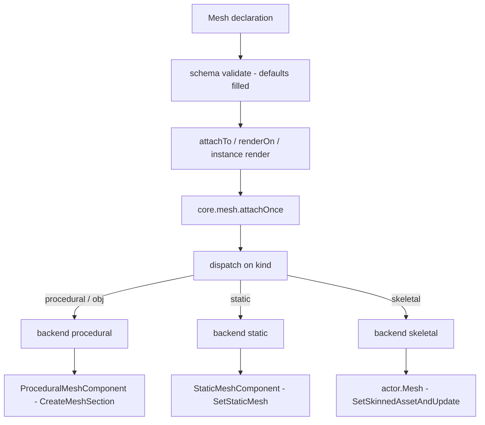
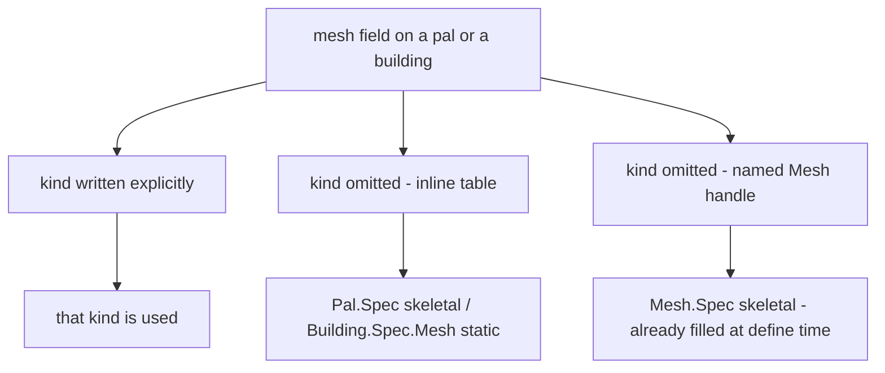

## このページでできるようになること

- パルの見た目を差し替えて、バニラのニワトリを羊の姿で歩かせる
- 自分で用意したモデルを、世界に置いた建物に付ける
- モデルに名前を付けて、いくつものパルやビルディングで使い回す
- 遊んでいる最中にモデルの色を変えたり、モデルを外したりする

メッシュとは、ゲームの中で何かが身にまとうモデルと、その塗り方のことです。`Mesh{ ... }` で
書いて id を付けておけば、同じモデルをパルにも、ビルディングにも、目の前にいるアクターにも
渡せます。

```lua title="content/meshes.lua"
local body = Mesh{
    id        = "example:chicken_body",
    kind      = "skeletal",
    model     = "/Game/Pal/Model/Character/Monster/ChickenPal/SK_ChickenPal.SK_ChickenPal",
    animClass = "/Game/Pal/Blueprint/Character/Monster/PalActorBP/ChickenPal/ABP_ChickenPal.ABP_ChickenPal_C",
}

Pal{ id = "example:Boss", mesh = body }          -- nest the defined mesh
body:attachTo(actor)                             -- or attach it yourself
```

## メッシュを定義する

3 つの呼び出しですべて足ります。作る、前に作ったものを取り出す、全部並べる、です。

```lua
local body = Mesh{ id = "example:body", model = "/Game/.../SK_X.SK_X" }  -- define, returns a Mesh.Handle
Mesh.get("example:body")                                                 -- an existing one, by id
Mesh.get_all()                                                           -- every registered mesh, as handles
```

`Mesh{ ... }` は書いたテーブルを検査し、id で保存して、`Mesh.Handle` を返します。これが実際に
アタッチするときに使うオブジェクトです。id は書いたままの形で保存されるので、`Mesh.get` にも
まったく同じ文字列を渡します。すでに使われている id で定義すると、前のものが置き換わります。

`id` が必須になるのは `Mesh` を直接呼ぶときだけです。パルやビルディングの中にインラインで書いた
メッシュには名前を付ける対象がありませんが、単体で定義したメッシュは id がなければ二度と
取り出せません。

```lua
Mesh{ model = "/Game/Pal/Model/Other/PalBox/SM_PalBox.SM_PalBox" }
```

```text
PalForge: Mesh: field "id" is required (an unnamed mesh cannot be looked up again - write it inline as mesh = { ... } instead)
```

`Mesh.get` は、その id で何も登録されていなければエラーになります。タイプミスはその場で止まる
ので、パルが何も表示しないまま気づかない、ということになりません。

```lua
local body = Mesh.get("example:no_such_mesh")
```

```text
PalForge: Mesh.get("example:no_such_mesh"): no mesh is defined under that id
```

`Mesh.Class` はメッシュ定義の土台になるクラスです。メソッドは `source()` ひとつだけで、定義
自身を返します。メッシュを書き下ろすのではなくコードで組み立てたいときに継承してください。

## Mesh.Spec

`Mesh{ ... }` の中に書けるものの一覧です。たいていのメッシュに必要なのは 2 つで、どのモデルを
使うかを表す `model` と、どう付けるかを表す `kind` です。残りは塗りと配置のためのものです。

<TypeTable
  type={{
    id: {
      description: 'レジストリのキー。Mesh を直接呼ぶときは必須で、パルやビルディングの中にインラインで書くときは省略します。',
      type: 'string',
    },
    kind: {
      description: 'どの core.mesh バックエンドが描画するか。',
      type: '"procedural" | "static" | "skeletal" | "obj"',
      default: '"skeletal"',
    },
    model: {
      description: 'モデル。skeletal / static バックエンドでは /Game/... の USkeletalMesh または UStaticMesh のパス、procedural / obj では .obj ファイルのパス（絶対、または宣言した .lua ファイルからの相対）です。',
      type: 'string',
      required: true,
    },
    animClass: {
      description: 'ABP_*_C アニメーションブループリントのパス。末尾の _C は付けても付けなくてもかまいません。skeletal バックエンドだけが読みます。',
      type: 'string',
    },
    scale: {
      description: 'アタッチしたメッシュに掛ける等倍スケール。skeletal では、元のスケールを先に控えられたときだけ適用されます。',
      type: 'number',
    },
    offset: {
      description: 'x, y, z のキーで書くオフセット。procedural と static ではアクター原点から、skeletal ではメッシュコンポーネント自身の相対位置に加算されます。',
      type: 'table',
    },
    texture: {
      description: '/Game/... の UTexture2D パス、または自前の png（絶対、または宣言した .lua ファイルからの相対）。すべてのバックエンドで、実測したテクスチャパラメータ名へ書き込まれます。',
      type: 'string',
    },
    color: {
      description: '0..1 の r, g, b, a によるティント。すべてのバックエンドで実測したベクターパラメータ名へ書き込まれ、procedural では頂点カラーとしても焼き込まれます。',
      type: 'table',
    },
    material: {
      description: 'ダイナミックマテリアルの親にするベースマテリアルのアセットパス。すべてのバックエンドが読みます。作りたてのメッシュセクションが自前のマテリアルを持たない procedural では必須です。',
      type: 'string',
    },
    params: {
      description: '追加のマテリアルパラメータ。vector / scalar / texture のサブテーブルに分けて書きます。すべてのバックエンドが読みます。',
      type: 'table',
    },
  }}
/>

同じフィールド一覧は、ゲームを離れずに実行時からも読めます。

```lua
local schema = require("palforge.core.schema")
print(schema.help("Mesh.Spec"))            -- every field, type, default and meaning
print(schema.help("Building.Spec.Mesh"))   -- the same shape with kind defaulting to static
schema.get("Mesh.Spec").fields             -- the same as a table, for tooling
```

PalForge が知らないフィールド名はエラーになり、近い名前を提案します。呼び出しは完全に成功
するか、まったく成功しないかのどちらかです。

```lua
Mesh{ id = "example:body", modelPath = "/Game/.../SK_X.SK_X" }
```

```text
PalForge: Mesh: unknown field "modelPath" (did you mean "model"?). Valid fields: id, kind, model, animClass, scale, offset, texture, color, material, params
```

## 書いたテーブルが画面に出るまで

書いたテーブルが画面のモデルになるまでには 3 つの段階があります。まずテーブルが検査され、
書かなかった既定値が埋まります。次に何かがそれをアクター、つまりパルの体や設置した建物と
いった世界の中の実体に渡します。最後に `core.mesh` が `kind` を見て付け方を選びます。



真ん中の段を誰がやるかは、そのメッシュを着るものによって変わります。

- **Mesh** — 自分で `meshHandle:attachTo(actor)` を呼びます。
- **Pal** — 書いておいた `mesh` は、定義自身の `onSpawned` より先に、`pal.spawned` チャンネルで
  代わりに貼られます。`pal:renderOn(actor)` は、そのチャンネルから来ていないポーン向けの手動の
  経路です。
- **Building** — 書いておいた `mesh` はこちらも代わりに貼られます。設置した建物をビルディングの
  スキャンが見つけ、その `render()` を呼びます。しかも最初に見つかったスキャンではなく、意図的に
  その次のスキャンで呼びます。まだ起動途中のアクターにアタッチするとゲームがクラッシュするため
  です。この遅延呼び出しが実際に建物へ届くのは、スキャンがアクターごとの記録をアクターの
  `GetFullName()` でキーにしているからです。ルックアップのたびに作り直される UE4SS のハンドルを
  キーにしていると、レンダリング待ちのフラグは一度立つだけで二度と読まれません。

どの経路も最後は `core.mesh.attachOnce` に入ります。アクターか spec が欠けていれば `false` と
その理由（英語）を返します。実行時のメッシュはスイッチひとつでまとめて止められます。

```lua
require("palforge.core.mesh").ENABLED = false   -- stop attaching runtime meshes entirely
```

<Callout type="info">
メッシュ層のアクターごとの記録はすべて、渡された Lua の値ではなく、アクター自身の
`GetFullName()` をキーにして保存されます。UE4SS はルックアップのたびに新しい userdata の
ラッパーを作るので、同じアクターへの 2 つの参照は同じ Lua の値になりません。ラッパーをキーに
したテーブルは、それを書き込んだまさにその値でしか読み戻せないのです。`detach`、`setColor`、
重ね掛け防止のガード、skeletal の復元記録はどれも、あとから来た `ctx.actor` や次の
`FindAllOf` からその記録を見つけられることに依存しています。実際の呼び出し元はすべてそちらです。

各バックエンドが覚えているのは、使ったメッシュではなく着せ替えた **アクター** です。すでに同じ
kind のメッシュを着ているアクターにもう 1 つ貼っても、何もせずに `true` を返します。この記録は
バックエンドごとに別なので、1 体のアクターが procedural と static のメッシュを同時に着ることは
できます。ただし `core.mesh` が覚えているのは最後にそのアクターを着せ替えたバックエンドだけで、
`setColor` と `detach` が届くのもそれです。`attachOnce` ではない `core.mesh.attach` は、別の
バックエンドの仕事を先に外すので、2 つが 1 体のアクターを取り合うことはありません。
</Callout>

## 4 つの kind と 3 つのバックエンド

`kind` がモデルの付け方を決めます。`obj` は `procedural` の別名で、どちらの名前でも同じ処理が
動きます。

| kind | 状態 | 何をするか |
| --- | --- | --- |
| `procedural` | 実装済み | ディスク上の Wavefront OBJ を解析し、`ProceduralMeshComponent` を作ります |
| `obj` | 実装済み | `procedural` の別名です |
| `skeletal` | 実装済み | ポーンの `USkeletalMesh` を、必要ならアニメーション BP ごと差し替えます |
| `static` | 実装済み | `UStaticMeshComponent` を追加し、そこに `UStaticMesh` アセットを載せます |

### procedural と obj

自分で用意したモデルを出すときはこれを使います。`model` はディスク上にある `.obj` ファイルの
パスです。`io.open` で読み込み、パスごとに覚えておきます。キャッシュは解析済みモデルを 8 個
持ち、最後に使われてから最も古いものを追い出すので、パスを生成し続けるパックでも無限には
増えません。

角が 4 つ以上ある面は三角形に分割されます。表裏の両方が書き出されるので、面の向きに関係なく
モデルが見えます。テクスチャ座標はベストエフォートで、ある頂点に対して最初に現れた `vt` が
採用されます。

コンポーネントは `AddComponentByClass` で追加し、`CreateMeshSection` で中身を詰め、
`SetWorldScale3D` でスケールし、`K2_SetRelativeLocation` で位置を決めます。当たり判定は付き
ません。飾りのモデルが当たり判定を持つと、動作が重くなるうえ、建築メニューが設置に使う
レイキャストを横取りしてしまいます。

```lua
local marker = Mesh{
    id     = "example:marker",
    kind   = "obj",
    model  = "art/marker.obj",       -- relative to the .lua file that declares it
    scale  = 2.0,
    offset = { x = 0, y = 0, z = 120 },
    color  = { 1.0, 0.4, 0.1, 1.0 },
}
```

書いた `color` はモデルの頂点カラーとしても焼き込まれるので、マテリアルパラメータが効かない
環境でもティントが見えることがあります。ベースマテリアルを既定で要求するのはこのバックエンド
だけです。作ったばかりのメッシュセクションには、インスタンス化の元になるマテリアルが 1 つも
無いためです。

### skeletal

クリーチャーにはこれを使います。各ステップの経路はどれも 1 本だけです。出荷バイナリ自身の
クラス一覧が、1 本しか残していないからです。

ポーンの体のコンポーネントは `ACharacter` のリフレクトされた `Mesh` UProperty で、
`APalCharacter` はこれを継承しています。読み方は `actor.Mesh` です。`GetMesh()` という
UFunction は `ACharacter` にも `APalCharacter` にも、1579 ヘッダのダンプのどこにも宣言されて
いないので、フォールバックするゲッターは存在しません。

PalForge はパル側のガード `SetDisableChangeMesh` を解除してから、
`SetSkinnedAssetAndUpdate(asset, true)` でモデルを差し替えます。`SetSkeletalMeshAsset` も
宣言されており、`UPalSkeletalMeshComponent` は両方を継承しているので、こちらは何かの
フォールバックには一度もなり得ませんでした。1 本目が動く場合にしか動けないからです。つまり
選択は挙動だけで決まります。`SetSkinnedAssetAndUpdate` はレンダーステートを作り直してポーズを
初期化し直すので、スケルトンをまたぐ差し替えでもきちんと描画されます。もう一方には無い第 2
引数 `bReinitPose` こそが、これを選ぶ理由です。

アセットの解決は `core.mesh.assets` が行い、パッケージをロードしてからその中のオブジェクトを
引き、引数がマーシャリングされる前に `SkinnedAsset` かどうかを**クラスチェック**します。この
チェックは形式ではありません。`UStaticMesh` は `USkinnedAsset` ではなく、両者は兄弟クラスです。
引数の型が違う呼び出しは、`pcall` では捕まえられない UE4SS のマーシャリング内部で落ちます。
`kind` の書き間違いが英語のエラーと `false` になるのはそのためです。

`attach` は、セッターと対になるゲッター `GetSkinnedAsset()` でアセットを読み戻し、設定した
ものと一致したときだけ `true` を返します。読み戻せないコンポーネントは「判断できない」ので、
その場合は「セッターが走った」が上限です。

<Callout type="warn">
パルの姿が実際に変わるところは、どの実行でも見られていません。`true` は、生きたクラスから
セッターが見つかり、呼び出しが走り、コンポーネントが設定したアセットを読み戻したという意味
であって、画面に別のものが出ているという意味ではありません。差し替えが見えないときは
`animClass` を足し、`skeletal:` のログ行を読んでください。この行は、書いたパスをそのまま繰り返す
のではなく、実際に届いたオブジェクトのクラス名を出します。
</Callout>

`animClass` は任意です。指定すると、コンポーネントをアニメーションブループリントモードに
切り替えてからクラスを結び付けるので、新しいスケルトンが実際に動きます。何にも動かされない
スキンメッシュは、画面から消えてしまうことがあります。生成クラスはブループリントのパッケージ
自身のアセットオブジェクトではないので、1 つを解決するには互いに代われない 2 段階が要ります。
**ロード**されるのはアセットパス `ABP_X.ABP_X` で、そのあと**引かれる**のがオブジェクトパス
`ABP_X.ABP_X_C` です。どちらの書き方も受け付けます。パスから 1 つを解決できた実行はまだなく、
実測されているのはパスの形（生きたポーンから読み取ったもの）だけなので、`animClass` の失敗は
警告にとどまり、差し替え自体は残ります。

```lua
local sheep = Mesh{
    id        = "example:sheep_body",
    kind      = "skeletal",
    model     = "/Game/Pal/Model/Character/Monster/SheepBall/SK_SheepBall.SK_SheepBall",
    animClass = "/Game/Pal/Blueprint/Character/Monster/PalActorBP/SheepBall/ABP_SheepBall.ABP_SheepBall_C",
}
```

1 つのメッシュでできたクリーチャーではきれいに動きます。プレイヤーのように body と outfit の
複数メッシュでできたポーンでは、ベースのコンポーネントしか差し替わりません。

`kind` の既定値は `skeletal` なので、`kind` を書かずに `SM_` のモデルを書くと、スタティック
メッシュを skeletal として宣言したことになります。これは 2 か所で捕まります。まずワールドの
無い定義時に、ファイル名の接頭辞を読む警告が出ます。次にアタッチ時に上のクラスチェックが
止めます。エラーではなく警告なのは、`SM_` / `SK_` の接頭辞が PalForge の実測した範囲では
このビルド全体で守られている「慣習」であり、慣習は保証ではないからです。

```text
[PalForge.mesh][warn] Mesh example:crate declares kind = "skeletal" but its model is named "SM_ChestWood.SM_ChestWood" - the SM_ prefix is this build's convention for a static mesh. A UStaticMesh and a USkeletalMesh are sibling classes, not relatives, so the wrong one will be refused by the class check at attach time and nothing will render. Did you mean kind = "static"?
```

### static

ゲームに元から入っているモデルを建物に付けるときはこれを使います。`model` はそのアセットの
オブジェクトパスです。`core.mesh.assets` がパッケージをロードし、続いてその中のオブジェクトを
引きます。これはフォールバックの連鎖ではなく 2 段階です。`LoadAsset` はどのビルドでも
オブジェクトを返すわけではなく、`StaticFindObject` は何もロードしないからです。成功は解決に
使った文字列そのままでキャッシュされ、失敗はキャッシュされません。失敗はたいてい「その
パッケージがまだストリーミングされていない」だからです。結果はセッターに届く前に `StaticMesh`
かどうかクラスチェックされ、それから PalForge が実行中に作る `UStaticMeshComponent` に載ります。

手順は `AddComponentByClass`、`SetStaticMesh`、そして `SetWorldScale3D` と
`K2_SetRelativeLocation` です。スケールの呼び出しは省略できません。`AddComponentByClass` に
渡す空のトランスフォームはコンポーネントをスケール 0 で始めるので、誰もスケールしない
コンポーネントは見えないままです。当たり判定は procedural と同じ理由で付けません。

```lua
local palbox = Mesh{
    id     = "example:palbox_body",
    kind   = "static",
    model  = "/Game/Pal/Model/Other/PalBox/SM_PalBox.SM_PalBox",
    scale  = 1.0,
    offset = { x = 0, y = 0, z = 0 },
}

Building{
    id     = "PalBoxV2",
    name   = "Pal Box",
    gridCm = 100,
    mesh   = palbox,
}
```

`scale` と `offset` は procedural バックエンドとまったく同じように読まれ、塗り用のフィールドも
同じく読まれます。作り込まれた `UStaticMesh` はスロットに本物のマテリアルを持って届くので、
このコンポーネントはベースマテリアルを必要とせず、そのままインスタンス化できます。建物を
あとから `setColor` やビルディングの `update()` で塗り直せるのはそのためです。ダイナミック
マテリアルは遅延して作られるので、マテリアルを何も書かないアタッチはメッシュ本来の見た目を
そのまま残します。

<Callout type="warn">
この方法で `UStaticMesh` がコンポーネントに載るところを見た実行はまだないので、`attach` は
呼び出しを鵜呑みにしません。`bool SetStaticMesh(UStaticMesh*)` は `UStaticMeshComponent` に
宣言されており、同じクラス一覧は読み戻しの側も逆向きに決着させています。リフレクトされた
`GetStaticMesh` はダンプのどこにも**存在しません**。アセットに届く手段は `StaticMesh`
UProperty だけで、dumps/reflection が生きたアクターから読んでいるのもこれです。だから `attach`
はこの 1 つのプロパティを読み、モデルが本当にそこに載っているときだけ成功を報告します。途中で
失敗した場合は追加したコンポーネントを破棄するので、描画されていないモデルを成功と偽ることは
なく、`false` と理由が返り、余計なコンポーネントも残りません。
</Callout>

## パックが同梱できるもの

主役は、ゲームが既に持っているアセットを指すことです。クックされた `/Game/...` のアセットは
pak の中にあります。インポートも解析も要らず、プレイヤーがインストールするファイルもありません。
しかもマテリアルとテクスチャが一緒に付いてきます。クックされたアセットは自分のマテリアル
スロットを持ち、そのスロットが自分のテクスチャを持っているからです。

これが大事なのは、それ以外についての正直な答えが見た目より狭いからです。

| 同梱したいもの | パックで同梱できるか | 存在する経路 |
| --- | --- | --- |
| static / skeletal のメッシュ | **できません** | バニラの `/Game/...` パスである必要があります。Lua から新しい `UStaticMesh` や `USkeletalMesh` をゲームに入れる経路はありません |
| procedural のモデル | **できます** | ディスク上の Wavefront `.obj` を実行時に解析します。パックが本当に同梱できる唯一のアセット経路です |
| テクスチャ | **できます** | `ImportFileAsTexture2D` は 2026-08-02 にロード済みのセーブで実際に呼ばれ、本物の `Texture2D` を返しました。同じパスでの 2 回目はキャッシュが答えています。インポートしたテクスチャはパスごと・セッションごとに 1 つ確保され、破棄されません。キャッシュはその量を抑えるためにあります。`/Game/...` のテクスチャも使えます |
| マテリアル | **親にするだけ** | `material` は、ダイナミックインスタンスの親にする「既にロード済みの」`UMaterialInterface` を指します。ここでマテリアルを作ったりインポートしたりはしません |
| サウンドファイル | **できません** | `Audio.Spec.soundFile` は定義時のハードエラーです。[Audio](/docs/api/audio) を参照してください |

### Mesh.assets

`Mesh.assets` は、このビルドで実測したパスのカタログと、その裏にあるリゾルバです。テーブルの
エントリはすべてこのビルドで観測されています。生きたロード済みオブジェクトのスイープか、生きた
アクター自身のコンポーネントから直接読んだものです。

```lua
Mesh.assets.SM.ChestWood             -- UStaticMesh paths                 (kind = "static")
Mesh.assets.SK.PinkCat               -- USkeletalMesh paths               (kind = "skeletal")
Mesh.assets.ABP.PinkCat              -- AnimBlueprintGeneratedClass paths (animClass)
Mesh.assets.T.HelicopterBase         -- UTexture2D paths                  (texture, params.texture)
Mesh.assets.MI.PlayerOutfitOldCloth  -- material instance paths           (material)

Mesh.assets.palMesh("ChickenPal")    -- the conventional SK_ path for a monster folder name
Mesh.assets.palAnim("ChickenPal")    -- the conventional ABP _C path for the same
Mesh.assets.load(path, { class = "StaticMesh" })   -- resolve one yourself -> obj, or nil + why
Mesh.assets.probe(print)             -- try them all and report; loads packages, writes nothing
```

2 つのビルダーはより弱い主張であり、それを自分で表明しています。`palMesh` が返すのは、生きた
スイープに出てきたモンスターのエントリ 5 件がすべて当てはまる「形」です。ただしパルは同じ
フォルダに別のメッシュを持てて、その名前までは予測できないので、結果は事実ではなく「解決して
確かめる候補」として扱ってください。`palAnim` の裏にある実測サンプルはちょうど 1 件です。

つまり 1 つのメッシュで、ゲームのモデルとゲーム自身のマップ一式を、すべて実測パスだけで、
プレイヤーのディスクに何も置かずに指定できます。

```lua
local heli = Mesh{
    id     = "example:heli",
    model  = Mesh.assets.SK.AttackHelicopter,
    params = {
        texture = {
            ["Base Texture"] = Mesh.assets.T.HelicopterBase,
            ["Normal Map"]   = Mesh.assets.T.HelicopterNormal,
        },
    },
}
```

### パックからの相対パス

`model` と `texture` は、そのメッシュを宣言した `.lua` ファイルからの相対パスを受け付け、定義時に
そのファイル自身のディレクトリを基準に解決します。絶対パスはそのままで、`/Game/...` の
オブジェクトパスもそのままです。こちらは `/` で始まり、まさにこの理由で絶対として扱われます。

```lua
-- <pack>/content/meshes.lua, with the model at <pack>/content/art/marker.obj
Mesh{ id = "example:marker", kind = "obj", model = "art/marker.obj" }
```

呼び出し元のファイルは PalForge 自身のツリーの外へ歩いて見つけるので、宣言がどのスタック深さで
届いても機能します。`Mesh{ ... }` と `Pal{ mesh = { ... } }` ではフレーム数が違い、固定の数値では
どちらかが必ず外れるからです。文字列チャンク、C、あるいは PalForge 自身のテストスイートから
行われた宣言にはパックのディレクトリがありません。その場合パスは推測に連結されず**そのまま**
返ります。相対のままのパスは、書いた文字列そのままで `io.open` に失敗するので読めば分かります。

この解決が効くのは `Mesh.Spec` だけです。パルやビルディング自身の `texture` ショートハンドと、
その `material` テーブルの中の `texture` は、書いたままレンダラーに届きます。

### 探しに行く前に、書いた内容を確かめる

`Mesh.validateDeclared()` は、**登録済み**のメッシュが宣言しているアセットをすべて解決し、
1 つのブロックとして報告します。`core/event` が `world.ready` を出した直後に一度実行します。
パッケージをロードするだけで、アクターにもコンポーネントにもセーブにも書かないので、いつ手動で
実行し直しても安全です。`Pal{ }` や `Building{ }` の中にインラインで書いたメッシュはレジストリに
無いため、対象外です。

```lua
require("palforge.core.mesh").validateDeclared()
```

```text
MESHVALIDATE 2 declared mesh(es)
MESHVALIDATE OK   example:marker.model -> readable OBJ file
MESHVALIDATE MISS example:boss.model -> /Game/Pal/Model/.../SK_Nope.SK_Nope did not resolve: LoadAsset ran and StaticFindObject found nothing under that name, and its package is not in memory either.
MESHVALIDATE 2 asset reference(s) checked, 1 resolved, 1 did not
```

「ボスが見えない」への答えがこれです。間違った `model` を、黙って何も描かない状態から、id と
フィールド名とそのパスの解決結果を書いた 1 行に変えます。

## kind の既定値は着せる側で決まる

パルがスケルタルのモデルを着るのに対し、建物はスタティックのモデルを着ます。そのため `kind`
の既定値は着せる側で変わります。フィールドはどちらでも同じです。ビルディングの中に書いた
メッシュは `Building.Spec.Mesh` で検査されます。これは `Mesh.Spec` の `kind` の既定値を
`"static"` にしたものです。

```lua title="Scripts/palforge/api/building.lua"
local Mesh = schema.derive("Building.Spec.Mesh", schema.get("Mesh.Spec"), {
    kind   = { default = "static" },
    model  = { doc = "UStaticMesh asset path, or an OBJ path for the procedural backend" },
    offset = { doc = "{ x, y, z } offset from the actor's origin" },
})
```

パルの中に書いたメッシュは `Mesh.Spec` そのもので検査されるので、既定値は `skeletal` のまま
です。

既定値が効くのは、そのフィールドを書かなかったときだけです。ここから、覚えておく価値のある
挙動がひとつ出てきます。



`Mesh{ ... }` は定義した時点で `Mesh.Spec` で検査されるので、返ってくるハンドルはすでに実値
として `kind = "skeletal"` を持っています。そのハンドルをビルディングの中に入れても static には
なりません。フィールドがすでにある以上、ビルディング側の既定値は発動しないからです。

```lua
local shared = Mesh{ id = "example:shared", model = "art/box.obj" }
shared:kind()                                    -- "skeletal", filled by the default

Building{ id = "example:Bench", mesh = shared }  -- still skeletal, not static

Building{                                        -- inline: the static default applies
    id   = "example:Bench2",
    mesh = { model = "/Game/Pal/Model/Other/PalBox/SM_PalBox.SM_PalBox" },
}
```

<Callout type="warn">
パルとビルディングで共有するつもりのメッシュには、`kind` を明示的に書いてください。どちらの
場所でも同じ意味になる書き方はそれだけです。
</Callout>

## ネスト: インライン / 名前付き / id で共有

パルやビルディングにメッシュを渡す方法は 3 つあり、いずれも最後は同じところに届きます。
ハンドルを別の定義に渡すと、PalForge はもう一度検査してコピーを持たせるので、パルや
ビルディングが持つのはそれぞれ自分のテーブルです。

<Tabs items={['Inline', 'Named', 'By id']}>
<Tab value="Inline">

使う場所にテーブルを直接書きます。id も登録も再利用もありません。

```lua
Pal{
    id   = "ChickenPal",
    name = "Chicken Pal",
    mesh = {
        kind      = "skeletal",
        model     = "/Game/Pal/Model/Character/Monster/ChickenPal/SK_ChickenPal.SK_ChickenPal",
        animClass = "/Game/Pal/Blueprint/Character/Monster/PalActorBP/ChickenPal/ABP_ChickenPal.ABP_ChickenPal_C",
    },
}
```

</Tab>
<Tab value="Named">

一度定義してハンドルを渡します。自分でアタッチできるハンドルが手元に残ります。

```lua
local chicken = Mesh{
    id        = "example:chicken_body",
    kind      = "skeletal",
    model     = "/Game/Pal/Model/Character/Monster/ChickenPal/SK_ChickenPal.SK_ChickenPal",
    animClass = "/Game/Pal/Blueprint/Character/Monster/PalActorBP/ChickenPal/ABP_ChickenPal.ABP_ChickenPal_C",
}

Pal{ id = "ChickenPal", mesh = chicken }
```

</Tab>
<Tab value="By id">

ファイルをまたぐときは、登録済みのメッシュを id で引きます。`Mesh.get` は未登録ならエラーに
なるので、タイプミスは黙って何も描画しないのではなく、その場で落ちます。

```lua title="content/pals.lua"
Pal{ id = "SheepBall",  mesh = Mesh.get("example:chicken_body") }
Pal{ id = "ChickenPal", mesh = Mesh.get("example:chicken_body") }
```

</Tab>
</Tabs>

## マテリアル: texture / color / material / params

モデルの塗り方を決めるフィールドは 4 つあり、どのバックエンドも 4 つとも読みます。処理の中身は
`UPrimitiveComponent` と `UMaterialInstanceDynamic` の API で、これはどのメッシュコンポーネント
も持っているので、特定のバックエンドではなく共有の層に置かれています。

- `texture` — `/Game/...` のテクスチャアセット、または自前の png。どちらの経路になるかは文字列の
  形で決まります。オブジェクトパスは `/` で始まり、それ以外は始まらないので、どの文字列にも
  片方しか当てはまらず、もう片方は試されません。どちらの経路も、解決に使った文字列そのままで
  成功をキャッシュします。効いてくるのはディスク側で、こちらは**すべての**アタッチで通るため、
  キャッシュが無いと `Pal{ mesh = { texture = ".../body.png" } }` はパルがスポーンするたびに新しい
  `UTexture2D` をインポートし、それを追跡するものも破棄するものも無い状態になります。
- `color` — 0..1 の `{ r, g, b, a }` あるいは `{ [1], [2], [3], [4] }` によるティント。カラーと
  エミッシブのパラメータ名へ書き込まれ、procedural ではモデルの頂点カラーにも焼き込まれます。
- `material` — ダイナミックインスタンスの親にするマテリアルのアセットパス。
- `params` — 受け取るセッターごとに分けて、そのまま書き込む追加のパラメータ。

```lua
local painted = Mesh{
    id       = "example:painted",
    kind     = "procedural",
    model    = "art/marker.obj",
    texture  = "art/marker.png",
    color    = { r = 0.2, g = 0.8, b = 1.0, a = 1.0 },
    material = Mesh.assets.MI.PlayerOutfitOldCloth,
    params   = {
        vector  = { ["Subsurface Color"] = { 1, 0, 0, 1 } },
        scalar  = { ["Roughness Add"] = 0.4 },
        texture = { ["Normal Map"] = Mesh.assets.T.HelicopterNormal },
    },
}
```

### パラメータ名と、その出どころ

ヘッダのダンプでは決して答えられない問いでした。ダンプが記録するのはクラス宣言であり、
マテリアルがどのパラメータを公開しているかは `.uasset` の中のデータだからです。そこで名前は
**動いているゲームから読み取り**ました。プレイヤーの `CharacterMesh0` にある各ダイナミック
マテリアルインスタンスから、派生元の `MaterialInstanceConstant` まで辿った結果がこれです。

| 種類 | 持っていた名前 |
| --- | --- |
| vector | `BaseColor`、`Subsurface Color` |
| texture | `Base Texture`、`MetallicRoughnessOcclusionSpecularTexture`、`Normal Map`、`Subsurface Texture` |
| scalar | `Character CameraFade Distance`、`Occlusion Add`、`Roughness Add`、`Light Affect Subsurface Max`、`RefractionDepthBias` |

ほとんどが**スペース入りの Title Case** で、これはどの推測にも無い形でした。例外は `BaseColor`
だけで、これは元からカラーの候補に入っていたため、ティントには最初から現実的な見込みがあり、
テクスチャ側の書き込みにはまったく見込みがありませんでした。

書いた `color` は `BaseColor`、`Subsurface Color`、続けて古い推測 5 つ、さらに上の読み取りには
出てこなかったエミッシブの推測 3 つへ書き込まれます。書いた `texture` は `Base Texture`、
`Subsurface Texture`、`Normal Map`、続けて推測 5 つへ書き込まれます。マテリアルが持っていない
名前への書き込みは黙って何もしないので、両方試して失うものはありません。ただしどちらの一覧にも
**入っていない** `MetallicRoughnessOcclusionSpecularTexture` とすべての scalar は、`params` で
自分から名前を書いたときにだけ届きます。

名前は自分でも読めます。何も書き込みません。
`require("palforge.core.mesh").describeMaterials(actor, print)` です。子のメッシュコンポーネント
まで歩き、各マテリアルを `Parent` の連鎖に沿って遡ります。ダイナミックインスタンスが並べるのは
**そのインスタンスで**上書きされたものだけなので、MID に対する「vector: (none)」は元の
マテリアルについて何も語りません。

<Callout type="info">
**色が変わるところは、実際に観測されました。**`pf_hook mesh-color-change` を 2026-08-02 に
画面を見ている操作者のもとで走らせたところ、空中のチェストが**赤 → 緑 → 青 → 消滅**と
変わりました。このノートが待っていた 3 つ目の観測がこれです。書き込みは以前から宣言どおりに
呼ばれていましたし、上のパラメータ名も推測ではなく実際のゲームから読み取ったものでした。
マテリアルが持っていない名前への書き込みが黙って何もしないことは変わらないので、どの名前に
そのアクターが応えるかを知る手段は引き続き `describeMaterials` です。
</Callout>

<Callout type="warn">
procedural のセクションはマテリアルを 1 つも持たないので、既にロード済みのマテリアルを親にする
必要があります。そして PalForge はマテリアルを同梱していません。先頭の候補は**プレイヤー自身の
アウトフィットのマテリアルインスタンス**で、`BP_Player_Female_C.CharacterMesh0` から実際に読んだ
ものです。いま描画されているマテリアルは、その事実だけでクック済みかつロード可能です。アセット
パスがほかに推測しかありえなかった中で、この問いに答えられたのはそのおかげでした。しかもティント
に必要な `BaseColor` ベクターパラメータを持っています。

キャラクター用のシェーダを procedural の立方体に載せる形になるのは確かに妙で、隠さずここに書いて
おきます。見た目が変でも動くマテリアルは改良できますが、ロードできないマテリアルはそもそも
使えません。`BasicShapeMaterial` ほか 4 つの `/Engine/` パスがこれに続きますが、そちらは出荷
ビルドが何をロードしたままにしているかについての推測です。

探すのに使うのは `StaticFindObject` で、**すでに読み込まれている**ものしか見つけられません。
つまり明示した `material` も、読み込み済みでなければ見つかりません。1 つも見つからなければ
ダイナミックマテリアルは作られず、`color` / `texture` / `params` は黙って効かず、メッシュ自体は
アタッチされ、見つからなかったことはログに残ります。失敗はキャッシュされないので次のアタッチで
再試行されますし、`require("palforge.core.mesh").probeMaterials()` を呼べば、いまどの候補が
読み込まれているかがログに出ます。
</Callout>

### 着せる側のオーバーライドとの関係

パルとビルディングは、それぞれ自前の `material` テーブルと、`color` / `texture` のショート
ハンドを持っています。`renderOn` やビルディングの `render()` がメッシュを渡すとき、まず
メッシュ自身のフィールドから始め、定義側のマテリアルテーブルでフィールドごとに上書きします。

```lua
Pal{
    id    = "example:Boss",
    mesh  = { kind = "procedural", model = "art/boss.obj",
              color = { 1, 1, 1, 1 } },
    color = { 1, 0, 0, 1 },              -- shorthand: wins over the mesh color
}
```

コードが適用する順番は次のとおりです。

1. メッシュ自身の `texture` / `color` / `material` / `params`。
2. 定義が `material` テーブルを宣言している場合、そこで **設定されている** フィールドがメッシュ
   の値を上書きします。設定されていないフィールドはメッシュの値のままです。
3. `material` テーブルがない場合にかぎり、トップレベルの `color` と `texture` のショートハンド
   がそのオーバーライドになります。

<Callout type="warn">
2 と 3 は排他です。`material = { ... }` を宣言した定義は、自分のトップレベルの `color` と
`texture` を完全に無視します。ショートハンドが読まれるのは `material` テーブルが無いときだけ
です。指定は一か所にまとめてください。

```lua
Pal{
    id       = "example:Boss",
    mesh     = { kind = "procedural", model = "art/boss.obj" },
    material = { color = { 1, 0, 0, 1 }, texture = "C:/mods/example/boss.png" },
}
```

ここでメッシュの `model` はパック相対で解決されますが、パル側の `material.texture` は解決されない
ので、絶対パスで書いてあります。
</Callout>

`Mesh.Handle:attachTo` はこの流れをすべて飛ばします。メッシュ自身の宣言をそのままアタッチ
するので、パルやビルディングのマテリアルオーバーライドは適用されません。

## Mesh.Handle

`Mesh{ ... }` と `Mesh.get`、`Mesh.get_all` はいずれも `Mesh.Handle` を返します。ハンドルが
持つのは、着せる・塗り直す・外すという 3 つのアクションと、そのメッシュについて聞ける 3 つの
質問です。

### attachTo

```lua
---@param actor any
---@return boolean ok, string? reason
meshHandle:attachTo(actor)
```

このメッシュを、生きているアクターへ 1 回だけ着せます。アクターが nil か無効ならただちに
`false` を返し、そうでなければ `source()` を `core.mesh.attachOnce` に渡して、バックエンドの
報告をそのまま返します。

失敗は `false` と、バックエンドが作った**英語の一文**として返ります。「… is a StaticMesh, not a
SkinnedAsset」「that path did not resolve and its package is not in memory either」といった具合
です。おかげでパスの間違い、`kind` の間違い、キャラクターではないアクターを、`UE4SS.log` を
読みに行かずに区別できます。`true` の側は変わらないので、`if m:attachTo(a) then` はそのままです。

```lua
Pal{
    id     = "ChickenPal",
    events = {
        onSpawned = function(pal, ctx)
            Mesh.get("example:chicken_body"):attachTo(ctx.actor)
        end,
    },
}
```

<Callout type="warn">
`Pal.Handle:renderOn` が渡すのは `kind` / `model` / `animClass` / `scale` / `offset` と 4 つの
塗り用フィールドです。`Building.Instance:render()` が渡すのは、同じ一覧から `animClass` を
**除いたもの** です。アニメーションブループリントが必要なスケルタルメッシュをビルディングに
着せる場合は、宣言をまるごと渡す `meshHandle:attachTo(self.actor)` でアタッチしてください。
</Callout>

### setColor

```lua
---@param actor any
---@param color table  # { r, g, b, a } in 0..1
---@return boolean ok, string? reason
meshHandle:setColor(actor, color)
```

すでにアクターに載っているメッシュを塗り直します。アタッチが成功すると、どのバックエンドが
そのアクターを着せ替えたかが記録され、塗り直しはその記録に従います。このメッシュ自身の `kind`
はヒントとして渡されるだけで、PalForge 経由でまったく着せていないアクターのときにしか使われ
ません。

**塗り直せるのはすべてのバックエンド**で、skeletal も含みます。バックエンドは自分が着せた
コンポーネントを名乗るだけでよく、共有の層がその場でダイナミックマテリアルを作ります。だから
`color` / `texture` / `material` / `params` をどれも書かずにアタッチしたメッシュも、あとから
塗り直せます。アクターが無効なとき、color がテーブルでないとき、そのアクターを着せた記録が
PalForge に無いとき、そしてバックエンドが届けるあるいは作れるマテリアルインスタンスが無かった
ときは、`false` と理由を返します。`false` が塗ったふりになることはありません。

<Callout type="info">
`setColor` はこのメッシュではなく **アクター** をたどります。どのメッシュハンドルから呼んでも、
そのアクターが持っているマテリアルを塗り直します。

分からないのは、そのティントが見えるかどうかです。書き込むパラメータ名は実測されたものですが、
マテリアルが持っていない名前への書き込みは黙って何もしないので、`true` は「本物のダイナミック
マテリアルインスタンスに書き込みが走った」までを意味し、そこで止まります。
</Callout>

### detach

```lua
---@param actor any
---@return boolean ok, string? reason
meshHandle:detach(actor)
```

アタッチが `actor` に載せたものを外し、もう一度着せ替えられる状態に戻します。`setColor` と
同じ記録に従い、`core.mesh` はそのアクターを着せ替えたバックエンドに、自分が載せたものを外す
よう頼みます。

何をするかはバックエンドによって違います。procedural と static は、自分が作ったコンポーネントを
`K2_DestroyComponent` で破棄し、コンポーネントとアクターごとの記録の両方を忘れます。skeletal は
自前のコンポーネントを持たず、ポーン**自身**の体を着せ替えたので、その取り消しは復元です。
差し替え前に控えたアセット、相対スケール、相対位置、マテリアルインターフェースがすべて戻ります。
この控えは最初のアタッチのときに一度だけ行われますが、それが確実なのは記録がアクターの名前を
キーにしているからです。ハンドルで引いていたら、2 回目のアタッチが「元」として控えるのは
PalForge がついさっき載せたメッシュになり、あとの detach はそれを「復元」してしまいます。

```lua
Pal{
    id     = "ChickenPal",
    events = {
        onSpawned = function(pal, ctx)
            Mesh.get("example:marker"):attachTo(ctx.actor)
        end,
        onDeath = function(pal, ctx)
            Mesh.get("example:marker"):detach(ctx.actor)
        end,
    },
}
```

<Callout type="warn">
`detach` は **アクター** をたどるので、どのハンドルから呼んでも、PalForge が最後にアタッチした
ものを外します。`false` が返る状況は 3 つあり、それぞれ意味が違います。PalForge がそのアクター
を一度も着せ替えていない場合、取り消しが実行されなかった場合（`K2_DestroyComponent` が走らな
かった、あるいは skeletal の復元で戻すべきアセットが控えられていなかった——アタッチ時に
コンポーネントが読み戻せなかったため）、そしてアクターが生きた UObject でない場合です。2 番目の
ケースでは記録をわざと残します。変更はまだアクターに残っており、その上にもう 1 つ載るのを
止めているのがその記録だけだからです。

コンポーネントが実際に消えるところは、どの実行でも見られていません。
`K2_DestroyComponent(UObject*)` は ObjectProperty 1 個の引数で宣言されていて、実際の呼び出しも
まさにそれなので、`detach` が黙って何もせず `true` を返すような引数個数の食い違いは否定されて
います。それでも、誰かが前後でコンポーネントを数えるまでは「呼び出しが例外を出さずに返った」が
正直な上限です。
</Callout>

### source / model / kind

```lua
meshHandle:source()   -- the lowered spec core.mesh will render (the definition itself)
meshHandle:model()    -- the declared model path
meshHandle:kind()     -- the backend name, "skeletal" when the definition carries none
```

`source()` が返すのは定義そのもので、コピーではありません。ハンドルを別の定義に入れると
検査とコピーが走るので、パルやビルディングが持つのはそれぞれ自分のテーブルです。

## レシピ

### アニメーションごとバニラのパルを着せ替える

```lua title="content/reskin.lua"
local body = Mesh{
    id        = "example:chicken_body",
    kind      = "skeletal",
    model     = "/Game/Pal/Model/Character/Monster/SheepBall/SK_SheepBall.SK_SheepBall",
    animClass = "/Game/Pal/Blueprint/Character/Monster/PalActorBP/SheepBall/ABP_SheepBall.ABP_SheepBall_C",
}

local chicken = Pal{
    id          = "ChickenPal",
    name        = "Chicken Pal",
    description = "a chicken wearing a sheep",
    events      = {
        onSpawned = function(pal, ctx)
            body:attachTo(ctx.actor)          -- attachTo, so animClass survives the lowering
        end,
    },
}

chicken:spawn(Player.coordinate())   -- the pal arrives a few seconds later
```

### 1 つの procedural メッシュを 2 体のパルで共有する

```lua title="content/markers.lua"
local marker = Mesh{
    id     = "example:marker",
    kind   = "procedural",
    model  = "art/marker.obj",
    scale  = 1.5,
    offset = { x = 0, y = 0, z = 150 },
    color  = { 0.1, 0.9, 0.4, 1.0 },
}

local function markOnSpawn(pal, ctx)
    marker:attachTo(ctx.actor)
end

Pal{ id = "ChickenPal", mesh = marker, events = { onSpawned = markOnSpawn } }
Pal{ id = "SheepBall",  mesh = marker, events = { onSpawned = markOnSpawn } }

-- somewhere else in the pack, by id
Pal{ id = "example:Third", mesh = Mesh.get("example:marker") }
```

### 使うたびに色が変わるビルディング

建物を設置したあとのスキャンで、PalForge がメッシュを代わりにアタッチします。塗り直しの
書き込み先になるダイナミックマテリアルは、色の宣言があってもなくても procedural バックエンドが
アタッチのたびに作るので、宣言した color は最初のティントというだけです。

```lua title="content/bench.lua"
local glow = Mesh{
    id     = "example:bench_glow",
    kind   = "procedural",
    model  = "art/bench.obj",
    scale  = 1.0,
    offset = { x = 0, y = 0, z = 60 },
    color  = { 0.3, 0.3, 0.3, 1.0 },       -- the starting tint
}

Building{
    id     = "WorkBench",
    name   = "Workbench",
    gridCm = 100,
    mesh   = glow,
    state  = { uses = 0 },
    events = {
        onPlace = function(self, ctx)
            self.state.uses = 0
            self:save()
        end,
        onRightClick = function(self, ctx)
            self.state.uses = self.state.uses + 1
            self:save()
            local hot = math.min(self.state.uses / 10, 1.0)
            glow:setColor(self.actor, { hot, 1.0 - hot, 0.2, 1.0 })
        end,
    },
}
```

### ライブなビルディングのスタティックメッシュを差し替える

`detach` がアクターを解放するので、もう一度 `attachTo` で着せ替えられます。下の 2 つのメッシュ
は同じ `UStaticMesh` をスケールとオフセットだけ変えたもので、使用中は建物が目に見えて持ち上が
ります。

```lua title="content/bench_lift.lua"
local BENCH = Mesh.assets.SM.WorkBench   -- the measured /Game/... path for SM_WorkBenchPrimitive

local resting = Mesh{
    id     = "example:bench_resting",
    kind   = "static",
    model  = BENCH,
    scale  = 1.0,
    offset = { x = 0, y = 0, z = 0 },
}

local raised = Mesh{
    id     = "example:bench_raised",
    kind   = "static",
    model  = BENCH,
    scale  = 1.1,
    offset = { x = 0, y = 0, z = 40 },
}

Building{
    id     = "WorkBench",
    name   = "Workbench",
    gridCm = 100,
    mesh   = resting,
    state  = { lifted = false },
    events = {
        onRightClick = function(self, ctx)
            self.state.lifted = not self.state.lifted
            self:save()
            local want = self.state.lifted and raised or resting
            -- detach dispatches on the actor, so any handle takes off what is on it
            if resting:detach(self.actor) then want:attachTo(self.actor) end
        end,
    },
}
```

`detach` が `true` を返したときだけアタッチするのが、コンポーネントを二重に載せないための要点
です。ここで `false` が返るのは、古いコンポーネントがまだアクターに残っているという意味です。

### ベースマテリアルを明示して塗る

```lua title="content/painted.lua"
local painted = Mesh{
    id       = "example:painted",
    kind     = "obj",
    model    = "art/crate.obj",
    material = Mesh.assets.MI.PlayerOutfitOldCloth,   -- read live off the player; it carries BaseColor
    texture  = "art/crate.png",
    params   = {
        vector = { ["Subsurface Color"] = { 0.0, 0.6, 1.0, 1.0 } },
        scalar = { ["Occlusion Add"] = 0.0 },
    },
}

Building{
    id     = "PalBoxV2",
    name   = "Pal Box",
    gridCm = 100,
    mesh   = painted,
}
```

ティントがまったく乗らないときは、宣言をいじる前にログのマテリアルステータス行を読んでくださ
い。どのベースマテリアルが見つかったか、テクスチャのインポートが成功したか、テクスチャ座標と
頂点カラーがあったかが記録されています。

## エラー

以下はいずれも `PalForge: ` で始まり、ドメイン名を含みます。最初の 4 つはメッシュを定義した
ときに起き、最後の 1 つは `Mesh.get` が何も見つけられなかったときに起きます。

```text
PalForge: Mesh: field "model" is required (a /Game/... USkeletalMesh or UStaticMesh path (see Mesh.assets); for procedural / obj, an .obj file path - absolute, or relative to the .lua file that declares it)
PalForge: Mesh: field "kind" must be one of { "procedural", "static", "skeletal", "obj" }, got "skeletel"
PalForge: Mesh: unknown field "modelPath" (did you mean "model"?). Valid fields: id, kind, model, animClass, scale, offset, texture, color, material, params
PalForge: Mesh: id "my-pack:body" is not a valid PalForge id: invalid pack id 'my-pack' in 'my-pack:body' (letters/digits/_ only)
PalForge: Mesh.get("example:body"): no mesh is defined under that id
```

id のチェックが定義時のハードエラーなのは意図的です。コロンを含む id は、前半も後半も英数字と
アンダースコアだけでできている必要があります。これがレジストリの解決する形だからです。解決
できない id は登録自体は通り、そのあとあらゆるエンジン境界で黙って死にます。ハイフンがまさに
それを起こす書き間違いです。

他の定義の中に書いたメッシュでは、外側のフィールド名と、検査に使った形の名前が出るので、どの
spec を読みに行けばよいかがわかります。

```text
PalForge: Pal: field "mesh" (Mesh.Spec): field "model" is required (a /Game/... USkeletalMesh or UStaticMesh path (see Mesh.assets); for procedural / obj, an .obj file path - absolute, or relative to the .lua file that declares it)
PalForge: Building: field "mesh" (Building.Spec.Mesh): field "model" is required (UStaticMesh asset path, or an OBJ path for the procedural backend)
```

実行中の失敗はエラーになりません。`attachTo` と `setColor` と `detach`、そして
[Pal](/docs/api/pal) と [Building](/docs/api/building) が代わりにやってくれる処理は、ハンドラに
例外を投げません。アクターが無い、コンポーネントが無い、OBJ ファイルが読めない、スタティック
メッシュのアセットが見つからない、ベースマテリアルが無い、といった場合は `false` を返してログ
に残します。しかも、ログに書いたのと同じ一文を第 2 の戻り値として**返します**。

```text
skeletal: /Game/Pal/Model/Prop/.../SM_ChestWood.SM_ChestWood is a StaticMesh, not a SkinnedAsset
skeletal: actor carries no readable .Mesh component (ACharacter::Mesh) - it is probably not an APalCharacter
static: /Game/.../SK_Nope.SK_Nope did not resolve, but its package /Game/.../SK_Nope IS in memory - so the <package>.<object> tail is wrong rather than the path
mesh: cannot read /mods/example/marker.obj
core.mesh.detach: PalForge has no record of dressing this actor
```

素の `false` では、これらはどれも互いに見分けが付きません。そして実際にパックがやる間違いは
最初の 2 つです。

## まとめ

- `Mesh{ id = ..., model = ... }` で、使い回せるモデルに名前を付けます。`model` は常に必須で、
  `Mesh` を直接呼ぶときは `id` も必須です。
- `kind` が付け方を決めます。パルの体には `skeletal`、建物にゲームのモデルを付けるなら
  `static`、自分の OBJ ファイルなら `procedural` か `obj` です。`kind` の間違いは定義時の警告と
  アタッチ時の英語のエラーであって、ネイティブのクラッシュにはなりません。
- static と skeletal のモデルはバニラの `/Game/...` パスである必要があり、実測済みのものは
  `Mesh.assets` にあります。パックが本当に同梱できるモデルはディスク上の `.obj` だけで、その
  パスは宣言した `.lua` ファイルからの相対で書けます。
- パルやビルディングの中で `mesh = ...` として渡せば代わりに着せてもらえますし、
  `meshHandle:attachTo(actor)` で自分でアクターに着せることもできます。
- 塗り用の 4 つのフィールドはすべてのバックエンドに届き、書き込むパラメータ名は動いている
  ゲームから読み取ったもので、色が変わるところも実際に観測されています（赤 → 緑 → 青）。
- `setColor` と `detach` はアクターをたどり、どのバックエンドも両方を実装しています。
- 実行中に例外は飛びません。`attachTo` と `setColor` と `detach` は `false` と理由を返し、
  ログに残します。

次は [Pal](/docs/api/pal) を読むとメッシュを着るクリーチャーを出せます。[Building](/docs/api/building)
を読むとメッシュを着る建物を置けます。
