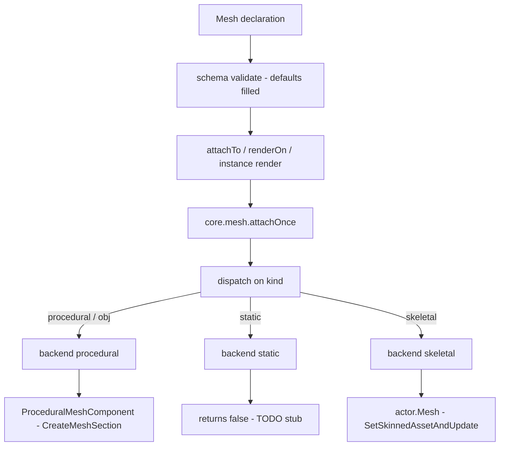
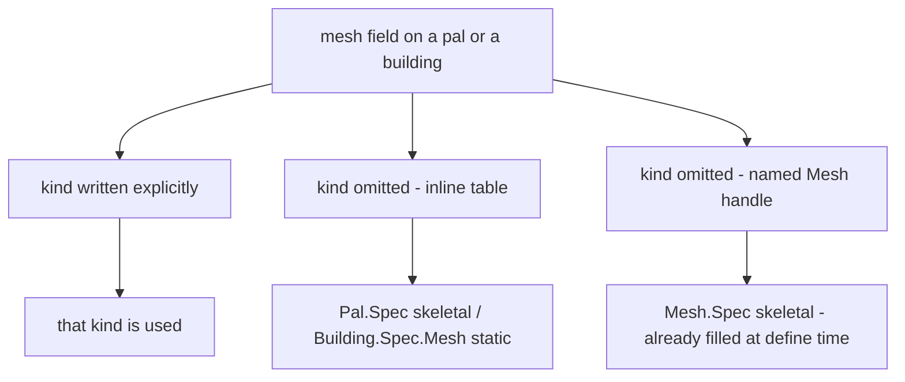

メッシュは定義が身にまとう見た目です。モデルアセットと、それをどう塗るかの指定でできてい
ます。メッシュが独立したドメインになっているのは、一度定義して名前を付けたものを、パルにも
ビルディングにも、あるいは任意のアクターにも着せ回せるようにするためです。

```lua title="content/meshes.lua"
local body = Mesh{
    id        = "example:chicken_body",
    kind      = "skeletal",
    model     = "/Game/Pal/Model/Character/Monster/ChickenPal/SK_ChickenPal.SK_ChickenPal",
    animClass = "/Game/Pal/Blueprint/Character/Monster/PalActorBP/ChickenPal/ABP_ChickenPal.ABP_ChickenPal_C",
}

Pal{ id = "example:Boss", mesh = body }          -- nest the defined mesh
body:attachTo(actor)                             -- or attach it yourself
```

## メッシュを定義する

他のドメインとまったく同じ 3 つの入口を持ちます。

```lua
local body = Mesh{ id = "example:body", model = "/Game/.../SK_X.SK_X" }  -- define, returns a Mesh.Handle
Mesh.get("example:body")                                                 -- an existing one, by id
Mesh.get_all()                                                           -- every registered mesh, as handles
```

モジュールを呼び出すと、テーブルが `Mesh.Spec` に対して検証され、定義が `core/object_manager`
に `("mesh", id)` として登録され、`Mesh.Handle` が返ります。id は加工されずそのまま保存される
ので、`Mesh.get` には定義したときとまったく同じ文字列を渡します。すでに使われている id で
定義し直すと、前の登録は置き換えられます。

`id` が必須になるのは `Mesh` を直接呼ぶときだけです。他の定義の中にインラインで書いたメッシュ
には名前を付ける対象がなく、逆に直接定義したメッシュは id がなければ二度と引けません。

```lua
Mesh{ model = "/Game/Pal/Model/Other/PalBox/SM_PalBox.SM_PalBox" }
```

```text
PalForge: Mesh: field "id" is required (an unnamed mesh cannot be looked up again - write it inline as mesh = { ... } instead)
```

`Mesh.get` は見つからなければエラーになります。`Pal.get` や `Item.get` はゲーム側の id に対する
薄い定義へフォールバックしますが、メッシュにはそれに相当するものがありません。model のない
メッシュは、黙って何も描画しないだけになってしまうからです。

```lua
local body = Mesh.get("example:no_such_mesh")
```

```text
PalForge: Mesh.get("example:no_such_mesh"): no mesh is defined under that id
```

`Mesh.Class` は定義の基底クラスです。メソッドは `source()` ひとつだけで、定義自身を返します。
宣言ではなく計算でメッシュを組み立てたいときに継承してください。

## Mesh.Spec

<TypeTable
  type={{
    id: {
      description: 'レジストリのキー。Mesh を直接呼ぶときは必須で、パルやビルディングの中にインラインで書くときは省略します。',
      type: 'string',
    },
    kind: {
      description: 'どの core.mesh バックエンドが描画するか。',
      type: '"procedural" | "static" | "skeletal" | "obj"',
      default: '"skeletal"',
    },
    model: {
      description: 'モデル。skeletal / static バックエンドでは USkeletalMesh または UStaticMesh のアセットパス、procedural / obj では Wavefront OBJ ファイルのファイルシステムパスです。',
      type: 'string',
      required: true,
    },
    animClass: {
      description: 'ABP_*_C アニメーションブループリントのパス。skeletal バックエンドだけが読みます。',
      type: 'string',
    },
    scale: {
      description: 'アタッチしたメッシュに掛ける等倍スケール。procedural バックエンドだけが読みます。',
      type: 'number',
    },
    offset: {
      description: 'アクター原点からのオフセット。x, y, z のキーで指定します。procedural バックエンドだけが読みます。',
      type: 'table',
    },
    texture: {
      description: 'png の絶対パス。実行時にインポートされ、テクスチャパラメータへ書き込まれます。procedural 専用です。',
      type: 'string',
    },
    color: {
      description: '0..1 の r, g, b, a によるティント。procedural 専用です。',
      type: 'table',
    },
    material: {
      description: 'ダイナミックマテリアルの元にするベースマテリアルのアセットパス。procedural 専用です。',
      type: 'string',
    },
    params: {
      description: 'そのまま渡される追加のマテリアルパラメータ。vector / scalar / texture のサブテーブルに分けて書きます。procedural 専用です。',
      type: 'table',
    },
  }}
/>

同じフィールド一覧は、ゲームを離れずに実行時からも読めます。

```lua
local schema = require("palforge.core.schema")
print(schema.help("Mesh.Spec"))            -- every field, type, default and meaning
print(schema.help("Building.Spec.Mesh"))   -- the same shape with kind defaulting to static
schema.get("Mesh.Spec").fields             -- the same as a table, for tooling
```

検証は厳格です。宣言されていないフィールドは did-you-mean 付きのハードエラーになり、呼び出し
が中途半端に成功することはありません。

```lua
Mesh{ id = "example:body", modelPath = "/Game/.../SK_X.SK_X" }
```

```text
PalForge: Mesh: unknown field "modelPath" (did you mean "model"?). Valid fields: id, kind, model, animClass, scale, offset, texture, color, material, params
```

## 宣言からアクターまで

宣言が画面に出るまでは 3 段階です。検証が既定値を埋め、何かが宣言をアクターへ降ろし、
`core.mesh` が `kind` からバックエンドを選びます。



真ん中の段を誰が呼ぶかはドメインによって違います。

- **Mesh** — 自分で `meshHandle:attachTo(actor)` を呼びます。
- **Pal** — 通常は `onSpawned` の中で `pal:renderOn(ctx.actor)` を呼びます。パルにはインスタンス
  スキャンがないので、パルのメッシュを自動で貼るものはありません。
- **Building** — `core/event` の再構築スキャンが、ライブインスタンスの `render()` を代わりに
  呼びます。しかもアクターが最初に見つかったスキャンではなく、意図的にその次のスキャンで
  呼びます。初期化中のアクターにアタッチするとゲームがクラッシュするためです。

どの経路も最後は `core.mesh.attachOnce` に入ります。アクターか spec が欠けていれば `false` を
返し、全体はグローバルなキルスイッチで止められます。

```lua
require("palforge.core.mesh").ENABLED = false   -- stop attaching runtime meshes entirely
```

<Callout type="info">
procedural バックエンドの二重貼り防止ガードは、メッシュではなく **アクター** をキーにしていま
す。すでにメッシュを着ているアクターに 2 つ目の procedural メッシュを貼っても、何もせずに
`true` を返します。skeletal バックエンドにガードはありません。差し替えは冪等で、2 つ目の
skeletal メッシュをアタッチすると 1 つ目を置き換えます。
</Callout>

## 4 つの kind と 3 つのバックエンド

`kind` がバックエンドを選びます。`obj` は `procedural` の別名で、同じテーブルが両方の名前で
登録されています。

| kind | 状態 | 何をするか |
| --- | --- | --- |
| `procedural` | 実装済み | ディスク上の Wavefront OBJ を解析し、`ProceduralMeshComponent` を作ります |
| `obj` | 実装済み | `procedural` の別名です |
| `skeletal` | 実装済み | ポーンの `USkeletalMesh` を、必要ならアニメーション BP ごと差し替えます |
| `static` | TODO スタブ | `false` を返すだけで、何もアタッチしません |

### procedural と obj

`model` は `.obj` ファイルのファイルシステムパスです。`io.open` で読み込み、パスごとにキャッシュ
します。頂点が 4 つ以上ある面はファン三角形分割され、面の向きに関係なく見えるように両方の
巻き方向が出力されます。UV はベストエフォートで、ある頂点インデックスに対して最初に現れた
`vt` が採用されます。

コンポーネントは `AddComponentByClass` で追加し、`CreateMeshSection` で中身を詰め、
`SetWorldScale3D` でスケールし、`K2_SetRelativeLocation` で位置を決めます。コリジョンは無効
です。装飾用のメッシュが当たり判定を持つと、処理が引っかかるうえ、建築の設置レイキャストを
横取りしてしまいます。

```lua
local marker = Mesh{
    id     = "example:marker",
    kind   = "obj",
    model  = "C:/mods/example/marker.obj",
    scale  = 2.0,
    offset = { x = 0, y = 0, z = 120 },
    color  = { 1.0, 0.4, 0.1, 1.0 },
}
```

`scale` と `offset` を読むのはここだけです。宣言した `color` はセクションの頂点カラーとしても
焼き込まれるので、マテリアルパラメータが効かない環境でもティントが見えることがあります。

### skeletal

クリーチャー向けの本命の経路です。ポーンのコンポーネントを `actor.Mesh`、だめなら
`GetMesh()` で解決し、パル側のガードである `SetDisableChangeMesh` を解除してから、
`SetSkinnedAssetAndUpdate(mesh, true)` でアセットを差し替えます。それが存在しない環境では
`SetSkeletalMeshAsset` にフォールバックします。アセットは `LoadAsset`、だめなら
`StaticFindObject` で読み込み、パスごとにキャッシュします。

`animClass` は任意です。指定するとアニメーションブループリントモードを強制してからクラスを
バインドするので、新しいスケルトンが実際に駆動されます。駆動されないスキンメッシュは、
カリングされて何も見えなくなることがあります。

```lua
local sheep = Mesh{
    id        = "example:sheep_body",
    kind      = "skeletal",
    model     = "/Game/Pal/Model/Character/Monster/SheepBall/SK_SheepBall.SK_SheepBall",
    animClass = "/Game/Pal/Blueprint/Character/Monster/PalActorBP/SheepBall/ABP_SheepBall.ABP_SheepBall_C",
}
```

単一メッシュのクリーチャーではきれいに動きます。プレイヤーのように body と outfit を持つ
マルチメッシュのポーンでは、ベースのコンポーネントしか差し替わりません。

### static

<Callout type="warn">
static バックエンドは TODO スタブです。`attach` は `false` を返し、アクターには何も追加されま
せん。`kind = "static"` が検証を通るように、また拡張ポイントが見えるように登録されているだけ
で、今日の時点でスタティックメッシュは描画されません。`static` はビルディングの既定 kind でも
あるため、インラインで書いたビルディングのメッシュは、`kind = "procedural"` にして `model` を
OBJ ファイルに向けるまで何もアタッチしません。
</Callout>

## kind の既定値は着せる側で決まる

パルがスケルタルメッシュであるのに対し、建造物はスタティックメッシュです。そのため既定値は
着せる側で変わります。形そのものは変わりません。`api/building` は `Mesh.Spec` から形を派生
させ、消費側のポリシーである 1 点だけを差し替えています。

```lua title="Scripts/palforge/api/building.lua"
local Mesh = schema.derive("Building.Spec.Mesh", schema.get("Mesh.Spec"), {
    kind   = { default = "static" },
    model  = { doc = "UStaticMesh asset path, or an OBJ path for the procedural backend" },
    offset = { doc = "{ x, y, z } offset from the actor's origin" },
})
```

派生させておけば両者はずれません。`Mesh.Spec` にフィールドを足せば、誰かがコピーを忘れる
心配なくビルディングにも届きます。`api/pal` は `Mesh.Spec` そのものを使うので、パルのメッシュ
は `skeletal` の既定値のままです。

既定値はフィールドが「無いとき」だけ効きます。ここから、覚えておく価値のある挙動がひとつ
出てきます。



`Mesh{ ... }` は定義時に `Mesh.Spec` で検証されるので、返ってくるハンドルはすでに実値として
`kind = "skeletal"` を持っています。そのハンドルをビルディングにネストしても static にはなり
ません。フィールドが存在している以上、ビルディング側の既定値は発動しないからです。

```lua
local shared = Mesh{ id = "example:shared", model = "C:/mods/example/box.obj" }
shared:kind()                                    -- "skeletal", filled by the default

Building{ id = "example:Bench", mesh = shared }  -- still skeletal, not static

Building{                                        -- inline: the static default applies
    id   = "example:Bench2",
    mesh = { model = "/Game/Pal/Model/Other/PalBox/SM_PalBox.SM_PalBox" },
}
```

<Callout type="warn">
パルとビルディングで共有するつもりのメッシュには、`kind` を明示的に書いてください。どちらの
場所でも同じ意味になる書き方はそれだけです。
</Callout>

## ネスト: インライン / 名前付き / id で共有

3 つの書き方はいずれも同じ経路で `core.mesh` に届きます。ハンドルをそのまま別の定義に渡せる
のは、ハンドルのメタテーブルが `__spec` を持っているからです。`core/schema` はそれを素の宣言
に開いてから、ネスト先の形に対して検証します。検証はコピーを作るので、ネストされた定義は
そのまま非公開に保たれます。パル側が持っているコピーからメッシュの定義本体には届きません。

<Tabs items={['Inline', 'Named', 'By id']}>
<Tab value="Inline">

使う場所にテーブルを直接書きます。id も登録も再利用もありません。

```lua
Pal{
    id   = "ChickenPal",
    name = "Chicken Pal",
    mesh = {
        kind      = "skeletal",
        model     = "/Game/Pal/Model/Character/Monster/ChickenPal/SK_ChickenPal.SK_ChickenPal",
        animClass = "/Game/Pal/Blueprint/Character/Monster/PalActorBP/ChickenPal/ABP_ChickenPal.ABP_ChickenPal_C",
    },
}
```

</Tab>
<Tab value="Named">

一度定義してハンドルを渡します。自分でアタッチできるハンドルが手元に残ります。

```lua
local chicken = Mesh{
    id        = "example:chicken_body",
    kind      = "skeletal",
    model     = "/Game/Pal/Model/Character/Monster/ChickenPal/SK_ChickenPal.SK_ChickenPal",
    animClass = "/Game/Pal/Blueprint/Character/Monster/PalActorBP/ChickenPal/ABP_ChickenPal.ABP_ChickenPal_C",
}

Pal{ id = "ChickenPal", mesh = chicken }
```

</Tab>
<Tab value="By id">

ファイルをまたぐときは、登録済みのメッシュを id で引きます。`Mesh.get` は未登録ならエラーに
なるので、タイプミスは黙って何も描画しないのではなく、その場で落ちます。

```lua title="content/pals.lua"
Pal{ id = "SheepBall",  mesh = Mesh.get("example:chicken_body") }
Pal{ id = "ChickenPal", mesh = Mesh.get("example:chicken_body") }
```

</Tab>
</Tabs>

## マテリアル: texture / color / material / params

塗り方を決めるフィールドは 4 つあり、いずれも procedural バックエンドだけが消費します。

- `texture` — png の絶対パス。実行時に
  `UKismetRenderingLibrary:ImportFileAsTexture2D` でインポートされ、候補となる複数のテクスチャ
  パラメータ名へ書き込まれます。
- `color` — 0..1 の `{ r, g, b, a }` あるいは `{ [1], [2], [3], [4] }` によるティント。候補となる
  複数のベクターパラメータ名へ書き込まれ、同時にセクションの頂点カラーにも焼き込まれます。
- `material` — ダイナミックマテリアルの元にするベースマテリアルのアセットパス。
- `params` — 型ごとに分けて明示的に渡すパラメータ。

```lua
local painted = Mesh{
    id       = "example:painted",
    kind     = "procedural",
    model    = "C:/mods/example/marker.obj",
    texture  = "C:/mods/example/marker.png",
    color    = { r = 0.2, g = 0.8, b = 1.0, a = 1.0 },
    material = "/Engine/BasicShapes/BasicShapeMaterial.BasicShapeMaterial",
    params   = {
        vector  = { EmissiveColor = { 1, 0, 0, 1 } },
        scalar  = { Roughness = 0.4 },
        texture = { Normal = "C:/mods/example/marker_n.png" },
    },
}
```

<Callout type="warn">
PalForge は独自のベースマテリアルを同梱していません。バックエンドは `StaticFindObject` で
ベースマテリアルを解決しますが、これは **すでにロード済み** のオブジェクトしか見つけられず、
`BasicShapeMaterial` を先頭とするエンジンマテリアルの短い候補リストを順に試すだけです。どれ
もロードされていない場合、ダイナミックマテリアルインスタンスは作られず、color も texture も
params も黙って効きません。メッシュ自体はそれでもアタッチされます。マテリアル層は最後まで
フェイルソフトで、失敗は例外ではなくログになります。失敗はキャッシュされないので、次の
アタッチで再試行されます。
</Callout>

### 着せる側のオーバーライドとの関係

パルとビルディングは、それぞれ自前の `material` テーブルと、`color` / `texture` のショート
ハンドを持っています。`renderOn` やインスタンスの `render()` がメッシュを降ろすとき、まず
メッシュ自身のフィールドから始め、定義側のマテリアル記述子でフィールド単位に上書きします。

```lua
Pal{
    id    = "example:Boss",
    mesh  = { kind = "procedural", model = "C:/mods/example/boss.obj",
              color = { 1, 1, 1, 1 } },
    color = { 1, 0, 0, 1 },              -- shorthand: wins over the mesh color
}
```

優先順位は、コードが適用する順に次のとおりです。

1. メッシュ自身の `texture` / `color` / `material` / `params`。
2. 定義が `material` テーブルを宣言している場合、そこで **設定されている** フィールドがメッシュ
   の値を上書きします。設定されていないフィールドはメッシュの値のままです。
3. `material` テーブルがない場合にかぎり、トップレベルの `color` と `texture` のショートハンド
   がそのオーバーライドになります。

<Callout type="warn">
2 と 3 は排他です。`material = { ... }` を宣言した定義は、自分のトップレベルの `color` と
`texture` を完全に無視します。ショートハンドが読まれるのは `material` テーブルが無いときだけ
です。指定は一か所にまとめてください。

```lua
Pal{
    id       = "example:Boss",
    mesh     = { kind = "procedural", model = "C:/mods/example/boss.obj" },
    material = { color = { 1, 0, 0, 1 }, texture = "C:/mods/example/boss.png" },
}
```
</Callout>

`Mesh.Handle:attachTo` はこの流れをすべて飛ばします。メッシュ自身の宣言をそのままアタッチ
するので、パルやビルディングのマテリアルオーバーライドは適用されません。

## Mesh.Handle

メッシュ自身にはライフサイクルがありません。何かに着せられる側だからです。したがってハンドル
が持つのはアクションと、それが代表する宣言だけです。

### attachTo

```lua
---@param actor any
---@return boolean ok
meshHandle:attachTo(actor)
```

このメッシュをライブなアクターへ 1 回だけアタッチします。アクターが nil か無効ならただちに
`false` を返し、そうでなければ `source()` を `core.mesh.attachOnce` に渡して、バックエンドの
報告をそのまま返します。

```lua
Pal{
    id     = "ChickenPal",
    events = {
        onSpawned = function(pal, ctx)
            Mesh.get("example:chicken_body"):attachTo(ctx.actor)
        end,
    },
}
```

<Callout type="warn">
`Pal.Handle:renderOn` と `Building.Instance:render()` は、降ろす spec に `kind` / `model` /
`scale` / `offset` と 4 つのマテリアルフィールドをコピーしますが、`animClass` は
**コピーしません**。
アニメーションブループリントが必要なスケルタルメッシュは、宣言をまるごと渡す
`meshHandle:attachTo(ctx.actor)` でアタッチしてください。
</Callout>

### setColor

```lua
---@param actor any
---@param color table  # { r, g, b, a } in 0..1
---@return boolean ok
meshHandle:setColor(actor, color)
```

アタッチ済みのメッシュを塗り直します。color テーブルは `kind` を持たないため、この呼び出しは
つねに procedural バックエンドへ届き、アタッチ時にそのアクターに対して記録したダイナミック
マテリアルインスタンスを引いて、color 系と emissive 系のパラメータ名に書き込みます。アクター
が無効なとき、そのアクター用のダイナミックマテリアルインスタンスが無いとき、color がテーブル
でないときは `false` を返します。

<Callout type="info">
`setColor` はこのメッシュではなく **アクター** をキーにしています。どのメッシュハンドルから
呼んでも、そのアクターが持っている procedural マテリアルを塗り直します。ダイナミックマテリアル
インスタンスは、アタッチ時に `color` / `texture` / `material` / `params` のいずれかが宣言されて
いた場合にのみ作られるので、どれも指定せずにアタッチしたメッシュは塗り直せません。
</Callout>

### source / model / kind

```lua
meshHandle:source()   -- the lowered spec core.mesh will render (the definition itself)
meshHandle:model()    -- the declared model path
meshHandle:kind()     -- the backend name, "skeletal" when the definition carries none
```

`source()` が返すのは定義そのもので、コピーではありません。ハンドルを別の定義にネストすると
再検証とコピーが走るので、パルやビルディングが持つのはそれぞれ自分のテーブルです。

## レシピ

### アニメーションごとバニラのパルを着せ替える

```lua title="content/reskin.lua"
local body = Mesh{
    id        = "example:chicken_body",
    kind      = "skeletal",
    model     = "/Game/Pal/Model/Character/Monster/SheepBall/SK_SheepBall.SK_SheepBall",
    animClass = "/Game/Pal/Blueprint/Character/Monster/PalActorBP/SheepBall/ABP_SheepBall.ABP_SheepBall_C",
}

local chicken = Pal{
    id          = "ChickenPal",
    name        = "Chicken Pal",
    description = "a chicken wearing a sheep",
    events      = {
        onSpawned = function(pal, ctx)
            body:attachTo(ctx.actor)          -- attachTo, so animClass survives the lowering
        end,
    },
}

chicken:spawn(Player.coordinate())
```

### 1 つの procedural メッシュを 2 体のパルで共有する

```lua title="content/markers.lua"
local marker = Mesh{
    id     = "example:marker",
    kind   = "procedural",
    model  = "C:/mods/example/marker.obj",
    scale  = 1.5,
    offset = { x = 0, y = 0, z = 150 },
    color  = { 0.1, 0.9, 0.4, 1.0 },
}

local function markOnSpawn(pal, ctx)
    marker:attachTo(ctx.actor)
end

Pal{ id = "ChickenPal", mesh = marker, events = { onSpawned = markOnSpawn } }
Pal{ id = "SheepBall",  mesh = marker, events = { onSpawned = markOnSpawn } }

-- somewhere else in the pack, by id
Pal{ id = "example:Third", mesh = Mesh.get("example:marker") }
```

### 使うたびに色が変わるビルディング

ビルディングのランタイムが、設置後のスキャンでメッシュを代わりにアタッチします。塗り直しに
必要なダイナミックマテリアルインスタンスを作らせるため、color を宣言しておき、ハンドラから
塗り直します。

```lua title="content/bench.lua"
local glow = Mesh{
    id     = "example:bench_glow",
    kind   = "procedural",
    model  = "C:/mods/example/bench.obj",
    scale  = 1.0,
    offset = { x = 0, y = 0, z = 60 },
    color  = { 0.3, 0.3, 0.3, 1.0 },       -- creates the MID the re-tint needs
}

Building{
    id     = "WorkBench",
    name   = "Workbench",
    gridCm = 100,
    mesh   = glow,
    state  = { uses = 0 },
    events = {
        onPlace = function(self, ctx)
            self.state.uses = 0
            self:save()
        end,
        onRightClick = function(self, ctx)
            self.state.uses = self.state.uses + 1
            self:save()
            local hot = math.min(self.state.uses / 10, 1.0)
            glow:setColor(self.actor, { hot, 1.0 - hot, 0.2, 1.0 })
        end,
    },
}
```

### ベースマテリアルを明示して塗る

```lua title="content/painted.lua"
local painted = Mesh{
    id       = "example:painted",
    kind     = "obj",
    model    = "C:/mods/example/crate.obj",
    material = "/Engine/BasicShapes/BasicShapeMaterial.BasicShapeMaterial",
    texture  = "C:/mods/example/crate.png",
    params   = {
        vector = { EmissiveColor = { 0.0, 0.6, 1.0, 1.0 } },
        scalar = { Metallic = 0.0 },
    },
}

Building{
    id     = "PalBoxV2",
    name   = "Pal Box",
    gridCm = 100,
    mesh   = painted,
}
```

ティントがまったく乗らないときは、宣言をいじる前にログのマテリアルステータス行を見てくださ
い。どのベースマテリアルが見つかったか、テクスチャのインポートが成功したか、UV と頂点カラー
があったかが記録されています。

## エラー

以下はいずれも `PalForge: ` が前置され、ドメイン名を含みます。最初の 3 つは定義時に送出され、
フィールド名も含みます。最後の 1 つは `Mesh.get` が引けなかったときに送出されます。

```text
PalForge: Mesh: field "model" is required (USkeletalMesh / UStaticMesh asset path)
PalForge: Mesh: field "kind" must be one of { "procedural", "static", "skeletal", "obj" }, got "skeletel"
PalForge: Mesh: unknown field "modelPath" (did you mean "model"?). Valid fields: id, kind, model, animClass, scale, offset, texture, color, material, params
PalForge: Mesh.get("example:body"): no mesh is defined under that id
```

ネストした宣言では、外側のフィールド名と検証中の形の名前が出るので、どの spec を読みに行けば
よいかがわかります。

```text
PalForge: Pal: field "mesh" (Mesh.Spec): field "model" is required (USkeletalMesh / UStaticMesh asset path)
PalForge: Building: field "mesh" (Building.Spec.Mesh): field "model" is required (UStaticMesh asset path, or an OBJ path for the procedural backend)
```

実行時の失敗はエラーになりません。`attachTo` と `setColor`、そして [Pal](/docs/api/pal) と
[Building](/docs/api/building) が行う降ろし処理は、最後までフェイルソフトです。アクターが
無い、コンポーネントが無い、OBJ ファイルが読めない、ベースマテリアルが見つからない、といった
場合はハンドラに例外を投げず、`false` を返してログに残します。
