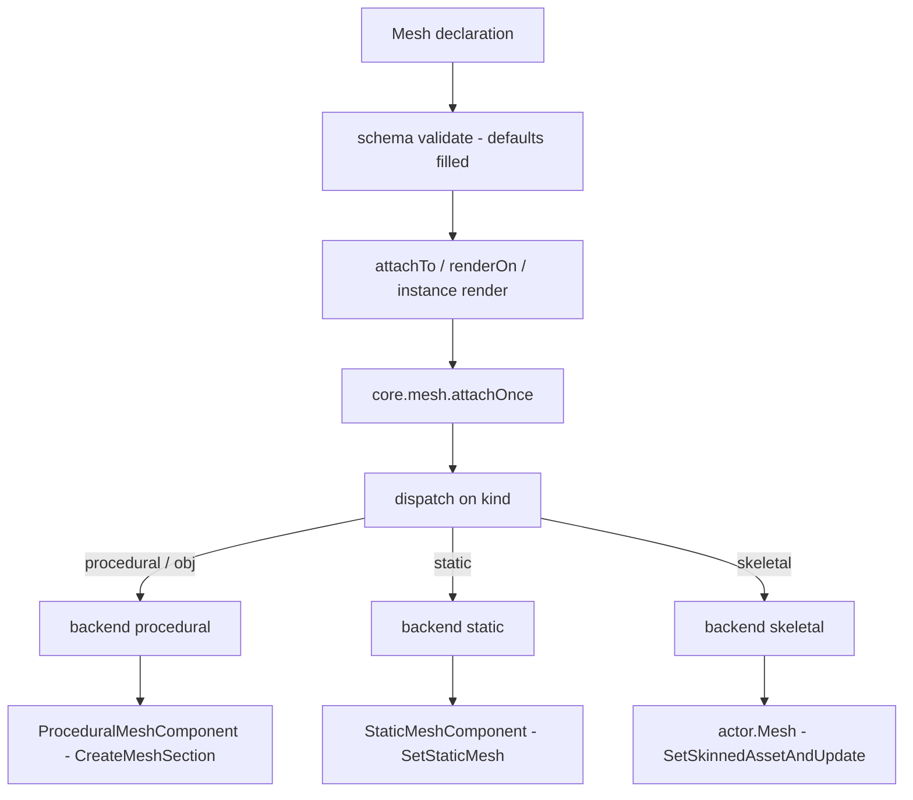
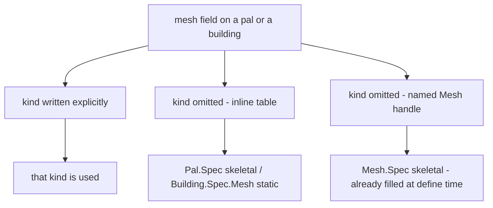

## このページでできるようになること

- パルの見た目を差し替えて、バニラのニワトリを羊の姿で歩かせる
- 自分で用意したモデルを、世界に置いた建物に付ける
- モデルに名前を付けて、いくつものパルやビルディングで使い回す
- 遊んでいる最中にモデルの色を変えたり、モデルを外したりする

メッシュとは、ゲームの中で何かが身にまとうモデルと、その塗り方のことです。`Mesh{ ... }` で
書いて id を付けておけば、同じモデルをパルにも、ビルディングにも、目の前にいるアクターにも
渡せます。

```lua title="content/meshes.lua"
local body = Mesh{
    id        = "example:chicken_body",
    kind      = "skeletal",
    model     = "/Game/Pal/Model/Character/Monster/ChickenPal/SK_ChickenPal.SK_ChickenPal",
    animClass = "/Game/Pal/Blueprint/Character/Monster/PalActorBP/ChickenPal/ABP_ChickenPal.ABP_ChickenPal_C",
}

Pal{ id = "example:Boss", mesh = body }          -- nest the defined mesh
body:attachTo(actor)                             -- or attach it yourself
```

## メッシュを定義する

3 つの呼び出しですべて足ります。作る、前に作ったものを取り出す、全部並べる、です。

```lua
local body = Mesh{ id = "example:body", model = "/Game/.../SK_X.SK_X" }  -- define, returns a Mesh.Handle
Mesh.get("example:body")                                                 -- an existing one, by id
Mesh.get_all()                                                           -- every registered mesh, as handles
```

`Mesh{ ... }` は書いたテーブルを検査し、id で保存して、`Mesh.Handle` を返します。これが実際に
アタッチするときに使うオブジェクトです。id は書いたままの形で保存されるので、`Mesh.get` にも
まったく同じ文字列を渡します。すでに使われている id で定義すると、前のものが置き換わります。

`id` が必須になるのは `Mesh` を直接呼ぶときだけです。パルやビルディングの中にインラインで書いた
メッシュには名前を付ける対象がありませんが、単体で定義したメッシュは id がなければ二度と
取り出せません。

```lua
Mesh{ model = "/Game/Pal/Model/Other/PalBox/SM_PalBox.SM_PalBox" }
```

```text
PalForge: Mesh: field "id" is required (an unnamed mesh cannot be looked up again - write it inline as mesh = { ... } instead)
```

`Mesh.get` は、その id で何も登録されていなければエラーになります。タイプミスはその場で止まる
ので、パルが何も表示しないまま気づかない、ということになりません。

```lua
local body = Mesh.get("example:no_such_mesh")
```

```text
PalForge: Mesh.get("example:no_such_mesh"): no mesh is defined under that id
```

`Mesh.Class` はメッシュ定義の土台になるクラスです。メソッドは `source()` ひとつだけで、定義
自身を返します。メッシュを書き下ろすのではなくコードで組み立てたいときに継承してください。

## Mesh.Spec

`Mesh{ ... }` の中に書けるものの一覧です。たいていのメッシュに必要なのは 2 つで、どのモデルを
使うかを表す `model` と、どう付けるかを表す `kind` です。残りは塗りと配置のためのものです。

<TypeTable
  type={{
    id: {
      description: 'レジストリのキー。Mesh を直接呼ぶときは必須で、パルやビルディングの中にインラインで書くときは省略します。',
      type: 'string',
    },
    kind: {
      description: 'どの core.mesh バックエンドが描画するか。',
      type: '"procedural" | "static" | "skeletal" | "obj"',
      default: '"skeletal"',
    },
    model: {
      description: 'モデル。skeletal / static バックエンドでは USkeletalMesh または UStaticMesh のアセットパス、procedural / obj では Wavefront OBJ ファイルのファイルシステムパスです。',
      type: 'string',
      required: true,
    },
    animClass: {
      description: 'ABP_*_C アニメーションブループリントのパス。skeletal バックエンドだけが読みます。',
      type: 'string',
    },
    scale: {
      description: 'アタッチしたメッシュに掛ける等倍スケール。procedural と static のバックエンドが読みます。',
      type: 'number',
    },
    offset: {
      description: 'アクター原点からのオフセット。x, y, z のキーで指定します。procedural と static のバックエンドが読みます。',
      type: 'table',
    },
    texture: {
      description: 'png の絶対パス。実行時にインポートされ、テクスチャパラメータへ書き込まれます。procedural 専用です。',
      type: 'string',
    },
    color: {
      description: '0..1 の r, g, b, a によるティント。procedural 専用です。',
      type: 'table',
    },
    material: {
      description: 'ダイナミックマテリアルの元にするベースマテリアルのアセットパス。procedural 専用です。',
      type: 'string',
    },
    params: {
      description: 'そのまま渡される追加のマテリアルパラメータ。vector / scalar / texture のサブテーブルに分けて書きます。procedural 専用です。',
      type: 'table',
    },
  }}
/>

同じフィールド一覧は、ゲームを離れずに実行時からも読めます。

```lua
local schema = require("palforge.core.schema")
print(schema.help("Mesh.Spec"))            -- every field, type, default and meaning
print(schema.help("Building.Spec.Mesh"))   -- the same shape with kind defaulting to static
schema.get("Mesh.Spec").fields             -- the same as a table, for tooling
```

PalForge が知らないフィールド名はエラーになり、近い名前を提案します。呼び出しは完全に成功
するか、まったく成功しないかのどちらかです。

```lua
Mesh{ id = "example:body", modelPath = "/Game/.../SK_X.SK_X" }
```

```text
PalForge: Mesh: unknown field "modelPath" (did you mean "model"?). Valid fields: id, kind, model, animClass, scale, offset, texture, color, material, params
```

## 書いたテーブルが画面に出るまで

書いたテーブルが画面のモデルになるまでには 3 つの段階があります。まずテーブルが検査され、
書かなかった既定値が埋まります。次に何かがそれをアクター、つまりパルの体や設置した建物と
いった世界の中の実体に渡します。最後に `core.mesh` が `kind` を見て付け方を選びます。



真ん中の段を誰がやるかは、そのメッシュを着るものによって変わります。

- **Mesh** — 自分で `meshHandle:attachTo(actor)` を呼びます。
- **Pal** — 通常は `onSpawned` の中で `pal:renderOn(ctx.actor)` を呼びます。パルのメッシュを
  代わりに貼るものはないので、この呼び出しがないパルは元の姿のままです。
- **Building** — PalForge が代わりに貼ります。設置した建物をスキャンが見つけ、その `render()`
  を呼びます。しかも最初に見つかったスキャンではなく、意図的にその次のスキャンで呼びます。
  まだ起動途中のアクターにアタッチするとゲームがクラッシュするためです。

どの経路も最後は `core.mesh.attachOnce` に入ります。アクターか spec が欠けていれば `false` を
返します。実行時のメッシュはスイッチひとつでまとめて止められます。

```lua
require("palforge.core.mesh").ENABLED = false   -- stop attaching runtime meshes entirely
```

<Callout type="info">
procedural と static のバックエンドが覚えているのは、どのメッシュを使ったかではなく、どの
**アクター** を着せ替えたかです。すでに同じ kind のメッシュを着ているアクターにもう 1 つ貼っ
ても、何もせずに `true` を返します。この記録はバックエンドごとに別なので、1 体のアクターが
procedural と static のメッシュを同時に着ることはできます。ただし `core.mesh` が覚えているのは
最後にそのアクターを着せ替えたバックエンドだけで、`setColor` と `detach` が届くのもそれです。
skeletal バックエンドはこの記録を持ちません。同じメッシュを貼り直しても害はなく、2 つ目の
skeletal メッシュをアタッチすると 1 つ目を置き換えます。
</Callout>

## 4 つの kind と 3 つのバックエンド

`kind` がモデルの付け方を決めます。`obj` は `procedural` の別名で、どちらの名前でも同じ処理が
動きます。

| kind | 状態 | 何をするか |
| --- | --- | --- |
| `procedural` | 実装済み | ディスク上の Wavefront OBJ を解析し、`ProceduralMeshComponent` を作ります |
| `obj` | 実装済み | `procedural` の別名です |
| `skeletal` | 実装済み | ポーンの `USkeletalMesh` を、必要ならアニメーション BP ごと差し替えます |
| `static` | 実装済み | `UStaticMeshComponent` を追加し、そこに `UStaticMesh` アセットを載せます |

### procedural と obj

自分で用意したモデルを出すときはこれを使います。`model` は自分のディスク上にある `.obj`
ファイルのパスです。`io.open` で読み込み、パスごとに覚えておくので、同じファイルを読むのは
一度だけです。

角が 4 つ以上ある面は三角形に分割されます。表裏の両方が書き出されるので、面の向きに関係なく
モデルが見えます。テクスチャ座標はベストエフォートで、ある頂点に対して最初に現れた `vt` が
採用されます。

コンポーネントは `AddComponentByClass` で追加し、`CreateMeshSection` で中身を詰め、
`SetWorldScale3D` でスケールし、`K2_SetRelativeLocation` で位置を決めます。当たり判定は付き
ません。飾りのモデルが当たり判定を持つと、動作が重くなるうえ、建築メニューが設置に使う
レイキャストを横取りしてしまいます。

```lua
local marker = Mesh{
    id     = "example:marker",
    kind   = "obj",
    model  = "C:/mods/example/marker.obj",
    scale  = 2.0,
    offset = { x = 0, y = 0, z = 120 },
    color  = { 1.0, 0.4, 0.1, 1.0 },
}
```

`scale` と `offset` を読むのは、ここと static バックエンドだけです。書いた `color` はモデルの
頂点カラーとしても焼き込まれるので、マテリアルパラメータが効かない環境でもティントが見える
ことがあります。

### skeletal

クリーチャーにはこれを使います。PalForge はポーンの体のコンポーネントを `actor.Mesh`、だめ
なら `GetMesh()` で見つけ、メッシュ変更を止めているパル側のガード `SetDisableChangeMesh` を
解除してから、`SetSkinnedAssetAndUpdate(mesh, true)` でモデルを差し替えます。それが無い環境
では `SetSkeletalMeshAsset` にフォールバックします。モデルは `LoadAsset`、だめなら
`StaticFindObject` で読み込み、パスごとに覚えておきます。

`attach` が `true` を返すのは、この 2 つのセッターのどちらかが実際に走ったときだけです。どちらも
持たないコンポーネントは、黙って成功したことにはせず失敗として扱います。

<Callout type="warn">
この経路はまだゲーム内で確認できていません。`true` はセッターが走ったという意味であって、
新しいモデルが画面に見えているという保証ではありません。差し替えが見えないときは `animClass`
を足してみて、どちらのセッターを使ったかを書いたログ行を確認してください。
</Callout>

`animClass` は任意です。指定すると、コンポーネントをアニメーションブループリントモードに
切り替えてからクラスを結び付けるので、新しいスケルトンが実際に動きます。何にも動かされない
スキンメッシュは、画面から消えてしまうことがあります。

```lua
local sheep = Mesh{
    id        = "example:sheep_body",
    kind      = "skeletal",
    model     = "/Game/Pal/Model/Character/Monster/SheepBall/SK_SheepBall.SK_SheepBall",
    animClass = "/Game/Pal/Blueprint/Character/Monster/PalActorBP/SheepBall/ABP_SheepBall.ABP_SheepBall_C",
}
```

1 つのメッシュでできたクリーチャーではきれいに動きます。プレイヤーのように body と outfit の
複数メッシュでできたポーンでは、ベースのコンポーネントしか差し替わりません。

### static

ゲームに元から入っているモデルを建物に付けるときはこれを使います。`model` はそのアセットの
オブジェクトパスです。`LoadAsset`、だめなら `StaticFindObject` で読み込んでパスごとに覚えて
おき、PalForge が実行中に作る `UStaticMeshComponent` に載せます。

手順は `AddComponentByClass`、`SetStaticMesh`、そして `SetWorldScale3D` と
`K2_SetRelativeLocation` です。スケールの呼び出しは省略できません。`AddComponentByClass` に
渡す空のトランスフォームはコンポーネントをスケール 0 で始めるので、誰もスケールしない
コンポーネントは見えないままです。当たり判定は procedural と同じ理由で付けません。

```lua
local palbox = Mesh{
    id     = "example:palbox_body",
    kind   = "static",
    model  = "/Game/Pal/Model/Other/PalBox/SM_PalBox.SM_PalBox",
    scale  = 1.0,
    offset = { x = 0, y = 0, z = 0 },
}

Building{
    id     = "PalBoxV2",
    name   = "Pal Box",
    gridCm = 100,
    mesh   = palbox,
}
```

`scale` と `offset` は procedural バックエンドとまったく同じように読まれます。塗り用の
フィールドは読まれません。`texture` / `color` / `material` / `params` は procedural のもの
なので、static のメッシュはアセット自身が持つマテリアルで表示され、この方法で着せたアクター
への `setColor` は `false` を返します。

<Callout type="warn">
`UStaticMeshComponent:SetStaticMesh` はこのビルドでは確認が取れていないため、`attach` はその
呼び出しを鵜呑みにしません。コンポーネントからモデルを読み戻し（まず `GetStaticMesh()`、次に
`StaticMesh` プロパティ）、実際にそこに載っていることが確認できたときだけ成功を報告します。
途中で失敗した場合は追加したコンポーネントを破棄するので、描画されていないモデルを成功と
偽ることはなく、`false` が返って余計なコンポーネントも残りません。
</Callout>

## kind の既定値は着せる側で決まる

パルがスケルタルのモデルを着るのに対し、建物はスタティックのモデルを着ます。そのため `kind`
の既定値は着せる側で変わります。フィールドはどちらでも同じです。ビルディングの中に書いた
メッシュは `Building.Spec.Mesh` で検査されます。これは `Mesh.Spec` の `kind` の既定値を
`"static"` にしたものです。

```lua title="Scripts/palforge/api/building.lua"
local Mesh = schema.derive("Building.Spec.Mesh", schema.get("Mesh.Spec"), {
    kind   = { default = "static" },
    model  = { doc = "UStaticMesh asset path, or an OBJ path for the procedural backend" },
    offset = { doc = "{ x, y, z } offset from the actor's origin" },
})
```

パルの中に書いたメッシュは `Mesh.Spec` そのもので検査されるので、既定値は `skeletal` のまま
です。

既定値が効くのは、そのフィールドを書かなかったときだけです。ここから、覚えておく価値のある
挙動がひとつ出てきます。



`Mesh{ ... }` は定義した時点で `Mesh.Spec` で検査されるので、返ってくるハンドルはすでに実値
として `kind = "skeletal"` を持っています。そのハンドルをビルディングの中に入れても static には
なりません。フィールドがすでにある以上、ビルディング側の既定値は発動しないからです。

```lua
local shared = Mesh{ id = "example:shared", model = "C:/mods/example/box.obj" }
shared:kind()                                    -- "skeletal", filled by the default

Building{ id = "example:Bench", mesh = shared }  -- still skeletal, not static

Building{                                        -- inline: the static default applies
    id   = "example:Bench2",
    mesh = { model = "/Game/Pal/Model/Other/PalBox/SM_PalBox.SM_PalBox" },
}
```

<Callout type="warn">
パルとビルディングで共有するつもりのメッシュには、`kind` を明示的に書いてください。どちらの
場所でも同じ意味になる書き方はそれだけです。
</Callout>

## ネスト: インライン / 名前付き / id で共有

パルやビルディングにメッシュを渡す方法は 3 つあり、いずれも最後は同じところに届きます。
ハンドルを別の定義に渡すと、PalForge はもう一度検査してコピーを持たせるので、パルや
ビルディングが持つのはそれぞれ自分のテーブルです。

<Tabs items={['Inline', 'Named', 'By id']}>
<Tab value="Inline">

使う場所にテーブルを直接書きます。id も登録も再利用もありません。

```lua
Pal{
    id   = "ChickenPal",
    name = "Chicken Pal",
    mesh = {
        kind      = "skeletal",
        model     = "/Game/Pal/Model/Character/Monster/ChickenPal/SK_ChickenPal.SK_ChickenPal",
        animClass = "/Game/Pal/Blueprint/Character/Monster/PalActorBP/ChickenPal/ABP_ChickenPal.ABP_ChickenPal_C",
    },
}
```

</Tab>
<Tab value="Named">

一度定義してハンドルを渡します。自分でアタッチできるハンドルが手元に残ります。

```lua
local chicken = Mesh{
    id        = "example:chicken_body",
    kind      = "skeletal",
    model     = "/Game/Pal/Model/Character/Monster/ChickenPal/SK_ChickenPal.SK_ChickenPal",
    animClass = "/Game/Pal/Blueprint/Character/Monster/PalActorBP/ChickenPal/ABP_ChickenPal.ABP_ChickenPal_C",
}

Pal{ id = "ChickenPal", mesh = chicken }
```

</Tab>
<Tab value="By id">

ファイルをまたぐときは、登録済みのメッシュを id で引きます。`Mesh.get` は未登録ならエラーに
なるので、タイプミスは黙って何も描画しないのではなく、その場で落ちます。

```lua title="content/pals.lua"
Pal{ id = "SheepBall",  mesh = Mesh.get("example:chicken_body") }
Pal{ id = "ChickenPal", mesh = Mesh.get("example:chicken_body") }
```

</Tab>
</Tabs>

## マテリアル: texture / color / material / params

モデルの塗り方を決めるフィールドは 4 つあり、読むのは procedural バックエンドだけです。

- `texture` — png の絶対パス。実行中に
  `UKismetRenderingLibrary:ImportFileAsTexture2D` でインポートされ、候補となる複数のテクスチャ
  パラメータ名へ書き込まれます。
- `color` — 0..1 の `{ r, g, b, a }` あるいは `{ [1], [2], [3], [4] }` によるティント。候補となる
  複数のベクターパラメータ名へ書き込まれ、同時にモデルの頂点カラーにも焼き込まれます。
- `material` — 塗りの土台にするマテリアルのアセットパス。
- `params` — 型ごとに分けて、そのまま渡す追加のパラメータ。

```lua
local painted = Mesh{
    id       = "example:painted",
    kind     = "procedural",
    model    = "C:/mods/example/marker.obj",
    texture  = "C:/mods/example/marker.png",
    color    = { r = 0.2, g = 0.8, b = 1.0, a = 1.0 },
    material = "/Engine/BasicShapes/BasicShapeMaterial.BasicShapeMaterial",
    params   = {
        vector  = { EmissiveColor = { 1, 0, 0, 1 } },
        scalar  = { Roughness = 0.4 },
        texture = { Normal = "C:/mods/example/marker_n.png" },
    },
}
```

<Callout type="warn">
塗るにはベースマテリアルが必要ですが、PalForge はそれを同梱していません。まず指定された
`material` のパスを探し、次に `BasicShapeMaterial` を先頭とするエンジンマテリアルの短い候補
リストを順に試します。探すのに使うのは `StaticFindObject` で、これはゲームが **すでに読み込んで
いる** マテリアルしか見つけられません。つまり明示した `material` も、読み込み済みでなければ
見つかりません。どれも見つからなければ塗りは作られず、`color` も `texture` も `params` も
黙って効きません。モデル自体はそれでもアタッチされ、見つからなかったことは例外ではなくログに
残ります。この失敗は覚えられないので、次のアタッチで再試行されます。

ベースマテリアルが無くても効くものが 2 つあります。書いた `color` はモデルの頂点カラーとして
焼き込まれます。また `require("palforge.core.mesh").probeMaterials()` を呼ぶと、いまどの候補が
読み込まれているかがログに出ます。
</Callout>

### 着せる側のオーバーライドとの関係

パルとビルディングは、それぞれ自前の `material` テーブルと、`color` / `texture` のショート
ハンドを持っています。`renderOn` やビルディングの `render()` がメッシュを渡すとき、まず
メッシュ自身のフィールドから始め、定義側のマテリアルテーブルでフィールドごとに上書きします。

```lua
Pal{
    id    = "example:Boss",
    mesh  = { kind = "procedural", model = "C:/mods/example/boss.obj",
              color = { 1, 1, 1, 1 } },
    color = { 1, 0, 0, 1 },              -- shorthand: wins over the mesh color
}
```

コードが適用する順番は次のとおりです。

1. メッシュ自身の `texture` / `color` / `material` / `params`。
2. 定義が `material` テーブルを宣言している場合、そこで **設定されている** フィールドがメッシュ
   の値を上書きします。設定されていないフィールドはメッシュの値のままです。
3. `material` テーブルがない場合にかぎり、トップレベルの `color` と `texture` のショートハンド
   がそのオーバーライドになります。

<Callout type="warn">
2 と 3 は排他です。`material = { ... }` を宣言した定義は、自分のトップレベルの `color` と
`texture` を完全に無視します。ショートハンドが読まれるのは `material` テーブルが無いときだけ
です。指定は一か所にまとめてください。

```lua
Pal{
    id       = "example:Boss",
    mesh     = { kind = "procedural", model = "C:/mods/example/boss.obj" },
    material = { color = { 1, 0, 0, 1 }, texture = "C:/mods/example/boss.png" },
}
```
</Callout>

`Mesh.Handle:attachTo` はこの流れをすべて飛ばします。メッシュ自身の宣言をそのままアタッチ
するので、パルやビルディングのマテリアルオーバーライドは適用されません。

## Mesh.Handle

`Mesh{ ... }` と `Mesh.get`、`Mesh.get_all` はいずれも `Mesh.Handle` を返します。ハンドルが
持つのは、着せる・塗り直す・外すという 3 つのアクションと、そのメッシュについて聞ける 3 つの
質問です。

### attachTo

```lua
---@param actor any
---@return boolean ok
meshHandle:attachTo(actor)
```

このメッシュを、生きているアクターへ 1 回だけ着せます。アクターが nil か無効ならただちに
`false` を返し、そうでなければ `source()` を `core.mesh.attachOnce` に渡して、バックエンドの
報告をそのまま返します。

```lua
Pal{
    id     = "ChickenPal",
    events = {
        onSpawned = function(pal, ctx)
            Mesh.get("example:chicken_body"):attachTo(ctx.actor)
        end,
    },
}
```

<Callout type="warn">
`Pal.Handle:renderOn` が渡すのは `kind` / `model` / `animClass` / `scale` / `offset` と 4 つの
塗り用フィールドです。`Building.Instance:render()` が渡すのは、同じ一覧から `animClass` を
**除いたもの** です。アニメーションブループリントが必要なスケルタルメッシュをビルディングに
着せる場合は、宣言をまるごと渡す `meshHandle:attachTo(self.actor)` でアタッチしてください。
</Callout>

### setColor

```lua
---@param actor any
---@param color table  # { r, g, b, a } in 0..1
---@return boolean ok
meshHandle:setColor(actor, color)
```

すでにアクターに載っているメッシュを塗り直します。アタッチが成功すると、どのバックエンドが
そのアクターを着せ替えたかが記録され、塗り直しはその記録に従います。このメッシュ自身の `kind`
はヒントとして渡されるだけで、PalForge 経由でまったく着せていないアクターのときにしか使われ
ません。塗り直せるのは procedural バックエンドだけで、アタッチ時にそのアクターに対して記録
した塗りを引き、color 系と emissive 系のパラメータ名に書き込みます。アクターが無効なとき、
そのアクターを着せたのが static か skeletal のバックエンドだったとき、そのアクター用の塗りが
無いとき、color がテーブルでないときは `false` を返します。

<Callout type="info">
`setColor` はこのメッシュではなく **アクター** をたどります。どのメッシュハンドルから呼んでも、
そのアクターが持っているマテリアルを塗り直します。procedural バックエンドは、色の宣言があっても
無くてもアタッチのたびに塗りを作るので、`color` / `texture` / `material` / `params` をどれも
指定せずにアタッチしたメッシュも後から塗り直せます。必要なのはベースマテリアルのほうで、候補が
どれも読み込まれていなければ塗りは作られず、塗り直しは `false` を返します。
</Callout>

### detach

```lua
---@param actor any
---@return boolean ok
meshHandle:detach(actor)
```

アタッチが `actor` に載せたものを外し、もう一度着せ替えられる状態に戻します。`setColor` と
同じ記録に従い、`core.mesh` はそのアクターを着せ替えたバックエンドに、自分が載せたものを外す
よう頼みます。procedural と static のバックエンドは、自分が作ったコンポーネントを
`K2_DestroyComponent` で破棄し、コンポーネントとアクターごとの記録の両方を忘れるので、あとから
`attachTo` を呼べばまた着せ替えられます。

```lua
Pal{
    id     = "ChickenPal",
    events = {
        onSpawned = function(pal, ctx)
            Mesh.get("example:marker"):attachTo(ctx.actor)
        end,
        onDeath = function(pal, ctx)
            Mesh.get("example:marker"):detach(ctx.actor)
        end,
    },
}
```

<Callout type="warn">
`detach` は **アクター** をたどるので、どのハンドルから呼んでも、PalForge が最後にアタッチした
ものを外します。`false` が返る状況は 3 つあり、それぞれ意味が違います。PalForge がそのアクター
を一度も着せ替えていない、着せ替えたバックエンドに外すべき自前のものが無い（skeletal はポーン
自身のコンポーネントに書き込むので、破棄するものがありません）、そして `K2_DestroyComponent`
の呼び出しが走らなかった場合です。最後のケースでは記録をわざと残します。コンポーネントはまだ
アクターに載っており、その上にもう 1 つ載るのを止めているのがその記録だけだからです。
</Callout>

### source / model / kind

```lua
meshHandle:source()   -- the lowered spec core.mesh will render (the definition itself)
meshHandle:model()    -- the declared model path
meshHandle:kind()     -- the backend name, "skeletal" when the definition carries none
```

`source()` が返すのは定義そのもので、コピーではありません。ハンドルを別の定義に入れると
検査とコピーが走るので、パルやビルディングが持つのはそれぞれ自分のテーブルです。

## レシピ

### アニメーションごとバニラのパルを着せ替える

```lua title="content/reskin.lua"
local body = Mesh{
    id        = "example:chicken_body",
    kind      = "skeletal",
    model     = "/Game/Pal/Model/Character/Monster/SheepBall/SK_SheepBall.SK_SheepBall",
    animClass = "/Game/Pal/Blueprint/Character/Monster/PalActorBP/SheepBall/ABP_SheepBall.ABP_SheepBall_C",
}

local chicken = Pal{
    id          = "ChickenPal",
    name        = "Chicken Pal",
    description = "a chicken wearing a sheep",
    events      = {
        onSpawned = function(pal, ctx)
            body:attachTo(ctx.actor)          -- attachTo, so animClass survives the lowering
        end,
    },
}

chicken:spawn(Player.coordinate())   -- no pal appears in this version; see Pal
```

### 1 つの procedural メッシュを 2 体のパルで共有する

```lua title="content/markers.lua"
local marker = Mesh{
    id     = "example:marker",
    kind   = "procedural",
    model  = "C:/mods/example/marker.obj",
    scale  = 1.5,
    offset = { x = 0, y = 0, z = 150 },
    color  = { 0.1, 0.9, 0.4, 1.0 },
}

local function markOnSpawn(pal, ctx)
    marker:attachTo(ctx.actor)
end

Pal{ id = "ChickenPal", mesh = marker, events = { onSpawned = markOnSpawn } }
Pal{ id = "SheepBall",  mesh = marker, events = { onSpawned = markOnSpawn } }

-- somewhere else in the pack, by id
Pal{ id = "example:Third", mesh = Mesh.get("example:marker") }
```

### 使うたびに色が変わるビルディング

建物を設置したあとのスキャンで、PalForge がメッシュを代わりにアタッチします。塗り直しの
書き込み先になる塗りは procedural バックエンドがアタッチのたびに作るので、宣言した color は
最初のティントというだけです。

```lua title="content/bench.lua"
local glow = Mesh{
    id     = "example:bench_glow",
    kind   = "procedural",
    model  = "C:/mods/example/bench.obj",
    scale  = 1.0,
    offset = { x = 0, y = 0, z = 60 },
    color  = { 0.3, 0.3, 0.3, 1.0 },       -- the starting tint
}

Building{
    id     = "WorkBench",
    name   = "Workbench",
    gridCm = 100,
    mesh   = glow,
    state  = { uses = 0 },
    events = {
        onPlace = function(self, ctx)
            self.state.uses = 0
            self:save()
        end,
        onRightClick = function(self, ctx)
            self.state.uses = self.state.uses + 1
            self:save()
            local hot = math.min(self.state.uses / 10, 1.0)
            glow:setColor(self.actor, { hot, 1.0 - hot, 0.2, 1.0 })
        end,
    },
}
```

### ライブなビルディングのスタティックメッシュを差し替える

`detach` がアクターを解放するので、もう一度 `attachTo` で着せ替えられます。下の 2 つのメッシュ
は同じ `UStaticMesh` をスケールとオフセットだけ変えたもので、使用中は建物が目に見えて持ち上が
ります。

```lua title="content/bench_lift.lua"
local BENCH = "/Game/Pal/Model/Prop/Architecture/WorkBenchPrimitive/SM_WorkBenchPrimitive.SM_WorkBenchPrimitive"

local resting = Mesh{
    id     = "example:bench_resting",
    kind   = "static",
    model  = BENCH,
    scale  = 1.0,
    offset = { x = 0, y = 0, z = 0 },
}

local raised = Mesh{
    id     = "example:bench_raised",
    kind   = "static",
    model  = BENCH,
    scale  = 1.1,
    offset = { x = 0, y = 0, z = 40 },
}

Building{
    id     = "WorkBench",
    name   = "Workbench",
    gridCm = 100,
    mesh   = resting,
    state  = { lifted = false },
    events = {
        onRightClick = function(self, ctx)
            self.state.lifted = not self.state.lifted
            self:save()
            local want = self.state.lifted and raised or resting
            -- detach dispatches on the actor, so any handle takes off what is on it
            if resting:detach(self.actor) then want:attachTo(self.actor) end
        end,
    },
}
```

`detach` が `true` を返したときだけアタッチするのが、コンポーネントを二重に載せないための要点
です。ここで `false` が返るのは、古いコンポーネントがまだアクターに残っているという意味です。

### ベースマテリアルを明示して塗る

```lua title="content/painted.lua"
local painted = Mesh{
    id       = "example:painted",
    kind     = "obj",
    model    = "C:/mods/example/crate.obj",
    material = "/Engine/BasicShapes/BasicShapeMaterial.BasicShapeMaterial",
    texture  = "C:/mods/example/crate.png",
    params   = {
        vector = { EmissiveColor = { 0.0, 0.6, 1.0, 1.0 } },
        scalar = { Metallic = 0.0 },
    },
}

Building{
    id     = "PalBoxV2",
    name   = "Pal Box",
    gridCm = 100,
    mesh   = painted,
}
```

ティントがまったく乗らないときは、宣言をいじる前にログのマテリアルステータス行を読んでくださ
い。どのベースマテリアルが見つかったか、テクスチャのインポートが成功したか、テクスチャ座標と
頂点カラーがあったかが記録されています。

## エラー

以下はいずれも `PalForge: ` で始まり、ドメイン名を含みます。最初の 3 つはメッシュを定義した
ときに起き、フィールド名も出ます。最後の 1 つは `Mesh.get` が何も見つけられなかったときに
起きます。

```text
PalForge: Mesh: field "model" is required (USkeletalMesh / UStaticMesh asset path)
PalForge: Mesh: field "kind" must be one of { "procedural", "static", "skeletal", "obj" }, got "skeletel"
PalForge: Mesh: unknown field "modelPath" (did you mean "model"?). Valid fields: id, kind, model, animClass, scale, offset, texture, color, material, params
PalForge: Mesh.get("example:body"): no mesh is defined under that id
```

他の定義の中に書いたメッシュでは、外側のフィールド名と、検査に使った形の名前が出るので、どの
spec を読みに行けばよいかがわかります。

```text
PalForge: Pal: field "mesh" (Mesh.Spec): field "model" is required (USkeletalMesh / UStaticMesh asset path)
PalForge: Building: field "mesh" (Building.Spec.Mesh): field "model" is required (UStaticMesh asset path, or an OBJ path for the procedural backend)
```

実行中の失敗はエラーになりません。`attachTo` と `setColor` と `detach`、そして
[Pal](/docs/api/pal) と [Building](/docs/api/building) が代わりにやってくれる処理は、ハンドラに
例外を投げません。アクターが無い、コンポーネントが無い、OBJ ファイルが読めない、スタティック
メッシュのアセットが見つからない、ベースマテリアルが無い、といった場合は `false` を返してログ
に残します。

## まとめ

- `Mesh{ id = ..., model = ... }` で、使い回せるモデルに名前を付けます。`model` は常に必須で、
  `Mesh` を直接呼ぶときは `id` も必須です。
- `kind` が付け方を決めます。パルの体には `skeletal`、建物にゲームのモデルを付けるなら
  `static`、自分の OBJ ファイルなら `procedural` か `obj` です。
- パルやビルディングの中で `mesh = ...` として渡すか、`meshHandle:attachTo(actor)` で自分で
  アクターに着せます。
- パルは `onSpawned` などで `pal:renderOn(ctx.actor)` を呼んだときだけメッシュを着ます。建物は
  設置した少しあとに、PalForge が代わりに着せます。
- `setColor` と `detach` はアクターをたどり、procedural か static が着せたメッシュにしか効き
  ません。
- 実行中に例外は飛びません。`attachTo` と `setColor` と `detach` は `false` を返し、ログに
  残します。

次は [Pal](/docs/api/pal) を読むとメッシュを着るクリーチャーを出せます。[Building](/docs/api/building)
を読むとメッシュを着る建物を置けます。
