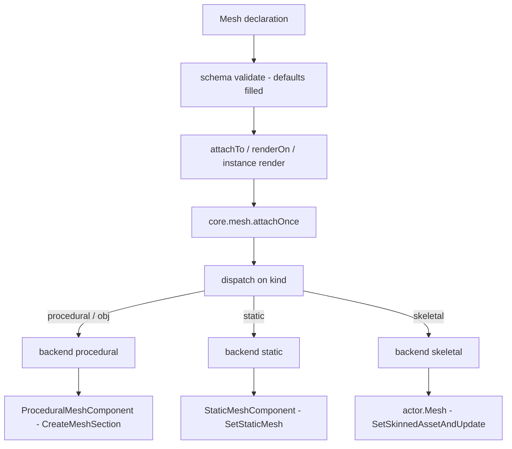
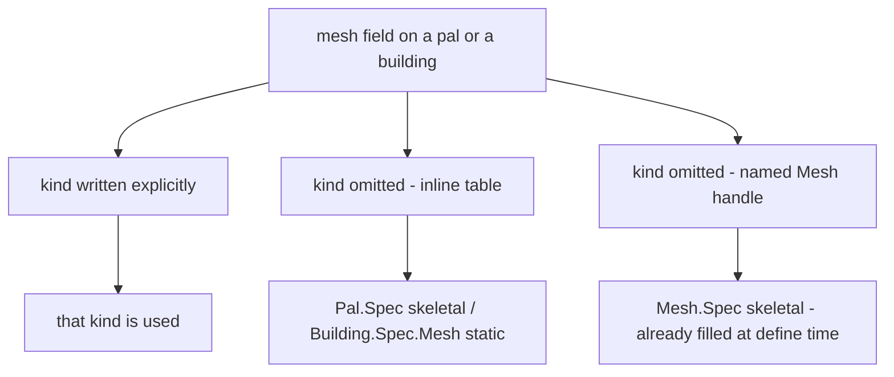

## What you can do after this page

- Give a pal a different body, so a vanilla chicken walks around as a sheep
- Put a model of your own on a structure you place in the world
- Name one model once and use it on as many pals and buildings as you like
- Change a model's colour while you are playing, and take the model off again

A mesh is the model something wears in the game, plus how to paint it. Write one with
`Mesh{ ... }`, give it an id, and you can hand the same model to a pal, to a building, or
to any actor you have in front of you.

```lua title="content/meshes.lua"
local body = Mesh{
    id        = "example:chicken_body",
    kind      = "skeletal",
    model     = "/Game/Pal/Model/Character/Monster/ChickenPal/SK_ChickenPal.SK_ChickenPal",
    animClass = "/Game/Pal/Blueprint/Character/Monster/PalActorBP/ChickenPal/ABP_ChickenPal.ABP_ChickenPal_C",
}

Pal{ id = "example:Boss", mesh = body }          -- nest the defined mesh
body:attachTo(actor)                             -- or attach it yourself
```

## Defining a mesh

Three calls do everything: make one, fetch one you made earlier, list them all.

```lua
local body = Mesh{ id = "example:body", model = "/Game/.../SK_X.SK_X" }  -- define, returns a Mesh.Handle
Mesh.get("example:body")                                                 -- an existing one, by id
Mesh.get_all()                                                           -- every registered mesh, as handles
```

`Mesh{ ... }` checks the table you wrote, stores it under the id, and gives you back a
`Mesh.Handle` - the object you attach with. The id is kept exactly as you typed it, so pass
`Mesh.get` the same string. Defining a second mesh under an id that is already taken
replaces the first one.

`id` is required when you call `Mesh` directly, and only then. A mesh written inline inside
a pal or a building has nothing to name, but a mesh you define on its own could never be
found again without one.

```lua
Mesh{ model = "/Game/Pal/Model/Other/PalBox/SM_PalBox.SM_PalBox" }
```

```text
PalForge: Mesh: field "id" is required (an unnamed mesh cannot be looked up again - write it inline as mesh = { ... } instead)
```

`Mesh.get` raises an error when nothing is registered under that id. A typo stops you right
there, instead of leaving a pal with nothing to show.

```lua
local body = Mesh.get("example:no_such_mesh")
```

```text
PalForge: Mesh.get("example:no_such_mesh"): no mesh is defined under that id
```

`Mesh.Class` is the class a mesh definition is built on. Its only method is `source()`,
which returns the definition itself. Subclass it when you want to work a mesh out in code
instead of writing it down.

## Mesh.Spec

Everything you can write inside `Mesh{ ... }`. Most meshes need two fields: `model`, which
says which model to use, and `kind`, which says how to put it on. The rest are for painting
and for placing.

<TypeTable
  type={{
    id: {
      description: 'Registry key. Required when you call Mesh directly, omitted when the table is written inline inside a pal or a building.',
      type: 'string',
    },
    kind: {
      description: 'Which core.mesh backend renders it.',
      type: '"procedural" | "static" | "skeletal" | "obj"',
      default: '"skeletal"',
    },
    model: {
      description: 'The model. A /Game/... USkeletalMesh or UStaticMesh path for the skeletal and static backends; an .obj file for procedural and obj, absolute or relative to the .lua file that declares it.',
      type: 'string',
      required: true,
    },
    animClass: {
      description: 'ABP_*_C animation blueprint path, with or without the _C tail. Read by the skeletal backend only.',
      type: 'string',
    },
    scale: {
      description: 'Uniform scale applied to the attached mesh. On skeletal it is applied only when the original scale could be captured first.',
      type: 'number',
    },
    offset: {
      description: 'Offset as x, y and z keys — from the actor origin on procedural and static, added to the mesh component own relative location on skeletal.',
      type: 'table',
    },
    texture: {
      description: 'A /Game/... UTexture2D path, or a png of your own, absolute or relative to the .lua file that declares it. Written to the measured texture parameter names on every backend.',
      type: 'string',
    },
    color: {
      description: 'Tint as r, g, b, a in 0..1, written to the measured vector parameter names on every backend, and baked as vertex colours on procedural.',
      type: 'table',
    },
    material: {
      description: 'Base material asset path to parent the dynamic material to. Read by every backend, and required by procedural, whose fresh mesh section owns no material of its own.',
      type: 'string',
    },
    params: {
      description: 'Extra material parameters, grouped as vector, scalar and texture sub-tables. Read by every backend.',
      type: 'table',
    },
  }}
/>

The same field list is readable at runtime, without leaving the game:

```lua
local schema = require("palforge.core.schema")
print(schema.help("Mesh.Spec"))            -- every field, type, default and meaning
print(schema.help("Building.Spec.Mesh"))   -- the same shape with kind defaulting to static
schema.get("Mesh.Spec").fields             -- the same as a table, for tooling
```

A field name PalForge does not know is an error, with a guess at what you meant. The call
either works completely or not at all.

```lua
Mesh{ id = "example:body", modelPath = "/Game/.../SK_X.SK_X" }
```

```text
PalForge: Mesh: unknown field "modelPath" (did you mean "model"?). Valid fields: id, kind, model, animClass, scale, offset, texture, color, material, params
```

## From your table to something you can see

Three things happen between the table you write and a model on screen. Your table is
checked and the missing defaults are filled in. Something hands it to an actor - a live
thing in the world, like a pal's body or a placed structure. Then `core.mesh` picks how to
attach it, from `kind`.



Who does the middle step depends on what wears the mesh:

- **Mesh** - you call `meshHandle:attachTo(actor)` yourself.
- **Pal** - a declared `mesh` is attached for you on the `pal.spawned` channel, before the
  definition's own `onSpawned` runs. `pal:renderOn(actor)` is the manual route, for a pawn
  that did not come from that channel.
- **Building** - a declared `mesh` is attached for you too. The building scan finds the
  structure you placed and calls its `render()`, deliberately one scan after the actor first
  appears, because attaching to an actor that is still starting up crashes the game. That
  deferred call reaches a structure only because the scan keys its per-actor records on the
  actor's `GetFullName()`; keyed on a UE4SS handle, which is minted fresh per lookup, the
  pending-render flag was set once and never read again.

Every route ends in `core.mesh.attachOnce`, which returns `false` plus an English reason when
the actor or the spec is missing. One switch turns all runtime meshes off:

```lua
require("palforge.core.mesh").ENABLED = false   -- stop attaching runtime meshes entirely
```

<Callout type="info">
Every per-actor record in the mesh layer is filed under the actor's own `GetFullName()`, not
under the Lua value you were handed. UE4SS mints a fresh userdata wrapper on every lookup, so
two references to one actor are not the same Lua value - and a table keyed on the wrapper can
only be read back with the exact value that wrote it. `detach`, `setColor`, the once-guard and
the skeletal restore record all depend on finding that record from a later `ctx.actor` or a
later `FindAllOf`, which is every real call site.

What each backend remembers is the **actor** it dressed, not the mesh it used. Attaching a
second mesh of the same kind to an actor that already carries one does nothing and returns
`true`. Each backend keeps its own list, so one actor can carry a procedural and a static mesh
at once - but `core.mesh` remembers only the last backend that dressed it, and that is the one
`setColor` and `detach` reach. `core.mesh.attach` (not `attachOnce`) detaches the other
backend's work first, so the two cannot fight over one actor.
</Callout>

## The four kinds, three backends

`kind` decides how the model is put on the actor. `obj` is another name for `procedural` -
both names run the same code.

| kind | state | what it does |
| --- | --- | --- |
| `procedural` | implemented | parses a Wavefront OBJ from disk and builds a `ProceduralMeshComponent` |
| `obj` | implemented | alias for `procedural` |
| `skeletal` | implemented | swaps the pawn's `USkeletalMesh` and, optionally, its anim blueprint |
| `static` | implemented | adds a `UStaticMeshComponent` and hangs a `UStaticMesh` asset on it |

### procedural and obj

Use this one for a model of your own. `model` is a path to a `.obj` file on disk, read with
`io.open` and remembered per path. The cache holds eight parsed models and evicts the
least-recently-used, so a pack that generates paths cannot grow it without bound.

Faces with more than three corners are split into triangles. Both facings are written out,
so the model shows no matter which way its faces point. Texture coordinates are
best-effort: the first `vt` seen for a position wins.

The component is added with `AddComponentByClass`, filled with `CreateMeshSection`, then
scaled with `SetWorldScale3D` and placed with `K2_SetRelativeLocation`. It never collides
with anything. A decorative model that collides both slows the game down and steals the
raycast the build menu uses to place structures.

```lua
local marker = Mesh{
    id     = "example:marker",
    kind   = "obj",
    model  = "art/marker.obj",       -- relative to the .lua file that declares it
    scale  = 2.0,
    offset = { x = 0, y = 0, z = 120 },
    color  = { 1.0, 0.4, 0.1, 1.0 },
}
```

The `color` you declare is also baked into the model as per-vertex colours, so a tint can show
even when no material parameter takes. This backend is the one that asks for a base material
by default, because a mesh section it has just created carries no material to instance from.

### skeletal

Use this one for creatures. There is exactly one route to each step, because the shipping
binary's own class listing leaves only one.

The pawn's body component is the reflected `Mesh` UProperty on `ACharacter`, which
`APalCharacter` inherits — read as `actor.Mesh`. No `GetMesh()` UFunction is declared on
`ACharacter`, on `APalCharacter`, or anywhere else in the 1579-header dump, so there is no
getter to fall back to.

PalForge clears the pal-side `SetDisableChangeMesh` guard, then swaps the model with
`SetSkinnedAssetAndUpdate(asset, true)`. `SetSkeletalMeshAsset` is also declared and a
`UPalSkeletalMeshComponent` inherits both, so it was never a fallback for anything: it could
only ever have run if the first had too. The choice between them is a straight one on
behaviour — `SetSkinnedAssetAndUpdate` recreates the render state and re-inits the pose, which
is what makes a cross-skeleton swap render at all, and the `bReinitPose` second argument is
the whole reason to prefer it.

The asset is resolved by `core.mesh.assets`, which loads the package and then looks the object
up inside it, and **class-checks** the result against `SkinnedAsset` before anything is
marshalled. That check is not politeness: a `UStaticMesh` is not a `USkinnedAsset` — they are
sibling classes — and a wrong argument type faults inside UE4SS's marshalling where `pcall`
cannot see it. A wrong `kind` is therefore an English error and a `false`.

`attach` reads the asset back off the component with `GetSkinnedAsset()`, the getter that
pairs with the setter, and returns `true` only when the read-back agrees with what was set. A
component that will not answer is a "cannot tell", and then "the setter ran" is the ceiling.

<Callout type="warn">
No run has watched a pal visibly change shape. A `true` means the setter was found on the live
class, the call ran, and the component reads back the asset that was set — not that anything
different is on screen. If a swap does not show, add `animClass`, and read the `skeletal:` log
line, which names the class of the object that actually landed rather than echoing the path
you typed.
</Callout>

`animClass` is optional. When you give it, PalForge switches the component to
animation-blueprint mode and binds the class, so the new skeleton actually moves. A skinned
model that nothing moves can disappear from view. The generated class is not the blueprint
package's own asset object, so resolving one is two steps that cannot substitute for each
other: the asset path `ABP_X.ABP_X` is what gets **loaded**, and the object path
`ABP_X.ABP_X_C` is what gets **looked up** afterwards. Both spellings are accepted. Nobody has
yet resolved one from a path — what is measured is the path shape, read off live pawns — so
`animClass` failing is a warning and the swap stands.

```lua
local sheep = Mesh{
    id        = "example:sheep_body",
    kind      = "skeletal",
    model     = "/Game/Pal/Model/Character/Monster/SheepBall/SK_SheepBall.SK_SheepBall",
    animClass = "/Game/Pal/Blueprint/Character/Monster/PalActorBP/SheepBall/ABP_SheepBall.ABP_SheepBall_C",
}
```

This works cleanly on a creature made of one mesh. A pawn made of several - the player is
body plus outfit - only gets its base component swapped.

`kind` defaults to `skeletal`, so writing an `SM_` model without a `kind` declares a static
mesh as skeletal. That is caught twice: once at define time, with no world, by a warning that
reads off the filename prefix, and once at attach time by the class check above. The warning
is a warning rather than an error because the `SM_` / `SK_` prefix is a convention this build
follows everywhere PalForge has measured, and a convention is not a guarantee.

```text
[PalForge.mesh][warn] Mesh example:crate declares kind = "skeletal" but its model is named "SM_ChestWood.SM_ChestWood" - the SM_ prefix is this build's convention for a static mesh. A UStaticMesh and a USkeletalMesh are sibling classes, not relatives, so the wrong one will be refused by the class check at attach time and nothing will render. Did you mean kind = "static"?
```

### static

Use this one for a model that ships with the game, on a structure. `model` is the asset's
object path. `core.mesh.assets` loads the package and then looks the object up inside it —
two steps, not a fallback chain, because `LoadAsset` does not return the object on every
build and `StaticFindObject` never loads anything. Successes are cached by the exact string
that resolved them; a miss is not, because a miss is usually "that package has not streamed in
yet". The result is class-checked against `StaticMesh` before it reaches the setter, and then
hung on a `UStaticMeshComponent` PalForge creates while the game runs.

The steps are `AddComponentByClass`, then `SetStaticMesh`, then `SetWorldScale3D` and
`K2_SetRelativeLocation`. The scale call is not optional: the empty transform handed to
`AddComponentByClass` starts the component at zero scale, so a component nobody scales is
invisible. Collision is off here for the same reason as procedural.

```lua
local palbox = Mesh{
    id     = "example:palbox_body",
    kind   = "static",
    model  = "/Game/Pal/Model/Other/PalBox/SM_PalBox.SM_PalBox",
    scale  = 1.0,
    offset = { x = 0, y = 0, z = 0 },
}

Building{
    id     = "PalBoxV2",
    name   = "Pal Box",
    gridCm = 100,
    mesh   = palbox,
}
```

`scale` and `offset` are read exactly as the procedural backend reads them, and so are the
painting fields. An authored `UStaticMesh` arrives with real materials on its slots, so this
component can be instanced directly rather than needing a base material — and that is what
lets a structure be re-tinted later with `setColor` or a building's `update()`. The dynamic
material is made lazily: an attach that declares no material leaves the mesh's own look alone.

<Callout type="warn">
No run has watched a `UStaticMesh` appear on a component this way, so `attach` does not trust
the call. `bool SetStaticMesh(UStaticMesh*)` is declared on `UStaticMeshComponent`, and the
same class listing settles the read-back in the other direction: there is **no** reflected
`GetStaticMesh` anywhere in the dump. The asset is reachable only as the `StaticMesh`
UProperty, which is what dumps/reflection reads off live actors, so that one property is what
`attach` reads and success is reported only when the model is really sitting there. On any
failure the component it added is destroyed again, so you get `false` plus a reason and no
leftover component, rather than a claim that a model rendered when it did not.
</Callout>

## What a pack can ship

The main case is pointing at an asset the game already has. A cooked `/Game/...` asset is in
the pak: nothing to import, nothing to parse, no file for a player to install — and its
materials and its textures come with it, because a cooked asset carries its own material slots
and those slots carry their own textures.

That matters because the honest answer for everything else is narrower than it looks:

| what you want to ship | can a pack ship it | the route that exists |
| --- | --- | --- |
| a static or skeletal mesh | **no** | it must be a vanilla `/Game/...` path; there is no route that puts a new `UStaticMesh` or `USkeletalMesh` into the game from Lua |
| a procedural model | **yes** | a Wavefront `.obj` off disk, parsed at runtime — the one asset route a pack genuinely ships on |
| a texture | **yes** | `ImportFileAsTexture2D` was called in a loaded save on 2026-08-02 and handed back a real `Texture2D`; a second call for the same path answered from the cache. One imported texture per path per session is allocated and never destroyed, which is what the cache is there to bound. A `/Game/...` texture works too |
| a material | **only by parenting** | `material` names an already-loaded `UMaterialInterface` to parent a dynamic instance to. Nothing here creates or imports a material |
| a sound file | **no** | `Audio.Spec.soundFile` is a hard error at define time; see [Audio](/docs/api/audio) |

### Mesh.assets

`Mesh.assets` is the catalog of paths measured off this build, plus the resolver behind them.
Every table entry was observed here — either in a live loaded-object sweep or read straight
off a live actor's own component.

```lua
Mesh.assets.SM.ChestWood             -- UStaticMesh paths                 (kind = "static")
Mesh.assets.SK.PinkCat               -- USkeletalMesh paths               (kind = "skeletal")
Mesh.assets.ABP.PinkCat              -- AnimBlueprintGeneratedClass paths (animClass)
Mesh.assets.T.HelicopterBase         -- UTexture2D paths                  (texture, params.texture)
Mesh.assets.MI.PlayerOutfitOldCloth  -- material instance paths           (material)

Mesh.assets.palMesh("ChickenPal")    -- the conventional SK_ path for a monster folder name
Mesh.assets.palAnim("ChickenPal")    -- the conventional ABP _C path for the same
Mesh.assets.load(path, { class = "StaticMesh" })   -- resolve one yourself -> obj, or nil + why
Mesh.assets.probe(print)             -- try them all and report; loads packages, writes nothing
```

The two builders are the weaker claim and say so. `palMesh` returns a shape that every monster
entry in the live sweep sits at — five samples — but a pal can own extra meshes on the same
folder whose names it cannot predict, so treat the result as a candidate to resolve rather
than a fact. `palAnim` has exactly one measured sample behind it.

One mesh can therefore name a game model and the game's own maps for it, entirely from
measured paths and with nothing on the player's disk:

```lua
local heli = Mesh{
    id     = "example:heli",
    model  = Mesh.assets.SK.AttackHelicopter,
    params = {
        texture = {
            ["Base Texture"] = Mesh.assets.T.HelicopterBase,
            ["Normal Map"]   = Mesh.assets.T.HelicopterNormal,
        },
    },
}
```

### Paths relative to your pack

`model` and `texture` accept a path relative to the `.lua` file that declared the mesh,
resolved at define time against that file's own directory. An absolute path is untouched, and
so is every `/Game/...` object path — it starts with `/`, which counts as absolute for exactly
this reason.

```lua
-- <pack>/content/meshes.lua, with the model at <pack>/content/art/marker.obj
Mesh{ id = "example:marker", kind = "obj", model = "art/marker.obj" }
```

The calling file is found by walking out of PalForge's own tree, so this works at whatever
stack depth the declaration arrives at: `Mesh{ ... }` and `Pal{ mesh = { ... } }` are a
different number of frames deep, and a fixed count would be wrong for one of them. A
declaration made from a string chunk, from C, or from PalForge's own test suite has no pack
directory, and then the path comes back **unchanged** rather than joined to a guess — a
relative path that stays relative fails at `io.open` with the string you wrote, which is
readable.

This resolution applies to `Mesh.Spec` only. A pal's or a building's own `texture` shorthand,
and the `texture` inside their `material` table, reach the renderer exactly as written.

### Checking what you declared before you go looking

`Mesh.validateDeclared()` resolves every asset every **registered** mesh declares and reports
it as one block. `core/event` runs it once, right after it emits `world.ready`; it is safe to
run again by hand at any time, since it loads packages and writes to no actor, component or
save. A mesh written inline inside a `Pal{ }` or `Building{ }` is not in the registry and is
not covered.

```lua
require("palforge.core.mesh").validateDeclared()
```

```text
MESHVALIDATE 2 declared mesh(es)
MESHVALIDATE OK   example:marker.model -> readable OBJ file
MESHVALIDATE MISS example:boss.model -> /Game/Pal/Model/.../SK_Nope.SK_Nope did not resolve: LoadAsset ran and StaticFindObject found nothing under that name, and its package is not in memory either.
MESHVALIDATE 2 asset reference(s) checked, 1 resolved, 1 did not
```

This is the answer to "my boss is invisible": it turns a wrong `model` from a silent
no-render into one line naming the id, the field, and what the path resolved to.

## The default kind follows the wearer

A structure wears a static model where a pal wears a skeletal one, so the default `kind`
depends on who wears it. The fields are the same either way. A mesh written inside a
building is checked against `Building.Spec.Mesh`, which is `Mesh.Spec` with `kind`
defaulting to `"static"`:

```lua title="Scripts/palforge/api/building.lua"
local Mesh = schema.derive("Building.Spec.Mesh", schema.get("Mesh.Spec"), {
    kind   = { default = "static" },
    model  = { doc = "UStaticMesh asset path, or an OBJ path for the procedural backend" },
    offset = { doc = "{ x, y, z } offset from the actor's origin" },
})
```

A mesh written inside a pal is checked against `Mesh.Spec` itself, so it keeps the
`skeletal` default.

A default only fills a field you left out. That leads to one result worth remembering:



`Mesh{ ... }` is checked against `Mesh.Spec` when you define it, so the handle you get back
already carries `kind = "skeletal"` as a real value. Putting that handle inside a building
does not turn it static: the field is already there, so the building's default never fires.

```lua
local shared = Mesh{ id = "example:shared", model = "art/box.obj" }
shared:kind()                                    -- "skeletal", filled by the default

Building{ id = "example:Bench", mesh = shared }  -- still skeletal, not static

Building{                                        -- inline: the static default applies
    id   = "example:Bench2",
    mesh = { model = "/Game/Pal/Model/Other/PalBox/SM_PalBox.SM_PalBox" },
}
```

<Callout type="warn">
Write `kind` explicitly on any mesh you plan to share between a pal and a building. It is
the only spelling that means the same thing in both places.
</Callout>

## Nesting: inline, named, or shared by id

Three ways to give a mesh to a pal or a building. All three end up in the same place. When
you pass a handle into another definition, PalForge checks it again and keeps a copy, so
what the pal or the building holds is its own table.

<Tabs items={['Inline', 'Named', 'By id']}>
<Tab value="Inline">

Write the table where it is used. No id, no registration, no reuse.

```lua
Pal{
    id   = "ChickenPal",
    name = "Chicken Pal",
    mesh = {
        kind      = "skeletal",
        model     = "/Game/Pal/Model/Character/Monster/ChickenPal/SK_ChickenPal.SK_ChickenPal",
        animClass = "/Game/Pal/Blueprint/Character/Monster/PalActorBP/ChickenPal/ABP_ChickenPal.ABP_ChickenPal_C",
    },
}
```

</Tab>
<Tab value="Named">

Define it once, pass the handle. You keep a handle you can also attach yourself.

```lua
local chicken = Mesh{
    id        = "example:chicken_body",
    kind      = "skeletal",
    model     = "/Game/Pal/Model/Character/Monster/ChickenPal/SK_ChickenPal.SK_ChickenPal",
    animClass = "/Game/Pal/Blueprint/Character/Monster/PalActorBP/ChickenPal/ABP_ChickenPal.ABP_ChickenPal_C",
}

Pal{ id = "ChickenPal", mesh = chicken }
```

</Tab>
<Tab value="By id">

Across files, look the registered mesh up by id. `Mesh.get` errors when nothing is
registered, so a typo fails loudly instead of rendering nothing.

```lua title="content/pals.lua"
Pal{ id = "SheepBall",  mesh = Mesh.get("example:chicken_body") }
Pal{ id = "ChickenPal", mesh = Mesh.get("example:chicken_body") }
```

</Tab>
</Tabs>

## Material: texture, color, material, params

Four fields describe how the model is painted, and every backend reads all four. The work is
`UPrimitiveComponent` and `UMaterialInstanceDynamic` API — which every mesh component has — so
it lives in one shared layer rather than in one backend.

- `texture` - a `/Game/...` texture asset, or a png of your own. The string's shape decides
  which route it takes: an object path starts with `/` and nothing else does, so exactly one
  of the two can ever apply and the other is never tried. Both routes cache successes by the
  exact string that resolved them, which matters most on the disk route: this is reached on
  **every** attach, so without it `Pal{ mesh = { texture = ".../body.png" } }` imported a fresh
  `UTexture2D` for every pal that spawned, tracked by nothing and destroyed by nothing.
- `color` - a tint as `{ r, g, b, a }` or `{ [1], [2], [3], [4] }` in 0..1, written to the
  colour and emissive parameter names, and also baked into the model as vertex colours on
  procedural.
- `material` - the asset path of a material to parent the dynamic instance to.
- `params` - extra parameters written verbatim, grouped by the setter that takes them.

```lua
local painted = Mesh{
    id       = "example:painted",
    kind     = "procedural",
    model    = "art/marker.obj",
    texture  = "art/marker.png",
    color    = { r = 0.2, g = 0.8, b = 1.0, a = 1.0 },
    material = Mesh.assets.MI.PlayerOutfitOldCloth,
    params   = {
        vector  = { ["Subsurface Color"] = { 1, 0, 0, 1 } },
        scalar  = { ["Roughness Add"] = 0.4 },
        texture = { ["Normal Map"] = Mesh.assets.T.HelicopterNormal },
    },
}
```

### The parameter names, and where they came from

A header dump could never have answered this: it records class declarations, and which
parameters a material exposes is data inside the `.uasset`. So the names were **read off the
running game** instead, by following each dynamic material instance on the player's
`CharacterMesh0` up to the `MaterialInstanceConstant` it derives from. What that read
returned, verbatim:

| kind | names carried |
| --- | --- |
| vector | `BaseColor`, `Subsurface Color` |
| texture | `Base Texture`, `MetallicRoughnessOcclusionSpecularTexture`, `Normal Map`, `Subsurface Texture` |
| scalar | `Character CameraFade Distance`, `Occlusion Add`, `Roughness Add`, `Light Affect Subsurface Max`, `RefractionDepthBias` |

Mostly Title Case **with spaces**, which no guess had — except `BaseColor`, which was already
in the colour list, so a tint had a real chance all along while the texture writes had none.

A declared `color` is written to `BaseColor`, `Subsurface Color` and then five older guesses,
plus three guessed emissive names that the read above did not turn up. A declared `texture` is
written to `Base Texture`, `Subsurface Texture`, `Normal Map` and then five guesses. A write
to a name the material does not carry is a silent no-op, so nothing is lost by trying both —
but the two names that are **not** in either list, `MetallicRoughnessOcclusionSpecularTexture`
and every scalar, are reachable only by naming them yourself in `params`.

You can read the names off any actor yourself, writing nothing:
`require("palforge.core.mesh").describeMaterials(actor, print)`. It walks the child mesh
components too, and follows each material up its `Parent` chain — a dynamic instance lists
only what has been overridden **on it**, so "vector: (none)" on a MID says nothing about the
material it came from.

<Callout type="info">
**A colour change has now been watched happening.** `pf_hook mesh-color-change` was run on
2026-08-02 with an operator looking at the screen: a chest in the air went **red → green → blue →
gone**. That is the third observation this note was waiting for — the writes were already declared
exactly as they are called, and the parameter names above were already read off the running game
rather than guessed. A write to a name the material does not carry is still a silent
no-op, so `describeMaterials` remains the way to find out which names a given actor answers to.
</Callout>

<Callout type="warn">
A procedural section owns no material at all, so it has to be parented to one that is already
loaded, and PalForge ships none. The lead candidate is the **player's own outfit material
instance**, read live off `BP_Player_Female_C.CharacterMesh0`: a material that is currently
rendering is cooked and loadable by construction, which is what made this answerable when an
asset path could otherwise only ever be a guess. It carries the `BaseColor` vector parameter a
tint needs.

It is a character shader hung on a procedural cube, which is odd, and it is said plainly here
rather than hidden — a working material that looks wrong can be improved on, an unloadable one
cannot be used at all. `BasicShapeMaterial` and four other `/Engine/` paths follow it in the
list; those are guesses about what a shipping build keeps loaded.

The lookup is `StaticFindObject`, which only finds what is **already loaded**, so even an
explicit `material` has to be loaded to be found. When nothing is, no dynamic material is
created, `color` / `texture` / `params` quietly do nothing, the mesh still attaches, and the
miss goes to the log. Misses are not cached, so the next attach tries again — and
`require("palforge.core.mesh").probeMaterials()` logs which candidates are loaded right now.
</Callout>

### How the wearer's override interacts

A pal and a building each have their own `material` table plus `color` and `texture`
shorthands. When `renderOn` or a building's `render()` hands the mesh over, it starts from
the mesh's own fields and lets the definition's material table overwrite them one field at a
time.

```lua
Pal{
    id    = "example:Boss",
    mesh  = { kind = "procedural", model = "art/boss.obj",
              color = { 1, 1, 1, 1 } },
    color = { 1, 0, 0, 1 },              -- shorthand: wins over the mesh color
}
```

The order the code applies it in:

1. The mesh's own `texture`, `color`, `material` and `params`.
2. If the definition declares a `material` table, each field **it sets** overwrites the
   mesh's value; fields it leaves out keep the mesh's value.
3. Otherwise the top-level `color` and `texture` shorthands become that override.

<Callout type="warn">
Step 2 and step 3 are exclusive. A definition that declares `material = { ... }` ignores its
own top-level `color` and `texture` entirely - the shorthands are only read when no
`material` table is present. Put everything in one place:

```lua
Pal{
    id       = "example:Boss",
    mesh     = { kind = "procedural", model = "art/boss.obj" },
    material = { color = { 1, 0, 0, 1 }, texture = "C:/mods/example/boss.png" },
}
```

The mesh's `model` there is pack-relative and resolves; the pal's `material.texture` is not
and does not, which is why it is written absolute.
</Callout>

`Mesh.Handle:attachTo` skips all of this. It attaches the mesh's own declaration, so the pal
or building material override does not apply to it.

## Mesh.Handle

`Mesh{ ... }`, `Mesh.get` and `Mesh.get_all` all give you a `Mesh.Handle`. It carries three
actions - put the mesh on, re-tint it, take it off - plus three questions you can ask about
what it stands for.

### attachTo

```lua
---@param actor any
---@return boolean ok, string? reason
meshHandle:attachTo(actor)
```

Puts this mesh on a live actor, once. Returns `false` straight away when the actor is nil or
gone, otherwise it hands `source()` to `core.mesh.attachOnce` and returns what the backend
reports.

A failure comes back as `false` **plus the English sentence** the backend produced — "… is a
StaticMesh, not a SkinnedAsset", "that path did not resolve and its package is not in memory
either" — so a wrong path, a wrong kind and an actor that is not a character are told apart
without going to read `UE4SS.log`. The `true` path is unchanged, so `if m:attachTo(a) then` is
unaffected.

```lua
Pal{
    id     = "ChickenPal",
    events = {
        onSpawned = function(pal, ctx)
            Mesh.get("example:chicken_body"):attachTo(ctx.actor)
        end,
    },
}
```

<Callout type="warn">
`Pal.Handle:renderOn` passes on `kind`, `model`, `animClass`, `scale`, `offset` and the four
painting fields. `Building.Instance:render()` passes the same list **without** `animClass`.
A building wearing a skeletal mesh that needs its animation blueprint has to be attached
with `meshHandle:attachTo(self.actor)`, which passes the whole declaration through.
</Callout>

### setColor

```lua
---@param actor any
---@param color table  # { r, g, b, a } in 0..1
---@return boolean ok, string? reason
meshHandle:setColor(actor, color)
```

Re-tints a mesh that is already on an actor. A successful attach records which backend dressed
that actor, and the re-tint follows that record; this mesh's own `kind` is passed as a hint,
used only when the actor was never dressed through PalForge at all.

**Every backend can re-tint**, skeletal included. A backend only has to name the component it
dressed, and the shared layer makes the dynamic material on the spot — so a mesh attached with
none of `color`, `texture`, `material` or `params` declared can still be tinted later. It
returns `false` plus a reason when the actor is gone, when the colour is not a table, when
PalForge has no record of dressing that actor, and when there was no material instance the
backend could reach or create. A `false` is never a pretended tint.

<Callout type="info">
`setColor` follows the **actor**, not this mesh - any mesh handle re-tints whatever material
that actor is carrying.

What it cannot tell you is whether the tint is visible. The parameter names it writes are the
measured ones, and a write to a name the material does not carry is a silent no-op, so a
`true` means a write executed on a real dynamic material instance and stops there.
</Callout>

### detach

```lua
---@param actor any
---@return boolean ok, string? reason
meshHandle:detach(actor)
```

Takes off what an attach put on `actor`, so it can be dressed again. It follows the same
record as `setColor`: `core.mesh` asks the backend that dressed the actor to take its own
work back off.

What that means depends on the backend. Procedural and static destroy the component they
created with `K2_DestroyComponent` and forget both the component and their once-per-actor
record. Skeletal has no component of its own — it dressed the pawn's **own** body — so its
undo is a restore: the asset, the relative scale, the relative location and the material
interfaces it captured before the swap all go back. That capture happens once, on the first
attach, which is only reliable because the record is keyed on the actor's name; found by a
handle, a second attach would capture the mesh PalForge had just installed and a later detach
would "restore" that.

```lua
Pal{
    id     = "ChickenPal",
    events = {
        onSpawned = function(pal, ctx)
            Mesh.get("example:marker"):attachTo(ctx.actor)
        end,
        onDeath = function(pal, ctx)
            Mesh.get("example:marker"):detach(ctx.actor)
        end,
    },
}
```

<Callout type="warn">
`detach` follows the **actor**, so any handle removes whatever PalForge last attached there.
It returns `false` in three situations that mean different things: PalForge never dressed this
actor, the undo did not execute (`K2_DestroyComponent` did not fire, or the skeletal restore
had no captured asset to put back because the component would not read one at attach time), or
the actor is not a live UObject. In the second case the bookkeeping is kept on purpose,
because the change is still on the actor and that record is the only thing stopping a second
one from landing on top of it.

No run has watched a component actually disappear. `K2_DestroyComponent(UObject*)` is declared
with one ObjectProperty argument, which is exactly the call made — so the argument-count
mismatch that would make `detach` a silent no-op reporting `true` is ruled out — but "the call
returned without raising" is the honest ceiling until someone counts components before and
after.
</Callout>

### source, model, kind

```lua
meshHandle:source()   -- the lowered spec core.mesh will render (the definition itself)
meshHandle:model()    -- the declared model path
meshHandle:kind()     -- the backend name, "skeletal" when the definition carries none
```

`source()` returns the definition, not a copy. Putting the handle in another definition
checks it again and copies, so what a pal or building holds is its own table.

## Recipes

### Reskin a vanilla pal, animation included

```lua title="content/reskin.lua"
local body = Mesh{
    id        = "example:chicken_body",
    kind      = "skeletal",
    model     = "/Game/Pal/Model/Character/Monster/SheepBall/SK_SheepBall.SK_SheepBall",
    animClass = "/Game/Pal/Blueprint/Character/Monster/PalActorBP/SheepBall/ABP_SheepBall.ABP_SheepBall_C",
}

local chicken = Pal{
    id          = "ChickenPal",
    name        = "Chicken Pal",
    description = "a chicken wearing a sheep",
    events      = {
        onSpawned = function(pal, ctx)
            body:attachTo(ctx.actor)          -- attachTo, so animClass survives the lowering
        end,
    },
}

chicken:spawn(Player.coordinate())   -- the pal arrives a few seconds later
```

### One procedural mesh shared by two pals

```lua title="content/markers.lua"
local marker = Mesh{
    id     = "example:marker",
    kind   = "procedural",
    model  = "art/marker.obj",
    scale  = 1.5,
    offset = { x = 0, y = 0, z = 150 },
    color  = { 0.1, 0.9, 0.4, 1.0 },
}

local function markOnSpawn(pal, ctx)
    marker:attachTo(ctx.actor)
end

Pal{ id = "ChickenPal", mesh = marker, events = { onSpawned = markOnSpawn } }
Pal{ id = "SheepBall",  mesh = marker, events = { onSpawned = markOnSpawn } }

-- somewhere else in the pack, by id
Pal{ id = "example:Third", mesh = Mesh.get("example:marker") }
```

### A building that changes colour when you use it

PalForge attaches the mesh for you on a scan after you place the structure. The procedural
backend creates the dynamic material the re-tint writes to on every attach, declared colour or
not, so the colour you declare is only the starting tint.

```lua title="content/bench.lua"
local glow = Mesh{
    id     = "example:bench_glow",
    kind   = "procedural",
    model  = "art/bench.obj",
    scale  = 1.0,
    offset = { x = 0, y = 0, z = 60 },
    color  = { 0.3, 0.3, 0.3, 1.0 },       -- the starting tint
}

Building{
    id     = "WorkBench",
    name   = "Workbench",
    gridCm = 100,
    mesh   = glow,
    state  = { uses = 0 },
    events = {
        onPlace = function(self, ctx)
            self.state.uses = 0
            self:save()
        end,
        onRightClick = function(self, ctx)
            self.state.uses = self.state.uses + 1
            self:save()
            local hot = math.min(self.state.uses / 10, 1.0)
            glow:setColor(self.actor, { hot, 1.0 - hot, 0.2, 1.0 })
        end,
    },
}
```

### Swap a structure's static mesh while it is live

`detach` frees the actor so a second `attachTo` can dress it again. Both meshes below are
the same `UStaticMesh` at a different scale and offset, so the structure visibly lifts while
it is in use.

```lua title="content/bench_lift.lua"
local BENCH = Mesh.assets.SM.WorkBench   -- the measured /Game/... path for SM_WorkBenchPrimitive

local resting = Mesh{
    id     = "example:bench_resting",
    kind   = "static",
    model  = BENCH,
    scale  = 1.0,
    offset = { x = 0, y = 0, z = 0 },
}

local raised = Mesh{
    id     = "example:bench_raised",
    kind   = "static",
    model  = BENCH,
    scale  = 1.1,
    offset = { x = 0, y = 0, z = 40 },
}

Building{
    id     = "WorkBench",
    name   = "Workbench",
    gridCm = 100,
    mesh   = resting,
    state  = { lifted = false },
    events = {
        onRightClick = function(self, ctx)
            self.state.lifted = not self.state.lifted
            self:save()
            local want = self.state.lifted and raised or resting
            -- detach dispatches on the actor, so any handle takes off what is on it
            if resting:detach(self.actor) then want:attachTo(self.actor) end
        end,
    },
}
```

Attaching only after `detach` reports `true` is what keeps a second component from being
stacked: a `false` there means the old one is still on the actor.

### Painting with an explicit base material

```lua title="content/painted.lua"
local painted = Mesh{
    id       = "example:painted",
    kind     = "obj",
    model    = "art/crate.obj",
    material = Mesh.assets.MI.PlayerOutfitOldCloth,   -- read live off the player; it carries BaseColor
    texture  = "art/crate.png",
    params   = {
        vector = { ["Subsurface Color"] = { 0.0, 0.6, 1.0, 1.0 } },
        scalar = { ["Occlusion Add"] = 0.0 },
    },
}

Building{
    id     = "PalBoxV2",
    name   = "Pal Box",
    gridCm = 100,
    mesh   = painted,
}
```

If nothing appears tinted, read the material status line in the log before changing the
declaration: the attach reports which base material it found, whether the texture imported,
and whether texture coordinates and vertex colours were present.

## Errors

Every failure below starts with `PalForge: ` and names the domain. The first four happen
when you define the mesh; the last one happens when `Mesh.get` cannot find anything.

```text
PalForge: Mesh: field "model" is required (a /Game/... USkeletalMesh or UStaticMesh path (see Mesh.assets); for procedural / obj, an .obj file path - absolute, or relative to the .lua file that declares it)
PalForge: Mesh: field "kind" must be one of { "procedural", "static", "skeletal", "obj" }, got "skeletel"
PalForge: Mesh: unknown field "modelPath" (did you mean "model"?). Valid fields: id, kind, model, animClass, scale, offset, texture, color, material, params
PalForge: Mesh: id "my-pack:body" is not a valid PalForge id: invalid pack id 'my-pack' in 'my-pack:body' (letters/digits/_ only)
PalForge: Mesh.get("example:body"): no mesh is defined under that id
```

The id check is a hard error at define time on purpose. An id with a colon must have both
halves made of letters, digits and underscores — the shape the registry resolves — because an
id that cannot resolve registers fine and is then silently dead at every engine boundary. A
hyphen is the mistake that makes it happen.

A mesh written inside another definition names the outer field and the shape it was checked
against, so you know which spec to go and read:

```text
PalForge: Pal: field "mesh" (Mesh.Spec): field "model" is required (a /Game/... USkeletalMesh or UStaticMesh path (see Mesh.assets); for procedural / obj, an .obj file path - absolute, or relative to the .lua file that declares it)
PalForge: Building: field "mesh" (Building.Spec.Mesh): field "model" is required (UStaticMesh asset path, or an OBJ path for the procedural backend)
```

Failures while the game runs are not errors. `attachTo`, `setColor`, `detach` and the work
done for you by [Pal](/docs/api/pal) and [Building](/docs/api/building) never throw into
your handler: a missing actor, a missing component, an unreadable OBJ file, a static mesh
asset that cannot be found or a missing base material all return `false` and write to the
log. They also **return** the sentence they logged, as a second value:

```text
skeletal: /Game/Pal/Model/Prop/.../SM_ChestWood.SM_ChestWood is a StaticMesh, not a SkinnedAsset
skeletal: actor carries no readable .Mesh component (ACharacter::Mesh) - it is probably not an APalCharacter
static: /Game/.../SK_Nope.SK_Nope did not resolve, but its package /Game/.../SK_Nope IS in memory - so the <package>.<object> tail is wrong rather than the path
mesh: cannot read /mods/example/marker.obj
core.mesh.detach: PalForge has no record of dressing this actor
```

Every one of those is indistinguishable from the others in a bare `false`, and the first two
are the mistakes a pack actually makes.

## Summary

- `Mesh{ id = ..., model = ... }` names a model you can reuse; `model` is always required
  and `id` is required when you call `Mesh` directly.
- `kind` decides how it goes on: `skeletal` for a pal's body, `static` for a game model on a
  structure, `procedural` or `obj` for an OBJ file of your own. A wrong `kind` is a define-time
  warning and an attach-time English error, not a native fault.
- A static or skeletal model has to be a vanilla `/Game/...` path — `Mesh.assets` carries the
  measured ones. An `.obj` off disk is the one model a pack can genuinely ship, and its path
  may be written relative to the `.lua` file that declares it.
- Hand it over with `mesh = ...` inside a pal or a building, where it is attached for you, or
  put it on an actor yourself with `meshHandle:attachTo(actor)`.
- The four painting fields reach every backend, the parameter names they write were read
  off the running game, and a colour change has been watched happening: red → green → blue.
- `setColor` and `detach` follow the actor, and every backend implements both.
- Nothing throws while the game runs: `attachTo`, `setColor` and `detach` return `false` plus
  the reason, and write to the log.

Next, read [Pal](/docs/api/pal) to spawn a creature that wears your mesh, or
[Building](/docs/api/building) to place a structure that wears it.
