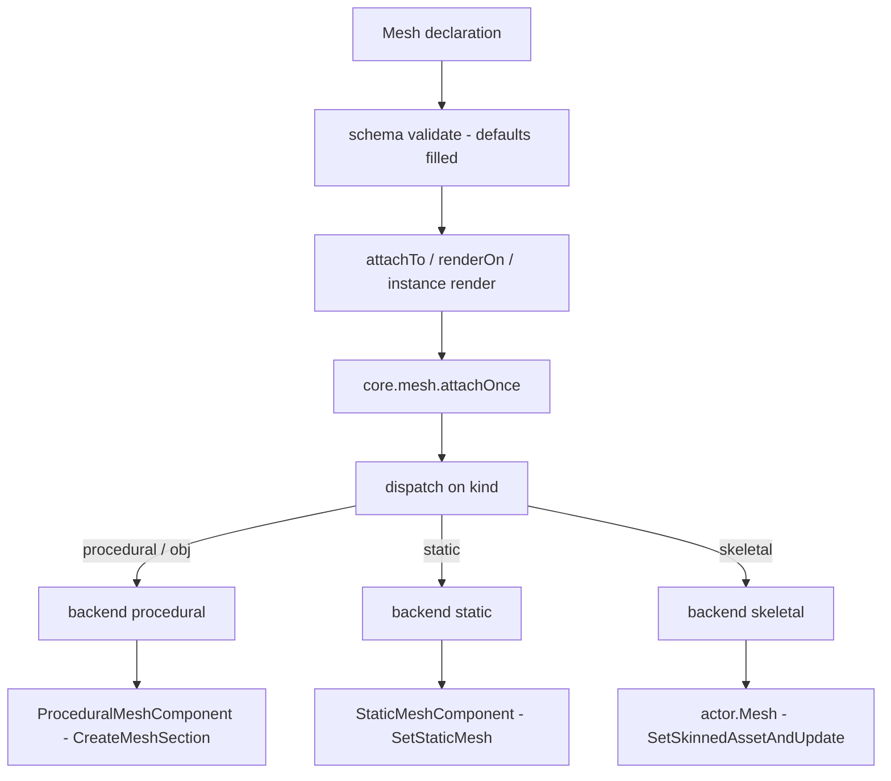
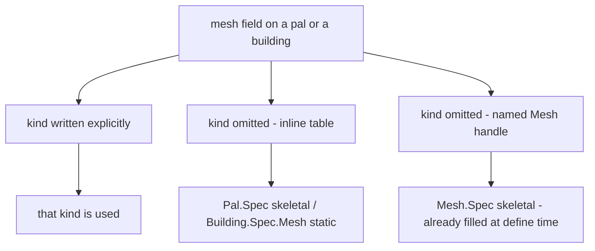

## What you can do after this page

- Give a pal a different body, so a vanilla chicken walks around as a sheep
- Put a model of your own on a structure you place in the world
- Name one model once and use it on as many pals and buildings as you like
- Change a model's colour while you are playing, and take the model off again

A mesh is the model something wears in the game, plus how to paint it. Write one with
`Mesh{ ... }`, give it an id, and you can hand the same model to a pal, to a building, or
to any actor you have in front of you.

```lua title="content/meshes.lua"
local body = Mesh{
    id        = "example:chicken_body",
    kind      = "skeletal",
    model     = "/Game/Pal/Model/Character/Monster/ChickenPal/SK_ChickenPal.SK_ChickenPal",
    animClass = "/Game/Pal/Blueprint/Character/Monster/PalActorBP/ChickenPal/ABP_ChickenPal.ABP_ChickenPal_C",
}

Pal{ id = "example:Boss", mesh = body }          -- nest the defined mesh
body:attachTo(actor)                             -- or attach it yourself
```

## Defining a mesh

Three calls do everything: make one, fetch one you made earlier, list them all.

```lua
local body = Mesh{ id = "example:body", model = "/Game/.../SK_X.SK_X" }  -- define, returns a Mesh.Handle
Mesh.get("example:body")                                                 -- an existing one, by id
Mesh.get_all()                                                           -- every registered mesh, as handles
```

`Mesh{ ... }` checks the table you wrote, stores it under the id, and gives you back a
`Mesh.Handle` - the object you attach with. The id is kept exactly as you typed it, so pass
`Mesh.get` the same string. Defining a second mesh under an id that is already taken
replaces the first one.

`id` is required when you call `Mesh` directly, and only then. A mesh written inline inside
a pal or a building has nothing to name, but a mesh you define on its own could never be
found again without one.

```lua
Mesh{ model = "/Game/Pal/Model/Other/PalBox/SM_PalBox.SM_PalBox" }
```

```text
PalForge: Mesh: field "id" is required (an unnamed mesh cannot be looked up again - write it inline as mesh = { ... } instead)
```

`Mesh.get` raises an error when nothing is registered under that id. A typo stops you right
there, instead of leaving a pal with nothing to show.

```lua
local body = Mesh.get("example:no_such_mesh")
```

```text
PalForge: Mesh.get("example:no_such_mesh"): no mesh is defined under that id
```

`Mesh.Class` is the class a mesh definition is built on. Its only method is `source()`,
which returns the definition itself. Subclass it when you want to work a mesh out in code
instead of writing it down.

## Mesh.Spec

Everything you can write inside `Mesh{ ... }`. Most meshes need two fields: `model`, which
says which model to use, and `kind`, which says how to put it on. The rest are for painting
and for placing.

<TypeTable
  type={{
    id: {
      description: 'Registry key. Required when you call Mesh directly, omitted when the table is written inline inside a pal or a building.',
      type: 'string',
    },
    kind: {
      description: 'Which core.mesh backend renders it.',
      type: '"procedural" | "static" | "skeletal" | "obj"',
      default: '"skeletal"',
    },
    model: {
      description: 'The model. A USkeletalMesh or UStaticMesh asset path for the skeletal and static backends; a filesystem path to a Wavefront OBJ file for procedural and obj.',
      type: 'string',
      required: true,
    },
    animClass: {
      description: 'ABP_*_C animation blueprint path. Read by the skeletal backend only.',
      type: 'string',
    },
    scale: {
      description: 'Uniform scale applied to the attached mesh. Read by the procedural and static backends.',
      type: 'number',
    },
    offset: {
      description: 'Offset from the actor origin, as x, y and z keys. Read by the procedural and static backends.',
      type: 'table',
    },
    texture: {
      description: 'Absolute path to a png, imported at runtime and pushed into the texture parameters. Procedural only.',
      type: 'string',
    },
    color: {
      description: 'Tint as r, g, b, a in 0..1. Procedural only.',
      type: 'table',
    },
    material: {
      description: 'Base material asset path to instance the dynamic material from. Procedural only.',
      type: 'string',
    },
    params: {
      description: 'Extra material parameters passed through, grouped as vector, scalar and texture sub-tables. Procedural only.',
      type: 'table',
    },
  }}
/>

The same field list is readable at runtime, without leaving the game:

```lua
local schema = require("palforge.core.schema")
print(schema.help("Mesh.Spec"))            -- every field, type, default and meaning
print(schema.help("Building.Spec.Mesh"))   -- the same shape with kind defaulting to static
schema.get("Mesh.Spec").fields             -- the same as a table, for tooling
```

A field name PalForge does not know is an error, with a guess at what you meant. The call
either works completely or not at all.

```lua
Mesh{ id = "example:body", modelPath = "/Game/.../SK_X.SK_X" }
```

```text
PalForge: Mesh: unknown field "modelPath" (did you mean "model"?). Valid fields: id, kind, model, animClass, scale, offset, texture, color, material, params
```

## From your table to something you can see

Three things happen between the table you write and a model on screen. Your table is
checked and the missing defaults are filled in. Something hands it to an actor - a live
thing in the world, like a pal's body or a placed structure. Then `core.mesh` picks how to
attach it, from `kind`.



Who does the middle step depends on what wears the mesh:

- **Mesh** - you call `meshHandle:attachTo(actor)` yourself.
- **Pal** - you call `pal:renderOn(ctx.actor)`, normally from `onSpawned`. Nothing attaches
  a pal's mesh for you, so a pal that never gets that call keeps its original body.
- **Building** - PalForge attaches it for you. A scan finds the structure you placed and
  calls its `render()`, deliberately one scan after the actor first appears. Attaching to
  an actor that is still starting up crashes the game.

Every route ends in `core.mesh.attachOnce`, which returns `false` when the actor or the
spec is missing. One switch turns all runtime meshes off:

```lua
require("palforge.core.mesh").ENABLED = false   -- stop attaching runtime meshes entirely
```

<Callout type="info">
The procedural and static backends remember which **actor** they dressed, not which mesh
they used. Attaching a second mesh of the same kind to an actor that already carries one
does nothing and still returns `true`. Each backend keeps its own list, so one actor can
carry a procedural and a static mesh at the same time - but `core.mesh` remembers only the
last backend that dressed it, and that is the one `setColor` and `detach` reach. The
skeletal backend keeps no such list: swapping the same mesh in again is harmless, and
attaching a second skeletal mesh replaces the first.
</Callout>

## The four kinds, three backends

`kind` decides how the model is put on the actor. `obj` is another name for `procedural` -
both names run the same code.

| kind | state | what it does |
| --- | --- | --- |
| `procedural` | implemented | parses a Wavefront OBJ from disk and builds a `ProceduralMeshComponent` |
| `obj` | implemented | alias for `procedural` |
| `skeletal` | implemented | swaps the pawn's `USkeletalMesh` and, optionally, its anim blueprint |
| `static` | implemented | adds a `UStaticMeshComponent` and hangs a `UStaticMesh` asset on it |

### procedural and obj

Use this one for a model of your own. `model` is a path to a `.obj` file on your disk, read
with `io.open` and remembered per path, so the same file is only read once.

Faces with more than three corners are split into triangles. Both facings are written out,
so the model shows no matter which way its faces point. Texture coordinates are
best-effort: the first `vt` seen for a position wins.

The component is added with `AddComponentByClass`, filled with `CreateMeshSection`, then
scaled with `SetWorldScale3D` and placed with `K2_SetRelativeLocation`. It never collides
with anything. A decorative model that collides both slows the game down and steals the
raycast the build menu uses to place structures.

```lua
local marker = Mesh{
    id     = "example:marker",
    kind   = "obj",
    model  = "C:/mods/example/marker.obj",
    scale  = 2.0,
    offset = { x = 0, y = 0, z = 120 },
    color  = { 1.0, 0.4, 0.1, 1.0 },
}
```

`scale` and `offset` are read here and by the static backend, and nowhere else. The `color`
you declare is also baked into the model as per-vertex colours, so a tint can show even
when no material parameter takes.

### skeletal

Use this one for creatures. PalForge finds the pawn's body component as `actor.Mesh`, with
`GetMesh()` as a fallback, clears the pal-side `SetDisableChangeMesh` guard that blocks mesh
changes, and swaps the model with `SetSkinnedAssetAndUpdate(mesh, true)`, falling back to
`SetSkeletalMeshAsset` where that is absent. The model is loaded with `LoadAsset` and,
failing that, `StaticFindObject`, then remembered per path.

`attach` returns `true` only when one of those two setters actually ran. A component that
carries neither counts as a failure, not a quiet success.

<Callout type="warn">
This route is not confirmed in-game yet. A `true` means a setter ran, not that the new model
is visibly on screen. If a swap does not show, try adding `animClass`, and check the log
line that names which setter was used.
</Callout>

`animClass` is optional. When you give it, PalForge switches the component to
animation-blueprint mode and binds the class, so the new skeleton actually moves. A skinned
model that nothing moves can disappear from view.

```lua
local sheep = Mesh{
    id        = "example:sheep_body",
    kind      = "skeletal",
    model     = "/Game/Pal/Model/Character/Monster/SheepBall/SK_SheepBall.SK_SheepBall",
    animClass = "/Game/Pal/Blueprint/Character/Monster/PalActorBP/SheepBall/ABP_SheepBall.ABP_SheepBall_C",
}
```

This works cleanly on a creature made of one mesh. A pawn made of several - the player is
body plus outfit - only gets its base component swapped.

### static

Use this one for a model that ships with the game, on a structure. `model` is the asset's
object path. It is loaded with `LoadAsset` and, failing that, `StaticFindObject`, then
remembered per path, and hung on a `UStaticMeshComponent` PalForge creates while the game
runs.

The steps are `AddComponentByClass`, then `SetStaticMesh`, then `SetWorldScale3D` and
`K2_SetRelativeLocation`. The scale call is not optional: the empty transform handed to
`AddComponentByClass` starts the component at zero scale, so a component nobody scales is
invisible. Collision is off here for the same reason as procedural.

```lua
local palbox = Mesh{
    id     = "example:palbox_body",
    kind   = "static",
    model  = "/Game/Pal/Model/Other/PalBox/SM_PalBox.SM_PalBox",
    scale  = 1.0,
    offset = { x = 0, y = 0, z = 0 },
}

Building{
    id     = "PalBoxV2",
    name   = "Pal Box",
    gridCm = 100,
    mesh   = palbox,
}
```

`scale` and `offset` are read exactly as the procedural backend reads them. The painting
fields are not: `texture`, `color`, `material` and `params` belong to procedural, so a
static mesh shows with the material its asset ships with, and `setColor` on an actor dressed
this way returns `false`.

<Callout type="warn">
`UStaticMeshComponent:SetStaticMesh` is not confirmed in this build of the game, so `attach`
does not trust the call. It reads the asset back off the component - `GetStaticMesh()`
first, then the `StaticMesh` property - and reports success only when the model it reads
back is really there. On any failure the component it added is destroyed again, so you get
`false` and no leftover component, rather than a claim that a model rendered when it did
not.
</Callout>

## The default kind follows the wearer

A structure wears a static model where a pal wears a skeletal one, so the default `kind`
depends on who wears it. The fields are the same either way. A mesh written inside a
building is checked against `Building.Spec.Mesh`, which is `Mesh.Spec` with `kind`
defaulting to `"static"`:

```lua title="Scripts/palforge/api/building.lua"
local Mesh = schema.derive("Building.Spec.Mesh", schema.get("Mesh.Spec"), {
    kind   = { default = "static" },
    model  = { doc = "UStaticMesh asset path, or an OBJ path for the procedural backend" },
    offset = { doc = "{ x, y, z } offset from the actor's origin" },
})
```

A mesh written inside a pal is checked against `Mesh.Spec` itself, so it keeps the
`skeletal` default.

A default only fills a field you left out. That leads to one result worth remembering:



`Mesh{ ... }` is checked against `Mesh.Spec` when you define it, so the handle you get back
already carries `kind = "skeletal"` as a real value. Putting that handle inside a building
does not turn it static: the field is already there, so the building's default never fires.

```lua
local shared = Mesh{ id = "example:shared", model = "C:/mods/example/box.obj" }
shared:kind()                                    -- "skeletal", filled by the default

Building{ id = "example:Bench", mesh = shared }  -- still skeletal, not static

Building{                                        -- inline: the static default applies
    id   = "example:Bench2",
    mesh = { model = "/Game/Pal/Model/Other/PalBox/SM_PalBox.SM_PalBox" },
}
```

<Callout type="warn">
Write `kind` explicitly on any mesh you plan to share between a pal and a building. It is
the only spelling that means the same thing in both places.
</Callout>

## Nesting: inline, named, or shared by id

Three ways to give a mesh to a pal or a building. All three end up in the same place. When
you pass a handle into another definition, PalForge checks it again and keeps a copy, so
what the pal or the building holds is its own table.

<Tabs items={['Inline', 'Named', 'By id']}>
<Tab value="Inline">

Write the table where it is used. No id, no registration, no reuse.

```lua
Pal{
    id   = "ChickenPal",
    name = "Chicken Pal",
    mesh = {
        kind      = "skeletal",
        model     = "/Game/Pal/Model/Character/Monster/ChickenPal/SK_ChickenPal.SK_ChickenPal",
        animClass = "/Game/Pal/Blueprint/Character/Monster/PalActorBP/ChickenPal/ABP_ChickenPal.ABP_ChickenPal_C",
    },
}
```

</Tab>
<Tab value="Named">

Define it once, pass the handle. You keep a handle you can also attach yourself.

```lua
local chicken = Mesh{
    id        = "example:chicken_body",
    kind      = "skeletal",
    model     = "/Game/Pal/Model/Character/Monster/ChickenPal/SK_ChickenPal.SK_ChickenPal",
    animClass = "/Game/Pal/Blueprint/Character/Monster/PalActorBP/ChickenPal/ABP_ChickenPal.ABP_ChickenPal_C",
}

Pal{ id = "ChickenPal", mesh = chicken }
```

</Tab>
<Tab value="By id">

Across files, look the registered mesh up by id. `Mesh.get` errors when nothing is
registered, so a typo fails loudly instead of rendering nothing.

```lua title="content/pals.lua"
Pal{ id = "SheepBall",  mesh = Mesh.get("example:chicken_body") }
Pal{ id = "ChickenPal", mesh = Mesh.get("example:chicken_body") }
```

</Tab>
</Tabs>

## Material: texture, color, material, params

Four fields describe how the model is painted, and only the procedural backend reads them.

- `texture` - an absolute path to a png. It is imported while the game runs with
  `UKismetRenderingLibrary:ImportFileAsTexture2D` and written to several candidate texture
  parameter names.
- `color` - a tint as `{ r, g, b, a }` or `{ [1], [2], [3], [4] }` in 0..1, written to
  several candidate vector parameter names and also baked into the model as vertex
  colours.
- `material` - the asset path of the material to build the paint job from.
- `params` - extra parameters passed straight through, grouped by type.

```lua
local painted = Mesh{
    id       = "example:painted",
    kind     = "procedural",
    model    = "C:/mods/example/marker.obj",
    texture  = "C:/mods/example/marker.png",
    color    = { r = 0.2, g = 0.8, b = 1.0, a = 1.0 },
    material = "/Engine/BasicShapes/BasicShapeMaterial.BasicShapeMaterial",
    params   = {
        vector  = { EmissiveColor = { 1, 0, 0, 1 } },
        scalar  = { Roughness = 0.4 },
        texture = { Normal = "C:/mods/example/marker_n.png" },
    },
}
```

<Callout type="warn">
Painting needs a base material, and PalForge does not ship one. It looks for your
`material` path first, then a short list of engine materials starting with
`BasicShapeMaterial`. The lookup is `StaticFindObject`, which only finds materials the game
has **already loaded**, so even an explicit `material` has to be loaded to be found. When
none of them is, no paint job is created and `color`, `texture` and `params` quietly do
nothing. The model itself still attaches, and the miss is written to the log rather than
raised. A miss is not remembered, so the next attach tries again.

Two things that still work without a base material: the `color` you declare is baked into
the model as vertex colours, and `require("palforge.core.mesh").probeMaterials()` logs which
candidates are loaded right now.
</Callout>

### How the wearer's override interacts

A pal and a building each have their own `material` table plus `color` and `texture`
shorthands. When `renderOn` or a building's `render()` hands the mesh over, it starts from
the mesh's own fields and lets the definition's material table overwrite them one field at a
time.

```lua
Pal{
    id    = "example:Boss",
    mesh  = { kind = "procedural", model = "C:/mods/example/boss.obj",
              color = { 1, 1, 1, 1 } },
    color = { 1, 0, 0, 1 },              -- shorthand: wins over the mesh color
}
```

The order the code applies it in:

1. The mesh's own `texture`, `color`, `material` and `params`.
2. If the definition declares a `material` table, each field **it sets** overwrites the
   mesh's value; fields it leaves out keep the mesh's value.
3. Otherwise the top-level `color` and `texture` shorthands become that override.

<Callout type="warn">
Step 2 and step 3 are exclusive. A definition that declares `material = { ... }` ignores its
own top-level `color` and `texture` entirely - the shorthands are only read when no
`material` table is present. Put everything in one place:

```lua
Pal{
    id       = "example:Boss",
    mesh     = { kind = "procedural", model = "C:/mods/example/boss.obj" },
    material = { color = { 1, 0, 0, 1 }, texture = "C:/mods/example/boss.png" },
}
```
</Callout>

`Mesh.Handle:attachTo` skips all of this. It attaches the mesh's own declaration, so the pal
or building material override does not apply to it.

## Mesh.Handle

`Mesh{ ... }`, `Mesh.get` and `Mesh.get_all` all give you a `Mesh.Handle`. It carries three
actions - put the mesh on, re-tint it, take it off - plus three questions you can ask about
what it stands for.

### attachTo

```lua
---@param actor any
---@return boolean ok
meshHandle:attachTo(actor)
```

Puts this mesh on a live actor, once. Returns `false` straight away when the actor is nil or
gone, otherwise it hands `source()` to `core.mesh.attachOnce` and returns what the backend
reports.

```lua
Pal{
    id     = "ChickenPal",
    events = {
        onSpawned = function(pal, ctx)
            Mesh.get("example:chicken_body"):attachTo(ctx.actor)
        end,
    },
}
```

<Callout type="warn">
`Pal.Handle:renderOn` passes on `kind`, `model`, `animClass`, `scale`, `offset` and the four
painting fields. `Building.Instance:render()` passes the same list **without** `animClass`.
A building wearing a skeletal mesh that needs its animation blueprint has to be attached
with `meshHandle:attachTo(self.actor)`, which passes the whole declaration through.
</Callout>

### setColor

```lua
---@param actor any
---@param color table  # { r, g, b, a } in 0..1
---@return boolean ok
meshHandle:setColor(actor, color)
```

Re-tints a mesh that is already on an actor. A successful attach records which backend
dressed that actor, and the re-tint follows that record; this mesh's own `kind` is passed as
a hint, used only when the actor was never dressed through PalForge at all. Only the
procedural backend can re-tint: it looks up the paint job it recorded for that actor at
attach time and writes the colour and emissive parameter names. It returns `false` when the
actor is gone, when the actor was dressed by the static or skeletal backend, when no paint
job exists for it, or when the colour is not a table.

<Callout type="info">
`setColor` follows the **actor**, not this mesh - any mesh handle re-tints whatever material
that actor is carrying. The procedural backend creates its paint job on every attach,
declared colour or not, so a mesh attached with none of `color`, `texture`, `material` or
`params` can still be re-tinted afterwards. What it does need is a base material: when none
of the candidates is loaded, none is created and the re-tint returns `false`.
</Callout>

### detach

```lua
---@param actor any
---@return boolean ok
meshHandle:detach(actor)
```

Takes off what an attach put on `actor`, so it can be dressed again. It follows the same
record as `setColor`: `core.mesh` asks the backend that dressed the actor to take its own
work back off. The procedural and static backends destroy the component they created with
`K2_DestroyComponent` and forget both the component and their once-per-actor record, so a
later `attachTo` dresses the actor again.

```lua
Pal{
    id     = "ChickenPal",
    events = {
        onSpawned = function(pal, ctx)
            Mesh.get("example:marker"):attachTo(ctx.actor)
        end,
        onDeath = function(pal, ctx)
            Mesh.get("example:marker"):detach(ctx.actor)
        end,
    },
}
```

<Callout type="warn">
`detach` follows the **actor**, so any handle removes whatever PalForge last attached there.
It returns `false` in three situations that mean different things: PalForge never dressed
this actor, the backend that dressed it has nothing of its own to remove (a skeletal swap
writes to the pawn's own component, so there is nothing to destroy), or the
`K2_DestroyComponent` call did not run. In that last case the record is kept on purpose,
because the component is still on the actor and that record is the only thing stopping a
second one from landing on top of it.
</Callout>

### source, model, kind

```lua
meshHandle:source()   -- the lowered spec core.mesh will render (the definition itself)
meshHandle:model()    -- the declared model path
meshHandle:kind()     -- the backend name, "skeletal" when the definition carries none
```

`source()` returns the definition, not a copy. Putting the handle in another definition
checks it again and copies, so what a pal or building holds is its own table.

## Recipes

### Reskin a vanilla pal, animation included

```lua title="content/reskin.lua"
local body = Mesh{
    id        = "example:chicken_body",
    kind      = "skeletal",
    model     = "/Game/Pal/Model/Character/Monster/SheepBall/SK_SheepBall.SK_SheepBall",
    animClass = "/Game/Pal/Blueprint/Character/Monster/PalActorBP/SheepBall/ABP_SheepBall.ABP_SheepBall_C",
}

local chicken = Pal{
    id          = "ChickenPal",
    name        = "Chicken Pal",
    description = "a chicken wearing a sheep",
    events      = {
        onSpawned = function(pal, ctx)
            body:attachTo(ctx.actor)          -- attachTo, so animClass survives the lowering
        end,
    },
}

chicken:spawn(Player.coordinate())   -- the pal arrives a few seconds later
```

### One procedural mesh shared by two pals

```lua title="content/markers.lua"
local marker = Mesh{
    id     = "example:marker",
    kind   = "procedural",
    model  = "C:/mods/example/marker.obj",
    scale  = 1.5,
    offset = { x = 0, y = 0, z = 150 },
    color  = { 0.1, 0.9, 0.4, 1.0 },
}

local function markOnSpawn(pal, ctx)
    marker:attachTo(ctx.actor)
end

Pal{ id = "ChickenPal", mesh = marker, events = { onSpawned = markOnSpawn } }
Pal{ id = "SheepBall",  mesh = marker, events = { onSpawned = markOnSpawn } }

-- somewhere else in the pack, by id
Pal{ id = "example:Third", mesh = Mesh.get("example:marker") }
```

### A building that changes colour when you use it

PalForge attaches the mesh for you on a scan after you place the structure. The procedural
backend creates the paint job the re-tint writes to on every attach, so the colour you
declare is only the starting tint.

```lua title="content/bench.lua"
local glow = Mesh{
    id     = "example:bench_glow",
    kind   = "procedural",
    model  = "C:/mods/example/bench.obj",
    scale  = 1.0,
    offset = { x = 0, y = 0, z = 60 },
    color  = { 0.3, 0.3, 0.3, 1.0 },       -- the starting tint
}

Building{
    id     = "WorkBench",
    name   = "Workbench",
    gridCm = 100,
    mesh   = glow,
    state  = { uses = 0 },
    events = {
        onPlace = function(self, ctx)
            self.state.uses = 0
            self:save()
        end,
        onRightClick = function(self, ctx)
            self.state.uses = self.state.uses + 1
            self:save()
            local hot = math.min(self.state.uses / 10, 1.0)
            glow:setColor(self.actor, { hot, 1.0 - hot, 0.2, 1.0 })
        end,
    },
}
```

### Swap a structure's static mesh while it is live

`detach` frees the actor so a second `attachTo` can dress it again. Both meshes below are
the same `UStaticMesh` at a different scale and offset, so the structure visibly lifts while
it is in use.

```lua title="content/bench_lift.lua"
local BENCH = "/Game/Pal/Model/Prop/Architecture/WorkBenchPrimitive/SM_WorkBenchPrimitive.SM_WorkBenchPrimitive"

local resting = Mesh{
    id     = "example:bench_resting",
    kind   = "static",
    model  = BENCH,
    scale  = 1.0,
    offset = { x = 0, y = 0, z = 0 },
}

local raised = Mesh{
    id     = "example:bench_raised",
    kind   = "static",
    model  = BENCH,
    scale  = 1.1,
    offset = { x = 0, y = 0, z = 40 },
}

Building{
    id     = "WorkBench",
    name   = "Workbench",
    gridCm = 100,
    mesh   = resting,
    state  = { lifted = false },
    events = {
        onRightClick = function(self, ctx)
            self.state.lifted = not self.state.lifted
            self:save()
            local want = self.state.lifted and raised or resting
            -- detach dispatches on the actor, so any handle takes off what is on it
            if resting:detach(self.actor) then want:attachTo(self.actor) end
        end,
    },
}
```

Attaching only after `detach` reports `true` is what keeps a second component from being
stacked: a `false` there means the old one is still on the actor.

### Painting with an explicit base material

```lua title="content/painted.lua"
local painted = Mesh{
    id       = "example:painted",
    kind     = "obj",
    model    = "C:/mods/example/crate.obj",
    material = "/Engine/BasicShapes/BasicShapeMaterial.BasicShapeMaterial",
    texture  = "C:/mods/example/crate.png",
    params   = {
        vector = { EmissiveColor = { 0.0, 0.6, 1.0, 1.0 } },
        scalar = { Metallic = 0.0 },
    },
}

Building{
    id     = "PalBoxV2",
    name   = "Pal Box",
    gridCm = 100,
    mesh   = painted,
}
```

If nothing appears tinted, read the material status line in the log before changing the
declaration: the attach reports which base material it found, whether the texture imported,
and whether texture coordinates and vertex colours were present.

## Errors

Every failure below starts with `PalForge: ` and names the domain. The first three happen
when you define the mesh and name the field; the last one happens when `Mesh.get` cannot
find anything.

```text
PalForge: Mesh: field "model" is required (USkeletalMesh / UStaticMesh asset path)
PalForge: Mesh: field "kind" must be one of { "procedural", "static", "skeletal", "obj" }, got "skeletel"
PalForge: Mesh: unknown field "modelPath" (did you mean "model"?). Valid fields: id, kind, model, animClass, scale, offset, texture, color, material, params
PalForge: Mesh.get("example:body"): no mesh is defined under that id
```

A mesh written inside another definition names the outer field and the shape it was checked
against, so you know which spec to go and read:

```text
PalForge: Pal: field "mesh" (Mesh.Spec): field "model" is required (USkeletalMesh / UStaticMesh asset path)
PalForge: Building: field "mesh" (Building.Spec.Mesh): field "model" is required (UStaticMesh asset path, or an OBJ path for the procedural backend)
```

Failures while the game runs are not errors. `attachTo`, `setColor`, `detach` and the work
done for you by [Pal](/docs/api/pal) and [Building](/docs/api/building) never throw into
your handler: a missing actor, a missing component, an unreadable OBJ file, a static mesh
asset that cannot be found or a missing base material all return `false` and write to the
log.

## Summary

- `Mesh{ id = ..., model = ... }` names a model you can reuse; `model` is always required
  and `id` is required when you call `Mesh` directly.
- `kind` decides how it goes on: `skeletal` for a pal's body, `static` for a game model on a
  structure, `procedural` or `obj` for an OBJ file of your own.
- Hand it over with `mesh = ...` inside a pal or a building, or put it on an actor yourself
  with `meshHandle:attachTo(actor)`.
- A pal only wears its mesh when you call `pal:renderOn(ctx.actor)`, usually from
  `onSpawned`. A structure is dressed for you shortly after you place it.
- `setColor` and `detach` follow the actor, and only work on a mesh the procedural or static
  backend put there.
- Nothing throws while the game runs: `attachTo`, `setColor` and `detach` return `false` and
  write to the log.

Next, read [Pal](/docs/api/pal) to spawn a creature that wears your mesh, or
[Building](/docs/api/building) to place a structure that wears it.
