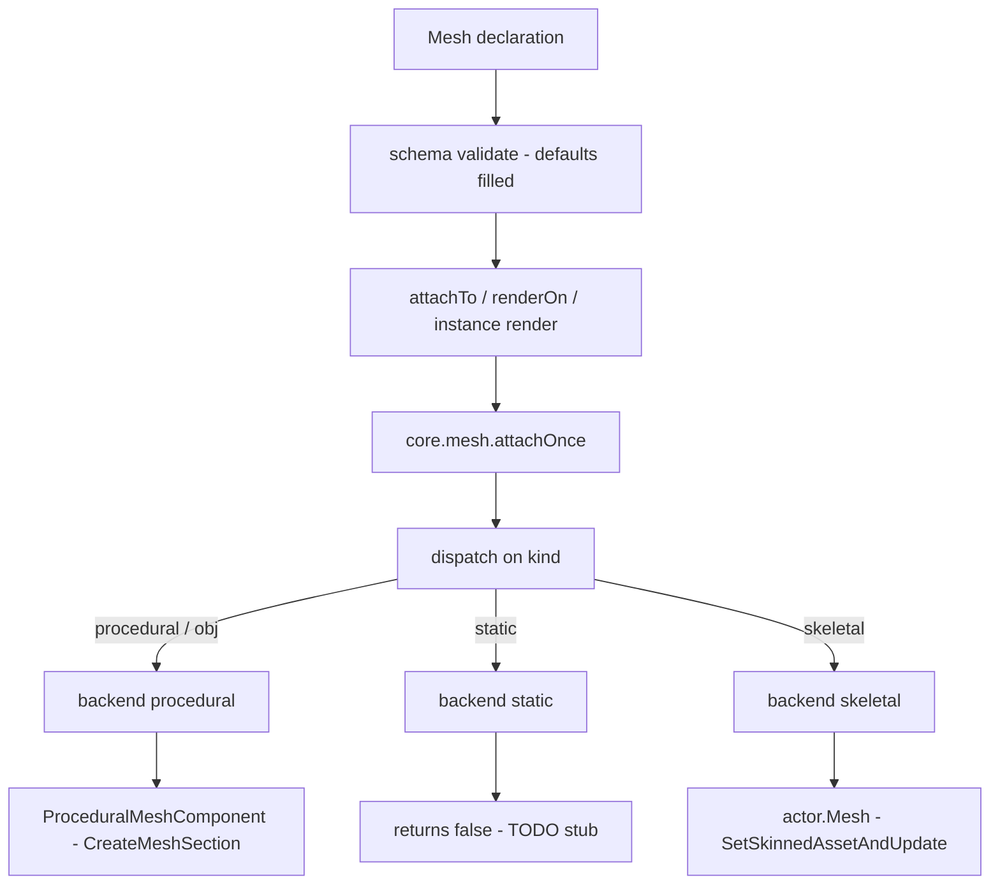
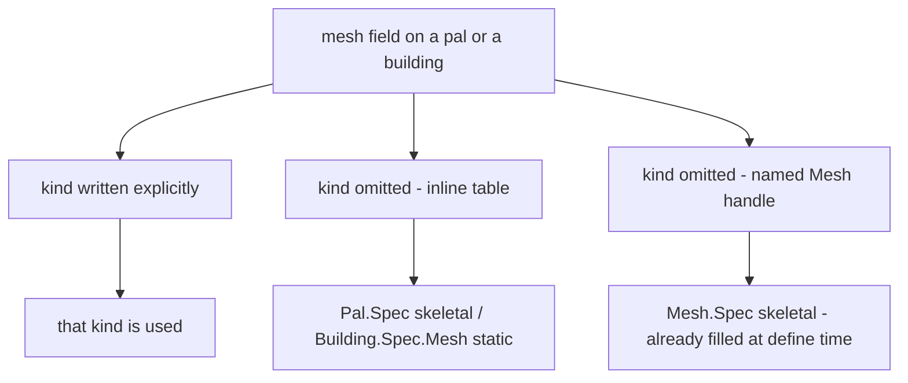

A mesh is the visual a definition wears: a model asset plus how to paint it. It is its own
domain so that a mesh can be declared once, named, and worn by a pal, by a building, or by
any actor you hand it.

```lua title="content/meshes.lua"
local body = Mesh{
    id        = "example:chicken_body",
    kind      = "skeletal",
    model     = "/Game/Pal/Model/Character/Monster/ChickenPal/SK_ChickenPal.SK_ChickenPal",
    animClass = "/Game/Pal/Blueprint/Character/Monster/PalActorBP/ChickenPal/ABP_ChickenPal.ABP_ChickenPal_C",
}

Pal{ id = "example:Boss", mesh = body }          -- nest the defined mesh
body:attachTo(actor)                             -- or attach it yourself
```

## Defining a mesh

The module has the same three entry points as every other domain.

```lua
local body = Mesh{ id = "example:body", model = "/Game/.../SK_X.SK_X" }  -- define, returns a Mesh.Handle
Mesh.get("example:body")                                                 -- an existing one, by id
Mesh.get_all()                                                           -- every registered mesh, as handles
```

Calling the module validates the table against `Mesh.Spec`, registers the definition in
`core/object_manager` under `("mesh", id)`, and returns a `Mesh.Handle`. The id is stored
raw, so `Mesh.get` takes exactly the string you defined with. Registering a second mesh
under an id that is already taken replaces the previous registration.

`id` is required when you call `Mesh` directly, and only then. A mesh written inline inside
another definition has nothing to name; a mesh defined directly could never be looked up
again without one.

```lua
Mesh{ model = "/Game/Pal/Model/Other/PalBox/SM_PalBox.SM_PalBox" }
```

```text
PalForge: Mesh: field "id" is required (an unnamed mesh cannot be looked up again - write it inline as mesh = { ... } instead)
```

`Mesh.get` errors on a miss. `Pal.get` and `Item.get` fall back to a thin definition over a
game id, but a mesh has no such fallback: a mesh with no model would silently render
nothing.

```lua
local body = Mesh.get("example:no_such_mesh")
```

```text
PalForge: Mesh.get("example:no_such_mesh"): no mesh is defined under that id
```

`Mesh.Class` is the base definition class. Its only method is `source()`, which returns the
definition itself; subclass it when a mesh has to be computed rather than declared.

## Mesh.Spec

<TypeTable
  type={{
    id: {
      description: 'Registry key. Required when you call Mesh directly, omitted when the table is written inline inside a pal or a building.',
      type: 'string',
    },
    kind: {
      description: 'Which core.mesh backend renders it.',
      type: '"procedural" | "static" | "skeletal" | "obj"',
      default: '"skeletal"',
    },
    model: {
      description: 'The model. A USkeletalMesh or UStaticMesh asset path for the skeletal and static backends; a filesystem path to a Wavefront OBJ file for procedural and obj.',
      type: 'string',
      required: true,
    },
    animClass: {
      description: 'ABP_*_C animation blueprint path. Read by the skeletal backend only.',
      type: 'string',
    },
    scale: {
      description: 'Uniform scale applied to the attached mesh. Read by the procedural backend only.',
      type: 'number',
    },
    offset: {
      description: 'Offset from the actor origin, as x, y and z keys. Read by the procedural backend only.',
      type: 'table',
    },
    texture: {
      description: 'Absolute path to a png, imported at runtime and pushed into the texture parameters. Procedural only.',
      type: 'string',
    },
    color: {
      description: 'Tint as r, g, b, a in 0..1. Procedural only.',
      type: 'table',
    },
    material: {
      description: 'Base material asset path to instance the dynamic material from. Procedural only.',
      type: 'string',
    },
    params: {
      description: 'Extra material parameters passed through, grouped as vector, scalar and texture sub-tables. Procedural only.',
      type: 'table',
    },
  }}
/>

The same field list is readable at runtime, without leaving the game:

```lua
local schema = require("palforge.core.schema")
print(schema.help("Mesh.Spec"))            -- every field, type, default and meaning
print(schema.help("Building.Spec.Mesh"))   -- the same shape with kind defaulting to static
schema.get("Mesh.Spec").fields             -- the same as a table, for tooling
```

Validation is strict. An undeclared field is a hard error with a did-you-mean, and the call
never half-succeeds.

```lua
Mesh{ id = "example:body", modelPath = "/Game/.../SK_X.SK_X" }
```

```text
PalForge: Mesh: unknown field "modelPath" (did you mean "model"?). Valid fields: id, kind, model, animClass, scale, offset, texture, color, material, params
```

## From declaration to actor

A declaration becomes pixels in three steps: validation fills the defaults, something
lowers the declaration onto an actor, and `core.mesh` picks the backend from `kind`.



Who calls the middle step depends on the domain:

- **Mesh** — you call `meshHandle:attachTo(actor)` yourself.
- **Pal** — you call `pal:renderOn(ctx.actor)`, normally from `onSpawned`. Pals have no
  instance scan, so nothing attaches a pal mesh for you.
- **Building** — the reconstruction scan in `core/event` calls the live instance's
  `render()` for you, deliberately one scan after the actor first appears. Attaching to an
  actor that is still mid-init crashes the game.

Every route ends in `core.mesh.attachOnce`, which returns `false` when the actor or the
spec is missing, and is gated by a global kill switch:

```lua
require("palforge.core.mesh").ENABLED = false   -- stop attaching runtime meshes entirely
```

<Callout type="info">
The once-guard in the procedural backend is keyed on the **actor**, not on the mesh. A
second procedural mesh attached to an actor that already carries one is a no-op that still
returns `true`. The skeletal backend has no guard: the swap is idempotent, and attaching a
second skeletal mesh replaces the first.
</Callout>

## The four kinds, three backends

`kind` selects the backend. `obj` is an alias for `procedural` - the same table is
registered under both names.

| kind | state | what it does |
| --- | --- | --- |
| `procedural` | implemented | parses a Wavefront OBJ from disk and builds a `ProceduralMeshComponent` |
| `obj` | implemented | alias for `procedural` |
| `skeletal` | implemented | swaps the pawn's `USkeletalMesh` and, optionally, its anim blueprint |
| `static` | TODO stub | returns `false` and attaches nothing |

### procedural and obj

`model` is a filesystem path to a `.obj` file, read with `io.open` and cached by path.
Faces with more than three vertices are fan-triangulated, and both windings are emitted so
the mesh is visible regardless of face orientation. UVs are best-effort: the first `vt`
seen for a position index wins.

The component is added with `AddComponentByClass`, filled with `CreateMeshSection`, then
scaled with `SetWorldScale3D` and placed with `K2_SetRelativeLocation`. Collision is
disabled: a decorative mesh that collides both hitches and intercepts the build placement
raycast.

```lua
local marker = Mesh{
    id     = "example:marker",
    kind   = "obj",
    model  = "C:/mods/example/marker.obj",
    scale  = 2.0,
    offset = { x = 0, y = 0, z = 120 },
    color  = { 1.0, 0.4, 0.1, 1.0 },
}
```

`scale` and `offset` are read here and nowhere else. The declared `color` is also baked
into the section as per-vertex colors, so a tint can show even when no material parameter
takes.

### skeletal

The real path for creatures. The backend resolves the pawn's component as `actor.Mesh`
with a `GetMesh()` fallback, clears the pal-side `SetDisableChangeMesh` guard, and swaps
the asset with `SetSkinnedAssetAndUpdate(mesh, true)`, falling back to
`SetSkeletalMeshAsset` where that is absent. The asset is loaded with `LoadAsset` and,
failing that, `StaticFindObject`, then cached by path.

`animClass` is optional. When present, the backend forces animation-blueprint mode and
binds the class, so the new skeleton is actually driven - an undriven skinned mesh can cull
to nothing.

```lua
local sheep = Mesh{
    id        = "example:sheep_body",
    kind      = "skeletal",
    model     = "/Game/Pal/Model/Character/Monster/SheepBall/SK_SheepBall.SK_SheepBall",
    animClass = "/Game/Pal/Blueprint/Character/Monster/PalActorBP/SheepBall/ABP_SheepBall.ABP_SheepBall_C",
}
```

This works cleanly on a single-mesh creature. A multi-mesh pawn - the player is body plus
outfit - only gets its base component swapped.

### static

<Callout type="warn">
The static backend is a TODO stub. `attach` returns `false` and nothing is added to the
actor. It is registered so that `kind = "static"` validates and so the extension seam is
visible, but a static mesh does not render today. Since `static` is also the default kind
for a building, an inline building mesh attaches nothing until you set
`kind = "procedural"` and point `model` at an OBJ file.
</Callout>

## The default kind follows the wearer

A structure is a static mesh where a pal is a skeletal one, so the default differs by
wearer. The shape does not: `api/building` derives its mesh shape from `Mesh.Spec` and
replaces the one thing that is the consumer's policy.

```lua title="Scripts/palforge/api/building.lua"
local Mesh = schema.derive("Building.Spec.Mesh", schema.get("Mesh.Spec"), {
    kind   = { default = "static" },
    model  = { doc = "UStaticMesh asset path, or an OBJ path for the procedural backend" },
    offset = { doc = "{ x, y, z } offset from the actor's origin" },
})
```

Deriving keeps the two in step: a field added to `Mesh.Spec` reaches buildings without
anyone remembering to copy it. `api/pal` reuses `Mesh.Spec` itself, so a pal mesh keeps the
`skeletal` default.

A default only applies when the field is absent, which produces one result worth
remembering:



`Mesh{ ... }` validates against `Mesh.Spec` at define time, so the handle it returns
already carries `kind = "skeletal"` as a real value. Nesting that handle into a building
does not turn it static - the field is present, so the building's default never fires.

```lua
local shared = Mesh{ id = "example:shared", model = "C:/mods/example/box.obj" }
shared:kind()                                    -- "skeletal", filled by the default

Building{ id = "example:Bench", mesh = shared }  -- still skeletal, not static

Building{                                        -- inline: the static default applies
    id   = "example:Bench2",
    mesh = { model = "/Game/Pal/Model/Other/PalBox/SM_PalBox.SM_PalBox" },
}
```

<Callout type="warn">
Write `kind` explicitly on any mesh you intend to share between a pal and a building. It is
the only spelling that means the same thing in both places.
</Callout>

## Nesting: inline, named, or shared by id

All three spellings reach `core.mesh` the same way. A handle can be passed straight into
another definition because its metatable carries `__spec`, which `core/schema` unwraps to
the plain declaration before validating it against the nested shape. Validation then
copies, so the nested definition stays private - the pal cannot reach the mesh definition
through the copy it holds.

<Tabs items={['Inline', 'Named', 'By id']}>
<Tab value="Inline">

Write the table where it is used. No id, no registration, no reuse.

```lua
Pal{
    id   = "ChickenPal",
    name = "Chicken Pal",
    mesh = {
        kind      = "skeletal",
        model     = "/Game/Pal/Model/Character/Monster/ChickenPal/SK_ChickenPal.SK_ChickenPal",
        animClass = "/Game/Pal/Blueprint/Character/Monster/PalActorBP/ChickenPal/ABP_ChickenPal.ABP_ChickenPal_C",
    },
}
```

</Tab>
<Tab value="Named">

Define it once, pass the handle. You keep a handle you can also attach yourself.

```lua
local chicken = Mesh{
    id        = "example:chicken_body",
    kind      = "skeletal",
    model     = "/Game/Pal/Model/Character/Monster/ChickenPal/SK_ChickenPal.SK_ChickenPal",
    animClass = "/Game/Pal/Blueprint/Character/Monster/PalActorBP/ChickenPal/ABP_ChickenPal.ABP_ChickenPal_C",
}

Pal{ id = "ChickenPal", mesh = chicken }
```

</Tab>
<Tab value="By id">

Across files, look the registered mesh up by id. `Mesh.get` errors when nothing is
registered, so a typo fails loudly instead of rendering nothing.

```lua title="content/pals.lua"
Pal{ id = "SheepBall",  mesh = Mesh.get("example:chicken_body") }
Pal{ id = "ChickenPal", mesh = Mesh.get("example:chicken_body") }
```

</Tab>
</Tabs>

## Material: texture, color, material, params

Four fields describe how the mesh is painted, and all four are consumed by the procedural
backend only.

- `texture` - an absolute path to a png. It is imported at runtime with
  `UKismetRenderingLibrary:ImportFileAsTexture2D` and written to several candidate texture
  parameter names.
- `color` - a tint as `{ r, g, b, a }` or `{ [1], [2], [3], [4] }` in 0..1, written to
  several candidate vector parameter names and also baked into the section as vertex
  colors.
- `material` - the base material asset path to instance the dynamic material from.
- `params` - explicit parameter passthrough, grouped by type.

```lua
local painted = Mesh{
    id       = "example:painted",
    kind     = "procedural",
    model    = "C:/mods/example/marker.obj",
    texture  = "C:/mods/example/marker.png",
    color    = { r = 0.2, g = 0.8, b = 1.0, a = 1.0 },
    material = "/Engine/BasicShapes/BasicShapeMaterial.BasicShapeMaterial",
    params   = {
        vector  = { EmissiveColor = { 1, 0, 0, 1 } },
        scalar  = { Roughness = 0.4 },
        texture = { Normal = "C:/mods/example/marker_n.png" },
    },
}
```

<Callout type="warn">
No custom base material ships with PalForge. The backend resolves a base material with
`StaticFindObject`, which only finds objects that are **already loaded**, and tries a short
list of engine materials starting with `BasicShapeMaterial`. When none of them is loaded,
no dynamic material instance is created and the color, texture and params silently do not
apply. The mesh itself still attaches - the material layer is fail-soft throughout, and
misses are logged rather than raised. A miss is not cached, so the next attach retries.
</Callout>

### How the wearer's override interacts

A pal and a building each have their own `material` table plus `color` and `texture`
shorthands. When `renderOn` or an instance `render()` lowers the mesh, it starts from the
mesh's own fields and lets the definition's material descriptor overwrite them field by
field.

```lua
Pal{
    id    = "example:Boss",
    mesh  = { kind = "procedural", model = "C:/mods/example/boss.obj",
              color = { 1, 1, 1, 1 } },
    color = { 1, 0, 0, 1 },              -- shorthand: wins over the mesh color
}
```

The precedence, in the order the code applies it:

1. The mesh's own `texture`, `color`, `material` and `params`.
2. If the definition declares a `material` table, each field **it sets** overwrites the
   mesh's value; fields it leaves out keep the mesh's value.
3. Otherwise the top-level `color` and `texture` shorthands become that override.

<Callout type="warn">
Step 2 and step 3 are exclusive. A definition that declares `material = { ... }` ignores its
own top-level `color` and `texture` entirely - the shorthands are only read when no
`material` table is present. Put everything in one place:

```lua
Pal{
    id       = "example:Boss",
    mesh     = { kind = "procedural", model = "C:/mods/example/boss.obj" },
    material = { color = { 1, 0, 0, 1 }, texture = "C:/mods/example/boss.png" },
}
```
</Callout>

`Mesh.Handle:attachTo` skips all of this. It attaches the mesh's own declaration, so the
pal or building material override does not apply to it.

## Mesh.Handle

A mesh has no lifecycle of its own - it is worn by something else - so the handle carries
actions plus the declaration it stands for.

### attachTo

```lua
---@param actor any
---@return boolean ok
meshHandle:attachTo(actor)
```

Attaches this mesh to a live actor, once. Returns `false` immediately when the actor is nil
or not valid, otherwise it hands `source()` to `core.mesh.attachOnce` and returns what the
backend reports.

```lua
Pal{
    id     = "ChickenPal",
    events = {
        onSpawned = function(pal, ctx)
            Mesh.get("example:chicken_body"):attachTo(ctx.actor)
        end,
    },
}
```

<Callout type="warn">
`Pal.Handle:renderOn` and `Building.Instance:render()` copy `kind`, `model`, `scale`,
`offset` and the four material fields onto the spec they lower - they do **not** copy
`animClass`. A skeletal mesh that needs its animation blueprint has to be attached with
`meshHandle:attachTo(ctx.actor)`, which passes the whole declaration through.
</Callout>

### setColor

```lua
---@param actor any
---@param color table  # { r, g, b, a } in 0..1
---@return boolean ok
meshHandle:setColor(actor, color)
```

Re-tints an already-attached mesh. The color table carries no `kind`, so this always
reaches the procedural backend, which looks up the dynamic material instance it recorded
for that actor at attach time and writes the color and emissive parameter names. It returns
`false` when the actor is invalid, when no dynamic material instance exists for it, or when
the color is not a table.

<Callout type="info">
`setColor` is keyed on the **actor**, not on this mesh - any mesh handle re-tints whatever
procedural material that actor is carrying. A dynamic material instance only exists if the
attach declared at least one of `color`, `texture`, `material` or `params`, so a mesh
attached with none of them can never be re-tinted.
</Callout>

### source, model, kind

```lua
meshHandle:source()   -- the lowered spec core.mesh will render (the definition itself)
meshHandle:model()    -- the declared model path
meshHandle:kind()     -- the backend name, "skeletal" when the definition carries none
```

`source()` returns the definition, not a copy. Nesting the handle in another definition
re-validates and copies, so what a pal or building holds is its own table.

## Recipes

### Reskin a vanilla pal, animation included

```lua title="content/reskin.lua"
local body = Mesh{
    id        = "example:chicken_body",
    kind      = "skeletal",
    model     = "/Game/Pal/Model/Character/Monster/SheepBall/SK_SheepBall.SK_SheepBall",
    animClass = "/Game/Pal/Blueprint/Character/Monster/PalActorBP/SheepBall/ABP_SheepBall.ABP_SheepBall_C",
}

local chicken = Pal{
    id          = "ChickenPal",
    name        = "Chicken Pal",
    description = "a chicken wearing a sheep",
    events      = {
        onSpawned = function(pal, ctx)
            body:attachTo(ctx.actor)          -- attachTo, so animClass survives the lowering
        end,
    },
}

chicken:spawn(Player.coordinate())
```

### One procedural mesh shared by two pals

```lua title="content/markers.lua"
local marker = Mesh{
    id     = "example:marker",
    kind   = "procedural",
    model  = "C:/mods/example/marker.obj",
    scale  = 1.5,
    offset = { x = 0, y = 0, z = 150 },
    color  = { 0.1, 0.9, 0.4, 1.0 },
}

local function markOnSpawn(pal, ctx)
    marker:attachTo(ctx.actor)
end

Pal{ id = "ChickenPal", mesh = marker, events = { onSpawned = markOnSpawn } }
Pal{ id = "SheepBall",  mesh = marker, events = { onSpawned = markOnSpawn } }

-- somewhere else in the pack, by id
Pal{ id = "example:Third", mesh = Mesh.get("example:marker") }
```

### A building that changes colour when you use it

The building runtime attaches the mesh for you on a scan after placement. Declare a color
so that a dynamic material instance exists, then re-tint from a handler.

```lua title="content/bench.lua"
local glow = Mesh{
    id     = "example:bench_glow",
    kind   = "procedural",
    model  = "C:/mods/example/bench.obj",
    scale  = 1.0,
    offset = { x = 0, y = 0, z = 60 },
    color  = { 0.3, 0.3, 0.3, 1.0 },       -- creates the MID the re-tint needs
}

Building{
    id     = "WorkBench",
    name   = "Workbench",
    gridCm = 100,
    mesh   = glow,
    state  = { uses = 0 },
    events = {
        onPlace = function(self, ctx)
            self.state.uses = 0
            self:save()
        end,
        onRightClick = function(self, ctx)
            self.state.uses = self.state.uses + 1
            self:save()
            local hot = math.min(self.state.uses / 10, 1.0)
            glow:setColor(self.actor, { hot, 1.0 - hot, 0.2, 1.0 })
        end,
    },
}
```

### Painting with an explicit base material

```lua title="content/painted.lua"
local painted = Mesh{
    id       = "example:painted",
    kind     = "obj",
    model    = "C:/mods/example/crate.obj",
    material = "/Engine/BasicShapes/BasicShapeMaterial.BasicShapeMaterial",
    texture  = "C:/mods/example/crate.png",
    params   = {
        vector = { EmissiveColor = { 0.0, 0.6, 1.0, 1.0 } },
        scalar = { Metallic = 0.0 },
    },
}

Building{
    id     = "PalBoxV2",
    name   = "Pal Box",
    gridCm = 100,
    mesh   = painted,
}
```

If nothing appears tinted, check the log for the material status line before changing the
declaration: the attach reports which base material it found, whether the texture imported,
and whether UVs and vertex colors were present.

## Errors

Every failure below is prefixed `PalForge: ` and names the domain. The first three are
raised at define time and name the field; the last one is raised by `Mesh.get`, at lookup.

```text
PalForge: Mesh: field "model" is required (USkeletalMesh / UStaticMesh asset path)
PalForge: Mesh: field "kind" must be one of { "procedural", "static", "skeletal", "obj" }, got "skeletel"
PalForge: Mesh: unknown field "modelPath" (did you mean "model"?). Valid fields: id, kind, model, animClass, scale, offset, texture, color, material, params
PalForge: Mesh.get("example:body"): no mesh is defined under that id
```

Nested declarations name the outer field and the shape being validated, so you know which
spec to go and read:

```text
PalForge: Pal: field "mesh" (Mesh.Spec): field "model" is required (USkeletalMesh / UStaticMesh asset path)
PalForge: Building: field "mesh" (Building.Spec.Mesh): field "model" is required (UStaticMesh asset path, or an OBJ path for the procedural backend)
```

Runtime failures are not errors. `attachTo`, `setColor` and the lowering done by
[Pal](/docs/api/pal) and [Building](/docs/api/building) are fail-soft throughout: a missing
actor, a missing component, an unreadable OBJ file or an absent base material returns
`false` and logs, rather than throwing into your handler.
