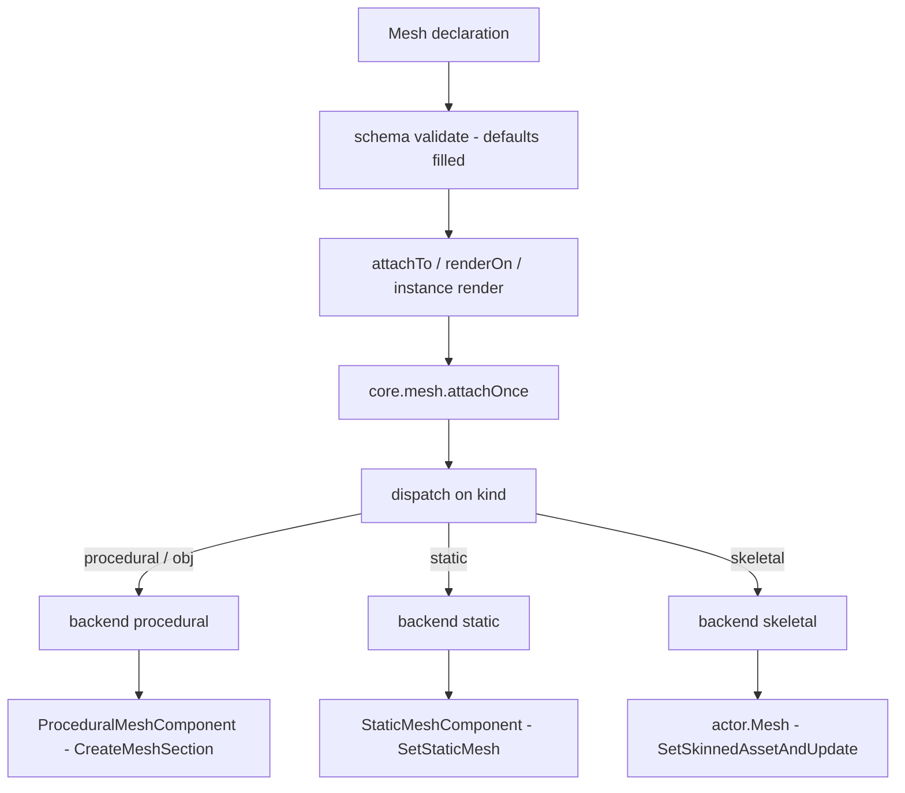
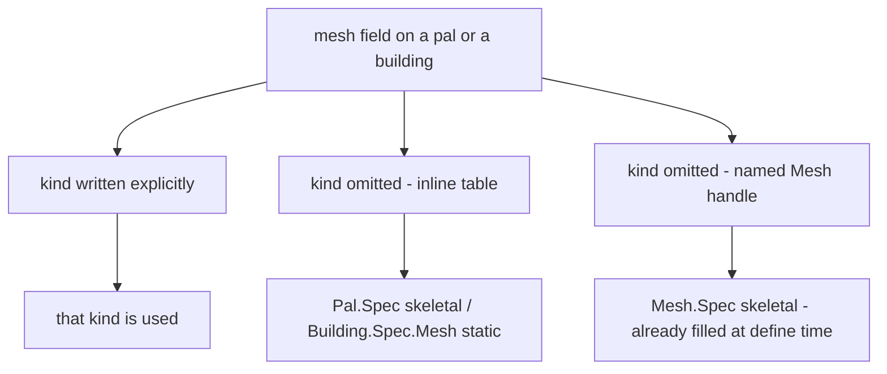

## 读完本页你可以做到

- 给帕鲁换一副身体，让原版的鸡以羊的样子走来走去
- 把你自己做的模型放到摆在世界里的建筑物上
- 给一个模型起一次名字，然后用在任意多个帕鲁和建筑物上
- 在游戏过程中改模型的颜色，也能把模型再取下来

网格就是游戏里某个东西身上穿的模型，加上它的上色方式。用 `Mesh{ ... }` 写一个，给它一个
id，你就能把同一套模型交给帕鲁、交给建筑物，或者交给眼前的任何一个 actor。

```lua title="content/meshes.lua"
local body = Mesh{
    id        = "example:chicken_body",
    kind      = "skeletal",
    model     = "/Game/Pal/Model/Character/Monster/ChickenPal/SK_ChickenPal.SK_ChickenPal",
    animClass = "/Game/Pal/Blueprint/Character/Monster/PalActorBP/ChickenPal/ABP_ChickenPal.ABP_ChickenPal_C",
}

Pal{ id = "example:Boss", mesh = body }          -- nest the defined mesh
body:attachTo(actor)                             -- or attach it yourself
```

## 定义一个网格

三个调用就够了：造一个、取回之前造的那个、把它们全列出来。

```lua
local body = Mesh{ id = "example:body", model = "/Game/.../SK_X.SK_X" }  -- define, returns a Mesh.Handle
Mesh.get("example:body")                                                 -- an existing one, by id
Mesh.get_all()                                                           -- every registered mesh, as handles
```

`Mesh{ ... }` 会检查你写的表，按 id 存起来，再把 `Mesh.Handle` 还给你 —— 这就是你用来挂载的
对象。id 会按你写的样子原样保存，所以传给 `Mesh.get` 的要是同一个字符串。用一个已经被占用的
id 再定义一次，会把前一个替换掉。

`id` 只在你直接调用 `Mesh` 时才是必须的。写在帕鲁或建筑物里面的内联网格没有需要命名的对象，
而单独定义的网格如果没有 id 就再也找不回来了。

```lua
Mesh{ model = "/Game/Pal/Model/Other/PalBox/SM_PalBox.SM_PalBox" }
```

```text
PalForge: Mesh: field "id" is required (an unnamed mesh cannot be looked up again - write it inline as mesh = { ... } instead)
```

`Mesh.get` 在那个 id 下什么都没注册时会报错。打错字会当场把你拦下来，而不是留下一个什么都
不显示的帕鲁。

```lua
local body = Mesh.get("example:no_such_mesh")
```

```text
PalForge: Mesh.get("example:no_such_mesh"): no mesh is defined under that id
```

`Mesh.Class` 是网格定义所基于的类。它只有一个方法 `source()`，返回定义本身。当你想用代码算出
一个网格，而不是把它写下来时，继承它。

## Mesh.Spec

`Mesh{ ... }` 里面能写的全部内容。大多数网格需要两个字段：`model` 说明用哪个模型，`kind` 说明
怎么把它装上去。其余的用于上色和摆放。

<TypeTable
  type={{
    id: {
      description: '注册表的键。直接调用 Mesh 时必填，写在帕鲁或建筑物里面的内联表则省略。',
      type: 'string',
    },
    kind: {
      description: '由哪个 core.mesh 后端来渲染。',
      type: '"procedural" | "static" | "skeletal" | "obj"',
      default: '"skeletal"',
    },
    model: {
      description: '模型。skeletal 和 static 后端用 USkeletalMesh 或 UStaticMesh 的资源路径；procedural 和 obj 用 Wavefront OBJ 文件的文件系统路径。',
      type: 'string',
      required: true,
    },
    animClass: {
      description: 'ABP_*_C 动画蓝图路径。只有 skeletal 后端会读。',
      type: 'string',
    },
    scale: {
      description: '给挂上的网格施加的等比缩放。procedural 和 static 后端会读。',
      type: 'number',
    },
    offset: {
      description: '相对 actor 原点的偏移，用 x、y、z 三个键写。procedural 和 static 后端会读。',
      type: 'table',
    },
    texture: {
      description: 'png 的绝对路径，运行时导入并写入纹理参数。仅 procedural 可用。',
      type: 'string',
    },
    color: {
      description: '色调，取 0..1 范围的 r、g、b、a。仅 procedural 可用。',
      type: 'table',
    },
    material: {
      description: '用来实例化动态材质的基础材质资源路径。仅 procedural 可用。',
      type: 'string',
    },
    params: {
      description: '原样传过去的额外材质参数，按 vector、scalar、texture 三个子表分组。仅 procedural 可用。',
      type: 'table',
    },
  }}
/>

同一份字段列表在运行时也能读到，不用离开游戏：

```lua
local schema = require("palforge.core.schema")
print(schema.help("Mesh.Spec"))            -- every field, type, default and meaning
print(schema.help("Building.Spec.Mesh"))   -- the same shape with kind defaulting to static
schema.get("Mesh.Spec").fields             -- the same as a table, for tooling
```

PalForge 不认识的字段名会报错，并猜一猜你想写的是哪个。这个调用要么完全成功，要么完全不做。

```lua
Mesh{ id = "example:body", modelPath = "/Game/.../SK_X.SK_X" }
```

```text
PalForge: Mesh: unknown field "modelPath" (did you mean "model"?). Valid fields: id, kind, model, animClass, scale, offset, texture, color, material, params
```

## 从你写的表到看得见的东西

从你写的表到屏幕上的模型之间会发生三件事。你的表被检查，缺的默认值被补上。有东西把它交给一个
actor —— 世界里活着的东西，比如帕鲁的身体，或者摆下的建筑物。然后 `core.mesh` 根据 `kind` 选
用哪种方式挂上去。



中间那一步由谁来做，取决于谁穿这套网格：

- **Mesh** —— 你自己调用 `meshHandle:attachTo(actor)`。
- **Pal** —— 你自己调用 `pal:renderOn(ctx.actor)`，通常写在 `onSpawned` 里。没有任何东西会替
  你挂上帕鲁的网格，所以从没收到这个调用的帕鲁会保持原来的身体。
- **Building** —— PalForge 替你挂。一次扫描会找到你摆下的建筑物并调用它的 `render()`，而且
  是特意在 actor 首次出现之后的那一次扫描才调用。挂到一个还在启动中的 actor 上会让游戏崩溃。

每条路线最后都进入 `core.mesh.attachOnce`，actor 或 spec 缺失时它返回 `false`。一个开关就能把
所有运行时网格全部关掉：

```lua
require("palforge.core.mesh").ENABLED = false   -- stop attaching runtime meshes entirely
```

<Callout type="info">
procedural 和 static 后端记住的是自己装扮过哪个 **actor**，而不是用了哪个网格。往一个已经穿着
同类网格的 actor 上再挂一个同 kind 的网格，什么都不会发生，而且仍然返回 `true`。每个后端各记
一份自己的列表，所以一个 actor 可以同时穿着 procedural 和 static 的网格 —— 但 `core.mesh` 只
记得最后给它装扮的那个后端，`setColor` 和 `detach` 也只能作用到那一个。skeletal 后端不保留这
种列表：把同一个网格再换一次没有坏处，挂上第二个 skeletal 网格会替换掉第一个。
</Callout>

## 四种 kind，三个后端

`kind` 决定模型怎么装到 actor 上。`obj` 是 `procedural` 的另一个名字 —— 两个名字跑的是同一段
代码。

| kind | 状态 | 做什么 |
| --- | --- | --- |
| `procedural` | 已实现 | 解析磁盘上的 Wavefront OBJ，构建一个 `ProceduralMeshComponent` |
| `obj` | 已实现 | `procedural` 的别名 |
| `skeletal` | 已实现 | 替换 pawn 的 `USkeletalMesh`，需要时连动画蓝图一起换 |
| `static` | 已实现 | 添加一个 `UStaticMeshComponent`，把 `UStaticMesh` 资源挂在上面 |

### procedural 和 obj

要放自己做的模型就用这个。`model` 是你磁盘上某个 `.obj` 文件的路径，用 `io.open` 读取并按路径
记住，所以同一个文件只读一次。

超过三个角的面会被拆成三角形。正反两面都会写出来，所以不管面朝哪边，模型都看得见。纹理坐标
是尽力而为：同一个位置上第一个出现的 `vt` 胜出。

组件用 `AddComponentByClass` 添加，用 `CreateMeshSection` 填内容，然后用 `SetWorldScale3D`
缩放、用 `K2_SetRelativeLocation` 摆放。它不会和任何东西碰撞。一个带碰撞的装饰模型既会拖慢
游戏，又会抢走建造菜单摆放建筑物时用的射线检测。

```lua
local marker = Mesh{
    id     = "example:marker",
    kind   = "obj",
    model  = "C:/mods/example/marker.obj",
    scale  = 2.0,
    offset = { x = 0, y = 0, z = 120 },
    color  = { 1.0, 0.4, 0.1, 1.0 },
}
```

`scale` 和 `offset` 只在这里和 static 后端里被读取，别处都不读。你声明的 `color` 还会作为逐顶
点颜色烘焙进模型，所以即使材质参数没生效，色调也可能看得到。

### skeletal

要做生物就用这个。PalForge 用 `actor.Mesh` 找到 pawn 的身体组件，找不到就退回 `GetMesh()`，
清掉帕鲁那边挡住网格更改的 `SetDisableChangeMesh` 保护，再用
`SetSkinnedAssetAndUpdate(mesh, true)` 换掉模型；没有这个方法时退回 `SetSkeletalMeshAsset`。
模型用 `LoadAsset` 加载，失败就用 `StaticFindObject`，然后按路径记住。

只有这两个 setter 中真的跑了一个，`attach` 才返回 `true`。两个都没有的组件算失败，而不是悄悄
的成功。

<Callout type="warn">
这条路线还没有在游戏里确认过。`true` 只表示某个 setter 跑了，不表示新模型真的出现在屏幕上。
换了看不到时，试着加上 `animClass`，并查看日志里写明用了哪个 setter 的那一行。
</Callout>

`animClass` 是可选的。给了它，PalForge 会把组件切到动画蓝图模式并绑定这个类，新骨骼才真的会
动。没有任何东西驱动的蒙皮模型可能会从视野里消失。

```lua
local sheep = Mesh{
    id        = "example:sheep_body",
    kind      = "skeletal",
    model     = "/Game/Pal/Model/Character/Monster/SheepBall/SK_SheepBall.SK_SheepBall",
    animClass = "/Game/Pal/Blueprint/Character/Monster/PalActorBP/SheepBall/ABP_SheepBall.ABP_SheepBall_C",
}
```

在只由一个网格组成的生物上，这条路走得很干净。由多个网格组成的 pawn —— 玩家是身体加服装
—— 只有基础组件会被换掉。

### static

要把游戏自带的模型放到建筑物上，就用这个。`model` 是这个资源的对象路径。它用 `LoadAsset`
加载，失败就用 `StaticFindObject`，然后按路径记住，再挂到 PalForge 在游戏运行时创建的
`UStaticMeshComponent` 上。

步骤是 `AddComponentByClass`，然后 `SetStaticMesh`，然后 `SetWorldScale3D` 和
`K2_SetRelativeLocation`。缩放那步不能省：传给 `AddComponentByClass` 的空 transform 会让组件
从零缩放开始，所以没人缩放的组件是看不见的。这里关掉碰撞的理由和 procedural 一样。

```lua
local palbox = Mesh{
    id     = "example:palbox_body",
    kind   = "static",
    model  = "/Game/Pal/Model/Other/PalBox/SM_PalBox.SM_PalBox",
    scale  = 1.0,
    offset = { x = 0, y = 0, z = 0 },
}

Building{
    id     = "PalBoxV2",
    name   = "Pal Box",
    gridCm = 100,
    mesh   = palbox,
}
```

`scale` 和 `offset` 的读法和 procedural 后端完全一样。上色的那几个字段则不是：`texture`、
`color`、`material` 和 `params` 属于 procedural，所以 static 网格显示的是资源自带的材质，对这样
装扮的 actor 调用 `setColor` 会返回 `false`。

<Callout type="warn">
`UStaticMeshComponent:SetStaticMesh` 在这个版本的游戏里还没有确认过，所以 `attach` 不相信这个
调用。它会从组件上把资源读回来 —— 先 `GetStaticMesh()`，再读 `StaticMesh` 属性 —— 只有读回来
的模型确实在那里，才报告成功。任何一步失败时，它都会把自己加的组件再销毁掉，于是你得到
`false`，也不会留下多余的组件，而不是在模型没渲染出来时谎称成功。
</Callout>

## kind 的默认值跟着穿的人走

建筑物穿的是 static 模型，帕鲁穿的是 skeletal 模型，所以 `kind` 的默认值取决于谁来穿。两边的
字段是一样的。写在建筑物里面的网格按 `Building.Spec.Mesh` 检查，它就是把 `kind` 默认值改成
`"static"` 的 `Mesh.Spec`：

```lua title="Scripts/palforge/api/building.lua"
local Mesh = schema.derive("Building.Spec.Mesh", schema.get("Mesh.Spec"), {
    kind   = { default = "static" },
    model  = { doc = "UStaticMesh asset path, or an OBJ path for the procedural backend" },
    offset = { doc = "{ x, y, z } offset from the actor's origin" },
})
```

写在帕鲁里面的网格按 `Mesh.Spec` 本身检查，所以保持 `skeletal` 这个默认值。

默认值只会填你没写的字段。由此得到一个值得记住的结果：



`Mesh{ ... }` 在你定义它的时候就按 `Mesh.Spec` 检查过了，所以拿回来的句柄已经带着一个实实在
在的 `kind = "skeletal"`。把这个句柄放进建筑物不会让它变成 static：字段已经在那里了，建筑物的
默认值就永远不会触发。

```lua
local shared = Mesh{ id = "example:shared", model = "C:/mods/example/box.obj" }
shared:kind()                                    -- "skeletal", filled by the default

Building{ id = "example:Bench", mesh = shared }  -- still skeletal, not static

Building{                                        -- inline: the static default applies
    id   = "example:Bench2",
    mesh = { model = "/Game/Pal/Model/Other/PalBox/SM_PalBox.SM_PalBox" },
}
```

<Callout type="warn">
任何你打算在帕鲁和建筑物之间共用的网格，都请显式写上 `kind`。这是唯一一种在两个地方含义相同
的写法。
</Callout>

## 嵌套：内联、命名，或按 id 共用

把网格交给帕鲁或建筑物有三种方式，三种最后都到同一个地方。当你把句柄传进另一个定义时，
PalForge 会再检查一遍并留一份副本，所以帕鲁或建筑物拿着的是它自己的表。

<Tabs items={['Inline', 'Named', 'By id']}>
<Tab value="Inline">

在用到的地方直接把表写出来。没有 id，不注册，也不能复用。

```lua
Pal{
    id   = "ChickenPal",
    name = "Chicken Pal",
    mesh = {
        kind      = "skeletal",
        model     = "/Game/Pal/Model/Character/Monster/ChickenPal/SK_ChickenPal.SK_ChickenPal",
        animClass = "/Game/Pal/Blueprint/Character/Monster/PalActorBP/ChickenPal/ABP_ChickenPal.ABP_ChickenPal_C",
    },
}
```

</Tab>
<Tab value="Named">

定义一次，传句柄。你手里还留着一个可以自己拿去挂载的句柄。

```lua
local chicken = Mesh{
    id        = "example:chicken_body",
    kind      = "skeletal",
    model     = "/Game/Pal/Model/Character/Monster/ChickenPal/SK_ChickenPal.SK_ChickenPal",
    animClass = "/Game/Pal/Blueprint/Character/Monster/PalActorBP/ChickenPal/ABP_ChickenPal.ABP_ChickenPal_C",
}

Pal{ id = "ChickenPal", mesh = chicken }
```

</Tab>
<Tab value="By id">

跨文件的时候，按 id 把注册过的网格查出来。`Mesh.get` 在什么都没注册时会报错，所以打错字会
大声失败，而不是什么都不渲染。

```lua title="content/pals.lua"
Pal{ id = "SheepBall",  mesh = Mesh.get("example:chicken_body") }
Pal{ id = "ChickenPal", mesh = Mesh.get("example:chicken_body") }
```

</Tab>
</Tabs>

## 材质：texture、color、material、params

有四个字段描述模型怎么上色，而且只有 procedural 后端会读它们。

- `texture` —— 一个 png 的绝对路径。游戏运行时用
  `UKismetRenderingLibrary:ImportFileAsTexture2D` 导入，并写入若干个候选的纹理参数名。
- `color` —— 0..1 范围的 `{ r, g, b, a }` 或 `{ [1], [2], [3], [4] }` 色调，写入若干个候选的
  向量参数名，同时也作为顶点颜色烘焙进模型。
- `material` —— 用来做上色底子的那个材质的资源路径。
- `params` —— 按类型分好组、原样传过去的额外参数。

```lua
local painted = Mesh{
    id       = "example:painted",
    kind     = "procedural",
    model    = "C:/mods/example/marker.obj",
    texture  = "C:/mods/example/marker.png",
    color    = { r = 0.2, g = 0.8, b = 1.0, a = 1.0 },
    material = "/Engine/BasicShapes/BasicShapeMaterial.BasicShapeMaterial",
    params   = {
        vector  = { EmissiveColor = { 1, 0, 0, 1 } },
        scalar  = { Roughness = 0.4 },
        texture = { Normal = "C:/mods/example/marker_n.png" },
    },
}
```

<Callout type="warn">
上色需要一个基础材质，而 PalForge 没有自带。它先找你写的 `material` 路径，再按一份很短的引擎
材质候选列表去找，`BasicShapeMaterial` 排在最前。查找用的是 `StaticFindObject`，它只能找到游戏
**已经加载**的材质，所以即使是你明确写出的 `material`，也得先被加载才找得到。一个都没找到时，
就不会创建上色，`color`、`texture` 和 `params` 都会悄悄不起作用。模型本身仍然会挂上去，没找到
这件事写进日志，而不是抛出错误。这次失败不会被记住，所以下一次挂载会重试。

没有基础材质也照样有效的有两件事：你声明的 `color` 会作为顶点颜色烘焙进模型；
`require("palforge.core.mesh").probeMaterials()` 会把当前哪些候选已经加载写进日志。
</Callout>

### 穿的人写的覆盖怎么起作用

帕鲁和建筑物各自有自己的 `material` 表，外加 `color` 和 `texture` 两个简写。当 `renderOn` 或者
建筑物的 `render()` 把网格交出去时，它从网格自己的字段开始，再让定义里的材质表逐个字段覆盖
它们。

```lua
Pal{
    id    = "example:Boss",
    mesh  = { kind = "procedural", model = "C:/mods/example/boss.obj",
              color = { 1, 1, 1, 1 } },
    color = { 1, 0, 0, 1 },              -- shorthand: wins over the mesh color
}
```

代码应用它们的顺序是：

1. 网格自己的 `texture`、`color`、`material` 和 `params`。
2. 如果定义声明了 `material` 表，其中**设置了的**每个字段都会覆盖网格的值；它没写的字段保留
   网格的值。
3. 否则，顶层的 `color` 和 `texture` 简写成为那份覆盖。

<Callout type="warn">
第 2 步和第 3 步互斥。声明了 `material = { ... }` 的定义会完全忽略它自己顶层的 `color` 和
`texture` —— 只有在没有 `material` 表时才会读这两个简写。把要写的都放在一个地方：

```lua
Pal{
    id       = "example:Boss",
    mesh     = { kind = "procedural", model = "C:/mods/example/boss.obj" },
    material = { color = { 1, 0, 0, 1 }, texture = "C:/mods/example/boss.png" },
}
```
</Callout>

`Mesh.Handle:attachTo` 会跳过这一整套。它挂的是网格自己的声明，所以帕鲁或建筑物的材质覆盖对它
不起作用。

## Mesh.Handle

`Mesh{ ... }`、`Mesh.get` 和 `Mesh.get_all` 都会给你一个 `Mesh.Handle`。它带着三个动作 ——
穿上网格、重新上色、脱下来 —— 外加三个关于它代表什么的问题。

### attachTo

```lua
---@param actor any
---@return boolean ok
meshHandle:attachTo(actor)
```

把这个网格挂到一个活着的 actor 上，只挂一次。actor 是 nil 或者已经没了时立刻返回 `false`，
否则把 `source()` 交给 `core.mesh.attachOnce`，并原样返回后端报告的结果。

```lua
Pal{
    id     = "ChickenPal",
    events = {
        onSpawned = function(pal, ctx)
            Mesh.get("example:chicken_body"):attachTo(ctx.actor)
        end,
    },
}
```

<Callout type="warn">
`Pal.Handle:renderOn` 传过去的是 `kind`、`model`、`animClass`、`scale`、`offset` 和四个上色
字段。`Building.Instance:render()` 传同一份列表，但**不含** `animClass`。一个建筑物如果穿的是
需要动画蓝图的 skeletal 网格，就得用 `meshHandle:attachTo(self.actor)` 来挂，这个方法会把整份
声明传过去。
</Callout>

### setColor

```lua
---@param actor any
---@param color table  # { r, g, b, a } in 0..1
---@return boolean ok
meshHandle:setColor(actor, color)
```

给已经在 actor 身上的网格重新上色。一次成功的挂载会记下是哪个后端装扮了那个 actor，重新上色
就跟着这条记录走；这个网格自己的 `kind` 只作为提示传进去，仅在这个 actor 从来没有经过
PalForge 装扮时才用得上。只有 procedural 后端能重新上色：它查出挂载时为那个 actor 记下的上色，
写入颜色和自发光的参数名。actor 已经没了、actor 是被 static 或 skeletal 后端装扮的、没有属于它
的上色、或者颜色不是一个表时，它返回 `false`。

<Callout type="info">
`setColor` 跟着 **actor** 走，而不是跟着这个网格 —— 任何网格句柄都会给那个 actor 身上带着的
材质重新上色。procedural 后端每次挂载都会创建上色，不管有没有声明颜色，所以一个 `color`、
`texture`、`material`、`params` 一个都没写就挂上去的网格，之后照样能重新上色。它真正需要的是
基础材质：候选一个都没加载时，就不会创建上色，重新上色返回 `false`。
</Callout>

### detach

```lua
---@param actor any
---@return boolean ok
meshHandle:detach(actor)
```

把一次挂载放到 `actor` 上的东西取下来，让它能重新被装扮。它跟着和 `setColor` 一样的记录走：
`core.mesh` 请求装扮了这个 actor 的后端，把自己做的活撤掉。procedural 和 static 后端会用
`K2_DestroyComponent` 销毁自己创建的组件，并把组件和那条按 actor 只记一次的记录都忘掉，这样
之后再调用 `attachTo` 就能重新装扮这个 actor。

```lua
Pal{
    id     = "ChickenPal",
    events = {
        onSpawned = function(pal, ctx)
            Mesh.get("example:marker"):attachTo(ctx.actor)
        end,
        onDeath = function(pal, ctx)
            Mesh.get("example:marker"):detach(ctx.actor)
        end,
    },
}
```

<Callout type="warn">
`detach` 跟着 **actor** 走，所以任何句柄都会移除 PalForge 最后挂在那里的东西。它在三种含义不同
的情况下返回 `false`：PalForge 从来没有装扮过这个 actor；装扮它的后端没有属于自己的东西可以
移除（skeletal 的替换写在 pawn 自己的组件上，没有可销毁的东西）；或者 `K2_DestroyComponent`
这个调用没有跑起来。最后这种情况下记录是故意留着的，因为组件还在 actor 上，而挡住第二个组件
叠上去的就只有这条记录。
</Callout>

### source、model、kind

```lua
meshHandle:source()   -- the lowered spec core.mesh will render (the definition itself)
meshHandle:model()    -- the declared model path
meshHandle:kind()     -- the backend name, "skeletal" when the definition carries none
```

`source()` 返回的是定义本身，不是副本。把句柄放进另一个定义会再检查并复制一次，所以帕鲁或
建筑物拿着的是它自己的表。

## 实用示例

### 给原版帕鲁换皮，动画一起换

```lua title="content/reskin.lua"
local body = Mesh{
    id        = "example:chicken_body",
    kind      = "skeletal",
    model     = "/Game/Pal/Model/Character/Monster/SheepBall/SK_SheepBall.SK_SheepBall",
    animClass = "/Game/Pal/Blueprint/Character/Monster/PalActorBP/SheepBall/ABP_SheepBall.ABP_SheepBall_C",
}

local chicken = Pal{
    id          = "ChickenPal",
    name        = "Chicken Pal",
    description = "a chicken wearing a sheep",
    events      = {
        onSpawned = function(pal, ctx)
            body:attachTo(ctx.actor)          -- attachTo, so animClass survives the lowering
        end,
    },
}

chicken:spawn(Player.coordinate())   -- no pal appears in this version; see Pal
```

### 一个 procedural 网格给两个帕鲁共用

```lua title="content/markers.lua"
local marker = Mesh{
    id     = "example:marker",
    kind   = "procedural",
    model  = "C:/mods/example/marker.obj",
    scale  = 1.5,
    offset = { x = 0, y = 0, z = 150 },
    color  = { 0.1, 0.9, 0.4, 1.0 },
}

local function markOnSpawn(pal, ctx)
    marker:attachTo(ctx.actor)
end

Pal{ id = "ChickenPal", mesh = marker, events = { onSpawned = markOnSpawn } }
Pal{ id = "SheepBall",  mesh = marker, events = { onSpawned = markOnSpawn } }

-- somewhere else in the pack, by id
Pal{ id = "example:Third", mesh = Mesh.get("example:marker") }
```

### 一个用一次就换颜色的建筑物

你摆下建筑物之后的某次扫描里，PalForge 会替你把网格挂上去。重新上色写入的那份上色，是
procedural 后端每次挂载都会创建的，所以你声明的颜色只是起始色调。

```lua title="content/bench.lua"
local glow = Mesh{
    id     = "example:bench_glow",
    kind   = "procedural",
    model  = "C:/mods/example/bench.obj",
    scale  = 1.0,
    offset = { x = 0, y = 0, z = 60 },
    color  = { 0.3, 0.3, 0.3, 1.0 },       -- the starting tint
}

Building{
    id     = "WorkBench",
    name   = "Workbench",
    gridCm = 100,
    mesh   = glow,
    state  = { uses = 0 },
    events = {
        onPlace = function(self, ctx)
            self.state.uses = 0
            self:save()
        end,
        onRightClick = function(self, ctx)
            self.state.uses = self.state.uses + 1
            self:save()
            local hot = math.min(self.state.uses / 10, 1.0)
            glow:setColor(self.actor, { hot, 1.0 - hot, 0.2, 1.0 })
        end,
    },
}
```

### 在建筑物活着的时候换掉它的 static 网格

`detach` 会把 actor 腾出来，让第二次 `attachTo` 能重新装扮它。下面两个网格是同一个
`UStaticMesh`，只是缩放和偏移不同，所以建筑物在被使用时会明显抬起来。

```lua title="content/bench_lift.lua"
local BENCH = "/Game/Pal/Model/Prop/Architecture/WorkBenchPrimitive/SM_WorkBenchPrimitive.SM_WorkBenchPrimitive"

local resting = Mesh{
    id     = "example:bench_resting",
    kind   = "static",
    model  = BENCH,
    scale  = 1.0,
    offset = { x = 0, y = 0, z = 0 },
}

local raised = Mesh{
    id     = "example:bench_raised",
    kind   = "static",
    model  = BENCH,
    scale  = 1.1,
    offset = { x = 0, y = 0, z = 40 },
}

Building{
    id     = "WorkBench",
    name   = "Workbench",
    gridCm = 100,
    mesh   = resting,
    state  = { lifted = false },
    events = {
        onRightClick = function(self, ctx)
            self.state.lifted = not self.state.lifted
            self:save()
            local want = self.state.lifted and raised or resting
            -- detach dispatches on the actor, so any handle takes off what is on it
            if resting:detach(self.actor) then want:attachTo(self.actor) end
        end,
    },
}
```

只有在 `detach` 报告 `true` 之后才挂载，才不会把第二个组件叠上去：这里返回 `false` 意味着旧的
那个还在 actor 身上。

### 明确指定基础材质来上色

```lua title="content/painted.lua"
local painted = Mesh{
    id       = "example:painted",
    kind     = "obj",
    model    = "C:/mods/example/crate.obj",
    material = "/Engine/BasicShapes/BasicShapeMaterial.BasicShapeMaterial",
    texture  = "C:/mods/example/crate.png",
    params   = {
        vector = { EmissiveColor = { 0.0, 0.6, 1.0, 1.0 } },
        scalar = { Metallic = 0.0 },
    },
}

Building{
    id     = "PalBoxV2",
    name   = "Pal Box",
    gridCm = 100,
    mesh   = painted,
}
```

如果看不到任何色调，先读日志里的材质状态行，再去改声明：那次挂载会写明它找到了哪个基础材质、
纹理有没有导入成功，以及纹理坐标和顶点颜色在不在。

## 错误

下面每条失败都以 `PalForge: ` 开头，并写明领域。前三条发生在你定义网格的时候，还会写出字段名；
最后一条发生在 `Mesh.get` 什么都找不到的时候。

```text
PalForge: Mesh: field "model" is required (USkeletalMesh / UStaticMesh asset path)
PalForge: Mesh: field "kind" must be one of { "procedural", "static", "skeletal", "obj" }, got "skeletel"
PalForge: Mesh: unknown field "modelPath" (did you mean "model"?). Valid fields: id, kind, model, animClass, scale, offset, texture, color, material, params
PalForge: Mesh.get("example:body"): no mesh is defined under that id
```

写在另一个定义里面的网格，会写出外层的字段名和检查它所用的形状名，让你知道该去读哪份 spec：

```text
PalForge: Pal: field "mesh" (Mesh.Spec): field "model" is required (USkeletalMesh / UStaticMesh asset path)
PalForge: Building: field "mesh" (Building.Spec.Mesh): field "model" is required (UStaticMesh asset path, or an OBJ path for the procedural backend)
```

游戏运行时的失败不算错误。`attachTo`、`setColor`、`detach`，以及 [Pal](/docs/api/pal) 和
[Building](/docs/api/building) 替你做的那些活，都不会往你的处理函数里抛异常：actor 不在、组件
不在、OBJ 文件读不了、static 网格的资源找不到、基础材质没有，这些都返回 `false` 并写进日志。

## 小结

- `Mesh{ id = ..., model = ... }` 给一个可以反复使用的模型起名字；`model` 永远必填，直接调用
  `Mesh` 时 `id` 也必填。
- `kind` 决定它怎么装上去：帕鲁的身体用 `skeletal`，把游戏自带的模型放到建筑物上用 `static`，
  自己的 OBJ 文件用 `procedural` 或 `obj`。
- 在帕鲁或建筑物里写 `mesh = ...` 把它交出去，或者用 `meshHandle:attachTo(actor)` 自己把它挂
  到 actor 上。
- 只有你调用了 `pal:renderOn(ctx.actor)`（通常在 `onSpawned` 里），帕鲁才会穿上它的网格。建筑物
  则是在你摆下之后不久由 PalForge 替你装扮。
- `setColor` 和 `detach` 跟着 actor 走，而且只对 procedural 或 static 后端挂上去的网格有效。
- 游戏运行时不会抛异常：`attachTo`、`setColor` 和 `detach` 返回 `false` 并写进日志。

接下来读 [Pal](/docs/api/pal)，生成一只穿着你的网格的生物；或者读
[Building](/docs/api/building)，摆一个穿着它的建筑物。
