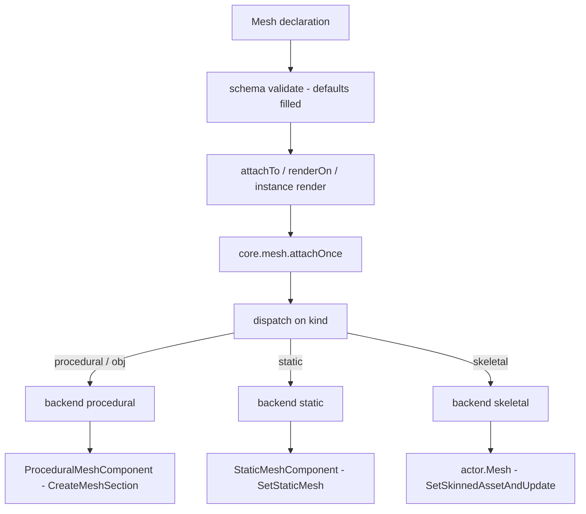
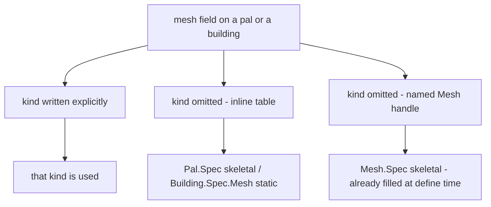

## 读完本页你可以做到

- 给帕鲁换一副身体，让原版的鸡以羊的样子走来走去
- 把你自己做的模型放到摆在世界里的建筑物上
- 给一个模型起一次名字，然后用在任意多个帕鲁和建筑物上
- 在游戏过程中改模型的颜色，也能把模型再取下来

网格就是游戏里某个东西身上穿的模型，加上它的上色方式。用 `Mesh{ ... }` 写一个，给它一个
id，你就能把同一套模型交给帕鲁、交给建筑物，或者交给眼前的任何一个 actor。

```lua title="content/meshes.lua"
local body = Mesh{
    id        = "example:chicken_body",
    kind      = "skeletal",
    model     = "/Game/Pal/Model/Character/Monster/ChickenPal/SK_ChickenPal.SK_ChickenPal",
    animClass = "/Game/Pal/Blueprint/Character/Monster/PalActorBP/ChickenPal/ABP_ChickenPal.ABP_ChickenPal_C",
}

Pal{ id = "example:Boss", mesh = body }          -- nest the defined mesh
body:attachTo(actor)                             -- or attach it yourself
```

## 定义一个网格

三个调用就够了：造一个、取回之前造的那个、把它们全列出来。

```lua
local body = Mesh{ id = "example:body", model = "/Game/.../SK_X.SK_X" }  -- define, returns a Mesh.Handle
Mesh.get("example:body")                                                 -- an existing one, by id
Mesh.get_all()                                                           -- every registered mesh, as handles
```

`Mesh{ ... }` 会检查你写的表，按 id 存起来，再把 `Mesh.Handle` 还给你 —— 这就是你用来挂载的
对象。id 会按你写的样子原样保存，所以传给 `Mesh.get` 的要是同一个字符串。用一个已经被占用的
id 再定义一次，会把前一个替换掉。

`id` 只在你直接调用 `Mesh` 时才是必须的。写在帕鲁或建筑物里面的内联网格没有需要命名的对象，
而单独定义的网格如果没有 id 就再也找不回来了。

```lua
Mesh{ model = "/Game/Pal/Model/Other/PalBox/SM_PalBox.SM_PalBox" }
```

```text
PalForge: Mesh: field "id" is required (an unnamed mesh cannot be looked up again - write it inline as mesh = { ... } instead)
```

`Mesh.get` 在那个 id 下什么都没注册时会报错。打错字会当场把你拦下来，而不是留下一个什么都
不显示的帕鲁。

```lua
local body = Mesh.get("example:no_such_mesh")
```

```text
PalForge: Mesh.get("example:no_such_mesh"): no mesh is defined under that id
```

`Mesh.Class` 是网格定义所基于的类。它只有一个方法 `source()`，返回定义本身。当你想用代码算出
一个网格，而不是把它写下来时，继承它。

## Mesh.Spec

`Mesh{ ... }` 里面能写的全部内容。大多数网格需要两个字段：`model` 说明用哪个模型，`kind` 说明
怎么把它装上去。其余的用于上色和摆放。

<TypeTable
  type={{
    id: {
      description: '注册表的键。直接调用 Mesh 时必填，写在帕鲁或建筑物里面的内联表则省略。',
      type: 'string',
    },
    kind: {
      description: '由哪个 core.mesh 后端来渲染。',
      type: '"procedural" | "static" | "skeletal" | "obj"',
      default: '"skeletal"',
    },
    model: {
      description: '模型。skeletal 和 static 后端用 /Game/... 的 USkeletalMesh 或 UStaticMesh 路径；procedural 和 obj 用 .obj 文件路径，可以是绝对路径，也可以相对于声明它的那个 .lua 文件。',
      type: 'string',
      required: true,
    },
    animClass: {
      description: 'ABP_*_C 动画蓝图路径，带不带结尾的 _C 都可以。只有 skeletal 后端会读。',
      type: 'string',
    },
    scale: {
      description: '给挂上的网格施加的等比缩放。在 skeletal 上，只有先把原始缩放记下来了才会应用。',
      type: 'number',
    },
    offset: {
      description: '用 x、y、z 三个键写的偏移。procedural 和 static 上是相对 actor 原点，skeletal 上是加到网格组件自己的相对位置上。',
      type: 'table',
    },
    texture: {
      description: '/Game/... 的 UTexture2D 路径，或者你自己的 png（绝对路径，或相对于声明它的那个 .lua 文件）。在每一个后端上都会写入实测出来的纹理参数名。',
      type: 'string',
    },
    color: {
      description: '色调，取 0..1 范围的 r、g、b、a。在每一个后端上都会写入实测出来的向量参数名，在 procedural 上还会烘焙成顶点颜色。',
      type: 'table',
    },
    material: {
      description: '用来给动态材质当父级的基础材质资源路径。每个后端都会读；procedural 必须要它，因为刚创建的网格片段自己没有材质。',
      type: 'string',
    },
    params: {
      description: '额外的材质参数，按 vector、scalar、texture 三个子表分组。每个后端都会读。',
      type: 'table',
    },
  }}
/>

同一份字段列表在运行时也能读到，不用离开游戏：

```lua
local schema = require("palforge.core.schema")
print(schema.help("Mesh.Spec"))            -- every field, type, default and meaning
print(schema.help("Building.Spec.Mesh"))   -- the same shape with kind defaulting to static
schema.get("Mesh.Spec").fields             -- the same as a table, for tooling
```

PalForge 不认识的字段名会报错，并猜一猜你想写的是哪个。这个调用要么完全成功，要么完全不做。

```lua
Mesh{ id = "example:body", modelPath = "/Game/.../SK_X.SK_X" }
```

```text
PalForge: Mesh: unknown field "modelPath" (did you mean "model"?). Valid fields: id, kind, model, animClass, scale, offset, texture, color, material, params
```

## 从你写的表到看得见的东西

从你写的表到屏幕上的模型之间会发生三件事。你的表被检查，缺的默认值被补上。有东西把它交给一个
actor —— 世界里活着的东西，比如帕鲁的身体，或者摆下的建筑物。然后 `core.mesh` 根据 `kind` 选
用哪种方式挂上去。



中间那一步由谁来做，取决于谁穿这套网格：

- **Mesh** —— 你自己调用 `meshHandle:attachTo(actor)`。
- **Pal** —— 写好的 `mesh` 会在 `pal.spawned` 频道上替你挂好，而且在这份定义自己的 `onSpawned`
  之前。`pal:renderOn(actor)` 是手动路线，给不是从那条频道来的 pawn 用。
- **Building** —— 写好的 `mesh` 同样替你挂。建筑物扫描会找到你摆下的建筑物并调用它的
  `render()`，而且是特意在 actor 首次出现之后的那一次扫描才调用，因为挂到一个还在启动中的
  actor 上会让游戏崩溃。这个延后的调用之所以真的能到达建筑物，是因为扫描把每个 actor 的记录按
  actor 的 `GetFullName()` 存放；如果按每次查找都会新造一个的 UE4SS 句柄来存，那个“待渲染”的
  标记只会被立起来一次，之后再也读不到。

每条路线最后都进入 `core.mesh.attachOnce`，actor 或 spec 缺失时它返回 `false` 加一句英文原因。
一个开关就能把所有运行时网格全部关掉：

```lua
require("palforge.core.mesh").ENABLED = false   -- stop attaching runtime meshes entirely
```

<Callout type="info">
网格这一层里每一份按 actor 存放的记录，都是按 actor 自己的 `GetFullName()` 归档的，而不是按你
拿到的那个 Lua 值。UE4SS 每次查找都会新造一个 userdata 包装，所以指向同一个 actor 的两个引用
并不是同一个 Lua 值 —— 而按包装值做键的表，只能用写它进去的那个值读回来。`detach`、`setColor`、
防重叠的那道门，以及 skeletal 的还原记录，全都依赖于能从后来的 `ctx.actor` 或后来的
`FindAllOf` 里找到那条记录，而真实的调用点全都是这种情况。

每个后端记住的是自己装扮过哪个 **actor**，而不是用了哪个网格。往一个已经穿着同类网格的 actor
上再挂一个同 kind 的网格，什么都不会发生，而且仍然返回 `true`。每个后端各记一份自己的列表，
所以一个 actor 可以同时穿着 procedural 和 static 的网格 —— 但 `core.mesh` 只记得最后给它装扮的
那个后端，`setColor` 和 `detach` 也只能作用到那一个。`core.mesh.attach`（不是 `attachOnce`）会
先把另一个后端做的活撤掉，所以两者不会为同一个 actor 打架。
</Callout>

## 四种 kind，三个后端

`kind` 决定模型怎么装到 actor 上。`obj` 是 `procedural` 的另一个名字 —— 两个名字跑的是同一段
代码。

| kind | 状态 | 做什么 |
| --- | --- | --- |
| `procedural` | 已实现 | 解析磁盘上的 Wavefront OBJ，构建一个 `ProceduralMeshComponent` |
| `obj` | 已实现 | `procedural` 的别名 |
| `skeletal` | 已实现 | 替换 pawn 的 `USkeletalMesh`，需要时连动画蓝图一起换 |
| `static` | 已实现 | 添加一个 `UStaticMeshComponent`，把 `UStaticMesh` 资源挂在上面 |

### procedural 和 obj

要放自己做的模型就用这个。`model` 是磁盘上某个 `.obj` 文件的路径，用 `io.open` 读取并按路径
记住。这份缓存最多保留八个解析好的模型，并淘汰最久未使用的那个，所以一个不断生成路径的 pack
也不会让它无限增长。

超过三个角的面会被拆成三角形。正反两面都会写出来，所以不管面朝哪边，模型都看得见。纹理坐标
是尽力而为：同一个位置上第一个出现的 `vt` 胜出。

组件用 `AddComponentByClass` 添加，用 `CreateMeshSection` 填内容，然后用 `SetWorldScale3D`
缩放、用 `K2_SetRelativeLocation` 摆放。它不会和任何东西碰撞。一个带碰撞的装饰模型既会拖慢
游戏，又会抢走建造菜单摆放建筑物时用的射线检测。

```lua
local marker = Mesh{
    id     = "example:marker",
    kind   = "obj",
    model  = "art/marker.obj",       -- relative to the .lua file that declares it
    scale  = 2.0,
    offset = { x = 0, y = 0, z = 120 },
    color  = { 1.0, 0.4, 0.1, 1.0 },
}
```

你声明的 `color` 还会作为逐顶点颜色烘焙进模型，所以即使材质参数没生效，色调也可能看得到。
默认就要一个基础材质的只有这个后端，因为它刚创建出来的网格片段身上没有任何可以拿来实例化的
材质。

### skeletal

要做生物就用这个。每一步都只有一条路线，因为出货二进制自己的类清单只留下了一条。

pawn 的身体组件是 `ACharacter` 上那个被反射出来的 `Mesh` UProperty，`APalCharacter` 继承了它，
读法就是 `actor.Mesh`。`ACharacter`、`APalCharacter`，以及那份 1579 个头文件的 dump 里的任何
地方，都没有声明过名为 `GetMesh()` 的 UFunction，所以根本没有可以退回去的 getter。

PalForge 会清掉帕鲁那边的 `SetDisableChangeMesh` 保护，再用
`SetSkinnedAssetAndUpdate(asset, true)` 换掉模型。`SetSkeletalMeshAsset` 同样有声明，而且
`UPalSkeletalMeshComponent` 两个都继承，所以它从来就不可能是谁的退路：只有前一个能跑，它才能
跑。于是这个选择完全由行为决定 —— `SetSkinnedAssetAndUpdate` 会重建渲染状态并重新初始化姿势，
这正是跨骨架替换能被画出来的原因，而另一个没有的第二个参数 `bReinitPose` 就是选它的全部理由。

资源由 `core.mesh.assets` 解析：先加载包，再到包里去查那个对象，并在任何东西被 marshal 之前
按 `SkinnedAsset` 做一次**类检查**。这个检查不是走过场：`UStaticMesh` 不是 `USkinnedAsset`，
两者是兄弟类，而参数类型不对的调用会在 UE4SS 的 marshalling 内部炸掉，`pcall` 看不见。写错
`kind` 因此会变成一句英文错误加一个 `false`。

`attach` 会用和 setter 配套的 getter `GetSkinnedAsset()` 把资源读回来，只有读回来的结果和设置
进去的一致才返回 `true`。读不回来的组件属于“说不清”，这时“setter 跑了”就是上限。

<Callout type="warn">
没有任何一次运行看到帕鲁的外形真的变了。`true` 表示在活的类上找到了这个 setter、调用跑了、
组件把设置进去的资源读了回来 —— 而不是屏幕上出现了别的东西。换了看不到时，加上 `animClass`，
并读 `skeletal:` 那行日志：它写的是真正落地的那个对象的类名，而不是把你写的路径复述一遍。
</Callout>

`animClass` 是可选的。给了它，PalForge 会把组件切到动画蓝图模式并绑定这个类，新骨骼才真的会
动。没有任何东西驱动的蒙皮模型可能会从视野里消失。生成类并不是蓝图包自己的那个资源对象，所以
解析它要两步，而且两步不能互相顶替：被**加载**的是资源路径 `ABP_X.ABP_X`，随后被**查找**的是
对象路径 `ABP_X.ABP_X_C`。两种写法都接受。还没有人从路径上解析出过一个 —— 实测到的只有路径的
形状，是从活着的 pawn 身上读到的 —— 所以 `animClass` 失败只是一句警告，替换本身仍然算数。

```lua
local sheep = Mesh{
    id        = "example:sheep_body",
    kind      = "skeletal",
    model     = "/Game/Pal/Model/Character/Monster/SheepBall/SK_SheepBall.SK_SheepBall",
    animClass = "/Game/Pal/Blueprint/Character/Monster/PalActorBP/SheepBall/ABP_SheepBall.ABP_SheepBall_C",
}
```

在只由一个网格组成的生物上，这条路走得很干净。由多个网格组成的 pawn —— 玩家是身体加服装
—— 只有基础组件会被换掉。

`kind` 默认是 `skeletal`，所以不写 `kind` 直接写一个 `SM_` 模型，等于把一个静态网格声明成了
skeletal。这一点会被抓两次：一次在没有世界的定义期，由一条读文件名前缀的警告抓；一次在挂载
时，由上面那道类检查抓。它是警告而不是错误，因为 `SM_` / `SK_` 前缀是 PalForge 实测过的范围内
这个版本处处遵守的约定，而约定不是保证。

```text
[PalForge.mesh][warn] Mesh example:crate declares kind = "skeletal" but its model is named "SM_ChestWood.SM_ChestWood" - the SM_ prefix is this build's convention for a static mesh. A UStaticMesh and a USkeletalMesh are sibling classes, not relatives, so the wrong one will be refused by the class check at attach time and nothing will render. Did you mean kind = "static"?
```

### static

要把游戏自带的模型放到建筑物上，就用这个。`model` 是这个资源的对象路径。`core.mesh.assets`
先加载包，再到包里去查那个对象 —— 这是两步，不是一条退路链，因为 `LoadAsset` 并非在每个版本上
都会把对象返回来，而 `StaticFindObject` 从不加载任何东西。成功会按解析用的那个字符串原样缓存，
失败不缓存，因为失败通常是“那个包还没有流式加载进来”。结果在到达 setter 之前会按 `StaticMesh`
做类检查，然后挂到 PalForge 在游戏运行时创建的 `UStaticMeshComponent` 上。

步骤是 `AddComponentByClass`，然后 `SetStaticMesh`，然后 `SetWorldScale3D` 和
`K2_SetRelativeLocation`。缩放那步不能省：传给 `AddComponentByClass` 的空 transform 会让组件
从零缩放开始，所以没人缩放的组件是看不见的。这里关掉碰撞的理由和 procedural 一样。

```lua
local palbox = Mesh{
    id     = "example:palbox_body",
    kind   = "static",
    model  = "/Game/Pal/Model/Other/PalBox/SM_PalBox.SM_PalBox",
    scale  = 1.0,
    offset = { x = 0, y = 0, z = 0 },
}

Building{
    id     = "PalBoxV2",
    name   = "Pal Box",
    gridCm = 100,
    mesh   = palbox,
}
```

`scale` 和 `offset` 的读法和 procedural 后端完全一样，上色的那几个字段也一样会读。做好的
`UStaticMesh` 送来时插槽上就带着真正的材质，所以这个组件不需要基础材质，可以直接实例化 —— 这
也正是一座建筑物之后能用 `setColor` 或建筑物的 `update()` 重新上色的原因。动态材质是惰性创建
的：没写任何材质字段的挂载不会动网格自带的样子。

<Callout type="warn">
没有任何一次运行看到 `UStaticMesh` 这样出现在组件上，所以 `attach` 不相信这个调用。
`bool SetStaticMesh(UStaticMesh*)` 声明在 `UStaticMeshComponent` 上，而同一份类清单也从反方向
定下了读回来的办法：整份 dump 里**没有**被反射出来的 `GetStaticMesh`。能够到那个资源的只有
`StaticMesh` 这个 UProperty，dumps/reflection 从活着的 actor 上读的也是它，所以 `attach` 读的
就是这一个属性，只有模型确实在那里才报告成功。任何一步失败时，它都会把自己加的组件再销毁掉，
于是你得到 `false` 加一句原因，也不会留下多余的组件，而不是在模型没渲染出来时谎称成功。
</Callout>

## 一个 pack 能带什么进来

主角是指向游戏已经有的资源。一个烘焙好的 `/Game/...` 资源就在 pak 里：不用导入、不用解析、
玩家也不需要装任何文件 —— 而且它的材质和纹理都跟着一起来，因为烘焙过的资源自己带着材质插槽，
那些插槽又自己带着纹理。

这一点之所以重要，是因为除此之外的那些答案，都比看上去要窄：

| 你想带进来的东西 | pack 能不能带 | 现有的路线 |
| --- | --- | --- |
| static 或 skeletal 网格 | **不能** | 必须是原版的 `/Game/...` 路径；从 Lua 往游戏里塞一个新的 `UStaticMesh` 或 `USkeletalMesh` 的路线并不存在 |
| procedural 模型 | **可以** | 磁盘上的 Wavefront `.obj`，运行时解析 —— 这是一个 pack 真正能带得动的唯一资源路线 |
| 纹理 | **未验证** | `ImportFileAsTexture2D` 已经按出货二进制里读到的签名接好了线，而这棵树里没有任何一次运行调用过它。`/Game/...` 的纹理今天就能用 |
| 材质 | **只能当父级** | `material` 指的是一个**已经加载好**的 `UMaterialInterface`，用来给动态实例当父级。这里既不创建也不导入材质 |
| 音频文件 | **不能** | `Audio.Spec.soundFile` 在定义时就是硬错误，见 [Audio](/docs/api/audio) |

### Mesh.assets

`Mesh.assets` 是在这个版本上实测出来的路径目录，外加它背后的解析器。表里每一项都在这个版本上
被观测到过 —— 要么出现在一次活的已加载对象扫描里，要么是直接从活着的 actor 自己的组件上读到的。

```lua
Mesh.assets.SM.ChestWood             -- UStaticMesh paths                 (kind = "static")
Mesh.assets.SK.PinkCat               -- USkeletalMesh paths               (kind = "skeletal")
Mesh.assets.ABP.PinkCat              -- AnimBlueprintGeneratedClass paths (animClass)
Mesh.assets.T.HelicopterBase         -- UTexture2D paths                  (texture, params.texture)
Mesh.assets.MI.PlayerOutfitOldCloth  -- material instance paths           (material)

Mesh.assets.palMesh("ChickenPal")    -- the conventional SK_ path for a monster folder name
Mesh.assets.palAnim("ChickenPal")    -- the conventional ABP _C path for the same
Mesh.assets.load(path, { class = "StaticMesh" })   -- resolve one yourself -> obj, or nil + why
Mesh.assets.probe(print)             -- try them all and report; loads packages, writes nothing
```

那两个构造函数是更弱的主张，而且它们自己也这么说。`palMesh` 返回的是一个“形状”，活扫描里的
五个怪物条目全都落在这个形状上；但一只帕鲁可以在同一个文件夹下拥有别的网格，那些名字它猜不出
来，所以请把结果当成一个待解析确认的候选，而不是事实。`palAnim` 背后的实测样本正好只有一个。

于是一个网格就可以只用实测路径，指定一个游戏模型和游戏自己的一整套贴图，玩家磁盘上什么都不用
放：

```lua
local heli = Mesh{
    id     = "example:heli",
    model  = Mesh.assets.SK.AttackHelicopter,
    params = {
        texture = {
            ["Base Texture"] = Mesh.assets.T.HelicopterBase,
            ["Normal Map"]   = Mesh.assets.T.HelicopterNormal,
        },
    },
}
```

### 相对于你 pack 的路径

`model` 和 `texture` 接受相对于声明这个网格的那个 `.lua` 文件的路径，并在定义时按那个文件自己
所在的目录解析。绝对路径原样不动，每一个 `/Game/...` 对象路径也原样不动 —— 它以 `/` 开头，而
这正是把它算作绝对路径的原因。

```lua
-- <pack>/content/meshes.lua, with the model at <pack>/content/art/marker.obj
Mesh{ id = "example:marker", kind = "obj", model = "art/marker.obj" }
```

调用方的文件是靠往 PalForge 自己那棵树的外面走找到的，所以不管声明是在哪一层栈上到达的都能
正常工作：`Mesh{ ... }` 和 `Pal{ mesh = { ... } }` 的栈深度并不一样，写死一个数字必然会有一边
是错的。从字符串 chunk、从 C、或者从 PalForge 自己的测试套件里做出的声明没有 pack 目录，这时
路径会**原样**返回，而不是拼到一个猜出来的目录上 —— 一个仍然是相对路径的字符串会在 `io.open`
那里带着你写的原文失败，那是读得懂的失败。

这套解析只对 `Mesh.Spec` 生效。帕鲁或建筑物自己的 `texture` 简写，以及它们 `material` 表里的
`texture`，都是按你写的样子送到渲染器的。

### 在到处找之前，先检查你写了什么

`Mesh.validateDeclared()` 会解析每一个**已注册**网格声明的每一个资源，并作为一整块报告出来。
`core/event` 在发出 `world.ready` 之后立刻跑一次；它只加载包，不往任何 actor、组件或存档里写，
所以随时手动再跑一次都是安全的。写在 `Pal{ }` 或 `Building{ }` 里面的内联网格不在注册表里，
因此不在覆盖范围内。

```lua
require("palforge.core.mesh").validateDeclared()
```

```text
MESHVALIDATE 2 declared mesh(es)
MESHVALIDATE OK   example:marker.model -> readable OBJ file
MESHVALIDATE MISS example:boss.model -> /Game/Pal/Model/.../SK_Nope.SK_Nope did not resolve: LoadAsset ran and StaticFindObject found nothing under that name, and its package is not in memory either.
MESHVALIDATE 2 asset reference(s) checked, 1 resolved, 1 did not
```

这就是“我的 boss 看不见”的答案：它把一个写错的 `model` 从悄无声息什么都不画，变成一行写明
id、字段名和这条路径解析成了什么的日志。

## kind 的默认值跟着穿的人走

建筑物穿的是 static 模型，帕鲁穿的是 skeletal 模型，所以 `kind` 的默认值取决于谁来穿。两边的
字段是一样的。写在建筑物里面的网格按 `Building.Spec.Mesh` 检查，它就是把 `kind` 默认值改成
`"static"` 的 `Mesh.Spec`：

```lua title="Scripts/palforge/api/building.lua"
local Mesh = schema.derive("Building.Spec.Mesh", schema.get("Mesh.Spec"), {
    kind   = { default = "static" },
    model  = { doc = "UStaticMesh asset path, or an OBJ path for the procedural backend" },
    offset = { doc = "{ x, y, z } offset from the actor's origin" },
})
```

写在帕鲁里面的网格按 `Mesh.Spec` 本身检查，所以保持 `skeletal` 这个默认值。

默认值只会填你没写的字段。由此得到一个值得记住的结果：



`Mesh{ ... }` 在你定义它的时候就按 `Mesh.Spec` 检查过了，所以拿回来的句柄已经带着一个实实在
在的 `kind = "skeletal"`。把这个句柄放进建筑物不会让它变成 static：字段已经在那里了，建筑物的
默认值就永远不会触发。

```lua
local shared = Mesh{ id = "example:shared", model = "art/box.obj" }
shared:kind()                                    -- "skeletal", filled by the default

Building{ id = "example:Bench", mesh = shared }  -- still skeletal, not static

Building{                                        -- inline: the static default applies
    id   = "example:Bench2",
    mesh = { model = "/Game/Pal/Model/Other/PalBox/SM_PalBox.SM_PalBox" },
}
```

<Callout type="warn">
任何你打算在帕鲁和建筑物之间共用的网格，都请显式写上 `kind`。这是唯一一种在两个地方含义相同
的写法。
</Callout>

## 嵌套：内联、命名，或按 id 共用

把网格交给帕鲁或建筑物有三种方式，三种最后都到同一个地方。当你把句柄传进另一个定义时，
PalForge 会再检查一遍并留一份副本，所以帕鲁或建筑物拿着的是它自己的表。

<Tabs items={['Inline', 'Named', 'By id']}>
<Tab value="Inline">

在用到的地方直接把表写出来。没有 id，不注册，也不能复用。

```lua
Pal{
    id   = "ChickenPal",
    name = "Chicken Pal",
    mesh = {
        kind      = "skeletal",
        model     = "/Game/Pal/Model/Character/Monster/ChickenPal/SK_ChickenPal.SK_ChickenPal",
        animClass = "/Game/Pal/Blueprint/Character/Monster/PalActorBP/ChickenPal/ABP_ChickenPal.ABP_ChickenPal_C",
    },
}
```

</Tab>
<Tab value="Named">

定义一次，传句柄。你手里还留着一个可以自己拿去挂载的句柄。

```lua
local chicken = Mesh{
    id        = "example:chicken_body",
    kind      = "skeletal",
    model     = "/Game/Pal/Model/Character/Monster/ChickenPal/SK_ChickenPal.SK_ChickenPal",
    animClass = "/Game/Pal/Blueprint/Character/Monster/PalActorBP/ChickenPal/ABP_ChickenPal.ABP_ChickenPal_C",
}

Pal{ id = "ChickenPal", mesh = chicken }
```

</Tab>
<Tab value="By id">

跨文件的时候，按 id 把注册过的网格查出来。`Mesh.get` 在什么都没注册时会报错，所以打错字会
大声失败，而不是什么都不渲染。

```lua title="content/pals.lua"
Pal{ id = "SheepBall",  mesh = Mesh.get("example:chicken_body") }
Pal{ id = "ChickenPal", mesh = Mesh.get("example:chicken_body") }
```

</Tab>
</Tabs>

## 材质：texture、color、material、params

有四个字段描述模型怎么上色，而且每一个后端都会读这四个。做这件事用的是
`UPrimitiveComponent` 和 `UMaterialInstanceDynamic` 的 API —— 每一个网格组件都有 —— 所以它放在
一层共享的代码里，而不是塞在某一个后端里。

- `texture` —— 一个 `/Game/...` 纹理资源，或者你自己的 png。走哪条路由字符串的形状决定：对象
  路径以 `/` 开头，别的都不会，所以任何一个字符串都只可能命中其中一条，另一条根本不会去试。
  两条路线都会按解析用的那个字符串原样缓存成功结果；这在磁盘那条路上最要紧，因为它在**每一次**
  挂载时都会走到 —— 没有缓存的话，`Pal{ mesh = { texture = ".../body.png" } }` 会在每只帕鲁生成
  时都导入一个新的 `UTexture2D`，既没有东西追踪它，也没有东西销毁它。
- `color` —— 0..1 范围的 `{ r, g, b, a }` 或 `{ [1], [2], [3], [4] }` 色调，写入颜色和自发光的
  参数名，在 procedural 上还会作为顶点颜色烘焙进模型。
- `material` —— 用来给动态实例当父级的那个材质的资源路径。
- `params` —— 按接收它的 setter 分好组、原样写下去的额外参数。

```lua
local painted = Mesh{
    id       = "example:painted",
    kind     = "procedural",
    model    = "art/marker.obj",
    texture  = "art/marker.png",
    color    = { r = 0.2, g = 0.8, b = 1.0, a = 1.0 },
    material = Mesh.assets.MI.PlayerOutfitOldCloth,
    params   = {
        vector  = { ["Subsurface Color"] = { 1, 0, 0, 1 } },
        scalar  = { ["Roughness Add"] = 0.4 },
        texture = { ["Normal Map"] = Mesh.assets.T.HelicopterNormal },
    },
}
```

### 这些参数名，以及它们是怎么来的

头文件 dump 永远回答不了这个问题：它记录的是类声明，而一个材质暴露了哪些参数，是躺在
`.uasset` 里的数据。所以这些名字是**从运行中的游戏里读出来的**：沿着玩家 `CharacterMesh0` 上
每一个动态材质实例，一路走到它派生自的那个 `MaterialInstanceConstant`。那次读取原样返回的是：

| 种类 | 带着的名字 |
| --- | --- |
| vector | `BaseColor`、`Subsurface Color` |
| texture | `Base Texture`、`MetallicRoughnessOcclusionSpecularTexture`、`Normal Map`、`Subsurface Texture` |
| scalar | `Character CameraFade Distance`、`Occlusion Add`、`Roughness Add`、`Light Affect Subsurface Max`、`RefractionDepthBias` |

大多是**带空格的 Title Case**，这是所有猜测里都没有的写法 —— 唯一的例外是 `BaseColor`，它本来
就在颜色候选里，所以上色一直是有真机会的，而纹理那边的写入则一次机会都没有。

一个写好的 `color` 会写到 `BaseColor`、`Subsurface Color`，再写到五个更老的猜测，外加三个上面
那次读取里根本没出现的自发光猜测名。一个写好的 `texture` 会写到 `Base Texture`、
`Subsurface Texture`、`Normal Map`，再写到五个猜测。往材质没有的名字上写是悄无声息的空操作，
所以两边都试并不吃亏 —— 但两份列表里都**没有**的
`MetallicRoughnessOcclusionSpecularTexture` 和所有 scalar，只有你自己在 `params` 里点名才能到。

你也可以自己去读这些名字，什么都不写：
`require("palforge.core.mesh").describeMaterials(actor, print)`。它会一并走过子网格组件，并沿着
每个材质的 `Parent` 链往上找 —— 一个动态实例只列出**在它身上**被覆盖过的东西，所以 MID 上的
“vector: (none)”并不能说明它来自的那个材质是什么样。

<Callout type="warn">
没有人看到颜色真的变过。这些写入是完全照着声明来调用的，所以“写入没跑”已经被排除；上面那些
名字也是实测而不是猜测 —— 但色调落到屏幕上是第三个观测，而它还没有被做出来。记录它的正是
`pf_hook mesh-color-change`。
</Callout>

<Callout type="warn">
procedural 的网格片段身上一个材质都没有，所以必须挂到一个已经加载好的材质上当父级，而 PalForge
并不自带材质。排在最前的候选是**玩家自己那套服装的材质实例**，是从
`BP_Player_Female_C.CharacterMesh0` 上活读到的：一个正在渲染的材质，凭这一点就一定是烘焙过且
可加载的 —— 在资源路径本来只可能是猜测的情况下，这正是让这个问题变得可答的地方。而且它带着
上色需要的 `BaseColor` 向量参数。

把一个角色着色器挂到 procedural 的立方体上确实很怪，这里就明说，不藏着：一个看着不对但能用的
材质还可以再改，一个加载不了的材质则根本没法用。`BasicShapeMaterial` 和另外四个 `/Engine/`
路径排在它后面，那几个是对出货版本会保持加载什么的猜测。

查找用的是 `StaticFindObject`，它只能找到**已经加载**的东西，所以即使是你明确写出的
`material`，也得先被加载才找得到。一个都没找到时就不会创建动态材质，`color`、`texture` 和
`params` 都会悄悄不起作用，网格本身仍然会挂上去，没找到这件事写进日志。失败不会被缓存，所以
下一次挂载会重试；而 `require("palforge.core.mesh").probeMaterials()` 会把当前哪些候选已经加载
写进日志。
</Callout>

### 穿的人写的覆盖怎么起作用

帕鲁和建筑物各自有自己的 `material` 表，外加 `color` 和 `texture` 两个简写。当 `renderOn` 或者
建筑物的 `render()` 把网格交出去时，它从网格自己的字段开始，再让定义里的材质表逐个字段覆盖
它们。

```lua
Pal{
    id    = "example:Boss",
    mesh  = { kind = "procedural", model = "art/boss.obj",
              color = { 1, 1, 1, 1 } },
    color = { 1, 0, 0, 1 },              -- shorthand: wins over the mesh color
}
```

代码应用它们的顺序是：

1. 网格自己的 `texture`、`color`、`material` 和 `params`。
2. 如果定义声明了 `material` 表，其中**设置了的**每个字段都会覆盖网格的值；它没写的字段保留
   网格的值。
3. 否则，顶层的 `color` 和 `texture` 简写成为那份覆盖。

<Callout type="warn">
第 2 步和第 3 步互斥。声明了 `material = { ... }` 的定义会完全忽略它自己顶层的 `color` 和
`texture` —— 只有在没有 `material` 表时才会读这两个简写。把要写的都放在一个地方：

```lua
Pal{
    id       = "example:Boss",
    mesh     = { kind = "procedural", model = "art/boss.obj" },
    material = { color = { 1, 0, 0, 1 }, texture = "C:/mods/example/boss.png" },
}
```

这里网格的 `model` 是 pack 相对路径，会被解析；帕鲁的 `material.texture` 不会，所以它写成了
绝对路径。
</Callout>

`Mesh.Handle:attachTo` 会跳过这一整套。它挂的是网格自己的声明，所以帕鲁或建筑物的材质覆盖对它
不起作用。

## Mesh.Handle

`Mesh{ ... }`、`Mesh.get` 和 `Mesh.get_all` 都会给你一个 `Mesh.Handle`。它带着三个动作 ——
穿上网格、重新上色、脱下来 —— 外加三个关于它代表什么的问题。

### attachTo

```lua
---@param actor any
---@return boolean ok, string? reason
meshHandle:attachTo(actor)
```

把这个网格挂到一个活着的 actor 上，只挂一次。actor 是 nil 或者已经没了时立刻返回 `false`，
否则把 `source()` 交给 `core.mesh.attachOnce`，并原样返回后端报告的结果。

失败会带着后端写出的**那句英文**一起返回 —— “… is a StaticMesh, not a SkinnedAsset”、
“that path did not resolve and its package is not in memory either” —— 于是路径写错、`kind`
写错、以及 actor 根本不是角色，这三件事不用去翻 `UE4SS.log` 就能分清。`true` 这一侧没有变化，
所以 `if m:attachTo(a) then` 照旧。

```lua
Pal{
    id     = "ChickenPal",
    events = {
        onSpawned = function(pal, ctx)
            Mesh.get("example:chicken_body"):attachTo(ctx.actor)
        end,
    },
}
```

<Callout type="warn">
`Pal.Handle:renderOn` 传过去的是 `kind`、`model`、`animClass`、`scale`、`offset` 和四个上色
字段。`Building.Instance:render()` 传同一份列表，但**不含** `animClass`。一个建筑物如果穿的是
需要动画蓝图的 skeletal 网格，就得用 `meshHandle:attachTo(self.actor)` 来挂，这个方法会把整份
声明传过去。
</Callout>

### setColor

```lua
---@param actor any
---@param color table  # { r, g, b, a } in 0..1
---@return boolean ok, string? reason
meshHandle:setColor(actor, color)
```

给已经在 actor 身上的网格重新上色。一次成功的挂载会记下是哪个后端装扮了那个 actor，重新上色
就跟着这条记录走；这个网格自己的 `kind` 只作为提示传进去，仅在这个 actor 从来没有经过
PalForge 装扮时才用得上。

**每一个后端都能重新上色**，skeletal 也包括在内。后端只需要说出自己装扮的是哪个组件，共享的
那一层就会当场把动态材质造出来 —— 所以一个 `color`、`texture`、`material`、`params` 一个都没写
就挂上去的网格，之后照样能上色。actor 已经没了、颜色不是一个表、PalForge 没有装扮过这个 actor
的记录、以及后端既够不到也造不出材质实例时，它返回 `false` 加一句原因。`false` 绝不会是装出来
的上色。

<Callout type="info">
`setColor` 跟着 **actor** 走，而不是跟着这个网格 —— 任何网格句柄都会给那个 actor 身上带着的
材质重新上色。

它没法告诉你的是这个色调看不看得见。它写入的参数名是实测出来的那些，而往材质没有的名字上写是
悄无声息的空操作，所以 `true` 表示一次写入在一个真实的动态材质实例上执行了，到此为止。
</Callout>

### detach

```lua
---@param actor any
---@return boolean ok, string? reason
meshHandle:detach(actor)
```

把一次挂载放到 `actor` 上的东西取下来，让它能重新被装扮。它跟着和 `setColor` 一样的记录走：
`core.mesh` 请求装扮了这个 actor 的后端，把自己做的活撤掉。

具体做什么取决于后端。procedural 和 static 会用 `K2_DestroyComponent` 销毁自己创建的组件，并把
组件和那条按 actor 只记一次的记录都忘掉。skeletal 没有属于自己的组件 —— 它装扮的是 pawn
**自己**的身体 —— 所以它的撤销是一次还原：替换之前记下的资源、相对缩放、相对位置和材质接口
都会放回去。这份记录只在第一次挂载时做一次，而它之所以靠得住，是因为记录按 actor 的名字存放；
要是按句柄去找，第二次挂载记下的“原始”就会是 PalForge 刚刚装上去的那个网格，之后的 detach
会把那个“还原”回去。

```lua
Pal{
    id     = "ChickenPal",
    events = {
        onSpawned = function(pal, ctx)
            Mesh.get("example:marker"):attachTo(ctx.actor)
        end,
        onDeath = function(pal, ctx)
            Mesh.get("example:marker"):detach(ctx.actor)
        end,
    },
}
```

<Callout type="warn">
`detach` 跟着 **actor** 走，所以任何句柄都会移除 PalForge 最后挂在那里的东西。它在三种含义不同
的情况下返回 `false`：PalForge 从来没有装扮过这个 actor；撤销没有执行（`K2_DestroyComponent`
没跑起来，或者 skeletal 的还原没有可放回去的资源——因为挂载时组件读不出自己穿的是什么）；
或者 actor 不是一个活着的 UObject。第二种情况下记录是故意留着的，因为改动还在 actor 上，而挡住
第二次叠上去的就只有这条记录。

没有任何一次运行看到组件真的消失。`K2_DestroyComponent(UObject*)` 声明的是一个 ObjectProperty
参数，实际发出的也正是这个调用 —— 所以那种会让 `detach` 悄悄什么都不做却返回 `true` 的参数个数
不匹配已经被排除了 —— 但在有人真的数一遍前后的组件数量之前，“调用返回了、没有抛异常”就是老实
的上限。
</Callout>

### source、model、kind

```lua
meshHandle:source()   -- the lowered spec core.mesh will render (the definition itself)
meshHandle:model()    -- the declared model path
meshHandle:kind()     -- the backend name, "skeletal" when the definition carries none
```

`source()` 返回的是定义本身，不是副本。把句柄放进另一个定义会再检查并复制一次，所以帕鲁或
建筑物拿着的是它自己的表。

## 实用示例

### 给原版帕鲁换皮，动画一起换

```lua title="content/reskin.lua"
local body = Mesh{
    id        = "example:chicken_body",
    kind      = "skeletal",
    model     = "/Game/Pal/Model/Character/Monster/SheepBall/SK_SheepBall.SK_SheepBall",
    animClass = "/Game/Pal/Blueprint/Character/Monster/PalActorBP/SheepBall/ABP_SheepBall.ABP_SheepBall_C",
}

local chicken = Pal{
    id          = "ChickenPal",
    name        = "Chicken Pal",
    description = "a chicken wearing a sheep",
    events      = {
        onSpawned = function(pal, ctx)
            body:attachTo(ctx.actor)          -- attachTo, so animClass survives the lowering
        end,
    },
}

chicken:spawn(Player.coordinate())   -- the pal arrives a few seconds later
```

### 一个 procedural 网格给两个帕鲁共用

```lua title="content/markers.lua"
local marker = Mesh{
    id     = "example:marker",
    kind   = "procedural",
    model  = "art/marker.obj",
    scale  = 1.5,
    offset = { x = 0, y = 0, z = 150 },
    color  = { 0.1, 0.9, 0.4, 1.0 },
}

local function markOnSpawn(pal, ctx)
    marker:attachTo(ctx.actor)
end

Pal{ id = "ChickenPal", mesh = marker, events = { onSpawned = markOnSpawn } }
Pal{ id = "SheepBall",  mesh = marker, events = { onSpawned = markOnSpawn } }

-- somewhere else in the pack, by id
Pal{ id = "example:Third", mesh = Mesh.get("example:marker") }
```

### 一个用一次就换颜色的建筑物

你摆下建筑物之后的某次扫描里，PalForge 会替你把网格挂上去。重新上色写入的那个动态材质，是
procedural 后端每次挂载都会创建的，不管有没有声明颜色，所以你声明的颜色只是起始色调。

```lua title="content/bench.lua"
local glow = Mesh{
    id     = "example:bench_glow",
    kind   = "procedural",
    model  = "art/bench.obj",
    scale  = 1.0,
    offset = { x = 0, y = 0, z = 60 },
    color  = { 0.3, 0.3, 0.3, 1.0 },       -- the starting tint
}

Building{
    id     = "WorkBench",
    name   = "Workbench",
    gridCm = 100,
    mesh   = glow,
    state  = { uses = 0 },
    events = {
        onPlace = function(self, ctx)
            self.state.uses = 0
            self:save()
        end,
        onRightClick = function(self, ctx)
            self.state.uses = self.state.uses + 1
            self:save()
            local hot = math.min(self.state.uses / 10, 1.0)
            glow:setColor(self.actor, { hot, 1.0 - hot, 0.2, 1.0 })
        end,
    },
}
```

### 在建筑物活着的时候换掉它的 static 网格

`detach` 会把 actor 腾出来，让第二次 `attachTo` 能重新装扮它。下面两个网格是同一个
`UStaticMesh`，只是缩放和偏移不同，所以建筑物在被使用时会明显抬起来。

```lua title="content/bench_lift.lua"
local BENCH = Mesh.assets.SM.WorkBench   -- the measured /Game/... path for SM_WorkBenchPrimitive

local resting = Mesh{
    id     = "example:bench_resting",
    kind   = "static",
    model  = BENCH,
    scale  = 1.0,
    offset = { x = 0, y = 0, z = 0 },
}

local raised = Mesh{
    id     = "example:bench_raised",
    kind   = "static",
    model  = BENCH,
    scale  = 1.1,
    offset = { x = 0, y = 0, z = 40 },
}

Building{
    id     = "WorkBench",
    name   = "Workbench",
    gridCm = 100,
    mesh   = resting,
    state  = { lifted = false },
    events = {
        onRightClick = function(self, ctx)
            self.state.lifted = not self.state.lifted
            self:save()
            local want = self.state.lifted and raised or resting
            -- detach dispatches on the actor, so any handle takes off what is on it
            if resting:detach(self.actor) then want:attachTo(self.actor) end
        end,
    },
}
```

只有在 `detach` 报告 `true` 之后才挂载，才不会把第二个组件叠上去：这里返回 `false` 意味着旧的
那个还在 actor 身上。

### 明确指定基础材质来上色

```lua title="content/painted.lua"
local painted = Mesh{
    id       = "example:painted",
    kind     = "obj",
    model    = "art/crate.obj",
    material = Mesh.assets.MI.PlayerOutfitOldCloth,   -- read live off the player; it carries BaseColor
    texture  = "art/crate.png",
    params   = {
        vector = { ["Subsurface Color"] = { 0.0, 0.6, 1.0, 1.0 } },
        scalar = { ["Occlusion Add"] = 0.0 },
    },
}

Building{
    id     = "PalBoxV2",
    name   = "Pal Box",
    gridCm = 100,
    mesh   = painted,
}
```

如果看不到任何色调，先读日志里的材质状态行，再去改声明：那次挂载会写明它找到了哪个基础材质、
纹理有没有导入成功，以及纹理坐标和顶点颜色在不在。

## 错误

下面每条失败都以 `PalForge: ` 开头，并写明领域。前四条发生在你定义网格的时候；最后一条发生在
`Mesh.get` 什么都找不到的时候。

```text
PalForge: Mesh: field "model" is required (a /Game/... USkeletalMesh or UStaticMesh path (see Mesh.assets); for procedural / obj, an .obj file path - absolute, or relative to the .lua file that declares it)
PalForge: Mesh: field "kind" must be one of { "procedural", "static", "skeletal", "obj" }, got "skeletel"
PalForge: Mesh: unknown field "modelPath" (did you mean "model"?). Valid fields: id, kind, model, animClass, scale, offset, texture, color, material, params
PalForge: Mesh: id "my-pack:body" is not a valid PalForge id: invalid pack id 'my-pack' in 'my-pack:body' (letters/digits/_ only)
PalForge: Mesh.get("example:body"): no mesh is defined under that id
```

id 检查在定义时就是硬错误，这是有意的。带冒号的 id，冒号两边都必须只由字母、数字和下划线组成
—— 这就是注册表能解析的形状 —— 因为解析不了的 id 注册本身是通得过的，然后在每一个引擎边界上
悄无声息地失效。连字符正是会造成这件事的那个笔误。

写在另一个定义里面的网格，会写出外层的字段名和检查它所用的形状名，让你知道该去读哪份 spec：

```text
PalForge: Pal: field "mesh" (Mesh.Spec): field "model" is required (a /Game/... USkeletalMesh or UStaticMesh path (see Mesh.assets); for procedural / obj, an .obj file path - absolute, or relative to the .lua file that declares it)
PalForge: Building: field "mesh" (Building.Spec.Mesh): field "model" is required (UStaticMesh asset path, or an OBJ path for the procedural backend)
```

游戏运行时的失败不算错误。`attachTo`、`setColor`、`detach`，以及 [Pal](/docs/api/pal) 和
[Building](/docs/api/building) 替你做的那些活，都不会往你的处理函数里抛异常：actor 不在、组件
不在、OBJ 文件读不了、static 网格的资源找不到、基础材质没有，这些都返回 `false` 并写进日志。
它们还会把写进日志的那句话作为第二个返回值**返回**给你：

```text
skeletal: /Game/Pal/Model/Prop/.../SM_ChestWood.SM_ChestWood is a StaticMesh, not a SkinnedAsset
skeletal: actor carries no readable .Mesh component (ACharacter::Mesh) - it is probably not an APalCharacter
static: /Game/.../SK_Nope.SK_Nope did not resolve, but its package /Game/.../SK_Nope IS in memory - so the <package>.<object> tail is wrong rather than the path
mesh: cannot read /mods/example/marker.obj
core.mesh.detach: PalForge has no record of dressing this actor
```

在一个光秃秃的 `false` 里，这些情况彼此完全分不开；而 pack 真正会犯的错是前两个。

## 小结

- `Mesh{ id = ..., model = ... }` 给一个可以反复使用的模型起名字；`model` 永远必填，直接调用
  `Mesh` 时 `id` 也必填。
- `kind` 决定它怎么装上去：帕鲁的身体用 `skeletal`，把游戏自带的模型放到建筑物上用 `static`，
  自己的 OBJ 文件用 `procedural` 或 `obj`。写错 `kind` 得到的是定义时的一条警告和挂载时的一句
  英文错误，而不是原生崩溃。
- static 和 skeletal 的模型必须是原版的 `/Game/...` 路径 —— 实测过的都在 `Mesh.assets` 里。磁盘
  上的 `.obj` 是一个 pack 真正能带得动的唯一模型，它的路径可以写成相对于声明它的那个 `.lua`
  文件。
- 在帕鲁或建筑物里写 `mesh = ...` 交出去，那边会替你挂上；或者用 `meshHandle:attachTo(actor)`
  自己把它挂到 actor 上。
- 那四个上色字段会送到每一个后端，它们写入的参数名是从运行中的游戏里读出来的。至今没有人看到
  颜色真的变过。
- `setColor` 和 `detach` 跟着 actor 走，而且每个后端都实现了这两件事。
- 游戏运行时不会抛异常：`attachTo`、`setColor` 和 `detach` 返回 `false` 加原因，并写进日志。

接下来读 [Pal](/docs/api/pal)，生成一只穿着你的网格的生物；或者读
[Building](/docs/api/building)，摆一个穿着它的建筑物。
