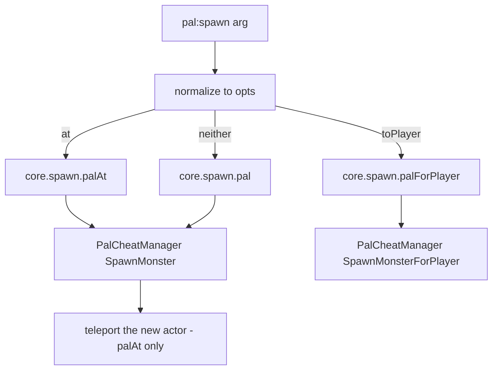

パルはスポーン可能なクリーチャーです。`Pal{ ... }` はゲーム側に既存の `CharacterID` に対して
メタデータ・メッシュ・ライフサイクルハンドラを与え、アクションを持つ `Pal.Handle` を返します。
定義するとオブジェクトレジストリの `("pal", id)` に登録され、`core/event` はそこから定義を見つけます。
パルのアクターが捕獲された・ダメージを受けた・死亡した・初期化を終えたとき、ディスパッチはアクターの
ブループリントクラス名（`BP_ChickenPal_C` なら `ChickenPal`）から id を割り出し、その id で登録された
定義のハンドラを呼びます。

```lua title="content/pals.lua"
local pal = Pal{
    id          = "ChickenPal",
    name        = "Chicken Pal",
    description = "the one that greets you",
    events = {
        onCaptured = function(pal, ctx)
            Audio.get("AKE_Arena_Victory_01"):play(ctx.actor)
        end,
    },
}

pal:spawn(Player.coordinate())
```

エントリポイントは他の api モジュールとまったく同じ 3 つです。

```lua
Pal{ id = "ChickenPal" }    -- define + register, returns a Pal.Handle
Pal.get("SheepBall")        -- a handle for an existing id; never nil
Pal.get_all()               -- every PalForge-registered pal, as handles
```

`Pal.get` は決して nil を返しません。誰も定義していない id には薄い定義が作られ、`:spawn` するには
十分ですがハンドラは持ちません。登録するのは `Pal{ ... }` だけであり、ライフサイクルのディスパッチを
受け取れるのも登録済みの id だけです。

Palworld 自身のクリーチャー一覧は `native/pals` にあります。

```lua
local pals = require("palforge.native.pals")

pals.CATALOG               -- every DT_PalMonsterParameter_Common row id, as strings
pals.get("BlueSkyDragon")  -- a lazy Pal handle for any catalog id, nil for anything else
pals.Chicken               -- the curated ChickenPal demo definition
pals.SheepBall             -- the curated SheepBall demo definition
```

`pals.get(id)` は初回呼び出し時に素の `Pal{ id = id }` を定義してキャッシュします。つまりカタログ id を
取得すると同時に登録も行われ、以後その id はディスパッチの対象になります（ハンドラは空のままです）。

## Fields

必須フィールドは `id` だけです。ここに載っていないフィールドを渡すと、定義時にサジェスト付きの
ハードエラーになります。同じ一覧は実行時にも
`require("palforge.core.schema").help("Pal.Spec")` で読めます。

<TypeTable
  type={{
    id: {
      description: 'パル id。ゲームの CharacterID（ChickenPal など）または pack:name',
      type: 'string',
      required: true,
    },
    name: {
      description: 'UI 表示名。省略時は id',
      type: 'string',
    },
    description: {
      description: 'UI とツール向けの 1 行説明',
      type: 'string',
    },
    skills: {
      description: 'このパルが持つスキル id',
      type: 'string[]',
    },
    mesh: {
      description: 'スポーンしたポーンに付けるメッシュ。インライン、または Mesh ハンドル',
      type: 'Mesh.Spec',
    },
    material: {
      description: 'そのメッシュに適用するマテリアル上書き',
      type: 'Pal.Spec.Material',
    },
    color: {
      description: '基本の色味 r, g, b, a を 0..1 で。material.color のショートハンド',
      type: 'table',
    },
    texture: {
      description: 'メッシュに適用する png のパス。material.texture のショートハンド',
      type: 'string',
    },
    icon: {
      description: 'DataTable 検索が外れたときに使うフォールバックアイコン',
      type: 'any',
    },
    events: {
      description: 'ライフサイクルハンドラをまとめたもの',
      type: 'Pal.Spec.Events',
    },
    data: {
      description: '自由に使えるペイロード。定義にそのまま載る',
      type: 'table',
    },
  }}
/>

デフォルト値を持つフィールドはありません。読み出し時にフォールバックするのは 2 つで、`name` が無い
ときは `:name()` が id を返し、`skills` が無いときは `:skillsOf()` が空のテーブルを返します。

コロンを含む id はパック id です。`"example:Boss"` は DataTable の行 FName `example_Boss` に解決されます。
コロンを含まない id はゲームの id そのものです。

### mesh

`mesh` は `Mesh.Spec` のコピーではなく `Mesh.Spec` そのものです。したがってインラインのテーブルと
定義済みの [`Mesh{ ... }`](/docs/api/mesh) ハンドルはまったく同じように検証され、同じ経路でレンダラーに
届きます。

<Tabs items={['Inline', 'Named']}>
<Tab value="Inline">

```lua
Pal{
    id   = "ChickenPal",
    mesh = {
        kind      = "skeletal",
        model     = "/Game/Pal/Model/Character/Monster/ChickenPal/SK_ChickenPal.SK_ChickenPal",
        animClass = "/Game/Pal/Blueprint/Character/Monster/PalActorBP/ChickenPal/ABP_ChickenPal.ABP_ChickenPal_C",
    },
}
```

</Tab>
<Tab value="Named">

```lua
local body = Mesh{
    id        = "example:sheep_body",
    kind      = "skeletal",
    model     = "/Game/Pal/Model/Character/Monster/SheepBall/SK_SheepBall.SK_SheepBall",
    animClass = "/Game/Pal/Blueprint/Character/Monster/PalActorBP/SheepBall/ABP_SheepBall.ABP_SheepBall_C",
}

Pal{ id = "SheepBall", mesh = body }
Pal{ id = "ChickenPal", mesh = Mesh.get("example:sheep_body") }
```

</Tab>
</Tabs>

メッシュのフィールドは `kind`（`procedural` / `static` / `skeletal` / `obj`。既定は `skeletal`）、
`model`（必須）、`animClass`（skeletal のみ）、`scale`、`offset`、`texture`、`color`、`material`、
`params` です。`obj` は procedural バックエンドの別名です。

メッシュを宣言しただけでは何も装着されません。パルにはインスタンススキャンがないため、装着は
`:renderOn(actor)` で自分から行います。通常は `onSpawned` の中です。

```lua
Pal{
    id   = "ChickenPal",
    mesh = { kind = "skeletal", model = "/Game/Pal/Model/Character/Monster/ChickenPal/SK_ChickenPal.SK_ChickenPal" },
    events = {
        onSpawned = function(pal, ctx) pal:renderOn(ctx.actor) end,
    },
}
```

### material、color、texture

`material` が完全な上書きで、`color` と `texture` はそのうち 2 フィールドのショートハンドです。

<TypeTable
  type={{
    color: { description: '色味 r, g, b, a を 0..1 で', type: 'table' },
    texture: { description: 'メッシュに適用する png の絶対パス', type: 'string' },
    params: { description: 'そのまま渡される追加マテリアルパラメータ', type: 'table' },
    material: { description: 'インスタンス化のベースになるマテリアルのアセットパス', type: 'string' },
  }}
/>

この 2 つの書き方はマージされません。`material` があるときはそれがそのまま使われ、トップレベルの
`color` / `texture` は無視されます。`material` が無いときにだけ、ショートハンドからマテリアル記述子が
組み立てられます。`:renderOn` の内部では、その記述子が持つ値が同名のメッシュフィールドを上書きし、
記述子が持たないフィールドはメッシュ側の値がそのまま残ります。

```lua
-- shorthand: tint the declared mesh red
Pal{
    id    = "ChickenPal",
    mesh  = { kind = "skeletal", model = "/Game/Pal/Model/Character/Monster/ChickenPal/SK_ChickenPal.SK_ChickenPal" },
    color = { r = 1.0, g = 0.2, b = 0.2, a = 1.0 },
}

-- long form: a base material plus parameters, which the shorthands cannot express
Pal{
    id   = "SheepBall",
    mesh = { kind = "skeletal", model = "/Game/Pal/Model/Character/Monster/SheepBall/SK_SheepBall.SK_SheepBall" },
    material = {
        color    = { r = 0.2, g = 0.5, b = 1.0, a = 1.0 },
        texture  = "C:/mods/example/sheep.png",
        material = "/Game/.../M_YourBaseMaterial",
        params   = { Roughness = 0.2 },
    },
}
```

`Pal.Spec` には `params` やベースマテリアルパスに対するトップレベルのショートハンドはありません。
これらは `material` の中にしか存在しません。

### skills

`skills` は id のリスト以上のものではありません。フレームワークが装備させることはなく、これを発火
させるネイティブのスキルソースも存在しません。`:skillsOf()` でリストを読み戻し、各スキルは
[`Skill`](/docs/api/skill) から自分で駆動してください。

```lua
local boss = Pal{
    id     = "BOSS_ChickenPal",
    name   = "Chicken Boss",
    skills = { "FlameThrower" },
}

-- fire everything this pal owns at the player
for _, id in ipairs(boss:skillsOf()) do
    Skill.get(id):activate(Player.character())
end
```

### icon

`:iconOf()` は `/Game/Pal/DataTable/Character/DT_PalCharacterIconDataTable` を id で引き、
`IconName`、`Icon`、`Texture` の順に列を探ります。テーブルが無い・行が無い・列が無いなど、外れた
場合はいずれも宣言済みの `icon` を返します。検索には生の id が使われるため、名前空間付きの
`"example:Boss"` は行に一致せず、常にフォールバックします。

```lua
local pal = Pal{ id = "example:Boss", icon = "/Game/.../T_icon_example_boss" }
pal:iconOf()   -- the declared icon, since the DataTable has no "example:Boss" row
```

### data

`data` は手を加えずに定義へコピーされ、フレームワーク側はこれを読みません。ハンドルにアクセサも
無いため、ハンドラの中で使いたい場合は Lua のローカル変数に保持してください。

```lua
local config = { reward = "Wood", amount = 5 }

local pal = Pal{
    id   = "ChickenPal",
    data = config,
    events = {
        onDeath = function(pal, ctx)
            Item.get(config.reward):give(config.amount)
        end,
    },
}
```

## Events

ハンドラは `events` の下にまとめます。いずれも `function(pal, ctx)` の形で、`pal` は **この定義自身の
ハンドル**（`Pal{ ... }` が返したのと同じオブジェクトなので、`:spawn` や `:renderOn`、各クエリがその場で
使えます）、`ctx` はチャンネルのペイロードです。下の一覧に無いイベント名は、黙って無視されるのでは
なくハードエラーになります。

ゲームからハンドラまでの経路は次のとおりです。

```text
native hook -> event.emit -> channel -> dispatch -> resolve BP class name -> pal:onX(ctx)
```

| フック | チャンネル | ネイティブソース | ctx | 状態 |
| --- | --- | --- | --- | --- |
| `onSpawned` | `pal.spawned` | `PalCharacter:BroadcastOnCompleteInitializeParameter` | `ctx.actor` | LIVE（候補フック） |
| `onDamaged` | `pal.damaged` | `PalCharacter:OnDamageReaction` | `ctx.actor` | LIVE |
| `onDeath` | `pal.death` | `PalCharacter:OnDeadCharacter` | `ctx.actor` | LIVE |
| `onCaptured` | `pal.captured` | `PalCharacterParameterComponent:SetIsCapturedProcessing`（`started == true` のとき） | `ctx.actor`、`ctx.comp` | LIVE |
| `onTick` | なし | なし | なし | 宣言はできるが発火しない |

`ctx.actor` はそのイベントが起きたパルのポーンです。`pal.captured` はパラメータコンポーネント側で
ネイティブフックが発火するため、アクターはそのコンポーネントのオーナー、`ctx.comp` はコンポーネント
自身になります。`onDamaged` はダメージを**受けた**パルで発火し、攻撃した側では発火しません。ソース
フックが攻撃者を運んでいないためです。

捕獲に反応してプレイヤーに何かを返すハンドラです。

```lua
local log = require("palforge.utils.log").scope("example")

Pal{
    id   = "SheepBall",
    name = "Sheepball",
    events = {
        onCaptured = function(pal, ctx)
            log.info("captured " .. pal:name() .. ": " .. tostring(ctx.actor))
            Item.get("PalSphere"):give(1)
        end,
    },
}
```

アクターの状態を確認してから動くハンドラです。

```lua
Pal{
    id = "ChickenPal",
    events = {
        onDamaged = function(pal, ctx)
            local actor = ctx.actor
            if not (actor and actor.IsValid and actor:IsValid()) then return end
            Audio.get("AKE_Pal_Footstep"):play(actor)
        end,
    },
}
```

ハンドラは自由に組み合わせられ、それぞれ任意です。

```lua
local log = require("palforge.utils.log").scope("example")

Pal{
    id          = "ChickenPal",
    name        = "Chicken Pal",
    description = "logs every moment of its short life",
    events = {
        onSpawned  = function(pal, ctx) log.info("spawned "  .. tostring(ctx.actor)) end,
        onDamaged  = function(pal, ctx) log.info("damaged "  .. tostring(ctx.actor)) end,
        onDeath    = function(pal, ctx) log.info("died "     .. tostring(ctx.actor)) end,
        onCaptured = function(pal, ctx) log.info("captured " .. tostring(ctx.actor)) end,
    },
}
```

`native/pals.lua` にあるキュレーション済みデモ定義 2 つ（`ChickenPal` と `SheepBall`）も同じ形で、
このうち `onCaptured`、`onDamaged`、`onDeath` の 3 つを宣言しています。この 2 つは経路が端から端まで
通っていることを確かめるために存在します。野生の個体を捕まえるか倒せば、ログ行が出ます。

### ディスパッチの規則

ハンドラが実行されるかどうかは、次の 4 点で決まります。

1. **解決はブループリントのクラス名で行われます。** ディスパッチはアクターのクラス名から
   `BP_<Id>_C` を取り出し、その id をレジストリで引きます。名前空間付きの定義も、解決後の FName が
   ブループリントの id と一致すればヒットするため、`Pal{ id = "example:Boss" }` は
   `BP_example_Boss_C` を捕まえます。
2. **ディスパッチされるのは登録済みの id だけです。** `Pal{ ... }` は登録しますが `Pal.get(id)` は
   登録しません。PalForge の定義を持たないバニラのパルは解決に失敗し、ディスパッチは何もしません。
3. **すべてワールド準備完了でゲートされています。** ソースフックは、有効な
   `PalPlayerCharacter` を 1 秒間隔で 5 回連続して検出するまで即座に return します。
4. **ハンドラは `pcall` の中で実行されます。** ハンドラ内のエラーは握り潰され、クラッシュもせず
   メッセージも出ません。失敗を見たいならハンドラ内でログを出してください。

### チャンネルを直接購読する

ディスパッチは公開チャンネルの購読者のひとつにすぎません。パックが定義していないバニラのパルも
含めてすべてを拾いたいときは、自分で購読します。

```lua
local event = require("palforge.core.event")
local log   = require("palforge.utils.log").scope("example")

local sub = event.on("pal.death", function(ctx)
    log.info("some pal died: " .. tostring(ctx.actor))
end)

-- later
sub:unsubscribe()
```

`event.observable(name)` は Rx のオペレータチェーン用に同じ Subject を返します。
`event.emit("pal.spawned", { actor = someActor })` は合成したイベントを経路全体に流します。ただし
ディスパッチは `ctx.actor` のブループリントクラス名から定義を解決するため、手作りの ctx は自分で
購読した先には届きますが、定義側のハンドラに届くのはアクターが本物のパルのポーンのときだけです。
ハンドラだけを走らせたいときは、後述のイベントフォワーダを使ってください。

## Handle

`Pal{ ... }`、`Pal.get`、`Pal.get_all` はいずれも `Pal.Handle` を返します。ハンドルは `.id` と、
2 つのアクション、5 つのイベントフォワーダ、5 つのクエリを持ちます。

### spawn

```lua
---@param arg Coord|table|nil
---@return boolean ok
pal:spawn(arg)
```

引数はまず正規化されます。`.x` か `[1]` を持つテーブルは座標、それ以外のテーブルはオプション
テーブル、引数なしは既定の配置です。

```lua
local pal = Pal.get("ChickenPal")

pal:spawn()                                   -- wild, near the player, level 1
pal:spawn(Player.coordinate())                -- at the player's exact position
pal:spawn(Player.coordinateOffset(300, 0, 0)) -- 3 m away on X
pal:spawn({ 12000, -4300, 800 })              -- array coordinate, x/y/z in centimetres
pal:spawn{ at = Player.coordinate(), level = 30 }
pal:spawn{ toPlayer = true, num = 3, level = 20 }   -- three, owned by the player
pal:spawn{ level = 45 }                             -- wild, near the player, level 45
```

オプションテーブルは `at`（座標）、`level`（既定 1）、`toPlayer`（真値ならプレイヤー所有の経路へ）、
`num`（既定 1。`toPlayer` の経路でのみ読まれます）を受け取ります。



どの経路もサーバー検証済みの管理 API である `UPalCheatManager` を通ります。戻り値はネイティブ呼び出しが
実行できたかどうかであり、「指定した場所にパルがいる」ことまでは意味しません。座標指定の経路では、
ゲーム側が要求された位置を無視してプレイヤーの近くにパルを落とすため、PalForge は事前にパルの
アクターをスナップショットしておき、新しく現れたアクターのうちプレイヤー位置に最も近い 1 体だけを
移動させます。アクターは数フレーム遅れて生成されるので、400 ms 間隔で最大 6 回まで再試行します。

### renderOn

```lua
---@param actor any
---@return boolean ok
pal:renderOn(actor)
```

宣言したメッシュを生きているポーンに一度だけ装着します。レンダラー側が重ね掛けを防ぐので、同じ
アクターに 2 回呼んでも害はありません。アクターが有効でない場合、定義にメッシュが無い場合、その
メッシュに `model` が無い場合は、何もせず `false` を返します。

```lua
Pal{
    id   = "SheepBall",
    mesh = { kind = "skeletal", model = "/Game/Pal/Model/Character/Monster/SheepBall/SK_SheepBall.SK_SheepBall" },
    events = {
        onSpawned = function(pal, ctx)
            if not pal:renderOn(ctx.actor) then
                require("palforge.utils.log").scope("example").warn("no mesh attached")
            end
        end,
    },
}
```

### クエリ

```lua
pal:skillsOf()      --> string[]   the declared skill ids, an empty table when none
pal:mesh()          --> table?     the validated mesh declaration, nil when none
pal:iconOf()        --> any?       DataTable texture ref, else the declared icon, else nil
pal:name()          --> string     the declared name, else the id
pal:description()   --> string?    the declared description, or nil
```

```lua
local log = require("palforge.utils.log").scope("example")

for _, pal in ipairs(Pal.get_all()) do
    local m = pal:mesh()
    log.info(string.format("%s (%s) mesh=%s skills=%d",
        pal:name(), pal.id, tostring(m and m.model), #pal:skillsOf()))
end
```

### イベントフォワーダ

`:onSpawned(ctx)`、`:onDamaged(ctx)`、`:onDeath(ctx)`、`:onCaptured(ctx)`、`:onTick(ctx)` は、渡した
ctx をそのまま使って定義側のハンドラを即座に呼びます。ディスパッチはこれらを経由しません。テストや
別のハンドラから自分でハンドラを走らせるためのものです。

```lua
-- run the death handler now, with a hand-made ctx
Pal.get("ChickenPal"):onDeath({ actor = Player.character() })
```

## Recipes

### 自分で着替えて登場を知らせるパル

```lua title="content/party_chicken.lua"
local log = require("palforge.utils.log").scope("example")

local Fanfare = Audio.se{
    id        = "AKE_CampLevelUp",
    soundId   = "AKE_CampLevelUp",
    soundPath = "/Game/Pal/Sound/Events/SE/UI/CampLevelUp/AKE_CampLevelUp.AKE_CampLevelUp",
}

local Chicken = Pal{
    id          = "ChickenPal",
    name        = "Party Chicken",
    description = "wears a custom skin and announces itself",
    mesh = Mesh{
        id        = "example:party_chicken",
        kind      = "skeletal",
        model     = "/Game/Pal/Model/Character/Monster/ChickenPal/SK_ChickenPal.SK_ChickenPal",
        animClass = "/Game/Pal/Blueprint/Character/Monster/PalActorBP/ChickenPal/ABP_ChickenPal.ABP_ChickenPal_C",
    },
    color = { r = 1.0, g = 0.4, b = 0.1, a = 1.0 },
    events = {
        onSpawned = function(pal, ctx)
            if not pal:renderOn(ctx.actor) then
                log.warn("mesh not attached for " .. pal:name())
            end
            Fanfare:play(ctx.actor)
        end,
    },
}

Chicken:spawn(Player.coordinateOffset(300, 0, 0))
```

サウンドはファイルスコープで一度だけ定義し、ハンドラからは再生するだけにします。ハンドラの中で
定義するとスポーンのたびにサウンドを再登録することになります。手元にローカル変数が無い場面では、
代わりに `Audio.get("AKE_CampLevelUp"):play(ctx.actor)` を使ってください。

### 死亡時にドロップするパル

```lua title="content/woolly_sheep.lua"
local log = require("palforge.utils.log").scope("example")

local Wool = Item.get("Wool")
local Meat = Item.get("Meat")

Pal{
    id          = "SheepBall",
    name        = "Woolly Sheepball",
    description = "hands over wool and meat when it dies",
    events = {
        onDeath = function(pal, ctx)
            Wool:give(3)
            Meat:give(1)
            log.info(pal:name() .. " dropped its loot")
        end,
    },
}
```

`Item.get(...):give(n)` はゲーム自身の `AddItem_ServerInternal` 経路でローカルプレイヤーの
インベントリに追加します。PalForge にワールドへドロップする呼び出しは無いため、これは拾いに行く
死体ではなく報酬です。詳細は [Item](/docs/api/item) を参照してください。

### 殴られると燃え始めるパル

```lua title="content/singe_chicken.lua"
local log = require("palforge.utils.log").scope("example")

local Singe = Effect{
    id          = "example:Singe",
    name        = "Singe",
    description = "burns for six seconds after taking a hit",
    duration    = 6.0,
    interval    = 1.0,
    events = {
        onApply  = function(effect, target, ctx)
            log.info("singe applied by " .. tostring(ctx.source))
        end,
        onTick   = function(effect, target, ctx)
            log.info(string.format("singe tick at %.1fs", ctx.elapsed))
        end,
        onExpire = function(effect, target, ctx)
            log.info("singe over: " .. tostring(ctx.reason))
        end,
    },
}

Pal{
    id   = "ChickenPal",
    name = "Singed Chicken",
    events = {
        onDamaged = function(pal, ctx)
            if not ctx.actor then return end
            if Singe:isActive(ctx.actor) then return end
            Singe:apply(ctx.actor, { source = pal.id })
        end,
    },
}
```

エフェクトのランタイムは共有の 500 ms ハートビートで駆動されるため、`onTick` は `duration` が尽きる
までおよそ `interval` 秒ごとに発火します。`ctx.elapsed`、`ctx.stacks`、そして期限切れ時の `ctx.reason`
はそのランタイムが入れる値で、それ以外のキーは `:apply` に渡したものです。詳細は
[Effect](/docs/api/effect) を参照してください。

### 好きなときに呼び出せる色違い部隊

```lua title="content/blue_squad.lua"
local log = require("palforge.utils.log").scope("example")

local Squad = Pal{
    id          = "SheepBall",
    name        = "Blue Squad",
    description = "a recolored sheepball unit",
    mesh = {
        kind      = "skeletal",
        model     = "/Game/Pal/Model/Character/Monster/SheepBall/SK_SheepBall.SK_SheepBall",
        animClass = "/Game/Pal/Blueprint/Character/Monster/PalActorBP/SheepBall/ABP_SheepBall.ABP_SheepBall_C",
        scale     = 1.2,
    },
    material = {
        color = { r = 0.2, g = 0.5, b = 1.0, a = 1.0 },
    },
    events = {
        onSpawned = function(pal, ctx) pal:renderOn(ctx.actor) end,
    },
}

-- spread `n` of them in a line to the player's north-east
local function summonSquad(n, level)
    local at = Player.coordinate()
    if not at then
        log.warn("no player coordinate - not in a world yet")
        return false
    end
    for i = 1, n do
        Squad:spawn{ at = { x = at.x + i * 250, y = at.y + 250, z = at.z }, level = level }
    end
    return true
end

summonSquad(5, 20)

-- the party-owned variant: three of them straight into the box
Squad:spawn{ toPlayer = true, num = 3, level = 20 }
```

各個体はそれぞれ独立した `SpawnMonster` 呼び出しでスポーンし、それぞれの `onSpawned` が自分の
アクターにメッシュを装着します。

## Limits

<Callout type="warn">

- **Lua から新しい `CharacterID` は作れません。** `Pal{ id = ... }` は、ゲームに既に存在する行と
  ブループリントに対して挙動・見た目・メタデータを付けるものです。DataTable の行そのものを作るのは
  PalSchema の仕事です。対応する `BP_<Id>_C` が存在しない id はディスパッチを受け取れず、`:spawn` して
  も出てくるものがありません。
- **`onTick` は発火しません。** ビルディングには約 500 ms のスキャンがあり、そこから生きた
  インスタンスが作られます。パルには相当するものが無く、パルごとのハートビートを駆動する仕組みが
  存在しません。形をそろえるために宣言だけはできる、というのがこのフィールドのすべてです。
  ハートビートを直接使う（`require("palforge.core.event").every(2000, fn)`。500 ms のティックに量子化
  されます）か、Effect の `interval` を使ってください。
- **`onSpawned` は未確認の候補フックに乗っています。**
  `PalCharacter:BroadcastOnCompleteInitializeParameter` は、捕獲・ダメージ・死亡と違ってゲーム内の
  イベントプローブで確認できていません。ベストエフォートとして扱い、ハンドラは何度呼ばれても
  問題ない作りにしてください。`:renderOn` は一度きりの装着なので、再度呼んでも安全です。
- **ワールドの準備が整うまで何もディスパッチされません。** 4 つのソースフックはいずれも、有効な
  `PalPlayerCharacter` を 1 秒間隔で 5 回連続して検出するまで即座に return します。
- **ハンドラのエラーは握り潰されます。** ディスパッチは `pcall` の中でフックを呼ぶため、バグが
  あってもクラッシュせず、報告もされません。ハンドラ内でログを出してください。
- **`:spawn` には `PalCheatManager` が必要です**（CheatManagerEnabler mod）。無い場合はどの経路も
  `false` を返し、ログに警告を書きます。
- **座標指定はスポーン位置指定ではなく移動です。** ネイティブ呼び出しは要求された位置を無視するため、
  PalForge は生成後のアクターを 400 ms 間隔で最大 6 回まで再試行しながらテレポートさせます。
  `:spawn` が返す `true` はスポーン呼び出し自体に対するものです。新しいアクターが現れなければ、
  配置は警告をログに出して諦めます。
- **メッシュが自動で装着されることはありません。** ハンドラから `:renderOn(actor)` を呼んでください。
  `core.mesh.ENABLED` はグローバルのキルスイッチで、これを切るとすべての装着が no-op になります。
- **`Pal.get` は登録しません。** レジストリに定義を入れるのは `Pal{ ... }` だけなので、`Pal.get` から
  得たハンドルは操作はできてもイベントを受け取ることはできません。同じ id を 2 回定義すると、
  後の定義が前の定義を置き換えます。

</Callout>

<Cards>
  <Card title="Mesh" href="/docs/api/mesh">パルが身にまとう見た目と、その背後のバックエンド</Card>
  <Card title="Item" href="/docs/api/item">ドロップや報酬のための give と take</Card>
  <Card title="Effect" href="/docs/api/effect">パルのハンドラから駆動する時間付きステータス</Card>
  <Card title="Skill" href="/docs/api/skill">skills に並べた id が指すもの</Card>
</Cards>
