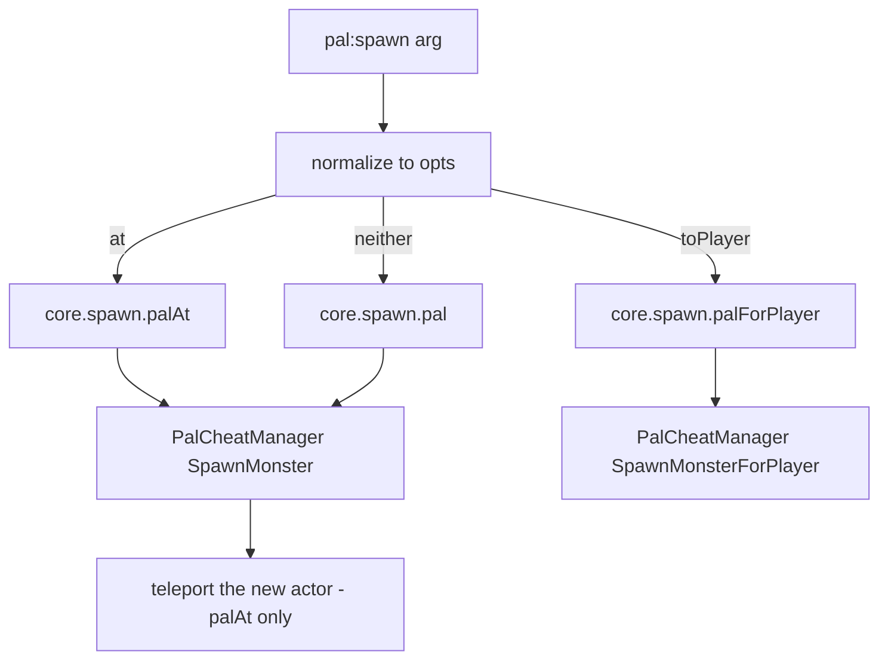

## このページでできるようになること

- 捕まえた瞬間、殴った瞬間、倒した瞬間にパルを反応させる
- パルが死んだときに音を鳴らす、時限のエフェクトを始める
- パルの体・色・大きさを別のものに変える
- 遊んでいる間ずっと、自分のパル全員に自分のコードを繰り返し走らせる
- このバージョンの `:spawn` に何ができて何ができないかを把握する

## パルを作る

パルはゲームのクリーチャーです。ゲーム側でそのクリーチャーに付いている名前を使って
`Pal{ ... }` と書くと、あとから取り出したり、動きを付けたり、操作したりできるオブジェクトが
返ってきます。

```lua title="content/pals.lua"
local pal = Pal{
    id          = "ChickenPal",
    name        = "Chicken Pal",
    description = "the one that greets you",
    events = {
        onCaptured = function(pal, ctx)
            Audio.get("AKE_Arena_Victory_01"):play(ctx.actor)
        end,
    },
}

pal:spawn(Player.coordinate())   -- no creature appears in this version; see :spawn below
```

ゲームの中で Chicken Pal を捕まえると、勝利のジングルが鳴ります。流れはこれだけです。どの
クリーチャーの話かを書き、何が起きてほしいかを書けば、あとは PalForge がつなぎます。

入口は 3 つあります。

```lua
Pal{ id = "ChickenPal" }    -- define + register, returns a Pal.Handle
Pal.get("SheepBall")        -- a handle for an existing id; never nil
Pal.get_all()               -- every PalForge-registered pal, as handles
```

`Pal.get` は決して nil を返しません。誰も定義していない id には薄い定義が作られ、アクションを
呼ぶぶんには十分ですが、ハンドラは載っていません。登録するのは `Pal{ ... }` だけで、ハンドラが
呼ばれるのも登録済みのパルだけです。

Palworld 自身のクリーチャー一覧は `native/pals` にあります。

```lua
local pals = require("palforge.native.pals")

pals.CATALOG               -- every DT_PalMonsterParameter_Common row id, as strings
pals.get("BlueSkyDragon")  -- a lazy Pal handle for any catalog id, nil for anything else
pals.Chicken               -- the curated ChickenPal demo definition
pals.SheepBall             -- the curated SheepBall demo definition
```

`pals.get(id)` は最初に呼ばれたときに素の `Pal{ id = id }` を定義してキャッシュします。つまり
カタログの id を取り出すと登録も済み、その id にイベントが届くようになります。ハンドラを書くまでは
中身が空のままです。

## Fields

必ず書くのは `id` だけです。この一覧に無いフィールドを渡すと、`Pal{ ... }` を呼んだその場で
サジェスト付きのエラーになります。打ち間違いが黙って無視されることはありません。同じ一覧は
ゲーム実行中に `require("palforge.core.schema").help("Pal.Spec")` でも読めます。

<TypeTable
  type={{
    id: {
      description: 'パル id。ゲームの CharacterID（ChickenPal など）または pack:name',
      type: 'string',
      required: true,
    },
    name: {
      description: 'UI 表示名。省略時は id',
      type: 'string',
    },
    description: {
      description: 'UI とツール向けの 1 行説明',
      type: 'string',
    },
    skills: {
      description: 'このパルが持つスキル id。:skillsOf で読み戻すか、:teachAll で生きているクリーチャーにまとめて載せます',
      type: 'string[]',
    },
    mesh: {
      description: 'スポーンしたポーンに付けるメッシュ。インライン、または Mesh ハンドル',
      type: 'Mesh.Spec',
    },
    material: {
      description: 'そのメッシュに適用するマテリアル上書き',
      type: 'Pal.Spec.Material',
    },
    color: {
      description: '基本の色味 r, g, b, a を 0..1 で。material.color のショートハンド',
      type: 'table',
    },
    texture: {
      description: 'メッシュに適用する png のパス。material.texture のショートハンド',
      type: 'string',
    },
    icon: {
      description: 'DataTable 検索が外れたときに使うフォールバックアイコン',
      type: 'any',
    },
    events: {
      description: 'ライフサイクルハンドラをまとめたもの',
      type: 'Pal.Spec.Events',
    },
    data: {
      description: '自由に使えるペイロード。定義にそのまま載る',
      type: 'table',
    },
  }}
/>

デフォルト値を持つフィールドはありません。読み出すときにだけ補われるものが 2 つあります。
`name` を書かなかったときは `:name()` が id を返し、`skills` を書かなかったときは
`:skillsOf()` が空のテーブルを返します。

コロンが入った id は自分のものです。`"example:Boss"` はゲームのデータ行 `example_Boss` に
対応します。コロンの無い id は `ChickenPal` のようなゲーム側の id です。

### mesh

メッシュとは、クリーチャーが身にまとう 3D モデルのことです。その場に直接書いてもよいですし、
[`Mesh{ ... }`](/docs/api/mesh) で一度定義したものを渡してもかまいません。どちらも同じように
検証され、同じ経路でレンダラーに届くので、書きやすい方を選んでください。

<Tabs items={['Inline', 'Named']}>
<Tab value="Inline">

```lua
Pal{
    id   = "ChickenPal",
    mesh = {
        kind      = "skeletal",
        model     = "/Game/Pal/Model/Character/Monster/ChickenPal/SK_ChickenPal.SK_ChickenPal",
        animClass = "/Game/Pal/Blueprint/Character/Monster/PalActorBP/ChickenPal/ABP_ChickenPal.ABP_ChickenPal_C",
    },
}
```

</Tab>
<Tab value="Named">

```lua
local body = Mesh{
    id        = "example:sheep_body",
    kind      = "skeletal",
    model     = "/Game/Pal/Model/Character/Monster/SheepBall/SK_SheepBall.SK_SheepBall",
    animClass = "/Game/Pal/Blueprint/Character/Monster/PalActorBP/SheepBall/ABP_SheepBall.ABP_SheepBall_C",
}

Pal{ id = "SheepBall", mesh = body }
Pal{ id = "ChickenPal", mesh = Mesh.get("example:sheep_body") }
```

</Tab>
</Tabs>

メッシュのフィールドは `kind`（`procedural` / `static` / `skeletal` / `obj`。既定は `skeletal`）、
`model`（必須）、`animClass`（skeletal のみ）、`scale`、`offset`、`texture`、`color`、`material`、
`params` です。`obj` は procedural バックエンドの別名です。

メッシュを書いただけでは、どこにも付きません。装着は `:renderOn(actor)` で自分から行います。
ふつうは `onSpawned` の中です。`onSpawned` は、パルがワールドに出終わったときに走るハンドラです。

```lua
Pal{
    id   = "ChickenPal",
    mesh = { kind = "skeletal", model = "/Game/Pal/Model/Character/Monster/ChickenPal/SK_ChickenPal.SK_ChickenPal" },
    events = {
        onSpawned = function(pal, ctx) pal:renderOn(ctx.actor) end,
    },
}
```

### material、color、texture

`material` が完全な上書きです。`color` と `texture` はそのうち 2 フィールドの短い書き方で、
それだけで足りるときに使います。

<TypeTable
  type={{
    color: { description: '色味 r, g, b, a を 0..1 で', type: 'table' },
    texture: { description: 'メッシュに適用する png の絶対パス', type: 'string' },
    params: { description: 'そのまま渡される追加マテリアルパラメータ', type: 'table' },
    material: { description: 'インスタンス化のベースになるマテリアルのアセットパス', type: 'string' },
  }}
/>

この 2 つの書き方は混ざりません。`material` を書いたときはそれがそのまま使われ、トップレベルの
`color` / `texture` は無視されます。`material` が無いときにだけ、短い書き方からマテリアルの
記述がまとめられます。`:renderOn` の中では、その記述が持つ値が同じ名前のメッシュのフィールドに
勝ち、記述が持たないフィールドはメッシュ側の値がそのまま残ります。

```lua
-- shorthand: tint the declared mesh red
Pal{
    id    = "ChickenPal",
    mesh  = { kind = "skeletal", model = "/Game/Pal/Model/Character/Monster/ChickenPal/SK_ChickenPal.SK_ChickenPal" },
    color = { r = 1.0, g = 0.2, b = 0.2, a = 1.0 },
}

-- long form: a base material plus parameters, which the shorthands cannot express
Pal{
    id   = "SheepBall",
    mesh = { kind = "skeletal", model = "/Game/Pal/Model/Character/Monster/SheepBall/SK_SheepBall.SK_SheepBall" },
    material = {
        color    = { r = 0.2, g = 0.5, b = 1.0, a = 1.0 },
        texture  = "C:/mods/example/sheep.png",
        material = "/Game/.../M_YourBaseMaterial",
        params   = { Roughness = 0.2 },
    },
}
```

`params` とベースマテリアルのパスには、トップレベルの短い書き方がありません。これらは
`material` の中にだけあります。

<Callout type="warn">
この 4 つのフィールドが実際に色を塗るのは、procedural と `obj` のバックエンドだけです。パルの
メッシュの既定である `kind = "skeletal"` はクリーチャーのモデルを差し替えるだけで、それ以外は
読みません。`static` も何も塗りません。skeletal のメッシュに添えて書いた `color` や `texture` は
`core.mesh` まで運ばれますが、そこでは何も起きません。このバックエンドで `:renderOn` が `true` を
返しても、それはモデルが差し替わったという意味で、塗られたという意味ではありません。
バックエンドの一覧は [Mesh](/docs/api/mesh) にあります。
</Callout>

### skills

`skills` は、この定義が宣言する id のリストです。宣言しただけではどのクリーチャーにも何も載りませんし、
ゲーム側がこれを発火させることもありません。`:skillsOf()` でリストを読み戻し、各スキルは
[`Skill`](/docs/api/skill) から自分で動かしてください。

```lua
local boss = Pal{
    id     = "BOSS_ChickenPal",
    name   = "Chicken Boss",
    skills = { "FlameThrower" },
}

-- fire everything this pal owns at the player
for _, id in ipairs(boss:skillsOf()) do
    Skill.get(id):activate(Player.character())
end
```

宣言したリストを、ワールドに立っているクリーチャーへ載せてゲーム自身に持たせたいときは
`:teachAll(actor)` を使います。下の [teachAll](#teachall) を参照してください。

### icon

`:iconOf()` はゲーム自身のパルアイコンのテーブル（`DT_PalCharacterIconDataTable`、次に
`DT_PalCharacterIconDataTable_Common`）を id で引き、`SoftIcon`、`IconName`、`IconTexture`、
`Icon`、`Texture` の順に列を見て、最初に中身があったものを返します。テーブルが無い・行が無い・
読める列が無いなど、どこで外れても、書いておいた `icon` が返ります。検索には生の id を使うので、
名前空間付きの `"example:Boss"` は行に一致せず、必ずフォールバックします。

```lua
local pal = Pal{ id = "example:Boss", icon = "/Game/.../T_icon_example_boss" }
pal:iconOf()   -- the declared icon, since the DataTable has no "example:Boss" row
```

### data

`data` は手を加えずに定義へコピーされ、PalForge 側はこれを読みません。ハンドルにアクセサも
無いので、ハンドラの中で使いたいときは Lua のローカル変数に持っておいてください。

```lua
local config = { reward = "Wood", amount = 5 }

local pal = Pal{
    id   = "ChickenPal",
    data = config,
    events = {
        onDeath = function(pal, ctx)
            Item.get(config.reward):give(config.amount)
        end,
    },
}
```

## Events

パルに動きを付けるのはここです。ハンドラは `events` の下にまとめます。どれも
`function(pal, ctx)` の形で、`pal` は **この定義自身のハンドル**（`Pal{ ... }` が返したのと同じ
オブジェクトなので、`:renderOn` や各クエリがその場で使えます）、`ctx` は今何が起きたかを
表すテーブルです。下の一覧に無いイベント名は、黙って無視されるのではなく定義時のエラーになります。

PalForge はゲームを見張り、起きたことを名前の付いたチャンネルに流し、それが起きたパルを見つけて
ハンドラを呼びます。

```text
native hook -> event.emit -> channel -> dispatch -> resolve BP class name -> pal:onX(ctx)
```

| フック | チャンネル | ネイティブソース | ctx | 状態 |
| --- | --- | --- | --- | --- |
| `onSpawned` | `pal.spawned` | `PalCharacter:BroadcastOnCompleteInitializeParameter` | `ctx.actor` | LIVE。未確認のフックで、ワールドのロード後に有効化 |
| `onDamaged` | `pal.damaged` | `PalCharacter:OnDamageReaction` | `ctx.actor` | LIVE |
| `onDeath` | `pal.death` | `PalCharacter:OnDeadCharacter` | `ctx.actor` | LIVE |
| `onCaptured` | `pal.captured` | `PalCharacterParameterComponent:SetIsCapturedProcessing`（`started == true` のとき） | `ctx.actor`、`ctx.comp` | LIVE |
| `onTick` | `tick` | ゲームのイベントは無し。`core/event` が自分で生きたパルを見て回る | `ctx.actor`、`ctx.count`、`ctx.now` | LIVE。生きたパル 1 体につき `core.event.PAL_SCAN_MS` ごと（既定 3 秒） |

`ctx.actor` は、そのイベントが起きたワールド上のクリーチャーです。`pal.captured` はパルの
パラメータコンポーネント側で発火するため、アクターはそのコンポーネントの持ち主、`ctx.comp` は
コンポーネント自身になります。`onDamaged` はダメージを**受けた**パルで発火し、攻撃した側では
発火しません。ゲーム側のフックが誰の攻撃かを持っていないためです。

捕獲に反応してプレイヤーに何かを返すハンドラです。

```lua
local log = require("palforge.utils.log").scope("example")

Pal{
    id   = "SheepBall",
    name = "Sheepball",
    events = {
        onCaptured = function(pal, ctx)
            log.info("captured " .. pal:name() .. ": " .. tostring(ctx.actor))
            Item.get("PalSphere"):give(1)
        end,
    },
}
```

クリーチャーがまだ有効かを確かめてから触るハンドラです。

```lua
Pal{
    id = "ChickenPal",
    events = {
        onDamaged = function(pal, ctx)
            local actor = ctx.actor
            if not (actor and actor.IsValid and actor:IsValid()) then return end
            Audio.get("AKE_Pal_Footstep"):play(actor)
        end,
    },
}
```

`onTick` はゲームの操作とは関係なく、およそ 3 秒ごとに、その id の生きたパル 1 体につき 1 回
走ります。`ctx.count` は mod をロードしてからの 500 ms ハートビートの回数なので、たまにだけ何かを
したいときに便利です。

```lua
local log = require("palforge.utils.log").scope("example")

Pal{
    id = "ChickenPal",
    events = {
        onTick = function(pal, ctx)
            -- ctx.actor is one live Chicken Pal; this runs once per pal, per sweep
            if ctx.count % 12 == 0 then
                log.info("chicken still here: " .. tostring(ctx.actor))
            end
        end,
    },
}

-- slow the sweep down, or switch it off with 0
require("palforge.core.event").PAL_SCAN_MS = 5000
```

ハンドラは自由に組み合わせられ、それぞれ任意です。

```lua
local log = require("palforge.utils.log").scope("example")

Pal{
    id          = "ChickenPal",
    name        = "Chicken Pal",
    description = "logs every moment of its short life",
    events = {
        onSpawned  = function(pal, ctx) log.info("spawned "  .. tostring(ctx.actor)) end,
        onDamaged  = function(pal, ctx) log.info("damaged "  .. tostring(ctx.actor)) end,
        onDeath    = function(pal, ctx) log.info("died "     .. tostring(ctx.actor)) end,
        onCaptured = function(pal, ctx) log.info("captured " .. tostring(ctx.actor)) end,
    },
}
```

PalForge には `native/pals.lua` にすぐ使えるパルが 2 つ入っています（`ChickenPal` と
`SheepBall`）。`onCaptured`、`onDamaged`、`onDeath` がログ出力につないであるので、野生の個体を
捕まえるか倒せばログ行が出ます。手元のゲームで経路が通っているか確かめるのに一番早い方法です。

### ハンドラが走るかどうかを決めるもの

決め手は 4 つです。

1. **パルはブループリントのクラス名で見分けます。** ゲーム内のクリーチャーには
   `BP_<Id>_C` という生成クラスが付いています。PalForge はそれをクリーチャーから読み、
   `BP_ChickenPal_C` を `ChickenPal` に直して id を引きます。名前空間付きの定義も、解決後の名前が
   ブループリントの id と一致すればヒットするので、`Pal{ id = "example:Boss" }` は
   `BP_example_Boss_C` を捕まえます。
2. **イベントが届くのは登録済みの id だけです。** `Pal{ ... }` は登録しますが `Pal.get(id)` は
   登録しません。自分で定義していないバニラのパルはどれにも解決されず、イベントは捨てられます。
3. **ワールドの準備が整うまで何も走りません。** ゲーム側のフックは、有効な
   `PalPlayerCharacter` を 1 秒間隔で 5 回連続して見つけるまで即座に return します。`onTick` の
   巡回も同じゲートを待ちます。
4. **ハンドラは `pcall` の中で走り、失敗はログに残ります。** ハンドラ内のエラーはゲームを落とさず、
   チャンネルも止めません。PalForge がそれを捕まえ、チャンネル名・フック名・メッセージをログに
   書きます（`pal.death -> onDeath handler failed: ...`）。ただし、そのハンドラの残りの処理は
   実行されません。

### 自分のパル以外も拾う

ハンドラが走るのは自分が定義したパルだけです。バニラも含めてワールド中のパルを拾いたいときは、
チャンネルを自分で購読します。

```lua
local event = require("palforge.core.event")
local log   = require("palforge.utils.log").scope("example")

local sub = event.on("pal.death", function(ctx)
    log.info("some pal died: " .. tostring(ctx.actor))
end)

-- later
sub:unsubscribe()
```

`event.observable(name)` は同じチャンネルを Rx の observable として返すので、オペレータチェーンに
つなげます。`event.emit("pal.spawned", { actor = someActor })` は自分で作ったイベントを経路全体に
流します。ただし PalForge は `ctx.actor` のブループリントクラス名から定義を割り出すため、手作りの
ctx は自分の購読先には届きますが、定義側のハンドラに届くのはアクターが本物のワールド上のパルの
ときだけです。ハンドラだけを走らせたいときは、後述のイベントフォワーダを使ってください。

## Handle

`Pal{ ... }`、`Pal.get`、`Pal.get_all` はいずれも `Pal.Handle` を返します。ハンドルは `.id` と、
2 つのアクション、5 つのイベントフォワーダ、5 つのクエリを持ちます。

### spawn

<Callout type="error" title="パルをワールドに出す機能はこのバージョンでは使えません">
`:spawn` はクリーチャーを出現させられません。ゲーム自身のスポーン呼び出しは文句も言わずに走り、
それでも何も現れません。その瞬間にも、1 秒後にも現れないので、`:spawn` は頼んだ内容ではなく実際に
見えたものを報告し、`false` を返します。

代わりに動くのは、**すでに**ワールドにいるパルに関するすべてです。`onCaptured`、`onDamaged`、
`onDeath`、`onSpawned`、`onTick` はゲーム自身のクリーチャーに対して発火しますし、`:renderOn` は
今も見た目を変えられます。自分で置いたクリーチャーではなく、ゲームが置いてくれるパル — 野生の個体や、
プレイヤーがいま捕まえた個体 — を土台にしてください。

`toPlayer` の経路はクリーチャーをプレイヤーの手持ちやボックスへ渡しますが、そのどちらも Lua からは
覗けません。したがって `true` の意味は「呼び出しを発行した」だけで、それ以上は保証できません。
ボックスにパルが入った証拠として読まないでください。

下に示す書き方は変わりません。ここで書いたコードは後々もそのまま正しいままです。
</Callout>

```lua
---@param arg Coord|table|nil
---@return boolean appeared
pal:spawn(arg)
```

引数はまず仕分けられます。`.x` か `[1]` を持つテーブルは座標、それ以外のテーブルはオプション
テーブル、引数なしは既定の配置です。

```lua
local pal = Pal.get("ChickenPal")

pal:spawn()                                   -- wild, near the player, level 1
pal:spawn(Player.coordinate())                -- at the player's exact position
pal:spawn(Player.coordinateOffset(300, 0, 0)) -- 3 m away on X
pal:spawn({ 12000, -4300, 800 })              -- array coordinate, x/y/z in centimetres
pal:spawn{ at = Player.coordinate(), level = 30 }
pal:spawn{ toPlayer = true, num = 3, level = 20 }   -- three, owned by the player
pal:spawn{ level = 45 }                             -- wild, near the player, level 45
```

オプションテーブルは `at`（座標）、`level`（既定 1）、`toPlayer`（真値ならワールドではなく
プレイヤーへ）、`num`（既定 1。`toPlayer` の経路でだけ読まれます）を受け取ります。



どの経路も、ゲームがサーバー側で検証する管理 API `UPalCheatManager` を通ります。ワールドに出す
2 つの経路では、結果を仮定せずに確かめます。呼び出しの直前と直後にワールドのクリーチャーを数え、
さっきまで居なかった 1 体が今いるときだけ `true` を返します。`:spawn` が `false` を返すのはこの
検査のためです。呼び出しは走り、そのあとにクリーチャーが存在した試しがありません。`false` は
素朴な拒否 — id が空、座標が数値でない、チートマネージャに届かない — も兼ねています。

座標指定はスポーンのあとに移動を足したものです。ゲーム自身の呼び出しは指定した位置を無視して
プレイヤーの近くにパルを落とすので、PalForge はさっきまでワールドに居なかったクリーチャーを探して
それをテレポートさせます。現れるまで数フレームかかる想定で、400 ms 間隔で最大 6 回まで再試行します。
何も現れない今は、この処理は動かす対象を見つけられず、その旨をログに書きます。

#### チートマネージャ

`SpawnMonster` と `SpawnMonsterForPlayer` は `UPalCheatManager` のメソッドです。クライアントでは
CheatManagerEnabler mod が `PlayerController:ClientRestart` からこのオブジェクトを作りますが、
専用サーバーではそのフックが発火しないため、誰も作りません。そこで `core/spawn` は、セッションに
ひとつも無ければ自分で作ります。`PalPlayerController` 自身の `CheatClass` を `StaticConstructObject`
で生成し（そのクラスが null のときは `/Script/Pal.PalCheatManager`、次に
`/Script/Engine.CheatManager` にフォールバックします）、できたオブジェクトをコントローラに
取り付けます。オブジェクトはそのまま残るので、これはスポーンのたびではなくセッションに一度だけ
起こり、その一度はログに記録されます。専用サーバーがクライアントと同じ経路を通れるのはこのためです。

いちばん早い失敗は、プレイヤーコントローラがそもそも無い場合、つまりワールド未ロードか未接続の
ときです。そのときはどの経路もゲームに届く前に `false` を返し、チートマネージャが見つからず作成も
できなかったと警告します。`world.ready` から呼べば、この時間帯を避けられます。

```lua
local event = require("palforge.core.event")
local log   = require("palforge.utils.log").scope("example")

event.on("world.ready", function()
    if not Pal.get("ChickenPal"):spawn{ level = 10 } then
        log.warn("no pal appeared")
    end
end)
```

### renderOn

```lua
---@param actor any
---@return boolean ok
pal:renderOn(actor)
```

書いておいたメッシュを、生きているクリーチャーに一度だけ付けます。レンダラーが重ね掛けを防ぐので、
同じアクターにもう一度呼んでも害はありません。アクターが有効でないとき、定義にメッシュが無いとき、
そのメッシュに `model` が無いときは、何もせず `false` を返します。

```lua
Pal{
    id   = "SheepBall",
    mesh = { kind = "skeletal", model = "/Game/Pal/Model/Character/Monster/SheepBall/SK_SheepBall.SK_SheepBall" },
    events = {
        onSpawned = function(pal, ctx)
            if not pal:renderOn(ctx.actor) then
                require("palforge.utils.log").scope("example").warn("no mesh attached")
            end
        end,
    },
}
```

書いた内容はまるごとレンダラーに渡されます。`kind`、`model`、`animClass`、`scale`、`offset` は
メッシュから渡り、そのあと定義側のマテリアル記述が、自分の持つ `color`、`texture`、`params`、
`material` を上書きします。`animClass` は skeletal バックエンドまで届き、バックエンドは
アニメーションブループリントモードに切り替えてから、差し替えた直後にそのブループリントを
バインドします。差し替えたスケルトンを動かすものが無いとアニメーションせず、画面から消えてしまう
こともあります。ですから、クリーチャーが元から持っていた `ABP_*_C` ではなく、差し替えたモデルに
対応する `ABP_*_C` を書いてください。

```lua
-- a chicken wearing a sheepball body: the anim blueprint travels with the model
Pal{
    id   = "ChickenPal",
    mesh = {
        kind      = "skeletal",
        model     = "/Game/Pal/Model/Character/Monster/SheepBall/SK_SheepBall.SK_SheepBall",
        animClass = "/Game/Pal/Blueprint/Character/Monster/PalActorBP/SheepBall/ABP_SheepBall.ABP_SheepBall_C",
    },
    events = {
        onSpawned = function(pal, ctx) pal:renderOn(ctx.actor) end,
    },
}
```

`true` は、バックエンドのセッターが走ったという意味です。skeletal バックエンドなら、クリーチャー
自身のコンポーネントにモデルが設定された、ということです。その結果何が描画されるかまでは、この
呼び出しでは分かりません。

### teachAll

```lua
---@param actor any   # a live pal or player character
---@return integer taught, integer asked
pal:teachAll(actor)
```

この定義が**宣言している**スキルをすべて、生きているキャラクターに載せてゲーム自身に持たせます。
`:skillsOf()` は作者が書いた内容で、こちらはそのリストを実在のクリーチャーに届ける手段です。

```lua
local Blaze = Pal{
    id     = "FoxMage",
    skills = { "FireBlast", "Legend" },
}

local taught, asked = Blaze:teachAll(somePalActor)
-- 2, 2 when both landed; 1, 2 when only one did
```

各 id の振り分けは、宣言した内容ではなく**ゲームが**その id を何として知っているかで決まります。
ゲーム自身のアクティブ技である id はそのクリーチャーの装備技に追加され、それ以外の id はその名前の
パッシブスキルとして追加されます。規則の全体と名前の一覧は [Skill](/docs/api/skill) にあります。

戻り値が真偽値ではなく数値 2 つなのは、一部だけ成功した状態をそのまま見せるためです。スキルは宣言順に
載せられ、書き込みごとにキャラクターを読み戻して確認し、1 つ失敗しても残りは続きます。未知の id が
1 つあるせいで他の 4 つの技を失うべきではないからです。両方 0 なら、その定義はスキルを 1 つも宣言して
いません。

### クエリ

```lua
pal:skillsOf()      --> string[]   the declared skill ids, an empty table when none
pal:teachAll(actor) --> integer, integer   how many landed, how many were asked for
pal:mesh()          --> table?     the validated mesh declaration, nil when none
pal:iconOf()        --> any?       DataTable texture ref, else the declared icon, else nil
pal:name()          --> string     the declared name, else the id
pal:description()   --> string?    the declared description, or nil
```

```lua
local log = require("palforge.utils.log").scope("example")

for _, pal in ipairs(Pal.get_all()) do
    local m = pal:mesh()
    log.info(string.format("%s (%s) mesh=%s skills=%d",
        pal:name(), pal.id, tostring(m and m.model), #pal:skillsOf()))
end
```

### イベントフォワーダ

`:onSpawned(ctx)`、`:onDamaged(ctx)`、`:onDeath(ctx)`、`:onCaptured(ctx)`、`:onTick(ctx)` は、
渡した ctx をそのまま使って定義側のハンドラをその場で呼びます。ゲームからの経路はここを通りません。
テストや別のハンドラから自分でハンドラを走らせたいときに使います。

```lua
-- run the death handler now, with a hand-made ctx
Pal.get("ChickenPal"):onDeath({ actor = Player.character() })
```

## Recipes

### 自分で着替えて登場を知らせるパル

```lua title="content/party_chicken.lua"
local log = require("palforge.utils.log").scope("example")

local Fanfare = Audio.se{
    id        = "AKE_CampLevelUp",
    soundId   = "AKE_CampLevelUp",
    soundPath = "/Game/Pal/Sound/Events/SE/UI/CampLevelUp/AKE_CampLevelUp.AKE_CampLevelUp",
}

local Chicken = Pal{
    id          = "ChickenPal",
    name        = "Party Chicken",
    description = "wears a custom skin and announces itself",
    mesh = Mesh{
        id        = "example:party_chicken",
        kind      = "skeletal",
        model     = "/Game/Pal/Model/Character/Monster/ChickenPal/SK_ChickenPal.SK_ChickenPal",
        animClass = "/Game/Pal/Blueprint/Character/Monster/PalActorBP/ChickenPal/ABP_ChickenPal.ABP_ChickenPal_C",
    },
    color = { r = 1.0, g = 0.4, b = 0.1, a = 1.0 },
    events = {
        onSpawned = function(pal, ctx)
            if not pal:renderOn(ctx.actor) then
                log.warn("mesh not attached for " .. pal:name())
            end
            Fanfare:play(ctx.actor)
        end,
    },
}

Chicken:spawn(Player.coordinateOffset(300, 0, 0))
```

サウンドはファイルの先頭で一度だけ定義し、ハンドラからは再生するだけにします。ハンドラの中で
定義すると、スポーンのたびにサウンドを登録し直すことになります。手元にローカル変数が無い場面では、
代わりに `Audio.get("AKE_CampLevelUp"):play(ctx.actor)` を使ってください。

### 死亡時にドロップするパル

```lua title="content/woolly_sheep.lua"
local log = require("palforge.utils.log").scope("example")

local Wool = Item.get("Wool")
local Meat = Item.get("Meat")

Pal{
    id          = "SheepBall",
    name        = "Woolly Sheepball",
    description = "hands over wool and meat when it dies",
    events = {
        onDeath = function(pal, ctx)
            Wool:give(3)
            Meat:give(1)
            log.info(pal:name() .. " dropped its loot")
        end,
    },
}
```

`Item.get(...):give(n)` はローカルプレイヤーのインベントリに追加し、インベントリが実際にどう動いたかを
返します。ドロップが成立したと決めつけず、戻り値を確かめてください。パルが倒れた場所に戦利品を
置いておく呼び出しは PalForge にはないので、これは拾いに行く袋ではなくプレイヤーが直接受け取る
報酬です。アイテムでできることは [Item](/docs/api/item) を参照してください。

### 殴られると燃え始めるパル

```lua title="content/singe_chicken.lua"
local log = require("palforge.utils.log").scope("example")

local Singe = Effect{
    id          = "example:Singe",
    name        = "Singe",
    description = "burns for six seconds after taking a hit",
    duration    = 6.0,
    interval    = 1.0,
    events = {
        onApply  = function(effect, target, ctx)
            log.info("singe applied by " .. tostring(ctx.source))
        end,
        onTick   = function(effect, target, ctx)
            log.info(string.format("singe tick at %.1fs", ctx.elapsed))
        end,
        onExpire = function(effect, target, ctx)
            log.info("singe over: " .. tostring(ctx.reason))
        end,
    },
}

Pal{
    id   = "ChickenPal",
    name = "Singed Chicken",
    events = {
        onDamaged = function(pal, ctx)
            if not ctx.actor then return end
            if Singe:isActive(ctx.actor) then return end
            Singe:apply(ctx.actor, { source = pal.id })
        end,
    },
}
```

エフェクトは共有の 500 ms ハートビートで動くので、その `onTick` は `duration` が尽きるまで
およそ `interval` 秒ごとに発火します。`ctx.elapsed`、`ctx.stacks`、そして期限切れ時の `ctx.reason`
はそのランタイムが入れる値で、それ以外のキーは `:apply` に渡したものです。詳細は
[Effect](/docs/api/effect) を参照してください。

### 好きなときに呼び出せる色違い部隊

```lua title="content/blue_squad.lua"
local log = require("palforge.utils.log").scope("example")

local Squad = Pal{
    id          = "SheepBall",
    name        = "Blue Squad",
    description = "a recolored sheepball unit",
    mesh = {
        kind      = "skeletal",
        model     = "/Game/Pal/Model/Character/Monster/SheepBall/SK_SheepBall.SK_SheepBall",
        animClass = "/Game/Pal/Blueprint/Character/Monster/PalActorBP/SheepBall/ABP_SheepBall.ABP_SheepBall_C",
        scale     = 1.2,
    },
    material = {
        color = { r = 0.2, g = 0.5, b = 1.0, a = 1.0 },
    },
    events = {
        onSpawned = function(pal, ctx) pal:renderOn(ctx.actor) end,
    },
}

-- spread `n` of them in a line to the player's north-east
local function summonSquad(n, level)
    local at = Player.coordinate()
    if not at then
        log.warn("no player coordinate - not in a world yet")
        return false
    end
    for i = 1, n do
        -- false in this version: no member appears
        Squad:spawn{ at = { x = at.x + i * 250, y = at.y + 250, z = at.z }, level = level }
    end
    return true
end

summonSquad(5, 20)

-- the party-owned variant: three of them straight into the box
Squad:spawn{ toPlayer = true, num = 3, level = 20 }
```

1 体ずつ別々の `SpawnMonster` 呼び出しを使い、それぞれの `onSpawned` が自分のクリーチャーにメッシュを
付ける — という形です。このバージョンでは 1 体も現れないので、何も配置されず `onSpawned` も続きません。
ワールドへの経路が動くようになれば、このままのコードが分隊を呼び出します。

## Limits

<Callout type="warn">

- **パルをワールドに出すことはできません。** クリーチャーをワールドに配置する経路では `:spawn` は
  必ず `false` を返し、何も現れません。このページの残りは、ゲーム自身が置いたパルについての話で、
  そちらはすべて動きます。
- **Lua から新しいクリーチャーは作れません。** `Pal{ id = ... }` は、ゲームに既にいる
  クリーチャーに挙動・見た目・メタデータを付けるものです。データ行そのものを作るのは PalSchema の
  仕事です。対応する `BP_<Id>_C` がゲームに無い id はハンドラが呼ばれません。
- **`onTick` はゲームのイベントではなく巡回です。** `core/event` が
  `core.event.PAL_SCAN_MS`（既定 3000 ms）ごとに生きたパルを見て回り、1 体につき 1 回 `onTick` を
  呼びます。`require("palforge.core.event").PAL_SCAN_MS = 5000` で遅くでき、`0` で止められます。
  500 ms のハートビートよりわざと遅くしてあります。この巡回はゲーム内のすべてのオブジェクトに
  触れるためです。もっと速く、もっと正確なタイマーが必要なら
  `require("palforge.core.event").every(2000, fn)`（500 ms のティックに量子化されます）か、
  Effect の `interval` を使ってください。
- **`onTick` はクリーチャーごとの記憶を持ちません。** `pal` はこの定義のハンドルで、その id の
  どのクリーチャーにも同じハンドルが渡ります。クリーチャーごとに覚えておきたいものは、
  `ctx.actor` をキーにした自前のテーブルに入れてください。
- **壊れた `onTick` は止められます。** 5 回続けて失敗すると、PalForge はそれをログに書き、その
  セッションの間その定義の `onTick` を呼ばなくなります。失敗した 1 体だけでなく、その id の
  すべてのクリーチャーが対象です。
- **`onSpawned` は未確認のフックに乗っています。**
  `PalCharacter:BroadcastOnCompleteInitializeParameter` は、捕獲・ダメージ・死亡と違ってゲーム内で
  確認できていません。また、ワールドのロード後にだけ有効化されます。それより早く有効にすると、
  ロード時の大量発火で共有のフック処理が詰まってしまうためです。ベストエフォートとして扱い、
  何度呼ばれても問題ないハンドラを書いてください。`:renderOn` は一度きりの装着なので、再度
  呼んでも安全です。
- **ワールドの準備が整うまで何も走りません。** 4 つのゲーム側フックはいずれも、有効な
  `PalPlayerCharacter` を 1 秒間隔で 5 回連続して見つけるまで即座に return します。`onTick` の
  巡回も同じゲートを待ちます。
- **ハンドラのエラーは、そのハンドラを終わらせます。** PalForge は `pcall` の中でフックを呼び、
  失敗をチャンネル名とフック名つきでログに書くので、バグはログから見えます。ただしハンドラの
  残りは実行されず、チャンネルもゲームもそれに気づきません。
- **`:spawn` は試みる前からプレイヤーコントローラを必要とします。** `PalCheatManager` も必要ですが、
  誰かが先に作っておく必要はありません。セッションにひとつも無ければ、`core/spawn` がコントローラの
  `CheatClass` からひとつ作って取り付けます。CheatManagerEnabler の `ClientRestart` フックが動かない
  専用サーバーでも、クライアントと同じ経路を通れるのはこのためです。作る土台となる
  `PalPlayerController` が無い場合は、どの経路もゲームに届く前に `false` を返します。
- **座標指定はスポーン位置の指定ではなく、スポーン後の移動です。** ゲーム側の呼び出しは指定した
  位置を無視するため、PalForge は今しがた現れたクリーチャーを探し、400 ms 間隔で最大 6 回まで
  再試行しながらテレポートさせます。この処理の結果はログにしか出ず、今日そこに書かれるのは
  「動かすべき新しいクリーチャーが無かった」という内容です。
- **メッシュが自動で付くことはありません。** ハンドラから `:renderOn(actor)` を呼んでください。
  `core.mesh.ENABLED` はグローバルのキルスイッチで、これを切るとすべての装着が no-op になります。
  また、マテリアル関連のフィールドが実際に塗られるのは `kind` が `procedural` か `obj` のときだけです。
- **`Pal.get` は登録しません。** レジストリに定義を入れるのは `Pal{ ... }` だけなので、`Pal.get` で
  得たハンドルは操作はできてもイベントを受け取れません。同じ id を 2 回定義すると、後の定義が
  前の定義を置き換えます。

</Callout>

## まとめ

- `Pal{ id = "ChickenPal", ... }` で、ゲームのクリーチャーに新しい動きを付けます。必ず書くのは
  `id` だけです。
- パルに起きたことへの反応は `events` に書きます。`onSpawned`、`onDamaged`、`onDeath`、
  `onCaptured`、`onTick` の 5 つがあり、どれも動いています。
- `pal:spawn()` はパルを配置するための呼び出しですが、このバージョンでは配置できません。`false` を
  返し、何も現れません。ゲーム自身が出すクリーチャーを相手にしてください。
- `mesh` で見た目を変えられますが、装着は `onSpawned` から `pal:renderOn(ctx.actor)` を呼んで
  自分で行います。
- ハンドラが呼ばれるのは `Pal{ ... }` で定義した id だけです。`Pal.get` はアクションだけを返し、
  イベントは付きません。
- `onTick` は生きたパル 1 体につき約 3 秒ごとに走り、記憶を持ちません。覚えておきたいものは
  `ctx.actor` をキーにしてください。

次は [Mesh](/docs/api/mesh) を読むと、パルに自分だけの体を持たせられます。

<Cards>
  <Card title="Mesh" href="/docs/api/mesh">パルが身にまとう見た目と、その背後のバックエンド</Card>
  <Card title="Item" href="/docs/api/item">ドロップや報酬のための give と take</Card>
  <Card title="Effect" href="/docs/api/effect">パルのハンドラから駆動する時間付きステータス</Card>
  <Card title="Skill" href="/docs/api/skill">skills に並べた id が指すもの</Card>
</Cards>
