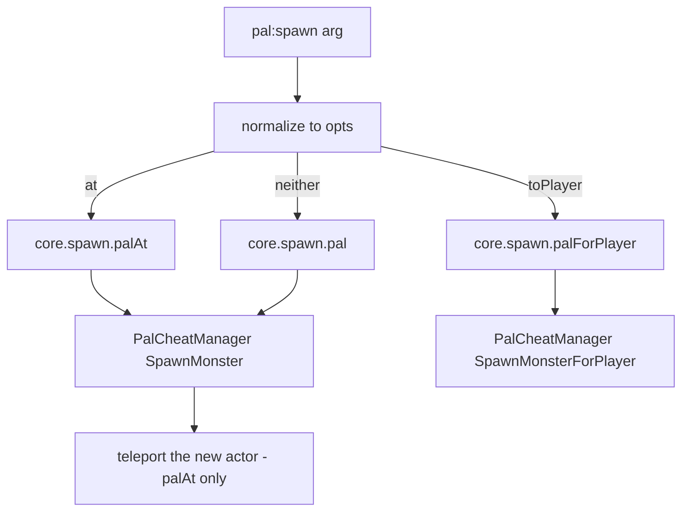

A pal is a spawnable creature. `Pal{ ... }` gives an existing game `CharacterID` metadata, a
mesh and lifecycle handlers, and returns a `Pal.Handle` carrying the actions. Defining
registers the definition under `("pal", id)` in the object registry, which is how
`core/event` finds it again: when a pal actor is captured, takes damage, dies or finishes
initializing, dispatch reads the actor's blueprint class name — `BP_ChickenPal_C` becomes
`ChickenPal` — looks that id up and calls your handler.

```lua title="content/pals.lua"
local pal = Pal{
    id          = "ChickenPal",
    name        = "Chicken Pal",
    description = "the one that greets you",
    events = {
        onCaptured = function(pal, ctx)
            Audio.get("AKE_Arena_Victory_01"):play(ctx.actor)
        end,
    },
}

pal:spawn(Player.coordinate())
```

The module has the same three entry points as every other api module:

```lua
Pal{ id = "ChickenPal" }    -- define + register, returns a Pal.Handle
Pal.get("SheepBall")        -- a handle for an existing id; never nil
Pal.get_all()               -- every PalForge-registered pal, as handles
```

`Pal.get` never returns nil: an id nobody defined gets a thin definition, which is enough to
`:spawn` it but carries no handlers. Only `Pal{ ... }` registers, and only a registered id
receives lifecycle dispatch.

Palworld's own creature list lives in `native/pals`:

```lua
local pals = require("palforge.native.pals")

pals.CATALOG               -- every DT_PalMonsterParameter_Common row id, as strings
pals.get("BlueSkyDragon")  -- a lazy Pal handle for any catalog id, nil for anything else
pals.Chicken               -- the curated ChickenPal demo definition
pals.SheepBall             -- the curated SheepBall demo definition
```

`pals.get(id)` defines and caches a bare `Pal{ id = id }` on first use, so asking for a
catalog id also registers it — from then on dispatch resolves that id, with inert handlers.

## Fields

`id` is the only required field. Anything not listed here is a hard error at define time,
with a did-you-mean suggestion. The same list is readable at runtime with
`require("palforge.core.schema").help("Pal.Spec")`.

<TypeTable
  type={{
    id: {
      description: 'pal id: a game CharacterID such as ChickenPal, or pack:name',
      type: 'string',
      required: true,
    },
    name: {
      description: 'shown in UI; defaults to id',
      type: 'string',
    },
    description: {
      description: 'one-line description, for UI and tooling',
      type: 'string',
    },
    skills: {
      description: 'skill ids this pal owns',
      type: 'string[]',
    },
    mesh: {
      description: 'the mesh attached to a spawned pawn: inline, or a Mesh handle',
      type: 'Mesh.Spec',
    },
    material: {
      description: 'material override applied to that mesh',
      type: 'Pal.Spec.Material',
    },
    color: {
      description: 'base tint r, g, b, a in 0..1 — shorthand for material.color',
      type: 'table',
    },
    texture: {
      description: 'png path applied to the mesh — shorthand for material.texture',
      type: 'string',
    },
    icon: {
      description: 'fallback icon used when the DataTable lookup misses',
      type: 'any',
    },
    events: {
      description: 'lifecycle handlers, grouped',
      type: 'Pal.Spec.Events',
    },
    data: {
      description: 'free-form payload of your own, carried onto the definition',
      type: 'table',
    },
  }}
/>

No field has a default. Two fields fall back at read time: `:name()` returns the id when
`name` is absent, and `:skillsOf()` returns an empty table when `skills` is absent.

An id containing a colon is a pack id: `"example:Boss"` resolves to the DataTable row FName
`example_Boss`. An id without a colon is a literal game id.

### mesh

`mesh` is `Mesh.Spec` itself, not a copy of it, so an inline table and a defined
[`Mesh{ ... }`](/docs/api/mesh) handle validate identically and reach the renderer the same
way.

<Tabs items={['Inline', 'Named']}>
<Tab value="Inline">

```lua
Pal{
    id   = "ChickenPal",
    mesh = {
        kind      = "skeletal",
        model     = "/Game/Pal/Model/Character/Monster/ChickenPal/SK_ChickenPal.SK_ChickenPal",
        animClass = "/Game/Pal/Blueprint/Character/Monster/PalActorBP/ChickenPal/ABP_ChickenPal.ABP_ChickenPal_C",
    },
}
```

</Tab>
<Tab value="Named">

```lua
local body = Mesh{
    id        = "example:sheep_body",
    kind      = "skeletal",
    model     = "/Game/Pal/Model/Character/Monster/SheepBall/SK_SheepBall.SK_SheepBall",
    animClass = "/Game/Pal/Blueprint/Character/Monster/PalActorBP/SheepBall/ABP_SheepBall.ABP_SheepBall_C",
}

Pal{ id = "SheepBall", mesh = body }
Pal{ id = "ChickenPal", mesh = Mesh.get("example:sheep_body") }
```

</Tab>
</Tabs>

The mesh fields are `kind` (`procedural`, `static`, `skeletal` or `obj`; defaults to
`skeletal`), `model` (required), `animClass` (skeletal only), `scale`, `offset`, `texture`,
`color`, `material` and `params`. `obj` is an alias for the procedural backend.

Declaring a mesh attaches nothing on its own. Pals have no instance scan, so you attach it
yourself with `:renderOn(actor)` — normally from `onSpawned`:

```lua
Pal{
    id   = "ChickenPal",
    mesh = { kind = "skeletal", model = "/Game/Pal/Model/Character/Monster/ChickenPal/SK_ChickenPal.SK_ChickenPal" },
    events = {
        onSpawned = function(pal, ctx) pal:renderOn(ctx.actor) end,
    },
}
```

### material, color and texture

`material` is the full override; `color` and `texture` are shorthands for two of its fields.

<TypeTable
  type={{
    color: { description: 'tint r, g, b, a in 0..1', type: 'table' },
    texture: { description: 'absolute path to a png applied to the mesh', type: 'string' },
    params: { description: 'extra material parameters passed through', type: 'table' },
    material: { description: 'base material asset path to instance from', type: 'string' },
  }}
/>

The two spellings are not merged. When `material` is present it is used whole and the
top-level `color` / `texture` are ignored; only when `material` is absent are the shorthands
assembled into a material descriptor. Inside `:renderOn`, whatever that descriptor carries
overrides the same field on the mesh, and a field it leaves out keeps the mesh's own value.

```lua
-- shorthand: tint the declared mesh red
Pal{
    id    = "ChickenPal",
    mesh  = { kind = "skeletal", model = "/Game/Pal/Model/Character/Monster/ChickenPal/SK_ChickenPal.SK_ChickenPal" },
    color = { r = 1.0, g = 0.2, b = 0.2, a = 1.0 },
}

-- long form: a base material plus parameters, which the shorthands cannot express
Pal{
    id   = "SheepBall",
    mesh = { kind = "skeletal", model = "/Game/Pal/Model/Character/Monster/SheepBall/SK_SheepBall.SK_SheepBall" },
    material = {
        color    = { r = 0.2, g = 0.5, b = 1.0, a = 1.0 },
        texture  = "C:/mods/example/sheep.png",
        material = "/Game/.../M_YourBaseMaterial",
        params   = { Roughness = 0.2 },
    },
}
```

`Pal.Spec` has no top-level shorthand for `params` or for a base material path — those exist
only inside `material`.

### skills

`skills` is a list of ids and nothing more: the framework does not equip them, and there is
no native skill source that fires them. Read the list back with `:skillsOf()` and drive each
skill yourself through [`Skill`](/docs/api/skill).

```lua
local boss = Pal{
    id     = "BOSS_ChickenPal",
    name   = "Chicken Boss",
    skills = { "FlameThrower" },
}

-- fire everything this pal owns at the player
for _, id in ipairs(boss:skillsOf()) do
    Skill.get(id):activate(Player.character())
end
```

### icon

`:iconOf()` looks the id up in `/Game/Pal/DataTable/Character/DT_PalCharacterIconDataTable`,
probing the `IconName`, `Icon` and `Texture` columns in that order, and returns the declared
`icon` on any miss — a missing table, a missing row or a missing column. The lookup uses the
raw id, so a namespaced `"example:Boss"` never matches a row and always falls back.

```lua
local pal = Pal{ id = "example:Boss", icon = "/Game/.../T_icon_example_boss" }
pal:iconOf()   -- the declared icon, since the DataTable has no "example:Boss" row
```

### data

`data` is copied onto the definition untouched; nothing in the framework reads it. The handle
exposes no accessor for it, so keep the table in a Lua local if you need it inside a handler.

```lua
local config = { reward = "Wood", amount = 5 }

local pal = Pal{
    id   = "ChickenPal",
    data = config,
    events = {
        onDeath = function(pal, ctx)
            Item.get(config.reward):give(config.amount)
        end,
    },
}
```

## Events

Handlers are grouped under `events`. Each one is `function(pal, ctx)` where `pal` is **this
definition's handle** — the same object the `Pal{ ... }` call returned, so `:spawn`,
`:renderOn` and the queries are right there — and `ctx` is the channel payload. An event name
the list below does not contain is a hard error, not a silent no-op.

The path from the game to your handler:

```text
native hook -> event.emit -> channel -> dispatch -> resolve BP class name -> pal:onX(ctx)
```

| Hook | Channel | Native source | ctx | State |
| --- | --- | --- | --- | --- |
| `onSpawned` | `pal.spawned` | `PalCharacter:BroadcastOnCompleteInitializeParameter` | `ctx.actor` | LIVE, candidate hook |
| `onDamaged` | `pal.damaged` | `PalCharacter:OnDamageReaction` | `ctx.actor` | LIVE |
| `onDeath` | `pal.death` | `PalCharacter:OnDeadCharacter` | `ctx.actor` | LIVE |
| `onCaptured` | `pal.captured` | `PalCharacterParameterComponent:SetIsCapturedProcessing` with `started == true` | `ctx.actor`, `ctx.comp` | LIVE |
| `onTick` | none | none | none | declarable; never fires |

`ctx.actor` is the pal pawn the event happened to. For `pal.captured` the native hook fires
on the parameter component, so the actor is that component's owner and `ctx.comp` is the
component itself. `onDamaged` fires on the pal that **took** damage, not on the attacker —
the source hook carries no attacker.

A handler that reacts to a capture and gives the player something back:

```lua
local log = require("palforge.utils.log").scope("example")

Pal{
    id   = "SheepBall",
    name = "Sheepball",
    events = {
        onCaptured = function(pal, ctx)
            log.info("captured " .. pal:name() .. ": " .. tostring(ctx.actor))
            Item.get("PalSphere"):give(1)
        end,
    },
}
```

A handler that reads live state off the actor before deciding:

```lua
Pal{
    id = "ChickenPal",
    events = {
        onDamaged = function(pal, ctx)
            local actor = ctx.actor
            if not (actor and actor.IsValid and actor:IsValid()) then return end
            Audio.get("AKE_Pal_Footstep"):play(actor)
        end,
    },
}
```

Handlers combine freely; each is optional:

```lua
local log = require("palforge.utils.log").scope("example")

Pal{
    id          = "ChickenPal",
    name        = "Chicken Pal",
    description = "logs every moment of its short life",
    events = {
        onSpawned  = function(pal, ctx) log.info("spawned "  .. tostring(ctx.actor)) end,
        onDamaged  = function(pal, ctx) log.info("damaged "  .. tostring(ctx.actor)) end,
        onDeath    = function(pal, ctx) log.info("died "     .. tostring(ctx.actor)) end,
        onCaptured = function(pal, ctx) log.info("captured " .. tostring(ctx.actor)) end,
    },
}
```

The two curated demo definitions in `native/pals.lua` (`ChickenPal` and `SheepBall`) are the
same shape with three of these handlers — `onCaptured`, `onDamaged` and `onDeath` — and exist
to prove the chain end to end: catch or kill a wild one and the log lines appear.

### Dispatch rules

Four things decide whether your handler runs.

1. **Resolution is by blueprint class name.** Dispatch matches `BP_<Id>_C` on the actor's
   class, then looks that id up in the registry. A namespaced definition also matches when
   its resolved FName equals the blueprint id, so `Pal{ id = "example:Boss" }` catches
   `BP_example_Boss_C`.
2. **Only registered ids get dispatch.** `Pal{ ... }` registers; `Pal.get(id)` does not. A
   vanilla pal with no PalForge definition resolves to nothing and the dispatch no-ops.
3. **Everything is gated on world-ready.** The source hooks return immediately until the
   world has loaded — five consecutive one-second polls that find a valid
   `PalPlayerCharacter`.
4. **Handlers run inside `pcall`.** An error in your handler is swallowed: no crash, and no
   message either. Log inside the handler when you need to see failures.

### Subscribing to the channel directly

Dispatch is one subscriber on a public channel. Subscribe yourself when you want every pal,
including the vanilla ones your pack has not defined:

```lua
local event = require("palforge.core.event")
local log   = require("palforge.utils.log").scope("example")

local sub = event.on("pal.death", function(ctx)
    log.info("some pal died: " .. tostring(ctx.actor))
end)

-- later
sub:unsubscribe()
```

`event.observable(name)` returns the same subject for Rx operator chains, and
`event.emit("pal.spawned", { actor = someActor })` pushes a synthetic event through the whole
chain. Dispatch still resolves the definition from `ctx.actor`'s blueprint class name, so a
hand-made ctx reaches your own subscribers but reaches a definition's handler only when the
actor is a real pal pawn. To run a handler on its own, use the event forwarders below.

## Handle

`Pal{ ... }`, `Pal.get` and `Pal.get_all` all hand back a `Pal.Handle`. It carries `.id`, two
actions, five event forwarders and five queries.

### spawn

```lua
---@param arg Coord|table|nil
---@return boolean ok
pal:spawn(arg)
```

The argument is normalized before anything happens: a table carrying `.x` or `[1]` is a
coordinate, any other table is an options table, and no argument at all means default
placement.

```lua
local pal = Pal.get("ChickenPal")

pal:spawn()                                   -- wild, near the player, level 1
pal:spawn(Player.coordinate())                -- at the player's exact position
pal:spawn(Player.coordinateOffset(300, 0, 0)) -- 3 m away on X
pal:spawn({ 12000, -4300, 800 })              -- array coordinate, x/y/z in centimetres
pal:spawn{ at = Player.coordinate(), level = 30 }
pal:spawn{ toPlayer = true, num = 3, level = 20 }   -- three, owned by the player
pal:spawn{ level = 45 }                             -- wild, near the player, level 45
```

The options table accepts `at` (a coordinate), `level` (defaults to 1), `toPlayer` (any
truthy value routes to the player-owned spawn) and `num` (defaults to 1, read only on the
`toPlayer` route).



Every route goes through `UPalCheatManager`, the server-verified admin API. The return value
is `true` when the native call executed, which is not the same as "the pal is where you asked
for it": on the coordinate route the game drops the pal near the player and ignores the
requested location, so PalForge snapshots the pal actors first, then relocates the single new
actor nearest the player's position — retried every 400 ms, up to six times, because the
actor materializes a few frames later.

### renderOn

```lua
---@param actor any
---@return boolean ok
pal:renderOn(actor)
```

Attaches this pal's declared mesh to a live pawn, once — the renderer guards against
re-stacking, so calling it twice on the same actor is harmless. It returns `false` and does
nothing when the actor is not valid, when the definition declares no mesh, or when that mesh
has no `model`.

```lua
Pal{
    id   = "SheepBall",
    mesh = { kind = "skeletal", model = "/Game/Pal/Model/Character/Monster/SheepBall/SK_SheepBall.SK_SheepBall" },
    events = {
        onSpawned = function(pal, ctx)
            if not pal:renderOn(ctx.actor) then
                require("palforge.utils.log").scope("example").warn("no mesh attached")
            end
        end,
    },
}
```

### Queries

```lua
pal:skillsOf()      --> string[]   the declared skill ids, an empty table when none
pal:mesh()          --> table?     the validated mesh declaration, nil when none
pal:iconOf()        --> any?       DataTable texture ref, else the declared icon, else nil
pal:name()          --> string     the declared name, else the id
pal:description()   --> string?    the declared description, or nil
```

```lua
local log = require("palforge.utils.log").scope("example")

for _, pal in ipairs(Pal.get_all()) do
    local m = pal:mesh()
    log.info(string.format("%s (%s) mesh=%s skills=%d",
        pal:name(), pal.id, tostring(m and m.model), #pal:skillsOf()))
end
```

### Event forwarders

`:onSpawned(ctx)`, `:onDamaged(ctx)`, `:onDeath(ctx)`, `:onCaptured(ctx)` and `:onTick(ctx)`
call the definition's handler immediately with the ctx you pass. Dispatch does not go through
them — they are for driving a handler yourself, from a test or from another handler.

```lua
-- run the death handler now, with a hand-made ctx
Pal.get("ChickenPal"):onDeath({ actor = Player.character() })
```

## Recipes

### A pal that dresses itself and announces its arrival

```lua title="content/party_chicken.lua"
local log = require("palforge.utils.log").scope("example")

local Fanfare = Audio.se{
    id        = "AKE_CampLevelUp",
    soundId   = "AKE_CampLevelUp",
    soundPath = "/Game/Pal/Sound/Events/SE/UI/CampLevelUp/AKE_CampLevelUp.AKE_CampLevelUp",
}

local Chicken = Pal{
    id          = "ChickenPal",
    name        = "Party Chicken",
    description = "wears a custom skin and announces itself",
    mesh = Mesh{
        id        = "example:party_chicken",
        kind      = "skeletal",
        model     = "/Game/Pal/Model/Character/Monster/ChickenPal/SK_ChickenPal.SK_ChickenPal",
        animClass = "/Game/Pal/Blueprint/Character/Monster/PalActorBP/ChickenPal/ABP_ChickenPal.ABP_ChickenPal_C",
    },
    color = { r = 1.0, g = 0.4, b = 0.1, a = 1.0 },
    events = {
        onSpawned = function(pal, ctx)
            if not pal:renderOn(ctx.actor) then
                log.warn("mesh not attached for " .. pal:name())
            end
            Fanfare:play(ctx.actor)
        end,
    },
}

Chicken:spawn(Player.coordinateOffset(300, 0, 0))
```

The sound is defined once at file scope and played from the handler. Defining inside a
handler would re-register the sound on every single spawn; when you have no local at hand,
use `Audio.get("AKE_CampLevelUp"):play(ctx.actor)` instead.

### A pal that drops loot on death

```lua title="content/woolly_sheep.lua"
local log = require("palforge.utils.log").scope("example")

local Wool = Item.get("Wool")
local Meat = Item.get("Meat")

Pal{
    id          = "SheepBall",
    name        = "Woolly Sheepball",
    description = "hands over wool and meat when it dies",
    events = {
        onDeath = function(pal, ctx)
            Wool:give(3)
            Meat:give(1)
            log.info(pal:name() .. " dropped its loot")
        end,
    },
}
```

`Item.get(...):give(n)` adds to the local player's inventory through the game's own
`AddItem_ServerInternal` path. PalForge has no world-drop call, so this is a reward, not a
corpse you walk over. See [Item](/docs/api/item) for the full surface.

### A pal that catches fire when it is hit

```lua title="content/singe_chicken.lua"
local log = require("palforge.utils.log").scope("example")

local Singe = Effect{
    id          = "example:Singe",
    name        = "Singe",
    description = "burns for six seconds after taking a hit",
    duration    = 6.0,
    interval    = 1.0,
    events = {
        onApply  = function(effect, target, ctx)
            log.info("singe applied by " .. tostring(ctx.source))
        end,
        onTick   = function(effect, target, ctx)
            log.info(string.format("singe tick at %.1fs", ctx.elapsed))
        end,
        onExpire = function(effect, target, ctx)
            log.info("singe over: " .. tostring(ctx.reason))
        end,
    },
}

Pal{
    id   = "ChickenPal",
    name = "Singed Chicken",
    events = {
        onDamaged = function(pal, ctx)
            if not ctx.actor then return end
            if Singe:isActive(ctx.actor) then return end
            Singe:apply(ctx.actor, { source = pal.id })
        end,
    },
}
```

The effect runtime is driven by the shared 500 ms heartbeat, so `onTick` fires roughly every
`interval` seconds until `duration` runs out. `ctx.elapsed`, `ctx.stacks` and (on expiry)
`ctx.reason` come from that runtime; anything else in the table is what you passed to
`:apply`. See [Effect](/docs/api/effect).

### A recolored squad you can summon on demand

```lua title="content/blue_squad.lua"
local log = require("palforge.utils.log").scope("example")

local Squad = Pal{
    id          = "SheepBall",
    name        = "Blue Squad",
    description = "a recolored sheepball unit",
    mesh = {
        kind      = "skeletal",
        model     = "/Game/Pal/Model/Character/Monster/SheepBall/SK_SheepBall.SK_SheepBall",
        animClass = "/Game/Pal/Blueprint/Character/Monster/PalActorBP/SheepBall/ABP_SheepBall.ABP_SheepBall_C",
        scale     = 1.2,
    },
    material = {
        color = { r = 0.2, g = 0.5, b = 1.0, a = 1.0 },
    },
    events = {
        onSpawned = function(pal, ctx) pal:renderOn(ctx.actor) end,
    },
}

-- spread `n` of them in a line to the player's north-east
local function summonSquad(n, level)
    local at = Player.coordinate()
    if not at then
        log.warn("no player coordinate - not in a world yet")
        return false
    end
    for i = 1, n do
        Squad:spawn{ at = { x = at.x + i * 250, y = at.y + 250, z = at.z }, level = level }
    end
    return true
end

summonSquad(5, 20)

-- the party-owned variant: three of them straight into the box
Squad:spawn{ toPlayer = true, num = 3, level = 20 }
```

Every member spawns through its own `SpawnMonster` call, and each one's `onSpawned` attaches
the mesh to its own actor.

## Limits

<Callout type="warn">

- **Lua cannot publish a new `CharacterID`.** `Pal{ id = ... }` attaches behaviour, visuals
  and metadata to a row and blueprint the game already has; creating the DataTable row is
  PalSchema's job. An id with no matching `BP_<Id>_C` in the game never receives dispatch,
  and `:spawn` has nothing to spawn.
- **`onTick` never fires.** Buildings have a ~500 ms scan that produces live instances; pals
  have no equivalent, so nothing drives a per-pal heartbeat. The field is declarable so the
  shape is uniform, and that is all. Use the heartbeat directly —
  `require("palforge.core.event").every(2000, fn)`, quantized to the 500 ms tick — or an
  Effect's `interval`.
- **`onSpawned` rides an unconfirmed candidate hook.**
  `PalCharacter:BroadcastOnCompleteInitializeParameter` has not been verified by the in-game
  event probe the way capture, damage and death were. Treat it as best-effort and keep the
  handler idempotent; `:renderOn` is attach-once, so calling it again is safe.
- **Nothing dispatches before the world is ready.** All four source hooks return immediately
  until five consecutive one-second polls have found a valid `PalPlayerCharacter`.
- **Handler errors are swallowed.** Dispatch calls your hook inside `pcall`, so a bug neither
  crashes the game nor reports itself. Log inside the handler.
- **`:spawn` needs `PalCheatManager`** — the CheatManagerEnabler mod. Without it every route
  returns `false` and writes a warning to the log.
- **Coordinate placement is a relocation, not a spawn location.** The native call ignores the
  requested location, so PalForge teleports the newly-spawned actor afterwards, retrying
  every 400 ms up to six times. `:spawn` returns `true` for the spawn call itself; if no new
  actor ever appears, the placement logs a warning and gives up.
- **A mesh is never attached for you.** Call `:renderOn(actor)` from a handler.
  `core.mesh.ENABLED` is a global kill switch that turns every attach into a no-op.
- **`Pal.get` does not register.** Only `Pal{ ... }` puts a definition in the registry, so a
  handle from `Pal.get` can act but can never receive an event. Defining the same id twice
  replaces the earlier definition.

</Callout>

<Cards>
  <Card title="Mesh" href="/docs/api/mesh">The visual a pal wears, and the backends behind it</Card>
  <Card title="Item" href="/docs/api/item">Give and take, for loot and rewards</Card>
  <Card title="Effect" href="/docs/api/effect">Timed status applications you drive from a pal handler</Card>
  <Card title="Skill" href="/docs/api/skill">What the ids in the skills list refer to</Card>
</Cards>
