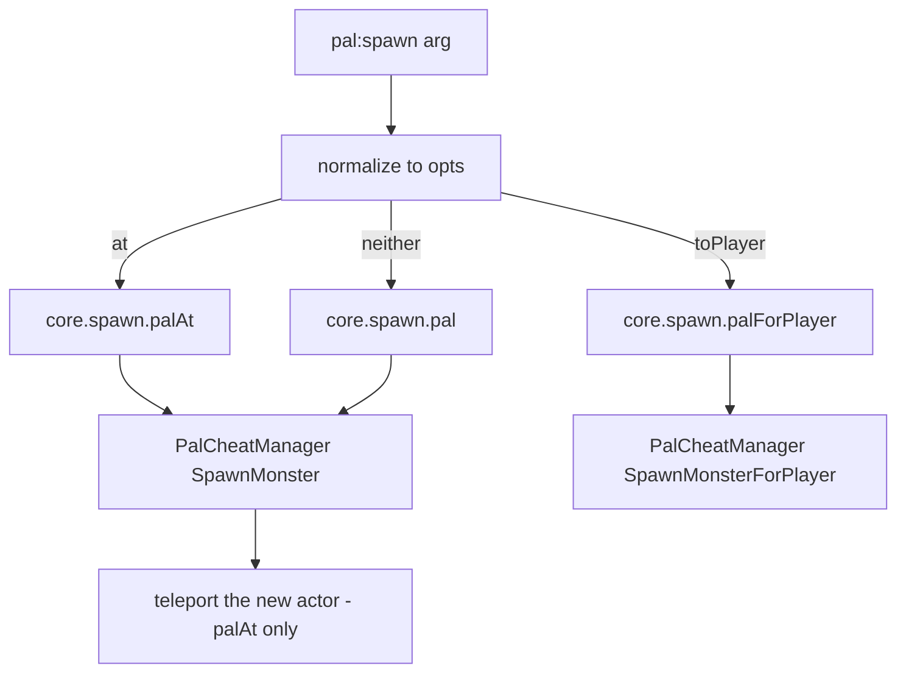

## What you can do after this page

- Make a creature react the moment you catch it, hit it or kill it
- Hand the player an item, or play a sound, when a pal dies
- Give a pal a different body, a different colour and a different size
- Drop a pal into the world where you are standing, at the level you pick
- Run your own code on every one of your pals, over and over, while the game is playing

## Make a pal

A pal is a creature you can spawn. Write `Pal{ ... }` with the game's own name for that
creature, and you get back an object you can spawn, look up later and hang behaviour on.

```lua title="content/pals.lua"
local pal = Pal{
    id          = "ChickenPal",
    name        = "Chicken Pal",
    description = "the one that greets you",
    events = {
        onCaptured = function(pal, ctx)
            Audio.get("AKE_Arena_Victory_01"):play(ctx.actor)
        end,
    },
}

pal:spawn(Player.coordinate())
```

Catch a Chicken Pal in your game and the victory jingle plays. That is the whole loop:
say which creature you mean, say what should happen to it, and PalForge does the rest.

There are three ways in:

```lua
Pal{ id = "ChickenPal" }    -- define + register, returns a Pal.Handle
Pal.get("SheepBall")        -- a handle for an existing id; never nil
Pal.get_all()               -- every PalForge-registered pal, as handles
```

`Pal.get` never returns nil. An id nobody defined gets a thin definition — enough to
`:spawn` it, but with no handlers on it. Only `Pal{ ... }` registers a pal, and only a
registered pal ever gets its handlers called.

Palworld's own creature list lives in `native/pals`:

```lua
local pals = require("palforge.native.pals")

pals.CATALOG               -- every DT_PalMonsterParameter_Common row id, as strings
pals.get("BlueSkyDragon")  -- a lazy Pal handle for any catalog id, nil for anything else
pals.Chicken               -- the curated ChickenPal demo definition
pals.SheepBall             -- the curated SheepBall demo definition
```

`pals.get(id)` defines and caches a bare `Pal{ id = id }` the first time you ask for it.
Asking for a catalog id therefore registers it too, so events start reaching that id — with
empty handlers until you give it some.

## Fields

`id` is the only field you have to fill in. Anything not on this list is an error the moment
you call `Pal{ ... }`, with a did-you-mean suggestion, so a typo shows up straight away
instead of being quietly ignored. The same list is readable while the game runs, with
`require("palforge.core.schema").help("Pal.Spec")`.

<TypeTable
  type={{
    id: {
      description: 'pal id: a game CharacterID such as ChickenPal, or pack:name',
      type: 'string',
      required: true,
    },
    name: {
      description: 'shown in UI; defaults to id',
      type: 'string',
    },
    description: {
      description: 'one-line description, for UI and tooling',
      type: 'string',
    },
    skills: {
      description: 'skill ids this pal owns',
      type: 'string[]',
    },
    mesh: {
      description: 'the mesh attached to a spawned pawn: inline, or a Mesh handle',
      type: 'Mesh.Spec',
    },
    material: {
      description: 'material override applied to that mesh',
      type: 'Pal.Spec.Material',
    },
    color: {
      description: 'base tint r, g, b, a in 0..1 — shorthand for material.color',
      type: 'table',
    },
    texture: {
      description: 'png path applied to the mesh — shorthand for material.texture',
      type: 'string',
    },
    icon: {
      description: 'fallback icon used when the DataTable lookup misses',
      type: 'any',
    },
    events: {
      description: 'lifecycle handlers, grouped',
      type: 'Pal.Spec.Events',
    },
    data: {
      description: 'free-form payload of your own, carried onto the definition',
      type: 'table',
    },
  }}
/>

No field has a default. Two of them fall back when you read them: `:name()` gives you the id
when you left `name` out, and `:skillsOf()` gives you an empty table when you left `skills`
out.

An id with a colon in it is your own: `"example:Boss"` matches the game data row named
`example_Boss`. An id without a colon is one of the game's own, such as `ChickenPal`.

### mesh

A mesh is the 3D model a creature wears. Write it inline, or define it once with
[`Mesh{ ... }`](/docs/api/mesh) and pass that. Both forms are checked the same way and reach
the renderer the same way, so pick whichever suits the file.

<Tabs items={['Inline', 'Named']}>
<Tab value="Inline">

```lua
Pal{
    id   = "ChickenPal",
    mesh = {
        kind      = "skeletal",
        model     = "/Game/Pal/Model/Character/Monster/ChickenPal/SK_ChickenPal.SK_ChickenPal",
        animClass = "/Game/Pal/Blueprint/Character/Monster/PalActorBP/ChickenPal/ABP_ChickenPal.ABP_ChickenPal_C",
    },
}
```

</Tab>
<Tab value="Named">

```lua
local body = Mesh{
    id        = "example:sheep_body",
    kind      = "skeletal",
    model     = "/Game/Pal/Model/Character/Monster/SheepBall/SK_SheepBall.SK_SheepBall",
    animClass = "/Game/Pal/Blueprint/Character/Monster/PalActorBP/SheepBall/ABP_SheepBall.ABP_SheepBall_C",
}

Pal{ id = "SheepBall", mesh = body }
Pal{ id = "ChickenPal", mesh = Mesh.get("example:sheep_body") }
```

</Tab>
</Tabs>

The mesh fields are `kind` (`procedural`, `static`, `skeletal` or `obj`; defaults to
`skeletal`), `model` (required), `animClass` (skeletal only), `scale`, `offset`, `texture`,
`color`, `material` and `params`. `obj` is another name for the procedural backend.

Declaring a mesh does not put it on anything. You attach it yourself with
`:renderOn(actor)`, normally from `onSpawned` — the handler that runs once a pal has finished
appearing in the world:

```lua
Pal{
    id   = "ChickenPal",
    mesh = { kind = "skeletal", model = "/Game/Pal/Model/Character/Monster/ChickenPal/SK_ChickenPal.SK_ChickenPal" },
    events = {
        onSpawned = function(pal, ctx) pal:renderOn(ctx.actor) end,
    },
}
```

### material, color and texture

`material` is the full override. `color` and `texture` are short spellings for two of its
fields, for when that is all you need.

<TypeTable
  type={{
    color: { description: 'tint r, g, b, a in 0..1', type: 'table' },
    texture: { description: 'absolute path to a png applied to the mesh', type: 'string' },
    params: { description: 'extra material parameters passed through', type: 'table' },
    material: { description: 'base material asset path to instance from', type: 'string' },
  }}
/>

The two spellings are not mixed together. When you give `material`, it is used whole and the
top-level `color` and `texture` are ignored. Only when `material` is absent are the short
spellings assembled into a material description. Inside `:renderOn`, whatever that
description carries wins over the same field on the mesh, and a field it leaves out keeps
the mesh's own value.

```lua
-- shorthand: tint the declared mesh red
Pal{
    id    = "ChickenPal",
    mesh  = { kind = "skeletal", model = "/Game/Pal/Model/Character/Monster/ChickenPal/SK_ChickenPal.SK_ChickenPal" },
    color = { r = 1.0, g = 0.2, b = 0.2, a = 1.0 },
}

-- long form: a base material plus parameters, which the shorthands cannot express
Pal{
    id   = "SheepBall",
    mesh = { kind = "skeletal", model = "/Game/Pal/Model/Character/Monster/SheepBall/SK_SheepBall.SK_SheepBall" },
    material = {
        color    = { r = 0.2, g = 0.5, b = 1.0, a = 1.0 },
        texture  = "C:/mods/example/sheep.png",
        material = "/Game/.../M_YourBaseMaterial",
        params   = { Roughness = 0.2 },
    },
}
```

There is no top-level short spelling for `params` or for a base material path. Those live
inside `material` only.

<Callout type="warn">
Those four fields only paint on the procedural and `obj` backends. `kind = "skeletal"` — the
default for a pal's mesh — swaps the creature's model and reads nothing else, and `static`
paints nothing either. A `color` or `texture` next to a skeletal mesh is carried down to
`core.mesh` and does nothing there. On that backend a `true` from `:renderOn` means the model
was swapped, not that it was painted. The backend table is on [Mesh](/docs/api/mesh).
</Callout>

### skills

`skills` is a list of ids and nothing more. PalForge does not equip them, and nothing in the
game fires them. Read the list back with `:skillsOf()` and run each skill yourself through
[`Skill`](/docs/api/skill).

```lua
local boss = Pal{
    id     = "BOSS_ChickenPal",
    name   = "Chicken Boss",
    skills = { "FlameThrower" },
}

-- fire everything this pal owns at the player
for _, id in ipairs(boss:skillsOf()) do
    Skill.get(id):activate(Player.character())
end
```

### icon

`:iconOf()` looks the id up in the game's own pal icon tables —
`DT_PalCharacterIconDataTable`, then `DT_PalCharacterIconDataTable_Common` — and reads the
first of the `SoftIcon`, `IconName`, `IconTexture`, `Icon` and `Texture` columns that holds
something. On any miss, whether the table, the row or the column is what is missing, you get
the `icon` you declared. The lookup uses the raw id, so a namespaced `"example:Boss"` never
matches a row and always falls back.

```lua
local pal = Pal{ id = "example:Boss", icon = "/Game/.../T_icon_example_boss" }
pal:iconOf()   -- the declared icon, since the DataTable has no "example:Boss" row
```

### data

`data` is copied onto the definition untouched, and nothing in PalForge reads it. The handle
has no accessor for it, so keep the table in a Lua local if you want it inside a handler.

```lua
local config = { reward = "Wood", amount = 5 }

local pal = Pal{
    id   = "ChickenPal",
    data = config,
    events = {
        onDeath = function(pal, ctx)
            Item.get(config.reward):give(config.amount)
        end,
    },
}
```

## Events

This is where a pal gets its behaviour. Put your handlers under `events`. Each one is
`function(pal, ctx)`, where `pal` is **this definition's handle** — the same object
`Pal{ ... }` returned, so `:spawn`, `:renderOn` and the queries are right there — and `ctx`
is a table describing what just happened. An event name that is not in the list below is an
error at define time, not a silent no-op.

PalForge listens to the game, puts each event on a named channel, then finds the pal it
happened to and calls your handler:

```text
native hook -> event.emit -> channel -> dispatch -> resolve BP class name -> pal:onX(ctx)
```

| Hook | Channel | Native source | ctx | State |
| --- | --- | --- | --- | --- |
| `onSpawned` | `pal.spawned` | `PalCharacter:BroadcastOnCompleteInitializeParameter` | `ctx.actor` | LIVE, unconfirmed hook, armed after the world loads |
| `onDamaged` | `pal.damaged` | `PalCharacter:OnDamageReaction` | `ctx.actor` | LIVE |
| `onDeath` | `pal.death` | `PalCharacter:OnDeadCharacter` | `ctx.actor` | LIVE |
| `onCaptured` | `pal.captured` | `PalCharacterParameterComponent:SetIsCapturedProcessing` with `started == true` | `ctx.actor`, `ctx.comp` | LIVE |
| `onTick` | `tick` | no game event: `core/event` walks the live pals itself | `ctx.actor`, `ctx.count`, `ctx.now` | LIVE, once per live pal every `core.event.PAL_SCAN_MS` — 3 s by default |

`ctx.actor` is the creature in the world that the event happened to. For `pal.captured` the
game fires on the pal's parameter component, so the actor is that component's owner and
`ctx.comp` is the component itself. `onDamaged` fires on the pal that **took** the damage,
never on the attacker — the game's own hook does not say who attacked.

A handler that reacts to a capture and gives the player something back:

```lua
local log = require("palforge.utils.log").scope("example")

Pal{
    id   = "SheepBall",
    name = "Sheepball",
    events = {
        onCaptured = function(pal, ctx)
            log.info("captured " .. pal:name() .. ": " .. tostring(ctx.actor))
            Item.get("PalSphere"):give(1)
        end,
    },
}
```

A handler that checks the creature is still valid before touching it:

```lua
Pal{
    id = "ChickenPal",
    events = {
        onDamaged = function(pal, ctx)
            local actor = ctx.actor
            if not (actor and actor.IsValid and actor:IsValid()) then return end
            Audio.get("AKE_Pal_Footstep"):play(actor)
        end,
    },
}
```

`onTick` runs on its own, roughly every three seconds, once for every live pal of that id.
`ctx.count` counts the 500 ms heartbeats since the mod loaded, so it is an easy way to do
something only now and then:

```lua
local log = require("palforge.utils.log").scope("example")

Pal{
    id = "ChickenPal",
    events = {
        onTick = function(pal, ctx)
            -- ctx.actor is one live Chicken Pal; this runs once per pal, per sweep
            if ctx.count % 12 == 0 then
                log.info("chicken still here: " .. tostring(ctx.actor))
            end
        end,
    },
}

-- slow the sweep down, or switch it off with 0
require("palforge.core.event").PAL_SCAN_MS = 5000
```

Handlers combine freely, and each one is optional:

```lua
local log = require("palforge.utils.log").scope("example")

Pal{
    id          = "ChickenPal",
    name        = "Chicken Pal",
    description = "logs every moment of its short life",
    events = {
        onSpawned  = function(pal, ctx) log.info("spawned "  .. tostring(ctx.actor)) end,
        onDamaged  = function(pal, ctx) log.info("damaged "  .. tostring(ctx.actor)) end,
        onDeath    = function(pal, ctx) log.info("died "     .. tostring(ctx.actor)) end,
        onCaptured = function(pal, ctx) log.info("captured " .. tostring(ctx.actor)) end,
    },
}
```

PalForge ships two ready-made pals in `native/pals.lua` — `ChickenPal` and `SheepBall` — with
`onCaptured`, `onDamaged` and `onDeath` already wired to log lines. Catch or kill a wild one
and those lines appear, which is the quickest way to check the chain works in your game.

### What decides whether your handler runs

Four things.

1. **A pal is identified by its blueprint class name.** Every creature in the game has a
   generated class called `BP_<Id>_C`. PalForge reads that name off the creature, turns
   `BP_ChickenPal_C` into `ChickenPal`, and looks that id up. A namespaced definition matches
   too when its resolved name equals the blueprint id, so `Pal{ id = "example:Boss" }` catches
   `BP_example_Boss_C`.
2. **Only registered ids get events.** `Pal{ ... }` registers; `Pal.get(id)` does not. A
   vanilla pal you never defined resolves to nothing and the event is dropped.
3. **Nothing runs until the world is ready.** The game hooks return immediately until five
   one-second polls in a row have found a valid `PalPlayerCharacter`. The `onTick` sweep waits
   for the same gate.
4. **Handlers run inside `pcall`, and a failure is logged.** An error in your handler neither
   crashes the game nor stops the channel. PalForge catches it and writes the channel, the
   hook and the message to the log — `pal.death -> onDeath handler failed: ...`. Everything
   after the failing line in that handler is still skipped.

### Listening to every pal, not just your own

Your handlers only run for pals you defined. To hear about every pal in the world, including
the vanilla ones, subscribe to the channel yourself:

```lua
local event = require("palforge.core.event")
local log   = require("palforge.utils.log").scope("example")

local sub = event.on("pal.death", function(ctx)
    log.info("some pal died: " .. tostring(ctx.actor))
end)

-- later
sub:unsubscribe()
```

`event.observable(name)` gives you the same channel as an Rx observable, for operator chains.
`event.emit("pal.spawned", { actor = someActor })` pushes an event you made yourself through
the whole chain. PalForge still works out the definition from `ctx.actor`'s blueprint class
name, so a hand-made ctx reaches your own subscribers, but reaches a definition's handler only
when the actor really is a pal in the world. To run a handler on its own, use the event
forwarders below.

## Handle

`Pal{ ... }`, `Pal.get` and `Pal.get_all` all hand back a `Pal.Handle`. It carries `.id`, two
actions, five event forwarders and five queries.

### spawn

```lua
---@param arg Coord|table|nil
---@return boolean accepted
pal:spawn(arg)
```

The argument is sorted out before anything happens: a table with `.x` or `[1]` in it is a
coordinate, any other table is an options table, and no argument at all means default
placement.

```lua
local pal = Pal.get("ChickenPal")

pal:spawn()                                   -- wild, near the player, level 1
pal:spawn(Player.coordinate())                -- at the player's exact position
pal:spawn(Player.coordinateOffset(300, 0, 0)) -- 3 m away on X
pal:spawn({ 12000, -4300, 800 })              -- array coordinate, x/y/z in centimetres
pal:spawn{ at = Player.coordinate(), level = 30 }
pal:spawn{ toPlayer = true, num = 3, level = 20 }   -- three, owned by the player
pal:spawn{ level = 45 }                             -- wild, near the player, level 45
```

The options table takes `at` (a coordinate), `level` (defaults to 1), `toPlayer` (anything
truthy sends the pal to the player instead of the world) and `num` (defaults to 1, and is only
read on the `toPlayer` route).



Every route goes through `UPalCheatManager`, the game's server-checked admin API. `true` means
the spawn call was **accepted**, not that a pal is standing anywhere: the creature appears a
few frames later, and the coordinate route then moves it in a pass that finishes long after
`:spawn` has returned. That pass reports to the log, never to your caller. `false` is
definite — nothing was attempted, because the id was empty, a coordinate was not a number, or
no cheat manager could be reached.

On the coordinate route the game drops the pal near the player and ignores the position you
asked for. So PalForge takes a snapshot of the pals first, then moves the single new one
nearest the player — retried every 400 ms, up to six times, because the creature takes a few
frames to appear.

#### The cheat manager

`SpawnMonster` and `SpawnMonsterForPlayer` live on `UPalCheatManager`. On a client, the
CheatManagerEnabler mod creates that object from `PlayerController:ClientRestart`; on a
dedicated server that hook never fires, so nothing else creates one. `core/spawn` builds it
itself when the session has none: it constructs the `PalPlayerController`'s own `CheatClass`
with `StaticConstructObject` — falling back to `/Script/Pal.PalCheatManager` and then
`/Script/Engine.CheatManager` when that class is null — and attaches the result to the
controller. The object stays there, so this happens once per session rather than once per
spawn, and the log records the one time it runs. That is what makes `:spawn` work on a
dedicated server.

What is left to fail is having no player controller at all: no world loaded, or not connected
yet. Every route then returns `false` and warns that no cheat manager was found and none could
be built. Spawning from `world.ready` avoids that window:

```lua
local event = require("palforge.core.event")
local log   = require("palforge.utils.log").scope("example")

event.on("world.ready", function()
    if not Pal.get("ChickenPal"):spawn{ level = 10 } then
        log.warn("spawn not attempted - no player controller yet")
    end
end)
```

### renderOn

```lua
---@param actor any
---@return boolean ok
pal:renderOn(actor)
```

Attaches this pal's declared mesh to a live creature, once. The renderer guards against
stacking it twice, so calling it again on the same actor is harmless. It returns `false` and
does nothing when the actor is not valid, when the definition declares no mesh, or when that
mesh has no `model`.

```lua
Pal{
    id   = "SheepBall",
    mesh = { kind = "skeletal", model = "/Game/Pal/Model/Character/Monster/SheepBall/SK_SheepBall.SK_SheepBall" },
    events = {
        onSpawned = function(pal, ctx)
            if not pal:renderOn(ctx.actor) then
                require("palforge.utils.log").scope("example").warn("no mesh attached")
            end
        end,
    },
}
```

The whole declaration is handed to the renderer: `kind`, `model`, `animClass`, `scale` and
`offset` come from the mesh, and the definition's material description then overwrites the
`color`, `texture`, `params` and `material` it carries. `animClass` reaches the skeletal
backend, which switches to animation-blueprint mode and binds that blueprint right after the
swap. A swapped skeleton with nothing driving it does not animate and can vanish from view, so
declare the `ABP_*_C` that belongs to the model you swapped in — not the one the creature was
born with.

```lua
-- a chicken wearing a sheepball body: the anim blueprint travels with the model
Pal{
    id   = "ChickenPal",
    mesh = {
        kind      = "skeletal",
        model     = "/Game/Pal/Model/Character/Monster/SheepBall/SK_SheepBall.SK_SheepBall",
        animClass = "/Game/Pal/Blueprint/Character/Monster/PalActorBP/SheepBall/ABP_SheepBall.ABP_SheepBall_C",
    },
    events = {
        onSpawned = function(pal, ctx) pal:renderOn(ctx.actor) end,
    },
}
```

A `true` says the backend's setter ran — for the skeletal backend, that the model was set on
the creature's own component. What it ends up drawing is not something the call can report.

### Queries

```lua
pal:skillsOf()      --> string[]   the declared skill ids, an empty table when none
pal:mesh()          --> table?     the validated mesh declaration, nil when none
pal:iconOf()        --> any?       DataTable texture ref, else the declared icon, else nil
pal:name()          --> string     the declared name, else the id
pal:description()   --> string?    the declared description, or nil
```

```lua
local log = require("palforge.utils.log").scope("example")

for _, pal in ipairs(Pal.get_all()) do
    local m = pal:mesh()
    log.info(string.format("%s (%s) mesh=%s skills=%d",
        pal:name(), pal.id, tostring(m and m.model), #pal:skillsOf()))
end
```

### Event forwarders

`:onSpawned(ctx)`, `:onDamaged(ctx)`, `:onDeath(ctx)`, `:onCaptured(ctx)` and `:onTick(ctx)`
call the definition's handler straight away, with the ctx you pass. The game never goes
through them — they are there so you can run a handler yourself, from a test or from another
handler.

```lua
-- run the death handler now, with a hand-made ctx
Pal.get("ChickenPal"):onDeath({ actor = Player.character() })
```

## Recipes

### A pal that dresses itself and announces its arrival

```lua title="content/party_chicken.lua"
local log = require("palforge.utils.log").scope("example")

local Fanfare = Audio.se{
    id        = "AKE_CampLevelUp",
    soundId   = "AKE_CampLevelUp",
    soundPath = "/Game/Pal/Sound/Events/SE/UI/CampLevelUp/AKE_CampLevelUp.AKE_CampLevelUp",
}

local Chicken = Pal{
    id          = "ChickenPal",
    name        = "Party Chicken",
    description = "wears a custom skin and announces itself",
    mesh = Mesh{
        id        = "example:party_chicken",
        kind      = "skeletal",
        model     = "/Game/Pal/Model/Character/Monster/ChickenPal/SK_ChickenPal.SK_ChickenPal",
        animClass = "/Game/Pal/Blueprint/Character/Monster/PalActorBP/ChickenPal/ABP_ChickenPal.ABP_ChickenPal_C",
    },
    color = { r = 1.0, g = 0.4, b = 0.1, a = 1.0 },
    events = {
        onSpawned = function(pal, ctx)
            if not pal:renderOn(ctx.actor) then
                log.warn("mesh not attached for " .. pal:name())
            end
            Fanfare:play(ctx.actor)
        end,
    },
}

Chicken:spawn(Player.coordinateOffset(300, 0, 0))
```

Define the sound once, at the top of the file, and only play it from the handler. Defining
inside a handler would register the sound again on every single spawn. When you have no local
to hand, use `Audio.get("AKE_CampLevelUp"):play(ctx.actor)` instead.

### A pal that drops loot on death

```lua title="content/woolly_sheep.lua"
local log = require("palforge.utils.log").scope("example")

local Wool = Item.get("Wool")
local Meat = Item.get("Meat")

Pal{
    id          = "SheepBall",
    name        = "Woolly Sheepball",
    description = "hands over wool and meat when it dies",
    events = {
        onDeath = function(pal, ctx)
            Wool:give(3)
            Meat:give(1)
            log.info(pal:name() .. " dropped its loot")
        end,
    },
}
```

`Item.get(...):give(n)` adds to the local player's inventory through the game's own
`AddItem_ServerInternal` path. PalForge has no call for dropping something on the ground, so
this is a reward the player receives, not a bag you walk over. See
[Item](/docs/api/item) for everything else you can do with items.

### A pal that catches fire when it is hit

```lua title="content/singe_chicken.lua"
local log = require("palforge.utils.log").scope("example")

local Singe = Effect{
    id          = "example:Singe",
    name        = "Singe",
    description = "burns for six seconds after taking a hit",
    duration    = 6.0,
    interval    = 1.0,
    events = {
        onApply  = function(effect, target, ctx)
            log.info("singe applied by " .. tostring(ctx.source))
        end,
        onTick   = function(effect, target, ctx)
            log.info(string.format("singe tick at %.1fs", ctx.elapsed))
        end,
        onExpire = function(effect, target, ctx)
            log.info("singe over: " .. tostring(ctx.reason))
        end,
    },
}

Pal{
    id   = "ChickenPal",
    name = "Singed Chicken",
    events = {
        onDamaged = function(pal, ctx)
            if not ctx.actor then return end
            if Singe:isActive(ctx.actor) then return end
            Singe:apply(ctx.actor, { source = pal.id })
        end,
    },
}
```

An effect runs on the shared 500 ms heartbeat, so its `onTick` fires roughly every `interval`
seconds until `duration` runs out. `ctx.elapsed`, `ctx.stacks` and, on expiry, `ctx.reason`
come from that runtime; anything else in the table is what you passed to `:apply`. See
[Effect](/docs/api/effect).

### A recolored squad you can summon on demand

```lua title="content/blue_squad.lua"
local log = require("palforge.utils.log").scope("example")

local Squad = Pal{
    id          = "SheepBall",
    name        = "Blue Squad",
    description = "a recolored sheepball unit",
    mesh = {
        kind      = "skeletal",
        model     = "/Game/Pal/Model/Character/Monster/SheepBall/SK_SheepBall.SK_SheepBall",
        animClass = "/Game/Pal/Blueprint/Character/Monster/PalActorBP/SheepBall/ABP_SheepBall.ABP_SheepBall_C",
        scale     = 1.2,
    },
    material = {
        color = { r = 0.2, g = 0.5, b = 1.0, a = 1.0 },
    },
    events = {
        onSpawned = function(pal, ctx) pal:renderOn(ctx.actor) end,
    },
}

-- spread `n` of them in a line to the player's north-east
local function summonSquad(n, level)
    local at = Player.coordinate()
    if not at then
        log.warn("no player coordinate - not in a world yet")
        return false
    end
    for i = 1, n do
        Squad:spawn{ at = { x = at.x + i * 250, y = at.y + 250, z = at.z }, level = level }
    end
    return true
end

summonSquad(5, 20)

-- the party-owned variant: three of them straight into the box
Squad:spawn{ toPlayer = true, num = 3, level = 20 }
```

Every member spawns through its own `SpawnMonster` call, and each one's `onSpawned` attaches
the mesh to its own creature.

## Limits

<Callout type="warn">

- **Lua cannot add a brand-new creature.** `Pal{ id = ... }` gives behaviour, visuals and
  metadata to a creature the game already has; creating the data row itself is PalSchema's
  job. An id with no matching `BP_<Id>_C` in the game never gets its handlers called, and
  `:spawn` has nothing to spawn.
- **`onTick` is a sweep, not a game event.** `core/event` walks the live pals every
  `core.event.PAL_SCAN_MS` — 3000 ms by default — and calls `onTick` once per live creature.
  Set `require("palforge.core.event").PAL_SCAN_MS = 5000` to slow it down, or `0` to switch it
  off. It is deliberately slower than the 500 ms heartbeat, because the walk touches every
  object in the game. When you need a faster or more exact timer, use
  `require("palforge.core.event").every(2000, fn)` — quantized to the 500 ms tick — or an
  Effect's `interval`.
- **`onTick` has no per-creature memory.** `pal` is this definition's handle, and there is one
  handle for every creature of that id, so keep anything per-creature in a table of your own
  keyed by `ctx.actor`.
- **A broken `onTick` gets switched off.** Five failures in a row and PalForge logs it and
  stops calling that definition's `onTick` for the rest of the session — for every creature of
  that id, not just the one that failed.
- **`onSpawned` rides a hook that has not been confirmed.**
  `PalCharacter:BroadcastOnCompleteInitializeParameter` has not been verified in-game the way
  capture, damage and death have, and it is armed only once the world has loaded, because
  arming it earlier jams the shared hook dispatch during the world-load storm. Treat it as
  best-effort and write a handler that is safe to run more than once; `:renderOn` attaches
  once, so calling it again is safe.
- **Nothing runs before the world is ready.** All four game hooks return immediately until
  five one-second polls in a row have found a valid `PalPlayerCharacter`, and the `onTick`
  sweep waits for the same gate.
- **A handler error ends that handler.** PalForge calls your hook inside `pcall` and logs the
  failure with its channel and hook name, so the bug is visible in the log — but the rest of
  the handler does not run, and neither the channel nor the game notices.
- **`:spawn` needs a player controller.** It needs `PalCheatManager` too, but nothing else has
  to create that first: when the session has none, `core/spawn` builds one from the
  controller's `CheatClass` and attaches it, which is what makes `:spawn` work on a dedicated
  server, where CheatManagerEnabler's `ClientRestart` hook never runs. With no
  `PalPlayerController` to build it on, every route returns `false` and warns.
- **A coordinate is a move after the spawn, not a spawn location.** The game's own call ignores
  the position you asked for, so PalForge teleports the newly-spawned creature afterwards,
  retrying every 400 ms up to six times. `:spawn` returns `true` for the spawn call itself; the
  move only ever reports to the log — a warning when no new creature appears, and another when
  one was found but every move call failed and it stays where it spawned. Without `LoopAsync`
  and `ExecuteInGameThread` there is no deferred pass at all, and the pal simply stays next to
  the player.
- **A mesh is never attached for you.** Call `:renderOn(actor)` from a handler.
  `core.mesh.ENABLED` is a global kill switch that turns every attach into a no-op, and the
  material fields reach a backend that paints only when `kind` is `procedural` or `obj`.
- **`Pal.get` does not register.** Only `Pal{ ... }` puts a definition in the registry, so a
  handle from `Pal.get` can act but can never receive an event. Defining the same id twice
  replaces the earlier definition.

</Callout>

## Summary

- `Pal{ id = "ChickenPal", ... }` gives one of the game's creatures new behaviour. `id` is
  the only field you have to fill in.
- What happens to a pal goes under `events`: `onSpawned`, `onDamaged`, `onDeath`,
  `onCaptured` and `onTick`. Every one of them is live.
- `pal:spawn()` puts a pal in the world. Pass a coordinate for a place, or
  `{ toPlayer = true, num = 3 }` to send them straight to the player.
- A `mesh` changes what a pal looks like, but you attach it yourself with
  `pal:renderOn(ctx.actor)` from `onSpawned`.
- Only ids you defined with `Pal{ ... }` get their handlers called; `Pal.get` gives you the
  actions without the events.
- `onTick` runs about every three seconds per live pal, and has no memory of its own — key
  anything per-creature by `ctx.actor`.

Next, read [Mesh](/docs/api/mesh) to give your pal a body of its own.

<Cards>
  <Card title="Mesh" href="/docs/api/mesh">The visual a pal wears, and the backends behind it</Card>
  <Card title="Item" href="/docs/api/item">Give and take, for loot and rewards</Card>
  <Card title="Effect" href="/docs/api/effect">Timed status applications you drive from a pal handler</Card>
  <Card title="Skill" href="/docs/api/skill">What the ids in the skills list refer to</Card>
</Cards>
