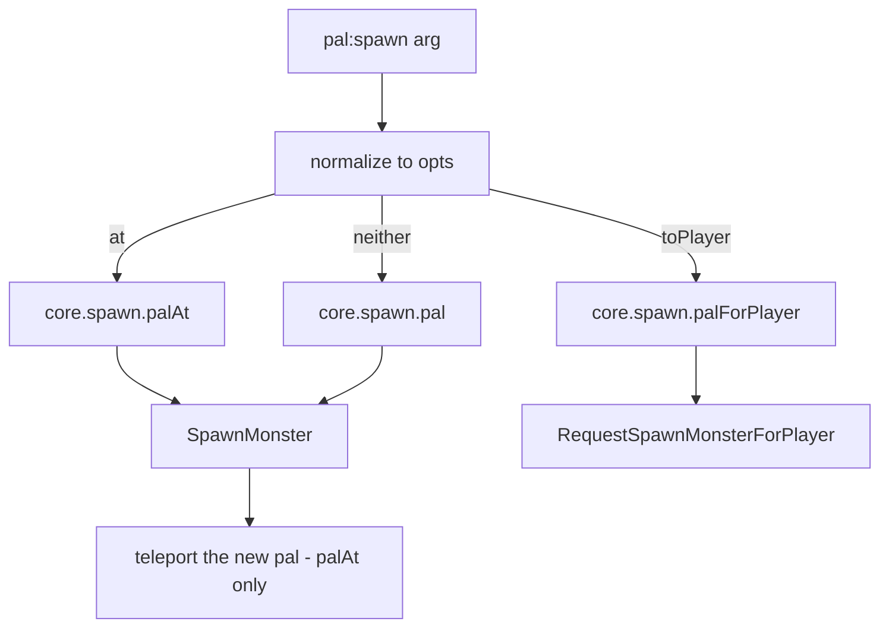

## 读完本页你可以做到

- 让帕鲁在被捕捉、被打中、被击杀的那一刻做出反应
- 帕鲁死亡时播放一段音效，或者开始一个有时限的效果
- 给帕鲁换一副身体、换一种颜色、换一个大小
- 在你站着的位置放出一只帕鲁，等级由你决定
- 游戏运行期间，对你的每一只帕鲁反复运行你自己的代码

## 创建帕鲁

帕鲁就是游戏里的生物。用游戏里那只生物本来的名字写一句 `Pal{ ... }`，你就会拿到一个对象，
可以用它生成帕鲁、之后再取回它、给它挂上行为。

```lua title="content/pals.lua"
local pal = Pal{
    id          = "ChickenPal",
    name        = "Chicken Pal",
    description = "the one that greets you",
    events = {
        onCaptured = function(pal, ctx)
            Audio.get("AKE_Arena_Victory_01"):play(ctx.actor)
        end,
    },
}

pal:spawn(Player.coordinate())   -- the pal turns up a few seconds later
```

在游戏里捕捉一只 Chicken Pal，胜利音效就会响起。整个流程就这么多：说清楚你指的是哪只生物，
说清楚该发生什么，剩下的交给 PalForge。

入口有三个：

```lua
Pal{ id = "ChickenPal" }    -- define + register, returns a Pal.Handle
Pal.get("SheepBall")        -- a handle for an existing id; never nil
Pal.get_all()               -- every PalForge-registered pal, as handles
```

`Pal.get` 永远不会返回 nil。没有人定义过的 id 会拿到一份很薄的定义，够用来 `:spawn`，但上面
没有任何处理函数。只有 `Pal{ ... }` 会注册帕鲁，也只有注册过的帕鲁才会被调用处理函数。

Palworld 自带的生物列表在 `native/pals` 里：

```lua
local pals = require("palforge.native.pals")

pals.CATALOG               -- every DT_PalMonsterParameter_Common row id, as strings
pals.get("BlueSkyDragon")  -- a lazy Pal handle for any catalog id, nil for anything else
pals.Chicken               -- the curated ChickenPal demo definition
pals.SheepBall             -- the curated SheepBall demo definition
```

`pals.get(id)` 在你第一次取用某个 id 时定义并缓存一个光秃秃的 `Pal{ id = id }`。所以取用目录里的
id 也就顺带注册了它，事件从此开始送到这个 id——在你写处理函数之前，它们都是空的。

## 字段

必填的只有 `id`。不在下面这份列表里的字段，在你调用 `Pal{ ... }` 的那一刻就会报错，并附带
“你是不是想写……”的提示，所以拼写错误会当场暴露，而不会被悄悄忽略。游戏运行时也能读到同一份
列表：`require("palforge.core.schema").help("Pal.Spec")`。

<TypeTable
  type={{
    id: {
      description: '帕鲁 id：游戏的 CharacterID，例如 ChickenPal，或者 pack:name',
      type: 'string',
      required: true,
    },
    name: {
      description: '界面上显示的名字，省略时用 id',
      type: 'string',
    },
    description: {
      description: '一行说明，给界面和工具用',
      type: 'string',
    },
    skills: {
      description: '这只帕鲁拥有的技能 id。用 :skillsOf 读回来，或者用 :teachAll 一次装到活着的生物身上',
      type: 'string[]',
    },
    mesh: {
      description: '装到生成出的 pawn 上的网格：就地写，或者传一个 Mesh 句柄',
      type: 'Mesh.Spec',
    },
    material: {
      description: '应用到该网格上的材质覆盖',
      type: 'Pal.Spec.Material',
    },
    color: {
      description: '基础色 r, g, b, a，取值 0..1，是 material.color 的简写',
      type: 'table',
    },
    texture: {
      description: '应用到网格上的 png 路径，是 material.texture 的简写',
      type: 'string',
    },
    icon: {
      description: 'DataTable 查不到时使用的备用图标',
      type: 'any',
    },
    events: {
      description: '生命周期处理函数，集中放在这里',
      type: 'Pal.Spec.Events',
    },
    data: {
      description: '你自己的任意数据，会原样带到定义上',
      type: 'table',
    },
  }}
/>

没有哪个字段带默认值。有两个字段在读取时会回退：没写 `name` 时 `:name()` 返回 id，没写 `skills`
时 `:skillsOf()` 返回一个空表。

带冒号的 id 是你自己的：`"example:Boss"` 对应名为 `example_Boss` 的游戏数据行。不带冒号的 id 是
游戏自己的，比如 `ChickenPal`。

### mesh

网格就是生物身上穿的 3D 模型。可以就地写，也可以用 [`Mesh{ ... }`](/docs/api/mesh) 定义一次再
传进来。两种写法的校验方式一样，到达渲染器的路径也一样，哪种在文件里顺手就用哪种。

<Tabs items={['Inline', 'Named']}>
<Tab value="Inline">

```lua
Pal{
    id   = "ChickenPal",
    mesh = {
        kind      = "skeletal",
        model     = "/Game/Pal/Model/Character/Monster/ChickenPal/SK_ChickenPal.SK_ChickenPal",
        animClass = "/Game/Pal/Blueprint/Character/Monster/PalActorBP/ChickenPal/ABP_ChickenPal.ABP_ChickenPal_C",
    },
}
```

</Tab>
<Tab value="Named">

```lua
local body = Mesh{
    id        = "example:sheep_body",
    kind      = "skeletal",
    model     = "/Game/Pal/Model/Character/Monster/SheepBall/SK_SheepBall.SK_SheepBall",
    animClass = "/Game/Pal/Blueprint/Character/Monster/PalActorBP/SheepBall/ABP_SheepBall.ABP_SheepBall_C",
}

Pal{ id = "SheepBall", mesh = body }
Pal{ id = "ChickenPal", mesh = Mesh.get("example:sheep_body") }
```

</Tab>
</Tabs>

网格的字段有 `kind`（`procedural`、`static`、`skeletal` 或 `obj`，默认 `skeletal`）、`model`
（必填）、`animClass`（仅 skeletal）、`scale`、`offset`、`texture`、`color`、`material` 和
`params`。`obj` 是 procedural 后端的另一个名字。

写了网格，并不会把它装到任何东西上。装载要你自己调用 `:renderOn(actor)`，一般写在 `onSpawned`
里——这个处理函数在帕鲁完成出场之后运行：

```lua
Pal{
    id   = "ChickenPal",
    mesh = { kind = "skeletal", model = "/Game/Pal/Model/Character/Monster/ChickenPal/SK_ChickenPal.SK_ChickenPal" },
    events = {
        onSpawned = function(pal, ctx) pal:renderOn(ctx.actor) end,
    },
}
```

### material、color 和 texture

`material` 是完整的覆盖写法。`color` 和 `texture` 是其中两个字段的简写，够用的时候写它们就行。

<TypeTable
  type={{
    color: { description: '色调 r, g, b, a，取值 0..1', type: 'table' },
    texture: { description: '应用到网格上的 png 的绝对路径', type: 'string' },
    params: { description: '原样传下去的额外材质参数', type: 'table' },
    material: { description: '用来实例化的基础材质资源路径', type: 'string' },
  }}
/>

两种写法不会混在一起。写了 `material`，它就被整体采用，顶层的 `color` 和 `texture` 会被忽略。
只有在没写 `material` 时，简写才会被拼装成一份材质描述。在 `:renderOn` 内部，这份描述里带的值
会盖过网格上的同名字段，它没带的字段则保留网格自己的值。

```lua
-- shorthand: tint the declared mesh red
Pal{
    id    = "ChickenPal",
    mesh  = { kind = "skeletal", model = "/Game/Pal/Model/Character/Monster/ChickenPal/SK_ChickenPal.SK_ChickenPal" },
    color = { r = 1.0, g = 0.2, b = 0.2, a = 1.0 },
}

-- long form: a base material plus parameters, which the shorthands cannot express
Pal{
    id   = "SheepBall",
    mesh = { kind = "skeletal", model = "/Game/Pal/Model/Character/Monster/SheepBall/SK_SheepBall.SK_SheepBall" },
    material = {
        color    = { r = 0.2, g = 0.5, b = 1.0, a = 1.0 },
        texture  = "C:/mods/example/sheep.png",
        material = "/Game/.../M_YourBaseMaterial",
        params   = { Roughness = 0.2 },
    },
}
```

`params` 和基础材质路径没有顶层简写。它们只存在于 `material` 里面。

<Callout type="warn">
这四个字段只在 procedural 和 `obj` 后端上真的上色。`kind = "skeletal"`——帕鲁网格的默认值——
只替换生物的模型，其余什么都不读；`static` 也同样不上色。写在 skeletal 网格旁边的 `color` 或
`texture` 会一路带到 `core.mesh`，然后在那里什么也不做。在这个后端上，`:renderOn` 返回 `true`
表示模型被替换了，不表示它被上了色。后端一览表在 [Mesh](/docs/api/mesh)。
</Callout>

### skills

`skills` 是这份定义声明的一串 id。光是声明它，不会往任何生物身上装上什么，游戏里也没有任何东西会
替你触发它们。用 `:skillsOf()` 把这串 id 读回来，再通过 [`Skill`](/docs/api/skill) 自己去释放每个
技能。

```lua
local boss = Pal{
    id     = "BOSS_ChickenPal",
    name   = "Chicken Boss",
    skills = { "FlameThrower" },
}

-- fire everything this pal owns at the player
for _, id in ipairs(boss:skillsOf()) do
    Skill.get(id):activate(Player.character())
end
```

想把声明好的这串 id 装到站在世界里的生物身上、让游戏自己带着它们，用 `:teachAll(actor)` ——
见下面的 [teachAll](#teachall)。

### icon

`:iconOf()` 会拿这个 id 去查游戏自带的帕鲁图标表——先查 `DT_PalCharacterIconDataTable`，再查
`DT_PalCharacterIconDataTable_Common`——并按 `SoftIcon`、`IconName`、`IconTexture`、`Icon`、
`Texture` 的顺序，取第一个有内容的列。只要没查到，无论缺的是表、是行还是列，你拿到的都是自己
写的 `icon`。查询用的是原始 id，所以带命名空间的 `"example:Boss"` 永远匹配不到行，一定会回退。

```lua
local pal = Pal{ id = "example:Boss", icon = "/Game/.../T_icon_example_boss" }
pal:iconOf()   -- the declared icon, since the DataTable has no "example:Boss" row
```

### data

`data` 会原封不动地复制到定义上，PalForge 不会读它。句柄上也没有读取它的方法，所以想在处理函数
里用它，就把这个表存在 Lua 局部变量里。

```lua
local config = { reward = "Wood", amount = 5 }

local pal = Pal{
    id   = "ChickenPal",
    data = config,
    events = {
        onDeath = function(pal, ctx)
            Item.get(config.reward):give(config.amount)
        end,
    },
}
```

## 事件

帕鲁的行为就是在这里写的。把处理函数放在 `events` 下面。每个都是 `function(pal, ctx)`：`pal` 是
**这份定义自己的句柄**——就是 `Pal{ ... }` 返回的那个对象，所以 `:renderOn` 和各个查询
都在手边；`ctx` 是一个表，描述刚刚发生了什么。写了下面列表以外的事件名，会在定义时报错，而不是
悄悄什么都不做。

PalForge 监听游戏，把每个事件送上一条具名频道，再找出事件发生在哪只帕鲁身上，然后调用你的
处理函数：

```text
native hook -> event.emit -> channel -> dispatch -> resolve BP class name -> pal:onX(ctx)
```

| 钩子 | 频道 | 原生来源 | ctx | 状态 |
| --- | --- | --- | --- | --- |
| `onSpawned` | `pal.spawned` | `PalCharacter:BroadcastOnCompleteInitializeParameter` | `ctx.actor` | LIVE，钩子未经确认，世界加载完成后才启用 |
| `onDamaged` | `pal.damaged` | `PalCharacter:OnDamageReaction` | `ctx.actor` | LIVE |
| `onDeath` | `pal.death` | `PalCharacter:OnDeadCharacter` | `ctx.actor` | LIVE |
| `onCaptured` | `pal.captured` | `PalCharacterParameterComponent:SetIsCapturedProcessing`，且 `started == true` | `ctx.actor`、`ctx.comp` | LIVE |
| `onTick` | `tick` | 没有对应的游戏事件：`core/event` 自己去遍历活着的帕鲁 | `ctx.actor`、`ctx.count`、`ctx.now` | LIVE，每 `core.event.PAL_SCAN_MS` 对每只活着的帕鲁运行一次，默认 3 秒 |

`ctx.actor` 是世界里发生了这件事的那只生物。`pal.captured` 是在帕鲁的参数组件上触发的，所以
actor 是这个组件的持有者，`ctx.comp` 就是组件本身。`onDamaged` 在**受到**伤害的那只帕鲁身上
触发，永远不会在攻击者身上触发——游戏自己的钩子没有说是谁发起的攻击。

一个响应捕捉、并回赠玩家东西的处理函数：

```lua
local log = require("palforge.utils.log").scope("example")

Pal{
    id   = "SheepBall",
    name = "Sheepball",
    events = {
        onCaptured = function(pal, ctx)
            log.info("captured " .. pal:name() .. ": " .. tostring(ctx.actor))
            Item.get("PalSphere"):give(1)
        end,
    },
}
```

一个在动手之前先确认生物仍然有效的处理函数：

```lua
Pal{
    id = "ChickenPal",
    events = {
        onDamaged = function(pal, ctx)
            local actor = ctx.actor
            if not (actor and actor.IsValid and actor:IsValid()) then return end
            Audio.get("AKE_Pal_Footstep"):play(actor)
        end,
    },
}
```

`onTick` 自己跑，大约每三秒一次，对该 id 下每只活着的帕鲁各运行一次。`ctx.count` 数的是模组
加载以来 500 毫秒心跳的次数，所以拿它来做“偶尔才做一次”的事很方便：

```lua
local log = require("palforge.utils.log").scope("example")

Pal{
    id = "ChickenPal",
    events = {
        onTick = function(pal, ctx)
            -- ctx.actor is one live Chicken Pal; this runs once per pal, per sweep
            if ctx.count % 12 == 0 then
                log.info("chicken still here: " .. tostring(ctx.actor))
            end
        end,
    },
}

-- slow the sweep down, or switch it off with 0
require("palforge.core.event").PAL_SCAN_MS = 5000
```

处理函数可以随意组合，每一个都是可选的：

```lua
local log = require("palforge.utils.log").scope("example")

Pal{
    id          = "ChickenPal",
    name        = "Chicken Pal",
    description = "logs every moment of its short life",
    events = {
        onSpawned  = function(pal, ctx) log.info("spawned "  .. tostring(ctx.actor)) end,
        onDamaged  = function(pal, ctx) log.info("damaged "  .. tostring(ctx.actor)) end,
        onDeath    = function(pal, ctx) log.info("died "     .. tostring(ctx.actor)) end,
        onCaptured = function(pal, ctx) log.info("captured " .. tostring(ctx.actor)) end,
    },
}
```

PalForge 在 `native/pals.lua` 里自带两只现成的帕鲁——`ChickenPal` 和 `SheepBall`——它们的
`onCaptured`、`onDamaged` 和 `onDeath` 已经接好了日志输出。捕捉或击杀一只野生个体，这些日志行
就会出现，这是在你的游戏里确认整条链路通不通的最快办法。

### 处理函数会不会运行，由什么决定

四件事。

1. **帕鲁靠蓝图类名来识别。** 游戏里每只生物都有一个生成出来的类，叫 `BP_<Id>_C`。PalForge 从
   生物身上读到这个名字，把 `BP_ChickenPal_C` 变成 `ChickenPal`，再拿这个 id 去查。带命名空间的
   定义只要解析后的名字和蓝图 id 相同也能匹配上，所以 `Pal{ id = "example:Boss" }` 能接住
   `BP_example_Boss_C`。
2. **只有注册过的 id 才收得到事件。** `Pal{ ... }` 会注册，`Pal.get(id)` 不会。你从没定义过的
   原版帕鲁解析不到任何定义，事件会被丢弃。
3. **世界准备好之前，什么都不会运行。** 游戏钩子会立即返回，直到连续五次每秒一轮的轮询都找到
   有效的 `PalPlayerCharacter` 为止。`onTick` 的巡检也在等同一道门。
4. **处理函数运行在 `pcall` 里，失败会写进日志。** 你的处理函数里出错，既不会让游戏崩溃，也不会
   让频道停下。PalForge 会捕获它，把频道名、钩子名和错误信息写进日志——
   `pal.death -> onDeath handler failed: ...`。不过出错那一行之后的代码还是不会执行。

### 监听所有帕鲁，而不只是自己的

你的处理函数只会为你定义过的帕鲁运行。想听到世界里每一只帕鲁的动静，包括原版的，就自己订阅
频道：

```lua
local event = require("palforge.core.event")
local log   = require("palforge.utils.log").scope("example")

local sub = event.on("pal.death", function(ctx)
    log.info("some pal died: " .. tostring(ctx.actor))
end)

-- later
sub:unsubscribe()
```

`event.observable(name)` 把同一条频道给你一个 Rx observable，方便串接操作符。
`event.emit("pal.spawned", { actor = someActor })` 会把你自己造的事件推过整条链路。PalForge 仍然
从 `ctx.actor` 的蓝图类名反推定义，所以手工造的 ctx 能到达你自己的订阅者，但只有当 actor 真的是
世界里的一只帕鲁时，才会到达某份定义的处理函数。想单独运行一个处理函数，用下面的事件转发方法。

## 句柄

`Pal{ ... }`、`Pal.get` 和 `Pal.get_all` 都会返回一个 `Pal.Handle`。它带有 `.id`、两个动作、
五个事件转发方法和五个查询方法。

### spawn

```lua
---@param arg Coord|table|nil
---@return boolean issued
pal:spawn(arg)
```

参数会在做任何事之前先被分辨清楚：带 `.x` 或 `[1]` 的表是坐标，别的表是选项表，一个参数都不传
就是默认放置。

```lua
local pal = Pal.get("ChickenPal")

pal:spawn()                                   -- wild, near the player, level 1
pal:spawn(Player.coordinate())                -- at the player's exact position
pal:spawn(Player.coordinateOffset(300, 0, 0)) -- 3 m away on X
pal:spawn({ 12000, -4300, 800 })              -- array coordinate, x/y/z in centimetres
pal:spawn{ at = Player.coordinate(), level = 30 }
pal:spawn{ toPlayer = true, num = 3, level = 20 }   -- three, owned by the player
pal:spawn{ level = 45 }                             -- wild, near the player, level 45
```

选项表接受 `at`（坐标）、`level`（默认 1）、`toPlayer`（任何为真的值都会把帕鲁送给玩家，而不是
放进世界）和 `num`（默认 1，只有走 `toPlayer` 那条路时才会读）。



<Callout type="warn" title="生成不是立刻发生的">
帕鲁会在你调用 `:spawn` 之后大约 **4 到 8 秒**才出现。这是游戏自己的节奏，不是 PalForge 加的延迟，
也没有办法让它变成立刻。

所以那个布尔值的意思是调用**发出去了**，它也不可能表示更多：等生物真正存在的时候，你的代码早就
往下走了。别在下一行去找那个 pawn，也别把 `true` 当成“已经有一只帕鲁站在那里”。

想对这只帕鲁做出反应，就用 `onSpawned` 处理函数，它会在生物真正到达时运行。非要自己找的话，请在
十秒以上的时间里反复找。
</Callout>

`false` 是老老实实的失败：调用被拒绝，或者根本没去尝试 —— id 是空的、坐标不是数字，或者够不到
管理对象。

到达会在几秒之后写进日志，还带着经过的时间，所以你不用在自己代码里加计时也能看清楚发生了什么：

```text
[PalForge.spawn][info] spawn.pal ChickenPal: 1 new PalCharacter in the world 5.9 s after the call (look 15 of 20)
```

#### 按坐标生成

按坐标生成是“先生成、再搬过去”。游戏自己的调用会忽略你要的位置，把帕鲁扔在玩家旁边，所以 PalForge
会等生物到达，挑出刚才还不在的那一只，再把它传送到你给的点上。

它落得**分毫不差**。这一轮延后处理会从被移动的那只帕鲁身上把位置读回来，并同时报告这个位置和它与
你所要求的点之间的偏差：

```text
[PalForge.spawn][info] spawn.palAt: placed new pal at (-345296,263050,4153); it reads back (-345296,263050,4153), off by 0
```

你在游戏里看到的，是调用之后几秒帕鲁先出现在你身边，然后再移动到那个点上。它就是这个形状，没有办法
让生物一开始就出现在坐标处。

#### 直接送给玩家

`:spawn{ toPlayer = true }` 把生物交给玩家的队伍或仓库，而不是放进世界，而且完全不需要管理对象。
它的 `true` 只表示调用发出去了，到此为止：Lua 看不进队伍，也看不进仓库，所以没有可以报告的到达，
后面也不会跟一行日志。

#### 管理对象

放进世界的那几条路要走 `UPalCheatManager`。在客户端上，CheatManagerEnabler 模组会在
`PlayerController:ClientRestart` 里创建这个对象；在专用服务器上那个钩子从不触发，也没有别的东西会去
创建它。会话里一个都没有时，`core/spawn` 会自己造一个：它用 `StaticConstructObject` 构造
`PalPlayerController` 自己的 `CheatClass`——那个类为空时依次回退到 `/Script/Pal.PalCheatManager` 和
`/Script/Engine.CheatManager`——再把结果挂到控制器上。这个对象会一直留着，所以这件事每个会话只发生
一次，而不是每次生成都发生一次，唯一的那次会记进日志。这就是专用服务器能和客户端走同一条路的原因。

最早的失败，是根本没有玩家控制器：世界还没加载，或者还没连上。这时每条放进世界的路都在够到游戏之前
就返回 `false`，并警告说找不到管理对象，也造不出来。从 `world.ready` 里调用可以避开这段时间：

```lua
local event = require("palforge.core.event")
local log   = require("palforge.utils.log").scope("example")

event.on("world.ready", function()
    if not Pal.get("ChickenPal"):spawn{ level = 10 } then
        log.warn("the spawn call was not issued")
    end
end)
```

### renderOn

```lua
---@param actor any
---@return boolean ok
pal:renderOn(actor)
```

把这份定义里写好的网格装到一只活着的生物身上，只装一次。渲染器会防止重复叠加，所以对同一个
actor 再调一次也没有害处。当 actor 无效、定义里没有网格，或者那个网格没有 `model` 时，它什么都
不做并返回 `false`。

```lua
Pal{
    id   = "SheepBall",
    mesh = { kind = "skeletal", model = "/Game/Pal/Model/Character/Monster/SheepBall/SK_SheepBall.SK_SheepBall" },
    events = {
        onSpawned = function(pal, ctx)
            if not pal:renderOn(ctx.actor) then
                require("palforge.utils.log").scope("example").warn("no mesh attached")
            end
        end,
    },
}
```

整份声明都会交给渲染器：`kind`、`model`、`animClass`、`scale` 和 `offset` 来自网格，随后定义里的
材质描述会覆盖它带的 `color`、`texture`、`params` 和 `material`。`animClass` 会送到 skeletal
后端，后端切换到动画蓝图模式，并在替换之后立刻绑定那个蓝图。换上的骨架如果没有东西驱动，就不会
有动画，还可能从画面上消失，所以要写你换进去的那个模型对应的 `ABP_*_C`，而不是这只生物出生时
自带的那个。

```lua
-- a chicken wearing a sheepball body: the anim blueprint travels with the model
Pal{
    id   = "ChickenPal",
    mesh = {
        kind      = "skeletal",
        model     = "/Game/Pal/Model/Character/Monster/SheepBall/SK_SheepBall.SK_SheepBall",
        animClass = "/Game/Pal/Blueprint/Character/Monster/PalActorBP/SheepBall/ABP_SheepBall.ABP_SheepBall_C",
    },
    events = {
        onSpawned = function(pal, ctx) pal:renderOn(ctx.actor) end,
    },
}
```

返回 `true` 表示后端的设置方法执行了——对 skeletal 后端来说，就是模型被设置到了生物自己的组件
上。至于最终画出来是什么样，这个调用没法告诉你。

### teachAll

```lua
---@param actor any   # a live pal or player character
---@return integer taught, integer asked
pal:teachAll(actor)
```

把这份定义**声明**的每一个技能都装到一个活着的角色身上，让游戏自己带着它们。`:skillsOf()` 是作者
写下来的内容，而这个方法是把那份列表送到真正的生物身上的办法。

```lua
local Blaze = Pal{
    id     = "FoxMage",
    skills = { "FireBlast", "Legend" },
}

local taught, asked = Blaze:teachAll(somePalActor)
-- 2, 2 when both landed; 1, 2 when only one did
```

每个 id 走哪条路，取决于**游戏**把它认作什么，而不是你声明了什么：属于游戏自己主动技能的 id 会被
加进这只生物的装备技能里，其余任何 id 都会以那个名字作为被动技能加上去。完整规则和名字清单见
[Skill](/docs/api/skill)。

返回的是两个数字而不是一个布尔值，这样“只成了一部分”就看得见。技能按声明顺序装上，每次写入之后都会
把角色读回来核对，其中一个失败也不会中断后面的 —— 不该因为一个不认识的 id，就让这只帕鲁丢掉另外四个
技能。两个数字都是 0，说明这份定义一个技能都没声明。

### 查询

```lua
pal:skillsOf()      --> string[]   the declared skill ids, an empty table when none
pal:teachAll(actor) --> integer, integer   how many landed, how many were asked for
pal:mesh()          --> table?     the validated mesh declaration, nil when none
pal:iconOf()        --> any?       DataTable texture ref, else the declared icon, else nil
pal:name()          --> string     the declared name, else the id
pal:description()   --> string?    the declared description, or nil
```

```lua
local log = require("palforge.utils.log").scope("example")

for _, pal in ipairs(Pal.get_all()) do
    local m = pal:mesh()
    log.info(string.format("%s (%s) mesh=%s skills=%d",
        pal:name(), pal.id, tostring(m and m.model), #pal:skillsOf()))
end
```

### 事件转发方法

`:onSpawned(ctx)`、`:onDamaged(ctx)`、`:onDeath(ctx)`、`:onCaptured(ctx)` 和 `:onTick(ctx)` 会用
你传进去的 ctx，立刻调用定义里的处理函数。游戏永远不会走这条路——它们存在，是为了让你自己运行
处理函数，比如在测试里，或者在另一个处理函数里。

```lua
-- run the death handler now, with a hand-made ctx
Pal.get("ChickenPal"):onDeath({ actor = Player.character() })
```

## 实用示例

### 一只自己换装并宣告登场的帕鲁

```lua title="content/party_chicken.lua"
local log = require("palforge.utils.log").scope("example")

local Fanfare = Audio.se{
    id        = "AKE_CampLevelUp",
    soundId   = "AKE_CampLevelUp",
    soundPath = "/Game/Pal/Sound/Events/SE/UI/CampLevelUp/AKE_CampLevelUp.AKE_CampLevelUp",
}

local Chicken = Pal{
    id          = "ChickenPal",
    name        = "Party Chicken",
    description = "wears a custom skin and announces itself",
    mesh = Mesh{
        id        = "example:party_chicken",
        kind      = "skeletal",
        model     = "/Game/Pal/Model/Character/Monster/ChickenPal/SK_ChickenPal.SK_ChickenPal",
        animClass = "/Game/Pal/Blueprint/Character/Monster/PalActorBP/ChickenPal/ABP_ChickenPal.ABP_ChickenPal_C",
    },
    color = { r = 1.0, g = 0.4, b = 0.1, a = 1.0 },
    events = {
        onSpawned = function(pal, ctx)
            if not pal:renderOn(ctx.actor) then
                log.warn("mesh not attached for " .. pal:name())
            end
            Fanfare:play(ctx.actor)
        end,
    },
}

Chicken:spawn(Player.coordinateOffset(300, 0, 0))
```

音效在文件顶部定义一次，处理函数里只负责播放。写在处理函数里定义，等于每生成一次就重新注册一次
音效。手边没有局部变量时，改用 `Audio.get("AKE_CampLevelUp"):play(ctx.actor)`。

### 一只死亡时掉落战利品的帕鲁

```lua title="content/woolly_sheep.lua"
local log = require("palforge.utils.log").scope("example")

local Wool = Item.get("Wool")
local Meat = Item.get("Meat")

Pal{
    id          = "SheepBall",
    name        = "Woolly Sheepball",
    description = "hands over wool and meat when it dies",
    events = {
        onDeath = function(pal, ctx)
            Wool:give(3)
            Meat:give(1)
            log.info(pal:name() .. " dropped its loot")
        end,
    },
}
```

`Item.get(...):give(n)` 往本地玩家的背包里加东西，并把背包实测到的变化返回给你，所以别假定掉落
一定到位，检查那个布尔值。PalForge 没有把战利品留在帕鲁倒下位置的调用，所以这是玩家直接收到的
奖励，不是走过去捡的一袋东西。道具还能做什么，见 [Item](/docs/api/item)。

### 一只被打中就着火的帕鲁

```lua title="content/singe_chicken.lua"
local log = require("palforge.utils.log").scope("example")

local Singe = Effect{
    id          = "example:Singe",
    name        = "Singe",
    description = "burns for six seconds after taking a hit",
    duration    = 6.0,
    interval    = 1.0,
    events = {
        onApply  = function(effect, target, ctx)
            log.info("singe applied by " .. tostring(ctx.source))
        end,
        onTick   = function(effect, target, ctx)
            log.info(string.format("singe tick at %.1fs", ctx.elapsed))
        end,
        onExpire = function(effect, target, ctx)
            log.info("singe over: " .. tostring(ctx.reason))
        end,
    },
}

Pal{
    id   = "ChickenPal",
    name = "Singed Chicken",
    events = {
        onDamaged = function(pal, ctx)
            if not ctx.actor then return end
            if Singe:isActive(ctx.actor) then return end
            Singe:apply(ctx.actor, { source = pal.id })
        end,
    },
}
```

效果跑在共享的 500 毫秒心跳上，所以它的 `onTick` 大约每 `interval` 秒触发一次，直到 `duration`
用完。`ctx.elapsed`、`ctx.stacks`，以及到期时的 `ctx.reason`，都来自这套运行时；表里其余的内容
是你传给 `:apply` 的。见 [Effect](/docs/api/effect)。

### 一支随时可以召唤的换色小队

```lua title="content/blue_squad.lua"
local log = require("palforge.utils.log").scope("example")

local Squad = Pal{
    id          = "SheepBall",
    name        = "Blue Squad",
    description = "a recolored sheepball unit",
    mesh = {
        kind      = "skeletal",
        model     = "/Game/Pal/Model/Character/Monster/SheepBall/SK_SheepBall.SK_SheepBall",
        animClass = "/Game/Pal/Blueprint/Character/Monster/PalActorBP/SheepBall/ABP_SheepBall.ABP_SheepBall_C",
        scale     = 1.2,
    },
    material = {
        color = { r = 0.2, g = 0.5, b = 1.0, a = 1.0 },
    },
    events = {
        onSpawned = function(pal, ctx) pal:renderOn(ctx.actor) end,
    },
}

-- spread `n` of them in a line to the player's north-east
local function summonSquad(n, level)
    local at = Player.coordinate()
    if not at then
        log.warn("no player coordinate - not in a world yet")
        return false
    end
    for i = 1, n do
        Squad:spawn{ at = { x = at.x + i * 250, y = at.y + 250, z = at.z }, level = level }
    end
    return true
end

summonSquad(5, 20)

-- the party-owned variant: three of them straight into the box
Squad:spawn{ toPlayer = true, num = 3, level = 20 }
```

每个成员各用一次自己的生成调用，各自的 `onSpawned` 会在自己的生物到达时把网格装上去。这支小队不会
一起出现，也不会立刻出现：每一只都比自己那次调用晚几秒，所以它们会在接下来的几秒里陆续到位。

## 限制

<Callout type="warn">

- **生成不是立刻的，`:spawn` 也没法告诉你它成功了。** 帕鲁要 4 到 8 秒后才到，所以那个布尔值说的是
  “调用发出去了”。到达写在日志里，处理逻辑该放在 `onSpawned`。
- **Lua 没法凭空造出一只全新的生物。** `Pal{ id = ... }` 是给游戏里已有的生物加上行为、外观和
  元数据；创建数据行本身是 PalSchema 的活。游戏里没有对应 `BP_<Id>_C` 的 id，处理函数永远不会
  被调用，`:spawn` 也没有东西可生成。
- **`onTick` 是巡检，不是游戏事件。** `core/event` 每隔 `core.event.PAL_SCAN_MS`（默认 3000 毫秒）
  遍历一次活着的帕鲁，每只生物调用一次 `onTick`。用
  `require("palforge.core.event").PAL_SCAN_MS = 5000` 可以放慢它，用 `0` 可以关掉它。它比 500 毫秒
  的心跳慢是故意的，因为这次遍历会碰到游戏里的每一个对象。需要更快或更准的定时器时，用
  `require("palforge.core.event").every(2000, fn)`（会量化到 500 毫秒的 tick），或者用 Effect 的
  `interval`。
- **`onTick` 没有针对单只生物的记忆。** `pal` 是这份定义的句柄，该 id 下的每只生物用的都是同一个
  句柄，所以要按生物记住的东西，请放进你自己的表里，用 `ctx.actor` 作键。
- **坏掉的 `onTick` 会被关掉。** 连续失败五次，PalForge 就会记进日志，并在这个会话剩下的时间里
  不再调用这份定义的 `onTick`——该 id 下的所有生物都不再调用，不只是出错的那一只。
- **`onSpawned` 依赖的钩子还没有被确认。**
  `PalCharacter:BroadcastOnCompleteInitializeParameter` 没有像捕捉、伤害和死亡那样在游戏里验证过，
  而且只有在世界加载完成之后才会启用，因为更早启用会在世界加载的洪峰里堵住共享的钩子分发。请把它
  当成尽力而为，并写一个多运行几次也安全的处理函数；`:renderOn` 只装一次，所以再调一次是安全的。
- **世界准备好之前什么都不会运行。** 四个游戏钩子都会立即返回，直到连续五次每秒一轮的轮询都找到
  有效的 `PalPlayerCharacter` 为止，`onTick` 的巡检也在等同一道门。
- **处理函数出错，这个处理函数就到此为止。** PalForge 在 `pcall` 里调用你的钩子，并把失败连同
  频道名和钩子名一起写进日志，所以 bug 在日志里看得见——但处理函数余下的部分不会运行，频道和
  游戏都不会察觉。
- **放进世界的生成，连尝试都需要先有一个玩家控制器。** 它也需要 `PalCheatManager`，但不必先由别的
  东西创建：会话里一个都没有时，`core/spawn` 会用控制器的 `CheatClass` 造一个并挂上去，所以专用
  服务器能和客户端走同一条路——那里 CheatManagerEnabler 的 `ClientRestart` 钩子从不运行。如果连
  `PalPlayerController` 都没有，没有东西可以拿来造，每条放进世界的路都在够到游戏之前就返回 `false`。
  `toPlayer` 那条路这些都不需要。
- **坐标是生成之后的移动，不是生成位置。** 游戏自己的调用会忽略你要求的位置，所以 PalForge 会等生物
  到达，挑出新的那一只，再把它传送到你给的点上 —— 落点分毫不差。这一轮的结果只会写进日志，那一行里
  带着从帕鲁身上读回来的位置。
- **网格永远不会自动装上。** 请在处理函数里调用 `:renderOn(actor)`。`core.mesh.ENABLED` 是一个
  全局开关，关掉它以后所有装载都变成空操作；而材质相关的字段送到的后端，只有在 `kind` 是
  `procedural` 或 `obj` 时才上色。
- **`Pal.get` 不会注册。** 只有 `Pal{ ... }` 会把定义放进注册表，所以 `Pal.get` 拿到的句柄能做
  动作，却永远收不到事件。同一个 id 定义两次，后一份定义会替换前一份。

</Callout>

## 小结

- `Pal{ id = "ChickenPal", ... }` 给游戏里的一只生物加上新的行为。必填的字段只有 `id`。
- 帕鲁身上发生的事写在 `events` 下面：`onSpawned`、`onDamaged`、`onDeath`、`onCaptured` 和
  `onTick`。这五个都是可用的。
- `pal:spawn()` 把帕鲁放进世界，帕鲁会在 4 到 8 秒后到。传坐标就能精确放到那个点，传
  `{ toPlayer = true, num = 3 }` 就直接送给玩家。那个布尔值说的是调用本身，所以反应写在 `onSpawned` 里。
- `mesh` 改变帕鲁的样子，但要你自己在 `onSpawned` 里调用 `pal:renderOn(ctx.actor)` 装上去。
- 只有你用 `Pal{ ... }` 定义过的 id 才会被调用处理函数；`Pal.get` 给你动作，但不给你事件。
- `onTick` 对每只活着的帕鲁大约每三秒运行一次，自己不记东西——要按生物记的内容，用 `ctx.actor`
  作键。

接下来读 [Mesh](/docs/api/mesh)，给你的帕鲁一副自己的身体。

<Cards>
  <Card title="Mesh" href="/docs/api/mesh">帕鲁身上穿的外观，以及它背后的各个后端</Card>
  <Card title="Item" href="/docs/api/item">给予和取走，用来做掉落和奖励</Card>
  <Card title="Effect" href="/docs/api/effect">由帕鲁的处理函数驱动的限时状态</Card>
  <Card title="Skill" href="/docs/api/skill">skills 列表里的 id 指的是什么</Card>
</Cards>
