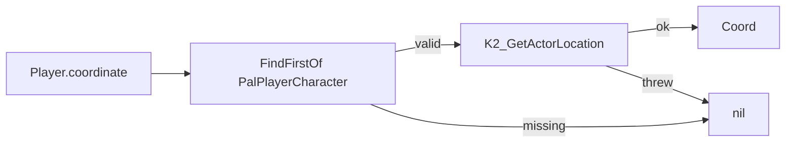
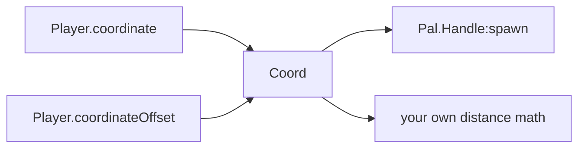

`Player` が答えるのは 2 つだけです。ローカルプレイヤーのポーンは誰か、そしてどこに立っ
ているか。関数は 3 つ、状態は持たず、定義するものもありません。

```lua
local me = Player.character()                 -- APalPlayerCharacter, or nil
local at = Player.coordinate()                -- a Coord in centimetres, or nil
local up = Player.coordinateOffset(0, 0, 200) -- the same point, 2 m higher, or nil
```

## 呼び出せないモジュール

他のモジュールはすべて「呼び出して」コンテンツを定義します（`Pal{ ... }`、`Item{ ... }`、
`Building{ ... }`）。`Player` は違います。`__call` メタメソッドを持たない素のテーブルで、
レジストリにも登録されず、ハンドルも返しません。

```lua
local api = require("palforge.api")

api.Player.coordinate()   -- namespaced access
Player.coordinate()       -- the installed global; the same table

Player{ id = "me" }       -- Lua error: Player is a table you index, not one you call
Player.get("me")          -- Lua error: Player.get does not exist
```

`Player.get` も `Player.get_all` も `Player.Class` も `Player.Spec` もありません。
公開されているのは次の 3 つだけです。

| 関数 | 戻り値 | `nil` になる条件 |
| --- | --- | --- |
| `Player.character()` | ローカルの `APalPlayerCharacter` | 有効なプレイヤーポーンが存在しない |
| `Player.coordinate()` | `Coord`（`x`、`y`、`z` をセンチメートルで） | ポーンがない、または座標の読み取りに失敗した |
| `Player.coordinateOffset(dx, dy, dz)` | 上の座標をオフセットした `Coord` | `coordinate()` と同じ条件 |

このモジュールが持つ唯一の形が `Coord` ですが、これもドメインではありません。
[Coord の形](#coord-の形)を参照してください。

## character

`Player.character()` は `FindFirstOf("PalPlayerCharacter")` でポーンを探し、`IsValid()`
を確認してから返します。途中で何かが失敗すれば `nil` になります。`FindFirstOf` の検索は
`pcall` で保護されているため、検索が例外を投げてもエラーにはならず `nil` が返るだけです。

```lua
local me = Player.character()
if me then
    Effect.get("example:Regen"):apply(me)   -- the effect is defined elsewhere in the pack
end
```

検索は呼び出しのたびに実行され、キャッシュは一切ありません。これは重要です。ワールドを
ロードするとポーンは作り直されるため、ロード時にアップバリューへ保存したキャラクターは
すぐに古くなります。使う場所で取得してください。

```lua
local event = require("palforge.core.event")

-- wrong: captured once, at mod load, when there is no world at all
local me = Player.character()
event.on("tick", function() Effect.get("example:Regen"):apply(me) end)

-- right: re-read per use, and guard
event.every(5000, function()
    local me = Player.character()
    if me then Effect.get("example:Regen"):apply(me) end
end)
```

返ってくるのは PalForge のハンドルではなく、生の Unreal アクターです。ゲームがそのアクター
に公開しているものには手が届きますが、それはこの API の外側なので、`pcall` の中に閉じ込め
てください（後述の「プレイヤーの正面にスポーンさせる」レシピがまさにそれです）。

## coordinate

`Player.coordinate()` は `character()` に座標の読み取りを足したものです。まず
`K2_GetActorLocation` を試し、なければ `GetActorLocation` にフォールバックします。ポーン
がない場合も、読み取りが例外を投げた場合も `nil` になります。



返されるテーブルは、同じ 3 つの数値を 3 通りのキーで持ちます。そのため Lua 的なコードにも、
UE 的なコードにも、位置引数を取るヘルパーにもそのまま渡せます。

```lua
local c = Player.coordinate()
if c then
    print(c.x, c.y, c.z)          -- lowercase, the documented Coord shape
    print(c.X, c.Y, c.Z)          -- UE-style, same numbers
    print(c[1], c[2], c[3])       -- array form, same numbers
end
```

これはスナップショットであり、ライブビューではありません。呼び出しごとに新しいテーブルが
作られ、プレイヤーに追従することはありません。最新の値が必要なら再度呼び出してください。

## coordinateOffset

`Player.coordinateOffset(dx, dy, dz)` は `coordinate()` の各軸にオフセットを足したもの
です。`nil` になる条件はまったく同じで、省略した引数は `0` として扱われます。

```lua
Player.coordinateOffset(300, 0, 0)      -- 3 m along +X
Player.coordinateOffset(0, 0, 200)      -- 2 m straight up
Player.coordinateOffset(nil, nil, 50)   -- only lift by 50 cm
```

単位はセンチメートルなので、`100` が 1 メートルです。これは建築グリッドと同じ単位です
（`core.spatial.GRID_CM` は `100`、1 セルが 1 メートル）。`z` が上方向です。

オフセットはワールド軸に対して適用されます。プレイヤーがどちらを向いているかは考慮され
ないため、`coordinateOffset(600, 0, 0)` はプレイヤーが見ていようが背を向けていようが
+X 方向に 6 m の地点です。向きを基準にした地点が必要なら、後述のレシピを参照してください。

## Coord の形

<TypeTable
  type={{
    x: { description: 'world X in centimetres', type: 'number', required: true },
    y: { description: 'world Y in centimetres', type: 'number', required: true },
    z: { description: 'world Z in centimetres', type: 'number', required: true },
  }}
/>

`Coord` は `api/player.lua` の `schema.define("Coord", ...)` で宣言されています。どの
ドメインにも属さないため、`Pal.Spec` や `Mesh.Spec` と違ってドメイン名の接頭辞が付かず、
どこにもバインドされていません。つまり、引数を `Coord` として検証する呼び出しは存在しま
せん。実行時に形を読めるようにするため、そして生成される型定義に載せるための宣言です。

```lua
local schema = require("palforge.core.schema")
print(schema.help("Coord"))
```

```text
Coord {
  x             number     (required) world X in centimetres
  y             number     (required) world Y in centimetres
  z             number     (required) world Z in centimetres
}
```

これを消費するのが `Pal.Handle:spawn` で、名前付きの形と配列の形の両方を受け取ります。

```lua
Pal.get("ChickenPal"):spawn(Player.coordinate())            -- named form, straight through
Pal.get("ChickenPal"):spawn{ at = { x = 12000, y = -3400, z = 500 } }
Pal.get("ChickenPal"):spawn{ at = { 12000, -3400, 500 } }   -- array form
```

`:spawn` は引数に `x` または `[1]` があるかどうかで座標とオプションテーブルを見分け、
各軸を `a.x or a[1]` として読み取ります。`coordinate()` は両方のキーを埋めて返すので、
このモジュールの戻り値はどちらの位置でも動きます。



## nil が返るとき

3 つの関数は、有効なプレイヤーポーンが存在しない間はすべて `nil` を返します。

- Mod のロード時、およびタイトル画面 — まだワールドに入っていない
- ロード画面の最中 — ポーンが構築されている途中
- ワールドを抜けたあと、次のワールドに入るまで

`nil` は異常ではなく正常な戻り値です。`FindFirstOf` の検索も座標の読み取りもそれぞれ
`pcall` で保護されているため、ネイティブ呼び出しが例外を投げた場合も `nil` が返ります。
その代わり、確認する責任はすべて呼び出し側にあります。値を使う前にチェックしてください。

<Callout type="warn">
`nil` をそのまま渡すと、多くの場合エラーにならず静かに進みます。`Effect.Handle:apply(target)`
は `target or GLOBAL` をキーにして適用を管理するため、ワールドがない状態で
`apply(Player.character())` を呼ぶと、エフェクトはプレイヤーではなくグローバルのバケットに
適用され、成功したように見えます。先にガードしてください。
</Callout>

ワールドを待つなら `world.ready` チャネルを使います。

```lua
local event = require("palforge.core.event")
local log   = require("palforge.utils.log").scope("example")

event.on("world.ready", function()
    local at = Player.coordinate()
    if not at then return end
    log.info(string.format("world ready at %.0f %.0f %.0f", at.x, at.y, at.z))
end)
```

`world.ready` を駆動しているのは、まさにこのポーンのポーリングです。`core/event` が
`FindFirstOf("PalPlayerCharacter")` を約 1 秒おきに確認し、有効な結果が 5 回連続したところ
でチャネルを emit します。したがって `Player.character()` は `world.ready` が発火する数秒
「前」からポーンを返しうるし、その後いつでもまた `nil` を返しはじめる可能性があります。
このチャネルは処理を開始するのに適した場所ですが、`nil` チェックを省く理由にはなりません。

## レシピ

### プレイヤーの足元にスポーンさせる

```lua title="content/spawn_here.lua"
local event = require("palforge.core.event")
local log   = require("palforge.utils.log").scope("example")

---Spawn `charId` where the player stands, lifted 50 cm so it settles onto the ground
---instead of floating. Returns false when there is no world.
local function spawnHere(charId, level)
    local at = Player.coordinateOffset(0, 0, 50)
    if not at then
        log.warn("no world yet - nothing spawned")
        return false
    end
    return Pal.get(charId):spawn{ at = at, level = level or 5 }
end

event.on("world.ready", function()
    spawnHere("ChickenPal", 5)
end)
```

<Callout type="warn">
座標スポーンは即座には完了しません。`:spawn{ at = ... }` は `PalCheatManager:SpawnMonster`
を呼び、これはプレイヤーのすぐそばにパルを出します。アクターは呼び出しから数フレーム遅れて
生成されるため、PalForge はそのアクターだけを 400 ms 間隔で最大 6 回まで再試行しながら指定
座標へ移動させます。そのため、いったん自分の隣に現れてから移動していくのが見えます。
`CheatManagerEnabler` mod が入っていない場合はチートマネージャー自体が存在せず、`:spawn` は
`false` を返します。
</Callout>

### プレイヤーの正面にスポーンさせる

PalForge に前方ベクトルのヘルパーはありません。キャラクターからベクトルを取り、XY 平面に
潰して正規化し、座標に足してください。

```lua title="content/spawn_ahead.lua"
---The point `distanceCm` ahead of where the player is facing, or nil.
local function inFront(distanceCm)
    local me = Player.character()
    local at = Player.coordinate()
    if not (me and at) then return nil end

    local fwd
    pcall(function() fwd = me:GetActorForwardVector() end)
    local fx, fy = (fwd and fwd.X) or 1.0, (fwd and fwd.Y) or 0.0
    local mag = math.sqrt(fx * fx + fy * fy)
    if mag < 0.01 then fx, fy, mag = 1.0, 0.0, 1.0 end
    fx, fy = fx / mag, fy / mag

    return { x = at.x + fx * distanceCm, y = at.y + fy * distanceCm, z = at.z + 50 }
end

local at = inFront(600)   -- 6 m ahead
if at then
    Pal.get("ChickenPal"):spawn{ at = at, level = 10 }
end
```

<Callout type="info">
`GetActorForwardVector` はポーンに対する生の Unreal 呼び出しで、この API の一部ではありま
せん。そのため `pcall` の中に置き、失敗時の方向をフォールバックとして用意しています。使う
のは X と Y の成分だけです。3D ベクトルをそのまま正規化するとカメラの上下でターゲットが
傾き、パルが空中や地面の下にスポーンしてしまいます。
</Callout>

### プレイヤーの周囲に円状に配置する

`coordinateOffset` が最も効くのは、1 つの原点を基準に複数の地点が必要なときです。

```lua title="content/ring.lua"
local ring = { { 400, 0 }, { -400, 0 }, { 0, 400 }, { 0, -400 } }

for _, d in ipairs(ring) do
    local at = Player.coordinateOffset(d[1], d[2], 50)
    if at then
        Pal.get("SheepBall"):spawn{ at = at, level = 3 }
    end
end
```

ガードは呼び出しごとに個別に書きます。`coordinateOffset` は毎回ポーンを読み直すため、
ループの途中でプレイヤーがワールドを抜けた場合、残りの反復は古い座標ではなく `nil` を
受け取ります。

### ワールド上の何かとの距離を測る

ライブな建築インスタンスは `pos` を持ち、これも `x, y, z` をセンチメートルで表す同じ形
です。したがって単純な距離計算に他のものは要りません。

```lua title="content/nearest_palbox.lua"
---The live PalBoxV2 nearest to the player, plus its distance in centimetres.
local function nearestPalBox()
    local me = Player.coordinate()
    if not me then return nil end

    local best, bestD2
    for _, inst in ipairs(Building.get("PalBoxV2"):instances()) do
        local p = inst.pos
        if p then
            local dx, dy, dz = p.x - me.x, p.y - me.y, p.z - me.z
            local d2 = dx * dx + dy * dy + dz * dz
            if not bestD2 or d2 < bestD2 then best, bestD2 = inst, d2 end
        end
    end
    if not best then return nil end
    return best, math.sqrt(bestD2)
end

local box, distance = nearestPalBox()
if box then
    print(string.format("nearest PalBox is %.1f m away", distance / 100))
end
```

<Cards>
  <Card title="Pal" href="/docs/api/pal">座標を受け取る側の spawn 呼び出し</Card>
  <Card title="Building" href="/docs/api/building">ライブインスタンスと pos</Card>
  <Card title="Lifecycle" href="/docs/concepts/lifecycle">world.ready、tick、その他のチャネル</Card>
</Cards>
