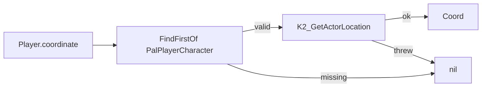
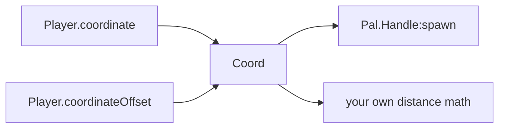

`Player` answers two questions: who the local player pawn is, and where it stands.
Three functions, no state, nothing to define.

```lua
local me = Player.character()                 -- APalPlayerCharacter, or nil
local at = Player.coordinate()                -- a Coord in centimetres, or nil
local up = Player.coordinateOffset(0, 0, 200) -- the same point, 2 m higher, or nil
```

## Not a callable domain

Every other module is *called* to define content — `Pal{ ... }`, `Item{ ... }`,
`Building{ ... }`. `Player` is not. It is a plain table of three functions with no
`__call` metamethod, no registry entry and no handle.

```lua
local api = require("palforge.api")

api.Player.coordinate()   -- namespaced access
Player.coordinate()       -- the installed global; the same table

Player{ id = "me" }       -- Lua error: Player is a table you index, not one you call
Player.get("me")          -- Lua error: Player.get does not exist
```

There is no `Player.get`, no `Player.get_all`, no `Player.Class` and no `Player.Spec`.
The whole surface is:

| Function | Returns | `nil` when |
| --- | --- | --- |
| `Player.character()` | the local `APalPlayerCharacter` | there is no valid player pawn |
| `Player.coordinate()` | a `Coord` — `x`, `y`, `z` in centimetres | no pawn, or the location read failed |
| `Player.coordinateOffset(dx, dy, dz)` | a `Coord`, offset from the one above | the same conditions as `coordinate()` |

The one shape it owns is `Coord`, which is not a domain either — see
[The Coord shape](#the-coord-shape).

## character

`Player.character()` looks the pawn up with `FindFirstOf("PalPlayerCharacter")`, checks
`IsValid()` on it, and returns it. Anything that fails on the way gives `nil` — the
`FindFirstOf` lookup is wrapped in a `pcall`, so a lookup that throws comes back as `nil`
rather than as an error.

```lua
local me = Player.character()
if me then
    Effect.get("example:Regen"):apply(me)   -- the effect is defined elsewhere in the pack
end
```

The lookup runs on every call; nothing is cached. That matters, because the pawn is
replaced when a world is loaded, so a character stored in an upvalue at load time goes
stale. Fetch it where you use it.

```lua
local event = require("palforge.core.event")

-- wrong: captured once, at mod load, when there is no world at all
local me = Player.character()
event.on("tick", function() Effect.get("example:Regen"):apply(me) end)

-- right: re-read per use, and guard
event.every(5000, function()
    local me = Player.character()
    if me then Effect.get("example:Regen"):apply(me) end
end)
```

What you get back is the raw Unreal actor, not a PalForge handle. Anything the game
exposes on it is reachable — but it is outside this API, so keep those calls in a
`pcall` (the "in front of the player" recipe below does exactly that).

## coordinate

`Player.coordinate()` is `character()` plus a location read: it prefers
`K2_GetActorLocation` and falls back to `GetActorLocation`. No pawn, or a read that
throws, gives `nil`.



The returned table carries the same three numbers under three key styles, so it drops
straight into Lua code, into UE-style code, and into positional helpers:

```lua
local c = Player.coordinate()
if c then
    print(c.x, c.y, c.z)          -- lowercase, the documented Coord shape
    print(c.X, c.Y, c.Z)          -- UE-style, same numbers
    print(c[1], c[2], c[3])       -- array form, same numbers
end
```

It is a snapshot, not a live view: a fresh table is built on each call and it does not
follow the player. Call it again to re-read.

## coordinateOffset

`Player.coordinateOffset(dx, dy, dz)` is `coordinate()` with the offset added to each
axis. It returns `nil` under exactly the same conditions, and each argument you leave
out counts as `0`.

```lua
Player.coordinateOffset(300, 0, 0)      -- 3 m along +X
Player.coordinateOffset(0, 0, 200)      -- 2 m straight up
Player.coordinateOffset(nil, nil, 50)   -- only lift by 50 cm
```

Units are centimetres, so `100` is one metre — the same unit the building grid uses
(`core.spatial.GRID_CM` is `100`, one cell per metre). `z` is up.

The offset is applied on world axes. It knows nothing about which way the player is
facing; `coordinateOffset(600, 0, 0)` is 6 m along +X from the player whether they are
looking at it or away from it. For a facing-relative point, see the recipe below.

## The Coord shape

<TypeTable
  type={{
    x: { description: 'world X in centimetres', type: 'number', required: true },
    y: { description: 'world Y in centimetres', type: 'number', required: true },
    z: { description: 'world Z in centimetres', type: 'number', required: true },
  }}
/>

`Coord` is declared in `api/player.lua` with `schema.define("Coord", ...)`. It belongs to
no domain, so unlike `Pal.Spec` or `Mesh.Spec` it has no domain prefix, and nothing binds
it: no call validates its argument against `Coord`. It exists so the shape is readable at
runtime and so the generated editor types carry it.

```lua
local schema = require("palforge.core.schema")
print(schema.help("Coord"))
```

```text
Coord {
  x             number     (required) world X in centimetres
  y             number     (required) world Y in centimetres
  z             number     (required) world Z in centimetres
}
```

`Pal.Handle:spawn` consumes it, and accepts both the named form and the array form:

```lua
Pal.get("ChickenPal"):spawn(Player.coordinate())            -- named form, straight through
Pal.get("ChickenPal"):spawn{ at = { x = 12000, y = -3400, z = 500 } }
Pal.get("ChickenPal"):spawn{ at = { 12000, -3400, 500 } }   -- array form
```

`:spawn` tells a coordinate from an options table by looking for `x` or `[1]` on it, then
reads each axis as `a.x or a[1]`. Because `coordinate()` fills in both key styles, a
value from this module works in either position.



## When it returns nil

All three functions return `nil` whenever there is no valid player pawn:

- at mod load, and on the title screen — no world has been entered yet
- during a load screen, while the pawn is being built
- after leaving a world, before entering the next one

`nil` is a normal return, not a failure: the `FindFirstOf` lookup and the location read
are each wrapped in a `pcall`, so a native call that throws also comes back as `nil`. That
puts the whole burden on the caller: check before you use the value.

<Callout type="warn">
Passing `nil` on is usually silent rather than loud. `Effect.Handle:apply(target)` keys
its application by `target or GLOBAL`, so `apply(Player.character())` with no world
applies the effect to the global bucket instead of to the player, and reports success.
Guard first.
</Callout>

Waiting for the world is the `world.ready` channel:

```lua
local event = require("palforge.core.event")
local log   = require("palforge.utils.log").scope("example")

event.on("world.ready", function()
    local at = Player.coordinate()
    if not at then return end
    log.info(string.format("world ready at %.0f %.0f %.0f", at.x, at.y, at.z))
end)
```

`world.ready` is driven by a poll of this very pawn: `core/event` checks
`FindFirstOf("PalPlayerCharacter")` about once a second and emits the channel after five
consecutive valid polls. So `Player.character()` can already return a pawn several
seconds *before* `world.ready` fires, and it can start returning `nil` again at any point
afterwards. The channel is a good place to start work; it is not a reason to drop the
`nil` check.

## Recipes

### Spawn at the player's feet

```lua title="content/spawn_here.lua"
local event = require("palforge.core.event")
local log   = require("palforge.utils.log").scope("example")

---Spawn `charId` where the player stands, lifted 50 cm so it settles onto the ground
---instead of floating. Returns false when there is no world.
local function spawnHere(charId, level)
    local at = Player.coordinateOffset(0, 0, 50)
    if not at then
        log.warn("no world yet - nothing spawned")
        return false
    end
    return Pal.get(charId):spawn{ at = at, level = level or 5 }
end

event.on("world.ready", function()
    spawnHere("ChickenPal", 5)
end)
```

<Callout type="warn">
Coordinate spawning is not instant. `:spawn{ at = ... }` calls
`PalCheatManager:SpawnMonster`, which drops the pal next to the player, and PalForge then
relocates that one actor to your coordinate, retrying every 400 ms up to six times because
the actor materializes a few frames after the call. You will see it appear beside you and
then move. With the `CheatManagerEnabler` mod absent there is no cheat manager at all and
`:spawn` returns `false`.
</Callout>

### Spawn in front of the player

PalForge has no forward-vector helper. Take the vector off the character, flatten it to
the XY plane and normalise it, then add it to the coordinate.

```lua title="content/spawn_ahead.lua"
---The point `distanceCm` ahead of where the player is facing, or nil.
local function inFront(distanceCm)
    local me = Player.character()
    local at = Player.coordinate()
    if not (me and at) then return nil end

    local fwd
    pcall(function() fwd = me:GetActorForwardVector() end)
    local fx, fy = (fwd and fwd.X) or 1.0, (fwd and fwd.Y) or 0.0
    local mag = math.sqrt(fx * fx + fy * fy)
    if mag < 0.01 then fx, fy, mag = 1.0, 0.0, 1.0 end
    fx, fy = fx / mag, fy / mag

    return { x = at.x + fx * distanceCm, y = at.y + fy * distanceCm, z = at.z + 50 }
end

local at = inFront(600)   -- 6 m ahead
if at then
    Pal.get("ChickenPal"):spawn{ at = at, level = 10 }
end
```

<Callout type="info">
`GetActorForwardVector` is a raw Unreal call on the pawn, not part of this API, so it
stays inside a `pcall` with a sensible fallback direction. Only the X and Y components
are used: normalising the full 3D vector would tilt the target up or down with the
camera, and the pal would spawn in the air or under the ground.
</Callout>

### A ring of placements around the player

`coordinateOffset` is at its best when you need several points relative to one origin.

```lua title="content/ring.lua"
local ring = { { 400, 0 }, { -400, 0 }, { 0, 400 }, { 0, -400 } }

for _, d in ipairs(ring) do
    local at = Player.coordinateOffset(d[1], d[2], 50)
    if at then
        Pal.get("SheepBall"):spawn{ at = at, level = 3 }
    end
end
```

Every call is guarded individually, because `coordinateOffset` re-reads the pawn each
time: if the player leaves the world halfway through the loop, the remaining iterations
get `nil` rather than a stale position.

### Distance to something in the world

A live building instance carries `pos`, which is the same `x, y, z`-in-centimetres shape,
so a plain distance check needs nothing else.

```lua title="content/nearest_palbox.lua"
---The live PalBoxV2 nearest to the player, plus its distance in centimetres.
local function nearestPalBox()
    local me = Player.coordinate()
    if not me then return nil end

    local best, bestD2
    for _, inst in ipairs(Building.get("PalBoxV2"):instances()) do
        local p = inst.pos
        if p then
            local dx, dy, dz = p.x - me.x, p.y - me.y, p.z - me.z
            local d2 = dx * dx + dy * dy + dz * dz
            if not bestD2 or d2 < bestD2 then best, bestD2 = inst, d2 end
        end
    end
    if not best then return nil end
    return best, math.sqrt(bestD2)
end

local box, distance = nearestPalBox()
if box then
    print(string.format("nearest PalBox is %.1f m away", distance / 100))
end
```

<Cards>
  <Card title="Pal" href="/docs/api/pal">The spawn call on the other end of a coordinate</Card>
  <Card title="Building" href="/docs/api/building">Live instances and their pos</Card>
  <Card title="Lifecycle" href="/docs/concepts/lifecycle">world.ready, tick and the rest of the channels</Card>
</Cards>
