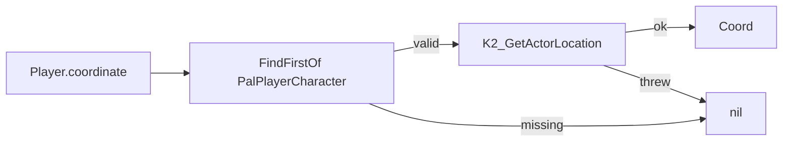
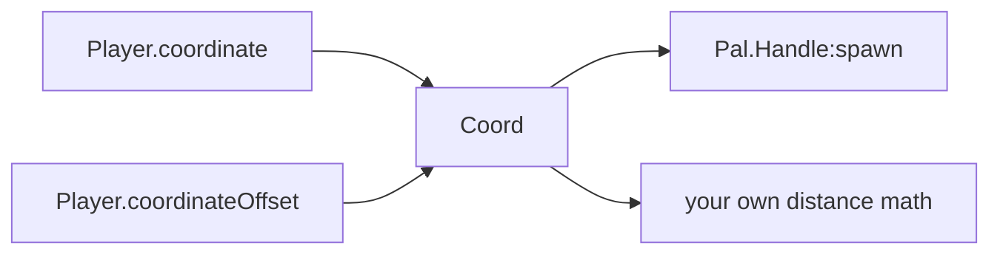

## 读完本页你可以做到

- 查出玩家现在站在哪里
- 在玩家脚下、或者稍微离开一点的地方放出一只帕鲁
- 在玩家周围摆一圈东西
- 测量玩家离某个建筑物有多远
- 等玩家真的进入世界之后，再去做上面这些事

## 玩家在哪里

`Player` 提供三个函数。需要知道玩家位置的时候，随时调用它们。

```lua
local me = Player.character()                 -- APalPlayerCharacter, or nil
local at = Player.coordinate()                -- a Coord in centimetres, or nil
local up = Player.coordinateOffset(0, 0, 200) -- the same point, 2 m higher, or nil
```

玩家不在世界里的时候，三个函数都返回 `nil`。用之前先检查一下值。

| 函数 | 返回值 | 什么时候是 `nil` |
| --- | --- | --- |
| `Player.character()` | 本地的 `APalPlayerCharacter` | 没有有效的玩家 pawn |
| `Player.coordinate()` | 一个 `Coord` —— `x`、`y`、`z`，单位是厘米 | 没有 pawn，或者位置读取失败 |
| `Player.coordinateOffset(dx, dy, dz)` | 在上面那个坐标上加了偏移的 `Coord` | 和 `coordinate()` 的条件完全一样 |

调用方式有两种。两边是同一张表。

```lua
local api = require("palforge.api")

api.Player.coordinate()   -- namespaced access
Player.coordinate()       -- the installed global; the same table
```

位置以 `Coord` 的形式返回，就是一张装着三个数字的小表 —— 见
[Coord 的形状](#coord-的形状)。

## character

`Player.character()` 返回玩家在世界里的角色。用 Unreal 的说法叫 *pawn*，也就是玩家操控着
走来走去的那个 actor。它用 `FindFirstOf("PalPlayerCharacter")` 找到 pawn，对它调用
`IsValid()` 确认有效，然后返回。中途任何一步失败都只会得到 `nil`：查找是在 `pcall` 里跑的，
所以查找抛出异常时也是返回 `nil`，而不是变成错误。

```lua
local me = Player.character()
if me then
    Effect.get("example:Regen"):apply(me)   -- the effect is defined elsewhere in the pack
end
```

在用到它的地方现取。每次调用都会重新查找，什么都不缓存；而且每次加载世界，pawn 都会被重新
创建 —— 所以启动时存进变量里的那个角色，指向的是一个已经不在了的东西。

```lua
local event = require("palforge.core.event")

-- wrong: captured once, at mod load, when there is no world at all
local me = Player.character()
event.on("tick", function() Effect.get("example:Regen"):apply(me) end)

-- right: re-read per use, and guard
event.every(5000, function()
    local me = Player.character()
    if me then Effect.get("example:Regen"):apply(me) end
end)
```

返回给你的是游戏自己的 actor，不是 PalForge 的对象。游戏挂在它上面的东西你都够得着，但那些
调用在本 API 之外，所以请把它们放在 `pcall` 里（下面「在玩家正前方生成」那个例子做的正是
这件事）。

## coordinate

`Player.coordinate()` 会找到 pawn 并读出它的位置。它优先用 `K2_GetActorLocation`，不行就
退回 `GetActorLocation`。没有 pawn，或者读取抛出异常，都返回 `nil`。



返回的表用三套键名装着同样的三个数字，所以它能直接丢进 Lua 风格的代码、UE 风格的代码，以及
按顺序接收位置的辅助函数：

```lua
local c = Player.coordinate()
if c then
    print(c.x, c.y, c.z)          -- lowercase, the documented Coord shape
    print(c.X, c.Y, c.Z)          -- UE-style, same numbers
    print(c[1], c[2], c[3])       -- array form, same numbers
end
```

它是一张快照，不是实时视图：每次调用都会新建一张表，它不会跟着玩家走。要拿最新的值就再调用
一次。

## coordinateOffset

`Player.coordinateOffset(dx, dy, dz)` 是玩家位置在每个轴上加了偏移之后的点 —— 用来快速表达
「就在那边一点」。它返回 `nil` 的条件和 `coordinate()` 完全一样，省略掉的参数按 `0` 处理。

```lua
Player.coordinateOffset(300, 0, 0)      -- 3 m along +X
Player.coordinateOffset(0, 0, 200)      -- 2 m straight up
Player.coordinateOffset(nil, nil, 50)   -- only lift by 50 cm
```

单位是厘米，所以 `100` 就是 1 米 —— 和放置建筑物时用的格子是同一个单位
（`core.spatial.GRID_CM` 是 `100`，一格一米）。`z` 是上方向。

偏移是沿世界坐标轴加上去的，不是沿玩家自己的朝向。它完全不知道玩家面朝哪边；不管玩家是看着
那个方向还是背对着，`coordinateOffset(600, 0, 0)` 都是从玩家出发沿 +X 方向 6 米的地方。想要
玩家正前方的点，看下面的例子。

## Coord 的形状

`Coord` 是一张表，装着三个以厘米为单位的数字。形状就这些：

<TypeTable
  type={{
    x: { description: 'world X in centimetres', type: 'number', required: true },
    y: { description: 'world Y in centimetres', type: 'number', required: true },
    z: { description: 'world Z in centimetres', type: 'number', required: true },
  }}
/>

同样的内容也可以在游戏里打印出来：

```lua
local schema = require("palforge.core.schema")
print(schema.help("Coord"))
```

```text
Coord {
  x             number     (required) world X in centimetres
  y             number     (required) world Y in centimetres
  z             number     (required) world Z in centimetres
}
```

主要吃这个形状的是 `Pal.Handle:spawn`，具名形式和数组形式它都收：

```lua
Pal.get("ChickenPal"):spawn(Player.coordinate())            -- named form, straight through
Pal.get("ChickenPal"):spawn{ at = { x = 12000, y = -3400, z = 500 } }
Pal.get("ChickenPal"):spawn{ at = { 12000, -3400, 500 } }   -- array form
```

`:spawn` 靠参数上有没有 `x` 或 `[1]` 来分辨这是坐标还是选项表，然后按 `a.x or a[1]` 读取每个
轴。因为 `coordinate()` 把两套键名都填好了，本模块的返回值放在哪个位置都能用。



## 什么时候会返回 nil

只要没有有效的玩家 pawn，这三个函数就都返回 `nil`：

- 模组加载时，以及标题画面 —— 还没进过任何世界
- 加载画面期间，pawn 正在被创建
- 离开世界之后、进入下一个世界之前

`nil` 是正常的返回值，不是失败：`FindFirstOf` 的查找和位置的读取各自都包在 `pcall` 里，所以
原生调用抛出异常时同样返回 `nil`。代价是检查的责任全在你身上：用之前先确认值。

<Callout type="warn">
把 `nil` 继续往下传，通常不会报错，而是悄悄跑偏。`Effect.Handle:apply(target)` 用
`target or GLOBAL` 作为键来记录效果应用到了谁身上，所以在没有世界的时候调用
`apply(Player.character())`，效果会被应用到全局的那一组上，而不是玩家身上，并且报告成功。
请先做检查。
</Callout>

要等世界准备好，就监听 `world.ready` 频道 —— 这是 PalForge 在玩家进入已加载的世界后发出的
信号：

```lua
local event = require("palforge.core.event")
local log   = require("palforge.utils.log").scope("example")

event.on("world.ready", function()
    local at = Player.coordinate()
    if not at then return end
    log.info(string.format("world ready at %.0f %.0f %.0f", at.x, at.y, at.z))
end)
```

驱动 `world.ready` 的，正是对这同一个 pawn 的轮询：`core/event` 大约每秒检查一次
`FindFirstOf("PalPlayerCharacter")`，连续五次拿到有效结果之后才发出这个频道。所以
`Player.character()` 有可能在 `world.ready` 触发的好几秒*之前*就已经能返回 pawn，之后也
可能在任何时刻重新开始返回 `nil`。这个频道适合用来起步，但它不是省掉 `nil` 检查的理由。

## 实用示例

### 在玩家脚下生成

```lua title="content/spawn_here.lua"
local event = require("palforge.core.event")
local log   = require("palforge.utils.log").scope("example")

---Spawn `charId` where the player stands, lifted 50 cm so it settles onto the ground
---instead of floating. Returns false when there is no world.
local function spawnHere(charId, level)
    local at = Player.coordinateOffset(0, 0, 50)
    if not at then
        log.warn("no world yet - nothing spawned")
        return false
    end
    return Pal.get(charId):spawn{ at = at, level = level or 5 }   -- false in this version
end

event.on("world.ready", function()
    spawnHere("ChickenPal", 5)
end)
```

<Callout type="warn">
这个版本里 `Pal.Handle:spawn` 不会在世界里放下生物，所以你在这里算出来的坐标并不会把什么东西放到
哪里 —— 见 [Pal](/docs/api/pal)。坐标本身是真的，本页其余内容也都能用：拿它做自己的距离计算、当作
建筑物的位置，或者用在任何你自己放置的东西上。

它走的路是“先生成、再搬过去”。游戏自己的调用会把帕鲁放在玩家旁边，随后 PalForge 再把那一个 actor
挪到你给的坐标上，每 400 ms 重试一次、最多六次，因为生物本该过几帧才出现。它还需要
`CheatManagerEnabler` 模组：没有它就根本没有管理对象，`:spawn` 在够到游戏之前就返回 `false`。
</Callout>

### 在玩家正前方生成

没有现成的「我现在面朝哪边」辅助函数。从角色上取出前向向量，压到 XY 平面上再归一化，然后
加到坐标上。

```lua title="content/spawn_ahead.lua"
---The point `distanceCm` ahead of where the player is facing, or nil.
local function inFront(distanceCm)
    local me = Player.character()
    local at = Player.coordinate()
    if not (me and at) then return nil end

    local fwd
    pcall(function() fwd = me:GetActorForwardVector() end)
    local fx, fy = (fwd and fwd.X) or 1.0, (fwd and fwd.Y) or 0.0
    local mag = math.sqrt(fx * fx + fy * fy)
    if mag < 0.01 then fx, fy, mag = 1.0, 0.0, 1.0 end
    fx, fy = fx / mag, fy / mag

    return { x = at.x + fx * distanceCm, y = at.y + fy * distanceCm, z = at.z + 50 }
end

local at = inFront(600)   -- 6 m ahead
if at then
    Pal.get("ChickenPal"):spawn{ at = at, level = 10 }   -- false in this version
end
```

<Callout type="info">
`GetActorForwardVector` 是对 pawn 的原生 Unreal 调用，不属于本 API，所以它待在 `pcall` 里，
并配了一个合理的备用方向。只用到 X 和 Y 两个分量：如果把完整的 3D 向量拿去归一化，目标点会
随着镜头上下倾斜，帕鲁就会生成在半空中或者地面以下。
</Callout>

### 在玩家周围摆一圈

需要围着同一个原点取好几个点的时候，`coordinateOffset` 最好用。

```lua title="content/ring.lua"
local ring = { { 400, 0 }, { -400, 0 }, { 0, 400 }, { 0, -400 } }

for _, d in ipairs(ring) do
    local at = Player.coordinateOffset(d[1], d[2], 50)
    if at then
        Pal.get("SheepBall"):spawn{ at = at, level = 3 }
    end
end
```

每次调用都要单独检查，因为 `coordinateOffset` 每次都会重新读一遍 pawn：如果玩家在循环跑到
一半时离开了世界，剩下的几轮拿到的是 `nil`，而不是一个过期的位置。

### 测量到世界里某个东西的距离

世界里已经放好的建筑物带着 `pos`，和 `x, y, z`（厘米）是同一个形状，所以做一次普通的距离
计算，别的什么都不需要。

```lua title="content/nearest_palbox.lua"
---The live PalBoxV2 nearest to the player, plus its distance in centimetres.
local function nearestPalBox()
    local me = Player.coordinate()
    if not me then return nil end

    local best, bestD2
    for _, inst in ipairs(Building.get("PalBoxV2"):instances()) do
        local p = inst.pos
        if p then
            local dx, dy, dz = p.x - me.x, p.y - me.y, p.z - me.z
            local d2 = dx * dx + dy * dy + dz * dz
            if not bestD2 or d2 < bestD2 then best, bestD2 = inst, d2 end
        end
    end
    if not best then return nil end
    return best, math.sqrt(bestD2)
end

local box, distance = nearestPalBox()
if box then
    print(string.format("nearest PalBox is %.1f m away", distance / 100))
end
```

## 小结

- `Player.coordinate()` 是玩家站着的位置，单位是厘米。`100` 是 1 米，`z` 是上方向。
- `Player.coordinateOffset(dx, dy, dz)` 是那个位置沿世界坐标轴挪开之后的点 —— 「我旁边」的简写。
- `Player.character()` 是玩家自己的 actor，想直接对玩家做点什么就用它。
- 三个函数在没有世界的时候都返回 `nil`，用之前先检查。
- 每次都重新取一遍。它们都是快照，而且每次加载世界 pawn 都会被重建。

接下来读 [Pal](/docs/api/pal)，看看 `:spawn` 拿你刚求出来的坐标做了什么。

<Cards>
  <Card title="Pal" href="/docs/api/pal">坐标另一端的 spawn 调用</Card>
  <Card title="Building" href="/docs/api/building">世界里已有的实例和它们的 pos</Card>
  <Card title="Lifecycle" href="/docs/concepts/lifecycle">world.ready、tick 以及其他频道</Card>
</Cards>
