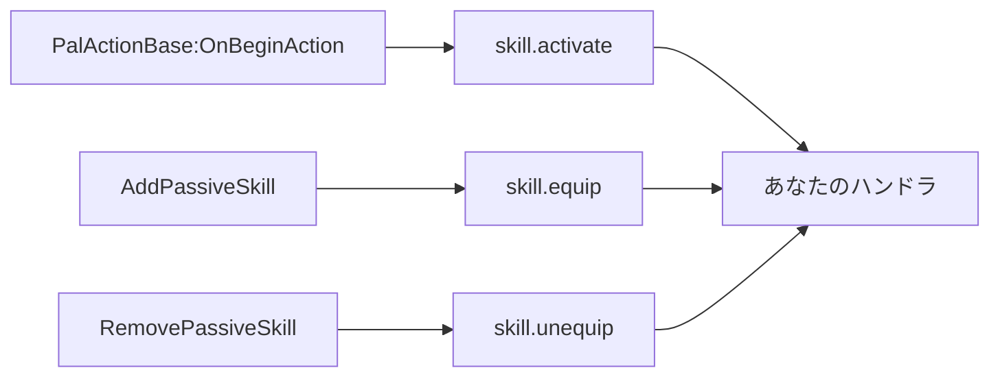
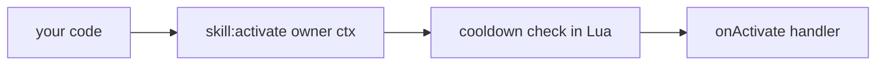
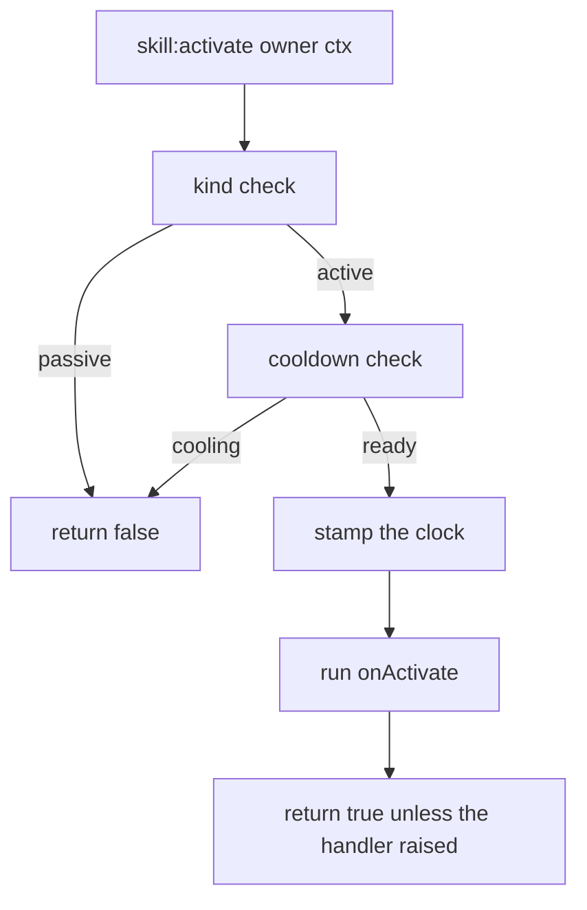
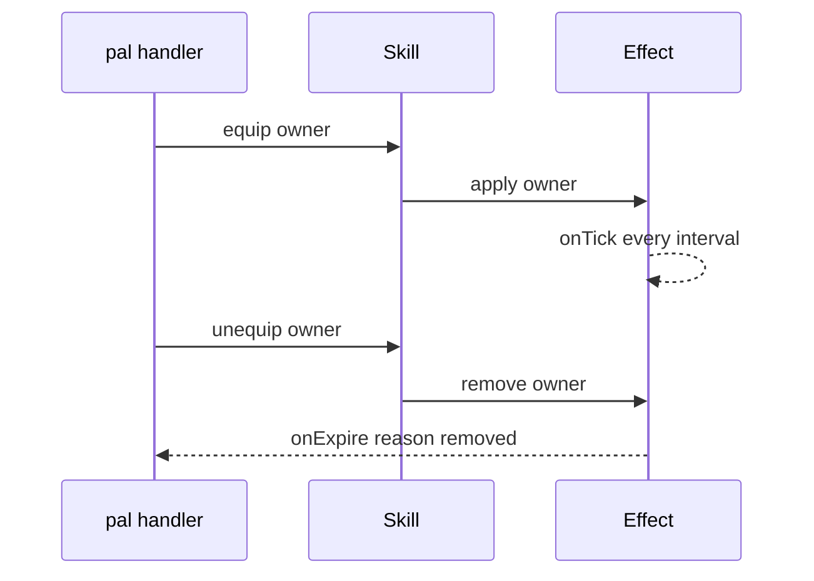

## このページでできるようになること

- 名前・属性・威力・アイコンを決めて、自分の攻撃を追加する
- ゲームが自分の技を出したとき、パッシブがキャラクターに付いたときに、自分のコードを走らせる
- 自分のコードから発動させる。Pal がダメージを受けたとき、建物を使われたとき、キーを押したとき
- 秒数でクールダウンを決めて、連発できないようにする
- 持っている間ずっと効き続ける特性を作る
- Pal が持っているスキルの一覧を読み出す
- 生きている Pal やプレイヤーにスキルを載せて、ゲーム自身に持たせる

スキルは攻撃や特性のことです。`Skill{ ... }` で一度書くと、アクションを持ったオブジェクトが返ります。
4 つあるハンドラのうち 3 つは、ゲーム側で対応する出来事が起きたときに呼ばれます。4 つとも自分の
コードから発動させることもでき、自作スキルにはそちらが必要です。次の例では最後の行がそれです。

```lua title="content/skills.lua"
local Ember = Skill{
    id       = "example:Ember",
    name     = "Ember",
    kind     = "active",
    element  = "fire",
    cooldown = 5.0,
    power    = 30,
    events   = {
        onActivate = function(skill, owner, ctx)
            -- your gameplay goes here
        end,
    },
}

Ember:activate(Player.character())   -- runs onActivate unless it is still cooling down
```

## ハンドラが動き出す 2 つの経路

入口は 2 つあり、どちらも同じハンドラに届きます。

4 つのチャンネルのうち 3 つはゲームが駆動します。PalForge が Palworld 自身の呼び出しをフックし、
そこから技名やパッシブ名を読み取り、その id で登録されているスキルのハンドラを呼びます。



このうち 2 つは実際のセーブで発火が確認されています。実戦での `skill.activate` と、`AddPassiveSkill`
からの `skill.equip` です。`RemovePassiveSkill` は同じクラスにあり配線も同一なので `onUnequip` も同様に
運ぶはずですが、実際に運んだ記録はまだありません。4 つめの `onHit` だけは何も供給されません。何を
計測した結果そうなっているかは、後述の節に書いてあります。

もう 1 つの経路は自分のコードです。4 つとも、呼んだその瞬間に動きます。自作スキルにはこちらしか
ありません。



<Callout type="warn">
ゲーム由来のイベントは**ゲームが報告した id** で照合されるので、その id で登録されたスキルにしか届きません。
`Skill{ id = "FireBlast" }` は Pal が FireBlast を使ったときに呼ばれますが、`Skill{ id = "example:Ember" }` は
決して呼ばれません。Palworld にその名前の技が無いからです。自作スキルは自分のコードが動かします。Pal の
ハンドラ、Building の `onRightClick`、キーバインド、Effect の tick — どこでも構いません。このページの下の方の
レシピで、それぞれの書き方を示します。`Pal{ skills = { ... } }` に並べただけでは何も発動しません。
</Callout>

手動の経路は間に合わせではなく、そのまま使えるものです。クールダウンは Lua 側で数えられ、ハンドラには
スキル自身のオブジェクトと渡したコンテキストテーブルが届き、戻り値で実行されたかどうかが分かります。

## スキルを定義する

必ず指定するフィールドは `id` だけです。他はすべて任意で、PalForge が知らないフィールド名を書くと、
その場でエラーになり「もしかして」の候補が出ます。

<Tabs items={['Global', 'Namespaced']}>
<Tab value="Global">

```lua
-- requiring palforge.api installs the bare globals
local Ember = Skill{ id = "example:Ember" }
```

</Tab>
<Tab value="Namespaced">

```lua
local api = require("palforge.api")
local Ember = api.Skill{ id = "example:Ember" }
```

</Tab>
</Tabs>

すべてのフィールドを使った定義です。

```lua title="content/skills.lua"
local log = require("palforge.utils.log").scope("example")

local Ember = Skill{
    id          = "example:Ember",
    name        = "Ember",
    description = "A short burst of fire.",
    kind        = "active",
    element     = "fire",
    cooldown    = 5.0,
    power       = 30,
    icon        = "/Game/YourPack/Textures/T_Ember.T_Ember",
    data        = { tier = 1, projectiles = 3 },
    events      = {
        onActivate = function(skill, owner, ctx)
            log.info(skill:name() .. " fired, power " .. tostring(skill:power()))
        end,
        onHit = function(skill, target, ctx)
            log.info("hit " .. tostring(target))
        end,
    },
}
```

渡せるフィールドと、その型と既定値の一覧です。

<TypeTable
  type={{
    id: { description: 'スキル id。ゲームの行 id、または自作コンテンツ用の "pack:name"。そのままの文字列で登録され、行の綴りに解決できない場合は定義時に拒否されます', type: 'string', required: true },
    name: { description: 'スキル一覧に表示される名前', type: 'string', default: 'id と同じ' },
    description: { description: 'UI やツール向けの 1 行説明', type: 'string' },
    kind: { description: 'active は発動するもの、passive は装備するもの', type: '"active" | "passive"', default: '"active"' },
    element: { description: '属性。fire や water など。作者用メタデータで、保持して返すだけ。読む側はどこにもありません', type: 'string' },
    cooldown: { description: '発動間隔の秒数。:activate が強制します', type: 'number' },
    power: { description: '基礎威力。作者用メタデータで、保持して返すだけ。読む側はどこにもありません', type: 'number' },
    icon: { description: 'アイコン DataTable にこの id の行が無いときに使う /Game/... のテクスチャパス', type: 'string' },
    events: { description: '4 つの挙動ハンドラをまとめたテーブル', type: 'Skill.Spec.Events' },
    data: { description: '任意の自由データ。定義にそのまま保持されます', type: 'table' },
  }}
/>

`element` と `power` は作者用のメタデータです。定義に保持され、`:element()` / `:power()` で取り出せますが、
PalForge のどこもこの 2 つを読みません。`data` も同じように保持されますが、ハンドルから読むメソッドは
ありません。スキル本来の属性と威力はゲーム側のスキル DataTable の行にあり、Lua はその行を書けません。
つまりこの 3 つはハンドラや UI が自分の数値を置く場所で、隣にある `cooldown` だけがフレームワークの
強制する数値です。

フィールドの一覧は、覚える代わりに Lua から表示させることもできます。

```lua
local schema = require("palforge.core.schema")
print(schema.help("Skill.Spec"))
```

```text
Skill.Spec {
  id            string     (required) skill id: a game row id or "pack:name"
  name          string     shown in skill lists (defaults to id)
  description   string     one-line description, for UI and tooling
  kind          string     (default=active, one of { "active", "passive" }) an active skill is fired; a passive one is equipped
  element       string     attribute / element (fire, water, ...). AUTHOR METADATA: stored and handed back, read by nothing
  cooldown      number     seconds between activations (enforced by :activate)
  power         number     base power / magnitude. AUTHOR METADATA: stored and handed back, read by nothing
  icon          string     /Game/... texture path used when the icon DataTable has no row for this id
  events        table      (Skill.Spec.Events) behaviour handlers (grouped)
  data          table      free-form payload of your own, carried onto the definition
}
```

`schema.help("Skill.Spec.Events")` は 4 つのハンドラについて同じものを表示します。各行が、その
チャンネルが自力で何かを運ぶのかどうかを述べています。

```text
Skill.Spec.Events {
  onActivate    function   LIVE - an active skill fired (self, owner, ctx); via = "PalActionBase:OnBeginAction"
  onHit         function   NOT LIVE - both sources measured silent (skill-hit-source); only :hit() runs it
  onEquip       function   LIVE - a passive was attached (self, owner, ctx); via names the source
  onUnequip     function   LIVE - a passive was removed (self, owner, ctx); via names the source
}
```

定義の戻り値を持ち続ける必要はありません。どこからでも取り直せます。

```lua
Skill.get("example:Ember")      -- the definition you registered
Skill.get("Legend")             -- never nil: a thin definition over any id
Skill.get_all()                 -- every PalForge-registered skill, as handles
```

`Skill.get` は nil を返しません。誰も定義していない id を渡すと素の定義が返ります。`:kind()` は `"active"`、
`:name()` は id そのもの、`:description()` / `:element()` / `:power()` は nil、クールダウンはなく、`:activate` は
空のハンドラを実行して true を返します。

同じ id で 2 回定義すると登録は置き換わります。最後の呼び出しが勝ち、先に受け取ったものは先の定義を
指したままです。2 つの呼び出しが別々のパックから来た場合、その置き換えは両方のパック名つきでログに
出るので、衝突の責任者が分かります。

### 2 つめの引数

`Skill{ ... }` は spec のあとに省略可能なオプションテーブルを取ります。省略したときの動きはこれまでと
まったく同じです。

```lua
-- ハンドルだけ作って登録はしない: レジストリに書いてはいけない「読み取り」用
local probe = Skill({ id = "example:Ember" }, { register = false })

-- パックに帰属させて登録する。衝突に「誰が」を与えるのがこれ
Skill({ id = "example:Ember" }, { pack = "mypack" })

-- 呼び出しごとに渡さずに同じ帰属を付ける書き方
local api = PalForge.pack("mypack")
api.Skill{ id = "example:Ember" }
```

受け付けるのは `register` と `pack` だけです。綴りを間違えたオプションは、黙って無視されるのではなく
エラーになります。

### id は定義時に検査されます

コロンを含む id は名前空間つきで、PalForge は `"pack:Ember"` を PalSchema が書く行の綴り `pack_Ember` に
解決します。前後どちらの半分も英数字と `_` しか使えず、解決できない id は定義の呼び出しで拒否されます。
どの行にも一致しようのないものを登録してしまう前に止まる、ということです。

```text
PalForge: Skill: field "id" is invalid: invalid pack id 'my-pack' in 'my-pack:Ember' (letters/digits/_ only)
```

## アクティブとパッシブ

`kind` の既定値は `"active"` で、他に指定できるのは `"passive"` だけです。

```lua
local Ember = Skill{
    id       = "example:Ember",
    kind     = "active",
    cooldown = 5.0,
    events   = { onActivate = function(skill, owner, ctx) end },
}

local Ironhide = Skill{
    id     = "example:Ironhide",
    kind   = "passive",
    events = {
        onEquip   = function(skill, owner, ctx) end,
        onUnequip = function(skill, owner, ctx) end,
    },
}
```

違いを作っているのは 1 か所の判定だけです。`kind` が `"passive"` のとき、`:activate` はクールダウンに触れず、
何も実行せずにすぐ `false` を返します。

```lua
Ironhide:activate(owner)   --> false, nothing ran
```

これ以外に `kind` を見る場所はありません。`:equip` / `:unequip` / `:hit` は、アクティブでもパッシブでも
宣言したハンドラをそのまま実行します。ですから「装備している間だけ効く」挙動を、`onEquip` を持つ
アクティブスキルで表現しても問題ありません。

## ハンドラ

ハンドラは PalForge が代わりに実行する関数です。4 つあり、どれも任意です。第 1 引数には
スキル自身のハンドルが届きます。この一覧にない名前を書くと、黙って無視されるのではなく定義時にエラーになります。

| ハンドラ | シグネチャ | 実行されるタイミング |
| --- | --- | --- |
| `onActivate` | `fun(skill, owner, ctx)` | ゲームがその技を出したとき、または `:activate(owner, ctx)` を呼びクールダウンが許可したとき |
| `onHit` | `fun(skill, target, ctx)` | `:hit(target, ctx)` を呼んだときだけ |
| `onEquip` | `fun(skill, owner, ctx)` | ゲームがそのパッシブを付けたとき、または `:equip(owner, ctx)` を呼んだとき |
| `onUnequip` | `fun(skill, owner, ctx)` | ゲームがそのパッシブを外したとき、または `:unequip(owner, ctx)` を呼んだとき |

ハンドルは定義の呼び出しが返したオブジェクトそのものなので、ハンドラの中でアクションもクエリもすぐ使えます。

```lua
local Ember = Skill{
    id       = "example:Ember",
    cooldown = 5.0,
    power    = 30,
    events   = {
        onActivate = function(skill, owner, ctx)
            log.info(skill.id .. " power=" .. tostring(skill:power()))
            skill:hit(ctx.target, { from = owner })   -- report the landing yourself
        end,
        onHit = function(skill, target, ctx)
            log.info("landed on " .. tostring(target))
        end,
    },
}
```

<Callout type="warn">
アクションはハンドラを `pcall` で包んで実行し、エラーメッセージを捨てます。ハンドラが落ちても、戻り値が
`false` になるだけでログには何も出ません。ログはハンドラの中で自分で出すか、危険な処理を自分で包んでください。
ゲーム側から呼ばれたハンドラも `pcall` されますが、そちらは落ちたチャンネル名とハンドラ名つきでログに出ます。
</Callout>

### ゲームがハンドラに渡すもの

ゲーム自身の id で定義すれば、生きている 3 つのチャンネルが、いつもと同じシグネチャのハンドラに届きます。

```lua title="content/fireblast.lua"
local log = require("palforge.utils.log").scope("example")

Skill{
    id     = "FireBlast",       -- ゲーム自身の技なので、ゲーム側のイベントが届く
    events = {
        onActivate = function(skill, owner, ctx)
            log.info(string.format("%s played by %s, via %s",
                ctx.skillId, tostring(ctx.owner), tostring(ctx.via)))
        end,
    },
}
```

`ctx` はイベントを運んできたソースが埋めます。

| ctx のキー | 内容 |
| --- | --- |
| `ctx.skillId` | ゲームの綴りでの id。`onActivate` では `EPalWazaID` の名前、`onEquip` / `onUnequip` ではパッシブ行の FName。 |
| `ctx.wazaId` | 生の `EPalWazaID` 整数。`onActivate` のみ。 |
| `ctx.owner`、`ctx.actor` | 技を出した、あるいはパッシブを持っているキャラクター。同じ値が両方の名前で入ります。 |
| `ctx.target` | 技が狙っていた相手。対象のない技では `nil`。`onActivate` のみ。 |
| `ctx.action` | 技の実体である `UPalActionWazaBase`。アクション側のソースが運んだ場合。 |
| `ctx.params` | パッシブ側のチャンネルでの、そのキャラクターの `PalIndividualCharacterParameter`。 |
| `ctx.overrides` | `AddPassiveSkill` の第 2 引数をそのまま渡したもの。**解除としては読みません**。2 つの id のどちらが押し出されるのか、呼び出し自体が言っていないからです。 |
| `ctx.via` | どのソースが運んだか。各ソースが最初に何かを運んだときにログが名前を出します。 |

ハンドラの書き方が変わる点が 2 つあります。

- 1 つの出来事を複数のソースが説明しうるので、同じチャンネルと id の繰り返しは 0.25 秒以内なら捨てられます。
  2 体の Pal がそれだけ近い間隔で同じ技を使うと、報告は 1 回です。
- `skill.equip` はゲームの書き込みだけでなく PalForge 自身の書き込みも拾います。パッシブに対する `:teach` は
  `onEquip` として返ってきます。さらに `PalPassiveSkillComponent:SetupSkillFromSelf` という 2 つめのソースが
  `AddPassiveSkill` の隣で待機しており、こちらはまだ何も運んでいません。もし運べば、ワールドに入ってきた
  キャラクターが元から持っていたパッシブを一度に告げます。`onEquip` は何度呼ばれてもよい形に書いてください。

### onHit だけは発火しません

Palworld のダメージ経路にはスキル名がどこにもありません。`FPalDamageInfo` は 40 フィールド、
`FPalDamageRactionInfo` は 6、`FPalDamageResult` は 12 あり、そのどれ 1 つも `EPalWazaID` ではありません。
id を運びうる 2 つのフック — `PalUtility:MakeDamageInfoByWazaType` と
`PalAnimNotifyState_AttackCollision:OnHit` — はどちらも仕掛けたうえで無音と計測されました。同じセッションで
`pal.damaged` と `pal.death` は両方ともイベントを運んでいるので、攻撃は確かに当たっています。

残るのは推測だけです。直前に発動した技を覚えておき、そのあとのダメージをそれに結びつける、という方法。
PalForge はそれをしませんし、`onHit` をそこに繋ぐこともしません。外れた技、同じ時間帯に攻撃した 2 体め、
まったく別の原因のダメージが、すべて「最後に発動したもの」の仕業にされるからです。`onHit` は「ゲームが
そう言った」という約束です。この未解決項目は `skill-hit-source` です。動く入口は `:hit(target, ctx)` で、
自分の `onActivate` から呼ぶのが、パックが自分の責任で着弾を報告するやり方です。

## アクション

スキルを使うのはこの 5 つの呼び出しです。どれも自分で呼びます。

```lua
skill:activate(owner, ctx)    --> boolean, did the handler run
skill:hit(target, ctx)        --> boolean
skill:equip(owner, ctx)       --> boolean
skill:unequip(owner, ctx)     --> boolean
skill:cooldownLeft(owner)     --> number, seconds until ready, 0 when ready
```

この 5 つは自分側の帳簿で、ゲームには何も伝えません。ハンドラを走らせてそこで終わりで、見ている
クールダウンも Lua 側で数えたものです。もう 3 つ — `:teach`、`:forget`、`:skillsOn` — は逆に、
実在するキャラクターに書き込み、読み戻します。専用の節が下にあります。

- `owner` と `target` は渡したものがそのまま届きます。Pal のポーン、プレイヤーキャラクター、ただの
  テーブルでも構いません。`owner` を見るのはクールダウンの記録だけで、識別子としてしか使いません。
- `ctx` は自分で用意するコンテキストテーブルです。中身を入れてくれるものはありませんし、省略もできます。
  4 つのアクションはいずれも省略時に空テーブルを入れるので、アクション経由で呼ばれたハンドラの中で
  `ctx` が nil になることはありません。
- `:activate` はパッシブなら `false`、クールダウンで弾かれたら `false`、それ以外はハンドラが落ちずに
  実行できたとき `true` を返します。
- `:hit` / `:equip` / `:unequip` はクールダウンも `kind` も見ません。ハンドラが落ちない限り `true` です。

```lua
local Ember  = Skill.get("example:Ember")
local player = Player.character()

if Ember:activate(player, { reason = "manual" }) then
    log.info("fired")
else
    log.info("blocked, " .. string.format("%.1f", Ember:cooldownLeft(player)) .. "s left")
end
```

ハンドルには、各ハンドラを直接呼ぶ形のメソッドもあります。`skill:onActivate(owner, ctx)` /
`skill:onHit` / `skill:onEquip` / `skill:onUnequip` です。これらはハンドラに直行します。クールダウンも
パッシブの判定も通らず、`ctx` の空テーブル補完もせず、エラーも握りつぶしません。その動きが必要なとき以外は
アクションを使ってください。

## クールダウン

`cooldown` は秒数で、これを見るのは `:activate` だけです。



記録は owner ごと、スキル id ごとです。同じスキルを持つ 2 体の Pal は別々にクールダウンします。

```lua
local Ember = Skill{
    id       = "example:Ember",
    cooldown = 5.0,
    events   = { onActivate = function(skill, owner, ctx) end },
}

-- `one` and `two` are two different owners, e.g. two `ctx.actor` pawns
Ember:activate(one)       --> true
Ember:activate(one)       --> false, still cooling
Ember:activate(two)       --> true, a different owner has its own bucket
Ember:cooldownLeft(one)   --> counts down from 5.0
Ember:cooldownLeft(two)   --> counts down from 5.0, independently
```

押さえておきたい点です。

- `owner` は省略できます。その場合は時刻が 1 つの共有枠に入るので、owner なしの `:activate()` は
  そのスキル全体で 1 つのクールダウンになります。
- エンジン側の owner は、そのとき手元にあったハンドルではなく `GetFullName()` をキーにします。UE4SS は
  参照のたびに新しいラッパーを返すので、同じポーンを 2 回引いてもクールダウンが成立するのはこのためです。
  ただの Lua テーブルを owner にした場合は、そのテーブル自身がキーになります。
- 時刻は `os.clock()` から取ります。最後の記録から 10 分を超えたバケットは次の記録時に捨てられるので、
  消えた Pal のバケットも一緒に消えます。
- `cooldown` が未指定、または 0 以下ならゲートはありません。`:activate` は常に実行され、`:cooldownLeft` は
  常に `0` を返します。
- 時刻の記録はハンドラの実行**前**です。ハンドラが落ちても、クールダウンは消費されています。

そのまま撃つより、残り時間を出す形の方がたいてい親切です。

```lua
local left = Ember:cooldownLeft(Player.character())
if left > 0 then
    log.info(string.format("Ember ready in %.1fs", left))
else
    Ember:activate(Player.character())
end
```

## 値を読み出す

宣言した内容はハンドルからすべて読み出せます。

```lua
local s = Skill.get("example:Ember")

s.id             --> "example:Ember"   (a plain field on the handle)
s:name()         --> "Ember", or the id when no name was declared
s:description()  --> string | nil
s:kind()         --> "active" | "passive"
s:element()      --> string | nil
s:power()        --> number | nil
s:iconOf()       --> "/Game/..." のパス | 宣言した icon | nil
```

`:iconOf()` は `core/icons` を通して、ゲーム側のデータテーブル — パートナースキルのアイコンテーブル
`/Game/Pal/DataTable/PartnerSkill/DT_partnerSkillIconDataTable` — を id で引き、`/Game/...` のアセットパスを
ただの文字列として返します。エンジンのオブジェクトが返ることはありません。読み取り自体は動きます。
`core/icons` が実際のセーブでこのテーブルを読み、311 行すべてがアイコンのパスを返しました。

制約は読み取りではなく**キー**の側にあります。その 311 行は Pal の id — Alpaca、Anubis、Bastet — をキーに
しているので、Pal 由来のパートナースキルしか当たりようがなく、パッシブスキルには構造上そもそも行が
ありません。名前空間つきの id は引く前に解決されるので、`"pack:Ember"` は PalSchema が書く行の綴り
`pack_Ember` として問い合わせます。それでもこのテーブルには当たりませんが、外れる理由が「コロン形式では
どのみち一致しようがなかった」ではなく正当なものになった、ということです。どの段階も失敗に強く、外れた
ときは宣言した `icon` が返ります。

```lua
local Ember = Skill{
    id   = "example:Ember",
    icon = "/Game/YourPack/Textures/T_Ember.T_Ember",
}
Ember:iconOf()   --> 宣言した icon。example_Ember という名の Pal はいないので、この表に行は無い

Skill.get("Legend"):iconOf()   --> nil: パッシブにはこの表の行が無く、icon も宣言していない
```

## 生きているキャラクターにスキルを載せる

上の 5 つのアクションは自分側の帳簿で、自分のハンドラを走らせるだけでゲームには何も伝えません。
この 3 つは逆です。**生きている** Pal やプレイヤーにスキルを載せてゲーム自身に持たせ、そのキャラクターが
何を持っているかを読み戻します。

```lua
skill:teach(actor)      --> boolean, true only when the skill is on the character afterwards
skill:forget(actor)     --> boolean, true only when it is gone afterwards
skill:skillsOn(actor)   --> { active, passive, equipable, mastered } | nil
```

`actor` は実在するキャラクターでなければなりません。ワールドに立っている Pal か、
`Player.character()` が返すプレイヤー自身のポーンです。それ以外は `false` で断られます。

```lua
local pawn = Player.character()

Skill.get("FireBlast"):teach(pawn)    -- one of the game's own moves
Skill.get("Legend"):teach(pawn)       -- not a move: added as a passive trait
Skill.get("FireBlast"):skillsOn(pawn) -- what that character carries right now
Skill.get("FireBlast"):forget(pawn)
```

### どちらの種類としてゲームに頼むかは id が決めます

Palworld はアクティブな技とパッシブな特性を別々の場所に持っているので、`:teach` はどちらかを選ぶ
必要があります。選ぶ根拠は **id** であって、`kind` フィールドではありません。

- ゲーム自身のアクティブな技として知られている id — `"FireBlast"`、`"Psychokinesis"` など 309 種類 —
  は、そのキャラクターの装備技に追加されます。
- **それ以外の id** は、その名前のパッシブスキルとして追加されます。

<Callout type="warn">
`kind` は、自分のコードが発動したときに「自分のスキル」が何をするかの説明です。`:teach` が頼むのは
ゲーム自身のスキルなので、`kind` はまったく読みません。id が `"FireBlast"` のスキルに
`kind = "passive"` と書いてあっても、載るのはゲームのアクティブ技です。逆に `"example:Ember"` の
ようなパック独自の id は、何を宣言していてもその名前のパッシブとして渡されます。ゲームにその名前の
技は無いからです。
</Callout>

大文字・小文字は区別されないので、`"fireblast"` でも同じ技になります。id を書く前に確かめたいときは、
`require("palforge.core.character").wazaNames()` がこのビルドのアクティブ技名をすべてソートして返します。

### キャラクターの手持ちを読む

`:skillsOn(actor)` は読み取りで、こちらは動きます。返るのは 4 つのリストです。パルは装備している
数本より多くの技を知っているからです。

| キー | 中身 |
| --- | --- |
| `active` | いま装備している技（最大 4 つ） |
| `passive` | パッシブ特性の名前 |
| `equipable` | 装備*できる*技 |
| `mastered` | 習得済みの技 |

空のリストは「読めたうえで 1 つも無い」で、これは本物の答えです。`active` が空のパルは、単に何も
装備していないだけかもしれません。`equipable` と `mastered` は、このビルドがそのゲッタを宣言して
いないとき `nil` になります。これは「不明」であって「無い」ではないので、`#(s.equipable or {})` の形で
読んでください。テーブルごと `nil` の場合は、そのキャラクターをまったく読めなかったという意味です。
添字を引く前に `nil` を確かめてください。実機の `BP_SheepBall_C` で確認済みの値は、active 3 / passive 1 /
equipable 3 / mastered 0 です。

```lua
local carried = Skill.get("FireBlast"):skillsOn(pawn)
if carried then
    print(#carried.active .. " equipped, " .. #(carried.equipable or {}) .. " available")
end
```

<Callout type="warn" title="PalCharacter ではなく PalMonsterCharacter に尋ねる">
クラス階層は `APalMonsterCharacter : APalNPC : APalCharacter` なので、`FindAllOf("PalCharacter")` は村人も
商人もその他の NPC も一緒に返します。そして NPC の 4 本の空リストは、壊れた読み取りとまったく同じ形を
しています。この取り違えは何度もの実行を無駄にしました。Pal だけを尋ねる検索は
`FindAllOf("PalMonsterCharacter")` です。
</Callout>

### 書き込みが報告すること

`:teach` と `:forget` は必ずキャラクターを読み戻して自分を検算するので、`true` は「そのスキルが
キャラクター上に**見えた**」という意味であり、呼び出しが例外を出さなかった、ではありません。
`false` は載らなかったという意味で、対象がキャラクターでない、ゲームがその id を受け付けない、
書き込みが断られた、のいずれかです。

そして 2 つの半分は同じ状態にありません。どちらを当てにするか決める前に、この差を知っておいてください。

- **パッシブの書き込みは計測済みです。** `AddPassiveSkill` が生きている `BP_ChickenPal_C` にパッシブを載せ、
  読み戻しがそれを確認しました。`skill.equip` が最初のイベントを得たのもこの経路です。
- **アクティブ技の書き込みは未計測です。** `AddEquipWaza` / `RemoveEquipWaza` / `ClearEquipWaza` が Pal に
  載ったところは一度も確認されていません。唯一書き込みを行った実行では、その 1.4 秒後に Palworld が
  終了しました。ただしその実行は広すぎる `PalCharacter` 検索を使っていたので、対象はおそらく NPC でした。
  つまり「書き込み先が違った」が最有力の説明であって、公開の根拠にできる事実ではありません。

<Callout type="warn">
ここで唯一まだ計測できていないのが**アクティブ技**を載せることで、未解決項目 `pal-skills-equip` がそれです。
決めつけずに真偽値を確かめ、失っても構わないセーブで試してください。計測はフレームワークが勝手に行うもの
ではなく、宣言済みのテストフックです。UE4SS のコンソールから `pf_hook pal-skills-equip` を実行します。
実行には `env.debug` が必要で、実セーブに書き込むため `env.debugHooks["pal-skills-equip"]` も必要です。
手持ちを読むこととパッシブを書くことは決着済み、決着していないのはこれだけです。
</Callout>

<Callout type="info">
`:teach` と `:equip` は意図的に別物で、どちらにも使い道があります。`:equip` は好きな値に対して自分の
`onEquip` ハンドラを走らせるだけでゲームには何も伝えません。`:teach` は実在するキャラクターに書き込み、
そのあとゲームが何を見せているかを返します。自前で「装備中」の集合を管理するパックは、これまでどおり
`:equip` を使ってください。
</Callout>

## Pal にスキルを持たせる

Pal は自分が持つスキルを id の配列で並べます。

```lua
local Blaze = Pal{
    id     = "FoxMage",
    name   = "Blaze",
    skills = { "example:Ember", "example:Ironhide" },
}

Blaze:skillsOf()   --> { "example:Ember", "example:Ironhide" }
```

要素ごとに検証され、エラーには添字が入ります。

```text
PalForge: Pal: field "skills[2]" expects string, got number
```

<Callout type="warn">
この配列はただのリストです。宣言しただけではどのクリーチャーにも何も載りません。保持して
`pal:skillsOf()` で返すだけです。生きた個体に書き込むのは `pal:teachAll(actor)` で、自作スキルを発動
させるのは相変わらず自分のコードです。ゲームが出すのはゲームが知っている技だけです。
</Callout>

使い道は 2 つあります。ひとつは、自分側の帳簿としてループを書くこと。

```lua
for _, id in ipairs(Blaze:skillsOf()) do
    local skill = Skill.get(id)
    if skill:kind() == "passive" then
        skill:equip(owner)
    end
end
```

もうひとつは、リスト全体を生きているクリーチャーに 1 回で渡すことです。
[`Pal.Handle:teachAll`](/docs/api/pal) を使います。

```lua
local taught, asked = Blaze:teachAll(somePalActor)
-- 2, 2 when both landed; 1, 2 when one did not
```

`teachAll` は各 id を `:teach` とまったく同じ規則で振り分け、1 つ失敗しても残りを続け、数値を 2 つ
返します。`true` / `false` に潰さないので、一部だけ成功したことがそのまま見えます。

## Palworld 既存のスキル id

ゲームに元からあるスキルに挙動を足したいときは、`native/skills.lua` が Palworld の 2 つのスキルテーブル —
`DT_PassiveSkill_Main_Common`（パッシブ特性）と `DT_PartnerSkillParameter`（`RAID_` / `GYM_` / `BOSS_` など
エンカウント単位のキーを持つパートナースキル）— の行 id を、ひとつのカタログとして持っています。

```lua
local skills = require("palforge.native.skills")

skills.CATALOG              -- every row id from those two tables, as a list
skills.get("Legend")        -- a cached handle for a catalog id, nil for anything else
skills.get("not_a_row")     -- nil
skills.publish("Legend")    -- 任意: そのハンドルを登録して、ディスパッチが届くようにする
```

`get(id)` は最初に聞かれたときにハンドルを作ってキャッシュしますが、登録は一切しません。カタログの
読み取りは読み取りだからです。登録は別建ての任意操作 `publish(id)` で、これを呼ぶと `Skill.get(id)` と
ゲーム側のディスパッチがそのクラスを見つけられるようになります。カタログ自体はただのデータです。
このファイルには出来合いの定義も 1 つ入っています。

```lua
skills.Fireball             -- Skill{ id = "FlameThrower", kind = "active",
                            --        element = "fire", cooldown = 3.0, power = 50 }
skills.Fireball:activate(owner)
```

<Callout type="info">
`skills.CATALOG` に `"FlameThrower"` は入っていません。この名前は行名ではなく `DT_PartnerSkillParameter` の
`DevName` 列の値だからです。それでも `skills.get("FlameThrower")` は上のハンドルを返しますし、これはハンドラを
宣言しているのでロード時に登録もされます。その `onActivate` は何も出しません。このビルドで飛び道具や効果
アクターを Lua から生成する経路は見つかっていないため、「何も出さなかった」とセッションに 1 行だけログを
残します。`:activate` はそれでも `true` を返しますが、これはもともと「ハンドラが走った」以上の意味を
持ちません。動かしたい場合は自分の処理をハンドラに書いてください。`element` / `cooldown` / `power` も
PalForge 側で決めた数値で、ゲームから読んだ値ではありません。
</Callout>

## レシピ

### Pal のハンドラからスキルを発動する

`onDamaged` は Pal がダメージを受けたときに自動で実行されます。つまりこれは実際にゲーム中で発動するスキルです。
`ctx.actor` はダメージを受けた Pal なので、そのまま owner にするのが自然です。

```lua title="content/retaliate.lua"
local log = require("palforge.utils.log").scope("example")

Skill{
    id       = "example:Ember",
    name     = "Ember",
    kind     = "active",
    element  = "fire",
    cooldown = 5.0,
    power    = 30,
    events   = {
        onActivate = function(skill, owner, ctx)
            log.info(string.format("%s retaliates (%s) power=%d",
                skill:name(), tostring(ctx.reason), skill:power() or 0))
            -- deal your damage / spawn your projectile here
        end,
    },
}

Pal{
    id     = "FoxMage",
    name   = "Blaze",
    skills = { "example:Ember" },
    events = {
        onDamaged = function(pal, ctx)
            local ember = Skill.get("example:Ember")
            if not ember:activate(ctx.actor, { reason = "damaged" }) then
                log.info(string.format("Ember cooling, %.1fs left",
                    ember:cooldownLeft(ctx.actor)))
            end
        end,
    },
}
```

ここで効いているのがクールダウンです。連続でダメージを受けると `onDamaged` は何度も呼ばれますが、
5 秒の窓ごとに最初の 1 回だけが通ります。

### 建物からスキルを発動する

`onRightClick` も自動で実行されます。プレイヤーが建物を操作したときです。ハンドラの第 1 引数には設置された
建物自身が `self` として届くので、建物側で状態を持てます。コンテキストには操作したアクターが `ctx.player` と
して入っており、クールダウンの owner に向いています。

```lua title="content/brazier.lua"
local log = require("palforge.utils.log").scope("example")

Skill{
    id       = "example:Ember",
    kind     = "active",
    element  = "fire",
    cooldown = 3.0,
    events   = {
        onActivate = function(skill, owner, ctx)
            log.info("brazier lit by " .. tostring(owner) .. " at " .. tostring(ctx.where))
        end,
    },
}

Building{
    id     = "example:Brazier",
    name   = "Brazier",
    gridCm = 100,
    mesh   = {
        kind  = "static",
        model = "/Game/Pal/Model/Prop/Architecture/WorkBenchPrimitive/SM_WorkBenchPrimitive.SM_WorkBenchPrimitive",
    },
    state  = { lit = 0 },
    events = {
        onRightClick = function(self, ctx)
            local ember = Skill.get("example:Ember")
            local fired = ember:activate(ctx.player, { where = self.pos })
            if fired then
                self.state.lit = self.state.lit + 1
                self:save()
            else
                log.info(string.format("still hot, %.1fs", ember:cooldownLeft(ctx.player)))
            end
        end,
    },
}
```

### キーにスキルを割り当てる

UE4SS には `RegisterKeyBind` があります。中身を `ExecuteInGameThread` で包むと、そこからゲームに触れても
安全です。この 2 つはパックからそのまま使えます。PalForge 自身の開発用キーも同じ形で登録しています。

```lua title="content/keybind.lua"
local log = require("palforge.utils.log").scope("example")

Skill{
    id       = "example:Ember",
    kind     = "active",
    cooldown = 2.0,
    events   = {
        onActivate = function(skill, owner, ctx)
            log.info("Ember on " .. tostring(owner))
        end,
    },
}

RegisterKeyBind(Key.F5, function()
    ExecuteInGameThread(function()
        local owner = Player.character()
        if not owner then return end
        local ember = Skill.get("example:Ember")
        if not ember:activate(owner, { reason = "keybind" }) then
            log.info(string.format("%.1fs left", ember:cooldownLeft(owner)))
        end
    end)
end)
```

キーを押しっぱなしにするとバインドは何度も呼ばれますが、クールダウンによって発動は 2 秒に 1 回になります。

### Effect を付けるパッシブ

`Effect` は自前のタイマーを持っています。「装備している間、何かが起き続ける」を作るには、パッシブスキルと
組み合わせるのが素直です。`onEquip` で付けて、`onUnequip` で外します。



```lua title="content/ironhide.lua"
local log = require("palforge.utils.log").scope("example")

local Hardened = Effect{
    id          = "example:Hardened",
    name        = "Hardened",
    description = "Regenerating while the trait is equipped.",
    interval    = 2.0,          -- onTick every 2s; no duration = until :remove()
    events      = {
        onApply  = function(effect, target, ctx)
            log.info("hardened on " .. tostring(target))
        end,
        onTick   = function(effect, target, ctx)
            log.info(string.format("tick at %.1fs", ctx.elapsed))
            -- heal / buff the target here
        end,
        onExpire = function(effect, target, ctx)
            log.info("hardened off, reason " .. tostring(ctx.reason))
        end,
    },
}

Skill{
    id          = "example:Ironhide",
    name        = "Ironhide",
    description = "A passive trait that hardens its owner.",
    kind        = "passive",
    events      = {
        onEquip   = function(skill, owner, ctx) Hardened:apply(owner) end,
        onUnequip = function(skill, owner, ctx) Hardened:remove(owner) end,
    },
}

Pal{
    id     = "FoxMage",
    name   = "Blaze",
    skills = { "example:Ironhide" },
    events = {
        onSpawned = function(pal, ctx)
            for _, id in ipairs(pal:skillsOf()) do
                local skill = Skill.get(id)
                if skill:kind() == "passive" then
                    skill:equip(ctx.actor, { from = pal.id })
                end
            end
        end,
        onDeath = function(pal, ctx)
            for _, id in ipairs(pal:skillsOf()) do
                Skill.get(id):unequip(ctx.actor)
            end
        end,
    },
}
```

`onSpawned` と `onDeath` はどちらも Pal がワールドに出れば自動で実行されるので、装備も解除も自分で
呼ばなくて済みます。`onDeath` は確認済みのゲーム側フックに乗っています。弱いのは `onSpawned` のほうです。
最初に乗せていたブロードキャスト元は無音と計測され、いま運んでいるのは 2 つのデリゲート先 —
`PalNPC:OnCompletedInitParam` と `PalPlayerCharacter:OnCompleteInitializeParameter` — です。装備は
ベストエフォートと考えて、確実にしたいなら別の場所でも装備し直してください。ついでに `onEquip` は何度
呼ばれてもよい形にしておいてください。その id のパッシブが何かに付くたび、ゲーム側からも届きます。

## 検証エラー

問題はすべて `PalForge: ` で始まるエラーになり、呼び出しはそこで止まります。定義が中途半端に成功することは
ありません。

```text
PalForge: Skill: field "id" is required (skill id: a game row id or "pack:name")
PalForge: Skill: unknown field "cooldwn" (did you mean "cooldown"?). Valid fields: id, name, description, kind, element, cooldown, power, icon, events, data
PalForge: Skill: field "kind" must be one of { "active", "passive" }, got "buff"
PalForge: Skill: field "power" expects number, got string
PalForge: Skill: field "events" (Skill.Spec.Events): unknown field "onActivated" (did you mean "onActivate"?). Valid fields: onActivate, onHit, onEquip, onUnequip
```

ハンドラ名も同じように検証されます。これは助かるところで、`onActivated` のような綴り間違いがすぐ分かります。
黙って受け入れられると、いつまでも動かないスキルが手元に残ることになります。

## 関連ページ

<Cards>
  <Card title="Pal" href="/docs/api/pal">Pal へのスキルの並べ方と、それを駆動できるフック。</Card>
  <Card title="Effect" href="/docs/api/effect">タイマーを持つドメイン。パッシブが動き続けるための土台。</Card>
  <Card title="Building" href="/docs/api/building">設置された建物と onRightClick、もう 1 つの自然なトリガー。</Card>
  <Card title="Lifecycle" href="/docs/concepts/lifecycle">どのチャンネルがあり、どのフックにゲーム側の供給があるか。</Card>
</Cards>

## まとめ

- スキルは `Skill{ ... }` で作ります。必ず指定するのは `id` だけで、行の綴りに解決できない id は
  その場で拒否されます。
- ゲーム自身の id で定義すれば `onActivate` / `onEquip` / `onUnequip` はゲームが呼びます。`"pack:name"` で
  定義したものは自分のコードが `:activate` / `:hit` / `:equip` / `:unequip` で動かします。
- `onHit` だけは例外です。ダメージ経路にスキル名がないので、走らせられるのは `:hit` だけです。
- `cooldown` は秒数で、owner ごとに数えられ、見るのは `:activate` だけです。`element` と `power` は
  自分で読むための値で、他に読む側はありません。
- `kind = "passive"` にすると `:activate` は `false` を返します。`:equip` と `:unequip` を使ってください。
- ハンドラが落ちても戻り値が `false` になるだけでログには出ないので、ログはハンドラの中で出します。
- `pal:skillsOf()` で読めるのは Pal が*宣言した* id です。`skill:skillsOn(actor)` は生きたキャラクターが
  実際に持つ 4 本のリストを読み戻し、`skill:teach(actor)` は 1 つ載せます（パッシブは決着済み、アクティブ技は
  まだ未計測）。`pal:teachAll(actor)` は宣言済みリストをまとめて載せます。

次は [Effect](/docs/api/effect) を読むと、パッシブが効き続けるためのタイマーが手に入ります。
