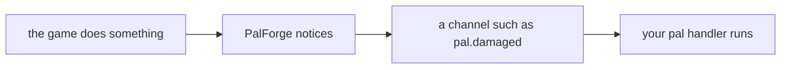
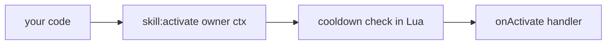
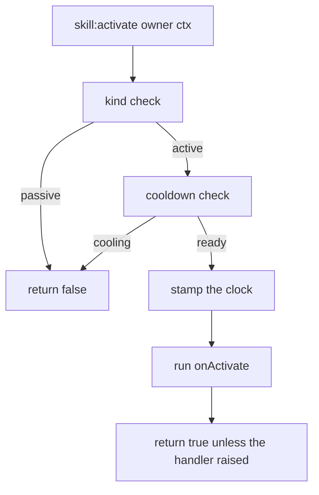
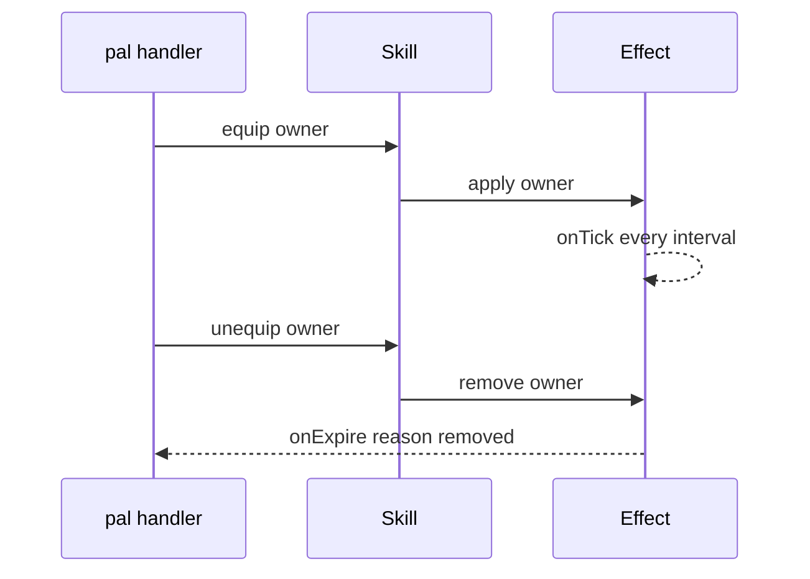

## このページでできるようになること

- 名前・属性・威力・アイコンを決めて、自分の攻撃を追加する
- Pal がダメージを受けたとき、建物を使われたとき、キーを押したときに発動させる
- 秒数でクールダウンを決めて、連発できないようにする
- 持っている間ずっと効き続ける特性を作る
- Pal が持っているスキルの一覧を読み出す
- 生きている Pal やプレイヤーにスキルを載せて、ゲーム自身に持たせる

スキルは攻撃や特性のことです。`Skill{ ... }` で一度書くと、アクションを持ったオブジェクトが返ります。
ゲームが勝手にスキルを発動させることはないので、発動させる行は自分のコードに書きます。次の例では
最後の行がそれです。

```lua title="content/skills.lua"
local Ember = Skill{
    id       = "example:Ember",
    name     = "Ember",
    kind     = "active",
    element  = "fire",
    cooldown = 5.0,
    power    = 30,
    events   = {
        onActivate = function(skill, owner, ctx)
            -- your gameplay goes here
        end,
    },
}

Ember:activate(Player.character())   -- runs onActivate unless it is still cooling down
```

## スキルは自分のコードで発動させます

PalForge の他の部分は逆向きに動きます。ゲームで何かが起きると、そのために書いた関数を PalForge が
呼びます。ハンドラとはその関数、つまり呼んでもらうために書く自分のコードのことです。



PalForge にはワールド・建物・Pal・アイテムのチャンネルがあります。スキルのチャンネルはありません。
「この Pal がスキル X を使った」と教えてくれるものがゲーム側にないからです。そのためスキルは、自分が
呼んだその瞬間に動きます。



<Callout type="warn">
パックが `:activate` / `:hit` / `:equip` / `:unequip` を呼ばない限り、スキルのハンドラは一度も実行されません。
`Pal{ skills = { ... } }` に並べただけでも実行されません。発動させたい場所に呼び出しを書いてください。Pal の
ハンドラ、Building の `onRightClick`、キーバインド、Effect の tick — どこでも構いません。このページの下の方の
レシピで、それぞれの書き方を示します。
</Callout>

この呼び出しの経路は間に合わせではなく、そのまま使えるものです。クールダウンは Lua 側で数えられ、ハンドラには
スキル自身のオブジェクトと渡したコンテキストテーブルが届き、戻り値で実行されたかどうかが分かります。

## スキルを定義する

必ず指定するフィールドは `id` だけです。他はすべて任意で、PalForge が知らないフィールド名を書くと、
その場でエラーになり「もしかして」の候補が出ます。

<Tabs items={['Global', 'Namespaced']}>
<Tab value="Global">

```lua
-- requiring palforge.api installs the bare globals
local Ember = Skill{ id = "example:Ember" }
```

</Tab>
<Tab value="Namespaced">

```lua
local api = require("palforge.api")
local Ember = api.Skill{ id = "example:Ember" }
```

</Tab>
</Tabs>

すべてのフィールドを使った定義です。

```lua title="content/skills.lua"
local log = require("palforge.utils.log").scope("example")

local Ember = Skill{
    id          = "example:Ember",
    name        = "Ember",
    description = "A short burst of fire.",
    kind        = "active",
    element     = "fire",
    cooldown    = 5.0,
    power       = 30,
    icon        = "palforge/example/textures/ember.png",
    data        = { tier = 1, projectiles = 3 },
    events      = {
        onActivate = function(skill, owner, ctx)
            log.info(skill:name() .. " fired, power " .. tostring(skill:power()))
        end,
        onHit = function(skill, target, ctx)
            log.info("hit " .. tostring(target))
        end,
    },
}
```

渡せるフィールドと、その型と既定値の一覧です。

<TypeTable
  type={{
    id: { description: 'スキル id。ゲームの行 id、または自作コンテンツ用の "pack:name"。そのままの文字列で登録されます', type: 'string', required: true },
    name: { description: 'スキル一覧に表示される名前', type: 'string', default: 'id と同じ' },
    description: { description: 'UI やツール向けの 1 行説明', type: 'string' },
    kind: { description: 'active は発動するもの、passive は装備するもの', type: '"active" | "passive"', default: '"active"' },
    element: { description: '属性。fire や water など。自由文字列で、検証はされません', type: 'string' },
    cooldown: { description: '発動間隔の秒数。:activate が強制します', type: 'number' },
    power: { description: '基礎威力。メタデータで、フレームワークは参照しません', type: 'number' },
    icon: { description: 'DataTable 検索に失敗したときのフォールバックアイコン', type: 'any' },
    events: { description: '4 つの挙動ハンドラをまとめたテーブル', type: 'Skill.Spec.Events' },
    data: { description: '任意の自由データ。定義にそのまま保持されます', type: 'table' },
  }}
/>

`element` と `power` は定義に保持され、`:element()` / `:power()` で取り出せます。`data` も保持されますが、
ハンドルから読むメソッドはありません。PalForge はこの 3 つをどれも見ません。ハンドラや UI が自分の数値を
置いておくための場所です。

フィールドの一覧は、覚える代わりに Lua から表示させることもできます。

```lua
local schema = require("palforge.core.schema")
print(schema.help("Skill.Spec"))
```

```text
Skill.Spec {
  id            string     (required) skill id: a game row id or "pack:name"
  name          string     shown in skill lists (defaults to id)
  description   string     one-line description, for UI and tooling
  kind          string     (default=active, one of { "active", "passive" }) an active skill is fired; a passive one is equipped
  element       string     attribute / element (fire, water, ...)
  cooldown      number     seconds between activations (enforced by :activate)
  power         number     base power / magnitude
  icon          any        fallback icon used when the DataTable lookup misses
  events        table      (Skill.Spec.Events) behaviour handlers (grouped)
  data          table      free-form payload of your own, carried onto the definition
}
```

定義の戻り値を持ち続ける必要はありません。どこからでも取り直せます。

```lua
Skill.get("example:Ember")      -- the definition you registered
Skill.get("Legend")             -- never nil: a thin definition over any id
Skill.get_all()                 -- every PalForge-registered skill, as handles
```

`Skill.get` は nil を返しません。誰も定義していない id を渡すと素の定義が返ります。`:kind()` は `"active"`、
`:name()` は id そのもの、`:description()` / `:element()` / `:power()` は nil、クールダウンはなく、`:activate` は
空のハンドラを実行して true を返します。

同じ id で 2 回定義すると登録は置き換わります。最後の呼び出しが勝ち、先に受け取ったものは先の定義を
指したままです。

## アクティブとパッシブ

`kind` の既定値は `"active"` で、他に指定できるのは `"passive"` だけです。

```lua
local Ember = Skill{
    id       = "example:Ember",
    kind     = "active",
    cooldown = 5.0,
    events   = { onActivate = function(skill, owner, ctx) end },
}

local Ironhide = Skill{
    id     = "example:Ironhide",
    kind   = "passive",
    events = {
        onEquip   = function(skill, owner, ctx) end,
        onUnequip = function(skill, owner, ctx) end,
    },
}
```

違いを作っているのは 1 か所の判定だけです。`kind` が `"passive"` のとき、`:activate` はクールダウンに触れず、
何も実行せずにすぐ `false` を返します。

```lua
Ironhide:activate(owner)   --> false, nothing ran
```

これ以外に `kind` を見る場所はありません。`:equip` / `:unequip` / `:hit` は、アクティブでもパッシブでも
宣言したハンドラをそのまま実行します。ですから「装備している間だけ効く」挙動を、`onEquip` を持つ
アクティブスキルで表現しても問題ありません。

## ハンドラ

ハンドラは、アクションが呼ばれたときに PalForge が実行する関数です。4 つあり、どれも任意です。第 1 引数には
スキル自身のハンドルが届きます。この一覧にない名前を書くと、黙って無視されるのではなく定義時にエラーになります。

| ハンドラ | シグネチャ | 実行されるタイミング |
| --- | --- | --- |
| `onActivate` | `fun(skill, owner, ctx)` | `:activate(owner, ctx)` を呼び、クールダウンが許可したとき |
| `onHit` | `fun(skill, target, ctx)` | `:hit(target, ctx)` を呼んだとき |
| `onEquip` | `fun(skill, owner, ctx)` | `:equip(owner, ctx)` を呼んだとき |
| `onUnequip` | `fun(skill, owner, ctx)` | `:unequip(owner, ctx)` を呼んだとき |

ハンドルは定義の呼び出しが返したオブジェクトそのものなので、ハンドラの中でアクションもクエリもすぐ使えます。

```lua
local Ember = Skill{
    id       = "example:Ember",
    cooldown = 5.0,
    power    = 30,
    events   = {
        onActivate = function(skill, owner, ctx)
            log.info(skill.id .. " power=" .. tostring(skill:power()))
            skill:hit(ctx.target, { from = owner })   -- report the landing yourself
        end,
        onHit = function(skill, target, ctx)
            log.info("landed on " .. tostring(target))
        end,
    },
}
```

<Callout type="warn">
アクションはハンドラを `pcall` で包んで実行し、エラーメッセージを捨てます。ハンドラが落ちても、戻り値が
`false` になるだけでログには何も出ません。ログはハンドラの中で自分で出すか、危険な処理を自分で包んでください。
</Callout>

## アクション

スキルを使うのはこの 5 つの呼び出しです。どれも自分で呼びます。

```lua
skill:activate(owner, ctx)    --> boolean, did the handler run
skill:hit(target, ctx)        --> boolean
skill:equip(owner, ctx)       --> boolean
skill:unequip(owner, ctx)     --> boolean
skill:cooldownLeft(owner)     --> number, seconds until ready, 0 when ready
```

この 5 つは自分側の帳簿で、ゲームには何も伝えません。もう 3 つ — `:teach`、`:forget`、
`:skillsOn` — は逆に、実在するキャラクターに書き込み、読み戻します。専用の節が下にあります。

- `owner` と `target` は渡したものがそのまま届きます。Pal のポーン、プレイヤーキャラクター、ただの
  テーブルでも構いません。`owner` を見るのはクールダウンの記録だけで、識別子としてしか使いません。
- `ctx` は自分で用意するコンテキストテーブルです。中身を入れてくれるものはありませんし、省略もできます。
  4 つのアクションはいずれも省略時に空テーブルを入れるので、アクション経由で呼ばれたハンドラの中で
  `ctx` が nil になることはありません。
- `:activate` はパッシブなら `false`、クールダウンで弾かれたら `false`、それ以外はハンドラが落ちずに
  実行できたとき `true` を返します。
- `:hit` / `:equip` / `:unequip` はクールダウンも `kind` も見ません。ハンドラが落ちない限り `true` です。

```lua
local Ember  = Skill.get("example:Ember")
local player = Player.character()

if Ember:activate(player, { reason = "manual" }) then
    log.info("fired")
else
    log.info("blocked, " .. string.format("%.1f", Ember:cooldownLeft(player)) .. "s left")
end
```

ハンドルには、各ハンドラを直接呼ぶ形のメソッドもあります。`skill:onActivate(owner, ctx)` /
`skill:onHit` / `skill:onEquip` / `skill:onUnequip` です。これらはハンドラに直行します。クールダウンも
パッシブの判定も通らず、`ctx` の空テーブル補完もせず、エラーも握りつぶしません。その動きが必要なとき以外は
アクションを使ってください。

## クールダウン

`cooldown` は秒数で、これを見るのは `:activate` だけです。



記録は owner ごと、スキル id ごとです。同じスキルを持つ 2 体の Pal は別々にクールダウンします。

```lua
local Ember = Skill{
    id       = "example:Ember",
    cooldown = 5.0,
    events   = { onActivate = function(skill, owner, ctx) end },
}

-- `one` and `two` are two different owners, e.g. two `ctx.actor` pawns
Ember:activate(one)       --> true
Ember:activate(one)       --> false, still cooling
Ember:activate(two)       --> true, a different owner has its own bucket
Ember:cooldownLeft(one)   --> counts down from 5.0
Ember:cooldownLeft(two)   --> counts down from 5.0, independently
```

押さえておきたい点です。

- `owner` は省略できます。その場合は時刻が 1 つの共有枠に入るので、owner なしの `:activate()` は
  そのスキル全体で 1 つのクールダウンになります。
- owner は弱参照で持つので、クールダウンが消えたポーンを生かし続けることはありません。
- 時刻は `os.clock()` から取ります。
- `cooldown` が未指定、または 0 以下ならゲートはありません。`:activate` は常に実行され、`:cooldownLeft` は
  常に `0` を返します。
- 時刻の記録はハンドラの実行**前**です。ハンドラが落ちても、クールダウンは消費されています。

そのまま撃つより、残り時間を出す形の方がたいてい親切です。

```lua
local left = Ember:cooldownLeft(Player.character())
if left > 0 then
    log.info(string.format("Ember ready in %.1fs", left))
else
    Ember:activate(Player.character())
end
```

## 値を読み出す

宣言した内容はハンドルからすべて読み出せます。

```lua
local s = Skill.get("example:Ember")

s.id             --> "example:Ember"   (a plain field on the handle)
s:name()         --> "Ember", or the id when no name was declared
s:description()  --> string | nil
s:kind()         --> "active" | "passive"
s:element()      --> string | nil
s:power()        --> number | nil
s:iconOf()       --> texture ref | the declared icon | nil
```

`:iconOf()` は `core/icons` を通して、ゲーム側のデータテーブル — パートナースキルのアイコンテーブル
`/Game/Pal/DataTable/PartnerSkill/DT_partnerSkillIconDataTable` — を id で引きます。どの段階も失敗に強く、
テーブルが無い / 行が無い / 列が無い場合はいずれも nil になり、失敗したときは宣言した `icon` が返ります。
このテーブルは Pal 単位のキーなので、たいていのスキル id は当たりません。`"pack:name"` の id は必ず外れます。
アイコンを出したいなら `icon` を宣言してください。

```lua
local Ember = Skill{
    id   = "example:Ember",
    icon = "palforge/example/textures/ember.png",
}
Ember:iconOf()   --> the declared icon, since "example:Ember" has no row in that table

Skill.get("Legend"):iconOf()   --> nil: no row, and no icon was declared to fall back to
```

## 生きているキャラクターにスキルを載せる

上の 5 つのアクションは自分側の帳簿で、自分のハンドラを走らせるだけでゲームには何も伝えません。
この 3 つは逆です。**生きている** Pal やプレイヤーにスキルを載せてゲーム自身に持たせ、そのキャラクターが
何を持っているかを読み戻します。

```lua
skill:teach(actor)      --> boolean, true only when the skill is on the character afterwards
skill:forget(actor)     --> boolean, true only when it is gone afterwards
skill:skillsOn(actor)   --> { active = { ... }, passive = { ... } } | nil
```

`actor` は実在するキャラクターでなければなりません。ワールドに立っている Pal か、
`Player.character()` が返すプレイヤー自身のポーンです。それ以外は `false` で断られます。

```lua
local pawn = Player.character()

Skill.get("FireBlast"):teach(pawn)    -- one of the game's own moves
Skill.get("Legend"):teach(pawn)       -- not a move: added as a passive trait
Skill.get("FireBlast"):skillsOn(pawn) --> { active = { "FireBlast" }, passive = { "Legend" } }
Skill.get("FireBlast"):forget(pawn)
```

### どちらの種類としてゲームに頼むかは id が決めます

Palworld はアクティブな技とパッシブな特性を別々の場所に持っているので、`:teach` はどちらかを選ぶ
必要があります。選ぶ根拠は **id** であって、`kind` フィールドではありません。

- ゲーム自身のアクティブな技として知られている id — `"FireBlast"`、`"Psychokinesis"` など 309 種類 —
  は、そのキャラクターの装備技に追加されます。
- **それ以外の id** は、その名前のパッシブスキルとして追加されます。

<Callout type="warn">
`kind` は、自分のコードが発動したときに「自分のスキル」が何をするかの説明です。`:teach` が頼むのは
ゲーム自身のスキルなので、`kind` はまったく読みません。id が `"FireBlast"` のスキルに
`kind = "passive"` と書いてあっても、載るのはゲームのアクティブ技です。逆に `"example:Ember"` の
ようなパック独自の id は、何を宣言していてもその名前のパッシブとして渡されます。ゲームにその名前の
技は無いからです。
</Callout>

大文字・小文字は区別されないので、`"fireblast"` でも同じ技になります。id を書く前に確かめたいときは、
`require("palforge.core.character").wazaNames()` がこのビルドのアクティブ技名をすべてソートして返します。

### 戻り値の意味

書き込みは必ずキャラクターを読み戻して確認するので、`true` は「そのスキルがキャラクター上に
**見えた**」という意味です。呼び出しが例外を出さなかった、ではありません。`false` は載らなかったと
いう意味で、対象がキャラクターでない、ゲームがその id を受け付けない、書き込みが断られた、の
いずれかです。

`:skillsOn(actor)` は `{ active = {...}, passive = {...} }` を返します。空のリストは「読めたうえで
何も持っていない」です。テーブルごと `nil` の場合は、そのキャラクターをまったく読めなかったという
意味で、「持っていない」ではありません。添字を引く前に `nil` を確かめてください。

```lua
local carried = Skill.get("FireBlast"):skillsOn(pawn)
if carried then
    print(#carried.active .. " moves, " .. #carried.passive .. " traits")
end
```

<Callout type="info">
`:teach` と `:equip` は意図的に別物で、どちらにも使い道があります。`:equip` は好きな値に対して自分の
`onEquip` ハンドラを走らせるだけでゲームには何も伝えません。`:teach` は実在するキャラクターに書き込み、
そのあとゲームが何を見せているかを返します。自前で「装備中」の集合を管理するパックは、これまでどおり
`:equip` を使ってください。
</Callout>

## Pal にスキルを持たせる

Pal は自分が持つスキルを id の配列で並べます。

```lua
local Blaze = Pal{
    id     = "FoxMage",
    name   = "Blaze",
    skills = { "example:Ember", "example:Ironhide" },
}

Blaze:skillsOf()   --> { "example:Ember", "example:Ironhide" }
```

要素ごとに検証され、エラーには添字が入ります。

```text
PalForge: Pal: field "skills[2]" expects string, got number
```

<Callout type="warn">
この配列はただのリストです。宣言しただけではどのクリーチャーにも何も載りませんし、アクティブを
ゲームが発動してくれることもありません。保持して `pal:skillsOf()` で返すだけです。
</Callout>

使い道は 2 つあります。ひとつは、自分側の帳簿としてループを書くこと。

```lua
for _, id in ipairs(Blaze:skillsOf()) do
    local skill = Skill.get(id)
    if skill:kind() == "passive" then
        skill:equip(owner)
    end
end
```

もうひとつは、リスト全体を生きているクリーチャーに 1 回で渡すことです。
[`Pal.Handle:teachAll`](/docs/api/pal) を使います。

```lua
local taught, asked = Blaze:teachAll(somePalActor)
-- 2, 2 when both landed; 1, 2 when one did not
```

`teachAll` は各 id を `:teach` とまったく同じ規則で振り分け、1 つ失敗しても残りを続け、数値を 2 つ
返します。`true` / `false` に潰さないので、一部だけ成功したことがそのまま見えます。

## Palworld 既存のスキル id

ゲームに元からあるスキルに挙動を足したいときは、`native/skills.lua` が Palworld の 2 つのスキルテーブル —
`DT_PassiveSkill_Main_Common`（パッシブ特性）と `DT_PartnerSkillParameter`（`RAID_` / `GYM_` / `BOSS_` など
エンカウント単位のキーを持つパートナースキル）— の行 id を、ひとつのカタログとして持っています。

```lua
local skills = require("palforge.native.skills")

skills.CATALOG              -- every row id from those two tables, as a list
skills.get("Legend")        -- a cached handle for a catalog id, nil for anything else
skills.get("not_a_row")     -- nil
```

`get(id)` は最初に聞かれたときに定義し、その結果を覚えます。ですから起動時に数千の id が登録されることは
ありません。カタログ自体はただのデータです。このファイルには出来合いの定義も 1 つ入っています。

```lua
skills.Fireball             -- Skill{ id = "FlameThrower", kind = "active",
                            --        element = "fire", cooldown = 3.0, power = 50 }
skills.Fireball:activate(owner)
```

<Callout type="info">
`skills.CATALOG` に `"FlameThrower"` は入っていません。この名前は行名ではなく `DT_PartnerSkillParameter` の
`DevName` 列の値だからです。それでも `skills.get("FlameThrower")` は上のハンドルを返します。その `onActivate` は
まだ何もしません。飛び道具を Lua から出す方法が確認できていないためです。動かしたい場合は自分の処理を
ハンドラに書いてください。`element` / `cooldown` / `power` も PalForge 側で決めた数値で、ゲームから読んだ値では
ありません。
</Callout>

## レシピ

### Pal のハンドラからスキルを発動する

`onDamaged` は Pal がダメージを受けたときに自動で実行されます。つまりこれは実際にゲーム中で発動するスキルです。
`ctx.actor` はダメージを受けた Pal なので、そのまま owner にするのが自然です。

```lua title="content/retaliate.lua"
local log = require("palforge.utils.log").scope("example")

Skill{
    id       = "example:Ember",
    name     = "Ember",
    kind     = "active",
    element  = "fire",
    cooldown = 5.0,
    power    = 30,
    events   = {
        onActivate = function(skill, owner, ctx)
            log.info(string.format("%s retaliates (%s) power=%d",
                skill:name(), tostring(ctx.reason), skill:power() or 0))
            -- deal your damage / spawn your projectile here
        end,
    },
}

Pal{
    id     = "FoxMage",
    name   = "Blaze",
    skills = { "example:Ember" },
    events = {
        onDamaged = function(pal, ctx)
            local ember = Skill.get("example:Ember")
            if not ember:activate(ctx.actor, { reason = "damaged" }) then
                log.info(string.format("Ember cooling, %.1fs left",
                    ember:cooldownLeft(ctx.actor)))
            end
        end,
    },
}
```

ここで効いているのがクールダウンです。連続でダメージを受けると `onDamaged` は何度も呼ばれますが、
5 秒の窓ごとに最初の 1 回だけが通ります。

### 建物からスキルを発動する

`onRightClick` も自動で実行されます。プレイヤーが建物を操作したときです。ハンドラの第 1 引数には設置された
建物自身が `self` として届くので、建物側で状態を持てます。コンテキストには操作したアクターが `ctx.player` と
して入っており、クールダウンの owner に向いています。

```lua title="content/brazier.lua"
local log = require("palforge.utils.log").scope("example")

Skill{
    id       = "example:Ember",
    kind     = "active",
    element  = "fire",
    cooldown = 3.0,
    events   = {
        onActivate = function(skill, owner, ctx)
            log.info("brazier lit by " .. tostring(owner) .. " at " .. tostring(ctx.where))
        end,
    },
}

Building{
    id     = "example:Brazier",
    name   = "Brazier",
    gridCm = 100,
    mesh   = {
        kind  = "static",
        model = "/Game/Pal/Model/Prop/Architecture/WorkBenchPrimitive/SM_WorkBenchPrimitive.SM_WorkBenchPrimitive",
    },
    state  = { lit = 0 },
    events = {
        onRightClick = function(self, ctx)
            local ember = Skill.get("example:Ember")
            local fired = ember:activate(ctx.player, { where = self.pos })
            if fired then
                self.state.lit = self.state.lit + 1
                self:save()
            else
                log.info(string.format("still hot, %.1fs", ember:cooldownLeft(ctx.player)))
            end
        end,
    },
}
```

### キーにスキルを割り当てる

UE4SS には `RegisterKeyBind` があります。中身を `ExecuteInGameThread` で包むと、そこからゲームに触れても
安全です。この 2 つはパックからそのまま使えます。PalForge 自身の開発用キーも同じ形で登録しています。

```lua title="content/keybind.lua"
local log = require("palforge.utils.log").scope("example")

Skill{
    id       = "example:Ember",
    kind     = "active",
    cooldown = 2.0,
    events   = {
        onActivate = function(skill, owner, ctx)
            log.info("Ember on " .. tostring(owner))
        end,
    },
}

RegisterKeyBind(Key.F5, function()
    ExecuteInGameThread(function()
        local owner = Player.character()
        if not owner then return end
        local ember = Skill.get("example:Ember")
        if not ember:activate(owner, { reason = "keybind" }) then
            log.info(string.format("%.1fs left", ember:cooldownLeft(owner)))
        end
    end)
end)
```

キーを押しっぱなしにするとバインドは何度も呼ばれますが、クールダウンによって発動は 2 秒に 1 回になります。

### Effect を付けるパッシブ

`Effect` は自前のタイマーを持っています。「装備している間、何かが起き続ける」を作るには、パッシブスキルと
組み合わせるのが素直です。`onEquip` で付けて、`onUnequip` で外します。



```lua title="content/ironhide.lua"
local log = require("palforge.utils.log").scope("example")

local Hardened = Effect{
    id          = "example:Hardened",
    name        = "Hardened",
    description = "Regenerating while the trait is equipped.",
    interval    = 2.0,          -- onTick every 2s; no duration = until :remove()
    events      = {
        onApply  = function(effect, target, ctx)
            log.info("hardened on " .. tostring(target))
        end,
        onTick   = function(effect, target, ctx)
            log.info(string.format("tick at %.1fs", ctx.elapsed))
            -- heal / buff the target here
        end,
        onExpire = function(effect, target, ctx)
            log.info("hardened off, reason " .. tostring(ctx.reason))
        end,
    },
}

Skill{
    id          = "example:Ironhide",
    name        = "Ironhide",
    description = "A passive trait that hardens its owner.",
    kind        = "passive",
    events      = {
        onEquip   = function(skill, owner, ctx) Hardened:apply(owner) end,
        onUnequip = function(skill, owner, ctx) Hardened:remove(owner) end,
    },
}

Pal{
    id     = "FoxMage",
    name   = "Blaze",
    skills = { "example:Ironhide" },
    events = {
        onSpawned = function(pal, ctx)
            for _, id in ipairs(pal:skillsOf()) do
                local skill = Skill.get(id)
                if skill:kind() == "passive" then
                    skill:equip(ctx.actor, { from = pal.id })
                end
            end
        end,
        onDeath = function(pal, ctx)
            for _, id in ipairs(pal:skillsOf()) do
                Skill.get(id):unequip(ctx.actor)
            end
        end,
    },
}
```

`onSpawned` と `onDeath` はどちらも Pal がワールドに出れば自動で実行されるので、装備も解除も自分で
呼ばなくて済みます。`onDeath` は確認済みのゲーム側フックに乗っています。`onSpawned` が乗っている
`BroadcastOnCompleteInitializeParameter` はまだ未確認の候補なので、装備はベストエフォートと考えて、
確実にしたいなら別の場所でも装備し直してください。スキルが受け持つのは 2 つのハンドラ、タイミングを
受け持つのは `Effect` です。

## 検証エラー

問題はすべて `PalForge: ` で始まるエラーになり、呼び出しはそこで止まります。定義が中途半端に成功することは
ありません。

```text
PalForge: Skill: field "id" is required (skill id: a game row id or "pack:name")
PalForge: Skill: unknown field "cooldwn" (did you mean "cooldown"?). Valid fields: id, name, description, kind, element, cooldown, power, icon, events, data
PalForge: Skill: field "kind" must be one of { "active", "passive" }, got "buff"
PalForge: Skill: field "power" expects number, got string
PalForge: Skill: field "events" (Skill.Spec.Events): unknown field "onActivated" (did you mean "onActivate"?). Valid fields: onActivate, onHit, onEquip, onUnequip
```

ハンドラ名も同じように検証されます。これは助かるところで、`onActivated` のような綴り間違いがすぐ分かります。
黙って受け入れられると、いつまでも動かないスキルが手元に残ることになります。

## 関連ページ

<Cards>
  <Card title="Pal" href="/docs/api/pal">Pal へのスキルの並べ方と、それを駆動できるフック。</Card>
  <Card title="Effect" href="/docs/api/effect">タイマーを持つドメイン。パッシブが動き続けるための土台。</Card>
  <Card title="Building" href="/docs/api/building">設置された建物と onRightClick、もう 1 つの自然なトリガー。</Card>
  <Card title="Lifecycle" href="/docs/concepts/lifecycle">どのチャンネルがあり、どのフックにゲーム側の供給があるか。</Card>
</Cards>

## まとめ

- スキルは `Skill{ ... }` で作ります。必ず指定するのは `id` だけです。
- 勝手には発動しません。自分のコードで `:activate` / `:hit` / `:equip` / `:unequip` を呼びます。
- `cooldown` は秒数で、owner ごとに数えられ、見るのは `:activate` だけです。
- `kind = "passive"` にすると `:activate` は `false` を返します。`:equip` と `:unequip` を使ってください。
- ハンドラが落ちても戻り値が `false` になるだけでログには出ないので、ログはハンドラの中で出します。
- `pal:skillsOf()` で読めるのは Pal が*宣言した* id です。`skill:teach(actor)` は生きている
  キャラクターに載せ、`skill:skillsOn(actor)` はそのキャラクターが実際に持っているものを読み戻し、
  `pal:teachAll(actor)` は宣言済みリストをまとめて載せます。

次は [Effect](/docs/api/effect) を読むと、パッシブが効き続けるためのタイマーが手に入ります。
