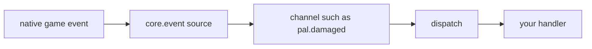
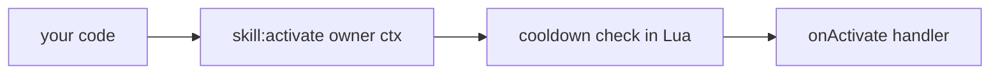
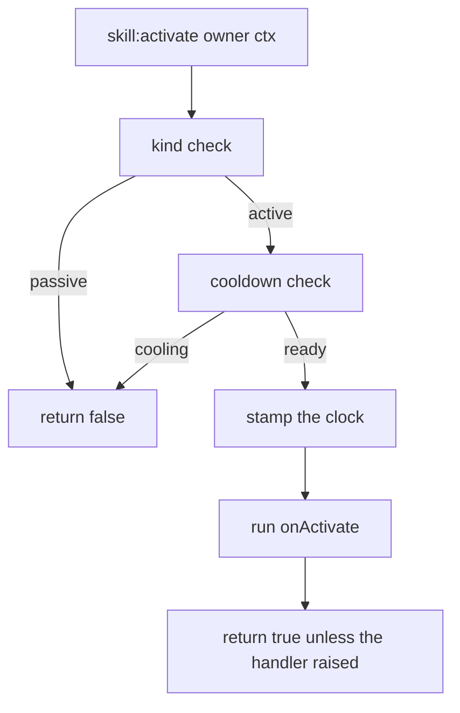
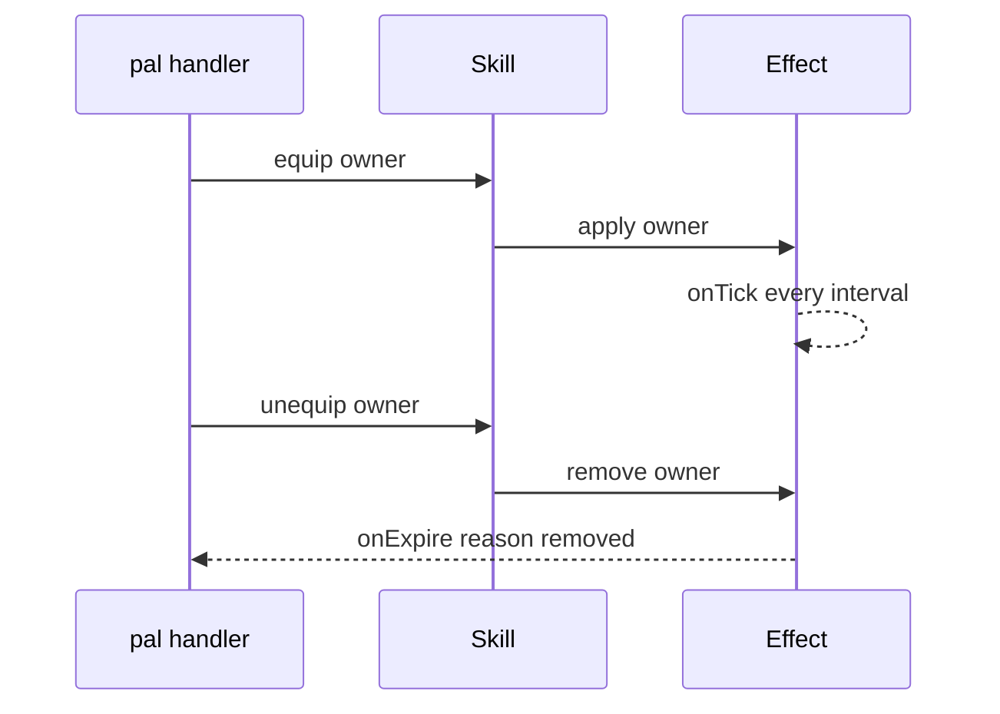

スキルは 4 つのハンドラと 5 つのアクションを持つ定義です。`Skill{ ... }` を呼ぶと spec が検証され、
オブジェクトレジストリの `("skill", id)` に定義が登録され、アクションを持つ `Skill.Handle` が返ります。

```lua title="content/skills.lua"
local Ember = Skill{
    id       = "example:Ember",
    name     = "Ember",
    kind     = "active",
    element  = "fire",
    cooldown = 5.0,
    power    = 30,
    events   = {
        onActivate = function(skill, owner, ctx)
            -- your gameplay goes here
        end,
    },
}

Ember:activate(Player.character())   -- runs onActivate unless it is still cooling down
```

## Nothing fires a skill for you

`core/event` にスキル用のチャンネルはありません。`event.CHANNELS` にあるのは `gameStart`、
`world.ready`、`world.left`、4 つの `building.*`、4 つの `pal.*`、4 つの `item.*`、そして `tick` だけです。
「この Pal がスキル X を使った」と教えてくれるネイティブフックは見つかっていないため、それを emit する
ソースは存在せず、スキルのハンドラを呼ぶディスパッチもありません。

ライブな他ドメインの流れはこうです。



スキルの流れはこうです。



<Callout type="warn">
パックが `:activate` / `:hit` / `:equip` / `:unequip` を呼ばない限り、スキルのハンドラは一度も実行されません。
`Pal{ skills = { ... } }` と宣言しても実行されません。スキルは自分のコードから呼び出すものです。Pal のハンドラ、
Building の `onRightClick`、キーバインド、Effect の tick — どこからでも構いません。
</Callout>

動くのは手動呼び出しの経路で、そちらは完全に機能します。クールダウンは Lua 側で強制され、ハンドラにはハンドル自身と
渡したコンテキストテーブルが届き、戻り値で実行されたかどうかが分かります。モジュールのヘッダには、ネイティブソースが
見つかった時点で skill チャンネルが同じハンドラへ流れると書かれています。つまり今 `:activate` に対して書いたパックの
コードは、その時も変える必要がありません。

## Defining a skill

必須フィールドは `id` だけです。それ以外はすべて任意で、spec が宣言していないフィールドは定義時にハードエラーになります。

<Tabs items={['Global', 'Namespaced']}>
<Tab value="Global">

```lua
-- requiring palforge.api installs the bare globals
local Ember = Skill{ id = "example:Ember" }
```

</Tab>
<Tab value="Namespaced">

```lua
local api = require("palforge.api")
local Ember = api.Skill{ id = "example:Ember" }
```

</Tab>
</Tabs>

すべてのフィールドを使った定義です。

```lua title="content/skills.lua"
local log = require("palforge.utils.log").scope("example")

local Ember = Skill{
    id          = "example:Ember",
    name        = "Ember",
    description = "A short burst of fire.",
    kind        = "active",
    element     = "fire",
    cooldown    = 5.0,
    power       = 30,
    icon        = "palforge/example/textures/ember.png",
    data        = { tier = 1, projectiles = 3 },
    events      = {
        onActivate = function(skill, owner, ctx)
            log.info(skill:name() .. " fired, power " .. tostring(skill:power()))
        end,
        onHit = function(skill, target, ctx)
            log.info("hit " .. tostring(target))
        end,
    },
}
```

<TypeTable
  type={{
    id: { description: 'スキル id。ゲームの行 id、または自作コンテンツ用の "pack:name"。そのままの文字列で登録されます', type: 'string', required: true },
    name: { description: 'スキル一覧に表示される名前', type: 'string', default: 'id と同じ' },
    description: { description: 'UI やツール向けの 1 行説明', type: 'string' },
    kind: { description: 'active は発動するもの、passive は装備するもの', type: '"active" | "passive"', default: '"active"' },
    element: { description: '属性。fire や water など。自由文字列で、検証はされません', type: 'string' },
    cooldown: { description: '発動間隔の秒数。:activate が強制します', type: 'number' },
    power: { description: '基礎威力。メタデータで、フレームワークは参照しません', type: 'number' },
    icon: { description: 'DataTable 検索に失敗したときのフォールバックアイコン', type: 'any' },
    events: { description: '4 つの挙動ハンドラをまとめたテーブル', type: 'Skill.Spec.Events' },
    data: { description: '任意の自由データ。定義にそのまま保持されます', type: 'table' },
  }}
/>

`element` と `power` は定義に保持され、`:element()` / `:power()` で取り出せます。`data` も定義に保持されますが、
ハンドルにそれを返すクエリはありません。フレームワーク側はこの 3 つをいずれも読みません。ハンドラや UI が数値を
置いておくための場所です。

形を覚える代わりに、実行時に問い合わせられます。

```lua
local schema = require("palforge.core.schema")
print(schema.help("Skill.Spec"))
```

```text
Skill.Spec {
  id            string     (required) skill id: a game row id or "pack:name"
  name          string     shown in skill lists (defaults to id)
  description   string     one-line description, for UI and tooling
  kind          string     (default=active, one of { "active", "passive" }) an active skill is fired; a passive one is equipped
  element       string     attribute / element (fire, water, ...)
  cooldown      number     seconds between activations (enforced by :activate)
  power         number     base power / magnitude
  icon          any        fallback icon used when the DataTable lookup misses
  events        table      (Skill.Spec.Events) behaviour handlers (grouped)
  data          table      free-form payload of your own, carried onto the definition
}
```

あとからどこでも取り出せます。

```lua
Skill.get("example:Ember")      -- the definition you registered
Skill.get("Legend")             -- never nil: a thin definition over any id
Skill.get_all()                 -- every PalForge-registered skill, as handles
```

`Skill.get` は nil を返しません。誰も定義していない id を渡すと、素の定義が返ります。`:kind()` は `"active"`、
`:name()` は id そのもの、`:description()` / `:element()` / `:power()` は nil、クールダウンはなく、`:activate` は
何もしないデフォルトハンドラを実行して true を返します。

同じ id で 2 回定義すると登録は置き換わります。最後の呼び出しが勝ち、先に取得したハンドルは先の定義を指したままです。

## Active and passive

`kind` の既定値は `"active"` で、指定できるのは `"active"` と `"passive"` だけです。

```lua
local Ember = Skill{
    id       = "example:Ember",
    kind     = "active",
    cooldown = 5.0,
    events   = { onActivate = function(skill, owner, ctx) end },
}

local Ironhide = Skill{
    id     = "example:Ironhide",
    kind   = "passive",
    events = {
        onEquip   = function(skill, owner, ctx) end,
        onUnequip = function(skill, owner, ctx) end,
    },
}
```

両者を分けているガードは 1 か所だけです。`kind` が `"passive"` のとき、`:activate` はクールダウンに触れず、
何も実行せずに即座に `false` を返します。

```lua
Ironhide:activate(owner)   --> false, nothing ran
```

これ以外に `kind` を見る場所はありません。`:equip` / `:unequip` / `:hit` は宣言されたハンドラを、アクティブでも
パッシブでも同じように実行します。したがって「装備している間だけ効く」挙動を、`onEquip` を持つアクティブスキルで
表現しても構いません。

## Handlers

4 つとも任意です。4 つとも第 1 引数にそのスキル自身の **ハンドル** を受け取ります。spec が宣言していない
ハンドラ名は、黙って無視されるのではなくハードエラーになります。

| ハンドラ | シグネチャ | 実行されるタイミング |
| --- | --- | --- |
| `onActivate` | `fun(skill, owner, ctx)` | `:activate(owner, ctx)` を呼び、クールダウンが許可したとき |
| `onHit` | `fun(skill, target, ctx)` | `:hit(target, ctx)` を呼んだとき |
| `onEquip` | `fun(skill, owner, ctx)` | `:equip(owner, ctx)` を呼んだとき |
| `onUnequip` | `fun(skill, owner, ctx)` | `:unequip(owner, ctx)` を呼んだとき |

第 1 引数は定義呼び出しが返したハンドルそのものなので、ハンドラの中でアクションもクエリもすぐ使えます。

```lua
local Ember = Skill{
    id       = "example:Ember",
    cooldown = 5.0,
    power    = 30,
    events   = {
        onActivate = function(skill, owner, ctx)
            log.info(skill.id .. " power=" .. tostring(skill:power()))
            skill:hit(ctx.target, { from = owner })   -- report the landing yourself
        end,
        onHit = function(skill, target, ctx)
            log.info("landed on " .. tostring(target))
        end,
    },
}
```

<Callout type="warn">
アクションはハンドラ呼び出しを `pcall` で包み、エラーメッセージを捨てます。ハンドラが例外を投げても、
戻り値が `false` になるだけでログには何も出ません。ログはハンドラの中で自分で出すか、危険な処理を自分で
包んでください。
</Callout>

## Actions

```lua
skill:activate(owner, ctx)    --> boolean, did the handler run
skill:hit(target, ctx)        --> boolean
skill:equip(owner, ctx)       --> boolean
skill:unequip(owner, ctx)     --> boolean
skill:cooldownLeft(owner)     --> number, seconds until ready, 0 when ready
```

- `owner` と `target` は渡したものがそのまま届きます。Pal のポーン、プレイヤーキャラクター、ただのテーブルでも
  構いません。`owner` を見るのはクールダウンの記録だけで、しかも識別子としてしか使いません。
- `ctx` は自分で用意するテーブルです。フレームワークが中身を入れることはありません。省略も可能で、4 つの
  アクションはいずれも省略時に空テーブルを補うため、アクション経由で呼ばれたハンドラの中で `ctx` が nil に
  なることはありません。
- `:activate` はパッシブなら `false`、クールダウンで弾かれたら `false`、それ以外はハンドラが例外を投げずに
  実行できたとき `true` を返します。
- `:hit` / `:equip` / `:unequip` はクールダウンも `kind` も見ません。ハンドラが例外を投げない限り `true` です。

```lua
local Ember  = Skill.get("example:Ember")
local player = Player.character()

if Ember:activate(player, { reason = "manual" }) then
    log.info("fired")
else
    log.info("blocked, " .. string.format("%.1f", Ember:cooldownLeft(player)) .. "s left")
end
```

ハンドルには生のフォワーダ `skill:onActivate(owner, ctx)` / `skill:onHit` / `skill:onEquip` /
`skill:onUnequip` もあり、これらは定義側のフックを直接呼びます。クールダウンもパッシブのガードも通らず、
`ctx` の空テーブル補完もせず、エラーも握りつぶしません。その挙動が必要なとき以外はアクションを使ってください。

## Cooldown

`cooldown` は秒で宣言し、強制するのは `:activate` だけです。



記録は owner ごと、スキル id ごとです。同じスキルを持つ 2 体の Pal は独立してクールダウンします。

```lua
local Ember = Skill{
    id       = "example:Ember",
    cooldown = 5.0,
    events   = { onActivate = function(skill, owner, ctx) end },
}

-- `one` and `two` are two different owners, e.g. two `ctx.actor` pawns
Ember:activate(one)       --> true
Ember:activate(one)       --> false, still cooling
Ember:activate(two)       --> true, a different owner has its own bucket
Ember:cooldownLeft(one)   --> counts down from 5.0
Ember:cooldownLeft(two)   --> counts down from 5.0, independently
```

押さえておきたい点です。

- `owner` の省略は許可されており、その場合はタイムスタンプが共有バケットに入ります。つまり owner なしの
  `:activate()` は、そのスキルについて全体で 1 つのクールダウンになります。
- owner のテーブルは弱参照キーなので、クールダウンを保持していても消えたポーンを生かし続けることはありません。
- 時刻は `os.clock()` から取っています。
- `cooldown` が未指定、または 0 以下ならゲートは存在しません。`:activate` は常に実行され、`:cooldownLeft` は
  常に `0` を返します。
- 時刻の記録はハンドラの実行**前**です。ハンドラが例外を投げても、クールダウンは消費されています。

そのまま撃つのではなく、残り時間を UI に出すのが定番の形です。

```lua
local left = Ember:cooldownLeft(Player.character())
if left > 0 then
    log.info(string.format("Ember ready in %.1fs", left))
else
    Ember:activate(Player.character())
end
```

## Queries

```lua
local s = Skill.get("example:Ember")

s.id             --> "example:Ember"   (a plain field on the handle)
s:name()         --> "Ember", or the id when no name was declared
s:description()  --> string | nil
s:kind()         --> "active" | "passive"
s:element()      --> string | nil
s:power()        --> number | nil
s:iconOf()       --> texture ref | the declared icon | nil
```

`:iconOf()` は `core/icons` を通して、実行時に Palworld のパートナースキルアイコン DataTable
(`/Game/Pal/DataTable/PartnerSkill/DT_partnerSkillIconDataTable`) を id で引きます。すべての段階が
フェイルソフトで、テーブルが無い / 行が無い / 列が無い場合は nil を返し、いずれかで失敗すると宣言済みの
`icon` フィールドが代わりに返ります。そのテーブルに行を持たない id — `"pack:name"` 形式の id はすべてそうです —
では常に自分の `icon` にフォールバックします。

```lua
local Ember = Skill{
    id   = "example:Ember",
    icon = "palforge/example/textures/ember.png",
}
Ember:iconOf()   --> the declared icon, since "example:Ember" has no DataTable row

Skill.get("Legend"):iconOf()   --> the texture ref when that row carries one, else nil
```

## Skills on a pal

Pal は自分が持つスキルを id の配列で宣言します。

```lua
local Blaze = Pal{
    id     = "FoxMage",
    name   = "Blaze",
    skills = { "example:Ember", "example:Ironhide" },
}

Blaze:skillsOf()   --> { "example:Ember", "example:Ironhide" }
```

配列は要素ごとに検証され、エラーには添字が入ります。

```text
PalForge: Pal: field "skills[2]" expects string, got number
```

<Callout type="warn">
`skills` はメタデータです。この id を解決する処理も、パッシブを装備する処理も、アクティブを発動する処理も
ありません。フレームワークはリストを保持して `pal:skillsOf()` で返すだけで、そこから挙動を作るのはハンドラの
仕事です。
</Callout>

解決はループ 1 つで済みます。

```lua
for _, id in ipairs(Blaze:skillsOf()) do
    local skill = Skill.get(id)
    if skill:kind() == "passive" then
        skill:equip(owner)
    end
end
```

## Native skill ids

`native/skills.lua` は Palworld の 2 つのスキルテーブル — `DT_PassiveSkill_Main_Common`（パッシブ特性）と
`DT_PartnerSkillParameter`（`RAID_` / `GYM_` / `BOSS_` などエンカウント単位のキーを持つパートナースキル）—
の行 id をひとつのカタログとして保持しています。

```lua
local skills = require("palforge.native.skills")

skills.CATALOG              -- every row id from those two tables, as a list
skills.get("Legend")        -- a cached handle for a catalog id, nil for anything else
skills.get("not_a_row")     -- nil
```

`get(id)` は初回に定義してキャッシュするため、起動時に数千の id が登録されることはありません。カタログ自体は
ただのデータです。このファイルには手書きの定義も 1 つ入っています。

```lua
skills.Fireball             -- Skill{ id = "FlameThrower", kind = "active",
                            --        element = "fire", cooldown = 3.0, power = 50 }
skills.Fireball:activate(owner)
```

<Callout type="info">
`"FlameThrower"` は `DT_PartnerSkillParameter` の `DevName` 列の値であって行 FName ではないため、カタログの
メンバーではありません。`skills.get("FlameThrower")` が手書きのハンドルを返すよう、キャッシュに事前登録されて
います。その `onActivate` はプレースホルダで、飛び道具を出すネイティブ呼び出しは確認できていないため、まだ何も
しません。`element` / `cooldown` / `power` もフレームワーク側のメタデータで、DataTable から読んだ値ではありません。
</Callout>

## Recipes

### Fire a skill from a pal handler

`onDamaged` はライブな Pal のフックなので、これは実際にゲーム中で発動するスキルになります。`ctx.actor` は
ダメージを受けた Pal のポーンで、そのまま owner にするのが自然です。

```lua title="content/retaliate.lua"
local log = require("palforge.utils.log").scope("example")

Skill{
    id       = "example:Ember",
    name     = "Ember",
    kind     = "active",
    element  = "fire",
    cooldown = 5.0,
    power    = 30,
    events   = {
        onActivate = function(skill, owner, ctx)
            log.info(string.format("%s retaliates (%s) power=%d",
                skill:name(), tostring(ctx.reason), skill:power() or 0))
            -- deal your damage / spawn your projectile here
        end,
    },
}

Pal{
    id     = "FoxMage",
    name   = "Blaze",
    skills = { "example:Ember" },
    events = {
        onDamaged = function(pal, ctx)
            local ember = Skill.get("example:Ember")
            if not ember:activate(ctx.actor, { reason = "damaged" }) then
                log.info(string.format("Ember cooling, %.1fs left",
                    ember:cooldownLeft(ctx.actor)))
            end
        end,
    },
}
```

ここで効いているのがクールダウンです。連続ダメージでは `onDamaged` が何度も呼ばれますが、5 秒の窓ごとに
最初の 1 回だけが通ります。

### Fire a skill from a building

`onRightClick` もライブで、Building のハンドラは第 1 引数にライブインスタンスを受け取るため、建造物側で状態を
持てます。インタラクトのコンテキストには操作したアクターが `ctx.player` として入っており、クールダウンの
owner に向いています。

```lua title="content/brazier.lua"
local log = require("palforge.utils.log").scope("example")

Skill{
    id       = "example:Ember",
    kind     = "active",
    element  = "fire",
    cooldown = 3.0,
    events   = {
        onActivate = function(skill, owner, ctx)
            log.info("brazier lit by " .. tostring(owner) .. " at " .. tostring(ctx.where))
        end,
    },
}

Building{
    id     = "example:Brazier",
    name   = "Brazier",
    gridCm = 100,
    mesh   = {
        kind  = "static",
        model = "/Game/Pal/Model/Prop/Architecture/WorkBenchPrimitive/SM_WorkBenchPrimitive.SM_WorkBenchPrimitive",
    },
    state  = { lit = 0 },
    events = {
        onRightClick = function(self, ctx)
            local ember = Skill.get("example:Ember")
            local fired = ember:activate(ctx.player, { where = self.pos })
            if fired then
                self.state.lit = self.state.lit + 1
                self:save()
            else
                log.info(string.format("still hot, %.1fs", ember:cooldownLeft(ctx.player)))
            end
        end,
    },
}
```

### Bind a skill to a key

PalForge 自身の開発用キーは `core/keyboard` 経由で登録されており、その中身は UE4SS の `RegisterKeyBind` を
`ExecuteInGameThread` と `pcall` で包んだものです。パックからも同じ 2 つの呼び出しをそのまま使えます。

```lua title="content/keybind.lua"
local log = require("palforge.utils.log").scope("example")

Skill{
    id       = "example:Ember",
    kind     = "active",
    cooldown = 2.0,
    events   = {
        onActivate = function(skill, owner, ctx)
            log.info("Ember on " .. tostring(owner))
        end,
    },
}

RegisterKeyBind(Key.F5, function()
    ExecuteInGameThread(function()
        local owner = Player.character()
        if not owner then return end
        local ember = Skill.get("example:Ember")
        if not ember:activate(owner, { reason = "keybind" }) then
            log.info(string.format("%.1fs left", ember:cooldownLeft(owner)))
        end
    end)
end)
```

キーを押しっぱなしにするとバインドは繰り返し呼ばれますが、宣言したクールダウンによって発動は 2 秒に 1 回に
なります。

### A passive that applies an Effect

`Effect` は共有ハートビートで駆動される本物のランタイムを持っています。「装備している間、何かが起き続ける」を
組み立てるには、パッシブスキルと組み合わせるのが素直です。`onEquip` で適用し、`onUnequip` で解除します。



```lua title="content/ironhide.lua"
local log = require("palforge.utils.log").scope("example")

local Hardened = Effect{
    id          = "example:Hardened",
    name        = "Hardened",
    description = "Regenerating while the trait is equipped.",
    interval    = 2.0,          -- onTick every 2s; no duration = until :remove()
    events      = {
        onApply  = function(effect, target, ctx)
            log.info("hardened on " .. tostring(target))
        end,
        onTick   = function(effect, target, ctx)
            log.info(string.format("tick at %.1fs", ctx.elapsed))
            -- heal / buff the target here
        end,
        onExpire = function(effect, target, ctx)
            log.info("hardened off, reason " .. tostring(ctx.reason))
        end,
    },
}

Skill{
    id          = "example:Ironhide",
    name        = "Ironhide",
    description = "A passive trait that hardens its owner.",
    kind        = "passive",
    events      = {
        onEquip   = function(skill, owner, ctx) Hardened:apply(owner) end,
        onUnequip = function(skill, owner, ctx) Hardened:remove(owner) end,
    },
}

Pal{
    id     = "FoxMage",
    name   = "Blaze",
    skills = { "example:Ironhide" },
    events = {
        onSpawned = function(pal, ctx)
            for _, id in ipairs(pal:skillsOf()) do
                local skill = Skill.get(id)
                if skill:kind() == "passive" then
                    skill:equip(ctx.actor, { from = pal.id })
                end
            end
        end,
        onDeath = function(pal, ctx)
            for _, id in ipairs(pal:skillsOf()) do
                Skill.get(id):unequip(ctx.actor)
            end
        end,
    },
}
```

`onSpawned` と `onDeath` はライブな Pal のフックなので、装備も解除も Pal がワールドに出れば自動で行われます。
`onDeath` は確認済みのネイティブフックですが、`onSpawned` が乗っている `BroadcastOnCompleteInitializeParameter`
は未確認の候補フックなので、装備はベストエフォートと考えてください。スキルが受け持つのは宣言と 2 つのハンドラで、
タイミングを受け持つのは `Effect` です。

## Validation errors

問題はすべて `PalForge: ` で始まるハードエラーになり、呼び出しが中途半端に成功することはありません。

```text
PalForge: Skill: field "id" is required (skill id: a game row id or "pack:name")
PalForge: Skill: unknown field "cooldwn" (did you mean "cooldown"?). Valid fields: id, name, description, kind, element, cooldown, power, icon, events, data
PalForge: Skill: field "kind" must be one of { "active", "passive" }, got "buff"
PalForge: Skill: field "power" expects number, got string
PalForge: Skill: field "events" (Skill.Spec.Events): unknown field "onActivated" (did you mean "onActivate"?). Valid fields: onActivate, onHit, onEquip, onUnequip
```

ハンドラ名を閉じた集合にしているのは意図的です。`onActivated` のような綴り間違いが黙って受け入れられると、
「誰も呼んでいないスキル」と区別がつかなくなります。このドメインにはその失敗パターンだけで十分です。

## Related

<Cards>
  <Card title="Pal" href="/docs/api/pal">Pal へのスキル宣言と、それを駆動できるライブなフック。</Card>
  <Card title="Effect" href="/docs/api/effect">本物のタイマーを持つドメイン。パッシブが動き続けるための土台。</Card>
  <Card title="Building" href="/docs/api/building">ライブインスタンスと onRightClick、もう 1 つの自然なトリガー。</Card>
  <Card title="Lifecycle" href="/docs/concepts/lifecycle">どのチャンネルが存在し、どのフックにネイティブソースが付いているか。</Card>
</Cards>
