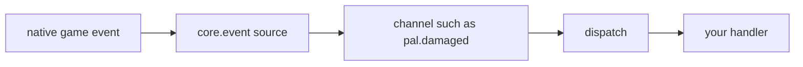
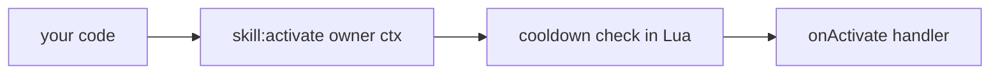
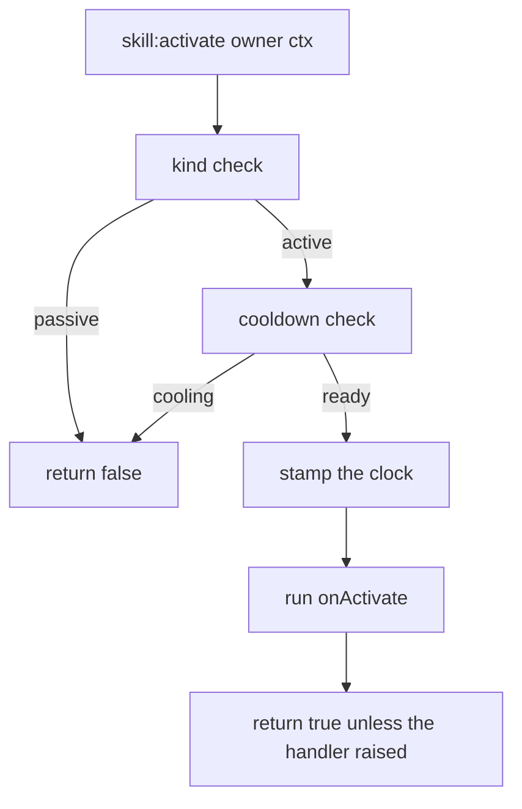
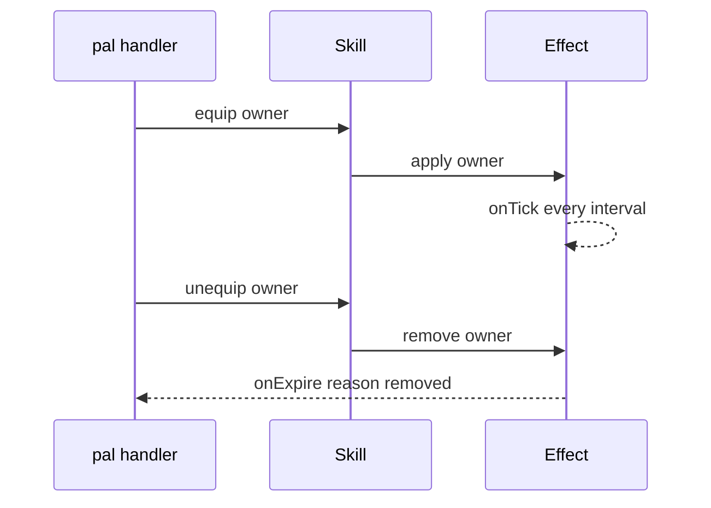

A skill is a definition with four handlers and five actions. Calling `Skill{ ... }` validates the
spec, registers the definition in the object registry under `("skill", id)`, and returns a
`Skill.Handle` carrying the actions:

```lua title="content/skills.lua"
local Ember = Skill{
    id       = "example:Ember",
    name     = "Ember",
    kind     = "active",
    element  = "fire",
    cooldown = 5.0,
    power    = 30,
    events   = {
        onActivate = function(skill, owner, ctx)
            -- your gameplay goes here
        end,
    },
}

Ember:activate(Player.character())   -- runs onActivate unless it is still cooling down
```

## Nothing fires a skill for you

`core/event` has no skill channel. `event.CHANNELS` lists `gameStart`, `world.ready`, `world.left`,
the four `building.*` channels, the four `pal.*` channels, the four `item.*` channels and `tick` —
and nothing else. No native hook that reports "this pal used skill X" was found, so no source emits
one and no dispatch calls a skill handler.

Every other live domain looks like this:



A skill looks like this:



<Callout type="warn">
If your pack never calls `:activate`, `:hit`, `:equip` or `:unequip`, a skill handler never runs.
Declaring `Pal{ skills = { ... } }` does not run one either. A skill is something your own code
invokes — from a pal handler, a building `onRightClick`, a keybind, an effect tick, anything.
</Callout>

What does work is the manual path, and it works fully: the cooldown is enforced in Lua, the handler
receives the handle plus your context table, and the return value tells you whether it ran. The
module header states that when a native source is found it will emit skill channels into these same
handlers, so pack code written against `:activate` today does not change then.

## Defining a skill

`id` is the only required field. Everything else is optional, and any field the spec does not
declare is a hard error at define time.

<Tabs items={['Global', 'Namespaced']}>
<Tab value="Global">

```lua
-- requiring palforge.api installs the bare globals
local Ember = Skill{ id = "example:Ember" }
```

</Tab>
<Tab value="Namespaced">

```lua
local api = require("palforge.api")
local Ember = api.Skill{ id = "example:Ember" }
```

</Tab>
</Tabs>

A complete definition:

```lua title="content/skills.lua"
local log = require("palforge.utils.log").scope("example")

local Ember = Skill{
    id          = "example:Ember",
    name        = "Ember",
    description = "A short burst of fire.",
    kind        = "active",
    element     = "fire",
    cooldown    = 5.0,
    power       = 30,
    icon        = "palforge/example/textures/ember.png",
    data        = { tier = 1, projectiles = 3 },
    events      = {
        onActivate = function(skill, owner, ctx)
            log.info(skill:name() .. " fired, power " .. tostring(skill:power()))
        end,
        onHit = function(skill, target, ctx)
            log.info("hit " .. tostring(target))
        end,
    },
}
```

<TypeTable
  type={{
    id: { description: 'Skill id: a game row id, or "pack:name" for your own content. Registered as-is', type: 'string', required: true },
    name: { description: 'Shown in skill lists', type: 'string', default: 'the id' },
    description: { description: 'One-line description, for UI and tooling', type: 'string' },
    kind: { description: 'An active skill is fired; a passive one is equipped', type: '"active" | "passive"', default: '"active"' },
    element: { description: 'Attribute / element, e.g. fire or water. Free text, nothing validates it', type: 'string' },
    cooldown: { description: 'Seconds between activations, enforced by :activate', type: 'number' },
    power: { description: 'Base power / magnitude. Metadata only, nothing consumes it', type: 'number' },
    icon: { description: 'Fallback icon used when the DataTable lookup misses', type: 'any' },
    events: { description: 'The four behaviour handlers, grouped', type: 'Skill.Spec.Events' },
    data: { description: 'Free-form payload of your own, carried onto the definition', type: 'table' },
  }}
/>

`element` and `power` are carried onto the definition and handed back by `:element()` and
`:power()`. `data` is carried onto the definition too, but the handle has no query for it. Nothing in
the framework reads any of the three — they exist so your handlers and your UI have somewhere to keep
their numbers.

Look the shape up at runtime instead of memorising it:

```lua
local schema = require("palforge.core.schema")
print(schema.help("Skill.Spec"))
```

```text
Skill.Spec {
  id            string     (required) skill id: a game row id or "pack:name"
  name          string     shown in skill lists (defaults to id)
  description   string     one-line description, for UI and tooling
  kind          string     (default=active, one of { "active", "passive" }) an active skill is fired; a passive one is equipped
  element       string     attribute / element (fire, water, ...)
  cooldown      number     seconds between activations (enforced by :activate)
  power         number     base power / magnitude
  icon          any        fallback icon used when the DataTable lookup misses
  events        table      (Skill.Spec.Events) behaviour handlers (grouped)
  data          table      free-form payload of your own, carried onto the definition
}
```

Getting one back later, from anywhere:

```lua
Skill.get("example:Ember")      -- the definition you registered
Skill.get("Legend")             -- never nil: a thin definition over any id
Skill.get_all()                 -- every PalForge-registered skill, as handles
```

`Skill.get` never returns nil. For an id nobody defined you get a bare definition: `:kind()` is
`"active"`, `:name()` is the id, `:description()`, `:element()` and `:power()` are nil, there is no
cooldown, and `:activate` runs the inert default handler and returns true.

Defining the same id twice replaces the registration — the last call wins, and handles taken from the
earlier call keep pointing at the earlier definition.

## Active and passive

`kind` is `"active"` by default and may only be `"active"` or `"passive"`.

```lua
local Ember = Skill{
    id       = "example:Ember",
    kind     = "active",
    cooldown = 5.0,
    events   = { onActivate = function(skill, owner, ctx) end },
}

local Ironhide = Skill{
    id     = "example:Ironhide",
    kind   = "passive",
    events = {
        onEquip   = function(skill, owner, ctx) end,
        onUnequip = function(skill, owner, ctx) end,
    },
}
```

One guard enforces the difference: `:activate` returns `false` immediately when `kind` is
`"passive"`, without touching the cooldown and without running anything.

```lua
Ironhide:activate(owner)   --> false, nothing ran
```

Nothing else checks `kind`. `:equip`, `:unequip` and `:hit` run whatever handler is declared, on an
active skill as readily as on a passive one, so an active skill with an `onEquip` handler is a legal
way to model "while this is in the loadout".

## Handlers

All four are optional, all four take the skill's own **handle** as the first argument, and a handler
name the spec does not declare is a hard error rather than a silent no-op.

| Handler | Signature | Runs when |
| --- | --- | --- |
| `onActivate` | `fun(skill, owner, ctx)` | you call `:activate(owner, ctx)` and the cooldown allows it |
| `onHit` | `fun(skill, target, ctx)` | you call `:hit(target, ctx)` |
| `onEquip` | `fun(skill, owner, ctx)` | you call `:equip(owner, ctx)` |
| `onUnequip` | `fun(skill, owner, ctx)` | you call `:unequip(owner, ctx)` |

The first argument is the handle the define call returned, so the actions and queries are right
there inside the handler:

```lua
local Ember = Skill{
    id       = "example:Ember",
    cooldown = 5.0,
    power    = 30,
    events   = {
        onActivate = function(skill, owner, ctx)
            log.info(skill.id .. " power=" .. tostring(skill:power()))
            skill:hit(ctx.target, { from = owner })   -- report the landing yourself
        end,
        onHit = function(skill, target, ctx)
            log.info("landed on " .. tostring(target))
        end,
    },
}
```

<Callout type="warn">
The actions wrap every handler call in `pcall` and discard the error message. A handler that raises
shows up only as a `false` return, with no log line. Do your own logging inside the handler, or wrap
the risky part yourself.
</Callout>

## Actions

```lua
skill:activate(owner, ctx)    --> boolean, did the handler run
skill:hit(target, ctx)        --> boolean
skill:equip(owner, ctx)       --> boolean
skill:unequip(owner, ctx)     --> boolean
skill:cooldownLeft(owner)     --> number, seconds until ready, 0 when ready
```

- `owner` and `target` are whatever you pass — a pal pawn, the player character, a plain table. Only
  the cooldown bookkeeping looks at `owner`, and only as an identity.
- `ctx` is a plain table of your own. Nothing populates it for you, and it is optional: all four
  actions substitute an empty table when you omit it, so `ctx` is never nil inside a handler you
  reached through an action.
- `:activate` returns `false` when the skill is passive, `false` when the cooldown blocked it, and
  otherwise `true` when the handler ran without raising.
- `:hit`, `:equip` and `:unequip` ignore both the cooldown and `kind`. They return `true` unless the
  handler raised.

```lua
local Ember  = Skill.get("example:Ember")
local player = Player.character()

if Ember:activate(player, { reason = "manual" }) then
    log.info("fired")
else
    log.info("blocked, " .. string.format("%.1f", Ember:cooldownLeft(player)) .. "s left")
end
```

The handle also carries raw forwarders — `skill:onActivate(owner, ctx)`, `skill:onHit`,
`skill:onEquip`, `skill:onUnequip` — which call the definition hook directly. They skip the cooldown,
skip the passive guard, do not substitute an empty `ctx`, and do not swallow errors. Reach for the
actions unless you specifically want that.

## Cooldown

`cooldown` is declared in seconds and enforced by `:activate` alone.



The bookkeeping is per owner and per skill id, so two pals holding the same skill cool down
independently:

```lua
local Ember = Skill{
    id       = "example:Ember",
    cooldown = 5.0,
    events   = { onActivate = function(skill, owner, ctx) end },
}

-- `one` and `two` are two different owners, e.g. two `ctx.actor` pawns
Ember:activate(one)       --> true
Ember:activate(one)       --> false, still cooling
Ember:activate(two)       --> true, a different owner has its own bucket
Ember:cooldownLeft(one)   --> counts down from 5.0
Ember:cooldownLeft(two)   --> counts down from 5.0, independently
```

Details worth knowing:

- Omitting `owner` is allowed and puts the timestamp in one shared bucket, so `:activate()` with no
  owner cools down globally for that skill.
- The owner table is weak-keyed, so holding a cooldown never keeps a despawned pawn alive.
- Timestamps come from `os.clock()`.
- No `cooldown`, or a cooldown of zero or less, means no gate at all: `:activate` always runs and
  `:cooldownLeft` always returns `0`.
- The clock is stamped **before** the handler runs. A handler that raises still consumed the
  cooldown.

A common shape is to show the remaining time in the UI rather than firing blindly:

```lua
local left = Ember:cooldownLeft(Player.character())
if left > 0 then
    log.info(string.format("Ember ready in %.1fs", left))
else
    Ember:activate(Player.character())
end
```

## Queries

```lua
local s = Skill.get("example:Ember")

s.id             --> "example:Ember"   (a plain field on the handle)
s:name()         --> "Ember", or the id when no name was declared
s:description()  --> string | nil
s:kind()         --> "active" | "passive"
s:element()      --> string | nil
s:power()        --> number | nil
s:iconOf()       --> texture ref | the declared icon | nil
```

`:iconOf()` resolves the id against Palworld's partner-skill icon DataTable
(`/Game/Pal/DataTable/PartnerSkill/DT_partnerSkillIconDataTable`) at runtime through `core/icons`.
Every step is fail-soft — a missing table, a missing row or a missing column returns nil — and on any
miss the declared `icon` field is returned instead. An id that has no row in that table, which
includes every `"pack:name"` id, always falls back to your `icon`.

```lua
local Ember = Skill{
    id   = "example:Ember",
    icon = "palforge/example/textures/ember.png",
}
Ember:iconOf()   --> the declared icon, since "example:Ember" has no DataTable row

Skill.get("Legend"):iconOf()   --> the texture ref when that row carries one, else nil
```

## Skills on a pal

A pal declares the skills it owns by id, as an array of strings:

```lua
local Blaze = Pal{
    id     = "FoxMage",
    name   = "Blaze",
    skills = { "example:Ember", "example:Ironhide" },
}

Blaze:skillsOf()   --> { "example:Ember", "example:Ironhide" }
```

The array is validated element by element, with the index in the error:

```text
PalForge: Pal: field "skills[2]" expects string, got number
```

<Callout type="warn">
`skills` is metadata. Nothing resolves those ids, nothing equips the passives and nothing fires the
actives. The framework stores the list and hands it back through `pal:skillsOf()`; turning it into
behaviour is your handler's job.
</Callout>

Resolving the list is one loop:

```lua
for _, id in ipairs(Blaze:skillsOf()) do
    local skill = Skill.get(id)
    if skill:kind() == "passive" then
        skill:equip(owner)
    end
end
```

## Native skill ids

`native/skills.lua` carries the row ids of Palworld's two skill tables —
`DT_PassiveSkill_Main_Common` (passive traits) and `DT_PartnerSkillParameter` (partner skills, keyed
by encounter with `RAID_`, `GYM_` and `BOSS_` prefixes) — as one flat catalog:

```lua
local skills = require("palforge.native.skills")

skills.CATALOG              -- every row id from those two tables, as a list
skills.get("Legend")        -- a cached handle for a catalog id, nil for anything else
skills.get("not_a_row")     -- nil
```

`get(id)` defines on first use and caches, so startup never registers the thousands of ids; the
catalog itself stays plain data. The file also ships one curated definition:

```lua
skills.Fireball             -- Skill{ id = "FlameThrower", kind = "active",
                            --        element = "fire", cooldown = 3.0, power = 50 }
skills.Fireball:activate(owner)
```

<Callout type="info">
`"FlameThrower"` is a `DevName` column value from `DT_PartnerSkillParameter`, not a row FName, so it
is not a catalog member — it is pre-seeded into the cache so `skills.get("FlameThrower")` returns the
curated handle. Its `onActivate` is a placeholder: there is no confirmed native call to spawn the
projectile, so it does nothing yet. Its `element`, `cooldown` and `power` are framework-side
metadata, not values read from the DataTable.
</Callout>

## Recipes

### Fire a skill from a pal handler

`onDamaged` is a live pal hook, so this is a skill that really does go off in play. `ctx.actor` is
the pal pawn that took the damage, which makes it the natural owner.

```lua title="content/retaliate.lua"
local log = require("palforge.utils.log").scope("example")

Skill{
    id       = "example:Ember",
    name     = "Ember",
    kind     = "active",
    element  = "fire",
    cooldown = 5.0,
    power    = 30,
    events   = {
        onActivate = function(skill, owner, ctx)
            log.info(string.format("%s retaliates (%s) power=%d",
                skill:name(), tostring(ctx.reason), skill:power() or 0))
            -- deal your damage / spawn your projectile here
        end,
    },
}

Pal{
    id     = "FoxMage",
    name   = "Blaze",
    skills = { "example:Ember" },
    events = {
        onDamaged = function(pal, ctx)
            local ember = Skill.get("example:Ember")
            if not ember:activate(ctx.actor, { reason = "damaged" }) then
                log.info(string.format("Ember cooling, %.1fs left",
                    ember:cooldownLeft(ctx.actor)))
            end
        end,
    },
}
```

The cooldown is what keeps this sane: a burst of damage calls `onDamaged` repeatedly, and only the
first call inside each five-second window gets through.

### Fire a skill from a building

`onRightClick` is live too, and the building handler receives the live instance as `self`, so the
structure can keep its own state. The interact context carries `ctx.player`, the actor that
interacted — a good owner for the cooldown.

```lua title="content/brazier.lua"
local log = require("palforge.utils.log").scope("example")

Skill{
    id       = "example:Ember",
    kind     = "active",
    element  = "fire",
    cooldown = 3.0,
    events   = {
        onActivate = function(skill, owner, ctx)
            log.info("brazier lit by " .. tostring(owner) .. " at " .. tostring(ctx.where))
        end,
    },
}

Building{
    id     = "example:Brazier",
    name   = "Brazier",
    gridCm = 100,
    mesh   = {
        kind  = "static",
        model = "/Game/Pal/Model/Prop/Architecture/WorkBenchPrimitive/SM_WorkBenchPrimitive.SM_WorkBenchPrimitive",
    },
    state  = { lit = 0 },
    events = {
        onRightClick = function(self, ctx)
            local ember = Skill.get("example:Ember")
            local fired = ember:activate(ctx.player, { where = self.pos })
            if fired then
                self.state.lit = self.state.lit + 1
                self:save()
            else
                log.info(string.format("still hot, %.1fs", ember:cooldownLeft(ctx.player)))
            end
        end,
    },
}
```

### Bind a skill to a key

PalForge binds its own dev keys through `core/keyboard`, which wraps UE4SS's `RegisterKeyBind` and
runs the callback inside `ExecuteInGameThread` guarded by a `pcall`. The same two calls work
directly in a pack:

```lua title="content/keybind.lua"
local log = require("palforge.utils.log").scope("example")

Skill{
    id       = "example:Ember",
    kind     = "active",
    cooldown = 2.0,
    events   = {
        onActivate = function(skill, owner, ctx)
            log.info("Ember on " .. tostring(owner))
        end,
    },
}

RegisterKeyBind(Key.F5, function()
    ExecuteInGameThread(function()
        local owner = Player.character()
        if not owner then return end
        local ember = Skill.get("example:Ember")
        if not ember:activate(owner, { reason = "keybind" }) then
            log.info(string.format("%.1fs left", ember:cooldownLeft(owner)))
        end
    end)
end)
```

Holding the key down calls the bind repeatedly; the declared cooldown is what turns that into one
activation every two seconds.

### A passive that applies an Effect

An `Effect` has a real runtime driven by the shared heartbeat, so pairing a passive skill with one is
how "while equipped, something keeps happening" gets built: `onEquip` applies, `onUnequip` removes.



```lua title="content/ironhide.lua"
local log = require("palforge.utils.log").scope("example")

local Hardened = Effect{
    id          = "example:Hardened",
    name        = "Hardened",
    description = "Regenerating while the trait is equipped.",
    interval    = 2.0,          -- onTick every 2s; no duration = until :remove()
    events      = {
        onApply  = function(effect, target, ctx)
            log.info("hardened on " .. tostring(target))
        end,
        onTick   = function(effect, target, ctx)
            log.info(string.format("tick at %.1fs", ctx.elapsed))
            -- heal / buff the target here
        end,
        onExpire = function(effect, target, ctx)
            log.info("hardened off, reason " .. tostring(ctx.reason))
        end,
    },
}

Skill{
    id          = "example:Ironhide",
    name        = "Ironhide",
    description = "A passive trait that hardens its owner.",
    kind        = "passive",
    events      = {
        onEquip   = function(skill, owner, ctx) Hardened:apply(owner) end,
        onUnequip = function(skill, owner, ctx) Hardened:remove(owner) end,
    },
}

Pal{
    id     = "FoxMage",
    name   = "Blaze",
    skills = { "example:Ironhide" },
    events = {
        onSpawned = function(pal, ctx)
            for _, id in ipairs(pal:skillsOf()) do
                local skill = Skill.get(id)
                if skill:kind() == "passive" then
                    skill:equip(ctx.actor, { from = pal.id })
                end
            end
        end,
        onDeath = function(pal, ctx)
            for _, id in ipairs(pal:skillsOf()) do
                Skill.get(id):unequip(ctx.actor)
            end
        end,
    },
}
```

`onSpawned` and `onDeath` are live pal hooks, so the equip and the unequip both happen on their own
once the pal is in the world. `onDeath` rides a confirmed native hook; `onSpawned` rides
`BroadcastOnCompleteInitializeParameter`, an unconfirmed candidate, so treat the equip as
best-effort. The skill contributes the declaration and the two handlers; the `Effect` contributes the
timing.

## Validation errors

Every problem is a hard error prefixed `PalForge: `, and the call never half-succeeds.

```text
PalForge: Skill: field "id" is required (skill id: a game row id or "pack:name")
PalForge: Skill: unknown field "cooldwn" (did you mean "cooldown"?). Valid fields: id, name, description, kind, element, cooldown, power, icon, events, data
PalForge: Skill: field "kind" must be one of { "active", "passive" }, got "buff"
PalForge: Skill: field "power" expects number, got string
PalForge: Skill: field "events" (Skill.Spec.Events): unknown field "onActivated" (did you mean "onActivate"?). Valid fields: onActivate, onHit, onEquip, onUnequip
```

The handler list is closed on purpose. A misspelled `onActivated` that was quietly accepted would be
indistinguishable from a skill that nothing invokes, which is the one failure mode this domain
already has enough of.

## Related

<Cards>
  <Card title="Pal" href="/docs/api/pal">Declaring skills on a pal, and the live hooks that can drive them.</Card>
  <Card title="Effect" href="/docs/api/effect">The domain with a real timer, for anything a passive should keep doing.</Card>
  <Card title="Building" href="/docs/api/building">Live instances and onRightClick, the other natural trigger.</Card>
  <Card title="Lifecycle" href="/docs/concepts/lifecycle">Which channels exist, and which hooks a native source actually feeds.</Card>
</Cards>
