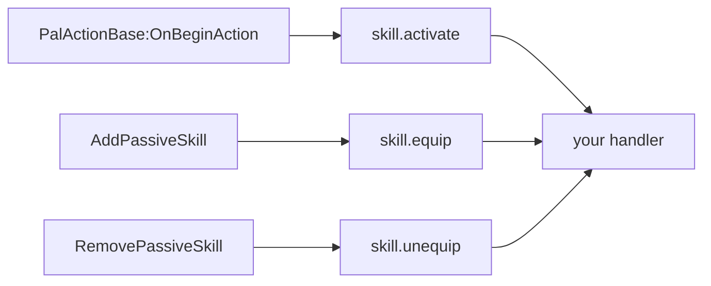
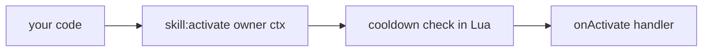
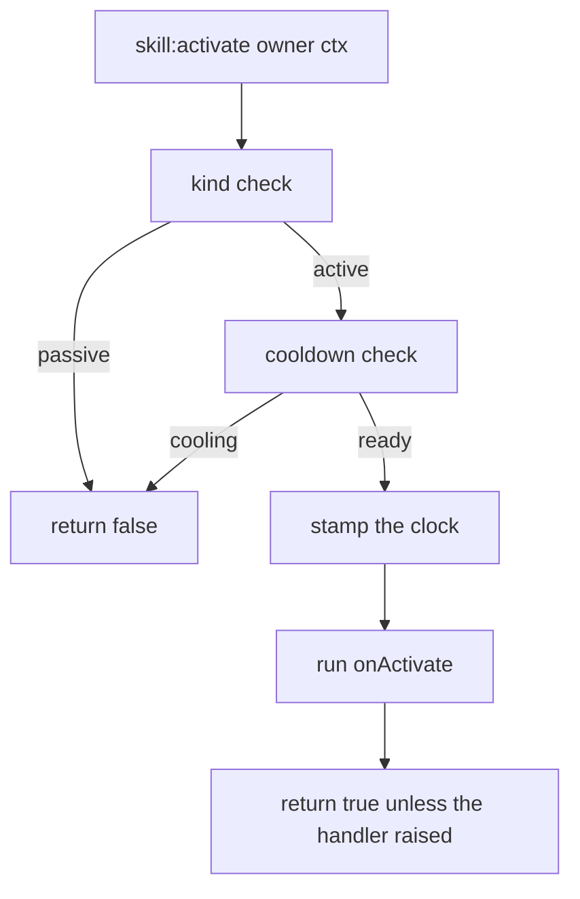
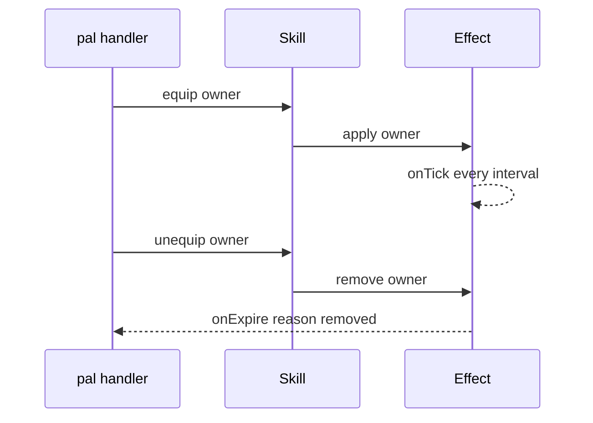

## What you can do after this page

- Add your own attack, with a name, an element, a power number and an icon
- Run your code when the game plays one of its own moves, or attaches a passive to a character
- Set one off from your own code: when a pal gets hurt, when someone uses a building, or when you press a key
- Stop it going off too often, with a cooldown you set in seconds
- Add a trait that keeps doing something while a pal has it on
- Read back the list of skills a pal carries
- Put a skill onto a live pal or the player, so the game itself carries it

A skill is an attack or a trait. You describe it once with `Skill{ ... }`, and you get back an
object with the actions on it. Three of the four handlers are called for you when the game does
the matching thing; all four can be fired from your own code, which is what a pack skill of your
own needs — here it is on the last line:

```lua title="content/skills.lua"
local Ember = Skill{
    id       = "example:Ember",
    name     = "Ember",
    kind     = "active",
    element  = "fire",
    cooldown = 5.0,
    power    = 30,
    events   = {
        onActivate = function(skill, owner, ctx)
            -- your gameplay goes here
        end,
    },
}

Ember:activate(Player.character())   -- runs onActivate unless it is still cooling down
```

## Where a skill handler runs from

There are two ways in, and both are worth knowing about, because they reach the same handlers.

The game drives three of the four channels. PalForge hooks Palworld's own calls, reads the move
or passive id off them, and calls the handler on the skill registered under that id:



Two of those three have been seen firing in a real save: `skill.activate` in live combat, and
`skill.equip` from `AddPassiveSkill`. `RemovePassiveSkill` sits on the same class and is wired
identically, so `onUnequip` is expected to carry the same way, but no run has recorded it doing
so yet. `onHit` is the fourth, and it is the one nothing feeds; the section on it below says what
was measured and why it will stay that way.

Your own code fires any of the four at the moment you ask, which is the only route a skill of
your own has:



<Callout type="warn">
The game's events are matched by **the id the game reports**, so only a skill registered under
that id hears one. `Skill{ id = "FireBlast" }` is called when a pal plays FireBlast;
`Skill{ id = "example:Ember" }` never is, because Palworld has no move by that name. A skill of
your own runs when your code runs it: in a pal handler, in a building's `onRightClick`, in a
keybind, in an effect tick. The recipes near the bottom of this page do each of those. Listing a
skill in `Pal{ skills = { ... } }` fires nothing on its own.
</Callout>

The manual path is complete, not a stand-in. The cooldown is counted in Lua, the handler gets the
skill's own object plus whatever context table you pass it, and the return value tells you
whether it ran.

## Defining a skill

`id` is the only field you have to give. Everything else is optional, and a field name PalForge
does not know stops the call with an error and a did-you-mean.

<Tabs items={['Global', 'Namespaced']}>
<Tab value="Global">

```lua
-- requiring palforge.api installs the bare globals
local Ember = Skill{ id = "example:Ember" }
```

</Tab>
<Tab value="Namespaced">

```lua
local api = require("palforge.api")
local Ember = api.Skill{ id = "example:Ember" }
```

</Tab>
</Tabs>

A definition using every field:

```lua title="content/skills.lua"
local log = require("palforge.utils.log").scope("example")

local Ember = Skill{
    id          = "example:Ember",
    name        = "Ember",
    description = "A short burst of fire.",
    kind        = "active",
    element     = "fire",
    cooldown    = 5.0,
    power       = 30,
    icon        = "/Game/YourPack/Textures/T_Ember.T_Ember",
    data        = { tier = 1, projectiles = 3 },
    events      = {
        onActivate = function(skill, owner, ctx)
            log.info(skill:name() .. " fired, power " .. tostring(skill:power()))
        end,
        onHit = function(skill, target, ctx)
            log.info("hit " .. tostring(target))
        end,
    },
}
```

Here is every field you can pass, with its type and its default:

<TypeTable
  type={{
    id: { description: 'Skill id: a game row id, or "pack:name" for your own content. Registered as-is, and refused at define time if it cannot be resolved to a row spelling', type: 'string', required: true },
    name: { description: 'Shown in skill lists', type: 'string', default: 'the id' },
    description: { description: 'One-line description, for UI and tooling', type: 'string' },
    kind: { description: 'An active skill is fired; a passive one is equipped', type: '"active" | "passive"', default: '"active"' },
    element: { description: 'Attribute / element, e.g. fire or water. Author metadata: stored and handed back, read by nothing', type: 'string' },
    cooldown: { description: 'Seconds between activations, enforced by :activate', type: 'number' },
    power: { description: 'Base power / magnitude. Author metadata: stored and handed back, read by nothing', type: 'number' },
    icon: { description: '/Game/... texture path used when the icon DataTable has no row for this id', type: 'string' },
    events: { description: 'The four behaviour handlers, grouped', type: 'Skill.Spec.Events' },
    data: { description: 'Free-form payload of your own, carried onto the definition', type: 'table' },
  }}
/>

`element` and `power` are author metadata: they are kept on the definition and handed back by
`:element()` and `:power()`, and nothing in PalForge reads either one. `data` is kept the same
way, though the handle has no query for it. A skill's real element and power live in the game's
own skill DataTable rows, which Lua cannot write — so these three are places for your handlers
and your UI to keep their own numbers, and `cooldown` next to them is the one declared number
the framework does enforce.

You can also print the field list from Lua instead of memorising it:

```lua
local schema = require("palforge.core.schema")
print(schema.help("Skill.Spec"))
```

```text
Skill.Spec {
  id            string     (required) skill id: a game row id or "pack:name"
  name          string     shown in skill lists (defaults to id)
  description   string     one-line description, for UI and tooling
  kind          string     (default=active, one of { "active", "passive" }) an active skill is fired; a passive one is equipped
  element       string     attribute / element (fire, water, ...). AUTHOR METADATA: stored and handed back, read by nothing
  cooldown      number     seconds between activations (enforced by :activate)
  power         number     base power / magnitude. AUTHOR METADATA: stored and handed back, read by nothing
  icon          string     /Game/... texture path used when the icon DataTable has no row for this id
  events        table      (Skill.Spec.Events) behaviour handlers (grouped)
  data          table      free-form payload of your own, carried onto the definition
}
```

`schema.help("Skill.Spec.Events")` prints the same thing for the four handlers, and each line
says whether that channel carries anything on its own:

```text
Skill.Spec.Events {
  onActivate    function   LIVE - an active skill fired (self, owner, ctx); via = "PalActionBase:OnBeginAction"
  onHit         function   NOT LIVE - both sources measured silent (skill-hit-source); only :hit() runs it
  onEquip       function   LIVE - a passive was attached (self, owner, ctx); via names the source
  onUnequip     function   LIVE - a passive was removed (self, owner, ctx); via names the source
}
```

You do not have to hold on to what the define call returned. Ask for it again from anywhere:

```lua
Skill.get("example:Ember")      -- the definition you registered
Skill.get("Legend")             -- never nil: a thin definition over any id
Skill.get_all()                 -- every PalForge-registered skill, as handles
```

`Skill.get` never returns nil. For an id nobody defined you get a bare definition: `:kind()` is
`"active"`, `:name()` is the id, `:description()`, `:element()` and `:power()` are nil, there is no
cooldown, and `:activate` runs an empty handler and returns true.

Defining the same id twice replaces the registration. The last call wins, and anything you took
from the earlier call still points at the earlier definition. When the two calls come from
different packs, that replacement is logged with both pack names, so a collision has someone to
attribute it to.

### The second argument

`Skill{ ... }` takes an optional options table after the spec. Leaving it out behaves exactly as
it always has.

```lua
-- build the handle, register nothing: a read that must not write to the registry
local probe = Skill({ id = "example:Ember" }, { register = false })

-- register attributed to a pack, which is what gives a collision a "who"
Skill({ id = "example:Ember" }, { pack = "mypack" })

-- the same attribution without passing it per call
local api = PalForge.pack("mypack")
api.Skill{ id = "example:Ember" }
```

Only `register` and `pack` are accepted; a misspelled option is an error rather than an option
that was quietly ignored.

### The id is checked while you define

An id with a colon is namespaced, and PalForge resolves `"pack:Ember"` to the row spelling
PalSchema writes, `pack_Ember`. Both halves may hold letters, digits and `_` only, and an id that
cannot be resolved is refused at the define call instead of registering something that could
never match a row:

```text
PalForge: Skill: field "id" is invalid: invalid pack id 'my-pack' in 'my-pack:Ember' (letters/digits/_ only)
```

## Active and passive

`kind` is `"active"` by default, and the only other value it accepts is `"passive"`.

```lua
local Ember = Skill{
    id       = "example:Ember",
    kind     = "active",
    cooldown = 5.0,
    events   = { onActivate = function(skill, owner, ctx) end },
}

local Ironhide = Skill{
    id     = "example:Ironhide",
    kind   = "passive",
    events = {
        onEquip   = function(skill, owner, ctx) end,
        onUnequip = function(skill, owner, ctx) end,
    },
}
```

One check makes the difference: `:activate` returns `false` straight away when `kind` is
`"passive"`, without touching the cooldown and without running anything.

```lua
Ironhide:activate(owner)   --> false, nothing ran
```

Nothing else looks at `kind`. `:equip`, `:unequip` and `:hit` run whatever handler you declared,
on an active skill as readily as on a passive one — so an active skill with an `onEquip` handler
is a fine way to model "while this is in the loadout".

## Handlers

Handlers are the functions PalForge runs for you. There are four, all optional. Each one gets the
skill's own handle as its first argument, and a name that is not on this list stops the define
call with an error instead of being ignored.

| Handler | Signature | Runs when |
| --- | --- | --- |
| `onActivate` | `fun(skill, owner, ctx)` | the game plays that move, or you call `:activate(owner, ctx)` and the cooldown allows it |
| `onHit` | `fun(skill, target, ctx)` | only when you call `:hit(target, ctx)` |
| `onEquip` | `fun(skill, owner, ctx)` | the game attaches that passive, or you call `:equip(owner, ctx)` |
| `onUnequip` | `fun(skill, owner, ctx)` | the game removes that passive, or you call `:unequip(owner, ctx)` |

The handle is the object the define call gave back, so every action and query is right there
inside the handler:

```lua
local Ember = Skill{
    id       = "example:Ember",
    cooldown = 5.0,
    power    = 30,
    events   = {
        onActivate = function(skill, owner, ctx)
            log.info(skill.id .. " power=" .. tostring(skill:power()))
            skill:hit(ctx.target, { from = owner })   -- report the landing yourself
        end,
        onHit = function(skill, target, ctx)
            log.info("landed on " .. tostring(target))
        end,
    },
}
```

<Callout type="warn">
The actions run every handler inside a `pcall` and throw the error message away. A handler that
crashes shows up only as a `false` return, with nothing in the log. Log inside your handler, or
wrap the risky part yourself. A handler reached from the game is also `pcall`ed, but there the
error is logged with the channel and the handler that raised it.
</Callout>

### What the game hands your handler

Define under one of the game's own ids and the three live channels reach you with the same
handler signature you already write:

```lua title="content/fireblast.lua"
local log = require("palforge.utils.log").scope("example")

Skill{
    id     = "FireBlast",       -- one of the game's own moves, so the game's events find it
    events = {
        onActivate = function(skill, owner, ctx)
            log.info(string.format("%s played by %s, via %s",
                ctx.skillId, tostring(ctx.owner), tostring(ctx.via)))
        end,
    },
}
```

`ctx` is filled in by the source that carried the event:

| ctx key | Notes |
| --- | --- |
| `ctx.skillId` | The id as the game spells it: an `EPalWazaID` name for `onActivate`, a passive row FName for `onEquip` and `onUnequip`. |
| `ctx.wazaId` | The raw `EPalWazaID` integer. `onActivate` only. |
| `ctx.owner`, `ctx.actor` | The character that played the move or carries the passive. The same value under both names. |
| `ctx.target` | What the move was aimed at, or `nil` for a move with no target. `onActivate` only. |
| `ctx.action` | The `UPalActionWazaBase` the move ran as, when the action sources carried it. |
| `ctx.params` | The character's `PalIndividualCharacterParameter`, on the passive channels. |
| `ctx.overrides` | `AddPassiveSkill`'s second argument, passed through. It is **not** read as an unequip: the call does not say which of the two ids is being displaced. |
| `ctx.via` | Which source carried this one. The log names each source the first time it carries anything. |

Two details that change what a handler should look like:

- Several sources can describe one moment, so a repeat of the same channel and id inside a
  quarter second is dropped. Two pals using the same move that close together are reported once.
- `skill.equip` catches PalForge's own writes as well as the game's — `:teach` of a passive comes
  back through `onEquip` — and a second source, `PalPassiveSkillComponent:SetupSkillFromSelf`, is
  armed beside `AddPassiveSkill` and has carried nothing yet. If it ever does, a character
  streaming in announces the passives it already had. Keep `onEquip` idempotent.

### onHit is the one that does not fire

Nothing in Palworld's damage path names a skill. `FPalDamageInfo` has 40 fields,
`FPalDamageRactionInfo` 6 and `FPalDamageResult` 12, and not one of them is an `EPalWazaID`. Both
hooks that could have carried an id — `PalUtility:MakeDamageInfoByWazaType` and
`PalAnimNotifyState_AttackCollision:OnHit` — are armed and were measured silent, in sessions
where `pal.damaged` and `pal.death` both carried events, so a blow certainly landed.

That leaves inference: remember which move activated, and attribute the damage that follows to
it. PalForge does not do that and `onHit` will not be wired to it, because a move that misses, a
second pal attacking in the same window, or damage from anything else would all be credited to
whatever activated last — and `onHit` promises the game told us. The open item is
`skill-hit-source`. `:hit(target, ctx)` is the working entry point, and calling it from your own
`onActivate` is how a pack reports a landing on its own terms.

## Actions

These five calls are how a skill gets used. All of them are yours to call.

```lua
skill:activate(owner, ctx)    --> boolean, did the handler run
skill:hit(target, ctx)        --> boolean
skill:equip(owner, ctx)       --> boolean
skill:unequip(owner, ctx)     --> boolean
skill:cooldownLeft(owner)     --> number, seconds until ready, 0 when ready
```

These five are your own bookkeeping and never tell the game anything — they run your handler and
stop there, and the cooldown they check is counted in Lua. Three more — `:teach`, `:forget` and
`:skillsOn` — write to and read from a real character; they have their own section below.

- `owner` and `target` are whatever you pass — a pal pawn, the player character, a plain table.
  The only thing that looks at `owner` is the cooldown bookkeeping, and only as an identity.
- `ctx` is a context table of your own. Nothing fills it in for you, and you can leave it out:
  all four actions put an empty table there instead, so `ctx` is never nil inside a handler you
  reached through an action.
- `:activate` returns `false` when the skill is passive, `false` when the cooldown blocked it,
  and otherwise `true` when the handler ran without crashing.
- `:hit`, `:equip` and `:unequip` ignore both the cooldown and `kind`. They return `true` unless
  the handler crashed.

```lua
local Ember  = Skill.get("example:Ember")
local player = Player.character()

if Ember:activate(player, { reason = "manual" }) then
    log.info("fired")
else
    log.info("blocked, " .. string.format("%.1f", Ember:cooldownLeft(player)) .. "s left")
end
```

The handle also carries a raw call for each handler — `skill:onActivate(owner, ctx)`,
`skill:onHit`, `skill:onEquip`, `skill:onUnequip`. These go straight to the handler: no cooldown,
no passive check, no empty `ctx` filled in for you, and errors are not swallowed. Reach for the
actions unless you want exactly that.

## Cooldown

`cooldown` is a number of seconds, and `:activate` is the only thing that enforces it.



The count is kept per owner and per skill id, so two pals holding the same skill cool down
separately:

```lua
local Ember = Skill{
    id       = "example:Ember",
    cooldown = 5.0,
    events   = { onActivate = function(skill, owner, ctx) end },
}

-- `one` and `two` are two different owners, e.g. two `ctx.actor` pawns
Ember:activate(one)       --> true
Ember:activate(one)       --> false, still cooling
Ember:activate(two)       --> true, a different owner has its own bucket
Ember:cooldownLeft(one)   --> counts down from 5.0
Ember:cooldownLeft(two)   --> counts down from 5.0, independently
```

Details worth knowing:

- Leaving `owner` out is allowed. The time then goes into one shared slot, so `:activate()` with
  no owner cools down globally for that skill.
- An engine owner is keyed on its `GetFullName()`, not on the handle you happened to be holding.
  That is what makes a cooldown work at all across two lookups of the same pawn, since UE4SS
  hands out a fresh wrapper each time. An owner that is a plain Lua table keys on itself.
- Times come from `os.clock()`, and a bucket whose newest stamp is more than ten minutes old is
  dropped on the next stamp, so a pal that despawns takes its bucket with it.
- No `cooldown`, or a cooldown of zero or less, means no gate at all: `:activate` always runs and
  `:cooldownLeft` always returns `0`.
- The clock is stamped **before** the handler runs. A handler that crashes has still used up the
  cooldown.

Showing the time left is usually nicer than firing blindly:

```lua
local left = Ember:cooldownLeft(Player.character())
if left > 0 then
    log.info(string.format("Ember ready in %.1fs", left))
else
    Ember:activate(Player.character())
end
```

## Queries

Everything you declared can be read back off the handle:

```lua
local s = Skill.get("example:Ember")

s.id             --> "example:Ember"   (a plain field on the handle)
s:name()         --> "Ember", or the id when no name was declared
s:description()  --> string | nil
s:kind()         --> "active" | "passive"
s:element()      --> string | nil
s:power()        --> number | nil
s:iconOf()       --> "/Game/..." path | the declared icon | nil
```

`:iconOf()` looks the id up in one of the game's own data tables — the partner-skill icon table
at `/Game/Pal/DataTable/PartnerSkill/DT_partnerSkillIconDataTable` — through `core/icons`, and it
answers a `/Game/...` asset path as a plain string, never an engine object. The read itself
works: `core/icons` read that table in a live save and all 311 of its rows handed back an icon
path.

What limits it is the KEY, not the read. Those 311 rows are keyed by **pal** id — Alpaca,
Anubis, Bastet — so only a pal-derived partner skill can ever hit one, and passive skills have no
row there by construction. A namespaced id is resolved before the lookup, so `"pack:Ember"` is
asked for as `pack_Ember`, the row spelling PalSchema writes; it still misses this particular
table, but it misses it for the honest reason rather than because the colon spelling could never
have matched anything. Every step fails softly, and any miss gives you the `icon` you declared.

```lua
local Ember = Skill{
    id   = "example:Ember",
    icon = "/Game/YourPack/Textures/T_Ember.T_Ember",
}
Ember:iconOf()   --> the declared icon: no pal is named example_Ember, so that table has no row

Skill.get("Legend"):iconOf()   --> nil: a passive has no row there, and no icon was declared
```

## Teaching a live character

The five actions above are your own bookkeeping: they run your handlers and tell the game
nothing. These three do the opposite — they put a skill on a **live** pal or player so the game
itself carries it, and read back what that character has.

```lua
skill:teach(actor)      --> boolean, true only when the skill is on the character afterwards
skill:forget(actor)     --> boolean, true only when it is gone afterwards
skill:skillsOn(actor)   --> { active, passive, equipable, mastered } | nil
```

`actor` has to be a real character — a pal standing in the world, or the player's own pawn from
`Player.character()`. Anything else is refused with a `false`.

```lua
local pawn = Player.character()

Skill.get("FireBlast"):teach(pawn)    -- one of the game's own moves
Skill.get("Legend"):teach(pawn)       -- not a move: added as a passive trait
Skill.get("FireBlast"):skillsOn(pawn) -- what that character carries right now
Skill.get("FireBlast"):forget(pawn)
```

### The id decides which kind the game is asked for

Palworld keeps active moves and passive traits in two separate places, so `:teach` has to pick
one — and it picks on **the id**, not on your `kind` field:

- an id the game knows as one of its own active moves — `"FireBlast"`, `"Psychokinesis"`, 309 of
  them — is added to the character's equipped moves;
- **any other id** is added as a passive skill under that name.

<Callout type="warn">
`kind` describes what YOUR skill does when your code fires it. `:teach` asks the GAME for one of
its own, so it does not read `kind` at all. Declaring `kind = "passive"` on a skill whose id is
`"FireBlast"` still teaches the game's active move, and a pack id like `"example:Ember"` is
handed over as a passive name whatever you declared — the game has no move by that name.
</Callout>

Case does not matter, so `"fireblast"` finds the same move.
`require("palforge.core.character").wazaNames()` returns every active-move name this build has,
sorted, if you want to check an id before you write it.

### Reading a character's loadout

`:skillsOn(actor)` is the read, and it works. It answers four lists, because a pal knows more
moves than the handful it has equipped:

| key | what is in it |
| --- | --- |
| `active` | the moves it has equipped right now — up to four |
| `passive` | its passive traits, by name |
| `equipable` | the moves it *could* equip |
| `mastered` | the moves it has mastered |

Empty lists mean the read worked and found none, which is a real answer: a pal with nothing in
`active` may simply have nothing equipped. `equipable` and `mastered` are `nil` when this build
does not declare that getter — unknown, not "none" — so read them as `#(s.equipable or {})`.
`nil` for the whole table means the character could not be read at all, so check for `nil` before
you index it. Confirmed on a live `BP_SheepBall_C`: 3 active, 1 passive, 3 equipable, 0 mastered.

```lua
local carried = Skill.get("FireBlast"):skillsOn(pawn)
if carried then
    print(#carried.active .. " equipped, " .. #(carried.equipable or {}) .. " available")
end
```

<Callout type="warn" title="Ask a PalMonsterCharacter, not a PalCharacter">
The class chain is `APalMonsterCharacter : APalNPC : APalCharacter`, so a `FindAllOf("PalCharacter")`
also returns villagers, merchants and every other NPC — and an NPC's four empty lists look exactly
like a broken reader. That mistake cost several runs. `FindAllOf("PalMonsterCharacter")` is the
search that asks only pals.
</Callout>

### What the write reports

`:teach` and `:forget` check themselves by reading the character back afterwards, so a `true`
means the skill was **seen on the character** and never that a call ran without complaining.
`false` means it did not land: the target is not a character, the game will not take the id, or
the write was refused.

The two halves are not in the same state, and the difference is worth knowing before you plan
around either:

- **The passive write is measured.** `AddPassiveSkill` put a passive on a live `BP_ChickenPal_C`
  and the read-back saw it, which is also how `skill.equip` got its first event.
- **The active-move write is not.** `AddEquipWaza` / `RemoveEquipWaza` / `ClearEquipWaza` have
  never been shown landing on a pal. The one run that ever wrote one was followed 1.4 seconds
  later by Palworld closing, and that run used the too-wide `PalCharacter` search, so the target
  was probably an NPC — which makes "the write went to the wrong thing" the leading explanation
  and not a fact to publish on.

<Callout type="warn">
Teaching an **active move** is the one capability here that is still unmeasured, and it is the
open item `pal-skills-equip`. Check the boolean rather than assuming, and try it in a save you do
not mind losing. The measurement is a declared test hook rather than something the framework does
on its own: run `pf_hook pal-skills-equip` from the UE4SS console, which needs `env.debug` and,
because it writes into a real save, `env.debugHooks["pal-skills-equip"]` as well. Reading a
loadout and writing a passive are settled; this is the one that is not.
</Callout>

<Callout type="info">
`:teach` and `:equip` are different on purpose, and both are worth having. `:equip` runs your
own `onEquip` handler on any value you like and tells the game nothing; `:teach` writes to a
real character and tells you what the game shows afterwards. A pack that tracks its own
"equipped" set keeps using `:equip`.
</Callout>

## Skills on a pal

A pal lists the skills it owns by id, as an array of strings:

```lua
local Blaze = Pal{
    id     = "FoxMage",
    name   = "Blaze",
    skills = { "example:Ember", "example:Ironhide" },
}

Blaze:skillsOf()   --> { "example:Ember", "example:Ironhide" }
```

Each element is checked, and the error carries the index:

```text
PalForge: Pal: field "skills[2]" expects string, got number
```

<Callout type="warn">
That list is only a list. Declaring it does not put anything on any creature; it is stored and
handed back through `pal:skillsOf()`. `pal:teachAll(actor)` is what writes it to a live one, and
a skill of your own is still fired by your own code — the game only plays moves it knows.
</Callout>

Two things you can do with it. Write the loop yourself, for your own bookkeeping:

```lua
for _, id in ipairs(Blaze:skillsOf()) do
    local skill = Skill.get(id)
    if skill:kind() == "passive" then
        skill:equip(owner)
    end
end
```

Or hand the whole list to a live creature in one call, with
[`Pal.Handle:teachAll`](/docs/api/pal):

```lua
local taught, asked = Blaze:teachAll(somePalActor)
-- 2, 2 when both landed; 1, 2 when one did not
```

`teachAll` routes each id exactly as `:teach` does, keeps going after one fails, and returns two
numbers so a partial result is visible instead of being flattened into a `true` or a `false`.

## Palworld's own skill ids

If you want to hang behaviour on a skill the game already has, `native/skills.lua` carries the row
ids of Palworld's two skill tables — `DT_PassiveSkill_Main_Common` (passive traits) and
`DT_PartnerSkillParameter` (partner skills, keyed by encounter with `RAID_`, `GYM_` and `BOSS_`
prefixes) — as one flat catalog:

```lua
local skills = require("palforge.native.skills")

skills.CATALOG              -- every row id from those two tables, as a list
skills.get("Legend")        -- a cached handle for a catalog id, nil for anything else
skills.get("not_a_row")     -- nil
skills.publish("Legend")    -- opt in: register that handle so dispatch can reach it
```

`get(id)` builds the handle the first time you ask for it and caches it, and it registers
nothing: a catalog read is a read. Registering is the separate, opt-in `publish(id)`, which is
what makes `Skill.get(id)` and the game's own dispatch find that class. The catalog itself is
plain data. The file also ships one ready-made definition:

```lua
skills.Fireball             -- Skill{ id = "FlameThrower", kind = "active",
                            --        element = "fire", cooldown = 3.0, power = 50 }
skills.Fireball:activate(owner)
```

<Callout type="info">
`skills.CATALOG` does not list `"FlameThrower"` — that name comes from the `DevName` column of
`DT_PartnerSkillParameter` rather than from a row name — but `skills.get("FlameThrower")` still
returns the handle above, and this one IS registered at load, because it declares a handler.
Its `onActivate` spawns nothing: no route for spawning a projectile or effect actor from Lua has
been found on this build, so it logs one line per session saying it spawned nothing, and
`:activate` still answers `true` because that only ever meant "the handler ran". Write your own
gameplay in a handler if you want something to happen. Its `element`, `cooldown` and `power` are
PalForge's own numbers, not values read from the game.
</Callout>

## Recipes

### Fire a skill from a pal handler

`onDamaged` runs on its own when a pal takes damage, so this is a skill that really does go off in
play. `ctx.actor` is the pal that got hit, which makes it the natural owner.

```lua title="content/retaliate.lua"
local log = require("palforge.utils.log").scope("example")

Skill{
    id       = "example:Ember",
    name     = "Ember",
    kind     = "active",
    element  = "fire",
    cooldown = 5.0,
    power    = 30,
    events   = {
        onActivate = function(skill, owner, ctx)
            log.info(string.format("%s retaliates (%s) power=%d",
                skill:name(), tostring(ctx.reason), skill:power() or 0))
            -- deal your damage / spawn your projectile here
        end,
    },
}

Pal{
    id     = "FoxMage",
    name   = "Blaze",
    skills = { "example:Ember" },
    events = {
        onDamaged = function(pal, ctx)
            local ember = Skill.get("example:Ember")
            if not ember:activate(ctx.actor, { reason = "damaged" }) then
                log.info(string.format("Ember cooling, %.1fs left",
                    ember:cooldownLeft(ctx.actor)))
            end
        end,
    },
}
```

The cooldown is what keeps this sane. A burst of damage calls `onDamaged` again and again, and
only the first call inside each five-second window gets through.

### Fire a skill from a building

`onRightClick` runs on its own too, when a player interacts with your building. The handler gets
the placed building itself as `self`, so the structure can keep its own state. The context carries
`ctx.player`, the actor that interacted — a good owner for the cooldown.

```lua title="content/brazier.lua"
local log = require("palforge.utils.log").scope("example")

Skill{
    id       = "example:Ember",
    kind     = "active",
    element  = "fire",
    cooldown = 3.0,
    events   = {
        onActivate = function(skill, owner, ctx)
            log.info("brazier lit by " .. tostring(owner) .. " at " .. tostring(ctx.where))
        end,
    },
}

Building{
    id     = "example:Brazier",
    name   = "Brazier",
    gridCm = 100,
    mesh   = {
        kind  = "static",
        model = "/Game/Pal/Model/Prop/Architecture/WorkBenchPrimitive/SM_WorkBenchPrimitive.SM_WorkBenchPrimitive",
    },
    state  = { lit = 0 },
    events = {
        onRightClick = function(self, ctx)
            local ember = Skill.get("example:Ember")
            local fired = ember:activate(ctx.player, { where = self.pos })
            if fired then
                self.state.lit = self.state.lit + 1
                self:save()
            else
                log.info(string.format("still hot, %.1fs", ember:cooldownLeft(ctx.player)))
            end
        end,
    },
}
```

### Bind a skill to a key

UE4SS gives you `RegisterKeyBind`. Run the body inside `ExecuteInGameThread`, which is where it is
safe to touch the game, and both calls work straight from a pack. PalForge binds its own dev keys
the same way.

```lua title="content/keybind.lua"
local log = require("palforge.utils.log").scope("example")

Skill{
    id       = "example:Ember",
    kind     = "active",
    cooldown = 2.0,
    events   = {
        onActivate = function(skill, owner, ctx)
            log.info("Ember on " .. tostring(owner))
        end,
    },
}

RegisterKeyBind(Key.F5, function()
    ExecuteInGameThread(function()
        local owner = Player.character()
        if not owner then return end
        local ember = Skill.get("example:Ember")
        if not ember:activate(owner, { reason = "keybind" }) then
            log.info(string.format("%.1fs left", ember:cooldownLeft(owner)))
        end
    end)
end)
```

Holding the key down calls the bind again and again; the cooldown turns that into one activation
every two seconds.

### A passive that applies an Effect

An `Effect` has its own timer, so pairing a passive skill with one is how "while equipped,
something keeps happening" gets built. `onEquip` applies it, `onUnequip` removes it.



```lua title="content/ironhide.lua"
local log = require("palforge.utils.log").scope("example")

local Hardened = Effect{
    id          = "example:Hardened",
    name        = "Hardened",
    description = "Regenerating while the trait is equipped.",
    interval    = 2.0,          -- onTick every 2s; no duration = until :remove()
    events      = {
        onApply  = function(effect, target, ctx)
            log.info("hardened on " .. tostring(target))
        end,
        onTick   = function(effect, target, ctx)
            log.info(string.format("tick at %.1fs", ctx.elapsed))
            -- heal / buff the target here
        end,
        onExpire = function(effect, target, ctx)
            log.info("hardened off, reason " .. tostring(ctx.reason))
        end,
    },
}

Skill{
    id          = "example:Ironhide",
    name        = "Ironhide",
    description = "A passive trait that hardens its owner.",
    kind        = "passive",
    events      = {
        onEquip   = function(skill, owner, ctx) Hardened:apply(owner) end,
        onUnequip = function(skill, owner, ctx) Hardened:remove(owner) end,
    },
}

Pal{
    id     = "FoxMage",
    name   = "Blaze",
    skills = { "example:Ironhide" },
    events = {
        onSpawned = function(pal, ctx)
            for _, id in ipairs(pal:skillsOf()) do
                local skill = Skill.get(id)
                if skill:kind() == "passive" then
                    skill:equip(ctx.actor, { from = pal.id })
                end
            end
        end,
        onDeath = function(pal, ctx)
            for _, id in ipairs(pal:skillsOf()) do
                Skill.get(id):unequip(ctx.actor)
            end
        end,
    },
}
```

`onSpawned` and `onDeath` both run on their own once the pal is in the world, so the equip and the
unequip happen without you. `onDeath` sits on a confirmed game hook. `onSpawned` is the weaker of
the two: the broadcaster it was first hung on was measured silent, and what carries it now are
two delegate targets — `PalNPC:OnCompletedInitParam` and
`PalPlayerCharacter:OnCompleteInitializeParameter` — so treat the equip as best-effort and
re-equip elsewhere if you need certainty. Keep `onEquip` idempotent while you are here: the game
can reach it too, whenever a passive of that id is attached to anything.

## Validation errors

Every problem is an error that stops the call, prefixed `PalForge: `. A definition never half
succeeds.

```text
PalForge: Skill: field "id" is required (skill id: a game row id or "pack:name")
PalForge: Skill: unknown field "cooldwn" (did you mean "cooldown"?). Valid fields: id, name, description, kind, element, cooldown, power, icon, events, data
PalForge: Skill: field "kind" must be one of { "active", "passive" }, got "buff"
PalForge: Skill: field "power" expects number, got string
PalForge: Skill: field "events" (Skill.Spec.Events): unknown field "onActivated" (did you mean "onActivate"?). Valid fields: onActivate, onHit, onEquip, onUnequip
```

Handler names are checked the same way, and that is worth having: a typo like `onActivated` tells
you at once, instead of leaving you with a skill that silently never runs.

## Related

<Cards>
  <Card title="Pal" href="/docs/api/pal">Listing skills on a pal, and the hooks that can drive them.</Card>
  <Card title="Effect" href="/docs/api/effect">The domain with a timer, for anything a passive should keep doing.</Card>
  <Card title="Building" href="/docs/api/building">Placed buildings and onRightClick, the other natural trigger.</Card>
  <Card title="Lifecycle" href="/docs/concepts/lifecycle">Which channels exist, and which hooks the game actually feeds.</Card>
</Cards>

## Summary

- Write `Skill{ ... }` to make a skill. `id` is the only field you must give, and an id that
  cannot be resolved to a row spelling is refused right there.
- Define under one of the game's own ids and the game calls `onActivate`, `onEquip` and
  `onUnequip` for you. Define under `"pack:name"` and your own code fires it, with `:activate`,
  `:hit`, `:equip` and `:unequip`.
- `onHit` is the exception: nothing in the damage path names a skill, so only `:hit` runs it.
- `cooldown` is in seconds, counted per owner, and only `:activate` checks it. `element` and
  `power` are yours to read; nothing else reads them.
- `kind = "passive"` makes `:activate` return `false`; use `:equip` and `:unequip` for those.
- A handler that crashes comes back as `false` with nothing in the log, so log inside it.
- `pal:skillsOf()` gives you the ids a pal *declares*. `skill:skillsOn(actor)` reads back the four
  lists a live character really has, `skill:teach(actor)` puts one on — settled for a passive,
  still unmeasured for an active move — and `pal:teachAll(actor)` does the whole declared list.

Next, read [Effect](/docs/api/effect) — it has the timer a passive skill needs to keep doing
something.
