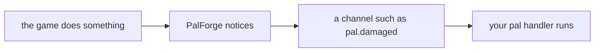
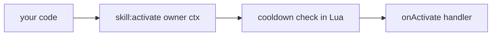
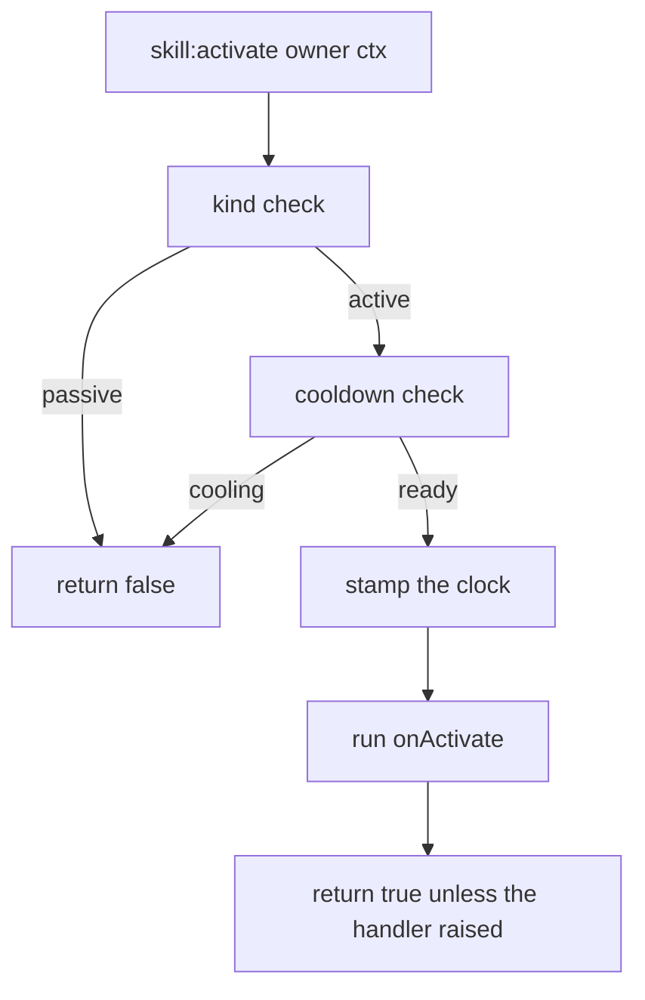
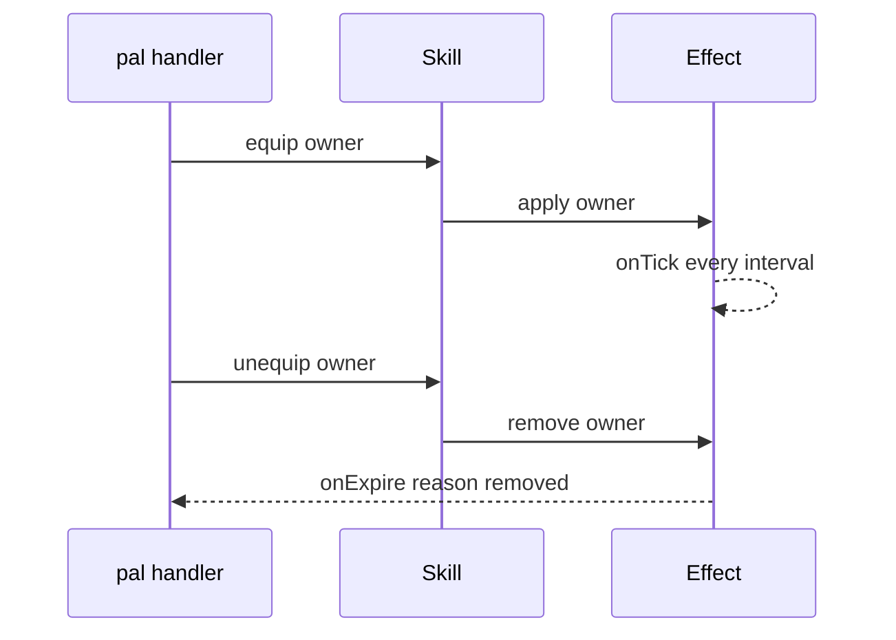

## What you can do after this page

- Add your own attack, with a name, an element, a power number and an icon
- Set it off from your own code: when a pal gets hurt, when someone uses a building, or when you press a key
- Stop it going off too often, with a cooldown you set in seconds
- Add a trait that keeps doing something while a pal has it on
- Read back the list of skills a pal carries
- Put a skill onto a live pal or the player, so the game itself carries it

A skill is an attack or a trait. You describe it once with `Skill{ ... }`, and you get back an
object with the actions on it. Nothing in the game sets a skill off by itself, so the line that
fires it belongs in your own code — here it is on the last line:

```lua title="content/skills.lua"
local Ember = Skill{
    id       = "example:Ember",
    name     = "Ember",
    kind     = "active",
    element  = "fire",
    cooldown = 5.0,
    power    = 30,
    events   = {
        onActivate = function(skill, owner, ctx)
            -- your gameplay goes here
        end,
    },
}

Ember:activate(Player.character())   -- runs onActivate unless it is still cooling down
```

## You fire the skill yourself

Most of PalForge runs the other way round: the game does something, and PalForge calls the
function you wrote for it. A handler is that function — your code, called for you.



PalForge has channels for the world, for buildings, for pals and for items. It has none for
skills, because the game never reports "this pal used skill X". So a skill runs at the moment
you ask for it, and not before:



<Callout type="warn">
If your pack never calls `:activate`, `:hit`, `:equip` or `:unequip`, a skill handler never runs.
Listing a skill in `Pal{ skills = { ... } }` does not run one either. Put the call where you want
the skill to go off: in a pal handler, in a building's `onRightClick`, in a keybind, in an effect
tick. The recipes near the bottom of this page do each of those.
</Callout>

That path is complete, not a stand-in. The cooldown is counted in Lua, the handler gets the
skill's own object plus whatever context table you pass it, and the return value tells you
whether it ran.

## Defining a skill

`id` is the only field you have to give. Everything else is optional, and a field name PalForge
does not know stops the call with an error and a did-you-mean.

<Tabs items={['Global', 'Namespaced']}>
<Tab value="Global">

```lua
-- requiring palforge.api installs the bare globals
local Ember = Skill{ id = "example:Ember" }
```

</Tab>
<Tab value="Namespaced">

```lua
local api = require("palforge.api")
local Ember = api.Skill{ id = "example:Ember" }
```

</Tab>
</Tabs>

A definition using every field:

```lua title="content/skills.lua"
local log = require("palforge.utils.log").scope("example")

local Ember = Skill{
    id          = "example:Ember",
    name        = "Ember",
    description = "A short burst of fire.",
    kind        = "active",
    element     = "fire",
    cooldown    = 5.0,
    power       = 30,
    icon        = "palforge/example/textures/ember.png",
    data        = { tier = 1, projectiles = 3 },
    events      = {
        onActivate = function(skill, owner, ctx)
            log.info(skill:name() .. " fired, power " .. tostring(skill:power()))
        end,
        onHit = function(skill, target, ctx)
            log.info("hit " .. tostring(target))
        end,
    },
}
```

Here is every field you can pass, with its type and its default:

<TypeTable
  type={{
    id: { description: 'Skill id: a game row id, or "pack:name" for your own content. Registered as-is', type: 'string', required: true },
    name: { description: 'Shown in skill lists', type: 'string', default: 'the id' },
    description: { description: 'One-line description, for UI and tooling', type: 'string' },
    kind: { description: 'An active skill is fired; a passive one is equipped', type: '"active" | "passive"', default: '"active"' },
    element: { description: 'Attribute / element, e.g. fire or water. Free text, nothing validates it', type: 'string' },
    cooldown: { description: 'Seconds between activations, enforced by :activate', type: 'number' },
    power: { description: 'Base power / magnitude. Metadata only, nothing consumes it', type: 'number' },
    icon: { description: 'Fallback icon used when the DataTable lookup misses', type: 'any' },
    events: { description: 'The four behaviour handlers, grouped', type: 'Skill.Spec.Events' },
    data: { description: 'Free-form payload of your own, carried onto the definition', type: 'table' },
  }}
/>

`element` and `power` are kept on the definition and handed back by `:element()` and `:power()`.
`data` is kept too, though the handle has no query for it. PalForge itself reads none of the
three: they are places for your handlers and your UI to keep their own numbers.

You can also print the field list from Lua instead of memorising it:

```lua
local schema = require("palforge.core.schema")
print(schema.help("Skill.Spec"))
```

```text
Skill.Spec {
  id            string     (required) skill id: a game row id or "pack:name"
  name          string     shown in skill lists (defaults to id)
  description   string     one-line description, for UI and tooling
  kind          string     (default=active, one of { "active", "passive" }) an active skill is fired; a passive one is equipped
  element       string     attribute / element (fire, water, ...)
  cooldown      number     seconds between activations (enforced by :activate)
  power         number     base power / magnitude
  icon          any        fallback icon used when the DataTable lookup misses
  events        table      (Skill.Spec.Events) behaviour handlers (grouped)
  data          table      free-form payload of your own, carried onto the definition
}
```

You do not have to hold on to what the define call returned. Ask for it again from anywhere:

```lua
Skill.get("example:Ember")      -- the definition you registered
Skill.get("Legend")             -- never nil: a thin definition over any id
Skill.get_all()                 -- every PalForge-registered skill, as handles
```

`Skill.get` never returns nil. For an id nobody defined you get a bare definition: `:kind()` is
`"active"`, `:name()` is the id, `:description()`, `:element()` and `:power()` are nil, there is no
cooldown, and `:activate` runs an empty handler and returns true.

Defining the same id twice replaces the registration. The last call wins, and anything you took
from the earlier call still points at the earlier definition.

## Active and passive

`kind` is `"active"` by default, and the only other value it accepts is `"passive"`.

```lua
local Ember = Skill{
    id       = "example:Ember",
    kind     = "active",
    cooldown = 5.0,
    events   = { onActivate = function(skill, owner, ctx) end },
}

local Ironhide = Skill{
    id     = "example:Ironhide",
    kind   = "passive",
    events = {
        onEquip   = function(skill, owner, ctx) end,
        onUnequip = function(skill, owner, ctx) end,
    },
}
```

One check makes the difference: `:activate` returns `false` straight away when `kind` is
`"passive"`, without touching the cooldown and without running anything.

```lua
Ironhide:activate(owner)   --> false, nothing ran
```

Nothing else looks at `kind`. `:equip`, `:unequip` and `:hit` run whatever handler you declared,
on an active skill as readily as on a passive one — so an active skill with an `onEquip` handler
is a fine way to model "while this is in the loadout".

## Handlers

Handlers are the functions PalForge runs for you when one of the actions is called. There are
four, all optional. Each one gets the skill's own handle as its first argument, and a name that
is not on this list stops the define call with an error instead of being ignored.

| Handler | Signature | Runs when |
| --- | --- | --- |
| `onActivate` | `fun(skill, owner, ctx)` | you call `:activate(owner, ctx)` and the cooldown allows it |
| `onHit` | `fun(skill, target, ctx)` | you call `:hit(target, ctx)` |
| `onEquip` | `fun(skill, owner, ctx)` | you call `:equip(owner, ctx)` |
| `onUnequip` | `fun(skill, owner, ctx)` | you call `:unequip(owner, ctx)` |

The handle is the object the define call gave back, so every action and query is right there
inside the handler:

```lua
local Ember = Skill{
    id       = "example:Ember",
    cooldown = 5.0,
    power    = 30,
    events   = {
        onActivate = function(skill, owner, ctx)
            log.info(skill.id .. " power=" .. tostring(skill:power()))
            skill:hit(ctx.target, { from = owner })   -- report the landing yourself
        end,
        onHit = function(skill, target, ctx)
            log.info("landed on " .. tostring(target))
        end,
    },
}
```

<Callout type="warn">
The actions run every handler inside a `pcall` and throw the error message away. A handler that
crashes shows up only as a `false` return, with nothing in the log. Log inside your handler, or
wrap the risky part yourself.
</Callout>

## Actions

These five calls are how a skill gets used. All of them are yours to call.

```lua
skill:activate(owner, ctx)    --> boolean, did the handler run
skill:hit(target, ctx)        --> boolean
skill:equip(owner, ctx)       --> boolean
skill:unequip(owner, ctx)     --> boolean
skill:cooldownLeft(owner)     --> number, seconds until ready, 0 when ready
```

These five are your own bookkeeping and never tell the game anything. Three more —
`:teach`, `:forget` and `:skillsOn` — write to and read from a real character; they have their
own section below.

- `owner` and `target` are whatever you pass — a pal pawn, the player character, a plain table.
  The only thing that looks at `owner` is the cooldown bookkeeping, and only as an identity.
- `ctx` is a context table of your own. Nothing fills it in for you, and you can leave it out:
  all four actions put an empty table there instead, so `ctx` is never nil inside a handler you
  reached through an action.
- `:activate` returns `false` when the skill is passive, `false` when the cooldown blocked it,
  and otherwise `true` when the handler ran without crashing.
- `:hit`, `:equip` and `:unequip` ignore both the cooldown and `kind`. They return `true` unless
  the handler crashed.

```lua
local Ember  = Skill.get("example:Ember")
local player = Player.character()

if Ember:activate(player, { reason = "manual" }) then
    log.info("fired")
else
    log.info("blocked, " .. string.format("%.1f", Ember:cooldownLeft(player)) .. "s left")
end
```

The handle also carries a raw call for each handler — `skill:onActivate(owner, ctx)`,
`skill:onHit`, `skill:onEquip`, `skill:onUnequip`. These go straight to the handler: no cooldown,
no passive check, no empty `ctx` filled in for you, and errors are not swallowed. Reach for the
actions unless you want exactly that.

## Cooldown

`cooldown` is a number of seconds, and `:activate` is the only thing that enforces it.



The count is kept per owner and per skill id, so two pals holding the same skill cool down
separately:

```lua
local Ember = Skill{
    id       = "example:Ember",
    cooldown = 5.0,
    events   = { onActivate = function(skill, owner, ctx) end },
}

-- `one` and `two` are two different owners, e.g. two `ctx.actor` pawns
Ember:activate(one)       --> true
Ember:activate(one)       --> false, still cooling
Ember:activate(two)       --> true, a different owner has its own bucket
Ember:cooldownLeft(one)   --> counts down from 5.0
Ember:cooldownLeft(two)   --> counts down from 5.0, independently
```

Details worth knowing:

- Leaving `owner` out is allowed. The time then goes into one shared slot, so `:activate()` with
  no owner cools down globally for that skill.
- Owners are held weakly, so a cooldown never keeps a pawn alive after it is gone.
- Times come from `os.clock()`.
- No `cooldown`, or a cooldown of zero or less, means no gate at all: `:activate` always runs and
  `:cooldownLeft` always returns `0`.
- The clock is stamped **before** the handler runs. A handler that crashes has still used up the
  cooldown.

Showing the time left is usually nicer than firing blindly:

```lua
local left = Ember:cooldownLeft(Player.character())
if left > 0 then
    log.info(string.format("Ember ready in %.1fs", left))
else
    Ember:activate(Player.character())
end
```

## Queries

Everything you declared can be read back off the handle:

```lua
local s = Skill.get("example:Ember")

s.id             --> "example:Ember"   (a plain field on the handle)
s:name()         --> "Ember", or the id when no name was declared
s:description()  --> string | nil
s:kind()         --> "active" | "passive"
s:element()      --> string | nil
s:power()        --> number | nil
s:iconOf()       --> texture ref | the declared icon | nil
```

`:iconOf()` looks the id up in one of the game's own data tables — the partner-skill icon table
at `/Game/Pal/DataTable/PartnerSkill/DT_partnerSkillIconDataTable` — through `core/icons`. Every
step fails softly: a missing table, a missing row or a missing column all give nil, and on any
miss you get the `icon` you declared instead. That table is keyed by pal, so most skill ids miss
it, and a `"pack:name"` id always does. Declare an `icon` if you want one to show.

```lua
local Ember = Skill{
    id   = "example:Ember",
    icon = "palforge/example/textures/ember.png",
}
Ember:iconOf()   --> the declared icon, since "example:Ember" has no row in that table

Skill.get("Legend"):iconOf()   --> nil: no row, and no icon was declared to fall back to
```

## Teaching a live character

The five actions above are your own bookkeeping: they run your handlers and tell the game
nothing. These three do the opposite — they put a skill on a **live** pal or player so the game
itself carries it, and read back what that character has.

```lua
skill:teach(actor)      --> boolean, true only when the skill is on the character afterwards
skill:forget(actor)     --> boolean, true only when it is gone afterwards
skill:skillsOn(actor)   --> { active = { ... }, passive = { ... } } | nil
```

`actor` has to be a real character — a pal standing in the world, or the player's own pawn from
`Player.character()`. Anything else is refused with a `false`.

```lua
local pawn = Player.character()

Skill.get("FireBlast"):teach(pawn)    -- one of the game's own moves
Skill.get("Legend"):teach(pawn)       -- not a move: added as a passive trait
Skill.get("FireBlast"):skillsOn(pawn) --> { active = { "FireBlast" }, passive = { "Legend" } }
Skill.get("FireBlast"):forget(pawn)
```

### The id decides which kind the game is asked for

Palworld keeps active moves and passive traits in two separate places, so `:teach` has to pick
one — and it picks on **the id**, not on your `kind` field:

- an id the game knows as one of its own active moves — `"FireBlast"`, `"Psychokinesis"`, 309 of
  them — is added to the character's equipped moves;
- **any other id** is added as a passive skill under that name.

<Callout type="warn">
`kind` describes what YOUR skill does when your code fires it. `:teach` asks the GAME for one of
its own, so it does not read `kind` at all. Declaring `kind = "passive"` on a skill whose id is
`"FireBlast"` still teaches the game's active move, and a pack id like `"example:Ember"` is
handed over as a passive name whatever you declared — the game has no move by that name.
</Callout>

Case does not matter, so `"fireblast"` finds the same move.
`require("palforge.core.character").wazaNames()` returns every active-move name this build has,
sorted, if you want to check an id before you write it.

### What the boolean means

Every write is checked by reading the character back afterwards, so `true` means the skill was
**seen on the character** — never that a call ran without complaining. `false` means it did not
land: the target is not a character, the game will not take the id, or the write was refused.

`:skillsOn(actor)` answers `{ active = {...}, passive = {...} }`. Empty lists mean the read
worked and the character carries none. `nil` for the whole table means the character could not
be read at all — unknown, never "has none" — so check for `nil` before you index it.

```lua
local carried = Skill.get("FireBlast"):skillsOn(pawn)
if carried then
    print(#carried.active .. " moves, " .. #carried.passive .. " traits")
end
```

<Callout type="info">
`:teach` and `:equip` are different on purpose, and both are worth having. `:equip` runs your
own `onEquip` handler on any value you like and tells the game nothing; `:teach` writes to a
real character and tells you what the game shows afterwards. A pack that tracks its own
"equipped" set keeps using `:equip`.
</Callout>

## Skills on a pal

A pal lists the skills it owns by id, as an array of strings:

```lua
local Blaze = Pal{
    id     = "FoxMage",
    name   = "Blaze",
    skills = { "example:Ember", "example:Ironhide" },
}

Blaze:skillsOf()   --> { "example:Ember", "example:Ironhide" }
```

Each element is checked, and the error carries the index:

```text
PalForge: Pal: field "skills[2]" expects string, got number
```

<Callout type="warn">
That list is only a list. Declaring it does not put anything on any creature, and nothing in the
game fires the actives for you. It is stored and handed back through `pal:skillsOf()`.
</Callout>

Two things you can do with it. Write the loop yourself, for your own bookkeeping:

```lua
for _, id in ipairs(Blaze:skillsOf()) do
    local skill = Skill.get(id)
    if skill:kind() == "passive" then
        skill:equip(owner)
    end
end
```

Or hand the whole list to a live creature in one call, with
[`Pal.Handle:teachAll`](/docs/api/pal):

```lua
local taught, asked = Blaze:teachAll(somePalActor)
-- 2, 2 when both landed; 1, 2 when one did not
```

`teachAll` routes each id exactly as `:teach` does, keeps going after one fails, and returns two
numbers so a partial result is visible instead of being flattened into a `true` or a `false`.

## Palworld's own skill ids

If you want to hang behaviour on a skill the game already has, `native/skills.lua` carries the row
ids of Palworld's two skill tables — `DT_PassiveSkill_Main_Common` (passive traits) and
`DT_PartnerSkillParameter` (partner skills, keyed by encounter with `RAID_`, `GYM_` and `BOSS_`
prefixes) — as one flat catalog:

```lua
local skills = require("palforge.native.skills")

skills.CATALOG              -- every row id from those two tables, as a list
skills.get("Legend")        -- a cached handle for a catalog id, nil for anything else
skills.get("not_a_row")     -- nil
```

`get(id)` defines the skill the first time you ask for it and remembers the result, so startup
never registers the thousands of ids. The catalog itself is plain data. The file also ships one
ready-made definition:

```lua
skills.Fireball             -- Skill{ id = "FlameThrower", kind = "active",
                            --        element = "fire", cooldown = 3.0, power = 50 }
skills.Fireball:activate(owner)
```

<Callout type="info">
`skills.CATALOG` does not list `"FlameThrower"` — that name comes from the `DevName` column of
`DT_PartnerSkillParameter` rather than from a row name — but `skills.get("FlameThrower")` still
returns the handle above. Its `onActivate` does nothing yet: there is no confirmed way to spawn
the projectile from Lua, so write your own gameplay in a handler if you want it to do something.
Its `element`, `cooldown` and `power` are PalForge's own numbers, not values read from the game.
</Callout>

## Recipes

### Fire a skill from a pal handler

`onDamaged` runs on its own when a pal takes damage, so this is a skill that really does go off in
play. `ctx.actor` is the pal that got hit, which makes it the natural owner.

```lua title="content/retaliate.lua"
local log = require("palforge.utils.log").scope("example")

Skill{
    id       = "example:Ember",
    name     = "Ember",
    kind     = "active",
    element  = "fire",
    cooldown = 5.0,
    power    = 30,
    events   = {
        onActivate = function(skill, owner, ctx)
            log.info(string.format("%s retaliates (%s) power=%d",
                skill:name(), tostring(ctx.reason), skill:power() or 0))
            -- deal your damage / spawn your projectile here
        end,
    },
}

Pal{
    id     = "FoxMage",
    name   = "Blaze",
    skills = { "example:Ember" },
    events = {
        onDamaged = function(pal, ctx)
            local ember = Skill.get("example:Ember")
            if not ember:activate(ctx.actor, { reason = "damaged" }) then
                log.info(string.format("Ember cooling, %.1fs left",
                    ember:cooldownLeft(ctx.actor)))
            end
        end,
    },
}
```

The cooldown is what keeps this sane. A burst of damage calls `onDamaged` again and again, and
only the first call inside each five-second window gets through.

### Fire a skill from a building

`onRightClick` runs on its own too, when a player interacts with your building. The handler gets
the placed building itself as `self`, so the structure can keep its own state. The context carries
`ctx.player`, the actor that interacted — a good owner for the cooldown.

```lua title="content/brazier.lua"
local log = require("palforge.utils.log").scope("example")

Skill{
    id       = "example:Ember",
    kind     = "active",
    element  = "fire",
    cooldown = 3.0,
    events   = {
        onActivate = function(skill, owner, ctx)
            log.info("brazier lit by " .. tostring(owner) .. " at " .. tostring(ctx.where))
        end,
    },
}

Building{
    id     = "example:Brazier",
    name   = "Brazier",
    gridCm = 100,
    mesh   = {
        kind  = "static",
        model = "/Game/Pal/Model/Prop/Architecture/WorkBenchPrimitive/SM_WorkBenchPrimitive.SM_WorkBenchPrimitive",
    },
    state  = { lit = 0 },
    events = {
        onRightClick = function(self, ctx)
            local ember = Skill.get("example:Ember")
            local fired = ember:activate(ctx.player, { where = self.pos })
            if fired then
                self.state.lit = self.state.lit + 1
                self:save()
            else
                log.info(string.format("still hot, %.1fs", ember:cooldownLeft(ctx.player)))
            end
        end,
    },
}
```

### Bind a skill to a key

UE4SS gives you `RegisterKeyBind`. Run the body inside `ExecuteInGameThread`, which is where it is
safe to touch the game, and both calls work straight from a pack. PalForge binds its own dev keys
the same way.

```lua title="content/keybind.lua"
local log = require("palforge.utils.log").scope("example")

Skill{
    id       = "example:Ember",
    kind     = "active",
    cooldown = 2.0,
    events   = {
        onActivate = function(skill, owner, ctx)
            log.info("Ember on " .. tostring(owner))
        end,
    },
}

RegisterKeyBind(Key.F5, function()
    ExecuteInGameThread(function()
        local owner = Player.character()
        if not owner then return end
        local ember = Skill.get("example:Ember")
        if not ember:activate(owner, { reason = "keybind" }) then
            log.info(string.format("%.1fs left", ember:cooldownLeft(owner)))
        end
    end)
end)
```

Holding the key down calls the bind again and again; the cooldown turns that into one activation
every two seconds.

### A passive that applies an Effect

An `Effect` has its own timer, so pairing a passive skill with one is how "while equipped,
something keeps happening" gets built. `onEquip` applies it, `onUnequip` removes it.



```lua title="content/ironhide.lua"
local log = require("palforge.utils.log").scope("example")

local Hardened = Effect{
    id          = "example:Hardened",
    name        = "Hardened",
    description = "Regenerating while the trait is equipped.",
    interval    = 2.0,          -- onTick every 2s; no duration = until :remove()
    events      = {
        onApply  = function(effect, target, ctx)
            log.info("hardened on " .. tostring(target))
        end,
        onTick   = function(effect, target, ctx)
            log.info(string.format("tick at %.1fs", ctx.elapsed))
            -- heal / buff the target here
        end,
        onExpire = function(effect, target, ctx)
            log.info("hardened off, reason " .. tostring(ctx.reason))
        end,
    },
}

Skill{
    id          = "example:Ironhide",
    name        = "Ironhide",
    description = "A passive trait that hardens its owner.",
    kind        = "passive",
    events      = {
        onEquip   = function(skill, owner, ctx) Hardened:apply(owner) end,
        onUnequip = function(skill, owner, ctx) Hardened:remove(owner) end,
    },
}

Pal{
    id     = "FoxMage",
    name   = "Blaze",
    skills = { "example:Ironhide" },
    events = {
        onSpawned = function(pal, ctx)
            for _, id in ipairs(pal:skillsOf()) do
                local skill = Skill.get(id)
                if skill:kind() == "passive" then
                    skill:equip(ctx.actor, { from = pal.id })
                end
            end
        end,
        onDeath = function(pal, ctx)
            for _, id in ipairs(pal:skillsOf()) do
                Skill.get(id):unequip(ctx.actor)
            end
        end,
    },
}
```

`onSpawned` and `onDeath` both run on their own once the pal is in the world, so the equip and the
unequip happen without you. `onDeath` sits on a confirmed game hook; `onSpawned` sits on
`BroadcastOnCompleteInitializeParameter`, which is still an unconfirmed guess, so treat the equip
as best-effort and re-equip elsewhere if you need certainty. The skill brings the two handlers,
and the `Effect` brings the timing.

## Validation errors

Every problem is an error that stops the call, prefixed `PalForge: `. A definition never half
succeeds.

```text
PalForge: Skill: field "id" is required (skill id: a game row id or "pack:name")
PalForge: Skill: unknown field "cooldwn" (did you mean "cooldown"?). Valid fields: id, name, description, kind, element, cooldown, power, icon, events, data
PalForge: Skill: field "kind" must be one of { "active", "passive" }, got "buff"
PalForge: Skill: field "power" expects number, got string
PalForge: Skill: field "events" (Skill.Spec.Events): unknown field "onActivated" (did you mean "onActivate"?). Valid fields: onActivate, onHit, onEquip, onUnequip
```

Handler names are checked the same way, and that is worth having: a typo like `onActivated` tells
you at once, instead of leaving you with a skill that silently never runs.

## Related

<Cards>
  <Card title="Pal" href="/docs/api/pal">Listing skills on a pal, and the hooks that can drive them.</Card>
  <Card title="Effect" href="/docs/api/effect">The domain with a timer, for anything a passive should keep doing.</Card>
  <Card title="Building" href="/docs/api/building">Placed buildings and onRightClick, the other natural trigger.</Card>
  <Card title="Lifecycle" href="/docs/concepts/lifecycle">Which channels exist, and which hooks the game actually feeds.</Card>
</Cards>

## Summary

- Write `Skill{ ... }` to make a skill. `id` is the only field you must give.
- Nothing fires it for you: your code calls `:activate`, `:hit`, `:equip` or `:unequip`.
- `cooldown` is in seconds, counted per owner, and only `:activate` checks it.
- `kind = "passive"` makes `:activate` return `false`; use `:equip` and `:unequip` for those.
- A handler that crashes comes back as `false` with nothing in the log, so log inside it.
- `pal:skillsOf()` gives you the ids a pal *declares*. `skill:teach(actor)` puts one on a live
  character, `skill:skillsOn(actor)` reads back what that character really has, and
  `pal:teachAll(actor)` does the whole declared list at once.

Next, read [Effect](/docs/api/effect) — it has the timer a passive skill needs to keep doing
something.
