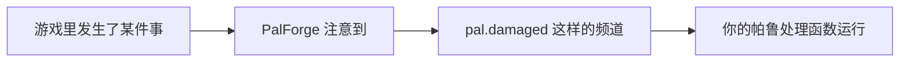
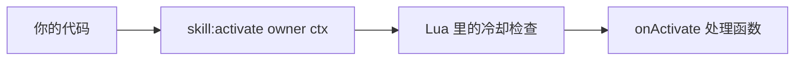
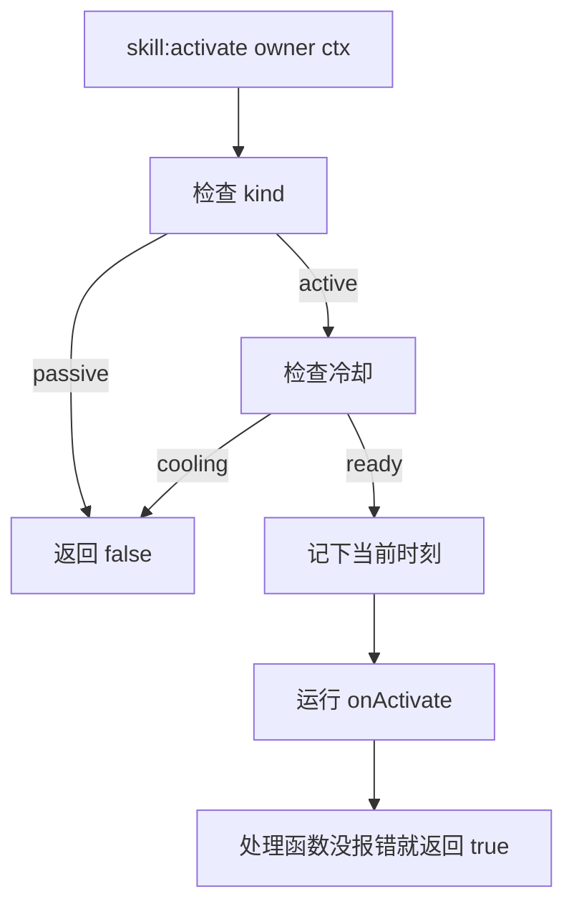
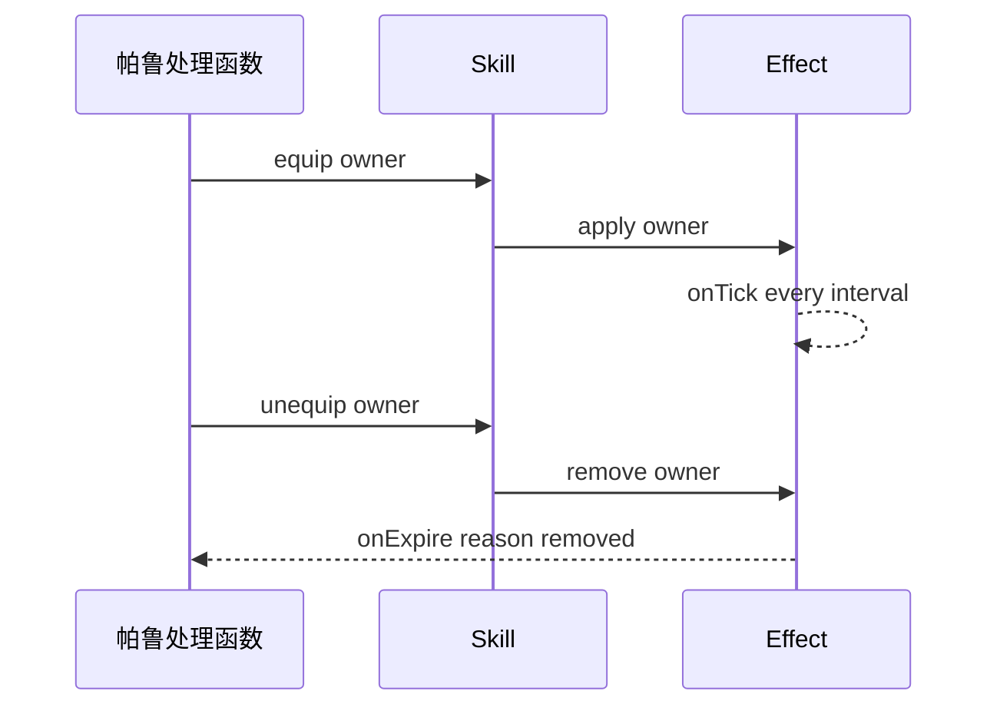

## 读完本页你可以做到

- 添加自己的攻击，给它名字、属性、威力和图标
- 在自己的代码里发动它：帕鲁受伤时、有人使用建筑物时，或者你按下某个键时
- 用秒数设置冷却，避免连发
- 添加一个特性，只要帕鲁带着它就一直生效
- 读出一只帕鲁身上的技能列表

技能就是攻击或特性。用 `Skill{ ... }` 描述一次，你会拿到一个带着各种动作的对象。游戏本身不会自己
发动技能，所以发动它的那一行要写在你自己的代码里 —— 下面这段的最后一行就是：

```lua title="content/skills.lua"
local Ember = Skill{
    id       = "example:Ember",
    name     = "Ember",
    kind     = "active",
    element  = "fire",
    cooldown = 5.0,
    power    = 30,
    events   = {
        onActivate = function(skill, owner, ctx)
            -- your gameplay goes here
        end,
    },
}

Ember:activate(Player.character())   -- runs onActivate unless it is still cooling down
```

## 技能由你自己发动

PalForge 的其他部分是反过来的：游戏里发生了某件事，PalForge 就调用你为它写的函数。处理函数就是
这个函数 —— 你写的代码，由框架替你调用。



PalForge 为世界、建筑物、帕鲁和道具都准备了频道。技能没有频道，因为游戏从不报告"这只帕鲁用了
技能 X"。所以技能只在你要求它的那一刻运行，不会更早：



<Callout type="warn">
只要你的内容包从不调用 `:activate`、`:hit`、`:equip` 或 `:unequip`，技能的处理函数就一次也不会运行。
把技能写进 `Pal{ skills = { ... } }` 同样不会让它运行。把调用写在你希望技能发动的地方：帕鲁的
处理函数里、建筑物的 `onRightClick` 里、按键绑定里、效果的 tick 里。本页靠下的示例把这几种都写了一遍。
</Callout>

这条路径是完整的，不是临时替代品。冷却由 Lua 计数，处理函数会拿到技能自己的对象以及你传给它的
上下文表，返回值告诉你它有没有运行。

## 定义技能

`id` 是唯一必须给的字段。其余都是可选的，写了 PalForge 不认识的字段名，调用会当场报错，并提示你
可能想写的是哪个。

<Tabs items={['Global', 'Namespaced']}>
<Tab value="Global">

```lua
-- requiring palforge.api installs the bare globals
local Ember = Skill{ id = "example:Ember" }
```

</Tab>
<Tab value="Namespaced">

```lua
local api = require("palforge.api")
local Ember = api.Skill{ id = "example:Ember" }
```

</Tab>
</Tabs>

一个用上了所有字段的定义：

```lua title="content/skills.lua"
local log = require("palforge.utils.log").scope("example")

local Ember = Skill{
    id          = "example:Ember",
    name        = "Ember",
    description = "A short burst of fire.",
    kind        = "active",
    element     = "fire",
    cooldown    = 5.0,
    power       = 30,
    icon        = "palforge/example/textures/ember.png",
    data        = { tier = 1, projectiles = 3 },
    events      = {
        onActivate = function(skill, owner, ctx)
            log.info(skill:name() .. " fired, power " .. tostring(skill:power()))
        end,
        onHit = function(skill, target, ctx)
            log.info("hit " .. tostring(target))
        end,
    },
}
```

下面是你可以传的每个字段，以及它的类型和默认值：

<TypeTable
  type={{
    id: { description: '技能 id：游戏里的行 id，或者自制内容用的 "pack:name"。原样注册', type: 'string', required: true },
    name: { description: '在技能列表里显示的名字', type: 'string', default: '与 id 相同' },
    description: { description: '一行说明，供界面和工具使用', type: 'string' },
    kind: { description: 'active 是发动的技能，passive 是装备的技能', type: '"active" | "passive"', default: '"active"' },
    element: { description: '属性，例如 fire 或 water。自由文本，不做校验', type: 'string' },
    cooldown: { description: '两次发动之间的秒数，由 :activate 强制', type: 'number' },
    power: { description: '基础威力／强度。只是元数据，没有任何地方使用它', type: 'number' },
    icon: { description: 'DataTable 查不到时使用的备用图标', type: 'any' },
    events: { description: '四个行为处理函数，放在一起', type: 'Skill.Spec.Events' },
    data: { description: '你自己的任意数据，原样保存在定义上', type: 'table' },
  }}
/>

`element` 和 `power` 保存在定义里，可以用 `:element()` 和 `:power()` 取回。`data` 也会保存，只是句柄上
没有读它的方法。PalForge 自己这三个都不看：它们是留给你的处理函数和界面存放自己数值的地方。

字段列表也可以从 Lua 打印出来，不用背：

```lua
local schema = require("palforge.core.schema")
print(schema.help("Skill.Spec"))
```

```text
Skill.Spec {
  id            string     (required) skill id: a game row id or "pack:name"
  name          string     shown in skill lists (defaults to id)
  description   string     one-line description, for UI and tooling
  kind          string     (default=active, one of { "active", "passive" }) an active skill is fired; a passive one is equipped
  element       string     attribute / element (fire, water, ...)
  cooldown      number     seconds between activations (enforced by :activate)
  power         number     base power / magnitude
  icon          any        fallback icon used when the DataTable lookup misses
  events        table      (Skill.Spec.Events) behaviour handlers (grouped)
  data          table      free-form payload of your own, carried onto the definition
}
```

定义调用的返回值不用一直拿着。随时可以再取一次：

```lua
Skill.get("example:Ember")      -- the definition you registered
Skill.get("Legend")             -- never nil: a thin definition over any id
Skill.get_all()                 -- every PalForge-registered skill, as handles
```

`Skill.get` 永远不会返回 nil。对于没人定义过的 id，你拿到的是一个空定义：`:kind()` 是 `"active"`，
`:name()` 就是这个 id，`:description()`、`:element()` 和 `:power()` 是 nil，没有冷却，`:activate` 会运行
一个空的处理函数并返回 true。

同一个 id 定义两次，注册会被替换。最后一次调用生效，而你从上一次调用拿到的东西仍然指向上一个定义。

## 主动与被动

`kind` 默认是 `"active"`，另外唯一接受的值是 `"passive"`。

```lua
local Ember = Skill{
    id       = "example:Ember",
    kind     = "active",
    cooldown = 5.0,
    events   = { onActivate = function(skill, owner, ctx) end },
}

local Ironhide = Skill{
    id     = "example:Ironhide",
    kind   = "passive",
    events = {
        onEquip   = function(skill, owner, ctx) end,
        onUnequip = function(skill, owner, ctx) end,
    },
}
```

造成区别的只有一处判断：`kind` 是 `"passive"` 时，`:activate` 立刻返回 `false`，既不碰冷却，也不运行
任何东西。

```lua
Ironhide:activate(owner)   --> false, nothing ran
```

其他地方都不看 `kind`。`:equip`、`:unequip` 和 `:hit` 会照样运行你声明的处理函数，主动技能和被动技能
一视同仁 —— 所以给一个主动技能写 `onEquip` 处理函数，也是表达"只要它在配置里就一直生效"的好办法。

## 处理函数

处理函数就是这些动作被调用时 PalForge 替你运行的函数。一共四个，都是可选的。每个的第一个参数都是
技能自己的句柄；写了不在这个列表里的名字，定义调用会直接报错，而不是被悄悄忽略。

| 处理函数 | 签名 | 运行时机 |
| --- | --- | --- |
| `onActivate` | `fun(skill, owner, ctx)` | 你调用 `:activate(owner, ctx)`，且冷却允许时 |
| `onHit` | `fun(skill, target, ctx)` | 你调用 `:hit(target, ctx)` 时 |
| `onEquip` | `fun(skill, owner, ctx)` | 你调用 `:equip(owner, ctx)` 时 |
| `onUnequip` | `fun(skill, owner, ctx)` | 你调用 `:unequip(owner, ctx)` 时 |

句柄就是定义调用返回的那个对象，所以在处理函数里，所有动作和查询都能直接用：

```lua
local Ember = Skill{
    id       = "example:Ember",
    cooldown = 5.0,
    power    = 30,
    events   = {
        onActivate = function(skill, owner, ctx)
            log.info(skill.id .. " power=" .. tostring(skill:power()))
            skill:hit(ctx.target, { from = owner })   -- report the landing yourself
        end,
        onHit = function(skill, target, ctx)
            log.info("landed on " .. tostring(target))
        end,
    },
}
```

<Callout type="warn">
这些动作都用 `pcall` 包住处理函数，并把错误信息丢掉。处理函数崩溃时，你只会看到返回 `false`，日志里
什么都没有。请在自己的处理函数里打日志，或者自己把有风险的部分包起来。
</Callout>

## 动作

技能就是靠这五个调用来使用的。它们都由你来调用。

```lua
skill:activate(owner, ctx)    --> boolean, did the handler run
skill:hit(target, ctx)        --> boolean
skill:equip(owner, ctx)       --> boolean
skill:unequip(owner, ctx)     --> boolean
skill:cooldownLeft(owner)     --> number, seconds until ready, 0 when ready
```

- `owner` 和 `target` 是你传什么就是什么 —— 帕鲁的 pawn、玩家角色，或者一个普通的表。只有冷却的
  记账会看 `owner`，而且只把它当身份标识用。
- `ctx` 是你自己的上下文表。没有任何东西会替你填它，你也可以不传：四个动作都会放一个空表进去，
  所以通过动作进入的处理函数里，`ctx` 永远不是 nil。
- `:activate` 在技能是被动时返回 `false`，被冷却挡住时返回 `false`，其余情况下只要处理函数没崩溃就
  返回 `true`。
- `:hit`、`:equip` 和 `:unequip` 既不看冷却也不看 `kind`。只要处理函数没崩溃就返回 `true`。

```lua
local Ember  = Skill.get("example:Ember")
local player = Player.character()

if Ember:activate(player, { reason = "manual" }) then
    log.info("fired")
else
    log.info("blocked, " .. string.format("%.1f", Ember:cooldownLeft(player)) .. "s left")
end
```

句柄上还带着每个处理函数的原始调用 —— `skill:onActivate(owner, ctx)`、`skill:onHit`、`skill:onEquip`、
`skill:onUnequip`。它们直达处理函数：不看冷却，不做被动判断，不替你补一个空的 `ctx`，错误也不会被
吞掉。除非你要的正是这种行为，否则请用上面那些动作。

## 冷却

`cooldown` 是一个秒数，只有 `:activate` 会强制它。



计数按 owner 和技能 id 分别保存，所以两只带着同一个技能的帕鲁各自冷却：

```lua
local Ember = Skill{
    id       = "example:Ember",
    cooldown = 5.0,
    events   = { onActivate = function(skill, owner, ctx) end },
}

-- `one` and `two` are two different owners, e.g. two `ctx.actor` pawns
Ember:activate(one)       --> true
Ember:activate(one)       --> false, still cooling
Ember:activate(two)       --> true, a different owner has its own bucket
Ember:cooldownLeft(one)   --> counts down from 5.0
Ember:cooldownLeft(two)   --> counts down from 5.0, independently
```

值得知道的细节：

- `owner` 可以不传。这时时间记进一个共享的槽位，所以不带 owner 的 `:activate()` 是整个技能共用
  一个冷却。
- owner 是弱引用保存的，冷却不会让一个已经消失的 pawn 继续留着。
- 时间取自 `os.clock()`。
- 没有写 `cooldown`，或者 cooldown 小于等于零，就完全没有门槛：`:activate` 总是运行，`:cooldownLeft`
  总是返回 `0`。
- 时刻是在处理函数运行**之前**记下的。处理函数崩溃了，冷却照样已经用掉。

比起直接盲发，把剩余时间显示出来通常更友好：

```lua
local left = Ember:cooldownLeft(Player.character())
if left > 0 then
    log.info(string.format("Ember ready in %.1fs", left))
else
    Ember:activate(Player.character())
end
```

## 读回数值

你声明过的内容都可以从句柄上读回来：

```lua
local s = Skill.get("example:Ember")

s.id             --> "example:Ember"   (a plain field on the handle)
s:name()         --> "Ember", or the id when no name was declared
s:description()  --> string | nil
s:kind()         --> "active" | "passive"
s:element()      --> string | nil
s:power()        --> number | nil
s:iconOf()       --> texture ref | the declared icon | nil
```

`:iconOf()` 会通过 `core/icons`，拿这个 id 去查游戏自己的一张数据表 —— 伙伴技能的图标表
`/Game/Pal/DataTable/PartnerSkill/DT_partnerSkillIconDataTable`。每一步都不会硬失败：表不在、行不在、
列不在，结果都是 nil，任何一次查不到都会改用你声明的 `icon`。那张表是按帕鲁做键的，所以大多数技能 id
都查不到，`"pack:name"` 形式的 id 必定查不到。想让图标显示出来，就自己声明 `icon`。

```lua
local Ember = Skill{
    id   = "example:Ember",
    icon = "palforge/example/textures/ember.png",
}
Ember:iconOf()   --> the declared icon, since "example:Ember" has no row in that table

Skill.get("Legend"):iconOf()   --> nil: no row, and no icon was declared to fall back to
```

## 帕鲁身上的技能

帕鲁用一个字符串数组，按 id 列出自己拥有的技能：

```lua
local Blaze = Pal{
    id     = "FoxMage",
    name   = "Blaze",
    skills = { "example:Ember", "example:Ironhide" },
}

Blaze:skillsOf()   --> { "example:Ember", "example:Ironhide" }
```

每个元素都会被检查，错误里带着下标：

```text
PalForge: Pal: field "skills[2]" expects string, got number
```

<Callout type="warn">
这个数组就只是一个列表。PalForge 不会去解析这些 id，不会装备被动技能，也不会发动主动技能。它只是
把列表存下来，通过 `pal:skillsOf()` 交还给你。剩下的在处理函数里自己做 —— 下面这个循环就够了。
</Callout>

```lua
for _, id in ipairs(Blaze:skillsOf()) do
    local skill = Skill.get(id)
    if skill:kind() == "passive" then
        skill:equip(owner)
    end
end
```

## Palworld 自带的技能 id

想给游戏里已有的技能挂上行为时，`native/skills.lua` 把 Palworld 两张技能表的行 id 合成了一份扁平的
目录 —— `DT_PassiveSkill_Main_Common`（被动特性）和 `DT_PartnerSkillParameter`（伙伴技能，按遭遇分类，
带 `RAID_`、`GYM_`、`BOSS_` 前缀）：

```lua
local skills = require("palforge.native.skills")

skills.CATALOG              -- every row id from those two tables, as a list
skills.get("Legend")        -- a cached handle for a catalog id, nil for anything else
skills.get("not_a_row")     -- nil
```

`get(id)` 在你第一次要它的时候才定义这个技能，并记住结果，所以启动时不会去注册这几千个 id。目录本身
只是普通数据。这个文件还附带了一个现成的定义：

```lua
skills.Fireball             -- Skill{ id = "FlameThrower", kind = "active",
                            --        element = "fire", cooldown = 3.0, power = 50 }
skills.Fireball:activate(owner)
```

<Callout type="info">
`skills.CATALOG` 里没有 `"FlameThrower"` —— 这个名字来自 `DT_PartnerSkillParameter` 的 `DevName` 列，
不是某一行的行名 —— 但 `skills.get("FlameThrower")` 仍然返回上面那个句柄。它的 `onActivate` 目前什么都
不做：还没有确认可以从 Lua 生成弹体的办法，想让它做点什么，就自己在处理函数里写。它的 `element`、
`cooldown` 和 `power` 是 PalForge 自己定的数值，不是从游戏里读出来的。
</Callout>

## 示例

### 从帕鲁的处理函数发动技能

`onDamaged` 会在帕鲁受到伤害时自己运行，所以这是一个在游戏里真的会发动的技能。`ctx.actor` 是挨打的
那只帕鲁，正好拿来当 owner。

```lua title="content/retaliate.lua"
local log = require("palforge.utils.log").scope("example")

Skill{
    id       = "example:Ember",
    name     = "Ember",
    kind     = "active",
    element  = "fire",
    cooldown = 5.0,
    power    = 30,
    events   = {
        onActivate = function(skill, owner, ctx)
            log.info(string.format("%s retaliates (%s) power=%d",
                skill:name(), tostring(ctx.reason), skill:power() or 0))
            -- deal your damage / spawn your projectile here
        end,
    },
}

Pal{
    id     = "FoxMage",
    name   = "Blaze",
    skills = { "example:Ember" },
    events = {
        onDamaged = function(pal, ctx)
            local ember = Skill.get("example:Ember")
            if not ember:activate(ctx.actor, { reason = "damaged" }) then
                log.info(string.format("Ember cooling, %.1fs left",
                    ember:cooldownLeft(ctx.actor)))
            end
        end,
    },
}
```

真正让这件事不失控的是冷却。连续掉血会一次又一次地调用 `onDamaged`，但每个五秒窗口里只有第一次
能通过。

### 从建筑物发动技能

`onRightClick` 也会自己运行，在玩家与你的建筑物交互的时候。处理函数的第一个参数 `self` 就是放置好的
建筑物本身，所以建筑物可以保存自己的状态。上下文里带着 `ctx.player`，也就是发起交互的角色 ——
很适合当冷却的 owner。

```lua title="content/brazier.lua"
local log = require("palforge.utils.log").scope("example")

Skill{
    id       = "example:Ember",
    kind     = "active",
    element  = "fire",
    cooldown = 3.0,
    events   = {
        onActivate = function(skill, owner, ctx)
            log.info("brazier lit by " .. tostring(owner) .. " at " .. tostring(ctx.where))
        end,
    },
}

Building{
    id     = "example:Brazier",
    name   = "Brazier",
    gridCm = 100,
    mesh   = {
        kind  = "static",
        model = "/Game/Pal/Model/Prop/Architecture/WorkBenchPrimitive/SM_WorkBenchPrimitive.SM_WorkBenchPrimitive",
    },
    state  = { lit = 0 },
    events = {
        onRightClick = function(self, ctx)
            local ember = Skill.get("example:Ember")
            local fired = ember:activate(ctx.player, { where = self.pos })
            if fired then
                self.state.lit = self.state.lit + 1
                self:save()
            else
                log.info(string.format("still hot, %.1fs", ember:cooldownLeft(ctx.player)))
            end
        end,
    },
}
```

### 把技能绑到一个键上

UE4SS 提供了 `RegisterKeyBind`。函数体放进 `ExecuteInGameThread` 里跑，在那里碰游戏才是安全的；这两个
调用在内容包里都能直接用。PalForge 自己的开发用按键也是这么绑的。

```lua title="content/keybind.lua"
local log = require("palforge.utils.log").scope("example")

Skill{
    id       = "example:Ember",
    kind     = "active",
    cooldown = 2.0,
    events   = {
        onActivate = function(skill, owner, ctx)
            log.info("Ember on " .. tostring(owner))
        end,
    },
}

RegisterKeyBind(Key.F5, function()
    ExecuteInGameThread(function()
        local owner = Player.character()
        if not owner then return end
        local ember = Skill.get("example:Ember")
        if not ember:activate(owner, { reason = "keybind" }) then
            log.info(string.format("%.1fs left", ember:cooldownLeft(owner)))
        end
    end)
end)
```

一直按着键，绑定会被反复调用；冷却把它变成每两秒发动一次。

### 一个施加效果的被动技能

`Effect` 有自己的计时器，所以"装备着的时候有事情持续发生"就是靠被动技能配上一个效果做出来的。
`onEquip` 施加它，`onUnequip` 移除它。



```lua title="content/ironhide.lua"
local log = require("palforge.utils.log").scope("example")

local Hardened = Effect{
    id          = "example:Hardened",
    name        = "Hardened",
    description = "Regenerating while the trait is equipped.",
    interval    = 2.0,          -- onTick every 2s; no duration = until :remove()
    events      = {
        onApply  = function(effect, target, ctx)
            log.info("hardened on " .. tostring(target))
        end,
        onTick   = function(effect, target, ctx)
            log.info(string.format("tick at %.1fs", ctx.elapsed))
            -- heal / buff the target here
        end,
        onExpire = function(effect, target, ctx)
            log.info("hardened off, reason " .. tostring(ctx.reason))
        end,
    },
}

Skill{
    id          = "example:Ironhide",
    name        = "Ironhide",
    description = "A passive trait that hardens its owner.",
    kind        = "passive",
    events      = {
        onEquip   = function(skill, owner, ctx) Hardened:apply(owner) end,
        onUnequip = function(skill, owner, ctx) Hardened:remove(owner) end,
    },
}

Pal{
    id     = "FoxMage",
    name   = "Blaze",
    skills = { "example:Ironhide" },
    events = {
        onSpawned = function(pal, ctx)
            for _, id in ipairs(pal:skillsOf()) do
                local skill = Skill.get(id)
                if skill:kind() == "passive" then
                    skill:equip(ctx.actor, { from = pal.id })
                end
            end
        end,
        onDeath = function(pal, ctx)
            for _, id in ipairs(pal:skillsOf()) do
                Skill.get(id):unequip(ctx.actor)
            end
        end,
    },
}
```

帕鲁进入世界之后，`onSpawned` 和 `onDeath` 都会自己运行，所以装备和卸下不用你操心。`onDeath` 挂在一个
已确认的游戏钩子上；`onSpawned` 挂在 `BroadcastOnCompleteInitializeParameter` 上，那还是一个未经确认的
猜测，所以把装备当作尽力而为，需要确定就在别处再装备一次。两个处理函数由技能提供，时机由 `Effect`
提供。

## 校验错误

每一个问题都会变成一个中断调用的错误，前缀是 `PalForge: `。定义不会只成功一半。

```text
PalForge: Skill: field "id" is required (skill id: a game row id or "pack:name")
PalForge: Skill: unknown field "cooldwn" (did you mean "cooldown"?). Valid fields: id, name, description, kind, element, cooldown, power, icon, events, data
PalForge: Skill: field "kind" must be one of { "active", "passive" }, got "buff"
PalForge: Skill: field "power" expects number, got string
PalForge: Skill: field "events" (Skill.Spec.Events): unknown field "onActivated" (did you mean "onActivate"?). Valid fields: onActivate, onHit, onEquip, onUnequip
```

处理函数的名字也是同样检查的，这一点很值得有：像 `onActivated` 这样的拼写错误会立刻告诉你，而不是
留给你一个永远不会运行的技能。

## 相关页面

<Cards>
  <Card title="Pal" href="/docs/api/pal">如何在帕鲁上列出技能，以及能驱动它们的钩子。</Card>
  <Card title="Effect" href="/docs/api/effect">带计时器的领域，适合被动技能需要持续做的事。</Card>
  <Card title="Building" href="/docs/api/building">放置的建筑物和 onRightClick，另一个自然的触发点。</Card>
  <Card title="Lifecycle" href="/docs/concepts/lifecycle">有哪些频道，以及游戏真正会喂数据的是哪些钩子。</Card>
</Cards>

## 小结

- 用 `Skill{ ... }` 创建技能。`id` 是唯一必须给的字段。
- 没有任何东西替你发动它：由你的代码调用 `:activate`、`:hit`、`:equip` 或 `:unequip`。
- `cooldown` 以秒为单位，按 owner 分别计数，只有 `:activate` 会检查它。
- `kind = "passive"` 会让 `:activate` 返回 `false`；这类技能请用 `:equip` 和 `:unequip`。
- 处理函数崩溃只会得到 `false`，日志里什么都没有，所以要在里面自己打日志。
- `pal:skillsOf()` 给出一只帕鲁携带的 id；遍历它们是你的活。

接下来读 [Effect](/docs/api/effect) —— 被动技能要持续做事，需要的计时器就在那里。
