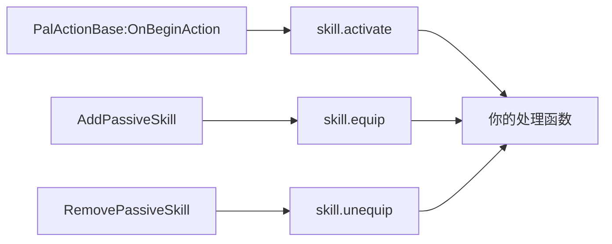
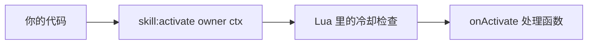
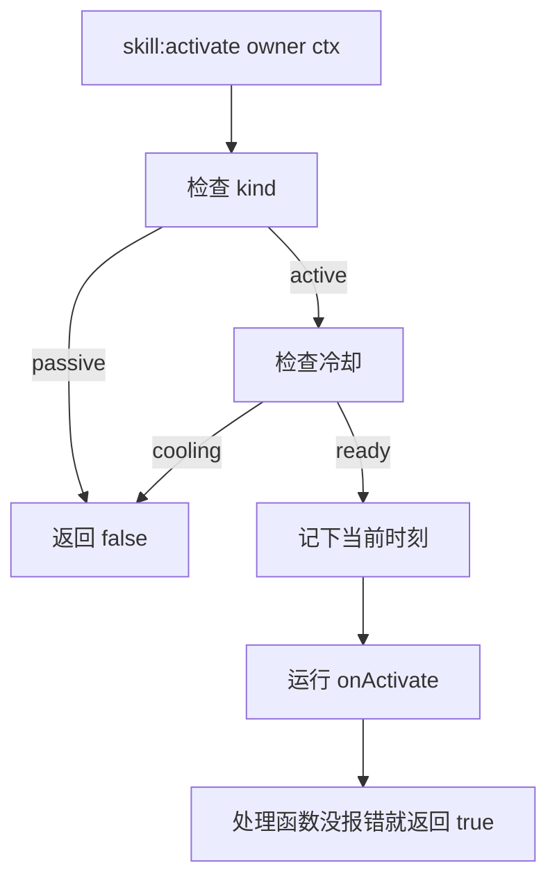
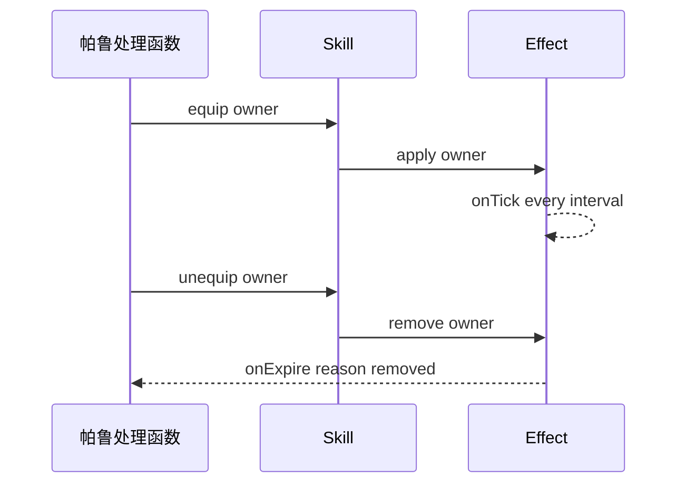

## 读完本页你可以做到

- 添加自己的攻击，给它名字、属性、威力和图标
- 在游戏放出自己的技能、或者把被动挂到角色身上时，运行你自己的代码
- 也可以在自己的代码里发动它：帕鲁受伤时、有人使用建筑物时，或者你按下某个键时
- 用秒数设置冷却，避免连发
- 添加一个特性，只要帕鲁带着它就一直生效
- 读出一只帕鲁身上的技能列表
- 把技能装到活着的帕鲁或玩家身上，让游戏自己带着它

技能就是攻击或特性。用 `Skill{ ... }` 描述一次，你会拿到一个带着各种动作的对象。四个处理函数里有
三个会在游戏做出对应的事情时替你调用；四个都能从你自己的代码里发动，而自制技能只有这一条路 ——
下面这段的最后一行就是：

```lua title="content/skills.lua"
local Ember = Skill{
    id       = "example:Ember",
    name     = "Ember",
    kind     = "active",
    element  = "fire",
    cooldown = 5.0,
    power    = 30,
    events   = {
        onActivate = function(skill, owner, ctx)
            -- your gameplay goes here
        end,
    },
}

Ember:activate(Player.character())   -- runs onActivate unless it is still cooling down
```

## 处理函数从哪里被运行起来

入口有两个，而且它们通向同一批处理函数。

四个频道里有三个由游戏驱动。PalForge 钩住 Palworld 自己的调用，从中读出技能或被动的 id，再去调用
以那个 id 注册的技能上的处理函数：



其中两个已在真实存档里被看到触发：实战中的 `skill.activate`，以及来自 `AddPassiveSkill` 的
`skill.equip`。`RemovePassiveSkill` 在同一个类上、接线方式完全相同，所以 `onUnequip` 应当同样能运送，
但还没有哪一次运行记录到它真的运送过。第四个是 `onHit`，它是唯一没有任何来源供给的一个；下面有一节
写清楚测到了什么、以及为什么它会保持这样。

另一个入口是你自己的代码，四个都能在你要求的那一刻运行 —— 这也是自制技能唯一的一条路：



<Callout type="warn">
游戏发来的事件是按**游戏报出的 id** 匹配的，所以只有以那个 id 注册的技能才收得到。
`Skill{ id = "FireBlast" }` 会在帕鲁放出 FireBlast 时被调用；`Skill{ id = "example:Ember" }` 永远不会，
因为 Palworld 里没有叫这个名字的技能。自制技能由你的代码运行：写在帕鲁的处理函数里、建筑物的
`onRightClick` 里、按键绑定里、效果的 tick 里。本页靠下的示例把这几种都写了一遍。只把技能写进
`Pal{ skills = { ... } }` 不会发动任何东西。
</Callout>

手动这条路径是完整的，不是临时替代品。冷却由 Lua 计数，处理函数会拿到技能自己的对象以及你传给它的
上下文表，返回值告诉你它有没有运行。

## 定义技能

`id` 是唯一必须给的字段。其余都是可选的，写了 PalForge 不认识的字段名，调用会当场报错，并提示你
可能想写的是哪个。

<Tabs items={['Global', 'Namespaced']}>
<Tab value="Global">

```lua
-- requiring palforge.api installs the bare globals
local Ember = Skill{ id = "example:Ember" }
```

</Tab>
<Tab value="Namespaced">

```lua
local api = require("palforge.api")
local Ember = api.Skill{ id = "example:Ember" }
```

</Tab>
</Tabs>

一个用上了所有字段的定义：

```lua title="content/skills.lua"
local log = require("palforge.utils.log").scope("example")

local Ember = Skill{
    id          = "example:Ember",
    name        = "Ember",
    description = "A short burst of fire.",
    kind        = "active",
    element     = "fire",
    cooldown    = 5.0,
    power       = 30,
    icon        = "/Game/YourPack/Textures/T_Ember.T_Ember",
    data        = { tier = 1, projectiles = 3 },
    events      = {
        onActivate = function(skill, owner, ctx)
            log.info(skill:name() .. " fired, power " .. tostring(skill:power()))
        end,
        onHit = function(skill, target, ctx)
            log.info("hit " .. tostring(target))
        end,
    },
}
```

下面是你可以传的每个字段，以及它的类型和默认值：

<TypeTable
  type={{
    id: { description: '技能 id：游戏里的行 id，或者自制内容用的 "pack:name"。原样注册；解析不出行名时会在定义时被拒绝', type: 'string', required: true },
    name: { description: '在技能列表里显示的名字', type: 'string', default: '与 id 相同' },
    description: { description: '一行说明，供界面和工具使用', type: 'string' },
    kind: { description: 'active 是发动的技能，passive 是装备的技能', type: '"active" | "passive"', default: '"active"' },
    element: { description: '属性，例如 fire 或 water。作者元数据：只保存并原样返回，没有任何地方读它', type: 'string' },
    cooldown: { description: '两次发动之间的秒数，由 :activate 强制', type: 'number' },
    power: { description: '基础威力／强度。作者元数据：只保存并原样返回，没有任何地方读它', type: 'number' },
    icon: { description: '图标 DataTable 里没有这个 id 的行时使用的 /Game/... 贴图路径', type: 'string' },
    events: { description: '四个行为处理函数，放在一起', type: 'Skill.Spec.Events' },
    data: { description: '你自己的任意数据，原样保存在定义上', type: 'table' },
  }}
/>

`element` 和 `power` 是作者元数据：它们保存在定义里，可以用 `:element()` 和 `:power()` 取回，而 PalForge
里没有任何地方会读它们。`data` 同样只是保存下来，句柄上也没有读它的方法。技能真正的属性和威力在游戏
自己的技能 DataTable 行里，而 Lua 写不了那一行。所以这三个是留给你的处理函数和界面存放自己数值的
地方，旁边的 `cooldown` 才是框架真正会强制的那一个数值。

字段列表也可以从 Lua 打印出来，不用背：

```lua
local schema = require("palforge.core.schema")
print(schema.help("Skill.Spec"))
```

```text
Skill.Spec {
  id            string     (required) skill id: a game row id or "pack:name"
  name          string     shown in skill lists (defaults to id)
  description   string     one-line description, for UI and tooling
  kind          string     (default=active, one of { "active", "passive" }) an active skill is fired; a passive one is equipped
  element       string     attribute / element (fire, water, ...). AUTHOR METADATA: stored and handed back, read by nothing
  cooldown      number     seconds between activations (enforced by :activate)
  power         number     base power / magnitude. AUTHOR METADATA: stored and handed back, read by nothing
  icon          string     /Game/... texture path used when the icon DataTable has no row for this id
  events        table      (Skill.Spec.Events) behaviour handlers (grouped)
  data          table      free-form payload of your own, carried onto the definition
}
```

`schema.help("Skill.Spec.Events")` 会为四个处理函数打印同样的东西，每一行都说明那个频道自己会不会
运送事件：

```text
Skill.Spec.Events {
  onActivate    function   LIVE - an active skill fired (self, owner, ctx); via = "PalActionBase:OnBeginAction"
  onHit         function   NOT LIVE - both sources measured silent (skill-hit-source); only :hit() runs it
  onEquip       function   LIVE - a passive was attached (self, owner, ctx); via names the source
  onUnequip     function   LIVE - a passive was removed (self, owner, ctx); via names the source
}
```

定义调用的返回值不用一直拿着。随时可以再取一次：

```lua
Skill.get("example:Ember")      -- the definition you registered
Skill.get("Legend")             -- never nil: a thin definition over any id
Skill.get_all()                 -- every PalForge-registered skill, as handles
```

`Skill.get` 永远不会返回 nil。对于没人定义过的 id，你拿到的是一个空定义：`:kind()` 是 `"active"`，
`:name()` 就是这个 id，`:description()`、`:element()` 和 `:power()` 是 nil，没有冷却，`:activate` 会运行
一个空的处理函数并返回 true。

同一个 id 定义两次，注册会被替换。最后一次调用生效，而你从上一次调用拿到的东西仍然指向上一个定义。
如果这两次调用来自不同的内容包，这次替换会连同两个包名一起写进日志，于是冲突有了可以指认的人。

### 第二个参数

`Skill{ ... }` 在 spec 之后还接受一个可选的选项表。不写它时的行为和以前完全一样。

```lua
-- 只构造句柄，不做任何注册：给那种不该写进注册表的“读取”用
local probe = Skill({ id = "example:Ember" }, { register = false })

-- 归属到某个内容包再注册，这就是让冲突有“谁”的那一步
Skill({ id = "example:Ember" }, { pack = "mypack" })

-- 不用每次调用都传，也能得到同样的归属
local api = PalForge.pack("mypack")
api.Skill{ id = "example:Ember" }
```

只接受 `register` 和 `pack`；写错的选项会报错，而不是被悄悄忽略。

### id 在定义时就会被检查

带冒号的 id 是带命名空间的，PalForge 会把 `"pack:Ember"` 解析成 PalSchema 实际写入的行名 `pack_Ember`。
冒号两边都只能是字母、数字和 `_`，解析不出来的 id 会在定义调用处被拒绝，而不是先注册下来、再永远
匹配不到任何一行：

```text
PalForge: Skill: field "id" is invalid: invalid pack id 'my-pack' in 'my-pack:Ember' (letters/digits/_ only)
```

## 主动与被动

`kind` 默认是 `"active"`，另外唯一接受的值是 `"passive"`。

```lua
local Ember = Skill{
    id       = "example:Ember",
    kind     = "active",
    cooldown = 5.0,
    events   = { onActivate = function(skill, owner, ctx) end },
}

local Ironhide = Skill{
    id     = "example:Ironhide",
    kind   = "passive",
    events = {
        onEquip   = function(skill, owner, ctx) end,
        onUnequip = function(skill, owner, ctx) end,
    },
}
```

造成区别的只有一处判断：`kind` 是 `"passive"` 时，`:activate` 立刻返回 `false`，既不碰冷却，也不运行
任何东西。

```lua
Ironhide:activate(owner)   --> false, nothing ran
```

其他地方都不看 `kind`。`:equip`、`:unequip` 和 `:hit` 会照样运行你声明的处理函数，主动技能和被动技能
一视同仁 —— 所以给一个主动技能写 `onEquip` 处理函数，也是表达"只要它在配置里就一直生效"的好办法。

## 处理函数

处理函数就是 PalForge 替你运行的函数。一共四个，都是可选的。每个的第一个参数都是
技能自己的句柄；写了不在这个列表里的名字，定义调用会直接报错，而不是被悄悄忽略。

| 处理函数 | 签名 | 运行时机 |
| --- | --- | --- |
| `onActivate` | `fun(skill, owner, ctx)` | 游戏放出那个技能时，或者你调用 `:activate(owner, ctx)` 且冷却允许时 |
| `onHit` | `fun(skill, target, ctx)` | 只有你调用 `:hit(target, ctx)` 时 |
| `onEquip` | `fun(skill, owner, ctx)` | 游戏挂上那个被动时，或者你调用 `:equip(owner, ctx)` 时 |
| `onUnequip` | `fun(skill, owner, ctx)` | 游戏摘掉那个被动时，或者你调用 `:unequip(owner, ctx)` 时 |

句柄就是定义调用返回的那个对象，所以在处理函数里，所有动作和查询都能直接用：

```lua
local Ember = Skill{
    id       = "example:Ember",
    cooldown = 5.0,
    power    = 30,
    events   = {
        onActivate = function(skill, owner, ctx)
            log.info(skill.id .. " power=" .. tostring(skill:power()))
            skill:hit(ctx.target, { from = owner })   -- report the landing yourself
        end,
        onHit = function(skill, target, ctx)
            log.info("landed on " .. tostring(target))
        end,
    },
}
```

<Callout type="warn">
这些动作都用 `pcall` 包住处理函数，并把错误信息丢掉。处理函数崩溃时，你只会看到返回 `false`，日志里
什么都没有。请在自己的处理函数里打日志，或者自己把有风险的部分包起来。从游戏那边被调用的处理函数
同样是 `pcall` 的，但那里的错误会连同频道名和出错的处理函数名一起写进日志。
</Callout>

### 游戏交给处理函数的东西

只要用游戏自己的 id 定义，那三个活着的频道就会用你已经在写的同一套签名找上你：

```lua title="content/fireblast.lua"
local log = require("palforge.utils.log").scope("example")

Skill{
    id     = "FireBlast",       -- 游戏自己的技能，所以游戏的事件找得到它
    events = {
        onActivate = function(skill, owner, ctx)
            log.info(string.format("%s played by %s, via %s",
                ctx.skillId, tostring(ctx.owner), tostring(ctx.via)))
        end,
    },
}
```

`ctx` 由运送这次事件的来源填好：

| ctx 键 | 说明 |
| --- | --- |
| `ctx.skillId` | 游戏写法的 id：`onActivate` 是 `EPalWazaID` 的名字，`onEquip` 和 `onUnequip` 是被动行的 FName。 |
| `ctx.wazaId` | 原始的 `EPalWazaID` 整数。只有 `onActivate` 有。 |
| `ctx.owner`、`ctx.actor` | 放出这个技能、或者带着这个被动的角色。同一个值挂在两个名字下。 |
| `ctx.target` | 技能瞄准的对象；没有目标的技能是 `nil`。只有 `onActivate` 有。 |
| `ctx.action` | 技能实际运行成的那个 `UPalActionWazaBase`，来自动作端来源时才有。 |
| `ctx.params` | 被动那两个频道上，该角色的 `PalIndividualCharacterParameter`。 |
| `ctx.overrides` | `AddPassiveSkill` 的第二个参数，原样传过来。它**不会**被当成一次卸下：这个调用本身没说被顶掉的是两个 id 里的哪一个。 |
| `ctx.via` | 这一次是哪个来源运来的。每个来源第一次运来东西时，日志会写出它的名字。 |

有两个细节会改变处理函数该怎么写：

- 同一个瞬间可能被好几个来源描述，所以同一频道同一 id 在四分之一秒内的重复会被丢掉。两只帕鲁在这么
  近的间隔里用同一个技能，只会被报告一次。
- `skill.equip` 不只抓游戏的写入，也抓 PalForge 自己的写入 —— 对被动调用 `:teach` 会以 `onEquip` 回到
  你这里。另外还有第二个来源 `PalPassiveSkillComponent:SetupSkillFromSelf` 与 `AddPassiveSkill` 一起
  待命，目前它还没运来过任何东西。一旦它开始运送，一个刚进入世界的角色会把它本来就有的被动一次性
  报出来。请把 `onEquip` 写成可以重复调用的形式。

### onHit 是唯一不会触发的那个

Palworld 的伤害路径里根本没有技能这个信息。`FPalDamageInfo` 有 40 个字段，`FPalDamageRactionInfo` 有 6 个，
`FPalDamageResult` 有 12 个，没有一个是 `EPalWazaID`。两个有可能带上 id 的钩子 ——
`PalUtility:MakeDamageInfoByWazaType` 和 `PalAnimNotifyState_AttackCollision:OnHit` —— 都已挂上并被测为
静默，而同一批会话里 `pal.damaged` 和 `pal.death` 都运来了事件，也就是说攻击确实打中了。

剩下的只有推断：记住刚刚发动的是哪个技能，再把随后的伤害算到它头上。PalForge 不这么做，也不会把
`onHit` 接到这上面 —— 一个打空的技能、同一时间窗里出手的第二只帕鲁、来自别处的伤害，都会被算成
“最后发动的那个”，而 `onHit` 承诺的是“游戏告诉了我们”。这个未决项目叫 `skill-hit-source`。能用的入口是
`:hit(target, ctx)`，在自己的 `onActivate` 里调用它，就是内容包按自己的规则报告命中的做法。

## 动作

技能就是靠这五个调用来使用的。它们都由你来调用。

```lua
skill:activate(owner, ctx)    --> boolean, did the handler run
skill:hit(target, ctx)        --> boolean
skill:equip(owner, ctx)       --> boolean
skill:unequip(owner, ctx)     --> boolean
skill:cooldownLeft(owner)     --> number, seconds until ready, 0 when ready
```

这五个都是你自己的记账，不会告诉游戏任何事 —— 它们运行你的处理函数就到此为止，检查的冷却也是
Lua 自己数出来的。另外三个 —— `:teach`、`:forget` 和 `:skillsOn` —— 正好相反：它们往真正的角色上写，
也从角色上读回来。下面有专门的一节。

- `owner` 和 `target` 是你传什么就是什么 —— 帕鲁的 pawn、玩家角色，或者一个普通的表。只有冷却的
  记账会看 `owner`，而且只把它当身份标识用。
- `ctx` 是你自己的上下文表。没有任何东西会替你填它，你也可以不传：四个动作都会放一个空表进去，
  所以通过动作进入的处理函数里，`ctx` 永远不是 nil。
- `:activate` 在技能是被动时返回 `false`，被冷却挡住时返回 `false`，其余情况下只要处理函数没崩溃就
  返回 `true`。
- `:hit`、`:equip` 和 `:unequip` 既不看冷却也不看 `kind`。只要处理函数没崩溃就返回 `true`。

```lua
local Ember  = Skill.get("example:Ember")
local player = Player.character()

if Ember:activate(player, { reason = "manual" }) then
    log.info("fired")
else
    log.info("blocked, " .. string.format("%.1f", Ember:cooldownLeft(player)) .. "s left")
end
```

句柄上还带着每个处理函数的原始调用 —— `skill:onActivate(owner, ctx)`、`skill:onHit`、`skill:onEquip`、
`skill:onUnequip`。它们直达处理函数：不看冷却，不做被动判断，不替你补一个空的 `ctx`，错误也不会被
吞掉。除非你要的正是这种行为，否则请用上面那些动作。

## 冷却

`cooldown` 是一个秒数，只有 `:activate` 会强制它。



计数按 owner 和技能 id 分别保存，所以两只带着同一个技能的帕鲁各自冷却：

```lua
local Ember = Skill{
    id       = "example:Ember",
    cooldown = 5.0,
    events   = { onActivate = function(skill, owner, ctx) end },
}

-- `one` and `two` are two different owners, e.g. two `ctx.actor` pawns
Ember:activate(one)       --> true
Ember:activate(one)       --> false, still cooling
Ember:activate(two)       --> true, a different owner has its own bucket
Ember:cooldownLeft(one)   --> counts down from 5.0
Ember:cooldownLeft(two)   --> counts down from 5.0, independently
```

值得知道的细节：

- `owner` 可以不传。这时时间记进一个共享的槽位，所以不带 owner 的 `:activate()` 是整个技能共用
  一个冷却。
- 引擎侧的 owner 用它的 `GetFullName()` 做键，而不是你手上那个句柄。UE4SS 每次查找都会新造一个包装
  对象，所以同一个 pawn 查两次仍能命中同一份冷却，靠的就是这一点。如果 owner 是一个普通的 Lua 表，
  那就用这个表自己做键。
- 时间取自 `os.clock()`；某个 owner 的最新记录超过十分钟后，会在下一次记录时被丢掉，所以消失的帕鲁
  也会把自己那份带走。
- 没有写 `cooldown`，或者 cooldown 小于等于零，就完全没有门槛：`:activate` 总是运行，`:cooldownLeft`
  总是返回 `0`。
- 时刻是在处理函数运行**之前**记下的。处理函数崩溃了，冷却照样已经用掉。

比起直接盲发，把剩余时间显示出来通常更友好：

```lua
local left = Ember:cooldownLeft(Player.character())
if left > 0 then
    log.info(string.format("Ember ready in %.1fs", left))
else
    Ember:activate(Player.character())
end
```

## 读回数值

你声明过的内容都可以从句柄上读回来：

```lua
local s = Skill.get("example:Ember")

s.id             --> "example:Ember"   (a plain field on the handle)
s:name()         --> "Ember", or the id when no name was declared
s:description()  --> string | nil
s:kind()         --> "active" | "passive"
s:element()      --> string | nil
s:power()        --> number | nil
s:iconOf()       --> "/Game/..." 路径 | 你声明的 icon | nil
```

`:iconOf()` 会通过 `core/icons`，拿这个 id 去查游戏自己的一张数据表 —— 伙伴技能的图标表
`/Game/Pal/DataTable/PartnerSkill/DT_partnerSkillIconDataTable`，并把结果作为一个 `/Game/...` 资源路径
字符串返回，绝不会是引擎对象。读取本身是可用的：`core/icons` 在真实存档里读了这张表，311 行全部
返回了图标路径。

真正的限制在**键**上，不在读取上。那 311 行是以**帕鲁** id 为键的 —— Alpaca、Anubis、Bastet —— 所以只有
源自帕鲁的伙伴技能才可能命中，被动技能按结构就没有对应行。带命名空间的 id 会先被解析，所以
`"pack:Ember"` 是以 PalSchema 写入的行名 `pack_Ember` 去问的；它在这张表里依然查不到，但查不到的理由
变成了正当的那个，而不是“冒号写法本来就不可能匹配任何东西”。每一步都不会硬失败，任何一次查不到都会
改用你声明的 `icon`。

```lua
local Ember = Skill{
    id   = "example:Ember",
    icon = "/Game/YourPack/Textures/T_Ember.T_Ember",
}
Ember:iconOf()   --> 你声明的 icon：没有哪只帕鲁叫 example_Ember，那张表里没有这一行

Skill.get("Legend"):iconOf()   --> nil：被动在那张表里没有行，也没有声明 icon 可退回
```

## 装到活着的角色身上

上面那五个动作是你自己的记账：它们只运行你的处理函数，不会告诉游戏任何事。下面这三个正相反 ——
它们把技能装到**活着的**帕鲁或玩家身上，让游戏自己带着它，并读回那个角色现在有什么。

```lua
skill:teach(actor)      --> boolean, true only when the skill is on the character afterwards
skill:forget(actor)     --> boolean, true only when it is gone afterwards
skill:skillsOn(actor)   --> { active, passive, equipable, mastered } | nil
```

`actor` 必须是一个真正的角色：站在世界里的帕鲁，或者 `Player.character()` 返回的玩家自己的 pawn。
别的东西一律以 `false` 拒绝。

```lua
local pawn = Player.character()

Skill.get("FireBlast"):teach(pawn)    -- one of the game's own moves
Skill.get("Legend"):teach(pawn)       -- not a move: added as a passive trait
Skill.get("FireBlast"):skillsOn(pawn) -- what that character carries right now
Skill.get("FireBlast"):forget(pawn)
```

### 向游戏要哪一类，由 id 决定

Palworld 把主动技能和被动技能分开存放，所以 `:teach` 必须二选一 —— 而它是按 **id** 来选的，不是按
你的 `kind` 字段：

- 游戏认得、属于它自己主动技能的 id —— `"FireBlast"`、`"Psychokinesis"`，一共 309 个 —— 会被加进
  这个角色的装备技能里；
- **其余任何 id**，都会以那个名字作为被动技能加上去。

<Callout type="warn">
`kind` 描述的是你自己的代码发动时，**你的**技能会做什么。`:teach` 要的是游戏自己的技能，所以它
根本不看 `kind`。一个 id 是 `"FireBlast"` 的技能，就算写了 `kind = "passive"`，装上去的仍是游戏的
主动技能；而 `"example:Ember"` 这种整合包自己的 id，不管你声明了什么，都会按那个名字当被动交出去
—— 游戏里没有叫这个名字的主动技能。
</Callout>

大小写不影响结果，`"fireblast"` 找到的是同一个技能。想在写下 id 之前先确认，
`require("palforge.core.character").wazaNames()` 会返回这个版本里全部主动技能的名字，已排好序。

### 读出一个角色的技能配置

`:skillsOn(actor)` 是读取，而读取是能用的。它返回四个列表，因为一只帕鲁知道的技能比它装上的那几个
要多：

| 键 | 里面是什么 |
| --- | --- |
| `active` | 它现在装备着的技能 —— 最多四个 |
| `passive` | 它的被动特性，按名字 |
| `equipable` | 它*可以*装备的技能 |
| `mastered` | 它已经掌握的技能 |

空列表表示读成功了、一个都没有，这是一个真实的答案：`active` 为空的帕鲁，也可能只是什么都没装备。
`equipable` 和 `mastered` 在这个版本没有声明对应取值函数时会是 `nil` —— 是“未知”，不是“没有” —— 所以
请按 `#(s.equipable or {})` 的写法读。整张表是 `nil` 则表示这个角色根本读不出来，所以取下标之前先
判断 `nil`。在活着的 `BP_SheepBall_C` 上确认过的一组数字是：3 主动、1 被动、3 可装备、0 已掌握。

```lua
local carried = Skill.get("FireBlast"):skillsOn(pawn)
if carried then
    print(#carried.active .. " equipped, " .. #(carried.equipable or {}) .. " available")
end
```

<Callout type="warn" title="要问 PalMonsterCharacter，不是 PalCharacter">
类的继承链是 `APalMonsterCharacter : APalNPC : APalCharacter`，所以 `FindAllOf("PalCharacter")` 会把村民、
商人和其他所有 NPC 一起返回 —— 而一个 NPC 的四个空列表，和一次坏掉的读取长得一模一样。这个错误已经
浪费过好几次运行。只问帕鲁的检索是 `FindAllOf("PalMonsterCharacter")`。
</Callout>

### 写入会告诉你什么

`:teach` 和 `:forget` 每次写完都会把角色读回来核对，所以 `true` 表示这个技能**在角色身上被看到了**，
绝不是“调用没报错”。`false` 表示它没有装上：目标不是角色、游戏不接受这个 id，或者写入被拒绝了。

这两半并不处在同一个状态，动手之前值得先知道差别：

- **被动的写入是测过的。** `AddPassiveSkill` 把一个被动装到了活着的 `BP_ChickenPal_C` 上，读回来也看到了；
  `skill.equip` 的第一个事件也正是这么来的。
- **主动技能的写入同样是测过的，自 2026-08-02 起。** `pf_hook pal-skills-equip` 在一个真实存档上返回
  **8 通过 / 0 失败**：`AddEquipWaza` 装上了 `Human_Punch`（`EPalWazaID 1`），并在一只活着的
  `PalMonsterCharacter` 上读了回来，`:forget` 把它取下，`teachAll(pal)` 回答 `2, 2`，`ClearEquipWaza`
  清空了配置，之后每一个被取下的招式都被恢复并核对过。**游戏一直开着。**
- **曾经摆在这里的那次崩溃，问题出在目标，不在写入。** 更早的一次运行在 1.4 秒之后就伴随着 Palworld
  关闭，而那次检索用的是 `FindAllOf("PalCharacter")` —— 这个名字太宽了。继承关系是
  `APalMonsterCharacter : APalNPC : APalCharacter`，所以更宽的那个名字也会匹配到村民和商人，而它们
  一个装备技能都没有。要就要 `PalMonsterCharacter`，`:skillsOn` 和这个钩子现在都是这么做的。

<Callout type="warn">
往一个真实角色里写**主动技能**已经定下来了，但第一次仍然值得在一个丢了也不心疼的存档上做 ——
`env.debugHooks["pal-skills-equip"]` 把这个钩子自己的写入挡在一道逐次实验的同意后面，理由正是这个，
而不是因为结果还有疑问。别假定，去看那个调用返回的布尔值：`:teach` 报告的是游戏做了什么，而读它的
整合包，就是游戏哪天变了会立刻发现的整合包。
</Callout>

<Callout type="info">
`:teach` 和 `:equip` 是有意分开的两件事，而且两个都有用。`:equip` 对任何值都能跑你自己的 `onEquip`
处理函数，且不告诉游戏任何事；`:teach` 往真正的角色上写，并把游戏之后显示的结果告诉你。自己维护
一份“已装备”集合的整合包，继续用 `:equip` 就好。
</Callout>

## 帕鲁身上的技能

帕鲁用一个字符串数组，按 id 列出自己拥有的技能：

```lua
local Blaze = Pal{
    id     = "FoxMage",
    name   = "Blaze",
    skills = { "example:Ember", "example:Ironhide" },
}

Blaze:skillsOf()   --> { "example:Ember", "example:Ironhide" }
```

每个元素都会被检查，错误里带着下标：

```text
PalForge: Pal: field "skills[2]" expects string, got number
```

<Callout type="warn">
这个数组就只是一个列表。光是声明它，不会往任何生物身上装上什么；它只是被存下来，通过
`pal:skillsOf()` 交还给你。真正写到活着的生物身上的是 `pal:teachAll(actor)`，而自制技能仍然由你自己的
代码发动 —— 游戏只会放出它认识的技能。
</Callout>

它有两种用法。一种是自己写循环，做你自己的记账：

```lua
for _, id in ipairs(Blaze:skillsOf()) do
    local skill = Skill.get(id)
    if skill:kind() == "passive" then
        skill:equip(owner)
    end
end
```

另一种是一次性把整份列表交给一只活着的生物，用
[`Pal.Handle:teachAll`](/docs/api/pal)：

```lua
local taught, asked = Blaze:teachAll(somePalActor)
-- 2, 2 when both landed; 1, 2 when one did not
```

`teachAll` 对每个 id 的分流规则和 `:teach` 完全一样，其中一个失败也会继续做完剩下的，并返回两个
数字，所以“只成了一部分”看得见，而不会被压成一个 `true` 或 `false`。

## Palworld 自带的技能 id

想给游戏里已有的技能挂上行为时，`native/skills.lua` 把 Palworld 两张技能表的行 id 合成了一份扁平的
目录 —— `DT_PassiveSkill_Main_Common`（被动特性）和 `DT_PartnerSkillParameter`（伙伴技能，按遭遇分类，
带 `RAID_`、`GYM_`、`BOSS_` 前缀）：

```lua
local skills = require("palforge.native.skills")

skills.CATALOG              -- every row id from those two tables, as a list
skills.get("Legend")        -- a cached handle for a catalog id, nil for anything else
skills.get("not_a_row")     -- nil
skills.publish("Legend")    -- 可选：把这个句柄注册进去，好让分发能找到它
```

`get(id)` 在你第一次要它的时候构造句柄并缓存起来，但它不做任何注册：读目录就只是读。注册是另外一件
需要你主动做的事 —— `publish(id)`，它才让 `Skill.get(id)` 和游戏那边的分发找得到这个类。目录本身
只是普通数据。这个文件还附带了一个现成的定义：

```lua
skills.Fireball             -- Skill{ id = "FlameThrower", kind = "active",
                            --        element = "fire", cooldown = 3.0, power = 50 }
skills.Fireball:activate(owner)
```

<Callout type="info">
`skills.CATALOG` 里没有 `"FlameThrower"` —— 这个名字来自 `DT_PartnerSkillParameter` 的 `DevName` 列，
不是某一行的行名 —— 但 `skills.get("FlameThrower")` 仍然返回上面那个句柄，而且因为它声明了处理函数，
这一个在加载时就注册了。它的 `onActivate` 什么都不会生成：在这个版本上还没有找到从 Lua 生成弹体或
效果 actor 的路径，所以它每个会话只打一行日志，说明自己什么都没生成；`:activate` 依然返回 `true`，
因为那本来就只表示“处理函数跑过了”。想让它做点什么，就自己在处理函数里写。它的 `element`、
`cooldown` 和 `power` 是 PalForge 自己定的数值，不是从游戏里读出来的。
</Callout>

## 示例

### 从帕鲁的处理函数发动技能

`onDamaged` 会在帕鲁受到伤害时自己运行，所以这是一个在游戏里真的会发动的技能。`ctx.actor` 是挨打的
那只帕鲁，正好拿来当 owner。

```lua title="content/retaliate.lua"
local log = require("palforge.utils.log").scope("example")

Skill{
    id       = "example:Ember",
    name     = "Ember",
    kind     = "active",
    element  = "fire",
    cooldown = 5.0,
    power    = 30,
    events   = {
        onActivate = function(skill, owner, ctx)
            log.info(string.format("%s retaliates (%s) power=%d",
                skill:name(), tostring(ctx.reason), skill:power() or 0))
            -- deal your damage / spawn your projectile here
        end,
    },
}

Pal{
    id     = "FoxMage",
    name   = "Blaze",
    skills = { "example:Ember" },
    events = {
        onDamaged = function(pal, ctx)
            local ember = Skill.get("example:Ember")
            if not ember:activate(ctx.actor, { reason = "damaged" }) then
                log.info(string.format("Ember cooling, %.1fs left",
                    ember:cooldownLeft(ctx.actor)))
            end
        end,
    },
}
```

真正让这件事不失控的是冷却。连续掉血会一次又一次地调用 `onDamaged`，但每个五秒窗口里只有第一次
能通过。

### 从建筑物发动技能

`onRightClick` 也会自己运行，在玩家与你的建筑物交互的时候。处理函数的第一个参数 `self` 就是放置好的
建筑物本身，所以建筑物可以保存自己的状态。上下文里带着 `ctx.player`，也就是发起交互的角色 ——
很适合当冷却的 owner。

```lua title="content/brazier.lua"
local log = require("palforge.utils.log").scope("example")

Skill{
    id       = "example:Ember",
    kind     = "active",
    element  = "fire",
    cooldown = 3.0,
    events   = {
        onActivate = function(skill, owner, ctx)
            log.info("brazier lit by " .. tostring(owner) .. " at " .. tostring(ctx.where))
        end,
    },
}

Building{
    id     = "example:Brazier",
    name   = "Brazier",
    gridCm = 100,
    mesh   = {
        kind  = "static",
        model = "/Game/Pal/Model/Prop/Architecture/WorkBenchPrimitive/SM_WorkBenchPrimitive.SM_WorkBenchPrimitive",
    },
    state  = { lit = 0 },
    events = {
        onRightClick = function(self, ctx)
            local ember = Skill.get("example:Ember")
            local fired = ember:activate(ctx.player, { where = self.pos })
            if fired then
                self.state.lit = self.state.lit + 1
                self:save()
            else
                log.info(string.format("still hot, %.1fs", ember:cooldownLeft(ctx.player)))
            end
        end,
    },
}
```

### 把技能绑到一个键上

UE4SS 提供了 `RegisterKeyBind`。函数体放进 `ExecuteInGameThread` 里跑，在那里碰游戏才是安全的；这两个
调用在内容包里都能直接用。PalForge 自己的开发用按键也是这么绑的。

```lua title="content/keybind.lua"
local log = require("palforge.utils.log").scope("example")

Skill{
    id       = "example:Ember",
    kind     = "active",
    cooldown = 2.0,
    events   = {
        onActivate = function(skill, owner, ctx)
            log.info("Ember on " .. tostring(owner))
        end,
    },
}

RegisterKeyBind(Key.F5, function()
    ExecuteInGameThread(function()
        local owner = Player.character()
        if not owner then return end
        local ember = Skill.get("example:Ember")
        if not ember:activate(owner, { reason = "keybind" }) then
            log.info(string.format("%.1fs left", ember:cooldownLeft(owner)))
        end
    end)
end)
```

一直按着键，绑定会被反复调用；冷却把它变成每两秒发动一次。

### 一个施加效果的被动技能

`Effect` 有自己的计时器，所以"装备着的时候有事情持续发生"就是靠被动技能配上一个效果做出来的。
`onEquip` 施加它，`onUnequip` 移除它。



```lua title="content/ironhide.lua"
local log = require("palforge.utils.log").scope("example")

local Hardened = Effect{
    id          = "example:Hardened",
    name        = "Hardened",
    description = "Regenerating while the trait is equipped.",
    interval    = 2.0,          -- onTick every 2s; no duration = until :remove()
    events      = {
        onApply  = function(effect, target, ctx)
            log.info("hardened on " .. tostring(target))
        end,
        onTick   = function(effect, target, ctx)
            log.info(string.format("tick at %.1fs", ctx.elapsed))
            -- heal / buff the target here
        end,
        onExpire = function(effect, target, ctx)
            log.info("hardened off, reason " .. tostring(ctx.reason))
        end,
    },
}

Skill{
    id          = "example:Ironhide",
    name        = "Ironhide",
    description = "A passive trait that hardens its owner.",
    kind        = "passive",
    events      = {
        onEquip   = function(skill, owner, ctx) Hardened:apply(owner) end,
        onUnequip = function(skill, owner, ctx) Hardened:remove(owner) end,
    },
}

Pal{
    id     = "FoxMage",
    name   = "Blaze",
    skills = { "example:Ironhide" },
    events = {
        onSpawned = function(pal, ctx)
            for _, id in ipairs(pal:skillsOf()) do
                local skill = Skill.get(id)
                if skill:kind() == "passive" then
                    skill:equip(ctx.actor, { from = pal.id })
                end
            end
        end,
        onDeath = function(pal, ctx)
            for _, id in ipairs(pal:skillsOf()) do
                Skill.get(id):unequip(ctx.actor)
            end
        end,
    },
}
```

帕鲁进入世界之后，`onSpawned` 和 `onDeath` 都会自己运行，所以装备和卸下不用你操心。`onDeath` 挂在一个
已确认的游戏钩子上。较弱的是 `onSpawned`：它最初挂的那个广播函数已被测为静默，现在运送它的是两个
委托目标 —— `PalNPC:OnCompletedInitParam` 和 `PalPlayerCharacter:OnCompleteInitializeParameter` ——
所以把装备当作尽力而为，需要确定就在别处再装备一次。顺带一提，请把 `onEquip` 写成可以重复调用的形式：
只要有这个 id 的被动被挂到什么东西上，游戏那边也会调到它。

## 校验错误

每一个问题都会变成一个中断调用的错误，前缀是 `PalForge: `。定义不会只成功一半。

```text
PalForge: Skill: field "id" is required (skill id: a game row id or "pack:name")
PalForge: Skill: unknown field "cooldwn" (did you mean "cooldown"?). Valid fields: id, name, description, kind, element, cooldown, power, icon, events, data
PalForge: Skill: field "kind" must be one of { "active", "passive" }, got "buff"
PalForge: Skill: field "power" expects number, got string
PalForge: Skill: field "events" (Skill.Spec.Events): unknown field "onActivated" (did you mean "onActivate"?). Valid fields: onActivate, onHit, onEquip, onUnequip
```

处理函数的名字也是同样检查的，这一点很值得有：像 `onActivated` 这样的拼写错误会立刻告诉你，而不是
留给你一个永远不会运行的技能。

## 相关页面

<Cards>
  <Card title="Pal" href="/docs/api/pal">如何在帕鲁上列出技能，以及能驱动它们的钩子。</Card>
  <Card title="Effect" href="/docs/api/effect">带计时器的领域，适合被动技能需要持续做的事。</Card>
  <Card title="Building" href="/docs/api/building">放置的建筑物和 onRightClick，另一个自然的触发点。</Card>
  <Card title="Lifecycle" href="/docs/concepts/lifecycle">有哪些频道，以及游戏真正会喂数据的是哪些钩子。</Card>
</Cards>

## 小结

- 用 `Skill{ ... }` 创建技能。`id` 是唯一必须给的字段，解析不出行名的 id 会当场被拒绝。
- 用游戏自己的 id 定义，`onActivate`、`onEquip` 和 `onUnequip` 就由游戏替你调用；用 `"pack:name"` 定义，
  就由你的代码通过 `:activate`、`:hit`、`:equip`、`:unequip` 发动。
- `onHit` 是例外：伤害路径里没有技能这个信息，所以只有 `:hit` 能运行它。
- `cooldown` 以秒为单位，按 owner 分别计数，只有 `:activate` 会检查它。`element` 和 `power` 是给你自己
  读的，没有别的地方读它们。
- `kind = "passive"` 会让 `:activate` 返回 `false`；这类技能请用 `:equip` 和 `:unequip`。
- 处理函数崩溃只会得到 `false`，日志里什么都没有，所以要在里面自己打日志。
- `pal:skillsOf()` 给出的是一只帕鲁*声明*的 id。`skill:skillsOn(actor)` 读回活着的角色真正带着的那四个
  列表，`skill:teach(actor)` 装上一个 —— 被动已经测过，自 2026-08-02 起主动技能也测过了 ——
  `pal:teachAll(actor)` 一次装上整份声明列表，它在一只活着的帕鲁上回答了 `2, 2`。

接下来读 [Effect](/docs/api/effect) —— 被动技能要持续做事，需要的计时器就在那里。
