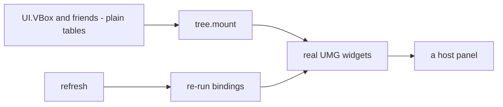
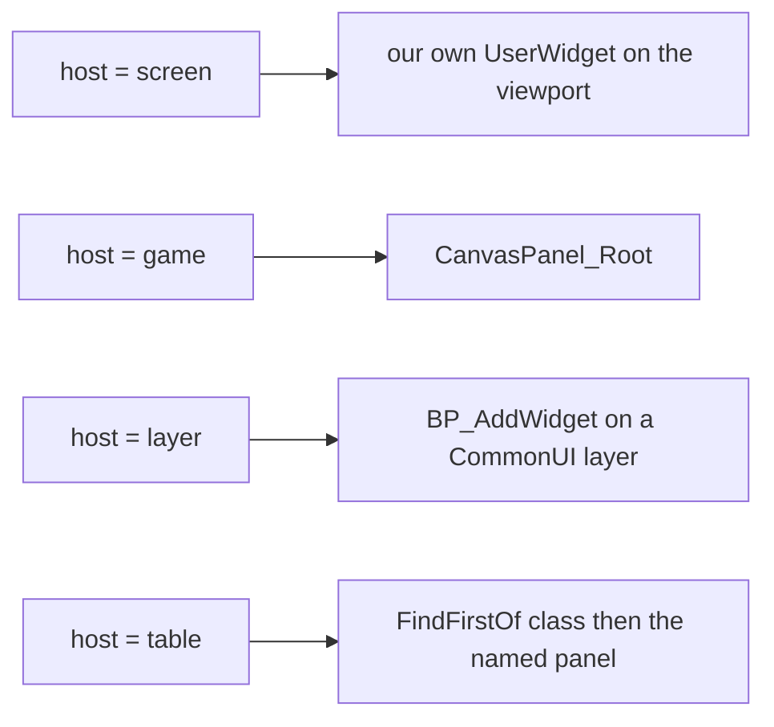
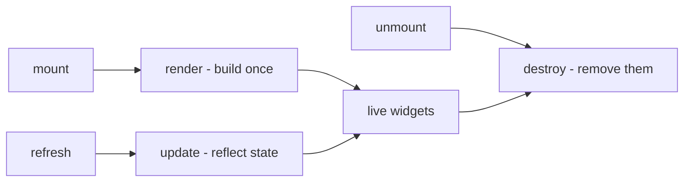
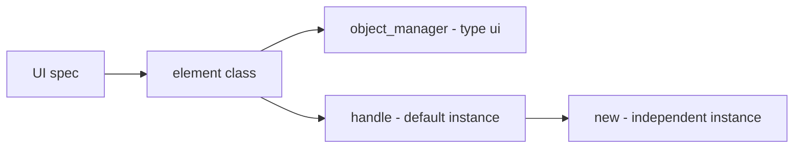
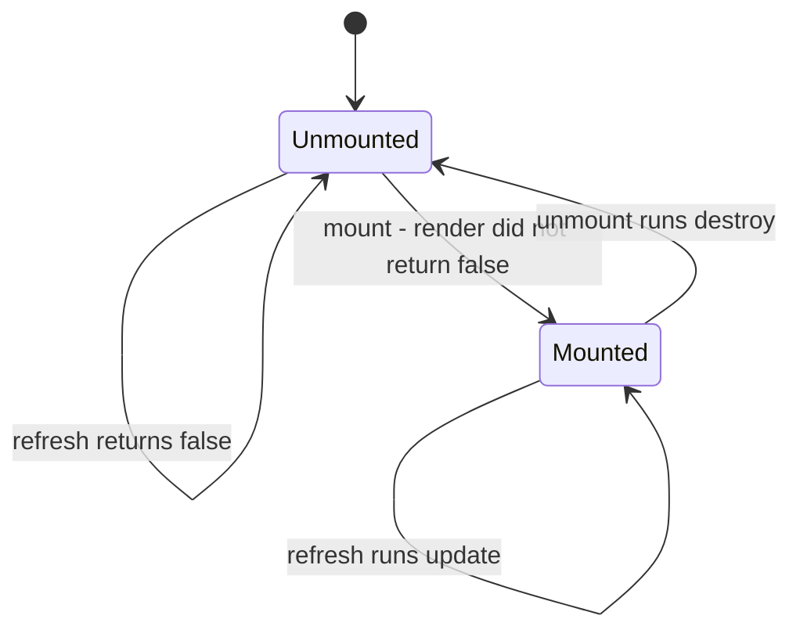
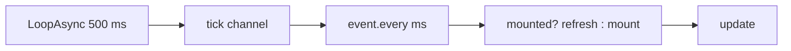
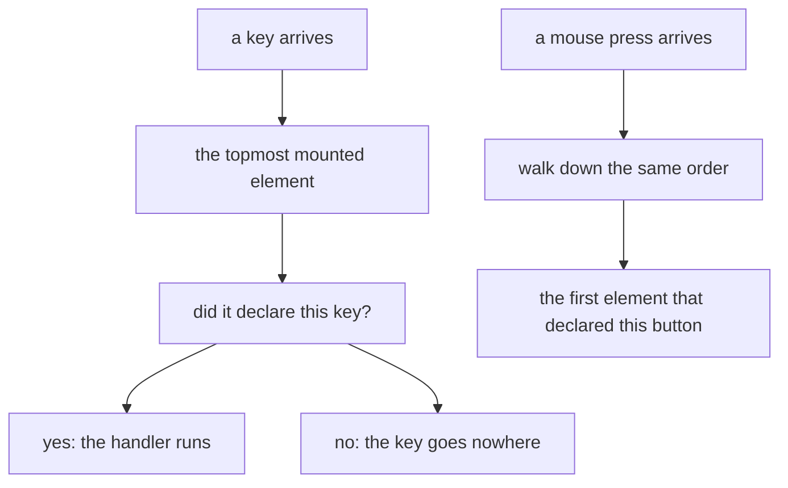
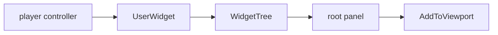

## このページでできるようになること

- パネルをノードのツリーとして宣言し、ファイル上の入れ子をそのまま画面上の入れ子にする
- ゲーム本体のゲーム内 UI、自前のビューポートレイヤー、あるいはゲームが既に描いている画面にマウントする
- 表示内容を最新に保ち、どれだけ古くなりうるかを正確に把握する
- Esc を壊さずに、マウスカーソルやゲーム本体のクリックモードを受け取る
- どのパネルが手前か、キー入力をどれが受け取るかを宣言する
- タイトル画面のメニューに自分の項目を追加し、あとで全部片付ける

## 最初のパネル

UI 要素とは、画面に描くもののことです。1 行のテキストでも、ボタンでも、パネル全体でも
かまいません。`UI{ ... }` で 1 つ宣言すると、Palworld 自身の画面 UI キットを使って
組み立てられます。

要素が何を組み立てるかの書き方は 2 通りあり、両立しません。`root` にツリーを宣言するか、
`render` 関数を書くかです。通常はツリーのほうを使います。

```lua title="content/ui/panel.lua"
local UI = require("palforge.api.ui")   -- or use the global UI installed by palforge.api
local VBox, Label, Button = UI.VBox, UI.Label, UI.Button

local Supplies = UI{
    id   = "example:Supplies",
    host = "game",                       -- the game's own in-game UI root canvas
    root = VBox{ padding = 12,
        Label{ text = "Supplies" },
        Label{ name = "count", text = function(self) return "Wood x" .. self.wood end },
        Button{ text = "Take one",
                onClick = function(self) self.wood = self.wood - 1 end },
    },
}

Supplies:new{ wood = 10 }:autoMount(nil, 2000)
```

もう一方の継ぎ目が `render` です。置き場所となるパネルと自由な手を渡してくれるので、
ゲーム本体のウィジェットツリーと交渉しなければならない要素にはこちらが要ります。

```lua
local Panel = UI{
    id          = "example:Panel",
    name        = "Example Panel",
    description = "One line of text.",

    render = function(self, root)
        -- build the widget tree under `root`; runs once per mount
        -- return false if you could not build: the element then stays unmounted
    end,

    update  = function(self) end,   -- reflect changed state into the widgets render built
    destroy = function(self) end,   -- remove them again
}
```

`root` と `render` を両方宣言すると、宣言時にハードエラーになります。この 2 つは 1 つの問いに
対する 2 つの答えであり、`render` はマウントごとにちょうど 1 回走るので、どちらを先にしても
誰かにとっては驚きになるからです。

別のファイルが宣言した要素を使いたいときは、id で引きます。

```lua
UI.get("palforge:Button")   -- a handle for an element defined elsewhere; never nil
UI.get_all()                -- every registered element, as a list of handles
```

## ツリーを宣言する

ノードのコンストラクタは宣言的なテーブルを受け取り、何もしないデータを返します。ツリーを
マウントするまでエンジン呼び出しは 1 つも起きません。だからこそ宣言済みのパネルは、ゲームを
起動しないまま構築・入れ子・検査ができます。



**子は位置で書きます。** テーブルの配列部分が子、名前付きの部分がフィールドです。他のコードが
生成したツリーのために `children = { ... }` も受け付けますが、両方書くのはマージではなく
ハードエラーです。

**関数を書けるフィールドは 2 つだけ**で、`text` と `visible` です。関数は**バインディング**です。
ツリーの構築時に要素インスタンスを引数として呼ばれ、`:refresh()` のたびに再評価され、値が
**変わったときだけ**書き戻されます。生きたパネルが実際に変えるのはその 2 つで、それ以外は
1 回だけ書かれます。だから何も変わっていないパネルに対する定期リフレッシュのコストは、
ノードごとのネイティブ呼び出しではなく比較になります。

**検証は呼び出し場所ごとに、内側から外側へ**走ります。だから文句を言われるのは、間違えた
ノード自身であって、それを含むパネルではありません。`Label{ tetx = "x" }` は「もしかして」
付きのエラーであって、何も言わないラベルにはなりません。

```lua title="content/ui/status.lua"
local UI = require("palforge.api.ui")
local Frame, Border, SizeBox, VBox, HBox = UI.Frame, UI.Border, UI.SizeBox, UI.VBox, UI.HBox
local Label, Button, Sprite = UI.Label, UI.Button, UI.Sprite

local Status = UI{
    id   = "example:Status",
    host = "game",
    data = { wood = 0, open = true },

    -- The game's own window chrome, a colour of our own inside it, a fixed size around that.
    root = Frame{
        Border{ color = { 0.10, 0.09, 0.08, 0.98 },
            SizeBox{ width = 420, height = 180,
                VBox{ padding = 12,
                    Label{ text = "Supplies", size = 20, native = true },
                    HBox{
                        Sprite{ icon = "Wood" },
                        Label{ name = "count",
                               text    = function(self) return "x" .. self.wood end,
                               visible = function(self) return self.open end },
                    },
                    Button{ text = "Close", onClick = function(self) self:unmount() end },
                },
            },
        },
    },
}
```

バインディングや `onClick` の中の `self` は要素の**インスタンス**、つまりマウントできる
オブジェクトそのものです。閉じるボタンは `self:unmount()` の 1 行で書け、兄弟のラベルの
表示を変えるボタンは `self` への代入 1 つで書けます。

`name = "..."` を宣言したノードは、あとから `handle:find("count")` で引けます。返るのは
生きたウィジェットで、ツリーの構築前と撤去後は nil です。これが宣言的ツリーから抜け出す
命令的な非常口で、そこから先は `render` を書いたときと同じ責任を負います。

## 11 個のノード

| コンストラクタ | 作るもの | 子 |
| --- | --- | --- |
| `UI.VBox` | `VerticalBox` | 何個でも |
| `UI.HBox` | `HorizontalBox` | 何個でも |
| `UI.Overlay` | `Overlay`。子を重ねて置く | 何個でも |
| `UI.ScrollBox` | `ScrollBox` | 何個でも |
| `UI.Border` | 自分で選んだ色の `Border` | ちょうど 1 個 |
| `UI.SizeBox` | 幅と高さを固定する `SizeBox` | ちょうど 1 個 |
| `UI.Frame` | ゲーム自身のウィンドウ枠 `WBP_PalCommonWindow_C` | ちょうど 1 個 |
| `UI.Label` | `TextBlock`、またはゲーム自身の `BP_PalTextBlock_C` | なし |
| `UI.Button` | ゲーム自身のボタン。クリックは `CommonButtonBase` 経由 | なし |
| `UI.Sprite` | テクスチャを入れた `UImage` | なし |
| `UI.GameWidget` | ゲームが同梱する任意の Blueprint ウィジェット（クラスパス指定） | なし |

持てる数より多く子を渡すと、その呼び出し場所でエラーになります。`UI.Label{ ... }` に子を
渡すと子を取れるノードの名前が並び、`UI.Border{ a, b }` は VBox か HBox に入れろと言います。

どのノードも、その種類固有のフィールドの後ろに次の 5 つを持ちます。5 つのうち 4 つは親側の
レイアウト情報です。UMG ではスロットは親パネルのものですが、「これは左に置く」は子についての
事実であり、子のリストは他にそれを書ける場所がないからです。

<TypeTable
  type={{
    name: {
      description: '構築されたウィジェットを、あとから handle:find("<name>") で引くための名前。',
      type: 'string',
    },
    visible: {
      description: 'バインド可能。false は COLLAPSED なので、レイアウト上の場所も取らなくなる。',
      type: 'boolean | fun(self): boolean',
    },
    hAlign: {
      description: '親スロット内の水平方向の寄せ: fill, left, center, right。',
      type: 'string',
    },
    vAlign: {
      description: '親スロット内の垂直方向の寄せ: fill, top, center, bottom。',
      type: 'string',
    },
    padding: {
      description: 'スロットの余白。4 辺共通の数値 1 つか、{ left =, top =, right =, bottom = }。',
      type: 'number | table',
    },
  }}
/>

寄せの指定は `core/signature` を通るので、それを宣言していないスロットクラスでは、例外を
投げる代わりに名指しの拒否がログに出ます。box・overlay・border・size のスロットはどれも
`SetHorizontalAlignment` を宣言していますが、`CanvasPanelSlot` は宣言していません。だから
`host = "game"` のツリーの直下の子に付けた `hAlign` は拒否され、そのスロットが実際に何を
宣言しているかが示されます。

種類ごとに知っておく価値のあるフィールドは次のとおりです。

| ノード | フィールド |
| --- | --- |
| `Border` | `color = { r, g, b, a }`（0..1）。省略すると PalForge 自身の暗いパネル色 |
| `SizeBox` | `width`、`height`（slate 単位）。`Sprite` の大きさはこれで決めます |
| `Frame` | 固有フィールドなし。`color` は**拒否**されます。Frame はゲームのウィンドウ画像をまとうので、ここからは色を付けられません |
| `Label` | `text`（バインド可）、`size`、`color`、`native` |
| `Button` | `text`（バインド可）、`onClick`、`labelAlign` |
| `Sprite` | `path` または `icon` + `from`、`matchSize`、`color`、`opacity` |
| `GameWidget` | `class`（必須）、`text` + `textChild`、`onClick` + `clickChild` |

そのうちいくつかは、好みではなく測定結果です。

- `Label{ native = true }` は `BP_PalTextBlock_C` を作ります。`UPalTextBlockBase` であり、
  Palworld のフォントスケーリング・UI 設定への連動・ローカライズがそこにあります。`color` は
  無視され（文字色はゲーム自身のテキストスタイルが決めます）、`size` は `UpdateFontSize` を
  通ります。このツリー全体で、構造体ではなく素の int を取る唯一のフォント呼び出しです。
  このクラスはワールド内には常駐しますがタイトル画面では保証されないので、ネイティブラベルが
  作れなければ通常のラベルにフォールバックし、その差し替えはログに残ります。
- `Sprite` に幅と高さはありません。これは手抜きではなく測定結果です。このビルドの `UImage` は
  `SetBrushSize` を宣言しておらず、ブラシの `ImageSize` は構造体書き込み、
  `SetDesiredSizeOverride` は `FVector2D` を取ります。なのでスプライトはテクスチャ自身の
  ピクセルサイズを取る（既定の `matchSize`）か、既に大きさを決めるノードに決めてもらいます。
  `SizeBox{ width = 48, height = 48, Sprite{ icon = "Wood", matchSize = false } }` です。
- `Sprite{ icon = "Wood" }` は `core/icons` を通じて、ゲーム自身のアイコン DataTable から
  id を引きます。カバー率は測定済みで、パル 674/674 行、アイテム 1183/1207 行、建築 567/571、
  パートナースキル 311/311 です。見つからない場合はほぼ id の綴り間違いで、id は大文字小文字を
  区別します。
- `GameWidget` の `text` は `textChild` なしでは何もせず、`onClick` は `clickChild` なしでは
  何もしません。このノードは内部構造を推測できないウィジェットを複製するので、どちらも
  名指しした子に届き、それ以外には届きません。

<Callout type="warn">
ゲームのメニューボタンのラベルは、スロット経由では左寄せにできません。プローブがボタン自身の
テンプレートツリーを読み、内側の `HorizontalBox_0` が `CanvasPanelSlot` に載っていると報告
しました。6 つのスロットクラスのうち `SetHorizontalAlignment` を宣言していない唯一のクラスです
（UMG.hpp:350-374）。だから `core/signature` は毎回その呼び出しを正しく拒否し、ラベルは中央
寄せのままです。`CanvasPanelSlot` が**宣言している**ほうの寄せ `SetAlignment` は `FVector2D` を
取り、構造体引数は `pcall` からは見えない UE4SS のマーシャリング内部で落ちる形です。それを
試していたヘルパーは、ボタンを組むたびに拒否をログに出し続けるくらいならと削除されました。

`Button{ labelAlign = "left" }` は同じ手段の再挑戦ではなく別の作り方です。`Overlay` が
ゲームのボタンを引き伸ばして持ち、その上に自前の `TextBlock` を `ESlateVisibility` の
HitTestInvisible で重ねるので、クリックはすべて下のボタンに素通りします。そして `OverlaySlot` は
寄せの呼び出しを宣言しています。オプトインである理由はその代償です。テキストは自前なので、
ボタンのフォント・ホバー状態・ローカライズを一切受け継ぎません。
</Callout>

## UI に渡すもの

必ず渡すフィールドは `id` だけです。要素を役に立つものにするのは `root` か `render` です。

<TypeTable
  type={{
    id: {
      description: '要素の id。例: "example:Panel"。id 解決が要求する形かどうかを宣言時に検証します。',
      type: 'string',
      required: true,
    },
    name: {
      description: '表示用のラベル。省略すると id。',
      type: 'string',
    },
    description: {
      description: 'UI とツール向けの 1 行説明。',
      type: 'string',
    },
    root: {
      description: '宣言されたウィジェットツリー。render とは併用できません。input・backHandler・host = "layer" が宣言できるかもこれが決めます。3 つとも root が UI.Frame であることを要求します。',
      type: 'UI.Node',
    },
    host: {
      description: 'mount() に root を渡さなかったときの置き場所: "screen"、"game"、"layer"、または { widget = <class>, panel = <member> }。明示的な root 付きの mount(root) が優先されます。',
      type: 'string | table',
    },
    render: {
      description: 'fun(self, root): boolean? — root の下にウィジェットツリーを構築する。マウントごとに 1 回だけ走る。何も構築できなかったときは false を返す。',
      type: 'function',
    },
    update: {
      description: 'fun(self) — 構築済みのウィジェットを更新する。refresh のたびに走る。',
      type: 'function',
    },
    destroy: {
      description: 'fun(self) — render が構築したウィジェットを取り除く。unmount のたびに走る。',
      type: 'function',
    },
    input: {
      description: 'マウント中にプレイヤーの入力をどれだけ受け取るか: "none"（既定）、"cursor"、"clicks"、"exclusive"。後ろの 2 つは UI.Frame の root を要求します。',
      type: 'string',
      default: '"none"',
    },
    backHandler: {
      description: 'この要素のウィンドウで CommonUI の BACK アクション（つまり Esc）を要求する。UI.Frame の root が必要。宣言され、同梱されていますが、動作が観測されたことは一度もありません。',
      type: 'boolean',
    },
    z: {
      description: '重なり順。大きいほど手前（既定 0）。描画順を決めるのはホスト自身に z があるときだけですが、イベントのルーティングは常にこれで決まります。',
      type: 'number',
      default: '0',
    },
    keys: {
      description: 'onKeyPressed が受け取りたいキー名。UE4SS の綴り（"INS"、"END"、"F4"、"NUM_ZERO"）。Palworld の生のキー設定が既に使っているキーは、その操作名を示してマウント時に拒否されます。',
      type: 'string[]',
    },
    overrideKeys: {
      description: 'Palworld のキー設定が使っていても、意図的に取りにいくキー。ルーティングは同じで、違いは PalForge が拒否しなくなることだけです。"ESCAPE" は依然として拒否されます。',
      type: 'string[]',
    },
    onKeyPressed: {
      description: 'fun(self, ctx) — keys のどれかが押された。ctx.key / ctx.z / ctx.id。最前面のマウント済み要素にだけ届きます。',
      type: 'function',
    },
    buttons: {
      description: 'onMousePressed が受け取りたいマウスボタン: "left"、"right"、"middle"。既定のインストールではどのボタンもゲームが使っているので、このリストは通常空です。',
      type: 'string[]',
    },
    overrideButtons: {
      description: '意図的に取りにいくマウスボタン。既定のインストールでは、マウスのルートが実際に成立する唯一のリストです。',
      type: 'string[]',
    },
    onMousePressed: {
      description: 'fun(self, ctx) — buttons のどれかが押された。ctx.button / ctx.z / ctx.id。それを宣言した最前面の要素に届き、そこで止まります。',
      type: 'function',
    },
    data: {
      description: 'この要素の全インスタンスが共有する既定フィールド。',
      type: 'table',
    },
  }}
/>

コピーごとに変わる値は、ここには**入れません**。`:new{ label = "OK", onClick = fn }` に渡し、
`render` / `update` / `destroy` やバインディングの中で `self.label` として読みます。全コピーで
共有したい既定値には `data` を使います。

同じフィールド一覧はゲーム内から表示できます。エディタの補完が読むのと同じ文字列から生成
されています。

```lua
local schema = require("palforge.core.schema")
print(schema.help("UI.Spec"))         -- every field, its type and meaning
schema.get("UI.Spec").fields          -- the same as a table, for tooling
print(schema.help("UI.Node.Label"))   -- and one per node kind
```

`UI` は、PalForge のどのドメインコンストラクタとも同じく、省略可能な第 2 引数を取ります。

```lua
UI(spec, { register = false })   -- build the class, hand it back, register nothing
UI(spec, { pack = "mypack" })    -- register under that pack id

-- the same call with the pack filled in for you
local UI = PalForge.pack("mypack").UI
```

`register = false` はカタログのアクセサに必要なものです。ハンドルをその場で作る**読み取り**が、
まだ宣言していないパックから id を奪ってはいけないからです。`pack` は id の衝突を追跡可能に
します。登録は後勝ちのままですが、警告が以前の持ち主と今の持ち主を名指しするので、要素が黙って
消えることがなくなります。

id 自体は**宣言時**に、id 解決が要求する形かどうか検査されます。コロンの前後が英数字と
アンダースコア以外の id は、どのエンジン境界でも何にも解決しません。つまり登録され、
`UI.get_all()` では健全に見えたまま、黙って死んでいることになります。

```text
PalForge: UI "my-pack:Panel": invalid pack id 'my-pack' in 'my-pack:Panel' (letters/digits/_ only)
```

## どこにマウントするか: host

`mount(root)` は今でも明示的な root を取り、`host` より優先されます。どちらも無い要素は
どこにもマウントされず、そのことを言います。`:lastError()` が、最後の試行が諦めた理由を
持っています。

| `host` | 置かれる場所 |
| --- | --- |
| `"screen"` | 自前のビューポートレイヤー。`AddToViewport` の 1000 + 宣言した `z` で重なります |
| `"game"` | ゲーム自身のゲーム内 UI ルートキャンバス。`WBP_PalOverallUILayout` の中の `CanvasPanel_Root` で、`UCanvasPanel` なので本物の ZOrder を持つ唯一のホストです |
| `"layer"` | ゲーム本体のルート。`BP_AddWidget` で CommonUI のレイヤーに積むので、アクティベーション・フォーカス・入力モードはアクションルーターのものになります |
| `{ widget = "PalUITitleBase", panel = "VerticalBox_0" }` | 生きている任意のウィジェットクラスと、その中のパネル。パックがゲームの描く画面を拡張する方法です |



```lua
UI{ id = "pack:Hud",   host = "screen", root = ... }
UI{ id = "pack:Panel", host = "game",   root = ... }
UI{ id = "pack:Extra", host = { widget = "PalUITitleBase", panel = "VerticalBox_0" },
    root = ... }
```

テーブル形式のホストでは、ブループリントクラスではなく**ネイティブの基底クラス**を書きます。
検索はサブクラスにも一致するので、`"PalPrimaryGameLayoutBase"` はブループリントの改称に
耐えますが、`"WBP_PalOverallUILayout_C"` は耐えません。パネルはまず宣言されたメンバーとして
読まれ、次に名前で探されます。デザイナーの "Is Variable" が外れたウィジェットにはメンバーが
無く、それでもウィジェットツリーには存在するからです。

ホストがまだ立ち上がっていないのは失敗ではありません。パックのファイルが読み込まれる時点では
タイトル画面も、ゲーム内レイアウトも、多くの場合プレイヤーコントローラーも存在しないので、
`mount()` は false を返して要素は降りたままになります。`:autoMount(nil, ms)` がまさにその
ためのリトライループです。

`"screen"` ホストは、暗転も内側の枠も無しで作られます。作者が宣言していない枠は組み立てでは
ないからです。枠が欲しい宣言的ツリーは、それを自分で書きます。

<Callout type="warn">
`host = "layer"` は宣言され、同梱されていますが、**動作が観測されたことは一度もありません**。
根拠はすべてこのインストールのダンプから読めます。`UPrimaryGameLayout` は CommonUI のレイヤーを
`TMap<FGameplayTag, UCommonActivatableWidgetContainerBase*>` に登録し、`BP_AddWidget` は
ウィジェットの生成・スタック・アクティベート・トランジション・登録をゲームにやらせます。
しかし、こちらのウィジェットに対して `BP_AddWidget` が応答したところを見た実行は 1 度も
ありません。レイヤーに載せられるのは Palworld のアクティベータブルだけなので `UI.Frame` の
root を**要求**し、それはマウント時ではなく宣言時に拒否されます。宣言しても載れなかった要素は
理由付きでマウントされないままになり、それを `:autoMount` がリトライします。

決着をつける実行が `pf_hook ui-host-layer` で、`pf_uiz` の LAYER パネルがそこでマウントされる
ものです。それが報告するまでは、これを宣言するパネルにも別の出し方を用意しておく必要があります。
</Callout>

**観測できているもの**もあります。2026-07-27 に `pf_uidecl` が宣言済みツリーを
`PalPrimaryGameLayoutBase.CanvasPanel_Root` に `CanvasPanelSlot` でマウントし、パネルが画面に
見えました。それが `host = "game"` を支える証拠です。

## render と update と destroy



`render(self, root)` は、あなたのウィジェットを `root` の下に組み立てます。要素が画面に出る
たびに `mount()` が 1 回だけ呼びます。何も組み立てられなかったとき、たとえば必要なパネルが
まだ存在しなかったときは `false` を返します。要素は画面に出ないままになり、あとでもう一度
マウントすればやり直しになります。`nil` を返すのは成功扱いなので、必ず成功する render は
何も返さなくてかまいません。

`update(self)` は `render` が既に作ったウィジェットに新しい値を書きます。呼ぶのは `refresh()` です。

`destroy(self)` は `render` が作ったウィジェットを取り除きます。呼ぶのは `unmount()` で、
要素が画面に出ているときだけです。

**宣言的ツリーは 3 つとも自分で埋めます**。そのうち 2 つはあなたの実装と合成されます。
リフレッシュ時はツリーのバインディングが先、あなたの `update` が後なので、バインディングが
書いた値を上書きできます。撤去時はあなたの `destroy` が先、ツリーの解体が後なので、まだ
ウィジェットに触れます。

自分で「もう render したか」を覚えておく必要はありません。`mount` がやりますし、それ以上の
ことをします。

```lua
-- Class:mount in api/ui.lua, abridged
function Class:mount(root)
    if self._mounted then return false end
    if root == nil and self.hostSpec ~= nil then
        -- resolve the declared host; a host that is not up yet is a refusal, not a raise
        local host, reason = tree.host(self.hostSpec, { z = self.zOrder })
        if not host then return refuse(self, reason) end
        self._host, root = host, host.panel
    end
    self._root = root
    if self:render(root) == false then
        self._root = nil
        self:releaseInput()          -- a mount that could not build leaves no cursor behind
        self:releaseHost()           -- and no viewport layer of ours behind either
        return false
    end
    self._mounted = true
    stackPush(self)                  -- in the routing list BEFORE anything that can fail
    self:applyZ()
    self:armInput()
    self:grabInput()
    return true
end
```

3 つの継ぎ目は書くまで何もしないので、要素を宣言だけにすることもできます。他の mod が
`UI.get` で見つけられるように id だけ用意しておきたいときに便利です。

```lua
-- valid: registers "example:Marker" with no behaviour at all
UI{ id = "example:Marker", description = "Reserved id, nothing rendered." }
```

仕事は名前どおりに分けます。ウィジェットを作るものは全部 `render` に置いて `self` に持たせ、
既にあるウィジェットに新しい値を書くものは全部 `update`、ウィジェットを取り外すものは全部
`destroy` です。

```lua
local widget = require("palforge.native.ui._widget")

local Label = UI{
    id   = "example:Label",
    data = { text = "" },

    render = function(self, screen)
        if not (screen and widget.alive(screen.root)) then return false end
        local ok = pcall(function()
            self.textWidget = widget.text(screen.tree, tostring(self.text), 18)
            widget.addChild(screen.root, self.textWidget)
        end)
        if not ok then self:destroy(); return false end
        return true
    end,

    update = function(self)
        if not widget.alive(self.textWidget) then return false end
        local t = self.textWidget
        return pcall(function() t:SetText(FText(tostring(self.text))) end)
    end,

    destroy = function(self)
        local t = self.textWidget
        self.textWidget = nil
        if not widget.alive(t) then return false end
        return pcall(function() t:RemoveFromParent() end)
    end,
}
```

<Callout type="info">
`mount()` が要素を「画面に出ている」と印を付ける根拠は、`render` が走ったという事実ではなく
`render` が**返した値**です。`false` が返ると要素は画面に出ないままで、渡した root も忘れられる
ので、あとで `mount()` を呼べば単にやり直しになります。試行のたびに自分でゲームの状態を
調べる必要はありません。
</Callout>

## 1 つの要素から複数のコピーを作る



`UI{ ... }` は要素を id で登録し、**ハンドル**を返します。`:mount` / `:refresh` / `:unmount` を
呼ぶ相手がそれです。ハンドルは既にコピーを 1 つ持っているので、`UI{ ... }` が返したものは
そのままマウントできます。`:new(props)` は独自の状態を持つ別のコピーをくれます。

```lua
local Badge = UI{
    id     = "example:Badge",
    data   = { label = "Badge", size = 18 },
    render = function(self, root) end,
}

local a = Badge:new{}                  -- a:state().label == "Badge"  (from data)
local b = Badge:new{ label = "Boss" }  -- b:state().label == "Boss", b:state().size == 18
```

`:new` が返すのはハンドルであって状態そのものではありません。状態は `:state()` の向こうに
あり、ハンドル上の `a.label` は nil です。その状態テーブルが `render` / `update` / `destroy` と
すべてのバインディングの中の `self` で、名前は次の順で解決されます。

1. `:new{ ... }` に渡したフィールドと、継ぎ目や `onClick` が `self` に代入したもの
2. 要素の `data` の既定値。宣言時にクラスへコピーされます
3. ライフサイクルのメソッドと 3 つの継ぎ目

バインディングの中で `self.label = "x"` と書くと、そのコピーだけにフィールドが立ちます。
共有される `data` の既定値はそのままです。

外からは `:state()` でコピーの状態を読み書きします。

```lua
local st = a:state()
st.label = "Ready"
a:refresh()             -- nothing does this for you
```

<Callout type="info">
状態の名前は要素自身を通して解決されるので、次の名前は既に使われています。`id`、`name`、
`description`、`render`、`update`、`destroy`、`mount`、`refresh`、`unmount`、`isMounted`、
`find`、`hostSpec`、`inputMode`、`backHandler`、`zOrder`、`rootNode`、`keyList`、`keySet`、
`overrideList`、`buttonList`、`buttonSet`、`overrideButtonList`、`onKeyPressed`、
`onMousePressed`、そしてアンダースコアで始まるフィールドすべて（`_mounted`、`_root`、
`_tree`、`_host`、`_input`、`_refreshSub`、`_stackSeq`）。
</Callout>

`UI.get(id)` は呼ぶたびに**新しい**ハンドルと**新しい**空のコピーを作るので、`UI.get` を
2 回呼べば、独立して画面に出せるパネルが 2 つ手に入ります。

```lua
local one = UI.get("palforge:Button")
local two = UI.get("palforge:Button")   -- a different instance of the same element
```

誰も宣言していない id に対しても `UI.get` は nil ではなくハンドルを返し、その代役は
ライフサイクル一式を持っています。`:mount()`、`:refresh()`、`:unmount()`、`:isMounted()` は
どれも解決して静かに何もしません。3 つの継ぎ目の既定が何もしないからです。代役に対する
`mount()` は成功を報告し、ウィジェットは何も作りません。要素を引くのは、それを宣言する
ものが読み込まれた後にしてください。順序を決めるのは `core/registry` です。

## 表示する・更新する・片付ける



```lua
local panel = Panel:new{ title = "Status" }

panel:mount(root)      -- true: render did not report a failure
panel:mount(root)      -- false: already mounted, render is NOT run again
panel:isMounted()      -- true
panel:refresh()        -- true: update() ran
panel:unmount()        -- destroy() runs, then everything the mount took is given back
panel:refresh()        -- false: not mounted, update() does not run
panel:mount(root)      -- true: renders again from scratch
panel:lastError()      -- nil after a success; the reason after a failure
```

`mount()` が `false` を返す状況は 2 つあります。既に画面に出ているか、`render` が `false` を
返したかです。どちらもエラーではなく、パネルが半分だけ残ることもありません。

`refresh()` は要素が画面に出るまで何もせず `false` を返すので、要素より長生きする購読から
呼んでも安全です。

`unmount()` はまず**ルーティングのリストから要素を外します**。失敗しうる処理より先です。
降りていく要素は、たとえその `destroy()` が例外を投げても、下のパネルにキーが届かない理由で
あり続けてはいけないからです。そのあと `destroy()` を `pcall` の中で走らせ、マウント済みの
フラグと保存した root を消し、プレイヤーの入力を返し、自分が作ったホストを返し、
`autoRefresh` や `autoMount` の購読を解除します。

<Callout type="warn">
`unmount()` が呼ぶのは、あなたが書いた `destroy` だけです。既定の `destroy` は何もしません。
`render` で `self` にウィジェットを持たせておきながら `destroy` を書かない要素はそれを漏らします。
フラグは下りるので、あとの `mount()` が 2 つ目のコピーを作り、1 つ目は画面に残ります。
宣言された `root` にはこの穴がありません。ツリー自身の解体があなたの代わりに組み込まれます。
</Callout>

## 表示を最新に保つ

<Callout type="warn">
ポーリングは 2 択の片方ではありません。PalForge にあるリフレッシュの駆動手段はそれだけです。
パックのために `refresh()` を呼んでくれるものは何もないので、どの要素も、自分の状態が変わった
ときに自分で `:refresh()` を呼ぶか、500 ms の心拍に乗るかのどちらかです。ゲームが画面を
組み直したちょうどその瞬間にリフレッシュする方法はありません。見つけてもらう前に言っておく
価値のある帰結が 3 つあります。

- パネルは**最大 `ms` ミリ秒だけ古い内容を表示します**。プレイヤーがたった今変えた数を読む
  バインディングはその分だけ遅れ、`ms` を短くするのが唯一のてこです。
- `TitleMenu` の再注入戦略全体が、同じ理由でポーリングです。タイトル画面はウィジェットツリーを
  組み直して私たちのボタンごと持っていきますが、それを教えてくれるものは何も無いので、
  `update()` が同じ拍で全項目を確認し直します。
- 何も変わっていないパネルに対する 1 拍は意図的に安上がりです。バインディングは比較し、
  変わったものだけ書き戻すので、`ms` を短くしてもコストはネイティブ呼び出しではなく比較です。
</Callout>

方法その 1 — 変化が起きた場所でリフレッシュする。正確で、何も変わらない間はコストゼロです。

```lua
local event = require("palforge.core.event")

event.on("item.obtain", function(ctx)
    if ctx.itemId ~= "Wood" then return end
    local st = panel:state()
    st.wood = (st.wood or 0) + (ctx.count or 1)
    panel:refresh()
end)
```

方法その 2 — ポーリングする。どちらのポーラーも `event.every` に乗り、`event.TICK_MS`
（500 ms）の心拍を丸ごと数えるので、実際の周期は 500 の倍数に切り上がります。

```lua
panel:mount(root)
panel:autoRefresh()        -- refresh every 500 ms
panel:autoRefresh(2000)    -- no-op: a subscription is already installed, returns true

-- the whole lifecycle instead: retry mount() while it is down, refresh it once it is up
panel:autoMount(nil, 2000)
```



`:autoRefresh(ms)` は要素がマウントされていない間は何もしません。`refresh()` がそうだからです。
そのための `:autoMount(root, ms)` で、購読は同じ 1 つですが、要素が降りている間は
`mount(root)` を再試行し、上がったらリフレッシュします。**生きている PalForge の UI は
すべてこのマウント経路を通ります**。そして失敗し続けるリトライは無言ではありません。
`mount()` は理由をインスタンスに記録し、**異なる理由ごとに** 1 回だけログに出すので、
`:lastError()` はいつでも「なぜパネルが出ないのか」に答え、ログは 1 拍 1 行で埋まりません。

押さえておくべき点。

- `autoRefresh` の既定は 500 ms、`autoMount` の既定は 2000 です。リトライループはリフレッシュ
  より遅い拍を求めるからです。
- 2 つは購読の枠を 1 つ共有します。走っている最中の 2 回目の呼び出しは、もう 1 つ入れずに
  `true` を返します。周期を変えたいときはまず `unmount()` します。
- `unmount()` が解除するので、`autoMount` のリトライを止める方法でもあります。
- 購読を入れられなかったときはどちらも `false` を返します。呼び出し全体が保護されています。
- どちらもそのハンドルの後ろにある 1 つのコピーだけを駆動します。別のコピーには別の呼び出しが
  要ります。

<Callout type="info">
Palworld が UI の再構築時に捕捉可能な UFunction を投げるかどうかは**未測定**で、それが判れば
ポーリングを置き換えられます。ダンプは候補を 4 つ挙げています。Palworld のあらゆる画面が
派生する基底クラスの `PalUserWidget:OnSetup` と `:OnClosed`、`PalUIHUDLayoutBase:AddHUD`、
そして `CommonActivatableWidget:ActivateWidget` です。5 つ目の候補 `UPalUIManagerSubsystem` は
関数を 1 つも宣言していないので除外されました。

どれかをフックする前に測るべきことが 2 つ残っています。BlueprintImplementableEvent として
読める 3 つは、実装したブループリントが同名の**独自の** UFunction を得るので、基底へのフックが
何も捕まえない可能性があること。そして、ワールドロードの嵐の最中に張ったフックが共有ディスパッチを
詰まらせた前例があることです。`pf_hook ui-update-event` が両方に決着をつける実行です。
</Callout>

## 入力: パネルがプレイヤーから受け取るもの

ウィジェットを描くことと、それをクリックできることは別の問題です。ゲームがマウスキャプチャを
握っている間 — つまり通常のプレイ中 — Slate にポインタは渡されないので、ヒットテストも
z 順も可視性も関係なく、どの mod のどのボタンも反応しません。それを手で直すのが Esc です。
ゲーム自身のメニューが入力モードを切り替え、カーソルを表示します。

| `input` | 受け取るもの |
| --- | --- |
| `"none"` | **既定。** 何も受け取りません。ゲームが既にマウスを手放しているとき、つまりメニューが開いているときだけクリックできます。HUD の表示はこれで十分です。 |
| `"cursor"` | マウスカーソルだけ。`bShowMouseCursor` は素直に読めるプロパティなので、見つけたとおりに正確に戻せます。 |
| `"clicks"` | ゲーム自身の GameAndMenu モード。プレイヤーが移動と視点操作を続けたまま、クリックがウィジェットに届きます。 |
| `"exclusive"` | ゲーム自身の Menu モード。モーダルで、インベントリ画面が宣言しているものです。ゲーム側の入力は止まります。 |

後ろの 2 つは**ゲームがそれを持たせている場所**に持たされます。そしてそれは宣言から見える
帰結を伴います。要素の root が `UI.Frame{ }` である必要があるのです。この語彙の中で Palworld の
アクティベータブルなのは `WBP_PalCommonWindow_C` だけだからです。root 無しでどちらかを宣言
すると、宣言時に拒否されます。

```lua
local UI = require("palforge.api.ui")
local Frame, VBox, Label, Button = UI.Frame, UI.VBox, UI.Label, UI.Button

UI{
    id    = "example:Dialog",
    host  = "game",
    z     = 100,
    input = "clicks",             -- needs the Frame below; refused at define time without it
    root  = Frame{
        VBox{ padding = 16,
            Label{ text = "Pick one", native = true },
            Button{ text = "Close", onClick = function(self) self:unmount() end },
        },
    },
}
```

Palworld のあらゆる画面は `UPalActivatableWidget` であり、欲しいモードを自分の上の 2 バイト
（`InputConfig`、`GameMouseCaptureMode`）として**宣言**します。CommonUI のアクションルーターが
最前面のアクティベータブルの宣言を読んで適用し、そのウィジェットが非アクティブになったときに
以前のものへ戻します。PalForge はその 2 バイトを、アクティベート前 — ルーターがそれを読む
唯一の瞬間 — にフレームへ書き込みます。そしてアンマウントは、何かを強制するのではなく
**ルーター経由で**モードを返します。

<Callout type="warn">
PalForge はプレイヤーコントローラーに対して `SetInputMode` を呼びません。これは好みの問題では
ありません。2 回の実機実行がそれを呼び、どちらも Esc を壊しました。1 回目はゲームのメニューが
閉じなくなり、2 回目はそもそも開かなくなりました。モードを手で書くと、ルーターはもう真実でない
入力状態を説明し続けることになります。そして Esc はこのビルドではキーではありません。同じ
ルーターが同じアクティベータブルのスタックに対して解決する UI **アクション**です。

その下にはまだ床があります。入力の獲得はすべて `_G` に登録され、`core/poll` の心拍で掃かれる
ので、もう誰も責任を持てないもの — 要素が消えた、`destroy` が例外を投げた、ホットリロードが
Lua の状態ごと持っていった — は自分で解放されます。尋ねる相手のいない獲得は 120 秒で上限です。
</Callout>

<Callout type="warn">
`"clicks"` も `"exclusive"` も**動作が観測されたことはありません**。こちらのウィジェットから
アクションルーターが宣言を読んだところを見た実行はありません。root がアクティベータブルで
ないときに得られるのはカーソルと、ウィジェット側の書き込みが起きなかったという注記です。
だから実行結果から「ゲームのルートを通った」と「このパネルはアクティベータブルではなく何も
得られなかった」を区別できます。

`backHandler = true` も同じです。アクティベート前に要素のウィンドウへ `bIsBackHandler` を
立て、Palworld の画面が「Esc は私を閉じる」と言うのと同じ仕組みで、`BP_OnHandleBackAction` に
応えます。`UI.Frame` の root を要求し、無ければ宣言時に拒否され、そして**宣言され、同梱され、
動作が観測されたことは一度もありません**。答えを記録する実行が `pf_hook ui-backhandler` です。
それが報告するまで、これを宣言するパネルにも別の降り方を用意しておく必要があります。
</Callout>

## 重なり順とイベントのルーティング

パネルが同時に 2 枚出ているのは普通のこと — HUD 表示とその上のダイアログ — で、順序が
宣言されていなければ、ローダーがたまたま先に読んだパックのファイルが決めることになります。
`z` がその順序で、既定は 0、大きいほど手前です。

```lua
UI{ id = "pack:Hud",    host = "game", z = 0,   root = ... }
UI{ id = "pack:Dialog", host = "game", z = 100, root = ... }
```

これは 2 つの別々のことを決めます。どちらがどちらかは正確に述べる価値があります。

**描画**はエンジンのもので、エンジンに z がある場所だけです。ゲームのキャンバスに置いた
ツリーはそれを得ます。`ZOrder` と `SetZOrder` を宣言している唯一のスロットクラスが
`UCanvasPanelSlot` だからです。タイトル画面の `VerticalBox` に注入したツリーは得られません。
box は子の順で重なり、z を持たないからです。そしてそれはインスタンスごとに 1 回だけ報告され、
握り潰されもマウントごとに繰り返されもしません。`"screen"` ホストは代わりに `AddToViewport` で
重なり、1000 + 宣言した `z` になります。

**ルーティング**は `api/ui` 自身のもので、ホストの有無にかかわらずどこでも正確です。
マウント済みの要素は (z, 次にマウント順) で保持され、イベントはその順を歩きます。



- `onKeyPressed` は**最前面のマウント済み要素にだけ**届きます。上に何かが出ている間は、
  たとえその上のものがキーを一切欲しがっていなくても、下のパネルにキーは来ません。これが
  モーダルとしての読み方で、意図的です。最前面のパネルこそプレイヤーが見ているものだからです。
- `onMousePressed` はそれを**欲しがっている**最前面の要素に届き、そこで止まります。
  `onMousePressed` を宣言していない要素は、押下を遮るのではなく素通しします。
- `z` が同じ場合は、より後にマウントされたものが先です。これは UMG がキャンバスでやっている
  ことそのもので、ZOrder が同じ子は追加された順に描かれます。
- **どちらも何も消費しません。** UE4SS のキーバインドは観測するだけで、飲み込みません。
  ゲームはこれらの押下をすべて受け取ります。「そこで止まる」とは PalForge のリストを下るのを
  止めるという意味で、それ以上ではありません。

どのキーとどのボタンかは宣言しなければなりません。これは官僚主義ではありません。押下は
UE4SS の `RegisterKeyBind` で読まれ、それは**名前を 1 つ**バインドします。「全部のキーをくれ」
という形は存在しません。宣言の片方だけは宣言時にエラーです。`keys` の無い `onKeyPressed` は
何にも配線できませんし、`onKeyPressed` の無い `keys` はプレイヤーのキーをセッション中ずっと
バインドして、どこにも配線しないことになります。

```lua
UI{ id = "pack:Dialog", host = "game", z = 100,
    keys            = { "INS" },
    onKeyPressed    = function(self, ctx) self:unmount() end,
    overrideButtons = { "middle" },
    onMousePressed  = function(self, ctx) log.info("middle at z " .. ctx.z) end,
    root            = ... }
```

**キーが空いているかどうかは、仮定せずに尋ねます。** `core/keyboard` は動いているゲームから
Palworld 自身のキー設定 — オプション画面が編集しているまさにその構造体 — を読み、キーごとに
答えます。だからプレイヤー自身の割り当てと衝突する `keys = { "F7" }` は、無言のまま武装する
のではなく、衝突する操作名を示して**マウント時に**拒否されます。それが F7 の代償でした。
バインドは成功し、それはゲームの音量操作で、キーは一度も届きませんでした。

<Callout type="warn">
オーバーライドが買えるのはちょうど 1 つ、PalForge が拒否しなくなることだけです。ゲーム自身の
操作は依然として発火し、プレイヤーのキー設定は書き換えられず、UE4SS より下でゲームが取っている
押下を届かせることもできません。キーを共有するとは両方起きるということで、それでも何も
得られない可能性があります。

既定のインストールでは**マウスの 3 ボタンすべてをゲームが使っている**ので（中ボタンは
DirectAttackOrder）、`buttons` だけでは武装時に拒否され、マウスのルートが実際に成立する唯一の
リストが `overrideButtons` です。そして中クリックはパルへの攻撃指示も同時に出します。
`"ESCAPE"` はオーバーライドの有無にかかわらず名指しで拒否されます。Esc はアクティベータブルの
スタックに対して名前付き UI アクションとして解決されるので、キーバインドは観測しかできず、
その経路に参加できないからです。

解除は決してできません。UE4SS にキーバインドの解除はないので、キーはセッション中に多くとも
1 回だけ武装され、アンマウントした要素が受け取らなくなるのは**ルーター**がそれを選ばなくなる
からであって、バインドが消えたからではありません。
</Callout>

`onMousePressed` は z でルーティングされるグローバルな押下通知です。UE4SS はカーソルの下に
何があったかを教えられませんし、ここで押下が消費されることもありません。画面上の何かを
クリックするのは `Button{ onClick = ... }` で、そちらはゲーム自身の `CommonButtonBase` を通り、
どのウィジェットが当たったかを本当に知っています。この 2 つは別のイベントで、互いの代わりには
なりません。

このルールは説明されるだけでなく公開されています。誰にも検査できないルールは噂だからです。

```lua
UI.stack()          -- every MOUNTED element in routing order, one row each
UI.routeKey("INS")  -- who would get INS right now, plus the sentence that says why
UI.routeMouse("middle")
UI.report()         -- printable lines: the stack, the key binds, the grabs, the keymap
```

`UI.routeKey` と `UI.routeMouse` はゲームに押下を合成しません。押下が投げるはずの問いに
答えるだけです。それがキーボード無しでヘッドレスのテストがこのルールを証明する方法であり、
プローブが「今 INS が来たら誰が受け取るか」を尋ねる方法です。

```text
1  pack:Dialog  z=100  seq=2  keys=INS  buttons=middle
2  pack:Hud     z=0    seq=1  keys=INS  buttons=

UI.routeKey("INS")   -> "pack:Dialog", 'key "INS" -> pack:Dialog (z=100)'
UI.routeMouse("mid") -> nil, 'mouse "mid" reached none of the 2 mounted element(s) ...'
```

`UI.report()` は 4 つの別々の問いに答える 4 つの情報源を突き合わせます。スタックは押下を
**誰が**受け取るか、キーバインドは押下がそもそも**届き得るか**、獲得リストはプレイヤーから
今も取り上げているもの、そしてキーマップは Palworld が各キーに何を持っているか — 測定した
ビルドでは 107 行 — です。到着回数 0 のキーは、肩をすくめる代わりに前の 2 つに照らして
原因が推定されます。

## 呼び出せるものすべて

`UI{ ... }`、`UI.get(id)`、`:new(props)` はどれも `UI.Handle` を返します。そのメンバーは
次のとおりです。

| メンバー | 返り値 | 何をするか |
| --- | --- | --- |
| `.id` | `string` | 要素の id |
| `:new(props)` | `UI.Handle` | 独立してマウントできる新しいコピー。`props` がその状態になります |
| `:mount(root)` | `boolean` | `root` の下で 1 回 render。`root` が nil なら宣言した `host` の下で |
| `:refresh()` | `boolean` | ツリーのバインディングと `update()` を走らせる。マウント前は `false` |
| `:unmount()` | — | ルーティングのリストから外し、`destroy()` を走らせ、入力とホストを返し、ポーラーを解除 |
| `:isMounted()` | `boolean` | render が成功を報告し、まだ unmount していないか |
| `:find(name)` | `userdata?` | `name = "..."` を宣言したノードの生きたウィジェット。マウント前は nil |
| `:lastError()` | `string?` | 直近のマウント試行が諦めた理由（1 文） |
| `:autoRefresh(ms)` | `boolean` | 心拍に乗せて `refresh()` をポーリング。`ms` の既定は 500 |
| `:autoMount(root, ms)` | `boolean` | ライフサイクル全体をポーリング。降りていれば `mount` を再試行、上がっていればリフレッシュ。`ms` の既定は 2000 |
| `:state()` | `table` | インスタンスそのもの。継ぎ目とバインディングの中の `self` |
| `:name()` | `string` | 要素の `name`、無ければ id |
| `:description()` | `string?` | 要素の `description` |

モジュール自体には次のものがあります。

| メンバー | 返り値 | 何をするか |
| --- | --- | --- |
| `UI(spec, opts)` | `UI.Handle` | 要素を宣言する。`opts` は `{ register = false, pack = "id" }` |
| `UI.get(id)` | `UI.Handle` | 既存の要素、無ければ何もしない代役。nil にはなりません |
| `UI.get_all()` | `UI.Handle[]` | 登録済みの全要素 |
| `UI.VBox` … `UI.GameWidget` | `UI.Node` | 11 個のノードコンストラクタ |
| `UI.stack()` | `table[]` | マウント済みの全要素をルーティング順で |
| `UI.routeKey(name)` | `string?, string` | そのキーを誰が受け取るか、そしてなぜか |
| `UI.routeMouse(button)` | `string?, string` | マウスボタンについて同じこと |
| `UI.report()` | `string[]` | スタック、キーバインド、未解放の獲得、生のキーマップ |
| `UI.Class` | `table` | すべての要素が継承する基底クラス |

## 自前のスクリーンを作る

ウィジェットには置き場所が要ります。宣言的ツリーは `host` から自分でホストを見つけ、命令的な
`render` にはホストが渡されます。どちらも `native/ui/_widget.lua` で組み立てられます。
出来合いの要素が使っている工具箱です。



工具箱のヘルパーはどれも `WidgetTree` — Unreal が画面のウィジェットを入れておく容器 — を
必要としますが、素の `UUserWidget` はそれを持ちません。通常はコンパイル済みの Blueprint から
エンジンが作るからです。`widget.screen()` はそのツリーを自分で作って取り付けます。だから
コンパイルするものが何も無いまま、Lua だけで UI を作れます。

```lua
local widget = require("palforge.native.ui._widget")

local screen, why = widget.screen()
if not screen then
    print("no screen: " .. tostring(why))
end

-- when it built:
--   screen.widget  the UUserWidget now on the viewport
--   screen.tree    the WidgetTree every primitive constructs into
--   screen.root    the VerticalBox your widgets go under
--   screen.pc      the controller that owns it; the clickable helpers need it
```

`widget.screen(pc, opts)` は例外を投げません。screen テーブルを返すか、`nil` と理由の文字列を
返します。持ち主がいない、UMG のクラスが無い、`AddToViewport` が通らなかった、のいずれかです。
`pc` の既定は `widget.owner()` — `PalPlayerController`、無ければ任意の `PlayerController`、
無ければ `GameInstance`、ゲームが無ければ `nil` — です。

<TypeTable
  type={{
    zOrder: {
      description: 'AddToViewport に渡すビューポートの z 順。',
      type: 'number',
      default: '1000',
    },
    show: {
      description: 'すぐビューポートに載せる。false を渡すと非表示で作り、widget.show は自分で呼びます。',
      type: 'boolean',
      default: 'true',
    },
    dim: {
      description: 'パネル背後の全画面暗転の色。{ r, g, b, a }。false を渡すと枠なしの素の VerticalBox ルートになります。',
      type: 'table | false',
      default: '{ 0.02, 0.02, 0.03, 0.86 }',
    },
    panel: {
      description: 'ウィジェットを載せる内側パネルの色。{ r, g, b, a }。',
      type: 'table',
      default: '{ 0.10, 0.09, 0.08, 0.98 }',
    },
    padding: {
      description: 'そのパネル内側の余白。{ Left, Top, Right, Bottom }。',
      type: 'table',
      default: '{ Left = 90, Top = 54, Right = 90, Bottom = 54 }',
    },
  }}
/>

```lua
-- a bare vertical stack: no dimmer, no frame, drawn under the default z
local bare = widget.screen(nil, { dim = false, zOrder = 500 })

-- built but not shown; put it up and take it down yourself
local hidden = widget.screen(nil, { show = false })
widget.show(hidden)       -- AddToViewport; true if the widget reports itself shown
widget.hide(hidden)       -- RemoveFromParent; true if it is no longer shown
```

中身に詰める部品は次のとおりです。

| ヘルパー | 作るもの |
| --- | --- |
| `widget.vbox(tree)` / `widget.hbox(tree)` | `VerticalBox` / `HorizontalBox` |
| `widget.scrollBox(tree)` / `widget.overlay(tree)` | `ScrollBox` / `Overlay` |
| `widget.border(tree, rgba)` | `Border`。ブラシ色は `{ r, g, b, a }` |
| `widget.sizeBox(tree, w, h)` | `SizeBox`。各オーバーライドは `bOverride_` フラグ付きのプロパティとしても、セッター経由でも書きます。UE4SS のセッターは何もしないことがあるからです |
| `widget.text(tree, str, size, rgba)` | `TextBlock`。`size` の既定は 16 |
| `widget.palText(tree, str, size)` | ゲーム自身の `BP_PalTextBlock_C`、または nil と理由 |
| `widget.menuButton(tree, pc, label, onClick)` | ゲーム自身のボタン 1 個。ボタン・クリック対象・クリックルーターのキーを返します |
| `widget.clickableRow(tree, pc, label, onClick, opts)` | そのボタンに左寄せテキストを重ねたもの。4 つ目の返り値として `TextBlock` を返します |
| `widget.gameFrame(pc, opts)` | `WBP_PalCommonWindow_C` と、中身を入れる NamedSlot |
| `widget.cloneGameWidget(tree, pc, classPath, opts)` | 任意の Palworld BP ウィジェット。`opts = { label, labelChild, clickChild, onClick }` |
| `widget.addChild(panel, child)` | `panel` がどんな種類のパネルであれ `child` を入れ、そのスロットを返します |
| `widget.gameUIRoot()` / `widget.hostPanel(class, panel)` | ゲーム自身のゲーム内キャンバス / 生きている任意のクラス内の任意のパネル |
| `widget.alive(w)` | まだ話しかけられるウィジェットかどうか。例外を投げません |
| `widget.findByName(w, name)` | 名前で子孫ウィジェットを深さ優先探索 |
| `widget.releaseClicks(names)` | キーを指定してクリックルーターの登録を落とす。`destroy` が呼ぶもの |

`widget.addChild` はパネルに種類を教えるのではなく尋ねます。まず `AddChild` を試します。
`UPanelWidget` の汎用の入口で、どのパネルもそれを上書きして自分のスロット型を作るからです。
そのあと型付きの `AddChildTo*` にフォールバックします。さらに、新しい `CanvasPanelSlot` が
唯一取り違えること — オフセットが全部 0 なので、キャンバスに追加したウィジェットは 0x0 の箱を
占めて決して描かれない — を `bAutoSize` で直します。構造体引数なしでそれができる唯一の方法です。

`mount(root)` は `root` をそのまま `render` に渡すので、要素は screen テーブル全体を root として
受け取り、その 1 引数から `tree`、`root`、`pc` に届けます。

```lua title="content/ui/stats_panel.lua"
local UI     = require("palforge.api.ui")
local Item   = require("palforge.api.item")
local Pal    = require("palforge.api.pal")
local widget = require("palforge.native.ui._widget")

local Stats = UI{
    id   = "example:Stats",
    name = "Stats",
    data = { title = "PalForge", rows = {} },

    render = function(self, screen)
        if not (screen and widget.alive(screen.root)) then return false end
        self.clicks = {}
        local ok = pcall(function()
            local head = widget.text(screen.tree, self.title, 24)
            widget.addChild(screen.root, head)
            for _, row in ipairs(self.rows) do
                local line, _, clickName =
                    widget.clickableRow(screen.tree, screen.pc, row.label, row.onClick)
                widget.addChild(screen.root, line)
                self.clicks[#self.clicks + 1] = clickName
            end
        end)
        if not ok then self:destroy(); return false end
        self.screen = screen
        return true
    end,

    -- Taking the whole screen off the viewport removes every widget under it at once.
    destroy = function(self)
        widget.releaseClicks(self.clicks or {})
        if self.screen then widget.hide(self.screen) end
        self.clicks, self.screen = nil, nil
        return true
    end,
}

local panel = Stats:new{
    title = "PalForge",
    rows  = {
        { label = "Give 10 Wood",    onClick = function() Item.get("Wood"):give(10) end },
        { label = "Spawn a Chikipi", onClick = function() Pal.get("ChickenPal"):spawn() end },
    },
}

local screen = widget.screen()
if screen then panel:mount(screen) end
```

<Callout type="info">
`_widget.lua` は `api/` ではなく `native/ui` の下にあるので、そのヘルパーはバージョン間で
予告なく変わりえます。互換性の約束があるのは宣言的ツリーのほうで、工具箱は、宣言では言い表せ
ないものが必要になったときに `render` が手を伸ばす先です。
</Callout>

## 出来合いの要素

PalForge にはそのまま使える要素が 2 つ付いてきます。どちらもゲーム自身の UI に本物の
ウィジェットを入れ、どちらもパック id `palforge` で登録されているので、同じ id を宣言した
パックがそれを置き換えたときは、無言ではなくログに衝突が名指しされます。

```lua
local ui = require("palforge.native.ui")
ui.Button                                    -- also require("palforge.native.ui.button")
ui.TitleMenu                                 -- also require("palforge.native.ui.title_menu")
ui.widget                                    -- the toolkit, without the underscore module
ui.tree                                      -- what turns a declared node tree into widgets
ui.keys                                      -- the keyboard seam; keys.report() is printable

UI.get("palforge:Button")                    -- the same element, a fresh instance
```

モジュールの値を直接マウントするのではなく `:new{ ... }` を呼んでください。そうすれば使う場所
ごとに、それぞれのラベルとコールバックを持てます。

### Button

`palforge:Button` — ゲーム自身の見た目をした、クリックできるボタン 1 個です。

```lua
local Button = require("palforge.native.ui.button")
local widget = require("palforge.native.ui._widget")

local screen = widget.screen()
local give   = Button:new{
    label   = "Give 10 Wood",
    onClick = function() Item.get("Wood"):give(10) end,
}
if screen then give:mount(screen.root) end
```

作ったコピーから 2 つのフィールドを読みます。`self.label`（既定は `""`）と `self.onClick` です。
`render` はボタンを `self.widget`、クリック対象を `self.invButton`、ラベルウィジェットを
`self.labelWidget`、クリックルーターのキーを `self.clickName` に置きます。

`render` がすることを順に挙げます。

- `PalPlayerController` を探し、無ければ `false` を返す
- `widget.buttonClass()` でゲーム自身のボタンを作る。これはパスを名指しするのではなく、
  今**ワールドに**どのボタンクラスが読み込まれているかを尋ねます。先頭は `WBP_CommonButton_C` で、
  Palworld 自身の Mod メニューが使っているボタンです。ラベルの子（`Text_Main`）とクリック対象
  （`WBP_PalInvisibleButton`）を偶然ではなく名前で宣言している唯一の候補だからです。タイトル
  メニューのクラスはタイトル画面にしか常駐せず、ワールド内での初期の試みはそこで死にました。
- `widget.setButtonText` でラベルを書く。これはボタン自身が宣言する `SetText` を優先し、
  セッターを宣言していないクラスのときだけラベルの子に手を伸ばします。
- クリック対象を共有クリックルーターに登録する。`/Script/CommonUI.CommonButtonBase:HandleButtonClicked`
  への `RegisterHook` 1 つで、クリックをそのボタンの持ち主のコールバックに送ります。クリック
  対象は、クラスが宣言している子、無ければそのツリー内の任意の `CommonButtonBase`、それも
  無ければボタン自身です。
- `widget.addChild` でボタンを `root` に追加する

配置は仮定ではなく確認されます。`root` が子を一切受け取らないなら、`render` は自分の
`destroy()` を走らせ — 見えないボタンと生きたコールバックを残す代わりにボタンごと落とし —
`false` を返します。

`update` は今の `self.label` **と**今の `self.onClick` を生きたボタンに書くので、どちらも
作り直さずに変えられます。

```lua
give:state().label = "Give 50 Wood"
give:refresh()
```

ボタン自体が消えていれば `false` を返します。キャッシュしたラベルウィジェットだけが古く
なっていた場合は、ラベルの子を引き直してから書きます。クリックの再登録はルーターの項目を
追加ではなく置き換え、`onClick` を消すと項目を落とします。

`destroy` はボタンのクリックルーター項目を解放し `RemoveFromParent()` を呼ぶので、`unmount()` は
本当にボタンを画面から外し、あとの `mount()` は新しいものを作ります。

### TitleMenu

`palforge:TitleMenu` — ゲームのタイトル画面に項目を追加します。これは実際のタイトル画面で
動きます。

```lua
local TitleMenu = require("palforge.native.ui.title_menu")

local menu = TitleMenu:new{
    entries = {
        { label = "Mods",     onClick = function() openMods() end },
        { label = "Settings", onClick = function() openSettings() end },
    },
}
menu:autoMount(nil, 2000)   -- waits for the title screen, then re-injects when it rebuilds
```

`self.entries` は `{ label = ..., onClick = ... }` の配列です。項目に触れる前に `render` は
3 つを解決し、どれか 1 つでも欠ければ `false` を返します。root（渡された `root` が有効なら
それ、無ければ `FindFirstOf("PalUITitleBase").WidgetTree.RootWidget`）、その中の
`VerticalBox_0`（タイトル画面のボタン列）、そして有効な `PalPlayerController` です。生きた
ボタンを持たない項目それぞれについて、次を行います。

1. ネイティブのメニューボタンを作り、隣接するネイティブの `SizeBox_4` から寸法を読んだ
   `SizeBox` で包む。寸法は `WidthOverride` / `HeightOverride` **プロパティ**として読みます。
   ゲッターは nil を返すからです。この固定幅が無いとボタンは伸びて中央寄せになります。
2. `SizeBox` を列に追加し、スロットを左寄せにして上下の余白を 3 にする。ゲーム自身の項目と
   同じです。
3. ボタン、クリック対象、`SizeBox`、クリックルーターのキーを項目に記録する

少なくとも 1 項目を追加したパスの後、`WBP_Title_MenuButton_ExitGame` の親ボックスを列の末尾へ
移します。`VerticalBox` には挿入が無いので、Exit Game を最後に保つにはこうします。

`render` が `true` を返すのは項目が本当に入ったときだけなので、タイトル画面が存在する前に
試した `mount()` は要素を画面外に残し、そのまま繰り返せます。

`update` は同じ拍で 2 つのことをします。クリック対象がもう有効でない項目は再注入されます
（たとえばタイトルに戻るとタイトル画面はウィジェットを組み直し、追加したボタンごと黙って
持っていきます）。そして**まだ生きている**項目には、今の `label` と `onClick` が生きたボタンへ
書き込まれ、どちらも変わっていなければ書き込みは省かれます。つまり `self.entries` を編集して
リフレッシュするのは本物の編集であり、リフレッシュが重複を積むことはありません。

`destroy` は各項目の `SizeBox` をボタン列から外し、クリックルーターの項目を解放するので、
`unmount()` はメニューを取り出し、あとの `mount()` は改めて追加します。

<Callout type="warn">
タイトル画面にはワールドもプレイヤーキャラクターもありません。そこで
`Item.get("Wood"):give(10)` を呼ぶ項目は失敗します。`give` はローカルプレイヤーの持ち物を
通るからです。タイトルの項目はメニュー操作にとどめ、ゲームプレイに触れるものはゲーム内の
パネルに載せてください。
</Callout>

## レシピ

### カウンターを表示するパネル

木材の取得数を数える宣言的パネルです。描画はツリーがすべてを担い、`item.obtain` のハンドラが
数を動かして `:refresh()` を呼び、`:autoMount(nil, 2000)` がワールドが立ち上がったら入れて、
無い間は再試行し続けます。

```lua title="content/ui/wood_counter.lua"
local UI    = require("palforge.api.ui")
local event = require("palforge.core.event")
local Frame, Border, SizeBox, VBox, HBox = UI.Frame, UI.Border, UI.SizeBox, UI.VBox, UI.HBox
local Label, Sprite, Button = UI.Label, UI.Sprite, UI.Button

local Counter = UI{
    id          = "example:Counter",
    name        = "Counter",
    description = "A running count of the Wood you have picked up.",
    host        = "game",
    z           = 10,
    data        = { label = "Wood", count = 0 },

    root = Frame{
        Border{ color = { 0.10, 0.09, 0.08, 0.98 },
            SizeBox{ width = 320, height = 110,
                VBox{ padding = 12,
                    HBox{
                        Sprite{ icon = "Wood" },
                        -- BINDABLE: re-evaluated on every refresh, written back only when
                        -- the value moved.
                        Label{ name = "count", size = 20,
                               text = function(self)
                                   return self.label .. ": " .. self.count
                               end },
                    },
                    Button{ text = "Hide", onClick = function(self) self:unmount() end },
                },
            },
        },
    },
}

local wood = Counter:new{ label = "Wood", count = 0 }

-- The in-game layout does not exist at load, so this retries until it does and refreshes
-- afterwards. mount() records why each attempt gave up; wood:lastError() reads it back.
wood:autoMount(nil, 2000)

-- Move the state, then refresh: nothing refreshes for you.
event.on("item.obtain", function(ctx)
    if ctx.itemId ~= "Wood" then return end
    local st = wood:state()
    st.count = st.count + (ctx.count or 1)
    wood:refresh()
end)

-- Leaving the world drops the widgets; unmount also stops the retry loop, so mount it again
-- from world.ready if you want it back.
event.on("world.left", function() wood:unmount() end)
event.on("world.ready", function() wood:autoMount(nil, 2000) end)
```

ここで心拍がしているのはマウントの再試行だけです。数は `item.obtain` が発火した瞬間に
書かれます。数の出どころにイベントが無いときは `event.on` を落として `:autoMount` の拍を
短くしてください。バインディングはそのとき現在の値を読みますが、その分だけ古くなる代償が
付きます。

### アイテムを渡すボタン

<Tabs items={['Standalone button', 'Title menu entries']}>
<Tab value="Standalone button">

```lua title="content/ui/give_button.lua"
local Button = require("palforge.native.ui.button")
local Item   = require("palforge.api.item")
local widget = require("palforge.native.ui._widget")
local log    = require("palforge.utils.log").scope("give-button")

-- One instance per use site: :new gives this button its own label and callback.
local giveWood = Button:new{
    label   = "Give 10 Wood",
    onClick = function()
        local ok = Item.get("Wood"):give(10)
        log.info("gave wood: " .. tostring(ok))
    end,
}

local screen

-- A screen of our own to host it: screen.root is a VerticalBox, which is exactly what
-- Button's render adds itself to.
local function show()
    if giveWood:isMounted() then return end
    screen = widget.screen(nil, { dim = false })
    if not screen then return end
    if not giveWood:mount(screen.root) then
        widget.hide(screen)
        screen = nil
    end
end

local function hide()
    giveWood:unmount()          -- destroy() removes the button and drops its click handler
    if screen then widget.hide(screen) end
    screen = nil
end

return { show = show, hide = hide }
```

</Tab>
<Tab value="Title menu entries">

```lua title="content/ui/title_entries.lua"
local TitleMenu = require("palforge.native.ui.title_menu")
local UI        = require("palforge.api.ui")
local event     = require("palforge.core.event")
local log       = require("palforge.utils.log").scope("title")

local menu = TitleMenu:new{
    entries = {
        {
            label   = "PalForge: elements",
            onClick = function()
                for _, el in ipairs(UI.get_all()) do
                    log.info(el.id .. " -> " .. el:name())
                end
            end,
        },
        {
            label   = "PalForge: version",
            onClick = function() log.info(tostring(PalForge.env.version)) end,
        },
    },
}

-- The title screen does not exist yet when this file loads, and it rebuilds itself later.
-- autoMount is both halves: it waits for the screen, then re-injects on the same beat.
menu:autoMount(nil, 2000)

-- Entering a world takes the title screen away; unmount so a later mount injects afresh.
event.on("world.ready", function() menu:unmount() end)
event.on("world.left",  function() menu:autoMount(nil, 2000) end)
```

</Tab>
</Tabs>

どちらのボタンも同じフックでクリックを配り、どちらも `destroy` でルーターの項目を落とすので、
片付けた要素は何も残しません。アイテムを渡せるのは生きたプレイヤーキャラクターがいるときだけ
なので、`Item.get("Wood"):give(10)` はゲーム内のボタンのものであって、タイトルの項目のもの
ではありません。

## エラー

どの問題もハードエラーで、呼び出しが半端に成功することはありません。

```lua
UI{ name = "Panel" }
```

```text
PalForge: UI: field "id" is required (element id, e.g. "pack:Panel")
```

```lua
UI{ id = "example:Panel", onClick = function() end }
```

```text
PalForge: UI: unknown field "onClick". Valid fields: id, name, description, root, host,
render, update, destroy, input, backHandler, z, keys, overrideKeys, onKeyPressed, buttons,
overrideButtons, onMousePressed, data
```

`onClick` は要素のコピーか `Button` ノードのもので、宣言そのもののフィールドではありません。

```lua
UI{ id = "example:Panel", root = UI.VBox{}, render = function() end }
```

```text
PalForge: UI "example:Panel" declares BOTH `root` and `render`, and they are two answers to
the same question — a declared tree builds the widgets, and so does render(). Keep the tree
and drop render (self:find("<name>") reaches any node that declared a name), or keep render
and drop the tree.
```

```lua
UI{ id = "example:Panel", root = UI.VBox{}, input = "clicks" }
```

```text
PalForge: UI "example:Panel" declares input = "clicks", which Palworld carries on an
ACTIVATABLE WIDGET (UPalActivatableWidget.InputConfig / bIsBackHandler, and a CommonUI layer
takes nothing else) — and this element's root is a vbox, which is not one. Wrap the tree in
UI.Frame{ ... }: that builds WBP_PalCommonWindow_C, the game's own window, which IS an
activatable ...
```

同じメッセージが `backHandler = true` と `host = "layer"` にも答え、そのうえで、規則を満たすと
今のところ何が得られると分かっているか — 今はまだ何も — まで書きます。

```lua
UI{ id = "example:Panel", onKeyPressed = function() end }
```

```text
PalForge: UI "example:Panel" declares onKeyPressed but no `keys`. A press is read through
UE4SS's RegisterKeyBind, which binds ONE named key — there is no way to ask for all of them —
so name the ones you want: keys = { "INS" }.
```

```lua
UI.VBox{ UI.Label{ tetx = "Supplies" } }
```

```text
PalForge: UI.Label: unknown field "tetx" (did you mean "text"?). Valid fields: text, size,
color, native, name, visible, hAlign, vAlign, padding
```

```lua
UI.Frame{ color = { 1, 0, 0 }, UI.Label{ text = "x" } }
```

```text
PalForge: UI.Frame: field "color" is invalid: a Frame takes no colour: it wears the GAME's
own window art (WBP_PalCommonWindow_C) and nothing here can tint it ... For a coloured panel
write Border{ color = { r, g, b, a } }; for the game's chrome AROUND a colour of your own,
put the Border inside it — Frame{ Border{ color = {...}, ... } }
```

## 関連ページ

<Cards>
  <Card title="Item" href="/docs/api/item">
    `:give` / `:take` と、パネルが数える `item.obtain` のコンテキスト。
  </Card>
  <Card title="Pal" href="/docs/api/pal">
    ボタンからパルを出すことと、パルが反応できるイベント。
  </Card>
  <Card title="ライフサイクル" href="/docs/concepts/lifecycle">
    2 つのポーラーが乗る 500 ms の心拍と、全イベントチャンネル。
  </Card>
</Cards>

## まとめ

- 要素は `UI{ ... }` で宣言します。必須は `id` だけで、画面に何かを出すのは `root` か
  `render` のどちらか一方です。両方は書けません。
- 宣言的ツリーは 11 個のノードコンストラクタ、位置で書く子、そしてバインド可能な 2 つの
  フィールド（`text`、`visible`）です。後者はリフレッシュのたびに再評価され、値が動いたときだけ
  書き戻されます。
- 明示的な root が無いときの置き場所は `host` が決めます。`"screen"`、`"game"`、生きている
  ウィジェットクラスとパネルを名指しするテーブル、あるいは `"layer"` — 最後のものは宣言され、
  同梱され、動作が観測されたことはありません。
- `input` はプレイヤーから何を受け取るかを決めます。`"clicks"` と `"exclusive"` は Palworld と
  同じやり方で `UI.Frame` の root に宣言されるので、アクションルーターが適用と復元をします。
  PalForge が入力モードを手で書くことはなく、この 2 つのモードも動作は観測されていません。
- `z` はホストに z があるときだけ描画順を決め、イベントのルーティングは常に決めます。キーは
  最前面の要素へ、マウス押下はそれを欲しがる最前面の要素へ届き、どちらも消費されません。
- リフレッシュを駆動する手段はポーリングだけです。`:autoMount(root, ms)` が生きている
  PalForge の UI がすべて通るマウント経路で、パネルは最大 `ms` だけ古くなります。

次は [Item](/docs/api/item) を読んで、ボタンが配るものを作りましょう。
