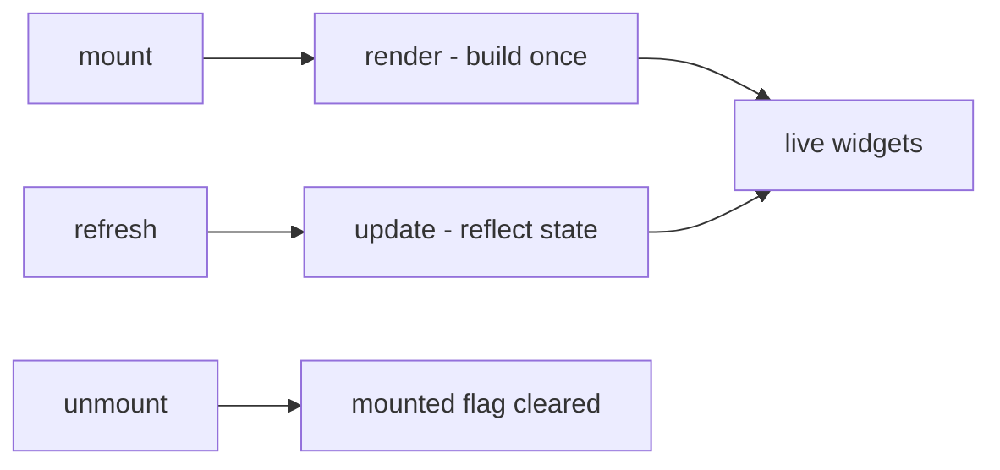
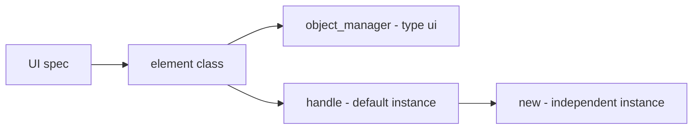
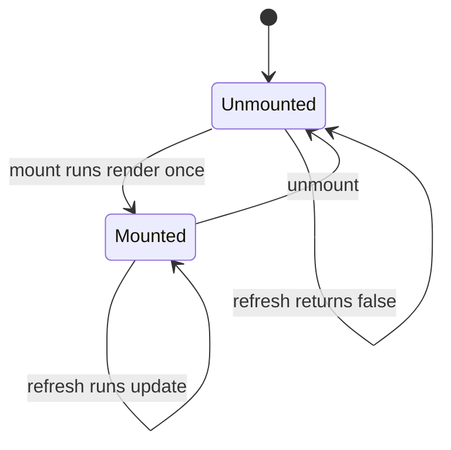
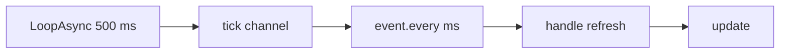

UI 要素は、Palworld 自身のネイティブ UMG キットを使って画面に描かれるものです。他の api
モジュールと同じ形をしていて、`UI{ ... }` を呼べば定義、`UI.get(id)` / `UI.get_all()` で
参照できます。違いは 1 点だけで、UI 要素は「インスタンス化」されます。マウントされた
コピーはそれぞれ固有のウィジェットと状態を持ち、それを取り出すのが `:new{ ... }` です。

## 概要

```lua title="content/ui/panel.lua"
local UI = require("palforge.api.ui")   -- or use the global UI installed by palforge.api

local Panel = UI{
    id          = "example:Panel",
    name        = "Example Panel",
    description = "One line of text.",

    render = function(self, root)
        -- build the widget tree under `root`; runs once per mount
    end,

    update = function(self)
        -- reflect changed state into the widgets render already built
    end,
}

local panel = Panel:new{ title = "Hello" }
panel:mount(root)
panel:refresh()
panel:unmount()
```

残る 2 つの入口です。

```lua
UI.get("palforge:Button")   -- a handle for an element defined elsewhere; never nil
UI.get_all()                -- every registered element, as a list of handles
```

`UI.Spec` に `events` フィールドはなく、UI ドメインにライフサイクルチャンネルもありません。
`core/event` は `ui.*` イベントを一切 emit しません。定義が埋める継ぎ目は `render` と
`update` の 2 つで、それらがいつ走るかは `api/ui` が持つ `mount` / `refresh` / `unmount`
が決めます。

## Spec

`UI{ ... }` が受け取るすべてのフィールドです。

<TypeTable
  type={{
    id: {
      description: '要素の id。例: "example:Panel"。空文字は不可。',
      type: 'string',
      required: true,
    },
    name: {
      description: '表示用のラベル。省略すると id。',
      type: 'string',
    },
    description: {
      description: 'UI とツール向けの 1 行説明。',
      type: 'string',
    },
    render: {
      description: 'fun(self, root) — root の下にウィジェットツリーを構築する。マウントごとに 1 回だけ走る。',
      type: 'function',
    },
    update: {
      description: 'fun(self) — 構築済みのウィジェットを更新する。refresh のたびに走る。',
      type: 'function',
    },
    data: {
      description: 'この要素の全インスタンスが共有する既定フィールド。',
      type: 'table',
    },
  }}
/>

要素ごとの状態は spec に**入れません**。状態はインスタンスのものです。
`:new{ label = "OK", onClick = fn }` に渡し、`render` / `update` の中で `self.label` として
読みます。全インスタンスで共有したい既定値には `data` を使います。

宣言自体は `api/ui` のローカルですが、レジストリ経由で実行時に読めます。

```lua
local schema = require("palforge.core.schema")
print(schema.help("UI.Spec"))         -- every field, its type and meaning
schema.get("UI.Spec").fields          -- the same as a table, for tooling
```

## render と update



`render(self, root)` は、この要素のウィジェットツリーを `root` の下に構築します。
`mount()` から、マウントごとにちょうど 1 回だけ呼ばれます。自分で呼んではいけません。

`update(self)` は、`render` がすでに構築したウィジェットを更新します。`refresh()` から
呼ばれます。これも自分で呼んではいけません。

「1 回だけ render する」ガードは `api/ui` にあるため、個々の要素が自前で書く必要は
ありません。

```lua
-- Class:mount in api/ui.lua
function Class:mount(root)
    if self._mounted then return false end
    self._root = root
    self:render(root)
    self._mounted = true
    return true
end
```

どちらも既定は何もしない no-op なので、宣言だけの要素も作れます。他の mod が `UI.get` で
見つけられるように id だけ確保しておきたい場合に使えます。

```lua
-- valid: registers "example:Marker" with no behaviour at all
UI{ id = "example:Marker", description = "Reserved id, nothing rendered." }
```

処理は名前のとおりに分けます。ウィジェットを構築するものはすべて `render` に置いて
`self` に保存し、既存のウィジェットへ新しい値を書き込むものは `update` に置きます。

```lua
local Label = UI{
    id   = "example:Label",
    data = { text = "" },

    render = function(self, root)
        local widget = require("palforge.native.ui._widget")
        self.textWidget = widget.text(root, self.text, 18)
    end,

    update = function(self)
        if not (self.textWidget and self.textWidget:IsValid()) then return end
        pcall(function() self.textWidget:SetText(FText(tostring(self.text))) end)
    end,
}
```

<Callout type="warn">
`mount()` が `true` を返すのは「render を呼んだ」ときであって、「render が成功した」ときでは
ありません。`render` の戻り値は捨てられ、要素はどちらの場合もマウント済みとして記録されます。
リトライループを書くなら、`mount` の戻り値ではなくゲーム側の状態を自分で確認してください。
後述のカウンターのレシピを参照してください。
</Callout>

## インスタンスと共有データ



定義すると要素クラスが作られ、`core/object_manager` に `("ui", id)` として登録され、
ハンドルが返ります。このハンドルはすでに 1 つのインスタンス（既定インスタンス）を
持っているので、`UI{ ... }` の戻り値はそのままマウントできます。`:new(props)` は独立した
別のインスタンスを作ります。

```lua
local Badge = UI{
    id     = "example:Badge",
    data   = { label = "Badge", size = 18 },
    render = function(self, root) end,
}

local a = Badge:new{}                  -- a:state().label == "Badge"  (from data)
local b = Badge:new{ label = "Boss" }  -- b:state().label == "Boss", b:state().size == 18
```

`:new` が返すのはハンドルであってインスタンス自体ではありません。状態は `:state()` の
向こう側にあり、ハンドルの `a.label` は nil です。インスタンスは、メタテーブルが要素
クラスになっているだけの素のテーブルです。インスタンス上の検索は次の順にフォールバック
します。

1. `:new{ ... }` に渡したフィールド、および `render` / `update` が `self` に代入したもの
2. 定義時にクラスへコピーされた `data` の既定値
3. `render`、`update`、`mount`、`refresh`、`unmount`、`isMounted`

`render` の中で `self.label = "x"` と書くと、そのインスタンスにフィールドが設定されます。
共有されている `data` の既定値が書き換わることはありません。

外部からインスタンスの状態を読み書きするには `:state()` を使います。これは
`render` / `update` の中で `self` になるテーブルそのものを返します。

```lua
local st = a:state()
st.label = "Ready"
a:refresh()             -- nothing does this for you
```

<Callout type="info">
インスタンスは要素クラスを経由して解決されるため、`id`、`name`、`description`、`render`、
`update`、`_mounted`、`_root`、`_refreshSub` を自前の状態の名前に使わないでください。
これらはすでに意味を持っています。
</Callout>

`UI.get(id)` は呼び出しのたびに**新しい**ハンドルと**新しい**空インスタンスを作ります。
つまり `UI.get` を 2 回呼ぶと、独立してマウントできるコピーが 2 つ手に入ります。

```lua
local one = UI.get("palforge:Button")
local two = UI.get("palforge:Button")   -- a different instance of the same element
```

定義されていない id を渡しても `UI.get` はハンドルを返します。`render` も `update` も
何もしない、薄い要素です。nil になることはありません。

## mount / refresh / unmount



```lua
local panel = Panel:new{ title = "Status" }

panel:mount(root)      -- true: rendered
panel:mount(root)      -- false: already mounted, render is NOT run again
panel:isMounted()      -- true
panel:refresh()        -- true: update() ran
panel:unmount()
panel:refresh()        -- false: not mounted, update() does not run
panel:mount(root)      -- true: renders again from scratch
```

`mount(root)` は `root` をインスタンスに保存し、そのまま `render` へ渡します。`api/ui` は
それ以外に何もしません。何が正しい root なのかは完全に要素側の都合です。たとえば
`TitleMenu` は、何も渡さなければ自分で root を探します。

`refresh()` はマウントされるまで `false` を返す no-op なので、マウントより長生きする
サブスクリプションから呼んでも安全です。

`unmount()` はマウント済みフラグと保存した root をクリアし、`autoRefresh` の
サブスクリプションがあれば解除します。したがって次の `mount()` は再び render します。
これが狙いで、ゲームがホスト UI を組み直してウィジェットを落としたときは、`unmount()`
してから `mount()` すれば戻せます。

<Callout type="warn">
`unmount()` はウィジェットを破棄しません。この要素が render 済みであることを忘れるだけです。
パネルから子を外す、クリックハンドラを落とすといった後始末が必要なら、`render` で `self` に
保存しておいたウィジェットを使って、`unmount()` を呼ぶ前に自分で行ってください。
</Callout>

## refresh を駆動する

<Callout type="warn">
`refresh()` を代わりに呼んでくれるものはありません。「UI が更新された」というネイティブ
イベントは確認できていないため、`api/ui` は非同期方針を一切押し付けません。正直な選択肢は
2 つです。状態が変わったその場で自分で `:refresh()` を呼ぶか、`:autoRefresh(ms)` で
ポーリングをオプトインするかです。
</Callout>

選択肢 1 は、変更が起きた場所で refresh することです。正確で、ポーリングのコストも
かかりません。

```lua
local event = require("palforge.core.event")

event.on("item.obtain", function(ctx)
    if ctx.itemId ~= "Wood" then return end
    local st = panel:state()
    st.wood = (st.wood or 0) + (ctx.count or 1)
    panel:refresh()
end)
```

選択肢 2 はポーリングです。`autoRefresh(ms)` は `event.every` 経由で `core/event` の
ハートビートを購読します。`event.every` は `event.TICK_MS`（500 ms）刻みで積算するため、
実効周期は 500 ms の倍数へ切り上がります。既定値は 500 です。

```lua
panel:mount(root)
panel:autoRefresh()       -- every 500 ms
panel:autoRefresh(2000)   -- no-op: a subscription is already installed, returns true
```



押さえておくべき点です。

- すでに購読が生きている状態で `autoRefresh` を再度呼ぶと、購読を追加せずに `true` を
  返します。間隔を変えるには、先に `unmount()` してから mount し直して呼びます。
- `unmount()` が解除します。
- 購読を設置できなかった場合は `false` を返します。呼び出し全体がガードされています。
- 駆動されるのは、そのハンドルが持つインスタンスだけです。同じ要素の別インスタンスには
  それぞれ呼ぶ必要があります。

## Handle

`UI{ ... }`、`UI.get(id)`、`:new(props)` はいずれも `UI.Handle` を返します。

| メンバー | 戻り値 | 内容 |
| --- | --- | --- |
| `.id` | `string` | 要素の id |
| `:new(props)` | `UI.Handle` | 独立してマウントできる新しいインスタンス。`props` がその状態になる |
| `:mount(root)` | `boolean` | `root` の下に 1 回だけ render する。マウント済みなら `false` |
| `:refresh()` | `boolean` | `update()` を走らせる。マウントされるまで `false` |
| `:unmount()` | — | マウント済みフラグと保存した root をクリアし、`autoRefresh` を解除する |
| `:isMounted()` | `boolean` | render 済みで、まだ unmount していないか |
| `:autoRefresh(ms)` | `boolean` | ハートビートに乗せて `refresh()` をポーリングする。`ms` の既定は 500 |
| `:state()` | `table` | インスタンス。`render` / `update` の中の `self` そのもの |
| `:name()` | `string` | 要素の `name`、なければ id |
| `:description()` | `string?` | 要素の `description` |

`UI.Class` は、すべての要素が継承する基底クラスです。ライフサイクル
（`mount` / `refresh` / `unmount` / `isMounted`）と 2 つの空の継ぎ目を持っています。

## ネイティブ要素

`palforge/native/ui/` は、まさにこの api を使って 2 つの要素を定義しており、どちらも実際の
ゲーム UI に注入されます。ウィジェットツリーの構築には `palforge/native/ui/_widget.lua` を
使います。これは Palworld 自身のウィジェットを複製し、ネイティブ UMG のパネルを Lua から
構築するツールキットです。

```lua
local ui = require("palforge.native.ui")
ui.Button                                    -- also require("palforge.native.ui.button")
ui.TitleMenu                                 -- also require("palforge.native.ui.title_menu")

UI.get("palforge:Button")                    -- the same element, a fresh instance
UI.get("palforge:TitleMenu")
```

どちらのモジュールも `UI{ ... }` が返したハンドル、つまり要素の既定インスタンスを返します。
モジュールの値を直接マウントするのではなく `:new{ ... }` を呼んで、利用箇所ごとに独自の
状態を持たせてください。

<Callout type="info">
`native/ui/_widget.lua` は、ネイティブ要素が `render` の中で使っているツールキットです。
先頭のアンダースコアが示すとおり `native/ui` の内部向けで、`api/` の表面ではなく、互換性の
保証もありません。それでも現時点でウィジェットを構築する唯一の経路なので、以下のレシピでも
これを使います。
</Callout>

### Button

`palforge:Button` — クリックできる、ネイティブ風のボタン 1 個です。

```lua
local Button = require("palforge.native.ui.button")

Button:new{
    label   = "Give 10 Wood",
    onClick = function() Item.get("Wood"):give(10) end,
}:mount(hostPanel)
```

読むインスタンスフィールドは `self.label`（既定は `""`）と `self.onClick` です。作った
ウィジェットは `self.widget` に保存します。

LIVE な部分です。

- `WidgetBlueprintLibrary.Create` を通してゲームの `WBP_Title_MenuButton` を複製します
- `label` をボタン内部の `Test_Content` テキストウィジェットに書き込みます
- ボタン内部の `HorizontalBox_0` を左寄せにして、幅に関係なくラベルが揃うようにします
- ボタン内部の `WBP_PalInvisibleButton` を共有クリックルーターに登録します。これは
  `/Script/CommonUI.CommonButtonBase:HandleButtonClicked` への `RegisterHook` 1 個で、
  クリックされたボタンを持つコールバックへ振り分けます。フックは最初の登録時に遅延して
  設置されます。

保証されないのは配置です。`render` は `root:AddChildToVerticalBox(btn)` を試し、
`root:AddChild(btn)` にフォールバックします。どちらもガードされています。root がどちらも
受け付けない場合、ボタンは作られてクリックも配線されますが、それを表示するものが
ありません。`render` は有効な `PalPlayerController` が無い場合やウィジェットを作れなかった
場合にも `false` を返しますが、`mount` はその値を捨てます。戻り値ではなく画面を確認して
ください。

Button は `update` を定義していないため、`:refresh()` は空の既定実装が走るだけで何も
変わりません。ラベルを変えるには作り直します。`unmount()` して状態を設定し、もう一度
`mount()` します。

### TitleMenu

`palforge:TitleMenu` — ゲームのタイトル画面に項目を注入します。実際のタイトル画面で
LIVE です。

```lua
local TitleMenu = require("palforge.native.ui.title_menu")

local menu = TitleMenu:new{
    entries = {
        { label = "Mods",     onClick = function() openMods() end },
        { label = "Settings", onClick = function() openSettings() end },
    },
}
menu:mount()      -- no root: it finds the title screen itself
```

`self.entries` は `{ label = ..., onClick = ... }` の配列です。`render` はエントリに触れる
前に、次の 3 つを 1 回だけ解決し、どれか 1 つでも欠けていれば `false` を返します。root
（渡された `root` が有効ならそれ、なければ
`FindFirstOf("PalUITitleBase").WidgetTree.RootWidget`）、その中にある `VerticalBox_0`
（タイトル画面のボタン列）、そして有効な `PalPlayerController` です。そのうえで、各
エントリについて次を行います。

1. ネイティブのメニューボタンを作り、`SizeBox` で包んでその列に追加する
2. スロットを左寄せにし、上下に 3 のパディングを与えてネイティブの項目に合わせる
3. `WBP_Title_MenuButton_ExitGame` の親ボックスを列の末尾へ移動し、Exit Game を最後に
   保つ。`VerticalBox` に挿入操作は無いため
4. ボタンの不可視クリックターゲットを `e.invButton` としてエントリに記録する

1 つでも注入できれば `render` は `true` を返しますが、Button のときと同じく `mount` は
その値を捨てます。TitleMenu も `update` を定義していません。
`e.invButton` は、将来の refresh がエントリの生存を判定できるように記録されていますが、
現時点でそれを読み返すコードは無く、`:refresh()` は何もしません。

マウントするのはタイトル画面が存在する間、つまりワールドに入る前です。タイトル画面から
離れたら `:unmount()` を呼んで、後の `mount()` が再び注入できるようにします。

<Callout type="warn">
タイトル画面にはワールドもプレイヤーキャラクターも存在しません。そこで
`Item.get("Wood"):give(10)` を呼ぶエントリは失敗します。`give` はローカルプレイヤーの
インベントリを通るためです。タイトルの項目はメニュー操作に留め、ゲームプレイに触れるものは
ゲーム内のパネルに `Button` をマウントして行ってください。
</Callout>

## レシピ

### カウンターを表示するパネル

Wood の入手数を数える 1 行のパネルです。`render` がテキストウィジェットを 1 回だけ構築し、
`update` が現在の数値をそこへ書き込み、状態を動かすのは `item.obtain` のハンドラです。
以下でマウント先にしているのはタイトル画面のボタン列です。`native/ui` が探し方を示している
root がそれだけだからで、数値が実際に動くのを見たいならゲーム内の自前のパネルへ向けて
ください。`item.obtain` はワールドが読み込まれてからしか発火しません。

```lua title="content/ui/wood_counter.lua"
local UI     = require("palforge.api.ui")
local event  = require("palforge.core.event")
local widget = require("palforge.native.ui._widget")

local Counter = UI{
    id          = "example:Counter",
    name        = "Counter",
    description = "One line of text showing a running number.",
    data        = { label = "Count", count = 0 },

    -- build once
    render = function(self, root)
        if not (root and root:IsValid()) then return false end
        local text = widget.text(root, self.label .. ": " .. self.count, 18)
        self.textWidget = text
        pcall(function()
            if root.AddChildToVerticalBox then widget.addV(root, text)
            elseif root.AddChild then root:AddChild(text) end
        end)
        return true
    end,

    -- reflect state into the widget render already built
    update = function(self)
        if not (self.textWidget and self.textWidget:IsValid()) then return end
        pcall(function()
            self.textWidget:SetText(FText(self.label .. ": " .. self.count))
        end)
    end,
}

local wood = Counter:new{ label = "Wood", count = 0 }

-- The title screen's button column, located the same way native/ui/title_menu does.
local function titleColumn()
    local base = FindFirstOf("PalUITitleBase")
    if not (base and base:IsValid()) then return nil end
    local rootWidget
    pcall(function() rootWidget = base.WidgetTree.RootWidget end)
    if not (rootWidget and rootWidget:IsValid()) then return nil end
    return widget.findByName(rootWidget, "VerticalBox_0")
end

-- mount() returns true for "render ran", not "render worked", so gate on the game state.
event.every(1000, function()
    if wood:isMounted() then return end
    local column = titleColumn()
    if column then wood:mount(column) end
end)

-- move the state, then refresh: nothing refreshes for you
event.on("item.obtain", function(ctx)
    if ctx.itemId ~= "Wood" then return end
    local st = wood:state()
    st.count = st.count + (ctx.count or 1)
    wood:refresh()
end)
```

数値の出どころにイベントが無い場合は、ポーリング版にします。

```lua
wood:mount(column)
wood:autoRefresh(1000)      -- refresh at most every 1000 ms, off the 500 ms heartbeat

-- update() now reads whatever is current, so the source can be anything
```

### アイテムを渡すボタン

<Tabs items={['単体のボタン', 'タイトルメニュー項目']}>
<Tab value="単体のボタン">

```lua title="content/ui/give_button.lua"
local Button = require("palforge.native.ui.button")
local Item   = require("palforge.api.item")
local log    = require("palforge.utils.log").scope("give-button")

-- One instance per use site: :new gives this button its own label and callback.
local giveWood = Button:new{
    label   = "Give 10 Wood",
    onClick = function()
        local ok = Item.get("Wood"):give(10)
        log.info("gave wood: " .. tostring(ok))
    end,
}

-- `hostPanel` is any widget that accepts children (AddChildToVerticalBox or AddChild).
local function show(hostPanel)
    if giveWood:isMounted() then return end
    giveWood:mount(hostPanel)
end

local function hide()
    giveWood:unmount()   -- forgets the render; the widget itself is yours to remove
end

return { show = show, hide = hide }
```

</Tab>
<Tab value="タイトルメニュー項目">

```lua title="content/ui/title_entries.lua"
local TitleMenu = require("palforge.native.ui.title_menu")
local UI        = require("palforge.api.ui")
local event     = require("palforge.core.event")
local log       = require("palforge.utils.log").scope("title")

local menu = TitleMenu:new{
    entries = {
        {
            label   = "PalForge: elements",
            onClick = function()
                for _, el in ipairs(UI.get_all()) do
                    log.info(el.id .. " -> " .. el:name())
                end
            end,
        },
        {
            label   = "PalForge: version",
            onClick = function() log.info(tostring(PalForge.env.version)) end,
        },
    },
}

-- The title screen may not exist yet when this file loads, so retry off the heartbeat.
event.every(1000, function()
    if menu:isMounted() then return end
    local base = FindFirstOf("PalUITitleBase")
    if base and base:IsValid() then menu:mount() end
end)

-- Leaving the title screen drops the widgets; forget the render so a later mount rebuilds.
event.on("world.ready", function() menu:unmount() end)
```

</Tab>
</Tabs>

どちらのボタンも、クリックは同じフックを通ります。アイテムの付与は生きたプレイヤー
キャラクターがある場合にだけ機能するので、`Item.get("Wood"):give(10)` はタイトルの項目では
なく、ゲーム内のボタンに置きます。

## エラー

バリデーションは厳格で、問題はすべてハードエラーになります。呼び出しが中途半端に成功する
ことはありません。

```lua
UI{ name = "Panel" }
```

```text
PalForge: UI: field "id" is required (element id, e.g. "pack:Panel")
```

```lua
UI{ id = "example:Panel", onClick = function() end }
```

```text
PalForge: UI: unknown field "onClick". Valid fields: id, name, description, render, update, data
```

`onClick` は spec ではなくインスタンスの状態です。`:new{ onClick = ... }` に渡します。

```lua
UI{ id = "example:Panel", render = "build" }
```

```text
PalForge: UI: field "render" expects function, got string
```

```lua
UI{ id = "" }
```

```text
PalForge: UI: field "id" is invalid: must be a non-empty string
```

## 関連ページ

<Cards>
  <Card title="Item" href="/docs/api/item">
    `:give` / `:take` と、パネルが数える `item.obtain` の ctx。
  </Card>
  <Card title="Pal" href="/docs/api/pal">
    同じモジュールの形。こちらは実際のライフサイクルチャンネルを持ちます。
  </Card>
  <Card title="ライフサイクル" href="/docs/concepts/lifecycle">
    `autoRefresh` が乗る 500 ms のハートビートと、すべてのイベントチャンネル。
  </Card>
</Cards>
