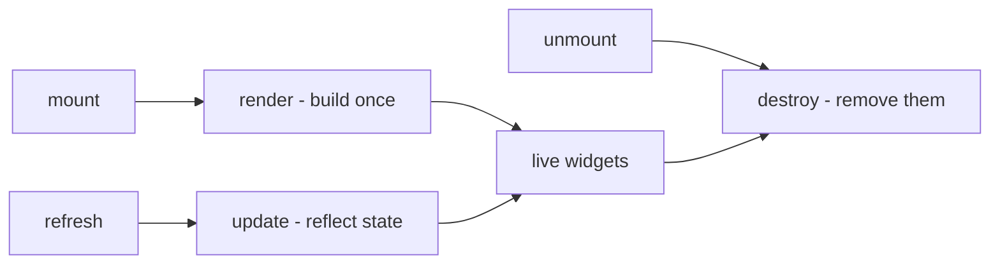
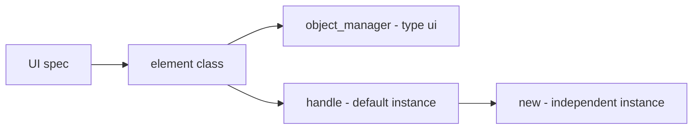
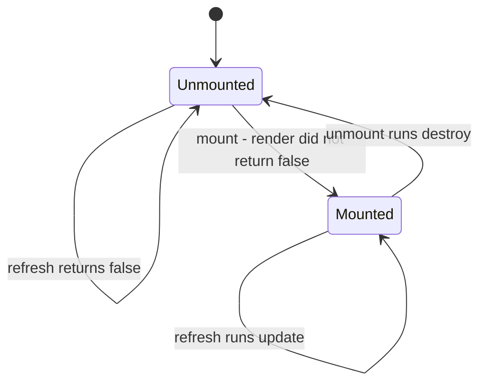
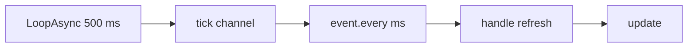
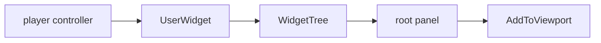

## このページでできるようになること

- 遊んでいる最中に、自分のパネルを画面に出す
- 押すとアイテムがもらえたり、パルが出てきたりするボタンを追加する
- ゲームのタイトル画面のメニューに、自分の項目を追加する
- パネルを作り直さずに、表示している内容だけを書き換える
- 用が済んだら、画面から全部片付ける

## 最初のパネル

UI 要素とは、画面に描くもののことです。1 行のテキストでも、ボタンでも、パネル全体でも
かまいません。`UI{ ... }` で 1 つ宣言すると、Palworld 自身の画面 UI キットを使って
組み立てられるので、見た目はゲーム本体になじみます。

書く関数は 3 つです。`render` が部品を 1 回だけ組み立てます。`update` は `render` が作った
部品に新しい値を書き込みます。`destroy` はその部品を取り外します。

```lua title="content/ui/panel.lua"
local UI = require("palforge.api.ui")   -- or use the global UI installed by palforge.api

local Panel = UI{
    id          = "example:Panel",
    name        = "Example Panel",
    description = "One line of text.",

    render = function(self, root)
        -- build the widget tree under `root`; runs once per mount
        -- return false if you could not build: the element then stays unmounted
    end,

    update = function(self)
        -- reflect changed state into the widgets render already built
    end,

    destroy = function(self)
        -- remove the widgets render built; runs on unmount
    end,
}

local panel = Panel:new{ title = "Hello" }
panel:mount(root)
panel:refresh()
panel:unmount()
```

その部品ひとつひとつが**ウィジェット**です。テキスト 1 行、ボタン 1 個、他のウィジェットを
入れる箱などが、それぞれ 1 個のウィジェットです。

別のファイルが宣言した要素を使いたいときは、id で引きます。

```lua
UI.get("palforge:Button")   -- a handle for an element defined elsewhere; never nil
UI.get_all()                -- every registered element, as a list of handles
```

あなたのパネルを表示・更新・非表示にしてくれるものは、ゲーム側にありません。「UI が
変わった」と教えてくれるネイティブイベントも無いので、タイミングは自分で決めます。
`:mount(root)` で画面に出し、`:refresh()` で今の値を書き込み、`:unmount()` で片付けます。

## UI に渡すもの

必ず渡すフィールドは `id` だけです。画面に何かを出すのは `render` です。

<TypeTable
  type={{
    id: {
      description: '要素の id。例: "example:Panel"。空文字は不可。',
      type: 'string',
      required: true,
    },
    name: {
      description: '表示用のラベル。省略すると id。',
      type: 'string',
    },
    description: {
      description: 'UI とツール向けの 1 行説明。',
      type: 'string',
    },
    render: {
      description: 'fun(self, root): boolean? — root の下にウィジェットツリーを構築する。マウントごとに 1 回だけ走る。何も構築できなかったときは false を返す。',
      type: 'function',
    },
    update: {
      description: 'fun(self) — 構築済みのウィジェットを更新する。refresh のたびに走る。',
      type: 'function',
    },
    destroy: {
      description: 'fun(self) — render が構築したウィジェットを取り除く。unmount のたびに走る。',
      type: 'function',
    },
    data: {
      description: 'この要素の全インスタンスが共有する既定フィールド。',
      type: 'table',
    },
  }}
/>

コピーごとに変わる値は、ここには**入れません**。`:new{ label = "OK", onClick = fn }` に
渡し、`render` / `update` / `destroy` の中で `self.label` として読みます。全コピーで
共有したい既定値には `data` を使います。

同じフィールド一覧は、ゲーム内から表示することもできます。

```lua
local schema = require("palforge.core.schema")
print(schema.help("UI.Spec"))         -- every field, its type and meaning
schema.get("UI.Spec").fields          -- the same as a table, for tooling
```

## render と update と destroy



`render(self, root)` は、あなたのウィジェットを `root`、つまり置き場所となるパネルの下に
組み立てます。要素が画面に出るたびに、`mount()` が 1 回だけ呼びます。自分で呼ばないで
ください。何も組み立てられなかったとき、たとえば必要なパネルがまだ存在しなかったときは
`false` を返します。要素は画面に出ないままになり、あとでもう一度マウントすればやり直しに
なります。`nil` は成功扱いなので、必ず成功する render は何も返さなくて構いません。

`update(self)` は、`render` が組み立て済みのウィジェットに新しい値を書き込みます。
`refresh()` が呼びます。これも自分で呼ばないでください。

`destroy(self)` は、`render` が作ったウィジェットを取り除きます。`unmount()` が、しかも
要素が画面に出ているときにだけ呼びます。これも自分で呼ばないでください。

すでに render 済みかどうかを自分で覚えておく必要はありません。`mount` がやってくれます。

```lua
-- Class:mount in api/ui.lua
function Class:mount(root)
    if self._mounted then return false end
    self._root = root
    if self:render(root) == false then
        self._root = nil
        return false
    end
    self._mounted = true
    return true
end
```

3 つとも、書かなければ何もしません。つまり宣言だけの要素も作れます。他の mod が `UI.get`
で見つけられるように id だけ確保しておきたい場合に便利です。

```lua
-- valid: registers "example:Marker" with no behaviour at all
UI{ id = "example:Marker", description = "Reserved id, nothing rendered." }
```

処理は名前のとおりに分けます。ウィジェットを作るものはすべて `render` に置いて `self` に
保存し、すでにあるウィジェットへ新しい値を書き込むものは `update` に、ウィジェットを
取り外すものは `destroy` に置きます。

```lua
local widget = require("palforge.native.ui._widget")

local Label = UI{
    id   = "example:Label",
    data = { text = "" },

    render = function(self, screen)
        if not (screen and widget.alive(screen.root)) then return false end
        local ok = pcall(function()
            self.textWidget = widget.text(screen.tree, tostring(self.text), 18)
            widget.addV(screen.root, self.textWidget)
        end)
        if not ok then self:destroy(); return false end
        return true
    end,

    update = function(self)
        if not widget.alive(self.textWidget) then return false end
        local t = self.textWidget
        return pcall(function() t:SetText(FText(tostring(self.text))) end)
    end,

    destroy = function(self)
        local t = self.textWidget
        self.textWidget = nil
        if not widget.alive(t) then return false end
        return pcall(function() t:RemoveFromParent() end)
    end,
}
```

<Callout type="info">
`mount()` が要素を「画面に出ている」と記録するのは、`render` が**何を返したか**によって
であり、render が走ったという事実によってではありません。`false` を返すと要素は画面に
出ないまま、渡した root も忘れられるので、あとでもう一度 `mount()` を呼べばやり直しに
なります。毎回の試行前に、自分でゲーム側の状態を調べる必要はありません。
</Callout>

## 1 つの要素から複数のコピーを作る



`UI{ ... }` は要素を id で登録し、**ハンドル**を返します。ハンドルとは、`:mount`、
`:refresh`、`:unmount` を呼ぶためのオブジェクトです。このハンドルはすでに要素のコピーを
1 つ持っているので、`UI{ ... }` の戻り値はそのまま画面に出せます。`:new(props)` は、独自の
状態を持つ別のコピーを作ります。

```lua
local Badge = UI{
    id     = "example:Badge",
    data   = { label = "Badge", size = 18 },
    render = function(self, root) end,
}

local a = Badge:new{}                  -- a:state().label == "Badge"  (from data)
local b = Badge:new{ label = "Boss" }  -- b:state().label == "Boss", b:state().size == 18
```

`:new` が返すのはハンドルであって、状態そのものではありません。状態は `:state()` の
向こう側にあり、ハンドルの `a.label` は nil です。その状態テーブルが、`render` / `update` /
`destroy` の中の `self` です。名前は次の順に探されます。

1. `:new{ ... }` に渡したフィールド、および `render` / `update` / `destroy` が `self` に
   代入したもの
2. 定義時にクラスへコピーされた `data` の既定値
3. `render`、`update`、`destroy`、`mount`、`refresh`、`unmount`、`isMounted`

`render` の中で `self.label = "x"` と書くと、そのコピーにだけフィールドが設定されます。
共有している `data` の既定値は変わりません。

外部からコピーの状態を読み書きするには `:state()` を使います。

```lua
local st = a:state()
st.label = "Ready"
a:refresh()             -- nothing does this for you
```

<Callout type="info">
状態の名前は要素そのものを経由して解決されます。そのため `id`、`name`、`description`、
`render`、`update`、`destroy`、`_mounted`、`_root`、`_refreshSub` を自前の状態の名前に
使わないでください。これらはすでに意味を持っています。
</Callout>

`UI.get(id)` は、呼ぶたびに**新しい**ハンドルと**新しい**空のコピーを作ります。つまり
`UI.get` を 2 回呼ぶと、それぞれ独立して画面に出せるパネルが 2 つ手に入ります。

```lua
local one = UI.get("palforge:Button")
local two = UI.get("palforge:Button")   -- a different instance of the same element
```

<Callout type="warn">
宣言されていない id を渡しても、`UI.get` は nil ではなくハンドルを返し、`.id` / `:name()` /
`:description()` は応答します。それ以外は応答しません。このとき作られる仮の要素には
ライフサイクルが付いていないため、`:mount()`、`:refresh()`、`:unmount()`、`:isMounted()`
は `attempt to call a nil value` を送出します。要素を引くのは、それを宣言しているものが
読み込まれたあとにしてください。その順序は `core/registry` が決めます。
</Callout>

## 表示する・更新する・片付ける



```lua
local panel = Panel:new{ title = "Status" }

panel:mount(root)      -- true: render did not report a failure
panel:mount(root)      -- false: already mounted, render is NOT run again
panel:isMounted()      -- true
panel:refresh()        -- true: update() ran
panel:unmount()        -- destroy() runs, then the mounted flag and root are cleared
panel:refresh()        -- false: not mounted, update() does not run
panel:mount(root)      -- true: renders again from scratch
```

`mount(root)` は `root` を保存し、そのまま `render` へ渡します。中身は誰も見ないので、
何を root と見なすかは要素ごとに決まります。`TitleMenu` は何も渡さなければ自分で root を
探しますし、`widget.screen()` の上に作った要素は screen テーブルそのものを root として
受け取ります。

`mount()` が `false` を返す状況は 2 つあります。すでに画面に出ている場合と、`render` が
`false` を返した場合です。どちらもエラーではなく、作りかけのパネルが残ることもありません。
後者では保存した root も忘れられるので、要素は試行前とまったく同じ状態に戻ります。

`refresh()` は、要素が画面に出るまでは何もせず `false` を返します。そのため、要素より
長生きするサブスクリプションから呼んでも安全です。

`unmount()` はまず `destroy()` を `pcall` の中で走らせます。例外を投げる後始末が要素を
「画面に出たまま」で固まらせることはありません。続いて画面表示のフラグと保存した root を
クリアし、`autoRefresh` のサブスクリプションが動いていれば解除します。したがって次の
`mount()` は最初から組み立て直します。

<Callout type="warn">
`unmount()` が呼ぶのは、あなたが書いた `destroy` だけです。既定の `destroy` は何もしません。
`render` で `self` にウィジェットを保存しておきながら `destroy` を書いていない要素は、
ウィジェットを取りこぼします。フラグは消え、あとで `mount()` すると 2 つ目のコピーが作られ、
最初のコピーは画面に残ったままです。`render` が何かを作ったなら、それを取り外す `destroy`
を書いてください。
</Callout>

## 表示を最新に保つ

<Callout type="warn">
`refresh()` を代わりに呼んでくれるものはありません。「UI が更新された」というネイティブ
イベントは確認できていないので、裏で勝手にポーリングすることもしません。表示を最新に保つ
方法は 2 つです。状態が変わったその場で自分で `:refresh()` を呼ぶか、`:autoRefresh(ms)` で
ポーリングを有効にするかです。
</Callout>

方法 1 は、変更が起きた場所で refresh することです。正確で、何も変わらない間はコストも
かかりません。

```lua
local event = require("palforge.core.event")

event.on("item.obtain", function(ctx)
    if ctx.itemId ~= "Wood" then return end
    local st = panel:state()
    st.wood = (st.wood or 0) + (ctx.count or 1)
    panel:refresh()
end)
```

方法 2 はポーリングです。`autoRefresh(ms)` は `event.every` を通して、PalForge の
ハートビート、つまり `event.TICK_MS`（500 ms）ごとに動くタイマーに乗ります。刻みは
500 ms 単位で数えられるため、実際の周期は 500 ms の倍数へ切り上がります。既定値は 500 です。

```lua
panel:mount(root)
panel:autoRefresh()       -- every 500 ms
panel:autoRefresh(2000)   -- no-op: a subscription is already installed, returns true
```



押さえておく点です。

- すでに動いている状態で `autoRefresh` を再度呼ぶと、購読を追加せずに `true` を返します。
  間隔を変えるには、先に `unmount()` してから mount し直して呼びます。
- `unmount()` が解除します。
- 購読を設置できなかった場合は `false` を返します。呼び出し全体がガードされています。
- 動かすのは、そのハンドルが持つコピー 1 つだけです。同じ要素の別のコピーには、それぞれ
  呼ぶ必要があります。

ポーリングは、勝手に変化する値のためだけのものではありません。`TitleMenu` は、ゲームが
自分の UI を作り直すことに耐えるためにこれを使います。`update` がボタンの消えた項目を
入れ直すので、`:autoRefresh(2000)` は破棄されて作り直されたタイトル画面にも項目を
残し続けます。

## 呼び出せるものすべて

`UI{ ... }`、`UI.get(id)`、`:new(props)` はいずれも `UI.Handle` を返します。そのメンバーが
次の表です。

| メンバー | 戻り値 | 内容 |
| --- | --- | --- |
| `.id` | `string` | 要素の id |
| `:new(props)` | `UI.Handle` | 独立してマウントできる新しいインスタンス。`props` がその状態になる |
| `:mount(root)` | `boolean` | `root` の下に 1 回だけ render する。マウント済みか `render` が `false` を返したときは `false` |
| `:refresh()` | `boolean` | `update()` を走らせる。マウントされるまで `false` |
| `:unmount()` | — | `destroy()` を走らせ、マウント済みフラグと保存した root をクリアし、`autoRefresh` を解除する |
| `:isMounted()` | `boolean` | render が成功を報告し、まだ unmount していないか |
| `:autoRefresh(ms)` | `boolean` | ハートビートに乗せて `refresh()` をポーリングする。`ms` の既定は 500 |
| `:state()` | `table` | インスタンス。`render` / `update` / `destroy` の中の `self` そのもの |
| `:name()` | `string` | 要素の `name`、なければ id |
| `:description()` | `string?` | 要素の `description` |

`UI.Class` は、すべての要素が継承する基底クラスです。`mount` / `refresh` / `unmount` /
`isMounted` と、`render`・`update`・`destroy` の「何もしない」既定実装を持っています。

## 自前のスクリーンを作る

ウィジェットには置き場所が要ります。置き場所は 2 種類です。ゲームがすでに持っているパネル
（`TitleMenu` はタイトル画面のボタン列に追加します）か、`widget.screen()` で自分で作るもの
かです。どちらも `native/ui/_widget.lua`、つまり出来合いの要素が使っているツールキットで
組み立てます。



ツールキットのヘルパーはどれも `WidgetTree`、つまり Unreal が画面のウィジェットを収める
入れ物を必要としますが、素の `UUserWidget` はそれを持っていません。通常はウィジェットの
コンパイル済み Blueprint からエンジンが作るものだからです。`widget.screen()` はその
`WidgetTree` を自分で作って割り当てます。おかげで、コンパイルするものを何も用意せずに
Lua だけで UI を作れます。

```lua
local widget = require("palforge.native.ui._widget")

local screen, why = widget.screen()
if not screen then
    print("no screen: " .. tostring(why))
end

-- when it built:
--   screen.widget  the UUserWidget now on the viewport
--   screen.tree    the WidgetTree every primitive constructs into
--   screen.root    the VerticalBox your widgets go under
--   screen.pc      the controller that owns it; the clickable helpers need it
```

`widget.screen(pc, opts)` は例外を投げません。screen テーブルを返すか、`nil` と理由の
文字列を返します。理由は、オーナーがいない、UMG のクラスが見つからない、`AddToViewport`
が通らなかった、のいずれかです。`pc` の既定は `widget.owner()`、つまり
`PalPlayerController`、なければ任意の `PlayerController`、それも無ければ `GameInstance`
で、ゲームがまったく無ければ `nil` です。

<TypeTable
  type={{
    zOrder: {
      description: 'AddToViewport に渡すビューポートの z オーダー。',
      type: 'number',
      default: '1000',
    },
    show: {
      description: 'すぐビューポートに追加する。false にすると非表示のまま構築し、widget.show を自分で呼ぶ。',
      type: 'boolean',
      default: 'true',
    },
    dim: {
      description: 'パネル背後の全画面ディマーの色。{ r, g, b, a }。false にすると枠のない素の VerticalBox が root になる。',
      type: 'table | false',
      default: '{ 0.02, 0.02, 0.03, 0.86 }',
    },
    panel: {
      description: 'ウィジェットが載る内側パネルの色。{ r, g, b, a }。',
      type: 'table',
      default: '{ 0.10, 0.09, 0.08, 0.98 }',
    },
    padding: {
      description: 'そのパネル内側のパディング。{ Left, Top, Right, Bottom }。',
      type: 'table',
      default: '{ Left = 90, Top = 54, Right = 90, Bottom = 54 }',
    },
  }}
/>

```lua
-- a bare vertical stack: no dimmer, no frame, drawn under the default z
local bare = widget.screen(nil, { dim = false, zOrder = 500 })

-- built but not shown; put it up and take it down yourself
local hidden = widget.screen(nil, { show = false })
widget.show(hidden)       -- AddToViewport; true if the widget reports itself shown
widget.hide(hidden)       -- RemoveFromParent; true if it is no longer shown
```

中身を埋める部品です。

| ヘルパー | 作るもの |
| --- | --- |
| `widget.vbox(tree)` / `widget.hbox(tree)` | `VerticalBox` / `HorizontalBox` |
| `widget.scrollBox(tree)` / `widget.overlay(tree)` | `ScrollBox` / `Overlay` |
| `widget.border(tree, rgba)` | `Border`。ブラシ色は `{ r, g, b, a }` |
| `widget.sizeBox(tree, w, h)` | `SizeBox`。各オーバーライドは `bOverride_` フラグ付きのプロパティとして書き、さらにセッターでも書きます。UE4SS のセッターは no-op になることがあるためです |
| `widget.text(tree, str, size, rgba)` | `TextBlock`。`size` の既定は 16 |
| `widget.menuButton(tree, pc, label, onClick)` | ゲームのメニューボタンの複製。ボタン、その不可視クリックターゲット、クリックルーターのキーを返します |
| `widget.clickableRow(tree, pc, label, onClick, opts)` | 同じボタンの上に左寄せテキストを重ねたもの。`opts = { size, color, indent }` |
| `widget.cloneGameWidget(tree, pc, classPath, opts)` | 任意の Palworld BP ウィジェット。`opts = { label, labelChild, clickChild, onClick }` |
| `widget.addV(vbox, child, padTop)` | `child` を追加してスロットを返します |
| `widget.addH(hbox, child)` / `widget.addScroll(scroll, child)` | `HorizontalBox` / `ScrollBox` 向けの同等品 |
| `widget.alive(w)` | そのウィジェットにまだ話しかけられるか。例外を投げません |
| `widget.findByName(w, name)` | 名前で子孫ウィジェットを深さ優先探索 |
| `widget.releaseClicks(names)` | キーを指定してクリックルーターの登録を落とす。`destroy` が呼ぶもの |

`mount(root)` は `root` に手を加えず `render` へ渡すので、要素は screen テーブルごと root
として受け取り、`tree`、`root`、`pc` を 1 つの引数からたどれます。

```lua title="content/ui/stats_panel.lua"
local UI     = require("palforge.api.ui")
local Item   = require("palforge.api.item")
local Pal    = require("palforge.api.pal")
local widget = require("palforge.native.ui._widget")

local Stats = UI{
    id   = "example:Stats",
    name = "Stats",
    data = { title = "PalForge", rows = {} },

    render = function(self, screen)
        if not (screen and widget.alive(screen.root)) then return false end
        self.clicks = {}
        local ok = pcall(function()
            local head = widget.text(screen.tree, self.title, 24)
            widget.addV(screen.root, head, 8)
            for _, row in ipairs(self.rows) do
                local line, _, clickName =
                    widget.clickableRow(screen.tree, screen.pc, row.label, row.onClick)
                widget.addV(screen.root, line, 4)
                self.clicks[#self.clicks + 1] = clickName
            end
        end)
        if not ok then self:destroy(); return false end
        self.screen = screen
        return true
    end,

    -- Taking the whole screen off the viewport removes every widget under it at once.
    destroy = function(self)
        widget.releaseClicks(self.clicks or {})
        if self.screen then widget.hide(self.screen) end
        self.clicks, self.screen = nil, nil
        return true
    end,
}

local panel = Stats:new{
    title = "PalForge",
    rows  = {
        { label = "Give 10 Wood",    onClick = function() Item.get("Wood"):give(10) end },
        { label = "Spawn a Chikipi", onClick = function() Pal.get("ChickenPal"):spawn() end },
    },
}

local screen = widget.screen()
if screen then panel:mount(screen) end
```

<Callout type="info">
`_widget.lua` は `api/` ではなく `native/ui` の下にあるので、そのヘルパーはバージョンの間で
予告なく変わることがあります。それでも現時点でウィジェットを作る唯一の手段なので、ここの
要素とレシピもこれを使います。
</Callout>

## 出来合いの要素

PalForge には、そのまま使える要素が 2 つ付いています。どちらも実際のゲーム UI に本物の
ウィジェットを入れます。

```lua
local ui = require("palforge.native.ui")
ui.Button                                    -- also require("palforge.native.ui.button")
ui.TitleMenu                                 -- also require("palforge.native.ui.title_menu")

UI.get("palforge:Button")                    -- the same element, a fresh instance
UI.get("palforge:TitleMenu")
```

どちらのモジュールも、コピーが 1 つ付いた状態の要素を返します。モジュールの値を直接
マウントするのではなく `:new{ ... }` を呼んでください。そうすれば、使う場所ごとに独自の
ラベルとコールバックを持てます。

### Button

`palforge:Button` — ゲーム本体と同じ見た目の、クリックできるボタン 1 個です。

```lua
local Button = require("palforge.native.ui.button")
local widget = require("palforge.native.ui._widget")

local screen = widget.screen()
local give   = Button:new{
    label   = "Give 10 Wood",
    onClick = function() Item.get("Wood"):give(10) end,
}
if screen then give:mount(screen.root) end
```

コピーから読むフィールドは 2 つ、`self.label`（既定は `""`）と `self.onClick` です。
`render` はボタンを `self.widget` に、内部のラベルウィジェットを `self.labelWidget` に、
クリックルーターのキーを `self.clickName` に保存します。

`render` が行うことを順に並べます。

- `PalPlayerController` を探し、無ければ `false` を返します
- `WidgetBlueprintLibrary.Create` を通してゲームの `WBP_Title_MenuButton` を複製します。
  失敗したときも `false` を返します
- `label` をボタン内部の `Test_Content` テキストウィジェットに書き込みます
- ボタン内部の `HorizontalBox_0` を左寄せにして、幅に関係なくラベルが揃うようにします
- ボタン内部の `WBP_PalInvisibleButton` を共有クリックルーターに登録します。これは
  `/Script/CommonUI.CommonButtonBase:HandleButtonClicked` への `RegisterHook` 1 個で、
  クリックされたボタンを持つコールバックへ振り分けます。フックが設置されるのは最初の
  登録時で、それより前ではありません。
- `AddChildToVerticalBox` で `root` に追加し、だめなら `AddChild` にフォールバックします

配置は前提にせず確認されます。`root` がどちらの呼び出しも受け付けなければ、`render` は
自分の `destroy()` を走らせ、生きたコールバックが繋がったまま見えないボタンを残すのでは
なくボタンとクリックハンドラを破棄したうえで、`false` を返します。要素は画面に出ないままな
ので、子を受け付ける root を相手に `mount()` をやり直せます。

`update` は現在の `self.label` を生きたボタンへ書き込みます。ボタンを作り直さずにラベル
だけを変えられます。

```lua
give:state().label = "Give 50 Wood"
give:refresh()
```

ボタン自体が無くなっていれば `false` を返します。キャッシュしたラベルウィジェットだけが
古くなっていた場合は、先に `Test_Content` を探し直します。

`destroy` はボタンのクリックルーター登録を解放し、`RemoveFromParent()` を呼びます。
`unmount()` で本当にボタンが画面から外れ、あとで `mount()` すれば孤児を残さずに新しい
ボタンが作られます。

### TitleMenu

`palforge:TitleMenu` — ゲームのタイトル画面に項目を追加します。実際のタイトル画面で
動きます。

```lua
local TitleMenu = require("palforge.native.ui.title_menu")

local menu = TitleMenu:new{
    entries = {
        { label = "Mods",     onClick = function() openMods() end },
        { label = "Settings", onClick = function() openSettings() end },
    },
}
menu:mount()             -- no root: it finds the title screen itself
menu:autoRefresh(2000)   -- re-inject whenever the title screen rebuilds itself
```

`self.entries` は `{ label = ..., onClick = ... }` の配列です。`render` はエントリに触れる
前に次の 3 つを解決し、どれか 1 つでも欠けていれば `false` を返します。root（渡された
`root` が有効ならそれ、なければ `FindFirstOf("PalUITitleBase").WidgetTree.RootWidget`）、
その中にある `VerticalBox_0`（タイトル画面のボタン列）、そして有効な
`PalPlayerController` です。そのうえで、生きたボタンを持たない各エントリについて次を
行います。

1. ネイティブのメニューボタンを作り、隣にあるネイティブの `SizeBox_4` から読んだ寸法の
   `SizeBox` で包みます。寸法は `WidthOverride` / `HeightOverride` を**プロパティとして**
   読みます。ゲッターは nil を返すためです。この固定幅が無いとボタンは伸びて中央寄せに
   なります。
2. `SizeBox` を列に追加し、スロットを左寄せにして上下に 3 のパディングを与え、ゲーム本体の
   項目に合わせます
3. ボタンの不可視クリックターゲット、その `SizeBox`、クリックルーターのキーを、エントリに
   `e.invButton`、`e.sizeBox`、`e.clickName` として記録します

1 つ以上のエントリを追加したパスのあとで、`WBP_Title_MenuButton_ExitGame` の親ボックスを
列の末尾へ移動し、Exit Game を最後に保ちます。`VerticalBox` に挿入操作は無いためです。

`render` が `true` を返すのは実際にエントリが入ったときだけなので、タイトル画面が存在する
前に試みた `mount()` は要素を画面に出さないままにし、そのまま繰り返せます。

`update` は項目を入れ直します。タイトル画面は（たとえばタイトルへ戻ったときに）自分の
ウィジェットを作り直し、追加したボタンも黙って持っていってしまいます。`e.invButton` が
有効でなくなったエントリだけが入れ直され、生きているエントリはそのままなので、refresh が
重複を積み上げることはありません。すべてのエントリが揃っていれば `true`、追加すべき
エントリが 1 つも無ければ `false` を返します。この確認をハートビート上で走らせるのが
`:autoRefresh(2000)` です。

`destroy` は各エントリの `SizeBox` をボタン列から取り除き、クリックルーターの登録を解放
します。`unmount()` でメニューが元どおり外れ、あとで `mount()` すれば全項目の 2 つ目の
コピーを増やすのではなく、新たに入れ直します。

<Callout type="warn">
タイトル画面にはワールドもプレイヤーキャラクターも存在しません。そこで
`Item.get("Wood"):give(10)` を呼ぶエントリは失敗します。`give` はローカルプレイヤーの
インベントリを通るためです。タイトルの項目はメニュー操作に留め、ゲームプレイに触れるものは
ゲーム内のパネルに `Button` をマウントして行ってください。
</Callout>

## レシピ

### カウンターを表示するパネル

Wood の入手数を数える 1 行のパネルです。`render` がテキストウィジェットを 1 回だけ作り、
`update` が現在の数値をそこへ書き込み、`destroy` がスクリーンごと画面から外します。数値を
動かすのは `item.obtain` のハンドラです。スクリーンを `world.ready` で作るのは、
`item.obtain` がワールドの読み込み後にしか発火しないからです。

```lua title="content/ui/wood_counter.lua"
local UI     = require("palforge.api.ui")
local event  = require("palforge.core.event")
local widget = require("palforge.native.ui._widget")

local Counter = UI{
    id          = "example:Counter",
    name        = "Counter",
    description = "One line of text showing a running number.",
    data        = { label = "Count", count = 0 },

    -- build once; `screen` is what widget.screen() returned
    render = function(self, screen)
        if not (screen and widget.alive(screen.root)) then return false end
        local ok = pcall(function()
            self.textWidget = widget.text(screen.tree, self.label .. ": " .. self.count, 18)
            widget.addV(screen.root, self.textWidget)
        end)
        if not ok then self:destroy(); return false end
        self.screen = screen
        return true
    end,

    -- reflect state into the widget render already built
    update = function(self)
        if not widget.alive(self.textWidget) then return false end
        local t = self.textWidget
        return pcall(function() t:SetText(FText(self.label .. ": " .. self.count)) end)
    end,

    -- take it down again: unmount() runs this
    destroy = function(self)
        if self.screen then widget.hide(self.screen) end
        self.textWidget, self.screen = nil, nil
        return true
    end,
}

local wood = Counter:new{ label = "Wood", count = 0 }

-- mount() returns false while render reports it could not build, so this just retries.
event.on("world.ready", function()
    if wood:isMounted() then return end
    local screen = widget.screen(nil, { dim = false, zOrder = 500 })
    if screen then wood:mount(screen) end
end)

-- move the state, then refresh: nothing refreshes for you
event.on("item.obtain", function(ctx)
    if ctx.itemId ~= "Wood" then return end
    local st = wood:state()
    st.count = st.count + (ctx.count or 1)
    wood:refresh()
end)

-- leaving the world drops the widgets; destroy() runs and a later mount() rebuilds
event.on("world.left", function() wood:unmount() end)
```

数値の出どころにイベントが無い場合は、ポーリングにします。

```lua
wood:mount(screen)
wood:autoRefresh(1000)      -- refresh at most every 1000 ms, off the 500 ms heartbeat

-- update() now reads whatever is current, so the source can be anything
```

### アイテムを渡すボタン

<Tabs items={['単体のボタン', 'タイトルメニュー項目']}>
<Tab value="単体のボタン">

```lua title="content/ui/give_button.lua"
local Button = require("palforge.native.ui.button")
local Item   = require("palforge.api.item")
local widget = require("palforge.native.ui._widget")
local log    = require("palforge.utils.log").scope("give-button")

-- One instance per use site: :new gives this button its own label and callback.
local giveWood = Button:new{
    label   = "Give 10 Wood",
    onClick = function()
        local ok = Item.get("Wood"):give(10)
        log.info("gave wood: " .. tostring(ok))
    end,
}

local screen

-- A screen of our own to host it: screen.root is a VerticalBox, which is exactly what
-- Button's render adds itself to.
local function show()
    if giveWood:isMounted() then return end
    screen = widget.screen(nil, { dim = false })
    if not screen then return end
    if not giveWood:mount(screen.root) then
        widget.hide(screen)
        screen = nil
    end
end

local function hide()
    giveWood:unmount()          -- destroy() removes the button and drops its click handler
    if screen then widget.hide(screen) end
    screen = nil
end

return { show = show, hide = hide }
```

</Tab>
<Tab value="タイトルメニュー項目">

```lua title="content/ui/title_entries.lua"
local TitleMenu = require("palforge.native.ui.title_menu")
local UI        = require("palforge.api.ui")
local event     = require("palforge.core.event")
local log       = require("palforge.utils.log").scope("title")

local menu = TitleMenu:new{
    entries = {
        {
            label   = "PalForge: elements",
            onClick = function()
                for _, el in ipairs(UI.get_all()) do
                    log.info(el.id .. " -> " .. el:name())
                end
            end,
        },
        {
            label   = "PalForge: version",
            onClick = function() log.info(tostring(PalForge.env.version)) end,
        },
    },
}

-- The title screen may not exist yet when this file loads. mount() stays false until it
-- does, so retrying off the heartbeat is the whole retry loop.
event.every(1000, function()
    if not menu:isMounted() then menu:mount() end
end)

-- Once it is in, polling re-injects the entries whenever the title screen rebuilds itself.
menu:autoRefresh(2000)

-- Entering a world takes the title screen away; unmount so a later mount injects afresh.
event.on("world.ready", function() menu:unmount() end)
```

</Tab>
</Tabs>

どちらのボタンも、クリックは同じフックを通り、どちらも `destroy` でルーターの登録を落とす
ので、片付けた要素が何かを残すことはありません。アイテムの付与は生きたプレイヤー
キャラクターがある場合にだけ機能するので、`Item.get("Wood"):give(10)` はタイトルの項目
ではなく、ゲーム内のボタンに置きます。

## エラー

問題はすべてハードエラーになり、呼び出しが中途半端に成功することはありません。

```lua
UI{ name = "Panel" }
```

```text
PalForge: UI: field "id" is required (element id, e.g. "pack:Panel")
```

```lua
UI{ id = "example:Panel", onClick = function() end }
```

```text
PalForge: UI: unknown field "onClick". Valid fields: id, name, description, render, update, destroy, data
```

`onClick` は宣言ではなくコピー側のものです。`:new{ onClick = ... }` に渡します。

```lua
UI{ id = "example:Panel", render = "build" }
```

```text
PalForge: UI: field "render" expects function, got string
```

```lua
UI{ id = "" }
```

```text
PalForge: UI: field "id" is invalid: must be a non-empty string
```

## 関連ページ

<Cards>
  <Card title="Item" href="/docs/api/item">
    `:give` / `:take` と、パネルが数える `item.obtain` の ctx。
  </Card>
  <Card title="Pal" href="/docs/api/pal">
    ボタンからパルを湧かせる方法と、パルが反応できるイベント。
  </Card>
  <Card title="ライフサイクル" href="/docs/concepts/lifecycle">
    `autoRefresh` が乗る 500 ms のハートビートと、すべてのイベントチャンネル。
  </Card>
</Cards>

## まとめ

- 要素は `UI{ ... }` で宣言します。必須は `id` だけで、画面に何かを出すのは `render` です。
- `render` がウィジェットを作り、`update` が新しい値を書き込み、`destroy` が取り外します。
  この 3 つを自分で呼ぶことはありません。
- `:mount(root)` で表示、`:refresh()` で更新、`:unmount()` で片付けます。`mount()` が
  `false` を返すのは「まだ」という意味なので、あとでもう一度呼べば済みます。
- コピーはそれぞれ独自の状態を持ちます。`:new{ ... }` で作り、`:state()` で読み書きします。
- refresh は誰も呼んでくれません。状態が変わったときに `:refresh()` を呼ぶか、
  `:autoRefresh(ms)` でポーリングします。
- `widget.screen()` で自分の置き場所を作れます。`Button` と `TitleMenu` はそのまま使えます。

次は [アイテム](/docs/api/item) を読むと、ボタンから配るものが作れます。
