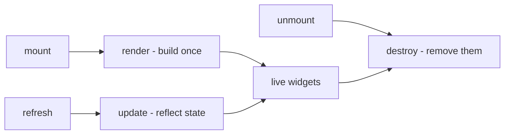
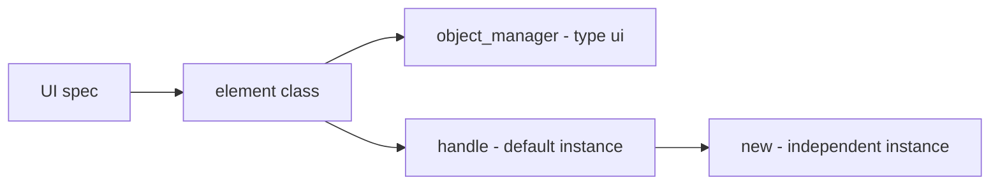
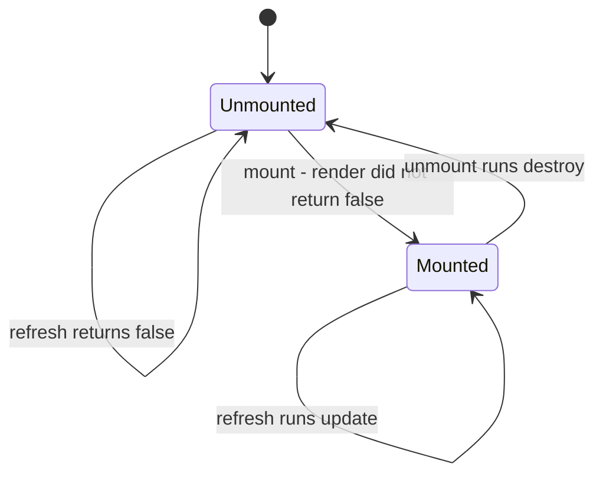
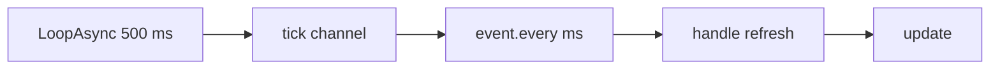
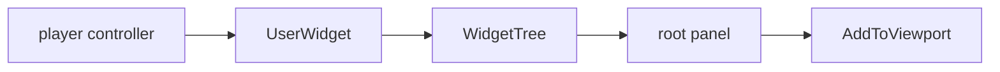

## What you can do after this page

- Put a panel of your own on screen while you play
- Add a button that gives you an item or spawns a pal when you click it
- Add your own entry to the game's title screen menu
- Change what your panel shows without building it again
- Take everything back off the screen when you are done

## Your first panel

A UI element is anything you draw on screen: a line of text, a button, a whole panel. You
describe one with `UI{ ... }`, and it is built out of Palworld's own on-screen UI kit, so it
looks like the rest of the game.

You write three functions. `render` builds the pieces once. `update` writes new values into
pieces `render` already built. `destroy` takes them away again.

```lua title="content/ui/panel.lua"
local UI = require("palforge.api.ui")   -- or use the global UI installed by palforge.api

local Panel = UI{
    id          = "example:Panel",
    name        = "Example Panel",
    description = "One line of text.",

    render = function(self, root)
        -- build the widget tree under `root`; runs once per mount
        -- return false if you could not build: the element then stays unmounted
    end,

    update = function(self)
        -- reflect changed state into the widgets render already built
    end,

    destroy = function(self)
        -- remove the widgets render built; runs on unmount
    end,
}

local panel = Panel:new{ title = "Hello" }
panel:mount(root)
panel:refresh()
panel:unmount()
```

Each of those pieces is a **widget**: one item of on-screen UI, such as a text line, a
button, or a box that holds other widgets.

To reach an element that another file defined, look it up by its id:

```lua
UI.get("palforge:Button")   -- a handle for an element defined elsewhere; never nil
UI.get_all()                -- every registered element, as a list of handles
```

Nothing in the game shows, updates or closes your panel for you. No native event reports
that the UI changed, so you pick the moments yourself: `:mount(root)` puts the element on
screen, `:refresh()` writes current values into it, `:unmount()` takes it off.

## What you pass to UI

`id` is the only field you have to give. `render` is the one that makes something appear.

<TypeTable
  type={{
    id: {
      description: 'Element id, e.g. "example:Panel". Must be a non-empty string.',
      type: 'string',
      required: true,
    },
    name: {
      description: 'Human label. Defaults to id.',
      type: 'string',
    },
    description: {
      description: 'One-line description, for UI and tooling.',
      type: 'string',
    },
    render: {
      description: 'fun(self, root): boolean? — build the widget tree under root. Runs once per mount. Return false to report that nothing was built.',
      type: 'function',
    },
    update: {
      description: 'fun(self) — refresh the already-built widgets. Runs on each refresh call.',
      type: 'function',
    },
    destroy: {
      description: 'fun(self) — remove the widgets render built. Runs on each unmount call.',
      type: 'function',
    },
    data: {
      description: 'Default fields shared by every instance of this element.',
      type: 'table',
    },
  }}
/>

Values that differ from one copy of the element to the next do **not** go here. Pass them to
`:new{ label = "OK", onClick = fn }` and read them as `self.label` inside `render` /
`update` / `destroy`. Use `data` for defaults every copy should share.

The same list of fields is printable from inside the game:

```lua
local schema = require("palforge.core.schema")
print(schema.help("UI.Spec"))         -- every field, its type and meaning
schema.get("UI.Spec").fields          -- the same as a table, for tooling
```

## render, update and destroy



`render(self, root)` builds your widgets under `root`, the panel they go into. `mount()`
calls it once each time the element goes on screen. Do not call it yourself. Return `false`
when you could not build anything — the panel you needed was not there yet, for example.
The element then stays off screen, and mounting again later tries once more. Returning `nil`
counts as success, so a render that always works need not return anything.

`update(self)` writes new values into the widgets `render` already built. `refresh()` calls
it. Do not call it yourself.

`destroy(self)` removes the widgets `render` built. `unmount()` calls it, and only while the
element is on screen. Do not call it yourself.

You never have to track whether you rendered already. `mount` does that for you:

```lua
-- Class:mount in api/ui.lua
function Class:mount(root)
    if self._mounted then return false end
    self._root = root
    if self:render(root) == false then
        self._root = nil
        return false
    end
    self._mounted = true
    return true
end
```

All three do nothing until you write them, so an element can be a declaration and nothing
else — useful when the id exists just so other mods can find it through `UI.get`.

```lua
-- valid: registers "example:Marker" with no behaviour at all
UI{ id = "example:Marker", description = "Reserved id, nothing rendered." }
```

Split the work the way the names say. Everything that builds a widget goes in `render` and
is stored on `self`; everything that writes a new value into a widget that already exists
goes in `update`; everything that takes a widget back out goes in `destroy`:

```lua
local widget = require("palforge.native.ui._widget")

local Label = UI{
    id   = "example:Label",
    data = { text = "" },

    render = function(self, screen)
        if not (screen and widget.alive(screen.root)) then return false end
        local ok = pcall(function()
            self.textWidget = widget.text(screen.tree, tostring(self.text), 18)
            widget.addV(screen.root, self.textWidget)
        end)
        if not ok then self:destroy(); return false end
        return true
    end,

    update = function(self)
        if not widget.alive(self.textWidget) then return false end
        local t = self.textWidget
        return pcall(function() t:SetText(FText(tostring(self.text))) end)
    end,

    destroy = function(self)
        local t = self.textWidget
        self.textWidget = nil
        if not widget.alive(t) then return false end
        return pcall(function() t:RemoveFromParent() end)
    end,
}
```

<Callout type="info">
`mount()` marks the element as on screen from what `render` **returned**, not from the fact
that it ran. A `false` return leaves the element off screen and forgets the root you passed,
so calling `mount()` again later simply tries again. You do not have to test the game state
yourself before every attempt.
</Callout>

## One panel, many copies



`UI{ ... }` registers your element under its id and gives you back a **handle**: the object
you call `:mount`, `:refresh` and `:unmount` on. That handle already carries one copy of the
element, so what `UI{ ... }` returns is mountable as it is. `:new(props)` gives you another
copy with its own state.

```lua
local Badge = UI{
    id     = "example:Badge",
    data   = { label = "Badge", size = 18 },
    render = function(self, root) end,
}

local a = Badge:new{}                  -- a:state().label == "Badge"  (from data)
local b = Badge:new{ label = "Boss" }  -- b:state().label == "Boss", b:state().size == 18
```

`:new` hands back a handle, not the state itself: the state lives behind `:state()`, and
`a.label` on the handle is nil. That state table is what `self` is inside `render` /
`update` / `destroy`, and a name read on it is found in this order:

1. fields you passed to `:new{ ... }`, plus anything `render` / `update` / `destroy` assign
   to `self`
2. the element's `data` defaults, copied onto the class at define time
3. `render`, `update`, `destroy`, `mount`, `refresh`, `unmount`, `isMounted`

Writing `self.label = "x"` inside `render` sets the field on that one copy; the shared
`data` default is untouched.

From outside, read and write a copy's state through `:state()`:

```lua
local st = a:state()
st.label = "Ready"
a:refresh()             -- nothing does this for you
```

<Callout type="info">
State names resolve through the element itself, so do not use `id`, `name`, `description`,
`render`, `update`, `destroy`, `_mounted`, `_root` or `_refreshSub` as names for your own
state — they already mean something.
</Callout>

`UI.get(id)` builds a **new** handle with a **new** empty copy on every call, so two
`UI.get` calls give you two panels you can put on screen independently:

```lua
local one = UI.get("palforge:Button")
local two = UI.get("palforge:Button")   -- a different instance of the same element
```

<Callout type="warn">
For an id nobody defined, `UI.get` still returns a handle rather than nil, and `.id` /
`:name()` / `:description()` answer on it. The rest does not: the stand-in it builds has no
lifecycle attached, so `:mount()`, `:refresh()`, `:unmount()` and `:isMounted()` raise
`attempt to call a nil value`. Look an element up only once whatever defines it has loaded —
`core/registry` decides that order.
</Callout>

## Show it, update it, hide it



```lua
local panel = Panel:new{ title = "Status" }

panel:mount(root)      -- true: render did not report a failure
panel:mount(root)      -- false: already mounted, render is NOT run again
panel:isMounted()      -- true
panel:refresh()        -- true: update() ran
panel:unmount()        -- destroy() runs, then the mounted flag and root are cleared
panel:refresh()        -- false: not mounted, update() does not run
panel:mount(root)      -- true: renders again from scratch
```

`mount(root)` saves `root` and hands it straight to `render`. Nothing looks inside it, so
each element decides for itself what a valid root is. `TitleMenu` finds its own when you
pass nothing, and an element built on `widget.screen()` takes the whole screen table as its
root.

`mount()` returns `false` in two different situations: the element is already on screen, or
`render` returned `false`. Neither is an error, and neither leaves half a panel behind — in
the second case `mount()` also forgets the root, so the element is exactly as it was before
the attempt.

`refresh()` does nothing and returns `false` until the element is on screen, so it is safe
to call from a subscription that outlives it.

`unmount()` runs `destroy()` inside a `pcall`, so a teardown that throws cannot leave the
element stuck on screen. It then clears the on-screen flag and the saved root, and cancels
an `autoRefresh` subscription if one is running. A later `mount()` therefore builds
everything again from scratch.

<Callout type="warn">
`unmount()` calls only the `destroy` you wrote, and the default `destroy` does nothing. An
element that stores widgets on `self` in `render` and defines no `destroy` leaks them: the
flag clears, a later `mount()` builds a second copy, and the first one stays on screen. If
`render` built something, write the `destroy` that takes it back out.
</Callout>

## Keeping the screen up to date

<Callout type="warn">
Nothing calls `refresh()` for you. There is no confirmed native "the UI updated" event to
hook, so nothing polls behind your back either. Two ways to keep the screen current: call
`:refresh()` yourself the moment your state changes, or turn on polling with
`:autoRefresh(ms)`.
</Callout>

Option one — refresh where the change happens. Exact, and costs nothing while nothing
changes:

```lua
local event = require("palforge.core.event")

event.on("item.obtain", function(ctx)
    if ctx.itemId ~= "Wood" then return end
    local st = panel:state()
    st.wood = (st.wood or 0) + (ctx.count or 1)
    panel:refresh()
end)
```

Option two — poll. `autoRefresh(ms)` rides on PalForge's heartbeat, a timer that fires every
`event.TICK_MS` (500 ms), through `event.every`. Because it counts in whole ticks, the real
period rounds up to a multiple of 500 ms. The default is 500.

```lua
panel:mount(root)
panel:autoRefresh()       -- every 500 ms
panel:autoRefresh(2000)   -- no-op: a subscription is already installed, returns true
```



Details that matter:

- A second `autoRefresh` while one is running returns `true` without installing another
  subscription. To change the interval, `unmount()` first, then mount and call it again.
- `unmount()` cancels it.
- It returns `false` if the subscription could not be installed; the whole call is guarded.
- It drives the one copy behind that handle. Another copy of the same element needs its own
  call.

Polling is not only for values that change on their own. `TitleMenu` uses it to survive the
game rebuilding its own UI: its `update` puts back any entry whose button has gone away, so
`:autoRefresh(2000)` keeps your entries on a title screen that was torn down and built
again.

## Everything you can call

`UI{ ... }`, `UI.get(id)` and `:new(props)` all return a `UI.Handle`, and these are its
members.

| Member | Returns | What it does |
| --- | --- | --- |
| `.id` | `string` | the element's id |
| `:new(props)` | `UI.Handle` | a fresh, independently mountable instance; `props` becomes its state |
| `:mount(root)` | `boolean` | render once under `root`; `false` if already mounted or `render` returned `false` |
| `:refresh()` | `boolean` | run `update()`; `false` until mounted |
| `:unmount()` | — | run `destroy()`, clear the mounted flag and stored root, cancel `autoRefresh` |
| `:isMounted()` | `boolean` | whether a render reported success and `unmount` has not run |
| `:autoRefresh(ms)` | `boolean` | poll `refresh()` off the heartbeat; `ms` defaults to 500 |
| `:state()` | `table` | the instance — what `self` is inside `render` / `update` / `destroy` |
| `:name()` | `string` | the element's `name`, or its id |
| `:description()` | `string?` | the element's `description` |

`UI.Class` is the base class every element extends. It holds `mount` / `refresh` /
`unmount` / `isMounted` and the three do-nothing defaults for `render`, `update` and
`destroy`.

## Building your own screen

Your widgets need somewhere to live. There are two kinds of host: a panel the game already
has — `TitleMenu` adds to the title screen's button column — or one you build yourself with
`widget.screen()`. Both are built with `native/ui/_widget.lua`, the toolkit the ready-made
elements use.



Every helper in the toolkit needs a `WidgetTree` — the container Unreal keeps a screen's
widgets in — and a bare `UUserWidget` has none, because the engine normally builds one from
a widget's compiled Blueprint. `widget.screen()` builds that tree itself and attaches it,
which is what lets you make UI from Lua alone, with nothing to compile.

```lua
local widget = require("palforge.native.ui._widget")

local screen, why = widget.screen()
if not screen then
    print("no screen: " .. tostring(why))
end

-- when it built:
--   screen.widget  the UUserWidget now on the viewport
--   screen.tree    the WidgetTree every primitive constructs into
--   screen.root    the VerticalBox your widgets go under
--   screen.pc      the controller that owns it; the clickable helpers need it
```

`widget.screen(pc, opts)` never throws. It returns the screen table, or `nil` plus a reason
string: there is no owner, a UMG class is missing, or `AddToViewport` did not take. `pc`
defaults to `widget.owner()` — the `PalPlayerController`, else any `PlayerController`, else
the `GameInstance`, and `nil` when there is no game at all.

<TypeTable
  type={{
    zOrder: {
      description: 'Viewport z-order passed to AddToViewport.',
      type: 'number',
      default: '1000',
    },
    show: {
      description: 'Add to the viewport immediately. Pass false to build it hidden and call widget.show yourself.',
      type: 'boolean',
      default: 'true',
    },
    dim: {
      description: 'Colour of the fullscreen dimmer behind the panel, as { r, g, b, a }. Pass false for a bare VerticalBox root with no frame at all.',
      type: 'table | false',
      default: '{ 0.02, 0.02, 0.03, 0.86 }',
    },
    panel: {
      description: 'Colour of the inset panel your widgets sit on, as { r, g, b, a }.',
      type: 'table',
      default: '{ 0.10, 0.09, 0.08, 0.98 }',
    },
    padding: {
      description: 'Padding inside that panel, as { Left, Top, Right, Bottom }.',
      type: 'table',
      default: '{ Left = 90, Top = 54, Right = 90, Bottom = 54 }',
    },
  }}
/>

```lua
-- a bare vertical stack: no dimmer, no frame, drawn under the default z
local bare = widget.screen(nil, { dim = false, zOrder = 500 })

-- built but not shown; put it up and take it down yourself
local hidden = widget.screen(nil, { show = false })
widget.show(hidden)       -- AddToViewport; true if the widget reports itself shown
widget.hide(hidden)       -- RemoveFromParent; true if it is no longer shown
```

The pieces you fill it with:

| Helper | Builds |
| --- | --- |
| `widget.vbox(tree)` / `widget.hbox(tree)` | a `VerticalBox` / `HorizontalBox` |
| `widget.scrollBox(tree)` / `widget.overlay(tree)` | a `ScrollBox` / `Overlay` |
| `widget.border(tree, rgba)` | a `Border`, brush colour `{ r, g, b, a }` |
| `widget.sizeBox(tree, w, h)` | a `SizeBox`; each override is written as the property with its `bOverride_` flag and again through the setter, because UE4SS setters sometimes no-op |
| `widget.text(tree, str, size, rgba)` | a `TextBlock`; `size` defaults to 16 |
| `widget.menuButton(tree, pc, label, onClick)` | a clone of the game's menu button; returns the button, its invisible click target and the click-router key |
| `widget.clickableRow(tree, pc, label, onClick, opts)` | that button with left-aligned text laid over it; `opts = { size, color, indent }` |
| `widget.cloneGameWidget(tree, pc, classPath, opts)` | any Palworld BP widget; `opts = { label, labelChild, clickChild, onClick }` |
| `widget.addV(vbox, child, padTop)` | adds `child` and returns the slot |
| `widget.addH(hbox, child)` / `widget.addScroll(scroll, child)` | the same for a `HorizontalBox` / `ScrollBox` |
| `widget.alive(w)` | whether a widget can still be talked to; never throws |
| `widget.findByName(w, name)` | depth-first search for a descendant widget, by name |
| `widget.releaseClicks(names)` | drop click-router entries by key — what a `destroy` calls |

`mount(root)` hands `root` to `render` untouched, so an element can take the whole screen
table as its root and reach `tree`, `root` and `pc` from that one argument:

```lua title="content/ui/stats_panel.lua"
local UI     = require("palforge.api.ui")
local Item   = require("palforge.api.item")
local Pal    = require("palforge.api.pal")
local widget = require("palforge.native.ui._widget")

local Stats = UI{
    id   = "example:Stats",
    name = "Stats",
    data = { title = "PalForge", rows = {} },

    render = function(self, screen)
        if not (screen and widget.alive(screen.root)) then return false end
        self.clicks = {}
        local ok = pcall(function()
            local head = widget.text(screen.tree, self.title, 24)
            widget.addV(screen.root, head, 8)
            for _, row in ipairs(self.rows) do
                local line, _, clickName =
                    widget.clickableRow(screen.tree, screen.pc, row.label, row.onClick)
                widget.addV(screen.root, line, 4)
                self.clicks[#self.clicks + 1] = clickName
            end
        end)
        if not ok then self:destroy(); return false end
        self.screen = screen
        return true
    end,

    -- Taking the whole screen off the viewport removes every widget under it at once.
    destroy = function(self)
        widget.releaseClicks(self.clicks or {})
        if self.screen then widget.hide(self.screen) end
        self.clicks, self.screen = nil, nil
        return true
    end,
}

local panel = Stats:new{
    title = "PalForge",
    rows  = {
        { label = "Give 10 Wood",    onClick = function() Item.get("Wood"):give(10) end },
        { label = "Spawn a Chikipi", onClick = function() Pal.get("ChickenPal"):spawn() end },
    },
}

local screen = widget.screen()
if screen then panel:mount(screen) end
```

<Callout type="info">
`_widget.lua` sits under `native/ui`, not under `api/`, so its helpers can change between
versions without warning. It is still the only way to build widgets today, so the elements
and recipes here use it.
</Callout>

## Ready-made elements

PalForge comes with two elements you can use as they are. Both put real widgets into the
game's own UI.

```lua
local ui = require("palforge.native.ui")
ui.Button                                    -- also require("palforge.native.ui.button")
ui.TitleMenu                                 -- also require("palforge.native.ui.title_menu")

UI.get("palforge:Button")                    -- the same element, a fresh instance
UI.get("palforge:TitleMenu")
```

Each module gives you the element with one copy already attached. Call `:new{ ... }` rather
than mounting the module value directly, so every place you use it keeps its own label and
its own callback.

### Button

`palforge:Button` — one clickable button, styled like the game's own.

```lua
local Button = require("palforge.native.ui.button")
local widget = require("palforge.native.ui._widget")

local screen = widget.screen()
local give   = Button:new{
    label   = "Give 10 Wood",
    onClick = function() Item.get("Wood"):give(10) end,
}
if screen then give:mount(screen.root) end
```

It reads two fields from the copy you make: `self.label` (defaults to `""`) and
`self.onClick`. `render` stores the button on `self.widget`, its inner label widget on
`self.labelWidget` and the click router's key on `self.clickName`.

What `render` does, in order:

- finds a `PalPlayerController`, returning `false` when there is none
- clones the game's `WBP_Title_MenuButton` through `WidgetBlueprintLibrary.Create`,
  returning `false` when that fails
- writes `label` into the button's inner `Test_Content` text widget
- left-aligns the button's inner `HorizontalBox_0` so labels line up regardless of width
- registers the inner `WBP_PalInvisibleButton` with the shared click router: a single
  `RegisterHook` on `/Script/CommonUI.CommonButtonBase:HandleButtonClicked` that sends the
  click to whichever callback owns the button. The hook is installed on the first
  registration, not before.
- adds the button to `root` with `AddChildToVerticalBox`, falling back to `AddChild`

Placement is checked, not assumed. If `root` accepts neither call, `render` runs its own
`destroy()` — dropping the button and its click handler rather than leaving an invisible
button wired to a live callback — and returns `false`. The element stays off screen, so
`mount()` can be repeated against a root that does take children.

`update` writes the current `self.label` into the live button, so you can change a label
without building the button again:

```lua
give:state().label = "Give 50 Wood"
give:refresh()
```

It returns `false` when the button itself is gone. When only the cached label widget went
stale, it looks `Test_Content` up again first.

`destroy` releases the button's click-router entry and calls `RemoveFromParent()`, so
`unmount()` really takes the button off the screen and a later `mount()` builds a fresh one
instead of leaving an orphan behind.

### TitleMenu

`palforge:TitleMenu` — adds entries to the game's title screen. This works on the real title
screen.

```lua
local TitleMenu = require("palforge.native.ui.title_menu")

local menu = TitleMenu:new{
    entries = {
        { label = "Mods",     onClick = function() openMods() end },
        { label = "Settings", onClick = function() openSettings() end },
    },
}
menu:mount()             -- no root: it finds the title screen itself
menu:autoRefresh(2000)   -- re-inject whenever the title screen rebuilds itself
```

`self.entries` is an array of `{ label = ..., onClick = ... }`. Before it touches a single
entry, `render` resolves three things and returns `false` if any of them is missing: the
root — the `root` you passed if it is valid, else
`FindFirstOf("PalUITitleBase").WidgetTree.RootWidget` — then `VerticalBox_0` inside it,
which is the title screen's button column, and a valid `PalPlayerController`. For every
entry that has no live button it then:

1. builds a native menu button and wraps it in a `SizeBox` sized from the native neighbour
   `SizeBox_4`, read as the `WidthOverride` / `HeightOverride` **properties** — the getters
   read back nil. Without that fixed width the button stretches and centres.
2. adds the `SizeBox` to the column, left-aligns the slot and gives it a top and bottom
   padding of 3, matching the game's own entries
3. records the button's invisible click target, its `SizeBox` and its click-router key on
   the entry as `e.invButton`, `e.sizeBox` and `e.clickName`

After a pass that added at least one entry, it moves the parent box of
`WBP_Title_MenuButton_ExitGame` to the end of the column, so Exit Game stays last — a
`VerticalBox` has no insert.

`render` returns `true` only when an entry really went in, so a `mount()` attempted before
the title screen exists leaves the element off screen and can simply be repeated.

`update` puts the entries back. The title screen rebuilds its widgets — on returning to the
title, for instance — and silently takes the added buttons with it. Every entry whose
`e.invButton` is no longer valid is added again; entries that are still alive are left
alone, so a refresh can never stack duplicates. It returns `true` when every entry is
present afterwards, and `false` when there are no entries to add. `:autoRefresh(2000)` is
what runs that check on the heartbeat.

`destroy` removes every entry's `SizeBox` from the button column and releases its
click-router entry, so `unmount()` takes the menu back out and a later `mount()` adds it
afresh instead of stacking a second copy of every entry.

<Callout type="warn">
There is no world and no player character at the title screen. An entry that calls
`Item.get("Wood"):give(10)` there will fail: `give` goes through the local player's
inventory. Keep title entries to menu actions, and mount `Button` into an in-game panel for
anything that touches gameplay.
</Callout>

## Recipes

### A panel that shows a counter

A one-line panel that counts Wood pickups. `render` builds the text widget once, `update`
writes the current number into it, `destroy` takes the whole screen back off, and the
`item.obtain` handler is what moves the number. The screen is built on `world.ready`,
because `item.obtain` only fires once a world is loaded.

```lua title="content/ui/wood_counter.lua"
local UI     = require("palforge.api.ui")
local event  = require("palforge.core.event")
local widget = require("palforge.native.ui._widget")

local Counter = UI{
    id          = "example:Counter",
    name        = "Counter",
    description = "One line of text showing a running number.",
    data        = { label = "Count", count = 0 },

    -- build once; `screen` is what widget.screen() returned
    render = function(self, screen)
        if not (screen and widget.alive(screen.root)) then return false end
        local ok = pcall(function()
            self.textWidget = widget.text(screen.tree, self.label .. ": " .. self.count, 18)
            widget.addV(screen.root, self.textWidget)
        end)
        if not ok then self:destroy(); return false end
        self.screen = screen
        return true
    end,

    -- reflect state into the widget render already built
    update = function(self)
        if not widget.alive(self.textWidget) then return false end
        local t = self.textWidget
        return pcall(function() t:SetText(FText(self.label .. ": " .. self.count)) end)
    end,

    -- take it down again: unmount() runs this
    destroy = function(self)
        if self.screen then widget.hide(self.screen) end
        self.textWidget, self.screen = nil, nil
        return true
    end,
}

local wood = Counter:new{ label = "Wood", count = 0 }

-- mount() returns false while render reports it could not build, so this just retries.
event.on("world.ready", function()
    if wood:isMounted() then return end
    local screen = widget.screen(nil, { dim = false, zOrder = 500 })
    if screen then wood:mount(screen) end
end)

-- move the state, then refresh: nothing refreshes for you
event.on("item.obtain", function(ctx)
    if ctx.itemId ~= "Wood" then return end
    local st = wood:state()
    st.count = st.count + (ctx.count or 1)
    wood:refresh()
end)

-- leaving the world drops the widgets; destroy() runs and a later mount() rebuilds
event.on("world.left", function() wood:unmount() end)
```

When the number comes from something with no event behind it, poll instead:

```lua
wood:mount(screen)
wood:autoRefresh(1000)      -- refresh at most every 1000 ms, off the 500 ms heartbeat

-- update() now reads whatever is current, so the source can be anything
```

### A button wired to give an item

<Tabs items={['Standalone button', 'Title menu entries']}>
<Tab value="Standalone button">

```lua title="content/ui/give_button.lua"
local Button = require("palforge.native.ui.button")
local Item   = require("palforge.api.item")
local widget = require("palforge.native.ui._widget")
local log    = require("palforge.utils.log").scope("give-button")

-- One instance per use site: :new gives this button its own label and callback.
local giveWood = Button:new{
    label   = "Give 10 Wood",
    onClick = function()
        local ok = Item.get("Wood"):give(10)
        log.info("gave wood: " .. tostring(ok))
    end,
}

local screen

-- A screen of our own to host it: screen.root is a VerticalBox, which is exactly what
-- Button's render adds itself to.
local function show()
    if giveWood:isMounted() then return end
    screen = widget.screen(nil, { dim = false })
    if not screen then return end
    if not giveWood:mount(screen.root) then
        widget.hide(screen)
        screen = nil
    end
end

local function hide()
    giveWood:unmount()          -- destroy() removes the button and drops its click handler
    if screen then widget.hide(screen) end
    screen = nil
end

return { show = show, hide = hide }
```

</Tab>
<Tab value="Title menu entries">

```lua title="content/ui/title_entries.lua"
local TitleMenu = require("palforge.native.ui.title_menu")
local UI        = require("palforge.api.ui")
local event     = require("palforge.core.event")
local log       = require("palforge.utils.log").scope("title")

local menu = TitleMenu:new{
    entries = {
        {
            label   = "PalForge: elements",
            onClick = function()
                for _, el in ipairs(UI.get_all()) do
                    log.info(el.id .. " -> " .. el:name())
                end
            end,
        },
        {
            label   = "PalForge: version",
            onClick = function() log.info(tostring(PalForge.env.version)) end,
        },
    },
}

-- The title screen may not exist yet when this file loads. mount() stays false until it
-- does, so retrying off the heartbeat is the whole retry loop.
event.every(1000, function()
    if not menu:isMounted() then menu:mount() end
end)

-- Once it is in, polling re-injects the entries whenever the title screen rebuilds itself.
menu:autoRefresh(2000)

-- Entering a world takes the title screen away; unmount so a later mount injects afresh.
event.on("world.ready", function() menu:unmount() end)
```

</Tab>
</Tabs>

Both buttons route their clicks through the same hook, and both drop their router entry in
`destroy`, so an element you took down leaves nothing behind. Giving items only works with a
live player character, so `Item.get("Wood"):give(10)` belongs on the in-game button, not on
a title entry.

## Errors

Every problem is a hard error, and the call never half-succeeds.

```lua
UI{ name = "Panel" }
```

```text
PalForge: UI: field "id" is required (element id, e.g. "pack:Panel")
```

```lua
UI{ id = "example:Panel", onClick = function() end }
```

```text
PalForge: UI: unknown field "onClick". Valid fields: id, name, description, render, update, destroy, data
```

`onClick` belongs to a copy of the element, not to the definition — pass it to
`:new{ onClick = ... }`.

```lua
UI{ id = "example:Panel", render = "build" }
```

```text
PalForge: UI: field "render" expects function, got string
```

```lua
UI{ id = "" }
```

```text
PalForge: UI: field "id" is invalid: must be a non-empty string
```

## See also

<Cards>
  <Card title="Item" href="/docs/api/item">
    `:give` / `:take` and the `item.obtain` context a panel counts.
  </Card>
  <Card title="Pal" href="/docs/api/pal">
    Spawning a pal from a button, and the events a pal can react to.
  </Card>
  <Card title="Lifecycle" href="/docs/concepts/lifecycle">
    The 500 ms heartbeat `autoRefresh` rides on, and every event channel.
  </Card>
</Cards>

## Summary

- Describe an element with `UI{ ... }`. Only `id` is required, and `render` is what puts
  something on screen.
- `render` builds your widgets, `update` writes new values into them, `destroy` takes them
  away. You never call those three yourself.
- `:mount(root)` shows it, `:refresh()` updates it, `:unmount()` hides it. A `mount()` that
  returns `false` just means "not yet" — call it again later.
- Every copy has its own state. `:new{ ... }` makes one, `:state()` reads and writes it.
- Nothing refreshes for you: call `:refresh()` when your state changes, or `:autoRefresh(ms)`
  to poll every few ticks.
- `widget.screen()` gives you a panel of your own to build in, and `Button` and `TitleMenu`
  are ready to use as they are.

Next, read [Item](/docs/api/item) to make the things your button hands out.
