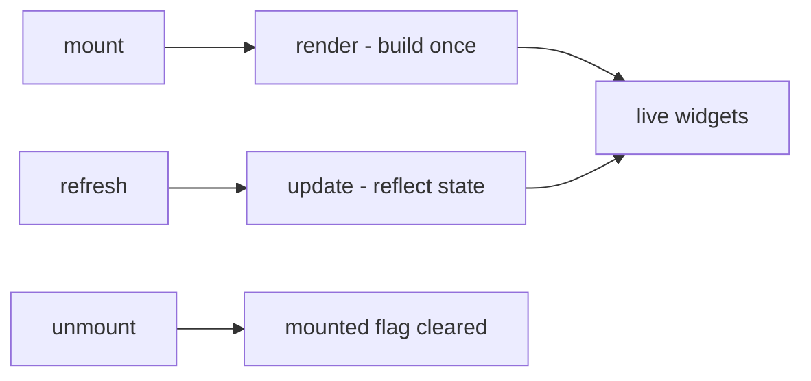
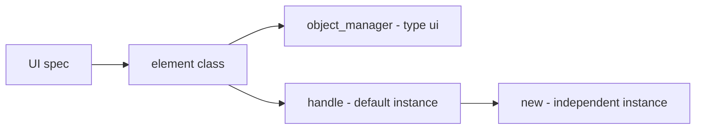
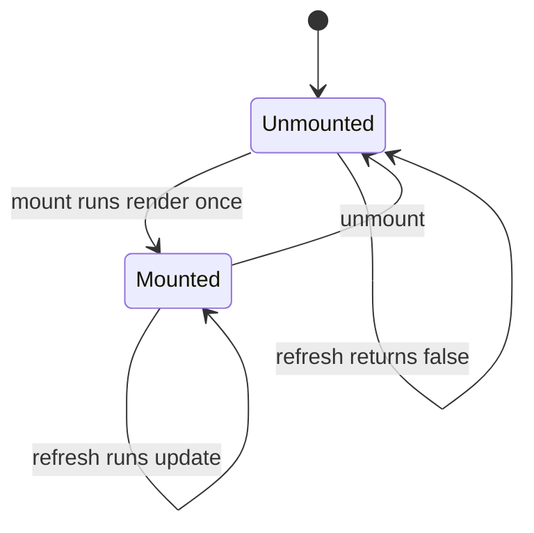
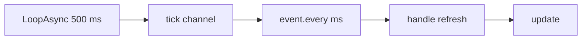

A UI element is something drawn on screen out of Palworld's own native UMG kit. It has the
same shape as every other api module — call `UI{ ... }` to define, `UI.get(id)` /
`UI.get_all()` to look up — with one difference: a UI element is instantiated. Each mounted
copy owns its own widgets and its own state, and `:new{ ... }` is how you get one.

## At a glance

```lua title="content/ui/panel.lua"
local UI = require("palforge.api.ui")   -- or use the global UI installed by palforge.api

local Panel = UI{
    id          = "example:Panel",
    name        = "Example Panel",
    description = "One line of text.",

    render = function(self, root)
        -- build the widget tree under `root`; runs once per mount
    end,

    update = function(self)
        -- reflect changed state into the widgets render already built
    end,
}

local panel = Panel:new{ title = "Hello" }
panel:mount(root)
panel:refresh()
panel:unmount()
```

The other two entry points:

```lua
UI.get("palforge:Button")   -- a handle for an element defined elsewhere; never nil
UI.get_all()                -- every registered element, as a list of handles
```

`UI.Spec` has no `events` field, and the UI domain has no lifecycle channels — nothing in
`core/event` emits a `ui.*` event. The two seams a definition fills are `render` and
`update`; when they run is decided by `mount` / `refresh` / `unmount`, which `api/ui` owns.

## The spec

Everything `UI{ ... }` accepts:

<TypeTable
  type={{
    id: {
      description: 'Element id, e.g. "example:Panel". Must be a non-empty string.',
      type: 'string',
      required: true,
    },
    name: {
      description: 'Human label. Defaults to id.',
      type: 'string',
    },
    description: {
      description: 'One-line description, for UI and tooling.',
      type: 'string',
    },
    render: {
      description: 'fun(self, root) — build the widget tree under root. Runs once per mount.',
      type: 'function',
    },
    update: {
      description: 'fun(self) — refresh the already-built widgets. Runs on each refresh call.',
      type: 'function',
    },
    data: {
      description: 'Default fields shared by every instance of this element.',
      type: 'table',
    },
  }}
/>

Per-element state does **not** go in the spec. It belongs to an instance: pass it to
`:new{ label = "OK", onClick = fn }` and read it as `self.label` inside `render` / `update`.
Use `data` for defaults every instance should share.

The declaration is private to `api/ui`, but readable at runtime through the registry:

```lua
local schema = require("palforge.core.schema")
print(schema.help("UI.Spec"))         -- every field, its type and meaning
schema.get("UI.Spec").fields          -- the same as a table, for tooling
```

## render and update



`render(self, root)` builds this element's widget tree under `root`. It is called exactly
once per mount, by `mount()`. Never call it yourself.

`update(self)` refreshes widgets that `render` already built. It is called by `refresh()`.
Never call it yourself.

The render-once guard lives in `api/ui`, so a concrete element never writes its own:

```lua
-- Class:mount in api/ui.lua
function Class:mount(root)
    if self._mounted then return false end
    self._root = root
    self:render(root)
    self._mounted = true
    return true
end
```

Both default to inert no-ops, so an element can be declaration-only — useful when the id
exists just so other mods can find it through `UI.get`.

```lua
-- valid: registers "example:Marker" with no behaviour at all
UI{ id = "example:Marker", description = "Reserved id, nothing rendered." }
```

Split the work the way the names say. Everything that constructs a widget goes in `render`
and is stored on `self`; everything that writes a new value into an existing widget goes in
`update`:

```lua
local Label = UI{
    id   = "example:Label",
    data = { text = "" },

    render = function(self, root)
        local widget = require("palforge.native.ui._widget")
        self.textWidget = widget.text(root, self.text, 18)
    end,

    update = function(self)
        if not (self.textWidget and self.textWidget:IsValid()) then return end
        pcall(function() self.textWidget:SetText(FText(tostring(self.text))) end)
    end,
}
```

<Callout type="warn">
`mount()` returns `true` when it performed the render call, not when the render succeeded.
The value your `render` returns is discarded, and the element is marked mounted either way.
If you need a retry loop, test the game state yourself rather than trusting `mount`'s return
value — see the counter recipe below.
</Callout>

## Instances and shared data



Defining builds an element class, registers it in `core/object_manager` under
`("ui", id)`, and returns a handle. That handle already carries one instance — the default
one — so the value `UI{ ... }` gives you back is mountable as-is. `:new(props)` makes
another, independent one.

```lua
local Badge = UI{
    id     = "example:Badge",
    data   = { label = "Badge", size = 18 },
    render = function(self, root) end,
}

local a = Badge:new{}                  -- a:state().label == "Badge"  (from data)
local b = Badge:new{ label = "Boss" }  -- b:state().label == "Boss", b:state().size == 18
```

`:new` hands back a handle, not the instance itself: the state lives behind `:state()`,
and `a.label` on the handle is nil. An instance is a plain table whose metatable is the
element class, so a lookup on it falls through in this order:

1. fields you passed to `:new{ ... }`, plus anything `render` / `update` assign to `self`
2. the element's `data` defaults, copied onto the class at define time
3. `render`, `update`, `mount`, `refresh`, `unmount`, `isMounted`

Writing `self.label = "x"` inside `render` sets the field on that one instance; it never
touches the shared `data` default.

Read and write instance state from outside through `:state()`, which returns exactly the
table `self` is inside `render` / `update`:

```lua
local st = a:state()
st.label = "Ready"
a:refresh()             -- nothing does this for you
```

<Callout type="info">
The instance resolves through the element class, so do not use `id`, `name`, `description`,
`render`, `update`, `_mounted`, `_root` or `_refreshSub` as names for your own state — they
already mean something.
</Callout>

`UI.get(id)` wraps the registered class in a **new** handle with a **new** empty instance on
every call, so two `UI.get` calls give you two independently mountable copies:

```lua
local one = UI.get("palforge:Button")
local two = UI.get("palforge:Button")   -- a different instance of the same element
```

For an id that was never defined, `UI.get` still returns a handle — a thin, inert element
whose `render` and `update` do nothing. It is never nil.

## Mount, refresh, unmount



```lua
local panel = Panel:new{ title = "Status" }

panel:mount(root)      -- true: rendered
panel:mount(root)      -- false: already mounted, render is NOT run again
panel:isMounted()      -- true
panel:refresh()        -- true: update() ran
panel:unmount()
panel:refresh()        -- false: not mounted, update() does not run
panel:mount(root)      -- true: renders again from scratch
```

`mount(root)` stores `root` on the instance and hands it straight to `render`. `api/ui`
does nothing else with it — what counts as a valid root is entirely up to the element.
`TitleMenu`, for example, locates its own root when you pass nothing.

`refresh()` is a no-op that returns `false` until the element is mounted, so it is safe to
call from a subscription that outlives the mount.

`unmount()` clears the mounted flag and the stored root, and cancels an `autoRefresh`
subscription if one is installed. A later `mount()` therefore renders again — which is the
point: when the game rebuilds the host UI and drops your widgets, `unmount()` then `mount()`
puts them back.

<Callout type="warn">
`unmount()` does not destroy widgets. It only forgets that this element rendered. If your
element needs teardown — removing a child from a panel, dropping a click handler — do it
yourself before calling `unmount()`, using the widgets you stored on `self` in `render`.
</Callout>

## Driving refresh

<Callout type="warn">
Nothing calls `refresh()` for you. No native "the UI updated" event has been confirmed, so
`api/ui` imposes no async policy at all. You have exactly two honest options: call
`:refresh()` yourself at the moment your state changes, or opt into polling with
`:autoRefresh(ms)`.
</Callout>

Option one — refresh at the source of the change. Precise, no polling cost:

```lua
local event = require("palforge.core.event")

event.on("item.obtain", function(ctx)
    if ctx.itemId ~= "Wood" then return end
    local st = panel:state()
    st.wood = (st.wood or 0) + (ctx.count or 1)
    panel:refresh()
end)
```

Option two — poll. `autoRefresh(ms)` subscribes to `core/event`'s heartbeat via
`event.every`, which accumulates in steps of `event.TICK_MS` (500 ms), so the effective
period rounds up to a multiple of 500 ms. The default is 500.

```lua
panel:mount(root)
panel:autoRefresh()       -- every 500 ms
panel:autoRefresh(2000)   -- no-op: a subscription is already installed, returns true
```



Details that matter:

- A second `autoRefresh` while one is live returns `true` without installing another
  subscription. To change the interval, `unmount()` first, then mount and call it again.
- `unmount()` cancels it.
- It returns `false` if the subscription could not be installed; the whole call is guarded.
- It drives the instance behind that one handle. Another instance of the same element needs
  its own call.

## The Handle

`UI{ ... }`, `UI.get(id)` and `:new(props)` all return a `UI.Handle`.

| Member | Returns | What it does |
| --- | --- | --- |
| `.id` | `string` | the element's id |
| `:new(props)` | `UI.Handle` | a fresh, independently mountable instance; `props` becomes its state |
| `:mount(root)` | `boolean` | render once under `root`; `false` if already mounted |
| `:refresh()` | `boolean` | run `update()`; `false` until mounted |
| `:unmount()` | — | clear the mounted flag and stored root, cancel `autoRefresh` |
| `:isMounted()` | `boolean` | whether `render` has run and `unmount` has not |
| `:autoRefresh(ms)` | `boolean` | poll `refresh()` off the heartbeat; `ms` defaults to 500 |
| `:state()` | `table` | the instance — what `self` is inside `render` / `update` |
| `:name()` | `string` | the element's `name`, or its id |
| `:description()` | `string?` | the element's `description` |

`UI.Class` is the base class every element extends. It holds the lifecycle
(`mount` / `refresh` / `unmount` / `isMounted`) and the two inert seams.

## Native elements

`palforge/native/ui/` defines two elements through this exact api, and both inject into the
real game UI. They build their widget trees with `palforge/native/ui/_widget.lua`, a toolkit
that clones Palworld's own widgets and constructs native UMG panels from Lua.

```lua
local ui = require("palforge.native.ui")
ui.Button                                    -- also require("palforge.native.ui.button")
ui.TitleMenu                                 -- also require("palforge.native.ui.title_menu")

UI.get("palforge:Button")                    -- the same element, a fresh instance
UI.get("palforge:TitleMenu")
```

Both modules return the handle `UI{ ... }` produced — that is the element's default
instance. Call `:new{ ... }` rather than mounting the module value directly, so each use
site gets its own state.

<Callout type="info">
`native/ui/_widget.lua` is the toolkit the native elements use in their `render`. The
leading underscore marks it as internal to `native/ui`; it is not part of the `api/`
surface and carries no stability promise. It is still the only route to building widgets
today, so the recipes below use it.
</Callout>

### Button

`palforge:Button` — one clickable, native-styled button.

```lua
local Button = require("palforge.native.ui.button")

Button:new{
    label   = "Give 10 Wood",
    onClick = function() Item.get("Wood"):give(10) end,
}:mount(hostPanel)
```

Instance fields it reads: `self.label` (defaults to `""`) and `self.onClick`. It stores the
created widget on `self.widget`.

What is live:

- it clones the game's `WBP_Title_MenuButton` through `WidgetBlueprintLibrary.Create`
- it writes `label` into the button's inner `Test_Content` text widget
- it left-aligns the button's inner `HorizontalBox_0` so labels line up regardless of width
- it registers the inner `WBP_PalInvisibleButton` with the shared click router: a single
  `RegisterHook` on `/Script/CommonUI.CommonButtonBase:HandleButtonClicked` that dispatches
  to whichever callback owns the clicked button. The hook is installed lazily, on the first
  registration.

What is not guaranteed: placement. `render` tries `root:AddChildToVerticalBox(btn)` and
falls back to `root:AddChild(btn)`, both guarded. If your root accepts neither, the button
is created and its click is wired, but nothing shows it. `render` also returns `false` when
there is no valid `PalPlayerController` or the widget could not be created — and `mount`
discards that value, so check the screen, not the return.

Button defines no `update`, so `:refresh()` on it runs the inert default and changes
nothing. To relabel it, rebuild it: `unmount()`, set the state, `mount()` again.

### TitleMenu

`palforge:TitleMenu` — injects entries into the game's title screen. Live, on the real
title screen.

```lua
local TitleMenu = require("palforge.native.ui.title_menu")

local menu = TitleMenu:new{
    entries = {
        { label = "Mods",     onClick = function() openMods() end },
        { label = "Settings", onClick = function() openSettings() end },
    },
}
menu:mount()      -- no root: it finds the title screen itself
```

`self.entries` is an array of `{ label = ..., onClick = ... }`. Before it touches a single
entry, `render` resolves three things once and returns `false` if any of them is missing:
the root — the `root` you passed if it is valid, else
`FindFirstOf("PalUITitleBase").WidgetTree.RootWidget` — then `VerticalBox_0` inside it,
which is the title screen's button column, and a valid `PalPlayerController`. For each
entry it then:

1. builds a native menu button, wraps it in a `SizeBox`, and adds it to that column
2. left-aligns the slot and gives it a top and bottom padding of 3, matching the native
   entries
3. moves the parent box of `WBP_Title_MenuButton_ExitGame` to the end of the column, so
   Exit Game stays last — a `VerticalBox` has no insert
4. records the button's invisible click target on the entry as `e.invButton`

`render` returns `true` if at least one entry was injected, and `mount` discards that value
just as it does Button's. TitleMenu defines no `update` either:
`e.invButton` is recorded so a future refresh could tell whether the entry is still alive,
but nothing reads it back yet, and `:refresh()` does nothing today.

Mount it while the title screen exists — that is, before you enter a world. When you leave
the title screen, call `:unmount()` so a later `mount()` injects again.

<Callout type="warn">
There is no world and no player character at the title screen. An entry that calls
`Item.get("Wood"):give(10)` there will fail: `give` goes through the local player's
inventory. Keep title entries to menu actions, and mount `Button` into an in-game panel for
anything that touches gameplay.
</Callout>

## Recipes

### A panel that shows a counter

A one-line panel that counts Wood pickups. `render` builds the text widget once, `update`
writes the current number into it, and the `item.obtain` handler is what moves the state.
The mount target below is the title screen's button column, because that is the one root
`native/ui` shows how to locate; point it at an in-game panel of your own before you expect
the number to move, since `item.obtain` only fires once a world is loaded.

```lua title="content/ui/wood_counter.lua"
local UI     = require("palforge.api.ui")
local event  = require("palforge.core.event")
local widget = require("palforge.native.ui._widget")

local Counter = UI{
    id          = "example:Counter",
    name        = "Counter",
    description = "One line of text showing a running number.",
    data        = { label = "Count", count = 0 },

    -- build once
    render = function(self, root)
        if not (root and root:IsValid()) then return false end
        local text = widget.text(root, self.label .. ": " .. self.count, 18)
        self.textWidget = text
        pcall(function()
            if root.AddChildToVerticalBox then widget.addV(root, text)
            elseif root.AddChild then root:AddChild(text) end
        end)
        return true
    end,

    -- reflect state into the widget render already built
    update = function(self)
        if not (self.textWidget and self.textWidget:IsValid()) then return end
        pcall(function()
            self.textWidget:SetText(FText(self.label .. ": " .. self.count))
        end)
    end,
}

local wood = Counter:new{ label = "Wood", count = 0 }

-- The title screen's button column, located the same way native/ui/title_menu does.
local function titleColumn()
    local base = FindFirstOf("PalUITitleBase")
    if not (base and base:IsValid()) then return nil end
    local rootWidget
    pcall(function() rootWidget = base.WidgetTree.RootWidget end)
    if not (rootWidget and rootWidget:IsValid()) then return nil end
    return widget.findByName(rootWidget, "VerticalBox_0")
end

-- mount() returns true for "render ran", not "render worked", so gate on the game state.
event.every(1000, function()
    if wood:isMounted() then return end
    local column = titleColumn()
    if column then wood:mount(column) end
end)

-- move the state, then refresh: nothing refreshes for you
event.on("item.obtain", function(ctx)
    if ctx.itemId ~= "Wood" then return end
    local st = wood:state()
    st.count = st.count + (ctx.count or 1)
    wood:refresh()
end)
```

The polling variant, when the number comes from something with no event behind it:

```lua
wood:mount(column)
wood:autoRefresh(1000)      -- refresh at most every 1000 ms, off the 500 ms heartbeat

-- update() now reads whatever is current, so the source can be anything
```

### A button wired to give an item

<Tabs items={['Standalone button', 'Title menu entries']}>
<Tab value="Standalone button">

```lua title="content/ui/give_button.lua"
local Button = require("palforge.native.ui.button")
local Item   = require("palforge.api.item")
local log    = require("palforge.utils.log").scope("give-button")

-- One instance per use site: :new gives this button its own label and callback.
local giveWood = Button:new{
    label   = "Give 10 Wood",
    onClick = function()
        local ok = Item.get("Wood"):give(10)
        log.info("gave wood: " .. tostring(ok))
    end,
}

-- `hostPanel` is any widget that accepts children (AddChildToVerticalBox or AddChild).
local function show(hostPanel)
    if giveWood:isMounted() then return end
    giveWood:mount(hostPanel)
end

local function hide()
    giveWood:unmount()   -- forgets the render; the widget itself is yours to remove
end

return { show = show, hide = hide }
```

</Tab>
<Tab value="Title menu entries">

```lua title="content/ui/title_entries.lua"
local TitleMenu = require("palforge.native.ui.title_menu")
local UI        = require("palforge.api.ui")
local event     = require("palforge.core.event")
local log       = require("palforge.utils.log").scope("title")

local menu = TitleMenu:new{
    entries = {
        {
            label   = "PalForge: elements",
            onClick = function()
                for _, el in ipairs(UI.get_all()) do
                    log.info(el.id .. " -> " .. el:name())
                end
            end,
        },
        {
            label   = "PalForge: version",
            onClick = function() log.info(tostring(PalForge.env.version)) end,
        },
    },
}

-- The title screen may not exist yet when this file loads, so retry off the heartbeat.
event.every(1000, function()
    if menu:isMounted() then return end
    local base = FindFirstOf("PalUITitleBase")
    if base and base:IsValid() then menu:mount() end
end)

-- Leaving the title screen drops the widgets; forget the render so a later mount rebuilds.
event.on("world.ready", function() menu:unmount() end)
```

</Tab>
</Tabs>

Both buttons route their clicks through the same hook. Giving items only works with a live
player character, so `Item.get("Wood"):give(10)` belongs on the in-game button, not on a
title entry.

## Errors

Validation is strict and every problem is a hard error — the call never half-succeeds.

```lua
UI{ name = "Panel" }
```

```text
PalForge: UI: field "id" is required (element id, e.g. "pack:Panel")
```

```lua
UI{ id = "example:Panel", onClick = function() end }
```

```text
PalForge: UI: unknown field "onClick". Valid fields: id, name, description, render, update, data
```

`onClick` is instance state, not spec — it goes to `:new{ onClick = ... }`.

```lua
UI{ id = "example:Panel", render = "build" }
```

```text
PalForge: UI: field "render" expects function, got string
```

```lua
UI{ id = "" }
```

```text
PalForge: UI: field "id" is invalid: must be a non-empty string
```

## See also

<Cards>
  <Card title="Item" href="/docs/api/item">
    `:give` / `:take` and the `item.obtain` context a panel counts.
  </Card>
  <Card title="Pal" href="/docs/api/pal">
    The same module shape, with real lifecycle channels behind it.
  </Card>
  <Card title="Lifecycle" href="/docs/concepts/lifecycle">
    The 500 ms heartbeat `autoRefresh` rides on, and every event channel.
  </Card>
</Cards>
